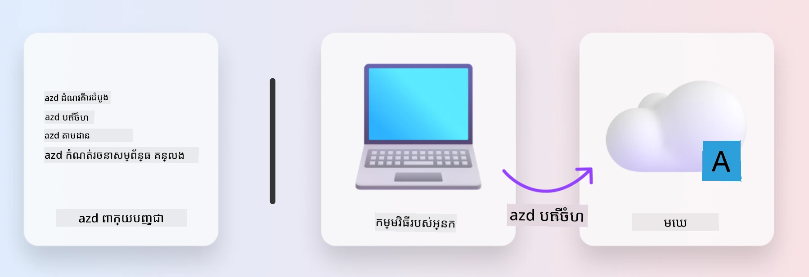
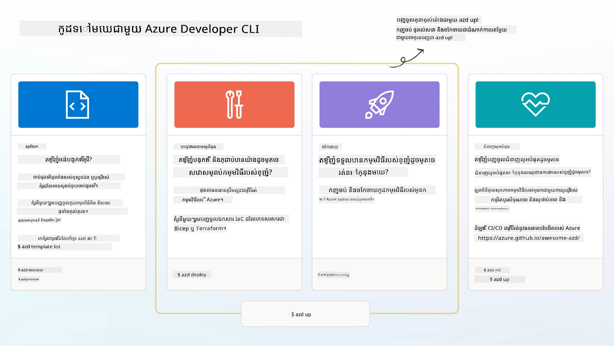

# 1. ជ្រើសរើសគំរូ

!!! tip "នៅចុងម៉ូឌុលនេះ អ្នកនឹងអាច"

    - [ ] ពិពណ៌នា​ថា AZD templates គឺជាអ្វី
    - [ ] រកឃើញ និងប្រើ AZD templates សម្រាប់ AI
    - [ ] ចាប់ផ្តើម​ជាមួយ​គំរូ AI Agents
    - [ ] **Lab 1:** AZD Quickstart នៅក្នុង Codespaces ឬ dev container

---

## 1. ការប្រៀបធៀប​ជាមួយ​អ្នកសាងសង់

ការសាងសង់កម្មវិធី AI សមរម្យសម្រាប់សហគ្រាសទាន់សម័យ ចាប់ពីគ្មានអ្វីអាចធ្វើឱ្យភ័យខ្លាច។ វាប្រៀបបានដូចជាសាងផ្ទះថ្មីដោយខ្លួនឯង ពីឥដ្ឋមួយទៅមួយ។ មែនហើយ វាអាចធ្វើបាន! ប៉ុន្តែ វាមិនមែនជាវិធីដែលមានប្រសិទ្ធភាពបំផុតសម្រាប់ទទួលបានលទ្ធផលចុងក្រោយដែលអ្នកចង់បានទេ។

ជំនួសវិធីនេះ យើងជាញឹកញាប់ចាប់ផ្តើមពី _គំរូរចនាដែលមានរួច_ ហើយធ្វើការជាមួយស្ថាបត្យករ ដើម្បីប្តូរតាមតម្រូវការឯកជន។ នេះគឺជាវិធីសាស្ត្រដែលត្រូវអនុវត្ត​នៅពេលបង្កើតកម្មវិធីឆ្លាត។ ជាដំបូង ស្វែងរករចនាសម្ព័ន្ធល្អមួយដែលសមនឹងវិស័យបញ្ហារបស់អ្នក។ បន្ទាប់មក ធ្វើការជាមួយស្ថាបត្យករដើម្បីប្ដូរនិងអភិវឌ្ឍដំណោះស្រាយសម្រាប់ស្និទិសជាក់លាក់របស់អ្នក។

តែតើយើងអាចស្វែងរកគំរូរចនាខ្លះទាំងនេះបានឯណា? ហើយយើងស្វែងរកស្ថាបត្យករដែលព愿រៀនបង្ហាញយើង ធ្វើការប្ដូរនិងដាក់ឲ្យដំណើរការក្នុងខ្លួនយើងដោយរបៀបណា? ក្នុងវគ្គសិក្សានេះ យើងពន្យល់ចំៗចំពោះសំណួរទាំងនោះ ដោយណែនាំអ្នកអំពីបច្ចេកវិទ្យាត្រីនេះ៖

1. [Azure Developer CLI](https://aka.ms/azd) - ឧបករណ៍ប្រភពបើកដែលជួយលឿនផ្លូវអ្នកអភិវឌ្ឍពីការអភិវឌ្ឍក្នុងស្រុក (build) ទៅការដាក់ប្រតិបត្តិពពក (ship)។
1. [Microsoft Foundry Templates](https://ai.azure.com/templates) - ឃ្លាំងប្រភពបើកដែលមានស្តង់ដា រួមបញ្ចូលកូដគំរូ, ហេដ្ឋារចនាសម្ព័ន្ធ និងឯកសារកំណត់រចនាសម្ព័ន្ធសម្រាប់ដាក់បញ្ចូនស្ថាបត្យកម្មដំណោះស្រាយ AI۔
1. [GitHub Copilot Agent Mode](https://code.visualstudio.com/docs/copilot/chat/chat-agent-mode) - ភ្នាក់ងារសរសេរកូដដែលមានមូលដ្ឋាននៅលើចំណេះដឹង Azure ដែលអាចណែនាំយើងក្នុងការរុករកខ្សែការងារ (codebase) និងធ្វើការកែប្រែមិនប្រើប្រាស់ភាសាបច្ចេកទេសជាធម្មតា។

ជាមួយឧបករណ៍ទាំងនេះ នៅពេលនេះ យើងអាច _ស្វែងរក_ គំរូត្រឹមត្រូវ, _ដាក់ឲ្យដំណើរការ_ ដើម្បីផ្ទៀងផ្ទាត់ថាវាធ្វើការ, និង _ប្ដូរ_ វាឲ្យសមនឹងស្ថានករណីជាក់លាក់របស់យើង។ យើងមកចូលចិត្តរៀនពីរបៀបដំណើរការទាំងនេះ។

---

## 2. Azure Developer CLI

The [Azure Developer CLI](https://learn.microsoft.com/en-us/azure/developer/azure-developer-cli/) (or `azd`) គឺជាឧបករណ៍បញ្ជារលើ commandline ប្រភពបើក ដែលអាចលឿនដំណើរការ code-to-cloud របស់អ្នកជាមួយសំណុំពាក្យបញ្ជាដែលងាយស្រួលសម្រាប់អភិវឌ្ឍ និងដំណើរការ​ត្រូវតែក្នុង IDE (development) និង CI/CD (devops)។

ជាមួយ `azd`, ដំណើរការដាក់បញ្ចូនរបស់អ្នកអាចធ្លាក់តែដូចជា:

- `azd init` - ចាប់ផ្តើមគម្រោង AI ថ្មីពីគំរូ AZD ដែលមានរួច។
- `azd up` - ផ្ដល់ស្ថាបត្យកម្ម និងដាក់កម្មវិធីរបស់អ្នកឲ្យដំណើរការក្នុងជំហានតែមួយ។
- `azd monitor` - ទទួលបានការត្រួតពិនិត្យពេលវេលាពិត និងវិភាគសម្រាប់កម្មវិធីដែលបានដាក់ឲ្យដំណើរការ។
- `azd pipeline config` - កំណត់ CI/CD pipelines ដើម្បីស្វ័យប្រវត្តិសម្រាប់ការដាក់បញ្ចូនទៅ Azure។

**🎯 | EXERCISE**: <br/> ស្វែងយល់អំពីឧបករណ៍ `azd` នៅបរិយាកាសសិក្សាឥឡូវនេះ។ វាអាចជាកន្លែង GitHub Codespaces, dev container, ឬកាកុងឡូនក្នុងកុំព្យូទ័រមានការដំឡើងលក្ខខណ្ឌមុន។ ចាប់ផ្តើមដោយវាយពាក្យបញ្ជាដូចខាងក្រោម ដើម្បីមើលថាឧបករណ៍នេះអាចធ្វើអ្វីបានខ្លះ៖

```bash title="" linenums="0"
azd help
```



---

## 3. The AZD Template

For `azd` ដើម្បីធ្វើអត្ថប្រយោជន៍នេះ វាត្រូវដឹងពីហេដ្ឋារចនាសម្ព័ន្ធដែលត្រូវផ្ដល់, ការកំណត់រចនាសម្ព័ន្ធដែលត្រូវអនុវត្ត, និងកម្មវិធីដែលត្រូវដាក់។ នេះជាកន្លែងដែល [AZD templates](https://learn.microsoft.com/en-us/azure/developer/azure-developer-cli/azd-templates?tabs=csharp) ចូលមក។

AZD templates គឺជា repository ប្រភពបើកដែលបញ្ចូលកូដគំរូ ជាមួយឯកសារហេដ្ឋារចនាសម្ព័ន្ធ និងឯកសារកំណត់រចនាសម្ព័ន្ធដែលចាំបាច់សម្រាប់ដាក់ស្ថាបត្យកម្មដំណោះស្រាយ។ ដោយប្រើវិធីសាស្ត្រ _Infrastructure-as-Code_ (IaC), វាអនុញ្ញាតឱ្យការបញ្ជាក់ធនធានក្នុងគំរូ និងការកំណត់រចនាសម្ព័ន្ធត្រូវបានគ្រប់គ្រងជាមួយប្រព័ន្ធគ្រប់គ្រងកំណែ (ដូចដូចជាកូដកម្មវិធី) - បង្កើតផ្លូវការដែលអាចជាការប្រើឡើងវិញ និងមានភាពស្របគ្នាចំពោះអ្នកប្រើប្រាស់គម្រោងនោះ។

ពេលបង្កើត ឬប្រើឡើងវិញ AZD template សម្រាប់ស្ថានការណ៍ _របស់អ្នក_ សូមពិចារណាសំណួរទាំងនេះ៖

1. តើអ្នកកំពុងសាងសង់អ្វី? → តើមានគំរូណាមួយដែលមានកូដចាប់ផ្តើមសម្រាប់ស្ថានការណ៍នោះទេ?
1. តើដំណោះស្រាយរបស់អ្នករចនាដូចម្តេច? → តើមានគំរូណាមួយដែលមានធនធានចាំបាច់ទេ?
1. តើដំណោះស្រាយរបស់អ្នកត្រូវដាក់យ៉ាងដូចម្តេច? → សូមគិតពី `azd deploy` ជាមួយ pre/post-processing hooks!
1. តើអ្នកអាចបង្កើតប្រសិទ្ធភាពបន្ថែមយ៉ាងដូចម្តេច? → សូមគិតពីការត្រួតពិនិត្យ និងស្វ័យប្រវត្តិដែលបានបញ្ចូលរួម!

**🎯 | EXERCISE**: <br/> ទស្សនាកាលារូប [Awesome AZD](https://azure.github.io/awesome-azd/) ហើយប្រើ filter ដើម្បីស្វែងរកក្នុងចំណោម 250+ គំរូដែលមានស្រាប់។ ពិនិត្យមើលថាតើអ្នកអាចរកបានគំរូណាមួយដែលសមនឹងតម្រូវការស្ថានការណ៍ _របស់អ្នក_ ឬអត់។



---

## 4. គំរូកម្មវិធី AI

សម្រាប់កម្មវិធីដែលមាន AI ជាថាមពល Microsoft ផ្តល់ឲ្យគំរូពិសេសដែលមាន **Microsoft Foundry** និង **Foundry Agents**។ គំរូទាំងនេះជួយលឿនផ្លូវការសាងសង់កម្មវិធីឆ្លាតដែលសាកសមសម្រាប់ផលិតកម្ម។

### គំរូ Microsoft Foundry និង Foundry Agents

ជ្រើសគំរូខាងក្រោមដើម្បីដាក់ឲ្យដំណើរការ។ គំរូនីមួយៗអាចរកបានលើ [Awesome AZD](https://azure.github.io/awesome-azd/) និងអាចចាប់ផ្តើមដោយពាក្យបញ្ជាតែមួយ។

| Template | ពណ៌នា | ពាក្យបញ្ជាដាក់ឲ្យដំណើរការ |
|----------|-------------|----------------|
| **[AI Chat with RAG](https://azure.github.io/awesome-azd/?tags=ai&tags=rag)** | កម្មវិធីជជែកដែលប្រើ Retrieval Augmented Generation (RAG) ដោយប្រើ Microsoft Foundry | `azd init -t azure-samples/azure-search-openai-demo` |
| **[Foundry Agent Service Starter](https://azure.github.io/awesome-azd/?tags=ai&tags=agents)** | សាងសង់ភ្នាក់ងារ AI ជាមួយ Foundry Agents សម្រាប់ការប្រតិបត្តិការ​ឯករាជ្យ | `azd init -t azure-samples/foundry-agent-service-starter` |
| **[Multi-Agent Orchestration](https://azure.github.io/awesome-azd/?tags=ai&tags=agents)** | សម្របសម្រួលភ្នាក់ងារច្រើន Foundry សម្រាប់វដ្តការងារលំបាក | `azd init -t azure-samples/multi-agent-orchestration` |
| **[AI Document Intelligence](https://azure.github.io/awesome-azd/?tags=ai&tags=document)** | ទាញយក និងវិភាគឯកសារ​ដោយប្រើម៉ូដែល Microsoft Foundry | `azd init -t azure-samples/ai-document-processing` |
| **[Conversational AI Bot](https://azure.github.io/awesome-azd/?tags=ai&tags=bot)** | សាងសង់បូតជជែកឆ្លាតជាមួយការរួមបញ្ចូល Microsoft Foundry | `azd init -t azure-samples/ai-chat-protocol` |
| **[AI Image Generation](https://azure.github.io/awesome-azd/?tags=ai&tags=dalle)** | បង្កើតរូបភាពដោយប្រើ DALL-E តាម Microsoft Foundry | `azd init -t azure-samples/ai-image-generation` |
| **[Semantic Kernel Agent](https://azure.github.io/awesome-azd/?tags=ai&tags=semantic-kernel)** | ភ្នាក់ងារ AI ប្រើ Semantic Kernel ជាមួយ Foundry Agents | `azd init -t azure-samples/semantic-kernel-agent` |
| **[AutoGen Multi-Agent](https://azure.github.io/awesome-azd/?tags=ai&tags=autogen)** | ប្រព័ន្ធភ្នាក់ងារច្រើនប្រើ AutoGen framework | `azd init -t azure-samples/autogen-multi-agent` |

### ចាប់ផ្តើមរហ័ស

1. **រុករកគំរូ**: ទស្សនា [https://azure.github.io/awesome-azd/](https://azure.github.io/awesome-azd/) និងជ្រើសតម្រៀបដោយ `AI`, `Agents`, ឬ `Microsoft Foundry`
2. **ជ្រើសគំរូរបស់អ្នក**: ជ្រើសមួយដែលសមនឹងករណីប្រើប្រាស់របស់អ្នក
3. **ចាប់ផ្តើម**: បើក `azd init` សម្រាប់គំរូដែលបានជ្រើស
4. **ដាក់ឲ្យដំណើរការ**: រត់ `azd up` ដើម្បីផ្ដល់ស្ថាបត្យកម្ម និងដាក់ប្រតិបត្តិការ

**🎯 | EXERCISE**: <br/>
ជ្រើសមួយក្នុងចំណោមគំរូខាងលើដោយផ្អែកលើស្ថានការណ៍របស់អ្នក:

- **កំពុងសង់ប៊ូតជជែក?** → ចាប់ផ្តើមជាមួយ **AI Chat with RAG** ឬ **Conversational AI Bot**
- **ត្រូវការភ្នាក់ងារឯករាជ្យ?** → សាកល្បង **Foundry Agent Service Starter** ឬ **Multi-Agent Orchestration**
- **កំពុងដំណើរការឯកសារ?** → ប្រើ **AI Document Intelligence**
- **ចង់បានជំនួយកូដ AI?** → ស្វែងយល់ **Semantic Kernel Agent** ឬ **AutoGen Multi-Agent**

```bash title="Example: Deploy the AI Chat with RAG template" linenums="0"
azd init -t azure-samples/azure-search-openai-demo
azd up
```

!!! info "ស្វែងរកគំរូបន្ថែម"
    The [Awesome AZD Gallery](https://azure.github.io/awesome-azd/) មានជាង 250 គំរូ។ ប្រើ filters ដើម្បីស្វែងរកគំរូដែលបំពេញតាមតម្រូវការរបស់អ្នកសម្រាប់ភាសា, ស៊ុម្ពគ្រឹះ (framework), និងសេវាកម្ម Azure។

---

<!-- CO-OP TRANSLATOR DISCLAIMER START -->
**ការដកខ្លួនពីការទទួលខុសត្រូវ**:
ឯកសារនេះត្រូវបានបកប្រែដោយប្រើសេវាកម្មបកប្រែ AI [Co-op Translator](https://github.com/Azure/co-op-translator). ទោះយើងខិតខំក្នុងការរក្សាភាពត្រឹមត្រូវ សូមយល់ថាការបកប្រែដោយប្រព័ន្ធស្វ័យប្រវត្តិក៏អាចមានកំហុស ឬមានភាពមិនត្រឹមត្រូវ។ ឯកសារដើមនៅក្នុងភាសាម្ចាស់ដើមគួរត្រូវបានទុកជា​ប្រភព​ស្បថ​ដែលមានអំណាច។ សម្រាប់ព័ត៌មានសំខាន់ៗ យើងសូមណែនាំឱ្យប្រើការបកប្រែដោយអ្នកបកប្រែវិជ្ជាជីវៈ។ យើងមិនទទួលខុសត្រូវចំពោះការយល់ច្រឡំ ឬការបកស្រាយខុសណាមួយ ដែលកើតឡើងពីការប្រើប្រាស់ការបកប្រែនេះទេ។
<!-- CO-OP TRANSLATOR DISCLAIMER END -->