# 2. ផ្ទៀងផ្ទាត់ទម្រង់(Template)

> បានផ្ទៀងផ្ទាត់ប្រឆាំងនឹង `azd 1.23.12` ក្នុងខែមីនា 2026។

!!! tip "នៅចុងម៉ូឌុលនេះ អ្នកនឹងអាច"

    - [ ] វិភាគស្ថាបត្យកម្មដំណោះស្រាយ AI
    - [ ] យល់ដឹងអំពីលំហូរអនុវត្តន៍ការចេញផ្សាយ AZD
    - [ ] ប្រើ GitHub Copilot ដើម្បីទទួលបានជំនួយអំពីការប្រើប្រាស់ AZD
    - [ ] **Lab 2:** បង្ហោះ និង ផ្ទៀងផ្ទាត់ទម្រង់ AI Agents

---


## 1. ការណែនាំ

[Azure Developer CLI](https://learn.microsoft.com/en-us/azure/developer/azure-developer-cli/) ឬ `azd` គឺជាឧបករណ៍បន្ទាត់បញ្ជាផ្លូវបើក ដែលធ្វើឱ្យលំហូរពិដានអ្នកអភិវឌ្ឍកាន់តែងាយស្រួលពេលកំពុងបង្កើត និងចេញផ្សាយកម្មវិធីទៅ Azure។

[AZD Templates](https://learn.microsoft.com/azure/developer/azure-developer-cli/azd-templates) គឺជាគុកដែលមានស្តង់ដារ មួយដែលរួមបញ្ចូលកូដកម្មវិធីគំរូ ទ្រព្យសម្បត្តិក្នុងរូបភាព _infrastructure-as-code_ និងឯកសារកំណត់រចនាសម្ព័ន្ធ `azd` សម្រាប់ស្ថាបត្យកម្មដំណោះស្រាយដែលរួមគ្នា។ ការផ្តល់ឧបករណ៍រចនាសម្ព័ន្ធក្លាយទៅជារឿងងាយដូចការប្រើបញ្ជា `azd provision` — ខណៈពេលដែលការប្រើ `azd up` អនុញ្ញាតឱ្យអ្នកផ្តល់ឧបករណ៍រចនាសម្ព័ន្ធ **និង** បង្ហោះកម្មវិធីរបស់អ្នកក្នុងលើកតែមួយ!

ដូចនេះ ការចាប់ផ្តើមដំណើរការអភិវឌ្ឍកម្មវិធីអាចងាយស្រួលដូចការស្វែងរក _AZD Starter template_ ដែលស្រដៀងនឹងតម្រូវការកម្មវិធី និងសំណុំរចនាសម្ព័ន្ធរបស់អ្នក — ហើយបន្ទាប់មកកែសម្រួលគុកដើម្បីឲ្យសមស្របនឹងស្ថានការណ៍របស់អ្នក។

មុនពេលយើងចាប់ផ្តើម មកធ្វើការត្រួតពិនិត្យថាអ្នកបានដំឡើង Azure Developer CLI រួច។

1. បើក terminal ក្នុង VS Code ហើយវាយបញ្ជានេះ:

      ```bash title="" linenums="0"
      azd version
      ```

1. អ្នកគួរតែឃើញអ្វីប្រហែលនេះ!

      ```bash title="" linenums="0"
      azd version 1.23.12 (commit <current-build>)
      ```

**ឥឡូវនេះ អ្នកបានរៀបចំរួចសម្រាប់ជ្រើស និងបង្ហោះទម្រង់ជាមួយ azd**

---

## 2. ជម្រើសទម្រង់

វេទិកា Microsoft Foundry មកជាមួយ [ជុំទម្រង់ AZD ដែលបានផ្ដល់អនុសាសន៍](https://learn.microsoft.com/en-us/azure/ai-foundry/how-to/develop/ai-template-get-started) ដែលគ្របដណ្តប់សេណារីយ៉ូនដោះស្រាយពេញនិយមដូចជា _ស្វ័យប្រវត្តចរន្តការងារជាមួយភ្នាក់ងារច្រើន_ និង _ការចាប់យក និងដោះស្រាយមាតិកាពហុ​របៀប_។ អ្នកក៏អាចរកឃើញទម្រង់ទាំងនេះដោយចូលទៅកាន់ស្វយបក Microsoft Foundry ផងដែរ។

1. ចូលទៅកាន់ [https://ai.azure.com/templates](https://ai.azure.com/templates)
1. ចូលក្នុង Microsoft Foundry portal ពេលមានការស្នើសុំ - អ្នកនឹងឃើញអ្វីប្រហែលនេះ។

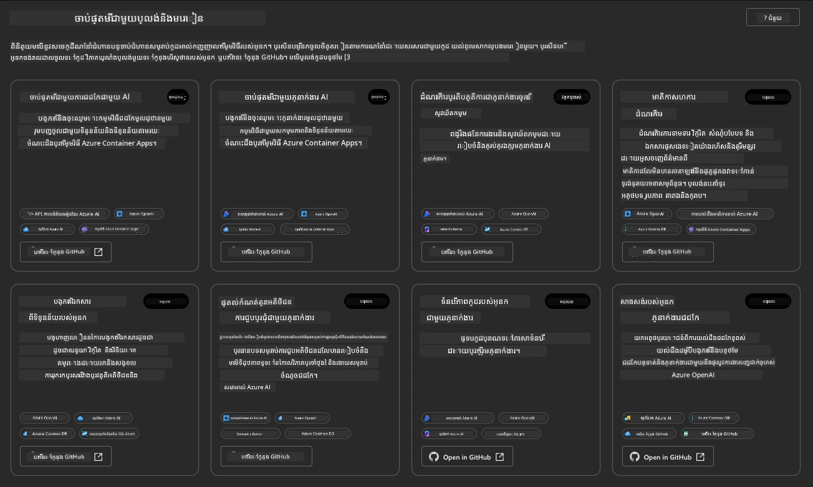


ជម្រើស **Basic** គឺជាទម្រង់ចាប់ផ្តើមរបស់អ្នក៖

1. [ ] [Get Started with AI Chat](https://github.com/Azure-Samples/get-started-with-ai-chat) ដែលបង្ហោះកម្មវិធី chat មូលដ្ឋានមួយ _ជាមួយទិន្នន័យរបស់អ្នក_ ទៅ Azure Container Apps។ ប្រើរឿងនេះដើម្បីស្វែងយល់ពីសេណារីយ៉ុង chatbot AI មូលដ្ឋាន។
1. [X] [Get Started with AI Agents](https://github.com/Azure-Samples/get-started-with-ai-agents) ដែលក៏បង្ហោះ Agent AI ស្តង់ដារមួយ (ជាមួយ Foundry Agents) ។ ប្រើវាដើម្បីស្ទាត់ជំនាញជាមួយដំណោះស្រាយ agentic AI ដែលពាក់ព័ន្ធ​នឹងឧបករណ៍ និងម៉ូឌែល។

ចូលទៅតំណទីពីរ​នៅក្នុងតាប់ប៊ាក់ប្រោស័រ (ឬចុច `Open in GitHub` សម្រាប់កាតដែលទាក់ទង)។ អ្នកគួរតែឃើញឃ្លីបកូដសម្រាប់ AZD Template នេះ។ ចំណាយពេលមួយនាទីសិក្សា README។ ស្ថាបត្យកម្មកម្មវិធីមានរូបរាងដូចខាងក្រោម៖

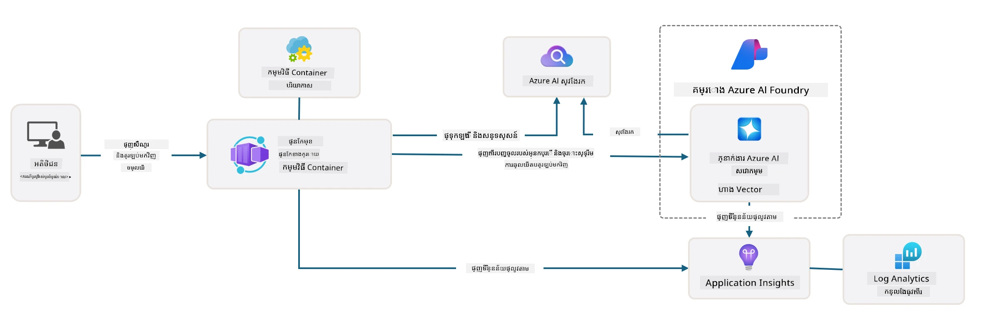

---

## 3. ការបើកប្រើទម្រង់

សូមព្យាយាមបង្ហោះទម្រង់នេះ និងធ្វើការផ្ទៀងផ្ទាត់ថាវាត្រឹមត្រូវ។ យើងនឹងអនុវត្តតាមអានុសាសន៍ក្នុងផ្នែក [Getting Started](https://github.com/Azure-Samples/get-started-with-ai-agents?tab=readme-ov-file#getting-started) ។

1. ជ្រើសបរិបទធ្វើការសម្រាប់គុកទម្រង់៖

      - **GitHub Codespaces**: ចុច [this link](https://github.com/codespaces/new/Azure-Samples/get-started-with-ai-agents) ហើយបញ្ជាក់ `Create codespace`
      - **Local clone or dev container**: វាយបញ្ជា Clone `Azure-Samples/get-started-with-ai-agents` ហើយបើកវា​ក្នុង VS Code

1. រង់ចាំរហូតដល់ terminal ក្នុង VS Code ត្រេកទទេ រួចវាយបញ្ជាខាងក្រោម៖

   ```bash title="" linenums="0"
   azd up
   ```

បញ្ចប់ជំហានលំហូរដែលវានឹងចេញទាត់៖

1. វានឹងស្នើឱ្យអ្នកចូលទៅ Azure - តាមដានការណែនាំដើម្បីអះអាង
1. បញ្ចូលឈ្មោះបរិស្ថានមួយដែលមានតែមួយសម្រាប់អ្នក - ឧ. ខ្ញុំបានប្រើ `nitya-mshack-azd`
1. វានឹងបង្កើតថត `.azure/` - អ្នកនឹងឃើញថាថតរងជាមួយឈ្មោះenv
1. វានឹងស្នើឲ្យជ្រើសឈ្មោះសុពលភាព(Subscription) - ជ្រើសលំនាំដើម
1. វានឹងស្នើសុំទីតាំង - ប្រើ `East US 2`

ឥឡូវនេះ រង់ចាំសម្រាប់ការផ្តល់ធនធានឲ្យបានសម្រេច។ **នេះចំណាយពេល 10-15 នាទី**

1. នៅពេលបញ្ចប់ កុងសូលរបស់អ្នក នឹងបង្ហាញសារ SUCCESS បែបនេះ៖
      ```bash title="" linenums="0"
      SUCCESS: Your up workflow to provision and deploy to Azure completed in 10 minutes 17 seconds.
      ```
1. Your Azure Portal will now have a provisioned resource group with that env name:

      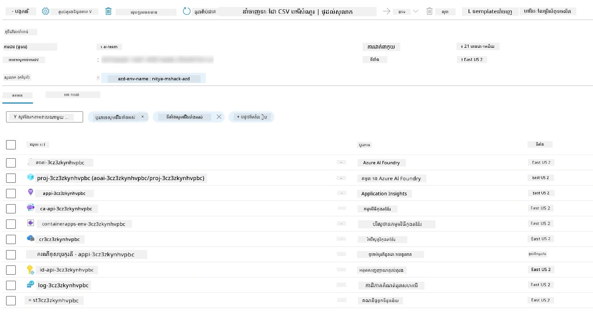

1. **ឥឡូវនេះ អ្នកបានរួចរាល់សម្រាប់ផ្ទៀងផ្ទាត់រចនាសម្ព័ន្ធ និងកម្មវិធីដែលបានបង្ហោះ**។

---

## 4. ផ្ទៀងផ្ទាត់ទម្រង់

1. ចូលទៅទំព័រ Azure Portal [ក្រុមធនធាន](https://portal.azure.com/#browse/resourcegroups) - ចូលប្រើប្រាស់ពេលត្រូវការ
1. ចុចលើ RG សម្រាប់ឈ្មោះបរិស្ថានរបស់អ្នក - អ្នកនឹងឃើញទំព័រដូចខាងលើ

      - ចុចលើធនធាន Azure Container Apps
      - ចុចលើ Application Url ក្នុងផ្នែក _Essentials_ (ខាងលើស្តាំ)

1. អ្នកគួរតែឃើញផ្ទាល់មុខប្រព័ន្ធ UI កម្មវិធីដែលផ្ទុកដូចនេះ៖

   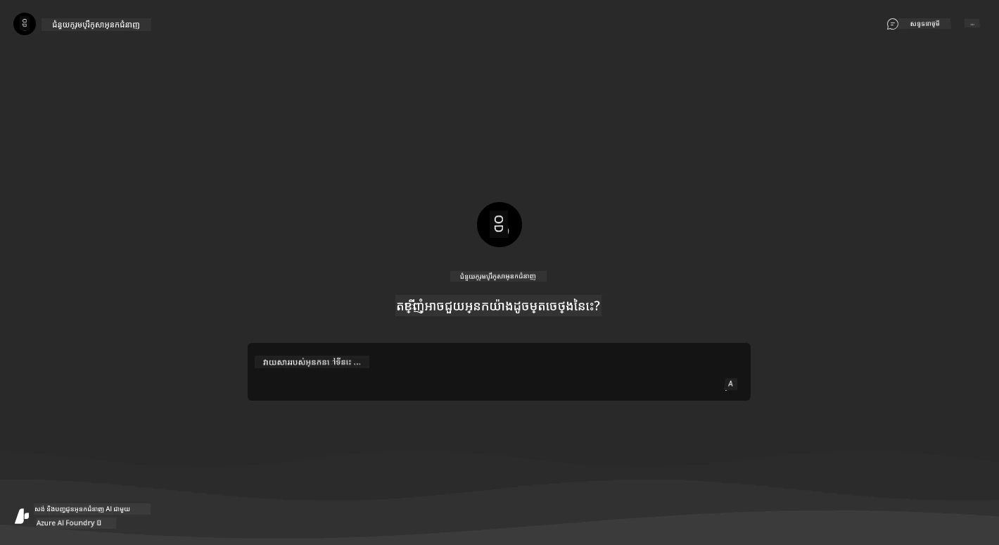

1. សាកសួរពីសំណួរគំរូពីរបីដែលមានក្នុង [sample questions](https://github.com/Azure-Samples/get-started-with-ai-agents/blob/main/docs/sample_questions.md)

      1. សួរ៖ ```តើរាជធានីនៃប្រទេសបារាំងគឺអ្វី?``` 
      1. សួរ៖ ```តើតង់ល្អបំផុតក្រោម $200 សម្រាប់មនុស្សពីរនាក់មានអ្វីខ្លះ ហើយវារួមបញ្ចូលលក្ខណៈពិសេសអ្វីខ្លះ?```

1. អ្នកគួរតែទទួលបានចម្លើយស្រដៀងនឹងដែលបង្ហាញខាងក្រោម។ _តែនៅតើយ៉ាងដូចម្តេចដែលវាដំណើរការ?_ 

      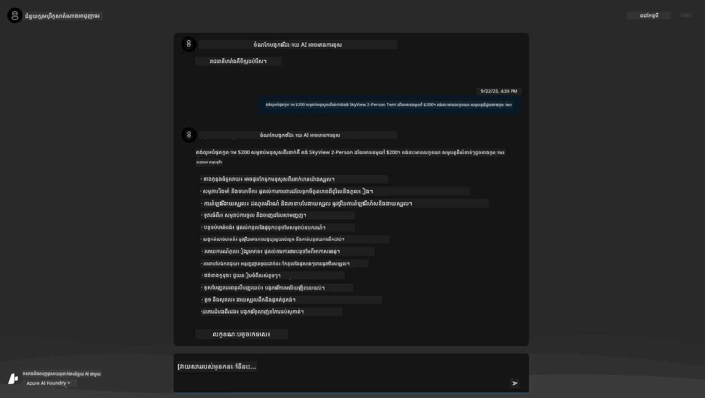

---

## 5. ផ្ទៀងផ្ទាត់ Agent

Azure Container App បានបង្ហោះ endpoint មួយដែលភ្ជាប់ទៅកាន់ AI Agent ដែលបានផ្តល់នៅក្នុងគម្រោង Microsoft Foundry សម្រាប់ទម្រង់នេះ។ មកមើលអ្វីដែលមានន័យ។

1. ត្រឡប់ទៅទំព័រ _Overview_ ក្នុង Azure Portal សម្រាប់ក្រុមធនធានរបស់អ្នក

1. ចុចលើធនធាន `Microsoft Foundry` ក្នុងបញ្ជីនោះ

1. អ្នកគួរតែឃើញនេះ។ ចុចប៊ូតុង `Go to Microsoft Foundry Portal`។ 
   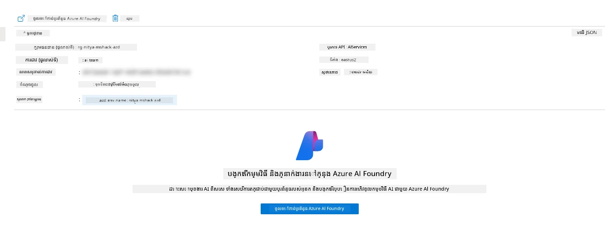

1. អ្នកគួរតែឃើញទំព័រ Foundry Project សម្រាប់កម្មវិធី AI របស់អ្នក
   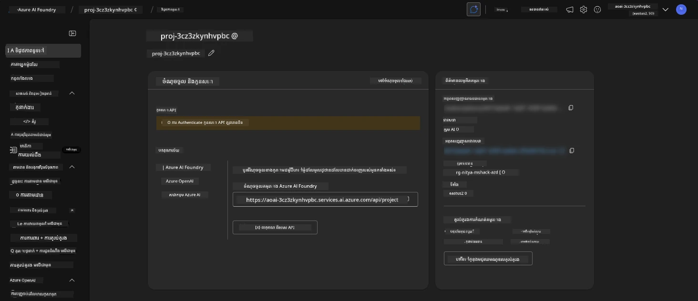

1. ចុចលើ `Agents` - អ្នកនឹងឃើញ Agent លំនាំដើមដែលបានផ្តល់ក្នុងគម្រោង
   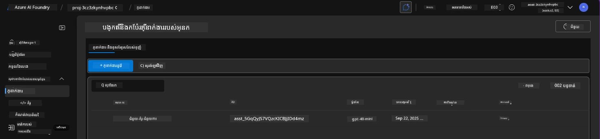

1. ជ្រើសវា - ហើយអ្នកនឹងឃើញព័ត៌មានលម្អិតរបស់ Agent។ សូមកត់សម្គាល់៖

      - ភ្នាក់ងារ​ប្រើ File Search ជាលំនាំដើម (always)
      - ភ្នាក់ងារ `Knowledge` បង្ហាញថាវាមានឯកសារ 32 ឯកសារដែលបានផ្ទុកឡើង (សម្រាប់ File Search)
      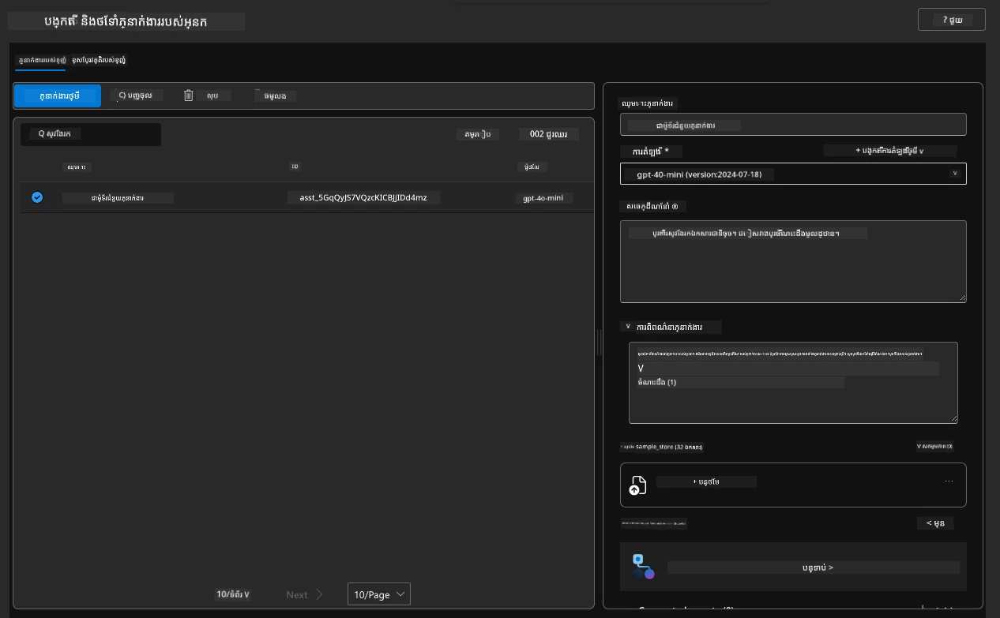

1. ស្វែងរកជម្រើស `Data+indexes` នៅក្នុងម៉ឺនុយខាងឆ្វេង ហើយចុចសម្រាប់ព័ត៌មានលម្អិត។ 

      - អ្នកគួរតែឃើញឯកសារទិន្នន័យ 32 ឯកសារ ដែលបានផ្ទុកឡើងសម្រាប់ចំណេះដឹង។
      - ឯកសារទាំងនេះនឹងត្រូវស្របនឹងឯកសារកាន់តែច្រើន 12 ឯកសារអតិថិជន និង 20 ឯកសារផលិតផល នៅក្រោម `src/files`
      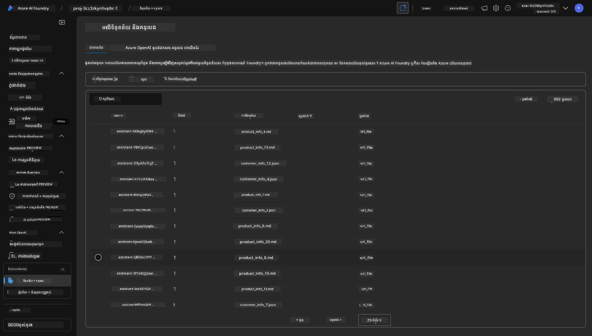

**អ្នកបានផ្ទៀងផ្ទាត់ប្រតិបត្តិការរបស់ Agent រួចហើយ!**

1. ចម្លើយរបស់ agent ត្រូវបានឧបសគ្គដោយចំណេះដឹងក្នុងឯកសារទquelas។
1. អ្នកអាចសួរប្រកួតបទពាក់ព័ន្ធនឹងទិន្នន័យនោះ ហើយទទួលបានចម្លើយដែលមានមូលដ្ឋាន។
1. ឧទាហរណ៍៖ `customer_info_10.json` ពណ៌នាអំពីការទិញចំនួន 3 ដែល "Amanda Perez" បានធ្វើ។

ត្រឡប់ទៅទំព័រប្រោស័រដែលមាន endpoint របស់ Container App និងសួរ៖ `What products does Amanda Perez own?`។ អ្នកគួរតែឃើញអ្វីប្រហែលនេះ៖

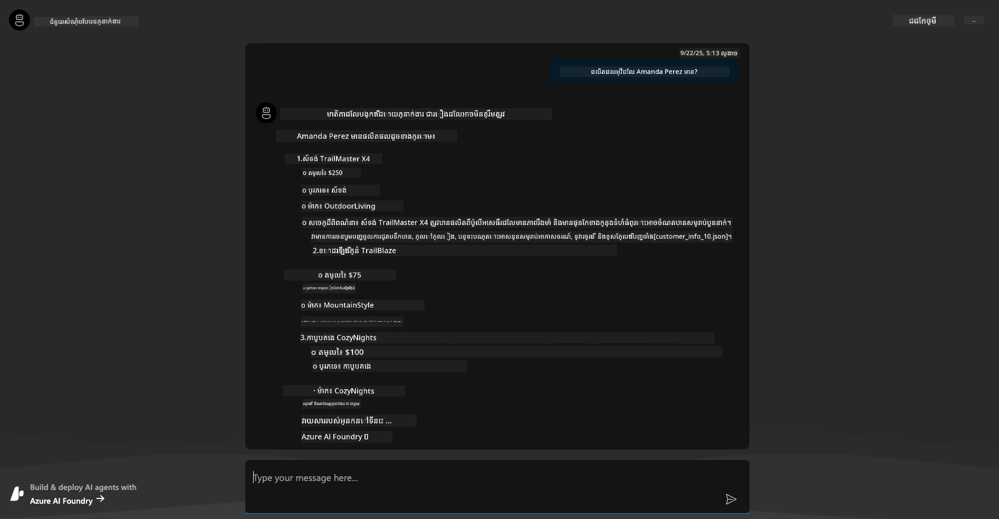

---

## 6. Agent Playground

ចាំបន្តិចដើម្បីសាងទេពកោសល្យបន្ថែមសម្រាប់សមត្ថភាពរបស់ Microsoft Foundry ដោយយក Agent មួយទៅលេងនៅក្នុង Agents Playground។

1. ត្រឡប់ទៅទំព័រ `Agents` ក្នុង Microsoft Foundry - ជ្រើស Agent លំនាំដើម
1. ចុចជម្រើស `Try in Playground` - អ្នកគួរតែទទួលបាន UI Playground ដូចនេះ
1. សួរអត្យាស្នាដូចគ្នា៖ `What products does Amanda Perez own?`

    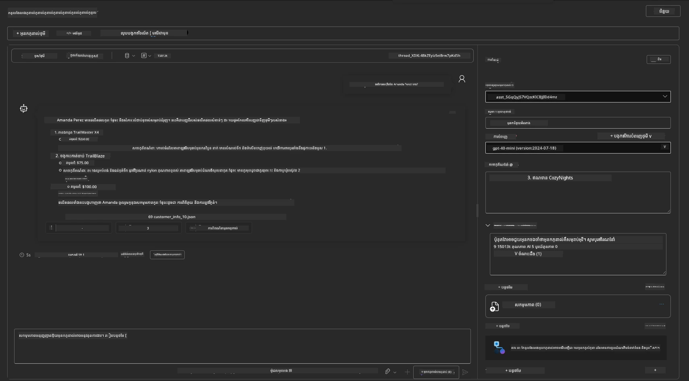

អ្នកនឹងទទួលបានចម្លើយដូចគ្នា (ឬស្រដៀង) — ប៉ុន្តែអ្នកក៏បានទទួលព័ត៌មានបន្ថែមដែលអាចជួយឱ្យយល់ពីគុណភាព ថ្លៃដើម និងសមត្ថភាពរបស់កម្មវិធី agentic របស់អ្នក។ ឧទាហរណ៍៖

1. ចំណាំថាចម្លើយយោងឯកសារទិន្នន័យដែលប្រើដើម្បី "ដាក់មូលដ្ឋាន" លើចម្លើយ
1. ដាក់មៀលលើស្លាកឯកសារណាមួយ - តើទិន្នន័យត្រូវគ្នានឹងសំណួររបស់អ្នក និងចម្លើយដែលបង្ហាញទេ?

អ្នកក៏ឃើញជួរតុភាគី _stats_ ខាងក្រោមចម្លើយផងដែរ។

1. ដាក់មៀលលើជាតុលភាពណាមួយ - ឧ. Safety។ អ្នកនឹងឃើញអ្វីប្រហែលនេះ
1. តម្លៃដែលបានវាយតម្លៃតើវានឹងផ្គូផ្គងជាមួយអារម្មណ៍របស់អ្នកចំពោះកម្រិតសុវត្ថិភាពនៃចម្លើយទេ?

      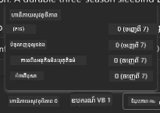

---

## 7. ការសង្កេតមើលដែលបានសាងសង់រួច (Built-in Observability)

Observability គឺពាក់ព័ន្ធនឹងការតំឡើងឧបករណ៍ក្នុងកម្មវិធីរបស់អ្នកដើម្បីបង្កើតទិន្នន័យដែលអាចប្រើសម្រាប់យល់ដឹង ពិនិត្យកំហុស និងអភិវឌ្ឍពង្រីកប្រតិបត្តិការ។ ដើម្បីទទួលបានអារម្មណ៍លើរឿងនេះ៖

1. ចុចប៊ូតុង `View Run Info` - អ្នកគួរតែឃើញទិដ្ឋភាពនេះ។ នេះគឺជាគំរូនៃ [Agent tracing](https://learn.microsoft.com/en-us/azure/ai-foundry/how-to/develop/trace-agents-sdk#view-trace-results-in-the-azure-ai-foundry-agents-playground) នៅក្នុងសកម្មភាព។ _អ្នកក៏អាចទទួលបានទិដ្ឋភាពនេះដោយចុច Thread Logs ក្នុងម៉ឺនុយកំពូល_។

   - ទទួលបានអារម្មណ៍អំពីជំហានរត់ និងឧបករណ៍ដែល agent បានចូលប្រើ
   - យល់ពីចំនួន Token សរុប (ប្រៀបធៀបជាមួយការប្រើ token ចេញ) សម្រាប់ចម្លើយ
   - យល់ពីភាពយឺត និងកន្លែងដែលពេលវេលាត្រូវបានចំណាយក្នុងការប្រតិបត្តិ

      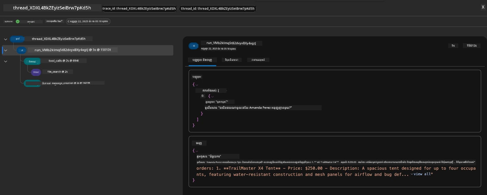

1. ចុចផ្ទាំង `Metadata` ដើម្បីមើលលក្ខណៈបន្ថែមសម្រាប់រត់នេះ ដែលអាចផ្តល់បរិបទមានប្រយោជន៍សម្រាប់ដោះស្រាយបញ្ហា​នៅពេលក្រោយ។   

      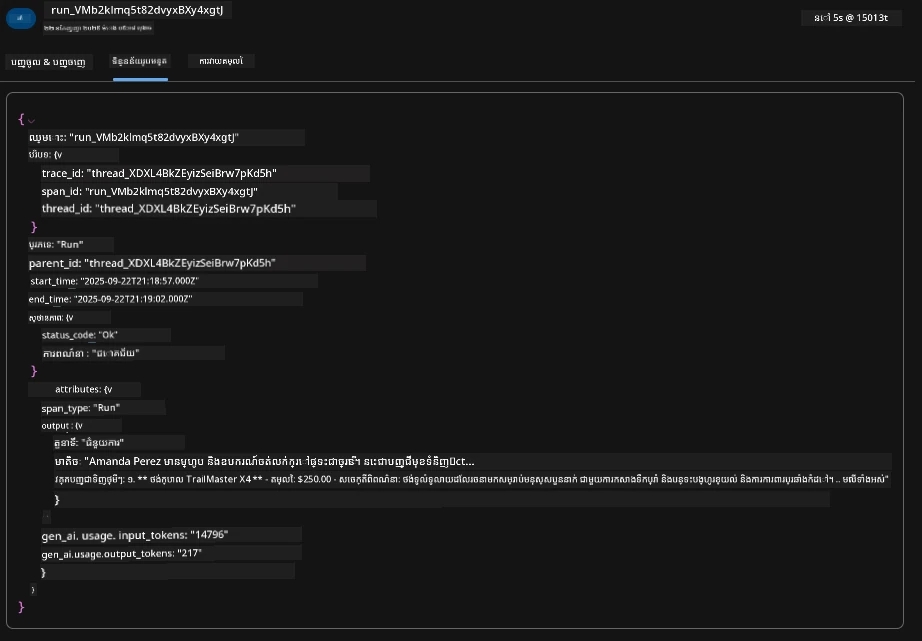


1. ចុចផ្ទាំង `Evaluations` ដើម្បីមើលការវាយតម្លៃស្វ័យប្រវត្តិនៅលើចម្លើយ agent។ វាអាចជារួមមានការវាយតម្លៃសុវត្ថិភាព (ឧ. Self-harm) និងការវាយតម្លៃជាក់លាក់សម្រាប់ agent (ឧ. ការសម្រេចចិត្តចេតនា, ការទៅតាមភារៈការងារ)។

      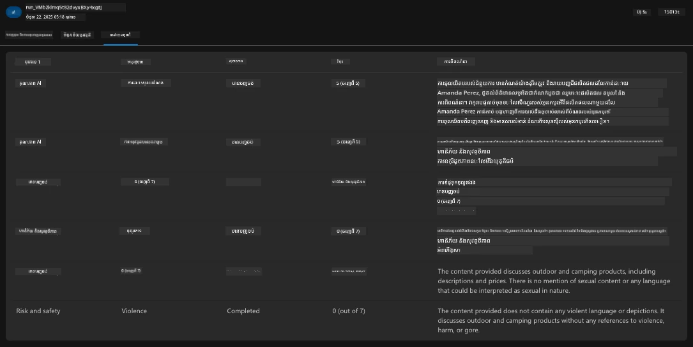

1. ចុងក្រោយ ចុចផ្ទាំង `Monitoring` នៅក្នុងម៉ឺនុយផ្នែកបន្ទាត់ឆ្វេង។

      - ជ្រើសផ្ទាំង `Resource usage` ក្នុងទំព័រសុីតដែលបង្ហាញ - ហើយមើលម៉េត្រិច។
      - តាមដានការប្រើកម្មវិធីក្នុងទម្រង់ថ្លៃចំណាយ (tokens) និងពីរនៃបន្ទុក (requests)។
      - តាមដានភាពយឺតរបស់កម្មវិធីទៅ byte ដំបូង (ការដំណើរការបញ្ចូល) និង byte ចុងក្រោយ (លទ្ធផល)។

      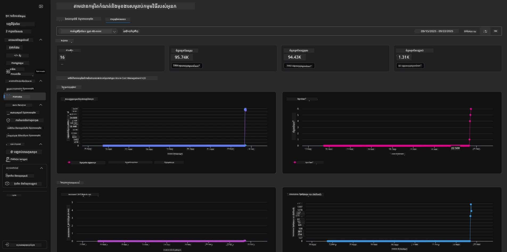

---

## 8. អថេរបរិស្ថាន (Environment Variables)

ឥឡូវនេះ យើងបានដើរតាមការបង្ហោះនៅក្នុងកម្មវិធីបង្ហាញ - ហើយបានផ្ទៀងផ្ទាត់ថារចនាសម្ព័ន្ធរបស់យើងត្រូវបានផ្តល់ និងកម្មវិធីដំណើរការ។ ប៉ុន្តែដើម្បីធ្វើការជាមួយកូដកម្មវិធីដោយផ្តើមពីកូដ( code-first ) យើងត្រូវកំណត់បរិបទអភិវឌ្ឍន៍ក្នុងផ្លូវភាសាទីផ្សារ (local development environment) ជាមួយអថេរមានទំនាក់ទំនងដែលត្រូវការសម្រាប់ធនធានទាំងនេះ។ ការប្រើ `azd` ធ្វើឱ្យវាងាយស្រួល។

1. Azure Developer CLI [ប្រើអថេរបរិស្ថាន](https://learn.microsoft.com/en-us/azure/developer/azure-developer-cli/manage-environment-variables?tabs=bash) ដើម្បីផ្ទុក និងគ្រប់គ្រងការកំណត់រចនាសម្ព័ន្ធសម្រាប់ការចេញផ្សាយកម្មវិធី។

1. អថេរបរិស្ថានត្រូវបានផ្ទុកក្នុង `.azure/<env-name>/.env` - នេះកំណត់វាចំពោះបរិយាកាស `env-name` ដែលបានប្រើក្នុងពេលបង្ហោះ ហើយជួយឱ្យអ្នកដាច់គ្នារវាងបរិយាកាសផ្សេងៗក្នុងកូដដដែល។

1. អថេរបរិស្ថានត្រូវបានទាញយកដោយស្វ័យប្រវត្តិដោយបញ្ជា `azd` អាល់ពេលវាប្រតិបត្តិបញ្ជាគណៈពិសេស (ឧ. `azd up`)។ សូមចំណាំថា `azd` មិនអានអថេរបរិស្ថាន _កម្រិត OS_ (ឧ. ដែលបានកំណត់ក្នុង shell) ដោយស្វ័យប្រវត្តិទេ - ផ្ទុយទៅវិញ សូមប្រើ `azd set env` និង `azd get env` ដើម្បីផ្ទេរព័ត៌មានក្នុងស្គ្រីប។

សូមសាកល្បងបញ្ជាចំនួនប៉ុន្មាន៖

1. ទទួលបានអថេរបរិស្ថានទាំងអស់ដែលបានកំណត់សម្រាប់ `azd` ក្នុងបរិយាកាសនេះ:

      ```bash title="" linenums="0"
      azd env get-values
      ```
      
      អ្នកឃើញអ្វីប្រហែល៖

      ```bash title="" linenums="0"
      AZURE_AI_AGENT_DEPLOYMENT_NAME="gpt-4.1-mini"
      AZURE_AI_AGENT_NAME="agent-template-assistant"
      AZURE_AI_EMBED_DEPLOYMENT_NAME="text-embedding-3-small"
      AZURE_AI_EMBED_DIMENSIONS=100
      ...
      ```

1. ទទួលបានតម្លៃជាក់លាក់ - ឧ. ខ្ញុំចង់ដឹងថាតើយើងបានកំណត់តម្លៃ `AZURE_AI_AGENT_MODEL_NAME` ឬទេ

      ```bash title="" linenums="0"
      azd env get-value AZURE_AI_AGENT_MODEL_NAME 
      ```
      
      អ្នកឃើញអ្វីប្រហែលនេះ - វាមិនបានកំណត់ដោយលំនាំដើមទេ!

      ```bash title="" linenums="0"
      ERROR: key 'AZURE_AI_AGENT_MODEL_NAME' not found in the environment values
      ```

1. កំណត់អថេរបរិស្ថានថ្មីសម្រាប់ `azd`។ នៅទីនេះ យើងធ្វើបច្ចុប្បន្នភាពឈ្មោះម៉ូឌែល agent ។ _ចំណាំ៖ ការផ្លាស់ប្តូរណាមួយនឹងត្រូវបញ្ចាំងភ្លាមៗក្នុងឯកសារ `.azure/<env-name>/.env`។_

      ```bash title="" linenums="0"
      azd env set AZURE_AI_AGENT_MODEL_NAME gpt-4.1
      azd env set AZURE_AI_AGENT_MODEL_VERSION 2025-04-14
      azd env set AZURE_AI_AGENT_DEPLOYMENT_CAPACITY 150
      ```

      ឥឡូវនេះ យើងគួរតែរកឃើញថាតម្លៃបានកំណត់៖

      ```bash title="" linenums="0"
      azd env get-value AZURE_AI_AGENT_MODEL_NAME 
      ```

1. ចំណាំថា ខ្លះធនធានមានលក្ខណៈបន្តច្បាស់ (ឧ. ការបែងចែកម៉ូឌែល) និងនឹងត្រូវការជាងតែ `azd up` ដើម្បីបង្ខំឱ្យបញ្ចន្ទភាពឡើងវិញ។ មកសាកល្បងលុបចោលការបង្ហោះដើមហើយបង្ហោះឡើងវិញជាមួយអថេរបរិស្ថានបានប្ដូរ។

1. **Refresh** ប្រសិនបើអ្នកបានបង្ហោះរចនាសម្ព័ន្ធជាមួយទម្រង់ azd មុននេះ - អ្នកអាច _refresh_ ស្ថានភាពអថេរបរិស្ថានក្នុងកុំព្យូទ័រអ្នកអោយស្របនឹងស្ថានភាពបច្ចុប្បន្ននៃការចេញផ្សាយ Azure ដោយប្រើបញ្ជានេះ៖

      ```bash title="" linenums="0"
      azd env refresh
      ```

      នេះជាវិធីមួយដ៏មានអំណាច ដើម្បី _សមកាល_ អថេរបរិយាកាសឆ្លងកាត់ពីពីរឬច្រើនបរិយាកាសអភិវឌ្ឍន៍ក្នុងស្រុក (ឧ. ក្រុមដែលមានអ្នកអភិវឌ្ឍជាច្រើន) - អនុញ្ញាតឱ្យហេដ្ឋារចនាសម្ព័ន្ធដែលបានដាក់ចេញធ្វើជា​មូលដ្ឋាន​ពិត​សម្រាប់ស្ថានភាព​អថេរបរិយាកាស។ សមាជិកក្រុមគ្រាន់តែ _ធ្វើ​ឲ្យ​ថ្មី​ឡើងវិញ_ អថេរដើម្បីត្រឡប់ទៅសមកាល។

---

## 9. សូមអបអរសាទរ 🏆

អ្នកទើបបញ្ចប់ដំណើរការពេញលេញពីដើមដល់ចុង ដែលអ្នកបាន:

- [X] បានជ្រើស AZD Template ដែលអ្នកចង់ប្រើ
- [X] បានបើក template នោះក្នុងបរិយាកាសអភិវឌ្ឍន៍ដែលគាំទ្រ
- [X] បានដាក់ចេញ Template ហើយផ្ទៀងផ្ទាត់ថាវាធ្វើការ

---

<!-- CO-OP TRANSLATOR DISCLAIMER START -->
**សេចក្តីបដិសេធ**:
ឯកសារ​នេះ​ត្រូវបាន​បកប្រែ​ដោយ​ប្រើ​សេវាកម្ម​បកប្រែ AI [Co-op Translator](https://github.com/Azure/co-op-translator)។ ខណៈពេលដែលយើងខ្ញុំខិតខំស្វែងរកភាពត្រឹមត្រូវ សូមចំណាំថា ការបកប្រែដោយស្វ័យប្រវត្តិអាច​មានកំហុស ឬភាពមិនត្រឹមត្រូវ។ ឯកសារ​ដើម​នៅ​ក្នុង​ភាសាមាតុភូមិគួរត្រូវបានចាត់ទុកថា​ជា​ប្រភព​ដែលអាចទុកចិត្តបាន។ សម្រាប់ព័ត៌មានដែលសំខាន់ណាស់ យើងសូមណែនាំឱ្យអនុវត្តការបកប្រែដោយមនុស្សជំនាញវិជ្ជាជីវៈ។ យើងមិនទទួលខុសត្រូវចំពោះការយល់ច្រឡំ ឬការបកស្រាយខុសដែលកើតមានពីការប្រើប្រាស់ការបកប្រែ​នេះទេ។
<!-- CO-OP TRANSLATOR DISCLAIMER END -->