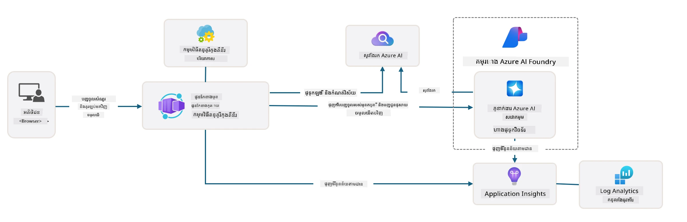

# 3. បំបែកពុម្ពគំរូ

!!! tip "នៅចុងផ្នែកមេរៀននេះ អ្នកនឹងអាច"

    - [ ] ដំណើរការ GitHub Copilot ជាមួយម៉ាស៊ីនមេ MCP សម្រាប់ជំនួយ Azure
    - [ ] យល់ដឹងអំពីរចនាសម្ព័ន្ធថត AZD និងគ្រឿងផ្សំ
    - [ ] ស្វែងយល់ពីលំនាំរៀបចំ infrastructure-as-code (Bicep)
    - [ ] **Lab 3:** ប្រើ GitHub Copilot ដើម្បីស្វែងរក និងយល់ពីរចនាសម្ព័ន្ធ repository 

---


With AZD templates and the Azure Developer CLI (`azd`) we can quickly jumpstart our AI development journey with standardized repositories that provide sample code, infrastructure and configuration files - in the form of a ready-to-deploy _starter_ project.

**But now, we need to understand the project structure and codebase - and be able to customize the AZD template - without any prior experience or understanding of AZD!**

---

## 1. បើកដំណើរការ GitHub Copilot

### 1.1 ដំឡើង GitHub Copilot Chat

It's time to explore [GitHub Copilot with Agent Mode](https://code.visualstudio.com/docs/copilot/chat/chat-agent-mode). Now, we can use natural language to describe our task at a high level, and get assistance in execution. For this lab, we'll use the [Copilot Free plan](https://github.com/github-copilot/signup) which has a monthly limit for completions and chat interactions.

The extension can be installed from the marketplace, and it is often already available in Codespaces or dev container environments. _Click `Open Chat` from the Copilot icon drop-down - and type a prompt like `What can you do?`_ - you may be prompted to log in. **GitHub Copilot Chat is ready**.

### 1.2. Install MCP Servers

For Agent mode to be effective, it needs access to the right tools to help it retrieve knowledge or take actions. This is where MCP servers can help. We'll configure the following servers:

1. [Azure MCP Server](../../../../../workshop/docs/instructions)
1. [Microsoft Docs MCP Server](../../../../../workshop/docs/instructions)

To activate these:

1. Create a file called `.vscode/mcp.json` if it does not exist
1. Copy the following into that file - and start the servers!
   ```json title=".vscode/mcp.json"
   {
      "servers": {
         "Azure MCP Server": {
            "command": "npx",
            "args": [
            "-y",
            "@azure/mcp@latest",
            "server",
            "start"
            ]
         },
         "microsoft.docs.mcp": {
            "type": "http",
            "url": "https://learn.microsoft.com/api/mcp"
         }
      }
   }
   ```

??? warning "ប្រហែលជាអ្នកអាចទទួលបានកំហុសថា `npx` មិនត្រូវបានដំឡើង (ចុចដើម្បីពង្រីកសម្រាប់វិធីជួសជុល)"

      ដើម្បីជួសជុល នេះ បើកឯកសារ `.devcontainer/devcontainer.json` ហើយបន្ថែមជួរដូចខាងក្រោមទៅក្នុងផ្នែក features។ បន្ទាប់មកសាងសង់ container ម្តងទៀត។ ឥឡូវនេះអ្នកគួរតែមាន `npx` ដែលបានដំឡើងរួច។

      ```title="" linenums="0"
         "features": {
            "ghcr.io/devcontainers/features/node:1": {},
            ...
         },
      ```

---

### 1.3. Test GitHub Copilot Chat

**First use `azd auth login` to authenticate with Azure from the VS Code command line. Use `az login` as well only if you plan to run Azure CLI commands directly.**

You should now be able to query your Azure subscription status, and ask questions about deployed resources or configuration. Try these prompts:

1. `List my Azure resource groups`
1. `#foundry list my current deployments`

You can also ask questions about Azure documentation and get responses grounded in the Microsoft Docs MCP server. Try these prompts:

1. `#microsoft_docs_search What is Azure Developer CLI?`
1. `#microsoft_docs_search Show me a Python tutorial to chat with deployed model`

Or you can ask for code snippets to complete a task. Try this prompt.

1. `Give me a Python code example that uses AAD for an interactive chat client`

In `Ask` mode, this will provide code that you can copy-paste and try out. In `Agent` mode, this might go a step further and create the relevant resources for you - including setup scripts and documentation - to help you execute that task.

**You are now equipped to start exploring the template repository**

---

## 2. វិភាគស្ថាបត្យកម្ម

??? prompt "សួរ: ពណ៌នាស្ថាបត្យកម្មកម្មវិធីដែលមាននៅ docs/images/architecture.png ក្នុងមួយកថាខណ្ឌ"

      កម្មវិធីនេះជាកម្មវិធីជជែកដែលប្រើប្រាស់បច្ចេកវិទ្យា AI សង់ឡើងលើ Azure ដែលបង្ហាញពីស្ថាបត្យកម្មថ្មីប្រភេទ agent-based។ ដំណោះស្រាយនេះមានចំណុចកណ្ដាលនៅលើ Azure Container App ដែលផ្ទុកកូដកម្មវិធីស្នូល ដែលដំណើរការបញ្ចូលពីអ្នកប្រើ និងបង្កើតចម្លើយឆ្លាតវៃតាមរយៈឯកជន AI agent។

      ស្ថាបត្យកម្មនេះប្រើប្រាស់ Microsoft Foundry Project ជាតំបន់មូលដ្ឋានសម្រាប់សមត្ថភាព AI និងភ្ជាប់ទៅកាន់ Azure AI Services ដែលផ្គត់ផ្គង់មូដែលភាសា (ដូចជា gpt-4.1-mini) និងមុខងារ agent។ ការបដិសេធរវាងអ្នកប្រើ និងសេវាកម្មធ្វើដោយផ្នែកមុខ (frontend) រចនាឡើងជាមួយ React ទៅកាន់ backend របស់ FastAPI ដែលទំនាក់ទំនងជាមួយសេវាកម្ម agent ដើម្បីបង្កើតចម្លើយមានបទបញ្ញត្តិ។

      ប្រព័ន្ធនេះបញ្ចូលសមត្ថភាពស្វែងរកចំណេះដឹង តាមរយៈការស្វែងរកឯកសារ ឬសេវាកម្ម Azure AI Search ដែលអនុញ្ញាតឲ្យ agent ទាញយក និងយោងព័ត៌មានពីឯកសារដែលបានផ្ទុក។ សម្រាប់លទ្ធផលប្រតិបត្តិការ ល្បឿន និងការត្រួតពិនិត្យ ទាំងមូលរួមមានការត្រួតពិនិត្យពេញលេញតាម Application Insights និង Log Analytics Workspace សម្រាប់ទំនាក់ទំនង ការចុះហត្ថលេខា និងការបង្កើនប្រសិទ្ធភាព។

      Azure Storage ផ្តល់ទីស្តុក blob សម្រាប់ទិន្នន័យកម្មវិធី និងការផ្ទុកឯកសារ ខណៈដែល Managed Identity ធានាការចូលដំណើរការដោយសុវត្ថិភាពរវាងធនធាន Azure ដោយគ្មានការផ្ទុកសម្ងាត់សម្គាល់។ ដំណោះស្រាយទាំងមូលត្រូវបានរចនាឡើងសម្រាប់ភាពអាចពង្រីក និងសេចក្តីថែទាំ បានបណ្តុះកម្មវិធីដោយកុងតឺនណែរ ត្រូវបានពង្រីកដោយស្វ័យប្រវត្តិលើយោងតាមតម្រូវការ ខណៈដែលផ្តល់សុវត្ថិភាព ការត្រួតពិនិត្យ និងសមត្ថភាព CI/CD តាមរយៈ ekosistema សេវាដឹកនាំរបស់ Azure។



---

## 3. រចនាសម្ព័ន្ធ Repository

!!! prompt "សួរ: ពន្យល់រចនាសម្ព័ន្ធថតនៃ template។ ចាប់ផ្តើមជាមួយរូបមន្តរៀបចំដោយរាងរាងគ្នា។"

??? info "ANSWER: Visual Hierarchical Diagram"

      ```bash title="" 
      get-started-with-ai-agents/
      ├── 📋 Configuration & Setup
      │   ├── azure.yaml                    # Azure Developer CLI configuration
      │   ├── docker-compose.yaml           # Local development containers
      │   ├── pyproject.toml                # Python project configuration
      │   ├── requirements-dev.txt          # Development dependencies
      │   └── .devcontainer/                # VS Code dev container setup
      │
      ├── 🏗️ Infrastructure (infra/)
      │   ├── main.bicep                    # Main infrastructure template
      │   ├── api.bicep                     # API-specific resources
      │   ├── main.parameters.json          # Infrastructure parameters
      │   └── core/                         # Modular infrastructure components
      │       ├── ai/                       # AI service configurations
      │       ├── host/                     # Hosting infrastructure
      │       ├── monitor/                  # Monitoring and logging
      │       ├── search/                   # Azure AI Search setup
      │       ├── security/                 # Security and identity
      │       └── storage/                  # Storage account configs
      │
      ├── 💻 Application Source (src/)
      │   ├── api/                          # Backend API
      │   │   ├── main.py                   # FastAPI application entry
      │   │   ├── routes.py                 # API route definitions
      │   │   ├── search_index_manager.py   # Search functionality
      │   │   ├── data/                     # API data handling
      │   │   ├── static/                   # Static web assets
      │   │   └── templates/                # HTML templates
      │   ├── frontend/                     # React/TypeScript frontend
      │   │   ├── package.json              # Node.js dependencies
      │   │   ├── vite.config.ts            # Vite build configuration
      │   │   └── src/                      # Frontend source code
      │   ├── data/                         # Sample data files
      │   │   └── embeddings.csv            # Pre-computed embeddings
      │   ├── files/                        # Knowledge base files
      │   │   ├── customer_info_*.json      # Customer data samples
      │   │   └── product_info_*.md         # Product documentation
      │   ├── Dockerfile                    # Container configuration
      │   └── requirements.txt              # Python dependencies
      │
      ├── 🔧 Automation & Scripts (scripts/)
      │   ├── postdeploy.sh/.ps1           # Post-deployment setup
      │   ├── setup_credential.sh/.ps1     # Credential configuration
      │   ├── validate_env_vars.sh/.ps1    # Environment validation
      │   └── resolve_model_quota.sh/.ps1  # Model quota management
      │
      ├── 🧪 Testing & Evaluation
      │   ├── tests/                        # Unit and integration tests
      │   │   └── test_search_index_manager.py
      │   ├── evals/                        # Agent evaluation framework
      │   │   ├── evaluate.py               # Evaluation runner
      │   │   ├── eval-queries.json         # Test queries
      │   │   └── eval-action-data-path.json
      │   ├── sandbox/                      # Development playground
      │   │   ├── 1-quickstart.py           # Getting started examples
      │   │   └── aad-interactive-chat.py   # Authentication examples
      │   └── airedteaming/                 # AI safety evaluation
      │       └── ai_redteaming.py          # Red team testing
      │
      ├── 📚 Documentation (docs/)
      │   ├── deployment.md                 # Deployment guide
      │   ├── local_development.md          # Local setup instructions
      │   ├── troubleshooting.md            # Common issues & fixes
      │   ├── azure_account_setup.md        # Azure prerequisites
      │   └── images/                       # Documentation assets
      │
      └── 📄 Project Metadata
         ├── README.md                     # Project overview
         ├── CODE_OF_CONDUCT.md           # Community guidelines
         ├── CONTRIBUTING.md              # Contribution guide
         ├── LICENSE                      # License terms
         └── next-steps.md                # Post-deployment guidance
      ```

### 3.1. ស្ថាបត្យកម្មកម្មវិធីមូលដ្ឋាន

គំរូនេះអនុវត្តតាមលំនាំកម្មវិធីវែប **full-stack** ដោយមាន:

- **Backend**: Python FastAPI ជាមួយបញ្ចូល Azure AI
- **Frontend**: TypeScript/React ជាមួយប្រព័ន្ធសង់ Vite
- **Infrastructure**: តំណាង Azure Bicep សម្រាប់ធនធានគ្រឿងភាគីពពក
- **Containerization**: Docker សម្រាប់ការដាក់លើដែលមានសម្ងាត់

### 3.2 ស្ថាបត្យកម្មជា​កូដ (Bicep)

ស្រទាប់ហេដ្ឋារចនាសម្ព័ន្ធប្រើប្រាស់គំរូ **Azure Bicep** ដែលរៀបចំជាโมឌុល:

   - **`main.bicep`**: ជាអ្នកដឹកនាំធនធាន Azure ទាំងអស់
   - **`core/` modules**: ឯកតាអាចប្រើប្រាស់ឡើងវិញសម្រាប់សេវាកម្មផ្សេងៗ
      - សេវាកម្ម AI (Microsoft Foundry Models, AI Search)
      - ផ្នែកផ្ទុកកុងតឺន័រ (Azure Container Apps)
      - ការត្រួតពិនិត្យ (Application Insights, Log Analytics)
      - សុវត្ថិភាព (Key Vault, Managed Identity)

### 3.3 ប្រភពកម្មវិធី (`src/`)

**Backend API (`src/api/`)**:

- REST API ដំណើរការដោយ FastAPI
- ការទាក់ទងជាមួយ Foundry Agents
- ការគ្រប់គ្រង search index សម្រាប់ទាញយកចំណេះដឹង
- សមត្ថភាពផ្ទុកឯកសារ និងដំណើរការព័ត៍មាន

**Frontend (`src/frontend/`)**:

- SPA ម៉ូឌើន React/TypeScript
- Vite សម្រាប់ការអភិវឌ្ឍលឿន និងសាងសង់ដែលបានបង្កើនប្រសិទ្ធភាព
- មុខងារជជែកសម្រាប់អន្តរកម្មជាមួយ agent

**Knowledge Base (`src/files/`)**:

- គំរូទិន្នន័យអតិថិជន និងផលិតផល
- បង្ហាញការទាញយកចំណេះដឹងតាមឯកសារ
- ឧទាហរណ៍ក្នុងទ្រង់ទ្រាយ JSON និង Markdown


### 3.4 DevOps និងស្វ័យប្រវត្តិការ

**Scripts (`scripts/`)**:

- ស្គ្រីប PowerShell និង Bash សម្រាប់គម្រប់វេទិកា
- ការផ្ទៀងផ្ទាត់បរិស្ថាន និងការកំណត់
- ការកំណត់បន្ទាប់ពីដាក់印 (post-deployment)
- ការគ្រប់គ្រងកូតាប៉ុន្មាននៃម៉ូដែល

**Azure Developer CLI Integration**:

- កំណត់ค่า `azure.yaml` សម្រាប់សកម្មភាព `azd`
- ការបង្កើត និងដាក់បញ្ចូលដោយស្វ័យប្រវត្តិ
- ការគ្រប់គ្រងអថេរបរិយាកាស

### 3.5 សាកល្បង និងធានាគុណភាព

**Evaluation Framework (`evals/`)**:

- ការវាយតម្លៃប្រសិទ្ធភាព agent
- ការធ្វើតេស្តគុណភាពចម្លើយតាមសំណួរ
- បណ្ដាញការវាយតម្លៃដោយស្វ័យប្រវត្តិ

**AI Safety (`airedteaming/`)**:

- ការធ្វើតេស្ត red team សម្រាប់សុវត្ថិភាព AI
- ការស្កេននូវចំណុចងាយរងគ្រោះសុវត្ថិភាព
- អនុវត្តន៍ងារទទួលខុសត្រូវ AI

---

## 4. សូមអបអរសាទរ 🏆

You successfully used GitHub Copilot Chat with MCP servers, to explore the repository.

- [X] Activated GitHub Copilot for Azure
- [X] Understood the Application Architecture
- [X] Explored the AZD template structure

This gives you a sense of the _infrastructure as code_ assets for this template. Next, we'll look at the configuration file for AZD.

---

<!-- CO-OP TRANSLATOR DISCLAIMER START -->
**ការបដិសេធ**:
ឯកសារនេះត្រូវបានបកប្រែដោយប្រើសេវាកម្មបកប្រែ AI [Co-op Translator](https://github.com/Azure/co-op-translator)។ ខណៈពេលយើងខិតខំសម្រាប់ភាពត្រឹមត្រូវ សូមយល់ថាការបកប្រែដោយស្វ័យប្រវត្តិអាចមានកំហុស ឬភាពមិនត្រឹមត្រូវ។ ឯកសារដើមក្នុងភាសាដើមគួរត្រូវបានចាត់ទុកជា​ប្រភព​ដែលអាចទុកចិត្តបាន។ សម្រាប់ព័ត៌មានដែលសំខាន់ខ្លាំង យើងអនុសាសន៍ឲ្យប្រើការបកប្រែដោយអ្នកបកប្រែវិជ្ជាជីវៈ។ យើងមិនទទួលខុសត្រូវចំពោះការយល់ច្រឡំ ឬការបកស្រាយខុសណាមួយដែលកើតមានពីការប្រើប្រាស់ការបកប្រែនេះទេ។
<!-- CO-OP TRANSLATOR DISCLAIMER END -->