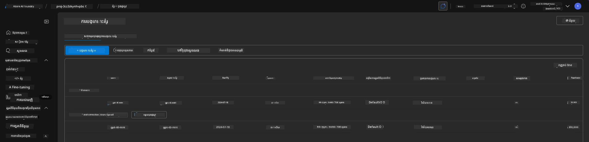
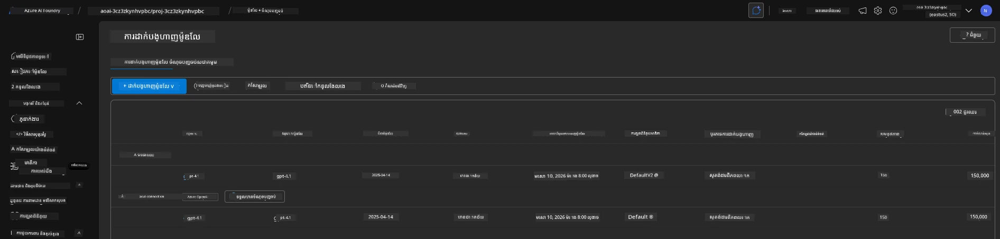

# 6. លុបចោលហេដ្ឋារចនាសម្ព័ន្ធ

!!! tip "នៅចុងម៉ូឌុលនេះ អ្នកនឹងអាច"

    - [ ] យល់ពីសារៈសំខាន់នៃការសម្អាតធនធាន និងការគ្រប់គ្រងចំណាយ
    - [ ] ប្រើ `azd down` ដើម្បីលុបចោលហេដ្ឋារចនាសម្ព័ន្ធយ៉ាងសុវត្ថិភាព
    - [ ] ស្ដារឡើងវិញសេវា Cognitive ដែលបានលុបជាស្រាល ប្រសិនបើចាំបាច់
    - [ ] **Lab 6:** សម្អាតធនធាន Azure និងផ្ទៀងផ្ទាត់ការលុបចោល

---

## លំហាត់បន្ថែម

មុនពេលយើងលុបចោលគម្រោង សូមចំណាយប៉ុន្មាននាទីដើម្បីស្វែងរកអ្វីៗបន្ថែម។

!!! info "សាកល្បងសំណួរស្វែងរកទាំងនេះ"

    **សាកល្បងជាមួយ GitHub Copilot:**
    
    1. Ask: `តើគំរូ AZD ផ្សេងទៀតណាដែលខ្ញុំអាចសាកសម្រាប់ស្ថានភាពពហុភ្នាក់ងារ?`
    2. Ask: `តើខ្ញុំអាចកែតម្រូវការណែនាំភ្នាក់ងារយ៉ាងដូចម្តេចសម្រាប់ករណីប្រើប្រាស់សុខាភិបាល?`
    3. Ask: `តើអថេរបរិយាកាសណាខ្លះដែលគ្រប់គ្រងការបង្កើនប្រសិទ្ធភាពចំណាយ?`
    
    **ស្វែងរកក្នុង Azure Portal:**
    
    1. ពិនិត្យមើលម៉ូទ្រីក Application Insights សម្រាប់ការតម្លើងរបស់អ្នក
    2. ពិនិត្យការវិភាគថ្លៃសម្រាប់ធនធានដែលបានផ្តល់
    3. ស្វែងរកកន្លែងលេងភ្នាក់ងារ (agent playground) នៅ Microsoft Foundry portal ម្តងទៀត

---

## លុបចោលហេដ្ឋារចនាសម្ព័ន្ធ

1. ការលុបចោលហេដ្ឋារចនាសម្ព័ន្ធមានភាពងាយដូចជា:
      
      ```bash title="" linenums="0"
      azd down --purge
      ```
1. ប៉ារ៉ាមែត្រ `--purge` ធានាថាវានឹងលុបធនធាន Cognitive Service ដែលបានលុបជាស្រាលផងដែរ ដូច្នេះដោះសោកូតាដែលធនធានទាំងនេះកាន់។ បន្ទាប់ពីបញ្ចប់ អ្នកនឹងឃើញអ្វីមួយដូចខាងក្រោម:
      
      ```bash title="" linenums="0"
      ? Total resources to delete: 11, are you sure you want to continue? Yes
      Deleting your resources can take some time.
      (✓) Done: Deleted resource group rg-nitya-mshack-azd
      (✓) Done: Purging Cognitive Account: aoai-3cz3zkynhvpbc

      SUCCESS: Your application was removed from Azure in 11 minutes 4 seconds.
      ```

1. (ជាជម្រើស) ប្រសិនបើអ្នករត់ `azd up` ម្តងទៀត ឥឡូវនេះ អ្នកនឹងសង្កេតបានថាម៉ូឌែល gpt-4.1 ត្រូវបានដាក់ប្រើឡើងវិញ ដោយសារអថេរបរិយាកាសត្រូវបានផ្លាស់ប្តូរ (និងបានរក្សាទុក) នៅក្នុងថត `.azure` នៅក្នុងទីតាំងក្នុងស្ថានីយ៍របស់អ្នក។ 

      នេះគឺជាការដាក់ម៉ូឌែល **មុន**:

      

      ហើយនេះគឺ **បន្ទាប់**:
      

---

<!-- CO-OP TRANSLATOR DISCLAIMER START -->
**Disclaimer**:
ឯកសារនេះត្រូវបានបកប្រែដោយប្រើសេវាបកប្រែ AI [Co-op Translator](https://github.com/Azure/co-op-translator)។ នៅពេលដែលយើងខិតខំនិងខិតខំរកភាពត្រឹមត្រូវ សូមពិចារណាថា ការបកប្រែដោយស្វ័យក្រមអាចមានកំហុស ឬភាពមិនត្រឹមត្រូវខ្លះ។ ឯកសារដើមក្នុងភាសាដើមគួរត្រូវបានគេចាត់ទុកថាជាប្រភពមានសុពលភាព។ សម្រាប់ព័ត៌មានសំខាន់ យើងផ្តល់អនុសាសន៍ឲ្យប្រើការបកប្រែដោយមនុស្សដែលមានជំនាញវិជ្ជាជីវៈ។ យើងមិនទទួលខុសត្រូវចំពោះការយល់ច្រឡំ ឬការបកស្រាយខុសណាមួយដែលកើតឡើងពីការប្រើប្រាស់ការបកប្រែនេះ។
<!-- CO-OP TRANSLATOR DISCLAIMER END -->