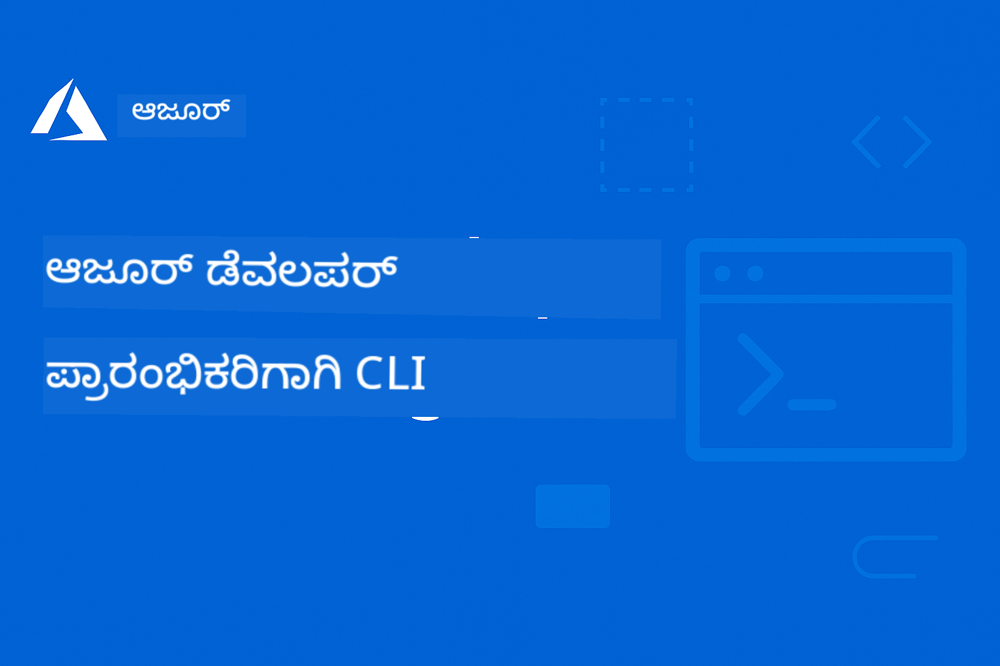

<!--
CO_OP_TRANSLATOR_METADATA:
{
  "original_hash": "068c87cc2641a81ca353ad7064ff326a",
  "translation_date": "2026-01-01T22:41:05+00:00",
  "source_file": "README.md",
  "language_code": "kn"
}
-->
# AZD For Beginners: A Structured Learning Journey

 

[](https://GitHub.com/microsoft/azd-for-beginners/watchers/)
[](https://GitHub.com/microsoft/azd-for-beginners/network/)
[](https://GitHub.com/microsoft/azd-for-beginners/stargazers/)

[](https://discord.gg/microsoft-azure)
[](https://discord.gg/nTYy5BXMWG)

## Getting Started with This Course

ಈ AZD ಕಲಿಕಾ ಪ್ರಯಾಣವನ್ನು ಪ್ರಾರಂಭಿಸಲು ಈ ಹಂತಗಳನ್ನು ಅನುಸರಿಸಿ:

1. **ರಿಪೊಸಿಟರಿಯನ್ನು ಫೋರ್ಕ್ ಮಾಡಿ**: Click [](https://GitHub.com/microsoft/azd-for-beginners/fork)
2. **ರಿಪೊಸಿಟರಿಯನ್ನು ಕ್ಲೋನ್ ಮಾಡಿ**: `git clone https://github.com/microsoft/azd-for-beginners.git`
3. **ಸಮುದಾಯಕ್ಕೆ ಸೇರುವುದು**: ನಿಪುಣ ಬೆಂಬಲಕ್ಕಾಗಿ [Azure Discord Communities](https://discord.com/invite/ByRwuEEgH4)
4. **ನಿಮ್ಮ ಕಲಿಕಾ ಮಾರ್ಗ ಆಯ್ಕೆಮಾಡಿ**: ನಿಮ್ಮ ಅನುಭವ ಮಟ್ಟಕ್ಕೆ ಹೊಂದಿಕೊಳ್ಳುವ ಕೆಳಗಿನ ಅಧ್ಯಾಯವನ್ನು ಆಯ್ಕೆಮಾಡಿ

### Multi-Language Support

#### Automated Translations (Always Up-to-Date)

<!-- CO-OP TRANSLATOR LANGUAGES TABLE START -->
[ಅರೇಬಿಕ್](../ar/README.md) | [ಬೆಂಗಾಲಿ](../bn/README.md) | [ಬಲ್ಗೇರಿಯನ್](../bg/README.md) | [ಬರ್ಮೀಸ್ (ಮ್ಯಾನ್‌ಮಾರ್)](../my/README.md) | [ಚೀನೀ (ಸರಳೀಕೃತ)](../zh/README.md) | [ಚೀನೀ (ಪಾರಂಪರಿಕ, ಹಾಂಗ್ ಕಾಂಗ್)](../hk/README.md) | [ಚೀನೀ (ಪಾರಂಪರಿಕ, ಮಾಕಾವ್)](../mo/README.md) | [ಚೀನೀ (ಪಾರಂಪರಿಕ, ತೈವಾನ್)](../tw/README.md) | [ಕ್ರೊಯೇಶಿಯನ್](../hr/README.md) | [ಚೆಕ್](../cs/README.md) | [ಡೆನಿಷ್](../da/README.md) | [ಡಚ್](../nl/README.md) | [ಎಸ್ಟೋನಿಯನ್](../et/README.md) | [ಫಿನ್ನಿಷ್](../fi/README.md) | [ಫ್ರೆಂಚ್](../fr/README.md) | [ಜರ್ಮನ್](../de/README.md) | [ಗ್ರೀಕ್](../el/README.md) | [ಹೀಬ್ರೂ](../he/README.md) | [ಹಿಂदी](../hi/README.md) | [ಹಂಗೇರಿಯನ್](../hu/README.md) | [ಇಂಡೋನೇಷಿಯನ್](../id/README.md) | [ಇಟಾಲಿಯನ್](../it/README.md) | [ಜಪಾನೀಸ್](../ja/README.md) | [ಕನ್ನಡ](./README.md) | [ಕೊರಿಯನ್](../ko/README.md) | [ಲಿಥುವೇನಿಯನ್](../lt/README.md) | [ಮಲಾಯ್](../ms/README.md) | [മലയാളം](../ml/README.md) | [मराठी](../mr/README.md) | [नेपाली](../ne/README.md) | [Nigerian Pidgin](../pcm/README.md) | [ನಾರ್ವೆಜಿಯನ್](../no/README.md) | [ಫಾರ್ಸಿ (ಪರ್ಶಿಯನ್)](../fa/README.md) | [ಪೋಲಿಷ್](../pl/README.md) | [Portuguese (Brazil)](../br/README.md) | [Portuguese (Portugal)](../pt/README.md) | [ਪੰਜਾਬੀ (ಗುರುಮುಖੀ)](../pa/README.md) | [ರೋಮನಿಯನ್](../ro/README.md) | [ರಶಿಯನ್](../ru/README.md) | [ಸರ್ಬಿಯನ್ (ಸಿರಿಲಿಕ್)](../sr/README.md) | [ಸ್ಲೊವಾಕ್](../sk/README.md) | [ಸ್ಲೋವೇನಿಯನ್](../sl/README.md) | [ಸ್ಪ್ಯಾನಿಷ್](../es/README.md) | [ಸ್ವಾಹಿಲಿ](../sw/README.md) | [ಸ್ವೀಡಿಷ್](../sv/README.md) | [Tagalog (Filipino)](../tl/README.md) | [ತಮಿಳು](../ta/README.md) | [ತೆಲುಗು](../te/README.md) | [ಥಾಯ್](../th/README.md) | [ಟರ್ಕಿಷ್](../tr/README.md) | [ಉಕ್ರೇನಿಯನ್](../uk/README.md) | [ಉರ್ದು](../ur/README.md) | [ವಿಯೇಟ್ನಾಮಿಸ್](../vi/README.md)
<!-- CO-OP TRANSLATOR LANGUAGES TABLE END -->

## Course Overview

ಪ್ರಗತಿ ಸಿದ್ಧಿಯಲ್ಲಿರುವ ಅಧ್ಯಾಯಗಳ ಮೂಲಕ Azure Developer CLI (azd) ನ್ನು ಆಳವಾಗಿ ಅಧ್ಯಯನ ಮಾಡಿ. **Microsoft Foundry ಒಳಗೊಂಡಿರುವ AI ಅಪ್ಲಿಕೇಶನ್ ನಿಯೋಜನೆ ಮೇಲೆ ವಿಶೇಷ ಗಮನ.**

### Why This Course is Essential for Modern Developers

Microsoft Foundry Discord ಸಮುದಾಯದ ಅಭಿಪ್ರಾಯಗಳ ಆಧಾರವಾಗಿ, **45% ಅಭಿವೃದ್ಧಿಪಡಿಸುವವರು AI ಕಾರ್ಯಭಾರಗಳಿಗೆ AZD ಬಳಸಲು ಇಚ್ಛಿಸುತ್ತಾರೆ** ಆದರೆ ಈ ತಡೆಗಳನ್ನು ಎದುರಿಸುತ್ತಾರೆ:
- ಸಂಕೀರ್ಣ ಮಲ್ಟಿ-ಸರ್ವಿಸ್ AI ಆರ್ಕಿಟೆಕ್ಚರ್‌ಗಳು
- ಉತ್ಪಾದನೆ AI ನಿಯೋಜನೆ ಅತ್ಯುತ್ತಮ ಅಭ್ಯಾಸಗಳು  
- Azure AI ಸೇವೆಗಳ ಏಕೀಕರಣ ಮತ್ತು ಸಂರಚನೆ
- AI ಕಾರ್ಯಭಾರಗಳಿಗೆ ವೆಚ್ಚದ ಹೆಚ್ಚಿನ ಸಮರ್ಥನೆ
- AI-ವಿಶಿಷ್ಟ ನಿಯೋಜನೆ ಸಮಸ್ಯೆಗಳ ಸಮಸ್ಯಾಪರಿಹಾರ

### Learning Objectives

ಈ ರಚನೆಯಾದ ಕೋರ್ಸ್ ಅನ್ನು ಪೂರ್ಣಗೊಳಿಸುವ ಮೂಲಕ, ನೀವು:
- **AZD ಮೂಲಭೂತಗಳನ್ನು ಮಾಸ್ಟರ್ ಮಾಡುವುದು**: ಕೋರ್ ಸಂಪ್ರದಾಯಗಳು, ಸ್ಥಾಪನೆ, ಮತ್ತು ಕಾನ್ಫಿಗರೇಷನ್
- **AI ಅಪ್ಲಿಕೇಶನ್‌ಗಳನ್ನು ನಿಯೋಜಿಸುವುದು**: Microsoft Foundry ಸೇವೆಗಳಿಗೆ AZD ಬಳಸುವುದು
- **Infrastructure as Code ಅನ್ವಯಿಸುವುದು**: Bicep ಟೆಂಪ್ಲೇಟ್‌ಗಳೊಂದಿಗೆ Azure ಸಂಪನ್ಮೂಲಗಳನ್ನು ನಿರ್ವಹಿಸುವುದು
- **ನಿಯೋಜನೆಗಳ ಸಮಸ್ಯೆಗಳನ್ನು ಪರಿಹರಿಸುವುದು**: ಸಾಮಾನ್ಯ ಸಮಸ್ಯೆಗಳನ್ನು ಹೀರಿಕೊಳ್ಳುವುದು ಮತ್ತು ಡಿಬಗ್ ಮಾಡುವುದು
- **ಉತ್ಪಾದನೆಗೆ ಪರಿಷ್ಕಾರ ಮಾಡುವುದು**: ಭದ್ರತೆ, ಸ್ಕೇಲಿಂಗ್, ಮಾನಿಟರಿಂಗ್, ಮತ್ತು ವೆಚ್ಚ ನಿರ್ವಹಣೆ
- **ಮಲ್ಟಿ-ಏಜೆಂಟ್ ಪರಿಹಾರಗಳನ್ನು ನಿರ್ಮಿಸುವುದು**: ಸಂಕೀರ್ಣ AI ಆರ್ಕಿಟೆಕ್ಚರ್‌ಗಳನ್ನು ನಿಯೋಜಿಸುವುದು

## 📚 Learning Chapters

*ನಿಮ್ಮ ಅನುಭವದ ಮಟ್ಟ ಮತ್ತು ಗುರಿಗಳ ಆಧಾರದ ಮೇಲೆ ಕಲಿಕಾ ಮಾರ್ಗ ಆಯ್ಕೆಮಾಡಿ*

### 🚀 Chapter 1: Foundation & Quick Start
**Prerequisites**: Azure subscription, ಮೂಲ ಕಡತೋತ್ತರ ಕಮಾಂಡ್ ಲೈನ್ ಜ್ಞಾನ  
**Duration**: 30-45 minutes  
**Complexity**: ⭐

#### What You'll Learn
- Azure Developer CLI ಮೂಲಭೂತಗಳನ್ನು ಅರ್ಥಮಾಡಿಕೊಳ್ಳುವುದು
- ನಿಮ್ಮ ಪ್ಲಾಟ್‌ಫಾರ್ಮ್‌ನಲ್ಲಿ AZD ಅನ್ನು ಸ್ಥಾಪಿಸುವುದು
- ನಿಮ್ಮ ಮೊದಲ ಯಶಸ್ವಿ ನಿಯೋಜನೆ

#### Learning Resources
- **🎯 Start Here**: [What is Azure Developer CLI?](../..)
- **📖 Theory**: [AZD Basics](docs/getting-started/azd-basics.md) - ಕೋರ್ ಸಂಪ್ರದಾಯಗಳು ಮತ್ತು ಪದವಿನಿರೂಪಣೆ
- **⚙️ Setup**: [Installation & Setup](docs/getting-started/installation.md) - ಪ್ಲಾಟ್‌ಫಾರ್ಮ್-ವಿಶೇಷ ಮಾರ್ಗದರ್ಶಿಗಳು
- **🛠️ Hands-On**: [Your First Project](docs/getting-started/first-project.md) - ಹಂತದ ಮೂಲಕ ಟ್ಯುಟೋರಿಯಲ್
- **📋 Quick Reference**: [Command Cheat Sheet](resources/cheat-sheet.md)

#### Practical Exercises
```bash
# ತ್ವರಿತ ಸ್ಥಾಪನೆ ಪರಿಶೀಲನೆ
azd version

# ನಿಮ್ಮ ಮೊದಲ ಅಪ್ಲಿಕೇಶನ್ ಅನ್ನು ನಿಯೋಜಿಸಿ
azd init --template todo-nodejs-mongo
azd up
```

**💡 ಅಧ್ಯಾಯದ ಫಲಿತಾಂಶ**: AZD ಬಳಸಿ ಸರಳ ವೆಬ್ ಅಪ್ಲಿಕೇಶನ್ ಅನ್ನು Azure ಗೆ ಯಶಸ್ವಿಯಾಗಿ ನಿಯೋಜಿಸಿ

**✅ ಯಶಸ್ಸಿನ ಪರಿಶೀಲನೆ:**
```bash
# ಅಧ್ಯಾಯ 1ನ್ನು ಪೂರ್ಣಗೊಳಿಸಿದ ನಂತರ, ನೀವು ಕೆಳಕಂಡವುಗಳನ್ನು ಮಾಡಲು ಸಾಧ್ಯವಾಗಬೇಕು:
azd version              # ಸ್ಥಾಪಿಸಿರುವ ಆವೃತ್ತಿಯನ್ನು ತೋರಿಸುತ್ತದೆ
azd init --template todo-nodejs-mongo  # ಪ್ರಾಜೆಕ್ಟ್ ಅನ್ನು ಪ್ರಾರಂಭಿಸುತ್ತದೆ
azd up                  # Azure ಗೆ ನಿಯೋಜಿಸುತ್ತದೆ
azd show                # ಚಲಿಸುತ್ತಿರುವ ಅಪ್ಲಿಕೇಶನ್‌ನ URL ಅನ್ನು ತೋರಿಸುತ್ತದೆ
# ಅಪ್ಲಿಕೇಶನ್ ಬ್ರೌಸರ್‌ನಲ್ಲಿ ತೆರೆಯುತ್ತದೆ ಮತ್ತು ಕಾರ್ಯನಿರ್ವಹಿಸುತ್ತದೆ
azd down --force --purge  # ಸಂಪನ್ಮೂಲಗಳನ್ನು ತೆರವುಗೊಳಿಸುತ್ತದೆ
```

**📊 ಸಮಯ ಹೂಡಿಕೆ:** 30-45 ನಿಮಿಷ  
**📈 ಅಧ್ಯಯನದ ನಂತರದ ಕೌಶಲ್ಯ ಮಟ್ಟ:** ಮೂಲ ಅಪ್ಲಿಕೇಶನ್‌ಗಳನ್ನು ಸ್ವತಂತ್ರವಾಗಿ ನಿಯೋಜಿಸಬಹುದು

**✅ ಯಶಸ್ಸಿನ ಪರಿಶೀಲನೆ:**
```bash
# ಅಧ್ಯಾಯ 1 ಅನ್ನು ಪೂರ್ಣಗೊಳಿಸಿದ ನಂತರ, ನೀವು ಈ ಕೆಳಗಿನவற்றನ್ನು ಮಾಡಲು ಸಾಧ್ಯವಾಗಬೇಕು:
azd version              # ಸ್ಥಾಪಿತ ಆವೃತ್ತಿಯನ್ನು ತೋರಿಸುತ್ತದೆ
azd init --template todo-nodejs-mongo  # ಪ್ರಾಜೆಕ್ಟ್ ಅನ್ನು ಪ್ರಾರಂಭಿಸುತ್ತದೆ
azd up                  # Azure ಗೆ ಡಿಪ್ಲಾಯ್ ಮಾಡುತ್ತದೆ
azd show                # ಚಲಿಸುತ್ತಿರುವ ಅಪ್ಲಿಕೇಶನ್‌ನ URL ಅನ್ನು ತೋರಿಸುತ್ತದೆ
# ಅಪ್ಲಿಕೇಶನ್ ಬ್ರೌಸರ್‌ನಲ್ಲಿ ತೆರೆಯುತ್ತದೆ ಮತ್ತು ಕಾರ್ಯನಿರ್ವಹಿಸುತ್ತದೆ
azd down --force --purge  # ಸಂಪನ್ಮೂಲಗಳನ್ನು ತೆರವುಗೊಳಿಸುತ್ತದೆ
```

**📊 ಸಮಯ ಹೂಡಿಕೆ:** 30-45 ನಿಮಿಷ  
**📈 ಅಧ್ಯಯನದ ನಂತರದ ಕೌಶಲ್ಯ ಮಟ್ಟ:** ಮೂಲ ಅಪ್ಲಿಕೇಶನ್‌ಗಳನ್ನು ಸ್ವತಂತ್ರವಾಗಿ ನಿಯೋಜಿಸಬಹುದು

---

### 🤖 Chapter 2: AI-First Development (Recommended for AI Developers)
**Prerequisites**: ಅಧ್ಯಾಯ 1 ಪೂರ್ಣಗೊಂಡಿದೆ  
**Duration**: 1-2 hours  
**Complexity**: ⭐⭐

#### What You'll Learn
- AZD ಸಮೇತರಿಸಿರುವ Microsoft Foundry
- AI-ಸಶಕ್ತ ಅಪ್ಲಿಕೇಶನ್‌ಗಳನ್ನು ನಿಯೋಜಿಸುವುದು
- AI ಸೇವೆಗಳ ಸಂರಚನೆಗಳನ್ನು ಅರ್ಥಮಾಡಿಕೊಳ್ಳುವುದು

#### Learning Resources
- **🎯 Start Here**: [Microsoft Foundry Integration](docs/microsoft-foundry/microsoft-foundry-integration.md)
- **📖 Patterns**: [AI Model Deployment](docs/microsoft-foundry/ai-model-deployment.md) - AI ಮಾದರಿಗಳನ್ನು ನಿಯೋಜಿಸಿ ಮತ್ತು ನಿರ್ವಹಿಸಿ
- **🛠️ Workshop**: [AI Workshop Lab](docs/microsoft-foundry/ai-workshop-lab.md) - ನಿಮ್ಮ AI ಪರಿಹಾರಗಳನ್ನು AZD-ಗೆ ತಯಾರುಗೊಳಿಸಿ
- **🎥 Interactive Guide**: [Workshop Materials](workshop/README.md) - MkDocs * DevContainer ವಾತಾವರಣದೊಂದಿಗೆ ಬ್ರೌಸರ್-ಆಧಾರಿತ ಕಲಿಕೆ
- **📋 Templates**: [Microsoft Foundry Templates](../..)
- **📝 Examples**: [AZD Deployment Examples](examples/README.md)

#### Practical Exercises
```bash
# ನಿಮ್ಮ ಮೊದಲ AI ಅಪ್ಲಿಕೇಶನ್ ಅನ್ನು ನಿಯೋಜಿಸಿ
azd init --template azure-search-openai-demo
azd up

# ಹೆಚ್ಚುವರಿ AI ಟೆಂಪ್ಲೇಟುಗಳನ್ನು ಪ್ರಯತ್ನಿಸಿ
azd init --template openai-chat-app-quickstart
azd init --template agent-openai-python-prompty
```

**💡 ಅಧ್ಯಾಯದ ಫಲಿತಾಂಶ**: RAG ಕಾರ್ಯಕ್ಷಮತೆಯೊಂದಿಗೆ AI-ಸಶಕ್ತ ಚಾಟ್ ಅಪ್ಲಿಕೇಶನ್ ಅನ್ನು ನಿಯೋಜಿಸಿ ಮತ್ತು ಸಂರಚಿಸಿ

**✅ ಯಶಸ್ಸಿನ ಪರಿಶೀಲನೆ:**
```bash
# ಅಧ್ಯಾಯ 2 ರ ನಂತರ, ನೀವು ಈ ಕೆಳಗಿನ ಕಾರ್ಯಗಳನ್ನು ಮಾಡಲು ಸಾಧ್ಯವಾಗಬೇಕು:
azd init --template azure-search-openai-demo
azd up
# AI ಚಾಟ್ ಇಂಟರ್ಫೇಸ್ ಅನ್ನು ಪರೀಕ್ಷಿಸಿ
# ಪ್ರಶ್ನೆಗಳನ್ನು ಕೇಳಿ ಮತ್ತು ಮೂಲಗಳೊಂದಿಗೆ AI ಚಾಲಿತ ಉತ್ತರಗಳನ್ನು ಪಡೆಯಿರಿ
# ಶೋಧನೆ ಸಂಯೋಜನೆ ಕಾರ್ಯನಿರ್ವಹಿಸುತ್ತಿದೆಯೇ ಎಂದು ಪರಿಶೀಲಿಸಿ
azd monitor  # Application Insights ನಲ್ಲಿ ಟೆಲಿಮೆಟ್ರಿ ತೋರಿಸುತ್ತಿದೆಯೇ ಎಂದು ಪರಿಶೀಲಿಸಿ
azd down --force --purge
```

**📊 ಸಮಯ ಹೂಡಿಕೆ:** 1-2 hours  
**📈 ಅಧ್ಯಯನದ ನಂತರದ ಕೌಶಲ್ಯ ಮಟ್ಟ:** ಉತ್ಪಾದನೆ-ದರ್ಜೆಯ AI ಅಪ್ಲಿಕೇಶನ್‌ಗಳನ್ನು ನಿಯೋಜಿಸಿ ಮತ್ತು ಸಂರಚಿಸಲು ಸಾಧ್ಯ  
**💰 ವೆಚ್ಚ ಅರಿವು:** ಡೆವ್ ವೆಚ್ಚ $80-150/ತಿಂಗಳು, ಉತ್ಪಾದನೆ ವೆಚ್ಚ $300-3500/ತಿಂಗಳು ಎಂಬುದು ತಿಳಿದುಕೊಳ್ಳಿ

#### 💰 AI ನಿಯೋಜನೆಗಳ ವೆಚ್ಚ ಪರಿಗಣನೆಗಳು

**Development Environment (Estimated $80-150/month):**
- Azure OpenAI (Pay-as-you-go): $0-50/month (based on token usage)
- AI Search (Basic tier): $75/month
- Container Apps (Consumption): $0-20/month
- Storage (Standard): $1-5/month

**Production Environment (Estimated $300-3,500+/month):**
- Azure OpenAI (PTU for consistent performance): $3,000+/month OR Pay-as-go with high volume
- AI Search (Standard tier): $250/month
- Container Apps (Dedicated): $50-100/month
- Application Insights: $5-50/month
- Storage (Premium): $10-50/month

**💡 ವೆಚ್ಚ ಸಂರಕ್ಷಣೆ ಸಲಹೆಗಳು:**
- ಕಲಿಕೆಗಾಗಿ **Free Tier** Azure OpenAI ಉಪಯೋಗಿಸಿ (50,000 tokens/month ಒಳಗೊಂಡಿದೆ)
- ಸಕ್ರಿಯವಾಗಿ ಅಭಿವೃದ್ಧಿ ಮಾಡುತ್ತಿರದ ಸಂದರ್ಭಗಳಲ್ಲಿ ಸಂಪನ್ಮೂಲಗಳನ್ನು ಡೀಅಲೊಕೇಟ್ ಮಾಡಲು `azd down` ಚಾಲನೆ ಮಾಡಿರಿ
- ಪ್ರಾರಂಭದಲ್ಲಿ consumption-ಆಧಾರಿತ ಬಿಲ್ಲಿಂಗ್ ಬಳಸಿ, ಉತ್ಪಾದನೆಗೆ ಮಾತ್ರ PTU ಗೆ ಅಪ್‌ಗ್ರೇಡ್ ಮಾಡಿ
- ನಿಯೋಜನೆಯ ಮೊದಲು ವೆಚ್ಚವನ್ನು ಅಂದಾಜಿಸಲು `azd provision --preview` ಬಳಸಿ
- ఆటೋ-ಸ್ಕೇಲಿಂಗ್ ಅನ್ನು ಸಕ್ರಿಯಗೊಳಿಸಿ: ಕೇವಲ ವಾಸ್ತವ ಬಳಕೆಗೆ ಮಾತ್ರ ಪಾವತಿಸಿ

**ವೆಚ್ಚ ಮಾನಿಟರಿಂಗ್:**
```bash
# ಅಂದಾಜು ಮಾಸಿಕ ವೆಚ್ಚಗಳನ್ನು ಪರಿಶೀಲಿಸಿ
azd provision --preview

# Azure Portal ನಲ್ಲಿ ವಾಸ್ತುವಿಕ ವೆಚ್ಚಗಳನ್ನು ಮೇಲ್ವಿಚಾರಣೆ ಮಾಡಿ
az consumption budget list --resource-group <your-rg>
```

---

### ⚙️ Chapter 3: Configuration & Authentication
**Prerequisites**: ಅಧ್ಯಾಯ 1 ಪೂರ್ಣಗೊಂಡಿದೆ  
**Duration**: 45-60 minutes  
**Complexity**: ⭐⭐

#### What You'll Learn
- ಪರಿಸರ ಸಂರಚನೆ ಮತ್ತು ನಿರ್ವಹಣೆ
- ಪ್ರಾಮಾಣೀಕರಣ ಮತ್ತು ಭದ್ರತಾ ಅತ್ಯುತ್ತಮ ಅಭ್ಯಾಸಗಳು
- ಸಂಪನ್ಮೂಲಗಳ ಹೆಸರುಕರಣ ಮತ್ತು ಸಂಘಟನೆ

#### Learning Resources
- **📖 Configuration**: [Configuration Guide](docs/getting-started/configuration.md) - ಪರಿಸರ ಸೆಟ್‌ಅಪ್
- **🔐 Security**: [Authentication patterns and managed identity](docs/getting-started/authsecurity.md) - ಪ್ರಾಮಾಣೀಕರಣ ಮಾದರಿಗಳು
- **📝 Examples**: [Database App Example](examples/database-app/README.md) - AZD ಡೇಟಾಬೇಸ್ ಉದಾಹರಣೆಗಳು

#### Practical Exercises
- ಬಹು ಪರಿಸರಗಳನ್ನು ಸಂರಚಿಸಿ (dev, staging, prod)
- ಮ್ಯಾನೇಜ್ಡ್ ಐಡೆಂಟಿಟಿ ಪ್ರಾಮಾಣೀಕರಣವನ್ನು ಸ್ಥಾಪಿಸಿ
- ಪರಿಸರ-ವಿಶೇಷ ಸಂರಚನೆಗಳನ್ನು ಜಾರಿಗೆ ತರುವಿರಿ

**💡 ಅಧ್ಯಾಯದ ಫಲಿತಾಂಶ**: ಸರಿಯಾದ ಪ್ರಾಮಾಣೀಕರಣ ಮತ್ತು ಭದ್ರತೆಯೊಂದಿಗೆ ಹಲವು ಪರಿಸರಗಳನ್ನು ನಿರ್ವಹಿಸಬಹುದು

---

### 🏗️ Chapter 4: Infrastructure as Code & Deployment
**Prerequisites**: ಅಧ್ಯಾಯಗಳು 1-3 ಪೂರ್ಣಗೊಂಡಿರಬೇಕು  
**Duration**: 1-1.5 hours  
**Complexity**: ⭐⭐⭐

#### What You'll Learn
- ಉನ್ನತ ನಿಯೋಜನೆ ಮಾದರಿಗಳು
- Bicep ಮೂಲಕ Infrastructure as Code
- ಸಂಪನ್ಮೂಲ ಪ್ರೊವಿಷನಿಂಗ್ ತಂತ್ರಗಳು

#### Learning Resources
- **📖 Deployment**: [Deployment Guide](docs/deployment/deployment-guide.md) - ಸಂಪೂರ್ಣ ವರ್ಕ್‌ಫ್ಲೋಗಳು
- **🏗️ Provisioning**: [Provisioning Resources](docs/deployment/provisioning.md) - Azure ಸಂಪನ್ಮೂಲ ನಿರ್ವಹಣೆ
- **📝 Examples**: [Container App Example](../../examples/container-app) - ಕಾಂಟೇನರೀಕೃತ ನಿಯೋಜನೆಗಳು

#### Practical Exercises
- ಕಸ್ಟಮ್ Bicep ಟೆಂಪ್ಲೇಟ್‌ಗಳನ್ನು ರಚಿಸಿ
- ಬಹು-ಸೇವಾ ಅಪ್ಲಿಕೇಶನ್‌ಗಳನ್ನು ನಿಯೋಜಿಸಿ
- ಬ್ಲೂ-ಗ್ರೀನ್ ನಿಯೋಜನೆ ತಂತ್ರಗಳನ್ನು ಅನುಷ್ಠಾನಗೊಳಿಸಿ

**💡 ಅಧ್ಯಾಯದ ಫಲಿತಾಂಶ**: ಕಸ್ಟಮ್ ಇನ್‌ಫ್ರಾಸ್ಟ್ರಕ್ಚರ್ ಟೆಂಪ್ಲೇಟ್‌ಗಳನ್ನು ಬಳಸಿ ಸಂಕೀರ್ಣ ಬಹು-ಸೇವಾ ಅಪ್ಲಿಕೇಶನ್‌ಗಳನ್ನು ನಿಯೋಜಿಸಬಹುದು

---

### 🎯 Chapter 5: Multi-Agent AI Solutions (Advanced)
**Prerequisites**: ಅಧ್ಯಾಯಗಳು 1-2 ಪೂರ್ಣಗೊಂಡಿರಬೇಕು  
**Duration**: 2-3 hours  
**Complexity**: ⭐⭐⭐⭐

#### What You'll Learn
- ಮಲ್ಟಿ-ಏಜೆಂಟ್ ಆರ್ಕಿಟೆಕ್ಷರ್ ಮಾದರಿಗಳು
- ಏಜೆಂಟ್ ಒರ್ಕೆಸ್ಟ್ರೇಷನ್ ಮತ್ತು ಸಂಯೋಜನೆ
- ಉತ್ಪಾದನೆ-ಸಿದ್ಧ AI ನಿಯೋಜನೆಗಳು

#### Learning Resources
- **🤖 ವೈಶಿಷ್ಟ್ಯಗೊಳಿಸಿದ ಪ್ರಾಜೆಕ್ಟ್**: [Retail Multi-Agent Solution](examples/retail-scenario.md) - ಸಂಪೂರ್ಣ ಜಾರಿಗೊಳಿಸಲಾಗಿದೆ
- **🛠️ ARM Templates**: [ARM Template Package](../../examples/retail-multiagent-arm-template) - ಒಂದು ಕ್ಲಿಕ್ ನಿಯೋಜನೆ
- **📖 ವಾಸ್ತುಶಿಲ್ಪ**: [ಬಹು-ಏಜೆಂಟ್ ಸಂಯೋಜನಾ ಮಾದರಿಗಳು](/docs/pre-deployment/coordination-patterns.md) - ಮಾದರಿಗಳು

#### ಪ್ರಾಯೋಗಿಕ ಅಭ್ಯಾಸಗಳು
```bash
# ಪೂರ್ಣ ಚಿಲ್ಲರೆ ಬಹು-ಏಜೆಂಟ್ ಪರಿಹಾರವನ್ನು ನಿಯೋಜಿಸಿ
cd examples/retail-multiagent-arm-template
./deploy.sh

# ಏಜೆಂಟ್ ಸಂರಚನೆಗಳನ್ನು ಅನ್ವೇಷಿಸಿ
az deployment group show --resource-group <rg-name> --name <deployment-name>
```

**💡 ಅಧ್ಯಾಯ ಫಲಿತಾಂಶ**: ಗ್ರಾಹಕ ಮತ್ತು ಇನ್‌ವೆಂಟರಿ ಏಜೆಂಟ್‌ಗಳೊಂದಿಗೆ ಉತ್ಪಾದನಾಕ್ಕೆ ತಯಾರಾದ ಬಹು-ಏಜೆಂಟ್ AI ಪರಿಹಾರವನ್ನು ನಿಯೋಜಿಸಿ ಮತ್ತು ನಿರ್ವಹಿಸಿ

---

### 🔍 ಅಧ್ಯಾಯ 6: ಪೂರ್ವ-ನಿಯೋಜನೆ ಮಾನ್ಯತೆ ಮತ್ತು ಯೋಜನೆ
**ಮುಂಚಿತ ಅಗತ್ಯಗಳು**: ಅಧ್ಯಾಯ 4 ಪೂರ್ಣಗೊಂಡಿದೆ  
**ಅವಧಿ**: 1 ಗಂಟೆ  
**ಸಂಕೀರ್ಣತೆ**: ⭐⭐

#### ನೀವು ಕಲಿಯಲಿರುವುದು
- ಕ್ಷಮತೆ ಯೋಜನೆ ಮತ್ತು ಸಂಪನ್ಮೂಲ ಮಾನ್ಯತೆ
- SKU ಆಯ್ಕೆ ತಂತ್ರಗಳು
- ಪೂರ್ವ-ಪರೀಕ್ಷೆಗಳು ಮತ್ತು ಸ್ವಯಂಚಾಲನೆ

#### ಕಲಿಕೆಗೆ ಸಂಪನ್ಮೂಲಗಳು
- **📊 ಯೋಜನೆ**: [Capacity Planning](docs/pre-deployment/capacity-planning.md) - ಸಂಪನ್ಮೂಲ ಮಾನ್ಯತೆ
- **💰 ಆಯ್ಕೆ**: [SKU Selection](docs/pre-deployment/sku-selection.md) - ಖರ್ಚು-ಪ್ರಭಾವಿ ಆಯ್ಕೆಗಳು
- **✅ ಮಾನ್ಯತೆ**: [Pre-flight Checks](docs/pre-deployment/preflight-checks.md) - ಸ್ವಯಂಚಾಲಿತ ಸ್ಕ್ರಿಪ್ಟ್‌ಗಳು

#### ಪ್ರಾಯೋಗಿಕ ಅಭ್ಯಾಸಗಳು
- ಕ್ಷಮತೆ ಮಾನ್ಯತೆ ಸ್ಕ್ರಿಪ್ಟ್‌ಗಳನ್ನು ಚಲಾಯಿಸಿ
- ಖರ್ಚಿಗೆ ಅನುಗುಣವಾಗಿ SKU ಆಯ್ಕೆಗಳನ್ನು ಅನೂಕೂಲಗೊಳಿಸಿ
- ಪೂರ್ವ-ನಿಯೋಜನೆ ಪರಿಶೀಲನೆಗಳನ್ನು ಸ್ವಯಂಚಾಲಿತಗೊಳಿಸಿ

**💡 ಅಧ್ಯಾಯ ಫಲಿತಾಂಶ**: ನಿರ್ವಾಹಣೆಗೆ ಮೊದಲು ನಿಯೋಜನೆಗಳನ್ನು ಮಾನ್ಯಗೊಳಿಸಿ ಮತ್ತು ಅನೂಕೂಲಗೊಳಿಸಿ

---

### 🚨 ಅಧ್ಯಾಯ 7: ತೊಂದರೆ ಪರಿಹಾರ ಮತ್ತು ಡೀಬಗ್ಗಿಂಗ್
**ಮುಂಚಿತ ಅಗತ್ಯಗಳು**: ಯಾವುದೇ ನಿಯೋಜನೆ ಅಧ್ಯಾಯವನ್ನು ಪೂರ್ಣಗೊಳಿಸಿರುವುದು  
**ಅವಧಿ**: 1-1.5 ಗಂಟೆಗಳು  
**ಸಂಕೀರ್ಣತೆ**: ⭐⭐

#### ನೀವು ಕಲಿಯಲಿರುವುದು
- ವ್ಯವಸ್ಥಿತ ಡೀಬಗ್ಗಿಂಗ್ ವಿಧಾನಗಳು
- ಸಾಮಾನ್ಯ ಸಮಸ್ಯೆಗಳು ಮತ್ತು ಪರಿಹಾರಗಳು
- AI-ನಿರ್ದಿಷ್ಟ ತೊಂದರೆ ಪರಿಹಾರ

#### ಕಲಿಕೆಗೆ ಸಂಪನ್ಮೂಲಗಳು
- **🔧 ಸಾಮಾನ್ಯ ಸಮಸ್ಯೆಗಳು**: [Common Issues](docs/troubleshooting/common-issues.md) - ಪ್ರಶ್ನೋತ್ತರಗಳು ಮತ್ತು ಪರಿಹಾರಗಳು
- **🕵️ ಡೀಬಗ್ಗಿಂಗ್**: [Debugging Guide](docs/troubleshooting/debugging.md) - ಹಂತದವರೆಗೆ ತಂತ್ರಗಳು
- **🤖 AI ಸಮಸ್ಯೆಗಳು**: [AI-Specific Troubleshooting](docs/troubleshooting/ai-troubleshooting.md) - AI ಸೇವೆ ಸಮಸ್ಯೆಗಳು

#### ಪ್ರಾಯೋಗಿಕ ಅಭ್ಯಾಸಗಳು
- ನಿಯೋಜನೆ ವಿಫಲತೆಯನ್ನು ಗುರುತಿಸಿ
- ಪ್ರಮಾಣೀಕರಣ ಸಮಸ್ಯೆಗಳನ್ನು ಪರಿಹರಿಸಿ
- AI ಸೇವೆ ಸಂಪರ್ಕದ ಡೀಬಗ್ಗಿಂಗ್ ಮಾಡಿ

**💡 ಅಧ್ಯಾಯ ಫಲಿತಾಂಶ**: ಸ್ವತಂತ್ರವಾಗಿ ಸಾಮಾನ್ಯ ನಿಯೋಜನೆ ಸಮಸ್ಯೆಗಳನ್ನು ನಿರ್ಧರಿಸಿ ಮತ್ತು ಪರಿಹರಿಸು

---

### 🏢 ಅಧ್ಯಾಯ 8: ಉತ್ಪಾದನಾ ಮತ್ತು ಸಂಸ್ಥಾ ಮಾದರಿಗಳು
**ಮುಂಚಿತ ಅಗತ್ಯಗಳು**: ಅಧ್ಯಾಯಗಳು 1-4 ಪೂರ್ಣಗೊಂಡಿರಬೇಕು  
**ಅವಧಿ**: 2-3 ಗಂಟೆಗಳು  
**ಸಂಕೀರ್ಣತೆ**: ⭐⭐⭐⭐

#### ನೀವು ಕಲಿಯಲಿರುವುದು
- ಉತ್ಪಾದನಾ ನಿಯೋಜನೆ ತಂತ್ರಗಳು
- ಸಂಸ್ಥೆಯ ಸುರಕ್ಷತಾ ಮಾದರಿಗಳು
- ನಿಗಾವಳಿ ಮತ್ತು ವೆಚ್ಚದ ಅನುಕೂಲಗೊಳಿಸುವಿಕೆ

#### ಕಲಿಕೆಗೆ ಸಂಪನ್ಮೂಲಗಳು
- **🏭 ಉತ್ಪಾದನೆ**: [Production AI Best Practices](docs/microsoft-foundry/production-ai-practices.md) - ಸಂಸ್ಥಾ ಮಾದರಿಗಳು
- **📝 ಉದಾಹರಣೆಗಳು**: [Microservices Example](../../examples/microservices) - ಸಂಕೀರ್ಣ ವಾಸ್ತುಶಿಲ್ಪಗಳು
- **📊 ನಿಗಾವಳಿ**: [Application Insights integration](docs/pre-deployment/application-insights.md) - ನಿಗಾವಳಿ

#### ಪ್ರಾಯೋಗಿಕ ಅಭ್ಯಾಸಗಳು
- ಸಂಸ್ಥೆಯ ಸುರಕ್ಷತಾ ಮಾದರಿಗಳನ್ನು ಜಾರಿಗೆ ತರು
- ಸಮಗ್ರ ನಿಗಾವಳಿಯನ್ನು ಸ್ಥಾಪಿಸಿ
- ಸಮుచಿತ ಆಡಳಿತದೊಂದಿಗೆ ಉತ್ಪಾದನಕ್ಕೆ ನಿಯೋಜಿಸಿ

**💡 ಅಧ್ಯಾಯ ಫಲಿತಾಂಶ**: ಸಂಪೂರ್ಣ ಉತ್ಪಾದನಾ ಸಾಮರ್ಥ್ಯಗಳೊಂದಿಗೆ ಸಂಸ್ಥಾ-ಸಿದ್ಧ ಅಪ್ಲಿಕೇಶನ್‌ಗಳನ್ನು ನಿಯೋಜಿಸುವುದು

---

## 🎓 ಕಾರ್ಯಶಾಲೆ ಅವಲೋಕನ: ಪ್ರದರ್ಶನಾತ್ಮಕ ಕಲಿಕಾ ಅನುಭವ

> **⚠️ ಕಾರ್ಯಶಾಲೆ ಸ್ಥಿತಿ: ಸಕ್ರಿಯ ಅಭಿವೃದ್ಧಿ**  
> ಕಾರ್ಯಶಾಲೆ ಸಾಮಗ್ರಿಗಳನ್ನು ಪ್ರಸ್ತುತ ಅಭಿವೃದ್ಧಿಪಡಿಸಲಾಗುತ್ತಿರುವದು ಮತ್ತು ಸುಧಾರಿಸಲಾಗುತ್ತಿದೆ. ಮೂಲ模块ಗಳು ಕಾರ್ಯನಿರ್ವಹಿಸುತ್ತಿವೆ, ಆದರೆ ಕೆಲವು ಉನ್ನತ ವಿಭಾಗಗಳು ಅಪೂರ್ಣವಾಗಿವೆ. ನಾವು ಎಲ್ಲಾ ವಿಷಯಗಳನ್ನು ಪೂರ್ಣಗೊಳಿಸಲು ಸಕ್ರಿಯವಾಗಿ ಕೆಲಸ ಮಾಡುತ್ತಿದ್ದೇವೆ. [ಪ್ರಗತಿಯನ್ನು ಅನುಸರಿಸಿ →](workshop/README.md)

### ಇಂಟರ್ಸאַקטಿವ್ ಕಾರ್ಯಶಾಲೆ ಸಾಮಗ್ರಿಗಳು
**ಬ್ರೌಸರ್-ಆಧಾರಿತ ಸಾಧನಗಳು ಮತ್ತು ಮಾರ್ಗದರ್ಶಿತ ಅಭ್ಯಾಸಗಳೊಂದಿಗೆ ಸವಿಸ್ತಾರದ ಪ್ರದರ್ಶನಾತ್ಮಕ ಕಲಿಕೆ**

ನಮ್ಮ ಕಾರ್ಯಶಾಲೆ ಸಾಮಗ್ರಿಗಳು ಅಧ್ಯಾಯಾಧारित ಪಠ್ಯಕ್ರಮವನ್ನು ಪೂರಕಗೊಳಿಸುವ ಸಂರಚಿತ, ಇಂಟರಾಕ್ಟಿವ್ ಕಲಿಕಾ ಅನುಭವವನ್ನು ಒದಗಿಸುತ್ತವೆ. ಕಾರ್ಯಶಾಲೆ ಸ್ವಯಂ-ಗತಿಯಲ್ಲಿ ಕಲಿಯುವವರಿಗೂ ಮತ್ತು प्रशिक्षಕನ ನೇತೃತ್ವದ ಸೆಷನ್‌ಗಳಿಗೂ ವಿನ್ಯಾಸಗೊಳಿಸಲಾಗಿದೆ.

#### 🛠️ ಕಾರ್ಯಶಾಲೆ ವೈಶಿಷ್ಟ್ಯಗಳು
- **ಬ್ರೌಸರ್-ಆಧಾರಿತ ಇಂಟರ್ಫೇಸ್**: ಶೋಧನೆ, ನಕಲು ಮತ್ತು ಥೀಮ್ ವೈಶಿಷ್ಟ್ಯಗಳೊಂದಿಗೆ ಪೂರ್ಣವಾದ MkDocs-ಅಧಾರಿತ ಕಾರ್ಯಶಾಲೆ
- **GitHub Codespaces ಏಕೀಕರಣ**: ಒಂದೇ ಕ್ಲಿಕ್ಕಿನಲ್ಲಿ ಅಭಿವೃದ್ಧಿ ಪರಿಸರ ಸಿದ್ಧಪಡಿಸುವುದು
- **ರಚನಾತ್ಮಕ ಕಲಿಕಾ ಮಾರ್ಗ**: 7 ಹಂತದ ಮಾರ್ಗದರ್ಶಿತ ಅಭ್ಯಾಸಗಳು (ಒಟ್ಟು 3.5 ಗಂಟೆಗಳು)
- **ಅನ್ವೇಷಣೆ → ನಿಯೋಜನೆ → ಕಸ್ಟಮೈಸೇಶನ್**: ಕ್ರಮಾನುಕ್ರಮ ವಿಧಾನಶೈಲಿ
- **ಇಂಟರಾಕ್ಟಿವ್ DevContainer ವಾತಾವರಣ**: ಪೂರ್ವ-ಕಾನ್ಫಿಗರ್ ಮಾಡಲಾದ ಟೂಲ್ಸ್ ಮತ್ತು ಅವಲಂಬನೆಗಳು

#### 📚 ಕಾರ್ಯಶಾಲೆ ರಚನೆ
ಕಾರ್ಯಶಾಲೆ ಅನ್ವೇಷಣೆ → ನಿಯೋಜನೆ → ಕಸ್ಟಮೈಸೇಶನ್ ವಿಧಾನಶೈಲಿಯನ್ನು ಅನುಸರಿಸುತ್ತದೆ:

1. **ಅನ್ವೇಷಣೆ ಹಂತ** (45 ನಿಮಿಷ)
   - Microsoft Foundry ಟೆಂಪ್ಲೇಟುಗಳು ಮತ್ತು ಸೇವೆಗಳನ್ನು ಅನ್ವೇಷಿಸಿ
   - ಬಹು-ಏಜೆಂಟ್ ವಾಸ್ತುಶಿಲ್ಪ ಮಾದರಿಗಳನ್ನು ಅರಿಯಿರಿ
   - ನಿಯೋಜನೆ ಅಗತ್ಯಗಳು ಮತ್ತು ಮುಂಚಿತ ಅಂಶಗಳನ್ನು ಪರಿಶೀಲಿಸಿ

2. **ನಿಯೋಜನೆ ಹಂತ** (2 ಗಂಟೆಗಳು)
   - AZD ನೊಂದಿಗೆ AI ಅಪ್ಲಿಕೇಶನ್‌ಗಳ ಕೈಯಿಂದ-ಮುಂದುವರಿಯುವ ನಿಯೋಜನೆ
   - Azure AI ಸೇವೆಗಳು ಮತ್ತು ಎಂಡ್ಪಾಯಿಂಟ್‌ಗಳನ್ನು ಸಂರಚಿಸಿ
   - ಸುರಕ್ಷತೆ ಮತ್ತು ಪ್ರಮಾಣೀಕರಣ ಮಾದರಿಗಳನ್ನು ಜಾರಿಗೆ ತರು

3. **ಕಸ್ಟಮೈಸೇಶನ್ ಹಂತ** (45 ನಿಮಿಷ)
   - ನಿರ್ದಿಷ್ಟ ಬಳಕೆ ಪ್ರಕರಣಗಳಿಗೆ ಅಪ್ಲಿಕೇಶನ್‌ಗಳನ್ನು ತಿದ್ದುಪಡಿ ಮಾಡಿ
   - ಉತ್ಪಾದನಾ ನಿಯೋಜನೆಗಾಗಿ ಅನೂಕೂಲಗೊಳಿಸಿ
   - ನಿಗಾವಳಿ ಮತ್ತು ವೆಚ್ಚ ನಿರ್ವಹಣೆಯನ್ನು ಜಾರಿಗೆ ತರು

#### 🚀 ಕಾರ್ಯಶಾಲೆಯನ್ನು ಆರಂಭಿಸುವುದು
```bash
# ಆಯ್ಕೆ 1: GitHub Codespaces (ಶಿಫಾರಸು ಮಾಡಲಾಗಿದೆ)
# ರಿಪೊಸಿಟರಿಯಲ್ಲಿ "Code" → "Create codespace on main" ಅನ್ನು ಕ್ಲಿಕ್ ಮಾಡಿ

# ಆಯ್ಕೆ 2: ಸ್ಥಳೀಯ ಅಭಿವೃದ್ಧಿ
git clone https://github.com/microsoft/azd-for-beginners.git
cd azd-for-beginners/workshop
# workshop/README.md ನಲ್ಲಿನ ಸೆಟಪ್ ಸೂಚನೆಗಳನ್ನು ಅನುಸರಿಸಿ
```

#### 🎯 ಕಾರ್ಯಶಾಲೆ ಕಲಿಕಾ ಫಲಿತಾಂಶಗಳು
ಕಾರ್ಯಶಾಲೆ ಅನ್ನು ಪೂರ್ಣಗೊಳಿಸುವ ಮೂಲಕ, ಪಾಲ್ಗೊಂಡವರು:
- **ಉತ್ಪಾದನಾ AI ಅಪ್ಲಿಕೇಶನ್‌ಗಳನ್ನು ನಿಯೋಜಿಸಿ**: AZD ಅನ್ನು Microsoft Foundry ಸೇವೆಗಳೊಂದಿಗೆ ಬಳಸಿ
- **ಬಹು-ಏಜೆಂಟ್ ವಾಸ್ತುಶಿಲ್ಪಗಳಲ್ಲಿ ಪರಿಣತಿ ಪಡೆಯಿ**: ಸಮನ್ವಯಿತ AI ಏಜೆಂಟ್ ಪರಿಹಾರಗಳನ್ನು ಜಾರಿಗೆ ತರು
- **ಸುರಕ್ಷತಾ ಉತ್ತಮ ಅಭ್ಯಾಸಗಳನ್ನು ಜಾರಿಗೆ ತರು**: ಪ್ರಮಾಣೀಕರಣ ಮತ್ತು ಪ್ರವೇಶ ನಿಯಂತ್ರಣವನ್ನು ಸಂರಚಿಸಿ
- **ಪ್ರಮಾಣಕ್ಕೆ ಅನುಗುಣವಾಗಿ ಆಪ್ಟಿಮೈಸ್ ಮಾಡಿ**: ವೆಚ್ಚ-ದಕ್ಷ, ಕಾರ್ಯಕ್ಷಮ ನಿಯೋಜನೆಗಳನ್ನು ವಿನ್ಯಾಸಮಾಡಿ
- **ನಿಯೋಜನೆಗಳ ದೋಷನಿರ್ಣಯ**: ಸಾಮಾನ್ಯ ಸಮಸ್ಯೆಗಳನ್ನು ಸ್ವತಂತ್ರವಾಗಿ ಪರಿಹರಿಸಿ

#### 📖 ಕಾರ್ಯಶಾಲೆ ಸಂಪನ್ಮೂಲಗಳು
- **🎥 ಇಂಟರಾಕ್ಟಿವ್ ಮಾರ್ಗದರ್ಶಿ**: [Workshop Materials](workshop/README.md) - ಬ್ರೌಸರ್-ಆಧಾರಿತ ಕಲಿಕಾ ವಾತಾವರಣ
- **📋 ಹಂತದವರೆಗೆ ಸೂಚನೆಗಳು**: [Guided Exercises](../../workshop/docs/instructions) - ವಿವರವಾದ ಮೂಲಕದರ್ಶನಗಳು
- **🛠️ AI ಕಾರ್ಯಶಾಲೆ ಪ್ರಯೋಗಶಾಲೆ**: [AI Workshop Lab](docs/microsoft-foundry/ai-workshop-lab.md) - AI ಕೇಂದ್ರೀಕೃತ ಅಭ್ಯಾಸಗಳು
- **💡 ವೇಗದ ಪ್ರಾರಂಭ**: [Workshop Setup Guide](workshop/README.md#quick-start) - ಪರಿಸರ ಸಂರಚನೆ

**ಅತ್ಯುತ್ತಮವಾಗಿದೆ**: ಕಾರ್ಪೊರೇಟ್ ತರಬೇತಿ, ವಿಶ್ವವಿದ್ಯಾಲಯ 코ರ್ಸ್‌ಗಳು, ಸ್ವಯಂ-ಗತಿಯಲ್ಲಿ ಕಲಿಕೆ, ಮತ್ತು ಡೆವಲಪರ್ ಬೂಟ್ಕ್ಯಾಂಪ್ಗಳಿಗೆ.

---

## 📖 Azure Developer CLI ಎಂದರೆ ಏನು?

Azure Developer CLI (azd) ಎಂಬುದು ಡೆವಲಪರ್-ಕೇಂದ್ರೀಕೃತ ಕಮಾಂಡ್-ಲೈನ್ ಇಂಟರ್ಫೇಸ್ ಆಗಿದ್ದು, ಅಪ್ಲಿಕೇಶನ್‌ಗಳನ್ನು Azure ಗೆ ನಿರ್ಮಿಸುವ ಮತ್ತು ನಿಯೋಜಿಸುವ ಪ್ರಕ್ರಿಯೆಯನ್ನು ವೇಗಗತಿ ಮಾಡುತ್ತದೆ. ಇದು ನೀಡುತ್ತದೆ:

- **ಟೆಂಪ್ಲೇಟ್-ಆಧಾರಿತ ನಿಯೋಜನೆಗಳು** - ಸಾಮಾನ್ಯ ಅಪ್ಲಿಕೇಶನ್ ಮಾದರಿಗಳಿಗಾಗಿ ಪೂರ್ವ-ನಿರ್ಮಿತ ಟೆಂಪ್ಲೇಟುಗಳನ್ನು ಬಳಸಿ
- **Infrastructure as Code** - Bicep ಅಥವಾ Terraform ಬಳಸಿ Azure ಸಂಪನ್ಮೂಲಗಳನ್ನು ನಿರ್ವಹಿಸಿ  
- **ಸಂಯೋಜಿತ ವರ್ಕ್‌ಫ್ಲೋಗಳು** - ನಿರಂಧವಾಗಿ ಪ್ರೊವಿಷನ್, ನಿಯೋಜನೆ ಮತ್ತು ನಿರೀಕ್ಷಣೆಯನ್ನು ಒದಗಿಸುತ್ತದೆ
- **ಡೆವಲಪರ್-ಅನುಕೂಲ** - ಡೆವಲಪರ್ ಉತ್ಪಾದಕತೆ ಮತ್ತು ಅನುಭವಕ್ಕಾಗಿ ಸುಧಾರಿತ

### **AZD + Microsoft Foundry: AI ನಿಯೋಜನೆಗಳಿಗೆ ಸೂಕ್ತವಾಗಿದೆ**

**ಎWhy AZD for AI Solutions?** AZD AI ಡೆವಲಪರ್‌ಗಳು ಎದುರಿಸುವ ಪ್ರಮುಖ ಸವಾಲುಗಳನ್ನು ಸಮಾಧಾನಪಡಿಸುತ್ತದೆ:

- **AI-ಸಿದ್ಧ ಟೆಂಪ್ಲೇಟುಗಳು** - Azure OpenAI, Cognitive Services, ಮತ್ತು ML ವರ್ಕ್‌ಲೋಡ್‌ಗಳಿಗಾಗಿ ಪೂರ್ವ-ಕಾನ್ಫಿಗರ್ ಮಾಡಲಾದ ಟೆಂಪ್ಲೇಟುಗಳು
- **ಸುರಕ್ಷಿತ AI ನಿಯೋಜನೆಗಳು** - AI ಸೇವೆಗಳು, API ಕೀಗಳು, ಮತ್ತು ಮಾದರಿ ಎಂಡ್ಪಾಯಿಂಟ್‌ಗಳಿಗಾಗಿ ನವೀನ ಸುರಕ್ಷತಾ ಮಾದರಿಗಳು
- **ಉತ್ಪಾದನಾ AI ಮಾದರಿಗಳು** - ಮಾಪನೀಯ, ವೆಚ್ಚ-ದಕ್ಷ AI ಅಪ್ಲಿಕೇಶನ್ ನಿಯೋಜನೆಗಾಗಿ ಉತ್ತಮ ಅಭ್ಯಾಸಗಳು
- **ಅಂತ್ಯಕ್ಕೂ ಅಂತ್ಯ AI ವರ್ಕ್‌ಫ್ಲೋಗಳು** - ಮಾದರಿ ಅಭಿವೃದ್ಧಿಯಿಂದ ಉತ್ಪಾದನಾ ನಿಯೋಜನೆಕ್ಕೆ ಸರಿ-ಸರಿಯಾದ ನಿಗಾವಳಿಯೊಂದಿಗೆ
- **ವೆಚ್ಚದ ಅನುಕೂಲಗೊಳಿಸುವಿಕೆ** - AI ವರ್ಕ್‌ಲೋಡ್‌ಗಳಿಗೆ ಸ್ಮಾರ್ಟ್ ಸಂಪನ್ಮೂಲ ಹಂಚಿಕೆ ಮತ್ತು ಸ್ಕೇಲಿಂಗ್ ತಂತ್ರಗಳು
- **Microsoft Foundry ಏಕೀಕರಣ** - Microsoft Foundry ಮಾದರಿ ಕ್ಯಾಟಲಾಗ್ ಮತ್ತು ಎಂಡ್ಪಾಯಿಂಟ್‌ಗಳಿಗೆ ನಿರ್ವಹಣೆಯಿಲ್ಲದ ಸಂಪರ್ಕ

---

## 🎯 ಟೆಂಪ್ಲೇಟುಗಳು ಮತ್ತು ಉದಾಹರಣೆಗಳ ಗ್ರಂಥಾಲಯ

### ಫೀಚರ್ಡ್: Microsoft Foundry ಟೆಂಪ್ಲೇಟುಗಳು
**ನೀವು AI ಅಪ್ಲಿಕೇಶನ್‌ಗಳನ್ನು ನಿಯೋಜಿಸುತ್ತಿದ್ದರೆ ಇಲ್ಲಿ ಪ್ರಾರಂಭಿಸಿ!**

> **ಗಮನಿಸಿ:** ಈ ಟೆಂಪ್ಲೇಟುಗಳು ವಿಭಿನ್ನ AI ಮಾದರಿಗಳನ್ನು ತೋರಿಸುತ್ತವೆ. ಕೆಲವು ಬಾಹ್ಯ Azure ಉದಾಹರಣೆಗಳಾಗಿವೆ, ಇತರವು ಸ್ಥಳೀಯ ಅನುಷ್ಠಾನಗಳು.

| ಟೆಂಪ್ಲೆಟ್ | ಅಧ್ಯಾಯ | ಸಂಕೀರ್ಣತೆ | ಸೇವೆಗಳು | ಪ್ರಕಾರ |
|----------|---------|------------|----------|------|
| [**AI ಚಾಟ್ ಆರಂಭಿಸಿ**](https://github.com/Azure-Samples/get-started-with-ai-chat) | ಅಧ್ಯಾಯ 2 | ⭐⭐ | AzureOpenAI + Azure AI Model Inference API + Azure AI Search + Azure Container Apps + Application Insights | ಬಾಹ್ಯ |
| [**AI ಏಜೆಂಟ್‌ಗಳೊಂದಿಗೆ ಪ್ರಾರಂಭಿಸಿ**](https://github.com/Azure-Samples/get-started-with-ai-agents) | ಅಧ್ಯಾಯ 2 | ⭐⭐ | Azure AI Agent Service + AzureOpenAI + Azure AI Search + Azure Container Apps + Application Insights| ಬಾಹ್ಯ |
| [**Azure Search + OpenAI ಡೆಮೊ**](https://github.com/Azure-Samples/azure-search-openai-demo) | ಅಧ್ಯಾಯ 2 | ⭐⭐ | AzureOpenAI + Azure AI Search + App Service + Storage | ಬಾಹ್ಯ |
| [**OpenAI ಚಾಟ್ ಅಪ್ಲಿಕೇಷನ್ ತ್ವರಿತ ಪ್ರಾರಂಭ**](https://github.com/Azure-Samples/openai-chat-app-quickstart) | ಅಧ್ಯಾಯ 2 | ⭐ | AzureOpenAI + Container Apps + Application Insights | ಬಾಹ್ಯ |
| [**Agent OpenAI Python Prompty**](https://github.com/Azure-Samples/agent-openai-python-prompty) | ಅಧ್ಯಾಯ 5 | ⭐⭐⭐ | AzureOpenAI + Azure Functions + Prompty | ಬಾಹ್ಯ |
| [**Contoso Chat RAG**](https://github.com/Azure-Samples/contoso-chat) | ಅಧ್ಯಾಯ 8 | ⭐⭐⭐⭐ | AzureOpenAI + AI Search + Cosmos DB + Container Apps | ಬಾಹ್ಯ |
| [**Retail Multi-Agent Solution**](examples/retail-scenario.md) | ಅಧ್ಯಾಯ 5 | ⭐⭐⭐⭐ | AzureOpenAI + AI Search + Storage + Container Apps + Cosmos DB | **ಸ್ಥಳೀಯ** |

### ಫೀಚರ್ಡ್: ಸಂಪೂರ್ಣ ಕಲಿಕಾ ಪರಿಕಲ್ಪನೆಗಳು
**ಉತ್ಪಾದನಾ-ಸಿದ್ಧ ಅಪ್ಲಿಕೇಶನ್ ಟೆಂಪ್ಲೇಟುಗಳು ಕಲಿಕಾ ಅಧ್ಯಾಯಗಳಿಗೆ ನಕ್ಷೆಗೊಳಿಸಲಾಗಿದೆ**

| ಟೆಂಪ್ಲೇಟ್ | ಕಲಿಕೆ ಅಧ್ಯಾಯ | ಸಂಕೀರ್ಣತೆ | ಪ್ರಮುಖ ಕಲಿಕೆ |
|----------|------------------|------------|--------------|
| [**openai-chat-app-quickstart**](https://github.com/Azure-Samples/openai-chat-app-quickstart) | ಅಧ್ಯಾಯ 2 | ⭐ | ಮೂಲ AI ನಿಯೋಜನೆ ಮಾದರಿಗಳು |
| [**azure-search-openai-demo**](https://github.com/Azure-Samples/azure-search-openai-demo) | ಅಧ್ಯಾಯ 2 | ⭐⭐ | Azure AI Search ನೊಂದಿಗೆ RAG ಅನುಷ್ಠಾನ |
| [**ai-document-processing**](https://github.com/Azure-Samples/ai-document-processing) | ಅಧ್ಯಾಯ 4 | ⭐⭐ | ಡಾಕ್ಯುಮೆಂಟ್ ಇಂಟೆಲಿಜೆನ್ಸ್ ಏಕೀಕರಣ |
| [**agent-openai-python-prompty**](https://github.com/Azure-Samples/agent-openai-python-prompty) | ಅಧ್ಯಾಯ 5 | ⭐⭐⭐ | ಏಜೆಂಟ್ ಫ್ರೇម್ವರಾಂಕ್ ಮತ್ತು ಫಂಕ್ಷನ್ ಕಾಲಿಂಗ್ |
| [**contoso-chat**](https://github.com/Azure-Samples/contoso-chat) | ಅಧ್ಯಾಯ 8 | ⭐⭐⭐ | ಸಂಸ್ಥಾ AI ಸಂಯೋಜನೆ |
| [**retail-multi-agent-solution**](examples/retail-scenario.md) | ಅಧ್ಯಾಯ 5 | ⭐⭐⭐⭐ | ಗ್ರಾಹಕ ಮತ್ತು ಇನ್‌ವೆಂಟರಿ ಏಜೆಂಟ್‌ಗಳೊಂದಿಗೆ ಬಹು-ಏಜೆಂಟ್ ವಾಸ್ತುಶಿಲ್ಪ |

### ಉದಾಹರಣೆಯ ಪ್ರಕಾರದಿಂದ ಕಲಿಕೆ

> **📌 ಸ್ಥಳೀಯ vs. ಬಾಹ್ಯ ಉದಾಹರಣೆಗಳು:**  
> **ಸ್ಥಳೀಯ ಉದಾಹರಣೆಗಳು** (ಈ ರೆಪೊ) = ತಕ್ಷಣವೇ ಬಳಸಲು ಸಿದ್ಧ  
> **ಬಾಹ್ಯ ಉದಾಹರಣೆಗಳು** (Azure Samples) = ಲಿಂಕ್ ಮಾಡಿದ ರೆಪೊಗಳಿಂದ ಕ್ಲೋನ್ ಮಾಡಿ

#### ಸ್ಥಳೀಯ ಉದಾಹರಣೆಗಳು (ಬಳಕೆಗಾಗಿ ಸಿದ್ಧ)
- [**Retail Multi-Agent Solution**](examples/retail-scenario.md) - ARM ಟೆಂಪ್ಲೇಟುಗಳೊಂದಿಗೆ ಸಂಪೂರ್ಣ ಉತ್ಪಾದನಾ-ಸಿದ್ಧ ಅನುಷ್ಠಾನ
  - ಬಹು-ಏಜೆಂಟ್ ವಾಸ್ತುಶಿಲ್ಪ (ಗ್ರಾಹಕ + ಇನ್‌ವೆಂಟರಿ ಏಜೆಂಟ್‌ಗಳು)
  - ಸಮಗ್ರ ನಿಗಾವಳಿ ಮತ್ತು ಮೌಲ್ಯಮಾಪನ
  - ARM ಟೆಂಪ್ಲೇಟಿನಿಂದ ಒಂದು-ಕ್ಲಿಕ್ ನಿಯೋಜನೆ

#### ಸ್ಥಳೀಯ ಉದಾಹರಣೆಗಳು - ಕಾಂಟೇನರ್ ಅಪ್ಲಿಕೇಶನ್‌ಗಳು (ಅಧ್ಯಾಯಗಳು 2-5)
**ಈ ರೆಪೊದಲ್ಲಿ ಸಂಪೂರ್ಣ ಕಾಂಟೇನರ್ ನಿಯೋಜನೆ ಉದಾಹರಣೆಗಳು:**
- [**Container App Examples**](examples/container-app/README.md) - ಕಾಂಟೇನರೈಸ್ ಮಾಡಿದ ನಿಯೋಜನೆಗಳ ಸಂಪೂರ್ಣ ಗೈಡ್
  - [Simple Flask API](../../examples/container-app/simple-flask-api) - scale-to-zero ಜೊತೆಗೆ ಮೂಲ REST API
  - [Microservices Architecture](../../examples/container-app/microservices) - ಉತ್ಪಾದನಾ-ಸಿದ್ಧ ಬಹು-ಸೇವಾ ನಿಯೋಜನೆ
  - ತ್ವರಿತ ಪ್ರಾರಂಭ, ಉತ್ಪಾದನೆ, ಮತ್ತು ಉನ್ನತ ನಿಯೋಜನೆ ಮಾದರಿಗಳು
  - ನಿಗಾವಳಿ, ಸುರಕ್ಷತೆ, ಮತ್ತು ವೆಚ್ಚ ಆಪ್ಟಿಮೈಜೇಶನ್ ಮಾರ್ಗದರ್ಶನ

#### ಬಾಹ್ಯ ಉದಾಹರಣೆಗಳು - ಸರಳ ಅಪ್ಲಿಕೇಶನ್‌ಗಳು (ಅಧ್ಯಾಯಗಳು 1-2)
**ಆರಂಭಿಸಲು ಈ Azure Samples ರೆಪೊಗಳನ್ನು ಕ್ಲೋನ್ ಮಾಡಿ:**
- [Simple Web App - Node.js + MongoDB](https://github.com/Azure-Samples/todo-nodejs-mongo) - ಮೂಲ ನಿಯೋಜನೆ ಮಾದರಿಗಳು
- [Static Website - React SPA](https://github.com/Azure-Samples/todo-csharp-sql-swa-func) - ಸ್ಥಿರ ವಿಷಯ ನಿಯೋಜನೆ
- [Container App - Python Flask](https://github.com/Azure-Samples/container-apps-store-api-microservice) - REST API ನಿಯೋಜನೆ

#### ಬಾಹ್ಯ ಉದಾಹರಣೆಗಳು - ಡೇಟಾಬೇಸ್ ಏಕೀಕರಣ (ಅಧ್ಯಾಯಗಳು 3-4)  
- [Database App - C# + SQL](https://github.com/Azure-Samples/todo-csharp-sql) - ಡೇಟಾಬೇಸ್ ಸಂಪರ್ಕ ಮಾದರಿಗಳು
- [Functions + Cosmos DB](https://github.com/Azure-Samples/todo-python-mongo-swa-func) - ಸರ್ವರ್‌ಲೆಸ್ ಡಾಟಾ ವರ್ಕ್‌ಫ್ಲೋ

#### ಬಾಹ್ಯ ಉದಾಹರಣೆಗಳು - ಉನ್ನತ ಮಾದರಿಗಳು (ಅಧ್ಯಾಯಗಳು 4-8)
- [Java Microservices](https://github.com/Azure-Samples/java-microservices-aca-lab) - ಬಹು-ಸೇವೆ ವಾಸ್ತುಶಿಲ್ಪಗಳು
- [Container Apps Jobs](https://github.com/Azure-Samples/container-apps-jobs) - ಹಿನ್ನೆಲೆ ಪ್ರಕ್ರಿಯೆ
- [Enterprise ML Pipeline](https://github.com/Azure-Samples/mlops-v2) - ಉತ್ಪಾದನಾ-ಸಿದ್ಧ ML ಮಾದರಿಗಳು

### ಬಾಹ್ಯ ಟೆಂಪ್ಲೇಟ್ ಸಂಗ್ರಹಗಳು
- [**Official AZD Template Gallery**](https://azure.github.io/awesome-azd/) - ಅಧಿಕೃತ ಮತ್ತು ಸಮುದಾಯ ಟೆಂಪ್ಲೇಟ್‌ಗಳ ಸಂಗ್ರಹ
- [**Azure Developer CLI Templates**](https://learn.microsoft.com/en-us/azure/developer/azure-developer-cli/azd-templates) - Microsoft Learn ಟೆಂಪ್ಲೇಟ್ ಡಾಕ್ಯುಮೆಂಟೇಶನ್
- [**Examples Directory**](examples/README.md) - ಸ್ಥಳೀಯ ಕಲಿಕಾ ಉದಾಹರಣೆಗಳು ವಿವರವಾದ ವಿವರಣೆಗಳೊಂದಿಗೆ

---

## 📚 ಕಲಿಕೆಗೆ ಸಂಪನ್ಮೂಲಗಳು ಮತ್ತು ಉಲ್ಲೇಖಗಳು

### ದ್ರುತ್ಯ ಉಲ್ಲೇಖಗಳು
- [**Command Cheat Sheet**](resources/cheat-sheet.md) - ಅತ್ಯಾವಶ್ಯಕ azd ಕಮಾಂಡ್‌ಗಳನ್ನು ಅಧ್ಯಾಯಗಳಂತೆ ವ್ಯವಸ್ಥಿತಗೊಳಿಸಲಾಗಿದೆ
- [**Glossary**](resources/glossary.md) - Azure ಮತ್ತು azd ಪದಪ್ರಯೋಗಗಳು  
- [**FAQ**](resources/faq.md) - ಅಧ್ಯಯನ ಅಧ್ಯಾಯದ ಪ್ರಕಾರ ವ್ಯವಸ್ಥಿತ ಸಾಮಾನ್ಯ ಪ್ರಶ್ನೆಗಳು
- [**Study Guide**](resources/study-guide.md) - ಸಮಗ್ರ ಅಭ್ಯಾಸ ವ್ಯಾಯಾಮಗಳು

### ಪ್ರಾಯೋಗಿಕ ಕಾರ್ಯಾಗಾರಗಳು
- [**AI Workshop Lab**](docs/microsoft-foundry/ai-workshop-lab.md) - ನಿಮ್ಮ AI ಪರಿಹಾರಗಳನ್ನು AZD-ದಲ್ಲಿ ನಿಯೋಜಿಸಲು ಸಾಧ್ಯವಾಗುವಂತೆ ಮಾಡಿ (2-3 ಗಂಟೆಗಳು)
- [**Interactive Workshop Guide**](workshop/README.md) - MkDocs ಮತ್ತು DevContainer ಪರಿಸರದೊಂದಿಗೆ ಬ್ರೌಸರ್-ಆಧಾರಿತ ಕಾರ್ಯಾಗಾರ
- [**Structured Learning Path**](../../workshop/docs/instructions) -7-step guided exercises (Discovery → Deployment → Customization)
- [**AZD For Beginners Workshop**](workshop/README.md) - GitHub Codespaces ಏಕೀಕರಣದೊಂದಿಗೆ ಸಂಪೂರ್ಣ ಪ್ರಾಯೋಗಿಕ ಕಾರ್ಯಾಗಾರ ಸಾಮಗ್ರಿಗಳು

### ಹೊರಗಿನ ಕಲಿಕಾ ಸಂಪನ್ಮೂಲಗಳು
- [Azure Developer CLI Documentation](https://learn.microsoft.com/en-us/azure/developer/azure-developer-cli/)
- [Azure Architecture Center](https://learn.microsoft.com/en-us/azure/architecture/)
- [Azure Pricing Calculator](https://azure.microsoft.com/pricing/calculator/)
- [Azure Status](https://status.azure.com/)

---

## 🔧 ತ್ವರಿತ ಸಮಸ್ಯೆ ಪರಿಹಾರ ಮಾರ್ಗದರ್ಶಿ

**ಆರಂಭಿಕರು ಎದುರಿಸುವ ಸಾಮಾನ್ಯ ಸಮಸ್ಯೆಗಳು ಮತ್ತು ತಕ್ಷಣದ ಪರಿಹಾರಗಳು:**

### ❌ "azd: command not found"

```bash
# ಮೊದಲು AZD ಅನ್ನು ಸ್ಥಾಪಿಸಿ
# ವಿಂಡೋಸ್ (ಪವರ್‌ಶೆಲ್):
winget install microsoft.azd

# ಮ್ಯಾಕ್‌ಒಎಸ್:
brew tap azure/azd && brew install azd

# ಲಿನಕ್ಸ:
curl -fsSL https://aka.ms/install-azd.sh | bash

# ಸ್ಥಾಪನೆಯನ್ನು ಪರಿಶೀಲಿಸಿ
azd version
```

### ❌ "No subscription found" or "Subscription not set"

```bash
# ಲಭ್ಯವಿರುವ ಚಂದಾದಾರಿಕೆಗಳನ್ನು ಪಟ್ಟಿ ಮಾಡಿ
az account list --output table

# ಡೀಫಾಲ್ಟ್ ಚಂದಾದಾರಿಕೆಯನ್ನು ಹೊಂದಿಸಿ
az account set --subscription "<subscription-id-or-name>"

# AZD ಪರಿಸರಕ್ಕಾಗಿ ಹೊಂದಿಸಿ
azd env set AZURE_SUBSCRIPTION_ID "<subscription-id>"

# ಪರಿಶೀಲಿಸಿ
az account show
```

### ❌ "InsufficientQuota" or "Quota exceeded"

```bash
# ಬೇರೆ Azure ಪ್ರಾಂತ್ಯವನ್ನು ಪ್ರಯತ್ನಿಸಿ
azd env set AZURE_LOCATION "westus2"
azd up

# ಅಥವಾ ಅಭಿವೃದ್ಧಿಯಲ್ಲಿ ಚಿಕ್ಕ SKUs ಬಳಸಿರಿ
# infra/main.parameters.json ಅನ್ನು ಸಂಪಾದಿಸಿ:
{
  "sku": "B1"  // Instead of "P1V2"
}
```

### ❌ "azd up" fails halfway through

```bash
# ಆಯ್ಕೆ 1: ಸ್ವಚ್ಛಗೊಳಿಸಿ ಮತ್ತು ಮರುಪ್ರಯತ್ನಿಸಿ
azd down --force --purge
azd up

# ಆಯ್ಕೆ 2: ಕೇವಲ ಮೂಲಸೌಕರ್ಯವನ್ನು ಸರಿಪಡಿಸಿ
azd provision

# ಆಯ್ಕೆ 3: ವಿವರವಾದ ಲಾಗ್‌ಗಳನ್ನು ಪರಿಶೀಲಿಸಿ
azd show
azd logs
```

### ❌ "Authentication failed" or "Token expired"

```bash
# ಮತ್ತೆ ಪ್ರಮಾಣೀಕರಿಸಿ
az logout
az login

azd auth logout
azd auth login

# ಪ್ರಮಾಣೀಕರಣವನ್ನು ಪರಿಶೀಲಿಸಿ
az account show
```

### ❌ "Resource already exists" or naming conflicts

```bash
# AZD ವಿಶಿಷ್ಟ ಹೆಸರುಗಳನ್ನು ರಚಿಸುತ್ತದೆ, ಆದರೆ ಸಂಘರ್ಷವಾದರೆ:
azd down --force --purge

# ನಂತರ ಹೊಸ ಪರಿಸರದೊಂದಿಗೆ ಮರುಪ್ರಯತ್ನಿಸಿ
azd env new dev-v2
azd up
```

### ❌ Template deployment taking too long

**ಸಾಮಾನ್ಯ ನಿರೀಕ್ಷೆ ಸಮಯಗಳು:**
- ಸರಳ ವೆಬ್ ಅಪ್ಲಿಕೇಶನ್: 5-10 ನಿಮಿಷಗಳು
- ಡೇಟಾಬೇಸಿನೊಂದಿಗೆ ಅಪ್ಲಿಕೇಶನ್: 10-15 ನಿಮಿಷಗಳು
- AI ಅಪ್ಲಿಕೇಶನ್ಗಳು: 15-25 ನಿಮಿಷಗಳು (OpenAI ಪ್ರೊವೈಶನಿಂಗ್ ನಿಧಾನವಾಗಿದೆ)

```bash
# ಪ್ರಗತಿಯನ್ನು ಪರಿಶೀಲಿಸಿ
azd show

# 30 ನಿಮಿಷಕ್ಕಿಂತ ಹೆಚ್ಚು ಸಮಯ ಅಟಕಿಕೊಂಡಿದ್ದರೆ, Azure ಪೋರ್ಟಲ್ ಪರಿಶೀಲಿಸಿ:
azd monitor
# ವಿಫಲವಾದ ನಿಯೋಜನೆಗಳನ್ನು ಹುಡುಕಿ
```

### ❌ "Permission denied" or "Forbidden"

```bash
# ನಿಮ್ಮ Azure ಪಾತ್ರವನ್ನು ಪರಿಶೀಲಿಸಿ
az role assignment list --assignee $(az account show --query user.name -o tsv)

# ನಿಮಗೆ ಕನಿಷ್ಠ "Contributor" ಪಾತ್ರ ಅಗತ್ಯವಿದೆ
# ನಿಮ್ಮ Azure ಆಡಳಿತಗಾರನಿಗೆ ಕೆಳಗಿನವುಗಳನ್ನು ನೀಡುವಂತೆ ಕೇಳಿ:
# - Contributor (ಸಂಪನ್ಮೂಲಗಳಿಗಾಗಿ)
# - User Access Administrator (ಪಾತ್ರ ನಿಯೋಜನೆಗಳಿಗಾಗಿ)
```

### ❌ Can't find deployed application URL

```bash
# ಎಲ್ಲಾ ಸೇವಾ ಎಂಡ್‌ಪಾಯಿಂಟ್‌ಗಳನ್ನು ತೋರಿಸಿ
azd show

# ಅಥವಾ Azure ಪೋರ್ಟಲ್ ತೆರೆಯಿರಿ
azd monitor

# ನಿರ್ದಿಷ್ಟ ಸೇವೆಯನ್ನು ಪರಿಶೀಲಿಸಿ
azd env get-values
# *_URL ಚರಗಳನ್ನು ಹುಡುಕಿ
```

### 📚 ಸಂಪೂರ್ಣ ತೊಂದರೆ ಪರಿಹಾರ ಸಂಪನ್ಮೂಲಗಳು

- **ಸಾಮಾನ್ಯ ಸಮಸ್ಯೆಗಳ ಮಾರ್ಗದರ್ಶಿ:** [ವಿಸ್ತೃತ ಪರಿಹಾರಗಳು](docs/troubleshooting/common-issues.md)
- **AI-ಸಂಬಂಧಿತ ಸಮಸ್ಯೆಗಳು:** [AI ತೊಂದರೆ ಪರಿಹಾರಗಳು](docs/troubleshooting/ai-troubleshooting.md)
- **ಡಿಬಗ್ಗಿಂಗ್ ಮಾರ್ಗದರ್ಶಿ:** [ಹಂತ-ಹಂತವಾಗಿ ಡಿಬಗ್ಗಿಂಗ್](docs/troubleshooting/debugging.md)
- **ಸಹಾಯ ಪಡೆಯಿ:** [Azure Discord](https://discord.gg/microsoft-azure) #azure-developer-cli

---

## 🔧 ತ್ವರಿತ ಸಮಸ್ಯೆ ಪರಿಹಾರ ಮಾರ್ಗದರ್ಶಿ

**ಆರಂಭಿಕರು ಎದುರಿಸುವ ಸಾಮಾನ್ಯ ಸಮಸ್ಯೆಗಳು ಮತ್ತು ತಕ್ಷಣದ ಪರಿಹಾರಗಳು:**

<details>
<summary><strong>❌ "azd: command not found"</strong></summary>

```bash
# ಮೊದಲಾಗಿ AZD ಅನ್ನು ಸ್ಥಾಪಿಸಿ
# ವಿಂಡೋಸ್ (PowerShell):
winget install microsoft.azd

# ಮ್ಯಾಕ್‌ಒಎಸ್:
brew tap azure/azd && brew install azd

# ಲಿನಕ್ಸ್:
curl -fsSL https://aka.ms/install-azd.sh | bash

# ಸ್ಥಾಪನೆ ಪರಿಶೀಲಿಸಿ
azd version
```
</details>

<details>
<summary><strong>❌ "No subscription found" or "Subscription not set"</strong></summary>

```bash
# ಲಭ್ಯವಿರುವ ಚಂದೆಗಳನ್ನು ಪಟ್ಟಿ ಮಾಡಿ
az account list --output table

# ಡೀಫಾಲ್ಟ್ ಚಂದೆಯನ್ನು ಹೊಂದಿಸಿ
az account set --subscription "<subscription-id-or-name>"

# AZD ಪರಿಸರಕ್ಕಾಗಿ ಹೊಂದಿಸಿ
azd env set AZURE_SUBSCRIPTION_ID "<subscription-id>"

# ದೃಢೀಕರಿಸಿ
az account show
```
</details>

<details>
<summary><strong>❌ "InsufficientQuota" or "Quota exceeded"</strong></summary>

```bash
# ವಿಭಿನ್ನ Azure ಪ್ರದೇಶ ಪ್ರಯತ್ನಿಸಿ
azd env set AZURE_LOCATION "westus2"
azd up

# ಅಥವಾ ಅಭಿವೃದ್ಧಿ ಪರಿಸರದಲ್ಲಿ ಸಣ್ಣ SKUs ಅನ್ನು ಬಳಸಿ
# infra/main.parameters.json ಫೈಲನ್ನು ಸಂಪಾದಿಸಿ:
{
  "sku": "B1"  // Instead of "P1V2"
}
```
</details>

<details>
<summary><strong>❌ "azd up" fails halfway through</strong></summary>

```bash
# ಆಯ್ಕೆ 1: ಶುಚಿಗೊಳಿಸಿ ಮತ್ತು ಮರುಪ್ರಯತ್ನಿಸಿ
azd down --force --purge
azd up

# ಆಯ್ಕೆ 2: ಮೂಲಸೌಕರ್ಯವನ್ನು ಮಾತ್ರ ಸರಿಪಡಿಸಿ
azd provision

# ಆಯ್ಕೆ 3: ವಿವರವಾದ ಲಾಗ್‌ಗಳನ್ನು ಪರಿಶೀಲಿಸಿ
azd show
azd logs
```
</details>

<details>
<summary><strong>❌ "Authentication failed" or "Token expired"</strong></summary>

```bash
# ಮತ್ತೆ ಪ್ರಾಮಾಣೀಕರಿಸಿ
az logout
az login

azd auth logout
azd auth login

# ಪ್ರಾಮಾಣೀಕರಣವನ್ನು ಪರಿಶೀಲಿಸಿ
az account show
```
</details>

<details>
<summary><strong>❌ "Resource already exists" or naming conflicts</strong></summary>

```bash
# AZD ವಿಶೇಷ ಹೆಸರುಗಳನ್ನು ರಚಿಸುತ್ತದೆ, ಆದರೆ ಸಂಘರ್ಷ ಉಂಟಾದರೆ:
azd down --force --purge

# ಆಮೇಲೆ ಹೊಸ ಪರಿಸರದಲ್ಲಿ ಮತ್ತೆ ಪ್ರಯತ್ನಿಸಿ
azd env new dev-v2
azd up
```
</details>

<details>
<summary><strong>❌ Template deployment taking too long</strong></summary>

**ಸಾಮಾನ್ಯ ನಿರೀಕ್ಷೆ ಸಮಯಗಳು:**
- ಸರಳ ವೆಬ್ ಅಪ್ಲಿಕೇಶನ್: 5-10 ನಿಮಿಷಗಳು
- ಡೇಟಾಬೇಸಿನೊಂದಿಗೆ ಅಪ್ಲಿಕೇಶನ್: 10-15 ನಿಮಿಷಗಳು
- AI ಅಪ್ಲಿಕೇಶನ್ಗಳು: 15-25 ನಿಮಿಷಗಳು (OpenAI ಪ್ರೊವೈಶನಿಂಗ್ ನಿಧಾನವಾಗಿದೆ)

```bash
# ಪ್ರಗತಿಯನ್ನು ಪರಿಶೀಲಿಸಿ
azd show

# 30 ನಿಮಿಷಕ್ಕಿಂತ ಹೆಚ್ಚು ಸಿಲುಕಿಕೊಂಡಿದ್ದರೆ, Azure ಪೋರ್ಟಲ್ ಪರಿಶೀಲಿಸಿ:
azd monitor
# ವಿಫಲವಾದ ನಿಯೋಜನೆಗಳನ್ನು ಹುಡುಕಿ
```
</details>

<details>
<summary><strong>❌ "Permission denied" or "Forbidden"</strong></summary>

```bash
# ನಿಮ್ಮ Azure ಪಾತ್ರವನ್ನು ಪರಿಶೀಲಿಸಿ
az role assignment list --assignee $(az account show --query user.name -o tsv)

# ನಿಮಗೆ ಕನಿಷ್ಠ "Contributor" ಪಾತ್ರ ಅಗತ್ಯವಿದೆ
# ನಿಮ್ಮ Azure ನಿರ್ವಹಕರಿಗೆ ಕೆಳಗಿನವುಗಳನ್ನು ನೀಡುವಂತೆ ಕೇಳಿ:
# - Contributor (ಸಂಪನ್ಮೂಲಗಳಿಗಾಗಿ)
# - User Access Administrator (ಪಾತ್ರ ನಿಯೋಜನೆಗಳಿಗಾಗಿ)
```
</details>

<details>
<summary><strong>❌ Can't find deployed application URL</strong></summary>

```bash
# ಎಲ್ಲಾ ಸೇವಾ ಎಂಡ್ಪಾಯಿಂಟ್‌ಗಳನ್ನು ತೋರಿಸಿ
azd show

# ಅಥವಾ ಏಜುರ್ ಪೋರ್ಟಲ್ ತೆರೆಯಿರಿ
azd monitor

# ನಿರ್ದಿಷ್ಟ ಸೇವೆಯನ್ನು ಪರಿಶೀಲಿಸಿ
azd env get-values
# *_URL ಚರಗಳನ್ನು ಹುಡುಕಿ
```
</details>

### 📚 ಸಂಪೂರ್ಣ ತೊಂದರೆ ಪರಿಹಾರ ಸಂಪನ್ಮೂಲಗಳು

- **ಸಾಮಾನ್ಯ ಸಮಸ್ಯೆಗಳ ಮಾರ್ಗದರ್ಶಿ:** [ವಿಸ್ತೃತ ಪರಿಹಾರಗಳು](docs/troubleshooting/common-issues.md)
- **AI-ಸಂಬಂಧಿತ ಸಮಸ್ಯೆಗಳು:** [AI ತೊಂದರೆ ಪರಿಹಾರಗಳು](docs/troubleshooting/ai-troubleshooting.md)
- **ಡಿಬಗ್ಗಿಂಗ್ ಮಾರ್ಗದರ್ಶಿ:** [ಹಂತ-ಹಂತವಾಗಿ ಡಿಬಗ್ಗಿಂಗ್](docs/troubleshooting/debugging.md)
- **ಸಹಾಯ ಪಡೆಯಿ:** [Azure Discord](https://discord.gg/microsoft-azure) #azure-developer-cli

---

## 🎓 ಕೋರ್ಸ್ ಪೂರ್ಣಗೊಳಿಸುವಿಕೆ ಮತ್ತು ಪ್ರಮಾಣೀಕರಣ

### ಪ್ರಗತಿ ಟ್ರ್ಯಾಕಿಂಗ್
ಪ್ರತಿಯೊಂದು ಅಧ್ಯಾಯದ ಮೂಲಕ ನಿಮ್ಮ ಕಲಿಕೆಯ ಪ್ರಗತಿಯನ್ನು ಟ್ರ್ಯಾಕ್ ಮಾಡಿ:

- [ ] **Chapter 1**: ಆಧಾರ ಮತ್ತು ವೇಗದ ಪ್ರಾರಂಭ ✅
- [ ] **Chapter 2**: AI-ಪ್ರಥಮ ಅಭಿವೃದ್ಧಿ ✅  
- [ ] **Chapter 3**: ಕಾನ್ಫಿಗರೇಶನ್ ಮತ್ತು ಪ್ರಾಮಾಣೀಕರಣ ✅
- [ ] **Chapter 4**: ಇನ್‌ಫ್ರಾಸ್ಟ್ರಕ್ಚರ್ ಅನ್ನು ಕೋಡ್ ಆಗಿ & ನಿಯೋಜನೆ ✅
- [ ] **Chapter 5**: ಬಹು-ಏಜೆಂಟ್ AI ಪರಿಹಾರಗಳು ✅
- [ ] **Chapter 6**: ಪೂರ್ವ-ನಿಯೋಜನೆ ಮಾನ್ಯತೆ ಮತ್ತು ಯೋಜನೆ ✅
- [ ] **Chapter 7**: ಸಮಸ್ಯೆ ಪರಿಹಾರ ಮತ್ತು ಡಿಬಗ್ಗಿಂಗ್ ✅
- [ ] **Chapter 8**: ಉತ್ಪಾದನೆ ಮತ್ತು ಎಂಟರ್‌ಪ್ರೈಸ್ ಮಾದರಿಗಳು ✅

### ಕಲಿಕಾ ಪರಿಶೀಲನೆ
ಪ್ರತಿ ಅಧ್ಯಾಯವನ್ನು ಪೂರ್ಣಗೊಳಿಸಿದ ಬಳಿಕ, ನಿಮ್ಮ ಜ್ಞಾನವನ್ನು ಪರಿಶೀಲಿಸಲು:
1. **ಪ್ರಾಯೋಗಿಕ ವ್ಯಾಯಾಮ**: ಅಧ್ಯಾಯದ ಪ್ರಾಯೋಗಿಕ ನಿಯೋಜನೆಯನ್ನು ಪೂರ್ಣಗೊಳಿಸಿ
2. **ಜ್ಞಾನ ಪರಿಶೀಲನೆ**: ನಿಮ್ಮ ಅಧ್ಯಾಯಕ್ಕಾಗಿ FAQ ವಿಭಾಗವನ್ನು ಪರಿಶೀಲಿಸಿ
3. **ಸಮುದಾಯ ಚರ್ಚೆ**: Azure Discord ನಲ್ಲಿ ನಿಮ್ಮ ಅನುಭವವನ್ನು ಹಂಚಿಕೊಳ್ಳಿ
4. **ಮುಂದಿನ ಅಧ್ಯಾಯ**: ಮುಂದಿನ ಸಂಕೀರ್ಣತೆ ಮಟ್ಟಕ್ಕೆ ಸಾಗಿರಿ

### ಕೋರ್ಸ್ ಪೂರ್ಣಗೊಳಿಸುವಿಕೆಯ ಲಾಭಗಳು
ಎಲ್ಲಾ ಅಧ್ಯಾಯಗಳನ್ನು ಪೂರ್ಣಗೊಳಿಸಿದ ನಂತರ, ನಿಮಗೆ ಇವು ಇರುತ್ತವೆ:
- **ಉತ್ಪಾದನಾ ಅನುಭವ**: ನೈಜ AI ಅಪ್ಲಿಕೇಶನ್‌ಗಳನ್ನು Azure ಗೆ ನಿಯೋಜಿಸಲಾಗಿದೆ
- **ವೃತ್ತಿಪರ ಕೌಶಲ್ಯಗಳು**: ಎಂಟರ್‌ಪ್ರೈಸ್-ಸಿದ್ಧ ನಿಯೋಜನೆ ಸಾಮರ್ಥ್ಯಗಳು  
- **ಸಮುದಾಯ ಮಾನ್ಯತೆ**: Azure ಡೆವೆಲಪರ್ ಸಮುದಾಯದ ಸಕ್ರಿಯ ಸದಸ್ಯ
- **ಉದ್ಯೋಗ ಪ್ರಗತಿ**: ಬೇಡಿಕೆಯಲ್ಲಿರುವ AZD ಮತ್ತು AI ನಿಯೋಜನೆ ಪರಿಣತಿ

---

## 🤝 ಸಮುದಾಯ ಮತ್ತು ಬೆಂಬಲ

### ಸಹಾಯ ಮತ್ತು ಬೆಂಬಲ ಪಡೆಯಿರಿ
- **ತಾಂತ್ರಿಕ ಸಮಸ್ಯೆಗಳು**: [ಬಗ್‌ಗಳನ್ನು ವರದಿ ಮಾಡಿ ಮತ್ತು ವೈಶಿಷ್ಟ್ಯಗಳನ್ನು ವಿನಂತಿ ಮಾಡಿ](https://github.com/microsoft/azd-for-beginners/issues)
- **ಕಲಿಕೆ ಸಂಬಂಧಿ ಪ್ರಶ್ನೆಗಳು**: [Microsoft Azure Discord Community](https://discord.gg/microsoft-azure) and [](https://discord.gg/nTYy5BXMWG)
- **AI-ಸಂಬಂಧಿತ ಸಹಾಯ**: ಸೇರಿ [](https://discord.gg/nTYy5BXMWG)
- **ದಾಖಲೆ**: [ಅಧಿಕೃತ Azure Developer CLI documentation](https://learn.microsoft.com/en-us/azure/developer/azure-developer-cli/)

### Microsoft Foundry Discord ನಿಂದ ಸಮುದಾಯದ ಒಳನೋಟಗಳು

**#Azure ಚಾನೆಲ್‌ನ ಇತ್ತೀಚಿನ ಪೊಲ್ ಫಲಿತಾಂಶಗಳು:**
- **45%** ಡೆವೆಲಪರ್‌ಗಳು AI ಕಾರ್ಯಭಾರಗಳಿಗೆ AZD ಬಳಸಲು ಬಯಸುತ್ತಾರೆ
- **ಮುಖ್ಯ ಸವಾಲುಗಳು**: ಬಹು-ಸೇವಾ ನಿಯೋಜನೆಗಳು, ಪ್ರಮಾಣಪತ್ರ ನಿರ್ವಹಣೆ, ಉತ್ಪಾದನಾ ಸಿದ್ಧತೆ  
- **ಅತ್ಯಂತ ಬೇಡಿಕೆ**: AI-ಸಂಬಂಧಿತ ಟೆಂಪ್ಲೇಟುಗಳು, ತೊಂದರೆ ಪರಿಹಾರ ಮಾರ್ಗದರ್ಶಿಗಳು, ಉತ್ತಮ ಅಭ್ಯಾಸಗಳು

**ನಮ್ಮ ಸಮುದಾಯಕ್ಕೆ ಸೇರಿ ಮತ್ತು:**
- ನಿಮ್ಮ AZD + AI ಅನುಭವಗಳನ್ನು ಹಂಚಿಕೊಳ್ಳಿ ಮತ್ತು ಸಹಾಯ ಪಡೆಯಿರಿ
- ಹೊಸ AI ಟೆಂಪ್ಲೇಟുകളുടെ ಮುಂಚಿನ ಪೂರ್ವಾವಲೋಕನಗಳನ್ನು ಪ್ರವೇಶಿಸಿ
- AI ನಿಯೋಜನೆ ಉತ್ತಮ ಅಭ್ಯಾಸಗಳಿಗೆ ಕೊಡುಗೆ ನೀಡಿ
- ಭವಿಷ್ಯದ AI + AZD ವೈಶಿಷ್ಟ್ಯಗಳ ಅಭಿವೃದ್ಧಿಯನ್ನು ಪ್ರಭಾವಿಸಿ

### ಕೋರ್ಸ್‌ಗೆ ಕೊಡುಗೆ ನೀಡುವುದು
ನಾವು ಕೊಡುಗೆಗಳನ್ನು ಸ್ವಾಗತಿಸುತ್ತೇವೆ! ವಿವರಗಳಿಗಾಗಿ ದಯವಿಟ್ಟು [Contributing Guide](CONTRIBUTING.md) ಅನ್ನು ಓದಿರಿ:
- **ವಿಷಯ ಸುಧಾರಣೆಗಳು**: ಇತ್ತೀಚಿನ ಅಧ್ಯಾಯಗಳು ಮತ್ತು ಉದಾಹರಣೆಗಳನ್ನು ಸುಧಾರಣೆ ಮಾಡಿ
- **ಹೊಸ ಉದಾಹರಣೆಗಳು**: ನೈಜ-ಜಗತ್ತಿನ ದೃಶ್ಯಾವಳಿಗಳು ಮತ್ತು ಟೆಂಪ್ಲೇಟುಗಳನ್ನು ಸೇರಿಸಿ  
- **ಅನುವಾದ**: ಬಹು-ಭಾಷಾ ಬೆಂಬಲವನ್ನು ನಿರ್ವಹಿಸಲು ಸಹಾಯ ಮಾಡಿ
- **ಬಗ್ಗ್ ವರದಿಗಳು**: ಖಚಿತತೆ ಮತ್ತು ಸ್ಪಷ್ಟತೆಯನ್ನು ಸುಧಾರಿಸಿ
- **ಸಮುದಾಯ ಮಾನದಂಡಗಳು**: ನಮ್ಮ ಒಳಗೊಂಡ ಸಮುದಾಯ ಮಾರ್ಗಸೂಚಿಗಳನ್ನು ಅನುಸರಿಸಿ

---

## 📄 ಕೋರ್ಸ್ ಮಾಹಿತಿ

### ಪರವಾನಗಿ
ಈ ಪ್ರಾಜೆಕ್ಟ್ MIT ಲೈಸೆನ್ಸ್‌ ಅಡಿಯಲ್ಲಿ ಪರವಾನಗಿಯಾಗಿದೆ - ವಿವರಗಳಿಗಾಗಿ [LICENSE](../../LICENSE) ಫೈಲ್ ನೋಡಿ.

### ಸಂಬಂಧಿತ Microsoft ಕಲಿಕಾ ಸಂಪನ್ಮೂಲಗಳು

ನಮ್ಮ ತಂಡ ಇತರ ಸಮಗ್ರ ಕಲಿಕಾ ಕೋರ್ಸ್‌ಗಳನ್ನು ಉತ್ಪಾದಿಸುತ್ತದೆ:

<!-- CO-OP TRANSLATOR OTHER COURSES START -->
### LangChain
[](https://aka.ms/langchain4j-for-beginners)
[](https://aka.ms/langchainjs-for-beginners?WT.mc_id=m365-94501-dwahlin)

---

### Azure / Edge / MCP / Agents
[](https://github.com/microsoft/AZD-for-beginners?WT.mc_id=academic-105485-koreyst)
[](https://github.com/microsoft/edgeai-for-beginners?WT.mc_id=academic-105485-koreyst)
[](https://github.com/microsoft/mcp-for-beginners?WT.mc_id=academic-105485-koreyst)
[](https://github.com/microsoft/ai-agents-for-beginners?WT.mc_id=academic-105485-koreyst)

---
 
### Generative AI Series
[](https://github.com/microsoft/generative-ai-for-beginners?WT.mc_id=academic-105485-koreyst)
[-9333EA?style=for-the-badge&labelColor=E5E7EB&color=9333EA)](https://github.com/microsoft/Generative-AI-for-beginners-dotnet?WT.mc_id=academic-105485-koreyst)
[-C084FC?style=for-the-badge&labelColor=E5E7EB&color=C084FC)](https://github.com/microsoft/generative-ai-for-beginners-java?WT.mc_id=academic-105485-koreyst)
[-E879F9?style=for-the-badge&labelColor=E5E7EB&color=E879F9)](https://github.com/microsoft/generative-ai-with-javascript?WT.mc_id=academic-105485-koreyst)

---
 
### Core Learning
[](https://aka.ms/ml-beginners?WT.mc_id=academic-105485-koreyst)
[](https://aka.ms/datascience-beginners?WT.mc_id=academic-105485-koreyst)
[](https://aka.ms/ai-beginners?WT.mc_id=academic-105485-koreyst)
[](https://github.com/microsoft/Security-101?WT.mc_id=academic-96948-sayoung)
[](https://aka.ms/webdev-beginners?WT.mc_id=academic-105485-koreyst)
[](https://aka.ms/iot-beginners?WT.mc_id=academic-105485-koreyst)
[](https://github.com/microsoft/xr-development-for-beginners?WT.mc_id=academic-105485-koreyst)

---
 
### Copilot ಸರಣಿ
[](https://aka.ms/GitHubCopilotAI?WT.mc_id=academic-105485-koreyst)
[](https://github.com/microsoft/mastering-github-copilot-for-dotnet-csharp-developers?WT.mc_id=academic-105485-koreyst)
[](https://github.com/microsoft/CopilotAdventures?WT.mc_id=academic-105485-koreyst)
<!-- CO-OP TRANSLATOR OTHER COURSES END -->

---

## 🗺️ ಕೋರ್ಸ್ ನ್ಯಾವಿಗೇಶನ್

**🚀 ಕಲಿಕೆ ಪ್ರಾರಂಭಿಸಲು ಸಿದ್ಧರಾ?**

**ಪ್ರಾರಂಭಿಕರು**: ಇದರಿಂದ ಪ್ರಾರಂಭಿಸಿ [ಅಧ್ಯಾಯ 1: ಮೂಲಭೂತಗಳು ಮತ್ತು ತ್ವರಿತ ಪ್ರಾರಂಭ](../..)  
**AI ಡೆವಲಪರ್‌ಗಳು**: [ಅಧ್ಯಾಯ 2: AI-ಪ್ರಥಮ ಅಭಿವೃದ್ಧಿ](../..) ಗೆ ಹೋಗಿ  
**ಅನುಭವ ಹೊಂದಿರುವ ಡೆವಲಪರ್‌ಗಳು**: [ಅಧ್ಯಾಯ 3: ಸಂರಚನೆ ಮತ್ತು ಪ್ರಾಮಾಣೀಕರಣ](../..) نಿಂದ ಪ್ರಾರಂಭಿಸಿ

**ಮುಂದಿನ ಹಂತಗಳು**: [ಅಧ್ಯಾಯ 1 ಪ್ರಾರಂಭಿಸಿ - AZD ಮೂಲಭೂತಗಳು](docs/getting-started/azd-basics.md) →

---

<!-- CO-OP TRANSLATOR DISCLAIMER START -->
ಜವಾಬ್ದಾರಿ ನಿರಾಕರಣೆ:
ಈ ದಸ್ತಾವೇಜು ಅನ್ನು AI ಅನುವಾದ ಸೇವೆ [Co-op Translator](https://github.com/Azure/co-op-translator) ಬಳಸಿ ಅನುವಾದಿಸಲಾಗಿದೆ. ನಾವು ನಿಖರತೆಗೆ ಯತ್ನಿಸಿದರೂ, ಸ್ವಯಂಚಾಲಿತ ಅನುವಾದಗಳಲ್ಲಿ ತಪ್ಪುಗಳು ಅಥವಾ ನಿಖರತೆಯ ಕೊರತೆಗಳು ಇರಬಹುದೆಂದು ದಯವಿಟ್ಟು ಗಮನಿಸಿ. ಮೂಲ ಭಾಷೆಯಲ್ಲಿ ಇರುವ ಮೂಲ ದಸ್ತಾವೇಜನ್ನು ಅಧಿಕೃತ ಮೂಲವೆಂದು ಪರಿಗಣಿಸಬೇಕು. ಪ್ರಮುಖ ಮಾಹಿತಿಗಾಗಿ ವೃತ್ತಿಪರ ಮಾನವ ಅನುವಾದವನ್ನು ಶಿಫಾರಸು ಮಾಡಲಾಗುತ್ತದೆ. ಈ ಅನುವಾದದ ಬಳಕೆಯಿಂದ ಉಂಟಾಗುವ ಯಾವುದೇ ತಪ್ಪು ಗ್ರಹಿಕೆಗಳು ಅಥವಾ ತಪ್ಪಾಗಿ ಅರ್ಥಮಾಡಿಕೊಂಡಿರುವ ಸಂಗತಿಗಳಿಗೆ ನಾವು ಜವಾಬ್ದಾರರಾಗುವುದಿಲ್ಲ.
<!-- CO-OP TRANSLATOR DISCLAIMER END -->