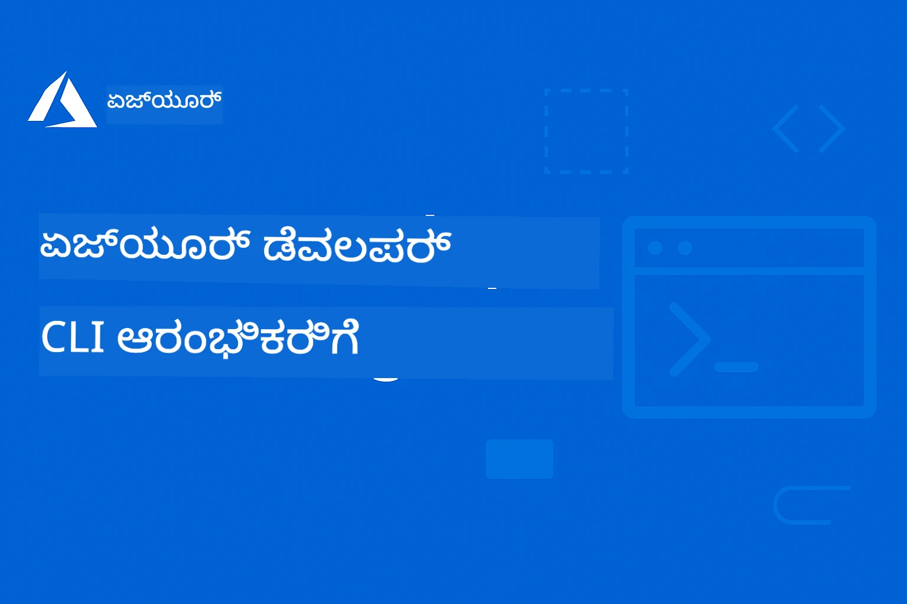

# AZD ಆರಂಭಿಕರಿಗೆ: ಸಂರಚಿತ ಕಲಿಕೆಯ ಪ್ರಯಾಣ

 

[](https://GitHub.com/microsoft/azd-for-beginners/watchers/)
[](https://GitHub.com/microsoft/azd-for-beginners/network/)
[](https://GitHub.com/microsoft/azd-for-beginners/stargazers/)

[](https://discord.com/invite/nkVh3dp)
[](https://discord.gg/nTYy5BXMWG)

---

### ಸ್ವಯಂಚಾಲಿತ ಅನುವಾದಗಳು (ಎಲ್ಲಾಗಲೂ ನವೀಕರಿಸಲಾಗಿದೆ)

<!-- CO-OP TRANSLATOR LANGUAGES TABLE START -->
[ಅರಬ್ಬಿ](../ar/README.md) | [ಬೆಂಗಾಳಿ](../bn/README.md) | [ಬಲ್ಗೇರಿಯನ್](../bg/README.md) | [ಬರ್ಮೀಸ್ (ಮ್ಯಾನ್ಮಾರ್)](../my/README.md) | [ಚೈನೀಸ್ (ಸರಳೀಕೃತ)](../zh-CN/README.md) | [ಚೈನೀಸ್ (ಪ್ರಚಲಿತ, ಹಾಂಗ್ ಕಾಂಗ್)](../zh-HK/README.md) | [ಚೈನೀಸ್ (ಪ್ರಚಲಿತ, ಮಾಕಾವ್)](../zh-MO/README.md) | [ಚೈನೀಸ್ (ಪ್ರಚಲಿತ, ತೈವಾನ್)](../zh-TW/README.md) | [ಕ್ರೋಯೇಷಿಯನ್](../hr/README.md) | [ಚೆಕ್](../cs/README.md) | [ಡೆನಿಶ್](../da/README.md) | [ಡಚ್](../nl/README.md) | [ಎಸ್ಟೊನಿಯನ್](../et/README.md) | [ಫಿನ್ನಿಷ್](../fi/README.md) | [ಫ್ರೆಂಚ್](../fr/README.md) | [ಜರ್ಮನ್](../de/README.md) | [ಗ್ರೀಕ್](../el/README.md) | [ಹೀಬ್ರೂ](../he/README.md) | [ಹಿಂದಿ](../hi/README.md) | [ಹಂಗೇರಿಯನ್](../hu/README.md) | [ಇಂಡೋನೇಶಿಯನ್](../id/README.md) | [ಇಟಾಲಿಯನ್](../it/README.md) | [ಜಪಾನಿಸ್](../ja/README.md) | [ಕನ್ನಡ](./README.md) | [ಖ್ಮೇರ್](../km/README.md) | [ಕೊರಿಯನ್](../ko/README.md) | [ಲಿಥುವೇನಿಯನ್](../lt/README.md) | [ಮಲಯ್](../ms/README.md) | [ಮಲಯಾಳಂ](../ml/README.md) | [ಮರಾಠಿ](../mr/README.md) | [ನೇಪಾಳಿ](../ne/README.md) | [ನೈಜೀರಿಯನ್ ಪಿಡ್ಜಿನ್](../pcm/README.md) | [ನಾರ್ವೇಜಿಯನ್](../no/README.md) | [ಪರ್ಶಿಯನ್ (ಫಾರ್ಸಿ)](../fa/README.md) | [ಪೋಲಿಶ್](../pl/README.md) | [ಪೋರ್ಚುಗೀಸ್ (ಬ್ರಾಜಿಲ್)](../pt-BR/README.md) | [ಪೋರ್ಚುಗೀಸ್ (ಪೋರ್ತುಗೆಲ್)](../pt-PT/README.md) | [ಪುಂಜಾಬಿ (ಗುರ್ಮುಖಿ)](../pa/README.md) | [ರೊಮೇನಿಯನ್](../ro/README.md) | [ರಶಿಯನ್](../ru/README.md) | [ಸರ್ಬಿಯನ್ (ಸಿರಿಲಿಕ್)](../sr/README.md) | [ಸ್ಲೋವಾಕ್](../sk/README.md) | [ಸ್ಲೋವೇನಿಯನ್](../sl/README.md) | [ಸ್ಪ್ಯಾನಿಷ್](../es/README.md) | [ಸ್ವಾಹಿಲಿ](../sw/README.md) | [ಸ್ವೀಡಿಷ್](../sv/README.md) | [ತಾಗಲೋಗ್ (ಫಿಲಿಪಿನೋ)](../tl/README.md) | [ತಮಿಳು](../ta/README.md) | [ತೆಲುಗು](../te/README.md) | [ಥಾಯ್](../th/README.md) | [ಟರ್ಕಿಶ್](../tr/README.md) | [ಉಕ್ರೇನಿಯನ್](../uk/README.md) | [ಉರ್ದೂ](../ur/README.md) | [ವಿಯೆಟ್ನಾಮೀಸ್](../vi/README.md)

> **ಸ್ಥಳೀಯವಾಗಿ ಕ್ಲೋನ್ ಮಾಡಲು ಆದ್ಯತೆ ನೀಡುತ್ತೀರಾ?**
>
> ಈ ರೆಪೊಸಿಟರಿ 50+ ಭಾಷಾ ಅನುವಾದಗಳನ್ನು ಒಳಗೊಂಡಿದೆ, ಇದು ಡೌನ್‌ಲೋಡ್ ಗಾತ್ರವನ್ನು ಬಹಳಷ್ಟು ಹೆಚ್ಚಿಸುತ್ತದೆ. ಅನುವಾದಗಳಿಲ್ಲದೆ ಕ್ಲೋನ್ ಮಾಡಲು, sparse checkout ಬಳಸಿರಿ:
>
> **Bash / macOS / Linux:**
> ```bash
> git clone --filter=blob:none --sparse https://github.com/microsoft/AZD-for-beginners.git
> cd AZD-for-beginners
> git sparse-checkout set --no-cone '/*' '!translations' '!translated_images'
> ```
>
> **CMD (Windows):**
> ```cmd
> git clone --filter=blob:none --sparse https://github.com/microsoft/AZD-for-beginners.git
> cd AZD-for-beginners
> git sparse-checkout set --no-cone "/*" "!translations" "!translated_images"
> ```
>
> ಇದು ನಿಮಗೆ ಕೋರ್ಸ್ ಅನ್ನು ಪೂರ್ಣಗೊಳಿಸಲು ಬೇಕಾದವನ್ನೆಲ್ಲಾ ಬಹುತೇಕ ವೇಗವಾದ ಡೌನ್‌ಲೋಡ್‌ನೊಂದಿಗೆ ನೀಡುತ್ತದೆ.
<!-- CO-OP TRANSLATOR LANGUAGES TABLE END -->

## 🆕 azd ನಲ್ಲಿ ಇವತ್ತಿನ ನವೀಕರಣಗಳು

Azure Developer CLI ಈಗ ಪರಂಪರাগত ವೆಬ್ ಅಪ್ಲಿಕೇಶನ್‌ಗಳು ಮತ್ತು API ಗಳಿಗಿಂತ ಮುಂದೆ ಬೆಳೆಯಿದೆ. ಇಂದು, azd ಎಂದರೆ Azure ಗೆ ಯಾವುದೇ ಅಪ್ಲಿಕೇಶನ್ ಅನ್ನು ನಿಯೋಜಿಸಲು ಒಂದು ಏಕೈಕ ಸಾಧನ — ಇದರಲ್ಲಿ AI-ಚಾಲಿತ ಅಪ್ಲಿಕೇಶನ್‌ಗಳು ಮತ್ತು ಬುದ್ಧಿವಂತ ಎಜೆಂಟ್‌ಗಳು ಸಹ ಸೇರಿವೆ.

ಇದರಿಂದ ನಿಮಗೆ ಏನಾಗುತ್ತದೆ:

- **AI ಏಜೆಂಟ್ಗಳು ಈಗ ಪ್ರಥಮ-ಶ್ರೇಣಿಯ azd ಕಾರ್ಯಭಾರಗಳಾಗಿದೆ.** ನೀವು ಈಗಿರುವ `azd init` → `azd up` ವರ್ಕ್‌ಫ್ಲೋ ಬಳಸಿ AI ಏಜೆಂಟ್ ಪ್ರಾಜೆಕ್ಟ್‌ಗಳನ್ನು ಪ್ರಾರಂಭಿಸಲು, ನಿಯೋಜಿಸಲು ಮತ್ತು ನಿರ್ವಹಿಸಲು ಸಾಧ್ಯ.
- **Microsoft Foundry ಇಂಟégrೇಶನ್** ಮಾದರಿ ನಿಯೋಜನೆ, ಏಜೆಂಟ್ ಹೋಸ್ಟಿಂಗ್ ಮತ್ತು AI ಸೇವೆ ಸಂರಚನೆಯನ್ನು ನೇರವಾಗಿ azd ಟೆಂಪ್ಲೇಟ್ ಇಕೋಸಿಸ್ಟಂ içine ತರುತ್ತದೆ.
- **ಮೂಲ ವರ್ಕ್‌ಫ್ಲೋ ಬದಲಾಗಿಲ್ಲ.** ನೀವು todo ಅಪ್ಲಿಕೇಶನ್, ಮೈಕ್ರೋಸರ್ವಿಸ್ ಅಥವಾ ಬಹು-ಏಜೆಂಟ್ AI ಪರಿಹಾರ ನಿಯೋಜಿಸುತ್ತಿದ್ದರೂ, ಆಜ್ಞೆಗಳು ಒಂದೇ ರೀತಿಯನ್ನೇ ಇವೆ.

ನೀವು ಹಿಂದೆ azd ಬಳಸಿದ್ದರೆ, AI ಬೆಂಬಲವು ಪ್ರಾಕೃತಿಕ ವಿಸ್ತರಣೆ — ಯಾವುದೇ ಬೇರೆ ಸಾಧನ ಅಥವಾ ವಿಶೇಷ ಮಾರ್ಗವಲ್ಲ. ಹೊಸದಾಗಿ ಪ್ರಾರಂಭಿಸುತ್ತಿದ್ದರೆ, ಒಂದೇ ವರ್ಕ್‌ಫ್ಲೋ ಎಲ್ಲದಕ್ಕೂ ಕೆಲಸಮಾಡುತ್ತದೆ.

---

## 🚀 Azure Developer CLI (azd) ಎಂಬುದು ಏನು?

**Azure Developer CLI (azd)** ಒಂದು ಡೆವಲಪರ್-ಅನುಕೂಲವಾದ ಕಮಾಂಡ್-ಲೈನ್ ಸಾಧನವಾಗಿದ್ದು, Azure ಗೆ ಅಪ್ಲಿಕೇಶನ್‌ಗಳನ್ನು ನಿಯೋಜಿಸಲು ಸರಳವಾಗಿಸುತ್ತದೆ. ಅನೇಕ Azure ಸಂಪನ್ಮೂಲಗಳನ್ನು ಕೈಯಿಂದ ರಚಿಸುವ ಮತ್ತು ಸಂಪರ್ಕಿಸುವ ಬದಲಿ, ನೀವು ಒಂದು ಕಮಾಂಡ್‌ನಿಂದ ಸಂಪೂರ್ಣ ಅಪ್ಲಿಕೇಶನ್‌ಗಳನ್ನು ನಿಯೋಜಿಸಬಹುದು.

### `azd up` ಅವರ ಮಾಯಾಜಾಲ

```bash
# ಈ ಒಂದೇ ಆದೇಶ ಎಲ್ಲವನ್ನೂ ಮಾಡಲು ಸಾಧ್ಯ:
# ✅ ಎಲ್ಲಾ ಆಜೂರ್ ಸಂಪನ್ಮೂಲಗಳನ್ನು ಸೃಷ್ಟಿಸುತ್ತದೆ
# ✅ ನೆಟ್ವರ್ಕಿಂಗ್ ಮತ್ತು ಭದ್ರತೆ ಕನ್ಫಿಗರ್ ಮಾಡುತ್ತದೆ
# ✅ ನಿಮ್ಮ ಅಪ್ಲಿಕೇಶನ್ ಕೋಡ್ ಅನ್ನು ರಚಿಸುತ್ತದೆ
# ✅ ಆಜೂರ್‌ಗೆ ಅಪ್ಲೋಡ್ ಮಾಡುತ್ತದೆ
# ✅ ಕಾರ್ಯಾಚರಣೆ ಮಾಡಬಹುದಾದ URL ಅನ್ನು ನೀಡುತ್ತದೆ
azd up
```

**ಅಲ್ಲೇ!** Azure Portal ಕ್ಲಿಕ್‌ಮಾಡುವ ಅವಶ್ಯಕತೆ ಇಲ್ಲ, ಮೊದಲು ARM ಟೆಂಪ್ಲೇಟುಗಳನ್ನು ಜಟಿಲವಾಗಿ ಕಲಿಯಬೇಕಾದ ಅಗತ್ಯ ಇಲ್ಲ, ಕೈಯಿಂದ ಸಂರಚನೆ ಅಗತ್ಯವಿಲ್ಲ — ಕೇವಲ ಕೆಲಸ ಮಾಡುವ ಅಪ್ಲಿಕೇಶನ್‌ಗಳು Azure ಮೇಲೆ ಸಜ್ಜು.

---

## ❓ Azure Developer CLI vs Azure CLI: ವ್ಯತ್ಯಾಸವೇನು?

ಇದು ಪ್ರಾರಂಭಿಕರುಳ್ಳಲ್ಲಿ ಅತ್ಯಂತ ಸಾಮಾನ್ಯವಾದ ಪ್ರಶ್ನೆ. ಇಲ್ಲಿದೆ ಸರಳ ಉತ್ತರ:

| ವೈಶಿಷ್ಟ್ಯ | **Azure CLI (`az`)** | **Azure Developer CLI (`azd`)** |
|---------|---------------------|--------------------------------|
| **ಉದ್ದೇಶ** | ವೈಯಕ್ತಿಕ Azure ಸಂಪನ್ಮೂಲಗಳನ್ನು ನಿರ್ವಹಿಸುವುದು | ಸಂಪೂರ್ಣ ಅಪ್ಲಿಕೇಶನ್‌ಗಳನ್ನು ನಿಯೋಜಿಸುವುದು |
| **ಮನೋಭಾವ** | ಇನ್‌ಫ್ರಾಸ್ಟ್ರಕ್ಚರ್-ಕೇಂದ್ರೀಯ | ಅಪ್ಲಿಕೇಶನ್-ಕೇಂದ್ರೀಯ |
| **ಉದಾಹರಣೆ** | `az webapp create --name myapp...` | `azd up` |
| **ಕಲಿಕೆಯ ವಕ್ರತೆ** | Azure ಸೇವೆಗಳ ಬಗ್ಗೆ ತಿಳಿದಿರಬೇಕು | ನಿಮ್ಮ ಅಪ್ಲಿಕೇಶನ್ ಅನ್ನು ಮಾತ್ರ ತಿಳಿದುಕೊಳ್ಳಿ |
| **ಯಾರಿಗೆ ಉತ್ತಮ** | DevOps, ಇನ್‌ಫ್ರಾಸ್ಟ್ರಕ್ಚರ್ | ಡೆವಲಪರ್‌ಗಳು, ಪ್ರೋಟೋಟೈಪಿಂಗ್ |

### ಸರಳ ರೂಪಕ

- **Azure CLI** ಮನೆ ಕಟ್ಟುವ ಎಲ್ಲಾ ಸಾಧನಗಳನ್ನು ಹೊಂದಿರುವಂತೆ — ಹ್ಯಾಮರ್‌ಗಳು, ಕತ್ತಿಗಳು, ಹಿಮ್ಮುಖಗಳು. ನೀವು ಏನನ್ನಾದರೂ ಕಟ್ಟಬಹುದು, ಆದರೆ ನಿರ್ಮಾಣ ತಿಳಿದಿರಬೇಕು.
- **Azure Developer CLI** ಗೃಹವ್ಯಾಸಿಯನ್ನು ನೇಮಿಸುವಂತೆ — ನೀವು ಏನು ಬೇಕೊ ಹೇಳುತ್ತೀರಿ, ಅವರು ಕಟ್ಟುವ ಕೆಲಸವನ್ನು ತೆಗೆದುಕೊಳ್ಳುತ್ತಾರೆ.

### ಯಾವಾಗ ಯಾವುದು ಬಳಸಬೇಕು

| ಸ್ಥಿತಿ | ಇದನ್ನು ಬಳಸಿ |
|----------|----------|
| "ನಾನು ನನ್ನ ವೆಬ್ ಅಪ್ಲಿಕೇಶನ್ ಅನ್ನು ಬೇಗನೇ ನಿಯೋಜಿಸಲು ಬಯಸುತ್ತೇನೆ" | `azd up` |
| "ನಾನು ಕೇವಲ ಒಂದು ಸ್ಟೋರೇಜ್ ಖಾತೆಯನ್ನು ರಚಿಸಬೇಕಿದೆ" | `az storage account create` |
| "ನಾನು ಪೂರ್ಣ AI ಅಪ್ಲಿಕೇಶನ್ ನಿರ್ಮಿಸುತ್ತಿದ್ದೇನೆ" | `azd init --template azure-search-openai-demo` |
| "ನಾನು विशಿಷ್ಟ Azure ಸಂಪನ್ಮೂಲವನ್ನು ಡಿಬಗ್ ಮಾಡಬೇಕಿದೆ" | `az resource show` |
| "ನಾನು ನிமಿಷಗಳಲ್ಲಿ ಪ್ರೊಡಕ್ಷನ್-ಯೋಗ್ಯ ನಿಯೋಜನೆಯನ್ನು ಬಯಸುತ್ತೇನೆ" | `azd up --environment production` |

### ಅವು ಒಟ್ಟಿಗೆ ಕೆಲಸ ಮಾಡುತ್ತವೆ!

AZD ಒಳಗೆ Azure CLI ಅನ್ನು ಬಳಸುತ್ತದೆ. ನೀವು ಎರಡನ್ನೂ ಬಳಸಿಬಹುದು:
```bash
# ನಿಮ್ಮ ಅಪ್ಲಿಕೇಶನನ್ನು AZD ಬಳಸಿ ನಿಯೋಜಿಸಿ
azd up

# ನಂತರ Azure CLI ಯೊಂದಿಗೆ ನಿರ್ದಿಷ್ಟ ಸಂಪನ್ಮೂಲಗಳನ್ನು ಸುಧಾರಿಸಿ
az webapp config set --name myapp --always-on true
```

---

## 🌟 Awesome AZD ನಲ್ಲಿ ಟೆಂಪ್ಲೇಟ್‌ಗಳನ್ನು ಕಂಡುಹಿಡಿಯಿರಿ

ಶೂನ್ಯದಿಂದ ಪ್ರಾರಂಭಿಸಬೇಡಿ! **Awesome AZD** ಸಮುದಾಯದ ತಯಾರಾದ, ನಿಯೋಜಿಸಲು ಸಿದ್ಧವಾದ ಟೆಂಪ್ಲೇಟ್‌ಗಳ ಸಂಗ್ರಹವಾಗಿದೆ:

| ಸಂಪನ್ಮೂಲ | ವಿವರಣೆ |
|----------|-------------|
| 🔗 [**Awesome AZD Gallery**](https://azure.github.io/awesome-azd/) | ಒಂದು ಕ್ಲಿಕ್ಕಿನಿಂದ ನಿಯೋಜನೆ ಮಾಡಬಹುದಾದ 200+ ಟೆಂಪ್ಲೇಟ್‌ಗಳನ್ನು ಬ್ರೌಸ್ ಮಾಡಿ |
| 🔗 [**Submit a Template**](https://github.com/Azure/awesome-azd/issues) | ನಿಮ್ಮದೇ ಟೆಂಪ್ಲೇಟ್ ಅನ್ನು ಸಮುದಾಯಕ್ಕೆ ಕೊಡುಗೆ ನೀಡಿ |
| 🔗 [**GitHub Repository**](https://github.com/Azure/awesome-azd) | ಮೂಲವನ್ನು ಸ್ಟಾರೋ ಮಾಡಿ ಮತ್ತು ಅನ್ವೇಷಿಸಿ |

### Awesome AZD ನಿಂದ ಜನಪ್ರಿಯ AI ಟೆಂಪ್ಲೇಟ್‌ಗಳು

```bash
# ಮೈಕ್ರೋಸಾಫ್ಟ್ ಫೌಂಡ್ರಿ ಮಾದರಿಗಳು + AI ಷರ್ಚ್ ಜೊತೆಗೆ RAG ಚಾಟ್
azd init --template azure-search-openai-demo

# ತ್ವರಿತ AI ಚಾಟ್ ಅನುವರ್ಥನ
azd init --template openai-chat-app-quickstart

# ಫೌಂಡ್ರಿ ಏಜೆಂಟುಗಳೊಂದಿಗೆ AI ಏಜೆಂಟುಗಳು
azd init --template get-started-with-ai-agents
```

---

## 🎯 3 ಹಂತಗಳಲ್ಲಿ ಪ್ರಾರಂಭಿಸುವುದು

### ಹಂತ 1: AZD ಅನ್ನು ಇನ್‌ಸ್ಟಾಲ್ ಮಾಡಿ (2 ನಿಮಿಷ)

**Windows:**
```powershell
winget install microsoft.azd
```

**macOS:**
```bash
brew tap azure/azd && brew install azd
```

**Linux:**
```bash
curl -fsSL https://aka.ms/install-azd.sh | bash
```

### ಹಂತ 2: Azure ಗೆ ಲಾಗಿನ್ ಮಾಡಿ

```bash
azd auth login
```

### ಹಂತ 3: ನಿಮ್ಮ ಮೊದಲ ಅಪ್ಲಿಕೇಶನ್ ಅನ್ನು ನಿಯೋಜಿಸಿ

```bash
# ಟೆಂಪ್ಲೇಟಿನಿಂದ ಪ್ರಾರಂಭಿಸಿ
azd init --template todo-nodejs-mongo

# ಅಜ್ಯೂರ್‌ಗೆ ನಿಯೋಜಿಸಿ (ಎಲ್ಲವನ್ನೂ ಸೃಷ್ಟಿಸುತ್ತದೆ!)
azd up
```

**🎉 ಆಗೋದೆ!** ನಿಮ್ಮ ಅಪ್ಲಿಕೇಶನ್ ಈಗ Azure ನಲ್ಲಿ ಲೈವ್ ಆಗಿದೆ.

### ಸಫಾಯಿ (ಮರೆತರೆ ಬಿಡಬೇಡಿ!)

```bash
# Remove all resources when done experimenting
azd down --force --purge
```

---

## 📚 ಈ ಕೋರ್ಸ್ ಅನ್ನು ಹೇಗೆ ಬಳಸುವುದು

ಈ ಕೋರ್ಸ್ ಅನ್ನು **ಕ್ರಮೇಣ ಕಲಿಕೆ**ಗಾಗಿ ವಿನ್ಯಾಸಗೊಳಿಸಲಾಗಿದೆ - ನೀವು ಆರಾಮದಾಯಕವಾಗಿರುವ ಸ್ಥಳದಿಂದ ಪ್ರಾರಂಭಿಸಿ ಮತ್ತು ನಿರಂತರವಾಗಿ ಮುಂದಾಗಿರಿ:

| ನಿಮ್ಮ ಅನುಭವ | ಇಲ್ಲಿ ಪ್ರಾರಂಭಿಸಿ |
|-----------------|------------|
| **Azure ನಲ್ಲಿ ಹೊಸದಾಗಿ ಇದ್ದವರು** | [ಅಧ್ಯಾಯ 1: ಮೂಲಭೂತ](#-chapter-1-foundation--quick-start) |
| **Azure ತಿಳಿದಿದೆ, AZD ಹೊಸದು** | [ಅಧ್ಯಾಯ 1: ಮೂಲಭೂತ](#-chapter-1-foundation--quick-start) |
| **AI ಅಪ್ಲಿಕೇಶನ್‌ಗಳನ್ನು ನಿಯೋಜಿಸಲು ಬಯಸುವವರು** | [ಅಧ್ಯಾಯ 2: AI-ಪ್ರಥಮ ಅಭಿವೃದ್ಧಿ](#-chapter-2-ai-first-development-recommended-for-ai-developers) |
| **ಹ್ಯಾಂಡ್-ಆನ್ ಅಭ್ಯಾಸ ಬೇಕು** | [🎓 ಇಂಟರಕ್ಟಿವ್ ವರ್ಕ್‌ಶಾಪ್](workshop/README.md) - 3-4 ಗಂಟೆಗಳ ಮಾರ್ಗದರ್ಶಿತ ಲ್ಯಾಬ್ |
| **ಪ್ರೊಡಕ್ಷನ್ ಮಾದರಿಗಳು ಬೇಕು** | [ಅಧ್ಯಾಯ 8: ಪ್ರೊಡಕ್ಷನ್ & ಎಂಟರ್ಪ್ರೈಸ್](#-chapter-8-production--enterprise-patterns) |

### ತ್ವರಿತ ಸೆಟಪ್

1. **ಈ ರೆಪೊ ಅನ್ನು Fork ಮಾಡಿ**: [](https://GitHub.com/microsoft/azd-for-beginners/fork)
2. **ಇದನ್ನು ಕ್ಲೋನ್ ಮಾಡಿ**: `git clone https://github.com/YOUR-USERNAME/azd-for-beginners.git`
3. **ಸಹಾಯ ಪಡೆಯಿ**: [Azure Discord ಸಮುದಾಯ](https://discord.com/invite/ByRwuEEgH4)

> **ಸ್ಥಳೀಯವಾಗಿ ಕ್ಲೋನ್ ಮಾಡಲು ಆದ್ಯತೆ ನೀಡುತ್ತೀರಾ?**
>
> ಈ ರೆಪೊಸಿಟರಿ 50+ ಭಾಷಾ ಅನುವಾದಗಳನ್ನು ಒಳಗೊಂಡಿದೆ, ಇದು ಡೌನ್‌ಲೋಡ್ ಗಾತ್ರವನ್ನು ಬಹಳಷ್ಟು ಹೆಚ್ಚಿಸುತ್ತದೆ. ಅನುವಾದಗಳಿಲ್ಲದೆ ಕ್ಲೋನ್ ಮಾಡಲು, sparse checkout ಬಳಸಿರಿ:
> ```bash
> git clone --filter=blob:none --sparse https://github.com/microsoft/AZD-for-beginners.git
> cd AZD-for-beginners
> git sparse-checkout set --no-cone '/*' '!translations' '!translated_images'
> ```
> ಇದು ನಿಮಗೆ ಕೋರ್ಸ್ ಅನ್ನು ಪೂರ್ಣಗೊಳಿಸಲು ಬೇಕಾದವನ್ನೆಲ್ಲಾ ಬಹುತೇಕ ವೇಗವಾದ ಡೌನ್‌ಲೋಡ್‌ನೊಂದಿಗೆ ನೀಡುತ್ತದೆ.


## ಕೋರ್ಸ್ ಅವಲೋಕನ

ಸಂರಚಿತ ಅಧ್ಯಾಯಗಳ ಮೂಲಕ Azure Developer CLI (azd) ನು ಬಳಸನ್ನು ಆವೀನವಾಗಿ ಅಧ್ಯಯನ ಮಾಡಿ. **Microsoft Foundry ಇಂಟಿಗ್ರೇಶನ್ ಜೊತೆಗೆ AI ಅಪ್ಲಿಕೇಶನ್ ನಿಯೋಜನೆ ಮೇಲೆ ವಿಶೇಷ ಗಮನ.**

### आधुनिक ಡೆವಲಪರ್‌ಗಳಿಗೆ ಈ ಕೋರ್ಸ್ ಏಕೆ ಅವಶ್ಯಕ

Microsoft Foundry Discord ಸಮುದಾಯದ ವಿಚಾರಾಧಾರಿತ ಮಾಹಿತಿಯ ಆಧಾರದಲ್ಲಿ, **45% ಡೆವಲಪರ್‌ಗಳು AZD ಅನ್ನು AI ವರ್ಕ್‌ಲೋಡ್ಗಳಿಗಾಗಿ ಬಳಸಲು ಬಯಸುತ್ತಾರೆ** ಆದರೆ ಅವರು ಈ ಸಮಸ್ಯೆಗಳನ್ನು ಎದುರಿಸುತ್ತಾರೆ:
- ಜಟಿಲ ಬಹು-ಸೇವೆ AI वास्तುಶಿಲ್ಪಗಳು
- ಪ್ರೊಡಕ್ಷನ್ AI ನಿಯೋಜನೆ ಉತ್ತಮ ಅಭ್ಯಾಸಗಳು  
- Azure AI ಸೇವೆಗಳ ಅಂಟಣೆ ಮತ್ತು ಸಂರಚನೆ
- AI ವರ್ಕ್‌ಲೋಡ್‌ಗಳ ವೆಚ್ಚ 최적화
- AI-ವಿಶಿಷ್ಟ ನಿಯೋಜನಾ ಸಮಸ್ಯೆಗಳ ತಿದ್ದಾಟ

### ಕಲಿಕೆಯ ಉದ್ದೇಶಗಳು

ಈ ಸಂರಚಿತ ಕೋರ್ಸ್ ಪೂರ್ಣಗೊಳಿಸಿದರೆ, ನೀವು:
- **AZD ಮೂಲಭೂತಗಳನ್ನು ಪಾಸ್ ಮಾಡಿ**: ಕೋರ್‌ ಸಂಶೋಧನೆಗಳು, ಇನ್‌ಸ್ಟಾಲ್ ಮತ್ತು ಸಂರಚನೆ
- **AI ಅಪ್ಲಿಕೇಶನ್‌ಗಳನ್ನು ನಿಯೋಜಿಸಿ**: AZD ಅನ್ನು Microsoft Foundry ಸೇವೆಗಳೊಂದಿಗೆ ಬಳಸಿ
- **Infrastructure as Code ನ жүзегеರೂಪಿಸು**: Bicep ಟೆಂಪ್ಲೇಟ್‌ಗಳೊಂದಿಗೆ Azure ಸಂಪನ್ಮೂಲಗಳನ್ನು ನಿರ್ವಹಿಸಿ
- **ನಿಯೋಜನೆಗಳನ್ನು ಡಿಬಗ್ ಮಾಡಿ**: ಸಾಮಾನ್ಯ ಸಮಸ್ಯೆಗಳನ್ನು ಪರಿಹರಿಸಿ ಮತ್ತು ಡಿಬಗಿನ ಪರಿಹಾರಗಳು
- **ಪ್ರೊಡಕ್ಷನ್‌ಗೆ 최적ಗೊಳಿಸಿ**: ಭದ್ರತೆ, ಸ್ವಲ್ಪಿಕೆ, ಮಾನಿಟರಿಂಗ್ ಮತ್ತು ವೆಚ್ಚ ನಿರ್ವಹಣೆ
- **ಬಹು-ಏಜೆಂಟ್ ಪರಿಹಾರಗಳನ್ನು ನಿರ್ಮಿಸಿ**: ಜಟಿಲ AI ವಾಸ್ತುಶಿಲ್ಪಗಳನ್ನು ನಿಯೋಜಿಸಿ

## 🗺️ ಕೋರ್ಸ್ ನಕ್ಷೆ: ಅಧ್ಯಾಯದ ಮೂಲಕ ತ್ವರಿತ ನಾವಿಗೇಶನ್

ಪ್ರತಿಯೊಂದು ಅಧ್ಯಾಯಕ್ಕೂ ಗುರಿಯಾಗಿರುವ README ಇದೆ, ಕಲಿಕೆಯ ಉದ್ದೇಶಗಳು, ತ್ವರಿತ ಪ್ರಾರಂಭ ಮತ್ತು ಅಭ್ಯಾಸಗಳು:

| ಅಧ್ಯಾಯ | ವಿಷಯ | ಪಾಠಗಳು | ಅವಧಿ | ಸಂಕೀರ್ಣತೆ |
|---------|-------|---------|----------|------------|
| **[ಅಧ್ಯಾಯ 1: ಮೂಲಭೂತ](docs/chapter-01-foundation/README.md)** | ಪ್ರಾರಂಭಿಸುವುದು | [AZD ಮೂಲಭೂತಗಳು](docs/chapter-01-foundation/azd-basics.md) &#124; [ಸಂಸ್ಥಾಪನೆ](docs/chapter-01-foundation/installation.md) &#124; [ಪ್ರಥಮ ಪ್ರಾಜೆಕ್ಟ್](docs/chapter-01-foundation/first-project.md) | 30-45 min | ⭐ |
| **[ಅಧ್ಯಾಯ 2: AI ಅಭಿವೃದ್ಧಿ](docs/chapter-02-ai-development/README.md)** | AI-ಪ್ರಥಮ ಅಪ್ಲಿಕೇಶನ್ಗಳು | [Foundry ಸಂಯೋಜನೆ](docs/chapter-02-ai-development/microsoft-foundry-integration.md) &#124; [AI ಏಜೆಂಟ್ಗಳು](docs/chapter-02-ai-development/agents.md) &#124; [ಮಾದರಿ ನಿಯೋಜನೆ](docs/chapter-02-ai-development/ai-model-deployment.md) &#124; [ಕಾರ್ಯಾಗಾರ](docs/chapter-02-ai-development/ai-workshop-lab.md) | 1-2 ಗಂಟೆಗಳು | ⭐⭐ |
| **[ಅಧ್ಯಾಯ 3: ಕಾನ್ಫಿಗರೇಶನ್](docs/chapter-03-configuration/README.md)** | ಪ್ರಮಾಣೀಕರಣ ಮತ್ತು ಸುರಕ್ಷತೆ | [ಕಾನ್ಫಿಗರೇಶನ್](docs/chapter-03-configuration/configuration.md) &#124; [ಪ್ರಮಾಣೀಕರಣ ಮತ್ತು ಸುರಕ್ಷತೆ](docs/chapter-03-configuration/authsecurity.md) | 45-60 ನಿಮಿಷಗಳು | ⭐⭐ |
| **[ಅಧ್ಯಾಯ 4: ಮೂಲಸೌಕರ್ಯ](docs/chapter-04-infrastructure/README.md)** | IaC ಮತ್ತು ನಿಯೋಜನೆ | [ನಿಯೋಜನಾ ಮಾರ್ಗದರ್ಶಿ](docs/chapter-04-infrastructure/deployment-guide.md) &#124; [ಪ್ರೊವಿಷನಿಂಗ್](docs/chapter-04-infrastructure/provisioning.md) | 1-1.5 ಗಂಟೆಗಳು | ⭐⭐⭐ |
| **[ಅಧ್ಯಾಯ 5: ಬಹು-ಏಜೆಂಟ್](docs/chapter-05-multi-agent/README.md)** | AI ಏಜೆಂಟ್ ಪರಿಹಾರಗಳು | [ರಿಟೇಲ್ ದೃಶ್ಯ](examples/retail-scenario.md) &#124; [ಸಮನ್ವಯ ಮಾದರಿಗಳು](docs/chapter-06-pre-deployment/coordination-patterns.md) | 2-3 ಗಂಟೆಗಳು | ⭐⭐⭐⭐ |
| **[ಅಧ್ಯಾಯ 6: ಪೂರ್ವ-ನಿಯೋಜನೆ](docs/chapter-06-pre-deployment/README.md)** | ಯೋಜನೆ ಮತ್ತು ಮಾನ್ಯತೆ | [ಪೂರ್ವ-ಪರೀಕ್ಷೆಗಳು](docs/chapter-06-pre-deployment/preflight-checks.md) &#124; [ಸಾಮರ್ಥ್ಯ ಯೋಜನೆ](docs/chapter-06-pre-deployment/capacity-planning.md) &#124; [SKU ಆಯ್ಕೆ](docs/chapter-06-pre-deployment/sku-selection.md) &#124; [App Insights](docs/chapter-06-pre-deployment/application-insights.md) | 1 ಗಂಟೆ | ⭐⭐ |
| **[ಅಧ್ಯಾಯ 7: ತೊಂದರೆ ಪರಿಹಾರ](docs/chapter-07-troubleshooting/README.md)** | ಡಿಬಗ್ ಮತ್ತು ಸರಿಪಡಿಸಿ | [ಸಾಮಾನ್ಯ ಸಮಸ್ಯೆಗಳು](docs/chapter-07-troubleshooting/common-issues.md) &#124; [ಡಿಬಗ್ ಮಾಡುವುದು](docs/chapter-07-troubleshooting/debugging.md) &#124; [AI ಸಮಸ್ಯೆಗಳು](docs/chapter-07-troubleshooting/ai-troubleshooting.md) | 1-1.5 ಗಂಟೆಗಳು | ⭐⭐ |
| **[ಅಧ್ಯಾಯ 8: ಉತ್ಪಾದನೆ](docs/chapter-08-production/README.md)** | ಎಂಟರ್‌ಪ್ರೈಸ್ ಮಾದರಿಗಳು | [ಉತ್ಪಾದನಾ நடைಮுறைಗಳು](docs/chapter-08-production/production-ai-practices.md) | 2-3 ಗಂಟೆಗಳು | ⭐⭐⭐⭐ |
| **[🎓 ಕಾರ್ಯಾಗಾರ](workshop/README.md)** | ಪ್ರಾಯೋಗಿಕ ಪ್ರಯೋಗಾಲಯ | [ಪರಿಚಯ](workshop/docs/instructions/0-Introduction.md) &#124; [ಆಯ್ಕೆ](workshop/docs/instructions/1-Select-AI-Template.md) &#124; [ಮಾನ್ಯತೆ](workshop/docs/instructions/2-Validate-AI-Template.md) &#124; [ವಿಭಜನೆ](workshop/docs/instructions/3-Deconstruct-AI-Template.md) &#124; [ಕಾನ್ಫಿಗರೇಶನ್](workshop/docs/instructions/4-Configure-AI-Template.md) &#124; [ಕಸ್ಟಮೈಸೇಷನ್](workshop/docs/instructions/5-Customize-AI-Template.md) &#124; [ಅಳಿಕೆ](workshop/docs/instructions/6-Teardown-Infrastructure.md) &#124; [ಸಾರಾಂಶ](workshop/docs/instructions/7-Wrap-up.md) | 3-4 ಗಂಟೆಗಳು | ⭐⭐ |

**ಒಟ್ಟು ಕೋರ್ಸ್ ಅವಧಿ:** ~10-14 ಗಂಟೆಗಳು | **ಕೌಶಲ್ಯ ಪ್ರಗತಿ:** ಆರಂಭಿಕ → ಉತ್ಪಾದನೆ-ಸಿದ್ಧ

---

## 📚 ಶಿಕ್ಷಣ ಅಧ್ಯಾಯಗಳು

*ನಿಮ್ಮ ಅನುಭವ ಮಟ್ಟ ಮತ್ತು ಗುರಿಗಳ ಆಧಾರದ ಮೇಲೆ ನಿಮ್ಮ ಅಧ್ಯಯನ ಮಾರ್ಗವನ್ನು ಆಯ್ಕೆಮಾಡಿ*

### 🚀 ಅಧ್ಯಾಯ 1: ಮೂಲಭೂತ ಮತ್ತು ತ್ವರಿತ ಪ್ರಾರಂಭ
**ಪೂರ್ವಶರತ್ತುಗಳು**: Azure ಚಂದಾ, ಮೂಲಭೂತ ಕಮಾಂಡ್ ಲೈನ್ ಜ್ಞಾನ  
**ಅವಧಿ**: 30-45 ನಿಮಿಷಗಳು  
**ಸಂಕೀರ್ಣತೆ**: ⭐

#### ನೀವು ಕಲಿಯುವ ವಿಷಯಗಳು
- Azure Developer CLI ಮೂಲಭೂತಾಂಶಗಳನ್ನು ಅರ್ಥಮಾಡಿಕೊಳ್ಳುವುದು
- ನಿಮ್ಮ ವೇದಿಕೆಯಲ್ಲಿ AZD ಅನ್ನು ಸ್ಥಾಪಿಸುವುದು
- ನಿಮ್ಮ ಮೊದಲ ಯಶಸ್ವಿ ನಿಯೋಜನೆ

#### ಕಲಿಕೆ ಸಂಪನ್ಮೂಲಗಳು
- **🎯 ಇಲ್ಲಿ ಪ್ರಾರಂಭಿಸಿ**: [Azure Developer CLI ಏನು?](#what-is-azure-developer-cli)
- **📖 ಸಿದ್ಧಾಂತ**: [AZD ಮೂಲಭೂತ](docs/chapter-01-foundation/azd-basics.md) - ಮೂಲಭೂತ ಪರಿಕಲ್ಪನೆಗಳು ಮತ್ತು ಪದವಿನಿಯಮ
- **⚙️ ಸ್ಥಾಪನೆ**: [Installation & Setup](docs/chapter-01-foundation/installation.md) - ವೇದಿಕೆ-ನಿರ್ದಿಷ್ಟ ಮಾರ್ಗದರ್ಶಿಗಳು
- **🛠️ ಪ್ರಾಯೋಗಿಕ**: [ನಿಮ್ಮ ಮೊದಲ ಪ್ರಾಜೆಕ್ಟ್](docs/chapter-01-foundation/first-project.md) - ಹಂತ ಹಂತದ ಪರಿಚಯ
- **📋 ವೇಗದ ಉಲ್ಲೇಖ**: [Command Cheat Sheet](resources/cheat-sheet.md)

#### ಪ್ರಾಯೋಗಿಕ ವ್ಯಾಯಾಮಗಳು
```bash
# ತ್ವರಿತ ಸ್ಥಾಪನೆ ಪರಿಶೀಲನೆ
azd version

# ನಿಮ್ಮ ಮೊದಲ ಅಪ್ಲಿಕೇಶನ್ ಅನ್ನು ನಿಯೋಜಿಸಿ
azd init --template todo-nodejs-mongo
azd up
```

**💡 ಅಧ್ಯಾಯ ಫಲಿತಾಂಶ**: AZD ಬಳಸಿ ಸರಳ ವೆಬ್ ಅಪ್ಲಿಕೇಶನ್ ಅನ್ನು Azure ಗೆ ಯಶಸ್ವಿಯಾಗಿ ನಿಯೋಜಿಸುವುದು

**✅ ಯಶಸ್ಸಿನ ಮಾನ್ಯತೆ:**
```bash
# ಅಧ್ಯಾಯ 1 ಅನ್ನು ಪೂರ್ಣಗೊಳಿಸಿದ ನಂತರ, ನೀವು ಈ ಕಾರ್ಯಗಳನ್ನು ಮಾಡಲು ಸಾಧ್ಯವಾಗಬೇಕು:
azd version              # ಸ್ಥಾಪಿತ ಆವೃತ್ತಿಯನ್ನು ತೋರಿಸುತ್ತದೆ
azd init --template todo-nodejs-mongo  # ಪ್ರಾಜೆಕ್ಟ್ ಅನ್ನು ಪ್ರಾರಂಭಿಸುತ್ತದೆ
azd up                  # Azure ಗೆ ನಿಯೋಜಿಸುತ್ತದೆ
azd show                # ಚಾಲನೆಯಲ್ಲಿರುವ ಅಪ್ಲಿಕೇಶನ್‌ನ URL ಅನ್ನು ಪ್ರದರ್ಶಿಸುತ್ತದೆ
# ಅಪ್ಲಿಕೇಶನ್ ಬ್ರೌಸರ್‌ನಲ್ಲಿ ತೆರೆಯುತ್ತದೆ ಮತ್ತು ಕಾರ್ಯನಿರ್ವಹಿಸುತ್ತದೆ
azd down --force --purge  # ಸಂಪನ್ಮೂಲಗಳನ್ನು ತೆರವುಗೊಳಿಸುತ್ತದೆ
```

**📊 ಸಮಯದ ಹೂಡಿಕೆ:** 30-45 ನಿಮಿಷಗಳು  
**📈 ಹೂಡಿಕೆಯ ನಂತರದ ಕೌಶಲ್ಯ ಮಟ್ಟ:** ಸ್ವತಂತ್ರವಾಗಿ ಮೂಲ ಅಪ್ಲಿಕೇಶನ್ಗಳನ್ನು ನಿಯೋಜಿಸಬಲ್ಲರು
**📈 ಹೂಡಿಕೆಯ ನಂತರದ ಕೌಶಲ್ಯ ಮಟ್ಟ:** ಸ್ವತಂತ್ರವಾಗಿ ಮೂಲ ಅಪ್ಲಿಕೇಶನ್ಗಳನ್ನು ನಿಯೋಜಿಸಬಲ್ಲರು

---

### 🤖 ಅಧ್ಯಾಯ 2: AI-ಪ್ರಥಮ ಅಭಿವೃದ್ಧಿ (AI ಡೆವಲಪರ್‌ಗಳಿಗೆ ಶಿಫಾರಸು)
**ಪೂರ್ವಶರತ್ತುಗಳು**: ಅಧ್ಯಾಯ 1 ಪೂರ್ಣಗೊಂಡಿರಬೇಕು  
**ಅವಧಿ**: 1-2 ಗಂಟೆಗಳು  
**ಸಂಕೀರ್ಣತೆ**: ⭐⭐

#### ನೀವು ಕಲಿಯುವ ವಿಷಯಗಳು
- Microsoft Foundry ನ್ನು AZD ಜೊತೆ ಸಂಯೋಜಿಸುವುದು
- AI-ಚಾಲಿತ ಅಪ್ಲಿಕೇಶನ್ಗಳನ್ನು ನಿಯೋಜಿಸುವುದು
- AI ಸೇವೆಗಳ ಸಂರಚನೆಗಳನ್ನು ಅರ್ಥಮಾಡಿಕೊಳ್ಳುವುದು

#### ಕಲಿಕೆ ಸಂಪನ್ಮೂಲಗಳು
- **🎯 ಇಲ್ಲಿ ಪ್ರಾರಂಭಿಸಿ**: [Microsoft Foundry ಸಂಯೋಜನೆ](docs/chapter-02-ai-development/microsoft-foundry-integration.md)
- **🤖 AI ಏಜೆಂಟ್ಗಳು**: [AI Agents Guide](docs/chapter-02-ai-development/agents.md) - AZD ಬಳಸಿ ಬುದ್ಧಿವಂತ ಏಜೆಂಟ್ಗಳನ್ನು ನಿಯೋಜಿಸಿ
- **📖 ಮಾದರಿಗಳು**: [AI ಮಾದರಿ ನಿಯೋಜನೆ](docs/chapter-02-ai-development/ai-model-deployment.md) - AI ಮಾದರಿಗಳನ್ನು ನಿಯೋಜಿಸಿ ಮತ್ತು ನಿರ್ವಹಿಸಿ
- **🛠️ ಕಾರ್ಯಾಗಾರ**: [AI Workshop Lab](docs/chapter-02-ai-development/ai-workshop-lab.md) - ನಿಮ್ಮ AI ಪರಿಹಾರಗಳನ್ನು AZD-ಗಾಗಿ ಸಜ್ಜುಗೊಳಿಸಿ
- **🎥 ಸಂವಹನ ಮಾರ್ಗದರ್ಶಿ**: [Workshop Materials](workshop/README.md) - MkDocs * DevContainer ಪರಿಸರದೊಂದಿಗೆ ಬ್ರೌಸರ್-ಆಧಾರಿತ ಅಧ್ಯಯನ
- **📋 ಟೆಂಪ್ಲೇಟ್ಗಳು**: [Microsoft Foundry ಟೆಂಪ್ಲೇಟ್ಗಳು](#ಕಾರ್ಯಾಗಾರ-ಸಂಪನ್ಮೂಲಗಳು)
- **📝 ಉದಾಹರಣೆಗಳು**: [AZD Deployment Examples](examples/README.md)

#### ಪ್ರಾಯೋಗಿಕ ಅಭ್ಯಾಸಗಳು
```bash
# ನಿಮ್ಮ ಮೊದಲ AI ಅನ್ವಯಿಕೆಯನ್ನು ಜಾರಿಗೊಳಿಸಿ
azd init --template azure-search-openai-demo
azd up

# ಹೆಚ್ಚಿನ AI ಟೆಂಪ್ಲೇಟುಗಳನ್ನು ಪ್ರಯತ್ನಿಸಿ
azd init --template openai-chat-app-quickstart
azd init --template agent-openai-python-prompty
```

**💡 ಅಧ್ಯಾಯ ಫಲಿತಾಂಶ**: RAG ಸಾಮರ್ಥ್ಯಗಳೊಂದಿಗೆ AI-ಚಾಲಿತ ಚಾಟ್ ಅಪ್ಲಿಕೇಶನ್ ಅನ್ನು ನಿಯೋಜಿಸಿ ಮತ್ತು ಸಂರಚಿಸಿ

**✅ ಯಶಸ್ಸಿನ ಮಾನ್ಯತೆ:**
```bash
# ಅಧ್ಯಾಯ 2ನ ನಂತರ ನೀವು ಈ ಕಾರ್ಯಗಳನ್ನು ಮಾಡಲು ಸಮರ್ಥರಾಗಿರಬೇಕು:
azd init --template azure-search-openai-demo
azd up
# ಎಐ ಚಾಟ್ ಇಂಟರ್ಫೇಸ್ ಅನ್ನು ಪರೀಕ್ಷಿಸಿ
# ಪ್ರಶ್ನೆಗಳನ್ನು ಕೇಳಿ ಮತ್ತು ಮೂಲಗಳೊಂದಿಗೆ ಎಐ ಚಾಲಿತ ಪ್ರತಿಕ್ರಿಯೆಗಳನ್ನು ಪಡೆಯಿರಿ
# ಶೋಧನಾ ಏಕೀಕರಣವು ಸರಿಯಾಗಿ ಕಾರ್ಯನಿರ್ವಹಿಸುತ್ತಿದೆಯೆ ಎಂದು ಪರಿಶೀಲಿಸಿ
azd monitor  # Application Insights ನಲ್ಲಿ ಟೆಲಿಮೆಟ್ರಿ ತೋರಿಸುತ್ತಿದೆಯೇ ಎಂದು ಪರಿಶೀಲಿಸಿ
azd down --force --purge
```

**📊 ಸಮಯದ ಹೂಡಿಕೆ:** 1-2 ಗಂಟೆಗಳು  
**📈 ಹೂಡಿಕೆಯ ನಂತರದ ಕೌಶಲ್ಯ ಮಟ್ಟ:** ಉತ್ಪಾದನೆ-ಸಿದ್ಧ AI ಅಪ್ಲಿಕೇಶನ್ಗಳನ್ನು ನಿಯೋಜಿಸಿ ಮತ್ತು ಸಂರಚಿಸಬಲ್ಲರು  
**💰 ವೆಚ್ಚ ಜಾಗೃತಿ:** ಅಭಿವೃದ್ಧಿ ವೆಚ್ಚ $80-150/ತಿಂಗಳು, ಉತ್ಪಾದನಾ ವೆಚ್ಚ $300-3500/ತಿಂಗಳು

#### 💰 AI ನಿಯೋಜನೆಗಳ ವೆಚ್ಚ ಪರಿಗಣನೆಗಳು

**ವಿಕಾಸ ಪರಿಸರವು (ಅಂದಾಜು $80-150/ತಿಂಗಳು):**
- Microsoft Foundry Models (Pay-as-you-go): $0-50/ತಿಂಗಳು (ಟೋಕನ್ ಬಳಕೆಯ ಆಧಾರದ ಮೇಲೆ)
- AI Search (Basic tier): $75/ತಿಂಗಳು
- Container Apps (Consumption): $0-20/ತಿಂಗಳು
- Storage (Standard): $1-5/ತಿಂಗಳು

**ಉತ್ಪಾದನಾ ಪರಿಸರವು (ಅಂದಾಜು $300-3,500+/ತಿಂಗಳು):**
- Microsoft Foundry Models (ನಿರಂತರ ಕಾರ್ಯಕ್ಷಮತೆಗಾಗಿ PTU): $3,000+/ತಿಂಗಳು OR Pay-as-go with high volume
- AI Search (Standard tier): $250/ತಿಂಗಳು
- Container Apps (Dedicated): $50-100/ತಿಂಗಳು
- Application Insights: $5-50/ತಿಂಗಳು
- Storage (Premium): $10-50/ತಿಂಗಳು

**💡 ವೆಚ್ಚ ಕಾಪಾಡುವ ಸಲಹೆಗಳು:**
- ಅಧ್ಯಯನಕ್ಕಾಗಿ **Free Tier** Microsoft Foundry Models ಬಳಸಿ (Azure OpenAI 50,000 tokens/ತಿಂಗಳು ಒಳಗೊಂಡಿದೆ)
- ಸಕ್ರಿಯವಾಗಿ ಡೆವಲಪ್ ಮಾಡುತ್ತಿಲ್ಲದಾಗ ಸಂಪನ್ಮೂಲಗಳನ್ನು ಮುಕ್ತಗೊಳಿಸಲು `azd down` ಅನ್ನು ಓಡಿಸಿ
- ಉಪಯೋಗಾಧಾರಿತ ಬಿಲ್ಲಿಂಗ್‌ನಿಂದ ಪ್ರಾರಂಭಿಸಿ, ಉತ್ಪಾದನೆಗೆ ಮಾತ್ರ PTU ಗೆ ಅಪ್‌ಗ್ರೇಡ್ ಮಾಡಿ
- ನಿಯೋಜನೆಗೆ ಮುನ್ನ ವೆಚ್ಚವನ್ನು ಅಂದಾಜಿಸಲು `azd provision --preview` ಬಳಸಿ
- ಆಂಟೋ-ಸ್ಕೇಲಿಂಗ್ ಸಕ್ರಿಯಗೊಳಿಸಿ: ನೈಜ ಬಳಕೆಗೆ ಮಾತ್ರ ಪಾವತಿಸಿ

**ವೆಚ್ಚ ನಿಯಂತ್ರಣ:**
```bash
# ಅಂದಾಜು ಮಾಸಿಕ ವೆಚ್ಚಗಳನ್ನು ಪರಿಶೀಲಿಸಿ
azd provision --preview

# Azure ಪೋರ್ಟಲ್‌ನಲ್ಲಿ ವಾಸ್ತವಿಕ ವೆಚ್ಚಗಳನ್ನು ನಿಗಾ ವಹಿಸಿ
az consumption budget list --resource-group <your-rg>
```

---

### ⚙️ ಅಧ್ಯಾಯ 3: ಕಾನ್ಫಿಗರೇಶನ್ ಮತ್ತು ಪ್ರಮಾಣೀಕರಣ
**ಪೂರ್ವಶರತ್ತುಗಳು**: ಅಧ್ಯಾಯ 1 ಪೂರ್ಣಗೊಂಡಿರಬೇಕು  
**ಅವಧಿ**: 45-60 ನಿಮಿಷಗಳು  
**ಸಂಕೀರ್ಣತೆ**: ⭐⭐

#### ನೀವು ಕಲಿಯುವ ವಿಷಯಗಳು
- ಪರಿಸರ ಕಾನ್ಫಿಗರೇಶನ್ ಮತ್ತು ನಿರ್ವಹಣೆ
- ಪ್ರಮಾಣೀಕರಣ ಮತ್ತು ಸುರಕ್ಷತಾ ಉತ್ತಮ ಅಭ್ಯಾಸಗಳು
- ಸಂಪನ್ಮೂಲಗಳ ನಾಮಕರಣ ಮತ್ತು ಸಂಘಟನೆ

#### ಕಲಿಕೆ ಸಂಪನ್ಮೂಲಗಳು
- **📖 ಕಾನ್ಫಿಗರೇಶನ್**: [Configuration Guide](docs/chapter-03-configuration/configuration.md) - ಪರಿಸರದ ಸೆಟ್‌ಅಪ್
- **🔐 ಸುರಕ್ಷತೆ**: [Authentication patterns and managed identity](docs/chapter-03-configuration/authsecurity.md) - ಪ್ರಮಾಣೀಕರಣ ಮಾದರಿಗಳು
- **📝 ಉದಾಹರಣೆಗಳು**: [Database App Example](examples/database-app/README.md) - AZD ಡೇಟಾಬೇಸ್ ಉದಾಹರಣೆಗಳು

#### ಪ್ರಾಯೋಗಿಕ ವ್ಯಾಯಾಮಗಳು
- ಬಹು ಪರಿಸರಗಳನ್ನು ಕಾನ್ಫಿಗರ್ ಮಾಡಿ (dev, staging, prod)
- Managed identity ಪ್ರಮಾಣೀಕರಣವನ್ನು ಸೆಟ್‌ಅಪ್ ಮಾಡಿ
- ಪರಿಸರ-ವಿಶಿಷ್ಟ ಕಾನ್ಫಿಗರೇಶನ್‌ಗಳನ್ನು ಅನುಷ್ಟಾನಗೊಳಿಸಿ

**💡 ಅಧ್ಯಾಯ ಫಲಿತಾಂಶ**: ಸರಿಯಾದ ಪ್ರಮಾಣೀಕರಣ ಮತ್ತು ಸುರಕ್ಷತೆಯೊಂದಿಗೆ ಬಹು ಪರಿಸರಗಳನ್ನು ನಿರ್ವಹಿಸಿ

---

### 🏗️ ಅಧ್ಯಾಯ 4: Infrastructure as Code (IaC) ಮತ್ತು ನಿಯೋಜನೆ
**ಪೂರ್ವಶರತ್ತುಗಳು**: ಅಧ್ಯಾಯಗಳು 1-3 ಪೂರ್ಣಗೊಂಡಿರಬೇಕು  
**ಅವಧಿ**: 1-1.5 ಗಂಟೆಗಳು  
**ಸಂಕೀರ್ಣತೆ**: ⭐⭐⭐

#### ನೀವು ಕಲಿಯುವ ವಿಷಯಗಳು
- ಉನ್ನತ ನಿಯೋಜನಾ ಮಾದರಿಗಳು
- Bicep ಬಳಸಿ Infrastructure as Code
- ಸಂಪನ್ಮೂಲ ಪ್ರೊವಿಷನಿಂಗ್ ತಂತ್ರಗಳು

#### ಕಲಿಕೆ ಸಂಪನ್ಮೂಲಗಳು
- **📖 ನಿಯೋಜನೆ**: [Deployment Guide](docs/chapter-04-infrastructure/deployment-guide.md) - ಪೂರ್ಣ ವರ್ಕ್‌ಫ್ಲೋಗಳು
- **🏗️ ಪ್ರೊವಿಷನಿಂಗ್**: [Provisioning Resources](docs/chapter-04-infrastructure/provisioning.md) - Azure ಸಂಪನ್ಮೂಲ ನಿರ್ವಹಣೆ
- **📝 ಉದಾಹರಣೆಗಳು**: [Container App Example](../../examples/container-app) - ಕಂಟೈನರ್ ಆಧಾರಿತ ನಿಯೋಜನೆಗಳು

#### ಪ್ರಾಯೋಗಿಕ ವ್ಯಾಯಾಮಗಳು
- ಕಸ್ಟಮ್ Bicep ಟೆಂಪ್ಲೇಟ್ಗಳನ್ನು ರಚಿಸಿ
- ಬಹು-ಸೇವಾ ಅಪ್ಲಿಕೇಶನ್‌ಗಳನ್ನು ನಿಯೋಜಿಸಿ
- ಬ್ಲೂ-ಗ್ರೀನ್ ನಿಯೋಜನಾ ತಂತ್ರಗಳನ್ನು ಅನುಷ್ಠಾನಗೊಳಿಸಿ

**💡 ಅಧ್ಯಾಯ ಫಲಿತಾಂಶ**: ಕಸ್ಟಮ್ ಮೂಲಸೌಕರ್ಯ ಟೆಂಪ್ಲೆಟ್‌ಗಳನ್ನು ಬಳಸಿ ಸಂಕೀರ್ಣ ಬಹು-ಸೇವಾ ಅಪ್ಲಿಕೇಶನ್‌ಗಳನ್ನು ನಿಯೋಜಿಸಿ

---

### 🎯 ಅಧ್ಯಾಯ 5: ಬಹು-ಏಜೆಂಟ್ AI ಪರಿಹಾರಗಳು (ಉನ್ನತ)
**ಪೂರ್ವಶರತ್ತುಗಳು**: ಅಧ್ಯಾಯಗಳು 1-2 ಪೂರ್ಣಗೊಂಡಿರಬೇಕು  
**ಅವಧಿ**: 2-3 ಗಂಟೆಗಳು  
**ಸಂಕೀರ್ಣತೆ**: ⭐⭐⭐⭐

#### ನೀವು ಕಲಿಯುವ ವಿಷಯಗಳು
- ಬಹು-ಏಜೆಂಟ್ ವಾಸ್ತುಶಿಲ್ಪ ಮಾದರಿಗಳು
- ಏಜೆಂಟ್ ಸಂಘಟನೆ ಮತ್ತು ಸಮನ್ವಯ
- ಉತ್ಪಾದನೆ-ಸಿದ್ಧ AI ನಿಯೋಜನೆಗಳು

#### ಕಲಿಕೆ ಸಂಪನ್ಮೂಲಗಳು
- **🤖 ಪ್ರಮುಖ ಯೋಜನೆ**: [Retail Multi-Agent Solution](examples/retail-scenario.md) - ಪೂರ್ಣ ಅನುಷ್ಠಾನ
- **🛠️ ARM ಟೆಂಪ್ಲೇಟ್ ಪ್ಯಾಕೇಜ್**: [ARM Template Package](../../examples/retail-multiagent-arm-template) - ಒಂದು ಕ್ಲಿಕ್ ನಿಯೋಜನೆ
- **📖 ವಾಸ್ತುಶಿಲ್ಪ**: [ಬಹು-ಏಜೆಂಟ್ ಸಮನ್ವಯ ಮಾದರಿಗಳು](docs/chapter-06-pre-deployment/coordination-patterns.md) - ಮಾದರಿಗಳು

#### ಪ್ರಾಯೋಗಿಕ ವ್ಯಾಯಾಮಗಳು
```bash
# ಪೂರ್ಣ ರಿಟೇಲ್ ಬಹು-ಏಜೆಂಟ್ ಪರಿಹಾರವನ್ನು ಸ್ಥಾಪಿಸಿ
cd examples/retail-multiagent-arm-template
./deploy.sh

# ಏಜೆಂಟ್ ಸಂರಚನೆಗಳನ್ನು ಅನ್ವೇಷಿಸಿ
az deployment group show --resource-group <rg-name> --name <deployment-name>
```

**💡 ಅಧ್ಯಾಯ ಫಲಿತಾಂಶ**: Customer ಮತ್ತು Inventory ಏಜೆಂಟ್ಗಳೊಂದಿಗೆ ಉತ್ಪಾದನೆ-ಸಿದ್ಧ ಬಹು-ಏಜೆಂಟ್ AI ಪರಿಹಾರವನ್ನು ನಿಯೋಜಿಸಿ ಮತ್ತು ನಿರ್ವಹಿಸಿ

---

### 🔍 ಅಧ್ಯಾಯ 6: ಪೂರ್ವ-ನಿಯೋಜನೆ ಮಾನ್ಯತೆ ಮತ್ತು ಯೋಜನೆ
**ಪೂರ್ವಶರತ್ತುಗಳು**: ಅಧ್ಯಾಯ 4 ಪೂರ್ಣಗೊಂಡಿರಬೇಕು  
**ಅವಧಿ**: 1 ಗಂಟೆ  
**ಸಂಕೀರ್ಣತೆ**: ⭐⭐

#### ನೀವು ಕಲಿಯುವ ವಿಷಯಗಳು
- ಸಾಮರ್ಥ್ಯ ಯೋಜನೆ ಮತ್ತು ಸಂಪನ್ಮೂಲ ಮಾನ್ಯತೆ
- SKU ಆಯ್ಕೆ ತಂತ್ರಗಳು
- ಪೂರ್ವ-ನಿಯೋಜನೆ ಪರಿಶೀಲನೆಗಳು ಮತ್ತು ಸ್ವಯಂಚಾಲನೆ

#### ಕಲಿಕೆ ಸಂಪನ್ಮೂಲಗಳು
- **📊 ಯೋಜನೆ**: [Capacity Planning](docs/chapter-06-pre-deployment/capacity-planning.md) - ಸಂಪನ್ಮೂಲ ಮಾನ್ಯತೆ
- **💰 ಆಯ್ಕೆ**: [SKU Selection](docs/chapter-06-pre-deployment/sku-selection.md) - ವೆಚ್ಚ-ಕಾರ್ಯಗತ ಆಯ್ಕೆಗಳು
- **✅ ಮಾನ್ಯತೆ**: [Pre-flight Checks](docs/chapter-06-pre-deployment/preflight-checks.md) - ಸ್ವಯಂಚಾಲಿತ ಸ್ಕ್ರಿಪ್ಟ್‌ಗಳು

#### ಪ್ರಾಯೋಗಿಕ ವ್ಯಾಯಾಮಗಳು
- ಸಾಮರ್ಥ್ಯ ಮಾನ್ಯತೆಗೆ ಸ್ಕ್ರಿಪ್ಟ್‌ಗಳನ್ನು ಓಡಿಸಿ
- ವೆಚ್ಚಕ್ಕೆ SKU ಆಯ್ಕೆಗಳನ್ನು ಪರಿಪುಷ್ಠಗೊಳಿಸಿ
- ಸ್ವಯಂಚಾಲಿತ ಪೂರ್ವ-ನಿಯೋಜನೆ ಪರಿಶೀಲನೆಗಳನ್ನು ಅನುಷ್ಠಾನಗೊಳಿಸಿ

**💡 ಅಧ್ಯಾಯ ಫಲಿತಾಂಶ**: ನಿರ್ದೇಶನಕ್ಕಿಂತ ಮುನ್ನ ನಿಯೋಜನೆಗಳನ್ನು ಮಾನ್ಯತೆ ಮಾಡಿ ಮತ್ತು tốiಮೈಸು ಮಾಡಿ

---

### 🚨 ಅಧ್ಯಾಯ 7: ತೊಂದರೆ ಪರಿಹಾರ ಮತ್ತು ಡಿಬಗಿಂಗ್
**ಪೂರ್ವಶರತ್ತುಗಳು**: ಯಾವುದೇ ನಿಯೋಜನೆ ಅಧ್ಯಾಯವನ್ನು ಪೂರ್ಣಗೊಳಿಸಿದ್ದರೆ  
**ಅವಧಿ**: 1-1.5 ಗಂಟೆಗಳು  
**ಸಂಕೀರ್ಧತೆ**: ⭐⭐

#### ನೀವು ಕಲಿಯುವ ವಿಷಯಗಳು
- ವ್ಯವಸ್ಥಿತ ಡಿಬಗಿಂಗ್ ವಿಧಾನಗಳು
- ಸಾಮಾನ್ಯ ಸಮಸ್ಯೆಗಳು ಮತ್ತು ಪರಿಹಾರಗಳು
- AI-ನಿರ್ದಿಷ್ಟ ತೊಂದರೆ ಪರಿಹಾರ

#### ಕಲಿಕೆ ಸಂಪನ್ಮೂಲಗಳು
- **🔧 ಸಾಮಾನ್ಯ ಸಮಸ್ಯೆಗಳು**: [Common Issues](docs/chapter-07-troubleshooting/common-issues.md) - FAQ ಮತ್ತು ಪರಿಹಾರಗಳು
- **🕵️ ಡಿಬಗಿಂಗ್**: [Debugging Guide](docs/chapter-07-troubleshooting/debugging.md) - ಹಂತ ಹಂತದ ತಂತ್ರಗಳು
- **🤖 AI ಸಮಸ್ಯೆಗಳು**: [AI-Specific Troubleshooting](docs/chapter-07-troubleshooting/ai-troubleshooting.md) - AI ಸೇವೆ ಸಂಬಂಧಿ ಸಮಸ್ಯೆಗಳು

#### ಪ್ರಾಯೋಗಿಕ ವ್ಯಾಯಾಮಗಳು
- ನಿಯೋಜನಾ ವೈಫಲ್ಯಗಳನ್ನು ನಿರ್ಧರಿಸಿ
- ಪ್ರಮಾಣೀಕರಣ ಸಂಬಂಧಿ ಸಮಸ್ಯೆಗಳನ್ನು ಪರಿಹರಿಸಿ
- AI ಸೇವೆಯ ಸಂಪರ್ಕವನ್ನು ಡಿಬಗ್ ಮಾಡಿ

**💡 ಅಧ್ಯಾಯ ಫಲಿತಾಂಶ**: ಸ್ವತಂತ್ರವಾಗಿ ಸಾಮಾನ್ಯ ನಿಯೋಜನೆ ಸಮಸ್ಯೆಗಳನ್ನು ನಿರ್ಧರಿಸಿ ಮತ್ತು ಪರಿಹರಿಸಬಲ್ಲರು

---

### 🏢 ಅಧ್ಯಾಯ 8: ಉತ್ಪಾದನೆ ಮತ್ತು ಎಂಟರ್‌ಪ್ರೈಸ್ ಮಾದರಿಗಳು
**ಪೂರ್ವಶರತ್ತುಗಳು**: ಅಧ್ಯಾಯಗಳು 1-4 ಪೂರ್ಣಗೊಂಡಿರಬೇಕು  
**ಅವಧಿ**: 2-3 ಗಂಟೆಗಳು  
**ಸಂಕೀರ್ಣತೆ**: ⭐⭐⭐⭐

#### ನೀವು ಕಲಿಯುವ ವಿಷಯಗಳು
- ಉತ್ಪಾದನಾ ನಿಯೋಜನಾ ತಂತ್ರಗಳು
- ಎಂಟರ್‌ಪ್ರೈಸ್ ಸುರಕ್ಷತಾ ಮಾದರಿಗಳು
- ನಿಗಾದರಣೆ ಮತ್ತು ವೆಚ್ಚ ನಿರ್ಣಯ

#### ಕಲಿಕೆ ಸಂಪನ್ಮೂಲಗಳು
- **🏭 ಉತ್ಪಾದನೆ**: [ಪ್ರೊಡಕ್ಷನ್ ಎಐ ಉತ್ತಮ ಅಭ್ಯಾಸಗಳು](docs/chapter-08-production/production-ai-practices.md) - ಉದ್ಯಮ ಮಾದರಿಗಳು
- **📝 ಉದಾಹರಣೆಗಳು**: [ಮೈಕ್ರೋಸರ್ವಿಸಸ್ ಉದಾಹರಣೆ](../../examples/microservices) - ಸಂಕೀರ್ಣ ವಾಸ್ತುಶಿಲ್ಪಗಳು
- **📊 ಮೇಲ್ವಿಚಾರಣೆ**: [Application Insights ಏಕರೂಪಣೆ](docs/chapter-06-pre-deployment/application-insights.md) - ಮೇಲ್ವಿಚಾರಣೆ

#### ಪ್ರಾಯೋಗಿಕ ಅಭ್ಯಾಸಗಳು
- ಉದ್ಯಮ ಭದ್ರತಾ ಮಾದರಿಗಳನ್ನು ಜಾರಿಗೊಳಿಸಿ
- ವ್ಯಾಪಕ ಮೇಲ್ವಿಚಾರಣೆಯನ್ನು ಸ್ಥಾಪಿಸಿ
- ಸರಿಯಾದ ಆಡಳಿತದೊಂದಿಗೆ ಉತ್ಪಾದನೆಗೆ ನಿಯೋಜಿಸಿ

**💡 ಅಧ್ಯಾಯದ ಫಲಿತಾಂಶ**: ಸಂಪೂರ್ಣ ಉತ್ಪಾದನಾ ಸಾಮರ್ಥ್ಯಗಳನ್ನು ಹೊಂದಿದ ಉದ್ಯಮ-ಸಿದ್ಧ ಅಪ್ಲಿಕೇಶನ್‌ಗಳನ್ನು ನಿಯೋಜಿಸಿ

---

## 🎓 ಕಾರ್ಯಾಗಾರ ಪರಿಚಯ: ಪ್ರಾಯೋಗಿಕ ಕಲಿಕಾ ಅನುಭವ

> **⚠️ ಕಾರ್ಯಾಗಾರ ಸ್ಥಿತಿ: ಸಕ್ರಿಯ ಅಭಿವೃದ್ಧಿ**  
> ಕಾರ್ಯಾಗಾರದ ಸಾಮಗ್ರಿಗಳನ್ನು ಪ್ರಸ್ತುತ ಅಭಿವೃದ್ಧಿ ಮತ್ತು ಸುಧಾರಣೆಯಲ್ಲಿದೆ. ಪ್ರಮುಖ ಮಾಂಡ್ಯುಲ್ಗಳು ಕಾರ್ಯನಿರ್ವಹಣೆಯಲ್ಲಿ ಇದ್ದರೂ ಕೆಲವು ಸುಧಾರಿತ ವಿಭಾಗಗಳು ಅಪೂರ್ಣವಾಗಿವೆ. ನಾವು ಎಲ್ಲಾ ವಿಷಯಗಳನ್ನು ಪೂರ್ಣಗೊಳಿಸಲು ಸಕ್ರಿಯವಾಗಿ ಕೆಲಸ ಮಾಡುತ್ತೇವೆ. [ಪ್ರಗತಿಯನ್ನು ಟ್ರ್ಯಾಕ್ ಮಾಡಿ →](workshop/README.md)

### ಇಂಟರಾಕ್ಟಿವ್ ಕಾರ್ಯಾಗಾರ ಸಾಮಗ್ರಿಗಳು
**ಬ్రೌಸರ್-ಆಧಾರಿತ ಉಪಕರಣಗಳು ಮತ್ತು ಮಾರ್ಗದರ್ಶಿತ ಅಭ್ಯಾಸಗಳೊಂದಿಗೆ ಸಮಗ್ರ ಪ್ರಾಯೋಗಿಕ ಕಲಿಕೆ**

ನಮ್ಮ ಕಾರ್ಯಾಗಾರ ಸಾಮಗ್ರಿಗಳು ಮೇಲಿನ ಅಧ್ಯಾಯಾಧಾರಿತ ಪಠ್ಯಕ್ರಮವನ್ನು ಪೂರಕವಾಗಿರುವ, ರಚಿಸಲಾದ, ಇಂಟರಾಕ್ಟಿವ್ ಕಲಿಕಾ ಅನುಭವವನ್ನು ಒದಗಿಸುತ್ತವೆ. ಕಾರ್ಯಾಗಾರವು ಸ್ವಯಂ-ಗತಿಗತ ಕಲಿಕೆ ಮತ್ತು ತರಗತಿದಾರರು ನಡೆಸುವ ಅವಧಿಗಳಲ್ಲಿ ಎರಡಕ್ಕೂ ಕೂಡ ಹೊಂದಿಕೊಳ್ಳುವಂತೆ ರೂಪಿಸಲಾಗಿದೆ.

#### 🛠️ ಕಾರ್ಯಾಗಾರದ ವೈಶಿಷ್ಟ್ಯಗಳು
- **ಬ್ರೌಸರ್-ಆಧಾರಿತ ಇಂಟರ್ಫೇಸ್**: ಹುಡುಕಾಟ, ನಕಲಿಸುವಿಕೆ ಮತ್ತು ಥೀಮ್ ವೈಶಿಷ್ಟ್ಯಗಳೊಂದಿಗೆ ಪೂರ್ಣವಾದ MkDocs-ಚಲಿತ ಕಾರ್ಯಾಗಾರ
- **GitHub Codespaces ಏಕೀಕರಣ**: ಒಂದು-ಕ್ಲಿಕ್ ಅಭಿವೃದ್ಧಿ ಪರಿಸರ ಹೊಂದಣೆ
- **ವ್ಯವಸ್ಥಿತ ಕಲಿಕೆಯ ಪಥ**: 8-ಮಾಡ್ಯೂಲ್ ಮಾರ್ಗದರ್ಶಿತ ಅಭ್ಯಾಸಗಳು (ಒಟ್ಟು 3-4 ಗಂಟೆ)
- **ಪ್ರಗತಿಶೀಲ ತತ್ವಶಾಸ್ತ್ರ**: ಪರಿಚಯ → ಆಯ್ಕೆ → ಪರಿಶೀಲನೆ → ವಿಶ್ಲೇಷಣೆ → ಸಂರಚನೆ → ಕಸ್ಟಮೈಸೆಷನ್ → ರದ್ದುಗೊಳಿಸುವಿಕೆ → ಸಮಾರೋಪ
- **ಇಂಟರಾಕ್ಟಿವ್ DevContainer ಪರಿಸರ**: ಪೂರ್ವ-ಕಾನ್ಫಿಗರ್ಡ್ ಉಪಕರಣಗಳು ಮತ್ತು ಅವಲಂಬನೆಗಳು

#### 📚 ಕಾರ್ಯಾಗಾರ ಮಾಡ್ಯೂಲ್ ರಚನೆ
ಕಾರ್ಯಾಗಾರವು ನಿಮಗೆ ಅನ್ವೇಷಣೆದಿಂದ ನಿಯೋಜನೆ ಪರಿಣತಿಯಿಂದದ ಹೊರಗೆ ಕರೆದೊಯ್ಯುವ **8-ಮಾಡ್ಯೂಲ್ ಪ್ರಗತಿಶೀಲ ತತ್ವಶಾಸ್ತ್ರ** ಅನುಸರಿಸುತ್ತದೆ:

| Module | Topic | What You'll Do | Duration |
|--------|-------|----------------|----------|
| **0. ಪರಿಚಯ** | ಕಾರ್ಯಾಗಾರದ ಅವಲೋಕನ | ಕಲಿಕಾ ಉದ್ದೇಶಗಳು, ಪೂರ್ವಾಪೇಕ್ಷಿತ 사항ಗಳು, ಮತ್ತು ಕಾರ್ಯಾಗಾರದ ರಚನೆಯನ್ನು ಅರ್ಥಮಾಡಿಕೊಳ್ಳಿ | 15 ನಿಮಿಷ |
| **1. ಆಯ್ಕೆ** | ಟೆಂಪ್ಲೇಟ್ ಅನ್ವೇಷಣೆ | AZD ಟೆಂಪ್ಲೇಟುಗಳನ್ನು ಅನ್ವೇಷಿಸಿ ಮತ್ತು ನಿಮ್ಮ ಸಂದರ್ಭಕ್ಕೆ ಸೂಕ್ತ AI ಟೆಂಪ್ಲೇಟ್ ಆಯ್ಕೆಮಾಡಿ | 20 ನಿಮಿಷ |
| **2. ಪರಿಶೀಲನೆ** | ನಿಯೋಜಿಸಿ & ಪರಿಶೀಲಿಸಿ | ಟೆಂಪ್ಲೇಟನ್ನು `azd up` ಮೂಲಕ ನಿಯೋಜಿಸಿ ಮತ್ತು ಮೂಲಸೌಕರ್ಯ ಕಾರ್ಯನಿರ್ವಹಿಸುತ್ತಿದೆಯೇ ಅಂದು ಪರಿಶೀಲಿಸಿ | 30 ನಿಮಿಷ |
| **3. ವಿಭಜನೆ** | ರಚನೆಯನ್ನು ಅರ್ಥಮಾಡಿಕೊಳ್ಳಿ | GitHub Copilot ಬಳಸಿ ಟೆಂಪ್ಲೇಟಿನ ವಾಸ್ತುಶಿಲ್ಪ, Bicep ಫೈಲುಗಳು, ಮತ್ತು ಕೋಡ್ ಸಂಘಟನೆಯನ್ನು ಅನ್ವೇಷಿಸಿ | 30 ನಿಮಿಷ |
| **4. ಕಾನ್ಫಿಗರೇಶನ್** | azure.yaml ಆಳವಾದ ಅಧ್ಯಯನ | `azure.yaml` ಕಾನ್ಫಿಗರೇಶನ್, ಲೈಫ್‌ಸೈಕಲ್ ಹೂಕ್‌ಗಳು ಮತ್ತು ಪರಿಸರ ವೇರಿಯಬಲ್ಗಳನ್ನು ನಿಪುಣರಾಗಿ ಕಲಿಯಿರಿ | 30 ನಿಮಿಷ |
| **5. ಕಸ್ಟಮೈಸೆಷನ್** | ನಿಮ್ಮದೇ ಮಾಡಿ | AI Search, ಟ್ರೇಸಿಂಗ್, ಮೌಲ್ಯಮಾಪನವನ್ನು ಸಕ್ರಿಯಗೊಳಿಸಿ ಮತ್ತು ನಿಮ್ಮ ಸಂದರ್ಭಕ್ಕೆ ತಕ್ಕಂತೆ ಕಸ್ಟಮೈಸ್ ಮಾಡಿ | 45 ನಿಮಿಷ |
| **6. ರದ್ದುಗೊಳಿಸುವಿಕೆ** | ಶುದ್ಧೀಕರಣ | `azd down --purge` ಬಳಸಿ ಸಂಪನ್ಮೂಲಗಳನ್ನು ಸುರಕ್ಷಿತವಾಗಿ ರದ್ದುಪಡಿಸಿ | 15 ನಿಮಿಷ |
| **7. ಸಮಾರೋಪ** | ಮುಂದಿನ ಹಂತಗಳು | ಸಾಧನೆಗಳನ್ನು, ಪ್ರಮುಖ ತತ್ವಗಳನ್ನು ಪರಿಶೀಲಿಸಿ ಮತ್ತು ನಿಮ್ಮ ಕಲಿಕಾ ಪ್ರಯಾಣವನ್ನು ಮುಂದುವರಿಸಿ | 15 ನಿಮಿಷ |

**Workshop Flow:**
```
Introduction → Selection → Validation → Deconstruction → Configuration → Customization → Teardown → Wrap-up
     ↓            ↓           ↓              ↓               ↓              ↓            ↓           ↓
  Overview    Find the     Deploy &      Explore        Master         Customize     Clean up    Review &
             right        verify        code &        azure.yaml      for your      resources   next steps
             template                   structure                     scenario
```

#### 🚀 ಕಾರ್ಯಾಗಾರ ಪ್ರಾರಂಭಿಸುವುದು
```bash
# ಆಯ್ಕೆ 1: GitHub Codespaces (ಶಿಫಾರಸು ಮಾಡಲಾಗಿದೆ)
# ರಿಪೊಸಿಟರಿಯಲ್ಲಿ "Code" → "Create codespace on main" ಅನ್ನು ಕ್ಲಿಕ್ ಮಾಡಿ

# ಆಯ್ಕೆ 2: ಸ್ಥಳೀಯ ಅಭಿವೃದ್ಧಿ
git clone https://github.com/microsoft/azd-for-beginners.git
cd azd-for-beginners/workshop
# workshop/README.md ಫೈಲ್‌ನಲ್ಲಿ ಇರುವ ಸ್ಥಾಪನೆ ಸೂಚನೆಗಳನ್ನು ಅನುಸರಿಸಿ
```

#### 🎯 ಕಾರ್ಯಾಗಾರ ಕಲಿಕೆ ಫಲಿತಾಂಶಗಳು
ಕಾರ್ಯಾಗಾರವನ್ನು ಪೂರ್ಣಗೊಳಿಸುವ ಮೂಲಕ, ಭಾಗವಹಿಸುವವರು:
- **ಉತ್ಪಾದನಾ AI ಅಪ್ಲಿಕೇಶನ್‌ಗಳನ್ನು ನಿಯೋಜಿಸಿ**: Microsoft Foundry ಸೇವೆಗಳೊಂದಿಗೆ AZD ಬಳಸಿ
- **ಬಹು-ಏಜೆಂಟ್ ವಾಸ್ತುಶಿಲ್ಪಗಳಲ್ಲಿ ನಿಪುಣತೆ ಸಾಧಿಸಿ**: ಸಮನ್ವಿತ AI ಏಜೆಂಟ್ ಪರಿಹಾರಗಳನ್ನು ಜಾರಿಗೊಳಿಸಿ
- **ಭದ್ರತಾ ಉತ್ತಮ ಅಭ್ಯಾಸಗಳನ್ನು ಜಾರಿಗೊಳಿಸಿ**: ಪ್ರಾಮಾಣೀಕರಣ ಮತ್ತು ಪ್ರವೇಶ ನಿಯಂತ್ರಣವನ್ನು ಸಂರಚಿಸಿ
- **ಸ್ಕೇಲಿಗಾಗಿ ಪರಿಪೂರ್ಣಗೊಳಿಸಿ**: ಖರ್ಚು-ಪ್ರಭಾವಿ, ಕಾರ್ಯಕ್ಷಮ ನಿಯೋಜನೆಗಳನ್ನು ವಿನ್ಯಾಸಗೊಳಿ
- **ನಿಯೋಜನೆಗಳ ದೋಷ ನಿವಾರಣೆ ಮಾಡಿ**: ಸಾಮಾನ್ಯ ಸಮಸ್ಯೆಗಳನ್ನು ಸ್ವತಂತ್ರವಾಗಿ ಪರಿಹರಿಸಿ

#### 📖 ಕಾರ್ಯಾಗಾರ ಸಂಪನ್ಮೂಲಗಳು
- **🎥 ಇಂಟರಾಕ್ಟಿವ್ ಮಾರ್ಗದರ್ಶಿ**: [ಕಾರ್ಯಾಗಾರ ಸಾಮಗ್ರಿಗಳು](workshop/README.md) - ಬ್ರೌಸರ್-ಆಧಾರಿತ ಕಲಿಕಾ ಪರಿಸರ
- **📋 ಮಾಡ್ಯೂಲ್-ಬೈ-ಮಾಡ್ಯೂಲ್ ಸೂಚನೆಗಳು**:
  - [0. Introduction](workshop/docs/instructions/0-Introduction.md) - ಕಾರ್ಯಾಗಾರ ಅವಲೋಕನ ಮತ್ತು ಉದ್ದೇಶಗಳು
  - [1. Selection](workshop/docs/instructions/1-Select-AI-Template.md) - AI ಟೆಂಪ್ಲೇಟುಗಳನ್ನು ಹುಡುಕಿ ಮತ್ತು ಆಯ್ಕೆಮಾಡಿ
  - [2. Validation](workshop/docs/instructions/2-Validate-AI-Template.md) - ಟೆಂಪ್ಲೇಟುಗಳನ್ನು ನಿಯೋಜಿಸಿ ಮತ್ತು ಪರಿಶೀಲಿಸಿ
  - [3. Deconstruction](workshop/docs/instructions/3-Deconstruct-AI-Template.md) - ಟೆಂಪ್ಲೇಟ್ ವಾಸ್ತುಶಿಲ್ಪವನ್ನು ಅನ್ವೇಷಿಸಿ
  - [4. Configuration](workshop/docs/instructions/4-Configure-AI-Template.md) - azure.yaml ನ ಸುಧಾರಿತ ಆಯಾಮಗಳಲ್ಲಿ ಪರಿಣತಿ ಸಾಧಿಸಿ
  - [5. Customization](workshop/docs/instructions/5-Customize-AI-Template.md) - ನಿಮ್ಮ ಸಂದರ್ಭಕ್ಕೆ ಹೊಂದಿಕೊಂಡಂತೆ ಕಸ್ಟಮೈಸ್ ಮಾಡಿ
  - [6. Teardown](workshop/docs/instructions/6-Teardown-Infrastructure.md) - ಸಂಪನ್ಮೂಲಗಳನ್ನು ಶುದ್ಧೀಕರಿಸಿ
  - [7. Wrap-up](workshop/docs/instructions/7-Wrap-up.md) - ಪರಿಶೀಲಿಸಿ ಮತ್ತು ಮುಂದಿನ ಹಂತಗಳು
- **🛠️ AI ಕಾರ್ಯಾಗಾರ ಲ್ಯಾಬ್**: [AI Workshop Lab](docs/chapter-02-ai-development/ai-workshop-lab.md) - AI-ಆಧಾರಿತ ಅಭ್ಯಾಸಗಳು
- **💡 ತ್ವರಿತ ಪ್ರಾರಂಭ**: [Workshop Setup Guide](workshop/README.md#quick-start) - ಪರಿಸರ ಸಂರಚನೆ

**ಪರಿಪೂರ್ಣ:** ಕೋರ್ಪೊರೇಟ್ ತರಬೆತಿ, ವಿಶ್ವವಿದ್ಯಾಲಯದ ಪಾಠ್ಯಕ್ರಮಗಳು, ಸ್ವಯಂ-ಗತ ಕಲಿಕೆ ಮತ್ತು ಡೆವೆಲಪರ್ ಬೂಟ್‌ಕ್ಯಾಂಪ್‌ಗಳಿಗಾಗಿ.

---

## 📖 ಆಳವಾದ ಅಧ್ಯಯನ: AZD ಸಾಮರ್ಥ್ಯಗಳು

ಮೂಲಭೂತಾಂಶಗಳನ್ನೊಳ್ಳದೆ, AZD ಉತ್ಪಾದನಾ ನಿಯೋಜನೆಗಳಿಗೆ ಶಕ್ತಿಶಾಲಿ ವೈಶಿಷ್ಟ್ಯಗಳನ್ನು ಒದಗಿಸುತ್ತದೆ:

- **ಟೆಂಪ್ಲೇಟ್ ಆಧಾರಿತ ನಿಯೋಜನೆಗಳು** - ಸಾಮಾನ್ಯ ಅಪ್ಲಿಕೇಶನ್ ಮಾದರಿಗಳಿಗೆ ಪೂರ್ವ-ನಿರ್ಮಿತ ಟೆಂಪ್ಲೇಟುಗಳನ್ನು ಬಳಸಿ
- **Infrastructure as Code** - Bicep ಅಥವಾ Terraform ಬಳಸಿ Azure ಸಂಪನ್ಮೂಲಗಳನ್ನು ನಿರ್ವಹಿಸಿ  
- **ಏಕೀಕೃತ ವರ್ಕ್‌ಫ್ಲೋಗಳು** - ಅಪ್ಲಿಕೇಶನ್‌ಗಳನ್ನು ನಿರ್ವಹಿಸಲು, ನಿಯೋಜಿಸಲು ಮತ್ತು ಮೇಲ್ವಿಚಾರಣೆಗೆ ಸೀಮೆರಹಿತ ಪ್ರಕ್ರಿಯೆ
- **ಡೆವೆಲಪರ್-ಸ್ನೇಹಿ** - ಡೆವೆಲಪರ್ ಉತ್ಪಾದಕತೆ ಮತ್ತು ಅನುಭವಕ್ಕಾಗಿ tốiಮೈಜ್ಡ್

### **AZD + Microsoft Foundry: AI ನಿಯೋಜನೆಗಳಿಗಾಗಿ ಸೂಕ್ತ**

**AI ಪರಿಹಾರಗಳಿಗೆ AZD ಯಾಕೆ?** AZD AI ಅಭಿವೃದ್ಧಕರ ಎದುರಿಸುವ ಪ್ರಮುಖ ಸವಾಲುಗಳನ್ನು ಪರಿಹರಿಸುತ್ತದೆ:

- **AI-ಸಿದ್ಧ ಟೆಂಪ್ಲೇಟುಗಳು** - Microsoft Foundry ಮಾದರಿ, Cognitive Services, ಮತ್ತು ML ಕಾರ್ಯಪ್ರವೃತ್ತಿಗಳಿಗಾಗಿ ಪೂರ್ವ-ಕಾನ್ಫಿಗರ್ಡ್ ಟೆಂಪ್ಲೇಟುಗಳು
- **ಭದ್ರತಾ AI ನಿಯೋಜನೆಗಳು** - AI ಸೇವೆಗಳು, API ಕీలు ಮತ್ತು ಮಾದರಿ ಎಂಡ್ಪಾಯಿಂಟ್‌ಗಳಿಗೆ ಒಳಗೊಂಡ ಭದ್ರತಾ ಮಾದರಿಗಳು  
- **ಉತ್ಪಾದನಾ AI ಮಾದರಿಗಳು** - ಪ್ರಮಾಣಾರ್ಹ, ಖರ್ಚು-ಆಶಕ್ತ AI ಅಪ್ಲಿಕೇಶನ್ ನಿಯೋಜನೆಗಳ ಅತ್ಯುತ್ತಮ ಅಭ್ಯಾಸಗಳು
- **ಎಂಡ್-ಟು-ಎಂಡ್ AI ವರ್ಕ್‌ಫ್ಲೋಗಳು** - ಮಾದರಿ ಅಭಿವೃದ್ಧಿಯಿಂದ ಉತ್ಪಾದನಾ ನಿಯೋಜನೆಯವರೆಗೆ ಸೂಕ್ತ ಮೇಲ್ವಿಚಾರಣೆಯೊಂದಿಗೆ
- **ಖರ್ಚು tốiಮೈಜೇಶನ್** - AI ಕಾರ್ಯಪ್ರವೃತ್ತಿಗಳಿಗಾಗಿ ಸ್ಮಾರ್ಟ್ ಸಂಪನ್ಮೂಲ ಹಂಚಿಕೆ ಮತ್ತು ಸ್ಕೇಲಿಂಗ್ ತಂತ್ರಗಳು
- **Microsoft Foundry ಏಕೀಕರಣ** - Microsoft Foundry ಮಾದರಿ ಕ್ಯಾಟಲಾಗ್ ಮತ್ತು ಎಂಡಪ್‌ಾಯಿಂಟ್‌ಗಳಿಗೆ ಸ್ಲೀಸ್ ಸಂಪರ್ಕ

---

## 🎯 ಟೆಂಪ್ಲೇಟ್ಗಳು & ಉದಾಹರಣಾ ಗ್ರಂಥಾಲಯ

### ವೈಶಿಷ್ಟ್ಯಗೊಳಿಸಿದ: Microsoft Foundry ಟೆಂಪ್ಲೇಟುಗಳು
**AI ಅಪ್ಲಿಕೇಶನ್‌ಗಳನ್ನು ನಿಯೋಜಿಸುತ್ತಿದ್ದರೆ ಇಲ್ಲಿ ಪ್ರಾರಂಭಿಸಿ!**

> **ಗಮನ:** ಈ ಟೆಂಪ್ಲೇಟುಗಳು ವಿವಿಧ AI ಮಾದರಿಗಳನ್ನು ತೋರಿಸುತ್ತವೆ. ಕೆಲವು బಾಹ್ಯ Azure Samples ಗಳಾಗಿವೆ, ಇತರೆಗಳಿಂದಲೂ ಸ್ಥಳೀಯ ಅನುಷ್ಠಾನಗಳಾಗಿವೆ.

| Template | Chapter | Complexity | Services | Type |
|----------|---------|------------|----------|------|
| [**AI ಚಾಟ್‌ನೊಂದಿಗೆ ಪ್ರಾರಂಭಿಸಿ**](https://github.com/Azure-Samples/get-started-with-ai-chat) | Chapter 2 | ⭐⭐ | AzureOpenAI + Azure AI Model Inference API + Azure AI Search + Azure Container Apps + Application Insights | ಬಾಹ್ಯ |
| [**AI ಏಜೆಂಟ್‌ಗಳೊಂದಿಗೆ ಪ್ರಾರಂಭಿಸಿ**](https://github.com/Azure-Samples/get-started-with-ai-agents) | Chapter 2 | ⭐⭐ | Foundry Agents + AzureOpenAI + Azure AI Search + Azure Container Apps + Application Insights| ಬಾಹ್ಯ |
| [**Azure Search + OpenAI ಪ್ರಾತ್ಯಕ್ಷಿಕೆ**](https://github.com/Azure-Samples/azure-search-openai-demo) | Chapter 2 | ⭐⭐ | AzureOpenAI + Azure AI Search + App Service + Storage | ಬಾಹ್ಯ |
| [**OpenAI Chat App Quickstart**](https://github.com/Azure-Samples/openai-chat-app-quickstart) | Chapter 2 | ⭐ | AzureOpenAI + Container Apps + Application Insights | ಬಾಹ್ಯ |
| [**Agent OpenAI Python Prompty**](https://github.com/Azure-Samples/agent-openai-python-prompty) | Chapter 5 | ⭐⭐⭐ | AzureOpenAI + Azure Functions + Prompty | ಬಾಹ್ಯ |
| [**Contoso Chat RAG**](https://github.com/Azure-Samples/contoso-chat) | Chapter 8 | ⭐⭐⭐⭐ | AzureOpenAI + AI Search + Cosmos DB + Container Apps | ಬಾಹ್ಯ |
| [**Retail Multi-Agent Solution**](examples/retail-scenario.md) | Chapter 5 | ⭐⭐⭐⭐ | AzureOpenAI + AI Search + Storage + Container Apps + Cosmos DB | **ಸ್ಥಳೀಯ** |

### ವೈಶಿಷ್ಟ್ಯಗೊಳಿಸಿದ: ಸಂಪೂರ್ಣ ಕಲಿಕಾ ದೃಶ್ಯಗಳು
**ಉತ್ಪಾದನಾ-ಸಿದ್ಧ ಅಪ್ಲಿಕೇಶನ್ ಟೆಂಪ್ಲೇಟುಗಳು ಕಲಿಕಾ ಅಧ್ಯಾಯಗಳಿಗೆ ನಕ್ಷೆ ಮಾಡಿ**

| Template | Learning Chapter | Complexity | Key Learning |
|----------|------------------|------------|--------------|
| [**openai-chat-app-quickstart**](https://github.com/Azure-Samples/openai-chat-app-quickstart) | Chapter 2 | ⭐ | ಮೂಲಭೂತ AI ನಿಯೋಜನೆ ಮಾದರಿಗಳು |
| [**azure-search-openai-demo**](https://github.com/Azure-Samples/azure-search-openai-demo) | Chapter 2 | ⭐⭐ | Azure AI Search ಜೊತೆಗೆ RAG ಅನುಷ್ಠಾನ |
| [**ai-document-processing**](https://github.com/Azure-Samples/ai-document-processing) | Chapter 4 | ⭐⭐ | ಡಾಕ್ಯುಮೆಂಟ್ ಇಂಟೆಲಿಜೆನ್ಸ್ ಏಕೀಕರಣ |
| [**agent-openai-python-prompty**](https://github.com/Azure-Samples/agent-openai-python-prompty) | Chapter 5 | ⭐⭐⭐ | ಏಜೆಂಟ್ ಫ್ರೇಮ್‌ವರ್ಕ್ ಮತ್ತು ಫಂಕ್ಷನ್ ಕರೆಯುವಿಕೆ |
| [**contoso-chat**](https://github.com/Azure-Samples/contoso-chat) | Chapter 8 | ⭐⭐⭐ | ಉದ್ಯಮ AI ಸಂಯೋಜನೆ |
| [**retail-multi-agent-solution**](examples/retail-scenario.md) | Chapter 5 | ⭐⭐⭐⭐ | ಗ್ರಾಹಕ ಮತ್ತು ಇನ್ವೆಂಟರಿ ಏಜೆಂಟ್‌ಗಳೊಂದಿಗೆ ಬಹು-ಏಜೆಂಟ್ ವಾಸ್ತುಶಿಲ್ಪ |

### ಉದಾಹರಣಾ ಪ್ರಕಾರದಿಂದ ಕಲಿಕೆ

> **📌 ಸ್ಥಳೀಯ vs. ಬಾಹ್ಯ ಉದಾಹರಣೆಗಳು:**  
> **ಸ್ಥಳೀಯ ಉದಾಹರಣೆಗಳು** (ಈ ರೆಪೋದಲ್ಲಿ) = ತಕ್ಷಣ ಬಳಸಲು ಸಿದ್ದವಾಗಿವೆ  
> **ಬಾಹ್ಯ ಉದಾಹರಣೆಗಳು** (Azure Samples) = ಲಿಂಕ್ ಮಾಡಲಾದ ರೆಪೋಗಳಿಂದ ಕ್ಲೋನ್ ಮಾಡಿ

#### ಸ್ಥಳೀಯ ಉದಾಹರಣೆಗಳು (ತಕ್ಷಣ ಬಳಸಲು ಸಿದ್ದ)
- [**Retail Multi-Agent Solution**](examples/retail-scenario.md) - ARM ಟೆಂಪ್ಲೇಟುಗಳೊಂದಿಗೆ ಸಂಪೂರ್ಣ ಉತ್ಪಾದನಾ-ಸಿದ್ಧ ಅನುಷ್ಠಾನ
  - ಬಹು-ಏಜೆಂಟ್ ವಾಸ್ತುಶಿಲ್ಪ (ಗ್ರಾಹಕ + ಇನ್ವೆಂಟರಿ ಏಜೆಂಟ್‌ಗಳು)
  - ಸಮಗ್ರ ಮೇಲ್ವಿಚಾರಣೆ ಮತ್ತು ಮೌಲ್ಯಮಾಪನ
  - ARM ಟೆಂಪ್ಲೇಟ್ ಮೂಲಕ ಒಂದು-ಕ್ಲಿಕ್ ನಿಯೋಜನೆ

#### ಸ್ಥಳೀಯ ಉದಾಹರಣೆಗಳು - ಕಂಟೇನರ್ ಅಪ್ಲಿಕೇಶನ್‌ಗಳು (ಅಧ್ಯಾಯಗಳು 2-5)
**ಈ ರೆಪೊಸಿಟೋರಿಯಲ್ಲಿ ಕಂಟೇನರ್ ನಿಯೋಜನೆಗಳ ಸಮಗ್ರ ಉದಾಹರಣೆಗಳು:**
- [**Container App Examples**](examples/container-app/README.md) - ಕಂಟೇನರ್‌ಗೊಳಿಸಿದ ನಿಯೋಜನೆಗಳಿಗೆ ಸಂಪೂರ್ಣ ಮಾರ್ಗದರ್ಶನ
  - [Simple Flask API](../../examples/container-app/simple-flask-api) - scale-to-zero ಹೊಂದಿರುವ ಮೂಲ REST API
  - [Microservices Architecture](../../examples/container-app/microservices) - ಉತ್ಪಾದನಾ-ಸಿದ್ಧ ಬಹು-ಸೇವೆ ನಿಯೋಜನೆ
  - ತ್ವರಿತ ಪ್ರಾರಂಭ, ಉತ್ಪಾದನೆ ಮತ್ತು ಪ್ರಗತಿಶೀಲ ನಿಯೋಜನೆ ಮಾದರಿಗಳು
  - ಮೇಲ್ವಿಚಾರಣೆ, ಭದ್ರತೆ ಮತ್ತು ಖರ್ಚು tốiಮೈಜೇಶನ್ ಮಾರ್ಗದರ್ಶನ

#### ಬಾಹ್ಯ ಉದಾಹರಣೆಗಳು - ಸರಳ ಅಪ್ಲಿಕೇಶನ್‌ಗಳು (ಅಧ್ಯಾಯಗಳು 1-2)
**ಪ್ರಾರಂಭಿಸಲು ಈ Azure Samples ರೆಪೊಗಳನ್ನು ಕ್ಲೋನ್ ಮಾಡಿ:**
- [Simple Web App - Node.js + MongoDB](https://github.com/Azure-Samples/todo-nodejs-mongo) - ಮೂಲ ನಿಯೋಜನೆ ಮಾದರಿಗಳು
- [Static Website - React SPA](https://github.com/Azure-Samples/todo-csharp-sql-swa-func) - ಸ್ಥಿರ ವಿಷಯ ನಿಯೋಜನೆ
- [Container App - Python Flask](https://github.com/Azure-Samples/container-apps-store-api-microservice) - REST API ನಿಯೋಜನೆ

#### ಬಾಹ್ಯ ಉದಾಹರಣೆಗಳು - ಡೇಟಾಬೇಸ್ ಏಕೀಕರಣ (ಅಧ್ಯಾಯಗಳು 3-4)  
- [Database App - C# + SQL](https://github.com/Azure-Samples/todo-csharp-sql) - ಡೇಟಾಬೇಸ್ ಸಂಪರ್ಕ ಮಾದರಿಗಳು
- [Functions + Cosmos DB](https://github.com/Azure-Samples/todo-python-mongo-swa-func) - ಸರ್ವರ್‌ಲೆಸ್ ಡೇಟಾ ವರ್ಕ್‌ಫ್ಲೋ

#### ಬಾಹ್ಯ ಉದಾಹರಣೆಗಳು - ಪ್ರಗತಿಶೀಲ ಮಾದರಿಗಳು (ಅಧ್ಯಾಯಗಳು 4-8)
- [Java Microservices](https://github.com/Azure-Samples/java-microservices-aca-lab) - ಬಹು-ಸೇವೆ ವಾಸ್ತುಶಿಲ್ಪಗಳು
- [Container Apps Jobs](https://github.com/Azure-Samples/container-apps-jobs) - ಬ್ಯಾಕ್‌ಗ್ರೌಂಡ್ ಪ್ರಾಸೆಸಿಂಗ್  
- [Enterprise ML Pipeline](https://github.com/Azure-Samples/mlops-v2) - ಉತ್ಪಾದನಾ-ಸಿದ್ಧ ML ಮಾದರಿಗಳು

### ಬಾಹ್ಯ ಟೆಂಪ್ಲೇಟ್ ಸಂಗ್ರಹಣೆಗಳು
- [**Official AZD Template Gallery**](https://azure.github.io/awesome-azd/) - ಅಧಿಕೃತ ಮತ್ತು ಸಮುದಾಯ ಟೆಂಪ್ಲೇಟುಗಳ ಆಯ್ಕೆಯ ಸಂಗ್ರಹಣೆ
- [**Azure Developer CLI Templates**](https://learn.microsoft.com/en-us/azure/developer/azure-developer-cli/azd-templates) - Microsoft Learn ಟೆಂಪ್ಲೇಟ್ ಡಾಕ್ಯುಮೆಂಟೇಶನ್
- [**Examples Directory**](examples/README.md) - ವಿವರವಾದ ವಿವರಣೆಗಳೊಂದಿಗೆ ಸ್ಥಳೀಯ ಕಲಿಕಾ ಉದಾಹರಣೆಗಳು

---

## 📚 ಕಲಿಕಾ ಸಂಪನ್ಮೂಲಗಳು & ಉಲ್ಲೇಖಗಳು

### ತ್ವರಿತ ಉಲ್ಲೇಖಗಳು
- [**ಕಮಾಂಡ್ ಚೀಟ್ ಶೀಟ್**](resources/cheat-sheet.md) - ಅಧ್ಯಾಯಾನುಗತವಾಗಿ ಸಂಘಟಿಸಲಾದ ಅನಿವಾರ್ಯ azd ಕಮಾಂಡ್‌ಗಳು
- [**ಪದಕೋಶ**](resources/glossary.md) - Azure ಮತ್ತು azd ಪദವಿನಿಯೋಗಗಳು  
- [**FAQ**](resources/faq.md) - ಕಲಿಕಾ ಅಧ್ಯಾಯಾನುಸಾರ ಸಂಘಟಿಸಿದ ಸಾಮಾನ್ಯ ಪ್ರಶ್ನೆಗಳು
- [**ಅಧ್ಯಯನ ಮಾರ್ಗದರ್ಶಿ**](resources/study-guide.md) - ಸಮಗ್ರ ಅಭ್ಯಾಸ ಕಾರ್ಯಗಳು

### ಪ್ರಾಯೋಗಿಕ ಕಾರ್ಯಾಗಾರಗಳು
- [**AI Workshop Lab**](docs/chapter-02-ai-development/ai-workshop-lab.md) - ನಿಮ್ಮ AI ಪರಿಹಾರಗಳನ್ನು AZD-ನಿಯೋಜನೀಯವಾಗಿಸು (2-3 ಗಂಟೆ)
- [**ಇಂಟರಾಕ್ಟಿವ್ ಕಾರ್ಯಾಗಾರ**](workshop/README.md) - MkDocs ಮತ್ತು GitHub Codespaces ಹೊಂದಿದ 8-ಮಾಡ್ಯೂಲ್ ಮಾರ್ಗದರ್ಶಿತ ಅಭ್ಯಾಸಗಳು
  - ಅನುಸರಣೆ: ಪರಿಚಯ → ಆಯ್ಕೆ → ಪರಿಶೀಲನೆ → ವಿಭಜನೆ → ಕಾನ್ಫಿಗರೇಶನ್ → ಕಸ್ಟಮೈಸೆಷನ್ → ರದ್ದುಗೊಳಿಸುವಿಕೆ → ಸಮಾರೋಪ

### ಬಾಹ್ಯ ಕಲಿಕಾ ಸಂಪನ್ಮೂಲಗಳು
- [Azure ಡೆವಲಪರ್ CLI ಡಾಕ್ಯುಮೆಂಟೇಷನ್](https://learn.microsoft.com/en-us/azure/developer/azure-developer-cli/)
- [Azure ವಾಸ್ತುಶಿಲ್ಪ ಕೇಂದ್ರ](https://learn.microsoft.com/en-us/azure/architecture/)
- [Azure ಬೆಲೆ ಕ್ಯಾಲ್ಕ್ಯುಲೇಟರ್](https://azure.microsoft.com/pricing/calculator/)
- [Azure ಸ್ಥಿತಿ](https://status.azure.com/)

### ನಿಮ್ಮ ಎಡಿಟರ್‌ಗಾಗಿ AI ಏಜೆಂಟ್ ಕೌಶಲ್ಯಗಳು
- [**skills.shನಲ್ಲಿ Microsoft Azure ಕೌಶಲ್ಯಗಳು**](https://skills.sh/microsoft/github-copilot-for-azure) - Azure AI, Foundry, ನಿಯೋಜನೆ, ಡಯಗ್ನೊಸ್ಟಿಕ್ಸ್, ವೆಚ್ಚ ಆಪ್ಟಿಮೈಜೆಶನ್, ಮತ್ತು ಇನ್ನಷ್ಟುಗಾಗಿ 37 ಮುಕ್ತ ಏಜೆಂಟ್ ಕೌಶಲ್ಯಗಳು. ಅವುಗಳನ್ನು GitHub Copilot, Cursor, Claude Code, ಅಥವಾ ಬೆಂಬಲಿತ ಯಾವುದೇ ಏಜೆಂಟ್‌ನಲ್ಲಿ ಇನ್‌ಸ್ಟಾಲ್ ಮಾಡಿ:
  ```bash
  npx skills add microsoft/github-copilot-for-azure
  ```

---

## 🔧 ತ್ವರಿತ ಸಮಸ್ಯೆ ಪರಿಹಾರ ಮಾರ್ಗದರ್ಶಿ

**ಆರಂಭಿಕರು ಎದುರಿಸುವ ಸಾಮಾನ್ಯ ಸಮಸ್ಯೆಗಳು ಮತ್ತು ತಕ್ಷಣದ ಪರಿಹಾರಗಳು:**

<details>
<summary><strong>❌ "azd: command not found"</strong></summary>

```bash
# البداية AZD ಅನ್ನು ಸ್ಥಾಪಿಸಿ
# ವಿಂಡೋಸ್ (ಪವರ್‌ಶೆಲ್):
winget install microsoft.azd

# ಮ್ಯಾಕ್‌ಒಎಸ್:
brew tap azure/azd && brew install azd

# ಲಿನಕ್ಸ್:
curl -fsSL https://aka.ms/install-azd.sh | bash

# ಸ್ಥಾಪನೆಯನ್ನು ಪರಿಶೀಲಿಸಿ
azd version
```
</details>

<details>
<summary><strong>❌ "No subscription found" or "Subscription not set"</strong></summary>

```bash
# ಲಭ್ಯವಿರುವ ಸಬ್ಸ್ಕ್ರಿಪ್ಷನ್‌ಗಳನ್ನು ಪಟ್ಟಿ ಮಾಡಿ
az account list --output table

# ಪೂರ್ವನಿರ್ಧಿಷ್ಟ ಸಬ್ಸ್ಕ್ರಿಪ್ಷನ್ ಅನ್ನು ಹೊಂದಿಸಿ
az account set --subscription "<subscription-id-or-name>"

# AZD ಪರಿಸರಕ್ಕಾಗಿ ಹೊಂದಿಸಿ
azd env set AZURE_SUBSCRIPTION_ID "<subscription-id>"

# ಸತ್ಯಾಪಿಸಿ
az account show
```
</details>

<details>
<summary><strong>❌ "InsufficientQuota" or "Quota exceeded"</strong></summary>

```bash
# ವಿಭಿನ್ನ Azure ಪ್ರದೇಶವನ್ನು ಪ್ರಯತ್ನಿಸಿ
azd env set AZURE_LOCATION "westus2"
azd up

# ಅಥವಾ ಅಭಿವೃದ್ಧಿ ಪರಿಸರದಲ್ಲಿ ಸಣ್ಣ SKUsಗಳನ್ನು ಬಳಸಿ
# infra/main.parameters.json ಅನ್ನು ಸಂಪಾದಿಸಿ:
{
  "sku": "B1"  // Instead of "P1V2"
}
```
</details>

<details>
<summary><strong>❌ "azd up" fails halfway through</strong></summary>

```bash
# ಆಯ್ಕೆ 1: ಸ್ವಚ್ಛಗೊಳಿಸಿ ಮತ್ತು ಮರುಪ್ರಯತ್ನಿಸಿ
azd down --force --purge
azd up

# ಆಯ್ಕೆ 2: ಮೂಲಸೌಕರ್ಯವನ್ನು ಮಾತ್ರ ಸರಿಪಡಿಸಿ
azd provision

# ಆಯ್ಕೆ 3: ವಿಸ್ತೃತ ಸ್ಥಿತಿಯನ್ನು ಪರಿಶೀಲಿಸಿ
azd show

# ಆಯ್ಕೆ 4: Azure Monitor ನಲ್ಲಿ ಲಾಗ್‌ಗಳನ್ನು ಪರಿಶೀಲಿಸಿ
azd monitor --logs
```
</details>

<details>
<summary><strong>❌ "Authentication failed" or "Token expired"</strong></summary>

```bash
# ಮರುಪ್ರಾಮಾಣೀಕರಿಸಿ
az logout
az login

azd auth logout
azd auth login

# ಪ್ರಾಮಾಣೀಕರಣವನ್ನು ಪರಿಶೀಲಿಸಿ
az account show
```
</details>

<details>
<summary><strong>❌ "Resource already exists" or naming conflicts</strong></summary>

```bash
# AZD ಅನನ್ಯ ಹೆಸರುಗಳನ್ನು ರಚಿಸುತ್ತದೆ, ಆದರೆ ಘರ್ಷಣೆ ಇದ್ದರೆ:
azd down --force --purge

# ನಂತರ ಹೊಸ ಪರಿಸರದೊಂದಿಗೆ ಮರುಪ್ರಯತ್ನಿಸಿ
azd env new dev-v2
azd up
```
</details>

<details>
<summary><strong>❌ ಟೆಂಪ್ಲೇಟ್ ನಿಯೋಜನೆ ಬಹಳ ಸಮಯ ತೆಗೆದುಕೊಳ್ಳುತ್ತಿದೆ</strong></summary>

**ಸಾಮಾನ್ಯ ನಿರೀಕ್ಷೆ ಸಮಯಗಳು:**
- ಸರಳ ವೆಬ್ ಅಪ್ಲಿಕೇಶನ್: 5-10 ನಿಮಿಷ
- ಡೇಟಾಬೇಸ್ ಹೊಂದಿದ ಅಪ್ಲಿಕೇಶನ್: 10-15 ನಿಮಿಷ
- AI ಅಪ್ಲಿಕೇಶನ್‌ಗಳು: 15-25 ನಿಮಿಷ (OpenAI ಪ್ರೊವಿಷನಿಂಗ್ ನಿಧಾನವಾಗಿದೆ)

```bash
# ಪ್ರಗತಿಯನ್ನು ಪರಿಶೀಲಿಸಿ
azd show

# 30 ನಿಮಿಷಕ್ಕಿಂತ ಹೆಚ್ಚು ಅಡಕವಾಗಿದ್ದರೆ, Azure ಪೋರ್ಟಲ್ ಪರಿಶೀಲಿಸಿ:
azd monitor
# ವಿಫಲವಾದ ಡಿಪ್ಲಾಯ್ಮೆಂಟ್‌ಗಳನ್ನು ಹುಡುಕಿ
```
</details>

<details>
<summary><strong>❌ "Permission denied" or "Forbidden"</strong></summary>

```bash
# ನಿಮ್ಮ Azure ಪಾತ್ರವನ್ನು ಪರಿಶೀಲಿಸಿ
az role assignment list --assignee $(az account show --query user.name -o tsv)

# ನಿಮಗೆ ಕನಿಷ್ಠ "Contributor" کردار ಬೇಕು
# ನಿಮ್ಮ Azure ಅಡ್ಮಿನ್‌ಗೆ ನೀಡಲು ಕೇಳಿ:
# - Contributor (ಸಂಪನ್ಮೂಲಗಳಿಗಾಗಿ)
# - User Access Administrator (ಭೂಮಿಕಾ ನಿಯೋಜನೆಗಳಿಗೆ)
```
</details>

<details>
<summary><strong>❌ Can't find deployed application URL</strong></summary>

```bash
# ಎಲ್ಲಾ ಸೇವಾ ಎಂಡ್ಪಾಯಿಂಟ್‌ಗಳನ್ನು ತೋರಿಸಿ
azd show

# ಅಥವಾ Azure ಪೋರ್ಟಲ್ ತೆರೆಯಿರಿ
azd monitor

# ವಿಶಿಷ್ಟ ಸೇವೆಯನ್ನು ಪರಿಶೀಲಿಸಿ
azd env get-values
# *_URL ವೇರಿಯಬಲ್‌ಗಳನ್ನು ಹುಡುಕಿ
```
</details>

### 📚 ಸಂಪೂರ್ಣ ಸಮಸ್ಯೆ ಪರಿಹಾರ ಸಂಪನ್ಮೂಲಗಳು

- **ಸಾಮಾನ್ಯ ಸಮಸ್ಯೆಗಳ ಮಾರ್ಗದರ್ಶಿ:** [ವಿಸ್ತೃತ ಪರಿಹಾರಗಳು](docs/chapter-07-troubleshooting/common-issues.md)
- **AI-ವಿಶೇಷ ಸಮಸ್ಯೆಗಳು:** [AI ಸಮಸ್ಯೆ ಪರಿಹಾರ](docs/chapter-07-troubleshooting/ai-troubleshooting.md)
- **ಡಿಬಗಿಂಗ್ ಮಾರ್ಗದರ್ಶಿ:** [ಹಂತದ ಹಂತದ ಡಿಬಗಿಂಗ್](docs/chapter-07-troubleshooting/debugging.md)
- **ಸಹಾಯ ಪಡೆಯಿರಿ:** [Azure Discord](https://discord.gg/microsoft-azure) #azure-developer-cli

---

## 🎓 ಕೋರ್ಸ್ ಪೂರ್ಣಗೊಳಿಸುವಿಕೆ ಮತ್ತು ಪ್ರಮಾಣಪತ್ರ

### ಪ್ರಗತಿ ಟ್ರ್ಯಾಕಿಂಗ್
ಪ್ರತಿ ಅಧ್ಯಾಯದ ಮೂಲಕ ನಿಮ್ಮ ಕಲಿಕೆಯ ಪ್ರಗತಿಯನ್ನು ಟ್ರ್ಯಾಕ್ ಮಾಡಿ:

- [ ] **ಅಧ್ಯಾಯ 1**: ಆಧಾರ ಮತ್ತು ತ್ವರಿತ ಪ್ರಾರಂಭ ✅
- [ ] **ಅಧ್ಯಾಯ 2**: AI-ಪ್ರಥಮ ಅಭಿವೃದ್ಧಿ ✅  
- [ ] **ಅಧ್ಯಾಯ 3**: ಕಾನ್ಫಿಗರೇಶನ್ ಮತ್ತು ಪ್ರಾಮಾಣೀಕರಣ ✅
- [ ] **ಅಧ್ಯಾಯ 4**: ಕೋಡ್ ಮೂಲಕ ಮೂಲಸೌಕರ್ಯ ಮತ್ತು ನಿಯೋಜನೆ ✅
- [ ] **ಅಧ್ಯಾಯ 5**: ಬಹು-ಏಜೆಂಟ್ AI ಪರಿಹಾರಗಳು ✅
- [ ] **ಅಧ್ಯಾಯ 6**: ಪೂರ್ವ-ನಿಯೋಜನೆ ಮಾನ್ಯತೆ ಮತ್ತು ಯೋಜನೆ ✅
- [ ] **ಅಧ್ಯಾಯ 7**: ಸಮಸ್ಯೆ ಪರಿಹಾರ ಮತ್ತು ಡಿಬಗ್ ✅
- [ ] **ಅಧ್ಯಾಯ 8**: ಉತ್ಪಾದನೆ ಮತ್ತು ಎಂಟರ್‌ಪ್ರೈಸ್ ಮಾದರಿಗಳು ✅

### ಕಲಿಕೆಯ ಪರಿಶೀಲನೆ
ಪ್ರತಿ ಅಧ್ಯಾಯವನ್ನು ಪೂರ್ಣಗೊಳಿಸಿದ ನಂತರ, ನಿಮ್ಮ ಜ್ಞಾನವನ್ನು ಪರಿಶೀಲಿಸಿ:
1. **ಪ್ರಾಯೋಗಿಕ ವ್ಯಾಯಾಮ**: ಅಧ್ಯಾಯದ ಕೈಯಿಂದ ಮಾಡುವ ನಿಯೋಜನೆಯನ್ನು ಪೂರ್ಣಗೊಳಿಸಿ
2. **ಜ್ಞಾನ ಪರಿಶೀಲನೆ**: ನಿಮ್ಮ ಅಧ್ಯಾಯದ FAQ ವಿಭಾಗವನ್ನು ಪರಿಶೀಲಿಸಿ
3. **ಸಮುದಾಯ ಚರ್ಚೆ**: ನಿಮ್ಮ ಅನುಭವವನ್ನು Azure Discord ನಲ್ಲಿ ಹಂಚಿಕೊಳ್ಳಿ
4. **ಮುಂದಿನ ಅಧ್ಯಾಯ**: ಮುಂದಿನ ಜಟಿಲತೆ ಮಟ್ಟಕ್ಕೆ ಸಾಗಿರಿ

### ಕೋರ್ಸ್ ಪೂರ್ಣಗೊಳ್ಳುವ ಪ್ರಯೋಜನಗಳು
ಎಲ್ಲಾ ಅಧ್ಯಾಯಗಳನ್ನು ಪೂರ್ಣಗೊಳಿಸಿದ ಮೇಲೆ, ನಿಮಗಿರಲಿದೆ:
- **ಉತ್ಪಾದನಾ ಅನುಭವ**: Azure ಗೆ ನಿಜವಾದ AI ಅಪ್ಲಿಕೇಶನ್‌ಗಳನ್ನು ನಿಯೋಜಿಸಿರುವ ಅನುಭವ
- **ವೃತ್ತಿಪರ ಕೌಶಲ್ಯಗಳು**: ಎಂಟರ್‌ಪ್ರೈಸ್-ಸಿದ್ಧ ನಿಯೋಜನಾ ಸಾಮರ್ಥ್ಯಗಳು  
- **ಸಮುದಾಯದಲ್ಲಿ ಗುರುತಿನೀಡಿಕೆ**: Azure ಡೆವಲಪರ್ ಸಮುದಾಯದ ಸಕ್ರಿಯ ಸದಸ್ಯ
- **ವೃತ್ತಿ ಉತ್ತೇಜನ**: ಬೇಡಿಕೆಯಲ್ಲಿರುವ AZD ಮತ್ತು AI ನಿಯೋಜನೆ ಪರಿಣತಿ

---

## 🤝 ಸಮುದಾಯ ಮತ್ತು ಬೆಂಬಲ

### ಸಹಾಯ ಮತ್ತು ಬೆಂಬಲ ಪಡೆಯಿರಿ
- **ತಾಂತ್ರಿಕ ಸಮಸ್ಯೆಗಳು**: [ದೋಷಗಳನ್ನು ವರದಿ ಮಾಡಿ ಮತ್ತು ವೈಶಿಷ್ಟ್ಯಗಳನ್ನು ವಿನಂತಿಸಿ](https://github.com/microsoft/azd-for-beginners/issues)
- **ಕಲಿಕೆ ಸಂಬಂಧಿ ಪ್ರಶ್ನೆಗಳು**: [Microsoft Azure Discord ಸಮುದಾಯ](https://discord.gg/microsoft-azure) and [](https://discord.gg/nTYy5BXMWG)
- **AI-ವಿಶೇಷ ಸಹಾಯ**: Join the [](https://discord.gg/nTYy5BXMWG)
- **ಡಾಕ್ಯುಮೆಂಟೇಷನ್**: [ಅಧಿಕೃತ Azure ಡೆವಲಪರ್ CLI ಡಾಕ್ಯುಮೆಂಟೇಷನ್](https://learn.microsoft.com/en-us/azure/developer/azure-developer-cli/)

### Microsoft Foundry Discord ನಿಂದ ಸಮುದಾಯ ಒಳನೋಟಗಳು

**ಇತ್ತೀಚಿನ ಸಮೀಕ್ಷೆ ಫಲಿತಾಂಶಗಳು #Azure ಚಾನೆಲ್‌ನಿಂದ:**
- **45%** ವಿಕಸಕರು AI ವರ್ಕ್‌ಲೋಡ್ಗಳಿಗಾಗಿ AZD ಬಳಸಲು ಇಚ್ಛಿಸುತ್ತಾರೆ
- **ಮುಖ್ಯ ಸವಾಲುಗಳು**: ಬಹು-ಸೇವಾ ನಿಯೋಜನೆಗಳು, ಪ್ರಮಾಣಪತ್ರ ನಿರ್ವಹಣೆ, ಉತ್ಪಾದನಾ ಸಿದ್ಧತೆ  
- **ಅತ್ಯಂತ ವಿನಂತಿಪಡಿರುವುದು**: AI-ವಿಶೇಷ ಟೆಂಪ್ಲೇಟುಗಳು, ಸಮಸ್ಯೆ ಪರಿಹಾರ ಮಾರ್ಗದರ್ಶಿಗಳು, ಶ್ರೇಷ್ಠ ಅಭ್ಯಾಸಗಳು

**ನಮ್ಮ ಸಮುದಾಯದಲ್ಲಿ ಸೇರಿ ಮತ್ತು:**
- ನಿಮ್ಮ AZD + AI ಅನುಭವಗಳನ್ನು ಹಂಚಿಕೊಳ್ಳಿ ಮತ್ತು ಸಹಾಯ ಪಡೆಯಿರಿ
- ಹೊಸ AI ಟೆಂಪ್ಲೇಟ್‌ಗಳ ಪ್ರಾರಂಭಿಕ ಪೂರ್ವದೃಶ್ಯಗಳನ್ನು ಪ್ರವೇಶಿಸಿ
- AI ನಿಯೋಜನೆ ಶ್ರೇಷ್ಠ ಅಭ್ಯಾಸಗಳಿಗೆ ಕೊಡುಗೆ ನೀಡಿ
- ಭವಿಷ್ಯದ AI + AZD ವೈಶಿಷ್ಟ್ಯಗಳ ಅಭಿವೃದ್ಧಿಯನ್ನು ಪ್ರಭಾವಿತಗೊಳಿಸಿ

### ಕೋರ್ಸ್‌ಗೆ ಕೊಡುಗೆ ನೀಡುವುದು
ನಾವು ಕೊಡುಗೆಗಳನ್ನು ಸ್ವಾಗತಿಸುವೆವು! ವಿವರಗಳಿಗೆ ದಯವಿಟ್ಟು ನಮ್ಮ [ಕೊಡುಗೆ ಮಾರ್ಗದರ್ಶಿಯನ್ನು](CONTRIBUTING.md) ಓದಿರಿ:
- **ವಿಷಯ ಸುಧಾರಣೆಗಳು**: ಇತ್ತೀಚಿನ ಅಧ್ಯಾಯಗಳು ಮತ್ತು ಉದಾಹರಣೆಗಳನ್ನು ಉತ್ತಮಗೊಳಿಸಿ
- **ಹೊಸ ಉದಾಹರಣೆಗಳು**: ನೈಜ ಜಗತ್ತಿನ ಸಂದರ್ಭಗಳು ಮತ್ತು ಟೆಂಪ್ಲೇಟುಗಳನ್ನು ಸೇರಿಸಿ  
- **ಅನುವಾದ**: ಬಹು-ಭಾಷಾ ಬೆಂಬಲವನ್ನು ನಿರ್ವಹಿಸಲು ಸಹಾಯ ಮಾಡಿ
- **ದೋಷ ವರದಿಗಳು**: ನಿಖರತೆ ಮತ್ತು ಸ್ಪಷ್ಟತೆಯನ್ನು ಸುಧಾರಿಸಿ
- **ಸಮುದಾಯ ಮಾನದಂಡಗಳು**: ನಮ್ಮ ಒಳಗೊಂಡ ಸಮುದಾಯ ಮಾರ್ಗಸೂಚಿಗಳನ್ನು ಅನುಸರಿಸಿ

---

## 📄 ಕೋರ್ಸ್ ಮಾಹಿತಿ

### ಪರವಾನಗಿ
ಈ ಪ್ರಾಜೆಕ್ಟ್ MIT ಪರವಾನಗಿಯಡಿ ಪರವಾನಗಿಗೊಳಿಸಲಾಗಿದೆ - ವಿವರಗಳಿಗೆ [LICENSE](../../LICENSE) ಫೈಲ್ ಅನ್ನು ನೋಡಿ.

### ಸಂಬಂಧಿತ Microsoft ಕಲಿಕಾ ಸಂಪನ್ಮೂಲಗಳು

ನಮ್ಮ ತಂಡ ಇತರ ಸಮಗ್ರ ಕಲಿಕಾ ಕೋರ್ಸ್‌ಗಳನ್ನು ಉತ್ಪಾದಿಸುತ್ತದೆ:

<!-- CO-OP TRANSLATOR OTHER COURSES START -->
### LangChain
[](https://aka.ms/langchain4j-for-beginners)
[](https://aka.ms/langchainjs-for-beginners?WT.mc_id=m365-94501-dwahlin)
[](https://github.com/microsoft/langchain-for-beginners?WT.mc_id=m365-94501-dwahlin)
---

### Azure / Edge / MCP / ಏಜೆಂಟ್ಸ್
[](https://github.com/microsoft/AZD-for-beginners?WT.mc_id=academic-105485-koreyst)
[](https://github.com/microsoft/edgeai-for-beginners?WT.mc_id=academic-105485-koreyst)
[](https://github.com/microsoft/mcp-for-beginners?WT.mc_id=academic-105485-koreyst)
[](https://github.com/microsoft/ai-agents-for-beginners?WT.mc_id=academic-105485-koreyst)

---
 
### Generative AI Series
[](https://github.com/microsoft/generative-ai-for-beginners?WT.mc_id=academic-105485-koreyst)
[-9333EA?style=for-the-badge&labelColor=E5E7EB&color=9333EA)](https://github.com/microsoft/Generative-AI-for-beginners-dotnet?WT.mc_id=academic-105485-koreyst)
[-C084FC?style=for-the-badge&labelColor=E5E7EB&color=C084FC)](https://github.com/microsoft/generative-ai-for-beginners-java?WT.mc_id=academic-105485-koreyst)
[-E879F9?style=for-the-badge&labelColor=E5E7EB&color=E879F9)](https://github.com/microsoft/generative-ai-with-javascript?WT.mc_id=academic-105485-koreyst)

---
 
### ಮೂಲ ಕಲಿಕೆ
[](https://aka.ms/ml-beginners?WT.mc_id=academic-105485-koreyst)
[](https://aka.ms/datascience-beginners?WT.mc_id=academic-105485-koreyst)
[](https://aka.ms/ai-beginners?WT.mc_id=academic-105485-koreyst)
[](https://github.com/microsoft/Security-101?WT.mc_id=academic-96948-sayoung)
[](https://aka.ms/webdev-beginners?WT.mc_id=academic-105485-koreyst)
[](https://aka.ms/iot-beginners?WT.mc_id=academic-105485-koreyst)
[](https://github.com/microsoft/xr-development-for-beginners?WT.mc_id=academic-105485-koreyst)

---
 
### Copilot Series
[](https://aka.ms/GitHubCopilotAI?WT.mc_id=academic-105485-koreyst)
[](https://github.com/microsoft/mastering-github-copilot-for-dotnet-csharp-developers?WT.mc_id=academic-105485-koreyst)
[](https://github.com/microsoft/CopilotAdventures?WT.mc_id=academic-105485-koreyst)
<!-- CO-OP TRANSLATOR OTHER COURSES END -->

---

## 🗺️ ಕೋರ್ಸ್ ನ್ಯಾವಿಗೇಶನ್

**🚀 ಅಧ್ಯಯನವನ್ನು ಪ್ರಾರಂಭಿಸಲು ಸಿದ್ಧರಾ?**

**ಆರಂಭಿಕರು**: ಪ್ರಾರಂಭಿಸಿ [ಅಧ್ಯಾಯ 1: ಮೂಲಭೂತ ಮತ್ತು ತ್ವರಿತ ಪ್ರಾರಂಭ](#-chapter-1-foundation--quick-start)  
**ಎಐ ಡೆವಲಪರ್‌ಗಳು**: ನೇರವಾಗಿ [ಅಧ್ಯಾಯ 2: ಏಐ-ಪ್ರಥಮ ಅಭಿವೃದ್ಧಿ](#-chapter-2-ai-first-development-recommended-for-ai-developers) ಗೆ ಹೋಗಿ  
**ಅನುಭವಿ ಡೆವಲಪರ್‌ಗಳು**: ಪ್ರಾರಂಭಿಸಿ [ಅಧ್ಯಾಯ 3: ಸಂರಚನೆ ಮತ್ತು ಪ್ರಾಮಾಣೀಕರಣ](#️-chapter-3-configuration--authentication)

**ಮುಂದಿನ ಹಂತಗಳು**: [ಅಧ್ಯಾಯ 1 ಪ್ರಾರಂಭಿಸಿ - AZD ಮೂಲಭೂತಗಳು](docs/chapter-01-foundation/azd-basics.md) →

---

<!-- CO-OP TRANSLATOR DISCLAIMER START -->
**Disclaimer**:
ಈ ದಸ್ತಾವೇಜನ್ನು AI ಅನುವಾದ ಸೇವೆ [Co-op Translator](https://github.com/Azure/co-op-translator) ಬಳಸಿ ಅನುವಾದಿಸಲಾಗಿದೆ. ನಾವು ಶುದ್ಧತೆಗೆ ಪ್ರಯತ್ನಿಸುವುದರ ಜೊತೆಗೆ, ದಯವಿಟ್ಟು ಗಮನಿಸಿರಿ — ಸ್ವಯಂಚಾಲಿತ ಅನುವಾದಗಳಲ್ಲಿ ತಪ್ಪುಗಳು ಅಥವಾ ಅಸತ್ಯತೆಗಳು ಇರಬಹದು. ಮೂಲ ದಸ್ತಾವೇಜನ್ನು ಅದರ ಮೂಲ ಭಾಷೆಯಲ್ಲಿ ಅಧಿಕೃತ ಮೂಲಾಗಣಿಸಬೇಕು. ಮಹತ್ವದ ಮಾಹಿತಿಗೆ ವೃತ್ತಿಪರ ಮಾನವ ಅನುವಾದವನ್ನು ಶಿಫಾರಸು ಮಾಡಲಾಗುತ್ತದೆ. ಈ ಅನುವಾದವನ್ನು ಬಳಸುವುದರಿಂದ ಉಂಟಾಗುವ ಯಾವುದೇ ಅಸಮಜ್ಜನೆಗಳು ಅಥವಾ ತಪ್ಪಾಗಿ ಅರ್ಥಮಾಡಿಕೊಳ್ಳುವ ಪರಿಣಾಮಗಳಿಗಾಗಿ ನಾವು ಹೊಣೆಗಾರರಲ್ಲ.
<!-- CO-OP TRANSLATOR DISCLAIMER END -->