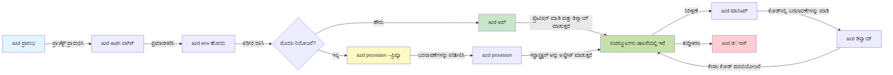
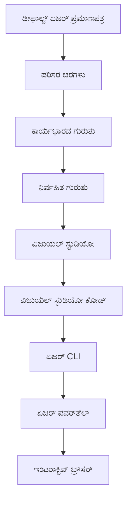

# AZD ಮೂಲಭೂತ - Azure Developer CLI ಅನ್ನು ಅರ್ಥಮಾಡಿಕೊಳ್ಳುವುದು

# AZD ಮೂಲಭೂತ - ಪ್ರಮುಖ ತತ್ವಗಳು ಮತ್ತು ಮೂಲಾಧಾರಗಳು

**ಅಧ್ಯಾಯ ನಾವಿಗೇಶನ್:**
- **📚 ಕೋರ್ಸ್ ಹೋಮ್**: [AZD ಪ್ರಾರಂಭಿಕರಿಗೆ](../../README.md)
- **📖 ಪ್ರಸ್ತುತ ಅಧ್ಯಾಯ**: ಅಧ್ಯಾಯ 1 - ಆಧಾರಗಳು ಮತ್ತು ತ್ವರಿತ ಪ್ರಾರಂಭ
- **⬅️ ಹಿಂದಿನದು**: [ಕೋರ್ಸ್ ಅವಲೋಕನ](../../README.md#-chapter-1-foundation--quick-start)
- **➡️ ಮುಂದಿನದು**: [ಸ್ಥಾಪನೆ ಮತ್ತು ಸಂರಚನೆ](installation.md)
- **🚀 ಮುಂದಿನ ಅಧ್ಯಾಯ**: [ಅಧ್ಯಾಯ 2: AI-ಪ್ರಥಮ ಅಭಿವೃದ್ಧಿ](../chapter-02-ai-development/microsoft-foundry-integration.md)

## ಪರಿಚಯ

ಈ ಪಾಠವು ನಿಮ್ಮನ್ನು Azure Developer CLI (azd) ಗೆ ಪರಿಚಯಿಸುತ್ತದೆ, ಇದು ಸ್ಥಳೀಯ ಅಭಿವೃದ್ಧಿಯಿಂದ Azure ಡಿಪ್ಲಾಯ್ಮೆಂಟ್‌ಗೆ ನಿಮ್ಮ ಪ್ರಯಾಣವನ್ನು ವೇಗಗೊಳಿಸುವ ಶಕ್ತಿಶಾಲಿ ಕಮಾಂಡ್-ಲೈನ್ ಟೂಲ್ ಆಗಿದೆ. ನೀವು ಮೂಲಭೂತ ತತ್ವಗಳು, ಮುಖ್ಯ ವೈಶಿಷ್ಟ್ಯಗಳು ಅನ್ನು ಕಲಿಯುತ್ತೀರಿ ಮತ್ತು azd ಹೇಗೆ ಕ್ಲೌಡ್-ನೇಟಿವ್ ಅಪ್ಲಿಕೇಶನ್ ಡಿಪ್ಲಾಯ್ಮೆಂಟ್ನನ್ನು ಸರಳಗೊಳಿಸುತ್ತದೆ ಎಂಬುದನ್ನು ಅರ್ಥಮಾಡಿಕೊಳ್ಳುತ್ತೀರಿ.

## ಕಲಿಕಾ ಗುರಿಗಳು

ಈ ಪಾಠದ ಕೊನೆಯಲ್ಲಿ ನೀವು:
- Azure Developer CLI ಎಂದರೇನು ಮತ್ತು ಅದರ ಪ್ರಾಥಮಿಕ ಉದ್ದೇಶವನ್ನು ಅರ್ಥಮಾಡಿಕೊಳ್ಳಿ
- ಟೆಂಪ್ಲೇಟ್ಗಳು, ಪರಿಸರಗಳು ಮತ್ತು ಸೇವೆಗಳ ಪ್ರಮುಖ ತತ್ವಗಳನ್ನು ಕಲಿಯಿರಿ
- ಟೆಂಪ್ಲೇಟ್ನಿರ್ದೇಶಿತ ಅಭಿವೃದ್ಧಿ ಮತ್ತು Infrastructure as Code ಸೇರಿ ಪ್ರಮುಖ ವೈಶಿಷ್ಟ್ಯಗಳನ್ನು ಅನ್ವೇಷಿಸಿ
- azd ಪ್ರಾಜೆಕ್ಟ್ ರಚನೆ ಮತ್ತು ವರ್ಕ್‌ಫ್ಲೋ ಅನ್ನು ಅರ್ಥಮಾಡಿಕೊಳ್ಳಿ
- ನಿಮ್ಮ ಅಭಿವೃದ್ಧಿ ಪರಿಸರಕ್ಕಾಗಿ azd ಅನ್ನು ಸ್ಥಾಪಿಸಿ ಹಾಗೂ ಸಂರಚಿಸಲು ತಯಾರಾಗಿರಿ

## ಕಲಿಕೆಯ ಫಲಿತಾಂಶಗಳು

ಈ ಪಾಠವನ್ನು ಪೂರ್ಣಗೊಳಿಸಿದ ನಂತರ ನೀವು ಸಮರ್ಥರಾಗುತ್ತೀರಿ:
- ಆಧುನಿಕ ಕ್ಲೌಡ್ ಅಭಿವೃದ್ಧಿ ವರ್ಕ್‌ಫ್ಲೋಗಳಲ್ಲಿ azd ಯ ಪಾತ್ರವನ್ನು ವಿವರಿಸಬಲ್ಲಿರಿ
- azd ಪ್ರಾಜೆಕ್ಟ್ ರಚನೆಯ ಘಟಕಗಳನ್ನು ಗುರುತಿಸಬಲ್ಲಿರಿ
- ಟೆಂಪ್ಲೇಟ್ಗಳು, ಪರಿಸರಗಳು ಮತ್ತು ಸೇವೆಗಳು ಹೇಗೆ ಒಟ್ಟಿಗೆ ಕಾರ್ಯನಿರ್ವಹಿಸುತ್ತವೆ ಎಂಬುದನ್ನು ವರ್ಣಿಸಬಲ್ಲಿರಿ
- azd ಮೂಲಕ Infrastructure as Code ನ ಪ್ರಯೋಜನಗಳನ್ನು ಅರ್ಥಮಾಡಿಕೊಳ್ಳಿ
- ವಿಭಿನ್ನ azd ಕಮಾಂಡ್‌ಗಳು ಮತ್ತು ಅವುಗಳ ಉದ್ದೇಶಗಳನ್ನು ಗುರುತಿಸಬಲ್ಲಿರಿ

## Azure Developer CLI (azd) ಎಂದರೆ ಏನು?

Azure Developer CLI (azd) ಒಂದು ಕಮಾಂಡ್-ಲೈನ್ ಟೂಲ್ ಆಗಿದ್ದು, ಇದು ನಿಮ್ಮನ್ನು ಸ್ಥಳೀಯ ಅಭಿವೃದ್ಧಿಯಿಂದ Azure ಡಿಪ್ಲಾಯ್ಮೆಂಟ್‌ಗೆ ತ್ವರಿತಗೊಳಿಸುತ್ತದೆ. ಇದು Azure ನಲ್ಲಿ ಕ್ಲೌಡ್-ನೇಟಿವ್ ಅಪ್ಲಿಕೇಶನ್‌ಗಳನ್ನು ನಿರ್ಮಿಸುವುದು, ಡಿಪ್ಲಾಯ್ ಮಾಡುವುದು ಮತ್ತು ನಿರ್ವಹಿಸುವ ಪ್ರಕ್ರಿಯೆಯನ್ನು ಸರಳಗೊಳಿಸುತ್ತದೆ.

### 🎯 ಏಕೆ AZD ಬಳಸುವುದು? ವಾಸ್ತವಿಕ ಹೋಲಿಕೆ

ಒಂದು ಸರಳ ವೆಬ್ ಅಪ್ಲಿಕೇಶನ್ ಮತ್ತು ಡೇಟಾಬೇಸ್ ಅನ್ನು ಡಿಪ್ಲಾಯ್ ಮಾಡುವುದನ್ನು ಹೋಲಿಸೋಣ:

#### ❌ AZD ಇಲ್ಲದೆ: ಕೈಯಿಂದ Azure ಡಿಪ್ಲಾಯ್ (30+ ನಿಮಿಷಗಳು)

```bash
# ಹಂತ 1: ಸಂಪನ್ಮೂಲ ಗುಂಪು ರಚಿಸಿ
az group create --name myapp-rg --location eastus

# ಹಂತ 2: ಅಪ್ ಸರ್ವಿಸ್ ಪ್ಲಾನ್ ರಚಿಸಿ
az appservice plan create --name myapp-plan \
  --resource-group myapp-rg \
  --sku B1 --is-linux

# ಹಂತ 3: ವೆಬ್ ಅಪ್ಲಿಕೇಶನ್ ರಚಿಸಿ
az webapp create --name myapp-web-unique123 \
  --resource-group myapp-rg \
  --plan myapp-plan \
  --runtime "NODE:18-lts"

# ಹಂತ 4: ಕೋಸ್ಮೋಸ್ DB ಖಾತೆ ರಚಿಸಿ (10-15 ನಿಮಿಷಗಳು)
az cosmosdb create --name myapp-cosmos-unique123 \
  --resource-group myapp-rg \
  --kind MongoDB

# ಹಂತ 5: ಡೇಟಾಬೇಸ್ ರಚಿಸಿ
az cosmosdb mongodb database create \
  --account-name myapp-cosmos-unique123 \
  --resource-group myapp-rg \
  --name tododb

# ಹಂತ 6: ಕಲೆಕ್ಷನ್ ರಚಿಸಿ
az cosmosdb mongodb collection create \
  --account-name myapp-cosmos-unique123 \
  --resource-group myapp-rg \
  --database-name tododb \
  --name todos

# ಹಂತ 7: ಸಂಪರ್ಕ ಸ್ಟ್ರಿಂಗ್ ಪಡೆಯಿರಿ
CONN_STR=$(az cosmosdb keys list \
  --name myapp-cosmos-unique123 \
  --resource-group myapp-rg \
  --type connection-strings \
  --query "connectionStrings[0].connectionString" -o tsv)

# ಹಂತ 8: ಆಪ್ ಸೆಟ್ಟಿಂಗ್‌ಗಳನ್ನು ಸಂರಚಿಸಿ
az webapp config appsettings set \
  --name myapp-web-unique123 \
  --resource-group myapp-rg \
  --settings MONGODB_URI="$CONN_STR"

# ಹಂತ 9: ಲಾಗಿಂಗ್ ಸಕ್ರಿಯಗೊಳಿಸಿ
az webapp log config --name myapp-web-unique123 \
  --resource-group myapp-rg \
  --application-logging filesystem \
  --detailed-error-messages true

# ಹಂತ 10: Application Insights ಅನ್ನು ಸ್ಥಾಪಿಸಿ
az monitor app-insights component create \
  --app myapp-insights \
  --location eastus \
  --resource-group myapp-rg

# ಹಂತ 11: App Insights ಅನ್ನು ವೆಬ್ ಅಪ್ಲಿಕೇಶನ್‌ಗೆ ಸಂಪರ್ಕಿಸಿ
INSTRUMENTATION_KEY=$(az monitor app-insights component show \
  --app myapp-insights \
  --resource-group myapp-rg \
  --query "instrumentationKey" -o tsv)

az webapp config appsettings set \
  --name myapp-web-unique123 \
  --resource-group myapp-rg \
  --settings APPINSIGHTS_INSTRUMENTATIONKEY="$INSTRUMENTATION_KEY"

# ಹಂತ 12: ಆ್ಯಪ್ಲಿಕೇಶನ್ ಅನ್ನು ಸ್ಥಳೀಯವಾಗಿ ನಿರ್ಮಿಸಿ
npm install
npm run build

# ಹಂತ 13: ಡಿಪ್ಲಾಯ್‌ಮೆಂಟ್ ಪ್ಯಾಕೇಜ್ ರಚಿಸಿ
zip -r app.zip . -x "*.git*" "node_modules/*"

# ಹಂತ 14: ಅಪ್ಲಿಕೇಶನ್ ಅನ್ನು ಡಿಪ್ಲಾಯ್ ಮಾಡಿ
az webapp deployment source config-zip \
  --resource-group myapp-rg \
  --name myapp-web-unique123 \
  --src app.zip

# ಹಂತ 15: ಕಾಯಿರಿ ಮತ್ತು ಅದು ಕೆಲಸ ಮಾಡುತ್ತದೆ ಎಂದು ಪ್ರಾರ್ಥಿಸಿ 🙏
# (ಯಾವುದೇ ಸ್ವಯಂಚಾಲಿತ ಪರಿಶೀಲನೆ ಇಲ್ಲ, ಕೈಯಿಂದ ಪರೀಕ್ಷೆ ಅಗತ್ಯ)
```

**ಸಮಸ್ಯೆಗಳು:**
- ❌ ನೆನಪಿಡಲು ಮತ್ತು ಕ್ರಮವಾಗಿ ಕಾರ್ಯಗತಗೊಳಿಸಲು 15+ ಕಮಾಂಡ್‌ಗಳು
- ❌ 30-45 ನಿಮಿಷಗಳ ಕೈಯಿನ ಕೆಲಸ
- ❌ ತಪ್ಪುಗಳನ್ನು ಮಾಡಲು ಸಹಜ (ಟೈಪೊಗಳು, ತಪ್ಪು ಪ್ಯಾರಾಮೀಟರ್‌ಗಳು)
- ❌ ಟರ್ಮಿನಲ್ ಇತಿಹಾಸದಲ್ಲಿ ಸಂಪರ್ಕ ಸ್ಟ್ರಿಂಗ್ಗಳು ಬಹಿರಂಗವಾಗುತ್ತವೆ
- ❌ ಏನಾದರೂ ವಿಫಲವಾದರೆ ಸ್ವಯಂಚಾಲಿತ ನಿವೃತ್ತಿ (rollback) ಇರುವುದಿಲ್ಲ
- ❌ ತಂಡದ ಸದಸ್ಯರಿಗೆ ಪುನರಾವರ್ತಿಸುವುದು ಕಷ್ಟ
- ❌ ಪ್ರತಿ ಬಾರಿ ವಿಭಿನ್ನ (ಪುನರಾವರ್ತಯೋಗ್ಯವಿಲ್ಲ)

#### ✅ AZD ಜೊತೆ: ಸ್ವಯಂಚಾಲಿತ ಡಿಪ್ಲಾಯ್ (5 ಕಮಾಂಡ್‌ಗಳು, 10-15 ನಿಮಿಷಗಳು)

```bash
# ಹಂತ 1: ಟೆಂಪ್ಲೇಟಿನಿಂದ ಪ್ರಾರಂಭಿಸಿ
azd init --template todo-nodejs-mongo

# ಹಂತ 2: ಪ್ರಮಾಣೀಕರಣ ಮಾಡಿ
azd auth login

# ಹಂತ 3: ಪರಿಸರವನ್ನು ರಚಿಸಿ
azd env new dev

# ಹಂತ 4: ಬದಲಾವಣೆಗಳನ್ನು ಪೂರ್ವದರ್ಶನ ಮಾಡಿ (ಐಚ್ಛಿಕ ಆದರೆ ಶಿಫಾರಸು ಮಾಡಲಾಗಿದೆ)
azd provision --preview

# ಹಂತ 5: ಎಲ್ಲವನ್ನೂ ನಿಯೋಜಿಸಿ
azd up

# ✨ ಪೂರ್ಣ! ಎಲ್ಲವನ್ನೂ ನಿಯೋಜಿಸಲಾಗಿದೆ, ಸಂರಚಿಸಲಾಗಿದೆ ಮತ್ತು ಮೇಲ್ವಿಚಾರಣೆಗೊಳಿಸಲಾಗಿದೆ
```

**ಲಾಭಗಳು:**
- ✅ **5 ಕಮಾಂಡ್‌ಗಳು** ವಿರುದ್ಧ 15+ ಕೈಯಿನ ಹಂತಗಳು
- ✅ **10-15 ನಿಮಿಷಗಳು** ಒಟ್ಟು ಸಮಯ (ಪ್ರಮುಖವಾಗಿ Azureಗಾಗಿ ಕಾಯುವುದು)
- ✅ **ಶೂನ್ಯ ದೋಷಗಳು** - ಸ್ವಯಂಚಾಲಿತ ಮತ್ತು ಪರೀಕ್ಷಿತ
- ✅ **ಗೋಪ್ಯತೆಗಳು ಸುರಕ್ಷಿತವಾಗಿ ನಿರ್ವಹಣೆ** Key Vault ಮೂಲಕ
- ✅ **ಸ್ವಯಂಚಾಲಿತ ನಿವೃತ್ತಿ** ವಿಫಲತೆಗಳಾಗಿದ್ದಾಗ
- ✅ **ಸಂಪೂರ್ಣವಾಗಿ ಪುನಃ ಉತ್ಪಾದನೀಯ** - ಪ್ರತಿ ಸಲ ಒಂದೇ ಫಲಿತಾಂಶ
- ✅ **ತಂಡಕ್ಕೆ ಸಿದ್ಧ** - ಯಾರೂ ಕೂಡಾ 동일 ಕಮಾಂಡ್‌ಗಳಿಂದ ಡಿಪ್ಲಾಯ್ ಮಾಡಬಹುದು
- ✅ **Infrastructure as Code** - ಸಂಸ್ಕರಣಾ ನಿಯಂತ್ರಿತ Bicep ಟೆಂಪ್ಲೇಟ್ಗಳು
- ✅ **ನಿರ್ಮಿತ ನಿಯಂತ್ರಣ** - Application Insights ಸ್ವಯಂಚಾಲಿತವಾಗಿ ಸಂರಚಿತ

### 📊 ಸಮಯ ಮತ್ತು ದೋಷ ಕಡಿತ

| Metric | Manual Deployment | AZD Deployment | Improvement |
|:-------|:------------------|:---------------|:------------|
| **ಕಮಾಂಡ್‌ಗಳು** | 15+ | 5 | 67% ಕಡಿಮೆ |
| **ಸಮಯ** | 30-45 ನಿಮಿಷಗಳು | 10-15 ನಿಮಿಷಗಳು | 60% ವೇಗವಾಗಿ |
| **ದೋಷದ ಪ್ರಮಾಣ** | ~40% | <5% | 88% ಕಡಿತ |
| **ಸ್ಥಿರತೆ** | ಕಡಿಮೆ (ಕೈಯಿನ) | 100% (ಸ್ವಯಂಚಾಲಿತ) | ಸಂಪೂರ್ಣ |
| **ತಂಡದ ಸೇರ್ಪಡೆ** | 2-4 ಗಂಟೆಗಳು | 30 ನಿಮಿಷಗಳು | 75% ವೇಗವಾಗಿ |
| **ನಿವೃತ್ತಿ ಸಮಯ** | 30+ ನಿಮಿಷಗಳು (ಕೈಯಿನ) | 2 ನಿಮಿಷಗಳು (ಸ್ವಯಂಚಾಲಿತ) | 93% ವೇಗವಾಗಿ |

## ಮೂಲ ತತ್ವಗಳು

### ಟೆಂಪ್ಲೇಟ್ಗಳು
ಟೆಂಪ್ಲೇಟ್ಗಳು azd ನ ಆಧಾರವಾಗಿವೆ. ಇವುಗಳಲ್ಲಿ ಒಳಗೊಂಡಿದೆ:
- **ಅಪ್ಲಿಕೇಶನ್ ಕೋಡ್** - ನಿಮ್ಮ ಮೂಲ ಕೋಡ್ ಮತ್ತು ಅವಲಂಬನೆಗಳು
- **ಇನ್ಫ್ರಾಸ್ಟ್ರಕ್ಚರ್ ವ್ಯಾಖ್ಯಾನಗಳು** - Bicep ಅಥವಾ Terraform ನಲ್ಲಿ ವ್ಯಾಖ್ಯಾನಿಸಿತ Azure ಸಂಪನ್ಮೂಲಗಳು
- **ಸಂರಚನಾ ಫೈಲ್‌ಗಳು** - ಸೆಟ್ಟಿಂಗ್‌ಗಳು ಮತ್ತು ಪರಿಸರ ಚರಗಳು
- **ಡಿಪ್ಲಾಯ್ಮೆಂಟ್ ಸ್ಕ್ರಿಪ್ಟ್‌ಗಳು** - ಸ್ವಯಂಚಾಲಿತ ಡಿಪ್ಲಾಯ್ಮೆಂಟ್ ವರ್ಕ್‌ಫ್ಲೋಗಳು

### ಪರಿಸರಗಳು
ಪರಿಸರಗಳು ವಿಭಿನ್ನ ಡಿಪ್ಲಾಯ್ ಗುರಿಗಳನ್ನು ಪ್ರತಿನಿಧಿಸುತ್ತವೆ:
- **Development** - ಪರೀಕ್ಷೆ ಮತ್ತು ಅಭಿವೃದ್ಧಿಗಾಗಿ
- **Staging** - ಪೂರ್ವ-ಉತ್ಪಾದನಾ ಪರಿಸರ
- **Production** - ಲೈವ್ ಉತ್ಪಾದನಾ ಪರಿಸರ

ಪ್ರತಿ ಪರಿಸರವು ತನ್ನದೇ ಆದವನ್ನು ಕಾಪಾಡುತ್ತದೆ:
- Azure resource group
- ಸಂರಚನಾ ಸೆಟ್ಟಿಂಗ್‌ಗಳು
- ಡಿಪ್ಲಾಯ್ ಸ್ಥಿತಿ

### ಸೇವೆಗಳು
ಸೇವೆಗಳು ನಿಮ್ಮ ಅಪ್ಲಿಕೇಶನ್‌ನ ನಿರ್ಮಾಣಘಟಕಗಳು:
- **Frontend** - ವೆಬ್ ಅಪ್ಲಿಕೇಶನ್‌ಗಳು, SPAs
- **Backend** - APIಗಳು, ಮೈಕ್ರೋಸರ್ವಿಸಸ್
- **Database** - ಡೇಟಾ ಸಂಗ್ರಹಣಾ ಪರಿಹಾರಗಳು
- **Storage** - ಫೈಲ್ ಮತ್ತು ಬ್ಲಾಬ್ ಸಂಗ್ರಹಣೆ

## ಪ್ರಮುಖ ವೈಶಿಷ್ಟ್ಯಗಳು

### 1. ಟೆಂಪ್ಲೇಟ್-ಚಾಲಿತ ಅಭಿವೃದ್ಧಿ
```bash
# ಲಭ್ಯವಿರುವ ಟೆಂಪ್ಲೇಟ್ಗಳನ್ನು ವೀಕ್ಷಿಸಿ
azd template list

# ಟೆಂಪ್ಲೇಟಿನಿಂದ ಪ್ರಾರಂಭಿಸಿ
azd init --template <template-name>
```

### 2. Infrastructure as Code
- **Bicep** - Azure ನ ಡೊಮೇನ್-ವಿಶೇಷ ಭಾಷೆ
- **Terraform** - ಬಹು-ಕ್ಲೌಡ್ ಇನ್ಫ್ರಾಸ್ಟ್ರಕ್ಚರ್ ಸಾಧನ
- **ARM Templates** - Azure Resource Manager ಟೆಂಪ್ಲೇಟ್ಗಳು

### 3. ಇಂಟಿಗ್ರೇಟೆಡ್ ವರ್ಕ್‌ಫ್ಲೋಗಳು
```bash
# ಸಂಪೂರ್ಣ ಡಿಪ್ಲಾಯ್‌ಮೆಂಟ್ ಕಾರ್ಯಪ್ರವಾಹ
azd up            # Provision + Deploy ಇದು ಮೊದಲ ಬಾರಿಗೆ ಸೆಟ್‌ಅಪ್‌ಗಾಗಿ ಹಸ್ತರಹಿತವಾಗಿದೆ

# 🧪 ಹೊಸದು: ಡಿಪ್ಲಾಯ್‌ಮೆಂಟ್ ಮೊದಲು ಮೂಲಸೌಕರ್ಯ ಬದಲಾವಣೆಗಳನ್ನು ಪೂರ್ವವೀಕ್ಷಣೆ ಮಾಡಿ (ಸುರಕ್ಷಿತ)
azd provision --preview    # ಯಾವುದೇ ಬದಲಾವಣೆ ಮಾಡುವಿಲ್ಲದೆ ಮೂಲಸೌಕರ್ಯ ನಿಯೋಜನೆಯನ್ನು ಅನುಕರಿಸಿ

azd provision     # ಮೂಲಸೌಕರ್ಯವನ್ನು ಅಪ್ಡೇಟ್ ಮಾಡಿದಾಗ Azure ಸಂಪನ್ಮೂಲಗಳನ್ನು ರಚಿಸಲು ಇದನ್ನು ಬಳಸಿರಿ
azd deploy        # ಅಪ್ಲಿಕೇಶನ್ ಕೋಡ್ ಅನ್ನು ನಿಯೋಜಿಸಿ ಅಥವಾ ಅಪ್ಡೇಟ್ ನಂತರ ಮರುನಿಯೋಜಿಸಿ
azd down          # ಸಂಪನ್ಮೂಲಗಳನ್ನು ತೆರವುಗೊಳಿಸಿ
```

#### 🛡️ ಮುನ್ನೋಟದೊಂದಿಗೆ ಸುರಕ್ಷಿತ ಇನ್ಫ್ರಾಸ್ಟ್ರಕ್ಚರ್ ಯೋಜನೆ
`azd provision --preview` ಕಮಾಂಡ್ ಸುರಕ್ಷಿತ ಡಿಪ್ಲಾಯ್ಮೆಂಟ್‌ಗಳಿಗೆ ಪ್ರಮುಖ ಪರಿವರ್ತನೆ:
- **ಡ್ರೈ-ರನ್ ವಿಶ್ಲೇಷಣೆ** - ಸೃಷ್ಟಿಯಾಗುವದು, ಬದಲಾಯಿಸುವದು, ಅಥವಾ ಅಳಿಸಲ್ಪಡುವದೇನಲ್ಲವೆಂದು ತೋರಿಸುತ್ತದೆ
- **ಶೂನ್ಯ ಅಪಾಯ** - ನಿಮ್ಮ Azure ಪರಿಸರದಲ್ಲಿ ಯಾವುದೇ ವಾಸ್ತವಿಕ ಬದಲಾವಣೆಗಳಾಗುವುದಿಲ್ಲ
- **ತಂಡ ಸಹಕಾರ** - ಡಿಪ್ಲಾಯ್ಮೆಂಟ್ ಮಾಡುವ ಮುನ್ನ ಮುನ್ನೋಟ ಫಲಿತಾಂಶಗಳನ್ನು ಹಂಚಿಕೊಳ್ಳಿ
- **ಖರ್ಚಿನ ಅಂದಾಜು** - ಬದ್ಧತೆಯ ಮೊದಲು ಸಂಪನ್ಮೂಲಗಳ ವೆಚ್ಚವನ್ನು ಅರ್ಥಮಾಡಿಕೊಳ್ಳಿ

```bash
# ಉದಾಹರಣೆ ಪೂರ್ವದರ್ಶನ ಕಾರ್ಯಪ್ರವಾಹ
azd provision --preview           # ಏನು ಬದಲಾಗುತ್ತದೆ ಎಂದು ನೋಡಿ
# ಫಲಿತಾಂಶವನ್ನು ಪರಿಶೀಲಿಸಿ, ತಂಡದೊಂದಿಗೆ ಚರ್ಚಿಸಿ
azd provision                     # ಆತ್ಮವಿಶ್ವಾಸದಿಂದ ಬದಲಾವಣೆಗಳನ್ನು ಅನ್ವಯಿಸಿ
```

### 📊 ದೃಶ್ಯ: AZD ಅಭಿವೃದ್ಧಿ ವರ್ಕ್‌ಫ್ಲೋ


**ವರ್ಕ್‌ಫ್ಲೋ ವಿವರಣೆ:**
1. **Init** - ಟೆಂಪ್ಲೇಟು ಅಥವಾ ಹೊಸ ಪ್ರಾಜೆಕ್ಟ್‌ನಿಂದ ಪ್ರಾರಂಭಿಸಿ
2. **Auth** - Azure ಜೊತೆಗೆ ಪ್ರಮಾಣೀಕರಣ ಮಾಡಿರಿ
3. **Environment** - ಪ್ರತ್ಯೇಕಿತ ಡಿಪ್ಲಾಯ್ ಪರಿಸರ ರಚಿಸಿ
4. **Preview** - 🆕 ಮೊದಲಿಗೆ ಯಾವಾಗಲೂ ಇನ್ಫ್ರಾಸ್ಟ್ರಕ್ಚರ್ ಬದಲಾವಣೆಗಳನ್ನು ಪೂರ್ವನೋಟ ಮಾಡಿ (ಸುರಕ್ಷಿತ ಅಭ್ಯಾಸ)
5. **Provision** - Azure ಸಂಪನ್ಮೂಲಗಳನ್ನು ರಚಿಸಿ/ನವೀಕರಿಸಿ
6. **Deploy** - ನಿಮ್ಮ ಅಪ್ಲಿಕೇಶನ್ ಕೋಡ್ ಅನ್ನು ಪುಷ್ ಮಾಡಿ
7. **Monitor** - ಅಪ್ಲಿಕೇಶನ್ ಕಾರ್ಯಕ್ಷಮತೆಯನ್ನು ಗಮನಿಸಿ
8. **Iterate** - ಬದಲಾವಣೆಗಳನ್ನು ಮಾಡಿ ಮತ್ತು ಕೋಡ್ ಅನ್ನು ಮರುಡಿಪ್ಲಾಯ್ ಮಾಡಿ
9. **Cleanup** - ಮುಗಿದ ಮೇಲೆ ಸಂಪನ್ಮೂಲಗಳನ್ನು ಅಳಿಸಿ

### 4. ಪರಿಸರ ನಿರ್ವಹಣೆ
```bash
# ಪರಿಸರಗಳನ್ನು ರಚಿಸಿ ಮತ್ತು ನಿರ್ವಹಿಸಿ
azd env new <environment-name>
azd env select <environment-name>
azd env list
```

## 📁 ಪ್ರಾಜೆಕ್ಟ್ ರಚನೆ

ಸಾಮಾನ್ಯ azd ಪ್ರಾಜೆಕ್ಟ್ ರಚನೆ:
```
my-app/
├── .azd/                    # azd configuration
│   └── config.json
├── .azure/                  # Azure deployment artifacts
├── .devcontainer/          # Development container config
├── .github/workflows/      # GitHub Actions
├── .vscode/               # VS Code settings
├── infra/                 # Infrastructure code
│   ├── main.bicep        # Main infrastructure template
│   ├── main.parameters.json
│   └── modules/          # Reusable modules
├── src/                  # Application source code
│   ├── api/             # Backend services
│   └── web/             # Frontend application
├── azure.yaml           # azd project configuration
└── README.md
```

## 🔧 ಸಂರಚನಾ ಫೈಲ್‌ಗಳು

### azure.yaml
ಮುಖ್ಯ ಪ್ರಾಜೆಕ್ಟ್ ಸಂರಚನಾ ಫೈಲ್:
```yaml
name: my-awesome-app
metadata:
  template: my-template@1.0.0

services:
  web:
    project: ./src/web
    language: js
    host: appservice
  api:
    project: ./src/api
    language: js
    host: appservice

hooks:
  preprovision:
    shell: pwsh
    run: echo "Preparing to provision..."
```

### .azure/config.json
ಪರಿಸರ-ನಿರ್ದಿಷ್ಟ ಸಂರಚನೆ:
```json
{
  "version": 1,
  "defaultEnvironment": "dev",
  "environments": {
    "dev": {
      "subscriptionId": "your-subscription-id",
      "location": "eastus"
    }
  }
}
```

## 🎪 ಸಾಮಾನ್ಯ ವರ್ಕ್‌ಫ್ಲೋಗಳು ಮತ್ತು ಪ್ರಾಯೋಗಿಕ ವ್ಯಾಯಾಮಗಳು

> **💡 ಕಲಿಕೆಯ ಸಲಹೆ:** ಕ್ರಮವಾಗಿ ಈ ವ್ಯಾಯಾಮಗಳನ್ನು ಅನುಸರಿಸಿ ನಿಮ್ಮ AZD ಕೌಶಲ್ಯಗಳನ್ನು ಕ್ರಮೇಣ ನಿರ್ಮಿಸಿ.

### 🎯 ವ್ಯಾಯಾಮ 1: ನಿಮ್ಮ ಪ್ರಥಮ ಪ್ರಾಜೆಕ್ಟ್ ಅನ್ನು ಪ್ರಾರಂಭಿಸಿ

**ಗುರಿ:** AZD ಪ್ರಾಜೆಕ್ಟ್ ರಚಿಸಿ ಮತ್ತು ಅದರ ರಚನೆಯನ್ನು ಅನ್ವೇಷಿಸಿ

**ಹಂತಗಳು:**
```bash
# ಪ್ರಮಾಣಿತ ಟೆಂಪ್ಲೇಟನ್ನು ಬಳಸಿ
azd init --template todo-nodejs-mongo

# ಉತ್ಪಾದಿತ ಫೈಲ್ಗಳನ್ನು ಅನ್ವೇಷಿಸಿ
ls -la  # ಗೋಪ್ಯ ಫೈಲ್ಗಳನ್ನೂ ಒಳಗೊಂಡು ಎಲ್ಲಾ ಫೈಲ್ಗಳನ್ನು ವೀಕ್ಷಿಸಿ

# ರಚಿಸಲಾದ ಪ್ರಮುಖ ಫೈಲ್‌ಗಳು:
# - azure.yaml (ಮುಖ್ಯ ಸಂರಚನೆ)
# - infra/ (ಮೂಲಸೌಕರ್ಯ ಕೋಡ್)
# - src/ (ಅಪ್ಲಿಕೇಶನ್ ಕೋಡ್)
```

**✅ ಯಶಸ್ಸು:** ನಿಮ್ಮ ಬಳಿ azure.yaml, infra/, ಮತ್ತು src/ ಡೈರೆಕ್ಟರಿಗಳು ಇವೆ

---

### 🎯 ವ್ಯಾಯಾಮ 2: Azure ಗೆ ಡಿಪ್ಲಾಯ್ ಮಾಡಿ

**ಗುರಿ:** ಎಂಡ್-ಟು-ಎಂಡ್ ಡಿಪ್ಲಾಯ್ಮೆಂಟ್ ಪೂರ್ಣಗೊಳಿಸಿ

**ಹಂತಗಳು:**
```bash
# 1. ಪ್ರಾಮಾಣೀಕರಿಸಿ
az login && azd auth login

# 2. ಪರಿಸರ ರಚಿಸಿ
azd env new dev
azd env set AZURE_LOCATION eastus

# 3. ಬದಲಾವಣೆಗಳನ್ನು ಪೂರ್ವವೀಕ್ಷಣೆ ಮಾಡಿ (ಶಿಫಾರಸು ಮಾಡಲಾಗಿದೆ)
azd provision --preview

# 4. ಎಲ್ಲವನ್ನೂ ನಿಯೋಜಿಸಿ
azd up

# 5. ನಿಯೋಜನೆಯನ್ನು ಪರಿಶೀಲಿಸಿ
azd show    # ನಿಮ್ಮ ಅಪ್ಲಿಕೇಶನ್ URL ಅನ್ನು ವೀಕ್ಷಿಸಿ
```

**ಅಂದಾಜು ಸಮಯ:** 10-15 ನಿಮಿಷಗಳು  
**✅ ಯಶಸ್ಸು:** ಅಪ್ಲಿಕೇಶನ್ URL ಬ್ರೌಸರ್‌ನಲ್ಲಿ ತೆರೆಯುತ್ತದೆ

---

### 🎯 ವ್ಯಾಯಾಮ 3: ಬಹು-ಪರಿಸರಗಳು

**ಗುರಿ:** dev ಮತ್ತು staging ಗೆ ಡಿಪ್ಲಾಯ್ ಮಾಡಿ

**ಹಂತಗಳು:**
```bash
# dev ಈಗಾಗಲೇ ಇದೆ, staging ಅನ್ನು ರಚಿಸಿ
azd env new staging
azd env set AZURE_LOCATION westus2
azd up

# ಅವೆರಡರ ನಡುವೆ ಬದಲಾಯಿಸಿ
azd env list
azd env select dev
```

**✅ ಯಶಸ್ಸು:** Azure ಪೋರ್ಟಲಿನಲ್ಲಿ ಎರಡು ಪ್ರತ್ಯೇಕ ಸಂಪನ್ಮೂಲ ಗುಂಪುಗಳು

---

### 🛡️ ಕ್ಲೀನ್ ಸ್ಲೇಟ್: `azd down --force --purge`

ನೀವು ಸಂಪೂರ್ಣವಾಗಿ ರೀಸೆಟ್ ಮಾಡಬೇಕಾಗಿದ್ದಾಗ:

```bash
azd down --force --purge
```

**ಇದರಿಂದ ಏನು ಆಗುತ್ತದೆ:**
- `--force`: ದೃಢೀಕರಣ ಪ್ರಾಂಪ್ಟ್‌ಗಳಿಲ್ಲ
- `--purge`: ಎಲ್ಲಾ ಸ್ಥಳೀಯ ಸ್ಥಿತಿ ಮತ್ತು Azure ಸಂಪನ್ಮೂಲಗಳನ್ನು ಅಳಿಸುತ್ತದೆ

**ಬಳಸುವ ಸಂದರ್ಭಗಳು:**
- ಡಿಪ್ಲಾಯ್ಮೆಂಟ್ ಮಧ್ಯದಲ್ಲಿ ವಿಫಲವಾದಾಗ
- ಪ್ರಾಜೆಕ್ಟ್‌ಗಳನ್ನು ಬದಲಾಯಿಸುತ್ತಿರುವಾಗ
- تازಾ ಆರಂಭ ಬೇಕಾದಾಗ

---

## 🎪 ಮೂಲ ವರ್ಕ್‌ಫ್ಲೋ ರೆಫರೆನ್ಸ್

### ಹೊಸ ಪ್ರಾಜೆಕ್ಟ್ ಪ್ರಾರಂಭಿಸುವುದು
```bash
# ವಿಧಾನ 1: ಅಸ್ತಿತ್ವದಲ್ಲಿರುವ ಟೆಂಪ್ಲೇಟನ್ನು ಬಳಸಿ
azd init --template todo-nodejs-mongo

# ವಿಧಾನ 2: ಶೂನ್ಯದಿಂದ ಪ್ರಾರಂಭಿಸಿ
azd init

# ವಿಧಾನ 3: ಪ್ರಸ್ತುತ ಡೈರೆಕ್ಟರಿಯನ್ನು ಬಳಸಿ
azd init .
```

### ಅಭಿವೃದ್ಧಿ ಚಕ್ರ
```bash
# ಅಭಿವೃದ್ಧಿ ಪರಿಸರವನ್ನು ಸಿದ್ಧಪಡಿಸಿ
azd auth login
azd env new dev
azd env select dev

# ಎಲ್ಲವನ್ನೂ ನಿಯೋಜಿಸಿ
azd up

# ಬದಲಾವಣೆಗಳನ್ನು ಮಾಡಿ ಮತ್ತು ಮರುನಿಯೋಜಿಸಿ
azd deploy

# ಮುಗಿದ ಮೇಲೆ ಸ್ವಚ್ಛಗೊಳಿಸಿ
azd down --force --purge # Azure Developer CLI ನಲ್ಲಿ ಇರುವ ಈ ಕಮಾಂಡ್ ನಿಮ್ಮ ಪರಿಸರಕ್ಕೆ ಒಂದು **ಹಾರ್ಡ್ ರಿಸೆಟ್** ಆಗಿದೆ—ನೀವು ವಿಫಲವಾದ ನಿಯೋಜನೆಗಳ ಸಮಸ್ಯೆಗಳನ್ನು ಪರಿಶೀಲಿಸುತ್ತಿರುವಾಗ, ಅನಾಥವಾದ ಸಂಪನ್ಮೂಲಗಳನ್ನು ತೆರವುಗೊಳಿಸುತ್ತಿರುವಾಗ ಅಥವಾ ಹೊಸ ಮರುನಿಯೋಜನೆಗೆ ಸಿದ್ಧತೆ ಮಾಡುತ್ತಿದ್ದಾಗ ಇದು ವಿಶೇಷವಾಗಿ ಉಪಯುಕ್ತವಾಗುತ್ತದೆ
```

## `azd down --force --purge` ಅನ್ನು ಅರ್ಥಮಾಡಿಕೊಳ್ಳುವುದು
`azd down --force --purge` ಕಮಾಂಡ್ ನಿಮ್ಮ azd ಪರಿಸರವನ್ನು ಮತ್ತು ಅದರ ಸಂಬಂಧಪಟ್ಟ ಎಲ್ಲಾ ಸಂಪನ್ಮೂಲಗಳನ್ನು ಸಂಪೂರ್ಣವಾಗಿ ಅಳಿಸುವ ಶಕ್ತಿಶಾಲಿ ವಿಧಾನವಾಗಿದೆ. ಪ್ರತಿಯೊಂದು ಫ್ಲ್ಯಾಗ್ ಏನು ಮಾಡುತ್ತದೆ ಎಂಬದನ್ನು ಕೆಳಗಿದೆ:
```
--force
```
- ದೃಢೀಕರಣ ಪ್ರಾಂಪ್ಟ್‌ಗಳನ್ನು ತಿರಸ್ಕರಿಸುತ್ತದೆ.
- automation ಅಥವಾ ಸ್ಕ್ರಿಪ್ಟಿಂಗ್‌ನಲ್ಲಿ, ಕೈಯಿನ ಇನ್‌ಪುಟ್ ಸಾಧ್ಯವಿಲ್ಲದ ಸಂದರ್ಭಗಳಲ್ಲಿ ಉಪಯುಕ್ತವಾಗಿದೆ.
- CLI ಅಸಮ распис್ತತೆಗಳನ್ನು ಕಂಡುಹಿಡಿದರೂ, ತೊಡೆದುಹಾಕುವಿಕೆ ಬಳಿಕ ಅಡ್ಡಿ ಇಲ್ಲದೆ ಮುಂದುವರಿಯುತ್ತದೆ.

```
--purge
```
ಎಲ್ಲಾ **ಸಂಬಂಧಿತ ಮೆಟಾಡೇಟಾ** ಅಳಿಸುತ್ತದೆ, ಒಳಗೊಂಡಿವೆ:
ಪರಿಸರ ಸ್ಥಿತಿ
ಸ್ಥಳೀಯ `.azure` ಫೋಲ್ಡರ್
ಕ್ಯಾಶೆ ಮಾಡಿದ ಡಿಪ್ಲಾಯ್ ಮಾಹಿತಿ
azd ನಿಂದ ಹಿಂದಿನ ಡಿಪ್ಲಾಯ್ಮೆಂಟ್ಗಳನ್ನು "ಮರೆಯುವುದನ್ನು" ತಡೆಯುತ್ತದೆ, ಇದು ಅಸಮನ್ವಯ ಸಂಪನ್ಮೂಲ ಗುಂಪುಗಳು ಅಥವಾ ಬಾಯಿಬೊಬ್ಬು ರೆಜಿಸ್ಟ್ರಿ ಉಲ್ಲೇಖಗಳು (stale registry references) ಇಂತಹ ಸಮಸ್ಯೆಗಳನ್ನು ಉಂಟುಮಾಡಬಹುದು.

### ಎರಡನ್ನೂ ಏಕೆ ಬಳಸಬೇಕು?
`azd up` ನಡುವೆ ಉಳಿದಿರುವ ಸ್ಟೇಟ್ ಅಥವಾ ಭಾಗಶಃ ಡಿಪ್ಲಾಯ್ಮೆಂಟ್‌ನಿಂದ ಸಮಸ್ಯೆ ಎದುರಾದಾಗ, ಈ ಸಂಯೋಜನೆ **ಕ್ಲೀನ್ ಸ್ಲೇಟ್** ಅನ್ನು ಖಚಿತಪಡಿಸುತ್ತದೆ.

ಇದು ವಿಶೇಷವಾಗಿ ಉಪಯುಕ್ತವಾಗಿದೆ جڏهن ನೀವು Azure ಪೋರ್ಟಲ್‌ನಲ್ಲಿ ಕೈಯಿಂದ ಸಂಪನ್ಮೂಲಗಳನ್ನು ಅಳಿಸಿರುವ ನಂತರ ಅಥವಾ ಟೆಂಪ್ಲೇಟ್ಗಳು, ಪರಿಸರಗಳು, ಅಥವಾ resource group ನಾಮಕರಣ ನಿಯಮಗಳನ್ನು ಬದಲಾಯಿಸುವಾಗ.

### ಬಹು-ಪರಿಸರಗಳನ್ನು ನಿರ್ವಹಿಸುವುದು
```bash
# ಸ್ಟೇಜಿಂಗ್ ಪರಿಸರವನ್ನು ರಚಿಸಿ
azd env new staging
azd env select staging
azd up

# ಡೆವ್‌ಗೆ ಹಿಂತಿರುಗಿ
azd env select dev

# ಪರಿಸರಗಳನ್ನು ಹೋಲಿಸಿ
azd env list
```

## 🔐 ಪ್ರಮಾಣೀಕರಣ ಮತ್ತು ಪ್ರಮಾಣೀಕರಣ ವಿವರಗಳು

ಪ್ರಮಾಣೀಕರಣವನ್ನು ಅರ್ಥಮಾಡಿಕೊಳ್ಳುವುದು ಯಶಸ್ವಿ azd ಡಿಪ್ಲಾಯ್ಮೆಂಟ್ಗಳಿಗಾಗಿ ಅವಶ್ಯಕವಾಗಿದೆ. Azure ಹಲವಾರು ಪ್ರಮಾಣೀಕರಣ ವಿಧಾನಗಳನ್ನು ಬಳಸುತ್ತದೆ, ಮತ್ತು azd ಇತರ Azure ಟೂಲ್ಗಳಿಂದ ಬಳಕೆಯಾಗುವ ಅದೇ ಕ್ರೆಡೆನ್ಶಿಯಲ್ ಸರಪಳಿಯನ್ನು ಉಪಯೋಗಿಸುತ್ತದೆ.

### Azure CLI ಪ್ರಮಾಣೀಕರಣ (`az login`)

azd ಬಳಸುವುದಕ್ಕೆ ಮುಂಚೆ, ನಿಮಗೆ Azure ಜೊತೆ ಪ್ರಮಾಣೀಕರಿಸಬೇಕಾಗುತ್ತದೆ. ಅತ್ಯಂತ ಸಾಮಾನ್ಯ ವಿಧಾನವೆಂದರೆ Azure CLI ಬಳಕೆ:

```bash
# ಇಂಟರಾಕ್ಟಿವ್ ಲಾಗಿನ್ (ಬ್ರೌಸರ್ ತೆರೆಯುತ್ತದೆ)
az login

# ನಿರ್ದಿಷ್ಟ ಟೆನಂಟ್‌ನೊಂದಿಗೆ ಲಾಗಿನ್
az login --tenant <tenant-id>

# ಸರ್ವಿಸ್ ಪ್ರಿಂಸಿಪಲ್‌ನೊಂದಿಗೆ ಲಾಗಿನ್
az login --service-principal -u <app-id> -p <password> --tenant <tenant-id>

# ಪ್ರಸ್ತುತ ಲಾಗಿನ್ ಸ್ಥಿತಿ ಪರಿಶೀಲಿಸಿ
az account show

# ಲಭ್ಯವಿರುವ ಸಬ್ಸ್ಕ್ರಿಪ್ಷನ್‌ಗಳನ್ನು ಪಟ್ಟಿ ಮಾಡಿ
az account list --output table

# ಡೀಫಾಲ್ಟ್ ಸಬ್ಸ್ಕ್ರಿಪ್ಷನ್ ಅನ್ನು ಸೆಟ್ ಮಾಡಿ
az account set --subscription <subscription-id>
```

### ಪ್ರಮಾಣೀಕರಣ ಪ್ರವಾಹ
1. **Interactive Login**: ನಿಮ್ಮ ಡೀಫಾಲ್ಟ್ ಬ್ರೌಸರ್ ಅನ್ನು ಪ್ರಮಾಣೀಕರಣಕ್ಕಾಗಿ ತೆರೆಯುತ್ತದೆ
2. **Device Code Flow**: ಬ್ರೌಸರ್ ಪ್ರವೇಶವಿಲ್ಲದ ಪರಿಸರಗಳಿಗಾಗಿ
3. **Service Principal**: automation ಮತ್ತು CI/CD ದೃಶ್ಯಾಂಶಗಳಿಗಾಗಿ
4. **Managed Identity**: Azure-ಹೋಸ್ಟ್ ಆದ ಅಪ್ಲಿಕೇಶನ್‌ಗಳಿಗೆ

### DefaultAzureCredential ಸರಪಳಿ

`DefaultAzureCredential` ಎಂದರೆ ನಿರ್ದಿಷ್ಟ ಕ್ರಮದಲ್ಲಿ ಅನೇಕ ಕ್ರೆಡೆನ್ಶಿಯಲ್ ಮೂಲಗಳನ್ನು ಸ್ವಯಂಚಾಲಿತವಾಗಿ ಪ್ರಯತ್ನಿಸುವ ಮೂಲಕ ಸರಳೀಕೃತ ಪ್ರಮಾಣೀಕರಣ ಅನುಭವವನ್ನು ಒದಗಿಸುವ ಕ್ರೆಡೆನ್ಶಿಯಲ್ ಪ್ರಕಾರ:

#### ಕ್ರೆಡೆನ್ಶಿಯಲ್ ಸರಪಳಿ ಕ್ರಮ

#### 1. ಪರಿಸರ ಚರಗಳು
```bash
# ಸರ್ವಿಸ್ ಪ್ರಿಂಸಿಪಲ್‌ಗಾಗಿ ಪರಿಸರ ಚರಗಳನ್ನು ಹೊಂದಿಸಿ
export AZURE_CLIENT_ID="<app-id>"
export AZURE_CLIENT_SECRET="<password>"
export AZURE_TENANT_ID="<tenant-id>"
```

#### 2. Workload Identity (Kubernetes/GitHub Actions)
ಸ್ವಯಂಚಾಲಿತವಾಗಿ ಬಳಸಲಾಗುತ್ತದೆ:
- Workload Identity ಹೊಂದಿರುವ Azure Kubernetes Service (AKS)
- OIDC ಫೆಡರೇಷನ್ ಹೊಂದಿರುವ GitHub Actions
- ಇತರ ಫೆಡರೇಟೆಡ್ ಐಡೆಂಟಿಟಿ ದೃಶ್ಯಾಂಶಗಳು

#### 3. Managed Identity
ಕೆಲವು Azure ಸಂಪನ್ಮೂಲಗಳಿಗಾಗಿ:
- Virtual Machines
- App Service
- Azure Functions
- Container Instances

```bash
# ನಿರ್ವಹಿತ ಐಡೆಂಟಿಟಿ ಹೊಂದಿರುವ Azure ಸಂಪನ್ಮೂಲದಲ್ಲಿ ಕಾರ್ಯನಿರ್ವಹಿಸುತ್ತಿದೆಯೇ ಎಂಬುದನ್ನು ಪರಿಶೀಲಿಸಿ
az account show --query "user.type" --output tsv
# ಹಿಂತಿರುಗುತ್ತದೆ: "servicePrincipal" ನಿರ್ವಹಿತ ಐಡೆಂಟಿಟಿ ಬಳಸುತ್ತಿದ್ದರೆ
```

#### 4. ಡೆವಲಪರ್ ಟೂಲ್ಸ್ ಏಕೀಕರಣ
- **Visual Studio**: ಸ್ವಯಂಚಾಲಿತವಾಗಿ ಸೈನ್-ಇನ್ ಆಗಿರುವ ಖಾತೆಯನ್ನು ಬಳಸುತ್ತದೆ
- **VS Code**: Azure Account ಎಕ್ಸ್ಟೆಂಶನ್ ಕ್ರೆಡೆನ್ಶಿಯಲ್ಸ್ ಅನ್ನು ಬಳಸುತ್ತದೆ
- **Azure CLI**: `az login` ಕ್ರೆಡೆನ್ಶಿಯಲ್ಸ್ ಅನ್ನು ಉಪಯೋಗಿಸುತ್ತದೆ (ಸ್ಥಳೀಯ ಅಭಿವೃದ್ಧಿಗಾಗಿ ಅತ್ಯಂತ ಸಾಮಾನ್ಯ)

### AZD ಪ್ರಮಾಣೀಕರಣ ಸೆಟಪ್

```bash
# ವಿಧಾನ 1: Azure CLI ಬಳಸಿ (ವಿಕಸನಕ್ಕೆ ಶಿಫಾರಸು ಮಾಡಲಾಗಿದೆ)
az login
azd auth login  # ಇದೀಗ ಇರುವ Azure CLI ಪ್ರಮಾಣಪತ್ರಗಳನ್ನು ಬಳಸುತ್ತದೆ

# ವಿಧಾನ 2: ನೇರ azd ಪ್ರಾಮಾಣೀಕರಣ
azd auth login --use-device-code  # ಹೆಡ್‌ಲೆಸ್ ಪರಿಸರಗಳಿಗೆ

# ವಿಧಾನ 3: ಪ್ರಾಮಾಣೀಕರಣ ಸ್ಥಿತಿಯನ್ನು ಪರಿಶೀಲಿಸಿ
azd auth login --check-status

# ವಿಧಾನ 4: ಲಾಗ್ ಔಟ್ ಮಾಡಿ ಮತ್ತು ಮರುಪ್ರಾಮಾಣೀಕರಿಸು
azd auth logout
azd auth login
```

### ಪ್ರಮಾಣೀಕರಣಕ್ಕೆ ಉತ್ತಮ ಅಭ್ಯಾಸಗಳು

#### ಸ್ಥಳೀಯ ಅಭಿವೃದ್ಧಿಗಾಗಿ
```bash
# 1. Azure CLI ಬಳಸಿ ಲಾಗಿನ್ ಮಾಡಿ
az login

# 2. ಸರಿಯಾದ ಸಬ್ಸ್ಕ್ರಿಪ್ಷನ್ ಅನ್ನು ಪರಿಶೀಲಿಸಿ
az account show
az account set --subscription "Your Subscription Name"

# 3. ಅಸ್ತಿತ್ವದಲ್ಲಿರುವ ಪ್ರಮಾಣಪತ್ರಗಳೊಂದಿಗೆ azd ಬಳಸಿ
azd auth login
```

#### CI/CD ಪೈಪ್‌ಲೈನ್ಗಳಿಗಾಗಿ
```yaml
# GitHub Actions example
- name: Azure Login
  uses: azure/login@v1
  with:
    creds: ${{ secrets.AZURE_CREDENTIALS }}

- name: Deploy with azd
  run: |
    azd auth login --client-id ${{ secrets.AZURE_CLIENT_ID }} \
                    --client-secret ${{ secrets.AZURE_CLIENT_SECRET }} \
                    --tenant-id ${{ secrets.AZURE_TENANT_ID }}
    azd up --no-prompt
```

#### ಉತ್ಪಾದನಾ ಪರಿಸರಗಳಿಗಾಗಿ
- Azure ಸಂಪನ್ಮೂಲಗಳಲ್ಲಿ ಚಲಿಸುವಾಗ **Managed Identity** ಬಳಸಿ
- automation ದೃಶ್ಯಾಂಶಗಳಿಗಾಗಿ **Service Principal** ಬಳಸಿ
- ಕ್ರೆಡೆನ್ಶಿಯಲ್ಸ್ ಅನ್ನು ಕೋಡ್ ಅಥವಾ ಸಂರಚನಾ ಫೈಲ್‌ಗಳಲ್ಲಿ ಸಂಗ್ರಹಿಸಬೇಡಿ
- ಸಂವೇದನಶೀಲ ಸಂರಚನೆಗಾಗಿ **Azure Key Vault** ಬಳಸಿ

### ಸಾಮಾನ್ಯ ಪ್ರಮಾಣೀಕರಣ ಸಮಸ್ಯೆಗಳು ಮತ್ತು ಪರಿಹಾರಗಳು

#### ಸಮಸ್ಯೆ: "ಸಬ್ಸ್ಕ್ರಿಪ್ಷನ್ ಕಂಡುಬಂದಿಲ್ಲ"
```bash
# ಪರಿಹಾರ: ಡೀಫಾಲ್ಟ್ ಚಂದಾದಾರಿಕೆಯನ್ನು ನಿಗದಿಮಾಡಿ
az account list --output table
az account set --subscription "<subscription-id>"
azd env set AZURE_SUBSCRIPTION_ID "<subscription-id>"
```

#### ಸಮಸ್ಯೆ: "ಅपर್ಯಾಪ್ತ ಅನುಮತಿಗಳು"
```bash
# ಪರಿಹಾರ: ಅಗತ್ಯವಿರುವ ಪಾತ್ರಗಳನ್ನು ಪರಿಶೀಲಿಸಿ ಮತ್ತು ನಿಯೋಜಿಸಿ
az role assignment list --assignee $(az account show --query user.name --output tsv)

# ಸಾಮಾನ್ಯವಾಗಿ ಅಗತ್ಯವಿರುವ ಪಾತ್ರಗಳು:
# - ಸಹಭಾಗಿ (ಸಂಪನ್ಮೂಲ ನಿರ್ವಹಣೆಗೆ)
# - ಬಳಕೆದಾರರ ಪ್ರವೇಶ ನಿರ್ವಾಹಕ (ಪಾತ್ರ ನಿಯೋಜನೆಗಳಿಗಾಗಿ)
```

#### ಸಮಸ್ಯೆ: "ಟೋಕನ್ ಗಡಿಸಿದಾಗಿದೆ"
```bash
# ಪರಿಹಾರ: ಮತ್ತೆ ಪ್ರಾಮಾಣೀಕರಿಸಿ
az logout
az login
azd auth logout
azd auth login
```

### ವಿಭಿನ್ನ ದೃಶ್ಯಾಂಶಗಳಲ್ಲಿ ಪ್ರಮಾಣೀಕರಣ

#### ಸ್ಥಳೀಯ ಅಭಿವೃದ್ಧಿ
```bash
# ವೈಯಕ್ತಿಕ ಅಭಿವೃದ್ಧಿ ಖಾತೆ
az login
azd auth login
```

#### ತಂಡದ ಅಭಿವೃದ್ಧಿ
```bash
# ಸಂಸ್ಥೆಗಾಗಿ ನಿರ್ದಿಷ್ಟ ಟೆನಂಟ್ ಬಳಸಿ
az login --tenant contoso.onmicrosoft.com
azd auth login
```

#### ಬಹು-ಭಾಡೆದಾರ ದೃಶ್ಯಾಂಶಗಳು
```bash
# ಟೆನಂಟ್‌ಗಳ ನಡುವೆ ಬದಲಾಯಿಸಿ
az login --tenant tenant1.onmicrosoft.com
# ಟೆನಂಟ್ 1ಕ್ಕೆ ನಿಯೋಜಿಸಿ
azd up

az login --tenant tenant2.onmicrosoft.com  
# ಟೆನಂಟ್ 2ಕ್ಕೆ ನಿಯೋಜಿಸಿ
azd up
```

### ಭದ್ರತಾ ಪರಿಗಣನೆಗಳು

1. **ಕ್ರೆಡೆನ್ಶಿಯಲ್ ಸಂಗ್ರಹಣೆ**: ಕ್ರೆಡೆನ್ಶಿಯಲ್ಸ್ ಅನ್ನು ಮೂಲ ಕೋಡ್‌ನಲ್ಲಿ ಎಂದಿಗೂ ಸಂಗ್ರಹಿಸಬೇಡಿ
2. **ವಿಸ್ತರಣಾ ನಿರ್ಬಂಧ**: ಸೇವಾ ಪ್ರಿನ್ಸಿಪಲ್ಗಳಿಗೆ ಕನಿಷ್ಟ ಹಕ್ಕು ತತ್ವವನ್ನು ಅನ್ವಯಿಸಿ
3. **ಟೋಕನ್ ರೋಟೇಶನ್**: ಸೇವಾ ಪ್ರಿನ್‌ಸಿಪಲ್ ರಹಸ್ಯಗಳನ್ನು ನಿಯಮಿತವಾಗಿ ರೋಟೇಟ್ ಮಾಡಿ
4. **ಆಡಿಟ್ ಟ್ರೇಲ್**: ಪ್ರಮಾಣೀಕರಣ ಮತ್ತು ಡಿಪ್ಲಾಯ್ಮೆಂಟ್ ಚಟುವಟಿಕೆಗಳನ್ನು ಮೇಲ್ವಿಚಾರಣೆ ಮಾಡಿ
5. **ನೆಟ್ವರ್ಕ್ ಭದ್ರತೆ**: ಸಾಧ್ಯವಾದರೆ ಖಾಸಗಿ ಎಂಡ್‌ಪಾಯಿಂಟ್‌ಗಳನ್ನು ಬಳಸಿ

### ಪ್ರಮಾಣೀಕರಣದ ಸಮಸ್ಯೆ ಪರಿಹಾರ
```bash
# ಪ್ರಾಮಾಣೀಕರಣ ಸಮಸ್ಯೆಗಳನ್ನು ಡಿಬಗ್ ಮಾಡಿ
azd auth login --check-status
az account show
az account get-access-token

# ಸಾಮಾನ್ಯ ತಪಾಸಣಾ ಆಜ್ಞೆಗಳು
whoami                          # ಪ್ರಸ್ತುತ ಬಳಕೆದಾರದ ಸನ್ನಿವೇಶ
az ad signed-in-user show      # Azure AD ಬಳಕೆದಾರ ವಿವರಗಳು
az group list                  # ಸಂಪನ್ಮೂಲ ಪ್ರವೇಶವನ್ನು ಪರೀಕ್ಷಿಸಿ
```

## `azd down --force --purge` ಅನ್ನು ಅರ್ಥಮಾಡಿಕೊಳ್ಳುವುದು

### ಅನ್ವೇಷಣೆ
```bash
azd template list              # ಟೆಂಪ್ಲೇಟುಗಳನ್ನು ವೀಕ್ಷಿಸಿ
azd template show <template>   # ಟೆಂಪ್ಲೇಟಿನ ವಿವರಗಳು
azd init --help               # ಆರಂಭಿಕ ಆಯ್ಕೆಗಳು
```

### ಪ್ರಾಜೆಕ್ಟ್ ನಿರ್ವಹಣೆ
```bash
azd show                     # ಪ್ರಾಜೆಕ್ಟ್ ಅವಲೋಕನ
azd env show                 # ಪ್ರಸ್ತುತ ಪರಿಸರ
azd config list             # ಸಂರಚನಾ ಸೆಟ್ಟಿಂಗ್‌ಗಳು
```

### ಮಾನಿಟರಿಂಗ್
```bash
azd monitor                  # Azure ಪೋರ್ಟಲ್‌ನ ಮಾನಿಟರಿಂಗ್ ತೆರೆಯಿರಿ
azd monitor --logs           # ಅಪ್ಲಿಕೇಶನ್ ಲಾಗ್‌ಗಳನ್ನು ವೀಕ್ಷಿಸಿ
azd monitor --live           # ಲೈವ್ ಮೆಟ್ರಿಕ್ಸ್‌ಗಳನ್ನು ವೀಕ್ಷಿಸಿ
azd pipeline config          # CI/CD ಅನ್ನು ಸಂರಚಿಸಿ
```

## ಉತ್ತಮ ಅಭ್ಯಾಸಗಳು

### 1. ಅರ್ಥಪೂರ್ಣ ಹೆಸರುಗಳನ್ನು ಬಳಸಿ
```bash
# ಒಳ್ಳೆಯದು
azd env new production-east
azd init --template web-app-secure

# ತಪ್ಪಿಸಿಕೊಳ್ಳಿ
azd env new env1
azd init --template template1
```

### 2. ಟೆಂಪ್ಲೇಟ್ಗಳನ್ನು ಉಪಯೋಗಿಸಿ
- ಇರುವ ಟೆಂಪ್ಲೇಟ್ಗಳಿಂದ ಪ್ರಾರಂಭಿಸಿ
- ನಿಮ್ಮ ಅಗತ್ಯಗಳಿಗೆ ಅನುಗುಣವಾಗಿ ಕಸ್ಟಮೈಸ್ ಮಾಡಿ
- ನಿಮ್ಮ ಸಂಸ್ಥೆಗೆ ಮರುಬಳಕೆಯ ಟೆಂಪ್ಲೇಟ್ಗಳನ್ನು ರಚಿಸಿ

### 3. ಪರಿಸರ ವಿಭಜನೆ
- dev/staging/prod ಗಾಗಿ ಪ್ರತ್ಯೇಕ ಪರಿಸರಗಳನ್ನು ಬಳಸಿ
- ಸ್ಥಳೀಯ ಯಂತ್ರದಿಂದ ನೇರವಾಗಿ ಉತ್ಪಾದನಿಗೆ ಎಂದಿಗೂ ಡಿಪ್ಲಾಯ್ ಮಾಡಬೇಡಿ
- ಉತ್ಪಾದನಾ ಡಿಪ್ಲಾಯ್‌ಗಾಗಿ CI/CD ಪೈಪ್‌ಲೈನ್‌ಗಳನ್ನು ಬಳಸಿ

### 4. ಕಾನ್ಫಿಗರೇಷನ್ ನಿರ್ವಹಣೆ
- ಸಂವೇದನಶೀಲ ಡೇಟಾ ಗಾಗಿ ಪರಿಸರ ಚರಗಳನ್ನು ಬಳಸಿ
- ಸಂರಚನೆಯನ್ನು ವರ್ಶನ್ ಕಂಟ್ರೋಲ್‌ನಲ್ಲಿ ಇರಿಸಿ
- ಪರಿಸರ-ನಿರ್ದಿಷ್ಟ ಸೆಟ್ಟಿಂಗ್‌ಗಳನ್ನು ಡಾಕ್ಯುಮೆಂಟ್ ಮಾಡಿ

## ಕಲಿಕೆ ಪ್ರಗತಿ

### ಪ್ರಾರಂಭಿಕ (ವಾರಗಳು 1-2)
1. azd ಅನ್ನು ಸ್ಥಾಪಿಸಿ ಮತ್ತು ಪ್ರಮಾಣೀಕರಿಸಿ
2. ಸರಳ ಟೆಂಪ್ಲೇಟನ್ನು ಡಿಪ್ಲಾಯ್ ಮಾಡಿ
3. ಪ್ರಾಜೆಕ್ಟ್ ರಚನೆಯನ್ನು ಅರ್ಥಮಾಡಿಕೊಳ್ಳಿ
4. ಮೂಲ ಕಮಾಂಡ್‌ಗಳನ್ನು ಕಲಿಯಿರಿ (up, down, deploy)

### ಮಧ್ಯಮ (ವಾರಗಳು 3-4)
1. ಟೆಂಪ್ಲೇಟ್ಗಳನ್ನು ಕಸ್ಟಮೈಸ್ ಮಾಡಿ
2. ಬಹು-ಪರಿಸರಗಳನ್ನು ನಿರ್ವಹಿಸಿ
3. ಇನ್ಫ್ರಾಸ್ಟ್ರಕ್ಚರ್ ಕೋಡ್ ಅನ್ನು ಅರ್ಥಮಾಡಿಕೊಳ್ಳಿ
4. CI/CD ಪೈಪ್‌ಲೈನ್‌ಗಳನ್ನು ಸ್ಥಾಪಿಸಿ

### ಉನ್ನತ (ವಾರ 5+)
1. ಕಸ್ಟಮ್ ಟೆಂಪ್ಲೇಟ್ಗಳನ್ನು ರಚಿಸಿ
2. ಉನ್ನತ ಇನ್ಫ್ರಾಸ್ಟ್ರಕ್ಚರ್ ಮಾದರಿಗಳು
3. ಬಹು-ಪ್ರದೇಶ ಡಿಪ್ಲಾಯ್ಮೆಂಟ್‌ಗಳು
4. ಎಂಟರ್‌ಪ್ರೈಸ್-ಮಟ್ಟದ ಸಂರಚನೆಗಳು

## ಮುಂದಿನ ಹಂತಗಳು

**📖 ಅಧ್ಯಾಯ 1 ಅಧ್ಯಯನ ಮುಂದುವರಿಸಿ:**
- [ಸ್ಥಾಪನೆ ಮತ್ತು ಸೆಟ್‌ಅಪ್](installation.md) - azd ಅನ್ನು ಸ್ಥಾಪಿಸಿ ಮತ್ತು ಕಾನ್ಫಿಗರ್ ಮಾಡಿ
- [ನಿಮ್ಮ ಮೊದಲ ಯೋಜನೆ](first-project.md) - ಸಂಪೂರ್ಣ ಪ್ರಾಯೋಗಿಕ ಮಾರ್ಗದರ್ಶಿ
- [ಕಾನ್ಫಿಗರೇಶನ್ ಮಾರ್ಗದರ್ಶಿ](configuration.md) - ಉನ್ನತ ಕಾನ್ಫಿಗರೇಶನ್ ಆಯ್ಕೆಗಳು

**🎯 ಮುಂದಿನ ಅಧ್ಯಾಯಕ್ಕೆ ಸಿದ್ಧರಾ?**
- [ಅಧ್ಯಾಯ 2: AI-ಪ್ರಥಮ ಅಭಿವೃದ್ಧಿ](../chapter-02-ai-development/microsoft-foundry-integration.md) - AI ಅಪ್ಲಿಕೇಶನ್‌ಗಳನ್ನು ನಿರ್ಮಿಸುವುದನ್ನು ಪ್ರಾರಂಭಿಸಿ

## ಹೆಚ್ಚುವರಿ ಸಂಪನ್ಮೂಲಗಳು

- [Azure ಡೆವಲಪರ್ CLI ಅವಲೋಕನ](https://learn.microsoft.com/en-us/azure/developer/azure-developer-cli/)
- [ಟೆಂಪ್ಲೇಟ್ ಗ್ಯಾಲರಿ](https://azure.github.io/awesome-azd/)
- [ಸಮುದಾಯ ಮಾದರಿಗಳು](https://github.com/Azure-Samples)

---

## 🙋 ಸಾಮಾನ್ಯ ಪ್ರಶ್ನೆಗಳು

### ಸಾಮಾನ್ಯ ಪ್ರಶ್ನೆಗಳು

**ಪ್ರಶ್ನೆ: AZD ಮತ್ತು Azure CLI ನಡುವಿನ ವ್ಯತ್ಯಾಸ ಏನು?**

ಉತ್ತರ: Azure CLI (`az`) ವೈಯಕ್ತಿಕ Azure ಸಂಪನ್ಮೂಲಗಳನ್ನು ನಿರ್ವಹಿಸಲು ಇದೆ. AZD (`azd`) ಸಂಪೂರ್ಣ ಅಪ್ಲಿಕೇಶನ್‌ಗಳನ್ನು ನಿರ್ವಹಿಸಲು ಇದೆ:

```bash
# Azure CLI - ಕಡಿಮೆ ಮಟ್ಟದ ಸಂಪನ್ಮೂಲ ನಿರ್ವಹಣೆ
az webapp create --name myapp --resource-group rg
az sql server create --name myserver --resource-group rg
# ...ಇನ್ನೂ ಹಲವು ಹೆಚ್ಚುವರಿ ಆಜ್ಞೆಗಳು ಬೇಕಾಗಿವೆ

# AZD - ಅಪ್ಲಿಕೇಶನ್ ಮಟ್ಟದ ನಿರ್ವಹಣೆ
azd up  # ಎಲ್ಲಾ ಸಂಪನ್ಮೂಲಗಳೊಂದಿಗೆ ಸಂಪೂರ್ಣ ಅಪ್ಲಿಕೇಶನ್ ಅನ್ನು ನಿಯೋಜಿಸುತ್ತದೆ
```

**ಇದನ್ನು ಹೀಗೆ ಭಾವಿಸಿ:**
- `az` = ವೈಯಕ್ತಿಕ Lego ಬ್ರಿಕ್‌ಗಳ ಮೇಲೆ ಕಾರ್ಯನಿರ್ವಹಿಸುವುದು
- `azd` = ಸಂಪೂರ್ಣ Lego ಸೆಟ್‌ಗಳೊಂದಿಗೆ ಕೆಲಸ ಮಾಡುವದು

---

**ಪ್ರಶ್ನೆ: AZD ಬಳಸಲು Bicep ಅಥವಾ Terraform ಗೊತ್ತಿರಬೇಕೇ?**

ಉತ್ತರ: ಇಲ್ಲ! ಟೆಂಪ್ಲೇಟ್‌ಗಳಿಂದ ಪ್ರಾರಂಭಿಸಿ:
```bash
# ಉಲಭ್ಯವಿರುವ ಟೆಂಪ್ಲೇಟನ್ನು ಬಳಸಿ - IaC ಕುರಿತು ಯಾವುದೇ ಜ್ಞಾನ ಅಗತ್ಯವಿಲ್ಲ
azd init --template todo-nodejs-mongo
azd up
```

ನೀವು ನಂತರ ಆಧಾರಸೌಕರ್ಯವನ್ನು ಕಸ್ಟಮೈಸ್ ಮಾಡಲು Bicep ಅನ್ನು ಕಲಿಯಬಹುದು. ಟೆಂಪ್ಲೇಟ್‌ಗಳು ಕಲಿಯಲು ಕಾರ್ಯನಿರ್ವಹಿಸುವ ಉದಾಹರಣೆಗಳನ್ನು ಒದಗಿಸುತ್ತವೆ.

---

**ಪ್ರಶ್ನೆ: AZD ಟೆಂಪ್ಲೇಟುಗಳನ್ನು ಚಲಾಯಿಸಲು ಎಷ್ಟು ವೆಚ್ಚವಾಗುತ್ತದೆ?**

ಉತ್ತರ: ವೆಚ್ಚಗಳು ಟೆಂಪ್ಲೇಟ್‌ಪ್ರಕಾರ ಬದಲಾಗುತ್ತವೆ. ಬಹುತೇಕ ಡೆವಲಪ್‌ಮೆಂಟ್ ಟೆಂಪ್ಲೇಟ್‌ಗಳು $50-150/ತಿಂಗಳ ವೆಚ್ಚವಾಗುತ್ತವೆ:

```bash
# ಅಳವಡಿಸುವ ಮೊದಲು ವೆಚ್ಚಗಳನ್ನು ಪೂರ್ವವೀಕ್ಷಣೆ ಮಾಡಿ
azd provision --preview

# ಬಳಸದಾಗ ಯಾವಾಗಲೂ ಸ್ವಚ್ಛಗೊಳಿಸಿ
azd down --force --purge  # ಎಲ್ಲಾ ಸಂಪನ್ಮೂಲಗಳನ್ನು ತೆಗೆದುಹಾಕುತ್ತದೆ
```

**ಪ್ರೋ ಟಿಪ್:** ಲಭ್ಯವಿರುವಲ್ಲಿ ಉಚಿತ ಟಿಯರ್‌ಗಳನ್ನು ಬಳಸಿ:
- App Service: F1 (ಉಚಿತ) ಟಿಯರ್
- Azure OpenAI: 50,000 tokens/ತಿಂಗಳಿಗೆ ಉಚಿತ
- Cosmos DB: 1000 RU/s ಉಚಿತ ಟಿಯರ್

---

**ಪ್ರಶ್ನೆ: ಈಗಿನ Azure ಸಂಪನ್ಮೂಲಗಳೊಂದಿಗೆ AZD ಬಳಸಬಹುದೆ?**

ಉತ್ತರ: ಹೌದು, ಆದರೆ ಹೊಸದರಿಂದ ಆರಂಭಿಸುವುದು ಸುಲಭ. AZD ಪೂರ್ಣ ಜೀವನಚಕ್ರವನ್ನು ನಿರ್ವಹಿಸುವಾಗ ಉತ್ತಮವಾಗಿ ಕಾರ್ಯನಿರುತ್ತದೆ. ಈಗಿನ ಸಂಪನ್ಮೂಲಗಳಿಗಾಗಿ:

```bash
# ಆಯ್ಕೆ 1: ಈಗಿರುವ ಸಂಪನ್ಮೂಲಗಳನ್ನು ಆಮದು ಮಾಡಿ (ಉನ್ನತ ಮಟ್ಟ)
azd init
# ನಂತರ infra/ ಅನ್ನು ಈಗಿರುವ ಸಂಪನ್ಮೂಲಗಳನ್ನು ಉಲ್ಲೇಖಿಸಲು ತಿದ್ದುಪಡಿ ಮಾಡಿ

# ಆಯ್ಕೆ 2: ಹೊಸದಾಗಿ ಪ್ರಾರಂಭಿಸಿ (ಶಿಫಾರಸು ಮಾಡಲಾಗಿದೆ)
azd init --template matching-your-stack
azd up  # ಹೊಸ ಪರಿಸರವನ್ನು ರಚಿಸುತ್ತದೆ
```

---

**ಪ್ರಶ್ನೆ: ನನ್ನ ಯೋಜನೆಯನ್ನು ಸಂಗಾತಿಗಳೊಂದಿಗೆ ಹೇಗೆ ಹಂಚಿಕೊಳ್ಳಬೇಕು?**

ಉತ್ತರ: AZD ಪ್ರಾಜೆಕ್ಟ್ ಅನ್ನು Git ಗೆ ಕಮಿಟ್ ಮಾಡಿ (ಆದರೆ .azure ಫೋಲ್ಡರ್ ಅನ್ನು ಸೇರಿಸಬೇಡಿ):

```bash
# ಡೀಫಾಲ್ಟ್ ಆಗಿ ಈಗಾಗಲೇ .gitignore ನಲ್ಲಿ ಇದೆ
.azure/        # ರಹಸ್ಯಗಳು ಮತ್ತು ಪರಿಸರ ಡೇಟಾವನ್ನು ಹೊಂದಿದೆ
*.env          # ಪರಿಸರ ಚರಗಳು

# ಆ ಸಮಯದ ತಂಡದ ಸದಸ್ಯರು:
git clone <your-repo>
azd auth login
azd env new <their-name>-dev
azd up
```

ಎಲ್ಲರಿಗೂ ಒಂದೇ ಟೆಂಪ್ಲೇಟುಗಳಿಂದ 동일ವಾದ ಮೂಲಸೌಕರ್ಯ ಸಿಗುತ್ತದೆ.

---

### ತೊಂದರೆ ಪರಿಹಾರ ಪ್ರಶ್ನೆಗಳು

**ಪ್ರಶ್ನೆ: "azd up" ಮಧ್ಯದಲ್ಲಿ ವಿಫಲವಾಯಿತು. ನಾನು ಏನು ಮಾಡಬೇಕು?**

ಉತ್ತರ: ದೋಷವನ್ನು ಪರಿಶೀಲಿಸಿ, ಅದನ್ನು ಸರಿಪಡಿಸಿ, ನಂತರ ಮರುಪ್ರಯತ್ನಿಸಿ:

```bash
# विस्तृत ಲಾಗ್‌ಗಳನ್ನು ವೀಕ್ಷಿಸಿ
azd show

# ಸಾಮಾನ್ಯ ಪರಿಹಾರಗಳು:

# 1. ಕೊಟಾ ಮೀರಿದರೆ:
azd env set AZURE_LOCATION "westus2"  # ಬೇರೆ ಪ್ರದೇಶವನ್ನು ಪ್ರಯತ್ನಿಸಿ

# 2. ಸಂಪನ್ಮೂಲ ಹೆಸರಿನ ಸಂಘರ್ಷವಾದರೆ:
azd down --force --purge  # ಶೂನ್ಯದಿಂದ ಪ್ರಾರಂಭಿಸಿ
azd up  # ಮತ್ತೆ ಪ್ರಯತ್ನಿಸಿ

# 3. ಪ್ರಮಾಣೀಕರಣ ಅವಧಿ ಮುಕ್ತಾಯವಾದರೆ:
az login
azd auth login
azd up
```

**ಸಾಮಾನ್ಯ ಸಮಸ್ಯೆ:** ತಪ್ಪಾದ Azure ಸಬ್ಸ್ಕ್ರಿಪ್ಷನ್ ಆಯ್ಕೆಗೊಂಡಿದೆ
```bash
az account list --output table
az account set --subscription "<correct-subscription>"
```

---

**ಪ್ರಶ್ನೆ: ಮರುಪ್ರೊವಿಷನಿಂಗ್ ಮಾಡದೆ ಕೇವಲ ಕೋಡ್ ಬದಲಾವಣೆಗಳನ್ನು ಹೇಗೆ ತ ბედಿಸಬಹುದು?**

ಉತ್ತರ: `azd up` ಬದಲು `azd deploy` ಬಳಸಿ:

```bash
azd up          # ಮೊದಲ ಬಾರಿ: ಸಂಪನ್ಮೂಲ ಸಿದ್ಧತೆ + ನಿಯೋಜನೆ (ಮಂದ)

# ಕೋಡ್‌ನಲ್ಲಿ ಬದಲಾವಣೆಗಳನ್ನು ಮಾಡಿ...

azd deploy      # ಮುಂದಿನ ಬಾರಿ: ಕೇವಲ ನಿಯೋಜನೆ (ವೇಗ)
```

ವೇಗದ ಹೋಲಿಕೆ:
- `azd up`: 10-15 ನಿಮಿಷ (ಆಧಾರಸೌಕರ್ಯವನ್ನು ಪ್ರೊವಿಷನ್ ಮಾಡುತ್ತದೆ)
- `azd deploy`: 2-5 ನಿಮಿಷ (ಕೇವಲ ಕೋಡ್)

---

**ಪ್ರಶ್ನೆ: ನಾನು ಇನ್ಫ್ರಾ ಟೆಂಪ್ಲೇಟ್‌ಗಳನ್ನು ಕಸ್ಟಮೈಸ್ ಮಾಡಬಹುದೇ?**

ಉತ್ತರ: ಹೌದು! `infra/` ನಲ್ಲಿ Bicep ಫೈಲ್‌ಗಳನ್ನು ಸಂಪಾದಿಸಿ:

```bash
# azd init ನಂತರ
cd infra/
code main.bicep  # VS Code ನಲ್ಲಿ ಸಂಪಾದಿಸಿ

# ಬದಲಾವಣೆಗಳನ್ನು ಪೂರ್ವವೀಕ್ಷಿಸಿ
azd provision --preview

# ಬದಲಾವಣೆಗಳನ್ನು ಅನ್ವಯಿಸಿ
azd provision
```

**ಟಿಪ್:** ಸಣ್ಣದರಿಂದ ಪ್ರಾರಂಭಿಸಿ - ಮೊದಲು SKUs ಬದಲಾಯಿಸಿ:
```bicep
// infra/main.bicep
sku: {
  name: 'B1'  // Change to 'P1V2' for production
}
```

---

**ಪ್ರಶ್ನೆ: AZD ಸೃಷ್ಟಿಸಿದ ಎಲ್ಲವನ್ನೂ ಹೇಗೆ ಅಳಿಸಬಹುದು?**

ಉತ್ತರ: ಒಂದು ಕಮಾಂಡ್ ಎಲ್ಲಾ ಸಂಪನ್ಮೂಲಗಳನ್ನು ಅಳಿಸುತ್ತದೆ:

```bash
azd down --force --purge

# ಇದು ಕೆಳಕಂಡವುಗಳನ್ನು ಅಳಿಸುತ್ತದೆ:
# - ಎಲ್ಲಾ ಆಜೂರ್ ಸಂಪನ್ಮೂಲಗಳು
# - ಸಂಪನ್ಮೂಲ ಗುಂಪು
# - ಸ್ಥಳೀಯ ಪರಿಸರ ಸ್ಥಿತಿ
# - ಕ್ಯಾಶೆ ಮಾಡಲಾದ ನಿಯೋಜನೆ ಡೇಟಾ
```

**ಈದನ್ನು ಯಾವಾಗಲೂ ನಡೆಸಿ:**
- ಟೆಂಪ್ಲೇಟಿನ ಪರೀಕ್ಷೆ ಮುಗಿಸಿದಾಗ
- ವಿಭಿನ್ನ ಪ್ರಾಜೆಕ್ಟಿಗೆ ಬದಲಾಗುವಾಗ
- ಹೊಸದಾಗಿ ಶುರುಮಾಡಲು ಬಯಸಿದಾಗ

**ಖರ್ಚು ಉಳಿತಾಯ:** ಬಳಕೆಯಲ್ಲದ ಸಂಪನ್ಮೂಲಗಳನ್ನು ಅಳಿಸುವುದರಿಂದ ವೆಚ್ಚ = $0

---

**ಪ್ರಶ್ನೆ: ನಾನು ತಪ್ಪಾಗಿ Azure ಪೋರ್ಟಲ್‌ನಲ್ಲಿ ಸಂಪನ್ಮೂಲಗಳನ್ನು ಅಳಿಸಿದ್ದಲ್ಲಿ ಏನು ಮಾಡಬೇಕು?**

ಉತ್ತರ: AZD ರಾಜ್ಯ ಸಿಂಕ್‌ನಿಂದ ಹೊರಹೊಮ್ಮಬಹುದು. ಶುಭ್ರ ಆರಂಭದ ವಿಧಾನ:

```bash
# 1. ಸ್ಥಳೀಯ ಸ್ಥಿತಿಯನ್ನು ಅಳಿಸಿ
azd down --force --purge

# 2. ಹೊಸದಾಗಿ ಪ್ರಾರಂಭಿಸಿ
azd up

# ವೈಕಲ್ಪಿಕ: AZD ಗೆ ಪತ್ತೆಮಾಡಲು ಮತ್ತು ಸರಿಪಡಿಸಲು ಅವಕಾಶ ನೀಡಿ
azd provision  # ಕಾಣದೆ ಇರುವ ಸಂಪನ್ಮೂಲಗಳನ್ನು ರಚಿಸುತ್ತದೆ
```

---

### ಉನ್ನತ ಪ್ರಶ್ನೆಗಳು

**ಪ್ರಶ್ನೆ: ನಾನು CI/CD ಪೈಪ್‌ಲೈನ್ಗಳಲ್ಲಿ AZD ಬಳಸಬಹುದೇ?**

ಉತ್ತರ: ಹೌದು! GitHub Actions ಉದಾಹರಣೆ:

```yaml
# .github/workflows/deploy.yml
name: Deploy with AZD

on:
  push:
    branches: [main]

jobs:
  deploy:
    runs-on: ubuntu-latest
    steps:
      - uses: actions/checkout@v2
      
      - name: Install azd
        run: curl -fsSL https://aka.ms/install-azd.sh | bash
      
      - name: Azure Login
        run: |
          azd auth login \
            --client-id ${{ secrets.AZURE_CLIENT_ID }} \
            --client-secret ${{ secrets.AZURE_CLIENT_SECRET }} \
            --tenant-id ${{ secrets.AZURE_TENANT_ID }}
      
      - name: Deploy
        run: azd up --no-prompt
```

---

**ಪ್ರಶ್ನೆ: ರಹಸ್ಯಗಳು ಮತ್ತು ಸಂವೇದನಾಶೀಲ ಡೇಟಾವನ್ನು ಹೇಗೆ ನಿರ್ವಹಿಸಬೇಕು?**

ಉತ್ತರ: AZD ಸ್ವಯಂಚಾಲಿತವಾಗಿ Azure Key Vault ಜೊತೆಗೆ ಸಂಯೋಜಿಸುತ್ತದೆ:

```bash
# ರಹಸ್ಯಗಳನ್ನು ಕೋಡ್‌ನಲ್ಲಿ ಅಲ್ಲ, ಕೀ ವಾಲ್ಟ್‌ನಲ್ಲಿ ಸಂಗ್ರಹಿಸಲಾಗುತ್ತದೆ
azd env set DATABASE_PASSWORD "$(openssl rand -base64 32)"

# AZD ಸ್ವಯಂಚಾಲಿತವಾಗಿ:
# 1. ಕೀ ವಾಲ್ಟ್ ಅನ್ನು ರಚಿಸುತ್ತದೆ
# 2. ರಹಸ್ಯವನ್ನು ಸಂಗ್ರಹಿಸುತ್ತದೆ
# 3. Managed Identity ಮೂಲಕ ಅಪ್ಲಿಕೇಶನ್‌ಗೆ ಪ್ರವೇಶವನ್ನು ನೀಡುತ್ತದೆ
# 4. ರನ್‌ಟೈಮ್‌ನಲ್ಲಿ ಸೇರಿಸುತ್ತದೆ
```

**ಎಂದಿಗೂ ಕಮಿಟ್ ಮಾಡಬೇಡಿ:**
- `.azure/` ಫೋಲ್ಡರ್ (ವಾತಾವರಣದ ಡೇಟಾವನ್ನು ಹೊಂದಿದೆ)
- `.env` ಫೈಲ್‌ಗಳು (ಸ್ಥಳೀಯ ರಹಸ್ಯಗಳು)
- Connection strings

---

**ಪ್ರಶ್ನೆ: ನಾನು ಹಲವಾರು ಪ್ರಾಂತ್ಯಗಳಿಗೆ ನಿಯೋಜಿಸಬಹುದೇ?**

ಉತ್ತರ: ಹೌದು, ಪ್ರತಿ ಪ್ರಾಂತ್ಯಕ್ಕೆ ವಾತಾವರಣವನ್ನು ರಚಿಸಿ:

```bash
# ಯುಎಸ್ ಪೂರ್ವ ಪರಿಸರ
azd env new prod-eastus
azd env set AZURE_LOCATION eastus
azd up

# ಪಶ್ಚಿಮ ಯೂರೋಪಿನ ಪರಿಸರ
azd env new prod-westeurope
azd env set AZURE_LOCATION westeurope
azd up

# ಪ್ರತಿಯೊಂದು ಪರಿಸರವು ಸ್ವತಂತ್ರವಾಗಿದೆ
azd env list
```

ನಿಜವಾದ ಬಹು-ಪ್ರಾಂತ್ಯ ಅಪ್ಲಿಕೇಶನ್‌ಗಳಿಗಾಗಿ, Bicep ಟೆಂಪ್ಲೇಟುಗಳನ್ನು ಕಸ್ಟಮೈಸ್ ಮಾಡಿ ಮತ್ತು ಅನೇಕ ಪ್ರಾಂತ್ಯಗಳಿಗೆ ಸಮಕಾಲಿಕವಾಗಿ ನಿಯೋಜಿಸಿ.

---

**ಪ್ರಶ್ನೆ: ನಾನು ಅಡಚಣೆಯಲ್ಲಿದ್ದರೆ ಸಹಾಯವನ್ನು ಎಲ್ಲಿಂದ ಪಡೆಯಬಹುದು?**

1. **AZD ಡಾಕ್ಯುಮೆಂಟೇಶನ್:** https://learn.microsoft.com/azure/developer/azure-developer-cli/
2. **GitHub Issues:** https://github.com/Azure/azure-dev/issues
3. **Discord:** [Azure Discord](https://discord.gg/microsoft-azure) - #azure-developer-cli ಚಾನಲ್
4. **Stack Overflow:** ಟ್ಯಾಗ್ `azure-developer-cli`
5. **ಈ ಕೋರ್ಸ್:** [ಸಮಸ್ಯೆ ಪರಿಹಾರ ಮಾರ್ಗದರ್ಶಿ](../chapter-07-troubleshooting/common-issues.md)

**ಪ್ರೋ ಟಿಪ್:** ಕೇಳುವುದಕ್ಕಿಂತ ಮೊದಲು, ರನ್ ಮಾಡಿ: ```bash
azd show       # ಪ್ರಸ್ತುತ ಸ್ಥಿತಿಯನ್ನು ತೋರಿಸುತ್ತದೆ
azd version    # ನಿಮ್ಮ ಆವೃತ್ತಿಯನ್ನು ತೋರಿಸುತ್ತದೆ
```
ಈ ಮಾಹಿತಿಯನ್ನು ನಿಮ್ಮ ಪ್ರಶ್ನೆಯಲ್ಲಿ ಸೇರಿಸಿ, ವೇಗವಾದ ಸಹಾಯಕ್ಕಾಗಿ.

---

## 🎓 ಮುಂದೇನು?

ಈಗ ನೀವು AZD ಮೂಲಭೂತಗಳನ್ನು ತಿಳಿದುಕೊಂಡಿದ್ದೀರಿ. ನಿಮ್ಮ ಮಾರ್ಗವನ್ನು ಆರಿಸಿ:

### 🎯 ಪ್ರಾರಂಭಿಕರಿಗೆ:
1. **ಮುಂದೆ:** [ಸ್ಥಾಪನೆ ಮತ್ತು ಸೆಟ್‌ಅಪ್](installation.md) - ನಿಮ್ಮ ಯಂತ್ರದಲ್ಲಿ AZD ಅನ್ನು ಸ್ಥಾಪಿಸಿ
2. **ನಂತರ:** [ನಿಮ್ಮ ಮೊದಲ ಯೋಜನೆ](first-project.md) - ನಿಮ್ಮ ಮೊದಲ ಅಪ್ಲಿಕೇಶನ್ ಅನ್ನು ನಿಯೋಜಿಸಿ
3. **ಅಭ್ಯಾಸ:** ಈ ಪಾಠದ ಎಲ್ಲಾ 3 ವ್ಯಾಯಾಮಗಳನ್ನು ಪೂರ್ಣಗೊಳಿಸಿ

### 🚀 AI ಅಭಿವೃದ್ಧಿಪಡಕರಿಗೆ:
1. **ನೇರಕ್ಕೆ:** [ಅಧ್ಯಾಯ 2: AI-ಪ್ರಥಮ ಅಭಿವೃದ್ಧಿ](../chapter-02-ai-development/microsoft-foundry-integration.md)
2. **ನಿಯೋಜಿಸಿ:** `azd init --template get-started-with-ai-chat` ನಿಂದ ಪ್ರಾರಂಭಿಸಿ
3. **ಕಲಿಯಿರಿ:** ನಿಯೋಜಿಸುವಾಗ ನಿರ್ಮಿಸಿ

### 🏗️ ಅನುಭವಿ ಡೆವಲಪರ್‌ಗಳಿಗೆ:
1. **ಪರಿಶೀಲನೆ:** [ಕಾನ್ಫಿಗರೇಶನ್ ಮಾರ್ಗದರ್ಶಿ](configuration.md) - ಉನ್ನತ ಸೆಟ್ಟಿಂಗ್ಸ್
2. **ಆನ್ವೇಶಿಸಿ:** [Infrastructure as Code](../chapter-04-infrastructure/provisioning.md) - Bicep ಗಾಢ ಅಧ್ಯಯನ
3. **ನಿರ್ಮಿಸಿ:** ನಿಮ್ಮ ಸ್ಟ್ಯಾಕ್‌ಗಾಗಿ ಕಸ್ಟಮ್ ಟೆಂಪ್ಲೇಟುಗಳನ್ನು ರಚಿಸಿ

---

**ಅಧ್ಯಾಯ ನ್ಯಾವಿಗೇಷನ್:**
- **📚 ಕೋರ್ಸ್ ಹೋಮ್**: [AZD ಆರಂಭಿಕರಿಗೆ](../../README.md)
- **📖 ಪ್ರಸ್ತುತ ಅಧ್ಯಾಯ**: ಅಧ್ಯಾಯ 1 - ಮೂಲಭೂತ ಮತ್ತು ತ್ವರಿತ ಪ್ರಾರಂಭ  
- **⬅️ Previous**: [ಕೋರ್ಸ್ ಅವಲೋಕನ](../../README.md#-chapter-1-foundation--quick-start)
- **➡️ Next**: [ಸ್ಥಾಪನೆ ಮತ್ತು ಸೆಟ್‌ಅಪ್](installation.md)
- **🚀 Next Chapter**: [ಅಧ್ಯಾಯ 2: AI-ಪ್ರಥಮ ಅಭಿವೃದ್ಧಿ](../chapter-02-ai-development/microsoft-foundry-integration.md)

---

<!-- CO-OP TRANSLATOR DISCLAIMER START -->
ಅಸ್ವೀಕರಣೆ:
ಈ ದಸ್ತಾವೇಜನ್ನು AI ಅನುವಾದ ಸೇವೆ [Co-op Translator](https://github.com/Azure/co-op-translator) ಬಳಸಿ ಅನುವಾದಿಸಲಾಗಿದೆ. ನಾವು ನಿಖರತೆಯನ್ನು ಮನಗಂಡು ಪ್ರಯತ್ನಿಸಿದರೂ ಸಹ, ಸ್ವಯಂಚಾಲಿತ ಅನುವಾದಗಳಲ್ಲಿ ತಪ್ಪುಗಳು ಅಥವಾ ಅಸ್ಪಷ್ಟತೆಗಳು ಇರಬಹುದೆಂದು ದಯವಿಟ್ಟು ಗಮನಿಸಿ. ಮೂಲ ಭಾಷೆಯಲ್ಲಿನ ಮೂಲ ದಸ್ತಾವೇಜನ್ನು ಅಧಿಕೃತ ಮೂಲವೆಂದು ಪರಿಗಣಿಸಬೇಕು. ಗಂಭೀರ ಮಾಹಿತಿಗಾಗಿ ವೃತ್ತಿಪರ ಮಾನವ ಅನುವಾದವನ್ನು ತೆಗೆದುಕೊಳ್ಳಲು ಶಿಫಾರಸು ಮಾಡಲಾಗುತ್ತದೆ. ಈ ಅನುವಾದದ ಬಳಕೆಯಿಂದ ಉಂಟಾಗುವ ಯಾವುದೇ ತಪ್ಪು ಅರ್ಥಮಾಡಿಕೊಳ್ಳುವಿಕೆಗಳು ಅಥವಾ ತಪ್ಪಾದ ವ್ಯಖ್ಯಾನಗಳಿಗೆ ನಾವು ಹೊಣೆಗಾರರಲ್ಲ.
<!-- CO-OP TRANSLATOR DISCLAIMER END -->