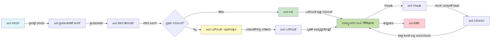
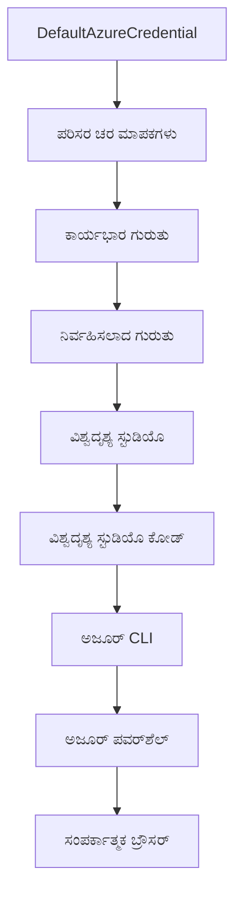

# AZD ಮೂಲಭೂತಗಳು - ಅಜ್ಯూర్ ಡೆವಲಪರ್ CLI ಅನ್ನು ಅರ್ಥಮಾಡಿಕೊಳ್ಳುವುದು

# AZD ಮೂಲಭೂತಗಳು - ಪ್ರಾಥಮಿಕ ತತ್ವಗಳು ಮತ್ತು ಆಧಾರಭೂತ জ್ಞಾನ

**ಅಧ್ಯಾಯ ನ್ಯಾವಿಗೇಶನ್:**
- **📚 ಕೋರ್ಸ್ನ ಮನೆ**: [ಆಜ್ಡ್ ಫಾರ್ ಬ್ಯಾಗಿನರ್ಸ್](../../README.md)
- **📖 მიმდინარე ಅಧ್ಯಾಯ**: ಅಧ್ಯಾಯ 1 - ಅಡಿಗಲ್ಲು ಮತ್ತು ದ್ರುತ ಆರಂಭ
- **⬅️ ಹಿಂದಿನದು**: [ಕೋರ್ಸ್ ಅವಲೋಕನ](../../README.md#-chapter-1-foundation--quick-start)
- **➡️ ಮುಂದಿನದು**: [ಸ್ಥಾಪನೆ ಮತ್ತು ಸೆಟಪ್](installation.md)
- **🚀 ಮುಂದಿನ ಅಧ್ಯಾಯ**: [ಅಧ್ಯಾಯ 2: AI-ಪ್ರಥಮ ಡೆವಲಪ್‌ಮೆಂಟ್](../chapter-02-ai-development/microsoft-foundry-integration.md)

## ಪರಿಚಯ

ಈ ಪಾಠವು ನಿಮ್ಮನ್ನು ಅಜ್ಯూర్ ಡೆವಲಪರ್ CLI (azd) ಗೆ ಪರಿಚಯಿಸುತ್ತದೆ, ಇದು ಸ್ಥಳೀಯ ಡೆವಲಪ್‌ಮೆಂಟ್ ನಿಂದ ಅಜ್ಯೂರಿಗೆ ನಿಯೋಜನೆಗೆ ನಿಮ್ಮ ಪಯಣವನ್ನು ವೇಗಗೊಳಿಸುವ ಶಕ್ತಿಶಾಲಿ ವಿಧಾನದ ಕಮಾಂಡ್-ಲೈನ್ ಉಪಕರಣ. ನೀವು ಆಜ್‌ಡ್ ಮೂಲಭೂತ ತತ್ವಗಳು, ಮುಖ್ಯ ವೈಶಿಷ್ಟ್ಯಗಳು ಮತ್ತು ಹೇಗೆ azd ಕ್ಲೌಡ್-ನೆಟಿವ್ ಅಪ್ಲಿಕೇಶನ್ ನಿಯೋಜನೆಯನ್ನು ಸುಲಭಗೊಳಿಸುತ್ತದೆ ಎಂಬುದನ್ನು ಕಲಿತೀರಿ.

## ಅಧ್ಯಯನ ಉದ್ದೇಶಗಳು

ಈ ಪಾಠದ ಅಂತ್ಯಕ್ಕೆ, ನೀವು:
- ಅಜ್ಯೂರು ಡೆವಲಪರ್ CLI ಎಂದರೇನು ಮತ್ತು ಅದರ ಪ್ರಮುಖ ಉದ್ದೇಶವನ್ನು ಅರ್ಥಮಾಡಿಕೊಳ್ಳುವಿರಿ
- ಟೆಂಪ್ಲೇಟ್ಸ್, ಪರಿಸರಗಳು ಮತ್ತು ಸೇವೆಗಳ ಪ್ರಾಥಮಿಕ ತತ್ವಗಳನ್ನು ಕಲಿಯುವಿರಿ
- ಟೆಂಪ್ಲೇಟ್-ಚಾಲಿತ ಡೆವಲಪ್‌ಮೆಂಟ್ ಮತ್ತು ಇನ್ಫ್ರಾಸ್ಟ್ರಕ್ಚರ್ ಆಸ್ ಕೋಡ್ ಸೇರಿದಂತೆ ಪ್ರಮುಖ ವೈಶಿಷ್ಟ್ಯಗಳನ್ನು ಅನ್ವೇಷಿಸುವಿರಿ
- azd ಪ್ರಾಜೆಕ್ಟ್ ರಚನೆ ಮತ್ತು ವರ್ಕ್‌ಫ್ಲೋ ಅನ್ನು ಅರ್ಥಮಾಡಿಕೊಳ್ಳುವಿರಿ
- ನಿಮ್ಮ ಅಭಿವೃದ್ಧಿ ಪರಿಸರಕ್ಕಾಗಿ azd ಅನ್ನು ಸ್ಥಾಪನೆ ಮತ್ತು ಸಂರಚಿಸಲು ಸಿದ್ಧರಾಗುವಿರಿ

## ಅಧ್ಯಾಯದ ಫಲಿತಾಂಶಗಳು

ಈ ಪಾಠವನ್ನು ಪೂರ್ಣಗೊಳಿಸಿದ ನಂತರ, ನೀವು ಸಾಧ್ಯವಾಗುವುದು:
- ಆಧುನಿಕ ಕ್ಲೌಡ್ ಡೆವಲಪ್‌ಮೆಂಟ್ ವರ್ಕ್ಫ್ಲೋಗಳಲ್ಲಿ azd ಯ ಪಾತ್ರವನ್ನು ವಿವರಿಸಲು
- azd ಪ್ರಾಜೆಕ್ಟ್ ರಚನೆಯಾಗಿರುವ ಭಾಗಗಳನ್ನು ಪತ್ತೆ ಮಾಡಬೇಕಾಗಿ
- ಟೆಂಪ್ಲೇಟ್ಸ್, ಪರಿಸರಗಳು ಮತ್ತು ಸೇವೆಗಳು ಒಟ್ಟಾಗಿ ಹೇಗೆ ಕಾರ್ಯನಿರ್ವಹಿಸುತ್ತವೆ ಎಂದು ವರ್ಣಿಸಲು
- azd ಮೂಲಕ ಇನ್ಫ್ರಾಸ್ಟ್ರಕ್ಚರ್ ಆಸ್ ಕೋಡ್ ನ ಲಾಭಗಳನ್ನು ಅರ್ಥಮಾಡಿಕೊಳ್ಳಲು
- ವಿವಿಧ azd ಕಮಾಂಡ್‌ಗಳನ್ನು ಮತ್ತು ಅವುಗಳ ಉದ್ದೇಶಗಳನ್ನು ಗುರುತಿಸಲು

## ಅಜ್ಯೂರು ಡೆವಲಪರ್ CLI (azd) ಎಂದರೇನು?

ಅಜ್ಯೂರು ಡೆವಲಪರ್ CLI (azd) ಎಂದರೆ ಸ್ಥಳೀಯ ಅಭಿವೃದ್ಧಿಯಿಂದ ಅಜ್ಯೂರಿಗೆ ನಿಯೋಜನೆಯನ್ನು ವೇಗಗೊಳಿಸಲು ವಿನ್ಯಾಸಗೊಳಿಸಲ್ಪಟ್ಟ ಕಮಾಂಡ್-ಲೈನ್ ಟೂಲ್. ಇದು ಅಜ್ಯೂರಿನಲ್ಲಿ ಕ್ಲೌಡ್-ನೆಟಿವ್ ಅಪ್ಲಿಕೇಶನ್‌ಗಳನ್ನು ನಿರ್ಮಿಸುವುದು, ನಿಯೋಜಿಸುವುದು ಮತ್ತು ನಿರ್ವಹಿಸುವ ಪ್ರಕ್ರಿಯೆಯನ್ನು ಸರಳಗೊಳಿಸುತ್ತದೆ.

### మీరు azd ಸಹಾಯದಿಂದ ಏನು ನಿಯೋಜಿಸಬಹುದು?

azd ವಿವಿಧ ತರಹದ ಕೆಲಸವನ್ನು ಬೆಂಬಲಿಸುತ್ತದೆ—ಮತ್ತು ಅದರ ಪಟ್ಟಿ ನಿರಂತರವಾಗಿ ವಿಸ್ತಾರವಾಗುತ್ತಿದೆ. ಇಂದು, ನೀವು azd ಉಪಯೋಗಿಸಿ ನಿಯೋಜಿಸಲು:

| ಕೆಲಸದ ಪ್ರಕಾರ | ಉದಾಹರಣೆಗಳು | ಅದೇ ವರ್ಕ್ಫ್ಲೋ? |
|---------------|--------------|----------------|
| **ಪಾರಂಪರಿಕ ಅಪ್ಲಿಕೇಶನ್ಗಳು** | ವೆಬ್ ಅಪ್ಲಿಕೇಶನ್ಗಳು, REST APIs, ಸ್ಥಿರ ಸೈಟ್‌ಗಳು | ✅ `azd up` |
| **ಸೇವೆಗಳು ಮತ್ತು ಮೈಕ್ರೋಸೇವೆಗಳು** | ಕಂಟೇನರ್ ಅಪ್ಲಿಕೇಶನ್ಗಳು, ಫಂಕ್ಷನ್ ಅಪ್ಲಿಕೇಶನ್ಗಳು, ಬಹು-ಸೇವಾ ಬ್ಯಾಕೆಂಡ್ಗಳು | ✅ `azd up` |
| **AI ಚಲಿತ ಅಪ್ಲಿಕೇಶನ್ಗಳು** | ಮೈಕ್ರೋಸಾಫ್ಟ್ ಫೌಂಡ್ರಿ ಮಾದರಿಗಳೊಂದಿಗೆ ಚಾಟ್ ಅಪ್ಲಿಕೇಶನ್ಗಳು, AI ಹುಡುಕಾಟ ಹೊಂದಿರುವ RAG ಪರಿಹಾರಗಳು | ✅ `azd up` |
| **ಬುದ್ಧಿವಂತಿರುವ ಏಜೆಂಟ್ಗಳು** | ಫೌಂಡ್ರಿ-ಹೋಸ್ಟ್ ಮಾಡಿದ ಏಜೆಂಟ್ಗಳು, ಬಹು-ಏಜೆಂಟ್ ಸಂಯೋಜನೆಗಳು | ✅ `azd up` |

ಮುಖ್ಯ ಅರ್ಥವೆನೆಂದರೆ **ನೀವು ಯಾವುದನ್ನು ನಿಯೋಜಿಸುತ್ತಿದ್ದರೂ azd ಜೀವಚಕ್ರ ಯಾವಾಗಲೂ ಒಂದೇ ರೀತಿಯೇ ಇರುತ್ತದೆ**. ನೀವು ಪ್ರಾಜೆಕ್ಟ್ ಪ್ರಾರಂಭಿಸುತ್ತೀರಿ, ಮೂಲಸೌಕರ್ಯ ಒದಗಿಸುತ್ತೀರಿ, ನಿಮ್ಮ ಕೋಡ್ ನಿಯೋಜಿಸುತ್ತೀರಿ, ಅಪ್ಲಿಕೇಶನನ್ನು ಗಮನಿಸುತ್ತೀರಿ ಮತ್ತು ಸಫಾಯಾಗೊಳಿಸುತ್ತೀರಿ—ಅದು ಸರಳ ವೆಬ್‌ಸೈಟ್ ಆಗಿರಲಿ ಅಥವಾ ಸೊಫಿಸ್ಟಿಕೇಟೆಡ್ AI ಏಜೆಂಟ್ ಆಗಿರಲಿ.

ಈ ನಿರಂತರತೆ ವಿನ್ಯಾಸದ ಪ್ರಕಾರವಾಗಿದೆ. azd AI ಸಾಮರ್ಥ್ಯಗಳನ್ನು ನಿಮ್ಮ ಅಪ್ಲಿಕೇಶನ್ಗೆ ಬಳಸುವ ಮತ್ತೊಂದು ರೀತಿಯ ಸೇವೆ ಎಂದು ನೋಡುತ್ತದೆ, ಮೂಲತಃ ಭಿನ್ನವಾಗಿಲ್ಲ ಎಂದು ಅಲ್ಲ. ಮೈಕ್ರೋಸಾಫ್ಟ್ ಫೌಂಡ್ರಿ ಮಾದರಿಗಳ ಮೂಲಕ ಬೆಂಬಲಗೊಂಡ ಚಾಟ್ ಎಂಡ್‌ಪಾಯಿಂಟ್‌ವು azd ದೃಷ್ಟಿಕೋನದಿಂದ ಮತ್ತೊಂದು ಸೇವೆಯೇ, ಸಂರಚಿಸಲು ಮತ್ತು ನಿಯೋಜಿಸಲು.

### 🎯 ಏಕೆ AZD ಬಳಸಬೇಕು? ಒಂದು ನೈಜ-ಲೋಕ ಸಂಭಂಧ

ಸರಳ ವೆಬ್ ಅಪ್ಲಿಕೇಶನ್ ಅನ್ನು ಡೇಟಾಬೇಸ್ ಜೊತೆಗೆ ನಿಯೋಜಿಸುವ ಉದಾಹರಣೆಯನ್ನು ಹೋಲಿಸೋಣ:

#### ❌ AZD ಇಲ್ಲದೆ: ಕೈಯಿಂದ ಅಜ್ಯೂರು ನಿಯೋಜನೆ (30+ ನಿಮಿಷಗಳು)

```bash
# ಹಂತ 1: ಸಂಪನ್ಮೂಲ ಗುಂಪು ರಚಿಸಿ
az group create --name myapp-rg --location eastus

# ಹಂತ 2: ಆಪ್ ಸೇವಾ ಯೋಜನೆಯನ್ನು ರಚಿಸಿ
az appservice plan create --name myapp-plan \
  --resource-group myapp-rg \
  --sku B1 --is-linux

# ಹಂತ 3: ವೆಬ್ ಅಪ್ಲಿಕೇಷನ್ ರಚಿಸಿ
az webapp create --name myapp-web-unique123 \
  --resource-group myapp-rg \
  --plan myapp-plan \
  --runtime "NODE:18-lts"

# ಹಂತ 4: ಕೋಸ್ಮೋಸ್ ಡಿಬಿ ಖಾತೆ ರಚಿಸಿ (10-15 ನಿಮಿಷಗಳು)
az cosmosdb create --name myapp-cosmos-unique123 \
  --resource-group myapp-rg \
  --kind MongoDB

# ಹಂತ 5: ಡೇಟಾಬೇಸ್ ರಚಿಸಿ
az cosmosdb mongodb database create \
  --account-name myapp-cosmos-unique123 \
  --resource-group myapp-rg \
  --name tododb

# ಹಂತ 6: ಸಂಗ್ರಹಣೆಯನ್ನು ರಚಿಸಿ
az cosmosdb mongodb collection create \
  --account-name myapp-cosmos-unique123 \
  --resource-group myapp-rg \
  --database-name tododb \
  --name todos

# ಹಂತ 7: ಸಂಪರ್ಕ ಸ್ಟ್ರಿಂಗ್ ಪಡೆಯಿರಿ
CONN_STR=$(az cosmosdb keys list \
  --name myapp-cosmos-unique123 \
  --resource-group myapp-rg \
  --type connection-strings \
  --query "connectionStrings[0].connectionString" -o tsv)

# ಹಂತ 8: ಆಪ್ ಸೆಟ್ಟಿಂಗ್‌ಗಳನ್ನು ಸಂರಚಿಸಿ
az webapp config appsettings set \
  --name myapp-web-unique123 \
  --resource-group myapp-rg \
  --settings MONGODB_URI="$CONN_STR"

# ಹಂತ 9: ಲಾಗಿಂಗ್ ಚಾಲನೆಮಾಡಿ
az webapp log config --name myapp-web-unique123 \
  --resource-group myapp-rg \
  --application-logging filesystem \
  --detailed-error-messages true

# ಹಂತ 10: ಅಪ್ಲಿಕೇಷನ್ ಇನ್‌ಸೈಟ್ಸ್ ಸಜ್ಜುಗೊಳಿಸಿ
az monitor app-insights component create \
  --app myapp-insights \
  --location eastus \
  --resource-group myapp-rg

# ಹಂತ 11: ಆಪ್ ಇನ್‌ಸೈಟ್ಸ್ ಅನ್ನು ವೆಬ್ ಅಪ್‌ಗೆ ಲಿಂಕ್ ಮಾಡಿ
INSTRUMENTATION_KEY=$(az monitor app-insights component show \
  --app myapp-insights \
  --resource-group myapp-rg \
  --query "instrumentationKey" -o tsv)

az webapp config appsettings set \
  --name myapp-web-unique123 \
  --resource-group myapp-rg \
  --settings APPINSIGHTS_INSTRUMENTATIONKEY="$INSTRUMENTATION_KEY"

# ಹಂತ 12: ಅಪ್ಲಿಕೇಷನ್ ಅನ್ನು ಸ್ಥಳೀಯವಾಗಿ ನಿರ್ಮಿಸಿ
npm install
npm run build

# ಹಂತ 13: ನಿಯೋಜನಾ ಪ್ಯಾಕೇಜ್ ರಚಿಸಿ
zip -r app.zip . -x "*.git*" "node_modules/*"

# ಹಂತ 14: ಅಪ್ಲಿಕೇಷನ್ ನಿಯೋಜಿಸಿ
az webapp deployment source config-zip \
  --resource-group myapp-rg \
  --name myapp-web-unique123 \
  --src app.zip

# ಹಂತ 15: ಕಾಯಿರಿ ಮತ್ತು ಅದು ಕೆಲಸ ಮಾಡಲಿ ಎಂದು ಪ್ರಾರ್ಥಿಸಿ 🙏
# (ಯಾವುದೇ ಸ್ವಯಂಚಾಲಿತ ಮಾನ್ಯತೆ ಇಲ್ಲ, ಕೈಯಿಂದ ಪರೀಕ್ಷೆ ಅಗತ್ಯ)
```

**ಸಮಸ್ಯೆಗಳು:**
- ❌ 15+ ಆದೇಶಗಳನ್ನು ಸ್ಮರಿಸಿ ಕ್ರಮವಾಗಿ ನಡೆಸುವುದು
- ❌ 30-45 ನಿಮಿಷಗಳ ಕೈಯಿಂದ ಕೆಲಸ
- ❌ ತಪ್ಪು ಅನುಕೂಲ (ಟೈಪೋಗಳು, ತಪ್ಪು ಪ್ಯಾರಾಮೀಟರ್‌ಗಳು) ಸುಲಭ
- ❌ ಕನೆಕ್ಷನ್ ಸ್ಟ್ರಿಂಗ್‌ಗಳು ಟರ್ಮಿನಲ್ ಇತಿಹಾಸದಲ್ಲಿ ಬಹಿರಂಗ
- ❌ ಏನಾದ್ರೆ ವೈಫಲ್ಯವಾದರೆ ಸ್ವಯಂಚಾಲಿತ ರೋಲ್‌ಬ್ಯಾಕ್ ಇಲ್ಲ
- ❌ ತಂಡ ಸದಸ್ಯರಿಗೆ ನಕಲಿಸಲು ಕಷ್ಟವಾಗಿದೆ
- ❌ ಪ್ರತಿ ಬಾರಿ ವಿಭಿನ್ನ (ಪುನರಾವರ್ತಿಸದ)

#### ✅ AZD ಸಹಿತ: ಸ್ವಯಂಚಾಲಿತ ನಿಯೋಜನೆ (5 ಕಮಾಂಡ್‌ಗಳು, 10-15 ನಿಮಿಷಗಳು)

```bash
# ಹಂತ 1: ಟೆಂಪ್ಲೇಟಿನಿಂದ ಪ್ರಾರಂಭಿಸಿ
azd init --template todo-nodejs-mongo

# ಹಂತ 2: ದೃಢೀಕರಿಸಿ
azd auth login

# ಹಂತ 3: ಪರಿಸರವನ್ನು ರಚಿಸಿ
azd env new dev

# ಹಂತ 4: ಬದಲಾವಣೆಗಳನ್ನು ಪೂರ್ವದೃಷ್ಟಿ ಮಾಡಿ (ಐಚ್ಛಿಕ ಆದರೆ ಶಿಫಾರಸು ಮಾಡಲ್ಪಟ್ಟಿದೆ)
azd provision --preview

# ಹಂತ 5: ಎಲ್ಲವನ್ನೂ ನಿಯೋಜಿಸಿ
azd up

# ✨ ಮುಗಿದಿದೆ! ಎಲ್ಲವೂ ನಿಯೋಜಿಸಲಾಗಿದೆ, ಸಂರಚಿಸಲಾಗಿದೆ ಮತ್ತು ನಿಗಾ ವಹಿಸಲಾಗುತ್ತಿದೆ
```

**ಲಾಭಗಳು:**
- ✅ **5 ಕಮಾಂಡ್‌ಗಳು** vs. 15+ ಕೈಯಿಂದ ಹಂತಗಳು
- ✅ **10-15 ನಿಮಿಷಗಳು** ಮೊತ್ತದಲ್ಲಿ (ಹೆಚ್ಚಾಗಿ ಅಜ್ಯೂರಿಗಾಗಿ ಕಾಯುತ್ತಿದೆ)
- ✅ **ಕಮ್ಮಿಯ ಕೈಯಿಂದ ತಪ್ಪು** - ಸತತ, ಟೆಂಪ್ಲೇಟ್ ಚಾಲಿತ ವರ್ಕ್ಫ್ಲೋ
- ✅ **ಸುರಕ್ಷಿತ ರಹಸ್ಯ ನಿರ್ವಹಣೆ** - ಹಲವಾರು ಟೆಂಪ್ಲೇಟ್ಗಳು ಅಜ್ಯೂರ್ನಿಂದ ನಿರ್ವಹಿಸಲ್ಪಟ್ಟ ರಹಸ್ಯ ಸಂಗ್ರಹ ವಾಪರಿಸುತ್ತವೆ
- ✅ **ಪುನರಾವರ್ತಿಸಬಹುದಾದ ನಿಯೋಜನೆಗಳು** - ಪ್ರತಿ ಬಾರಿ ಅದೇ ವರ್ಕ್ಫ್ಲೋ
- ✅ **ಪೂರ್ಣ ಮರುನಿರ್ಮಾಣೀಯ** - ಪ್ರತಿ ಬಾರಿ ಅದೇ ಫಲಿತಾಂಶ
- ✅ **ತಂಡ ಸಿದ್ಧತೆ** - ಯಾರೂ ಇದೇ ಆಜ್ಞೆಗಳಿಂದ ನಿಯೋಜಿಸಬಹುದು
- ✅ **ಇನ್ಫ್ರಾಸ್ಟ್ರಕ್ಚರ್ ಆಸ್ ಕೋಡ್** - ಸಂಸ್ಕರಣಾ ನಿಯಂತ್ರಿತ ಬೈಸಪ್ ಟೆಂಪ್ಲೇಟ್ಗಳು
- ✅ **ನಿರಂತರ ನಿಗದಿತಿ** - ಅಪ್ಲಿಕೇಶನ್ ಇನ್ಸೈಟ್ಸ್ ಸ್ವಯಂಚಾಲಿತ ಸಂರಚನೆ

### 📊 ಸಮಯ ಮತ್ತು ದೋಷ ಕಡಿತ

| ಮಾಪಕ | ಕೈಯಿಂದ ನಿಯೋಜನೆ | AZD ನಿಯೋಜನೆ | ಸುಧಾರಣೆ |
|:-------|:------------------|:---------------|:------------|
| **ಕಮಾಂಡ್‌ಗಳು** | 15+ | 5 | 67% ಕಡಿಮೆ |
| **ಸಮಯ** | 30-45 ನಿಮಿಷ | 10-15 ನಿಮಿಷ | 60% ವೇಗವಾಗಿ |
| **ದೋಷ ದರ** | ~40% | <5% | 88% ಕಡಿತ |
| **ತಾಳಮೇಳ** | ಕಡಿಮೆ (ಕೈಯಿಂದ) | 100% (ಸ್ವಯಂಚಾಲಿತ) | ಸೊಗಸು |
| **ತಂಡ ಒಪ್ಪಿಗೆಯ ಸಮಯ** | 2-4 ಗಂಟೆ | 30 ನಿಮಿಷ | 75% ವೇಗವಾಗಿ |
| **ರೋಲ್‌ಬ್ಯಾಕ್ ಸಮಯ** | 30+ ನಿಮಿಷ (ಕೈಯಿಂದ) | 2 ನಿಮಿಷ (ಸ್ವಯಂಚಾಲಿತ) | 93% ವೇಗವಾಗಿ |

## ಪ್ರಾಥಮಿಕ ತತ್ವಗಳು

### ಟೆಂಪ್ಲೇಟ್ಸ್
ಟೆಂಪ್ಲೇಟ್ಗಳು azd ನ ಅಡಿಸ್ಥಾನ. ಅವು ಹೊಂದಿವೆ:
- **ಅಪ್ಲಿಕೇಶನ್ ಕೋಡ್** - ನಿಮ್ಮ ಮೂಲ ಕೋಡ್ ಮತ್ತು ಅವಲಂಬನೆಗಳು
- **ಮೂಲಸೌಕರ್ಯ ವ್ಯಾಖ್ಯಾನಗಳು** - ಬೈಸಪ್ ಅಥವಾ ಟೆರಾಫಾರ್ಮ್‌ನಲ್ಲಿ ನಿರ್ದಿಷ್ಟಪಡಿಸಲಾದ ಅಜ್ಯೂರು ಸಂಪನ್ಮೂಲಗಳು
- **ಕಾನ್ಫಿಗರೇಶನ್ ಕಡತಗಳು** - ಸೆಟ್ಟಿಂಗ್ಸ್ ಮತ್ತು ಪರಿಸರ ಚರಗಳು
- **ನಿಯೋಜನಾ ಸ್ಕ್ರಿಪ್ಟ್‌ಗಳು** - ಸ್ವಯಂಚಾಲಿತ ನಿಯೋಜನಾ ವರ್ಕ್ಫ್ಲೋಗಳು

### ಪರಿಸರಗಳು
ಪರಿಸರಗಳು ವಿಭಿನ್ನ ನಿಯೋಜನಾ ಗುರಿಗಳನ್ನು ಪ್ರತಿನಿಧಿಸುತ್ತವೆ:
- **ವಿಕಸನ** - ಪರೀಕ್ಷೆ ಮತ್ತು ಅಭಿವೃದ್ಧಿ ಗಾಗಿ
- **ಸ್ಟೇಜಿಂಗ್** - ಪೂರ್ವ ಉತ್ಪಾದನೆ ಪರಿಸರ
- **ಉತ್ಪಾದನೆ** - ಲಭ್ಯವಿರುವ ಉತ್ಪಾದನಾ ಪರಿಸರ

ಪ್ರತಿ ಪರಿಸರ ಸಂರಕ್ಷಿಸುತ್ತದೆ:
- ಅಜ್ಯೂರು ಸಂಪನ್ಮೂಲ ಗುಂಪು
- ಕಾನ್ಫಿಗರೇಶನ್ ಸೆಟ್ಟಿಂಗ್ಸ್
- ನಿಯೋಜನಾ ಸ್ಥಿತಿಯನ್ನು

### ಸೇವೆಗಳು
ಸೇವೆಗಳು ನಿಮ್ಮ ಅಪ್ಲಿಕೇಶನ್‌ನ ನಿರ್ಮಾಣ ಬ್ಲಾಕ್‌ಗಳು:
- **ಮುಖ್ಯಮುಖ** - ವೆಬ್ ಅಪ್ಲಿಕೇಶನ್ಗಳು, SPAs
- **ಬ್ಯಾಕ್‌ಎಂಡ್** - APIs, ಮೈಕ್ರೋಸೇವೆಗಳು
- **ಡೇಟಾಬೇಸ್** - ಡೇಟಾ ಸಂಗ್ರಹ ವ್ಯಕ್ತಿಗತ ಪರಿಹಾರಗಳು
- **ಸಂಗ್ರಹಣೆ** - ಕಡತ ಮತ್ತು ಬ್ಲಾಬ್ ಸಂಗ್ರಹಣೆ

## ಪ್ರಮುಖ ವೈಶಿಷ್ಟ್ಯಗಳು

### 1. ಟೆಂಪ್ಲೇಟ್ ಚಾಲಿತ ಡೆವಲಪ್‌ಮೆಂಟ್
```bash
# ಲಭ್ಯವಿರುವ ಟೆಂಪ್ಲೇಟುಗಳನ್ನು ಬ್ರೌಸ್ ಮಾಡಿ
azd template list

# ಟೆಂಪ್ಲೇಟಿನಿಂದ ಪ್ರಾರಂಭಿಸಿ
azd init --template <template-name>
```

### 2. ಇನ್ಫ್ರಾಸ್ಟ್ರಕ್ಚರ್ ಆಸ್ ಕೋಡ್
- **ಬೈಸಪ್** - ಅಜ್ಯೂರಿನ ವಿಶೇಷ ಭಾಷೆ
- **ಟೆರಾಫಾರ್ಮ್** - ಬಹು-ಕ್ಲೌಡ್ ಮೂಲಸೌಕರ್ಯ ಉಪಕರಣ
- **ARM ಟೆಂಪ್ಲೇಟ್ಗಳು** - ಅಜ್ಯೂರು ರಿಸೋರ್ಸ್ ಮ್ಯಾನೇಜರ್ ಟೆಂಪ್ಲೇಟ್ಗಳು

### 3. ಏಕೀಕೃತ ವರ್ಕ್‌ಫ್ಲೋಗಳು
```bash
# ಸಂಪೂರ್ಣ ನಿಯೋಜನಾ ಕಾರ್ಯಪ್ರವಾಹ
azd up            # ಪ್ರೊವಿಷನ್ + ನಿಯೋಜನೆ ಇದು ಮೊದಲ ಬಾರಿ ಸೆಟಪ್ ಮಾಡಲು ಕೈಗೊಳ್ಳಲು ಇಲ್ಲ

# 🧪 ಹೊಸದು: ನಿಯೋಜನೆಯ ಮೊದಲು ಮೂಲಸೌಕರ್ಯ ಬದಲಾವಣೆಗಳನ್ನು ಪೂರ್ವವೀಕ್ಷಿಸಿ (ಭದ್ರ)
azd provision --preview    # ಬದಲಾವಣೆ ಮಾಡದೆ ಮೂಲಸೌಕರ್ಯ ನಿಯೋಜನೆಯನ್ನು ಅನುಕರಿಸಿ

azd provision     # ಮೂಲಸೌಕರ್ಯವನ್ನು ನವೀಕರಿಸಿದರೆ ಅಜ್ಯೂರ್ ಸಂಪನ್ಮೂಲಗಳನ್ನು ರಚಿಸಿ ಇದನ್ನು ಬಳಸಿರಿ
azd deploy        # ಅಪ್ಲಿಕೇಶನ್ ಕೋಡ್ ನಿಯೋಜಿಸಿ ಅಥವಾ ನವೀಕರಿಸಿದ ನಂತರ ಅಪ್ಲಿಕೇಶನ್ ಕೋಡ್ ಅನುನಿಬಂಧಿಸಿ
azd down          # ಸಂಪನ್ಮೂಲಗಳನ್ನು ಸ್ವಚ್ಛಗೊಳಿಸಿ
```

#### 🛡️ ಪ್ರಿ‌ವ್ಯೂ ಮೂಲಕ ಸುರಕ್ಷಿತ ಮೂಲಸೌಕರ್ಯ ಯೋಜನೆ
`azd provision --preview` ಆಜ್ಞೆ ಸುರಕ್ಷಿತ ನಿಯೋಜನೆಗಾಗಿ ಕ್ರಾಂತಿಕಾರಿ:
- **ಡ್ರೈ-ರನ್ ವಿಶ್ಲೇಷಣೆ** - ಏನು ನಿರ್ಮಿಸಲಾಗುವುದು, ಪರಿಷ್ಕೃತವಾಗುವುದು ಅಥವಾ ಅಳಿಸಲಾಗುವುದು ಎಂಬುದನ್ನು ತೋರಿಸುತ್ತದೆ
- **ಶೂನ್ಯ ಅಪಾಯ** - ನಿಮ್ಮ ಅಜ್ಯೂರು ಪರಿಸರದಲ್ಲಿ ಯಾವುದೇ ನಿಜವಾದ ಬದಲಾವಣೆಗಳನ್ನು ಮಾಡುವುದಿಲ್ಲ
- **ತಂಡ ಸಹಕಾರ** - ನಿಯೋಜನೆಯ ಮುಂಚೆ ಪ್ರಿವ್ಯೂ ಫಲಿತಾಂಶವನ್ನು ಹಂಚಿಕೊಳ್ಳಿ
- **ಖರ್ಚು ಅಂದಾಜು** - ನಿಬಂಧನೆಗಿಂತ ಮುಂಚೆ ಸಂಪನ್ಮೂಲಗಳ ವೆಚ್ಚವನ್ನು ಅರ್ಥಮಾಡಿಕೊಳ್ಳಿ

```bash
# ಉದಾಹರಣೆ ಪೂರ್ವದೃಶ್ಯ ವರ್ಕ್‌ಫ್ಲೋ
azd provision --preview           # ಏನು ಬದಲಾವಣೆಯಾಗಲಿದೆ ನೋಡಿ
# ಔಟ್‌ಪುಟ್ ಪರಿಶೀಲಿಸಿ, ತಂಡದೊಂದಿಗೆ ಚರ್ಚಿಸಿ
azd provision                     # ಭರವಸೆ ಹೊಂದಿ ಬದಲಾವಣೆಗಳನ್ನು ಅನ್ವಯಿಸಿ
```

### 📊 ದೃಶ್ಯ: AZD ಡೆವಲಪ್‌ಮೆಂಟ್ ವರ್ಕ್‌ಫ್ಲೋ


**ವರ್ಕ್‌ಫ್ಲೋ ವಿವರ:**
1. **Init** - ಟೆಂಪ್ಲೇಟಿನಲ್ಲಿ ಅಥವಾ ಹೊಸ ಪ್ರಾಜೆಕ್ಟಿನಿಂದ ಪ್ರಾರಂಭಿಸಿ
2. **Auth** - ಅಜ್ಯೂರಿನಲ್ಲಿ ಪ್ರಮಾಣೀಕರಿಸಿ
3. **Environment** - ವಿಭಿನ್ನ ನಿಯೋಜನೆ ಪರಿಸರವನ್ನು ರಚಿಸಿ
4. **Preview** - ಹೊಸದಾಗಿ ️ಮತ್ತು ಯಾವಾಗಲೂ ಮೂಲಸೌಕರ್ಯ ಬದಲಾವಣೆಗಳನ್ನು ಪ್ರತ್ಯೇಕವಾಗಿ ನೋಡಿಕೊಳ್ಳಿ (ಸುರಕ್ಷಿತ ಅಭ್ಯಾಸ)
5. **Provision** - ಅಜ್ಯೂರು ಸಂಪನ್ಮೂಲಗಳನ್ನು ರಚಿಸಿ/ನವೀಕರಿಸಿ
6. **Deploy** - ನಿಮ್ಮ ಅಪ್ಲಿಕೇಶನ್ ಕೋಡ್ ಒತ್ತಿ
7. **Monitor** - ಅಪ್ಲಿಕೇಶನ್ ಕಾರ್ಯಕ್ಷಮತೆಯನ್ನು ಗಮನಿಸಿ
8. **Iterate** - ಬದಲಾವಣೆ ಮಾಡಿ ಮತ್ತು ಕೋಡ್‌ನ್ನು ಪುನ:nಿಯೋಜಿಸಿ
9. **Cleanup** - ಸಮಾಪ್ತಿಯಾದಾಗ ಸಂಪನ್ಮೂಲಗಳನ್ನು ತೆಗೆದುಹಾಕಿ

### 4. ಪರಿಸರ ನಿರ್ವಹಣೆ
```bash
# ಪರಿಸರಗಳನ್ನು ರಚಿಸಿ ಮತ್ತು ನಿರ್ವಹಿಸಿ
azd env new <environment-name>
azd env select <environment-name>
azd env list
```

### 5. ವಿಸ್ತರಣೆಗಳು ಮತ್ತು AI ಆಜ್ಞೆಗಳು

azd ಮೂಲ CLIಗೆ ಹೆಚ್ಚುವರಿ ಸಾಮರ್ಥ್ಯಗಳನ್ನು ಸೇರಿಸಲು ವಿಸ್ತರಣೆ ವ್ಯವಸ್ಥೆ ಬಳಕೆಮಾಡುತ್ತದೆ. ಇದು ವಿಶೇಷವಾಗಿ AI ಕಾರ್ಯಭಾರಗಳಿಗೆ ಉಪಯುಕ್ತವಾಗುತ್ತದೆ:

```bash
# ಲಭ್ಯವಿರುವ ವಿಸ್ತರಣೆಗಳನ್ನು ಪಟ್ಟಿ ಮಾಡಿ
azd extension list

# ಫೌಂಡ್ರಿ ಏಜೆಂಟ್ಸ್ ವಿಸ್ತರಣೆಯನ್ನು ಸ್ಥಾಪಿಸಿ
azd extension install azure.ai.agents

# ಮ್ಯಾನಿಫೆಸ್ಟ್‌ನಿಂದ AI ಏಜೆಂಟ್ ಪ್ರಾಜೆಕ್ಟ್ ಅನ್ನು ಪ್ರಾರಂಭಿಸಿ
azd ai agent init -m agent-manifest.yaml

# AI-ಸಹಾಯಿತ ಅಭಿವೃದ್ಧಿಗಾಗಿ MCP ಸರ್ವರ್ ಅನ್ನು ಪ್ರಾರಂಭಿಸಿ (ಆಲ್ಫಾ)
azd mcp start
```

> ವಿಸ್ತರಣೆಗಳು [ಅಧ್ಯಾಯ 2: AI-ಪ್ರಥಮ ಡೆವಲಪ್‌ಮೆಂಟ್](../chapter-02-ai-development/agents.md) ಮತ್ತು [AZD AI CLI ಆಜ್ಞೆಗಳು](../chapter-08-production/production-ai-practices.md#azd-ai-cli-commands-and-extensions) ಉಲ್ಲೇಖದಲ್ಲಿ ವಿವರಿಸಲಾಗಿದೆ.

## 📁 ಪ್ರಾಜೆಕ್ಟ್ ರಚನೆ

ಸಾಮಾನ್ಯ azd ಪ್ರಾಜೆಕ್ಟ್ ರಚನೆ:
```
my-app/
├── .azd/                    # azd configuration
│   └── config.json
├── .azure/                  # Azure deployment artifacts
├── .devcontainer/          # Development container config
├── .github/workflows/      # GitHub Actions
├── .vscode/               # VS Code settings
├── infra/                 # Infrastructure code
│   ├── main.bicep        # Main infrastructure template
│   ├── main.parameters.json
│   └── modules/          # Reusable modules
├── src/                  # Application source code
│   ├── api/             # Backend services
│   └── web/             # Frontend application
├── azure.yaml           # azd project configuration
└── README.md
```

## 🔧 ಸಂರಚನಾ ಕಡತಗಳು

### azure.yaml
ಮುಖ್ಯ ಪ್ರಾಜೆಕ್ಟ್ ಸಂರಚನಾ ಕಡತ:
```yaml
name: my-awesome-app
metadata:
  template: my-template@1.0.0

services:
  web:
    project: ./src/web
    language: js
    host: appservice
  api:
    project: ./src/api
    language: js
    host: appservice

hooks:
  preprovision:
    shell: pwsh
    run: echo "Preparing to provision..."
```

### .azure/config.json
ಪರಿಸರ ನಿರ್ದಿಷ್ಟ ಸಂರಚನೆ:
```json
{
  "version": 1,
  "defaultEnvironment": "dev",
  "environments": {
    "dev": {
      "subscriptionId": "your-subscription-id",
      "location": "eastus"
    }
  }
}
```

## 🎪 ಸಾಮಾನ್ಯ ವರ್ಕ್ಫ್ಲೋಗಳು ನೀಡುವ ಹಸ್ತಕ್ಷೇಪ ಅಭ್ಯಾಸಗಳು

> **💡 ಅಧ್ಯಯನ ಸಲಹೆ:** ನಿಮ್ಮ AZD ಕೌಶಲ್ಯಗಳನ್ನು ಕ್ರಮವಾಗಿ ನಿರ್ಮಿಸಲು ಈ ಅಭ್ಯಾಸಗಳನ್ನು ಕ್ರಮವಾಗಿ ಅನುಸರಿಸಿ.

### 🎯 ಅಭ್ಯಾಸ 1: ನಿಮ್ಮ ಪ್ರಥಮ ಪ್ರಾಜೆಕ್ಟ್ ಪ್ರಾರಂಭಿಸಿ

**ಉದ್ದೇಶ:** AZD ಪ್ರಾಜೆಕ್ಟ್ සාದಿಸಿ ಮತ್ತು ಅದರ ರಚನೆಯನ್ನು ಅನ್ವೇಷಿಸಿ

**ಹಂತಗಳು:**
```bash
# ಸಾಬೀತಾದ ಟೆಂಪ್ಲೇಟನ್ನು ಬಳಸಿ
azd init --template todo-nodejs-mongo

# ರಚಿಸಲಾದ ಕಡತಗಳನ್ನು ಅನ್ವೇಷಿಸಿ
ls -la  # ಕುಳಿತಿರುವ ಕಡತಗಳೂ ಸೇರಿ ಎಲ್ಲಾ ಕಡತಗಳನ್ನು ನೋಡಿ

# ರಚಿಸಲಾದ ಪ್ರಮುಖ ಕಡತಗಳು:
# - azure.yaml (ಪ್ರಮುಖ ಸಂರಚನೆ)
# - infra/ (ಸೂಚನಾಭಿವೃದ್ಧಿ ಕೋಡ್)
# - src/ (ಅನ್ವಯ ಕೋಡ್)
```

**✅ ಯಶಸ್ಸು:** لديك azure.yaml, infra/, ಮತ್ತು src/ ಡೈರೆಕ್ಟರಿಗಳು

---

### 🎯 ಅಭ್ಯಾಸ 2: ಅಜ್ಯೂರಿಗೆ ನಿಯೋಜಿಸಿ

**ಉದ್ದೇಶ:** ಪೂರ್ಣ ಅಂತ್ಯ-ನಂತರ ನಿಯೋಜನೆ ಪೂರ್ಣಗೊಳಿಸಿ

**ಹಂತಗಳು:**
```bash
# 1. ಪ್ರಮಾಣಿkarisi
az login && azd auth login

# 2. ವಾತಾವರಣ ನಿರ್ಮಿಸಿ
azd env new dev
azd env set AZURE_LOCATION eastus

# 3. ಬದಲಾವಣೆಗಳನ್ನು ಪೂರ್ವದೃಶ್ಯಮಾಡಿ (ಶಿಫಾರಸ್ಸು ಮಾಡಲಾಗಿದೆ)
azd provision --preview

# 4. ಎಲ್ಲವನ್ನೂ ನಿಯೋಜಿಸಿ
azd up

# 5. ನಿಯೋಜನೆಯನ್ನು ಪರಿಶೀಲಿಸಿ
azd show    # ನಿಮ್ಮ ಅಪ್ಲಿಕೇಶನ್ URL ಅನ್ನು ವೀಕ್ಷಿಸಿ
```

**ಎಂದಾದರೂ ಸಮಯ:** 10-15 ನಿಮಿಷಗಳು  
**✅ ಯಶಸ್ಸು:** ಅಪ್ಲಿಕೇಶನ್ URL ಬ್ರೌಸರ್‌ನಲ್ಲಿ ತೆರೆಯುತ್ತದೆ

---

### 🎯 ಅಭ್ಯಾಸ 3: ಬಹು ಪರಿಸರಗಳು

**ಉದ್ದೇಶ:** dev ಮತ್ತು ಸ್ಟೇಜಿಂಗ್ ಗೆ ನಿಯೋಜಿಸಿ

**ಹಂತಗಳು:**
```bash
# ಈಗಾಗಲೇ ಡೆವ್ ಇದೆಯೆ, ಸ್ಟೇಜಿಂಗ್ ರಚಿಸಿ
azd env new staging
azd env set AZURE_LOCATION westus2
azd up

# ಅವುಗಳ ನಡುವೆ ಬದಲಾಯಿಸಿ
azd env list
azd env select dev
```

**✅ ಯಶಸ್ಸು:** ಅಜ್ಯೂರು ಪೋರ್ಟಲ್‌ನಲ್ಲಿ ಎರಡು ವಿಭಿನ್ನ ಸಂಪನ್ಮೂಲ ಗುಂಪ್‌ಗಳು

---

### 🛡️ ಕ್ಲೀನ್ ಸ್ಟೇಟ್: `azd down --force --purge`

ನೀವು ಸಂಪೂರ್ಣವಾಗಿ ಮರುಪ್ರಾರಂಭಿಸಬೇಕಾದಾಗ:

```bash
azd down --force --purge
```

**ಇದು ಏನು ಮಾಡುತ್ತದೆ:**
- `--force`: ಯಾವುದೇ ದೃಢೀಕರಣ ಪ್ರಾಂಪ್ಟ್ ಇಲ್ಲದೆ
- `--purge`: ಎಲ್ಲಾ ಸ್ಥಳೀಯ ಸ್ಥಿತಿ ಮತ್ತು ಅಜ್ಯೂರಿನ ಸಂಪನ್ಮೂಲಗಳನ್ನು ಅಳಿಸುವುದು

**ಬಳಸುವಾಗ:**
- ನಿಯೋಜನೆ ಮಧ್ಯದಲ್ಲಿ ವಿಫಲವಾದಾಗ
- ಪ್ರಾಜೆಕ್ಟ್‌ಗಳನ್ನು ಬದಲಾಯಿಸುವಾಗ
- ಹೊಸ ಪ್ರಾರಂಭ ಬೇಕಾದಾಗ

---

## 🎪 ಮೂಲ ವರ್ಕ್‌ಫ್ಲೋ ಉಲ್ಲೇಖ

### ಹೊಸ ಪ್ರಾಜೆಕ್ಟ್ ಪ್ರಾರಂಭಿಸುತ್ತಿರುವುದು
```bash
# ವಿಧಾನ 1: ಇತ್ತೀಚಿನ ಟೆಂಪ್ಲೇಟನ್ನು ಬಳಸಿ
azd init --template todo-nodejs-mongo

# ವಿಧಾನ 2: ಆರಂಭದಿಂದ ಪ್ರಾರಂಭಿಸಿ
azd init

# ವಿಧಾನ 3: ప్రస్తుత ಡೈರೆಕ್ಟರಿಯನ್ನು ಬಳಸಿ
azd init .
```

### ಅಭಿವೃದ್ಧಿ ಚಕ್ರ
```bash
# ಅಭಿವೃದ್ಧಿ ಪರಿಸರವನ್ನು ಹೊಂದಿಸಿ
azd auth login
azd env new dev
azd env select dev

# ಎಲ್ಲವನ್ನೂ ನಿಯೋಜಿಸಿ
azd up

# ಬದಲಾವಣೆಗಳನ್ನು ಮಾಡಿ ಮರುನಿಯೋಜಿಸಿ
azd deploy

# ಮುಗಿಸಿದಾಗ ಸ್ವಚ್ಛಗೊಳಿಸಿ
azd down --force --purge # ಆಜೂರ್ ಡೆವಲಪರ್ CLI ನಲ್ಲಿ ಕಮಾಂಡ್ ನಿಮ್ಮ ಪರಿಸರಕ್ಕೆ **ಹಾರ್ಡ್ ರಿಸೆಟ್** ಆಗಿದೆ—ವಿಫಲమైన ನಿಯೋಜನೆಗಳನ್ನು ತಪಾಸಣೆಯಲ್ಲಿರುವಾಗ, ಬಿಟ್ಟುಕೊಡಲಾದ ಸಂಪನ್ಮೂಲಗಳನ್ನು ಸ್ವಚ್ಛಗೊಳಿಸುವಾಗ, ಅಥವಾ ಹೊಸದಾಗಿ ಮರುನಿಯೋಜನೆಗೆ ಸಿದ್ಧತೆಮಾಡುವಾಗ ವಿಶೇಷವಾಗಿ ಉಪಯುಕ್ತವಾಗಿದೆ.
```

## `azd down --force --purge` ಅನ್ನು ಅರ್ಥಮಾಡಿಕೊಳ್ಳುವುದು
`azd down --force --purge` ಕಮಾಂಡ್ ನಿಮ್ಮ azd ಪರಿಸರ ಮತ್ತು ಅದರ ಎಲ್ಲಾ ಸಂಬಂಧಿತ ಸಂಪನ್ಮೂಲಗಳನ್ನು ಸಂಪೂರ್ಣವಾಗಿ ಜೀರ್ವಳಿಸುವ ಶಕ್ತಿಶಾಲಿ ವಿಧಾನವಾಗಿದೆ. ಪ್ರತಿ ಫ್ಲ್ಯಾಗ್ ಏನು ಮಾಡುತ್ತದೆ ಎಂಬ ವಿವರಣೆ ಇಲ್ಲಿದೆ:
```
--force
```
- ದೃಢೀಕರಣ ಪ್ರಾಂಪ್ಟ್ ಗಳನ್ನು ಬಿಟ್ಟುಕೊಡುತ್ತದೆ.
- ಕೈಯಿಂದ ಪ್ರಕ್ರಿಯೆಗೆ ಸಾಧ್ಯವಿಲ್ಲದ ಅಥವಾ ಸ್ಕ್ರಿಪ್ಟಿಂಗ್/ಸ್ವಯಂಚಾಲಿತಕ್ಕಾಗಿ ಉಪಯುಕ್ತ.
- CLI ಎಲ್ಲ ಅನಿರ್ಣಿತತೆಗಳನ್ನೂ ಕಂಡುಹಿಡಿದರೂ ಮಧ್ಯದಲ್ಲಿ ಮುರಿಯದೆ ಪ್ರಕ್ರಿಯೆ ಮುಂದುವರಿಸುವುದನ್ನು ಖಚಿತಪಡಿಸುತ್ತದೆ.

```
--purge
```
ಎಲ್ಲಾ ಸಂಬಂಧಿತ ಮেটಾಡೇಟಾಗಳನ್ನೂ ಅಳಿಸುತ್ತದೆ, ಹೊಂದಿವೆ:
ಪರಿಸರ ಸ್ಥಿತಿ
ಸ್ಥಳೀಯ `.azure` ಕಡತ
ಕ್ಯಾಷ್ ನಿಯೋಜನಾ ಮಾಹಿತಿ
azd ರ ಪ್ರತಿ ನಿಯೋಜನೆಯನ್ನು "ಗೆಳಿಸುವುದನ್ನು" ತಡೆಗಟ್ಟುತ್ತದೆ, ಇದರಿಂದ ಸಂಪನ್ಮೂಲ ಗುಂಪು ಮೇಳಹೊರತೆ ಅಥವಾ ಹಳೆಯ ರೆಜಿಸ್ಟ್ರಿ ಉಲ್ಲೇಖಗಳಂತಹ ಸಮಸ್ಯೆಗಳು ಇಲ್ಲವಾಗುತ್ತವೆ.

### ಎರಡು ಫ್ಲ್ಯಾಗ್‌ಗಳನ್ನು ಏಕೆ ಬಳಸಬೇಕು?
`azd up` ಉಪಯೋಗಿಸುವಾಗ ಉಳಿದ ಲಿಂಗಿತ ಸ್ಥಿತಿಗಳು ಅಥವಾ ಭಾಗಶಃ ನಿಯೋಜನೆಗಳ ಕಾರಣದಿಂದ ನೀವು ಅಡಕಾಗಿದ್ದರೆ, ಇದು **ಕ್ಲೀನ್ ಸ್ಟೇಟ್** ಖಚಿತಪಡಿಸುತ್ತದೆ.

ಪರೇಗೊಂಡು, ಅಜ್ಯೂರು ಪೋರ್ಟಲ್‌ನಲ್ಲಿ ಕೈಯಿಂದ ಸಂಪನ್ಮೂಲ ಅಳಿಸುವಿಕೆಯ ನಂತರ ಅಥವಾ ಟೆಂಪ್ಲೇಟ್ಸ್, ಪರಿಸರಗಳು ಅಥವಾ ಸಂಪನ್ಮೂಲ ಗುಂಪು ಹೆಸರು ನಿಯಮಾವಳಿಗಳನ್ನು ಬದಲಾಯಿಸಿದಾಗ ಇದು ವಿಶೇಷವಾಗಿ ಸಹಾಯಕವಾಗಿದೆ.

### ಬಹು ಪರಿಸರಗಳ ನಿರ್ವಹಣೆ
```bash
# ಹಂತದ ಪರಿಸರವನ್ನು ಸೃಷ್ಟಿಸಿ
azd env new staging
azd env select staging
azd up

# ಡೆವ್‌ಗೆ ಮರಳಿ ಬಿಸಿ
azd env select dev

# ಪರಿಸರಗಳನ್ನು ಹೋಲಿಸಿ
azd env list
```

## 🔐 ಪ್ರಮಾಣೀಕರಣ ಮತ್ತು ಪ್ರಮಾಣಪತ್ರಗಳು

ಪರಿಣತ azd ನಿಯೋಜನೆಗೆ ಪ್ರಮಾಣೀಕರಣ ಅತೀ ಮುಖ್ಯ. ಅಜ್ಯೂರು ಹಲವು ಪ್ರಮಾಣೀಕರಣ ವಿಧಾನಗಳನ್ನು ಉಪಯೋಗಿಸುತ್ತದೆ, ಮತ್ತು azd ಇನ್ನಿತರ ಅಜ್ಯೂರು ಉಪಕರಣಗಳಂತೆ ಇದೇ ಕ್ರೆಡಿಂಶಿಯಲ್ ಸರಣಿಯನ್ನು ಬಳಸುತ್ತದೆ.

### ಅಜ್ಯೂರು CLI ಪ್ರಮಾಣೀಕರಣ (`az login`)

azd ಉಪಯೋಗಿಸುವ ಮೊದಲು, ನೀವು ಅಜ್ಯೂರಿನೊಂದಿಗೆ ಪ್ರಮಾಣೀಕರಿಸಬೇಕಾಗುತ್ತದೆ. ಸಾಮಾನ್ಯ ವಿಧಾನವು ಅಜ್ಯೂರು CLI ಬಳಕೆ:

```bash
# ಇಂಟರೆಕ್ಟಿವ್ ಲಾಗಿನ್ (ಬ್ರೌಸರ್ ತೆರೆಯುವುದು)
az login

# ನಿರ್ದಿಷ್ಟ ಟೆನಂಟ್‌ನೊಂದಿಗೆ ಲಾಗಿನ್ ಮಾಡಿ
az login --tenant <tenant-id>

# ಸೇವೆ ಪ್ರಧಾನಿಯಿಂದ ಲಾಗಿನ್ ಮಾಡಿ
az login --service-principal -u <app-id> -p <password> --tenant <tenant-id>

# ಪ್ರಸ್ತುತ ಲಾಗಿನ್ ಸ್ಥಿತಿಯನ್ನು ಪರಿಶೀಲಿಸಿ
az account show

# ಲಭ್ಯವಿರುವ ಚಂದಾದಾರಿಗಳನ್ನು ಪಟ್ಟಿ ಮಾಡಿ
az account list --output table

# ಡೀಫಾಲ್ಟ್ ಚಂದಾದಾರಿಯನ್ನು ಸೆಟ್ ಮಾಡಿರಿ
az account set --subscription <subscription-id>
```

### ಪ್ರಮಾಣೀಕರಣ ಪ್ರಕ್ರಿಯೆ
1. **ಇಂಟರ್ಯಾಕ್ಟಿವ್ ಲಾಗಿನ್**: ನಿಮ್ಮ ಡಿಫಾಲ್ಟ್ ಬ್ರೌಸರ್ ಓಪನ್ ಆಗಿ ಪ್ರಮಾಣೀಕರಣಕ್ಕೆ
2. **ಡಿವೈಸ್ ಕೋಡ್ ಫ್ಲೋ**: ಬ್ರೌಸರ್ ಪ್ರವೇಶವಿಲ್ಲದ ಪರಿಸರಗಳಿಗೆ
3. **ಸೇವಾ ಪ್ರಿನ್ಸಿಪಲ್**: ಸ್ವಯಂಚಾಲನೆ ಮತ್ತು CI/CD ಸನ್ನಿವೇಶಗಳಿಗಾಗಿ
4. **ಮ್ಯಾನೇಜ್ಡ್ ಐಡೆಂಟಿಟಿ**: ಅಜ್ಯೂರು-ನಿರ್ವಹಿತ ಅಪ್ಲಿಕೇಶನ್‌ಗಳಿಗಾಗಿ

### DefaultAzureCredential ಸರಣಿ

`DefaultAzureCredential` ಒಂದೇ ನಿಯಮಿತ ಆದೇಶದಲ್ಲಿ ಅನೇಕ ಪ್ರಮಾಣಪತ್ರ ಮೂಲಗಳನ್ನು ತಾನೇ ಪ್ರಯತ್ನಿಸುವ ಸರಳೀಕೃತ ಪ್ರಮಾಣೀಕರಣ ಅನುಭವವನ್ನು ಒದಗಿಸುವ ಪ್ರಮಾಣಪತ್ರ ಪ್ರಕಾರ:

#### ಕ್ರೆಡಿಂಶಿಯಲ್ ಸರಣಿ ಕ್ರಮ

#### 1. ಪರಿಸರ ಚರಗಳು
```bash
# ಸರಿಸುವಿ ಮುಖ್ಯ ಸೇವಕ uchun ಪರಿಸರ ಚರಗಳು ಸೆಟ್ ಮಾಡಿ
export AZURE_CLIENT_ID="<app-id>"
export AZURE_CLIENT_SECRET="<password>"
export AZURE_TENANT_ID="<tenant-id>"
```

#### 2. ವರ್ಕ್‌ಲೋಡ್ ಐಡೆಂಟಿಟಿ (ಕುಬರ್‌ನೆಟಿಸ್/ಗಿಥಬ್ ಆಕ್ಷನ್ಸ್)
ಸ್ವಯಂಚಾಲಿತವಾಗಿ ಬಳಕೆ ಮಾಡುವ ಪದಗಳು:
- ಅಜ್ಯೂರು ಕುಬರ್‌ನೆಟಿಸ್ ಸರ್ವಿಸ್ (AKS) ವರ್ಕ್‌ಲೋಡ್ ಐಡೆಂಟಿಟಿ ಬಳಸಿ
- ಗಿಥಬ್ ಆಕ್ಷನ್ಸ್ ಸಹ OIDC ಫೆಡರೇಶನ್ ಮೂಲಕ
- ಇತರ ಫೆಡರೇಟೆಡ್ ಐಡೆಂಟಿಟಿ ಸನ್ನಿವೇಶಗಳು

#### 3. ಮ್ಯಾನೇಜ್ಡ್ ಐಡೆಂಟಿಟಿ
ಅಜ್ಯೂರು ಸಂಪನ್ಮೂಲಗಳಿಗೆ ಉದಾಹರಣೆಗಳು:
- ವರ್ಚುವಲ್ ಮಷೀನ್ಸ್
- ಅಪ್ ಸರ್ವಿಸ್
- ಅಜ್ಯೂರು ಫಂಕ್ಷನ್ಸ್
- ಕಂಟೇನರ್ ಇನ್ಸ್ಟೆನ್ಸಸ್

```bash
# ನಿರ್ವಹಿತ ಗುರುತಿನಿಂದ ಆಗೆಱೆಯು ತೆರವು ಹೊಂದಿದ ಆಜೂರ್ ಸಂಪನ್ಮೂಲದಲ್ಲಿ ನಡೆಯುತ್ತಿದೆಯೇ ಎಂದು ಪರಿಶೀಲಿಸಿ
az account show --query "user.type" --output tsv
# ಮರಳಿಸುವುದು: ನಿರ್ವಹಿತ ಗುರುತನ್ನು ಬಳಸುತ್ತಿರುವಲ್ಲಿ "servicePrincipal"
```

#### 4. ಡೆವಲಪರ್ ಉಪಕರಣಗಳ ಏಕೀಕರಣ
- **ವಿಸುಯಲ್ ಸ್ಟುಡಿಯೋ**: ಸ್ವಯಂಚಾಲಿತವಾಗಿ ಸೈನ್-ಇನ್ ಖಾತೆಯನ್ನು ಬಳಕೆಮಾಡುತ್ತದೆ
- **VS ಕೋಡ್**: ಅಜ್ಯೂರು ಖಾತೆ ವಿಸ್ತರಣೆಗಳಲ್ಲಿ ಪ್ರಮಾಣಪತ್ರಗಳು ಉಪಯೋಗಿಸುತ್ತವೆ
- **ಅಜ್ಯೂರು CLI**: `az login` ಪ್ರಮಾಣಪತ್ರಗಳನ್ನು ಬಳಕೆ (ಸ್ಥಳೀಯ ಅಭಿವೃದ್ಧಿಗೆ ಬಹುಮಾನ್ಯ)

### AZD ಪ್ರಮಾಣೀಕರಣ ಸೆಟಪ್

```bash
# ವಿಧಾನ 1: ಅಜೂರ್ CLI ಬಳಸಿ (ವಿಕಾಸಕ್ಕೆ ಶಿಫಾರಸು ಮಾಡಲಾಗಿದೆ)
az login
azd auth login  # ಇExisting ಅಜೂರ್ CLI ಪ್ರಮಾಣಪತ್ರಗಳನ್ನು ಬಳಸುತ್ತದೆ

# ವಿಧಾನ 2: ನೇರ azd ಪ್ರಮಾಣೀಕರಣ
azd auth login --use-device-code  # ಹೆಡ್‌ಲೆಸ್ ವಾತಾವರಣಗಳಿಗಾಗಿ

# ವಿಧಾನ 3: ಪ್ರಮಾಣೀಕರಣ ಸ್ಥಿತಿಯನ್ನು ಪರಿಶೀಲಿಸಿ
azd auth login --check-status

# ವಿಧಾನ 4: ಲಾಗ್ ಔಟ್ ಮಾಡಿ ಮತ್ತು ಮರುಪ್ರಮಾಣೀಕರಿಸಿ
azd auth logout
azd auth login
```

### ಪ್ರಮಾಣೀಕರಣ ಉತ್ತಮ ಅಭ್ಯಾಸಗಳು

#### ಸ್ಥಳೀಯ ಅಭಿವೃದ್ಧಿಗೆ
```bash
# 1. ಅಜುರ್ CLI ನೊಂದಿಗೆ ಲಾಗಿನ್ ಮಾಡಿರಿ
az login

# 2. ಸರಿಯಾದ ಚಂದಾದಾರಿಕೆಯನ್ನು ಪರಿಶೀಲಿಸಿ
az account show
az account set --subscription "Your Subscription Name"

# 3. ಅಸ್ತಿತ್ವದಲ್ಲಿರುವ ಪ್ರಮಾಣಪತ್ರಗಳೊಂದಿಗೆ azd ಉಪಯೋಗಿಸಿ
azd auth login
```

#### CI/CD ಪೈಪ್‌ಲೈನ್ಗಾಗಿ
```yaml
# GitHub Actions example
- name: Azure Login
  uses: azure/login@v1
  with:
    creds: ${{ secrets.AZURE_CREDENTIALS }}

- name: Deploy with azd
  run: |
    azd auth login --client-id ${{ secrets.AZURE_CLIENT_ID }} \
                    --client-secret ${{ secrets.AZURE_CLIENT_SECRET }} \
                    --tenant-id ${{ secrets.AZURE_TENANT_ID }}
    azd up --no-prompt
```

#### ಉತ್ಪಾದನಾ ಪರಿಸರಗಳಿಗೆ
- **ಮ್ಯಾನೇಜ್ಡ್ ಐಡೆಂಟಿಟಿ** ಬಳಕೆ ಅಜ್ಯೂರು ಸಂಪನ್ಮೂಲಗಳಲ್ಲಿ ಚಾಲನೆಯಾಗುವಾಗ
- ಸ್ವಯಂಚಾಲನೆಯಿಗಾಗಿ **ಸೇವಾ ಪ್ರಿನ್ಸಿಪಲ್** ಬಳಕೆ
- ಕೋಡ್ ಅಥವಾ ಕನ್ಫಿಗರೆಶನ್ ಕಡತಗಳಲ್ಲಿ ಪ್ರಮಾಣಪತ್ರಗಳನ್ನು ಸಂಗ್ರಹಿಸುವುದನ್ನು ತಪ್ಪಿಸಿ
- ಸಂವೇದನಶೀಲ ಸಂರಚನೆಗಾಗಿ **ಅಜ್ಯೂರು ಕೀ ವಾಲ್ಟ್** ಬಳಕೆ

### ಸಾಮಾನ್ಯ ಪ್ರಮಾಣೀಕರಣ ಸಮಸ್ಯೆಗಳು ಮತ್ತು ಪರಿಹಾರಗಳು

#### ಸಮಸ್ಯೆ: "ಸಬ್ಸ್ಕ್ರಿಪ್ಷನ್ ಕಂಡುಬಂದಿಲ್ಲ"
```bash
# ಪರಿಹಾರ: ಡೀಫಾಲ್ಟ್ ಸಬ್ಸ್ಕ್ರಿಪ್ಶನ್ ಸೆಟ್ ಮಾಡಿ
az account list --output table
az account set --subscription "<subscription-id>"
azd env set AZURE_SUBSCRIPTION_ID "<subscription-id>"
```

#### ಸಮಸ್ಯೆ: "ಅಪರ್ಯಾಯ ಅನುಮತಿಗಳು ಇಲ್ಲ"
```bash
# ಪರಿಹಾರ: ಅಗತ್ಯ ಪಾತ್ರಗಳನ್ನು ತಪಾಸಣೆ ಮಾಡಿ ಹಾಗೂ ನೇಮಕಮಾಡಿ
az role assignment list --assignee $(az account show --query user.name --output tsv)

# ಸಾಮಾನ್ಯ ಅಗತ್ಯ ಪಾತ್ರಗಳು:
# -ساهمಕರ (ಸಂಪನ್ಮೂಲ ನಿರ್ವಹಣೆಗೆ)
# - ಬಳಕೆದಾರ ಪ್ರವೇಶ ನಿರ್ವಾಹಕ (ಪಾತ್ರ ನಿಯೋಜನೆಗಳಿಗೆ)
```

#### ಸಮಸ್ಯೆ: "ಟೋಕನ್ ಅವಧಿ ಮುಗಿದಿದೆ"
```bash
# ಪರಿಹಾರ: ಮರು-ಮನವಾಯಿಕೆ ಮಾಡಿಕೊಳ್ಳಿ
az logout
az login
azd auth logout
azd auth login
```

### ವಿಭಿನ್ನ ಸನ್ನಿವೇಶಗಳಲ್ಲಿ ಪ್ರಮಾಣೀಕರಣ

#### ಸ್ಥಳೀಯ ಅಭಿವೃದ್ಧಿ
```bash
# ವ್ಯಕ್ತಿಗತ ಅಭಿವೃದ್ಧಿ ಖಾತೆ
az login
azd auth login
```

#### ತಂಡದ ಅಭಿವೃದ್ಧಿ
```bash
# ಸಂಸ್ಥೆಗೆ ನಿರ್ದಿಷ್ಟ ಟெನಂಟ್ ಅನ್ನು ಬಳಸಿರಿ
az login --tenant contoso.onmicrosoft.com
azd auth login
```

#### ಬಹು-ಭಾಡಿದ ಸನ್ನಿವೇಶಗಳು
```bash
# ಬಾಡಿಗೆದಾರರ ನಡುವೆ ಬದಲಾಯಿಸಿ
az login --tenant tenant1.onmicrosoft.com
# ಬಾಡಿಗೆದಾರ 1 ಗೆ ನಿಯೋಜಿಸಿ
azd up

az login --tenant tenant2.onmicrosoft.com  
# ಬಾಡಿಗೆದಾರ 2 ಗೆ ನಿಯೋಜಿಸಿ
azd up
```

### ಭದ್ರತಾ ಪರಿಗಣನೆಗಳು
1. **ಅಧಿಕಾರ ಸಂಗ್ರಹಣೆ**: ಗುರ್ತಿನಾಮೆಗಳು ಮೂಲಕೋಡಿನಲ್ಲಿ ಸಂಗ್ರಹಿಸಬಾರದದ್ದು
2. **ವ್ಯಾಪ್ತಿಯ ನಿಯಂತ್ರಣ**: ಸೇವಾರ್ಥಿಗಳು PRINCIPAL ಗಳಿಗೆ ಕನಿಷ್ಠ-прივಿಲೇಜ್ ಸಿದ್ಧಾಂತವನ್ನು ಬಳಸಿ
3. **ಟೋಕನ್ ರೋಟೇಷನ್**: ಸೇವಾ ಪ್ರಧಾನರ ರಹಸ್ಯಗಳನ್ನು ನಿಯಮಿತವಾಗಿ ರೋಟೇಟ್ ಮಾಡಿ
4. **ಆಡಿಟ್ ಟ್ರೇಲ್**: ಪ್ರಾಮಾಣೀಕರಣ ಮತ್ತು ನಿಯೋಜನೆ ಚಟುವಟಿಕೆಗಳನ್ನು ನಿಯಂತ್ರಿಸಿ
5. **ನೆಟ್ವರ್ಕ್ ಸುರಕ್ಷತೆ**: ಸಾಧ್ಯವಾದರೆ ಖಾಸಗಿ ಕೊನೆಬಿಂದುಗಳನ್ನು ಬಳಸಿ

### ಪ್ರಾಮಾಣೀಕರಣ ಸಮಸ್ಯಾಪರಿಹಾರ

```bash
# ದೃಢೀಕರಣ ಸಮಸ್ಯೆಗಳನ್ನು ಡಿಬಗ್ ಮಾಡಿ
azd auth login --check-status
az account show
az account get-access-token

# ಸಾಮಾನ್ಯ ಡಯಾಗ್ನೋಸ್ಟಿಕ್ ಆಜ್ಞೆಗಳು
whoami                          # ಪ್ರಸ್ತುತ ಬಳಕೆದಾರ ಪ್ರಾಸಂಗಿಕತೆ
az ad signed-in-user show      # ಅ಼ಝೂರ್ AD ಬಳಕೆದಾರ ವಿವರಗಳು
az group list                  # ಸಂಪನ್ಮೂಲ ಪ್ರವೇಶವನ್ನು ಪರೀಕ್ಷಿಸಿ
```

## `azd down --force --purge` ಅನ್ನು ಅರ್ಥಮಾಡಿಕೊಳ್ಳುವುದು

### ಅನ್ವೇಷಣೆ
```bash
azd template list              # ಟೆಂಪ್ಲೇಟುಗಳನ್ನು ಬ್ರೌಸ್ ಮಾಡಿ
azd template show <template>   # ಟೆಂಪ್ಲೇಟು ವಿವರಗಳು
azd init --help               # ಪ್ರಾರಂಭಿಕ ಆಯ್ಕைகள்
```

### ಪ್ರಾಜೆಕ್ಟ್ ನಿರ್ವಹಣೆ
```bash
azd show                     # ಯೋಜನೆ ಅವಲೋಕನ
azd env list                # ಲಭ್ಯವಿರುವ ಪರಿಸರಗಳು ಮತ್ತು ಆಯ್ದ ಡೀಫಾಲ್ಟ್
azd config show            # ಸಂರಚನಾ ಸೆಟ್ಟಿಂಗ್ಸ್
```

### ಮೇಲ್ವಿಚಾರಣೆ
```bash
azd monitor                  # ಅಜೂರ್ ಪೋರ್ಟಲ್ ಪರಿಶೀಲನೆಯನ್ನು ತೆರೆಯಿರಿ
azd monitor --logs           # ಅನ್ವಯ ಲಾಗ್‌ಗಳನ್ನು ವೀಕ್ಷಿಸಿ
azd monitor --live           # ನೇರ ಮಿತಿಯನ್ನು ವೀಕ್ಷಿಸಿ
azd pipeline config          # ಸಿಐ/ಸಿಡಿ ಅನ್ನು ಹೊಂದಿಸಿ
```

## ಉತ್ತಮ ಅಭ್ಯಾಸಗಳು

### 1. ಅರ್ಥಪೂರ್ಣ ಹೆಸರುಗಳನ್ನು ಬಳಸು
```bash
# ಚೆನ್ನಾಗಿದೆ
azd env new production-east
azd init --template web-app-secure

# ತಪ್ಪಿಸುವುದು
azd env new env1
azd init --template template1
```

### 2. ಟೆಂಪ್ಲೇಟ್ಗಳನ್ನು ಬಳಸಿಕೊಳ್ಳಿ
- ಇದ್ದ ಟಂಪ್ಲೇಟ್ಗಳಿಂದ ಪ್ರಾರಂಭಿಸಿ
- ನಿಮ್ಮ ಅಗತ್ಯಗಳಿಗೆ ಅನುಗುಣಗೊಳಿಸಿ
- ನಿಮ್ಮ ಸಂಸ್ಥೆಗೆ ಪುನಃಬಳಕೆ ಮಾಡಲು ಟೆಂಪ್ಲೇಟ್ಗಳನ್ನು ರಚಿಸಿ

### 3. ಪರಿಸರದ ವಿಭಾಜನೆ
- ಡೆವ್/ಸ್ಟೇಜಿಂಗ್/ಪ್ರೊಡ್‌ಗಾಗಿ ವಿಭಿನ್ನ ಪರಿಸರಗಳನ್ನು ಉಪಯೋಗಿಸಿ
- ಸ್ಥಳೀಯ ಯಂತ್ರದಿಂದ ನೇರವಾಗಿ ಉತ್ಪಾದನೆಗೆ ನಿಯೋಜಿಸಲು ಕತ್ತೆಯಿರಿ
- ಉತ್ಪಾದನೆ ನಿಯೋಜನೆಗಳಿಗೆ CI/CD ಪೈಪ್ಲೈನ್ ಅನ್ನು ಬಳಸಿ

### 4. ಸಂರಚನೆ ನಿರ್ವಹಣೆ
- ಸಂವೇದನಾತ್ಮಕ ಡೇಟಾಗಾಗಿ ಪರಿಸರ ಚರಗಳನ್ನು ಬಳಸಿ
- ಸಂರಚನೆಯನ್ನು ಆವೃತ್ತಿ ನಿಯಂತ್ರಣದಲ್ಲಿ ಇಟ್ಟುಕೊಳ್ಳಿ
- ಪರಿಸರ-ನಿರ್ದಿಷ್ಟ ಸೆಟ್ಟಿಂಗ್‌ಗಳನ್ನು ದಾಖಲೆಮಾಡಿ

## ಕಲಿಕೆಯ ಹಾದಿ

### ಆರಂಭಿಕ (ವಾರ 1-2)
1. azd ಅನ್ನು ಸ್ಥಾಪಿಸಿ ಮತ್ತು ಪ್ರಾಮಾಣೀಕರಿಸಿ
2. ಸರಳ ಟೆಂಪ್ಲೇಟ್ ಅನ್ನು ನಿಯೋಜಿಸಿ
3. ಪ್ರಾಜೆಕ್ಟ್ ರಚನೆಯನ್ನು ಅರ್ಥಮಾಡಿಕೊಳ್ಳಿ
4. ಮೂಲ ಆದೇಶಗಳನ್ನು ಕಲಿತುಕೊಳ್ಳಿ (up, down, deploy)

### ಮಧ್ಯಮ (ವಾರ 3-4)
1. ಟೆಂಪ್ಲೇಟ್ಗಳನ್ನು ಕಸ್ಟಮೈಸ್ ಮಾಡಿ
2. ಹಲವಾರು ಪರಿಸರಗಳನ್ನು ನಿರ್ವಹಿಸಿ
3. ಮೂಲಸೌಕರ್ಯ ಕೋಡ್ ಅನ್ನು ಅರ್ಥಮಾಡಿಕೊಳ್ಳಿ
4. CI/CD ಪೈಪ್ಲೈನ್ ಗಳನ್ನು ಹೊಂದಿಸಿ

### ಮೇಲ್ವಿಚಾರಣೆ (ವಾರ 5+)
1. ಕಸ್ಟಮ್ ಟೆಂಪ್ಲೇಟ್ಗಳನ್ನು ರಚಿಸಿ
2. ಸುಧಾರಿತ ಮೂಲಸೌಕರ್ಯ ಮಾದರಿಗಳು
3. ಬಹುಪ್ರದೇಶ ನಿಯೋಜನೆಗಳು
4. ಉದ್ಯಮ ಮಟ್ಟದ ಸಂರಚನೆಗಳು

## ಮುಂದಿನ ಹಂತಗಳು

**📖 ಅಧ್ಯಾಯ 1 ಕಲಿಕೆಯ ನಿರಂತರತೆ:**
- [ನಿರ್ವಹಣೆ & ಸ್ಥಾಪನೆ](installation.md) - azd ಅನ್ನು ಸ್ಥಾಪಿಸಿ ಮತ್ತು ಸಂರಚಿಸಿ
- [ನಿಮ್ಮ ಮೊದಲ ಪ್ರಾಜೆಕ್ಟ್](first-project.md) - ಕೈಯಲ್ಲಿ ತರಬೇತಿ ಪೂರ್ಣಗೊಳಿಸಿ
- [ಸಂರಚನಾ ಗೈಡ್](configuration.md) - ಸುಧಾರಿತ ಸಂರಚನಾ ಆಯ್ಕೆಗಳು

**🎯 ಮುಂದಿನ ಅಧ್ಯಾಯಕ್ಕೆ ತಯಾರು?**
- [ಅಧ್ಯಾಯ 2: AI-ಪ್ರಥಮ ಅಭಿವೃದ್ಧಿ](../chapter-02-ai-development/microsoft-foundry-integration.md) - AI ಅಪ್ಲಿಕೇಶನ್ ಅಭಿವೃದ್ಧಿ ಪ್ರಾರಂಭಿಸಿ

## ಹೆಚ್ಚುವರಿ ವನರಸಾಧನಗಳು

- [ಅಝೂರ್ ಡೆವಲಪರ್ CLI ಅವಲೋಕನ](https://learn.microsoft.com/en-us/azure/developer/azure-developer-cli/)
- [ಟೆಂಪ್ಲೇಟ್ ಗ್ಯಾಲರಿ](https://azure.github.io/awesome-azd/)
- [ಸಮುದಾಯ ನಿದರ್ಶನಗಳು](https://github.com/Azure-Samples)

---

## 🙋 ಸಾಮಾನ್ಯವಾಗಿ ಕೇಳುವ ಪ್ರಶ್ನೆಗಳು

### ಸಾಮಾನ್ಯ ಪ್ರಶ್ನೆಗಳು

**Q: AZD ಮತ್ತು ಅಝೂರ್ CLI ನಡುವೆ ವ್ಯತ್ಯಾಸವೇಕೆ?**

A: ಅಝೂರ್ CLI (`az`) ವೈಯಕ್ತಿಕ ಅಝೂರ್ ಸಂಪನ್ಮೂಲಗಳನ್ನು ನಿರ್ವಹಿಸಲು. AZD (`azd`) ಸಂಪೂರ್ಣ ಅಪ್ಲಿಕೇಶನ್‌ಗಳನ್ನು ನಿರ್ವಹಿಸಲು:

```bash
# ಅಜ್ಯೂರ್ CLI - ಕಡಿಮೆ ಮಟ್ಟದ ಸಂಪನ್ಮೂಲ ನಿರ್ವಹಣೆ
az webapp create --name myapp --resource-group rg
az sql server create --name myserver --resource-group rg
# ...ಹೆಚ್ಚು ಆಜ್ಞೆಗಳು ಅಗತ್ಯವಿವೆ

# AZD - ಅಪ್ಲಿಕೇಶನ್ ಮಟ್ಟದ ನಿರ್ವಹಣೆ
azd up  # ಎಲ್ಲಾ ಸಂಪನ್ಮೂಲಗಳೊಂದಿಗೆ ಸಂಪೂರ್ಣ ಅಪ್ಲಿಕೇಶನ್ ಅನ್ನು ನಿಯೋಜಿಸುತ್ತದೆ
```

**ಇದಲ್ಲದೆ:**
- `az` = ಏಕಲಗೋ ಬ್ರಿಕ್ ಗಳ ಮೇಲೆ ಕೆಲಸ ಮಾಡುವುದು
- `azd` = ಸಂಪೂರ್ಣ ಲೇಗೋ ಸೆಟ್‌ಗಳೊಂದಿಗೆ ಕಾರ್ಯನಿರ್ವಹಿಸುವುದು

---

**Q: AZD ಉಪಯೋಗಿಸಲು Bicep ಅಥವಾ Terraform ತಿಳಿಯಬೇಕಾದಷ್ಟೇ?**

A: ಇಲ್ಲ! ಟೆಂಪ್ಲೇಟ್ಗಳಿಂದ ಪ್ರಾರಂಭಿಸಿ:
```bash
# ಇರುವ ಟೆಂಪ್ಲೇಟ್ ಅನ್ನು ಬಳಸಿ - IaC ಜ್ಞಾನ ಅಗತ್ಯವಿಲ್ಲ
azd init --template todo-nodejs-mongo
azd up
```

ನಂತರ ನೀವು ಮೂಲಸೌಕರ್ಯ ಕಸ್ಟಮೈಸ್ ಮಾಡಲು Bicep ಕಲಿಯಬಹುದು. ಟೆಂಪ್ಲೇಟ್ಗಳು ಕಾರ್ಯನಿರ್ವಹಿಸುವ ಉದಾಹರಣೆಗಳನ್ನು ಒದಗಿಸುತ್ತವೆ.

---

**Q: AZD ಟೆಂಪ್ಲೇಟ್ಗಳನ್ನು ಚಾಲನೆ ಮಾಡಲು ವೆಚ್ಚ ಎಷ್ಟಿದೆ?**

A: ವೆಚ್ಚಗಳು ಟೆಂಪ್ಲೇಟ್ಗೆ ಅನುಸಾರವಾಗಿ ಬದಲಾಗುತ್ತವೆ. ಬಹುತೇಕ ಬೆಳವಣಿಗೆ ಟೆಂಪ್ಲೇಟ್ಗಳು ಪ್ರತಿ ತಿಂಗಳು $50-150 ಆಗಿವೆ:

```bash
# ನಿಯೋಜಿಸುವ ಮೊದಲು ವೆಚ್ಚಗಳನ್ನು ಪೂರ್ವವೀಕ್ಷಿಸಿ
azd provision --preview

# ಉಪಯೋಗಿಸುವಾಗ ಇಲ್ಲದಿದ್ದಾಗ ಸದಾ ಶುದ್ಧೀಕರಿಸಿ
azd down --force --purge  # ಎಲ್ಲಾ ಸಂಪನ್ಮೂಲಗಳನ್ನು ತೆಗೆದುಹಾಕುತ್ತದೆ
```

**ಉತ್ತಮ ಸಲಹೆ:** ಲಭ್ಯವಿರುವ ಉಚಿತ ಮಟ್ಟಗಳನ್ನು ಬಳಸಿಕೋಳಿ:
- ಅಪ್ಲಿಕೇಶನ್ ಸರ್ವಿಸ್: F1 (ಉಚಿತ) ಮಟ್ಟ
- ಮಿಕ್ರೋಸಾಫ್ಟ್ ಫೌಂಡ್ರಿ ಮಾದರಿಗಳು: ಅಝೂರ್ OpenAI 50,000 ಟೋಕನ್ಗಳು / ತಿಂಗಳು ಉಚಿತ
- ಕಾಸ್‌ಮಾಸ್ DB: 1000 RU/s ಉಚಿತ ಮಟ್ಟ

---

**Q: ಇದ್ದ ಅಝೂರ್ ಸಂಪನ್ಮೂಲಗಳೊಂದಿಗೆ AZD ಬಳಸಬಹುದೇ?**

A: ಹೌದು, ಆದರೆ ಹೊಸದಾಗಿ ಪ್ರಾರಂಭಿಸುವುದು ಸುಲಭ. AZD ಸಂಪೂರ್ಣ ಚಟುವಟಿಕೆಯ ನಿರ್ವಹಣೆ ಮಾಡುವಾಗ ಉತ್ತಮ ಕಾರ್ಯನಿರ್ವಹಿಸುತ್ತದೆ. ಇದ್ದ ಸಂಪನ್ಮೂಲಗಳಿಗಾಗಿ:

```bash
# ಆಯ್ಕೆ 1: ಇತ್ತೀಚಿನ ಸಂಪನ್ಮೂಲಗಳನ್ನು ಆಮದುಮಾಡುವುದು (ಮುಖ್ಯವಾಗಿ)
azd init
# ನಂತರ infra/ ಅನ್ನು ಇತ್ತೀಚಿನ ಸಂಪನ್ಮೂಲಗಳನ್ನು ಸೂಚಿಸಲು ಮರುಬದಲಿಸು

# ಆಯ್ಕೆ 2: ಹೊಸದಾಗಿ ಪ್ರಾರಂಭಿಸು (ಶಿಫಾರಸು ಮಾಡಿದ್ದು)
azd init --template matching-your-stack
azd up  # ಹೊಸ ಪರಿಸರವನ್ನು ರಚಿಸುತ್ತದೆ
```

---

**Q: ನನ್ನ ಪ್ರಾಜೆಕ್ಟ್ ತಂಡದವರೊಂದಿಗೆ ಹಂಚಿಕೊಳ್ಳುವುದು ಹೇಗೆ?**

A: AZD ಪ್ರಾಜೆಕ್ಟ್ ಅನ್ನು ಗಿಟ್ ಗೆ ಕಮಿಟ್ ಮಾಡಿ (.azure ಫೋಲ್ಡರ್ ಅಲ್ಲ):

```bash
# ಆಧಾರಭೂತವಾಗಿ .gitignoreನಲ್ಲಿ ಈಗಾಗಲೇ ಇದೆ
.azure/        # ರಹಸ್ಯಗಳು ಮತ್ತು ಪರಿಸರ ಡೇಟಾವನ್ನು ಹೊಂದಿದೆ
*.env          # ಪರಿಸರ ಚರಗಳು

# ತಂಡದ ಸದಸ್ಯರು ನಂತರ:
git clone <your-repo>
azd auth login
azd env new <their-name>-dev
azd up
```

ಎಲ್ಲರೂ ಆ ಜತೆಯ ನಿರ್ವಹಣೆಯಿಂದ ಸಮಾನ ಮೂಲಸೌಕರ್ಯ ಪಡೆಯುತ್ತಾರೆ.

---

### ಸಮಸ್ಯೆ ಪರಿಹಾರ ಪ್ರಶ್ನೆಗಳು

**Q: "azd up" ಅರ್ಧದಲ್ಲಿ ವಿಫಲವಾಯಿತು. ನಾನು ಏನು ಮಾಡಬೇಕು?**

A: ದೋಷವನ್ನು ಪರಿಶೀಲಿಸಿ, ಸರಿಪಡಿಸಿ, ನಂತರ ಮತ್ತೆ ಪ್ರಯತ್ನಿಸಿ:

```bash
# ವಿಸ್ತೃತ ಲಾಗ್‌ಗಳನ್ನು ವೀಕ್ಷಿಸಿ
azd show

# ಸಾಮಾನ್ಯ ಸರಿಪಡಣೆಗಳು:

# 1. ಕೊಟಾ ಮೀರಿದರೆ:
azd env set AZURE_LOCATION "westus2"  # ವಿಭಿನ್ನ ಪ್ರಾಂತ್ಯವನ್ನು ಪ್ರಯತ್ನಿಸಿ

# 2. ಸಂಪನ್ಮೂಲ ಹೆಸರು ಸಂಘರ್ಷ ಹೊಂದಿದ್ದರೆ:
azd down --force --purge  # ಶುದ್ಧ ಬೋರ್ಡ್
azd up  # ಮರುಪ್ರಯತ್ನಿಸಿ

# 3. ಪ್ರಾಮಾಣಿಕತೆ ಅವಧಿ ಮುಗಿದಿದ್ದರೆ:
az login
azd auth login
azd up
```

**ಸಾಮಾನ್ಯ ತಪ್ಪು:** ತಪ್ಪಾದ ಅಝೂರ್ ಚಂದಾದಾರಿಕೆ ಆಯ್ಕೆಮಾಡಲಾಗಿದೆ
```bash
az account list --output table
az account set --subscription "<correct-subscription>"
```

---

**Q: ಮರುನಿಯೋಜನೆಗೆ ಬದಲಿ ಕೇವಲ ಕೋಡ್ ಬದಲಾವಣೆಗಳನ್ನು ಹೇಗೆ ನಿಯೋಜಿಸೋದು?**

A: `azd up` ಬದಲು `azd deploy` ಬಳಸಿ:

```bash
azd up          # ಮೊದಲ ಬಾರಿ: ಕೊಂಡೊಯ್ಯು + ನಿಯೋಜನೆ (ನೀವು)

# ಕೋಡ್ ಬದಲಾವಣೆಗಳನ್ನು ಮಾಡಿ...

azd deploy      # ನಂತರದ ಬಾರಿ: ಮಾತ್ರ ನಿಯೋಜನೆ (ದ್ರುತ)
```

ವೇಗದ ಹೋಲಿಕೆ:
- `azd up`: 10-15 ನಿಮಿಷ (ಮೂಲಸೌಕರ್ಯ ನಿರ್ಮಾಣ)
- `azd deploy`: 2-5 ನಿಮಿಷ (ಕೋಡ್ ಮಾತ್ರ)

---

**Q: ಮೂಲಸೌಕರ್ಯ ಟೆಂಪ್ಲೇಟ್ಗಳನ್ನು ಕಸ್ಟಮೈಸ್ ಮಾಡಬಹುದೇ?**

A: ಹೌದು! `infra/` ನಲ್ಲಿ Bicep ಫೈಲ್‌ಗಳನ್ನು ಸಂಪಾದಿಸಿ:

```bash
# ಅಜ್ಡ್ ಇನಿಟ್ ನಂತರ
cd infra/
code main.bicep  # ವಿಎಸ್ ಕೊಡ್‌ನಲ್ಲಿ ಸಂಪಾದಿಸಿ

# ಬದಲಾವಣೆಗಳನ್ನು ಪೂರ್ವದೃಶ್ಯ ಮಾಡಿ
azd provision --preview

# ಬದಲಾವಣೆಗಳನ್ನು ಅನ್ವಯಿಸಿ
azd provision
```

**ಟಿಪ್:** ಸಣ್ಣದರಿಂದ ಪ್ರಾರಂಭಿಸಿ - ಮೊದಲು SKUs ಬದಲಿಸಿ:
```bicep
// infra/main.bicep
sku: {
  name: 'B1'  // Change to 'P1V2' for production
}
```

---

**Q: AZD ಬಿಲ್ಡ್ ಮಾಡಿದ್ದ ಎಲ್ಲವನ್ನೂ ಹೇಗೆ ಅಳಿಸಬಹುದು?**

A: ಒಂದು ಆದೇಶ ಎಲ್ಲ ಸಂಪನ್ಮೂಲಗಳನ್ನೂ ತೆಗೆದುಹಾಕುತ್ತದೆ:

```bash
azd down --force --purge

# ಇದು ಅಳಿಸುತ್ತದೆ:
# - ಎಲ್ಲಾ ಆಜೂರ್ ಸಂಪನ್ಮೂಲಗಳು
# - ಸಂಪನ್ಮೂಲ ಗುಂಪು
# - ಸ್ಥಳೀಯ ಪರಿಸರ ಸ್ಥಿತಿ
# - ಕ್ಯಾಸೆಡ್ ನಿಯೋಜನೆ ಡೇಟಾ
```

**ಇದನ್ನೆಲ್ಲ ದಿನನಿತ್ಯ:**
- ಟೆಂಪ್ಲೇಟ್ ಪರೀಕ್ಷಾ ಪೂರ್ಣಗೊಳಿಸಿದಾಗ
- ವಿಭಿನ್ನ ಪ್ರಾಜೆಕ್ಟಿಗೆ ಬದಲಾಯಿಸಿದಾಗ
- ಹೊಸದಾಗಿ ಪ್ರಾರಂಭಿಸಲು ಬಯಸಿದಾಗ

**ಖರ್ಚು ಉಳಿವು:** ಬಳಸಲಾಗದ ಸಂಪನ್ಮೂಲಗಳನ್ನು ಅಳಿಸುವುದು $0 ಶುಲ್ಕ

---

**Q: ಅಝೂರ್ ಪೋರ್ಟಲ್ ನಲ್ಲಿ ನಾನು ತಪ್ಪಾಗಿ ಸಂಪನ್ಮೂಲಗಳನ್ನು ಅಳಿಸಿದ್ದರೆ?**

A: AZD ಸ್ಥಿತಿ ಸಮನ್ವಯವಿಲ್ಲದಿರಬಹುದು. ಸ್ವಚ್ಛ ಸ್ಥಿತಿ ವಿಧಾನ:

```bash
# 1. ಸ್ಥಳೀಯ ಸ್ಥಿತಿಯನ್ನು ತೆಗೆದುಹಾಕಿ
azd down --force --purge

# 2. ಹೊಸದಾಗಿ ಪ್ರಾರಂಭಿಸಿ
azd up

# ಪರ್ಯಾಯ: AZD ಧಾರಣೆ ಮಾಡಿ ಹಾಗೂ ಸರಿಪಡಿಸು
azd provision  # ಕಳೆದುಕೊಂಡು ಇರುವ ಸಂಪನ್ಮೂಲಗಳನ್ನು ಸೃಷ್ಟಿಸುತ್ತದೆ
```

---

### ಸುಧಾರಿತ ಪ್ರಶ್ನೆಗಳು

**Q: AZD ಅನ್ನು CI/CD ಪೈಪ್ಲೈನ್ ಗಳಲ್ಲಿ ಬಳಸಬಹುದೇ?**

A: ಹೌದು! GitHub Actions ಉದಾಹರಣೆ:

```yaml
# .github/workflows/deploy.yml
name: Deploy with AZD

on:
  push:
    branches: [main]

jobs:
  deploy:
    runs-on: ubuntu-latest
    steps:
      - uses: actions/checkout@v2
      
      - name: Install azd
        run: curl -fsSL https://aka.ms/install-azd.sh | bash
      
      - name: Azure Login
        run: |
          azd auth login \
            --client-id ${{ secrets.AZURE_CLIENT_ID }} \
            --client-secret ${{ secrets.AZURE_CLIENT_SECRET }} \
            --tenant-id ${{ secrets.AZURE_TENANT_ID }}
      
      - name: Deploy
        run: azd up --no-prompt
```

---

**Q: ರಹಸ್ಯಗಳು ಮತ್ತು ಸಂವೇದನಾತ್ಮಕ ಡೇಟಾವನ್ನು ಹೇಗೆ ನಿರ್ವಹಿಸುವುದು?**

A: AZD ಸಹಜವಾಗಿ ಅಝೂರ್ ಕೀ ವಾಲ್ಟ್ ಜೊತೆಗೆ ಸಂಯೋಜಿತವಾಗಿದೆ:

```bash
# ರಹಸ್ಯಗಳನ್ನು ಕೋಡ್‌ನಲ್ಲಿ ಇಲ್ಲ, ಕೀ ವೌಲ್ಟ್‌ನಲ್ಲಿ ಸಂರಕ್ಷಿಸಲಾಗುತ್ತದೆ
azd env set DATABASE_PASSWORD "$(openssl rand -base64 32)"

# AZD ಸ್ವಯಂಚಾಲಿತವಾಗಿ:
# 1. ಕೀ ವೌಲ್ಟ್ ರಚಿಸುತ್ತದೆ
# 2. ರಹಸ್ಯವನ್ನು ಸಂಗ್ರಹಿಸುತ್ತದೆ
# 3. ನಿರ್ವಹಿಸುವ ಗುರುತು ಮೂಲಕ ಅಪ್ಲಿಕೇಶನ್ ಪ್ರವೇಶವನ್ನು ಮಂಜೂರು ಮಾಡುತ್ತದೆ
# 4. ಚಾಲನೆಯ ಸಮಯದಲ್ಲಿ ಇಂಜೆಕ್ಟ್ ಮಾಡುತ್ತದೆ
```

**ಯಾವಾಗಲೂ ಕಮಿಟ್ ಮಾಡಬೇಡಿ:**
- `.azure/` ಫೋಲ್ಡರ್ (ಪರಿಸರ ಡೇಟಾ ಹೊಂದಿದೆ)
- `.env` ಫೈಲ್‌ಗಳು (ಸ್ಥಳೀಯ ರಹಸ್ಯಗಳು)
- ಸಂಪರ್ಕ ಸರಣಿಗಳು

---

**Q: ನಾನು ಬಹುಪ್ರದೇಶಗಳಿಗೆ ನಿಯೋಜನೆ ಮಾಡಬಹುದೇ?**

A: ಹೌದು, ಪ್ರತಿ ಪ್ರದೇಶಕ್ಕೆ ವಿಭಿನ್ನ ಪರಿಸರವನ್ನು ರಚಿಸಿ:

```bash
# ಪೂರ್ವ ಯುಎಸ್ ಪರಿಸರ
azd env new prod-eastus
azd env set AZURE_LOCATION eastus
azd up

# ಪಶ್ಚಿಮ ಯುರೋಪ್ ಪರಿಸರ
azd env new prod-westeurope
azd env set AZURE_LOCATION westeurope
azd up

# ಪ್ರತೀ ಪರಿಸರ ಸ್ವತಂತ್ರವಾಗಿದೆ
azd env list
```

ನಿಜವಾದ ಬಹುಪ್ರದೇಶ ಅಪ್ಲಿಕೇಶನ್‌ಗಾಗಿ, Bicep ಟೆಂಪ್ಲೇಟ್ಗಳನ್ನು ಸಮಕಾಲೀನವಾಗಿ ಅನೇಕ ಪ್ರದೇಶಗಳಿಗೆ ನಿಯೋಜಿಸಲು ಕಸ್ಟಮೈಸ್ ಮಾಡಿ.

---

**Q: ನಾನು ಸಿಲುಕಿದ್ದರೆ ಸಹಾಯವನ್ನು ಎಲ್ಲಿಂದ ಪಡೆಯಬಹುದು?**

1. **AZD ಡಾಕ್ಯುಮೆಂಟೇಷನ್:** https://learn.microsoft.com/azure/developer/azure-developer-cli/
2. **GitHub Issues:** https://github.com/Azure/azure-dev/issues
3. **Discord:** [ಅಝೂರ್ ಡಿಸ್ಕೋರ್ಡ್](https://discord.gg/microsoft-azure) - #azure-developer-cli ಚಾನೆಲ್
4. **Stack Overflow:** `azure-developer-cli` ಟ್ಯಾಗ್
5. **ಈ ಕೋರ್ಸ್:** [ಸಮಸ್ಯಾ ಪರಿಹಾರ ಮಾರ್ಗದರ್ಶಿ](../chapter-07-troubleshooting/common-issues.md)

**ಉತ್ತಮ ಸಲಹೆ:** ಕೇಳುವುದಕ್ಕೆ ಮೊದಲು 이것ನ್ನು ಓಡಿ:
```bash
azd show       # ಇವು ಪ್ರಸ್ತುತ ಸ್ಥಿತಿಯನ್ನು ತೋರಿಸುತ್ತದೆ
azd version    # ನಿಮ್ಮ ಆವೃತ್ತಿಯನ್ನು ತೋರಿಸುತ್ತದೆ
```
ನಿಮ್ಮ ಪ್ರಶ್ನೆಯೊಂದಿಗೆ ಈ ಮಾಹಿತಿ ಸೇರಿಸಿ ಬೇಗದ ಸಹಾಯಕ್ಕಾಗಿ.

---

## 🎓 ಮುಂದೇನು?

ನೀವು ಈಗ AZD ಮೂಲಭೂತಗಳನ್ನು ಅರ್ಥಮಾಡಿಕೊಂಡಿದ್ದೀರಿ. ನಿಮ್ಮ ಮಾರ್ಗವನ್ನು ಆರಿಸಿ:

### 🎯 ಆರಂಭಿಕರಿಗೆ:
1. **ಮುಂದೆ:** [ನಿರ್ವಹಣೆ & ಸ್ಥಾಪನೆ](installation.md) - ನಿಮ್ಮ ಯಂತ್ರದಲ್ಲಿ AZD ಸ್ಥಾಪಿಸಿ
2. **ಅನಂತರ:** [ನಿಮ್ಮ ಮೊದಲ ಪ್ರಾಜೆಕ್ಟ್](first-project.md) - ನಿಮ್ಮ ಮೊದಲ ಅಪ್ಲಿಕೇಶನ್ ನಿಯೋಜಿಸಿ
3. **ಅಭ್ಯಾಸ:** ಈ ಪಾಠದ ಎಲ್ಲಾ 3 ಅಭ್ಯಾಸಗಳನ್ನು ಪೂರ್ಣಗೊಳಿಸಿ

### 🚀 AI ಅಭಿವೃದ್ಧಿಪರರಿಗೆ:
1. **ಊಹಿಸಲಾಗದ:** [ಅಧ್ಯಾಯ 2: AI-ಪ್ರಥಮ ಅಭಿವೃದ್ಧಿ](../chapter-02-ai-development/microsoft-foundry-integration.md)
2. **ನಿಯೋಜನೆ:** `azd init --template get-started-with-ai-chat` ನಿಂದ ಪ್ರಾರಂಭಿಸಿ
3. **ಕಲಿಕೆ:** ನಿಯೋಜಿಸುವಾಗಲೇ ನಿರ್ಮಿಸಿ

### 🏗️ ಅನುಭವಿಗಳಿಗಾಗಿ:
1. **ಪರಿಶೀಲನೆ:** [ಸಂರಚನಾ ಗೈಡ್](configuration.md) - ಸುಧಾರಿತ ಸೆಟ್ಟಿಂಗ್ಗಳು
2. **ಅನ್ವೇಷಣೆ:** [ಮೂಲಸೌಕರ್ಯ as Code](../chapter-04-infrastructure/provisioning.md) - Bicep ಉಳಿವು
3. **ನಿರ್ಮಾಣ:** ನಿಮ್ಮ ಸ್ಟ್ಯಾಕ್‌ಗೆ ಕಸ್ಟಮ್ ಟೆಂಪ್ಲೇಟ್ಗಳನ್ನು ರಚಿಸಿ

---

**ಅಧ್ಯಾಯ ನಾವಿಗೇಶನ್:**
- **📚 ಕೋರ್ಸ್ ಮನೆ**: [ಆರಂಭಿಕರಿಗಾಗಿ AZD](../../README.md)
- **📖 ಪ್ರಸ್ತುತ ಅಧ್ಯಾಯ**: ಅಧ್ಯಾಯ 1 - ಅಡಿಪಾಯ ಮತ್ತು ವೇಗದ ಪ್ರಾರಂಭ  
- **⬅️ ಹಿಂದಿನ**: [ಕೋರ್ಸ್ ಅವಲೋಕನ](../../README.md#-chapter-1-foundation--quick-start)
- **➡️ ಮುಂದಿನ**: [ನಿರ್ವಹಣೆ & ಸ್ಥಾಪನೆ](installation.md)
- **🚀 ಮುಂದಿನ ಅಧ್ಯಾಯ**: [ಅಧ್ಯಾಯ 2: AI-ಪ್ರಥಮ ಅಭಿವೃದ್ಧಿ](../chapter-02-ai-development/microsoft-foundry-integration.md)

---

<!-- CO-OP TRANSLATOR DISCLAIMER START -->
**ನಿರಾಕರಣೆ**:  
ಈ ದಸ್ತావೇಜು [Co-op Translator](https://github.com/Azure/co-op-translator) ಎಂಬ AI ಅನುವಾದ ಸೇವೆಯನ್ನು ಬಳಸಿಕೊಂಡು ಅನುವಾದಿಸಲಾಗಿದೆ. ನಾವು ಸರಿಯಾಗುವುದಕ್ಕಾಗಿ ಯತ್ನಿಸುತ್ತಿದ್ದರೂ, ಸ್ವಯಂಚಾಲಿತ ಅನುವಾದಗಳಲ್ಲಿ ತಪ್ಪುಗಳು ಅಥವಾ ಅಸತ್ಯತೆಗಳು ಇರಬಹುದು ಎಂದು ಗಮನಿಸಿ. ಮೂಲ ದಸ್ತಾವೇಜಿನ ಸ್ವದೇಶಿ ಭಾಷೆಯಲ್ಲಿರುವ ಪ್ರತಿ ದಸ್ತಾವೇಜು ಅಧಿಕಾರಪೂರ್ಣ ಮೂಲವೆಂದು ಪರಿಗಣಿಸಲಾಗುವುದು. ಗಂಭೀರ ಮಾಹಿತಿಗೆ ವೃತ್ತಿಪರ ಮಾನವ ಅನುವಾದವನ್ನು ಶಿಫಾರಸು ಮಾಡಲಾಗುತ್ತದೆ. ಈ ಅನುವಾದ ಬಳಕೆಯಿಂದ ಉಂಟಾಗುವ ಯಾವುದೇ ಅರ್ಥಮಾಡಿಕೊಳ್ಳುವಿಕೆ ದೋಷಗಳು ಅಥವಾ ತಪ್ಪುನಿರೂಪಣೆಗಳಿಗೆ ನಾವು ಜವಾಬ್ದಾರರಾಗುವುದಿಲ್ಲ.
<!-- CO-OP TRANSLATOR DISCLAIMER END -->