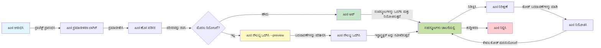
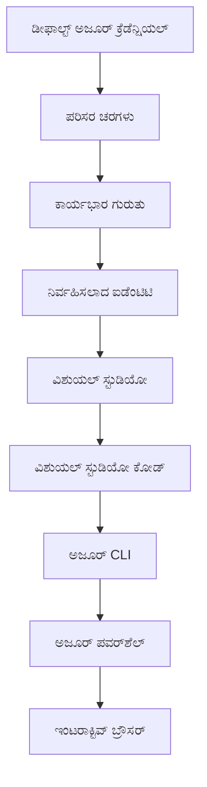

# AZD Basics - Azure Developer CLI ಅನ್ನು ಅರ್ಥಮಾಡಿಕೊಳ್ಳುವುದು

# AZD Basics - ಮೂಲಭೂತ ধারণೆಗಳು ಮತ್ತು ಮೂಲಾಂಶಗಳು

**Chapter Navigation:**
- **📚 Course Home**: [ಆರಂಭಿಕರಿಗಾಗಿ AZD](../../README.md)
- **📖 Current Chapter**: Chapter 1 - Foundation & Quick Start
- **⬅️ Previous**: [Course Overview](../../README.md#-chapter-1-foundation--quick-start)
- **➡️ Next**: [ಸ್ಥಾಪನೆ ಮತ್ತು ಸೆಟ್‌ಅಪ್](installation.md)
- **🚀 Next Chapter**: [ಅಧ್ಯಾಯ 2: AI-ಪ್ರಥಮ ಅಭಿವೃದ್ಧಿ](../chapter-02-ai-development/microsoft-foundry-integration.md)

## ಪರಿಚಯ

ಈ ಪಾಠವು ನಿಮಗೆ Azure Developer CLI (azd) ಅನ್ನು ಪರಿಚಯಿಸುತ್ತದೆ, ಇದು ಸ್ಥಳೀಯ ಅಭಿವೃದ್ಧಿಯಿಂದ Azure ನಿಯೋಜನೆಗೆ ನಿಮ್ಮ ಪ್ರಯಾಣವನ್ನು ವೇಗಗೊಳಿಸುವ ಶಕ್ತಿಶಾಲಿ ಕಮಾಂಡ್-ಲೈನ್ ಟೂಲಾಗಿದೆ. ನೀವು ಮೂಲಭೂತ ಕಲ್ಪನೆಗಳು, ಪ್ರಮುಖ ವೈಶಿಷ್ಟ್ಯಗಳು ಮತ್ತು azd ಹೇಗೆ ಕ್ಲೌಡ್-ನೇಟಿವ್ ಅಪ್ಲಿಕೇಶನ್ ನಿಯೋಜನೆಯನ್ನು ಸರಳಗೊಳಿಸುತ್ತದೆ ಎಂಬುದನ್ನು ಕಲಿಯುತ್ತೀರಿ.

## ಕಲಿಯುವ ಗುರಿಗಳು

ಈ ಪಾಠದ ಅಂತ್ಯಕ್ಕೆ, ನೀವು:
- Azure Developer CLI ಏನೆಂದು ಮತ್ತು ಅದರ ಪ್ರಾಥಮಿಕ ಉದ್ದೇಶ ಏನೆಂದು ಅರ್ಥಮಾಡಿಕೊಳ್ಳಬಹುದು
- ಟೆಂಪ್ಲೇಟ್ಸ್, ಪರಿಸರಗಳು ಮತ್ತು ಸೇವೆಗಳ ಮೂಲ ಕಲ್ಪನೆಗಳನ್ನು ಕಲಿಯಬಹುದು
- ಟೆಂಪ್ಲೇಟ್-ಚಾಲಿತ ಅಭಿವೃದ್ಧಿ ಮತ್ತು Infrastructure as Code ಸೇರಿರುವ ಮುಖ್ಯ ವೈಶಿಷ್ಟ್ಯಗಳನ್ನು ಅನ್ವೇಷಿಸಬಹುದು
- azd ಯೋಜನೆಯ ರಚನೆ ಮತ್ತು ವರ್ಕ್‌ಫ್ಲೋವನ್ನು ಅರ್ಥಮಾಡಿಕೊಳ್ಳಬಹುದು
- ನಿಮ್ಮ ಅಭಿವೃದ್ಧಿ ಪರಿಸರಕ್ಕೆ azd ಅನ್ನು ಇನ್ಸ್ಟಾಲ್ ಮತ್ತು ಕಾನ್ಫಿಗರ್ ಮಾಡಲು ತಯಾರಾಗಿರುತ್ತೀರಿ

## ಕಲಿಕಾ ಫಲಿತಾಂಶಗಳು

ಈ ಪಾಠವನ್ನು ಪೂರ್ಣಗೊಳಿಸಿದ ನಂತರ, ನೀವು ಸಾಧ್ಯ:
- ಆಧುನಿಕ ಕ್ಲೌಡ್ ಅಭಿವೃದ್ಧಿ ವರ್ಕ್‌ಫ್ಲೋಗಳಲ್ಲಿ azdನ ಪಾತ್ರವನ್ನು ವಿವರಿಸುವುದು
- azd ಯೋಜನೆಯ ರಚನೆಯ բաղಕಗಳನ್ನು ಗುರುತಿಸುವುದು
- 템್ಪ್ಲೇಟ್ಗಳು, ಪರಿಸರಗಳು ಮತ್ತು ಸೇವೆಗಳು怎麼 ಉದ್ದದ ಜೊತೆ ಕೆಲಸ ಮಾಡುತ್ತವೆ ಎಂದು ವಿವರಿಸುವುದು
- azd ಜೊತೆಗೆ Infrastructure as Code ನ ಲಾಭಗಳನ್ನು ಅರ್ಥಮಾಡಿಕೊಳ್ಳುವುದು
- ವಿವಿಧ azd ಕಮಾಂಡ್‌ಗಳು ಮತ್ತು ಅವುಗಳ ಉದ್ದೇಶಗಳನ್ನು ಗೋಚರಿಸುವುದು

## Azure Developer CLI (azd) ಎಂದರೆ ಏನು?

Azure Developer CLI (azd) ಎನ್ನುವುದು ಸ್ಥಳೀಯ ಅಭಿವೃದ್ಧಿಯಿಂದ Azure ನಿಯೋಜನೆಗೆ ನಿಮ್ಮ ಪ್ರಯಾಣವನ್ನು ವೇಗಗೊಳಿಸಲು ವಿನ್ಯಾಸಗೊಳಿಸಿದ ಕಮಾಂಡ್-ಲೈನ್ ಟೂಲಾಗಿದೆ. ಇದು Azure ಮೇಲೆ ಕ್ಲೌಡ್-ನೇಟಿವ್ ಅಪ್ಲಿಕೇಶನ್‌ಗಳನ್ನು ಕಟ್ಟುವ, ನಿಯೋಜಿಸುವ ಮತ್ತು ನಿರ್ವಹಿಸುವ ಪ್ರಕ್ರಿಯೆಯನ್ನು ಸರಳಗೊಳಿಸುತ್ತದೆ.

### azd ಬಳಸಿ ನೀವು ಯಾವ ವರ್ಕ್‌ಲೋಡ್‌ಗಳನ್ನು ನಿಯೋಜಿಸಬಹುದು?

azd ಹಲವಾರು ವರ್ಕ್‌ಲೋಡ್‌ಗಳನ್ನು ಬೆಂಬಲಿಸುತ್ತದೆ — ಮತ್ತು ಪಟ್ಟಿ ಹೆಚ್ಚುತ್ತಲೇ ಇದೆ. ಈ ದಿನಗಳಲ್ಲಿ, ನೀವು azd ಅನ್ನು ಬಳಸಿಕೊಂಡು ನಿಯೋಜಿಸಬಹುದು:

| Workload Type | Examples | Same Workflow? |
|---------------|----------|----------------|
| **Traditional applications** | ವೆಬ್ ಅಪ್ಲಿಕೇಶನ್ಗಳು, REST API ಗಳು, ಸ್ಥಿರ ಸೈಟ್ಗಳು | ✅ `azd up` |
| **Services and microservices** | ಕಂಟೈನರ್ ಅಪ್ಲಿಕೇಶನ್ಗಳು, ಫಂಕ್ಷನ್ ಅಪ್ಲಿಕೇಶನ್ಗಳು, ಬಹು-ಸೇವಾ ಬ್ಯಾಕೆಂಡ್ಗಳು | ✅ `azd up` |
| **AI-powered applications** | Microsoft Foundry ಮಾದರಿಗಳಿಂದ ಚಾಲಿತ ಚಾಟ್ ಅಪ್ಲಿಕೇಶನ್ಗಳು, AI Search ಬಳಸಿ RAG ಪರಿಹಾರಗಳು | ✅ `azd up` |
| **Intelligent agents** | Foundry ಅತಿಥಿ ಏಜೆಂಟ್‌ಗಳು, ಬಹು ಏಜೆಂಟ್ ಸಂಯೋಜನೆಗಳು | ✅ `azd up` |

ಮುಖ್ಯ ಅಂಶ ಎಂದರೆ **ನೀವು ಏನನ್ನು ನಿಯೋಜಿಸುತ್ತಿದ್ದೀರೋ ಆದದ್ದು ಏನೆಂದರೂ azd ಲೈಸಿಕಲ್ ಒಂದೇ ರೀತಿಯಲ್ಲಿಯೇ ಇರುತ್ತದೆ**. ನೀವು ಪ್ರಾಜೆಕ್ಟ್ ಪ್ರಾರಂಭಿಸುತ್ತೀರಿ, ಇನ್ಫ್ರಾಸ್ಟ್ರಕ್ಚರ್ ಅನ್ನು ಪ್ರೊವಿಷನ್ ಮಾಡುತ್ತೀರಿ, ನಿಮ್ಮ ಕೋಡ್ ಅನ್ನು ನಿಯೋಜಿಸುತ್ತೀರಿ, ನಿಮ್ಮ ಅಪ್ಲಿಕೇಶನನ್ನು ಮಾನಿಟರ್ ಮಾಡುತ್ತೀರಿ ಮತ್ತು ಸುದ್ಧಿಮಾಡುತ್ತೀರಿ—ಇದು ಸರಳ ವೆಬ್‌సೈಟ್ ಇರಲಿ ಅಥವಾ ಸೂಕ್ಷ್ಮ AI ಏಜೆಂಟ್ ಆಗಿರಲಿ.

ಈ ನಿರಂತರತೆ ಉದ್ದೇಶಿತವಾಗಿದೆ. azd AI ಸಾಮರ್ಥ್ಯಗಳನ್ನು ನಿಮ್ಮ ಅಪ್ಲಿಕೇಶನ್ ಬಳಸಬಹುದಾದ ಮತ್ತೊಂದು ಸೇವೆಯಾಗಿ ವೀಕ್ಷಿಸುತ್ತದೆ, ಮೂಲಭೂತವಾಗಿ ಭಿನ್ನವಾದುದಾಗಿ ಅಲ್ಲ. Microsoft Foundry Models ಮೂಲಕ ಬ್ಯಾಕ್ ಮಾಡಲಾದ ಚಾಟ್ ಎಂಡ್‌ಪಾಯಿಂಟ್ azd ನ ದೃಷ್ಟಿಕೋನದಿಂದ ನೋಡಿದಾಗ ಕೇವಲ ಇನ್ನೊಂದು ಸೇವೆಯೇ ಆಗಿದೆ ಇದನ್ನು ಕಾನ್ಫಿಗರ್ ಮಾಡಿ ನಿಯೋಜಿಸಬಹುದು.

### 🎯 ಏಕೆ AZD ಉಪಯೋಗಿಸಬೇಕು? ವಾಸ್ತವಿಕ ಪ್ರಪಂಚದ ಹೋಲಿಕೆ

ಸರಳ ವೆಬ್ ಅಪ್ಲಿಕೇಶನ್ ಅನ್ನು ಡೇಟಾಬೇಸ್‌ ಜೊತೆಗೆ ನಿಯೋಜಿಸುವುದನ್ನು ಹೋಲಿಸೋಣ:

#### ❌ AZD ಇಲ್ಲದೆ: ಕೈಯಿಂದ Azure ನಿಯೋಜನೆ (30+ ನಿಮಿಷಗಳು)

```bash
# ಹಂತ 1: ಸಂಪನ್ಮೂಲ ಗುಂಪನ್ನು ರಚಿಸಿ
az group create --name myapp-rg --location eastus

# ಹಂತ 2: ಆಪ್ ಸರ್ವಿಸ್ ಪ್ಲ್ಯಾನ್ ರಚಿಸಿ
az appservice plan create --name myapp-plan \
  --resource-group myapp-rg \
  --sku B1 --is-linux

# ಹಂತ 3: ವೆಬ್ ಆಪ್ ರಚಿಸಿ
az webapp create --name myapp-web-unique123 \
  --resource-group myapp-rg \
  --plan myapp-plan \
  --runtime "NODE:18-lts"

# ಹಂತ 4: ಕೋಸ್ಮೋಸ್ DB ಖಾತೆಯನ್ನು ರಚಿಸಿ (10-15 ನಿಮಿಷಗಳು)
az cosmosdb create --name myapp-cosmos-unique123 \
  --resource-group myapp-rg \
  --kind MongoDB

# ಹಂತ 5: ಡೇಟಾಬೇಸ್ ರಚಿಸಿ
az cosmosdb mongodb database create \
  --account-name myapp-cosmos-unique123 \
  --resource-group myapp-rg \
  --name tododb

# ಹಂತ 6: ಕಲೆಕ್ಷನ್ ರಚಿಸಿ
az cosmosdb mongodb collection create \
  --account-name myapp-cosmos-unique123 \
  --resource-group myapp-rg \
  --database-name tododb \
  --name todos

# ಹಂತ 7: ಸಂಪರ್ಕ ಸ್ಟ್ರಿಂಗ್ ಪಡೆಯಿರಿ
CONN_STR=$(az cosmosdb keys list \
  --name myapp-cosmos-unique123 \
  --resource-group myapp-rg \
  --type connection-strings \
  --query "connectionStrings[0].connectionString" -o tsv)

# ಹಂತ 8: ಆಪ್ ಸೆಟ್ಟಿಂಗ್ಗಳನ್ನು ಸಂರಚಿಸಿ
az webapp config appsettings set \
  --name myapp-web-unique123 \
  --resource-group myapp-rg \
  --settings MONGODB_URI="$CONN_STR"

# ಹಂತ 9: ಲಾಗಿಂಗ್ ಅನ್ನು ಸಕ್ರಿಯಗೊಳಿಸಿ
az webapp log config --name myapp-web-unique123 \
  --resource-group myapp-rg \
  --application-logging filesystem \
  --detailed-error-messages true

# ಹಂತ 10: ಅಪ್ಲಿಕೇಶನ್ ಇನ್ಸೈಟ್ಸ್ ಅನ್ನು ಹೊಂದಿಸಿ
az monitor app-insights component create \
  --app myapp-insights \
  --location eastus \
  --resource-group myapp-rg

# ಹಂತ 11: ಅಪ್ಲಿಕೇಶನ್ ಇನ್ಸೈಟ್ಸ್ ಅನ್ನು ವೆಬ್ ಆಪ್‌ಗೆ ಲಿಂಕ್ ಮಾಡಿ
INSTRUMENTATION_KEY=$(az monitor app-insights component show \
  --app myapp-insights \
  --resource-group myapp-rg \
  --query "instrumentationKey" -o tsv)

az webapp config appsettings set \
  --name myapp-web-unique123 \
  --resource-group myapp-rg \
  --settings APPINSIGHTS_INSTRUMENTATIONKEY="$INSTRUMENTATION_KEY"

# ಹಂತ 12: ಅಪ್ಲಿಕೇಶನ್ ಅನ್ನು ಸ್ಥಳೀಯವಾಗಿ ನಿರ್ಮಿಸಿ
npm install
npm run build

# ಹಂತ 13: ಡಿಪ್ಲಾಯ್‌ಮೆಂಟ್ ಪ್ಯಾಕೇಜ್ ರಚಿಸಿ
zip -r app.zip . -x "*.git*" "node_modules/*"

# ಹಂತ 14: ಅಪ್ಲಿಕೇಶನ್ ಅನ್ನು ಡಿಪ್ಲಾಯ್ ಮಾಡಿ
az webapp deployment source config-zip \
  --resource-group myapp-rg \
  --name myapp-web-unique123 \
  --src app.zip

# ಹಂತ 15: ಕಾಯಿರಿ ಮತ್ತು ಅದು ಕಾರ್ಯನಿರ್ವಹಿಸಲಿ ಎಂದು ಪ್ರಾರ್ಥಿಸಿ 🙏
# (ಯಾವುದೇ ಸ್ವಯಂಚಾಲಿತ ಮಾನ್ಯತೆ ಇಲ್ಲ, ಕೈಯಿಂದ ಪರೀಕ್ಷೆ ಅಗತ್ಯವಿದೆ)
```

**ಸಮಸ್ಯೆಗಳು:**
- ❌ 15+ ಕಮಾಂಡ್‌ಗಳನ್ನು ನೆನಪಿಡಬೇಕು ಮತ್ತು ಕ್ರಮವಾಗಿ ಕಾರ್ಯಗತಗೊಳಿಸಬೇಕು
- ❌ 30-45 ನಿಮಿಷಗಳ ಕೈಯಿಂದ ಕೆಲಸ
- ❌ ದೋಷಗಳನ್ನು ಮಾಡುವುದು ಸರಳ (ಬರೆತದೋಷಗಳು, ತಪ್ಪು ಪ್ಯಾರಾಮೀಟರ್‌ಗಳು)
- ❌ ಸಂಪರ್ಕ ಸ್ಟ್ರಿಂಗ್‌ಗಳು ಟರ್ಮಿನಲ್ ಇತಿಹಾಸದಲ್ಲಿ ಬಹಿರಂಗವಾಗುತ್ತವೆ
- ❌ ಏನಾದರೂ ವಿಫಲವಾದರೆ ಸ್ವಯಂಚಾಲಿತ ರೋಲ್ಬ್ಯಾಕ್ ಇಲ್ಲ
- ❌ ತಂಡದ ಸದಸ್ಯರಿಗೆ ಪುನರ್ ನಿರ್ಮಾಣ ಮಾಡುವುದು ಕಠಿಣ
- ❌ ಪ್ರತೀ ಬಾರಿ ವಿಭಿನ್ನ (ಪುನರಾವರ್ತಿಸಲು ಸಾಧ್ಯವಿಲ್ಲ)

#### ✅ AZD ಜೊತೆಗೆ: ಸ್ವಯಂಚಾಲಿತ ನಿಯೋಜನೆ (5 ಕಮಾಂಡ್‌ಗಳು, 10-15 ನಿಮಿಷಗಳು)

```bash
# ಹಂತ 1: ಟೆಂಪ್ಲೇಟಿನಿಂದ ಪ್ರಾರಂಭಿಸಿ
azd init --template todo-nodejs-mongo

# ಹಂತ 2: ಪ್ರಾಮಾಣೀಕರಿಸಿ
azd auth login

# ಹಂತ 3: ಪರಿಸರವನ್ನು ರಚಿಸಿ
azd env new dev

# ಹಂತ 4: ಬದಲಾವಣೆಗಳನ್ನು ಪೂರ್ವಾವಲೋಕನ ಮಾಡಿ (ಐಚ್ಛಿಕ ಆದರೆ ಶಿಫಾರಸು ಮಾಡಲಾಗಿದೆ)
azd provision --preview

# հಂತ 5: ಎಲ್ಲವನ್ನೂ ಜಾರಿಗೆ ತರಿಸಿ
azd up

# ✨ ಸಿದ್ಧವಾಗಿದೆ! ಎಲ್ಲವನ್ನೂ ಜಾರಿಗೆ ತರಿಸಲಾಗಿದೆ, ಸಂರಚಿಸಲಾಗಿದೆ ಮತ್ತು ಮೇಲ್ವಿಚಾರಿಸಲಾಗಿದೆ
```

**ಲಾಭಗಳು:**
- ✅ **5 ಕಮಾಂಡ್‌ಗಳು** ವಿರುದ್ಧದ 15+ ಕೈಯಿಂದ ಹಂತಗಳು
- ✅ **10-15 ನಿಮಿಷಗಳು** ಒಟ್ಟು ಸಮಯ (ಮುಖ್ಯವಾಗಿ Azure ಕಾದಿರಿಸುವಿಕೆ)
- ✅ **ಶೂನ್ಯ ದೋಷಗಳು** - ಸ್ವಯಂಚಾಲಿತ ಮತ್ತು ಪರೀಕ್ಷಿತ
- ✅ **ರಹಸ್ಯಗಳನ್ನು ಸುರಕ್ಷಿತವಾಗಿ ನಿರ್ವಹಣೆ** Key Vault ಮೂಲಕ
- ✅ **ವಿಫಲತೆಯ ಮೇಲೆ ಸ್ವಯಂಚಾಲಿತ ರೋಲ್ಬ್ಯಾಕ್**
- ✅ **ಪೂರ್ಣವಾಗಿ ಪುನರಾವರ್ತನೀಯ** - ಪ್ರತೀ ಬಾರಿ ಒಂದೇ ಫಲಿತಾಂಶ
- ✅ **ಟೀಮ್-ಒಳಗೊಂಡ** - ಯಾರೂ ಆಗಲಿ ಒಂದೇ ಕಮಾಂಡ್‌ಗಳೊಂದಿಗೆ ನಿಯೋಜಿಸಬಹುದು
- ✅ **Infrastructure as Code** - ವರ್ಶನ್ ನಿಯಂತ್ರಿತ Bicep ಟೆಂಪ್ಲೇಟ್ಗಳು
- ✅ **ನಿಲುವು ಒಳಗೊಂಡಿದೆ** - Application Insights ಸ್ವಯಂಚಾಲಿತವಾಗಿ ಕಾನ್ಫಿಗರ್ ಆಗುತ್ತದೆ

### 📊 ಸಮಯ ಮತ್ತು ದೋಷ ಕಡಿತ

| Metric | Manual Deployment | AZD Deployment | Improvement |
|:-------|:------------------|:---------------|:------------|
| **ಕಮಾಂಡ್‌ಗಳು** | 15+ | 5 | 67% ಕುಳಿತಿದೆ |
| **ಸಮಯ** | 30-45 ನಿಮಿಷ | 10-15 ನಿಮಿಷ | 60% ವೇಗವಾಗಿ |
| **ದೋಷ ದರ** | ~40% | <5% | 88% ಕಡಿತ |
| **ಸಮರಸ್ಯತೆ** | ಕಡಿಮೆ (ಕೈಯಿಂದ) | 100% (ಸ್ವಯಂಚಾಲಿತ) | ಪರಿಪೂರ್ಣ |
| **ಟೀಮ್ ಸೇರ್ಪಡೆ ಸಮಯ** | 2-4 ಗಂಟೆಗಳು | 30 ನಿಮಿಷಗಳು | 75% ವೇಗವಾಗಿ |
| **ರೋಲ್ಬ್ಯಾಕ್ ಸಮಯ** | 30+ ನಿಮಿಷಗಳು (ಕೈಯಿಂದ) | 2 ನಿಮಿಷಗಳು (ಸ್ವಯಂಚಾಲಿತ) | 93% ವೇಗವಾಗಿ |

## ಮೂಲಭೂತ ಕಲ್ಪನೆಗಳು

### ಟೆಂಪ್ಲೇಟ್ಗಳು
ಟೆಂಪ್ಲೇಟ್ಗಳು azd ನ ಆಧಾರವಾಗಿವೆ. ಅವು ಒಳಗೊಂಡಿರುತ್ತವೆ:
- **ಅಪ್ಲಿಕೇಶನ್ ಕೋಡ್** - ನಿಮ್ಮ ಮೂಲ_Code ಮತ್ತು ಅವಲಂಬನೆಗಳು
- **ಇನ್ಫ್ರಾಸ್ಟ್ರಕ್ಚರ್ ವ್ಯಾಖ್ಯಾನಗಳು** - Bicep ಅಥವಾ Terraform ನಲ್ಲಿ ವ್ಯಾಖ್ಯಾನಿಸಿದ Azure ಸಂಪನ್ಮೂಲಗಳು
- **ಕಾನ್ಫಿಗರೇಶನ್ ಫೈಲ್‌ಗಳು** - ಸೆಟ್ಟಿಂಗ್‌ಗಳು ಮತ್ತು ಪರಿಸರ ಚರಗಳು
- **ನಿಯೋಜನೆ ಸ್ಕ್ರಿಪ್ಟ್‌ಗಳು** - ಸ್ವಯಂಚಾಲಿತ ನಿಯೋಜನೆ ವರ್ಕ್‌ಫ್ಲೋಗಳು

### ಪರಿಸರಗಳು
ಪರಿಸರಗಳು ವಿವಿಧ ನಿಯೋಜನೆ ಗುರಿಗಳನ್ನು ಪ್ರತಿನಿಧಿಸುತ್ತವೆ:
- **ವಿಕಾಸ** - ಪರೀಕ್ಷೆ ಮತ್ತು ಅಭಿವೃದ್ಧಿಗಾಗಿ
- **ಸ್ಟೇಜಿಂಗ್** - ಪೂರ್ವ ಉತ್ಪಾದನೆ ಪರಿಸರ
- **ಉತ್ಪಾದನೆ** - ಲೈವ್ ಉತ್ಪಾದನೆ ಪರಿಸರ

ಪ್ರತಿ ಪರಿಸರವು ತನ್ನದೇ ಹೊಂದಿದೆ:
- Azure resource group
- ಕಾನ್ಫಿಗರೇಶನ್ ಸೆಟ್ಟಿಂಗ್‌ಗಳು
- ನಿಯೋಜನೆ ಸ್ಥಿತಿ

### ಸೇವೆಗಳು
ಸೇವೆಗಳು ನಿಮ್ಮ ಅಪ್ಲಿಕೇಶನ್‌ನ ಕಟ್ಟಡ ಘಟಕಗಳು:
- **ಫ್ರಂಟ್‌ಎಂಡ್** - ವೆಬ್ ಅಪ್ಲಿಕೇಶನ್ಗಳು, SPAs
- **ಬ್ಯಾಕೆಂಡ್** - APIs, ಮೈಕ್ರೋಸರ್ವಿಸಸ್
- **ಡೇಟಾಬೇಸ್** - ಡೇಟಾ ಸಂಗ್ರಹಣೆ ಪರಿಹಾರಗಳು
- **ಸ್ಟೋರೆಜ್** - ಫೈಲ್ ಮತ್ತು ಬ್ಲಾಬ್ ಸ್ಟೋರೆಜ್

## ಪ್ರಮುಖ ವೈಶಿಷ್ಟ್ಯಗಳು

### 1. ಟೆಂಪ್ಲೇಟ್-ಚಾಲಿತ ಅಭಿವೃದ್ಧಿ
```bash
# ಲಭ್ಯವಿರುವ ಟೆಂಪ್ಲೇಟುಗಳನ್ನು ಬ್ರೌಸ್ ಮಾಡಿ
azd template list

# ಟೆಂಪ್ಲೇಟಿನಿಂದ ಪ್ರಾರಂಭಿಸಿ
azd init --template <template-name>
```

### 2. Infrastructure as Code
- **Bicep** - Azure ನ ಡೊಮೇನ್-ವಿಶೇಷ ಭಾಷೆ
- **Terraform** - ಬಹು-ಕ್ಲೌಡ್ ಇನ್ಫ್ರಾಸ್ಟ್ರಕ್ಚರ್ ಉಪಕರಣ
- **ARM Templates** - Azure Resource Manager ಟೆಂಪ್ಲೇಟ್ಗಳು

### 3. ಒಗ್ಗೂಡಿದ ಕಾರ್ಯಪ್ರವಾಹಗಳು
```bash
# ಸಂಪೂರ್ಣ ನಿಯೋಜನೆ ಕಾರ್ಯಪ್ರವಾಹ
azd up            # Provision + Deploy: ಮೊದಲ ಬಾರಿ ಸೆಟಪ್‌ಗಾಗಿ ಕೈಗೈ ಬೇಕಾಗಿಲ್ಲ

# 🧪 ಹೊಸದು: ನಿಯೋಜನೆಗೆ ಮೊದಲು ಮೂಲಸೌಕರ್ಯ ಬದಲಾವಣೆಗಳನ್ನು ಪೂರ್ವದೃಶ್ಯ (ಸುರಕ್ಷಿತ)
azd provision --preview    # ಬದಲಾವಣೆಗಳನ್ನು ಮಾಡದೆ ಮೂಲಸೌಕರ್ಯ ನಿಯೋಜನೆಯನ್ನು ಅನುಕರಣಗೊಳಿಸಿ

azd provision     # ಮೂಲಸೌಕರ್ಯ ನವೀಕರಿಸುವಾಗ Azure ಸಂಪನ್ಮೂಲಗಳನ್ನು ರಚಿಸಲು ಇದನ್ನು ಬಳಸಿ
azd deploy        # ಅಪ್ಲಿಕೇಶನ್ ಕೋಡ್ ಅನ್ನು ನಿಯೋಜಿಸಿ ಅಥವಾ ನವೀಕರಿಸಿದ ನಂತರ ಮತ್ತೆ ನಿಯೋಜಿಸಿ
azd down          # ಸಂಪನ್ಮೂಲಗಳನ್ನು ತೆರವುಗೊಳಿಸಿ
```

#### 🛡️ ಪ್ರೀವ್ಯೂಯೊಂದಿಗೆ ಸುರಕ್ಷಿತ ಇನ್ಫ್ರಾಸ್ಟ್ರಕ್ಚರ್ ಯೋಜನೆ
`azd provision --preview` ಕಮಾಂಡ್ ಸುರಕ್ಷಿತ ನಿಯೋಜನೆಗಳಿಗೆ ಕ್ರಾಂತಿಕಾರಿಯಾಗಿದ್ದು:
- **ಡ್ರೈ-ರನ್ ವಿಶ್ಲೇಷಣೆ** - ಏನು ರಚಿಸಲಾಗುವುದು, ಸಂಪಾದನೆಗೊಳ್ಳಲಿದೆ ಅಥವಾ ಅಳಿಸಲಾಗುವುದು ಎಂಬುದನ್ನು ತೋರಿಸುತ್ತದೆ
- **ಶೂನ್ಯ ಜೋಖಿಮ್** - ನಿಮ್ಮ Azure ಪರಿಸರದಲ್ಲಿ ಯಾವುದೇ ನಿಜವಾದ ಬದಲಾವಣೆ ಮಾಡಲಾಗುವುದಿಲ್ಲ
- **ಟೀಮ್ ಸಹಯೋಗ** - ನಿಯೋಜನೆಗೂ ಮುನ್ನ ಪ್ರೀವ್ಯೂ ಫಲಿತಾಂಶಗಳನ್ನು ಹಂಚಿಕೊಳ್ಳಿ
- **ವೆಚ್ಚ ಅಂದಾಜು** - ಬದ್ಧತೆಯ алдында ಸಂಪನ್ಮೂಲ ವೆಚ್ಚಗಳನ್ನು ಅರ್ಥಮಾಡಿಕೊಳ್ಳಿ

```bash
# ಉದಾಹರಣಾ ಪೂರ್ವದೃಶ್ಯ ಕಾರ್ಯಪ್ರವಾಹ
azd provision --preview           # ಏನು ಬದಲಾಗುತ್ತದೆ ಎಂದು ನೋಡಿ
# ಫಲಿತಾಂಶವನ್ನು ಪರಿಶೀಲಿಸಿ, ತಂಡದೊಂದಿಗೆ ಚರ್ಚಿಸಿ
azd provision                     # ಆತ್ಮವಿಶ್ವಾಸದಿಂದ ಬದಲಾವಣೆಗಳನ್ನು ಅನ್ವಯಿಸಿ
```

### 📊 ದೃಶ್ಯ: AZD ಅಭಿವೃದ್ಧಿ ಕಾರ್ಯಪ್ರವಾಹ


**ಕಾರ್ಯಪ್ರವಾಹ ವಿವರಣೆ:**
1. **Init** - ಟೆಂಪ್ಲೇಟ್ ಅಥವಾ ಹೊಸ ಪ್ರಾಜೆಕ್ಟ್‌ನಿಂದ ಪ್ರಾರಂಭಿಸಿ
2. **Auth** - Azure ಜೊತೆಗೆ ಪ್ರಾಮಾಣೀಕರಣ ಮಾಡಿ
3. **Environment** - ಆಯಾಸಿಸಿದ ನಿಯೋಜನೆ ಪರಿಸರವನ್ನು ರಚಿಸಿ
4. **Preview** - 🆕 ಏದು ಮೊದಲು ಯಾವ ಇನ್ಫ್ರಾಸ್ಟ್ರಕ್ಚರ್ ಬದಲಾವಣೆಗಳನ್ನು ಪ್ರೀವ್ಯೂ ಮಾಡಿ (ಸुरಕ್ಷಿತ ಅಭ್ಯಾಸ)
5. **Provision** - Azure ಸಂಪನ್ಮೂಲಗಳನ್ನು ರಚಿಸಿ/ಅಪ್‌ಡೇಟ್ ಮಾಡಿ
6. **Deploy** - ನಿಮ್ಮ ಅಪ್ಲಿಕೇಶನ್ ಕೋಡ್ ಪುಷ್ ಮಾಡಿ
7. **Monitor** - ಅಪ್ಲಿಕೇಶನ್ ಕಾರ್ಯಕ್ಷಮತೆಯನ್ನು ಗಮನಿಸಿ
8. **Iterate** - ಬದಲಾವಣೆಗಳನ್ನು ಮಾಡಿ ಹಾಗೂ ಕೋಡ್ ಅನ್ನು ಮರುನಿಯೋಜಿಸಿ
9. **Cleanup** - ಕೆಲಸ ಮುಗಿದ ಮೇಲೆ ಸಂಪನ್ಮೂಲಗಳನ್ನು ತೆಗೆದುಹಾಕಿ

### 4. ಪರಿಸರ ನಿರ್ವಹಣೆ
```bash
# ಪರಿಸರಗಳನ್ನು ರಚಿಸಿ ಮತ್ತು ನಿರ್ವಹಿಸಿ
azd env new <environment-name>
azd env select <environment-name>
azd env list
```

### 5. ವಿಸ್ತರಣೆಗಳು ಮತ್ತು AI ಕಮಾಂಡ್‌ಗಳು

azd ಕೋರ್ CLI ಮೀರಿದ ಸಾಮರ್ಥ್ಯಗಳನ್ನು ಸೇರಿಸಲು ವಿಸ್ತರಣೆ ಸಿಸ್ಟಮ್ ಅನ್ನು ಬಳಸುತ್ತದೆ. ಇದು ವಿಶೇಷವಾಗಿ AI ವರ್ಕ್‌ಲೋಡ್‌ಗಳುಗಾಗಿ ಉಪಯುಕ್ತವಾಗಿದೆ:

```bash
# ಲಭ್ಯವಿರುವ ವಿಸ್ತರಣೆಗಳನ್ನು ಪಟ್ಟಿ ಮಾಡಿ
azd extension list

# Foundry ಏಜೆಂಟ್‌ಗಳ ವಿಸ್ತರಣೆಯನ್ನು ಸ್ಥಾಪಿಸಿ
azd extension install azure.ai.agents

# ಮ್ಯಾನಿಫೆಸ್ಟ್‌ನಿಂದ ಎಐ ಏಜೆಂಟ್ ಪ್ರಾಜೆಕ್ಟ್ ಅನ್ನು ಆರಂಭಿಸಿ
azd ai agent init -m agent-manifest.yaml

# ಎಐ-ಸಹಾಯಿತ ಅಭಿವೃದ್ಧಿಗಾಗಿ MCP ಸರ್ವರ್ ಅನ್ನು ಪ್ರಾರಂಭಿಸಿ (ಅಲ್ಫಾ)
azd mcp start
```

> ವಿಸ್ತರಣೆಗಳು [ಅಧ್ಯಾಯ 2: AI-ಪ್ರಥಮ ಅಭಿವೃದ್ಧಿ](../chapter-02-ai-development/agents.md) ಮತ್ತು [AZD AI CLI ಕಮಾಂಡ್‌ಗಳು](../chapter-08-production/production-ai-practices.md#azd-ai-cli-commands-and-extensions) ರೆಫರೆನ್ಸ್‌ನಲ್ಲಿ ವಿವರವಾಗಿ ಆವರಿಸಲಾಗಿದೆ.

## 📁 ಪ್ರಾಜೆಕ್ಟ್ ರಚನೆ

ಸಾಧಾರಣ azd ಪ್ರಾಜೆಕ್ಟ್ ರಚನೆ:
```
my-app/
├── .azd/                    # azd configuration
│   └── config.json
├── .azure/                  # Azure deployment artifacts
├── .devcontainer/          # Development container config
├── .github/workflows/      # GitHub Actions
├── .vscode/               # VS Code settings
├── infra/                 # Infrastructure code
│   ├── main.bicep        # Main infrastructure template
│   ├── main.parameters.json
│   └── modules/          # Reusable modules
├── src/                  # Application source code
│   ├── api/             # Backend services
│   └── web/             # Frontend application
├── azure.yaml           # azd project configuration
└── README.md
```

## 🔧 ಸಂರಚನಾ ಫೈಲ್‌ಗಳು

### azure.yaml
ಮುಖ್ಯ ಪ್ರಾಜೆಕ್ಟ್ ಕಾನ್ಫಿಗರೇಶನ್ ಫೈಲ್:
```yaml
name: my-awesome-app
metadata:
  template: my-template@1.0.0

services:
  web:
    project: ./src/web
    language: js
    host: appservice
  api:
    project: ./src/api
    language: js
    host: appservice

hooks:
  preprovision:
    shell: pwsh
    run: echo "Preparing to provision..."
```

### .azure/config.json
ಪರಿಸರ-ವಿಶೇಷ ಕಾನ್ಫಿಗರೇಶನ್:
```json
{
  "version": 1,
  "defaultEnvironment": "dev",
  "environments": {
    "dev": {
      "subscriptionId": "your-subscription-id",
      "location": "eastus"
    }
  }
}
```

## 🎪 ಕೈಯಲ್ಲಿ ಅಭ್ಯಾಸಗಳೊಂದಿಗೆ ಸಾಮಾನ್ಯ ಕಾರ್ಯಪ್ರವಾಹಗಳು

> **💡 ಕಲಿಕೆಯ ಸಲಹೆ:** ಈ ಅಭ್ಯಾಸಗಳನ್ನು ಕ್ರಮವಾಗಿ ಅನುಸರಿಸಿ ನಿಮ್ಮ AZD ಕುಶಲತೆಯನ್ನು ಹಂತದಿಂದ ಹಂತಕ್ಕೆ ನಿರ್ಮಿಸಿ.

### 🎯 ಅಭ್ಯಾಸ 1: ನಿಮ್ಮ ಮೊದಲ ಪ್ರಾಜೆಕ್ಟ್ ಅನ್ನು ಪ್ರಾರಂಭಿಸಿ

**ಗುರಿ:** AZD ಪ್ರಾಜೆಕ್ಟ್ ರಚಿಸಿ ಮತ್ತು ಅದರ ರಚನೆಯನ್ನು ಅನ್ವೇಷಿಸಿ

**ಹಂತಗಳು:**
```bash
# ಸಾಬೀತಾದ ಟೆಂಪ್ಲೇಟನ್ನು ಬಳಸಿ
azd init --template todo-nodejs-mongo

# ರಚಿತ ಫೈಲ್ಗಳನ್ನು ಅನ್ವೇಷಿಸಿ
ls -la  # ಗುಪ್ತ ಫೈಲ್ಗಳನ್ನೂ ಒಳಗೊಂಡಂತೆ ಎಲ್ಲಾ ಫೈಲ್ಗಳನ್ನು ವೀಕ್ಷಿಸಿ

# ರಚಿಸಿದ ಪ್ರಮುಖ ಫೈಲ್‌ಗಳು:
# - azure.yaml (ಮುಖ್ಯ ಸಂರಚನೆ)
# - infra/ (ಅಧೋಸಂರಚನಾ ಕೋಡ್)
# - src/ (ಅನ್ವಯಿಕೆ ಕೋಡ್)
```

**✅ ಯಶಸ್ಸು:** ನಿಮ್ಮ ಬಳಿ azure.yaml, infra/, ಮತ್ತು src/ ಡೈರೆಕ್ಟರಿಗಳಿವೆ

---

### 🎯 ಅಭ್ಯಾಸ 2: Azure ಗೆ ನಿಯೋಜಿಸಿ

**ಗುರಿ:** ಕೊನೆಯವರೆಗೆ ಪೂರ್ಣ ನಿಯೋಜನೆ ಮಾಡುವುದು

**ಹಂತಗಳು:**
```bash
# 1. ಪ್ರಾಮಾಣೀಕರಿಸಿ
az login && azd auth login

# 2. ಪರಿಸರ ರಚಿಸಿ
azd env new dev
azd env set AZURE_LOCATION eastus

# 3. ಬದಲಾವಣೆಗಳ ಪೂರ್ವನೋಟ (ಶಿಫಾರಸು)
azd provision --preview

# 4. ಎಲ್ಲವನ್ನೂ ನಿಯೋಜಿಸಿ
azd up

# 5. ನಿಯೋಜನೆಯನ್ನು ಪರಿಶೀಲಿಸಿ
azd show    # ನಿಮ್ಮ ಅಪ್ಲಿಕೇಶನ್ URL ಅನ್ನು ನೋಡಿ
```

**ಅಂದಾಜು ಸಮಯ:** 10-15 ನಿಮಿಷಗಳು  
**✅ ಯಶಸ್ಸು:** ಅಪ್ಲಿಕೇಶನ್ URL ಬ್ರೌಸರ್‌ನಲ್ಲಿ ತೆರೆಯುತ್ತದೆ

---

### 🎯 ಅಭ್ಯಾಸ 3: ಬಹು ಪರಿಸರಗಳು

**ಗುರಿ:** dev ಹಾಗೂ staging ಗೆ ನಿಯೋಜಿಸು

**ಹಂತಗಳು:**
```bash
# ಈಗಾಗಲೇ dev ಇದೆ, staging ಅನ್ನು ರಚಿಸಿ
azd env new staging
azd env set AZURE_LOCATION westus2
azd up

# ಅವುಗಳ ನಡುವೆ ಬದಲಾಯಿಸಿ
azd env list
azd env select dev
```

**✅ ಯಶಸ್ಸು:** Azure ಪೋರ್ಟಲ್‌ನಲ್ಲಿ ಎರಡು ವಿಭಿನ್ನ ರಿಸೋರ್ಸ್ ಗುಂಪುಗಳು

---

### 🛡️ ಶುದ್ಧ ಆರಂಭ: `azd down --force --purge`

ನೀವು ಸಂಪೂರ್ಣವಾಗಿ ರೀಸೆಟ್ ಬೇಕಾದಾಗ:

```bash
azd down --force --purge
```

**ಇದರಿಂದ ಏನು ಆಗುತ್ತದೆ:**
- `--force`: ಯಾವುದೇ ದೃಢೀಕರಣ ಪ್ರಾಂಪ್ಟ್‌ಗಳು ಇಲ್ಲ
- `--purge`: ಎಲ್ಲಾ ಸ್ಥಳೀಯ ಸ್ಥಿತಿ ಮತ್ತು Azure ಸಂಪನ್ಮೂಲಗಳನ್ನು ಅಳಿಸುತ್ತದೆ

**ಯಾವಾಗ ಉಪಯೋಗಿಸಬೇಕು:**
- ನಿಯೋಜನೆ ಮಧ್ಯಂತರದಲ್ಲಿ ವಿಫಲವಾದಾಗ
- ಪ್ರಾಜೆಕ್ಟ್‌ಗಳನ್ನು ಬದಲಾಯಿಸುವಾಗ
- ಹೊಸ ಶುರುವಾಗಬೇಕಾದಾಗ

---

## 🎪 ಮೂಲ ಕಾರ್ಯಪ್ರವಾಹ ಉಲ್ಲೇಖ

### ಹೊಸ ಪ್ರಾಜೆಕ್ಟ್ ಪ್ರಾರಂಭಿಸುವುದು
```bash
# ವಿಧಾನ 1: ಇರುವ ಟೆಂಪ್ಲೇಟನ್ನು ಬಳಸಿ
azd init --template todo-nodejs-mongo

# ವಿಧಾನ 2: ಶೂನ್ಯದಿಂದ ಪ್ರಾರಂಭಿಸಿ
azd init

# ವಿಧಾನ 3: ಪ್ರಸ್ತುತ ಡೈರೆಕ್ಟರಿಯನ್ನು ಬಳಸಿ
azd init .
```

### ಅಭಿವೃದ್ಧಿ ಚಕ್ರ
```bash
# ವಿಕಾಸ ಪರಿಸರವನ್ನು ಸ್ಥಾಪಿಸಿ
azd auth login
azd env new dev
azd env select dev

# ಎಲ್ಲವನ್ನೂ ನಿಯೋಜಿಸಿ
azd up

# ಬದಲಾವಣೆಗಳನ್ನು ಮಾಡಿ ಮತ್ತು ಮರುನಿಯೋಜಿಸಿ
azd deploy

# ಮುಗಿದ ಮೇಲೆ ಸ್ವಚ್ಛಗೊಳಿಸಿ
azd down --force --purge # Azure Developer CLI ಯಲ್ಲಿನ ಈ ಕಮಾಂಡ್ ನಿಮ್ಮ ಪರಿಸರಕ್ಕಾಗಿ **ಸಂಪೂರ್ಣ ಮರುಸ್ಥಾಪನೆ** — ವಿಶೇಷವಾಗಿ ನೀವು ವಿಫಲವಾದ ನಿಯೋಜನೆಗಳ ಸಮಸ್ಯೆಗಳನ್ನು ತಿದ್ದುತ್ತಿರುವಾಗ, ಬಿಟ್ಟಿರುವ ಸಂಪನ್ಮೂಲಗಳನ್ನು ತೆರವುಗೊಳಿಸುತ್ತಿರುವಾಗ, ಅಥವಾ ಹೊಸ ಮರುನಿಯೋಜನೆಗೆ ಸಿದ್ಧತೆ ಮಾಡಿಕೊಳ್ಳುತ್ತಿರುವಾಗ ಇದು ಉಪಯುಕ್ತವಾಗಿದೆ.
```

## `azd down --force --purge` ಅನ್ನು ಅರ್ಥಮಾಡಿಕೊಳ್ಳುವುದು
`azd down --force --purge` ಕಮಾಂಡ್ ನಿಮ್ಮ azd ಪರಿಸರ ಮತ್ತು ಎಲ್ಲಾ ಸಂಭಂದಪಟ್ಟ ಸಂಪನ್ಮೂಲಗಳನ್ನು ಸಂಪೂರ್ಣವಾಗಿ ಧ್ವಂಸ ಮಾಡುವ ಶಕ್ತಿಶಾಲಿ ಮಾರ್ಗವಾಗಿದೆ. ಪ್ರತಿ ಫ್ಲಾಗ್ ಏನು ಮಾಡುತ್ತದೆ ಎಂಬುದರ ವಿವರ ಇಲ್ಲಿದೆ:
```
--force
```
- ದೃಢೀಕರಣ ಪ್ರಾಂಪ್ಟ್‌ಗಳನ್ನು ತಪ್ಪಿಸುತ್ತದೆ.
- ಕೈಯಿಂದ ಇನ್‌ಪುಟ್ ಸಾಧ್ಯವಿಲ್ಲದ automation ಅಥವಾ ಸ್ಕ್ರಿಪ್ಟಿಂಗ್‌ನಲ್ಲಿ ಉಪಯುಕ್ತ.
- CLI ಸೋಲ್ಪಾದ ಅಸಮಾಧಾನಗಳನ್ನು ಕಂಡುಹಿಡಿದರೂ ಸಹ ವಿರಾಮವಿಲ್ಲದೆ teardown ಮುಂದುವರಿಯುತ್ತದೆ.

```
--purge
```
ಅದು **ಎಲ್ಲಾ ಸಂಬಂಧಿತ ಮೆಟಾಡೇಟಾವನ್ನು ಅಳಿಸುತ್ತದೆ**, ಒಳಗೊಂಡಿವೆ:
ಪರಿಸರ ಸ್ಥಿತಿ
ಸ್ಥಳೀಯ `.azure` ಫೋಲ್ಡರ್
ಕ್ಯಾಶೆ ಮಾಡಿದ ನಿಯೋಜನೆ ಮಾಹಿತಿ
azd ಗೆ ಹಿಂದಿನ ನಿಯೋಜನೆಗಳನ್ನು "ಜ್ಞಾಪಕ"ದಲ್ಲಿಡಲು ತಡೆಯುತ್ತದೆ, ಇದು ಮಿಸ್ಮ್ಯಾಚ್ ಆಗಿದ ರಿಸೋರ್ಸ್ ಗ್ರೂಪ್‌ಗಳು ಅಥವಾ ಹಳೆ ರೆಜಿಸ್ಟ್ರಿ ರೆಫರೆನ್ಸ್ ಗಳಂತಹ ಸಮಸ್ಯೆಗಳನ್ನುಂಟುಮಾಡಬಹುದು.

### ಇಬ್ಬರನ್ನೂ ಯಾಕೆ ಬಳಸಬೇಕು?
`azd up` ಗೆ ಶೇಷಿಸಿದ ಸ್ಥಿತಿ ಅಥವಾ ಭಾಗಶಃ ನಿಯೋಜನೆಗಳಿಂದ ನಿಂತಿದ್ದರೆ, ಈ ಸಂಯೋಜನೆ ಒಂದು **ಶುದ್ಧ ಆರಂಭವನ್ನು** ಖಚಿತಪಡಿಸುತ್ತದೆ.

ಇದು ವಿಶೇಷವಾಗಿ ಉಪಯುಕ್ತವಾಗಿದೆ ಮೆನುಯಲ್ ಆಗಿ Azure ಪೋರ್ಟಲ್‌ನಲ್ಲಿ ಸಂಪನ್ಮೂಲಗಳನ್ನು ಅಳಿಸಿದ ನಂತರ ಅಥವಾ ಟೆಂಪ್ಲೇಟ್ಗಳು, ಪರಿಸರಗಳು ಅಥವಾ ರಿಸೋರ್ಸ್ ಗ್ರೂಪ್ নামಕರಣ ಸಂಪ್ರದಾಯಗಳನ್ನು ಬದಲಾಯಿಸಿದಾಗ.

### ಬಹು ಪರಿಸರಗಳನ್ನು ನಿರ್ವಹಿಸುವುದು
```bash
# ಸ್ಟೇಜಿಂಗ್ ಪರಿಸರವನ್ನು ರಚಿಸಿ
azd env new staging
azd env select staging
azd up

# dev ಗೆ ಮರಳಿ ಬದಲಾಯಿಸಿ
azd env select dev

# ಪರಿಸರಗಳನ್ನು ಹೋಲಿಸಿ
azd env list
```

## 🔐 ಪ್ರಾಮಾಣೀಕರಣ ಮತ್ತು ಪ್ರಮಾಣೀಕರಣಗಳು

ಪ್ರಾಮಾಣೀಕರಣವನ್ನು ಅರ್ಥಮಾಡಿಕೊಳ್ಳುವುದು ಯಶಸ್ವಿ azd ನಿಯೋಜನೆಗಾಗಿ ಅತ್ಯಾಧಾರವಾಗಿದೆ. Azure ವಿವಿಧ ಪ್ರಾಮಾಣೀಕರಣ ವಿಧಾನಗಳನ್ನು ಬಳಸುತ್ತದೆ, ಮತ್ತು azd ಇತರ Azure ಟೂಲ್ಗಳು ಬಳಸುವ ಅದೇ ಕ್ರೆಡೆನ್ಷಿಯಲ್ ಚೈನ್ ಅನ್ನು ಉಪಯೋಗಿಸುತ್ತದೆ.

### Azure CLI ಪ್ರಾಮಾಣೀಕರಣ (`az login`)

azd ಬಳಸದ ಮೊದಲು, ನೀವು Azure ಜೊತೆ ಪ್ರಾಮಾಣೀಕರಿಸಬೇಕಾಗುತ್ತದೆ. ಸಾಮಾನ್ಯವಾದ ವಿಧಾನವು Azure CLI ಅನ್ನು ಬಳಸುವುದು:

```bash
# ಇಂಟರ್ಯಾಕ್ಟಿವ್ ಲಾಗಿನ್ (ಬ್ರೌಸರ್ ತೆರೆಯುತ್ತದೆ)
az login

# ನಿರ್ದಿಷ್ಟ ಟೆನಂಟ್‌ನೊಂದಿಗೆ ಲಾಗಿನ್
az login --tenant <tenant-id>

# ಸೇವಾ ಪ್ರಿನ್ಸಿಪಲ್‌ನೊಂದಿಗೆ ಲಾಗಿನ್
az login --service-principal -u <app-id> -p <password> --tenant <tenant-id>

# ಪ್ರಸ್ತುತ ಲಾಗಿನ್ ಸ್ಥಿತಿಯನ್ನು ಪರಿಶೀಲಿಸಿ
az account show

# ಲಭ್ಯವಿರುವ ಚಂದಾಗಳನ್ನು ಪಟ್ಟಿ ಮಾಡಿ
az account list --output table

# ಡೀಫಾಲ್ಟ್ ಚಂದೆಯನ್ನು ಹೊಂದಿಸಿ
az account set --subscription <subscription-id>
```

### ಪ್ರಾಮಾಣೀಕರಣ ಹರಿವು
1. **ಇಂಟರಾಕ್ಟಿವ್ ಲಾಗಿನ್**: ನಿಮ್ಮ ಡಿಫಾಲ್ಟ್ ಬ್ರೌಸರ್ ಅನ್ನು ತೆರೆಯುತ್ತದೆ ಪ್ರಾಮಾಣೀಕರಣಕ್ಕಾಗಿ
2. **ಡಿವೈಸ್ ಕೋಡ್ ಫ್ಲೋ**: ಬ್ರೌಸರ್ ಪ್ರವೇಶವಿಲ್ಲದ ಪರಿಸರಗಳಿಗೆ
3. **ಸರ್ವಿಸ್ ಪ್ರಿನ್ಸಿಪಲ್**: automation ಮತ್ತು CI/CD السينಾರಿಯೋಗಳಿಗಾಗಿ
4. **Managed Identity**: Azure- ಹೋಸ್ಟ್ ಮಾಡಲಾದ ಅಪ್ಲಿಕೇಶನ್‌ಗಳಿಗಾಗಿ

### DefaultAzureCredential ಸರಣಿ

DefaultAzureCredential ಎಂಬುದು ಒಂದು ಕ್ರೆಡೆನ್ಷಿಯಲ್ ಪ್ರಕಾರವಾಗಿದ್ದು ನಿರ್ದಿಷ್ಟ ಕ್ರಮದಲ್ಲಿ ಹಲವಾರು ಕ್ರೆಡೆನ್ಷಿಯಲ್ ಮೂಲಗಳನ್ನು ಸ್ವಯಂಚಾಲಿತವಾಗಿ ಪ್ರಯತ್ನಿಸುವುದರಿಂದ ಸರಳಗೊಳಿಸಿದ ಪ್ರಾಮಾಣೀಕರಣ ಅನುಭವವನ್ನು ಒದಗಿಸುತ್ತದೆ:

#### ಕ್ರೆಡೆನ್ಷಿಯಲ್ ಸರಣಿ ಕ್ರಮ

#### 1. ಪರಿಸರ ಚರಗಳು
```bash
# ಸರ್ವೀಸ್ ಪ್ರಿನ್ಸಿಪಲ್‌ಗಾಗಿ ಪರಿಸರ ಚರಗಳನ್ನು ಸೆಟ್ ಮಾಡಿ
export AZURE_CLIENT_ID="<app-id>"
export AZURE_CLIENT_SECRET="<password>"
export AZURE_TENANT_ID="<tenant-id>"
```

#### 2. Workload Identity (Kubernetes/GitHub Actions)
ಸ್ವಯಂಚಾಲಿತವಾಗಿ ಬಳಸಲಾಗುತ್ತದೆ:
- Azure Kubernetes Service (AKS) ನಲ್ಲಿ Workload Identity ಜೊತೆಗೆ
- GitHub Actions ನಲ್ಲಿ OIDC ಫೆಡರೇಶನ್ ಜೊತೆಗೆ
- ಇತರ ಫೆಡರೇಟೆಡ್ ಐಡೆಂಟಿಟಿ السينಾರಿಯೋಗಳಲ್ಲಿ

#### 3. Managed Identity
ಕೆಳಕಂಡ Azure ಸಂಪನ್ಮೂಲಗಳಿಗಾಗಿ:
- Virtual Machines
- App Service
- Azure Functions
- Container Instances

```bash
# managed identity ಹೊಂದಿರುವ Azure ಸಂಪನ್ಮೂಲದಲ್ಲಿ ಚಲಿಸುತ್ತಿರುವುದೇ ಎಂದು ಪರಿಶೀಲಿಸಿ
az account show --query "user.type" --output tsv
# managed identity ಬಳಸುತ್ತಿರುವಲ್ಲಿ "servicePrincipal" ಅನ್ನು ಹಿಂತಿರುಗಿಸುತ್ತದೆ
```

#### 4. ಡೆವೆಲಪರ್ ಟೂಲ್‌ಗಳ ಏಕೀಕರಣ
- **Visual Studio**: ಸೈನ್-ಇನ್ ಮಾಡಿದ ಖಾತೆಯನ್ನು ಸ್ವಯಂಚಾಲಿತವಾಗಿ ಉಪಯೋಗಿಸುತ್ತದೆ
- **VS Code**: Azure Account ಎಕ್ಸ್ಟೆನ್ಶನ್ ಕ್ರೆಡೆನ್ಷಿಯಲ್ಗಳನ್ನು ಉಪಯೋಗಿಸುತ್ತದೆ
- **Azure CLI**: `az login` ಕ್ರೆಡೆನ್ಷಿಯಲ್ಗಳನ್ನು ಉಪಯೋಗಿಸುತ್ತದೆ (ಸ್ಥಳೀಯ ಅಭಿವೃದ್ಧಿಗಾಗಿ ಬಹುಮಾನ್ಯ)

### AZD ಪ್ರಾಮಾಣೀಕರಣ ಸೆಟಪ್

```bash
# ವಿಧಾನ 1: Azure CLI ಅನ್ನು ಬಳಸಿ (ವಿಕಾಸಕ್ಕಾಗಿ ಶಿಫಾರಸು ಮಾಡಲಾಗಿದೆ)
az login
azd auth login  # ಅಸ್ತಿತ್ವದಲ್ಲಿರುವ Azure CLI ಪ್ರಮಾಣಪತ್ರಗಳನ್ನು ಬಳಸುತ್ತದೆ

# ವಿಧಾನ 2: ನೇರ azd ಪ್ರಮಾಣೀಕರಣ
azd auth login --use-device-code  # ಹೆಡ್‌ಲೆಸ್ ಪರಿಸರಗಳಿಗಾಗಿ

# ವಿಧಾನ 3: ಪ್ರಮಾಣೀಕರಣ ಸ್ಥಿತಿಯನ್ನು ಪರಿಶೀಲಿಸಿ
azd auth login --check-status

# ವಿಧಾನ 4: ಲಾಗ್‌ಔಟ್ ಮಾಡಿ ಮತ್ತು ಪುನಃ ಪ್ರಮಾಣೀಕರಣ ಮಾಡಿ
azd auth logout
azd auth login
```

### ಪ್ರಾಮಾಣೀಕರಣ ಉತ್ತಮ ಅಭ್ಯಾಸಗಳು

#### ಸ್ಥಳೀಯ ಅಭಿವೃದ್ಧಿಗಾಗಿ
```bash
# 1. Azure CLI ಬಳಸಿ ಲಾಗಿನ್ ಮಾಡಿ
az login

# 2. ಸರಿಯಾದ ಸಬ್ಸ್ಕ್ರಿಪ್ಶನ್ ಪರಿಶೀಲಿಸಿ
az account show
az account set --subscription "Your Subscription Name"

# 3. ಅಸ್ತಿತ್ವದಲ್ಲಿರುವ ಪ್ರಮಾಣಪತ್ರಗಳೊಂದಿಗೆ azd ಅನ್ನು ಬಳಸಿ
azd auth login
```

#### CI/CD ಪೈಪ್‌ಲೈನ್‌ಗಳಿಗೆ
```yaml
# GitHub Actions example
- name: Azure Login
  uses: azure/login@v1
  with:
    creds: ${{ secrets.AZURE_CREDENTIALS }}

- name: Deploy with azd
  run: |
    azd auth login --client-id ${{ secrets.AZURE_CLIENT_ID }} \
                    --client-secret ${{ secrets.AZURE_CLIENT_SECRET }} \
                    --tenant-id ${{ secrets.AZURE_TENANT_ID }}
    azd up --no-prompt
```

#### ಉತ್ಪಾದನಾ ಪರಿಸರಗಳಿಗಾಗಿ
- Azure ಸಂಪನ್ಮೂಲಗಳಲ್ಲಿ ಓಡಿಸುವಾಗ **Managed Identity** ಬಳಸಿರಿ
- automation سینಾರಿಯೋಗಳಿಗಾಗಿ **Service Principal** ಉಪಯೋಗಿಸಿ
- ಕೋಡ್ ಅಥವಾ ಕಾನ್ಫಿಗರೇಶನ್ ಫೈಲ್‌ಗಳಲ್ಲಿ ಪ್ರಮಾಣೀಕರಣಗಳನ್ನು ಸಂಗ್ರಹಿಸುವುದನ್ನು ತಪ್ಪಿಸಿ
- ಸಂವೇದನಾಶೀಲ ಕಾನ್ಫಿಗರೇಶನ್‌ಗಾಗಿ **Azure Key Vault** ಬಳಸಿ

### ಸಾಮಾನ್ಯ ಪ್ರಾಮಾಣೀಕರಣ ಸಮಸ್ಯೆಗಳು ಮತ್ತು ಪರಿಹಾರಗಳು

#### ಸಮಸ್ಯೆ: "No subscription found"
```bash
# ಪರಿಹಾರ: ಡೀಫಾಲ್ಟ್ ಸಬ್ಸ್ಕ್ರಿಪ್ಷನ್ ಅನ್ನು ಹೊಂದಿಸಿ
az account list --output table
az account set --subscription "<subscription-id>"
azd env set AZURE_SUBSCRIPTION_ID "<subscription-id>"
```

#### ಸಮಸ್ಯೆ: "Insufficient permissions"
```bash
# ಉಪಾಯ: ಅಗತ್ಯ ಪಾತ್ರಗಳನ್ನು ಪರಿಶೀಲಿಸಿ ಮತ್ತು ನಿಯೋಜಿಸಿ
az role assignment list --assignee $(az account show --query user.name --output tsv)

# ಸಾಮಾನ್ಯ ಅಗತ್ಯ ಪಾತ್ರಗಳು:
# - Contributor (ಸಂಪನ್ಮೂಲ ನಿರ್ವಹಣೆಗೆ)
# - User Access Administrator (ಪಾತ್ರ ನಿಯೋಜನೆಗಳಿಗಾಗಿ)
```

#### ಸಮಸ್ಯೆ: "Token expired"
```bash
# ಪರಿಹಾರ: ಮತ್ತೆ ಪ್ರಮಾಣೀಕರಿಸಿ
az logout
az login
azd auth logout
azd auth login
```

### ವಿವಿಧ ಸಂದರ್ಭಗಳಲ್ಲಿ ಪ್ರಾಮಾಣೀಕರಣ

#### ಸ್ಥಳೀಯ ಅಭಿವೃದ್ಧಿ
```bash
# ವೈಯಕ್ತಿಕ ಅಭಿವೃದ್ಧಿ ಖಾತೆ
az login
azd auth login
```

#### ತಂಡದ ಅಭಿವೃದ್ಧಿ
```bash
# ಸಂಸ್ಥೆಗಾಗಿ ನಿರ್ದಿಷ್ಟ ಟೆನಂಟ್ ಬಳಸಿ
az login --tenant contoso.onmicrosoft.com
azd auth login
```

#### ಬಹು-ಟೆನಂಟ್ ಪ್ರಕರಣಗಳು
```bash
# ಟೆನಂಟ್‌ಗಳ ನಡುವೆ ಬದಲಾಯಿಸಿ
az login --tenant tenant1.onmicrosoft.com
# ಟೆನಂಟ್ 1ಕ್ಕೆ ನಿಯೋಜಿಸಿ
azd up

az login --tenant tenant2.onmicrosoft.com  
# ಟೆನಂಟ್ 2ಕ್ಕೆ ನಿಯೋಜಿಸಿ
azd up
```

### ಭದ್ರತೆ ಪರಿಗಣನೆಗಳು
1. **ಪ್ರಮಾಣಪತ್ರ ಸಂಗ್ರಹಣೆ**: ಸಾಕ್ಷ್ಯಪತ್ರಗಳನ್ನು ಮೂಲ ಕೋಡ್‌ನಲ್ಲಿ ಎಂದೂ ಸಂಗ್ರಹಿಸಬೇಡಿ
2. **ವಿಸ್ತಾರದ ಸೀಮಿತೀಕರಣ**: service principals ಗಳಿಗಾಗಿ ಕನಿಷ್ಠ ಹಕ್ಕಿನ ತತ್ವವನ್ನು ಅನುಸರಿಸಿ
3. **ಟೋಕನ್ ಪರಿವರ್ತನೆ**: service principal ರ ರಹಸ್ಯಗಳನ್ನು ನಿಯಮಿತವಾಗಿ ಪರಿವರ್ತಿಸಿ
4. **ಆಡಿಟ್ ಟ್ರೇಲ್**: ಪ್ರಮಾಣೀಕರಣ ಮತ್ತು ನಿಯೋಜನೆ ಚಟುವಟಿಕೆಗಳನ್ನು ನಿಯಂತ್ರಿಸಿ
5. **ಜಾಲ ಸುರಕ್ಷತೆ**: ಸಾಧ್ಯವಿದ್ದರೆ ಖಾಸಗಿ ಎಂಡ್‌ಪಾಯಿಂಟ್‌ಗಳನ್ನು ಬಳಸಿ

### ಪ್ರಮಾಣೀಕರಣದ ತೊಂದರೆ ನಿವಾರಣೆ

```bash
# ಪ್ರಾಮಾಣೀಕರಣ ಸಮಸ್ಯೆಗಳ ದೋಷನಿರ್ಣಯ
azd auth login --check-status
az account show
az account get-access-token

# ಸಾಮಾನ್ಯ ದೋಷನಿರ್ಣಯದ ಕಮಾಂಡ್‌ಗಳು
whoami                          # ಪ್ರಸ್ತುತ ಬಳಕೆದಾರದ ಸನ್ನಿವೇಶ
az ad signed-in-user show      # Azure AD ಬಳಕೆದಾರ ವಿವರಗಳು
az group list                  # ಸಂಪನ್ಮೂಲ ಪ್ರವೇಶವನ್ನು ಪರೀಕ್ಷಿಸಿ
```

## `azd down --force --purge` ಅನ್ನು ಅರ್ಥಮಾಡಿಕೊಳ್ಳುವುದು

### ಅನ್ವೇಷಣೆ
```bash
azd template list              # ಟೆಂಪ್ಲೇಟುಗಳನ್ನು ವೀಕ್ಷಿಸಿ
azd template show <template>   # ಟೆಂಪ್ಲೇಟಿನ ವಿವರಗಳು
azd init --help               # ಆರಂಭಿಕ ಆಯ್ಕೆಗಳು
```

### ಪ್ರಾಜೆಕ್ಟ್ ನಿರ್ವಹಣೆ
```bash
azd show                     # ಪ್ರಾಜೆಕ್ಟ್ ಅವಲೋಕನ
azd env show                 # ಪ್ರಸ್ತುತ ಪರಿಸರ
azd config list             # ಸಂರಚನಾ ಸೆಟ್ಟಿಂಗ್‌ಗಳು
```

### ನಿರೀಕ್ಷಣೆ
```bash
azd monitor                  # Azure ಪೋರ್ಟಲ್‌ನ ಮಾನಿಟರಿಂಗ್ ತೆರೆಯಿರಿ
azd monitor --logs           # ಅಪ್ಲಿಕೇಶನ್ ಲಾಗ್‌ಗಳನ್ನು ವೀಕ್ಷಿಸಿ
azd monitor --live           # ಲೈವ್ ಮೆಟ್ರಿಕ್‌ಗಳನ್ನು ವೀಕ್ಷಿಸಿ
azd pipeline config          # CI/CD ಅನ್ನು ಸೆಟ್‌ಅಪ್ ಮಾಡಿ
```

## ಉತ್ತಮ ಅಭ್ಯಾಸಗಳು

### 1. ಅರ್ಥಪೂರ್ಣ ಹೆಸರನ್ನು ಬಳಸಿ
```bash
# ಉತ್ತಮ
azd env new production-east
azd init --template web-app-secure

# ತಡೆಯಿರಿ
azd env new env1
azd init --template template1
```

### 2. ಟೆಂಪ್ಲೇಟ್ಗಳನ್ನು ಬಳಸಿಕೊಳ್ಳಿ
- ಇದಾಗಿರುವ ಟೆಂಪ್ಲೇಟಿನಿಂದ ಪ್ರಾರಂಭಿಸಿ
- ನಿಮ್ಮ ಅಗತ್ಯಗಳಿಗೆ ಹೊಂದಿಸಿ
- ನಿಮ್ಮ ಸಂಘಟನೆಯಿಗಾಗಿ ಪುನಃಬಳಕೆಗೆ ಯೋಗ್ಯ ಟೆಂಪ್ಲೇಟುಗಳನ್ನು ರಚಿಸಿ

### 3. ಪರಿಸರ ವಿಭಜನೆ
- dev/staging/prod ಗಾಗಿ ವಿಭಿನ್ನ ಪರಿಸರಗಳನ್ನು ಬಳಸಿ
- ಲೋಕಲ್ ಯಂತ್ರದಿಂದ ನೇರವಾಗಿ production ಗೆ ನಿಯೋಜಿಸಬೇಡಿ
- production ನಿಯೋಜನೆಗಳಿಗೆ CI/CD ಪೈಪ್‌ಲೈನ್ಗಳನ್ನು ಬಳಸಿ

### 4. ಸಂರಚನಾ ನಿರ್ವಹಣೆ
- ಸಂವೇದನಶೀಲ ಡೇಟಾಗಾಗಿ ಪರಿಸರ ಚರಗಳನ್ನು ಬಳಸಿ
- ಸಂರಚನೆಯನ್ನು version control ನಲ್ಲಿ ಇಡಿ
- ಪರಿಸರ-ನಿರ್ದಿಷ್ಟ ಸೆಟ್ಟಿಂಗ್‌ಗಳನ್ನು ದಾಖಲಿಸಿ

## ಕಲಿಕೆಯ ಪ್ರಗತಿ

### ಆರಂಭಿಕ (ವಾರ 1-2)
1. azd ಅನ್ನು ಸ್ಥಾಪಿಸಿ ಮತ್ತು ಪ್ರಮಾಣೀಕರಿಸಿ
2. ಸರಳ ಟೆಂಪ್ಲೇಟನ್ನು ನಿಯೋಜಿಸಿ
3. ಪ್ರಾಜೆಕ್ಟ್ ರಚನೆಯನ್ನು ಅರ್ಥಮಾಡಿಕೊಳ್ಳಿ
4. ಮೂಲಭೂತ ಆದೇಶಗಳನ್ನು (up, down, deploy) ಕಲಿಯಿರಿ

### ಮಧ್ಯಮ (ವಾರ 3-4)
1. ಟೆಂಪ್ಲೇಟುಗಳನ್ನು ಕಸ್ಟಮೈಸ್ ಮಾಡಿ
2. ಬಹು ಪರಿಸರಗಳನ್ನು ನಿರ್ವಹಿಸಿ
3. ಇನ್ಫ್ರಾಸ್ಟ್ರಕ್ಚರ್ ಕೋಡ್ ಅನ್ನು ಅರ್ಥಮಾಡಿಕೊಳ್ಳಿ
4. CI/CD ಪೈಪ್‌ಲೈನ್ಗಳನ್ನು ಸೆಟ್ ಅಪ್ ಮಾಡಿ

### ಉನ್ನತ (ವಾರ 5+)
1. ಕಸ್ಟಮ್ ಟೆಂಪ್ಲೇಟುಗಳನ್ನು ರಚಿಸಿ
2. ಉನ್ನತ ಇನ್ಫ್ರಾಸ್ಟ್ರಕ್ಚರ್ ಮಾದರಿಗಳು
3. ಬಹು-ಪ್ರಾಂತ್ಯ ನಿಯೋಜನೆಗಳು
4. ಉದ್ಯಮ-ಮಟ್ಟದ ಸಂರಚನೆಗಳು

## ಮುಂದಿನ ಹಂತಗಳು

**📖 ಅಧ್ಯಾಯ 1 ಕಲಿಕೆಯನ್ನು ಮುಂದುವರೆಸಿರಿ:**
- [Installation & Setup](installation.md) - azd ಅನ್ನು ಸ್ಥಾಪಿಸಿ ಮತ್ತು ಸಂರಚಿಸಿ
- [Your First Project](first-project.md) - ಕೈಗೂಡಿಸುವ ಟ್ಯುಟೋರಿಯಲ್ പൂರ್ಣಗೊಳಿಸಿ
- [Configuration Guide](configuration.md) - ಉನ್ನತ ಕಾನ್ಫಿಗರೇಶನ್ ಆಯ್ಕೆಗಳು

**🎯 ಮುಂದಿನ ಅಧ್ಯಾಯಕ್ಕೆ ಸಿದ್ಧರಾ?**
- [Chapter 2: AI-First Development](../chapter-02-ai-development/microsoft-foundry-integration.md) - AI ಅಪ್ಲಿಕೇಶನ್‌ಗಳನ್ನು ನಿರ್ಮಿಸಲು ಪ್ರಾರಂಭಿಸಿ

## ಹೆಚ್ಚುವರಿ ಸಂಪನ್ಮೂಲಗಳು

- [Azure Developer CLI Overview](https://learn.microsoft.com/en-us/azure/developer/azure-developer-cli/)
- [Template Gallery](https://azure.github.io/awesome-azd/)
- [Community Samples](https://github.com/Azure-Samples)

---

## 🙋 ಸಾಮಾನ್ಯವಾಗಿ ಕೇಳುವ ಪ್ರಶ್ನೆಗಳು

### ಸಾಮಾನ್ಯ ಪ್ರಶ್ನೆಗಳು

**Q: AZD ಮತ್ತು Azure CLI ನಡುವೆ ಏನು ಭೇದ ಇದೆ?**

A: Azure CLI (`az`) ವೈಯಕ್ತಿಕ Azure ಸಂಪನ್ಮೂಲಗಳನ್ನು ನಿರ್ವಹಿಸಲು ಬಳಸಲಾಗುತ್ತದೆ. AZD (`azd`) ಸಂಪೂರ್ಣ ಅಪ್ಲಿಕೇಶನ್‌ಗಳನ್ನು ನಿರ್ವಹಿಸಲು ಬಳಸಲಾಗುತ್ತದೆ:

```bash
# Azure CLI - ಕೆಳಮಟ್ಟದ ಸಂಪನ್ಮೂಲ ನಿರ್ವಹಣೆ
az webapp create --name myapp --resource-group rg
az sql server create --name myserver --resource-group rg
# ...ಇನ್ನೂ ಅನೇಕ ಆಜ್ಞೆಗಳು ಬೇಕಾಗಿವೆ

# AZD - ಅಪ್ಲಿಕೇಶನ್-ಮಟ್ಟದ ನಿರ್ವಹಣೆ
azd up  # ಎಲ್ಲಾ ಸಂಪನ್ಮೂಲಗಳೊಂದಿಗೆ ಸಂಪೂರ್ಣ ಅಪ್ಲಿಕೇಶನ್ ನಿಯೋಜಿಸುತ್ತದೆ
```

**ಇದನ್ನು ಈ ರೀತಿಯಾಗಿ ಭಾವಿಸಿ:**
- `az` = ವೈಯಕ್ತಿಕ ಲೆಗೋ ಬ್ಲಾಕ್‌ಗಳ ಮೇಲೆ ಕಾರ್ಯನಿರ್ವಹಿಸುವುದು
- `azd` = ಸಂಪೂರ್ಣ ಲೆಗೋ ಸೆಟ್‌ಗಳೊಂದಿಗೆ ಕೆಲಸ ಮಾಡುವುದು

---

**Q: AZD ಬಳಸಲು ನನಗೆ Bicep ಅಥವಾ Terraform ಗೊತ್ತಿರಬೇಕೇ?**

A: ಇಲ್ಲ! ಟೆಂಪ್ಲೇಟಿನಿಂದ ಪ್ರಾರಂಭಿಸಿ:
```bash
# ಅಸ್ತಿತ್ವದಲ್ಲಿರುವ ಟೆಂಪ್ಲೇಟ್ ಬಳಸಿ - IaC ಬಗ್ಗೆ ಯಾವುದೇ ಜ್ಞಾನ ಅಗತ್ಯವಿಲ್ಲ
azd init --template todo-nodejs-mongo
azd up
```

ನಂತರ ನೀವು ಇನ್ಫ್ರಾಸ್ಟ್ರಕ್ಚರ್ ಕಸ್ಟಮೈಸ್ ಮಾಡಲು Bicep ಅನ್ನು ಕಲಿಯಬಹುದು. ಟೆಂಪ್ಲೇಟುಗಳು ಕಲಿಯಲು ಕಾರ್ಯನಿರ್ವಹಿಸುವ ಉದಾಹರಣೆಗಳನ್ನು ಒದಗಿಸುತ್ತವೆ.

---

**Q: AZD ಟೆಂಪ್ಲೇಟುಗಳನ್ನು ರನ್ ಮಾಡಲು ವೆಚ್ಚ ಎಷ್ಟು?**

A: ವೆಚ್ಚಗಳು ಟೆಂಪ್ಲೇಟಿನ ಮೇಲೆ ನಿರ್ಭರಿಸುತ್ತದೆ. ಮ meisten ಅಭಿವೃದ್ಧಿ ಟೆಂಪ್ಲೇಟುಗಳು $50-150/ತಿಂಗಳು ವೆಚ್ಚವಾಗಬಹುದು:
```bash
# ಡಿಪ್ಲಾಯ್ ಮಾಡುವ ಮೊದಲು ವೆಚ್ಚಗಳನ್ನು ಪೂರ್ವಾವಲೋಕನ ಮಾಡಿ
azd provision --preview

# ಬಳಸದೆ ಇರುವಾಗ ಯಾವಾಗಲೂ ತೆರವುಗೊಳಿಸಿ
azd down --force --purge  # ಎಲ್ಲಾ ಸಂಪನ್ಮೂಲಗಳನ್ನು ತೆಗೆದುಹಾಕುತ್ತದೆ
```

**ಪ್ರೋ ಟಿಪ್:** ಲಭ್ಯವಾದಲ್ಲಿ ಉಚಿತ ಟಿಯರ್‌ಗಳನ್ನು ಬಳಸಿ:
- App Service: F1 (Free) ಟಿಯರ್
- Microsoft Foundry Models: Azure OpenAI 50,000 tokens/ತಿಂಗಳು ಉಚಿತ
- Cosmos DB: 1000 RU/s ಉಚಿತ ಟಿಯರ್

---

**Q: AZD ಅನ್ನು ಇೆಯನ್ನು Azure ಸಂಪನ್ಮೂಲಗಳೊಂದಿಗೆ ಬಳಸಬಹುದೇ?**

A: ಹೌದು, ಆದರೆ ಹೊಸದಾಗಿ ಪ್ರಾರಂಭಿಸುವುದು ಸುಲಭ. AZD ಮೇಲ್ಹೈಟ್ಫುಲ್ ಭಾಗವನ್ನು ನಿರ್ವಹಿಸಿದಾಗ ಉತ್ತಮವಾಗಿ ಕಾರ್ಯನಿರ್ವಹಿಸುತ್ತದೆ. ಇರುತ್ತಿರುವ ಸಂಪನ್ಮೂಲಗಳಿಗಾಗಿ:
```bash
# ಆಯ್ಕೆ 1: ಅಸ್ತಿತ್ವದಲ್ಲಿರುವ ಸಂಪನ್ಮೂಲಗಳನ್ನು ಆಮದು ಮಾಡಿಕೊಳ್ಳಿ (ಉನ್ನತ)
azd init
# ನಂತರ infra/ ಅನ್ನು ಪರಿಷ್ಕರಿಸಿ ಅಸ್ತಿತ್ವದಲ್ಲಿರುವ ಸಂಪನ್ಮೂಲಗಳನ್ನು ಉಲ್ಲೇಖಿಸಲು

# ಆಯ್ಕೆ 2: ಹೊಸದಾಗಿ ಪ್ರಾರಂಭಿಸಿ (ಶಿಫಾರಸು ಮಾಡಲಾಗಿದೆ)
azd init --template matching-your-stack
azd up  # ಹೊಸ ಪರಿಸರವನ್ನು ರಚಿಸುತ್ತದೆ
```

---

**Q: ನಾನು ನನ್ನ ಪ್ರಾಜೆಕ್ಟ್ ಅನ್ನು ತಂಡದ ಸದಸ್ಯರೊಂದಿಗೆ ಹೇಗೆ ಹಂಚಿಕೊಳ್ಳಬಲ್ಲೆ?**

A: AZD ಪ್ರಾಜೆಕ್ಟ್ ಅನ್ನು Git ಗೆ ಕಮಿಟ್ ಮಾಡಿ (ಆದರೆ .azure ಫೋಲ್ಡರ್ ಅನ್ನು ڪಡಕೊಂಡೀರಿ ಎಂದು ಮಾಡಬೇಡಿ):
```bash
# ಡೀಫಾಲ್ಟ್‌ನಿಂದಲೇ .gitignore ನಲ್ಲಿ ಇದೆ
.azure/        # ರಹಸ್ಯಗಳು ಮತ್ತು ಪರಿಸರದ ಡೇಟಾ ಒಳಗೊಂಡಿದೆ
*.env          # ಪರಿಸರ ಚರಗಳು

# ಆ ಸಮಯದ ತಂಡದ ಸದಸ್ಯರು:
git clone <your-repo>
azd auth login
azd env new <their-name>-dev
azd up
```

ಎಲ್ಲರೂ ಒಂದೇ ಟೆಂಪ್ಲೇಟುಗಳಿಂದ 동일ವಾದ ಇನ್ಫ್ರಾಸ್ಟ್ರಕ್ಚರ್ ಪಡೆಯುತ್ತಾರೆ.

---

### ತೊಂದರೆ ಪರಿಹಾರಪ್ರಶ್ನೆಗಳು

**Q: "azd up" ಮಧ್ಯದಲ್ಲೇ ವಿಫಲವಾಯಿತು. ನಾನು ಏನು ಮಾಡಲಿ?**

A: ದೋಷವನ್ನು ಪರಿಶೀಲಿಸಿ, ಸರಿಪಡಿಸಿ, ನಂತರ ಮರುಪ್ರಯತ್ನಿಸಿ:
```bash
# ವಿಸ್ತೃತ ಲಾಗ್‌ಗಳನ್ನು ವೀಕ್ಷಿಸಿ
azd show

# ಸಾಮಾನ್ಯ ಪರಿಹಾರಗಳು:

# 1. ಕ್ವೋಟಾ ಮೀರಿದರೆ:
azd env set AZURE_LOCATION "westus2"  # ಬೇರೆ ಪ್ರದೇಶವನ್ನು ಪ್ರಯತ್ನಿಸಿ

# 2. ಸಂಪನ್ಮೂಲ ಹೆಸರಿನ ಸಂಘರ್ಷದಿದ್ದರೆ:
azd down --force --purge  # ಎಲ್ಲಾ ತೆರವುಗೊಳಿಸಿ
azd up  # ಮತ್ತೆ ಪ್ರಯತ್ನಿಸಿ

# 3. ಪ್ರಮಾಣೀಕರಣ ಅವಧಿ ಮುಗಿದರೆ:
az login
azd auth login
azd up
```

**ಅತ್ಯಂತ ಸಾಮಾನ್ಯ ಸಮಸ್ಯೆ:** ತಪ್ಪು Azure ಸಬ್ಸ್ಕ್ರಿಪ್ಷನ್ ಆಯ್ಕೆ ಮಾಡಲಾಗಿದೆ
```bash
az account list --output table
az account set --subscription "<correct-subscription>"
```

---

**Q: ಪುನಃಪ್ರವೇಶ ಅಗತ್ಯವಿಲ್ಲದೆ ಕೇವಲ ಕೋಡ್ ಬದಲಾವಣೆಗಳನ್ನು ಹೇಗೆ ನಿಯೋಜಿಸಬಹುದು?**

A: `azd deploy` ಅನ್ನು `azd up` ಬದಲಿಗೆಯಾಗಿ ಬಳಸಿ:
```bash
azd up          # ಮೊದಲ ಬಾರಿಗೆ: ಸಿದ್ಧತೆ + ನಿಯೋಜನೆ (ನಿಧಾನ)

# ಕೋಡ್ ಬದಲಾವಣೆಗಳನ್ನು ಮಾಡಿ...

azd deploy      # ಮುಂದಿನ ಬಾರಿ: ಕೇವಲ ನಿಯೋಜನೆ (ವೇಗ)
```

ವೇಗದ ಹೋಲಿಕೆ:
- `azd up`: 10-15 ನಿಮಿಷಗಳು (ಇನ್ಫ್ರಾಸ್ಟ್ರಕ್ಚರ್ ಅನ್ನು ಪ್ರಾವೀಶನ್ ಮಾಡುತ್ತದೆ)
- `azd deploy`: 2-5 ನಿಮಿಷಗಳು (ಕೇವಲ ಕೋಡ್)

---

**Q: ಇನ್ಫ್ರಾಸ್ಟ್ರಕ್ಚರ್ ಟೆಂಪ್ಲೇಟುಗಳನ್ನು ನಾನು ಕಸ್ಟಮೈಸ್ ಮಾಡಬಹುದೇ?**

A: ಹೌದು! `infra/` ಯಲ್ಲಿರುವ Bicep ಫೈಲ್‌ಗಳನ್ನು ಸಂಪಾದಿಸಿ:
```bash
# azd init ನಂತರ
cd infra/
code main.bicep  # VS Code ನಲ್ಲಿ ಸಂಪಾದಿಸಿ

# ಬದಲಾವಣೆಗಳನ್ನು ಪೂರ್ವವೀಕ್ಷಿಸಿ
azd provision --preview

# ಬದಲಾವಣೆಗಳನ್ನು ಅನ್ವಯಿಸಿ
azd provision
```

**ಟಿಪ್:** ಸಣ್ಣದರಿಂದ ಪ್ರಾರಂಭಿಸಿ - ಮೊದಲು SKUs ಬದಲಿಸಿ:
```bicep
// infra/main.bicep
sku: {
  name: 'B1'  // Change to 'P1V2' for production
}
```

---

**Q: AZD ಸೃಷ್ಟಿಸಿದ ಎಲ್ಲವನ್ನೂ ಹೇಗೆ ಅಳಿಸಬಹುದು?**

A: ಒಂದು ಆದೇಶವು ಎಲ್ಲಾ ಸಂಪನ್ಮೂಲಗಳನ್ನು ತೆಗೆದುಹಾಕುತ್ತದೆ:
```bash
azd down --force --purge

# ಇದು ಅಳಿಸುತ್ತದೆ:
# - ಎಲ್ಲಾ ಅಜೂರ್ ಸಂಪನ್ಮೂಲಗಳು
# - ಸಂಪನ್ಮೂಲ ಗುಂಪು
# - ಸ್ಥಳೀಯ ಪರಿಸರ ಸ್ಥಿತಿ
# - ಕ್ಯಾಶೆ ಮಾಡಲಾದ ನಿಯೋಜನೆ ಡೇಟಾ
```

**ಸ್ವತಃ ಇದನ್ನು ಯಾವಾಗ ಓಡಿಸಬೇಕು:**
- ಟೆಂಪ್ಲೇಟು ಪರೀಕ್ಷೆ ಮುಗಿಸಿದಾಗ
- ಬೇರೆ ಪ್ರಾಜೆಕ್ಟ್ಗೆ ಸ್ವಿಚ್ ಆಗುವಾಗ
- ಹೊಸದಾಗಿ ಪ್ರಾರಂಭಿಸಬೇಕಾದಾಗ

**ಖರ್ಚು ಉಳಿತಾಯ:** ಬಳಕೆಯಲ್ಲದ ಸಂಪನ್ಮೂಲಗಳನ್ನು ಅಳಿಸುವುದರಿಂದ ಶುಲ್ಕ $0

---

**Q: ನಾನು ದುರಂತವಾಗಿ Azure ಪೋರ್ಟಲ್‌ನಲ್ಲಿ ಸಂಪನ್ಮೂಲಗಳನ್ನು ಅಳಿಸಿಕೊಂಡಿದ್ದರೆ ಏನು ಆಗುತ್ತದೆ?**

A: AZD ಸ್ಥಿತಿ ಸಿಂಕ್ ಆಗದೆ ಇರಬಹುದು. ಶುಭ್ರ ಪ್ರಾರಂಭದ ದೃಷ್ಟಿಕೋಣ:
```bash
# 1. ಸ್ಥಳೀಯ ಸ್ಥಿತಿಯನ್ನು ತೆಗೆದುಹಾಕಿ
azd down --force --purge

# 2. ಹೊಸಿನಿಂದ ಪ್ರಾರಂಭಿಸಿ
azd up

# ವೈಕಲ್ಪಿಕ: AZD ಅನ್ನು ಪತ್ತೆಮಾಡಿ ಮತ್ತು ಸರಿಪಡಿಸಲು ಬಿಡಿ
azd provision  # ಕಾಣದ ಸಂಪನ್ಮೂಲಗಳನ್ನು ರಚಿಸುತ್ತದೆ
```

---

### ಉನ್ನತ ಪ್ರಶ್ನೆಗಳು

**Q: CI/CD ಪೈಪ್‌ಲೈನ್ಗಳಲ್ಲಿ AZD ಬಳಸಬಹುದೆ?**

A: ಹೌದು! GitHub Actions ಉದಾಹರಣೆ:
```yaml
# .github/workflows/deploy.yml
name: Deploy with AZD

on:
  push:
    branches: [main]

jobs:
  deploy:
    runs-on: ubuntu-latest
    steps:
      - uses: actions/checkout@v2
      
      - name: Install azd
        run: curl -fsSL https://aka.ms/install-azd.sh | bash
      
      - name: Azure Login
        run: |
          azd auth login \
            --client-id ${{ secrets.AZURE_CLIENT_ID }} \
            --client-secret ${{ secrets.AZURE_CLIENT_SECRET }} \
            --tenant-id ${{ secrets.AZURE_TENANT_ID }}
      
      - name: Deploy
        run: azd up --no-prompt
```

---

**Q: ರಹಸ್ಯಗಳು ಮತ್ತು ಸಂವೇದನಶೀಲ ಡೇಟಾವನ್ನು ಹೇಗೆ ನಿರ್ವಹಿಸಬೇಕು?**

A: AZD ಸ್ವಯಂಚಾಲಿತವಾಗಿ Azure Key Vault ಜೊತೆಗೆ ಇಂಟಿಗ್ರೇಟ್ ಆಗುತ್ತದೆ:
```bash
# ರಹಸ್ಯಗಳನ್ನು ಕೋಡ್‌ನಲ್ಲಿ ಇರಿಸುವುದಿಲ್ಲ, ಅವು ಕೀ ವಾಲ್ಟ್‌ನಲ್ಲಿ ಸಂಗ್ರಹಿಸಲಾಗುತ್ತವೆ
azd env set DATABASE_PASSWORD "$(openssl rand -base64 32)"

# AZD ಸ್ವಯಂಚಾಲಿತವಾಗಿ:
# 1. ಕೀ ವಾಲ್ಟ್ ರಚಿಸುತ್ತದೆ
# 2. ರಹಸ್ಯವನ್ನು ಸಂಗ್ರಹಿಸುತ್ತದೆ
# 3. ಮ್ಯಾನೇಜ್ಡ್ ಐಡೆಂಟಿಟಿ ಮೂಲಕ ಅಪ್ಲಿಕೇಶನ್‌ಗೆ ಪ್ರವೇಶವನ್ನು ಅನುಮತಿಸುತ್ತದೆ
# 4. ರನ್‌ಟೈಮ್‌ನಲ್ಲಿ ಸೇರಿಸುತ್ತದೆ
```

**ಯಾವುದನ್ನು ಎಂದಿಗೂ ಕಮಿಟ್ ಮಾಡಬಾರದು:**
- `.azure/` ಫೋಲ್ಡರ್ (ಪರಿಸರ ಡೇಟಾವನ್ನು ಹೊಂದಿದೆ)
- `.env` ಫೈಲ್‌ಗಳು (ಸ್ಥಳೀಯ ರಹಸ್ಯಗಳು)
- ಸಂಪರ್ಕ ಸ್ಟ್ರಿಂಗ್‌ಗಳು

---

**Q: ಬಹು ಪ್ರದೇಶಗಳಿಗೆ ನಿಯೋಜಿಸಬಹುದೆ?**

A: ಹೌದು, ಪ್ರತಿ ಪ್ರಾಂತ್ಯಕ್ಕಾಗీ ಒಂದು ಪರಿಸರವನ್ನು ರಚಿಸಿ:
```bash
# ಅಮೆರಿಕದ ಪೂರ್ವ ಪರಿಸರ
azd env new prod-eastus
azd env set AZURE_LOCATION eastus
azd up

# ಯುರೋಪಿನ ಪಶ್ಚಿಮ ಪರಿಸರ
azd env new prod-westeurope
azd env set AZURE_LOCATION westeurope
azd up

# ಪ್ರತಿಯೊಂದು ಪರಿಸರ ಸ್ವತಂತ್ರವಾಗಿದೆ
azd env list
```

ನಿಜವಾದ ಬಹು-ಪ್ರಾಂತ್ಯ ಅಪ್ಲಿಕೇಶನ್‌ಗಳಿಗಾಗಿ, Bicep ಟೆಂಪ್ಲೇಟುಗಳನ್ನು ಕಸ್ಟಮೈಸ್ ಮಾಡಿ ಒಂದೇ ಸಮಯದಲ್ಲಿ ಹಲವಾರು ಪ್ರಾಂತ್ಯಗಳಿಗೆ ನಿಯೋಜಿಸಿ.

---

**Q: ನನಗೆ ಅಡ್ಡವಾದರೆ ಸಹಾಯವನ್ನು ಎಲ್ಲಿ ಪಡೆಯಬಹುದು?**

1. **AZD ದಸ್ತಾವೇಜುಗಳು:** https://learn.microsoft.com/azure/developer/azure-developer-cli/
2. **GitHub Issues:** https://github.com/Azure/azure-dev/issues
3. **Discord:** [Azure Discord](https://discord.gg/microsoft-azure) - #azure-developer-cli ಚಾನೆಲ್
4. **Stack Overflow:** ಟ್ಯಾಗ್ `azure-developer-cli`
5. **ಈ ಕೋರ್ಸ್:** [Troubleshooting Guide](../chapter-07-troubleshooting/common-issues.md)

**ಪ್ರೋ ಟಿಪ್:** ಕೇಳುವ ಮೊದಲು, ಈ ಕೆಳಗಿನಂತೆ ಓಡಿಸಿ:
```bash
azd show       # ಪ್ರಸ್ತುತ ಸ್ಥಿತಿಯನ್ನು ತೋರಿಸುತ್ತದೆ
azd version    # ನಿಮ್ಮ ಆವೃತ್ತಿಯನ್ನು ತೋರಿಸುತ್ತದೆ
```
ಈ ಮಾಹಿತಿಯನ್ನು ನಿಮ್ಮ ಪ್ರಶ್ನೆಯಲ್ಲಿ ಸೇರಿಸಿ ವೇಗದಲ್ಲಿ ಸಹಾಯ ಪಡೆಯಲು.

---

## 🎓 ಮುಂದೇನು?

ನೀವು ಈಗ AZD ಮೂಲಭೂತಗಳನ್ನು ಅರ್ಥಮಾಡಿಕೊಂಡಿದ್ದೀರಿ. ನಿಮ್ಮ ಮಾರ್ಗವನ್ನು ಆರಿಸಿ:

### 🎯 ಆರಂಭಿಕರಿಗೆ:
1. **ಮುಂದೆ:** [Installation & Setup](installation.md) - ನಿಮ್ಮ ಯಂತ್ರದಲ್ಲಿ AZD ಅನ್ನು ಸ್ಥಾಪಿಸಿ
2. **ಆಮೇಲೆ:** [Your First Project](first-project.md) - ನಿಮ್ಮ ಮೊದಲ ಅಪ्लಿಕೇಶನ್ ಅನ್ನು ನಿಯೋಜಿಸಿ
3. **ಅಭ್ಯಾಸ:** ಈ ಪಾಠದ ಎಲ್ಲಾ 3 ವ್ಯಾಯಾಮಗಳನ್ನು ಪೂರ್ಣಗೊಳಿಸಿ

### 🚀 AI ಡೆವಲಪರ್‌ಗಳಿಗೆ:
1. **ಸಿದ_STORE:** [Chapter 2: AI-First Development](../chapter-02-ai-development/microsoft-foundry-integration.md)
2. **ನಿಯೋಜಿಸಿ:** `azd init --template get-started-with-ai-chat` ನಿಂದ ಪ್ರಾರಂಭಿಸಿ
3. **ಕಲಿಯಿರಿ:** ನಿಯೋಜಿಸುವಾಗ ನಿರ್ಮಿಸಿಕೊಳ್ಳಿ

### 🏗️ ಅನುಭವಸಂಪನ್ನ ಡೆವಲಪರ್‌ಗಳಿಗೆ:
1. **ಕಡತ ಪರಿಶೀಲಿಸಿ:** [Configuration Guide](configuration.md) - ಉನ್ನತ ಸೆಟ್ಟಿಂಗ್ಗಳು
2. **ಅನುಶೀಲಿಸಿ:** [Infrastructure as Code](../chapter-04-infrastructure/provisioning.md) - Bicep ಗಹನ ಅಧ್ಯಯನ
3. **ನಿರ್ಮಿಸಿ:** ನಿಮ್ಮ ಸ್ಟ್ಯಾಕ್‌ಗಾಗಿ ಕಸ್ಟಮ್ ಟೆಂಪ್ಲೇಟುಗಳನ್ನು ರಚಿಸಿ

---

**ಅಧ್ಯಾಯ ನಾವಿಗೇಶನ್:**
- **📚 ಕೋರ್ಸ್ ಹೋಮ್**: [AZD For Beginners](../../README.md)
- **📖 ಪ್ರಸ್ತುತ ಅಧ್ಯಾಯ**: ಅಧ್ಯಾಯ 1 - ಸ್ಥಾಪನೆ ಮತ್ತು ವೆಗವಂತಿಕೆಗೆ ಶುರುವಾತು  
- **⬅️ ಹಿಂದಿನದು**: [Course Overview](../../README.md#-chapter-1-foundation--quick-start)
- **➡️ ಮುಂದಿನದು**: [Installation & Setup](installation.md)
- **🚀 ಮುಂದಿನ ಅಧ್ಯಾಯ**: [Chapter 2: AI-First Development](../chapter-02-ai-development/microsoft-foundry-integration.md)

---

<!-- CO-OP TRANSLATOR DISCLAIMER START -->
**ಅಸ್ವೀಕರಣ**:
ಈ ಡಾಕ್ಯುಮೆಂಟ್ ಅನ್ನು AI ಭಾಷಾಂತರ ಸೇವೆ [Co-op Translator](https://github.com/Azure/co-op-translator) ಬಳಸಿ ಅನುವಾದಿಸಲಾಗಿದೆ. ನಾವು ನಿಖರತೆಗೆ ಪ್ರಯತ್ನಿಸಿದರೂ, ಸ್ವಯಂಚಾಲಿತ ಭಾಷಾಂತರಗಳಲ್ಲಿ ದೋಷಗಳು ಅಥವಾ ಅಸತ್ಯತೆಗಳು ಇರಬಹುದು ಎಂಬುದನ್ನು ದಯವಿಟ್ಟು ಗಮನದಲ್ಲಿರಿಸಿ. ಮೂಲ ಭಾಷೆಯಲ್ಲಿರುವ ಮೂಲ ದಸ್ತಾವೇಜನ್ನು ಅಧಿಕೃತ ಮೂಲವಾಗಿ ಪರಿಗಣಿಸಬೇಕು. ಗಂಭೀರ ಮಾಹಿತಿಗಾಗಿ ವೃತ್ತಿಪರ ಮಾನವ ಭಾಷಾಂತರವನ್ನು ಶಿಫಾರಸು ಮಾಡಲಾಗುತ್ತದೆ. ಈ ಅನುವಾದದ ಬಳಕೆಯಿಂದ ಉಂಟಾಗುವ ಯಾವುದೇ ತಪ್ಪು ಅರ್ಥಮಾಡಿಕೊಳ್ಳಿಕೆಗಳು ಅಥವಾ ತಪ್ಪಾದ ವ್ಯಾಖ್ಯಾನಗಳಿಗೆ ನಾವು ಜವಾಬ್ದಾರರಲ್ಲ.
<!-- CO-OP TRANSLATOR DISCLAIMER END -->