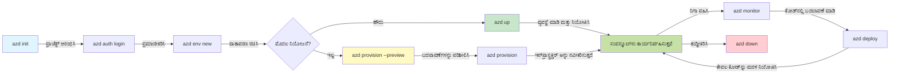
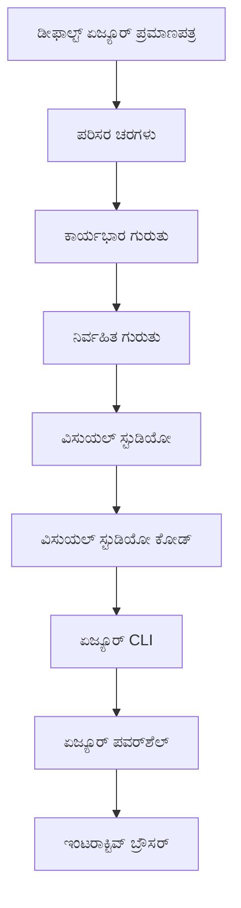

# AZD ಮೂಲಭೂತಗಳು - Azure Developer CLI (azd) ಅರ್ಥಮಾಡಿಕೊಳ್ಳುವುದು

# AZD ಮೂಲಭೂತಗಳು - ಕೋರ್ ತತ್ವಗಳು ಮತ್ತು ಮೂಲಭೂತಗಳು

**ಅಧ್ಯಾಯ ನಾವಿಗೇಶನ್:**
- **📚 ಕೋರ್ಸ್ ಹೋಮ್**: [AZD For Beginners](../../README.md)
- **📖 ಪ್ರಸ್ತುತ ಅಧ್ಯಾಯ**: ಅಧ್ಯಾಯ 1 - ಮೂಲಭೂತ ಮತ್ತು ತ್ವರಿತ ಪ್ರಾರಂಭ
- **⬅️ ಹಿಂದಿನ**: [Course Overview](../../README.md#-chapter-1-foundation--quick-start)
- **➡️ ಮುಂದಿನ**: [Installation & Setup](installation.md)
- **🚀 ಮುಂದಿನ ಅಧ್ಯಾಯ**: [Chapter 2: AI-First Development](../chapter-02-ai-development/microsoft-foundry-integration.md)

## ಪರಿಚಯ

ಈ ಪಾಠವು ನಿಮಗೆ Azure Developer CLI (azd) ಪರಿಚಯ ಮಾಡಿಕೊಡುತ್ತದೆ — ಇದು ನಿಮ್ಮ ಸ್ಥಳೀಯ ಅಭಿವೃದ್ಧಿಯಿಂದ Azure ನಿಯೋಜನೆಗೆ ಹೋಗುವ ಪ್ರಯಾಣವನ್ನು ವೇಗಗೊಳಿಸುವ ಶಕ್ತಿಶಾಲಿ ಕಮಾಂಡ್-ಲೈನ್ ಸಾಧನವಾಗಿದೆ. ನೀವು ಮೂಲಭೂತ ತತ್ವಗಳು, ಪ್ರಮುಖ ವೈಶಿಷ್ಟ್ಯಗಳು ಮತ್ತು azd ಕ್ಲೌಡ್-ನೆಟಿವ್ ಅಪ್ಲಿಕೇಶನ್ ನಿಯೋಜನೆಯನ್ನು எவ்வாறு ಸರಳಗೊಳಿಸುತ್ತದೆ ಎಂಬುದನ್ನು ಕಲಿಯುತ್ತೀರಿ.

## ಕಲಿಕೆಯ ಗುರಿಗಳು

ಈ ಪಾಠದ ಅಂತ್ಯಕ್ಕೆ ನೀವು:
- Azure Developer CLI ಏನೆಂದು ಮತ್ತು ಅದರ ಮುಖ್ಯ ಉದ್ದೇಶ ಏನೆಂದು ಅರ್ಥಮಾಡಿಕೊಳ್ಳುವಿರಿ
- ಟೆಂಪ್ಲೇಟ್ಗಳು, ಪರಿಸರಗಳು ಮತ್ತು ಸೇವೆಗಳ ಕೋರ್ ತತ್ವಗಳನ್ನು ಕಲಿಯುವಿರಿ
- ಟೆಂಪ್ಲೇಟ್-ಚಾಲಿತ ಅಭಿವೃದ್ಧಿ ಮತ್ತು ಇನ್‌ಫ್ರಾಸ್ಟ್ರಕ್ಚರ್ ಏಸ್ ಕೋಡ್ ಸೇರಿದಂತೆ ಪ್ರಮುಖ ವೈಶಿಷ್ಟ್ಯಗಳನ್ನು ಅನ್ವೇಷಿಸುವಿರಿ
- azd ಪ್ರಾಜೆಕ್ಟ್ ರಚನೆ ಮತ್ತು ಕಾರ್ಯಪ್ರವಾಹವನ್ನು ಅರ್ಥಮಾಡಿಕೊಳ್ಳುವಿರಿ
- ನಿಮ್ಮ ಅಭಿವೃದ್ಧಿ ಪರಿಸರಕ್ಕೆ azd ಅನ್ನು 설치 ಮಾಡಿ ಸಂರಚಿಸಲು ಸಿದ್ಧರಾಗುವಿರಿ

## ಕಲಿಕೆ ಫಲಿತಾಂಶಗಳು

ಈ ಪಾಠವನ್ನು ಪೂರ್ಣಗೊಳಿಸಿದ ಮೇಲೆ, ನೀವು ಆಗಲು ಸಾಮರ್ಥ್ಯ ಹೊಂದಿರುತ್ತೀರಿ:
- ಆಧುನಿಕ ಕ್ಲೌಡ್ ಅಭಿವೃದ್ಧಿ ಕಾರ್ಯಪ್ರವಾಹಗಳಲ್ಲಿ azd ನ ಪಾತ್ರವನ್ನು ವಿವರಿಸಲು
- azd ಪ್ರಾಜೆಕ್ಟ್ ರಚನೆದ ಘಟಕಗಳನ್ನು ಗುರುತಿಸಲು
- ಟೆಂಪ್ಲೇಟ್ಗಳು, ಪರಿಸರಗಳು ಮತ್ತು ಸೇವೆಗಳು ಒಟ್ಟಿಗೆ ಹೇಗೆ ಕಾರ್ಯನಿರ್ವಹಿಸುತ್ತವೆ ಎಂದು ವರ್ಣಿಸಲು
- azd ಮೂಲಕ Infrastructure as Code ನ ಲಾಭಗಳನ್ನು ಅರ್ಥಮಾಡಿಕೊಳ್ಳಲು
- ವಿಭಿನ್ನ azd ಕಮಾಂಡ್‌ಗಳನ್ನು ಮತ್ತು ಅವುಗಳ ಉದ್ದೇಶಗಳನ್ನು ಗುರುತಿಸಲು

## Azure Developer CLI (azd) ಎಂದರೆ ಏನು?

Azure Developer CLI (azd) ಒಂದು ಕಮಾಂಡ್-ಲೈನ್ ಸಾಧನವಾಗಿದ್ದು, ನಿಮ್ಮ ಸ್ಥಳೀಯ ಅಭಿವೃದ್ಧಿಯಿಂದ Azure ನಿಯೋಜನೆಗೆ ಹೋಗುವ ಪ್ರಯಾಣವನ್ನು ವೇಗಗೊಳಿಸಲು ವಿನ್ಯಾಸಗೊಳಿಸಲಾಗಿದೆ. ಇದು Azure ನಲ್ಲಿ ಕ್ಲೌಡ್-ನೆಟಿವ್ ಅಪ್ಲಿಕೇಶನ್‌ಗಳನ್ನು ನಿರ್ಮಿಸುವುದು, ನಿಯೋಜಿಸುವುದು ಮತ್ತು ನಿರ್ವಹಿಸುವ प्रक्रಿಯೆಯನ್ನು ಸರಳಗೊಳಿಸುತ್ತದೆ.

### azd ಬಳಸಿ ನೀವು ಏನು ನಿಯೋಜಿಸಬಹುದು?

azd ಅಗತ್ಯವಿರುವ ಹಲವು ವರ್ಕ್ಲೋಡ್‌ಗಳನ್ನು ಬೆಂಬಲಿಸುತ್ತದೆ — ಮತ್ತು ಈ ಪಟ್ಟಿತೋರುವಿಕೆ ನಿರಂತರವಾಗಿ ವಿಸ್ತರಿಸುತ್ತಿದೆ. ಇಂದಿನ ದಿನಕ್ಕೆ, ನೀವು azd ಬಳಸಿ ನಿಯೋಜಿಸಬಹುದು:

| Workload Type | Examples | Same Workflow? |
|---------------|----------|----------------|
| **Parampraagata applications** | Web apps, REST APIs, static sites | ✅ `azd up` |
| **Services and microservices** | Container Apps, Function Apps, multi-service backends | ✅ `azd up` |
| **AI-powered applications** | Chat apps with Microsoft Foundry Models, RAG solutions with AI Search | ✅ `azd up` |
| **Intelligent agents** | Foundry-hosted agents, multi-agent orchestrations | ✅ `azd up` |

ಮುಖ್ಯ ಅಂಶವೆನೆಂದರೆ **ನೀವು ಏನನ್ನು ನಿಯೋಜಿಸುತ್ತಿದ್ದರೂ azd ಜೀವನಚಕ್ರ ಅದೇ ರೀತಿ ಇರುತ್ತದೆ**. ನೀವು ಒಂದು ಪ್ರಾಜೆಕ್ಟ್ ಅನ್ನು ಆರಂಭಿಸುತ್ತೀರಿ, ಮೂಲಸೌಕರ್ಯವನ್ನು ಒದಗಿಸುತ್ತೀರಿ, ನಿಮ್ಮ ಕೋಡ್ ಅನ್ನು ನಿಯೋಜಿಸುತ್ತೀರಿ, ನಿಮ್ಮ ಅಪ್ಲಿಕೇಶನ್ ಅನ್ನು ನಿಗಾ ವಹಿಸುತ್ತೀರಿ ಮತ್ತು ಸ್ವಚ್ಛಗೊಳಿಸುತ್ತೀರಿ — ಅದು ಸಾದಾ ವೆಬ್‌ಸೈಟ್ ಆಗಿರಲಿ ಅಥವಾ ಸುಕ್ಷ್ಮವಾದ AI ಏಜೆಂಟ್ ಆಗಿರಲಿ.

ಈ ನಿರಂತರತೆ ಉದ್ದೇಶಿತವಾಗಿದೆ. azd AI ಸಾಮರ್ಥ್ಯಗಳನ್ನು ನಿಮ್ಮ ಅಪ್ಲಿಕೇಶನ್ ಬಳಸುವ ಇನ್ನೊಂದು ಸೇವೆಯಂತೆ ನೋಡುತ್ತದೆ, ಇದನ್ನು ಮೂಲಭೂತವಾಗಿ ವಿಭಿನ್ನವನ್ನಾಗಿ ಪರಿಗಣಿಸುವುದಿಲ್ಲ. Microsoft Foundry Models ನಿಂದ ಬೆಂಬಲಿತ ಚಾಟ್ ಎಂಡ್‌ಪಾಯಿಂಟ್ azd ದೃಷ್ಟಿಯಿಂದ, ಕಾನ್ಫಿಗರ್ ಮತ್ತು ನಿಯೋಜಿಸಬೇಕಾದ ಮತ್ತೊಂದು ಸೇವೆಯೇ ಆಗಿದೆ.

### 🎯 ಏಕೆ AZD ಬಳಸಬೇಕು? ನೈಜ-ಜಗತ್ತಿನ ಹೋಲಿಕೆ

ನೋಡೋಣ rọrun ವೆಬ್ ಅಪ್ಲಿಕೇಶನ್ ಅನ್ನು ಡೇಟಾಬೇಸ್‌ನೊಂದಿಗೆ ನಿಯೋಜಿಸುವ ಹೋಲಿಕೆ:

#### ❌ AZD ಇಲ್ಲದೆ: ಕೈಯಾರೆ Azure ನಿಯೋಜನೆ (30+ ನಿಮಿಷಗಳು)

```bash
# ಹಂತ 1: ಸಂಪನ್ಮೂಲ ಗುಂಪನ್ನು ರಚಿಸಿ
az group create --name myapp-rg --location eastus

# ಹಂತ 2: ಆಪ್ ಸೇವಾ ಯೋಜನೆ ರಚಿಸಿ
az appservice plan create --name myapp-plan \
  --resource-group myapp-rg \
  --sku B1 --is-linux

# ಹಂತ 3: ವೆಬ್ ಅಪ್ ರಚಿಸಿ
az webapp create --name myapp-web-unique123 \
  --resource-group myapp-rg \
  --plan myapp-plan \
  --runtime "NODE:18-lts"

# ಹಂತ 4: ಕಾಸ್ಮೋಸ್ DB ಖಾತೆ ರಚಿಸಿ (10-15 ನಿಮಿಷಗಳು)
az cosmosdb create --name myapp-cosmos-unique123 \
  --resource-group myapp-rg \
  --kind MongoDB

# ಹಂತ 5: ಡೇಟಾಬೇಸ್ ರಚಿಸಿ
az cosmosdb mongodb database create \
  --account-name myapp-cosmos-unique123 \
  --resource-group myapp-rg \
  --name tododb

# ಹಂತ 6: ಕಲೆಕ್ಷನ್ ರಚಿಸಿ
az cosmosdb mongodb collection create \
  --account-name myapp-cosmos-unique123 \
  --resource-group myapp-rg \
  --database-name tododb \
  --name todos

# ಹಂತ 7: ಸಂಪರ್ಕ ಸ್ಟ್ರಿಂಗ್ ಪಡೆಯಿರಿ
CONN_STR=$(az cosmosdb keys list \
  --name myapp-cosmos-unique123 \
  --resource-group myapp-rg \
  --type connection-strings \
  --query "connectionStrings[0].connectionString" -o tsv)

# ಹಂತ 8: ಆಪ್ సెಟ್ಟಿಂಗ್‌ಗಳನ್ನು ಸಂರಚಿಸಿ
az webapp config appsettings set \
  --name myapp-web-unique123 \
  --resource-group myapp-rg \
  --settings MONGODB_URI="$CONN_STR"

# ಹಂತ 9: ಲಾಗಿಂಗ್ ಸಕ್ರಿಯಗೊಳಿಸಿ
az webapp log config --name myapp-web-unique123 \
  --resource-group myapp-rg \
  --application-logging filesystem \
  --detailed-error-messages true

# ಹಂತ 10: ಅಪ್ಲಿಕೇಶನ್ ಇನ್ಸೈಟ್ಸ್ ಅನ್ನು ಸಂರಚಿಸಿ
az monitor app-insights component create \
  --app myapp-insights \
  --location eastus \
  --resource-group myapp-rg

# ಹಂತ 11: ಅಪ್ಲಿಕೇಶನ್ ಇನ್ಸೈಟ್ಸ್ ಅನ್ನು ವೆಬ್ ಅಪ್‌ಗೆ ಲಿಂಕ್ ಮಾಡಿ
INSTRUMENTATION_KEY=$(az monitor app-insights component show \
  --app myapp-insights \
  --resource-group myapp-rg \
  --query "instrumentationKey" -o tsv)

az webapp config appsettings set \
  --name myapp-web-unique123 \
  --resource-group myapp-rg \
  --settings APPINSIGHTS_INSTRUMENTATIONKEY="$INSTRUMENTATION_KEY"

# ಹಂತ 12: ಅಪ್ಲಿಕೇಶನ್ ಅನ್ನು ಸ್ಥಳೀಯವಾಗಿ ನಿರ್ಮಿಸಿ
npm install
npm run build

# ಹಂತ 13: ಡಿಪ್ಲಾಯ್‌ಮೆಂಟ್ ಪ್ಯಾಕೇಜ್ ರಚಿಸಿ
zip -r app.zip . -x "*.git*" "node_modules/*"

# ಹಂತ 14: ಅಪ್ಲಿಕೇಶನ್ ಅನ್ನು ಡಿಪ್ಲಾಯ್ ಮಾಡಿ
az webapp deployment source config-zip \
  --resource-group myapp-rg \
  --name myapp-web-unique123 \
  --src app.zip

# ಹಂತ 15: ಕಾಯಿರಿ ಮತ್ತು ಅದು ಕೆಲಸ ಮಾಡಲಿ ಎಂದು ಪ್ರಾರ್ಥಿಸಿ 🙏
# (ಯಾವುದೇ ಸ್ವಯಂಚಾಲಿತ ಪರಿಶೀಲನೆ ಇಲ್ಲ, ಕೈಯಿಂದ ಪರೀಕ್ಷೆ ಅಗತ್ಯ)
```

**ಸಮಸ್ಯೆಗಳು:**
- ❌ 15+ ಕಮಾಂಡ್‌ಗಳನ್ನು ನೆನಪಿರಿಸಿಕೊಳ್ಳಿ ಮತ್ತು ಕ್ರಮವಾಗಿ ನಡೆಸಬೇಕು
- ❌ 30-45 ನಿಮಿಷಗಳ ಕೈಯಾರೆ ಕೆಲಸ
- ❌ ತಪ್ಪುಗಳನ್ನು ಮಾಡುವುದು ಸುಲಭ (ಟೈપೊಗಳು, ತಪ್ಪಾದ ಪರಾಮೀಟ್ರ್ಗಳು)
- ❌ ಸಂಪರ್ಕ ಸ್ಟ್ರಿಂಗ್‌ಗಳು ಟರ್ಮಿನಲ್ ಇತಿಹಾಸದಲ್ಲಿ ಪ್ರದರ್ಶವಾಗಬಹುದು
- ❌ ಏನಾದರೂ ವಿಫಲವಾದರೆ ಸ್ವಯಂಚಾಲಿತ ರೋಲ್‌ಬ್ಯಾಕ್ ಇಲ್ಲ
- ❌ ತಂಡದ ಸದಸ್ಯರಿಗೆ ಪುನರಾವರ್ತನೆ ಮಾಡುವುದು ಕಷ್ಟ
- ❌ ಪ್ರತಿ ಬಾರಿ ವಿಭಿನ್ನವಾಗುತ್ತದೆ (ಪುನರುತ್ಪಾದನೀಯವಲ್ಲ)

#### ✅ AZD ಜೊತೆ: ಸ್ವಯಂಚಾಲಿತ ನಿಯೋಜನೆ (5 ಕಮಾಂಡ್, 10-15 ನಿಮಿಷಗಳು)

```bash
# ಹಂತ 1: ಟೆಂಪ್ಲೇಟಿನಿಂದ ಪ್ರಾರಂಭಿಸಿ
azd init --template todo-nodejs-mongo

# ಹಂತ 2: ಪ್ರಮಾಣೀಕರಿಸಿ
azd auth login

# ಹಂತ 3: ಪರಿಸರವನ್ನು ರಚಿಸಿ
azd env new dev

# ಹಂತ 4: ಬದಲಾವಣೆಗಳ ಪೂರ್ವದರ್ಶನ (ಐಚ್ಛಿಕ ಆದರೆ ಶಿಫಾರಸು ಮಾಡಲಾಗಿದೆ)
azd provision --preview

# ಹಂತ 5: ಎಲ್ಲವನ್ನೂ ನಿಯೋಜಿಸಿ
azd up

# ✨ ಮುಗಿತು! ಎಲ್ಲವನ್ನೂ ನಿಯೋಜಿಸಲಾಗಿದೆ, ಸಂರಚಿಸಲಾಗಿದೆ ಮತ್ತು ನಿಗಾ ಇಡಲಾಗಿದೆ
```

**ಲಾಭಗಳು:**
- ✅ **5 ಕಮಾಂಡ್‌ಗಳು** ವಿರುದ್ಧ 15+ ಕೈಯಾರೆ ಹಂತಗಳು
- ✅ **10-15 ನಿಮಿಷಗಳು** ಒಟ್ಟು ಸಮಯ (ಮುಖ್ಯವಾಗಿ Azureನ್ನು ಕಾಯುವ ಕಾಲ)
- ✅ **ಕಡಿಮೆ ಕೈಯಾರೆ ತಪ್ಪುಗಳು** - ಸुसಂಯೋಜಿತ, ಟೆಂಪ್ಲೇಟ್ ಚಾಲಿತ ಕಾರ್ಯಪ್ರವಾಹ
- ✅ **ಸುರಕ್ಷಿತ ರಹಸ್ಯ ನಿರ್ವಹಣೆ** - ಅನೇಕ ಟೆಂಪ್ಲೇಟ್ಗಳು Azure-ನಿಯಂತ್ರಿತ ರಹಸ್ಯ ಸಂಗ್ರಹಣೆಯನ್ನು ಬಳಸುತ್ತವೆ
- ✅ **ಪುನರಾವರ್ತಿಸಬಹುದಾದ ನಿಯೋಜನೆಗಳು** - ಪ್ರತಿಯೊಂದು ಬಾರಿ ಅದೇ ಕಾರ್ಯಪ್ರವಾಹ
- ✅ **ಸಂಪೂರ್ಣವಾಗಿ ಪುನರುತ್ಪಾದನೀಯ** - ಪ್ರತಿಯೊಂದು ಬಾರಿ ಒಂದೇ ಫಲಿತಾಂಶ
- ✅ **ತಂಡಕ್ಕೆ ಸಿದ್ಧ** - ಯಾರು ಬೇಕಾದರೂ 동일 ಕಮಾಂಡ್‌ಗಳೊಂದಿಗೆ ನಿಯೋಜಿಸಬಹುದು
- ✅ **Infrastructure as Code** - Bicep ಟೆಂಪ್ಲೇಟ್‌ಗಳನ್ನು ಸಂಸ್ಕರಣಾ ನಿಯಂತ್ರಣದಲ್ಲಿ ಇರಿಸಬಹುದು
- ✅ **ಒಳಗಲಿಸಿದ ನಿಗಾ** - Application Insights ಸ್ವಯಂಚಾಲಿತವಾಗಿ ಸಂರಚಿಸಲಾಗಿದೆ

### 📊 ಸಮಯ ಮತ್ತು ದೋಷ ಕಡಿತ

| Metric | Manual Deployment | AZD Deployment | Improvement |
|:-------|:------------------|:---------------|:------------|
| **Commands** | 15+ | 5 | 67% ಕಡಿಮೆ |
| **Time** | 30-45 min | 10-15 min | 60% ವೇಗವಾಗಿ |
| **Error Rate** | ~40% | <5% | 88% ಕಡಿತ |
| **Consistency** | ಕಡಿಮೆ (ಕೈಯಾರೆ) | 100% (ಸ್ವಯಂಚಾಲಿತ) | ಪರಿಪೂರ್ಣ |
| **Team Onboarding** | 2-4 ಗಂಟೆಗಳು | 30 ನಿಮಿಷಗಳು | 75% ವೇಗವಾಗಿ |
| **Rollback Time** | 30+ min (ಕೈಯಾರೆ) | 2 min (ಸ್ವಯಂಚಾಲಿತ) | 93% ವೇಗವಾಗಿ |

## ಮೂಲ ತತ್ವಗಳು

### ಟೆಂಪ್ಲೇಟ್ಗಳು
ಟೆಂಪ್ಲೇಟ್ಗಳು azd ನ ಅಡಿಗಲ್ಲು. ಅವು ಒಳಗೊಂಡಿವೆ:
- **Application code** - ನಿಮ್ಮ ಮೂಲ ಕೋಡ್ ಮತ್ತು ಅವಲಂಬನೆಗಳು
- **Infrastructure definitions** - Bicep ಅಥವಾ Terraform ನಲ್ಲಿ ವ್ಯಾಖ್ಯಾನಿಸಲಾದ Azure ಸಂಪನ್ಮೂಲಗಳು
- **Configuration files** - ಸೆಟ್ಟಿಂಗ್ ಗಳು ಮತ್ತು ಪರಿಸರಚಾರಿ ಮೌಲ್ಯಗಳು
- **Deployment scripts** - ಸ್ವಯಂಚಾಲಿತ ನಿಯೋಜನೆ ಕಾರ್ಯಪ್ರವಾಹಗಳು

### ಪರಿಸರಗಳು
ಪರಿಸರಗಳು ವಿಭಿನ್ನ ನಿಯೋಜನಾ ಗುರಿಗಳನ್ನು ಪ್ರತಿನಿಧಿಸುತ್ತವೆ:
- **Development** - ಪರೀಕ್ಷಾ ಮತ್ತು ಅಭಿವೃದ್ಧಿಗಾಗಿ
- **Staging** - ಪ್ರಿ-ಪ್ರೊಡಕ್ಷನ್ ಪರಿಸರ
- **Production** - ಲೈವ್ ಉತ್ಪಾದನೆ ಪರಿಸರ

ಪ್ರತಿ ಪರಿಸರವು ಅದರದೇನಾದರೂ ಕಾಯ್ದಿರಿಸುತ್ತದೆ:
- Azure resource group
- Configuration settings
- Deployment state

### ಸೇವೆಗಳು
ಸೇವೆಗಳು ನಿಮ್ಮ ಅಪ್ಲಿಕೇಶನ್‌ನ ನಿರ್ಮಾಣ ಘಟಕಗಳು:
- **Frontend** - ವೆಬ್ ಅಪ್ಲಿಕೇಶನ್‌ಗಳು, SPAs
- **Backend** - APIs, ಮೈಕ್ರೋಸೇವೆಗಳು
- **Database** - ದತ್ತಾಂಶ ಸಂಗ್ರಹಣಾ ಪರಿಹಾರಗಳು
- **Storage** - ಫೈಲ್ ಮತ್ತು ಬ್ಲಾಬ್ ಸಂಗ್ರಹಣೆ

## ಪ್ರಮುಖ ಲಕ್ಷಣಗಳು

### 1. ಟೆಂಪ್ಲೇಟ್-ಚಾಲಿತ ಅಭಿವೃದ್ಧಿ
```bash
# ಲಭ್ಯವಿರುವ ಟೆಂಪ್ಲೇಟುಗಳನ್ನು ವೀಕ್ಷಿಸಿ
azd template list

# ಟೆಂಪ್ಲೇಟಿನಿಂದ ಪ್ರಾರಂಭಿಸಿ
azd init --template <template-name>
```

### 2. Infrastructure as Code
- **Bicep** - Azure's domain-specific language
- **Terraform** - Multi-cloud infrastructure tool
- **ARM Templates** - Azure Resource Manager templates

### 3. ಏಕೀಕೃತ ಕಾರ್ಯಪ್ರವಾಹಗಳು
```bash
# ಸಂಪೂರ್ಣ ನಿಯೋಜನೆ ಕಾರ್ಯಪ್ರವಾಹ
azd up            # Provision + Deploy ಇದು ಪ್ರಥಮ ಬಾರಿ ಸೆಟ್‌ಅಪ್‌ಗಾಗಿ ಕೈರಹಿತವಾಗಿ ಕಾರ್ಯನಿರ್ವಹಿಸುತ್ತದೆ

# 🧪 ಹೊಸದು: ನಿಯೋಜನೆಗಿಂತ ಮೊದಲು ಮೂಲಸೌಕರ್ಯ ಬದಲಾವಣೆಗಳನ್ನು ಪೂರ್ವದೃಶ್ಯವಾಗಿ ಪರಿಶೀಲಿಸಿ (ಭದ್ರ)
azd provision --preview    # ಬದಲಾವಣೆಗಳನ್ನು ಮಾಡದೆ ಮೂಲಸೌಕರ್ಯ ನಿಯೋಜನೆಯನ್ನು ಅನುಕರಿಸಿ

azd provision     # ನೀವು ಮೂಲಸೌಕರ್ಯವನ್ನು ನವೀಕರಿಸಿದರೆ Azure ಸಂಪನ್ಮೂಲಗಳನ್ನು ರಚಿಸಲು ಇದನ್ನು ಬಳಸಿ
azd deploy        # ಅಪ್ಲಿಕೇಶನ್ ಕೋಡ್ ಅನ್ನು ನಿಯೋಜಿಸಿ ಅಥವಾ ನವೀಕರಣದ ನಂತರ ಪುನಃ ನಿಯೋಜಿಸಿ
azd down          # ಸಂಪನ್ಮೂಲಗಳನ್ನು ತೆರವುಗೊಳಿಸಿ
```

#### 🛡️ ಪೂರ್ವದೃಶ್ಯದೊಂದಿಗೆ ಸುರಕ್ಷಿತ ಮೂಲಸೌಕರ್ಯ ಯೋಜನೆ
`azd provision --preview` ಕಮಾಂಡ್ ಸುರಕ್ಷಿತ ನಿಯೋಜನೆಗಳಿಗಾಗಿ ಆಟದ ಬದಲಾವಣೆ:
- **ಡ್ರೈ-ರನ್ ವಿಶ್ಲೇಷಣೆ** - ಯಾವದು ಸೃಷ್ಟಿಯಾಗುವುದು, ಪರಿಷ್ಕರಿಸಲಾಗುವುದು, ಅಥವಾ ಅಳಿಸಲಾಗುವುದು ಎಂದು ತೋರಿಸುತ್ತದೆ
- **ಶೂನ್ಯ જોખಂ** - ನಿಮ್ಮ Azure ಪರಿಸರದಲ್ಲಿ ಯಾವುದೇ ಬದಲಾವಣೆ ಮಾಡಲಾಗುವುದಿಲ್ಲ
- **ತಂಡ ಸಹಕಾರ** - ನಿಯೋಜನೆಯ ಮೊದಲು ಪೂರ್ವದೃಶ್ಯ ಫಲಿತಾಂಶಗಳನ್ನು ಹಂಚಿಕೊಳ್ಳಿ
- **ಖರ್ಚಿನ ಅಂದಾಜು** - ನಿಶ್ಚಿತಗೊಳ್ಳುವ ಮೊದಲು ಸಂಪನ್ಮೂಲಗಳ ಖರ್ಚನ್ನು ಅರ್ಥಮಾಡಿಕೊಳ್ಳಿ

```bash
# ಉದಾಹರಣೆಯ ಮುನ್ನೋಟ ಕಾರ್ಯಪ್ರವಾಹ
azd provision --preview           # ಏನು ಬದಲಾಗಲಿದೆ ನೋಡಿ
# ಫಲಿತಾಂಶವನ್ನು ಪರಿಶೀಲಿಸಿ, ತಂಡದೊಂದಿಗೆ ಚರ್ಚಿಸಿ
azd provision                     # ಆತ್ಮವಿಶ್ವಾಸದಿಂದ ಬದಲಾವಣೆಗಳನ್ನು ಅನ್ವಯಿಸಿ
```

### 📊 ದೃಶ್ಯ: AZD ಅಭಿವೃದ್ಧಿ ಕಾರ್ಯಪ್ರವಾಹ



**ಕಾರ್ಯಪ್ರವಾಹ ವಿವರಣೆ:**
1. **Init** - ಟೆಂಪ್ಲೇಟಿನಿಂದ ಅಥವಾ ಹೊಸ ಪ್ರಾಜೆಕ್ಟ್‌ನೊಂದಿಗೆ ಪ್ರಾರಂಭಿಸಿ
2. **Auth** - Azure ಗೆ ಪ್ರಾಮಾಣೀಕರಿಸಿ
3. **Environment** - ವಿಭಜಿತ ನಿಯೋಜನೆ ಪರಿಸರ ಸೃಷ್ಟಿಸಿ
4. **Preview** - 🆕 ಸದಾ ಮೊದಲಿಗೆ ಮೂಲಸೌಕರ್ಯ ಬದಲಾವಣೆಗಳನ್ನು ಪೂರ್ವದೃಶ್ಯ ಮಾಡಿ (ಸುರಕ್ಷಿತ ಅಭ್ಯಾಸ)
5. **Provision** - Azure ಸಂಪನ್ಮೂಲಗಳನ್ನು ರಚಿಸಿ/ಹುತ್ಕೊಳ್ಳಿ
6. **Deploy** - ನಿಮ್ಮ ಅಪ್ಲಿಕೇಶನ್ ಕೋಡ್ ಅನ್ನು ಪುಶ್ ಮಾಡಿ
7. **Monitor** - ಅಪ್ಲಿಕೇಶನ್ ಕಾರ್ಯಕ್ಷಮತೆಯನ್ನು ಗಮನಿಸಿ
8. **Iterate** - ಬದಲಾವಣೆ ಮಾಡಿ ಮತ್ತು ಕೋಡ್ ಅನ್ನು ಪುನರಾವರ್ತಿಸಿ
9. **Cleanup** - ಕೆಲಸ ಮುಗಿದಾಗ ಸಂಪನ್ಮೂಲಗಳನ್ನು ಅಳಿಸಿ

### 4. ಪರಿಸರ ನಿರ್ವಹಣೆ
```bash
# ವಾತಾವರಣಗಳನ್ನು ರಚಿಸಿ ಮತ್ತು ನಿರ್ವಹಿಸಿ
azd env new <environment-name>
azd env select <environment-name>
azd env list
```

### 5. ವಿಸ್ತರಣೆಗಳು ಮತ್ತು ಏಐ ಕಮಾಂಡ್‌ಗಳು

azd ಮುಖ್ಯ CLI ಹೊರತಾಗಿ ಸಾಮರ್ಥ್ಯಗಳನ್ನು ಸೇರಿಸಲು ವಿಸ್ತರಣೆ ವ್ಯವಸ್ಥೆಯನ್ನು ಬಳಸುತ್ತದೆ. ಇದು ವಿಶೇಷವಾಗಿ AI ವರ್ಕ್ಲೋಡ್‌ಗಳಿಗೆ ಉಪಯುಕ್ತವಾಗಿದೆ:

```bash
# ಲಭ್ಯವಿರುವ ವಿಸ್ತರಣೆಗಳನ್ನು ಪಟ್ಟಿ ಮಾಡಿ
azd extension list

# Foundry agents ವಿಸ್ತರಣೆಯನ್ನು ಸ್ಥಾಪಿಸಿ
azd extension install azure.ai.agents

# ಒಂದು ಮ್ಯಾನಿಫೆಸ್ಟ್‌ನಿಂದ ಎಐ ಏಜೆಂಟ್ ಯೋಜನೆಯನ್ನು ಆರಂಭಿಸಿ
azd ai agent init -m agent-manifest.yaml

# ನಿಯೋಜಿಸಿದ ಏಜೆಂಟ್ ಅನ್ನು ಪರೀಕ್ಷಿಸಿ (ವಿಲಂಬ ಮತ್ತು ಪ್ರಥಮ-ಬೈಟ್‌ಗೆ ತಲುಪುವ ಸಮಯವನ್ನು ತೋರಿಸುತ್ತದೆ)
azd ai agent invoke

# ಎಐ ಸಹಾಯಿತ ಅಭಿವೃದ್ಧಿಗಾಗಿ MCP ಸರ್ವರ್ ಅನ್ನು ಪ್ರಾರಂಭಿಸಿ (ಆಲ್ಫಾ)
azd mcp start
```

**ಏಜೆಂಟ್ ಜೀವನಚಕ್ರ, ಪ್ರಾರಂಭದಿಂದ ಅಂತ್ಯವರೆಗೆ.** ಒಂದು ಬಾರಿ ನೀವು `azure.ai.agents` ಅನ್ನು 설치 ಮಾಡಿದರೆ, ಒಂದು ಏಕ ಕಾರ್ಯಪ್ರವಾಹವು ಕಲ್ಪನೆಯಿಂದ ಚಾಲಿತ, ನಿರೀಕ್ಷಿತ ಏಜೆಂಟ್‌ಗೆ ನಿಮಗಾಗಿ ತರುತ್ತದೆ ಮತ್ತು ಮಾನಿಟರಿಂಗ್ ಅನ್ನು ಒದಗಿಸುತ್ತದೆ. ಆರಂಭದಲ್ಲಿ ನಿಮ್ಮకు ಇವುಗಳೆಲ್ಲಾ ಬೇಕಾಗಿರಬೇಕಿಲ್ಲ — ಅವು ಅಸ್ತಿತ್ವದಲ್ಲಿವೆ ಎಂಬುದನ್ನು ತಿಳಿದುಕೊಳ್ಳಿ:

| Stage | Command | What it does |
|-------|---------|--------------|
| **Scaffold** | `azd ai agent init -m <manifest>` | ಒಂದು ಮನಿಫೆಸ್ಟ್‌ನಿಂದ ಏಜೆಂಟ್ ಪ್ರಾಜೆಕ್ಟ್ ಅನ್ನು ರಚಿಸುತ್ತದೆ |
| **Test** | `azd ai agent invoke` | ಏಜೆಂಟ್ ಅನ್ನು ಕರೆ ಮಾಡಿ ಮತ್ತು ಪ್ರತಿಕ್ರಿಯೆ ಸಮಯವನ್ನು ನೋಡಿ |
| **Measure** | `azd ai agent eval generate` | ಏಜೆಂಟ್‌ಗೆ ಮೌಲ್ಯಮಾಪನ ಡೇಟಾಸೆಟ್ ರಚಿಸಿ |
| **Improve** | `azd ai agent optimize` | ನಿಮ್ಮ ಡೇಟಾ ವಿರುದ್ಧ ಏಜೆಂಟ್ ನಿರ್ದೇಶನಗಳನ್ನು ಉತ್ತಮಗೊಳಿಸಿ |
| **Inspect** | `azd ai agent endpoint show` | ಸಜೀವ ಎಂಡ್‌ಪಾಯಿಂಟ್ ಸಂರಚನೆಯನ್ನು ನೋಡಿ |
| **Clean up** | `azd ai agent delete` | ಒಂದು ಹೋಸ್ಟಿಂಗ್ ಮಾಡಲಾದ ಏಜೆಂಟ್ ಮತ್ತು ಅದರ ಎಲ್ಲಾ ಸಂಸ್ಕರಣೆಗಳನ್ನೂ ಅಳಿಸಿ |

> ವಿಸ್ತರಣೆಗಳ ವಿವರವನ್ನು [Chapter 2: AI-First Development](../chapter-02-ai-development/agents.md) ಮತ್ತು [AZD AI CLI Commands](../chapter-08-production/production-ai-practices.md#azd-ai-cli-commands-and-extensions) ರೆಫರೆನ್ಸ್‌ನಲ್ಲಿ ವಿವರವಾಗಿ ಕಾಣಬಹುದು.

## 📁 ಪ್ರಾಜೆಕ್ಟ್ ರಚನೆ

ಟಿಪಿಕಲ್ azd ಪ್ರಾಜೆಕ್ಟ್ ರಚನೆ:
```
my-app/
├── .azd/                    # azd configuration
│   └── config.json
├── .azure/                  # Azure deployment artifacts
├── .devcontainer/          # Development container config
├── .github/workflows/      # GitHub Actions
├── .vscode/               # VS Code settings
├── infra/                 # Infrastructure code
│   ├── main.bicep        # Main infrastructure template
│   ├── main.parameters.json
│   └── modules/          # Reusable modules
├── src/                  # Application source code
│   ├── api/             # Backend services
│   └── web/             # Frontend application
├── azure.yaml           # azd project configuration
└── README.md
```

## 🔧 ಸಂರಚನಾ ಫೈಲ್‌ಗಳು

### azure.yaml
ಮುಖ್ಯ ಪ್ರಾಜೆಕ್ಟ್ ಸಂರಚನಾ ಫೈಲ್:
```yaml
name: my-awesome-app
metadata:
  template: my-template@1.0.0

services:
  web:
    project: ./src/web
    language: js
    host: appservice
  api:
    project: ./src/api
    language: js
    host: appservice

hooks:
  preprovision:
    shell: pwsh
    run: echo "Preparing to provision..."
```

### .azure/config.json
ಪರಿಸರ-ನಿರ್ದಿಷ್ಟ ಕಾನ್ಫಿಗರೇಶನ್:
```json
{
  "version": 1,
  "defaultEnvironment": "dev",
  "environments": {
    "dev": {
      "subscriptionId": "your-subscription-id",
      "location": "eastus"
    }
  }
}
```

## 🎪 ಸಾಮಾನ್ಯ ಕಾರ್ಯಪ್ರವಾಹಗಳು ಕೈಯಿಂದ ಅಭ್ಯಾಸಗಳೊಡನೆ

> **💡 ಕಲಿಕೆಯ ಸೂಚನೆ:** ನಿಮ್ಮ AZD ಕೌಶಲ್ಯಗಳನ್ನು ಕ್ರಮೇಣ ಅಭಿವೃದ್ಧಿಪಡಿಸಲು ಈ ವ್ಯಾಯಾಮಗಳನ್ನು ಕ್ರಮವಾಗಿ ಅನುಸರಿಸಿ.

### 🎯 ವ್ಯಾಯಾಮ 1: ನಿಮ್ಮ ಮೊದಲ ಪ್ರಾಜೆಕ್ಟ್ ಅನ್ನು ಆರಂಭಿಸಿ

**ಗೋಲು:** AZD ಪ್ರಾಜೆಕ್ಟ್ ರಚಿಸಿ ಮತ್ತು ಅದರ ರಚನೆ ಅನ್ವೇಷಿಸಿ

**ಹೆಜ್ಜೆಗಳು:**
```bash
# ಪ್ರಮಾಣಿತ ಟೆಂಪ್ಲೇಟ್ನನ್ನು ಬಳಸಿ
azd init --template todo-nodejs-mongo

# ಉತ್ಪಾದಿತ ಕಡತಗಳನ್ನು ಅನ್ವೇಷಿಸಿ
ls -la  # ಗುಪ್ತ ಫೈಲ್‌ಗಳನ್ನೂ ಸೇರಿಸಿ ಎಲ್ಲಾ ಫೈಲ್‌ಗಳನ್ನು ವೀಕ್ಷಿಸಿ

# ರಚಿಸಲಾದ ಪ್ರಮುಖ ಫೈಲ್‌ಗಳು:
# - azure.yaml (ಮੁੱਖ ಸಂರಚನೆ)
# - infra/ (ಇನ್‌ಫ್ರಾಸ್ಟ್ರಕ್ಚರ್ ಕೋಡ್)
# - src/ (ಅಪ್ಲಿಕೇಶನ್ ಕೋಡ್)
```

**✅ ಯಶಸ್ಸು:** ನಿಮ್ಮ ಬಳಿ azure.yaml, infra/, ಮತ್ತು src/ ಡೈರೆಕ್ಟರಿಗಳು ಇವೆ

---

### 🎯 ವ್ಯಾಯಾಮ 2: Azure ಗೆ ನಿಯೋಜಿಸಿ

**ಗೋಲು:** ಅಂತ್ಯದಿಂದ ಅಂತ್ಯವರೆಗಿನ ನಿಯೋಜನೆಯನ್ನು ಪೂರ್ಣಗೊಳಿಸಿ

**ಹೆಜ್ಜೆಗಳು:**
```bash
# 1. ಪ್ರಾಮಾಣೀಕರಿಸಿ
az login && azd auth login

# 2. ಪರಿಸರ ರಚಿಸಿ
azd env new dev
azd env set AZURE_LOCATION eastus

# 3. ಬದಲಾವಣೆಗಳನ್ನು ಪೂರ್ವವೀಕ್ಷಿಸಿ (ಶಿಫಾರಸು ಮಾಡಲಾಗಿದೆ)
azd provision --preview

# 4. ಎಲ್ಲವನ್ನೂ ನಿಯೋಜಿಸಿ
azd up

# 5. ನಿಯೋಜನೆಯನ್ನು ಪರಿಶೀಲಿಸಿ
azd show    # ನಿಮ್ಮ ಅಪ್ಲಿಕೇಶನ್ URL ವೀಕ್ಷಿಸಿ
```

**ಅಂದಾಜಿತ ಸಮಯ:** 10-15 ನಿಮಿಷಗಳು  
**✅ ಯಶಸ್ಸು:** ಅಪ್ಲಿಕೇಶನ್ URL ಬ್ರೌಸರ್‌ನಲ್ಲಿ ತೆರೆಯುತ್ತದೆ

---

### 🎯 ವ್ಯಾಯಾಮ 3: ಬಹು-ಪರಿಸರಗಳು

**ಗೋಲು:** dev ಮತ್ತು staging ಗೆ ನಿಯೋಜಿಸಿ

**ಹೆಜ್ಜೆಗಳು:**
```bash
# dev ಈಗಾಗಲೇ ಇದೆ, staging ಅನ್ನು ರಚಿಸಿ
azd env new staging
azd env set AZURE_LOCATION westus2
azd up

# ಒಂದರಿಂದ ಇನ್ನೊಂದಕ್ಕೆ ಬದಲಾಯಿಸಿ
azd env list
azd env select dev
```

**✅ ಯಶಸ್ಸು:** Azure ಪೋರ್ಟಲ್‌ನಲ್ಲಿ ಎರಡು ಪ್ರತ್ಯೇಕ resource group ಗಳು ಕಂಡುಬರುತ್ತವೆ

---

### 🛡️ ಶುದ್ಧ ಸ್ಥಿತಿ: `azd down --force --purge`

ನೀವು ಸಂಪೂರ್ಣವಾಗಿ ರಿಸೆಟ್ ಮಾಡಬೇಕಾಗಿದ್ದಾಗ:

```bash
azd down --force --purge
```

**ಇದರಿಂದ ಏನಾಗುತ್ತದೆ:**
- `--force`: ಯಾವುದೇ ದೃಢೀಕರಣ ಪ್ರಾಂಪ್ಟ್‌ಗಳು ಇರುವುದಿಲ್ಲ
- `--purge`: ಎಲ್ಲಾ ಸ್ಥಳೀಯ ಸ್ಥಿತಿ ಮತ್ತು Azure ಸಂಪನ್ಮೂಲಗಳನ್ನು ಅಳಿಸುತ್ತದೆ

**ಯಾವಾಗ ಬಳಸಬೇಕು:**
- ನಿಯೋಜನೆ ಮಧ್ಯದಲ್ಲಿ ವಿಫಲವಾಗಿದ್ದಾಗ
- ಪ್ರಾಜೆಕ್ಟ್ಗಳನ್ನು ಬದಲಾಯಿಸುವಾಗ
- ಹೊಸ ಆರಂಭ ಬೇಕಾಗಿರುವಾಗ

---

## 🎪 ಮೂಲ ಕಾರ್ಯಪ್ರವಾಹ ಉಲ್ಲೇಖ

### ಹೊಸ ಪ್ರಾಜೆಕ್ಟ್ ಪ್ರಾರಂಭಿಸುವುದು
```bash
# ವಿಧಾನ 1: ಇರುವ ಟೆಂಪ್ಲೇಟ್ ಬಳಸಿ
azd init --template todo-nodejs-mongo

# ವಿಧಾನ 2: ಶೂನ್ಯದಿಂದ ಪ್ರಾರಂಭಿಸಿ
azd init

# ವಿಧಾನ 3: ಪ್ರಸ್ತುತ ಡೈರೆಕ್ಟರಿಯನ್ನು ಬಳಸಿ
azd init .
```

### ಅಭಿವೃದ್ಧಿ ಚಕ್ರ
```bash
# ಅಭಿವೃದ್ಧಿ ಪರಿಸರವನ್ನು ಸಿದ್ಧಪಡಿಸಿ
azd auth login
azd env new dev
azd env select dev

# ಎಲ್ಲವನ್ನೂ ನಿಯೋಜಿಸಿ
azd up

# ಬದಲಾವಣೆ ಮಾಡಿ ಮತ್ತು ಮರುನಿಯೋಜಿಸಿ
azd deploy

# ಮುಗಿದ ನಂತರ ಸ್ವಚ್ಛಗೊಳಿಸಿ
azd down --force --purge # Azure Developer CLI ಯಲ್ಲಿನ ಆಜ್ಞೆ ನಿಮ್ಮ ಪರಿಸರಕ್ಕಾಗಿ ಒಂದು **ಕಠಿಣ ಮರುಹೊಂದಿಕೆ** — ಇದು ವಿಶೇಷವಾಗಿ ನೀವು ವಿಫಲವಾದ ನಿಯೋಜನೆಗಳ ತೊಂದರೆ ಪರಿಹರಿಸುತ್ತಿರುವಾಗ, ಬಿಟ್ಟುಕೊಡಲಾದ ಸಂಪನ್ಮೂಲಗಳನ್ನು ತೆರವುಗೊಳಿಸುತ್ತಿರುವಾಗ, ಅಥವಾ ಹೊಸ ಮರುನಿಯೋಜನೆಗೆ ಸಜ್ಜಾಗುತ್ತಿರುವಾಗ ಉಪಯುಕ್ತವಾಗಿದೆ.
```

## `azd down --force --purge` ಅನ್ನು ಅರ್ಥಮಾಡಿಕೊಳ್ಳುವುದು
`azd down --force --purge` ಕಮಾಂಡ್ ನಿಮ್ಮ azd ಪರಿಸರ ಮತ್ತು ಅದರ ಎಲ್ಲಾ ಸಂಬಂಧಿತ ಸಂಪನ್ಮೂಲಗಳನ್ನು ಸಂಪೂರ್ಣವಾಗಿ ತೆರವುಗೊಳಿಸುವ ಶಕ್ತಿಶಾಲಿ ವಿಧಾನವಾಗಿದೆ. ಇಲ್ಲಿದೆ ಪ್ರತಿ ఫ್ಲಾಗ್ ಏನನ್ನು ಮಾಡುತ್ತದೆ ಎಂಬ ವಿವರ:
```
--force
```
- ದೃಢೀಕರಣ ಪ್ರಾಂಪ್ಟ್‌ಗಳನ್ನು ತಪ್ಪಿಸುತ್ತದೆ.
- ಸ್ವಯಂಚಾಲಿತ ಅಥವಾ ಸ್ಕ್ರಿಪ್ಟಿಂಗ್‌ಗೆ where ಕೈಯಾರೆ ಇನ್ಪುಟ್ ಸಾಧ್ಯವಿಲ್ಲ ಎಂಬ ಸಂದರ್ಭಗಳಲ್ಲಿ ಉಪಯುಕ್ತವಾಗಿದೆ.
- CLI ಅಪಸ್ಥಿತಿಗಳನ್ನು ಪತ್ತೆಹಚ್ಚಿದರೂ ಸಹ, ತೆರವು ಗೊಂದಲವಿಲ್ಲದೆ ಮುಂದೆ ನಡೆಸುತ್ತದೆ.

```
--purge
```
ಎಲ್ಲಾ **ಸಂಬಂಧಿತ ಮೆಟಾಡೇಟಾ** ಅನ್ನು ಅಳಿಸುತ್ತದೆ, ಅದರೊಳಗೆ:
- ಪರಿಸರದ ಸ್ಥಿತಿ
- ಸ್ಥಳೀಯ `.azure` ಫೋಲ್ಡರ್
- ಕ್ಯಾಶೆ ಮಾಡಲಾದ ನಿಯೋಜನೆ ಮಾಹಿತಿಗಳು
- ಹಿಂದಿನ ನಿಯೋಜನೆಯನ್ನು azd "ಏನು ನೆನಸುವುದು" ಅನ್ನು ತಡೆಯುತ್ತದೆ, ಇದು resources group ಗಳು ಹೊಂದಾಣಿಕೆಯಲ್ಲದಿರುವಂತಹ ಅಥವಾ ಸ್ಟೇಲ್ ರಿಜಿಸ್ಟ್ರಿ ಉಲ್ಲೇಖಗಳಂತಹ ಸಮಸ್ಯೆಗಳನ್ನುಂಟುಮಾಡಬಹುದು.

### ಎರಡನ್ನೂ ಯಾಕೆ ಬಳಸಬೇಕು?
`azd up` ನಿಂದ ಬಂದ ಅಡ್ಡs್ಠಿತಿಗಳು ಅಥವಾ ಭಾಗಶಃ ನಿಯೋಜನೆಗಳ ಕಾರಣ ನೀವು ಸಮಸ್ಯೆಗೆ ಹೆತ್ತುಕೊಂಡಿದ್ದರೆ, ಈ ಸಮ್‌ಯೋಜನೆಯು ಒಂದು **ಶುಧ್ಧ ತಳಿಗೆ** ಖಾತ್ರಿ ನೀಡುತ್ತದೆ.

ಇದು ವಿಶೇಷವಾಗಿ ಉಪಯುಕ್ತವಾಗಿದೆ Azure ಪೋರ್ಟಲ್‌ನಲ್ಲಿ ಕೈಯಾರೆ ಸಂಪನ್ಮೂಲಗಳನ್ನು ಅಳಿಸಿದ್ದಾದಾಗ ಅಥವಾ ಟೆಂಪ್ಲೇಟ್ಗಳು, ಪರಿಸರಗಳು ಅಥವಾ resource group ನಾಮಕರಣ ನಿಯಮಗಳನ್ನು ಬದಲಾಯಿಸುವಾಗ.

### ಬಹು-ಪರಿಸರಗಳನ್ನು ನಿರ್ವಹಿಸುವುದು
```bash
# ಸ್ಟೇಜಿಂಗ್ ಪರಿಸರವನ್ನು ರಚಿಸಿ
azd env new staging
azd env select staging
azd up

# ಮತ್ತೆ dev ಗೆ ಬದಲಾಯಿಸಿ
azd env select dev

# ಪರಿಸರಗಳನ್ನು ಹೋಲಿಸಿ
azd env list
```

## 🔐 ಪ್ರಾಮಾಣೀಕರಣ ಮತ್ತು ಪ್ರಮಾಣಪತ್ರಗಳು

ಪ್ರಾಮಾಣೀಕರಣವನ್ನು ಅರ್ಥಮಾಡಿಕೊಳ್ಳುವುದು ಯಶಸ್ವಿ azd ನಿಯೋಜನೆಗಳಿಗೆ ಅತ್ಯಂತ ಮಹತ್ವದದ್ದು. Azure ಹಲವು ಪ್ರಾಮಾಣೀಕರಣ ವಿಧಾನಗಳನ್ನು ಬಳಸುತ್ತದೆ, ಮತ್ತು azd ಇತರ Azure ಸಾಧನಗಳು ಬಳಸುವದೇನಾದರೂ ಅದೇ ಕ್ರೆಡೆನ್ಷಿಯಲ್ ಶೃಂಖಲೆಯನ್ನು ಬಳಕೆ ಮಾಡುತ್ತದೆ.

### Azure CLI ಪ್ರಾಮಾಣೀಕರಣ (`az login`)

azd ಬಳಸುವ ಮೊದಲು, ನೀವು Azure ನಲ್ಲಿ ಪ್ರಾಮಾಣೀಕರಿಸಬೇಕು. ಅತ್ಯಂತ ಸಾಮಾನ್ಯ ವಿಧಾನವು Azure CLI ಬಳಸಿ ಪ್ರಾಮಾಣೀಕರಿಸುವುದೇ:

```bash
# ಇಂಟರ್‌ಆಕ್ಟಿವ್ ಲಾಗಿನ್ (ಬ್ರೌಸರ್ ತೆರೆಯಲಾಗುತ್ತದೆ)
az login

# ನಿರ್ದಿಷ್ಟ ಟೆನಂಟ್ ಜೊತೆಗೆ ಲಾಗಿನ್
az login --tenant <tenant-id>

# ಸರ್ವಿಸ್ ಪ್ರಿಂಸಿಪಲ್ ಬಳಸಿ ಲಾಗಿನ್
az login --service-principal -u <app-id> -p <password> --tenant <tenant-id>

# ಪ್ರಸ್ತುತ ಲಾಗಿನ್ ಸ್ಥಿತಿಯನ್ನು ಪರಿಶೀಲಿಸಿ
az account show

# ಲಭ್ಯವಿರುವ ಚಂದಾದಾರಿಗಳನ್ನು ಪಟ್ಟಿ ಮಾಡಿ
az account list --output table

# ಡೀಫಾಲ್ಟ್ ಚಂದಾದಾರಿಯನ್ನು ಹೊಂದಿಸಿ
az account set --subscription <subscription-id>
```

### ಪ್ರಾಮಾಣೀಕರಣ ಪ್ರವಾಹ
1. **ಇಂಟೆರಾಕ್ಟಿವ್ ಲಾಗಿನ್**: ಪ್ರಾಮಾಣೀಕರಣಕ್ಕಾಗಿ ನಿಮ್ಮ ಡೀಫಾಲ್ಟ್ ಬ್ರೌಸರ್ ತೆರೆಯುತ್ತದೆ
2. **ಡಿವೈಸ್ ಕೋಡ್ ಫ್ಲೋ**: ಬ್ರೌಸರ್ ಪ್ರವೇಶವಿಲ್ಲದ ಪರಿಸರಗಳಿಗಾಗಿ
3. **ಸರ್ವೀಸ್ ಪ್ರಾಂಸಿipal**: ಸ್ವಯಂಚಾಲಿತ ಮತ್ತು CI/CD ದೃಶ್ಯಾವಳಿಗಳಿಗಾಗಿ
4. **Managed Identity**: Azure-ಹೋಸ್ಟ್ ಆಗಿರುವ ಅಪ್ಲಿಕೇಶನ್‌ಗಳಿಗೆ

### DefaultAzureCredential ಶೃಂಖಲೆ

`DefaultAzureCredential` ಒಂದು ಕ್ರೆಡೆನ್ಷಿಯಲ್ ಪ್ರಕಾರವಾಗಿದ್ದು, ಇದು ಕೆಲವು ನಿರ್ದಿಷ್ಟ ಆದ್ಯತೆಯ ಕ್ರಮದಲ್ಲಿ ವಿವಿಧ ಕ್ರೆಡೆನ್ಷಿಯಲ್ ಮೂಲಗಳನ್ನು ಸ್ವಯಂಚಾಲಿತವಾಗಿ ಪ್ರಯತ್ನಿಸಿ ಸರಳೀಕೃತ ಪ್ರಾಮಾಣೀಕರಣ ಅನುಭವವನ್ನು ಒದಗಿಸುತ್ತದೆ:

#### ಪ್ರಮಾಣಪತ್ರ ಶ್ರೇಣಿಯ ಕ್ರಮ


#### 1. Environment Variables
```bash
# ಸೇವಾ ಪ್ರಿನ್ಸಿಪಲ್‌ಗಾಗಿ ಪರಿಸರ ಚರಗಳನ್ನು ಹೊಂದಿಸಿ
export AZURE_CLIENT_ID="<app-id>"
export AZURE_CLIENT_SECRET="<password>"
export AZURE_TENANT_ID="<tenant-id>"
```

#### 2. Workload Identity (Kubernetes/GitHub Actions)
ಸ್ವಯಂಚಾಲಿತವಾಗಿ ಈ ಪರಿಸರಗಳಲ್ಲಿ ಬಳಸಲಾಗುತ್ತದೆ:
- Azure Kubernetes Service (AKS) with Workload Identity
- GitHub Actions with OIDC federation
- ಇತರ ಫೆಡರೇಟ್ ಆಗಿರುವ ಐಡಂಟಿಟಿ ದೃಶ್ಯಾವಳಿ

#### 3. Managed Identity
ಕೆಳಗಿನ Azure ಸಂಪನ್ಮೂಲಗಳಿಗೆ:
- Virtual Machines
- App Service
- Azure Functions
- Container Instances

```bash
# ನಿರ್ವಹಿತ ಐಡಂಟಿಟಿಯೊಂದಿಗೆ Azure ಸಂಪನ್ಮೂಲದಲ್ಲಿ ಚಾಲನೆಯಲ್ಲಿದೆಯೇ ಎಂದು ಪರಿಶೀಲಿಸಿ
az account show --query "user.type" --output tsv
# ನಿರ್ವಹಿತ ಐಡಂಟಿಟಿ ಬಳಸುತ್ತಿರುವುದಾದರೆ "servicePrincipal" ಅನ್ನು ಹಿಂತಿರುಗಿಸುತ್ತದೆ
```

#### 4. Developer Tools Integration
- **Visual Studio**: ಸೈನ್-ಇನ್ ಆಗಿರುವ ಖಾತೆಯನ್ನು ಸ್ವಯಂಚಾಲಿತವಾಗಿ ಬಳಸುತ್ತದೆ
- **VS Code**: Azure Account ವಿಸ್ತರಣೆ ಪ್ರಮಾಣಪತ್ರಗಳನ್ನು ಬಳಸುತ್ತದೆ
- **Azure CLI**: `az login` ಪ್ರಮಾಣಪತ್ರಗಳನ್ನು ಬಳಸುತ್ತದೆ (ಸ್ಥಳೀಯ ಅಭಿವೃದ್ಧಿಗಾಗಿ ಅತ್ಯಂತ ಸಾಮಾನ್ಯ)

### AZD Authentication Setup

```bash
# ವಿಧಾನ 1: Azure CLI ಬಳಸಿ (ವಿಕಾಸಕ್ಕಾಗಿ ಶಿಫಾರಸು ಮಾಡಲಾಗಿದೆ)
az login
azd auth login  # ಲಭ್ಯವಿರುವ Azure CLI ಪ್ರಮಾಣೀಕರಣಗಳನ್ನು ಬಳಸುತ್ತದೆ

# ವಿಧಾನ 2: ನೇರ azd ಪ್ರಮಾಣೀಕರಣ
azd auth login --use-device-code  # ಹೆಡ್‌ಲೆಸ್ ಪರಿಸರಗಳಿಗಾಗಿ

# ವಿಧಾನ 3: ಪ್ರಮಾಣೀಕರಣ ಸ್ಥಿತಿಯನ್ನು ಪರಿಶೀಲಿಸಿ
azd auth login --check-status

# ವಿಧಾನ 4: ಲಾಗ್ ಔಟ್ ಮಾಡಿ ಮತ್ತು ಮತ್ತೆ ಪ್ರಮಾಣೀಕರಿಸಿ
azd auth logout
azd auth login
```

### ಪ್ರಾಮಾಣೀಕರಣ ಉತ್ತಮ ಅಭ್ಯಾಸಗಳು

#### ಸ್ಥಳೀಯ ಅಭಿವೃದ್ಧಿಗಾಗಿ
```bash
# 1. Azure CLI ಮೂಲಕ ಲಾಗಿನ್ ಮಾಡಿ
az login

# 2. ಸರಿಯಾದ ಸಬ್ಸ್ಕ್ರಿಪ್ಶನ್ ಅನ್ನು ಪರಿಶೀಲಿಸಿ
az account show
az account set --subscription "Your Subscription Name"

# 3. ಅಸ್ತಿತ್ವದಲ್ಲಿರುವ ಪ್ರಮಾಣಪತ್ರಗಳೊಂದಿಗೆ azd ಅನ್ನು ಬಳಸಿ
azd auth login
```

#### CI/CD ಪೈಪ್‌ಲೈನ್ಗಳಿಗಾಗಿ
```yaml
# GitHub Actions example
- name: Azure Login
  uses: azure/login@v1
  with:
    creds: ${{ secrets.AZURE_CREDENTIALS }}

- name: Deploy with azd
  run: |
    azd auth login --client-id ${{ secrets.AZURE_CLIENT_ID }} \
                    --client-secret ${{ secrets.AZURE_CLIENT_SECRET }} \
                    --tenant-id ${{ secrets.AZURE_TENANT_ID }}
    azd up --no-prompt
```

#### ಉತ್ಪಾದನಾ ಪರಿಸರಗಳಿಗಾಗಿ
- Azure ಸಂಪನ್ಮೂಲಗಳಲ್ಲಿ ನಡೆಯುತ್ತಿರುವಾಗ **Managed Identity** ಅನ್ನು ಬಳಸಿ
- ಸ್ವಯಂಚಾಲಿತ ಘಟನಾಚರಣைகளಿಗಾಗಿ **Service Principal** ಅನ್ನು ಬಳಸಿ
- ಪ್ರಮಾಣಪತ್ರಗಳನ್ನು ಕೋಡ್ ಅಥವಾ ಕಾನ್ಫಿಗುರೇಶನ್ ಫೈಲ್‌ಗಳಲ್ಲಿ ಸಂರಕ್ಷಿಸಬೇಡಿ
- ಸಂವೇದನಶೀಲ ಕಾನ್ಫಿಗುರೇಶನ್ಗಾಗಿ **Azure Key Vault** ಅನ್ನು ಬಳಸಿ

### ಸಾಮಾನ್ಯ ಪ್ರಾಮಾಣೀಕರಣ ಸಮಸ್ಯೆಗಳು ಮತ್ತು ಪರಿಹಾರಗಳು

#### ಸಮಸ್ಯೆ: "No subscription found"
```bash
# ಪರಿಹಾರ: ಡೀಫಾಲ್ಟ್ ಸಬ್‌ಸ್ಕ್ರಿಪ್ಷನ್ ಅನ್ನು ಸೆಟ್ ಮಾಡಿ
az account list --output table
az account set --subscription "<subscription-id>"
azd env set AZURE_SUBSCRIPTION_ID "<subscription-id>"
```

#### ಸಮಸ್ಯೆ: "Insufficient permissions"
```bash
# ಪರಿಹಾರ: ಅಗತ್ಯ ಪಾತ್ರಗಳನ್ನು ಪರಿಶೀಲಿಸಿ ಮತ್ತು ನಿಯೋಜಿಸಿ
az role assignment list --assignee $(az account show --query user.name --output tsv)

# ಸಾಮಾನ್ಯ ಅಗತ್ಯ ಪಾತ್ರಗಳು:
# - Contributor (ಸಂಪನ್ಮೂಲ ನಿರ್ವಹಣೆಗೆ)
# - User Access Administrator (ಪಾತ್ರ ನಿಯೋಜನೆಗಳಿಗಾಗಿ)
```

#### ಸಮಸ್ಯೆ: "Token expired"
```bash
# ಪರಿಹಾರ: ಮತ್ತೆ ಪ್ರಾಮಾಣೀಕರಿಸಿ
az logout
az login
azd auth logout
azd auth login
```

### ವಿಭಿನ್ನ ಪರಿಸ್ಥಿತಿಗಳಲ್ಲಿ ಪ್ರಾಮಾಣೀಕರಣ

#### ಸ್ಥಳೀಯ ಅಭಿವೃದ್ಧಿ
```bash
# ವೈಯಕ್ತಿಕ ಅಭಿವೃದ್ಧಿ ಖಾತೆ
az login
azd auth login
```

#### ದಳ ಅಭಿವೃದ್ಧಿ
```bash
# ಸಂಸ್ಥೆಗೆ ನಿರ್ದಿಷ್ಟ ಟೆನಂಟ್ ಅನ್ನು ಬಳಸಿ
az login --tenant contoso.onmicrosoft.com
azd auth login
```

#### ಬಹು-ಟೆನಂಟ್ ಪರಿಸ್ಥಿತಿಗಳು
```bash
# ಟೆನಂಟ್‌ಗಳ ನಡುವೆ ಬದಲಾಯಿಸಿ
az login --tenant tenant1.onmicrosoft.com
# ಟೆನಂಟ್ 1ಕ್ಕೆ ನಿಯೋಜಿಸಿ
azd up

az login --tenant tenant2.onmicrosoft.com  
# ಟೆನಂಟ್ 2ಕ್ಕೆ ನಿಯೋಜಿಸಿ
azd up
```

### ಭದ್ರತೆ ಪರಿಗಣನೆಗಳು

1. **ಪ್ರಮಾಣಪತ್ರ ಸಂಗ್ರಹಣೆ**: ಮೂಲ ಕೋಡ್‌ನಲ್ಲಿ ಪ್ರಮಾಣಪತ್ರಗಳನ್ನು ಎಂದಿಗೂ ಸಂರಕ್ಷಿಸಬೇಡಿ
2. **ವ್ಯಾಪ್ತಿ ನಿರ್ಬಂಧ**: service principals ಗಾಗಿ ಕನಿಷ್ಠ-ಹಕ್ಕು ನಿಯಮವನ್ನು ಅನ್ವಯಿಸಿ
3. **ಟೋಕನ್ ರೋಟೇಶನ್**: ಸರ್ವೀಸ್ ಪ್ರಿನ್ಸಿಪಲ್ ರಹಸ್ಯಗಳನ್ನು ನಿಯಮಿತವಾಗಿ ಬದಲಾಯಿಸಿ
4. **ಆಡಿಟ್ ಟ್ರೇಲ್**: ಪ್ರಾಮಾಣೀಕರಣ ಮತ್ತು ನಿಯೋಜನೆ ಚಟುವಟಿಕೆಗಳನ್ನು ನಿಗಾ ವಹಿಸಿ
5. **ನೀಟ್‌ವರ್ಕ್ ಭದ್ರತೆ**: ಸಾಧ್ಯವಾದರೆ ಖಾಸಗಿ ಎಂಡ್ಪಾಯಿಂಟ್‌ಗಳನ್ನು ಬಳಸಿ

### ಪ್ರಾಮಾಣೀಕರಣದ ಸಮಸ್ಯೆಗಳನ್ನು ಪರಿಹರಿಸುವುದು

```bash
# ಪ್ರಮಾಣೀಕರಣದ ಸಮಸ್ಯೆಗಳನ್ನು ಡಿಬಗ್ ಮಾಡಿ
azd auth login --check-status
az account show
az account get-access-token

# ಸಾಮಾನ್ಯ ದೋಷಶೋಧನಾ ಆಜ್ಞೆಗಳು
whoami                          # ಪ್ರಸ್ತುತ ಬಳಕೆದಾರ ಸಂದರ್ಭ
az ad signed-in-user show      # Microsoft Entra ID ಬಳಕೆದಾರ ವಿವರಗಳು
az group list                  # ಸಂਪನ್ಮೂಲ ಪ್ರವೇಶವನ್ನು ಪರೀಕ್ಷಿಸಿ
```

## ಅರ್ಥಮಾಡಿಕೊಳ್ಳುವುದು `azd down --force --purge`

### ಅನ್ವೇಷಣೆ
```bash
azd template list              # ಟೆಂಪ್ಲೇಟುಗಳನ್ನು ಬ್ರೌಸ್ ಮಾಡಿ
azd template show <template>   # ಟೆಂಪ್ಲೇಟಿನ ವಿವರಗಳು
azd init --help               # ಆರಂಭಿಕ ಆಯ್ಕೆಗಳು
```

### ಪ್ರಾಜೆಕ್ಟ್ ನಿರ್ವಹಣೆ
```bash
azd show                     # ಪ್ರಾಜೆಕ್ಟ್ ಅವಲೋಕನ
azd env list                # ಲಭ್ಯವಿರುವ ಪರಿಸರಗಳು ಮತ್ತು ಆಯ್ದ ಡೀಫಾಲ್ಟ್
azd config show            # ಸಂರಚನಾ ಸೆಟ್ಟಿಂಗ್ಗಳು
```

### ನಿಗಾ
```bash
azd monitor                  # Azure ಪೋರ್ಟಲ್‌ನ ಮಾನಿಟರಿಂಗ್ ತೆರೆಯಿರಿ
azd monitor --logs           # ಅಪ್ಲಿಕೇಶನ್ ಲಾಗ್‌ಗಳನ್ನು ವೀಕ್ಷಿಸಿ
azd monitor --live           # ಲೈವ್ ಮೆಟ್ರಿಕ್‌ಗಳನ್ನು ವೀಕ್ಷಿಸಿ
azd pipeline config          # CI/CD ಅನ್ನು ಕಾನ್ಫಿಗರ್ ಮಾಡಿ
```

## ಉತ್ತಮ ಪದ್ಧತಿಗಳು

### 1. ಅರ್ಥಪೂರ್ಣ ಹೆಸರನ್ನು ಬಳಸಿ
```bash
# ಉತ್ತಮ
azd env new production-east
azd init --template web-app-secure

# ತಡೆಯಿರಿ
azd env new env1
azd init --template template1
```

### 2. ಟೆಂಪ್ಲೇಟುಗಳನ್ನು ಬಳಸಿ
- ಅಸ್ತಿತ್ವದಲ್ಲಿರುವ ಟೆಂಪ್ಲೇಟುಗಳಿಂದ ಪ್ರಾರಂಭಿಸಿ
- ನಿಮ್ಮ ಅಗತ್ಯಗಳಿಗೆ ಅನುಗುಣವಾಗಿ ಕಸ್ಟಮೈಸ್ ಮಾಡಿ
- ನಿಮ್ಮ ಸಂಸ್ಥೆಗಾಗಿ ಮರುಬಳಕೆಗೋಚರテンಪ್ಲೇಟುಗಳನ್ನು ರಚಿಸಿ

### 3. ಪರಿಸರ ವಿಭಜನೆ
- dev/staging/prod ಗಾಗಿ ಪ್ರತ್ಯೇಕ ಪರಿಸರಗಳನ್ನು ಬಳಸಿ
- ಸ್ಥಳೀಯ ಯಂತ್ರದಿಂದ ನೇರವಾಗಿ ಉತ್ಪಾದನಕ್ಕೆ ನಿಯೋಜಿಸಬೇಡಿ
- ಉತ್ಪಾದನಾ ನಿಯೋಜನೆಗಳಿಗೆ CI/CD ಪೈಪ್‌ಲೈನ್ಗಳನ್ನು ಬಳಸಿ

### 4. ಕಾನ್ಫಿಗರೇಶನ್ ನಿರ್ವಹಣೆ
- ಸಂವೇದನಶೀಲ ಡೇಟಾದಿಗಾಗಿ ಪರಿಸರ ಚರಗಳನ್ನು ಬಳಸಿ
- ಕಾನ್‌ಫಿಗರೇಶನ್ ಅನ್ನು ಆವೃತ್ತಿ ನಿಯಂತ್ರಣದಲ್ಲಿ ಇಡಿ
- ಪರಿಸರ-ವಿಶಿಷ್ಟ ಸೆಟ್ಟಿಂಗ್‌ಗಳನ್ನು ಡಾಕ್ಯುಮೆಂಟ್ ಮಾಡಿ

## ಕಲಿಕೆಯ ಪ್ರಗತಿ

### ಪ್ರಾರಂಭಿಕ (ವಾರ 1-2)
1. azd ಅನ್ನು ಸ್ಥಾಪಿಸಿ ಮತ್ತು ಪ್ರಾಮಾಣೀಕರಿಸಿ
2. ಸರಳ ಟೆಂಪ್ಲೇಟನ್ನು ನಿಯೋಜಿಸಿ
3. ಪ್ರಾಜೆಕ್ಟ್ ರಚನೆಯನ್ನು ಅರ್ಥಮಾಡಿಕೊಳ್ಳಿ
4. ಮೂಲ ಕಮಾಂಡ್‌ಗಳನ್ನು ಕಲಿಯಿರಿ (up, down, deploy)

### ಮಧ್ಯಮ (ವಾರ 3-4)
1. ಟೆಂಪ್ಲೇಟುಗಳನ್ನು ಕಸ್ಟಮೈಸ್ ಮಾಡಿ
2. ಅನೇಕ ಪರಿಸರಗಳನ್ನು ನಿರ್ವಹಿಸಿ
3. ಇನ್‌ಫ್ರಾಸ್ಟ್ರಕ್ಚರ್ ಕೋಡ್ ಅನ್ನು ಅರ್ಥಮಾಡಿಕೊಳ್ಳಿ
4. CI/CD ಪೈಪ್‌ಲೈನ್ಗಳನ್ನು ಸೆಟ್ ಅಪ್ ಮಾಡಿ

### ಉನ್ನತ (ವಾರ 5+)
1. ಕಸ್ಟಮ್ ಟೆಂಪ್ಲೇಟುಗಳನ್ನು ರಚಿಸಿ
2. ಉನ್ನತ ಇನ್‌ಫ್ರಾಸ್ಟ್ರಕ್ಚರ್ ಮಾದರಿಗಳು
3. ಬಹು-ಪ್ರದೇಶ ನಿಯೋಜನೆಗಳು
4. ಎಂಟರ್‌ಪ್ರೈಸ್-ಮಟ್ಟದ ಕಾನ್ಫಿಗರೇಶನ್ಗಳು

## ಮುಂದಿನ ಹಂತಗಳು

**📖 ಅಧ್ಯಾಯ 1 ಕಲಿಕೆಯನ್ನು ಮುಂದುವರೆಸಿ:**
- [ಸ್ಥಾಪನೆ ಮತ್ತು ಸೆಟ್‌ಅಪ್](installation.md) - azd ಅನ್ನು ಸ್ಥಾಪಿಸಿ ಮತ್ತು ಸಂರಚಿಸಿ
- [ನಿಮ್ಮ ಮೊದಲ ಪ್ರಾಜೆಕ್ಟ್](first-project.md) - ಪ್ರಾಯೋಗಿಕ ಟ್ಯುಟೋರಿಯಲ್ ಪೂರ್ಣಗೊಳಿಸಿ
- [ಕಾನ್ಫಿಗರೇಶನ್ ಮಾರ್ಗದರ್ಶಿ](configuration.md) - ಉನ್ನತ ಕಾನ್ಫಿಗರೇಶನ್ ಆಯ್ಕೆಗಳು

**🎯 ಮುಂದಿನ ಅಧ್ಯಾಯಕ್ಕೆ ಸಿದ್ಧರಾ?**
- [ಅಧ್ಯಾಯ 2: AI-ಪ್ರಥಮ ಅಭಿವೃದ್ಧಿ](../chapter-02-ai-development/microsoft-foundry-integration.md) - AI ಅಪ್ಲಿಕೇಶನ್‌ಗಳನ್ನು ನಿರ್ಮಿಸಲು ಪ್ರಾರಂಭಿಸಿ

## ಹೆಚ್ಚುವರಿ ಸಂಪನ್ಮೂಲಗಳು

- [Azure Developer CLI ಅವಲೋಕನ](https://learn.microsoft.com/en-us/azure/developer/azure-developer-cli/)
- [ಟೆಂಪ್ಲೇಟು ಗ್ಯಾಲರಿ](https://azure.github.io/awesome-azd/)
- [ಸಮುದಾಯ ಮಾದರಿಗಳು](https://github.com/Azure-Samples)

---

## 🙋 ಸಾಮಾನ್ಯವಾಗಿ ಕೇಳುವ ಪ್ರಶ್ನೆಗಳು

### ಸಾಮಾನ್ಯ ಪ್ರಶ್ನೆಗಳು

**Q: AZD ಮತ್ತು Azure CLI ನಡುವಿನ ವ್ಯತ್ಯಾಸ ಏನು?**

A: Azure CLI (`az`) ಒಂದೇ Azure ಸಂಪನ್ಮೂಲಗಳನ್ನು ನಿರ್ವಹಿಸಲು ಉಪಯೋಗಿಸಲಾಗುತ್ತದೆ. AZD (`azd`) ಸಂಪೂರ್ಣ ಅಪ್ಲಿಕೇಶನ್‌ಗಳನ್ನು ನಿರ್ವಹಿಸಲು ಉಪಯೋಗವಾಗುತ್ತದೆ:

```bash
# Azure CLI - ಕೆಳಮಟ್ಟದ ಸಂಪನ್ಮೂಲ ನಿರ್ವಹಣೆ
az webapp create --name myapp --resource-group rg
az sql server create --name myserver --resource-group rg
# ... ಇನ್ನೂ ಹೆಚ್ಚಿನ ಕಮಾಂಡ್‌ಗಳು ಬೇಕಾಗಿವೆ

# AZD - ಅಪ್ಲಿಕೇಶನ್-ಮಟ್ಟದ ನಿರ್ವಹಣೆ
azd up  # ಎಲ್ಲಾ ಸಂಪನ್ಮೂಲಗಳೊಂದಿಗೆ ಸಂಪೂರ್ಣ ಅಪ್ಲಿಕೇಶನ್ ಅನ್ನು ನಿಯೋಜಿಸುತ್ತದೆ
```

**ಇದನ್ನು ಈ ರೀತಿಯಿಂದ ಯೋಚಿಸಿ:**
- `az` = ವಿಭಿನ್ನ ಲೆಗೋ ಇಟಿಗಳ ಮೇಲೆ ಕಾರ್ಯಾಚರಣೆ
- `azd` = ಸಂಪೂರ್ಣ ಲೆಗೋ ಸೆಟ್‌ಗಳೊಂದಿಗೆ ಕೆಲಸ

---

**Q: AZD ಬಳahon ಮಾಡಲು Bicep ಅಥವಾ Terraform ತಿಳಿದಿರಬೇಕೇ?**

A: ಇಲ್ಲ! ಟೆಂಪ್ಲೇಟುಗಳಿಂದ ಪ್ರಾರಂಭಿಸಿ:
```bash
# ಇರುವ ಟೆಂಪ್ಲೇಟನ್ನು ಬಳಸಿ - IaC ಬಗ್ಗೆ ಯಾವುದೇ ಜ್ಞಾನ ಬೇಕಾಗಿಲ್ಲ
azd init --template todo-nodejs-mongo
azd up
```

ನೀವು ನಂತರ ಬೈಸೆಪ್ ಕಲಿದು ಇನ್‌ಫ್ರಾಸ್ಟ್ರಕ್ಚರ್ ಕಸ್ಟಮೈಸ್ ಮಾಡಬಹುದು. ಟೆಂಪ್ಲೇಟುಗಳು ಕಲಿಯಲು ಕಾರ್ಯನಿರತ ಉದಾಹರಣೆಗಳನ್ನು ಒದಗಿಸುತ್ತವೆ.

---

**Q: AZD ಟೆಂಪ್ಲೇಟುಗಳನ್ನು ಓಡಿಸುವ ವೆಚ್ಚ ಎಷ್ಟು?**

A: ವೆಚ್ಚಗಳು ಟೆಂಪ್ಲೇಟಿನ ಪ್ರಕಾರ ಬದಲಾಗುತ್ತವೆ. ಹೆಚ್ಚಿನ ಅಭಿವೃದ್ಧಿ ಟೆಂಪ್ಲೇಟುಗಳು ತಿಂಗಳಿಗೆ $50-150 ಖರ್ಚಾಗಬಹುದು:
```bash
# ಡಿಪ್ಲಾಯ್ ಮಾಡುವ ಮೊದಲು ವೆಚ್ಚಗಳನ್ನು ಪೂರ್ವಾವಲೋಕನ ಮಾಡಿ
azd provision --preview

# ಬಳಕೆ ಇಲ್ಲದಾಗ ಯಾವಾಗಲೂ ಶುದ್ಧೀಕರಣ ಮಾಡಿ
azd down --force --purge  # ಎಲ್ಲಾ ಸಂಪನ್ಮೂಲಗಳನ್ನು ತೆಗೆದುಹಾಕುತ್ತದೆ
```

**ಪ್ರೋ ಟಿಪ್:** ಲಭ್ಯವಿದ್ದಲ್ಲಿ ಉಚಿತ ಟಿಯರ್‌ಗಳನ್ನು ಬಳಸಿ:
- App Service: F1 (Free) tier
- Microsoft Foundry Models: Azure OpenAI 50,000 tokens/month free
- Cosmos DB: 1000 RU/s free tier

---

**Q: ನನಗೆ ಈಗಾಗಲೆ ಇರುವ Azure ಸಂಪನ್ಮೂಲಗಳೊಂದಿಗೆ AZD ಬಳಸಬಹುದೆ?**

A: ಹೌದು, ಆದರೆ ಹೊಸದಾಗಿ ಪ್ರಾರಂಭಿಸುವುದು ಸುಲಭ. AZD ನವಜೀವನ ಚಕ್ರವನ್ನು ಪೂರ್ವನಿಯೋಜನೆ ಮಾಡುತ್ತಿದ್ದಾಗ ಉತ್ತಮವಾಗಿ ಕಾರ್ಯನಿರ್ವಹಿಸುತ್ತದೆ. ಈಗಾಗಲೆ ಇರುವ ಸಂಪನ್ಮೂಲಗಳಿಗಾಗಿ:
```bash
# ಆಯ್ಕೆ 1: ಪ್ರಸ್ತುತ ಸಂಪನ್ಮೂಲಗಳನ್ನು ಆಮದು ಮಾಡಿ (ಉನ್ನತ ಮಟ್ಟ)
azd init
# ಆನಂತರ infra/ ಅನ್ನು ಪ್ರಸ್ತುತ ಸಂಪನ್ಮೂಲಗಳನ್ನು ಉಲ್ಲೇಖಿಸುವಂತೆ ತಿದ್ದುಪಡಿ ಮಾಡಿ

# ಆಯ್ಕೆ 2: ಹೊಸದಾಗಿ ಪ್ರಾರಂಭಿಸಿ (ಶಿಫಾರಸು)
azd init --template matching-your-stack
azd up  # ಹೊಸ ಪರಿಸರವನ್ನು ರಚಿಸುತ್ತದೆ
```

---

**Q: ನಾನು ನನ್ನ ಪ್ರಾಜೆಕ್ಟ್ ಅನ್ನು ತಂಡದ ಸದಸ್ಯರೊಂದಿಗೆ ಹಂಚಿಕೊಳ್ಳುವುದು ಹೇಗೆ?**

A: AZD ಪ್ರಾಜೆಕ್ಟ್ ಅನ್ನು Git ಗೆ ಕಮಿಟ್ ಮಾಡಿ (ಆದರೆ `.azure` ಫೋಲ್ಡರ್ ಅನ್ನು ಕಮಿಟ್ ಮಾಡಬಾರದು):
```bash
# ಡೀಫಾಲ್ಟ್‌ಪ್ರಕಾರ ಈಗಾಗಲೇ .gitignore ನಲ್ಲಿ ಸೇರಿಸಲಾಗಿದೆ
.azure/        # ರಹಸ್ಯಗಳು ಮತ್ತು ಪರಿಸರದ ಮಾಹಿತಿ ಒಳಗೊಂಡಿದೆ
*.env          # ಪರಿಸರ ಚರಗಳು

# ಆಗ ತಂಡದ ಸದಸ್ಯರು:
git clone <your-repo>
azd auth login
azd env new <their-name>-dev
azd up
```

ಎಲ್ಲರೂ ಆ same ಟೆಂಪ್ಲೇಟುಗಳಿಂದ 동일ವಾದ ಇನ್‌ಫ್ರಾಸ್ಟ್ರಕ್ಚರ್ ಅನ್ನು ಪಡೆಯುತ್ತಾರೆ.

---

### ಸಮಸ್ಯೆ ಪರಿಹಾರ ಪ್ರಶ್ನೆಗಳು

**Q: "azd up" ಮಧ್ಯಮವಾಗಿ ವಿಫಲವಾಯಿತು. ماذا ಮಾಡಬೇಕು?**

A: ದೋಷವನ್ನು ಪರಿಶೀಲಿಸಿ, ಸರಿಪಡಿಸಿ, ನಂತರ ಮರುಪ್ರಯತ್ನಿಸಿ:
```bash
# ವಿಸ್ತೃತ ಲಾಗ್‌ಗಳನ್ನು ವೀಕ್ಷಿಸಿ
azd show

# ಸಾಮಾನ್ಯ ಪರಿಹಾರಗಳು:

# 1. ಕ್ವೋಟಾ ಮೀರಿದರೆ:
azd env set AZURE_LOCATION "westus2"  # ಬೇರೆ ಪ್ರದೇಶವನ್ನು ಪ್ರಯತ್ನಿಸಿ

# 2. ಸಂಪನ್ಮೂಲ ಹೆಸರಿನ ಸಂಘರ್ಷ ಇದ್ದರೆ:
azd down --force --purge  # ಹೊಸದಾಗಿ ಪ್ರಾರಂಭಿಸಿ
azd up  # ಮತ್ತೆ ಪ್ರಯತ್ನಿಸಿ

# 3. ಪ್ರಾಮಾಣೀಕರಣ ಅವಧಿ ಮುಗಿದಿದ್ದರೆ:
az login
azd auth login
azd up
```

**ಅತಿ ಸಾಮಾನ್ಯ ಸಮಸ್ಯೆ:** ತಪ್ಪು Azure subscription ಆಯ್ಕೆಗೊಂಡಿದೆ
```bash
az account list --output table
az account set --subscription "<correct-subscription>"
```

---

**Q: ಪುನರ್‌ಪ್ರೊವಿಷನಿಂಗ್ بغیر ಸಕಲ್‌ಗಳಲ್ಲಿ ಕೇವಲ ಕೋಡ್ ಬದಲಾಯಿಸಗಳನ್ನು ಹೇಗೆ ನಿಯೋಜಿಸಬೇಕು?**

A: `azd deploy` ಅನ್ನು `azd up` ಬದಲು ಬಳಸಿ:
```bash
azd up          # ಮೊದಲ ಬಾರಿ: ವ್ಯವಸ್ಥೆ ಸಿದ್ಧಪಡಿಸುವುದು + ನಿಯೋಜನೆ (ಮಂದ)

# ಕೋಡ್‌ನಲ್ಲಿ ಬದಲಾವಣೆಗಳನ್ನು ಮಾಡಿ...

azd deploy      # ಮುಂದಿನ ಬಾರಿ: ಕೇವಲ ನಿಯೋಜನೆ (ತ್ವರಿತ)
```

ವೇಗ ಹೋಲಿಕೆ:
- `azd up`: 10-15 ನಿಮಿಷ (ಇನ್‌ಫ್ರಾಸ್ಟ್ರಕ್ಚರ್ ಅನ್ನು ಪ್ರೊವಿಷನ್ ಮಾಡುತ್ತದೆ)
- `azd deploy`: 2-5 ನಿಮಿಷ (ಕೆವಲ ಕೋಡ್)

---

**Q: ಇನ್‌ಫ್ರಾಸ್ಟ್ರಕ್ಚರ್ ಟೆಂಪ್ಲೇಟುಗಳನ್ನು ಕಸ್ಟಮೈಸ್ ಮಾಡಬಹುದೇ?**

A: ಹೌದು! `infra/` ನಲ್ಲಿ Bicep ಫೈಲ್‌ಗಳನ್ನು ಸಂಪಾದಿಸಿ:
```bash
# azd init ನ ನಂತರ
cd infra/
code main.bicep  # VS Code ನಲ್ಲಿ ಸಂಪಾದಿಸಿ

# ಬದಲಾವಣೆಗಳನ್ನು ಪೂರ್ವದೃಶ್ಯ ಮಾಡಿ
azd provision --preview

# ಬದಲಾವಣೆಗಳನ್ನು ಅನ್ವಯಿಸಿ
azd provision
```

**ಸಲಹೆ:** ಚಿಕ್ಕದಿನಿಂದ ಪ್ರಾರಂಭಿಸಿ - ಮೊದಲು SKUs ಅನ್ನು ಬದಲಿಸಿ:
```bicep
// infra/main.bicep
sku: {
  name: 'B1'  // Change to 'P1V2' for production
}
```

---

**Q: AZD ಎಲ್ಲಾ ಸೃಷ್ಟಿಸಿದ ವಸ್ತುಗಳನ್ನು ಅಳಿಸುವುದು ಹೇಗೆ?**

A: ಒಂದು ಕಮಾಂಡ್ ಎಲ್ಲಾ ಸಂಪನ್ಮೂಲಗಳನ್ನು ತೆಗೆದುಹಾಕುತ್ತದೆ:
```bash
azd down --force --purge

# ಇದು ಕೆಳಗಿನವು들을 ಅಳಿಸುತ್ತದೆ:
# - ಎಲ್ಲಾ Azure ಸಂಪನ್ಮೂಲಗಳು
# - ಸಂಪನ್ಮೂಲ ಗುಂಪು
# - ಸ್ಥಳೀಯ ಪರಿಸರದ ಸ್ಥಿತಿ
# - ಕ್ಯಾಶ್ ಮಾಡಲಾದ ನಿಯೋಜನೆ ಡೇಟಾ
```

**ಯಾವಾಗ ಇದನ್ನು ಯಾವಾಗಲೂ ಚಾಲನೆ ಮಾಡಬೇಕು:**
- ಟೆಂಪ್ಲೇಟಿನ ಪರೀಕ್ಷೆಯನ್ನು ಪೂರ್ಣಗೊಳಿಸಿದಾಗ
- ವಿಭಿನ್ನ ಪ್ರಾಜೆಕ್ಟ್‌ಗೆ ಬದಲಾಯಿಸುವಾಗ
- ಹೊಸದಾಗಿ ಪ್ರಾರಂಭಿಸಲು ಬಯಸಿದಾಗ

**ಖರ್ಚು ಉಳಿತಾಯ:** ಬಳಸದ ಸಂಪನ್ಮೂಲಗಳನ್ನು ಅಳಿಸುವುದು = $0 ಶುಲ್ಕ

---

**Q: ನಾನು ತಪ್ಪಾಗಿ Azure ಪೋರ್ಟಲ್‌ನಲ್ಲಿ ಸಂಪನ್ಮೂಲಗಳನ್ನು ಅಳಿಸಿದ್ದರೆ ಏನು ಮಾಡಬೇಕು?**

A: AZD ಸ್ಥಿತಿ ಅನ್ಯಸಂಗತವಾಗಿರಬಹುದು. ಕ್ಲೀನ್ ಸ್ಲೇಟ್ ಪ್ರಯೋಗ:
```bash
# 1. ಸ್ಥಳೀಯ ಸ್ಥಿತಿಯನ್ನು ತೆಗೆದುಹಾಕಿ
azd down --force --purge

# 2. ಹೊಸದಾಗಿ ಪ್ರಾರಂಭಿಸಿ
azd up

# ವಿಕಲ್ಪ: AZD ಅನ್ನು ಪತ್ತೆಮಾಡಲು ಮತ್ತು ಕ್ರಮವಾಗಿ ಸರಿಪಡಿಸಲು ಬಿಡಿ
azd provision  # ಲಭ್ಯವಿಲ್ಲದ ಸಂಪನ್ಮೂಲಗಳನ್ನು ರಚಿಸುತ್ತದೆ
```

---

### ಉನ್ನತ ಪ್ರಶ್ನೆಗಳು

**Q: CI/CD ಪೈಪ್‌ಲೈನ್ಗಳಲ್ಲಿ AZD ಬಳಸಬಹುದೇ?**

A: ಹೌದು! GitHub Actions ಉದಾಹರಣೆ:
```yaml
# .github/workflows/deploy.yml
name: Deploy with AZD

on:
  push:
    branches: [main]

jobs:
  deploy:
    runs-on: ubuntu-latest
    steps:
      - uses: actions/checkout@v2
      
      - name: Install azd
        run: curl -fsSL https://aka.ms/install-azd.sh | bash
      
      - name: Azure Login
        run: |
          azd auth login \
            --client-id ${{ secrets.AZURE_CLIENT_ID }} \
            --client-secret ${{ secrets.AZURE_CLIENT_SECRET }} \
            --tenant-id ${{ secrets.AZURE_TENANT_ID }}
      
      - name: Deploy
        run: azd up --no-prompt
```

---

**Q: ರಹಸ್ಯಗಳು ಮತ್ತು ಸಂವೇದನಶೀಲ ಡೇಟಾವನ್ನು ಹೇಗೆ ನಿರ್ವಹಿಸಬೇಕು?**

A: AZD ಸ್ವಯಂಚಾಲಿತವಾಗಿ Azure Key Vault ಜೊತೆಗೆ ಇಂಟಿಗ್ರೇಟ್ ಆಗುತ್ತದೆ:
```bash
# ರಹಸ್ಯಗಳನ್ನು ಕೋಡ್‌ನಲ್ಲಿ ಅಲ್ಲ, Key Vault ನಲ್ಲಿ ಸಂಗ್ರಹಿಸಲಾಗುತ್ತದೆ
azd env set DATABASE_PASSWORD "$(openssl rand -base64 32)"

# AZD ಸ್ವಯಂಚಾಲಿತವಾಗಿ:
# 1. Key Vault ಅನ್ನು ರಚಿಸುತ್ತದೆ
# 2. ರಹಸ್ಯವನ್ನು ಸಂಗ್ರಹಿಸುತ್ತದೆ
# 3. Managed Identity ಮೂಲಕ ಅಪ್ಲಿಕೇಶನ್‌ಗೆ ಪ್ರವೇಶವನ್ನು ನೀಡುತ್ತದೆ
# 4. ರನ್‌ಟೈಮ್‌ನಲ್ಲಿ ಇಂಜೆಕ್ಟ್ ಮಾಡುತ್ತದೆ
```

**ಎಂದಿಗೂ ಕಮಿಟ್ ಮಾಡಬೇಡಿ:**
- `.azure/` ಫೋಲ್ಡರ್ (ಪರಿಸರ ಡೇಟಾವನ್ನು ಒಳಗೊಂಡಿದೆ)
- `.env` ಫೈಲ್‌ಗಳು (ಸ್ಥಳೀಯ ರಹಸ್ಯಗಳು)
- ಕನೆಕ್ಷನ್ ಸ್ಟ್ರಿಂಗ್‌ಗಳು

---

**Q: ಬಹು ಪ್ರದೇಶಗಳಿಗೆ ನಿಯೋಜನೆ ಮಾಡಬಹುದೇ?**

A: ಹೌದು, ಪ್ರತಿ ಪ್ರದೇಶಕ್ಕೆ ವಾತಾವರಣವನ್ನು ರಚಿಸಿ:
```bash
# ಪೂರ್ವ ಯುಎಸ್ ಪರಿಸರ
azd env new prod-eastus
azd env set AZURE_LOCATION eastus
azd up

# ಪಶ್ಚಿಮ ಯುರೋಪ್ ಪರಿಸರ
azd env new prod-westeurope
azd env set AZURE_LOCATION westeurope
azd up

# ಪ್ರತಿ ಪರಿಸರವೂ ಸ್ವತಂತ್ರವಾಗಿದೆ
azd env list
```

ನಿಜವಾದ ಬಹು-ಪ್ರದೇಶ ಆ್ಯಪ್‌ಗಳಿಗೆ, ಒಂದೇ ಸಮಯದಲ್ಲಿ ಅನೇಕ ಪ್ರದೇಶಗಳಿಗೆ ನಿಯೋಜಿಸಲು Bicep ಟೆಂಪ್ಲೇಟುಗಳನ್ನು ಕಸ್ಟಮೈಸ್ ಮಾಡಿ.

---

**Q: ನಾನು ಅಂಟಿಕೊಂಡಿದ್ದರೆ ಸಹಾಯವನ್ನು ಎಲ್ಲಿಂದ ಪಡೆದುಕೊಳ್ಳಬಹುದು?**

1. **AZD ಡಾಕ್ಯುಮೆಂಟೇಶನ್:** https://learn.microsoft.com/azure/developer/azure-developer-cli/
2. **GitHub Issues:** https://github.com/Azure/azure-dev/issues
3. **Discord:** [Azure Discord](https://discord.gg/microsoft-azure) - #azure-developer-cli ಚಾನೆಲ್
4. **Stack Overflow:** ಟ್ಯಾಗ್ `azure-developer-cli`
5. **ಈ ಕೋರ್ಸ್:** [ದೋಷ ಪರಿಹಾರ ಗೈಡ್](../chapter-07-troubleshooting/common-issues.md)

**ಪ್ರೋ ಟಿಪ್:** ಕೇಳುವುದಕ್ಕೆ ಮುಂಚೆ, ಈ ಕಮಾಂಡ್ ಅನ್ನು ಓಡಿಸಿ:
```bash
azd show       # ಪ್ರಸ್ತುತ ಸ್ಥಿತಿಯನ್ನು ತೋರಿಸುತ್ತದೆ
azd version    # ನಿಮ್ಮ ಆವೃತ್ತಿಯನ್ನು ತೋರಿಸುತ್ತದೆ
```
ಈ ಮಾಹಿತಿಯನ್ನು ನಿಮ್ಮ ಪ್ರಶ್ನೆಯಲ್ಲಿ ಸೇರಿಸಿ ವೇಗವಾಗಿ ಸಹಾಯ ಪಡೆಯಲು.

---

## 🎓 ಮುಂದೇನು?

ಈಗ ನೀವು AZD ಮೂಲಭೂತಗಳನ್ನು ಅರ್ಥಮಾಡಿಕೊಂಡಿದ್ದೀರಿ. ನಿಮ್ಮ ಮಾರ್ಗವನ್ನು ಆಯ್ಕೆಮಾಡಿ:

### 🎯 ಆರಂಭಿಕರಿಗೆ:
1. **ಮುಂದೆ:** [ಸ್ಥಾಪನೆ ಮತ್ತು ಸೆಟ್‌ಅಪ್](installation.md) - ನಿಮ್ಮ ಯಂತ್ರದಲ್ಲಿ AZD ಅನ್ನು ಸ್ಥಾಪಿಸಿ
2. **ಅನಂತರ:** [ನಿಮ್ಮ ಮೊದಲ ಪ್ರಾಜೆಕ್ಟ್](first-project.md) - ನಿಮ್ಮ ಮೊದಲ ಅಪ್ಲಿಕೇಶನನ್ನು ನಿಯೋಜಿಸಿ
3. **ಅಭ್ಯಾಸ:** ಈ ಪಾಠದಲ್ಲಿನ ಎಲ್ಲಾ 3 ವ್ಯಾಯಾಮಗಳನ್ನು ಪೂರ್ಣಗೊಳಿಸಿ

### 🚀 AI ಅಭಿವೃದ್ಧಿಗಾರರಿಗೆ:
1. **ಮಧ್ಯೆ ಹಾಗಿ:** [ಅಧ್ಯಾಯ 2: AI-ಪ್ರಥಮ ಅಭಿವೃದ್ಧಿ](../chapter-02-ai-development/microsoft-foundry-integration.md)
2. **ನಿಯೋಜಿಸಿ:** `azd init --template get-started-with-ai-chat` ನಿಂದ ಪ್ರಾರಂಭಿಸಿ
3. **ಕಲಿಸಿ:** ನಿಯೋಜಿಸುವಾಗ ನಿರ್ಮಿಸಿ

### 🏗️ ಅನುಭವಿಗಳಿಗಾಗಿ:
1. **ಪರಿಶೀಲನೆ:** [ಕಾನ್ಫಿಗರೇಶನ್ ಮಾರ್ಗದರ್ಶಿ](configuration.md) - ಉನ್ನತ ಸೆಟ್ಟಿಂಗ್ಸ್
2. **ಆರೋಗ್ಯಿಸು:** [Infrastructure as Code](../chapter-04-infrastructure/provisioning.md) - Bicep ಗಾಢ ಅಧ್ಯಯನ
3. **ನಿರ್ಮಿಸಿ:** ನಿಮ್ಮ ಸ್ಟ್ಯಾಕ್‌ಗಾಗಿ ಕಸ್ಟಮ್ ಟೆಂಪ್ಲೇಟುಗಳನ್ನು ರಚಿಸಿ

---

**Chapter Navigation:**
- **📚 Course Home**: [AZD For Beginners](../../README.md)
- **📖 Current Chapter**: Chapter 1 - Foundation & Quick Start  
- **⬅️ Previous**: [Course Overview](../../README.md#-chapter-1-foundation--quick-start)
- **➡️ Next**: [ಸ್ಥಾಪನೆ ಮತ್ತು ಸೆಟ್‌ಅಪ್](installation.md)
- **🚀 Next Chapter**: [ಅಧ್ಯಾಯ 2: AI-ಪ್ರಥಮ ಅಭಿವೃದ್ಧಿ](../chapter-02-ai-development/microsoft-foundry-integration.md)

---

<!-- CO-OP TRANSLATOR DISCLAIMER START -->
**ಅಸ್ವೀಕಾರ**:
ಈ ದಸ್ತಾವೇಜು AI ಅನುವಾದ ಸೇವೆ [Co-op Translator](https://github.com/Azure/co-op-translator) ಬಳಸಿ ಅನುವಾದಿಸಲಾಗಿದೆ. ನಾವು ನಿಖರತೆಯನ್ನು ಸಾಧಿಸಲು ಪ್ರಯತ್ನಿಸುತ್ತಿದ್ದರೂ, ದಯವಿಟ್ಟು ಗಮನಿಸಿ, ಸ್ವಯಂಚಾಲಿತ ಅನುವಾದಗಳಲ್ಲಿ ದೋಷಗಳು ಅಥವಾ ಅಸಡ್ಡೆಗಳು ಇರಬಹುದು. ಮೂಲ ಭಾಷೆಯಲ್ಲಿರುವ ಮೂಲ ದಸ್ತಾವೇಜು ಪ್ರಾಮಾಣಿಕ ಮೂಲವೆಂದು ಪರಿಗಣಿಸಬೇಕು. ಪ್ರಮುಖ ಮಾಹಿತಿಗಾಗಿ, ವೃತ್ತಿಪರ ಮಾನವ ಅನುವಾದವನ್ನು ಶಿಫಾರಸು ಮಾಡಲಾಗುತ್ತದೆ. ಈ ಅನುವಾದವನ್ನು ಬಳಸುವ ಮೂಲಕ ಉಂಟಾಗುವ ಯಾವುದೇ ತಪ್ಪು ಅರ್ಥಗಳ ಅಥವಾ ತಪ್ಪು ವ್ಯಾಖ್ಯಾನಗಳ ಬಗ್ಗೆ ನಾವು ಹೊಣೆಗಾರರಲ್ಲ.
<!-- CO-OP TRANSLATOR DISCLAIMER END -->