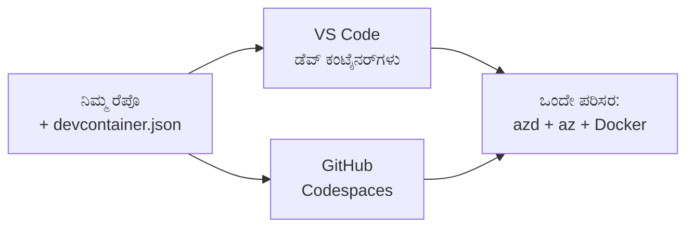

# azdಗಾಗಿ Dev Containers & GitHub Codespaces

**ಅಧ್ಯಾಯ ಮಾರ್ಗದರ್ಶನ:**
- **📚 Course Home**: [AZD ಆರಂಭಿಕರಿಗಾಗಿ](../../README.md)
- **📖 Current Chapter**: ಅಧ್ಯಾಯ 1 - ಮೂಲ ಮತ್ತು ತ್ವರಿತ ಪ್ರಾರಂಭ
- **⬅️ Previous**: [ನಿಮ್ಮ ಸ್ವಂತ ಅಪ್ಲಿಕೇಶನ್](bring-your-own-app.md)
- **🚀 Next Chapter**: [ಅಧ್ಯಾಯ 2: AI-ಪ್ರಥಮ ಅಭಿವೃದ್ಧಿ](../chapter-02-ai-development/README.md)

> ಜೂನ್ 2026 ರಲ್ಲಿ `azd 1.25.6` ವಿರುದ್ಧ ಪರಿಶೀಲಿಸಲಾಗಿದೆ.

## ಪರಿಚಯ

ಪ್ರತಿಯೊಂದು ಯಂತ್ರದಲ್ಲಿ azd, ಸರಿಯಾದ ಭಾಷಾ ರಂಟೈಮ್, Docker, ಮತ್ತು Azure CLI ಅನ್ನು ಸ್ಥಾಪಿಸುವುದು ಕಷ್ಟಕರವಾಗಿದೆ—ಮತ್ತು "ನನ್ನ ಯಂತ್ರದಲ್ಲಿ ಕೆಲಸ ಮಾಡಿತು" ಎನ್ನುವ ಟ್ಯುಟೋರಿಯಲ್ ಮತ್ತೊಬ್ಬರಿಗೆ ಕೆಲಸ ಮಾಡದಿರುವ ಸರ್ವೋತ್ತರ ಕಾರಣವೂ ಇದಾಗಿರಬಹುದು. ಒಂದು **dev container** ನಿಮ್ಮ ಸಂಪೂರ್ಣ ಟೂಲ್ಚೇನ್ ಅನ್ನು ಫೈಲ್‌ನಲ್ಲಿ ವರ್ಣಿಸುವ ಮೂಲಕ ಇದನ್ನು ಪರಿಹರಿಸುತ್ತದೆ. ಯಾರು ಪ್ರಾಜೆಕ್ಟ್ ಅನ್ನು VS Code ಅಥವಾ GitHub Codespaces ನಲ್ಲಿ ತೆರೆಯುತ್ತಾರೋ ಅವರೆಲ್ಲರೂ ಅದೆಷ್ಟೇ ವಾತಾವರಣವನ್ನು ಪಡೆಯುತ್ತಾರೆ, azd ಈಗಿನಿಂದಲೇ ಇನ್‌ಸ್ಟಾಲ್ ಆಗಿರುತ್ತದೆ. ಈ ಪಾಠವು ಅದನ್ನು ಹೇಗೆ ಸೇರಿಸಬೇಕು ಎಂದು ತೋರಿಸುತ್ತದೆ.

## ಕಲಿಯುವ ಗುರಿಗಳು

ಈ ಪಾಠದ ಅಂತ್ಯದೊಳಗೆ, ನೀವು:
- dev container ಎಂದರೆ ಏನು ಮತ್ತು ಅದು azd ಗೆ ಏಕೆ ಸಹಾಯ ಮಾಡುತ್ತದೆ ಎಂಬುದನ್ನು ಅರ್ಥಮಾಡಿಕೊಳ್ಳುವುದು
- ಪ್ರಾಜೆಕ್ಟ್‌ಗೆ ಕನಿಷ್ಟ `.devcontainer/devcontainer.json` ಅನ್ನು ಸೇರಿಸುವುದು
- Dev Container *features* ಮೂಲಕ azd, Azure CLI ಮತ್ತು Docker ಅನ್ನು ಸೇರಿಸುವುದು
- ಪ್ರಾಜೆಕ್ಟ್ ಅನ್ನು GitHub Codespaces ಅಥವಾ VS Code ನಲ್ಲಿ ತೆರೆಯುವುದು

## ಕಲಿಕೆಯ ಫಲಿತಾಂಶಗಳು

ಈ ಪಾಠವನ್ನು ಪೂರ್ಣಗೊಳಿಸಿದ ನಂತರ, ನೀವು ಸಾಮರ್ಥ್ಯ ಹೊಂದಿರುತ್ತೀರಿ:
- azd ಪ್ರಾಜೆಕ್ಟ್‌ಗೆ `devcontainer.json` ರಚಿಸಲು
- ಮ್ಯಾನುಯಲ್ ಇನ್‌ಸ್ಟಾಲ್‌ಗಳಿಲ್ಲದೆ azd ಮತ್ತು Azure ನಿಯಂತ್ರಣೋಪಕರಣಗಳನ್ನು ಸೇರಿಸಲು
- ಕಂಟೈನರ್ ಅಥವಾ Codespace ಒಳಗೆಂದಿನಿಂದ `azd up` ಚಾಲನೆ ಮಾಡಲು

---

## ಡೆವ್ ಕಂಟೈನರ್ ಎಂದರೆ ಏನು?

Dev container ಎಂಬುದು ನಿಮ್ಮ ರೆಪೋಸಿಟರিটিরಲ್ಲಿ ಇರುವ `.devcontainer/devcontainer.json` ಫೈಲ್ ಮೂಲಕ ವ್ಯಾಖ್ಯಾನಿಸಲಾದ Docker ಆಧಾರಿತ ಅಭಿವೃದ್ಧಿ ವಾತಾವರಣವಾಗಿದೆ. ನೀವು ಪ್ರಾಜೆಕ್ಟ್ ತೆರೆಯುವಾಗ:

- **VS Code** (Dev Containers ವಿಸ್ತರಣೆೊಂದಿಗೆ) ಕಂಟೈನರ್ ಅನ್ನು ನಿರ್ಮಿಸಿ ಅದಕ್ಕೆ ಅಟಾಚ್ ಮಾಡುತ್ತದೆ.
- **GitHub Codespaces** ಅದೇ ಕಂಟೈನರ್ ಅನ್ನು ಕ್ಲೌಡ್‌ನಲ್ಲಿ ನಿರ್ಮಿಸಿ ಬ್ರೌಸರ್ ಆಧಾರಿತ ಸಂಪಾದಕವನ್ನು ನೀಡುತ್ತದೆ.

ಯಾವುದೇ ರೀತಿಯಲ್ಲಿ, ಪ್ರತಿಯೊಬ್ಬ ಸಹಭಾಗಿಯಿಗೂ ಸಮಾನ ಉಪಕರಣಗಳು ಲಭಿಸುತ್ತವೆ—'ನೀವು azd ಅನ್ನು ಇನ್‌ಸ್ಟಾಲ್ ಮಾಡಿದ್ದಾರೆವಲ್ಲದೇ?' ಎಂಬ ತಿದ್ದಾಟದ ಅಗತ್ಯವಿಲ್ಲ.



---

## ಹಂತ 1: devcontainer ಫೈಲ್ ರಚನೆ ಮಾಡಿ

ನಿಮ್ಮ ಪ್ರಾಜೆಕ್ಟ್‌ನ ರೂಟ್‌ನಲ್ಲಿ `.devcontainer/devcontainer.json` ರಚಿಸಿ:

```json
{
  "name": "azd-project",
  "image": "mcr.microsoft.com/devcontainers/base:bookworm",
  "features": {
    "ghcr.io/devcontainers/features/azure-cli:1": {},
    "ghcr.io/azure/azure-dev/azd:latest": {},
    "ghcr.io/devcontainers/features/docker-in-docker:2": {},
    "ghcr.io/devcontainers/features/node:1": {}
  },
  "customizations": {
    "vscode": {
      "extensions": [
        "ms-azuretools.azure-dev",
        "ms-azuretools.vscode-bicep"
      ]
    }
  },
  "forwardPorts": [3000],
  "postCreateCommand": "azd version"
}
```

What each part does:

| ಕೀ | ಉದ್ದೇಶ |
|-----|---------|
| `image` | ಕಂಟೈನರ್‌ಗಾಗಿ ಮೂಲ OS |
| `features` | предварительно-ನಿರ್ಮಿತ ಇನ್‌ಸ್ಟಾಲರ್‌ಗಳು — ಇಲ್ಲಿ: Azure CLI, **azd**, Docker ಮತ್ತು Node.js |
| `customizations.vscode.extensions` | azd ಮತ್ತು Bicep VS Code ವಿಸ್ತರಣೆಗಳನ್ನು ಸ್ವಯಂ-ಇನ್‌ಸ್ಟಾಲ್ ಮಾಡುತ್ತದೆ |
| `forwardPorts` | ನಿಮ್ಮ ಅಪ್ಲಿಕೇಶನ್‌ನ ಪೋರ್ಟ್ ಅನ್ನು ನಿಮ್ಮ ಬ್ರೌಸರ್‌ಗೆ ಎಕ್ಸ್ಪೋಸ್ ಮಾಡುತ್ತದೆ |
| `postCreateCommand` | ಕಂಟೈನರ್ ನಿರ್ಮಿಸಿದ ನಂತರ ಒಂದು ಬಾರಿ ಚಲಿಸುವುದು (ಇಲ್ಲಿ, ಒಂದು ಸಾಮಾನ್ಯ ಪರಿಶೀಲನೆ) |

> The `ghcr.io/azure/azure-dev/azd:latest` feature is the official way to get azd in a container. Pin a specific version (for example `azd:1.25.6`) if you need reproducibility.

---

## ಹಂತ 2: ನಿಮ್ಮ ಅಪ್ಲಿಕೇಶನ್ ಭಾಷೆಗೆ ಫೀಚರ್ ಅನ್ನು ಹೊಂದಿಸಿ

ನಿಮ್ಮ ಅಪ್ಲಿಕೇಶನ್ ಬಳಸುವ ಯಾವುದಾದರೂ ಭಾಷೆಗೆ `node` ಫೀಚರ್ ಅನ್ನು ಬದಲಾಯಿಸಿ:

```jsonc
// Python project
"ghcr.io/devcontainers/features/python:1": {},

// .NET project
"ghcr.io/devcontainers/features/dotnet:2": {},

// Java project
"ghcr.io/devcontainers/features/java:1": {},

// Go project
"ghcr.io/devcontainers/features/go:1": {}
```

Keep `docker-in-docker` if your `host` is `containerapp`, `aks`, or anything that builds a container image—azd needs Docker to build and push images.

---

## ಹಂತ 3: ಅದನ್ನು ತೆರೆಯಿರಿ

**VS Code ನಲ್ಲಿ:**
1. **Dev Containers** ವಿಸ್ತರಣೆಯನ್ನು ಇನ್‌ಸ್ಟಾಲ್ ಮಾಡಿ.
2. ಪ್ರಾಜೆಕ್ಟ್ ಫೋಲ್ಡರ್ ಅನ್ನು ತೆರೆವಿರಿ.
3. ಪ್ರಾಂಪ್ಟ್ ಬಂದಾಗ **Reopen in Container** ಕ್ಲಿಕ್ ಮಾಡಿ (ಅಥವಾ *Dev Containers: Reopen in Container* ಅನ್ನು ಚಾಲನೆ ಮಾಡಿ).

**GitHub Codespaces ನಲ್ಲಿ:**
1. ರೆಪೋವನ್ನು GitHub ಗೆ ಪುಶ್ ಮಾಡಿ.
2. **Code → Codespaces → Create codespace on main** ಕ್ಲಿಕ್ ಮಾಡಿ.
3. ಕಂಟೈನರ್ ನಿರ್ಮಿಸುವವರೆಗೆ ಕಾಯಿರಿ—ಟರ್ಮಿನಲ್‌ನಲ್ಲಿ azd ಸಿದ್ಧವಾಗಿದೆ.

---

## ಹಂತ 4: ಕಂಟೈನರ್ ಒಳಗಿಂದ ನಿಯೋಜಿಸಿ

ಕಂಟೈನರ್‌ನಲ್ಲಿ azd ಪೂರ್ವಸ್ಥಾಪಿತವಾಗಿದೆ, ಆದ್ದರಿಂದ ಸಾಮಾನ್ಯ ಕಾರ್ಯಪ್ರವಾಹ ಸರಿಯಾಗಿ ಕೆಲಸ ಮಾಡುತ್ತದೆ:

```bash
azd auth login --use-device-code   # Codespaces ಒಳಗೆ ಡಿವೈಸ್ ಕೋಡ್ ಉಪಯುಕ್ತವಾಗಿದೆ
azd up
```

> **ಏಕೆ `--use-device-code`?** ರಿಮೋಟ್ ಕಂಟೈನರ್ ಅಥವಾ Codespace ನಲ್ಲಿ ಸ್ಥಳೀಯ ಬ್ರೌಸರ್‌ ಅನ್ನು ರೀಡೈರೆಕ್ಟ್ ಮಾಡಲು ಇರುವುದಿಲ್ಲ, ಆದ್ದರಿಂದ ಡಿವೈಸ್-ಕೋಡ್ ಲಾಗಿನ್ ವಿಶ್ವಾಸಾರ್ಹ ಮಾರ್ಗವಾಗಿದೆ. ಸೈನ್-ಇನ್ ಪೂರ್ಣಗೊಳಿಸಲು ನೀವು ಬ್ರೌಸರ್ ಟ್ಯಾಬ್‌ಗೆ ಕೋಡ್ ಅನ್ನು ಪೇಸ್ಟ್ ಮಾಡಲಿರುತ್ತೀರಿ.

---

## ಸಾಮಾನ್ಯ ದೋಷಗಳು

| ಸವಾಲು | ಪರಿಹಾರ |
|---------|-----|
| `azd up` ಇಮೇಜ್ ಅನ್ನು ನಿರ್ಮಿಸಲು ಸಾಧ್ಯವಿಲ್ಲ | `docker-in-docker` ಫೀಚರ್ ಅನ್ನು ಸೇರಿಸಿ |
| Codespaces ನಲ್ಲಿ ಬ್ರೌಸರ್ ಲಾಗಿನ್ ಅಡಗುತ್ತದೆ | `azd auth login --use-device-code` ಬಳಸಿ |
| ಉಪಕರಣಗಳು ತಂಡದ ಸದಸ್ಯರ ನಡುವೆ ವಿಭಿನ್ನವಾಗುತ್ತವೆ | ಫೀಚರ್ ಆವೃತ್ತಿಗಳನ್ನು ಪಿನ್ ಮಾಡಿ (ಉದಾ `azd:1.25.6`) |
| ಅಪ್ಲಿಕೇಶನ್ ಬ್ರೌಸರ್‌ನಲ್ಲಿ ಪ್ರವೇಶಿಸುವುದಿಲ್ಲ | `forwardPorts` ಗೆ ಪೋರ್ಟ್ ಅನ್ನು ಸೇರಿಸಿ |

---

## ಸಾರಾಂಶ

- ಒಂದು dev container ನಿಮ್ಮ azd ಟೂಲ್ಚೇನ್ ಅನ್ನು ಪ್ರತಿಯೊಬ್ಬರಿಗೂ ಪುನರಾವರ್ತಿಸಬಹುದಾದಂತೆ ಮಾಡುತ್ತದೆ.
- Dev Container *features* ಮೂಲಕ azd, Azure CLI, ಮತ್ತು Docker ಅನ್ನು ಸೇರಿಸಿ.
- ನಿಮ್ಮ ಅಪ್ಲಿಕೇಶನ್‍ನ ಭಾಷಾ ಫೀಚರ್ ಅನ್ನು ಹೊಂದಿಸಿ ಮತ್ತು ಕಂಟೈನರ್ ಹೋಸ್ಟ್‌ಗಳಿಗೆ `docker-in-docker` ಅನ್ನು ಉಳಿಸಿಕೊಳ್ಳಿ.
- Codespaces ಒಳಗೆ ಚಾಲನೆಯಲ್ಲಿರುವಾಗ ಡಿವೈಸ್-ಕೋಡ್ ಲಾಗಿನ್ ಬಳಸಿ.

---

## 🔗 ನಾವಿಗೇಶನ್

| ದಿಕ್ಕು | ಸಂಪನ್ಮೂಲ |
|-----------|----------|
| **ಹಿಂದಿನದು** | [ನಿಮ್ಮ ಸ್ವಂತ ಅಪ್ಲಿಕೇಶನ್](bring-your-own-app.md) |
| **ಅಧ್ಯಾಯ ಮನೆ** | [ಅಧ್ಯಾಯ 1: ಮೂಲ ಮತ್ತು ತ್ವರಿತ ಪ್ರಾರಂಭ](README.md) |
| **ಮುಂದಿನ ಅಧ್ಯಾಯ** | [ಅಧ್ಯಾಯ 2: AI-ಪ್ರಥಮ ಅಭಿವೃದ್ಧಿ](../chapter-02-ai-development/README.md) |

## 📖 ಸಂಬಂಧಿತ ಸಂಪನ್ಮೂಲಗಳು

- [ಸ್ಥಾಪನೆ ಮತ್ತು ಸೆಟ್‌ಅಪ್](installation.md)
- [ಕಮಾಂಡ್ ಚೀಟ್ ಶೀಟ್](../../resources/cheat-sheet.md)
- [ಅಧಿಕೃತ Dev Containers ನಿರ್ದಿಷ್ಟಿಕೆ](https://containers.dev/)
- [azd Dev Container feature](https://github.com/Azure/azure-dev/tree/main/ext/devcontainer)

---

<!-- CO-OP TRANSLATOR DISCLAIMER START -->
**ಅಸ್ವೀಕಾರ**:
ಈ ದಸ್ತಾವೇಜು AI ಅನುವಾದ ಸೇವೆ [Co-op Translator](https://github.com/Azure/co-op-translator) ಬಳಸಿ ಅನುವಾದಿಸಲಾಗಿದೆ. ನಾವು ನಿಖರತೆಯನ್ನು ಸಾಧಿಸಲು ಪ್ರಯತ್ನಿಸುತ್ತಿದ್ದರೂ, ದಯವಿಟ್ಟು ಗಮನಿಸಿ, ಸ್ವಯಂಚಾಲಿತ ಅನುವಾದಗಳಲ್ಲಿ ದೋಷಗಳು ಅಥವಾ ಅಸಡ್ಡೆಗಳು ಇರಬಹುದು. ಮೂಲ ಭಾಷೆಯಲ್ಲಿರುವ ಮೂಲ ದಸ್ತಾವೇಜು ಪ್ರಾಮಾಣಿಕ ಮೂಲವೆಂದು ಪರಿಗಣಿಸಬೇಕು. ಪ್ರಮುಖ ಮಾಹಿತಿಗಾಗಿ, ವೃತ್ತಿಪರ ಮಾನವ ಅನುವಾದವನ್ನು ಶಿಫಾರಸು ಮಾಡಲಾಗುತ್ತದೆ. ಈ ಅನುವಾದವನ್ನು ಬಳಸುವ ಮೂಲಕ ಉಂಟಾಗುವ ಯಾವುದೇ ತಪ್ಪು ಅರ್ಥಗಳ ಅಥವಾ ತಪ್ಪು ವ್ಯಾಖ್ಯಾನಗಳ ಬಗ್ಗೆ ನಾವು ಹೊಣೆಗಾರರಲ್ಲ.
<!-- CO-OP TRANSLATOR DISCLAIMER END -->