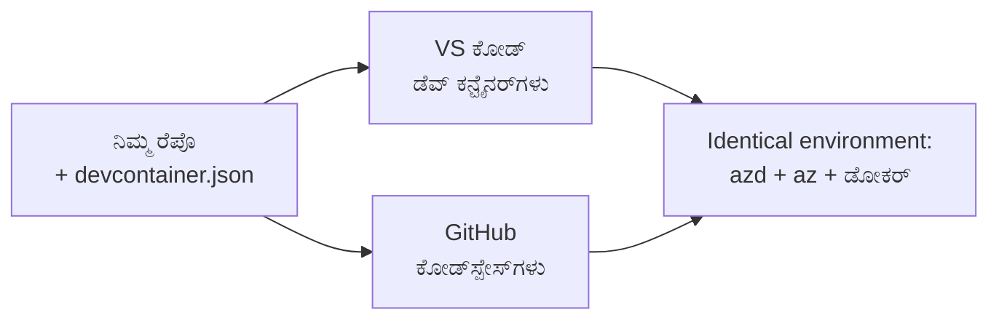

# azd ಗಾಗಿ ಡೆವ್ ಕಂಟೇನರ್‌ಗಳು ಮತ್ತು GitHub Codespaces

**ಅಧ್ಯಾಯ ನಾವಿಗೇಶನ್:**
- **📚 ಕೋರ್ಸ್ ಹೋಮ್**: [AZD ಆರಂಭಿಕರಿಗೆ](../../README.md)
- **📖 ಪ್ರಸ್ತುತ ಅಧ್ಯಾಯ**: ಅಧ್ಯಾಯ 1 - ಮೂಲ ಮತ್ತು ಶೀಘ್ರ ಪ್ರಾರಂಭ
- **⬅️ ಹಿಂದಿನದು**: [ನಿಮ್ಮ ಸ್ವಂತ ಅಪ್ಲಿಕೇಶನ್ ತಂದಿರಿ](bring-your-own-app.md)
- **🚀 ಮುಂದಿನ ಅಧ್ಯಾಯ**: [ಅಧ್ಯಾಯ 2: AI-ಮೊದಲು ಅಭಿವೃದ್ಧಿ](../chapter-02-ai-development/README.md)

> ಜುಲೈ 2026 ರಲ್ಲಿ `azd 1.27.1` ವಿರುದ್ಧ ಮಾನ್ಯತೆಯಾಗಿದೆ.

## ಪರಿಚಯ

ಪ್ರತಿ ಯಂತ್ರದಲ್ಲಿ azd, ಸರಿಯಾದ ಭಾಷಾ ರನ್‌ಟೈಮ್, ಡೋಕರ್ ಮತ್ತು ಅಜುರ್ CLI ಅನ್ನು ಸ್ಥಾಪಿಸುವುದು ಕಷ್ಟಕಾರಿಯಾಗಿದ್ದು — "ನನ್ನ ಯಂತ್ರದಲ್ಲಿ ಕಾರ್ಯನಿರ್ವಹಿಸುತ್ತದೆ" ಎಂಬ ಟುಟೋರಿಯಲ್ ಮತ್ತೊಬ್ಬರಿಗಾಗಿಯೂ ಕಾರ್ಯನಿರ್ವಾಹವಾಗದೆ ಇಲ್ವಾದ್ದಕ್ಕೆ ಇದು ಮುಖ್ಯ ಕಾರಣವಾಗಿದೆ. ಒಂದು **ಡೆವ್ ಕಂಟೇನರ್** ನಿಮ್ಮ ಸಂಪೂರ್ಣ ಟೂಲ್‌ಚೈನ್ ಅನ್ನು ಒಂದು ಫೈಲ್‌ನಲ್ಲಿ ವಿವರಿಸುವ ಮೂಲಕ ಇದನ್ನು ಪರಿಹರಿಸುತ್ತದೆ. ಯಾರು ಪ್ರಾಜೆಕ್ಟ್ ಅನ್ನು VS ಕೋಡ್ ಅಥವಾ GitHub Codespaces ನಲ್ಲಿ ತೆರೆಯುತ್ತಾರೆ ಅವರು ಸಮನಾದ ಪರಿಸರವನ್ನು ಪಡೆಯುತ್ತಾರೆ, ಅಲ್ಲಿ azd ಕೂಡ ಸುಸ್ಥಾಪಿತವಾಗಿರುತ್ತದೆ. ಈ ಪಾಠವು ಅದರಿಂದ ಒಂದು ಸೇರಿಸುವ ವಿಧಾನವನ್ನು ತೋರಿಸುತ್ತದೆ.

## ಕಲಿಕೆ ಗುರಿಗಳು

ಈ ಪಾಠದ ಕೊನೆಯಲ್ಲಿ ನೀವು:
- ಡೆವ್ ಕಂಟೇನರ್ ಎಂದರೇನು ಮತ್ತು azd ಜೊತೆಗೆ ಇದು ಹೇಗೆ ಸಹಾಯಮಾಡುತ್ತದೆ ಎಂದು ಅರ್ಥಮಾಡಿಕೊಳ್ಳಲಿದ್ದೀರಿ
- ಒಂದು ಕನಿಷ್ಠ `.devcontainer/devcontainer.json` ಅನ್ನು ಪ್ರಾಜೆಕ್ಟ್‌ಗೆ ಸೇರಿಸಲಿದ್ದೀರಿ
- ಡೆವ್ ಕಂಟೇನರ್ *ವೈಶಿಷ್ಟ್ಯಗಳು* ಮುಖಾಂತರ azd, ಅಜುರ್ CLI ಮತ್ತು ಡೋಕರ್ ಅನ್ನು ಸೇರಿಸಲಿದ್ದೀರಿ
- ಪ್ರಾಜೆಕ್ಟ್ ಅನ್ನು GitHub Codespaces ಅಥವಾ VS ಕೋಡ್‌ನಲ್ಲಿ ತೆರೆಯಲಿದ್ದೀರಿ

## ಕಲಿಕೆ ಫಲಿತಾಂಶಗಳು

ಈ ಪಾಠವನ್ನು ಪೂರ್ಣಗೊಳ್ಳಿಸಿದ ನಂತರ ನೀವು:
- azd ಪ್ರಾಜೆಕ್ಟ್‌ಗೆ `devcontainer.json` ರಚನೆಯನ್ನು ಬರೆಯಲು ಸಾಧ್ಯವಾಗುತ್ತದೆ
- ಕೈಯಿಂದ ಸ್ಥಾಪನೆಗಳಿಲ್ಲದೆ azd ಮತ್ತು ಅಜುರ್ ಉಪಕರಣಗಳನ್ನು ಸೇರಿಸಲು ಸಾಧ್ಯ
- ಒಂದು ಕಂಟೇನರ್ ಅಥವಾ ಕೋಡ್ಸ್ಪೇಸ್‌ನ ಒಳಗಿನಿಂದ `azd up` ಅನ್ನು ಚಾಲನೆ ಮಾಡಬಲ್ಲಿರಿ

---

## ಡೆವ್ ಕಂಟೇನರ್ ಎಂದರೇನು?

ಡೆವ್ ಕಂಟೇನರ್ ಎಂದರೆ ನಿಮ್ಮ ರೆಪೊಸಿಟರಿಯಲ್ಲಿರುವ `.devcontainer/devcontainer.json` ಫೈಲ್ ಮೂಲಕ ವ್ಯಾಖ್ಯಾನಿಸಲಾದ ಡೋಕರ್ ಆಧಾರಿತ ಅಭಿವೃದ್ಧಿ ಪರಿಸರವಾಗಿದೆ. ನೀವು ಪ್ರಾಜೆಕ್ಟ್ ತೆರೆಯುವಾಗ:

- **VS ಕೋಡ್** (ಡೇವ್ ಕಂಟೇನರ್ಸ್ ವಿಸ್ತರಣೆ ಜೊತೆಗೆ) ಕಂಟೇನರ್ ಅನ್ನು ನಿರ್ಮಿಸಿ ಅದರೊಂದಿಗೆ ಲಗತ್ತಿಸುತ್ತದೆ.
- **GitHub Codespaces** ಮೋಘದಲ್ಲಿ ಅದೇ ಕಂಟೇನರ್ ಅನ್ನು ನಿರ್ಮಿಸಿ ಬ್ರೌಸರ್ ಆಧಾರಿತ ಸಂಪಾದಕವನ್ನು ನೀಡುತ್ತದೆ.

ಯಾವಾಗಲೂ, ಪ್ರತಿ ಸಹಕಾರಿಗೆ ಸರಿ ಹೊಂದುವ ಉಪಕರಣಗಳು ಲಭ್ಯವಿರುತ್ತವೆ — "ನೀವು azd ಸ್ಥಾಪಿಸಿದ್ದೀರಾ?" ಎಂದು ಸಮಸ್ಯೆ ಪರಿಹಾರ ಇಲ್ಲ.



---

## ಹಂತ 1: devcontainer ಫೈಲ್ ರಚಿಸಿ

ನಿಮ್ಮ ಪ್ರಾಜೆಕ್ಟ್ ರುಟ್‌ನಲ್ಲಿ `.devcontainer/devcontainer.json` ಅನ್ನು ರಚಿಸಿ:

```json
{
  "name": "azd-project",
  "image": "mcr.microsoft.com/devcontainers/base:bookworm",
  "features": {
    "ghcr.io/devcontainers/features/azure-cli:1": {},
    "ghcr.io/azure/azure-dev/azd:latest": {},
    "ghcr.io/devcontainers/features/docker-in-docker:2": {},
    "ghcr.io/devcontainers/features/node:1": {}
  },
  "customizations": {
    "vscode": {
      "extensions": [
        "ms-azuretools.azure-dev",
        "ms-azuretools.vscode-bicep"
      ]
    }
  },
  "forwardPorts": [3000],
  "postCreateCommand": "azd version"
}
```

ಪ್ರತಿ ಭಾಗ ಏನು ಮಾಡುತ್ತದೆ:

| ಕೀ | ಉದ್ದೇಶ |
|-----|---------|
| `image` | ಕಂಟೇನರ್‌ನ ಆಧಾರ OS |
| `features` | ಪೂರ್ವಸಿದ್ಧ ಸ್ಥಾಪಕರು — ಇಲ್ಲಿ: ಅಜುರ್ CLI, **azd**, ಡೋಕರ್ ಮತ್ತು Node.js |
| `customizations.vscode.extensions` | azd ಮತ್ತು Bicep VS ಕೋಡ್ ವಿಸ್ತರಣೆಗಳನ್ನು ಸ್ವಯಂಚಾಲಿತವಾಗಿ ಸ್ಥಾಪಿಸುತ್ತದೆ |
| `forwardPorts` | ನಿಮ್ಮ ಅಪ್ಲಿಕೇಶನ್‌ನ ಪೋರ್ಟ್ ಅನ್ನು ಬ್ರೌಸರ್‌ಗೆ ತೆರವುಮಾಡುತ್ತದೆ |
| `postCreateCommand` | ಕಂಟೇನರ್ ನಿರ್ಮಾಣದ ನಂತರ ಒಮ್ಮೆ ಓಡುವುದು (ಇಲ್ಲಿ, ಸಾಮಾನ್ಯ ಪರಿಶೀಲನೆ) |

> `ghcr.io/azure/azure-dev/azd:latest` ವೈಶಿಷ್ಟ್ಯವು ಕಂಟೇನರ್‌ನಲ್ಲಿ azd ಪಡೆಯಲು ಅಧಿಕೃತ ಮಾರ್ಗವಾಗಿದೆ. ಪುನರಾವೃತ್ತಿಗಾಗಿ ನಿರ್ದಿಷ್ಟ ಆವೃತ್ತಿಯನ್ನು ಪಿನ್ ಮಾಡಿ (ಉದಾಹರಣೆಗೆ `azd:1.27.1`).

---

## ಹಂತ 2: ವೈಶಿಷ್ಟ್ಯವನ್ನು ನಿಮ್ಮ ಅಪ್ಲಿಕೇಶನ್‌ನ ಭಾಷೆಗೆ ಹೊಂದಿಸಿ

ನಿಮ್ಮ ಅಪ್ಲಿಕೇಶನ್ ಬಳಸುವ ಯಾವುದೇ ಭಾಷೆಗೆ `node` ವೈಶಿಷ್ಟ್ಯವನ್ನು ಬದಲಾಯಿಸಿ:

```jsonc
// Python project
"ghcr.io/devcontainers/features/python:1": {},

// .NET project
"ghcr.io/devcontainers/features/dotnet:2": {},

// Java project
"ghcr.io/devcontainers/features/java:1": {},

// Go project
"ghcr.io/devcontainers/features/go:1": {}
```

ನಿಮ್ಮ `host` `containerapp`, `aks`, ಅಥವಾ ಯಾವುದೇ ಕಂಟೇನರ್ ಚಿತ್ರ ನಿರ್ಮಿಸುವಿದ್ದರೆ `docker-in-docker` ಅನ್ನು ಇಡಿರಿ — azd ಗೆ ಡೋಕರ್ ಚಿತ್ರಗಳನ್ನು ರಚಿಸಿ ಪೋಶ್ ಮಾಡಲು ಅಗತ್ಯವಿದೆ.

---

## ಹಂತ 3: ಅದನ್ನು ತೆರೆಯಿರಿ

**VS ಕೋಡ್‌ನಲ್ಲಿ:**
1. **ಡೆವ್ ಕಂಟೇನರ್ಸ್** ವಿಸ್ತರಣೆಯನ್ನು ಸ್ಥಾಪಿಸಿ.
2. ಪ್ರಾಜೆಕ್ಟ್ ಫೋಲ್ಡರ್ ತೆರೆಯಿರಿ.
3. ಕೇಳಿದಾಗ **Reopen in Container** ಕ್ಲಿಕ್ ಮಾಡಿ (ಅಥವಾ *Dev Containers: Reopen in Container* ಅನ್ನು ಚಾಲನೆ ಮಾಡಿ).

**GitHub Codespaces ನಲ್ಲಿ:**
1. ರೆಪೋವನ್ನು GitHub ಗೆ ಪುಷ್ ಮಾಡಿ.
2. **Code → Codespaces → Create codespace on main** ಕ್ಲಿಕ್ ಮಾಡಿ.
3. ಕಂಟೇನರ್ ನಿರ್ಮಾಣಕ್ಕಾಗಿ ಕಾಯಿರಿ — ಪೂರ್ಣಗೊಂಡ ನಂತರ ಟೆರ್ಮಿನಲ್‌ನಲ್ಲಿ azd ಸಿದ್ಧವಾಗಿರುತ್ತದೆ.

---

## ಹಂತ 4: ಕಂಟೇನರ್ ಒಳಗಿಂದ ನಿಯೋಜಿಸಿ

ಕಂಟೇನರ್‌ಗೆ azd ಪೂರ್ವಸ್ಥಾಪಿತವಾಗಿದ್ದು, ಆದ್ದರಿಂದ ಸಾಮಾನ್ಯ ವರ್ಕ್‌ಫ್ಲೋ ಸರಿಯಾಗಿ ಕೆಲಸ ಮಾಡುತ್ತದೆ:

```bash
azd auth login --use-device-code   # ಸಾಧನ ಕೋಡ್ ಕೋಡ್ಸ್ಪೇಸ್ಗಳ ಒಳಗೆ ಅನುಕೂಲಕರವಾಗಿದೆ
azd up
```

> **`--use-device-code` ಯಾಕೆ?** ರಿಮೋಟ್ ಕಂಟೇನರ್ ಅಥವಾ ಕೋಡ್ಸ್ಪೇಸ್‌ನಲ್ಲಿ ಒಳಗಿನ ಬ್ರೌಸರ್ ಇಲ್ಲದ ಕಾರಣ, ಡಿವೈಸ್ ಕೋಡ್ ಲಾಗಿನ್ ವಿಶ್ವಸ್ಥ ಮಾರ್ಗವಾಗಿದೆ. ನಿಮಗೆ ಸೈನ್ ಇನ್ ಪೂರ್ಣಗೊಳಿಸಲು ಬ್ರೌಸರ್ ಟ್ಯಾಬ್‌ನಲ್ಲಿ ಕೋಡ್ ಅನ್ನು ಪೇಸ್ಟ್ ಮಾಡಬೇಕಾಗುತ್ತದೆ.

---

## ಸಾಮಾನ್ಯ ದೋಷಗಳು

| ದೋಷ | ಪರಿಹಾರ |
|---------|-----|
| `azd up` ಚಿತ್ರ ನಿರ್ಮಿಸಲು ಸಾಧ್ಯವಿಲ್ಲ | `docker-in-docker` ವೈಶಿಷ್ಟ್ಯವನ್ನು ಸೇರಿಸಿ |
| Codespaces ನಲ್ಲಿ ಬ್ರೌಸರ್ ಲಾಗಿನ್ ಅಂಟಿಕೊಳ್ಳುತ್ತದೆ | `azd auth login --use-device-code` ಬಳಸಿ |
| ತಂಡದ ಸದಸ್ಯರ ನಡುವೆ ಉಪಕರಣಗಳು ಭಿನ್ನವಾಗಿವೆ | ವೈಶಿಷ್ಟ್ಯ ಆವೃತ್ತಿಗಳನ್ನು ಪಿನ್ ಮಾಡಿ (ಹೆ.g. `azd:1.27.1`) |
| ಅಪ್ಲಿಕೇಶನ್ ಬ್ರೌಸರ್‌ನಲ್ಲಿ ಲಭ್ಯವಿಲ್ಲ | `forwardPorts` ಗೆ ಪೋರ್ಟ್ ಸೇರಿಸಿ |

---

## ಸಾರಾಂಶ

- ಡೆವ್ ಕಂಟೇನರ್ ನಿಮ್ಮ azd ಟೂಲ್‌ಚೈನ್ ಅನ್ನು ಪ್ರತಿಯೊಬ್ಬರಿಗೂ ಪುನರಾವೃತ್ತಿ ಮಾಡುವಂತೆ ಮಾಡುತ್ತದೆ.
- ಡೆವ್ ಕಂಟೇನರ್ *ವೈಶಿಷ್ಟ್ಯಗಳ* ಮೂಲಕ azd, ಅಜುರ್ CLI, ಮತ್ತು ಡೋಕರ್ ಸೇರಿಸಿ.
- ನಿಮ್ಮ ಅಪ್ಲಿಕೇಶನ್ ಭಾಷೆ ವೈಶಿಷ್ಟ್ಯವನ್ನು ಹೊಂದಿಸಿ ಮತ್ತು ಕಂಟೇನರ್ ಹೋಸ್ಟ್‌ಗಳಿಗೆ `docker-in-docker` ಅನ್ನು ಕಾಯ್ದಿರಿಸಿ.
- Codespaces ಒಳಗೆ ಕಾರ್ಯನಿರ್ವಹಿಸುವಾಗ ಡಿವೈಸ್-ಕೋಡ್ ಲಾಗಿನ್ ಬಳಸಿ.

---

## 🔗 ನಾವಿಗೇಶನ್

| ದಿಕ್ಕು | ಸಂಪನ್ಮೂಲ |
|-----------|----------|
| **ಹಿಂದಿನದು** | [ನಿಮ್ಮ ಸ್ವಂತ ಅಪ್ಲಿಕೇಶನ್ ತಂದಿರಿ](bring-your-own-app.md) |
| **ಅಧ್ಯಾಯ ಹೋಮ್** | [ಅಧ್ಯಾಯ 1: ಮೂಲ ಮತ್ತು ಶೀಘ್ರ ಪ್ರಾರಂಭ](README.md) |
| **ಮುಂದಿನ ಅಧ್ಯಾಯ** | [ಅಧ್ಯಾಯ 2: AI-ಮೊದಲು ಅಭಿವೃದ್ಧಿ](../chapter-02-ai-development/README.md) |

## 📖 ಸಂಬಂಧಪಟ್ಟ ಸಂಪನ್ಮೂಲಗಳು

- [ಸ್ಥಾಪನೆ ಮತ್ತು ಸೆಟಪ್](installation.md)
- [ಕಮಾಂಡ್ ಚೀಟ್‌ಶೀಟ್](../../resources/cheat-sheet.md)
- [ಅಧಿಕೃತ ಡೆವ್ ಕಂಟೇನರ್ಸ್ ನಿಯಮಾವಳಿ](https://containers.dev/)
- [azd ಡೆವ್ ಕಂಟೇನರ್ ವೈಶಿಷ್ಟ್ಯ](https://github.com/Azure/azure-dev/tree/main/ext/devcontainer)

---

<!-- CO-OP TRANSLATOR DISCLAIMER START -->
**ಅಸ್ವೀಕಾರ**:
ಈ ದಸ್ತಾವೇಜು AI ಅನುವಾದ ಸೇವೆ [Co-op Translator](https://github.com/Azure/co-op-translator) ಬಳಸಿ ಅನುವಾದಿಸಲಾಗಿದೆ. ನಾವು ನಿಖರತೆಯನ್ನು ಸಾಧಿಸಲು ಪ್ರಯತ್ನಿಸುತ್ತಿದ್ದರೂ, ದಯವಿಟ್ಟು ಗಮನಿಸಿ, ಸ್ವಯಂಚಾಲಿತ ಅನುವಾದಗಳಲ್ಲಿ ದೋಷಗಳು ಅಥವಾ ಅಸಡ್ಡೆಗಳು ಇರಬಹುದು. ಮೂಲ ಭಾಷೆಯಲ್ಲಿರುವ ಮೂಲ ದಸ್ತಾವೇಜು ಪ್ರಾಮಾಣಿಕ ಮೂಲವೆಂದು ಪರಿಗಣಿಸಬೇಕು. ಪ್ರಮುಖ ಮಾಹಿತಿಗಾಗಿ, ವೃತ್ತಿಪರ ಮಾನವ ಅನುವಾದವನ್ನು ಶಿಫಾರಸು ಮಾಡಲಾಗುತ್ತದೆ. ಈ ಅನುವಾದವನ್ನು ಬಳಸುವ ಮೂಲಕ ಉಂಟಾಗುವ ಯಾವುದೇ ತಪ್ಪು ಅರ್ಥಗಳ ಅಥವಾ ತಪ್ಪು ವ್ಯಾಖ್ಯಾನಗಳ ಬಗ್ಗೆ ನಾವು ಹೊಣೆಗಾರರಲ್ಲ.
<!-- CO-OP TRANSLATOR DISCLAIMER END -->