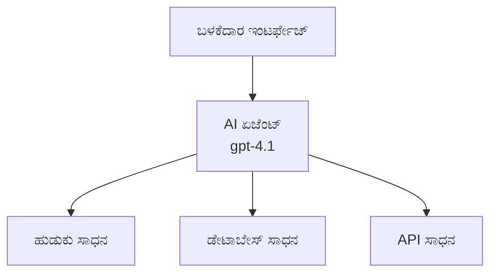
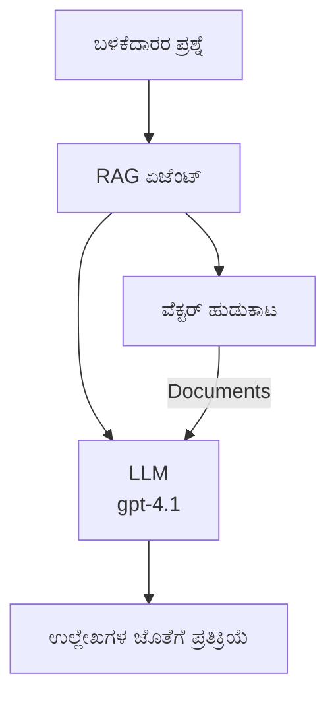
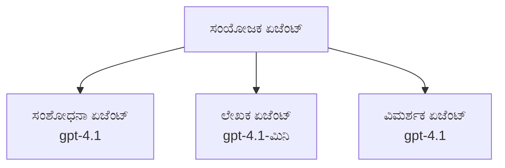

# Azure Developer CLI ಸಹಿತ AI ಏಜೆಂಟ್ಗಳು

**ಅಧ್ಯಾಯ ನ್ಯವಿಗೇಶನ್:**
- **📚 ಕೋರ್ಸ್ ಮನೆ**: [ಆಜಿಡಿ ಶ್ರುತಿ](../../README.md)
- **📖 ಪ್ರಸ್ತುತ ಅಧ್ಯಾಯ**: ಅಧ್ಯಾಯ 2 - AI-ಮುಖ್ಯ ಅಭಿವೃದ್ಧಿ
- **⬅️ ಹಿಂದಿನದು**: [Microsoft Foundry ಸಂಯೋಜನೆ](microsoft-foundry-integration.md)
- **➡️ ಮುಂದಿನದು**: [AI ಮಾದರಿ ನಿಯೋಜನೆ](ai-model-deployment.md)
- **🚀 ಉನ್ನತ**: [ಮಲ್ಟಿ-ಏಜೆಂಟ್ ಪರಿಹಾರಗಳು](../../examples/retail-scenario.md)

---

## ಪರಿಚಯ

AI ಏಜೆಂಟ್ಗಳು ಸ್ವಯಂಚಾಲಿತ ಪ್ರೋಗ್ರಾಮ್‌ಗಳು, ಅವುಗಳು ಸುತ್ತಲಿನ ಪರಿಸರವನ್ನು ಗ್ರಹಿಸಿ, ನಿರ್ಣಯಗಳನ್ನು ತೆಗೆದುಕೊಳ್ಳುತ್ತವೆ ಮತ್ತು ನಿರ್ದಿಷ್ಟ ಗುರಿಗಳನ್ನು ಸಾಧಿಸಲು ಕ್ರಮಗಳನ್ನು ಕೈಗೊಳ್ಳುತ್ತವೆ. ಸರಳ ಚಾಟ್‌ಬಾಟ್‌ಗಳ ಒಂದೇ ಪ್ರಾಂಪ್ಟ್‌ಗೆ ಪ್ರತಿಕ್ರಿಯಿಸುವುದರ ಬದಲು, ಏಜೆಂಟ್ಗಳು:

- **ಟೂಲ್ಗಳನ್ನು ಬಳಸುತ್ತವೆ** - API ಗಳು ಕರೆಮಾಡಲು, ಡೇಟಾಬೇಸ್ ಹುಡುಕಲು, ಕೋಡ್ ನಡಿಸಲು
- **ಯೋಜನೆ ಮತ್ತು ತರ್ಕ** - ಸಂಕೀರ್ಣ ಕಾರ್ಯಗಳನ್ನು ಹಂತಗಳಲ್ಲಿ ವಿಭಜಿಸಿ
- **ಪರಿಸ್ಥಿತಿಯಿಂದ ಕಲಿಯುವುದು** - ಸ್ಮೃತಿ ಇಟ್ಟುಕೊಂಡು ವರ್ತನೆ ಬದಲಾಯಿಸುವುದು
- **ಸಹಕಾರ** - ಇತರೆ ಏಜೆಂಟ್ಗಳೊಂದಿಗೆ (ಬಹು ಏಜೆಂಟ್ ವ್ಯವಸ್ಥೆಗಳು) ಕೆಲಸ ಮಾಡುತ್ತವೆ

ಈ ಮಾರ್ಗದರ್ಶಿ ಮೂಲಕ ನೀವು Azure Developer CLI (azd) ಬಳಸಿ AI ಏಜೆಂಟ್ಗಳನ್ನು Azure ಗೆ ನಿಯೋಜಿಸುವ ವಿಧಾನವನ್ನು ಕಲಿಯುತ್ತೀರಿ.

> **ತಪಾಸಣೆ ಟಿಪ್ಪಣಿ (2026-07-13):** ಈ ಮಾರ್ಗದರ್ಶಿ `azd` `1.27.1` ಮತ್ತು `azure.ai.agents` `1.0.0-beta.5` ವಿರುದ್ಧ ಪರಿಶೀಲಿಸಲಾಗಿದೆ. `azd ai` ಅನುಭವ ಇನ್ನು ಪ್ರಿವ್ಯೂ ನಿಯಂತ್ರಿತವಾಗಿದೆ, ಆದ್ದರಿಂದ ನಿಮ್ಮ ಇನ್‌ಸ್ಟಾಲ್ ಮಾಡಲಾದ ಫ್ಲಾಗ್‌ಗಳು ವಿಭಿನ್ನವಾಗಿದ್ದರೆ ವಿಸ್ತರಣೆಯ ಸಹಾಯವನ್ನು ಪರಿಶೀಲಿಸಿ.

## ಕಲಿಕೆ ಗುರಿಗಳು

ಈ ಮಾರ್ಗದರ್ಶಿಯನ್ನು ಪೂರ್ಣಗೊಳಿಸಕೆ, ನೀವು:
- AI ಏಜೆಂಟ್ಗಳು ಏನೆಂದು ತಿಳಿದುಕೊಳ್ಳುವುದು ಮತ್ತು ಅವು ಚಾಟ್‌ಬಾಟ್‌ಗಳಿಂದ ಹೇಗೆ ವಿಭಿನ್ನವೆಂದು ಅರಿಯುವುದು
- ಪೂರ್ವನಿರ್ಮಿತ AI ಏಜೆಂಟ್ ತಂಡುಗಳನ್ನು AZD ಬಳಸಿ ನಿಯೋಜಿಸುವುದು
- ಕಸ್ಟಮ್ ಏಜ್ಎಂಟ್‌ಗಳಿಗೆ Foundry ಏಜೆಂಟ್‌ಗಳನ್ನು ಸಂರಚಿಸುವುದು
- ಮೂಲಭೂತ ಏಜೆಂಟ್ ಮಾದರಿಗಳನ್ನು (ಕಂಡೂಕೊಡಲು ಸಾಧನ ಬಳಕೆ, RAG, ಬಹು-ಏಜೆಂಟ್) ಅನುಷ್ಠಾನಗೊಳಿಸುವುದು
- ನಿಯೋಜಿಸಲಾದ ಏಜೆಂಟ್‌ಗಳನ್ನು ಗಮನಿಸಿ, ದೋಷಗಳನ್ನು ಕಂಡುಹಿಡಿಯುವುದು

## ಕಲಿತ ಫಲಿತಾಂಶಗಳು

ಪೂರ್ಣಗೊಳಿಸಿದ ಮೇಲೆ, ನೀವು:
- ಒಮ್ಮೆ ಆಜ್ಞೆಯಿಂದ Azure ಗೆ AI ಏಜೆಂಟ್ ಅಪ್ಲಿಕೇಶನ್‌ಗಳನ್ನು ನಿಯೋಜಿಸಬಹುದು
- ಏಜೆಂಟ್ ಸಾಧನಗಳು ಮತ್ತು ಸಾಮರ್ಥ್ಯಗಳನ್ನು ಸಂರಚಿಸಬಹುದು
- ರಿಟ್ರೀವಲ್-ಆಗ್ಮೆಂಟೆಡ್ ಜನರೇಶನ್ (RAG) ಅನ್ನು ಏಜೆಂಟ್‌ಗಳೊಂದಿಗೆ ಅನುಷ್ಠಾನಗೊಳಿಸಬಹುದು
- ಸಂಕೀರ್ಣ ಕಾರ್ಯವಿಧಾನಗಳಿಗಾಗಿ ಬಹು-ಏಜೆಂಟ್ ವಾಸ್ತುಶಿಲ್ಪಗಳನ್ನು ವಿನ್ಯಾಸಗೊಳಿಸಬಹುದು
- ಸಾಮಾನ್ಯ ಏಜೆಂಟ್ ನಿಯೋಜನೆ ಸಮಸ್ಯೆಗಳನ್ನು ಪರಿಹರಿಸಬಹುದು

---

## 🤖 ಏಜೆಂಟ್ ನ ವಿಶೇಷತೆ ಚಾಟ್‌ಬಾಟ್ ನಿಂದ ಏನು ಬೇರೆ?

| ವೈಶಿಷ್ಟ್ಯ | ಚಾಟ್‌ಬಾಟ್ | AI ಏಜೆಂಟ್ |
|---------|---------|----------|
| **ವರ್ತನೆ** | ಪ್ರಾಂಪ್ಟ್‌ಗಳಿಗೆ ಪ್ರತಿಕ್ರಿಯಿಸುವುದು | ಸ್ವಾಯತ್ತ ಕ್ರಮಗಳನ್ನು ತೆಗೆದುಕೊಳ್ಳುವುದು |
| **ಟೂಲ್ಸ್** | ಇಲ್ಲ | API ಗಳು ಕರೆ ಮಾಡಬಹುದು, ಹುಡುಕಬಹುದು, ಕೋಡ್ ನಡಿಸಬಹುದು |
| **ಸ್ಮೃತಿ** | ಸೆಷನ್ ಆಧಾರಿತ ಮಾತ್ರ | ಸೆಷನ್ ಗಳಾದ ಮೇಲೆ ಸ್ಮೃತಿ ಇರುತ್ತದೆ |
| **ಯೋಜನೆ** | ಒಂದೇ ಪ್ರತಿಕ್ರಿಯೆ | ಬಹು ಹಂತದ ತರ್ಕ |
| **ಸಹಕಾರ** | ಒಂದೇ ಘಟಕ | ಇತರೆ ಏಜೆಂಟ್‌ಗಳೊಂದಿಗೆ ಕೆಲಸ ಮಾಡಬಹುದು |

### ಸರಳ ಹೋಲಿಕೆ

- **ಚಾಟ್‌ಬಾಟ್** = ಮಾಹಿತಿ ಡೆಸ್ಕ್ನಲ್ಲಿ ಪ್ರಶ್ನೆಗಳಿಗೆ ಉತ್ತರಿಸುವ ಸಹಾಯಕ ವ್ಯಕ್ತಿ
- **AI ಏಜೆಂಟ್** = ಕರೆಗಳನ್ನು ಮಾಡಬಹುದಾದ, ನೇಮಕಾತಿಗಳನ್ನು ಬುಕ್ ಮಾಡುವ, ಮತ್ತು ನಿಮ್ಮ ಪರ ಕಾರ್ಯಗಳನ್ನು ಪೂರ್ಣಗೊಳಿಸುವ ವೈಯಕ್ತಿಕ ಸಹಾಯಕ

---

## 🚀 ತ್ವರಿತ ಪ್ರಾರಂಭ: ನಿಮ್ಮ ಮೊದಲ ಏಜೆಂಟ್ ಅನ್ನು ನಿಯೋಜಿಸಿ

### ಆಯ್ಕೆ 1: Foundry Agents ಟೆಂಪ್ಲೇಟ್ (ಬಾವುದು)

```bash
# AI ಏಜೆಂಟ್ ಟೆಂಪ್ಲೇಟನ್ನು ಪ್ರಾರಂಭಿಸಿ
azd init --template get-started-with-ai-agents

# ಅಝೂರ್‌ಗೆ ನಿಯೋಜಿಸಿ
azd up
```

**ಯಾವುವು ನಿಯೋಜನೆ ಆಗುತ್ತದೆ:**
- ✅ Foundry Agents
- ✅ Microsoft Foundry ಮಾದರಿಗಳು (gpt-4.1)
- ✅ Azure AI Search (RAG ಗಾಗಿ)
- ✅ Azure Container Apps (ವೆಬ್ ಇಂಟರ್ಫೇಸ್)
- ✅ ಅಪ್ಲಿಕೇಶನ್ ಇನ್ಸೈಟ್ಸ್ (ನಿಗಾ)

**ಸಮಯ:** ~15-20 ನಿಮಿಷಗಳು
**ಖರ್ಚು:** ~₹8,000-12,000/ತಿಂಗಳು (ಅಭಿವೃದ್ಧಿ)

### ಆಯ್ಕೆ 2: OpenAI ಏಜೆಂಟ್ ಪ್ರಾಂಪ್ಟಿ ಮೂಲಕ

```bash
# Prompty-ಆಧಾರಿತ ಏಜೆಂಟ್ ಟೆಂಪ್ಲೇಟನ್ನು ಪ್ರಾರಂಭಿಸಿ
azd init --template agent-openai-python-prompty

# ಅಜೂರ್‌ಗೆ ನಿಯೋಜಿಸಿ
azd up
```

**ಯಾವುವು ನಿಯೋಜನೆ ಆಗುತ್ತದೆ:**
- ✅ Azure ಫಂಕ್ಷನ್ಸ್ (ಸರ್ವರ್‌ಲೆಸ್ ಏಜೆಂಟ್ ಕಾರ್ಯಾಚರಣೆ)
- ✅ Microsoft Foundry ಮಾದರಿಗಳು
- ✅ ಪ್ರಾಂಪ್ಟಿ ಕಾನ್ಫಿಗರೇಶನ್ ಫೈಲ್ಗಳು
- ✅ ಸ್ಯಾಂಪಲ್ ಏಜೆಂಟ್ ಅನುಷ್ಠಾನ

**ಸಮಯ:** ~10-15 ನಿಮಿಷಗಳು
**ಖರ್ಚು:** ~₹4,000-8,000/ತಿಂಗಳು (ಅಭಿವೃದ್ಧಿ)

### ಆಯ್ಕೆ 3: RAG ಚಾಟ್ ಏಜೆಂಟ್

```bash
# RAG ಚಾಟ್ ಟೆಂಪ್ಲೇಟನ್ನು ಪ್ರಾರಂಭಿಸಿ
azd init --template azure-search-openai-demo

# Azure ಗೆ ನಿಯೋಜಿಸಿ
azd up
```

**ಯಾವುವು ನಿಯೋಜನೆ ಆಗುತ್ತದೆ:**
- ✅ Microsoft Foundry ಮಾದರಿಗಳು
- ✅ Azure AI Search ಸಮೀಪ ದತ್ತಾಂಶದೊಂದಿಗೆ
- ✅ ಡಾಕ್ಯುಮೆಂಟ್ ಪ್ರಕ್ರಿಯೆ ಪೈಪ್‌ಲೈನ್
- ✅ ಉಲ್ಲೇಖಗಳುಳ್ಳ ಚಾಟ್ ಇಂಟರ್ಫೇಸ್

**ಸಮಯ:** ~15-25 ನಿಮಿಷಗಳು
**ಖರ್ಚು:** ~₹6,500-12,000/ತಿಂಗಳು (ಅಭಿವೃದ್ಧಿ)

### ಆಯ್ಕೆ 4: AZD AI ಏಜೆಂಟ್ ಆರಂಭ (ಮ್ಯಾನಿಫೆಸ್ಟ್- ಅಥವಾ ಟೆಂಪ್ಲೇಟ್ ಆಧಾರಿತ ಪ್ರಿವ್ಯೂ)

ನಿಮಗೆ ಏಜೆಂಟ್ ಮ್ಯಾನಿಫೆಸ್ಟ್ ಫೈಲ್ ಇದ್ದರೆ, ನೀವು `azd ai` ಆಜ್ಞೆಯನ್ನು ನೇರವಾಗಿ Foundry ಏಜೆಂಟ್ ಸೇವೆ ಪ್ರಾಜೆಕ್ಟ್ ಸ್ಕ್ಯಾಫೋಲ್ಡ್ ಮಾಡಲು ಬಳಸಿ. ಇತ್ತೀಚಿನ ಪ್ರಿವ್ಯೂ ಬಿಡುಗಡೆಗಳು ಟೆಂಪ್ಲೇಟ್ ಆಧಾರಿತ ಆರಂಭಿಕ പിന്തുണವನ್ನು ಸೇರಿಸಿದ್ದರಿಂದ, ಇನ್‌ಸ್ಟಾಲ್ ಮಾಡಲಾದ ವಿಸ್ತರಣೆಯ ಆವೃತ್ತಿಯ ಮೇಲೆ ಅವಲಂಬಿಸಿ ಪ್ರಾಂಪ್ಟ್ ಹಾದಿ ಸ್ವಲ್ಪ ವ್ಯತ್ಯಾಸವಾಗಬಹುದು.

```bash
# AI ಏಜೆಂಟ್ ಗಳ ವಿಸ್ತರಣೆಯನ್ನು ಸ್ಥಾಪಿಸಿ
azd extension install azure.ai.agents

# वैकल्पिक: ಸ್ಥಾಪಿಸಲಾದ ಪೂರ್ವದರ್ಶನ ಆವೃತ್ತಿಯನ್ನು ಪರಿಶೀಲಿಸಿ
azd extension show azure.ai.agents

# ಏಜೆಂಟ್ ಘೋಷಣಾಪತ್ರದಿಂದ ಪ್ರಾರಂಭಿಸಿ
azd ai agent init -m agent-manifest.yaml

# ಅಜೂರ್ ಗೆ ವಿನ್ಯಾಸಗೊಳಿಸಿ
azd up

# ವಿನ್ಯಾಸಗೊಳಿಸಿದ ಏಜೆಂಟ್ ಅನ್ನು ಪರೀಕ್ಷಿಸಿ (ವिलಂಬ ಮತ್ತು ಮೊದಲ ಬයිಟ್ ಸಮಯವನ್ನು ತೋರಿಸುತ್ತದೆ)
azd ai agent invoke
```

**`azd ai agent init` ಮತ್ತು `azd init --template` ಬಳಕೆಯ ಸಮಯ:**

| 접근 방식 | ಉತ್ತಮದು | ಹೇಗೆ ಕಾರ್ಯನಿರ್ವಹಿಸುತ್ತದೆ |
|----------|----------|------|
| `azd init --template` | ಕಾರ್ಯನಿರ್ವಹಿಸುವ ಮಾದರಿ ಅಪ್ಲಿಕೇಶನಿನಿಂದ ಪ್ರಾರಂಭಿಸುವುದು | ಕೋಡ್ + ಇನ್‌ಫ್ರಾ ಇದ್ದ ಪೂರ್ಣ ಟೆಂಪ್ಲೇಟ್ ರೆಪೊ ಕ್ಲೋನ್ ಮಾಡುವುದು |
| `azd ai agent init -m` | ನಿಮ್ಮ ಸ್ವಂತ ಏಜೆಂಟ್ ಮ್ಯಾನಿಫೆಸ್ಟ್ ನಿಂದ ನಿರ್ಮಾಣ | ನಿಮ್ಮ ಏಜೆಂಟ್ ವ್ಯಾಖ್ಯಾನದ ಆಧಾರದ ಮೇಲೆ ಪ್ರಾಜೆಕ್ಟ್ ರಚನೆ ಮಾಡುತ್ತದೆ |

> **ಟಿಪ್:** ಕಲಿಯುತ್ತಿರುವಾಗ `azd init --template` ಬಳಸಿ (ಮೇಲಿನ ಆಯ್ಕೆಗಳು 1-3). ನಿಮ್ಮ ಸ್ವಂತ ಮ್ಯಾನಿಫೆಸ್ಟ್ ಗಳೊಂದಿಗೆ ಉತ್ಪಾದನಾ ಏಜೆಂಟ್ ಗಳನ್ನು ನಿರ್ಮಿಸುವಾಗ `azd ai agent init` ಬಳಸಿ.

`azd up` ನಂತರ, అదే ವಿಸ್ತರಣೆ ನಿಮ್ಮನ್ನು ಏಜೆಂಟ್ ಜೀವನಚಕ್ರದ ಮುಂದಿನ ಹಂತಗಳಲ್ಲಿ ಸಹಾಯಿಸುತ್ತದೆ: ಪರೀಕ್ಷೆಗಾಗಿ `azd ai agent invoke`, ಗುಣಮಟ್ಟವನ್ನು ಅಳೆಯಲು ಮತ್ತು ಉತ್ತಮಗೊಳಿಸಲು `azd ai agent eval generate` ಮತ್ತು `azd ai agent optimize`, ಮತ್ತು resources cleaned up ಮಾಡಲು `azd ai agent delete`. ಸಂಪೂರ್ಣ ಸೂಚನೆಗಾಗಿ [AZD AI CLI ಆಜ್ಞೆಗಳು](../chapter-08-production/production-ai-practices.md#azd-ai-cli-commands-and-extensions) ನೋಡಿ.

---

## 🏗️ ಏಜೆಂಟ್ ವಾಸ್ತುಶಿಲ್ಪ ಮಾದರಿಗಳು

### ಮಾದರಿ 1: ಸಾಧನಗಳಿರುವ ಏಕ ಏಜೆಂಟ್

ಅತ್ಯಂತ ಸರಳ ಏಜೆಂಟ್ ಮಾದರಿ - ಒಂದೇ ಏಜೆಂಟ್ ಆಗಿ ಬಹು ಸಾಧನಗಳನ್ನು ಬಳಕೆ ಮಾಡುತ್ತದೆ.



**ಉತ್ತಮವಾಗಿದೆ:**
- ಗ್ರಾಹಕ ಬೆಂಬಲ ಬಾಟ್‌ಗಳು
- ಸಂಶೋಧನಾ ಸಹಾಯಕರಾಗಿರುವವರು
- ದತ್ತಾಂಶ ವಿಶ್ಲೇಷಣೆ ಏಜೆಂಟ್‌ಗಳು

**AZD ಟೆಂಪ್ಲೇಟ್:** `azure-search-openai-demo`

### ಮಾದರಿ 2: RAG ಏಜೆಂಟ್ (ರಿಟ್ರೀವಲ್-ಆಗ್ಮೆಂಟೆಡ್ ಜನರೇಶನ್)

ಪ್ರತಿಕ್ರಿಯೆಗಳನ್ನು ತಯಾರಿಸುವ ಮೊದಲು ಸಂಬಂಧಿತ ಡಾಕ್ಯುಮೆಂಟ್‌ಗಳನ್ನು ರಿಟ್ರೀವ್ ಮಾಡುವ ಏಜೆಂಟ್.



**ಉತ್ತಮವಾಗಿದೆ:**
- ಎಂಟರ್ಪ್ರೈಸ್ ಜ್ಞಾನ ಆಧಾರಿತ ಏಜೆಂಟ್‌ಗಳು
- ಡಾಕ್ಯುಮೆಂಟ್ ಪ್ರಶ್ನೋತ್ತರ ವ್ಯವಸ್ಥೆಗಳು
- ಅನುಕೂಲತೆ ಮತ್ತು ಹಕ್ಕುಪತ್ರ ಸಂಶೋಧನೆ

**AZD ಟೆಂಪ್ಲೇಟ್:** `azure-search-openai-demo`

### ಮಾದರಿ 3: ಬಹು-ಏಜೆಂಟ್ ವ್ಯವಸ್ಥೆ

ಸಂಕೀರ್ಣ ಕಾರ್ಯಗಳಿಗೆ ಒಟ್ಟಾಗಿ ಕೆಲಸ ಮಾಡುವ ಹಲವಾರು ವಿಶೇಷ ಏಜೆಂಟ್‌ಗಳು.



**ಉತ್ತಮವಾಗಿದೆ:**
- ಸಂಕೀರ್ಣ ವಿಷಯ ರಚನೆ
- ಬಹು ಹಂತದ ಕಾರ್ಯಪಥಗಳು
- ವಿಭಿನ್ನ ತಜ್ಞತೆ ಅಗತ್ಯವಿರುವ ಕಾರ್ಯಗಳು

**ಹೆಚ್ಚು ತಿಳಿಯಿರಿ:** [ಬಹು-ಏಜೆಂಟ್ ಸಂಯೋಜನಾ ಮಾದರಿಗಳು](../chapter-06-pre-deployment/coordination-patterns.md)

---

## ⚙️ ಏಜೆಂಟ್ ಸಾಧನಗಳ ಸಂರಚನೆ

ಏಜೆಂಟ್‌ಗಳು ಶಕ್ತಿಶಾಲಿಯಾಗುತ್ತವೆ ಅವರು ಸಾಧನಗಳನ್ನು ಬಳಸಲು ಸಾಮರ್ಥ್ಯದಾಗಿದ್ದಾಗ. ಇಲ್ಲಿ ಸಾಮಾನ್ಯ ಸಾಧನಗಳನ್ನು ಸಂರಚಿಸುವ ವಿಧಾನವಾಗಿದೆ:

### Foundry ಏಜೆಂಟ್‌ಗಳಲ್ಲಿ ಸಾಧನ ಸಂರಚನೆ

```python
# agent_config.py
from azure.ai.projects import AIProjectClient
from azure.ai.projects.models import FunctionTool, CodeInterpreterTool

# ಕಸ್ಟಮ್ ಉಪಕರಣಗಳನ್ನು ನಿರ್ಧರಿಸಿ
search_tool = FunctionTool(
    name="search_knowledge_base",
    description="Search the company knowledge base for relevant documents",
    parameters={
        "type": "object",
        "properties": {
            "query": {
                "type": "string",
                "description": "The search query"
            }
        },
        "required": ["query"]
    }
)

# ಉಪಕರಣಗಳೊಂದಿಗೆ ಏಜೆಂಟ್ ಅನ್ನು ರಚಿಸಿ
agent = project_client.agents.create_agent(
    model="gpt-4.1",
    name="Support Agent",
    instructions="You are a helpful support agent. Use the search tool to find relevant information.",
    tools=[search_tool, CodeInterpreterTool()]
)
```

### ಪರಿಸರ ಸಂರಚನೆ

```bash
# ಏಜೆಂಟ್-ನಿರ್ದಿಷ್ಟ ಪರಿಸರ ಚರಗಳನ್ನು ಸೆಟ್ ಮಾಡಿ
azd env set AZURE_OPENAI_MODEL "gpt-4.1"
azd env set AGENT_INSTRUCTIONS "You are a helpful assistant..."
azd env set ENABLE_CODE_INTERPRETER "true"
azd env set ENABLE_FILE_SEARCH "true"

# ನವೀಕರಿಸಿದ ಸಂರಚನೆಯೊಂದಿಗೆ ನಿಯೋಜಿಸಿ
azd deploy
```

---

## 📊 ಏಜೆಂಟ್‌ಗಳ ನಿಗಾ

### ಅಪ್ಲಿಕೇಶನ್ ಇನ್ಸೈಟ್ಸ್ ಇಂಟಿಗ್ರೇಶನ್

ಎಲ್ಲಾ AZD ಏಜೆಂಟ್ ಟೆಂಪ್ಲೇಟುಗಳು ನಿಗಾ ಹೋದಕ್ಕೆ ಅಪ್ಲಿಕೇಶನ್ ಇನ್ಸೈಟ್ಸ್ ಒಳಗೊಂಡಿವೆ:

```bash
# ವೀಕ್ಷಣೆ ಡ್ಯಾಶ್‌ಬೋರ್ಡ್ ತೆರೆಯಿರಿ
azd monitor --overview

# ಲೈವ್ ಲಾಗ್‌ಗಳನ್ನು ವೀಕ್ಷಿಸಿ
azd monitor --logs

# ಲೈವ್ ಮೀಟ್ರಿಕ್ಸ್ ವೀಕ್ಷಿಸಿ
azd monitor --live
```

### ಟ್ರ್ಯಾಕ್ ಮಾಡುವ ಪ್ರಮುಖ ಮೆಟ್ರಿಕ್‌ಗಳು

| ಮೆಟ್ರಿಕ್ | ವರ್ಣನೆ | ಗುರಿ |
|--------|-------------|--------|
| ಪ್ರತಿಕ್ರಿಯೆಯ ವಿಳಂಬ | ಪ್ರತಿಕ್ರಿಯೆ ಉಂಟಾಗುವ ಸಮಯ | < 5 ಸೆಕೆಂಡುಗಳು |
| ಟೋಕನ್ ಬಳಕೆ | ಪ್ರತಿಕ್ರಿಯೆಗೆ ಟೋಕನ್ಸ್ | ವೆಚ್ಚಗಾಗಿ ನಿಗಾ |
| ಸಾಧನ ಕರೆ ಯಶಸ್ವಿ ದರ | ಯಶಸ್ವಿಯಾದ ಸಾಧನ ಕಾರ್ಯಾಚರಣೆಗಳ % | > 95% |
| ದೋಷ ದರ | ವಿಫಲವಾದ ಏಜೆಂಟ್ ವಿನಂತಿಗಳು | < 1% |
| ಬಳಕೆದಾರ ತೃಪ್ತಿ | ಪ್ರತಿಕ್ರಿಯೆಗಳ ಅಂಕಗಳು | > 4.0/5.0 |

### ಏಜೆಂಟ್‌ಗಳಿಗೆ ಕಸ್ಟಮ್ ಲಾಗಿಂಗ್

```python
import os
from azure.monitor.opentelemetry import configure_azure_monitor
from opentelemetry import trace

# OpenTelemetry ಜೊತೆಗೆ Azure ನಿರೀಕ್ಷಣೆಯನ್ನು ರೂಪಗೊಳಿಸಿ
configure_azure_monitor(
    connection_string=os.environ["APPLICATIONINSIGHTS_CONNECTION_STRING"]
)

tracer = trace.get_tracer(__name__)

def log_agent_interaction(user_query, agent_response, tools_used, latency_ms):
    with tracer.start_as_current_span("agent_interaction") as span:
        span.set_attributes({
            "user_query": user_query,
            "response_length": len(agent_response),
            "tools_used": tools_used,
            "latency_ms": latency_ms
        })
```

> **ಟಿಪ್:** ಅಗತ್ಯ ಪ್ಯಾಕೇಜುಗಳನ್ನು ಇನ್‌ಸ್ಟಾಲ್ ಮಾಡಿ: `pip install azure-monitor-opentelemetry opentelemetry`

---

## 💰 ವೆಚ್ಚದ ಪರಿಗಣನೆಗಳು

### ಮಾದರಿಗಳ ಪ್ರಕಾರ ಮಾಸಿಕ ಅಂದಾಜು ವೆಚ್ಚಗಳು

| ಮಾದರಿ | ಅಭಿವೃದ್ಧಿ ಪರಿಸರ | ಉತ್ಪಾದನೆ |
|---------|-----------------|------------|
| ಏಕ ಏಜೆಂಟ್ | ₹4,000-8,000 | ₹16,000-40,000 |
| RAG ಏಜೆಂಟ್ | ₹6,500-12,000 | ₹24,000-64,000 |
| ಬಹು-ಏಜೆಂಟ್ (2-3 ಏಜೆಂಟ್‌ಗಳು) | ₹12,000-24,000 | ₹40,000-1,20,000 |
| ಎಂಟರ್ಪ್ರೈಸ್ ಬಹು-ಏಜೆಂಟ್ | ₹24,000-40,000 | ₹1,20,000-4,00,000+ |

### ವೆಚ್ಚ ತಗ್ಗಿಸುವ ಸಲಹೆಗಳು

1. **ಸರಳ ಕಾರ್ಯಗಳಿಗೆ gpt-4.1-mini ಬಳಸಿ**
   ```bash
   azd env set AZURE_OPENAI_MODEL "gpt-4.1-mini"
   ```

2. **ಮರುಪಡೆಯುವ ಪ್ರಶ್ನೆಗಳಿಗೆ ಕ್ಯಾಶಿಂಗ್ ಅನುಷ್ಠಾನ ಮಾಡಿ**
   ```python
   from functools import lru_cache
   
   @lru_cache(maxsize=1000)
   def get_cached_response(query_hash):
       return agent.run(query_hash)
   ```

3. **ಪ್ರತಿ ಕಾರ್ಯಾಚರಣೆಗೆ ಟೋಕನ್ ಮಿತಿ ನಿಗದಿಮಾಡಿ**
   ```python
   # ಏಜೆಂಟ್ ಓಡಿಸುವಾಗ max_completion_tokens ನ್ನು ಸೆಟ್ ಮಾಡಿರಿ, ಸೃಜನಾತ್ಮಕ ಸಮಯದಲ್ಲಿ ಅಲ್ಲ
   run = project_client.agents.create_run(
       thread_id=thread.id,
       agent_id=agent.id,
       max_completion_tokens=1000  # ಪ್ರತಿಕ್ರಿಯೆಯ ಉದ್ದವನ್ನು ಮಿತಿಪಡಿ
   )
   ```

4. **ಬಳಕೆಯಲ್ಲಿ ಇಲ್ಲದಾಗ ಶೂನ್ಯಕ್ಕೆ ಸ್ಕೇಲ್ ಮಾಡಿ**
   ```bash
   # ಕಂಟೇನರ್ ಅಪ್ಲಿಕೇಶನ್‌ಗಳು ಸ್ವಯಂಚಾಲಿತವಾಗಿ ಶೂನ್ಯಕ್ಕೆ ಪ್ರಮಾಣಿತವಾಗುತ್ತವೆ
   azd env set MIN_REPLICAS "0"
   ```

---

## 🔧 ಏಜೆಂಟ್ ಸಮಸ್ಯಾ ನಿವಾರಣೆ

### ಸಾಮಾನ್ಯ ಸಮಸ್ಯೆಗಳು ಮತ್ತು ಪರಿಹಾರಗಳು

<details>
<summary><strong>❌ ಸಾಧನ ಕರೆಗಳಿಗೆ ಏಜೆಂಟ್ ಪ್ರತಿಕ್ರಿಯಿಸುವುದಿಲ್ಲ</strong></summary>

```bash
# ಸಾಧನಗಳು ಸರಿಯಾಗಿ ನೋಂದಾಯಿತವಾಗಿದೆಯೇ ಎಂದು ಪರಿಶೀಲಿಸಿ
azd show

# OpenAI ನಿಯೋಜನೆಯನ್ನು ಪರಿಶೀಲಿಸಿ
az cognitiveservices account deployment list \
  --name $AZURE_OPENAI_NAME \
  --resource-group $RG_NAME

# ಏಜೆಂಟ್ ಲಾಗ್‌ಗಳನ್ನು ಪರಿಶೀಲಿಸಿ
azd monitor --logs
```

**ಸಾಮಾನ್ಯ ಕಾರಣಗಳು:**
- ಸಾಧನ ಕಾರ್ಯ ಸೈನ್‌ಚರ್ ಹೊಂದಿಕೆಗೆ ಫಿಟ್ ಆಗಿಲ್ಲ
- ಅಗತ್ಯ ಅನುಮತಿಗಳು ಕೊರತೆ
- API ಅಂತಿಮ ಬಿಂದುವು ಪ್ರವೇಶ ಸಿಗುತ್ತಿಲ್ಲ
</details>

<details>
<summary><strong>❌ ಏಜೆಂಟ್ ಪ್ರತಿಕ್ರಿಯೆಗಳಲ್ಲಿ ಹೆಚ್ಚು ವಿಳಂಬ</strong></summary>

```bash
# ಬಾಟಲ್ನೆಕ್ಸ್‌ಗಳಿಗಾಗಿ ಅಪ್ಲಿಕೇಶನ್ ಇನ್ಸೈಟ್ಸ್ ಪರಿಶೀಲಿಸಿ
azd monitor --live

# ವೇಗವಾದ ಮಾದರಿಯನ್ನು ಬಳಸುವ ಬಗ್ಗೆ ಪರಿಗಣಿಸಿ
azd env set AZURE_OPENAI_MODEL "gpt-4.1-mini"
azd deploy
```

**ಉತ್ತಮಗೊಳಿಸುವ ಸಲಹೆಗಳು:**
- ಸ್ಟ್ರೀಮಿಂಗ್ ಪ್ರತಿಕ್ರಿಯೆ ಬಳಸಿ
- ಪ್ರತಿಕ್ರಿಯೆ ಕ್ಯಾಶಿಂಗ್ ಅನುಷ್ಠಾನ ಮಾಡಿ
- ಕಂಟೆಕ್ಸ್ಟ್ ವಿಂಡೋ ಗಾತ್ರ ಕಡಿಮೆ ಮಾಡಿ
</details>

<details>
<summary><strong>❌ ಏಜೆಂಟ್ ತಪ್ಪು ಅಥವಾ ತಲೆಕೆಡಿಸಿದ ಮಾಹಿತಿ ನೀಡುತ್ತಿದೆ</strong></summary>

```python
# ಉತ್ತಮ ಸಿಸ್ಟಮ್ ಪ್ರಾಂಪ್ಟ್‌ಗಳ ಮೂಲಕ ಸುಧಾರಣೆ ಮಾಡಿ
instructions = """
You are a helpful assistant. IMPORTANT:
- Only answer based on provided context
- If you don't know, say "I don't know"
- Always cite your sources
- Never make up information
"""

# ನೆಲಸದೃಷ್ಟಿಗಾಗಿ ರಿಟ್ರೀವಲ್ ಸೇರಿಸಿ
agent = project_client.agents.create_agent(
    model="gpt-4.1",
    instructions=instructions,
    tools=[FileSearchTool()]  # პასუხಗಳನ್ನು ದಾಖಲೆಗಳಲ್ಲಿ ನೆಲಸಿದ್ದಂತೆ ಮಾಡಿ
)
```
</details>

<details>
<summary><strong>❌ ಟೋಕನ್ ಮಿತಿ ಮೀರಿದ ದೋಷಗಳು</strong></summary>

```python
# ಪ್ರಸಂಗ ವಿಂಡೋ ನಿರ್ವಹಣೆಯನ್ನು ಜಾರಿ ಮಾಡಿ
def truncate_context(messages, max_tokens=8000, model="gpt-4.1"):
    """Keep only recent messages within token limit."""
    import tiktoken
    encoding = tiktoken.encoding_for_model(model)
    total_tokens = 0
    truncated = []
    
    for msg in reversed(messages):
        msg_tokens = len(encoding.encode(msg.content))
        if total_tokens + msg_tokens > max_tokens:
            break
        truncated.insert(0, msg)
        total_tokens += msg_tokens
    
    return truncated
```
</details>

---

## 🎓 ಕೈಗಾರಿಕೆ ಅಭ್ಯಾಸಗಳು

### ಅಭ್ಯಾಸ 1: ಮೂಲಭೂತ ಏಜೆಂಟ್ ನಿಯೋಜನೆ (20 ನಿಮಿಷಗಳು)

**ಗುರಿ:** AZD ಬಳಸಿ ನಿಮ್ಮ ಮೊದಲ AI ಏಜೆಂಟ್ ನಿಯೋಜಿಸುವುದು

```bash
# ಹಂತ 1: ಟೆಂಪ್ಲೇಟನ್ನು ಆರಂಭಿಸಿ
azd init --template get-started-with-ai-agents

# ಹಂತ 2: ಅಜ್ಯೂರ್‌ಗೆ ಲಾಗಿನ್ ಆಗಿ
azd auth login
# ನೀವು ಬಾಡಿಗೆದಾರರ ಮಧ್ಯೆ ಕೆಲಸ ಮಾಡುವಿದ್ದರೆ, --tenant-id <tenant-id> ಸೇರಿಸಿ

# ಹಂತ 3: ನಿಯೋಜಿಸಿ
azd up

# ಹಂತ 4: ಏಜೆಂಟ್ ಅನ್ನು ಪರೀಕ್ಷಿಸಿ
# ನಿಯೋಜನೆ ನಂತರ ನಿರೀಕ್ಷಿತ ಉತ್ಪಾದನೆ:
#   ನಿಯೋಜನೆ ಮುಗಿಸಿದೆ!
#   ಮುಗಿಸಲು: https://<app-name>.<region>.azurecontainerapps.io
# ಉತ್ಪಾದನೆಯಲ್ಲಿ ತೋರಿಸಲಾದ URL ಅನ್ನು ತೆರೆಯಿಸಿ ಮತ್ತು ಪ್ರಶ್ನೆಯನ್ನು ಕೇಳಿ

# ಹಂತ 5:‌ನಿರೀಕ್ಷಣೆಯನ್ನು ವೀಕ್ಷಿಸಿ
azd monitor --overview

# ಹಂತ 6: ಸ್ವಚ್ಚಗೊಳಿಸಿ
azd down --force --purge
```

**ಯಶಸ್ಸಿನ ಮಾನದಂಡಗಳು:**
- [ ] ಏಜೆಂಟ್ ಪ್ರಶ್ನೆಗಳಿಗೆ ಪ್ರತಿಕ್ರಿಯಿಸುತ್ತದೆ
- [ ] `azd monitor` ಮೂಲಕ ನಿಗಾ ಡ್ಯಾಶ್‌ಬೋರ್ಡ್‌ ಪ್ರವೇಶಿಸಬಹುದು
- [ ] ಸಂಪನ್ಮೂಲಗಳನ್ನು ಯಶಸ್ವಿಯಾಗಿ ಸ್ವಚ್ಛಗೊಳಿಸಲಾಗಿದೆ

### ಅಭ್ಯಾಸ 2: ಕಸ್ಟಮ್ ಸಾಧನ ಸೇರಿಸಿ (30 ನಿಮಿಷಗಳು)

**ಗುರಿ:** ಒಂದು ಏಜೆಂಟ್‌ನಲ್ಲಿ ಕಸ್ಟಮ್ ಸಾಧನವನ್ನು ವಿಸ್ತರಿಸುವುದು

1. ಏಜೆಂಟ್ ಟೆಂಪ್ಲೇಟ್ ಅನ್ನು ನಿಯೋಜಿಸಿ:
   ```bash
   azd init --template get-started-with-ai-agents
   azd up
   ```
2. ನಿಮ್ಮ ಏಜೆಂಟ್ ಕೋಡ್‌ನಲ್ಲಿ ಹೊಸ ಸಾಧನ ಕಾರ್ಯಚಟುವಟಿಕೆ ಸೃಷ್ಟಿಸಿ:
   ```python
   def get_weather(location: str) -> str:
       """Get current weather for a location."""
       # ಹವಾಮಾನ ಸೇವೆಗೆ API ಕರೆ
       return f"Weather in {location}: Sunny, 72°F"
   ```
3. ಸಾಧನವನ್ನು ಏಜೆಂಟ್‌ಗೆ ನೋಂದಾಯಿಸಿ:
   ```python
   from azure.ai.projects.models import FunctionTool

   weather_tool = FunctionTool(
       name="get_weather",
       description="Get current weather for a location",
       parameters={
           "type": "object",
           "properties": {
               "location": {"type": "string", "description": "City name"}
           },
           "required": ["location"]
       }
   )

   agent = project_client.agents.create_agent(
       model="gpt-4.1",
       name="Weather Agent",
       tools=[weather_tool]
   )
   ```
4. ಮರುನಿಯೋಜಿಸಿ ಮತ್ತು ಪರೀಕ್ಷಿಸಿ:
   ```bash
   azd deploy
   # ಕೇಳಿ: "ಸೀಯಾಟಲ್‌ನ ಹವಾಮಾನ ಹೇಗಿದೆ?"
   # ನಿರೀಕ್ಷಿತ: ಏಜೆಂಟ್ get_weather("Seattle") ಅನ್ನು ಕರೆ ಮಾಡಿ ಮತ್ತು ಹವಾಮಾನ ಮಾಹಿತಿಯನ್ನು ನೀಡುತ್ತದೆ
   ```

**ಯಶಸ್ಸಿನ ಮಾನದಂಡಗಳು:**
- [ ] ಏಜೆಂಟ್ ವಾಯುವಾಯು ಸಂಬಂಧಿತ ಪ್ರಶ್ನೆಗಳನ್ನು ಗುರುತಿಸುತ್ತದೆ
- [ ] ಸಾಧನವನ್ನು ಸರಿಯಾಗಿ ಕರೆ ಮಾಡಲಾಗಿದೆ
- [ ] ಪ್ರತಿಕ್ರಿಯೆ ವಾಯುವಾಯು ಮಾಹಿತಿಯನ್ನು ಒಳಗೊಂಡಿದೆ

### ಅಭ್ಯಾಸ 3: RAG ಏಜೆಂಟ್ ನಿರ್ಮಿಸಿ (45 ನಿಮಿಷಗಳು)

**ಗುರಿ:** ನಿಮ್ಮ ಡಾಕ್ಯುಮೆಂಟ್‌ಗಳಿಂದ ಪ್ರಶ್ನೆಗಳಿಗೆ ಉತ್ತರ ನೀಡುವ ಏಜೆಂಟ್ ರಚನೆ

```bash
# ಹಂತ 1: RAG ಟೆಂಪ್ಲೇಟನ್ನು ಅನ್ನು.Rollback
azd init --template azure-search-openai-demo
azd up

# ಹಂತ 2: ನಿಮ್ಮ ದಾಖಲೆಗಳನ್ನು ಅಪ್ಲೋಡ್ ಮಾಡಿ
# PDF/TXT ಕಡತಗಳನ್ನು data/ ಡೈರೆಕ್ಟರಿಯಲ್ಲಿ ಇಡಿ, ನಂತರ ಚಲಾಯಿಸಿ:
python scripts/prepdocs.py

# ಹಂತ 3: ಡೊಮೈನ್-ನಿರ್ದಿಷ್ಟ ಪ್ರಶ್ನೆಗಳಿಂದ ಪರೀಕ್ಷಿಸಿ
# azd up output ನಿಂದ ವೆಬ್ ಆಪ್ URL ಓಪನ್ ಮಾಡಿ
# ನಿಮ್ಮ ಅಪ್ಲೋಡ್ ಮಾಡಲಾದ ದಾಖಲೆಗಳ ಬಗ್ಗೆ ಪ್ರಶ್ನೆಗಳನ್ನು ಕೇಳಿ
# ಉತ್ತರಗಳಲ್ಲಿ [doc.pdf] ಹಾಗು ಉಲ್ಲೇಖ ಸೂಚನೆಗಳು ಸೇರಿರಲು ಬೇಕಾಗಿದೆ
```

**ಯಶಸ್ಸಿನ ಮಾನದಂಡಗಳು:**
- [ ] ಏಜೆಂಟ್ ಅಪ್ಲೋಡ್ ಮಾಡಿದ ಡಾಕ್ಯುಮೆಂಟ್‌ಗಳಿಂದ ಉತ್ತರ ನೀಡುತ್ತದೆ
- [ ] ಪ್ರತಿಕ್ರಿಯೆಗಳಲ್ಲಿ ಉಲ್ಲೇಖಗಳಿವೆ
- [ ] ವ್ಯಾಪ್ತಿಗಿಂತ ಹೊರಗಿನ ಪ್ರಶ್ನೆಗಳಲ್ಲಿ ತಲೆಕೆಡಿಸುವಿಕೆ ಇಲ್ಲ

---

## 📚 ಮುಂದಿನ ಹಂತಗಳು

ಈಗ ನೀವು AI ಏಜೆಂಟ್‌ಗಳನ್ನು ಅರ್ಥಮಾಡಿಕೊಂಡಿದ್ದೀರಿ, ಈ ಉನ್ನತ ವಿಷಯಗಳನ್ನು ಅನ್ವೇಷಿಸಿ:

| ವಿಷಯ | ವಿವರಣೆ | ಲಿಂಕ್ |
|-------|-------------|------|
| **ಬಹು-ಏಜೆಂಟ್ ವ್ಯವಸ್ಥೆಗಳು** | ಸಹಕರಿಸುವ ಬಹು ಏಜೆಂಟ್ ಗಳೊಂದಿಗೆ ವ್ಯವಸ್ಥೆ ನಿರ್ಮಿಸಿ | [ರೀಟೇಲ್ ಬಹು-ಏಜೆಂಟ್ ಉದಾಹರಣೆ](../../examples/retail-scenario.md) |
| **ಸಂಯೋಜನೆ ಮಾದರಿಗಳು** | ಸಂಯೋಜನೆ ಮತ್ತು ಸಂವಹನ ಮಾದರಿಗಳನ್ನು ಕಲಿಯಿರಿ | [ಸಂಯೋಜನಾ ಮಾದರಿಗಳು](../chapter-06-pre-deployment/coordination-patterns.md) |
| **ಉತ್ಪಾದನಾ ನಿಯೋಜನೆ** | ಎಂಟರ್ಪ್ರೈಸ್-ತಯಾರಾದ ಏಜೆಂಟ್ ನಿಯೋಜನೆ | [ಉತ್ಪಾದನಾ AI ಅಭ್ಯಾಸಗಳು](../chapter-08-production/production-ai-practices.md) |
| **ಏಜೆಂಟ್ ಮೌಲ್ಯಮಾಪನ** | ಏಜೆಂಟ್ ಕಾರ್ಯಕ್ಷಮತೆಯನ್ನು ಪರೀಕ್ಷಿಸಿ ಮತ್ತು ಮೌಲ್ಯಮಾಪನ ಮಾಡಿ | [AI ಸಮಸ್ಯಾ ನಿವಾರಣೆ](../chapter-07-troubleshooting/ai-troubleshooting.md) |
| **AI ಕಾರ್ಯಾಗಾರ ಲ್ಯಾಬ್** | ಕೈಗಾರಿಕಾ ಅಭ್ಯಾಸ: ನಿಮ್ಮ AI ಪರಿಹಾರವನ್ನು AZD-ಗೆ ಸಿದ್ಧಮಾಡಿ | [AI ಕಾರ್ಯಾಗಾರ ಲ್ಯಾಬ್](ai-workshop-lab.md) |

---

## 📖 ಹೆಚ್ಚುವರಿ ಸಂಪನ್ಮೂಲಗಳು

### ಅಧಿಕೃತ ಡಾಕ್ಯುಮೆಂಟೇಶನ್
- [Microsoft Foundry Agent Service](https://learn.microsoft.com/azure/ai-services/agents/)
- [Microsoft Foundry Agent Service Quickstart](https://learn.microsoft.com/azure/ai-services/agents/quickstart)
- [Semantic Kernel Agent Framework](https://learn.microsoft.com/semantic-kernel/)

### ಏಜೆಂಟ್‌ಗಳಿಗೆ AZD ಟೆಂಪ್ಲೇಟ್‌ಗಳು
- [AI ಏಜೆಂಟ್‌ಗಳೊಂದಿಗೆ ಪ್ರಾರಂಭಿಸಿ](https://github.com/Azure-Samples/get-started-with-ai-agents)
- [Agent OpenAI Python Prompty](https://github.com/Azure-Samples/agent-openai-python-prompty)
- [Azure Search OpenAI ಡೆಮೋ](https://github.com/Azure-Samples/azure-search-openai-demo)

### ಸಮುದಾಯ ಸಂಪನ್ಮೂಲಗಳು
- [ಅದ್ಭುತ AZD - ಏಜೆಂಟ್ ಟೆಂಪ್ಲೇಟ್‌ಗಳು](https://azure.github.io/awesome-azd/?tags=ai-agents)
- [Azure AI Discord](https://discord.gg/microsoft-azure)
- [Microsoft Foundry Discord](https://discord.gg/nTYy5BXMWG)

### ನಿಮ್ಮ ಸಂಪಾದಕರಿಗೆ ಏಜೆಂಟ್ ಕೌಶಲಗಳು
- [**Microsoft Azure ಏಜೆಂಟ್ ಕೌಶಲಗಳು**](https://skills.sh/microsoft/github-copilot-for-azure) - GitHub Copilot, Cursor ಅಥವಾ ಯಾವುದೇ ಬೆಂಬಲಿತ ಏಜೆಂಟ್‌ನಲ್ಲಿ Azure ಅಭಿವೃದ್ಧಿಗಾಗಿ ಮರುಬಳಕೆ ಮಾಡಬಹುದಾದ AI ಏಜೆಂಟ್ ಕೌಶಲಗಳನ್ನು ಇನ್‌ಸ್ಟಾಲ್ ಮಾಡಿ. ಇದರಲ್ಲಿ [Azure AI](https://skills.sh/microsoft/github-copilot-for-azure/azure-ai), [Microsoft Foundry](https://skills.sh/microsoft/github-copilot-for-azure/microsoft-foundry), [ನಿಯೋಜನೆ](https://skills.sh/microsoft/github-copilot-for-azure/azure-deploy), ಮತ್ತು [ರೋಗನಿರ್ಣಯ](https://skills.sh/microsoft/github-copilot-for-azure/azure-diagnostics) ಕೌಶಲಗಳು ಸೇರಿವೆ:
  ```bash
  npx skills add microsoft/github-copilot-for-azure
  ```

---

**ನ್ಯಾವಿಗೇಶನ್**
- **ಹಿಂದಿನ ಪಾಠ**: [Microsoft Foundry ಸಂಯೋಜನೆ](microsoft-foundry-integration.md)
- **ಮುಂದಿನ ಪಾಠ**: [AI ಮಾದರಿ ನಿಯೋಜನೆ](ai-model-deployment.md)

---

<!-- CO-OP TRANSLATOR DISCLAIMER START -->
**ಅಸ್ವೀಕಾರ**:
ಈ ದಸ್ತಾವೇಜು AI ಅನುವಾದ ಸೇವೆ [Co-op Translator](https://github.com/Azure/co-op-translator) ಬಳಸಿ ಅನುವಾದಿಸಲಾಗಿದೆ. ನಾವು ನಿಖರತೆಯನ್ನು ಸಾಧಿಸಲು ಪ್ರಯತ್ನಿಸುತ್ತಿದ್ದರೂ, ದಯವಿಟ್ಟು ಗಮನಿಸಿ, ಸ್ವಯಂಚಾಲಿತ ಅನುವಾದಗಳಲ್ಲಿ ದೋಷಗಳು ಅಥವಾ ಅಸಡ್ಡೆಗಳು ಇರಬಹುದು. ಮೂಲ ಭಾಷೆಯಲ್ಲಿರುವ ಮೂಲ ದಸ್ತಾವೇಜು ಪ್ರಾಮಾಣಿಕ ಮೂಲವೆಂದು ಪರಿಗಣಿಸಬೇಕು. ಪ್ರಮುಖ ಮಾಹಿತಿಗಾಗಿ, ವೃತ್ತಿಪರ ಮಾನವ ಅನುವಾದವನ್ನು ಶಿಫಾರಸು ಮಾಡಲಾಗುತ್ತದೆ. ಈ ಅನುವಾದವನ್ನು ಬಳಸುವ ಮೂಲಕ ಉಂಟಾಗುವ ಯಾವುದೇ ತಪ್ಪು ಅರ್ಥಗಳ ಅಥವಾ ತಪ್ಪು ವ್ಯಾಖ್ಯಾನಗಳ ಬಗ್ಗೆ ನಾವು ಹೊಣೆಗಾರರಲ್ಲ.
<!-- CO-OP TRANSLATOR DISCLAIMER END -->