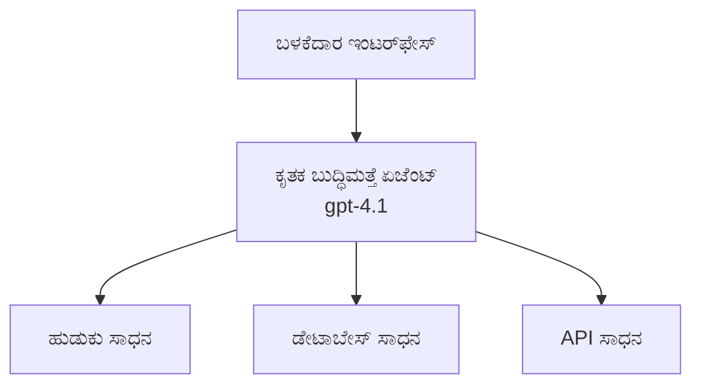
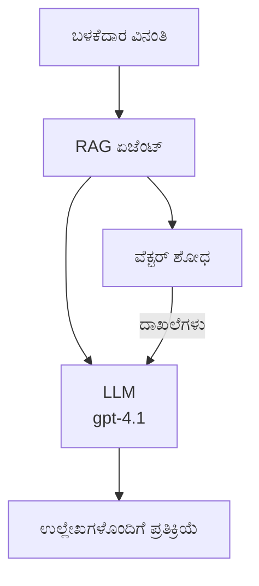
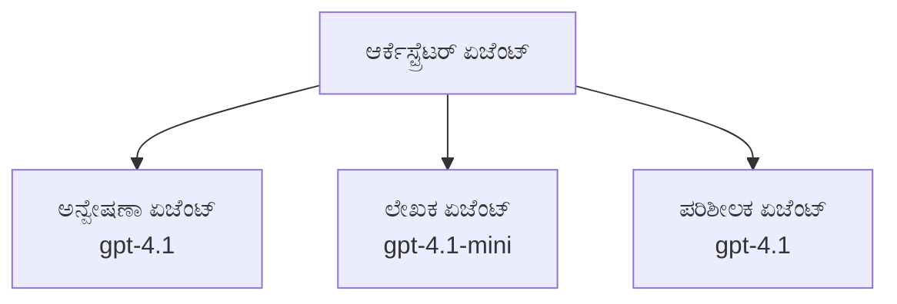

# ಏಐ ಏಜೆಂಟ್ಗಳು ಅಜೂರ್ ಡೆವಲಪರ್ CLI ಜೊತೆಗೆ

**ಅಧ್ಯಾಯ ನ್ಯಾವಿಗೇಶನ್:**
- **📚 ಕೋರ್ಸ್ ಘರವಾಸಿ**: [ಆಜೆಡ್ ಫಾರ್ ಬೆಗಿನ್ನರ್ಸ್](../../README.md)
- **📖 ಪ್ರಸ್ತುತ ಅಧ್ಯಾಯ**: ಅಧ್ಯಾಯ 2 - ಏಐ-ಪ್ರಥಮ ಅಭಿವೃದ್ಧಿ
- **⬅️ ಹಿಂದಿನದು**: [ಮೈಕ್ರೋಸಾಫ್ಟ್ ಫೌಂಡ್ರೀ ಇಂಟಿಗ್ರೇಶನ್](microsoft-foundry-integration.md)
- **➡️ ಮುಂದಿನದು**: [ಏಐ ಮಾದರಿ ನಿಯೋಜನೆ](ai-model-deployment.md)
- **🚀 ಮೇಲ್ಮಟ್ಟದ**: [ಬಹು-ಏಜೆಂಟ್ ಪರಿಹಾರಗಳು](../../examples/retail-scenario.md)

---

## ಪರಿಚಯ

ಏಐ ಏಜೆಂಟ್‌ಗಳು ಸ್ವಯಂಚಾಲಿತ ಕಾರ್ಯಕ್ರಮಗಳು, ಇವು ತಮ್ಮ ಪರಿಸರವನ್ನು ಮನಗಂಡು, ನಿರ್ಧಾರಗಳನ್ನು ತೆಗೆದು, ನಿರ್ದಿಷ್ಟ ಗುರಿಗಳನ್ನು ಸಾಧಿಸಲು ಕ್ರಮಗಳನ್ನು গ্রহণಿಸುತ್ತಾರೆ. ಸರಳ ಚಾಟ್ ಬೋಟ್ಗಳಂತೆ ಪ್ರಾಂಪ್ಟ್‌ಗಳಿಗೆ ಪ್ರತಿಕ್ರಿಯಿಸುವುದನ್ನು ಹೊರತಾಗಿ, ಏಜೆಂಟ್‌ಗಳು:

- **ಟೂಲ್‌ಗಳ ಬಳಕೆ** - APIs ಕರೆಮಾಡು, ಡೇಟಾಬೇಸ್ ಹುಡುಕು, ಕೋಡ್ ನಿರ್ವಹಣೆಗೆ
- **ತಯಾರಿ ಮತ್ತು ವಿಚಾರವಿಮರ್ಶೆ** - ಸಂಕೀರ್ಣ ಕಾರ್ಯಗಳನ್ನು ಹಂತಗಳಲ್ಲಿ ವಿಭಾಗಿಸು
- **ಸಂದರ್ಭದಿಂದ ಶಿಖರಣೆ** - ಮೆಮೊರಿ ಕಾಯ್ದುಕೊಳ್ಳು ಮತ್ತು ವರ್ತನೆ ಹೊಂದಿಸು
- **ಒಕ್ಕೂಟ ಸಹಕಾರ** - ಇತರ ಏಜೆಂಟ್‌ಗಳ ಜೊತೆ ಕೆಲಸ ಮಾಡುವದು (ಬಹು-ಏಜೆಂಟ್ ವ್ಯವಸ್ಥೆಗಳು)

ಈ ಮಾರ್ಗದರ್ಶी ನೀವು ಏಐ ಏಜೆಂಟ್‌ಗಳನ್ನು ಅಜೂರ್‌ನಲ್ಲಿ ಅಜೂರ್ ಡೆವಲಪರ್ CLI (azd) ಬಳಸಿ ಹೇಗೆ ನಿಯೋಜಿಸಬಹುದು ಎಂಬುದನ್ನು ತೋರಿಸುತ್ತದೆ.

> **ಪರಿಶೀಲನೆ ಟಿಪ್ಪಣಿ (2026-03-25):** ಈ ಮಾರ್ಗದರ್ಶಿಯನ್ನು `azd` `1.23.12` ಮತ್ತು `azure.ai.agents` `0.1.18-preview` ವಿರುದ್ಧ ಪರಿಶೀಲಿಸಲಾಗಿದೆ. `azd ai` ಅನುಭವವು ಇನ್ನೂ ಪೂರ್ವಾವಲೋಕನ ಹಂತದಲ್ಲಿದೆ, ನಿಮ್ಮ ಇನ್‌ಸ್ಟಾಲ್ ಮಾಡಲಾದ ಧ್ವಜಗಳು ವಿಭಿನ್ನವಾದರೆ ವಿಸ್ತರಣೆ ಸಹಾಯವನ್ನು ಪರಿಶೀಲಿಸಿ.

## ಕಲಿಕಾ ಗುರಿಗಳು

ಈ ಮಾರ್ಗದರ್ಶಿಯನ್ನು ಪೂರ್ಣಗೊಳಿಸುವ ಮೂಲಕ, ನೀವು:
- ಏಐ ಏಜೆಂಟ್‌ಗಳು ಏನೆಂದು ಮತ್ತು ಚಾಟ್ ಬೋಟ್ಗಳಿಂದ ಹೇಗೆ ವಿಭಿನ್ನವಾಗಿವೆ ಎಂಬುದನ್ನು ಅರ್ಥಮಾಡಿಕೊಳ್ಳುವಿರಿ
- AZD ಬಳಸಿ ಪೂರ್ವ ನಿರ್ಮಿತ ಏಜೆಂಟ್ ಟೆಂಪ್ಲೇಟ್ಗಳನ್ನು ನಿಯೋಜಿಸುವಿರಿ
- ಕಸ್ಟಮ್ ಏಜೆಂಟ್‌ಗಳಿಗೆ ಫೌಂಡ್ರೀ ಏಜೆಂಟ್‌ಗಳನ್ನು ಸಂರಚಿಸುವಿರಿ
- ಮೂಲ ಏಜೆಂಟ್ ಮಾದರಿಗಳನ್ನು ಜಾರಿಗೊಳಿಸುವಿರಿ (ಟೂಲ್ ಬಳಕೆ, RAG, ಬಹು-ಏಜೆಂಟ್)
- ನಿಯೋಜಿತ ಏಜೆಂಟ್‌ಗಳನ್ನು ಮೇಲ್ವಿಚಾರಣೆ ಮತ್ತು ಡೀಗ್ ಮಾಡುವಿರಿ

## ಕಲಿಕೆಯ ಫಲಿತಾಂಶಗಳು

ಪೂರ್ಣಗೊಳ್ಳುವ ವೇಳೆಗೆ, ನೀವು:
- ಏಐ ಏಜೆಂಟ್ ಅನ್ವಯಿಕೆಗಳನ್ನು ಅಜೂರ್‌ಗೆ ಏಕಕಮಾಂಡ್ ನೊಂದಿಗೆ ನಿಯೋಜಿಸುವುದು
- ಏಜೆಂಟ್ ಟೂಲ್‌ಗಳು ಮತ್ತು ಸಾಮರ್ಥ್ಯಗಳನ್ನು ಸಂರಚಿಸುವುದು
- Retrieval-Augmented Generation (RAG) ಅನ್ನು ಏಜೆಂಟ್‌ಗಳೊಂದಿಗೆ ಜಾರಿಗೊಳಿಸುವುದು
- ಸಂಕೀರ್ಣ ಕಾರ್ಯಸಂಪುಟಗಳಿಗಾಗಿ ಬಹು-ಏಜೆಂಟ್ ಶಿಲ್ಪವಿಧಾನಗಳನ್ನು ವಿನ್ಯಾಸಗೊಳಿಸುವುದು
- ಸಾಮಾನ್ಯ ಏಜೆಂಟ್ ನಿಯೋಜನೆ ಸಮಸ್ಯೆಗಳನ್ನು ಪತ್ತೆಹಚ್ಚಿ ಪರಿಹರಿಸುವುದು

---

## 🤖 ಏಜೆಂಟ್ ಅನ್ನು ಚಾಟ್ ಬೋಟ್ನಿಂದ ಬೇರೆ ಏನು ಮಾಡುತ್ತದೆ?

| ವೈಶಿಷ್ಟ್ಯ | ಚಾಟ್ ಬೋಟು | ಏಐ ಏಜೆಂಟ್ |
|---------|---------|----------|
| **ವರ್ತನೆ** | ಪ್ರಾಂಪ್ಟ್‌ಗಳಿಗೆ ಪ್ರತಿಕ್ರಿಯಿಸುತ್ತದೆ | ಸ್ವಯಂಚಾಲಿತ ಕ್ರಮಗಳನ್ನು ತೆಗೆದುಕೊಳ್ಳುತ್ತದೆ |
| **ಟೂಲ್ಸ್** | ಇಲ್ಲ | APIs ಕರೆಮಾಡಬಹುದು, ಹುಡುಕಬಹುದು, ಕೋಡ್ ನಿರ್ವಹಿಸಬಹುದು |
| **ಸ್ಮೃತಿ** | ಸೆಷನ್ ಆಧಾರಿತ ಮಾತ್ರ | ಸೆಷನ್‌ಗಳೆತ್ತಗಿನ ಸ್ಥಿರ ಸ್ಮೃತಿ |
| **ತಯಾರಿ** | ಏಕ ಉತ್ತರ | ಬಹು ಹಂತದ ವಿಚಾರವಿಮರ್ಶೆ |
| **ಸಹಕಾರ** | ಏಕಘಟಕ | ಇತರ ಏಜೆಂಟ್‌ಗಳೊಂದಿಗೆ ಸಹಕಾರ ಮಾಡಬಹುದು |

### ಸರಳ ಉದಾಹರಣೆ

- **ಚಾಟ್ ಬೋಟು** = ಮಾಹಿತಿ ಡೆಸ್ಕ್ ನಲ್ಲಿ ಪ್ರಶ್ನೆಗಳಿಗೆ ಉತ್ತರಿಸುವ ಸಹಾಯಕ ವ್ಯಕ್ತಿ
- **ಏಐ ಏಜೆಂಟ್** = ಕಾಲ್ ಮಾಡಬಹುದು, ಅಪಾಯಿಂಟ್‌ಮೆಂಟ್ ಬುಕ್ ಮಾಡಬಹುದು, ಮತ್ತು ನಿಮ್ಮ ಪರ ಕಾರ್ಯಗಳನ್ನು ಪೂರ್ಣಗೊಳಿಸುವ ವೈಯಕ್ತಿಕ ಸಹಾಯಕ

---

## 🚀 ವ್ಱೇಗದ ಪ್ರಾರಂಭ: ನಿಮ್ಮ ಪ್ರಥಮ ಏಜೆಂಟ್ ನಿಯೋಜಿಸಿ

### ಆಯ್ಕೆ 1: ಫೌಂಡ್ರೀ ಏಜೆಂಟ್ ಟೆಂಪ್ಲೇಟ್ (ಸರಿಅಗಿನ)

```bash
# AI ಏಜೆಂಟ್‌ಗಳಿಗೆ ಟೆಂಪ್ಲೇಟನ್ನು ಪ್ರಾರಂಭಿಸಿ
azd init --template get-started-with-ai-agents

# Azure ಗೆ ನಿಯೋಜಿಸಿ
azd up
```

**ನ್ಯೂನತಮ ನಿಯೋಜನೆ:**
- ✅ ಫೌಂಡ್ರೀ ಏಜೆಂಟ್‌ಗಳು
- ✅ ಮೈಕ್ರೋಸಾಫ್ಟ್ ಫೌಂಡ್ರೀ ಮಾದರಿಗಳು (gpt-4.1)
- ✅ ಅಜೂರ್ ಏಐ ಹುಡುಕಾಟ (RAG ಗೆ)
- ✅ ಅಜೂರ್ ಕಂಟೈನರ್ ಅಪ್ಲಿಕೇಶನ್‌ಗಳು (ವೆಬ್ ಇಂಟರ್‌ಫೇಸ್)
- ✅ ಅಪ್ಲಿಕೇಶನ್ ಇನ್ಸೈಟ್ಸ್ (ಮೇಲ್ವಿಚಾರಣೆ)

**ಸಮಯ:** ~15-20 ನಿಮಿಷಗಳು
**ಖರ್ಚು:** ~$100-150/ತಿಂಗಳು (ಅಭಿವೃದ್ಧಿ)

### ಆಯ್ಕೆ 2: Prompty ಜೊತೆ OpenAI ಏಜೆಂಟ್

```bash
# Prompty ಆಧಾರಿತ ಏಜೆಂಟ್ ಟೆಂಪ್ಲೇಟ್ ಪ್ರಾರಂಭಿಸಿ
azd init --template agent-openai-python-prompty

# ಅಜೂರ್‌ಗೆ ನಿಯೋಜಿಸಿ
azd up
```

**ನ್ಯೂನತಮ ನಿಯೋಜನೆ:**
- ✅ ಅಜೂರ್ ಫಂಕ್ಷನ್ಸ್ (ಸರ್ವರ್ ರಹಿತ ಏಜೆಂಟ್ ನಿರ್ವಹಣೆ)
- ✅ ಮೈಕ್ರೋಸಾಫ್ಟ್ ಫೌಂಡ್ರೀ ಮಾದರಿಗಳು
- ✅ Prompty ಸಂರಚನಾ ಕಡತಗಳು
- ✅ ಮಾದರಿ ಏಜೆಂಟ್ ಜಾರಿಗೊಳಿಸುವಿಕೆ

**ಸಮಯ:** ~10-15 ನಿಮಿಷಗಳು
**ಖರ್ಚು:** ~$50-100/ತಿಂಗಳು (ಅಭಿವೃದ್ಧಿ)

### ಆಯ್ಕೆ 3: RAG ಚಾಟ್ ಏಜೆಂಟ್

```bash
# RAG ಚಾಟ್ ಟೆಂಪ್ಲೇಟನ್ನು ಪ್ರಾರಂಭಿಸಿ
azd init --template azure-search-openai-demo

# ಅಜೂರ್‌ಗೆ ನಿಯೋಜಿಸಿ
azd up
```

**ನ್ಯೂನತಮ ನಿಯೋಜನೆ:**
- ✅ ಮೈಕ್ರೋಸಾಫ್ಟ್ ಫೌಂಡ್ರೀ ಮಾದರಿಗಳು
- ✅ ಮಾದರಿ ಡೇಟಾ ಜೊತೆ ಅಜೂರ್ ಏಐ ಹುಡುಕಾಟ
- ✅ ಡಾಕ್ಯುಮೆಂಟ್ ಪ್ರೊಸೆಸಿಂಗ್ ಪೈಪ್ಲೈನ್
- ✅ ಉಲ್ಲೇಖಗಳೊಂದಿಗೆ ಚಾಟ್ ಇಂಟರ್‌ಫೇಸ್

**ಸಮಯ:** ~15-25 ನಿಮಿಷಗಳು
**ಖರ್ಚು:** ~$80-150/ತಿಂಗಳು (ಅಭಿವೃದ್ಧಿ)

### ಆಯ್ಕೆ 4: AZD AI ಏಜೆಂಟ್ ಇನಿಟ್ (ಮಾನಿಫೆಸ್ಟ್ ಅಥವಾ ಟೆಂಪ್ಲೇಟ್ ಆಧಾರಿತ ಪೂರ್ವವೀಕ್ಷಣೆ)

ನಿಮಗೆ ಏಜೆಂಟ್ ಮಾನಿಫೆಸ್ಟ್ ಫೈಲ್ ಇದ್ದರೆ, ನೀವು `azd ai` ಕಮಾಂಡ್ ಬಳಸಿ ನೇರವಾಗಿ ಫೌಂಡ್ರೀ ಏಜೆಂಟ್ ಸರ್ವೀಸ್ ಪ್ರಾಜೆಕ್ಟ್ ಅನ್ನು ಸ್ಕಾಫೋಲ್ ಮಾಡಬಹುದು. ಇತ್ತೀಚಿನ ಪೂರ್ವವೀಕ್ಷಣೆ ಬಿಡುಗಡೆಗಳು ಟೆಂಪ್ಲೇಟ್ ಆಧಾರಿತ ಆರಂಭಿಕ ಬೆಂಬಲವನ್ನು ಸೇರಿಸಿದ್ದರಿಂದ, ನಿಮ್ಮ ಇನ್‌ಸ್ಟಾಲ್ ಮಾಡಲಾದ ವಿಸ್ತರಣಾ ಆವೃತ್ತಿ ಪ್ರಕಾರ ಸ್ಪಷ್ಠವಾದ ಪ್ರಾಂಪ್ಟ್ ಪ್ರಕ್ರಿಯೆಯಲ್ಲಿ ಕೆಲವು ವ್ಯತ್ಯಾಸಗಳು ಇರಬಹುದು.

```bash
# AI ಏಜೆಂಟ್‌ಗಳ ವಿಸ್ತರಣೆಯನ್ನು ಸ್ಥಾಪಿಸಿ
azd extension install azure.ai.agents

# ಐಚ್ಛಿಕ: ಸ್ಥಾಪಿತ ಪೂರ್ವावलೋಕನ ಆವೃತ್ತಿಯನ್ನು ಪರಿಶೀಲಿಸಿ
azd extension show azure.ai.agents

# ಏಜೆಂಟ್ ಮ್ಯಾನಿಫೆಸ್ಟ್‌ನಿಂದ ಪ್ರಾರಂಭಿಸಿ
azd ai agent init -m agent-manifest.yaml

# ಅಜೂರ್‌ಗೆ ನಿಯೋಜಿಸಿ
azd up
```

**ಯಾವಾಗ `azd ai agent init` ಬದಲು `azd init --template` ಬಳಸಿ:**

| ವಿಧಾನ | ಯ谁ಗೆ | ಹೇಗೆ ಕಾರ್ಯನಿರ್ವಹಿಸುತ್ತದೆ |
|----------|----------|------------|
| `azd init --template` | ಕಾರ್ಯನಿರ್ವಹಿಸುತ್ತಿರುವ ಮಾದರಿ ಅಪ್ಲಿಕೇಶನ್‌ನಿಂದ ಪ್ರಾರಂಭ | ಸಂಪೂರ್ಣ ಟೆಂಪ್ಲೇಟ್ ರೆಪೊ ಕ್ಲೋನ್ ಮಾಡುತ್ತದೆ ಕೋಡ್ + ಇನ್ಫ್ರಾಗಳೊಂದಿಗೆ |
| `azd ai agent init -m` | ನಿಮ್ಮ ಸ್ವಂತ ಏಜೆಂಟ್ ಮಾನಿಫೆಸ್ಟ್ ನಿಂದ ನಿರ್ಮಾಣ | ನಿಮ್ಮ ಏಜೆಂಟ್ ವ್ಯಾಖ್ಯಾನದಿಂದ ಪ್ರಾಜೆಕ್ಟ್ ರಚನೆ ಸ್ಕಾಫೋಲ್ ಮಾಡುತ್ತದೆ |

> **ಸೂಚನೆ:** ಕಲಿಯುತ್ತಿರುವಾಗ (ಮೇಲಿನ ಆಯ್ಕೆ 1-3) `azd init --template` ಬಳಸಿ. ನಿಮ್ಮ ಸ್ವಂತ ಮಾನಿಫೆಸ್ಟ್ ಒಂದೆಡೆ ಉತ್ಪಾದನಾ ಏಜೆಂಟ್ ಗಳನ್ನು ನಿರ್ಮಿಸುವಾಗ `azd ai agent init` ಬಳಸಿ. ಸಂಪೂರ್ಣ ಸುಧಾರಿಸಲಾಗಿ ನೋಡಲು [AZD AI CLI ಆಜ್ಞೆಗಳು](../chapter-08-production/production-ai-practices.md#azd-ai-cli-commands-and-extensions) ನೋಡಿ.

---

## 🏗️ ಏಜೆಂಟ್ ಶಿಲ್ಪವಿಧಾನಗಳು

### ಮಾದರಿ 1: ಟೂಲ್‌ಗಳೊಂದಿಗೆ ಏಕ ಏಜೆಂಟ್

ಅತಿ ಸರಳ ಏಜೆಂಟ್ ಮಾದರಿ - ಒಂದು ಏಜೆಂಟ್ ಬಹು ಟೂಲ್‌ಗಳನ್ನು ಬಳಸಬಹುದು.


**ಉತ್ತಮ:**
- ಗ್ರಾಹಕ ಬೆಂಬಲ ಬೋಟ್ಗಳು
- ಸಂಶೋಧನಾ ಸಹಾಯಕರು
- ಡೇಟಾ ವಿಶ್ಲೇಷಣಾ ಏಜೆಂಟ್‌ಗಳು

**AZD ಟೆಂಪ್ಲೇಟ್:** `azure-search-openai-demo`

### ಮಾದರಿ 2: RAG ಏಜೆಂಟ್ (ರಿಟ್ರೀವಲ್-ಆಗ್ಮೆಂಟೆಡ್ ಜನರೇಶನ್)

ಪ್ರತಿಕ್ರಿಯೆ ರಚಿಸುವ ಮೊದಲು ಪ್ರಾಸಕ್ತ ಡಾಕ್ಯುಮೆಂಟ್‌ಗಳನ್ನು ಸಂಗ್ರಹಿಸುವ ಏಜೆಂಟ್.


**ಉತ್ತಮ:**
- ಎಂಟರ್ಪ್ರೈಸ್ನು ಜ್ಞಾನ ಆಧಾರಗಳು
- ಡಾಕ್ಯುಮೆಂಟ್ ಪ್ರಶ್ನೋತ್ತರ ವ್ಯವಸ್ಥೆಗಳು
- ಅನುಕೂಲತೆ ಮತ್ತು ಕಾನೂನು ಸಂಶೋಧನೆ

**AZD ಟೆಂಪ್ಲೇಟ್:** `azure-search-openai-demo`

### ಮಾದರಿ 3: ಬಹು-ಏಜೆಂಟ್ ವ್ಯವಸ್ಥೆ

ಪರಿಶಿಷ್ಟ ಕಾರ್ಯಗಳಲ್ಲಿ ಒಟ್ಟಾಗಿ ಕೆಲಸ ಮಾಡುವ ಹಲವಾರು ವಿಶೇಷ ಏಜೆಂಟ್‌ಗಳು.


**ಉತ್ತಮ:**
- ಸಂಕೀರ್ಣ ವಿಷಯ ರಚನೆ
- ಬಹು ಹಂತದ ಕಾರ್ಯವಿಧಾನಗಳು
- ವಿಭಿನ್ನ ಪರಿಣಿತಿಗಳನ್ನು ಬೇಕಾದ ಕಾರ್ಯಗಳು

**ಹೆಚ್ಚು ತಿಳಿದುಕೊಳ್ಳಿ:** [ಬಹು-ಏಜೆಂಟ್ ಸಂಯೋಜನಾ ಮಾದರಿಗಳು](../chapter-06-pre-deployment/coordination-patterns.md)

---

## ⚙️ ಏಜೆಂಟ್ ಟೂಲ್‌ಗಳನ್ನು ಸಂರಚಿಸುವುದು

ಏಜೆಂಟ್‌ಗಳು ತುರ್ತು ಶಕ್ತಿಶಾಲಿಯಾಗುತ್ತವೆ ಅವರು ಟೂಲ್ಸ್ ಅನ್ನು ಬಳಸಬಲ್ಲಾಗ. ಸಾಮಾನ್ಯ ಟೂಲ್‌ಗಳನ್ನು ಸಂರಚಿಸುವ ವಿಧಾನ ಇಲ್ಲಿದೆ:

### ಫೌಂಡ್ರೀ ಏಜೆಂಟ್‌ಗಳಲ್ಲಿ ಟೂಲ್ ಸಂರಚನೆ

```python
# agent_config.py
from azure.ai.projects import AIProjectClient
from azure.ai.projects.models import FunctionTool, CodeInterpreterTool

# ಕಸ್ಟಮ್ ಉಪಕರಣಗಳನ್ನು ವ್ಯಾಖ್ಯಾನಿಸಿ
search_tool = FunctionTool(
    name="search_knowledge_base",
    description="Search the company knowledge base for relevant documents",
    parameters={
        "type": "object",
        "properties": {
            "query": {
                "type": "string",
                "description": "The search query"
            }
        },
        "required": ["query"]
    }
)

# ಉಪಕರಣಗಳೊಂದಿಗೆ ಏಜೆಂಟ್ ರಚಿಸಿ
agent = project_client.agents.create_agent(
    model="gpt-4.1",
    name="Support Agent",
    instructions="You are a helpful support agent. Use the search tool to find relevant information.",
    tools=[search_tool, CodeInterpreterTool()]
)
```

### ಪರಿಸರ ಸಂರಚನೆ

```bash
# ಏಜೆಂಟ್-ನಿರ್ದಿಷ್ಟ ಪರಿಸರ ಚರಗಳನ್ನು ಹೊಂದಿಸಿ
azd env set AZURE_OPENAI_MODEL "gpt-4.1"
azd env set AGENT_INSTRUCTIONS "You are a helpful assistant..."
azd env set ENABLE_CODE_INTERPRETER "true"
azd env set ENABLE_FILE_SEARCH "true"

# ಮೇಲ್ನೋಟ ಹೊಂದಿದ ರೂಪರೇಷೆಯೊಂದಿಗೆ ನಿಯೋಜಿಸಿ
azd deploy
```

---

## 📊 ಏಜೆಂಟ್‌ಗಳ ಮೇಲ್ವಿಚಾರಣೆ

### ಅಪ್ಲಿಕೇಶನ್ ಇನ್ಸೈಟ್ಸ್ ಸಂಯೋಜನೆ

ಎಲ್ಲಾ AZD ಏಜೆಂಟ್ ಟೆಂಪ್ಲೇಟ್ಗಳು ಮೇಲ್ವಿಚಾರಣೆಗಾಗಿ ಅಪ್ಲಿಕೇಶನ್ ಇನ್ಸೈಟ್ಸ್ ಅನ್ನು ಒಳಗೊಂಡಿವೆ:

```bash
# open ಮಾನಿಟರ್ ಡ್ಯಾಶ್‌ಬೋರ್ಡ್
azd monitor --overview

# ನೇರ ಲಾಗ್‌ಗಳನ್ನು ನೋಡು
azd monitor --logs

# ನೇರ ಮೀಟ್ರಿಕ್‌ಗಳನ್ನು ನೋಡು
azd monitor --live
```

### ಟ್ರ್ಯಾಕ್ ಮಾಡಬೇಕಾದ ಪ್ರಮುಖ ಗಾತ್ರಗಳು

| ಗಾತ್ರ | ವಿವರಣೆ | ಗುರಿ |
|--------|-------------|--------|
| ಪ್ರತಿಕ್ರಿಯೆ ವಿಳಂಬ | ಉತ್ತರವನ್ನು ರಚಿಸಲು ಬೇಕಾದ ಸಮಯ | < 5 ಸೆಕೆಂಡುಗಳು |
| ಟೋಕನ್ ಬಳಕೆ | ಪ್ರತಿ ವಿನಂತಿಗೆ ಟೋಕನ್ಸ್ | ಖರ್ಚು ಮೇಲ್ವಿಚಾರಣೆ |
| ಟೂಲ್ ಕರೆ ಯಶಸ್ವೀ ಪ್ರಮಾಣ | ಯಶಸ್ವಿಯಾಗಿ ನಿರ್ವಹಿಸಿದ ಟೂಲ್ ಕರೆಗಳ % | > 95% |
| ದೋಷ ದರ | ವಿಫಲ ಆಗುವ ಏಜೆಂಟ್ ವಿನಂತಿಗಳು | < 1% |
| ಬಳಕೆದಾರ ತೃಪ್ತಿ | ಪ್ರತಿಕ್ರಿಯೆ ಅಂಕಗಳು | > 4.0/5.0 |

### ಏಜೆಂಟ್‌ಗಳಿಗಾಗಿ ಕಸ್ಟಮ್ ಲಾಗಿಂಗ್

```python
import os
from azure.monitor.opentelemetry import configure_azure_monitor
from opentelemetry import trace

# OpenTelemetry ನೊಂದಿಗೆ ಅಜರ್ ಮಾನಿಟರ್ ಅನ್ನು ಕಾನ್ಫಿಗರ್ ಮಾಡಿ
configure_azure_monitor(
    connection_string=os.environ["APPLICATIONINSIGHTS_CONNECTION_STRING"]
)

tracer = trace.get_tracer(__name__)

def log_agent_interaction(user_query, agent_response, tools_used, latency_ms):
    with tracer.start_as_current_span("agent_interaction") as span:
        span.set_attributes({
            "user_query": user_query,
            "response_length": len(agent_response),
            "tools_used": tools_used,
            "latency_ms": latency_ms
        })
```

> **ಟಿಪ್ಪಣಿ:** ಅಗತ್ಯವಾದ ಪ್ಯಾಕೇಜ್‌ಗಳನ್ನು ಇನ್ಸ್ಟಾಲ್ ಮಾಡಿ: `pip install azure-monitor-opentelemetry opentelemetry`

---

## 💰 ವೆಚ್ಚ ಪರಿಗಣನೆಗಳು

### ಮಾದರಿಗಳ ಪ್ರಕಾರ ಅಂದಾಜು ಮಾಸಿಕ ವೆಚ್ಚಗಳು

| ಮಾದರಿ | ಡೆವ್ ಪರಿಸರ | ಉತ್ಪಾದನೆ |
|---------|-----------------|------------|
| ಏಕ ಏಜೆಂಟ್ | $50-100 | $200-500 |
| RAG ಏಜೆಂಟ್ | $80-150 | $300-800 |
| ಬಹು-ಏಜೆಂಟ್ (2-3 ಏಜೆಂಟ್‌ಗಳು) | $150-300 | $500-1,500 |
| ಎಂಟರ್ಪ್ರೈಸ್ ಬಹು-ಏಜೆಂಟ್ | $300-500 | $1,500-5,000+ |

### ವೆಚ್ಚಗಳ ಸುಧಾರಣೆ ಸೂಚನೆಗಳು

1. **ಸರಳ ಕಾರ್ಯಗಳಿಗೆ gpt-4.1-mini ಬಳಸಿ**
   ```bash
   azd env set AZURE_OPENAI_MODEL "gpt-4.1-mini"
   ```

2. **ಪುನರಾವರ್ತಿತ ವಿಚಾರಣೆಗಳಿಗೆ ನಕಲಿಸುವಿಕೆ ಜಾರಿಗೊಳಿಸಿ**
   ```python
   from functools import lru_cache
   
   @lru_cache(maxsize=1000)
   def get_cached_response(query_hash):
       return agent.run(query_hash)
   ```

3. **ಪ್ರತಿ ಕ್ರಿಯಾ ಟೋಕನ್ ಮಿತಿಗಳನ್ನು ನಿಗದಿಪಡಿಸಿ**
   ```python
   # ಏಜೆಂಟ್ ಚಲಾವಣೆಯಲ್ಲಿ max_completion_tokens ಅನ್ನು ಹೊಂದಿಸಿ, ರಚನೆಯಾಗುವಾಗವಲ್ಲ
   run = project_client.agents.create_run(
       thread_id=thread.id,
       agent_id=agent.id,
       max_completion_tokens=1000  # ಪ್ರತಿಕ್ರಿಯೆಯ ಉದ್ದವನ್ನು ಮಿತಿ ಮಾಡಿ
   )
   ```

4. **ಬಳಕೆ ಇಲ್ಲದಾಗ ಶೂನ್ಯಕ್ಕೆ ಪರಿಮಾಣ ಎರುವುದಕ್ಕೆ ಸ್ಕೇಲ್ ಮಾಡಿ**
   ```bash
   # ಕಂಟೈನರ್ ಅಪ್ಲಿಕೇಶನ್ಗಳು ಸ್ವಯಂಚಾಲಿತವಾಗಿ ಶೂನ್ಯಕ್ಕೆ ಮಾಪನಗೊಳ್ಳುತ್ತವೆ
   azd env set MIN_REPLICAS "0"
   ```

---

## 🔧 ಏಜೆಂಟ್ ಸಮಸ್ಯೆಗಳ ಪರಿಹಾರ

### ಸಾಮಾನ್ಯ ಸಮಸ್ಯೆಗಳು ಮತ್ತು ಪರಿಹಾರಗಳು

<details>
<summary><strong>❌ ಏಜೆಂಟ್ ಟೂಲ್ ಕರೆಗಳಿಗೆ ಪ್ರತಿಕ್ರಿಯಿಸದಿರುವುದು</strong></summary>

```bash
# ಸಾಧನಗಳು ಸರಿಯಾಗಿ ನೋಂದಾಯಿಸಲಾಗಿದೆ ಎಂದು ಪರಿಶೀಲಿಸಿ
azd show

# OpenAI ನಿಯೋಜನೆಯನ್ನು ಪರಿಶೀಲಿಸಿ
az cognitiveservices account deployment list \
  --name $AZURE_OPENAI_NAME \
  --resource-group $RG_NAME

# ಏಜೆಂಟ್ ಲಾಗ್‌ಗಳನ್ನು ಪರಿಶೀಲಿಸಿ
azd monitor --logs
```

**ಸಾಮಾನ್ಯ ಕಾರಣಗಳು:**
- ಟೂಲ್ ಫಂಕ್ಷನ್ ಸಂಕೇತದಲ್ಲಿ ಅಸಾಮ್ಯತೆ
- ಅಗತ್ಯ ಅನುಮತಿಗಳು ಇಲ್ಲದಿರುವುದು
- API ಎಂಡ್ಪಾಯಿಂಟ್ ಲಭ್ಯವಿಲ್ಲ
</details>

<details>
<summary><strong>❌ ಏಜೆಂಟ್ ಪ್ರತಿಕ್ರಿಯೆಗಳಲ್ಲಿ ಉಚ್ಚ ವಿಳಂಬ</strong></summary>

```bash
# ಬಾಟಲ್‌ನೆಕ್‌ಗಳಿಗೆ ಅಪ್ಲಿಕೇಶನ್ ಇನ್ಸೈಟ್ಸ್ ಪರಿಶೀಲಿಸಿ
azd monitor --live

# ವೇಗವಾದ ಮಾದರಿಯನ್ನು ಬಳಸಿಕೊಳ್ಳುವುದನ್ನು ಪರಿಗಣಿಸಿ
azd env set AZURE_OPENAI_MODEL "gpt-4.1-mini"
azd deploy
```

**ಸುಧಾರಣೆ ಸಲಹೆಗಳು:**
- ಸ್ಟ್ರೀಮಿಂಗ್ ಪ್ರತಿಕ್ರಿಯೆಗಳನ್ನು ಬಳಸಿ
- ಪ್ರತಿಕ್ರಿಯೆ ನಕಲಿಸುವಿಕೆಯನ್ನು ಜಾರಿಗೊಳಿಸಿ
- സന്ദರ್ಭ ವಿಂಡೋ ಗಾತ್ರವನ್ನು ಕಡಿಮೆಮಾಡಿ
</details>

<details>
<summary><strong>❌ ಏಜೆಂಟ್ ತಪ್ಪು ಅಥವಾ ಭ್ರಮಾಶಕ್ತಿ ಪೂರ್ವಕ ಮಾಹಿತಿ ನೀಡುವುದು</strong></summary>

```python
# ಉತ್ತಮ ವ್ಯವಸ್ಥೆ ಸೂಚನೆಗಳೊಂದಿಗೆ ಉತ್ತಮಗೊಳಿಸಿ
instructions = """
You are a helpful assistant. IMPORTANT:
- Only answer based on provided context
- If you don't know, say "I don't know"
- Always cite your sources
- Never make up information
"""

# ನೆಲೆಗೊಳಿಸುವಿಕೆಗೆ ಹುಡುಕಾಟ ಸೇರಿಸಿ
agent = project_client.agents.create_agent(
    model="gpt-4.1",
    instructions=instructions,
    tools=[FileSearchTool()]  # ಪ್ರತಿಕ್ರಿಯೆಗಳನ್ನು ದಾಖಲೆಗಳಲ್ಲಿ ನೆಲೆಗೊಳಿಸಿ
)
```
</details>

<details>
<summary><strong>❌ ಟೋಕನ್ ಮಿತಿ ಮೀರುವ ದೋಷಗಳು</strong></summary>

```python
# ಸಂಬಂಧಿತ ವಿಂಡೋ ವ್ಯವಸ್ಥಾಪನೆಯನ್ನು ಅಳವಡಿಸು
def truncate_context(messages, max_tokens=8000, model="gpt-4.1"):
    """Keep only recent messages within token limit."""
    import tiktoken
    encoding = tiktoken.encoding_for_model(model)
    total_tokens = 0
    truncated = []
    
    for msg in reversed(messages):
        msg_tokens = len(encoding.encode(msg.content))
        if total_tokens + msg_tokens > max_tokens:
            break
        truncated.insert(0, msg)
        total_tokens += msg_tokens
    
    return truncated
```
</details>

---

## 🎓 ಪ್ರಾಯೋಗಿಕ ವ್ಯಾಯಾಮಗಳು

### ವ್ಯಾಯಾಮ 1: ಮೂಲ ಏಜೆಂಟ್ ನಿಯೋಜಿಸಿ (20 ನಿಮಿಷಗಳು)

**ಗುರಿ:** ನಿಮ್ಮ ಮೊದಲ ಏಐ ಏಜೆಂಟ್ ಅನ್ನು AZD ಬಳಸಿ ನಿಯೋಜಿಸಿ

```bash
# ಹಂತ 1: ಟೆಂಪ್ಲೇಟ್ ಪ್ರಾರಂಭಿಸಿ
azd init --template get-started-with-ai-agents

# ಹಂತ 2: ಅಜೂರ್‌ಗೆ ಲಾಗಿನ್ ಮಾಡಿ
azd auth login
# ನೀವು ವಿಭಿನ್ನ ಟೆನಂಟ್‌ಗಳಿಗಾಗಿ ಕೆಲಸ ಮಾಡಿದರೆ, --tenant-id <tenant-id> ಅನ್ನು ಸೇರಿಸಿ

# ಹಂತ 3: ನಿಯೋಜಿಸಿ
azd up

# ಹಂತ 4: ಏಜೆಂಟ್ ಪರೀಕ್ಷಿಸಿ
# ನಿಯೋಜನೆಯ ಬಳಿಕ ನಿರೀಕ್ಷಿತ ಔಟ್‌ಪುಟ್:
#   ನಿಯೋಜನೆ ಪೂರ್ಣಗೊಂಡಿದೆ!
#   ಎಂಡ್ಪಾಯಿಂಟ್: https://<app-name>.<region>.azurecontainerapps.io
# ಔಟ್‌ಪುಟ್‌ನಲ್ಲಿ ತೋರಿಸಿದ URL ಅನ್ನು ತೆರೆಯಿರಿ ಮತ್ತು ಪ್ರಶ್ನೆ ಕೇಳಿ

# ಹಂತ 5: ನಿಗರ್‍ವಾಣಿ ವೀಕ್ಷಣೆ ಮಾಡಿ
azd monitor --overview

# ಹಂತ 6: ಸ್ವಚ್ಛಗೊಳಿಸಿ
azd down --force --purge
```

**ಯಶಸ್ವಿ ಮಾನದಂಡಗಳು:**
- [ ] ಏಜೆಂಟ್ ಪ್ರಶ್ನೆಗಳಿಗೆ ಉತ್ತರಿಸಬೇಕು
- [ ] `azd monitor` ಮೂಲಕ ಮೇಲ್ವಿಚಾರಣಾ ಡ್ಯಾಶ್‌ಬೋರ್ಡ್ ಲಭ್ಯವಿರಬೇಕು
- [ ] ಸಂಪನ್ಮೂಲಗಳು ಯಶಸ್ವಿಯಾಗಿ ಸ್ವಚ್ಛಮಾಡಲಾಗಿದೆ

### ವ್ಯಾಯಾಮ 2: ಕಸ್ಟಮ್ ಟೂಲ್ ಸೇರಿಸಿ (30 ನಿಮಿಷಗಳು)

**ಗುರಿ:** ಏಜೆಂಟ್‌ಗೆ ಕಸ್ಟಮ್ ಟೂಲ್ ವಿಸ್ತರಿಸಿ

1. ಏಜೆಂಟ್ ಟೆಂಪ್ಲೇಟ್ ನಿಯೋಜಿಸಿ:
   ```bash
   azd init --template get-started-with-ai-agents
   azd up
   ```
2. ನಿಮ್ಮ ಏಜೆಂಟ್ ಕೋಡ್‌ನಲ್ಲಿ ಹೊಸ ಟೂಲ್ ಫಂಕ್ಷನ್ ರಚಿಸಿ:
   ```python
   def get_weather(location: str) -> str:
       """Get current weather for a location."""
       # ಹವಾಮಾನ ಸೇವೆಗೆ API ಕರೆ
       return f"Weather in {location}: Sunny, 72°F"
   ```
3. ಟೂಲ್ ಅನ್ನು ಏಜೆಂಟ್‌ಗೆ ನೋಂದಾಯಿಸಿ:
   ```python
   from azure.ai.projects.models import FunctionTool

   weather_tool = FunctionTool(
       name="get_weather",
       description="Get current weather for a location",
       parameters={
           "type": "object",
           "properties": {
               "location": {"type": "string", "description": "City name"}
           },
           "required": ["location"]
       }
   )

   agent = project_client.agents.create_agent(
       model="gpt-4.1",
       name="Weather Agent",
       tools=[weather_tool]
   )
   ```
4. ಮರುನಿಯೋಜಿಸಿ ಮತ್ತು ಪರೀಕ್ಷಿಸಿ:
   ```bash
   azd deploy
   # ಕೇಳಿ: "ಸಿಯಾಟಲ್‌ನಲ್ಲಿ ಹವಾಮಾನವೇನು?"
   # ನಿರೀಕ್ಷಿತ: ಏಜೆಂಟ್ get_weather("Seattle") ಅನ್ನು ಕರೆಮಾಡಿ ಹವಾಮಾನ ಮಾಹಿತಿಯನ್ನು ಹಿಂತಿರುಗಿಸುತ್ತದೆ
   ```

**ಯಶಸ್ವಿ ಮಾನದಂಡಗಳು:**
- [ ] ಏಜೆಂಟ್ ಹವಾಮಾನ ಸಂಬಂಧಿತ ಪ್ರಶ್ನೆಗಳನ್ನು ಗುರುತಿಸುತ್ತದೆ
- [ ] ಟೂಲ್ ಸರಿಯಾಗಿಉಪಯೋಗಿಕೊಳ್ಳಲಾಗಿದೆ
- [ ] ಪ್ರತಿಕ್ರಿಯೆಯಲ್ಲಿ ಹವಾಮಾನ ಮಾಹಿತಿ ಸೇರಿದೆ

### ವ್ಯಾಯಾಮ 3: RAG ಏಜೆಂಟ್ ನಿರ್ಮಿಸಿ (45 ನಿಮಿಷಗಳು)

**ಗುರಿ:** ನಿಮ್ಮ ಡಾಕ್ಯುಮೆಂಟ್‌ಗಳಿಂದ ಪ್ರಶ್ನೆಗಳಿಗೆ ಉತ್ತರಿಸುವ ಏಜೆಂಟ್ ರಚಿಸಿ

```bash
# ಹಂತ 1: RAG ಟೆಂಪ್ಲೇಟನ್ನು ಜಾರಿಗೊಳಿಸಿ
azd init --template azure-search-openai-demo
azd up

# ಹಂತ 2: ನಿಮ್ಮ ದಸ್ತಾವೇಜುಗಳನ್ನು ಅಪ್ಲೋಡ್ ಮಾಡಿ
# PDF/TXT ಫೈಲ್‌ಗಳನ್ನು data/ ಡೈರೆಕ್ಟರಿಯಲ್ಲಿ ಇಡಿ, ನಂತರ ಚಾಲನೆ ನೀಡಿ:
python scripts/prepdocs.py

# ಹಂತ 3: ಕ್ಷೇತ್ರ-ನಿರ್ದಿಷ್ಟ ಪ್ರಶ್ನೆಗಳೊಂದಿಗೆ ಪರೀಕ್ಷಿಸಿ
# azd up ಔಟ್ಪುಟ್‌ನಿಂದ ವೆಬ್ ಅಪ್ಲಿಕೇಶನ್ URL ತೆರೆಯಿರಿ
# ನಿಮ್ಮ ಅಪ್ಲೋಡ್ ಮಾಡಲಾದ ದಸ್ತಾವೇಜುಗಳ ಕುರಿತು ಪ್ರಶ್ನೆಗಳನ್ನು ಕೇಳಿ
# ಪ್ರತಿಕ್ರಿಯೆಗಳು [doc.pdf] ಹಾಗು ಉಲ್ಲೇಖ ಸೂಚನೆಗಳನ್ನು ಒಳಗೊಂಡಿರಬೇಕು
```

**ಯಶಸ್ವಿ ಮಾನದಂಡಗಳು:**
- [ ] ಏಜೆಂಟ್ ಅಪ್ಲೋಡ್ ಮಾಡಿದ ಡಾಕ್ಯುಮೆಂಟ್‌ಗಳಿಂದ ಉತ್ತರ ಕೊಡಬೇಕು
- [ ] ಪ್ರತಿಕ್ರಿಯೆಗಳಲ್ಲಿ ಉಲ್ಲೇಖಗಳು ಇರಬೇಕು
- [ ] ವ್ಯಾಪ್ತಿಗೆ ಹೊರಗಿನ ಪ್ರಶ್ನೆಗಳಲ್ಲಿ ಭ್ರಮಾಶಕ್ತಿ ಇರಬಾರದು

---

## 📚 ಮುಂದಿನ ಹೆಜ್ಜೆಗಳು

ನೀವು ಏಐ ಏಜೆಂಟ್‌ಗಳನ್ನು ಅರ್ಥಮಾಡಿಕೊಂಡಿರಿ; ಈಗ ಈ ಮೇಲ್ಮಟ್ಟದ ವಿಷಯಗಳನ್ನು ಅನ್ವೇಷಿಸಿ:

| ವಿಷಯ | ವಿವರಣೆ | ಲಿಂಕ್ |
|-------|-------------|------|
| **ಬಹು-ಏಜೆಂಟ್ ವ್ಯವಸ್ಥೆಗಳು** | ಹಲವಾರು ಏಜೆಂಟ್‌ಗಳ ಜೊತೆಗೂಡಿ ವ್ಯವಸ್ಥೆಗಳನ್ನು ನಿರ್ಮಿಸಿ | [ರೀಟೇಲ್ ಬಹು-ಏಜೆಂಟ್ ಉದಾಹರಣೆ](../../examples/retail-scenario.md) |
| **ಸಂಯೋಜನಾ ಮಾದರಿಗಳು** | ಆರ್ಕೆಸ್ಟ್ರೇಶನ್ ಮತ್ತು ಸಂವಹನ ಮಾದರಿಗಳನ್ನು ತಿಳಿದುಕೊಳ್ಳಿ | [ಸಂಯೋಜನಾ ಮಾದರಿಗಳು](../chapter-06-pre-deployment/coordination-patterns.md) |
| **ಉತ್ಪಾದನಾ ನಿಯೋಜನೆ** | ಎಂಟರ್ಪ್ರೈಸ್ ಸಿದ್ಧ ಏಜೆಂಟ್ ನಿಯೋಜನೆ | [ಉತ್ಪಾದನಾ ಏಐ ಅಭ್ಯಾಸಗಳು](../chapter-08-production/production-ai-practices.md) |
| **ಏಜೆಂಟ್ ಮೌಲ್ಯಮಾಪನ** | ಏಜೆಂಟ್ ಕಾರ್ಯಕ್ಷಮತೆಯನ್ನು ಪರೀಕ್ಷಿಸಿ ಮೌಲ್ಯಮಾಪನ ಮಾಡಿ | [ಏಐ ಸಮಸ್ಯೆ ಪರಿಹಾರ](../chapter-07-troubleshooting/ai-troubleshooting.md) |
| **ಏಐ ಕಾರ್ಯಾಗಾರ ಲ್ಯಾಬ್** | হাতে-ಕೈ: ನಿಮ್ಮ ಏಐ ಪರಿಹಾರವನ್ನು AZD-ಕ್ಕೆ ಸಿದ್ಧಪಡಿಸಿ | [ಏಐ ಕಾರ್ಯಾಗಾರ ಲ್ಯಾಬ್](ai-workshop-lab.md) |

---

## 📖 ಹೆಚ್ಚುವರಿ ಸಂಪನ್ಮೂಲಗಳು

### ಅಧಿಕೃತ ಡಾಕ್ಯುಮೆಂಟೇಷನ್
- [ಅಜೂರ್ ಏಐ ಏಜೆಂಟ್ ಸೇವೆ](https://learn.microsoft.com/azure/ai-services/agents/)
- [ಅಜೂರ್ ಏಐ ಫೌಂಡ್ರೀ ಏಜೆಂಟ್ ಸೇವೆ ಕ್ವಿಕ್‌ಸ್ಟಾರ್ಟ್](https://learn.microsoft.com/azure/ai-services/agents/quickstart)
- [ಸೆಮ್ಯಾಂಟಿಕ್ ಕರ್ಣಲ್ ಏಜೆಂಟ್ ಫ್ರೇಮ್‌ವರ್ಕ್](https://learn.microsoft.com/semantic-kernel/)

### ಏಜೆಂಟ್‌ಗಳಿಗಾಗಿ AZD ಟೆಂಪ್ಲೇಟ್ಗಳು
- [ಏಐ ಏಜೆಂಟ್‌ಗಳೊಂದಿಗೆ ಪ್ರಾರಂಭಿಸಿ](https://github.com/Azure-Samples/get-started-with-ai-agents)
- [ಏಜೆಂಟ್ OpenAI Python Prompty](https://github.com/Azure-Samples/agent-openai-python-prompty)
- [ಅಜೂರ್ ಹುಡುಕಾಟ OpenAI ಡೆಮೊ](https://github.com/Azure-Samples/azure-search-openai-demo)

### ಸಮುದಾಯ ಸಂಪನ್ಮೂಲಗಳು
- [ಅಸೋಮ್ AZD - ಏಜೆಂಟ್ ಟೆಂಪ್ಲೇಟ್ಗಳು](https://azure.github.io/awesome-azd/?tags=ai-agents)
- [ಅಜೂರ್ ಏಐ ಡಿಸ್ಕೋರ್ಡ್](https://discord.gg/microsoft-azure)
- [ಮೈಕ್ರೋಸಾಫ್ಟ್ ಫೌಂಡ್ರೀ ಡಿಸ್ಕೋರ್ಡ್](https://discord.gg/nTYy5BXMWG)

### ನಿಮ್ಮ ಸಂಪಾದಕಕ್ಕೆ ಏಜೆಂಟ್ ನೈಪುಣ್ಯಗಳು
- [**ಮೈಕ್ರೋಸಾಫ್ಟ್ ಅಜೂರ್ ಏಜೆಂಟ್ ನೈಪುಣ್ಯಗಳು**](https://skills.sh/microsoft/github-copilot-for-azure) - GitHub Copilot, Cursor ಅಥವಾ ಯಾವುದೇ ಬೆಂಬಲಿತ ಏಜೆಂಟ್‌ನಲ್ಲಿ ಅಜೂರ್ ಅಭಿವೃದ್ಧಿಗಾಗಿ ಮರುಬಳಕೆ ಮಾಡಬಹುದಾದ ಏಐ ಏಜೆಂಟ್ ನೈಪುಣ್ಯಗಳನ್ನು ಸ್ಥಾಪಿಸಿ. ಇದರಲ್ಲಿ [ಅಜೂರ್ ಏಐ](https://skills.sh/microsoft/github-copilot-for-azure/azure-ai), [ಮೈಕ್ರೋಸಾಫ್ಟ್ ಫೌಂಡ್ರೀ](https://skills.sh/microsoft/github-copilot-for-azure/microsoft-foundry), [ನಿಯೋಜನೆ](https://skills.sh/microsoft/github-copilot-for-azure/azure-deploy), ಮತ್ತು [ರೋಗನಿರ್ಣಯ](https://skills.sh/microsoft/github-copilot-for-azure/azure-diagnostics) ನೈಪುಣ್ಯಗಳಿವೆ:
  ```bash
  npx skills add microsoft/github-copilot-for-azure
  ```

---

**ನ್ಯಾವಿಗೇಶನ್**
- **ಹಿಂದಿನ ಪಾಠ:** [ಮೈಕ್ರೋಸಾಫ್ಟ್ ಫೌಂಡ್ರೀ ಇಂಟಿಗ್ರೇಶನ್](microsoft-foundry-integration.md)
- **ಮುಂದಿನ ಪಾಠ:** [ಏಐ ಮಾದರಿ ನಿಯೋಜನೆ](ai-model-deployment.md)

---

<!-- CO-OP TRANSLATOR DISCLAIMER START -->
**ಅಸ್ವೀಕರಣ**:  
ಈ ಡಾಕ್ಯುಮೆಂಟ್ ಅನ್ನು AI ಅನುವಾದ ಸೇವೆ [Co-op Translator](https://github.com/Azure/co-op-translator) ಬಳಸಿಕೊಂಡು ಅನುವಾದಿಸಲಾಗಿದೆ. ನಿಖರತೆಯ ಕಡೆಗೆ ನಾವು ಪ್ರಯತ್ನಿಸಿದರೂ, ಸ್ವಯಂಚಾಲಿತ ಅನುವಾದಗಳಲ್ಲಿ ದೋಷಗಳು ಅಥವಾ ಅಸತ್ಯತೆಗಳು ಇರಬಹುದು ಎಂಬುದನ್ನಿಗೆ ದಯವಿಟ್ಟು ಗಮನ ಕೊಡಿ. ಮೂಲ ಭಾಷೆಯ ಡಾಕ್ಯುಮೆಂಟ್ ಅನ್ನು ಅಧಿಕೃತ ಮೂಲವೆಂದು ಪರಿಗಣಿಸಬೇಕು. ಪ್ರಮುಖ ಮಾಹಿತಿಗಾಗಿ, ವೃತ್ತಿಪರ ಮಾನವ ಅನುವಾದವನ್ನು ಶಿಫಾರಸು ಮಾಡಲಾಗುತ್ತದೆ. ಈ ಅನುವಾದವನ್ನು ಬಳಸುವುದರಿಂದ ಉಂಟಾಗುವ ಯಾವುದೇ ಗ್ರಹಿಕೆಯಾಗದ ತಪ್ಪುಗಳು ಅಥವಾ ತಪ್ಪು ವಿವರಣೆಗಳಿಗೆ ನಾವು ಜವಾಬ್ದಾರರಲ್ಲವೆನಿತು.
<!-- CO-OP TRANSLATOR DISCLAIMER END -->