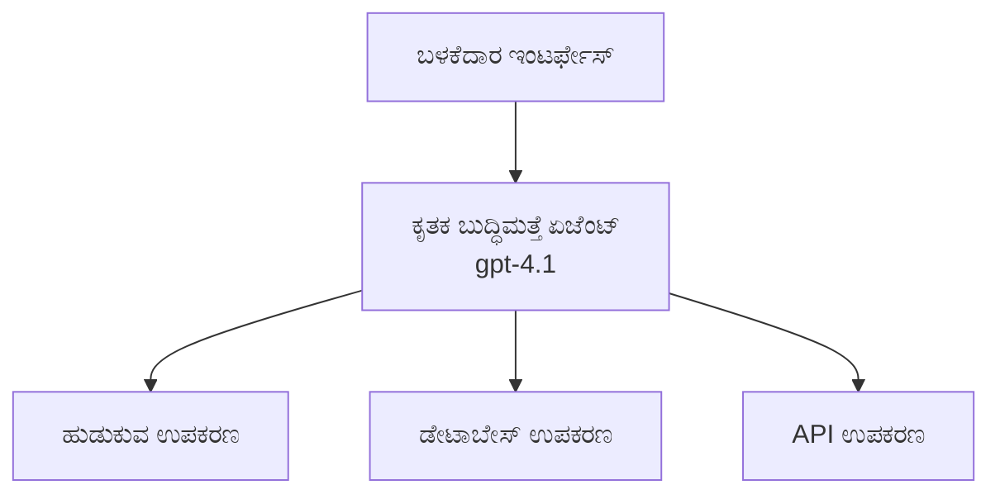
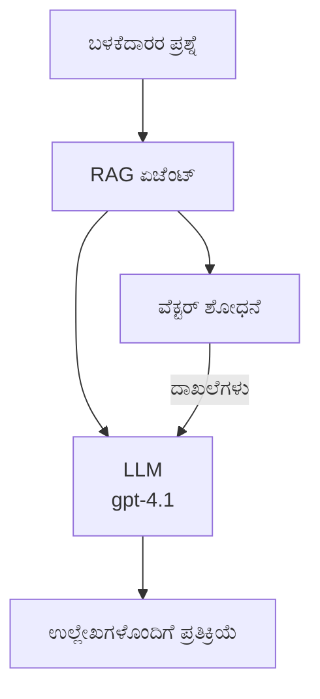
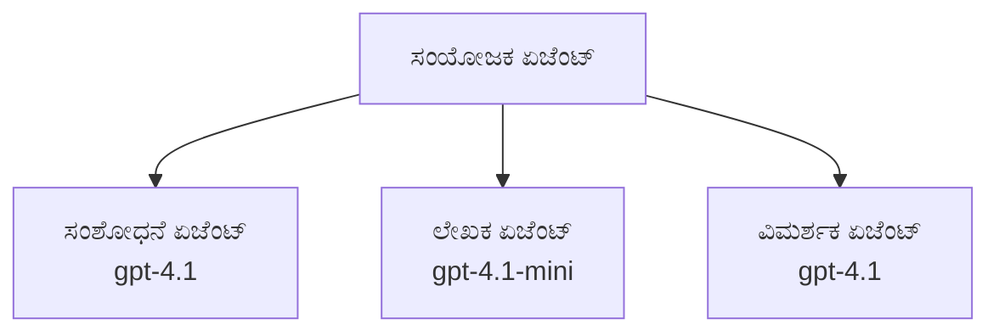

# Azure Developer CLI ಜೊತೆಗೆ AI ಏಜೆಂಟ್‌ಗಳು

**ಅಧ್ಯಾಯ ನಾವಿಗೇಷನ್:**
- **📚 ಕೋর্স್ ಹೋಂ**: [AZD ಪ್ರಾರಂಭಿಕರಿಗೆ](../../README.md)
- **📖 ಪ್ರಸ್ತುತ ಅಧ್ಯಾಯ**: ಅಧ್ಯಾಯ 2 - AI-ಪ್ರಥಮ ಅಭಿವೃದ್ಧಿ
- **⬅️ ಹಿಂದಿನ**: [Microsoft Foundry Integration](microsoft-foundry-integration.md)
- **➡️ ಮುಂದಿನ**: [AI Model Deployment](ai-model-deployment.md)
- **🚀 ಉನ್ನತ**: [ಮಲ್ಟಿ-ಏಜೆಂಟ್ ಪರಿಹಾರಗಳು](../../examples/retail-scenario.md)

---

## ಪರಿಚಯ

AI ಏಜೆಂಟ್‌ಗಳು ಸ್ವಾಯತ್ತ ಕಾರ್ಯಕ್ರಮಗಳು — ತಮ್ಮ ಪರಿಸರವನ್ನು ಗ್ರಹಿಸಿ, ನಿರ್ಧಾರಗಳನ್ನು ತೆಗೆದುಕೊಳ್ಳುತ್ತವೆ ಮತ್ತು ನಿರ್ದಿಷ್ಟ ಗುರಿಗಳನ್ನು ಸಾಧಿಸಲು ಕ್ರಮಗಳನ್ನು ಕೈಗೊಳ್ಳುತ್ತವೆ. ಪ್ರಾಂಪ್ಟ್‌ಗಳಿಗೆ ಪ್ರತಿಕ್ರಿಯಿಸುವ ಸರಳ ಚಾಟ್‌ಬಾಟ್‌ಗಳಿಗಿಂತ ಭಿನ್ನವಾಗಿ, ಏಜೆಂಟ್‌ಗಳು:

- **ಉಪಕರಣಗಳನ್ನು ಬಳಸುತ್ತವೆ** - APIs ಕರೆ ಮಾಡುವುದು, ಡೇಟಾಬೇಸ್‌ಗಳನ್ನು ಹುಡುಕುವುದು, ಕೋಡ್ ಕಾರ್ಯಗತಗೊಳಿಸುವುದು
- **ಯೋಜನೆ ಮತ್ತು ತರ್ಕ** - ಸಂಕಲ್ಪವಾದ పనಿಗಳನ್ನು ಹಂತಗಳಲ್ಲಿ ವಿಭಜಿಸುತ್ತದೆ
- **ಸಂದರ್ಭದಿಂದ ಕಲಿಯುವುದು** - ಸ್ಮೃತಿಯನ್ನು ಕಾಯ್ದುಗೊಂಡು ವರ್ತನೆಯನ್ನು ಹೊಂದಿಕೊಳ್ಳುತ್ತದೆ
- **ಸಹಕಾರ** - ಇತರ ಏಜೆಂಟ್‌ಗಳೊಂದಿಗೆ (ಮಲ್ಟಿ-ಏಜೆಂಟ್ ವ್ಯವಸ್ಥೆಗಳು) ಕೆಲಸ ಮಾಡುತ್ತದೆ

ಈ ಮಾರ್ಗದರ್ಶಿ ನಿಮಗೆ Azure ನಲ್ಲಿ Azure Developer CLI (azd) ಬಳಸಿ AI ಏಜೆಂಟ್‌ಗಳನ್ನು ನಿಯೋಜಿಸುವ ವಿಧಾನವನ್ನು ತೋರಿಸುತ್ತದೆ.

> **ಮೌಲ್ಯಮಾಪನ ಸೂಚನೆ (2026-03-25):** ಈ ಮಾರ್ಗದರ್ಶಿ `azd` `1.23.12` ಮತ್ತು `azure.ai.agents` `0.1.18-preview` ವಿರುದ್ಧ ಪರಿಶೀಲಿಸಲಾಗಿದೆ. `azd ai` ಅನುಭವವು ಇನ್ನೂ ಪ್ರಿವ್ಯೂ ಚಾಲಿತವಾಗಿದೆ, ಆದ್ದರಿಂದ ನಿಮ್ಮ ಇನ್‌ಸ್ಟಾಲ್ ಮಾಡಿದ ಫ್ಲಾಗ್‌ಗಳು ಭಿನ್ನವಾಗಿದ್ದರೆ ವಿಸ್ತರಣೆ ಸಹಾಯವನ್ನು ಪರಿಶೀಲಿಸಿ.

## ಕಲಿಯಲು ಉದ್ದೇಶಗಳು

ಈ ಮಾರ್ಗದರ್ಶಿಯನ್ನು ಪೂರ್ಣಗೊಳಿಸುವ ಮೂಲಕ, ನೀವು:
- ಏಐ ಏಜೆಂಟ್‌ಗಳು ಏನೆಂದು ಮತ್ತು ಅವು ಚಾಟ್‌ಬಾಟ್‌ಗಳಿಂದ ಹೇಗೆ ಭಿನ್ನವಾಗುತ್ತವೆ ಎಂಬುದನ್ನು ಅರ್ಥಮಾಡಿಕೊಳ್ಳಲಾಗುವುದು
- AZD ಬಳಸಿ ಪೂರ್ವ-ನಿರ್ಮಿತ ಏಜೆಂಟ್ ಟೆಂಪ್ಲೆಟ್‌ಗಳನ್ನು ನಿಯೋಜಿಸಬಹುದು
- ಕಸ್ಟಮ್ ಏಜೆಂಟ್‌ಗಳಿಗೆ Foundry ಏಜೆಂಟ್‌ಗಳನ್ನು ಸಂರಚಿಸಬಹುದು
- ಮೂಲ ಏಜೆಂಟ್ ಮಾದರಿಗಳನ್ನು ಅನುಷ್ಠಾನಗೊಳಿಸಬಹುದು (ಉಪಕರಣ ಬಳಕೆ, RAG, ಮಲ್ಟಿ-ಏಜೆಂಟ್)
- ನಿಯೋಜಿಸಿದ ಏಜೆಂಟ್‌ಗಳನ್ನು ಮಾನಿಟರ್ ಮತ್ತು ಡಿಬಗ್ ಮಾಡುವುದು

## ಕಲಿಕೆಯ ಪರಿಣಾಮಗಳು

ಪೂರ್ಣಗೊಳಿಸಿದ ನಂತರ, ನೀವು ಸಾಧ್ಯವಾಗುತ್ತದೆ:
- ಏಕದೊಮ್ಮೆ ಆಜ್ಞೆಯೊಂದಿಗೆ Azure ಗೆ AI ಏಜೆಂಟ್ ಅಪ್ಲಿಕೇಶನ್‌ಗಳನ್ನು ನಿಯೋಜಿಸಲು
- ಏಜೆಂಟ್ ಉಪಕರಣಗಳು ಮತ್ತು ಸಾಮರ್ಥ್ಯಗಳನ್ನು ಸಂರಚಿಸಲು
- ಏಜೆಂಟ್‌ಗಳೊಂದಿಗೆ retrieval-augmented generation (RAG) ಅನ್ನು ಅನುಷ್ಠಾನಗೊಳಿಸಲು
- ಜಟಿಲ ಕಾರ್ಯಪ್ರವಾಹಗಳಿಗೆ ಮಲ್ಟಿ-ಏಜೆಂಟ್ ವಾಸ್ತುಶಿಲ್ಪಗಳನ್ನು ವಿನ್ಯಾಸಗೊಳಿಸಲು
- ಸಾಮಾನ್ಯ ಏಜೆಂಟ್ ನಿಯೋಜನೆಯ ಸಮಸ್ಯೆಗಳನ್ನು ಪರಿಹರಿಸಲು

---

## 🤖 ಏಜೆಂಟ್ ಒಂದು ಚಾಟ್‌ಬಾಟ್‌ನಿಂದ ಹೇಗೆ ವಿಭಿನ್ನವಾಗಿದೆ?

| ವೈಶಿಷ್ಟ್ಯ | ಚಾಟ್‌ಬಾಟ್ | AI ಏಜೆಂಟ್ |
|---------|---------|----------|
| **ನಡವಳಿಕೆ** | ಪ್ರಾಂಪ್ಟ್ಗಳಿಗೆ ಪ್ರತಿಕ್ರಿಯಿಸುತ್ತವೆ | ಸ್ವಾಯತ್ತ ಕ್ರಮಗಳನ್ನು ಕೈಗೊಳ್ಳುತ್ತವೆ |
| **ಉಪಕರಣಗಳು** | ಇಲ್ಲ | APIs ಕರೆ ಮಾಡಬಹುದು, ಹುಡುಕಬಹುದು, ಕೋಡ್ ನಿರ್ವಹಿಸಬಹುದು |
| **ಸ್ಮೃತಿ** | ಕೇವಲ ಸೆಷನ್ ಆಧಾರಿತ | ಸೆಷನ್‌ಗಳ ನಡುವಿನ ಸ್ಥಿರ ಸ್ಮೃತಿ |
| **ಯೋಜನೆ** | ತ 单一 ಪ್ರತಿಕ್ರಿಯೆ | ಬಹು ಹಂತದ ತರ್ಕ |
| **ಸಹಕಾರ** | ಏಕ ಘಟಕ | ಇತರ ಏಜೆಂಟ್‌ಗಳೊಂದಿಗೆ ಕೆಲಸ ಮಾಡಬಹುದು |

### ಸರಳ ಹೋಲಿಕೆ

- **ಚಾಟ್‌ಬಾಟ್** = ಮಾಹಿತಿ ಕವಾಟದಲ್ಲಿ ಪ್ರಶ್ನೆಗಳಿಗೆ ಉತ್ತರಿಸುವ ಸಹಾಯಕ ವ್ಯಕ್ತಿ
- **AI ಏಜೆಂಟ್** = ಫೋನ್ ಕರೆ ಮಾಡುವುದು, ಸಭೆಗಳನ್ನು ನಿಗದಿಪಡಿಸುವುದು ಮತ್ತು ನಿಮ್ಮ ಪರ ಕೆಲಸಗಳನ್ನು ಪೂರ್ಣಗೊಳಿಸುವ ವೈಯಕ್ತಿಕ ಸಹಾಯಕ

---

## 🚀 ತ್ವರಿತ ಪ್ರಾರಂಭ: ನಿಮ್ಮ ಪ್ರಥಮ ಏಜೆಂಟ್ ಅನ್ನು ನಿಯೋಜಿಸಿ

### ಆಯ್ಕೆ 1: Foundry Agents ಟೆಂಪ್ಲೆಟ್ (ಶಿಫಾರಸು)

```bash
# ಎಐ ಏಜೆಂಟ್‌ಗಳ ಟೆಂಪ್ಲೇಟನ್ನು ಆರಂಭಿಸಿ
azd init --template get-started-with-ai-agents

# Azure ಗೆ ಡಿಪ್ಲಾಯ್ ಮಾಡಿ
azd up
```

**ಏನು ನಿಯೋಜಿಸಲಾಗುತ್ತದೆ:**
- ✅ Foundry Agents
- ✅ Microsoft Foundry Models (gpt-4.1)
- ✅ Azure AI Search (RAGಗಾಗಿ)
- ✅ Azure Container Apps (ವೆಬ್ ಇಂಟರ್ಫೇಸ್)
- ✅ Application Insights (ನಿರೀಕ್ಷಣೆ)

**ಸಮಯ:** ~15-20 ನಿಮಿಷಗಳು
**ಖರ್ಚು:** ~$100-150/ತಿಂಗಳು (ವಿಕಸನೆ)

### ಆಯ್ಕೆ 2: Prompty ಜೊತೆಗೆ OpenAI ಏಜೆಂಟ್

```bash
# Prompty ಆಧಾರಿತ ಏಜೆಂಟ್ ಟೆಂಪ್ಲೇಟ್ ಅನ್ನು ಪ್ರಾರಂಭಿಸಿ
azd init --template agent-openai-python-prompty

# Azure ಗೆ ನಿಯೋಜಿಸಿ
azd up
```

**ಏನು ನಿಯೋಜಿಸಲಾಗುತ್ತದೆ:**
- ✅ Azure Functions (ಸರ್ವರ್‌ಲೆಸ್ಸ್ ಏಜೆಂಟ್ ಕಾರ್ಯಗತಗೊಳಿಸುವಿಕೆ)
- ✅ Microsoft Foundry Models
- ✅ Prompty ಸಂರಚನಾ ಕಡತಗಳು
- ✅ ಮಾದರಿ ಏಜೆಂಟ್ ಅನುಷ್ಠಾನ

**ಸಮಯ:** ~10-15 ನಿಮಿಷಗಳು
**ಖರ್ಚು:** ~$50-100/ತಿಂಗಳು (ವಿಕಸನೆ)

### ಆಯ್ಕೆ 3: RAG ಚಾಟ್ ಏಜೆಂಟ್

```bash
# RAG ಚಾಟ್ ಟೆಂಪ್ಲೇಟನ್ನು ಪ್ರಾರಂಭಿಸಿ
azd init --template azure-search-openai-demo

# Azure ಗೆ ನಿಯೋಜಿಸಿ
azd up
```

**ಏನು ನಿಯೋಜಿಸಲಾಗುತ್ತದೆ:**
- ✅ Microsoft Foundry Models
- ✅ ಉದಾಹರಣಾ ಡೇಟಾ ಜೊತೆಗೆ Azure AI Search
- ✅ ಡಾಕ್ಯುಮೆಂಟ್ ಪ್ರೊಸೆಸಿಂಗ್ನ_PIPELINE_ (ಡಾಕ್ಯುಮೆಂಟ್ ಪ್ರಕ್ರಿಯೆ ಪೈಪ್‌ಲೈನ್)
- ✅ ಉಲ್ಲೇಖಗಳೊಂದಿಗೆ ಚಾಟ್ ಇಂಟರ್ಫೇಸ್

**ಸಮಯ:** ~15-25 ನಿಮಿಷಗಳು
**ಖರ್ಚು:** ~$80-150/ತಿಂಗಳು (ವಿಕಸನೆ)

### ಆಯ್ಕೆ 4: AZD AI Agent Init (ಮ್ಯಾನಿಫೆಸ್ಟ್ ಅಥವಾ ಟೆಂಪ್ಲೇಟ್ ಆಧಾರಿತ ಪ್ರಿವ್ಯೂ)

ನಿಮ್ಮ ಬಳಿ ಏಜೆಂಟ್ ಮ್ಯಾನಿಫೆಸ್ಟ್ ಫೈಲ್ ಇದ್ದರೆ, ನೀವು `azd ai` ಆಜ್ಞೆಯನ್ನು ಬಳಸಿ Foundry Agent Service ಪ್ರಾಜೆಕ್ಟ್ ಅನ್ನು ನೇರವಾಗಿ scaffold ಮಾಡಬಹುದು. ಇತ್ತೀಚಗಿನ ಪ್ರಿವ್ಯೂ ಬಿಡುಗಡೆಯು 템್ಪ್ಲೇಟ್-ಆಧಾರಿತ ಆರಂಭ ಬೆಂಬಲವನ್ನು ಸೇರಿಸಿದ್ದರಿಂದ, ನಿಮ್ಮ ಇನ್‌ಸ್ಟಾಲ್ ಮಾಡಿರುವ ವಿಸ್ತರಣೆ ಆವೃತ್ತಿಯ ಆಧಾರದ ಮೇಲೆ ಪ್ರಾಂಪ್ಟ್ ಹರಿವು ಸ್ವಲ್ಪ ಬದಲಾಗಿರಬಹುದು.

```bash
# AI ಏಜೆಂಟ್‌ಗಳ ವಿಸ್ತರಣೆಯನ್ನು ಸ್ಥಾಪಿಸಿ
azd extension install azure.ai.agents

# ಐಚ್ಛಿಕ: ಸ್ಥಾಪಿತ ಪೂರ್ವಾವಲೋಕನ ಆವೃತ್ತಿಯನ್ನು ಪರಿಶೀಲಿಸಿ
azd extension show azure.ai.agents

# ಏಜೆಂಟ್ ಮ್ಯಾನಿಫೆಸ್ಟ್‌ನಿಂದ ಪ್ರಾರಂಭಿಸಿ
azd ai agent init -m agent-manifest.yaml

# Azure ಗೆ ನಿಯೋಜಿಸಿ
azd up

# ನಿಯೋಜಿಸಲಾದ ಏಜೆಂಟ್ ಅನ್ನು ಪರೀಕ್ಷಿಸಿ (ವಿಳಂಬ ಮತ್ತು ಮೊದಲ ಬೈಟ್‌ವರೆಗೆ ಸಮಯ ತೋರಿಸುತ್ತದೆ)
azd ai agent invoke
```

**ಎಂದಾಗ `azd ai agent init` ಬಳಸಬೇಕು vs `azd init --template`:**

| ಪದ್ದತಿ | ಉಚಿತವಾದುದು | ಅದು ಹೇಗೆ ಕೆಲಸ ಮಾಡುತ್ತದೆ |
|----------|----------|------|
| `azd init --template` | ಕೆಲಸ ಮಾಡುವ ಮಾದರಿ ಅಪ್ಲಿಕೇಶನ್ ರಿಂದ ಪ್ರಾರಂಭಿಸುವವರಿಗೆ ಉತ್ತಮ | ಕೋಡ್ + ಇನ್ಫ್ರಾ ಸೇರಿದಂತೆ ಪೂರ್ಣ ಟೆಂಪ್ಲೇಟ್ ರೆಪೊ ಕ್ಲೋನ್ ಮಾಡುತ್ತದೆ |
| `azd ai agent init -m` | ನಿಮ್ಮದೇ ಏಜೆಂಟ್ ಮ್ಯಾನಿಫೆಸ್ಟ್‌ನಿಂದ ನಿರ್ಮಿಸುವವರಿಗೆ ಉತ್ತಮ | ನಿಮ್ಮ ಏಜೆಂಟ್ ವ್ಯಾಖ್ಯಾನದಿಂದ ಪ್ರಾಜೆಕ್ಟ್ ರಚನೆ scaffold ಮಾಡುತ್ತದೆ |

> **ಸಲಹೆ:** ಕಲಿಯುತ್ತಿರುವಾಗ `azd init --template` (ಮೇಲಿನ ಆಯ್ಕೆಗಳು 1-3) ಬಳಸಿ. ನಿಮ್ಮದೇ ಮ್ಯಾನಿಫೆಸ್ಟ್‌ಗಳೊಂದಿಗೆ ಉತ್ಪಾದನಾ ಏಜೆಂಟ್‌ಗಳನ್ನು ನಿರ್ಮಿಸುವಾಗ `azd ai agent init` ಬಳಸಿ.

`azd up` ನಂತರ, ಅದೇ ವಿಸ್ತರಣೆ ನಿಮಗೆ ಏಜೆಂಟ್ ಜೀವನಚಕ್ರದ ಉಳಿದ ಹಂತಗಳ ಮೂಲಕ ಸಾಗಿಸುತ್ತದೆ: ಪರೀಕ್ಷೆಗೆ `azd ai agent invoke`, ಗುಣಮಟ್ಟವನ್ನು ಅಳೆಯಲು ಮತ್ತು ಸುಧಾರಿಸಲು `azd ai agent eval generate` ಮತ್ತು `azd ai agent optimize`, ಮತ್ತು ಶುದ್ಧೀಕರಣಕ್ಕೆ `azd ai agent delete`. ಸಂಪೂರ್ಣ ರೆಫರೆನ್ಸ್‌ಗಾಗಿ [AZD AI CLI Commands](../chapter-08-production/production-ai-practices.md#azd-ai-cli-commands-and-extensions) ನೋಡಿ.

---

## 🏗️ ಏಜೆಂಟ್ ವಾಸ್ತುಶಿಲ್ಪ ಮಾದರಿಗಳು

### ಮಾದರಿ 1: ಉಪಕರಣಗಳೊಂದಿಗೆ ಏಕ ಏಜೆಂಟ್

ಅತ್ಯಂತ ಸರಳ ಏಜೆಂಟ್ ಮಾದರಿ - ಒಂದೇ ಏಜೆಂಟ್ ಬಹು ಉಪಕರಣಗಳನ್ನು ಬಳಸಬಹುದು.



**ಉತ್ತಮಕ್ಕಾಗಿ:**
- ಗ್ರಾಹಕ ಬೆಂಬಲ ಬೊಟ್‌ಗಳು
- ಸಂಶೋಧನಾ ಸಹಾಯಕರು
- ಡೇಟಾ ವಿಶ್ಲೇಷಣೆ ಏಜೆಂಟ್‌ಗಳು

**AZD ಟೆಂಪ್ಲೆಟ್:** `azure-search-openai-demo`

### ಮಾದರಿ 2: RAG ಏಜೆಂಟ್ (Retrieval-Augmented Generation)

ಪ್ರತಿಕ್ರಿಯೆಗಳನ್ನು ರಚಿಸುವ ಮೊದಲು ಸಂಬಂಧಿತ ಡಾಕ್ಯುಮೆಂಟ್‌ಗಳನ್ನು ಪಡೆದ ಒಂದು ಏಜೆಂಟ್.



**ಉತ್ತಮಕ್ಕಾಗಿ:**
- ಸಂಸ್ಥೆಯ ಜ್ಞಾನ ಅಡಿಚ್ಚುಗಳು
- ಡಾಕ್ಯುಮೆಂಟ್ Q&A ವ್ಯವಸ್ಥೆಗಳು
- ಅನುಕೂಲತೆ ಮತ್ತು ಕಾನೂನು ಸಂಶೋಧನೆ

**AZD ಟೆಂಪ್ಲೆಟ್:** `azure-search-openai-demo`

### ಮಾದರಿ 3: ಮಲ್ಟಿ-ಏಜೆಂಟ್ ವ್ಯವಸ್ಥೆ

ಜಟಿಲ ಕಾರ್ಯಗಳಿಗೆ ಒಟ್ಟಾಗಿ ಕೆಲಸ ಮಾಡುವ ಬಹು ವಿಶೇಷ ಏಜೆಂಟ್‌ಗಳು.



**ಉತ್ತಮಕ್ಕಾಗಿ:**
- ಜಟಿಲ ವಿಷಯ ಉತ್ಪಾದನೆ
- ಬಹು ಹಂತದ ಕಾರ್ಯಪ್ರವಾಹಗಳು
- ವಿಭಿನ್ನ ಪರಿಣತಿಯ ಅಗತ್ಯವಿರುವ ಕೆಲಸಗಳು

**ಹೆಚ್ಚು ತಿಳಿಯಿರಿ:** [ಮಲ್ಟಿ-ಏಜೆಂಟ್ ಸಂಯೋಜನೆ ಮಾದರಿಗಳು](../chapter-06-pre-deployment/coordination-patterns.md)

---

## ⚙️ ಏಜೆಂಟ್ ಉಪಕರಣಗಳನ್ನು ಸಂರಚಿಸುವುದು

ಏಜೆಂಟ್‌ಗಳು ಉಪಕರಣಗಳನ್ನು ಬಳಸಲು ಶಕ್ತಿಶಾಲಿಯಾಗುತ್ತವೆ. ಇಲ್ಲಿವೆ ಸಾಮಾನ್ಯ ಉಪಕರಣಗಳನ್ನು ಸಂರಚಿಸುವ ವಿಧಾನ:

### Foundry ಏಜೆಂಟ್‌ಗಳಲ್ಲಿ ಟೂಲ್ ಸಂರಚನೆ

```python
# agent_config.py
from azure.ai.projects import AIProjectClient
from azure.ai.projects.models import FunctionTool, CodeInterpreterTool

# ಕಸ್ಟಮ್ ಉಪಕರಣಗಳನ್ನು ವ್ಯಾಖ್ಯಾನಿಸಿ
search_tool = FunctionTool(
    name="search_knowledge_base",
    description="Search the company knowledge base for relevant documents",
    parameters={
        "type": "object",
        "properties": {
            "query": {
                "type": "string",
                "description": "The search query"
            }
        },
        "required": ["query"]
    }
)

# ಉಪಕರಣಗಳೊಂದಿಗೆ ಏಜೆಂಟ್ ರಚಿಸಿ
agent = project_client.agents.create_agent(
    model="gpt-4.1",
    name="Support Agent",
    instructions="You are a helpful support agent. Use the search tool to find relevant information.",
    tools=[search_tool, CodeInterpreterTool()]
)
```

### ಪರಿಸರ ಸಂರಚನೆ

```bash
# ಏಜೆಂಟ್-ನಿರ್ದಿಷ್ಟ ಪರಿಸರ ಚರಗಳನ್ನು ಸಂರಚಿಸಿ
azd env set AZURE_OPENAI_MODEL "gpt-4.1"
azd env set AGENT_INSTRUCTIONS "You are a helpful assistant..."
azd env set ENABLE_CODE_INTERPRETER "true"
azd env set ENABLE_FILE_SEARCH "true"

# ನವೀಕರಿಸಿದ ಸಂರಚನೆಯೊಂದಿಗೆ ನಿಯೋಜಿಸಿ
azd deploy
```

---

## 📊 ಏಜೆಂಟ್‌ಗಳ ನಿರೀಕ್ಷಣೆ

### Application Insights ಏಕರೂಪೀಕರಣ

ಎಲ್ಲಾ AZD ಏಜೆಂಟ್ ಟೆಂಪ್ಲೆಟ್‌ಗಳು ನಿರೀಕ್ಷಣೆಗೆ Application Insights ಅನ್ನು ಒಳಗೊಂಡಿವೆ:

```bash
# ನಿರೀಕ್ಷಣಾ ಡ್ಯಾಶ್‌ಬೋರ್ಡ್ ತೆರೆಯಿರಿ
azd monitor --overview

# ಸಜೀವ ಲಾಗ್‌ಗಳನ್ನು ವೀಕ್ಷಿಸಿ
azd monitor --logs

# ಸಜೀವ ಮೆಟ್ರಿಕ್‌ಗಳನ್ನು ವೀಕ್ಷಿಸಿ
azd monitor --live
```

### ಟ್ರ್ಯಾಕ್ ಮಾಡಲು ಪ್ರಮುಖ ಮೆಟ್ರಿಕ್‌ಗಳು

| ಮೆಟ್ರಿಕ್ | ವರ್ಣನೆ | ಗುರಿ |
|--------|-------------|--------|
| ಪ್ರತಿಕ್ರಿಯೆ ವಿಳಂಬ | ಪ್ರತಿಕ್ರಿಯೆ ರಚಿಸಲು ಬೇಕಾಗುವ ಸಮಯ | < 5 seconds |
| ಟೋಕನ್ ಬಳಕೆ | ಪ್ರತಿ ವಿನಂತಿಗೆ ಟೋಕನ್‌ಗಳು | ವೆಚ್ಚದಿಗಾಗಿ ಮಾನಿಟರ್ ಮಾಡಿ |
| ಉಪಕರಣ ಕರೆ ಯಶಸ್ವೀ ಪ್ರಮಾಣ | ಯಶಸ್ವಿ ಉಪಕರಣ ಕಾರ್ಯಗತಗೊಳಿಸುವಿಕೆಯ ಶೇ. | > 95% |
| ದೋಷ ಪ್ರಮಾಣ | ವಿಫಲ ಏಜೆಂಟ್ ವಿನಂತಿಗಳು | < 1% |
| ಬಳಕೆದಾರ ಸಂತೃಪ್ತಿ | ಪ್ರತಿಕ್ರಿಯೆ оценки /ಫೀಡ್‌ಬ್ಯಾಕ್ ಸ್ಕೋರ್ಸ್ | > 4.0/5.0 |

### ಏಜೆಂಟ್‌ಗಳಿಗಾಗಿ ಕಸ್ಟಮ್ ಲಾಗಿಂಗ್

```python
import os
from azure.monitor.opentelemetry import configure_azure_monitor
from opentelemetry import trace

# OpenTelemetry ನೊಂದಿಗೆ Azure Monitor ಅನ್ನು ಸಂರಚಿಸಿ
configure_azure_monitor(
    connection_string=os.environ["APPLICATIONINSIGHTS_CONNECTION_STRING"]
)

tracer = trace.get_tracer(__name__)

def log_agent_interaction(user_query, agent_response, tools_used, latency_ms):
    with tracer.start_as_current_span("agent_interaction") as span:
        span.set_attributes({
            "user_query": user_query,
            "response_length": len(agent_response),
            "tools_used": tools_used,
            "latency_ms": latency_ms
        })
```

> **ಗಮನಿಸಿ:** ಅಗತ್ಯ ಪ್ಯಾಕೇಜ್‌ಗಳನ್ನು ಇನ್‌ಸ್ಟಾಲ್ ಮಾಡಿ: `pip install azure-monitor-opentelemetry opentelemetry`

---

## 💰 ಖರ್ಚು ಪರಿಗಣನೆಗಳು

### ಮಾದರಿಯ ಪ್ರಕಾರ ಅಂದಾಜು ಮಾಸಿಕ ವೆಚ್ಚಗಳು

| ಮಾದರಿ | ಡೆವ್ ಪರಿಸರ | ಉತ್ಪಾದನೆ |
|---------|-----------------|------------|
| ಏಕ ಏಜೆಂಟ್ | $50-100 | $200-500 |
| RAG ಏಜೆಂಟ್ | $80-150 | $300-800 |
| ಮಲ್ಟಿ-ಏಜೆಂಟ್ (2-3 ಏಜೆಂಟ್‌ಗಳು) | $150-300 | $500-1,500 |
| ಎಂಟರ್‌ಪ್ರೈಸ್ ಮಲ್ಟಿ-ಏಜೆಂಟ್ | $300-500 | $1,500-5,000+ |

### ಖರ್ಚು ತಗ್ಗಿಸುವ ಸಲಹೆಗಳು

1. **ಸರಳ ಕೆಲಸಗಳಿಗೆ gpt-4.1-mini ಅನ್ನು ಬಳಸಿ**
   ```bash
   azd env set AZURE_OPENAI_MODEL "gpt-4.1-mini"
   ```

2. **ಮರುಕಳಿಸುವ ಪ್ರಶ್ನೆಗಳಿಗೆ ಕ್ಯಾಶಿಂಗ್ ಜಾರಿಗೆ ತರುವಿರಿ**
   ```python
   from functools import lru_cache
   
   @lru_cache(maxsize=1000)
   def get_cached_response(query_hash):
       return agent.run(query_hash)
   ```

3. **ಪ್ರತಿ ರನ್‌ಗೆ ಟೋಕನ್ ಸೀಮೆಗಳನ್ನು ನಿಗದಿಮಾಡಿ**
   ```python
   # ಎಜೆಂಟ್ ಅನ್ನು ರನ್ ಮಾಡುವಾಗ max_completion_tokens ಅನ್ನು ಹೊಂದಿಸಿ, ರಚಿಸುವಾಗ ಅಲ್ಲ
   run = project_client.agents.create_run(
       thread_id=thread.id,
       agent_id=agent.id,
       max_completion_tokens=1000  # ಪ್ರತಿಕ್ರಿಯೆಯ ಉದ್ದವನ್ನು ಮಿತಿಗೊಳಿಸಿ
   )
   ```

4. **ಬಳಕೆ ಇಲ್ಲದಾಗ ಶೂನ್ಯಕ್ಕೆ ಸ್ಕೇಲ್ ಮಾಡಿ**
   ```bash
   # ಕಂಟೈನರ್ ಅಪ್ಸ್ ಸ್ವಯಂಚಾಲಿತವಾಗಿ ಶೂನ್ಯಕ್ಕೆ ಸ್ಕೇಲ್ ಆಗುತ್ತವೆ
   azd env set MIN_REPLICAS "0"
   ```

---

## 🔧 ಏಜೆಂಟ್ ತಿದ್ದುಪು

### ಸಾಮಾನ್ಯ ಸಮಸ್ಯೆಗಳು ಮತ್ತು ಪರಿಹಾರಗಳು

<details>
<summary><strong>❌ ಉಪಕರಣ ಕರೆಗಳಿಗೆ ಏಜೆಂಟ್ ಪ್ರತಿಕ್ರಿಯೆ ನೀಡುತ್ತಿಲ್ಲ</strong></summary>

```bash
# ಉಪಕರಣಗಳು ಸರಿಯಾಗಿ ನೋಂದಾಯಿಸಲ್ಪಟ್ಟಿರುವುದನ್ನು ಪರಿಶೀಲಿಸಿ
azd show

# OpenAI ನಿಯೋಜನೆಯನ್ನು ಪರಿಶೀಲಿಸಿ
az cognitiveservices account deployment list \
  --name $AZURE_OPENAI_NAME \
  --resource-group $RG_NAME

# ಏಜೆಂಟ್ ಲಾಗ್‌ಗಳನ್ನು ಪರಿಶೀಲಿಸಿ
azd monitor --logs
```

**ಸಾಮಾನ್ಯ ಕಾರಣಗಳು:**
- ಉಪಕರಣದ ಫಂಕ್ಷನ್ ಸಹಿ ಹೊಂದಾಣಿಕೆ ಇಲ್ಲ
- ಅಗತ್ಯ ಅನುಮತಿಗಳು ಇಲ್ಲ
- API ಎಂಡ್‌ಪಾಯಿಂಟ್ ಪ್ರವೇಶయోగ್ಯವಿಲ್ಲ
</details>

<details>
<summary><strong>❌ ಏಜೆಂಟ್ ಪ್ರತಿಕ್ರಿಯೆಗಳಲ್ಲಿ ಹೆಚ್ಚಿನ ವಿಳಂಬ</strong></summary>

```bash
# Application Insights ಅನ್ನು ಬಾಟಲ್‌ನೆಕ್‌ಗಳಿಗಾಗಿ ಪರಿಶೀಲಿಸಿ
azd monitor --live

# ವೇಗವಾದ ಮಾದರಿಯನ್ನು ಬಳಸುವುದನ್ನು ಪರಿಗಣಿಸಿ
azd env set AZURE_OPENAI_MODEL "gpt-4.1-mini"
azd deploy
```

**ಉತ್ತಮಗೊಳಿಸುವಿ ಸಲಹೆಗಳು:**
- ಸ್ಟ್ರೀಮಿಂಗ್ ಪ್ರತಿಕ್ರಿಯೆಗಳನ್ನು ಬಳಸಿ
- ಪ್ರತಿಕ್ರಿಯೆ ಕ್ಯಾಶಿಂಗ್ ಜಾರಿಗೆ ತರು
- ಸಂದರ್ಭ ವಿಂಡೋ ಗಾತ್ರವನ್ನು ಕಡಿಮೆ ಮಾಡಿ
</details>

<details>
<summary><strong>❌ ಏಜೆಂಟ್ ತಪ್ಪು ಅಥವಾ ಊಹಿಸಿದ ಮಾಹಿತಿಯನ್ನು ನೀಡುತ್ತಿದೆ</strong></summary>

```python
# ಉತ್ತಮ ಸಿಸ್ಟಮ್ ಪ್ರಾಂಪ್ಟ್‌ಗಳ ಮೂಲಕ ಸುಧಾರಿಸಿ
instructions = """
You are a helpful assistant. IMPORTANT:
- Only answer based on provided context
- If you don't know, say "I don't know"
- Always cite your sources
- Never make up information
"""

# ಗ್ರೌಂಡಿಂಗ್‌ಗಾಗಿ ಶೋಧನೆಯನ್ನು ಸೇರಿಸಿ
agent = project_client.agents.create_agent(
    model="gpt-4.1",
    instructions=instructions,
    tools=[FileSearchTool()]  # ಉತ್ತರಗಳನ್ನು ದಸ್ತಾವೇಜುಗಳಲ್ಲಿ ನೆಲಗೊಳಿಸಿ
)
```
</details>

<details>
<summary><strong>❌ ಟೋಕನ್ ಮಿತಿ ಮೀರಿ ದೋಷಗಳು</strong></summary>

```python
# ಸಂದರ್ಭ ಕಿಟಕಿ ನಿರ್ವಹಣೆಯನ್ನು ಅನುಷ್ಠಾನಗೊಳಿಸಿ
def truncate_context(messages, max_tokens=8000, model="gpt-4.1"):
    """Keep only recent messages within token limit."""
    import tiktoken
    encoding = tiktoken.encoding_for_model(model)
    total_tokens = 0
    truncated = []
    
    for msg in reversed(messages):
        msg_tokens = len(encoding.encode(msg.content))
        if total_tokens + msg_tokens > max_tokens:
            break
        truncated.insert(0, msg)
        total_tokens += msg_tokens
    
    return truncated
```
</details>

---

## 🎓 ಪ್ರಾಯೋಗಿಕ ಅಭ್ಯಾಸಗಳು

### ಅಭ್ಯಾಸ 1: ಮೂಲ ಏಜೆಂಟ್ ಅನ್ನು ನಿಯೋಜಿಸಿ (20 ನಿಮಿಷ)

**ಉದ್ದೇಶ:** AZD ಬಳಸಿ ನಿಮ್ಮ ಪ್ರಥಮ AI ಏಜೆಂಟ್ ಅನ್ನು ನಿಯೋಜಿಸಿ

```bash
# ಹಂತ 1: ಟೆಂಪ್ಲೇಟನ್ನು ಪ್ರಾರಂಭಿಸಿ
azd init --template get-started-with-ai-agents

# ಹಂತ 2: ಏಜುರ್‌ಗೆ ಲಾಗಿನ್ ಮಾಡಿ
azd auth login
# ನೀವು ವಿಭಿನ್ನ ಟೆನಂಟ್‌ಗಳ ಮೇಲೆ ಕೆಲಸ ಮಾಡುವಾಗ, --tenant-id <tenant-id> ಅನ್ನು ಸೇರಿಸಿ

# ಹಂತ 3: ನಿಯೋಜಿಸಿ
azd up

# ಹಂತ 4: ಏಜೆಂಟ್ ಅನ್ನು ಪರೀಕ್ಷಿಸಿ
# ನಿಯೋಜನೆಯ ನಂತರ ನಿರೀಕ್ಷಿಸಿದ ಫಲಿತಾಂಶ:
#   ನಿಯೋಜನೆ ಪೂರ್ಣಗೊಂಡಿದೆ!
#   ಎಂಡ್‌ಪಾಯಿಂಟ್: https://<app-name>.<region>.azurecontainerapps.io
# ಔಟ್‌ಪುಟ್‌ನಲ್ಲಿ ತೋರಿದ URL ಅನ್ನು ತೆರೆಯಿರಿ ಮತ್ತು ಪ್ರಶ್ನೆ ಕೇಳಲು ಪ್ರಯತ್ನಿಸಿ

# ಹಂತ 5: ಮಾನಿಟರಿಂಗ್ ಅನ್ನು ವೀಕ್ಷಿಸಿ
azd monitor --overview

# ಹಂತ 6: ಸ್ವಚ್ಛಗೊಳಿಸಿ
azd down --force --purge
```

**ಯಶಸ್ಸಿನ ಮಾನದಂಡಗಳು:**
- [ ] ಏಜೆಂಟ್ ಪ್ರಶ್ನೆಗಳಿಗೆ ಪ್ರತಿಕ್ರಿಯಿಸುತ್ತದೆ
- [ ] `azd monitor` ಮೂಲಕ ಮಾನಿಟರಿಂಗ್ ಡ್ಯಾಶ್‌ಬೋರ್ಡ್‌ಗಿಗೆ ಪ್ರವೇಶಿಸಬಹುದು
- [ ] ಸಂಪನ್ಮೂಲಗಳು ಯಶಸ್ವಿಯಾಗಿ ಕ್ಲಿನ್‌ಅಪ್ ಆಗಿವೆ

### ಅಭ್ಯಾಸ 2: ಕಸ್ಟಮ್ ಉಪಕರಣ ಸೇರಿಸಿ (30 ನಿಮಿಷ)

**ಉದ್ದೇಶ:** ಏಜೆಂಟ್‌ಗೆ ಕಸ್ಟಮ್ ಉಪಕರಣವನ್ನು ವಿಸ್ತರಿಸಿ

1. ಏಜೆಂಟ್ ಟೆಂಪ್ಲೆಟ್ ಅನ್ನು ನಿಯೋಜಿಸಿ:
   ```bash
   azd init --template get-started-with-ai-agents
   azd up
   ```
2. ನಿಮ್ಮ ಏಜೆಂಟ್ ಕೋಡ್‌ನಲ್ಲಿ ಹೊಸ ಉಪಕರಣ ಫಂಕ್ಷನ್ ರಚಿಸಿ:
   ```python
   def get_weather(location: str) -> str:
       """Get current weather for a location."""
       # ಹವಾಮಾನ ಸೇವೆಗೆ API ಕರೆ
       return f"Weather in {location}: Sunny, 72°F"
   ```
3. ಉಪಕರಣವನ್ನು ಏಜೆಂಟ್‌ಗೆ ನೋಂದಣಿ ಮಾಡಿ:
   ```python
   from azure.ai.projects.models import FunctionTool

   weather_tool = FunctionTool(
       name="get_weather",
       description="Get current weather for a location",
       parameters={
           "type": "object",
           "properties": {
               "location": {"type": "string", "description": "City name"}
           },
           "required": ["location"]
       }
   )

   agent = project_client.agents.create_agent(
       model="gpt-4.1",
       name="Weather Agent",
       tools=[weather_tool]
   )
   ```
4. ಮತ್ತೆ ನಿಯೋಜಿಸಿ ಮತ್ತು ಪರೀಕ್ಷಿಸಿ:
   ```bash
   azd deploy
   # ಪ್ರಶ್ನೆ: "ಸಿಯಾಟಲ್‌ನಲ್ಲಿ ಹವಾಮಾನ ಹೇಗಿದೆ?"
   # ನಿರೀಕ್ಷಿಸಲಾಗಿದೆ: ಏಜೆಂಟ್ get_weather("Seattle") ಅನ್ನು ಕರೆಸುತ್ತದೆ ಮತ್ತು ಹವಾಮಾನದ ಮಾಹಿತಿಯನ್ನು ಹಿಂತಿರುಗಿಸುತ್ತದೆ
   ```

**ಯಶಸ್ಸಿನ ಮಾನದಂಡಗಳು:**
- [ ] ಏಜೆಂಟ್ ವಾತಾವರಣಕ್ಕೆ ಸಂಬಂಧಿಸಿದ ಪ್ರಶ್ನೆಗಳನ್ನು ಗುರುತಿಸುತ್ತದೆ
- [ ] ಉಪಕರಣ ಸರಿಯಾಗಿ ಕರೆಮಾಡಲಾಗಿದೆ
- [ ] ಪ್ರತಿಕ್ರಿಯೆಯಲ್ಲಿ ವಾತಾವರಣ ಮಾಹಿತಿ ಸೇರಿದೆ

### ಅಭ್ಯಾಸ 3: RAG ಏಜೆಂಟ್ ನಿರ್ಮಿಸಿ (45 ನಿಮಿಷ)

**ಉದ್ದೇಶ:** ನಿಮ್ಮ ಡಾಕ್ಯುಮೆಂಟುಗಳಿಂದ ಪ್ರಶ್ನೆಗಳಿಗೆ ಉತ್ತರಿಸುವ ಏಜೆಂಟ್ ರಚಿಸಿ

```bash
# ಹಂತ 1: RAG ಟೆಂಪ್ಲೇಟನ್ನು ಡಿಪ್ಲಾಯ್ ಮಾಡಿ
azd init --template azure-search-openai-demo
azd up

# ಹಂತ 2: ನಿಮ್ಮ ದಾಖಲೆಗಳನ್ನು ಅಪ್‌ಲೋಡ್ ಮಾಡಿ
# PDF/TXT ಫೈಲ್‌ಗಳನ್ನು data/ ಡೈರೆಕ್ಟರಿಯಲ್ಲಿ ಇರಿಸಿ, ನಂತರ ರನ್ ಮಾಡಿ:
python scripts/prepdocs.py

# ಹಂತ 3: ಡೊಮೇನ್-ನಿರ್ದಿಷ್ಟ ಪ್ರಶ್ನೆಗಳೊಂದಿಗೆ ಪರೀಕ್ಷೆ ಮಾಡಿ
# azd up output ನಿಂದ ವೆಬ್ ಆಪ್ URL ಅನ್ನು ತೆರೆಯಿರಿ
# ನಿಮ್ಮ ಅಪ್‌ಲೋಡ್ ಮಾಡಿದ ದಾಖಲೆಗಳ ಬಗ್ಗೆ ಪ್ರಶ್ನೆಗಳನ್ನು ಕೇಳಿ
# ಪ್ರತಿಕ್ರಿಯೆಗಳಲ್ಲಿ [doc.pdf]ಂತಹ ಉಲ್ಲೇಖ ಸೂಚನೆಗಳು ಇರಬೇಕು
```

**ಯಶಸ್ಸಿನ ಮಾನದಂಡಗಳು:**
- [ ] ಅಪ್‌ಲೋಡ್ ಮಾಡಿದ ಡಾಕ್ಯುಮೆಂಟ್‌ಗಳಿಂದ ಏಜೆಂಟ್ ಉತ್ತರಿಸುತ್ತದೆ
- [ ] ಪ್ರತಿಕ್ರಿಯೆಗಳಲ್ಲಿ ಉಲ್ಲೇಖಗಳು ಸೇರಿವೆ
- [ ] ಹೊರಗಿನ ವ್ಯಾಪ್ತಿಯ ಪ್ರಶ್ನೆಗಳಲ್ಲಿ ಹುಲ್ಯೂಸಿನೇಷನ್ ಇಲ್ಲ

---

## 📚 ಮುಂದಿನ ಹಂತಗಳು

ಈಗ ನೀವು AI ಏಜೆಂಟ್‌ಗಳನ್ನು ಅರ್ಥಮಾಡಿಕೊಂಡಿದ್ದೀರಿ, ಈ ಉನ್ನತ ವಿಷಯಗಳನ್ನು ಅನ್ವೇಷಿಸಿ:

| ವಿಷಯ | ವರ್ಣನೆ | ಲಿಂಕ್ |
|-------|-------------|------|
| **ಮಲ್ಟಿ-ಏಜೆಂಟ್ ವ್ಯವಸ್ಥೆಗಳು** | 여러 ಏಜೆಂಟ್‌ಗಳೊಂದಿಗೆ ವ್ಯವಸ್ಥೆಗಳನ್ನು ನಿರ್ಮಿಸಿ | [Retail Multi-Agent Example](../../examples/retail-scenario.md) |
| **ಸಂಯೋಜನೆ ಮಾದರಿಗಳು** | ಸಂಘಟನೆ ಮತ್ತು ಸಂವಹನ ಮಾದರಿಗಳನ್ನು ಕಲಿಯಿರಿ | [Coordination Patterns](../chapter-06-pre-deployment/coordination-patterns.md) |
| **ಉತ್ಪಾದನಾ ನಿಯೋಜನೆ** | ಎಂಟರ್‌ಪ್ರೈಸ್-ಸಿದ್ಧ ಏಜೆಂಟ್ ನಿಯೋಜನೆ | [Production AI Practices](../chapter-08-production/production-ai-practices.md) |
| **ಏಜೆಂಟ್ ಮೌಲ್ಯಮಾಪನ** | ಏಜೆಂಟ್ ಕಾರ್ಯಕ್ಷಮತೆಯನ್ನು ಪರೀಕ್ಷಿಸಿ ಮತ್ತು ಮೌಲ್ಯಮಾಪನ ಮಾಡಿ | [AI Troubleshooting](../chapter-07-troubleshooting/ai-troubleshooting.md) |
| **AI ವರ್ಕ್‌ಶಾಪ್ ಲ್ಯಾಬ್** | ಕೈಯಲ್ಲಿ: ನಿಮ್ಮ AI ಪರಿಹಾರವನ್ನು AZD-ೊಂದಿಗೆ ಸಿದ್ಧಗೊಳಿಸಿ | [AI Workshop Lab](ai-workshop-lab.md) |

---

## 📖 추가 ಸಂಪನ್ಮೂಲಗಳು

### ಅಧಿಕೃತ ಡಾಕ್ಯುಮೆಂತೇಶನ್
- [Microsoft Foundry Agent Service](https://learn.microsoft.com/azure/ai-services/agents/)
- [Microsoft Foundry Agent Service Quickstart](https://learn.microsoft.com/azure/ai-services/agents/quickstart)
- [Semantic Kernel Agent Framework](https://learn.microsoft.com/semantic-kernel/)

### ಏಜೆಂಟ್‌ಗಳಿಗಾಗಿ AZD ಟೆಂಪ್ಲೇಟುಗಳು
- [Get Started with AI Agents](https://github.com/Azure-Samples/get-started-with-ai-agents)
- [Agent OpenAI Python Prompty](https://github.com/Azure-Samples/agent-openai-python-prompty)
- [Azure Search OpenAI Demo](https://github.com/Azure-Samples/azure-search-openai-demo)

### ಸಮುದಾಯ ಸಂಪನ್ಮೂಲಗಳು
- [Awesome AZD - Agent Templates](https://azure.github.io/awesome-azd/?tags=ai-agents)
- [Azure AI Discord](https://discord.gg/microsoft-azure)
- [Microsoft Foundry Discord](https://discord.gg/nTYy5BXMWG)

### ಸಂಪಾದಕಕ್ಕಾಗಿ ಏಜೆಂಟ್ ಕೌಶಲ್ಯಗಳು
- [**Microsoft Azure Agent Skills**](https://skills.sh/microsoft/github-copilot-for-azure) - GitHub Copilot, Cursor ಅಥವಾ ಬೆಂಬಲಿತ ಯಾವುದೇ ಏಜೆಂಟ್‌ನಲ್ಲಿ Azure ಅಭಿವೃದ್ಧಿಗಾಗಿ ಪುನಃಬಳಕೆಯೋಗ್ಯ AI ಏಜೆಂಟ್ ಕೌಶಲ್ಯಗಳನ್ನು ಇನ್‌ಸ್ಟಾಲ್ ಮಾಡಿ. ಇದರಲ್ಲಿ [Azure AI](https://skills.sh/microsoft/github-copilot-for-azure/azure-ai), [Microsoft Foundry](https://skills.sh/microsoft/github-copilot-for-azure/microsoft-foundry), [deployment](https://skills.sh/microsoft/github-copilot-for-azure/azure-deploy), ಮತ್ತು [diagnostics](https://skills.sh/microsoft/github-copilot-for-azure/azure-diagnostics) ಗೆ ಸಂಬಂಧಿಸಿದ ಕೌಶಲ್ಯಗಳು ಸೇರಿವೆ:
  ```bash
  npx skills add microsoft/github-copilot-for-azure
  ```

---

**ನಾವುಗ ಭ್ರಮಣ**
- **ಹಿಂದಿನ ಪಾಠ**: [Microsoft Foundry Integration](microsoft-foundry-integration.md)
- **ಮುಂದಿನ ಪಾಠ**: [AI Model Deployment](ai-model-deployment.md)

---

<!-- CO-OP TRANSLATOR DISCLAIMER START -->
**ಅಸ್ವೀಕಾರ**:
ಈ ದಸ್ತಾವೇಜು AI ಅನುವಾದ ಸೇವೆ [Co-op Translator](https://github.com/Azure/co-op-translator) ಬಳಸಿ ಅನುವಾದಿಸಲಾಗಿದೆ. ನಾವು ನಿಖರತೆಯನ್ನು ಸಾಧಿಸಲು ಪ್ರಯತ್ನಿಸುತ್ತಿದ್ದರೂ, ದಯವಿಟ್ಟು ಗಮನಿಸಿ, ಸ್ವಯಂಚಾಲಿತ ಅನುವಾದಗಳಲ್ಲಿ ದೋಷಗಳು ಅಥವಾ ಅಸಡ್ಡೆಗಳು ಇರಬಹುದು. ಮೂಲ ಭಾಷೆಯಲ್ಲಿರುವ ಮೂಲ ದಸ್ತಾವೇಜು ಪ್ರಾಮಾಣಿಕ ಮೂಲವೆಂದು ಪರಿಗಣಿಸಬೇಕು. ಪ್ರಮುಖ ಮಾಹಿತಿಗಾಗಿ, ವೃತ್ತಿಪರ ಮಾನವ ಅನುವಾದವನ್ನು ಶಿಫಾರಸು ಮಾಡಲಾಗುತ್ತದೆ. ಈ ಅನುವಾದವನ್ನು ಬಳಸುವ ಮೂಲಕ ಉಂಟಾಗುವ ಯಾವುದೇ ತಪ್ಪು ಅರ್ಥಗಳ ಅಥವಾ ತಪ್ಪು ವ್ಯಾಖ್ಯಾನಗಳ ಬಗ್ಗೆ ನಾವು ಹೊಣೆಗಾರರಲ್ಲ.
<!-- CO-OP TRANSLATOR DISCLAIMER END -->