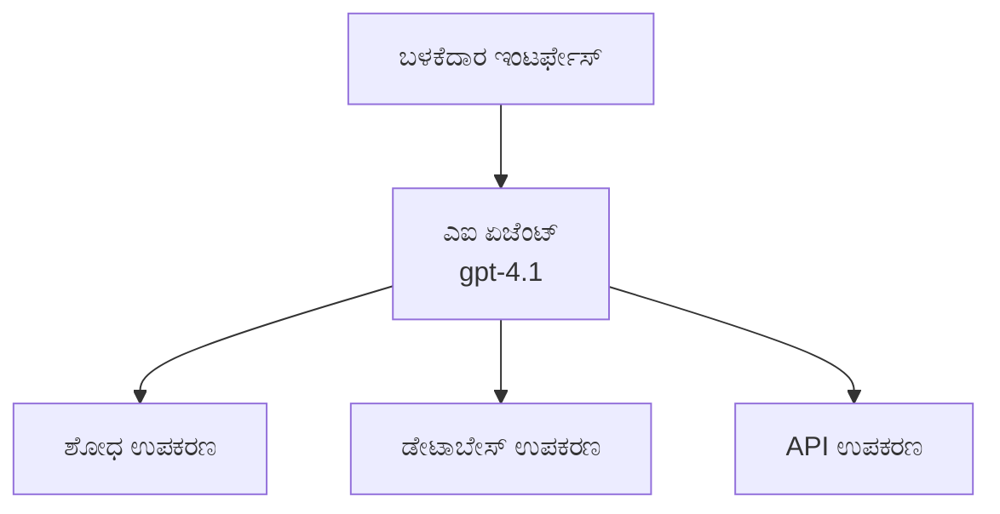
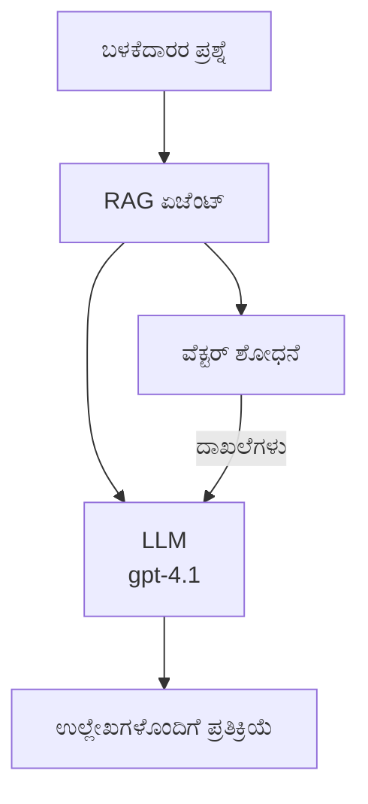
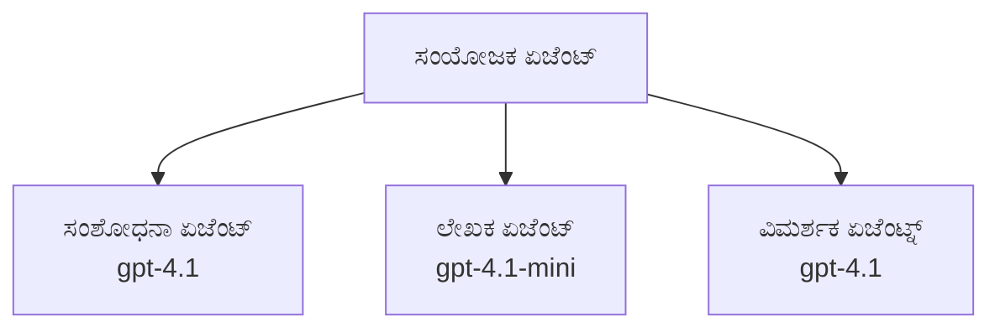

# AI ಏಜೆಂಟ್ಸ್ with Azure Developer CLI

**ಅಧ್ಯಾಯ ನ್ಯಾವಿಗೇಶನ್:**
- **📚 ಕೋರ್ಸ್ ಹೋಮ್**: [AZD For Beginners](../../README.md)
- **📖 ಪ್ರಸ್ತುತ ಅಧ್ಯಾಯ**: ಅಧ್ಯಾಯ 2 - AI-ಮಾರುಕಟ್ಟೆ ಅಭಿವೃದ್ಧಿ
- **⬅️ ಹಿಂದಿನದು**: [Microsoft Foundry Integration](microsoft-foundry-integration.md)
- **➡️ ಮುಂದಿನದು**: [AI Model Deployment](ai-model-deployment.md)
- **🚀 ಆಧುನಿಕ**: [Multi-Agent Solutions](../../examples/retail-scenario.md)

---

## ಪರಿಚಯ

AI ಏಜೆಂಟ್ಸ್ ಸ್ವಾಯತ್ತ ಪ್ರೋಗ್ರಾಮ್ಗಳು, ಅವು ತಮ್ಮ ವಾತಾವರಣವನ್ನು ಗ್ರಹಿಸಿ, ನಿರ್ಧಾರಗಳನ್ನು ತೆಗೆದು, ನಿರ್ದಿಷ್ಟ ಗುರಿಗಳನ್ನು ಸಾಧಿಸಲು ಕ್ರಿಯೆಗಳನ್ನು ನಡಿಸುವುದು. ಪ್ರಾಂಪ್ಟ್‌ಗಳಿಗೆ ಪ್ರತಿಕ್ರಿಯಿಸುವ ಸರಳ ಚಾಟ್‌ಬಾಟ್‌ಗಳಿಗಿಂತ ವಿಭಿನ್ನವಾಗಿ, ಏಜೆಂಟ್‌ಗಳು ಸಾಧ್ಯವೆಂದು ಮಾಡಬಹುದು:

- **ಉಪಕರಣಗಳನ್ನು ಬಳಸುವುದು** - APIಗಳನ್ನು ಕರೆ ಮಾಡುವುದು, ಡೇಟಾಬೇಸ್ ಹುಡುಕುವುದು, ಕೋಡ್ ಕಾರ್ಯಗೊಳಿಸುವುದು
- **ಯೋಜನೆ ಮತ್ತು ತರ್ಕ** - ಸಂಕೀರ್ಣ ಕಾರ್ಯಗಳನ್ನು ಹಂತಗಳಲ್ಲಿ ವಿಭಜಿಸುವುದು
- **ಸಂದರ್ಭದಿಂದ ಕಲಿಯುವುದು** - ಮೆಮೊರಿ ಕಾಪಾಡಿಕೊಳ್ಳಿ ಮತ್ತು ವರ್ತನೆಯನ್ನು ಹೊಂದಿಕೊಳ್ಳುವುದು
- **ಸಹಕಾರ** - ಇತರ ಏಜೆಂಟ್‌ಗಳೊಂದಿಗೆ ಕೆಲಸ ಮಾಡುವುದು (ಮಲ್ಟಿ-ಏಜೆಂಟ್ ಸಿಸ್ಟಮ್‌ಗಳು)

ಈ ಮಾರ್ಗದರ್ಶಕವು Azure Developer CLI (azd) ಬಳಸಿ AI ಏಜೆಂಟ್‌ಗಳನ್ನು Azureಗೆ ಹೇಗೆ ನಿಯೋಜಿಸುವುದನ್ನು ತೋರಿಸುತ್ತದೆ.

## ಕಲಿಕೆ ಗುರಿಗಳು

ಈ ಮಾರ್ಗದರ್ಶಕವನ್ನು ಪೂರ್ಣಗೊಳಿಸಿದರೆ, ನೀವು:
- ಏಜೆಂಟ್‌ಗಳು 무엇ವಾ ಮತ್ತು ಅವು ಚಾಟ್‌ಬಾಟ್‌ಗಳಿಂದ ಹೇಗೆ ಭಿನ್ನವಾಗಿವೆ ಎಂಬುದನ್ನು ಅರ್ಥಮಾಡಿಕೊಳ್ಳುವಿರಿ
- AZD ಬಳಸಿ ಪೂರ್ವ-ನಿರ್ಮಿತ ಏಜೆಂಟ್ ಟೆಂಪ್ಲೇಟುಗಳನ್ನು ನಿಯೋಜಿಸಲು ಸಾಧ್ಯವಾಗುತ್ತದೆ
- ಕಸ್ಟಮ್ ಏಜೆಂಟ್‌ಗಾಗಿ Foundry ಏಜೆಂಟ್‌ಗಳನ್ನು ಸಂರಚಿಸುವುದನ್ನು ತಿಳಿಯುವಿರಿ
- ಮೂಲ ಏಜೆಂಟ್ ಪ್ಯಾಟರ್ನ್ಗಳನ್ನು (ಉಪಕರಣ ಬಳಕೆ, RAG, ಮಲ್ಟಿ-ಏಜೆಂಟ್) ಜಾರಿಗೊಳಿಸುವಿರಿ
- ನಿಯೋಜಿಸಲಾದ ಏಜೆಂಟ್‌ಗಳನ್ನು ಮಾನಿಟರ್ ಹಾಗೂ ಡಿಬಗ್ ಮಾಡಲು ಅರಿತುಕೊಳ್ಳುವಿರಿ

## ಕಲಿಕೆಯ ಫಲಿತಾಂಶಗಳು

ಪೂರ್ಣಗೊಳಿಸಿದ ಮೇಲೆ, ನೀವು ಸಾಮರ್ಥ್ಯವನ್ನು ಹೊಂದಿರುತ್ತೀರಿ:
- ಒಂದೇ ಆಜ್ಞೆಯೊಂದಿಗೆ AI ಏಜೆಂಟ್ ಅಪ್ಲಿಕೇಶನ್‌ಗಳನ್ನು Azureಕ್ಕೆ ನಿಯೋಜಿಸುವುದು
- ಏಜೆಂಟ್ ಉಪಕರಣಗಳು ಮತ್ತು ಸಾಮರ್ಥ್ಯಗಳನ್ನು ಸಂರಚಿಸುವುದು
- ಏಜೆಂಟ್‌ಗಳೊಂದಿಗೆ retrieval-augmented generation (RAG) ಅನ್ನು ಜಾರಿಗೊಳಿಸುವುದು
- ಸಂಕೀರ್ಣ ವರ್ಕ್‌ಫ್ಲೋಗಳಿಗಾಗಿ ಮಲ್ಟಿ-ಏಜೆಂಟ್ معماريಗಳನ್ನು ವಿನ್ಯಾಸ ಮಾಡುವುದು
- ಸಾಮಾನ್ಯ ಏಜೆಂಟ್ ನಿಯೋಜನೆ ಸಮಸ್ಯೆಗಳನ್ನು ಪರಿಹರಿಸುವುದು

---

## 🤖 ಏಜೆಂಟ್ ಚಾಟ್‌ಬಾಟ್‌ನಿಂದ ಹೇಗೆ ವಿಭಿನ್ನ?

| ವೈಶಿಷ್ಟ್ಯ | ಚಾಟ್‌ಬಾಟ್ | AI ಏಜೆಂಟ್ |
|---------|---------|----------|
| ** ವರ್ತನೆ** | ಪ್ರಾಂಪ್ಟ್‌ಗಳಿಗೆ ಪ್ರತಿಕ್ರಿಯಿಸುತ್ತದೆ | ಸ್ವಾಯತ್ತ ಕ್ರಿಯೆಗಳನ್ನು ಕೈಗೊಳ್ಳುತ್ತದೆ |
| **ಉಪಕರಣಗಳು** | ಇಲ್ಲ | APIಗಳನ್ನು ಕರೆಮಾಡಬಹುದು, ಹುಡುಕಬಹುದು, ಕೋಡ್ ನಿರ್ವಹಿಸಬಹುದು |
| **ಸ್ಮರಣೆ** | ಕೇವಲ ಸೆಷನ್-ಆಧಾರಿತ | ಸೆಷನ್‌ಗಳ transcend ಮಾಡುವ ಸ್ಥಾಯಿ ಸ್ಮರಣೆ |
| **ಯೋಜನೆ** | ಏಕ ಪ್ರತಿಕ್ರಿಯೆ | ಬಹು ಹಂತದ ತರ್ಕ |
| **ಸಹಕಾರ** | ಏಕ ಘಟಕ | ಇತರ ಏಜೆಂಟ್‌ಗಳೊಂದಿಗೆ ಕೆಲಸ ಮಾಡಬಹುದು |

### ಸರಳ ಉಪಮೆ

- **ಚಾಟ್‌ಬಾಟ್** = ಮಾಹಿತಿಯ ಡೆಸ್ಕ್‌ನಲ್ಲಿ ಪ್ರಶ್ನೆಗಳಿಗೆ ಉತ್ತರಿಸುವ ಸಹಾಯಕ ವ್ಯಕ್ತಿ
- **AI ಏಜೆಂಟ್** = ಕರೆಗಳನ್ನು ಮಾಡಬಲ್ಲ, ನಿಯೋಜನೆಗಳನ್ನು ಬುಕ್ ಮಾಡಬಲ್ಲ, ಮತ್ತು ನಿಮಗಾಗಿ ಕಾರ್ಯಗಳನ್ನು ಪೂರ್ಣಗೊಳಿಸಬಲ್ಲ ವೈಯಕ್ತಿಕ ಸಹಾಯಕ

---

## 🚀 ತ್ವರಿತ ಪ್ರಾರಂಭ: ನಿಮ್ಮ ಮೊದಲ ಏಜೆಂಟ್ ಅನ್ನು ನಿಯೋಜಿಸಿ

### ಆಯ್ಕೆ 1: Foundry Agents ಟೆಂಪ್ಲೇಟ್ (ಶಿಫಾರಸು)

```bash
# ಎಐ ಏಜೆಂಟ್‌ಗಳ ಟೆಂಪ್ಲೇಟನ್ನು ಪ್ರಾರಂಭಿಸಿ
azd init --template get-started-with-ai-agents

# Azure ಗೆ ನಿಯೋಜಿಸಿ
azd up
```

**ಏನು ನಿಯೋಜಿಸಲಾಗುತ್ತದೆ:**
- ✅ Foundry Agents
- ✅ Microsoft Foundry Models (gpt-4.1)
- ✅ Azure AI Search (RAGಗಾಗಿ)
- ✅ Azure Container Apps (ವೆಬ್ ಇಂಟರ್ಫೇಸ್)
- ✅ Application Insights (ಮೋನಿಟರಿಂಗ್)

**ಸಮಯ:** ~15-20 ನಿಮಿಷಗಳು
**ಖರ್ಚು:** ~$100-150/ತಿಂಗಳು (ವಿಕಸನ)

### ಆಯ್ಕೆ 2: OpenAI Agent with Prompty

```bash
# Prompty ಆಧಾರಿತ ಏಜೆಂಟ್ ಟೆಂಪ್ಲೇಟ್ ಅನ್ನು ಪ್ರಾರಂಭಿಸಿ
azd init --template agent-openai-python-prompty

# Azure ಗೆ ನಿಯೋಜಿಸಿ
azd up
```

**ಏನು ನಿಯೋಜಿಸಲಾಗುತ್ತದೆ:**
- ✅ Azure Functions (ಸರ್ವರ್‍ಲೆಸ್ ಏಜೆಂಟ್ ಕಾರ್ಯ ನಿರ್ವಹಣೆ)
- ✅ Microsoft Foundry Models
- ✅ Prompty ಸಂರಚನಾ ಫೈಲ್‌ಗಳು
- ✅ 샘್ಪಲ್ ಏಜೆಂಟ್ ಜಾರಿಗೆ ಉದಾಹರಣೆ

**ಸಮಯ:** ~10-15 ನಿಮಿಷಗಳು
**ಖರ್ಚು:** ~$50-100/ತಿಂಗಳು (ವಿಕಸನ)

### ಆಯ್ಕೆ 3: RAG ಚಾಟ್ ಏಜೆಂಟ್

```bash
# RAG ಚಾಟ್ ಟೆಂಪ್ಲೇಟ್ ಅನ್ನು ಪ್ರಾರಂಭಿಸಿ
azd init --template azure-search-openai-demo

# Azure ಗೆ ನಿಯೋಜಿಸಿ
azd up
```

**ಏನು ನಿಯೋಜಿಸಲಾಗುತ್ತದೆ:**
- ✅ Microsoft Foundry Models
- ✅ ಆಧುನಿಕ ಮಾದರಿಯೊಂದಿಗೆ Azure AI Search ನ್ನು 샘್ಪಲ್ ಡೇಟಾ ಸಹಿತ
- ✅ ಡಾಕ್ಯುಮೆಂಟ್ ಪ್ರಾಸೆಸಿಂಗ್ ಪೈಪ್‌ಲೈನ್
- ✅ ಉಲ್ಲೇಖಗಳೊಂದಿಗೆ ಚಾಟ್ ಇಂಟರ್ಫೇಸ್

**ಸಮಯ:** ~15-25 ನಿಮಿಷಗಳು
**ಖರ್ಚು:** ~$80-150/ತಿಂಗಳು (ವಿಕಸನ)

### ಆಯ್ಕೆ 4: AZD AI Agent Init (Manifest-Based)

ನಿಮ್ಮ ಬಳಿ ಏಜೆಂಟ್ ಮ್ಯಾನಿಫೆಸ್ಟ್ ಫೈಲ್ ಇದ್ದರೆ, ನೀವು `azd ai` ಆಜ್ಞೆಯನ್ನು ಬಳಸಿಕೊಂಡು ನೇರವಾಗಿ Foundry Agent Service ಪ್ರಾಜೆಕ್ಟ್ ಅನ್ನು scaffold ಮಾಡಬಹುದು:

```bash
# AI ಏಜೆಂಟ್‌ಗಳ ವಿಸ್ತರಣೆಯನ್ನು ಸ್ಥಾಪಿಸಿ
azd extension install azure.ai.agents

# ಏಜೆಂಟ್ ಮ್ಯಾನಿಫೆಸ್ಟ್‌ನಿಂದ ಪ್ರಾರಂಭಿಸಿ
azd ai agent init -m agent-manifest.yaml

# ಆಜುರ್‌ಗೆ ನಿಯೋಜಿಸಿ
azd up
```

**ಯಾವಾಗ `azd ai agent init` ಬಳಸಿ vs `azd init --template` ಬಳಸಬೇಕು:**

| ಪಳ್ಳತಿ | ಅತ್ಯುತ್ತಮಕ್ಕಾಗಿ | ಅದು ಹೇಗೆ ಕೆಲಸ ಮಾಡುತ್ತದೆ |
|----------|----------|------|
| `azd init --template` | ಕೆಲಸ ಮಾಡುವ ಸ್ಯಾಂಪಲ್ ಆಪ್‌ನಿಂದ ಪ್ರಾರಂಭಿಸುವಾಗ | ಕೋಡ್ + ಇನ್ಫ್ರಾ ಜೊತೆ ಪೂರ್ಣ ಟೆಂಪ್ಲೇಟ್ ರೆಪೊವನ್ನು ಕ್ಲೋನ್ ಮಾಡುತ್ತದೆ |
| `azd ai agent init -m` | ನಿಮ್ಮದೇ ಏಜೆಂಟ್ ಮ್ಯಾನಿಫೆಸ್ಟ್‌ನಿಂದ ನಿರ್ಮಿಸಲು | ನಿಮ್ಮ ಏಜೆಂಟ್ ವ್ಯಾಖ್ಯಾನದಿಂದ ಪ್ರಾಜೆಕ್ಟ್ ರಚನೆ scaffold ಮಾಡುತ್ತದೆ |

> **ಟಿಪ್:** ಕಲಿಯುತ್ತಿರುವಾಗ Options 1-3 ಗಳಲ್ಲಿ `azd init --template` ಬಳಸಿ. ನಿಮ್ಮದೇ ಮ್ಯಾನಿಫೆಸ್ಟ್‌ಗಳೊಂದಿಗೆ ಉತ್ಪಾದನಾ ಏಜೆಂಟ್‌ಗಳನ್ನು ನಿರ್ಮಿಸುವಾಗ `azd ai agent init` ಬಳಸಿ. ಸಂಪೂರ್ಣ ದಾಖಲೆಗಾಗಿ ನೋಡಿ [AZD AI CLI Commands](../chapter-08-production/production-ai-practices.md#azd-ai-cli-commands-and-extensions)。

---

## 🏗️ ಏಜೆಂಟ್ معمಾರಿ ಪ್ಯಾಟರ್ನ್ಗಳು

### ಪ್ಯಾಟ್‌ರ್ನ್ 1: ಒಬ್ಬ ಏಜೆಂಟ್ with Tools

ಅತ್ಯಂತ ಸರಳ ಏಜೆಂಟ್ ಪ್ಯಾಟರ್ನ್ - ಬಹು ಉಪಕರಣಗಳನ್ನು ಬಳಸುವ ಒಂದು ಏಜೆಂಟ್.


**ಉತ್ತಮಕ್ಕಾಗಿ:**
- ಗ್ರಾಹಕ ಬೆಂಬಲ ಬಾಟ್‌ಗಳು
- ಸಂಶೋಧನೆ ಸಹಾಯಕರು
- ಡೇಟಾ ವಿಶ್ಲೇಷಣಾ ಏಜೆಂಟ್‌ಗಳು

**AZD ಟೆಂಪ್ಲೇಟ್:** `azure-search-openai-demo`

### ಪ್ಯಾಟ್‌ರ್ನ್ 2: RAG ಏಜೆಂಟ್ (Retrieval-Augmented Generation)

ಉತ್ತರಗಳನ್ನು ರಚಿಸುವ ಮೊದಲು ಸಂಬಂಧಿತ ಡಾಕ್ಯುಮೆಂಟ್‌ಗಳನ್ನು ಪಡೆದುಕೊಳ್ಳುವ ಏಜೆಂಟ್.


**ಉತ್ತಮಕ್ಕಾಗಿ:**
- ಎಂಟರ್ಪ್ರೈಸ್ ಜ್ಞಾನಾಭಿವೃದ್ಧಿ ಕೋಶಗಳು
- ಡಾಕ್ಯುಮೆಂಟ್ Q&A ಸಿಸ್ಟಮ್‌ಗಳು
- ಅನುಪಾಲನೆ ಮತ್ತು ಕಾನೂನು ಸಂಶೋಧನೆ

**AZD ಟೆಂಪ್ಲೇಟ್:** `azure-search-openai-demo`

### ಪ್ಯಾಟ್‌ರ್ನ್ 3: ಮಲ್ಟಿ-ಏಜೆಂಟ್ ಸಿಸ್ಟಮ್

ಸಂಕೀರ್ಣ ಕಾರ್ಯಗಳ ಮೇಲೆ ಒಟ್ಟಾಗಿ ಕೆಲಸ ಮಾಡುವ ಹಲವು ವಿಶೇಷ ಏಜೆಂಟ್‌ಗಳು.


**ಉತ್ತಮಕ್ಕಾಗಿ:**
- ಸಂಕೀರ್ಣ ವಿಷಯ ರಚನೆ
- ಬಹು ಹಂತದ ವರ್ಕ್‌ಫ್ಲೋಗಳು
- ವಿಭಿನ್ನ ಪರಿಣತಿಗಳ ಅಗತ್ಯವಿರುವ ಕಾರ್ಯಗಳು

**ಇನ್ನಷ್ಟು ಕಲಿಯಿರಿ:** [Multi-Agent Coordination Patterns](../chapter-06-pre-deployment/coordination-patterns.md)

---

## ⚙️ ಏಜೆಂಟ್ ಉಪಕರಣಗಳನ್ನು ಸಂರಚಿಸುವುದು

ಏಜೆಂಟ್‌ಗಳು ಉಪಕರಣಗಳನ್ನು ಬಳಸಿದಾಗ ಹೆಚ್ಚು ಶಕ್ತಿಶಾಲಿಯಾದವು ಆಗುತ್ತವೆ. ಸಾಮಾನ್ಯ ಉಪಕರಣಗಳನ್ನು ಹೇಗೆ ಸಂರಚಿಸುವುದು ನೋಡೋಣ:

### Foundry Agents ನಲ್ಲಿ ಉಪಕರಣ ಸಂರಚನೆ

```python
# agent_config.py
from azure.ai.projects import AIProjectClient
from azure.ai.projects.models import FunctionTool, CodeInterpreterTool

# ಕಸ್ಟಮ್ ಉಪಕರಣಗಳನ್ನು ನಿರ್ವಚಿಸಿ
search_tool = FunctionTool(
    name="search_knowledge_base",
    description="Search the company knowledge base for relevant documents",
    parameters={
        "type": "object",
        "properties": {
            "query": {
                "type": "string",
                "description": "The search query"
            }
        },
        "required": ["query"]
    }
)

# ಉಪಕರಣಗಳೊಂದಿಗೆ ಏಜೆಂಟ್ ರಚಿಸಿ
agent = project_client.agents.create_agent(
    model="gpt-4.1",
    name="Support Agent",
    instructions="You are a helpful support agent. Use the search tool to find relevant information.",
    tools=[search_tool, CodeInterpreterTool()]
)
```

### ಪರಿಸರ ಸಂರಚನೆ

```bash
# ಏಜೆಂಟ್-ನಿರ್ದಿಷ್ಟ ಪರಿಸರ ಚರಗಳನ್ನು ಸಿದ್ಧಪಡಿಸಿ
azd env set AZURE_OPENAI_MODEL "gpt-4.1"
azd env set AGENT_INSTRUCTIONS "You are a helpful assistant..."
azd env set ENABLE_CODE_INTERPRETER "true"
azd env set ENABLE_FILE_SEARCH "true"

# ನವೀಕರಿಸಿದ ಸಂರಚನೆಯೊಂದಿಗೆ ನಿಯೋಜಿಸಿ
azd deploy
```

---

## 📊 ಏಜೆಂಟ್‌ಗಳ ಮಾನಿಟರಿಂಗ್

### Application Insights ಇಂಟಿಗ್ರೇಶನ್

ಎಲ್ಲಾ AZD ಏಜೆಂಟ್ ಟೆಂಪ್ಲೇಟ್ಗಳಲ್ಲಿ ಮಾನಿಟರಿಂಗ್‌ಗಾಗಿ Application Insights ಸೇರಿದೆ:

```bash
# ನಿರೀಕ್ಷಣಾ ಡ್ಯಾಶ್‌ಬೋರ್ಡ್ ತೆರೆಯಿರಿ
azd monitor --overview

# ನೇರ ಲಾಗ್‌ಗಳನ್ನು ವೀಕ್ಷಿಸಿ
azd monitor --logs

# ನೇರ ಮಾಪಕಗಳನ್ನು ವೀಕ್ಷಿಸಿ
azd monitor --live
```

### ಗಮನಿಸುವ ಪ್ರಮುಖ ಮೀಟ್ರಿಕ್‌ಗಳು

| ಮೀಟ್ರಿಕ್ | ವಿವರಣೆ | ಗುರಿ |
|--------|-------------|--------|
| ಪ್ರತಿಕ್ರಿಯೆ ವಿಳಂಬ | ಪ್ರತಿಕ್ರಿಯೆ ರಚಿಸಲು ತೆಗೆದುಕೊಳ್ಳುವ ಸಮಯ | < 5ಸೆಕೆಂಡುಗಳು |
| ಟೋಕನ್ ಬಳಕೆ | ಪ್ರತಿ ವಿನಂತಿಗೆ ಟೋಕನ್‌ಗಳು | ವೆಚ್ಚಕ್ಕಾಗಿ ಗಮನಿಸಿ |
| ಉಪಕರಣ ಕರೆ ಯಶಸ್ಸಿನ ದರ | ಯಶಸ್ವಿ ಉಪಕರಣ ಕಾರ್ಯಗತಗೊಳಿಸುವಿಕೆಯ % | > 95% |
| ದೋಷ ದರ | ವಿಫಲವಾದ ಏಜೆಂಟ್ ವಿನಂತಿಗಳು | < 1% |
| ಬಳಕೆದಾರ ತೃಪ್ತಿ | ಫೀಡ್‌ಬ್ಯಾಕ್ ಸ್ಕೋರ್‌ಗಳು | > 4.0/5.0 |

### ಏಜೆಂಟ್‌ಗಳಿಗಾಗಿ ಕಸ್ಟಮ್ ಲಾಗಿಂಗ್

```python
import os
from azure.monitor.opentelemetry import configure_azure_monitor
from opentelemetry import trace

# OpenTelemetry ನೊಂದಿಗೆ Azure Monitor ಅನ್ನು ಸಂರಚಿಸಿ
configure_azure_monitor(
    connection_string=os.environ["APPLICATIONINSIGHTS_CONNECTION_STRING"]
)

tracer = trace.get_tracer(__name__)

def log_agent_interaction(user_query, agent_response, tools_used, latency_ms):
    with tracer.start_as_current_span("agent_interaction") as span:
        span.set_attributes({
            "user_query": user_query,
            "response_length": len(agent_response),
            "tools_used": tools_used,
            "latency_ms": latency_ms
        })
```

> **ಗಮನಿಸಿ:** ಅಗತ್ಯವಿರುವ ಪ್ಯಾಕೇಜ್‌ಗಳನ್ನು ಸ್ಥಾಪಿಸಿ: `pip install azure-monitor-opentelemetry opentelemetry`

---

## 💰 ವೆಚ್ಚ ಪರಿಗಣನೆಗಳು

### ಪ್ಯಾಟ್‌ರ್ನ್ ಆಧಾರಿತ ಅಂದಾಜು ತಿಂಗಳ ವೆಚ್ಚಗಳು

| ಪ್ಯಾಟ್‌ರ್ನ್ | ಡೆವ್ ಪರಿಸರ | ಉತ್ಪಾದನೆ |
|---------|-----------------|------------|
| ಒಬ್ಬ ಏಜೆಂಟ್ | $50-100 | $200-500 |
| RAG ಏಜೆಂಟ್ | $80-150 | $300-800 |
| ಮಲ್ಟಿ-ಏಜೆಂಟ್ (2-3 ಏಜೆಂಟ್‌ಗಳು) | $150-300 | $500-1,500 |
| ಎಂಟರ್ಪ್ರೈಸ್ ಮಲ್ಟಿ-ಏಜೆಂಟ್ | $300-500 | $1,500-5,000+ |

### ವೆಚ್ಚ 최적ೀಕರಣ ಟಿಪ್ಸ್

1. **ಸಾಧಾರಣ ಕಾರ್ಯಗಳಿಗೆ gpt-4.1-mini ಬಳಸಿ**
   ```bash
   azd env set AZURE_OPENAI_MODEL "gpt-4.1-mini"
   ```

2. **ಮತ್ತೆ-ಮತ್ತೆ ಕೇಳುವ ಪ್ರಶ್ನೆಗಳಿಗೆ ಕ್ಯಾಸಿಂಗ್ ಅನ್ನು ಜಾರಿಗೊಳಿಸಿ**
   ```python
   from functools import lru_cache
   
   @lru_cache(maxsize=1000)
   def get_cached_response(query_hash):
       return agent.run(query_hash)
   ```

3. **ಪ್ರತಿಯೊಂದು ಓಟ್ನೊಂದಿಗೆ ಟೋಕನ್ ಮಿತಿ ನಿಗದಿಸಿ**
   ```python
   # ಏಜೆಂಟ್ ಅನ್ನು ನಡೆಸುವಾಗ max_completion_tokens ಅನ್ನು ಹೊಂದಿಸಿ, ಸೃಷ್ಟಿಸುವಾಗ ಅಲ್ಲ
   run = project_client.agents.create_run(
       thread_id=thread.id,
       agent_id=agent.id,
       max_completion_tokens=1000  # ಪ್ರತಿಕ್ರಿಯೆಯ ಉದ್ದವನ್ನು ಮಿತಿಗೊಳಿಸಿ
   )
   ```

4. **ಬಳಕೆಯಲ್ಲಿ ಇಲ್ಲದೇ ಇರುವಾಗ scale to zero ಅನ್ನು ಬಳಸಿರಿ**
   ```bash
   # Container Apps ಸ್ವಯಂಚಾಲಿತವಾಗಿ ಶೂನ್ಯಕ್ಕೆ ಸ್ಕೇಲ್ ಆಗುತ್ತವೆ
   azd env set MIN_REPLICAS "0"
   ```

---

## 🔧 ಏಜೆಂಟ್ ತೊಂದರೆ ಪರಿಹಾರ

### ಸಾಮಾನ್ಯ ಸಮಸ್ಯೆಗಳು ಮತ್ತು ಪರಿಹಾರಗಳು

<details>
<summary><strong>❌ ಉಪಕರಣ ಕರೆಗಳಿಗೆ ಏಜೆಂಟ್ ಪ್ರತಿಕ್ರಿಯೆ ನೀಡುತ್ತಿಲ್ಲ</strong></summary>

```bash
# ಉಪಕರಣಗಳು ಸರಿಯಾಗಿ ನೋಂದಾಯಿಸಲ್ಪಟ್ಟಿದೆಯೇ ಎಂದು ಪರಿಶೀಲಿಸಿ
azd show

# OpenAI ನಿಯೋಜನೆಯನ್ನು ಪರಿಶೀಲಿಸಿ
az cognitiveservices account deployment list \
  --name $AZURE_OPENAI_NAME \
  --resource-group $RG_NAME

# ಏಜೆಂಟ್ ಲಾಗ್‌ಗಳನ್ನು ಪರಿಶೀಲಿಸಿ
azd monitor --logs
```

**ಸಾಮಾನ್ಯ ಕಾರಣಗಳು:**
- ಉಪಕರಣ ಫಂಕ್ಷನ್ ಸಿಗ್ನೇಚರ್ ಹೊಂದಾಣಿಕೆ ಇಲ್ಲ
- ಅಗತ್ಯ ಪರವಾನಗಿಗಳು ಕಳೆದುದಾದದು
- API ಎಂಡ್‌ಪಾಯಿಂಟ್ ಪ್ರವೇಶನಾರ್ಹವಲ್ಲ
</details>

<details>
<summary><strong>❌ ಏಜೆಂಟ್ ಪ್ರತಿಕ್ರಿಯೆಗಳಲ್ಲಿ ಹೆಚ್ಚಿನ ವಿಳಂಬ</strong></summary>

```bash
# ಅಡಚಣೆಗಳಿಗಾಗಿ Application Insights ಅನ್ನು ಪರಿಶೀಲಿಸಿ
azd monitor --live

# ವೇಗದ ಮಾದರಿಯನ್ನು ಬಳಸಲು ಪರಿಗಣಿಸಿ
azd env set AZURE_OPENAI_MODEL "gpt-4.1-mini"
azd deploy
```

**ತ್ವರಿತಗೊಳಿಸುವ ಸಲಹೆಗಳು:**
- ಸ್ಟ್ರೀಮಿಂಗ್ ಪ್ರತಿಕ್ರಿಯೆಗಳನ್ನು ಬಳಸಿ
- ಪ್ರತಿಕ್ರಿಯೆ ಕ್ಯಾಸಿಂಗ್ ಜಾರಿಗೊಳಿಸಿ
- ಕಂಟೆಕ್ಸ್ಟ್ ವಿಂಡೋ ಗಾತ್ರದನ್ನ ಕಡಿಮೆ ಮಾಡಿ
</details>

<details>
<summary><strong>❌ ಏಜೆಂಟ್ ತಪ್ಪು ಅಥವಾ ಊಹಾಪೋಹಿತ ಮಾಹಿತಿಯನ್ನು ನೀಡುತ್ತಿದೆ</strong></summary>

```python
# ಉತ್ತಮ ಸಿಸ್ಟಮ್ ಪ್ರಾಂಪ್ಟ್‌ಗಳೊಂದಿಗೆ ಸುಧಾರಿಸಿ
instructions = """
You are a helpful assistant. IMPORTANT:
- Only answer based on provided context
- If you don't know, say "I don't know"
- Always cite your sources
- Never make up information
"""

# ಆಧಾರಗೊಳಿಸಲು ಮಾಹಿತಿ ಪಡೆಯುವ ವ್ಯವಸ್ಥೆಯನ್ನು ಸೇರಿಸಿ
agent = project_client.agents.create_agent(
    model="gpt-4.1",
    instructions=instructions,
    tools=[FileSearchTool()]  # ಪ್ರತಿಕ್ರಿಯೆಗಳನ್ನು ಡಾಕ್ಯುಮೆಂಟ್‌ಗಳಲ್ಲಿ ಆಧಾರಗೊಳಿಸಿ
)
```
</details>

<details>
<summary><strong>❌ ಟೋಕನ್ ಮಿತಿ ಮೀರಿದ ದೋಷಗಳು</strong></summary>

```python
# ಸಂದರ್ಭ ಕಿಟಕಿ ನಿರ್ವಹಣೆಯನ್ನು ಅನುಷ್ಠಾನಗೊಳಿಸಿ
def truncate_context(messages, max_tokens=8000, model="gpt-4.1"):
    """Keep only recent messages within token limit."""
    import tiktoken
    encoding = tiktoken.encoding_for_model(model)
    total_tokens = 0
    truncated = []
    
    for msg in reversed(messages):
        msg_tokens = len(encoding.encode(msg.content))
        if total_tokens + msg_tokens > max_tokens:
            break
        truncated.insert(0, msg)
        total_tokens += msg_tokens
    
    return truncated
```
</details>

---

## 🎓 ಪ್ರಾಯೋಗಿಕ ಅಭ್ಯಾಸಗಳು

### ಅಭ್ಯಾಸ 1: ಮೂಲ ಏಜೆಂಟ್ ನಿಯೋಜಿಸಿ (20 ನಿಮಿಷಗಳು)

**ಗೋಲ್:** AZD ಬಳಸಿ ನಿಮ್ಮ ಮೊದಲ AI ಏಜೆಂಟ್ ಅನ್ನು ನಿಯೋಜಿಸಿ

```bash
# ಹಂತ 1: ಟೆಂಪ್ಲೇಟ್ ಅನ್ನು ಪ್ರಾರಂಭಿಸಿ
azd init --template get-started-with-ai-agents

# ಹಂತ 2: ಆಜ್ಯೂರ್‌ಗೆ ಲಾಗಿನ್ ಮಾಡಿ
azd auth login

# ಹಂತ 3: ನಿಯೋಜಿಸಿ
azd up

# ಹಂತ 4: ಏಜೆಂಟ್ ಅನ್ನು ಪರೀಕ್ಷಿಸಿ
# ನಿಯೋಜನೆಯ ನಂತರ ನಿರೀಕ್ಷಿತ ಫಲಿತಾಂಶ:
#   ನಿಯೋಜನೆ ಪೂರ್ಣಗೊಂಡಿದೆ!
#   ಎಂಡ್ಪಾಯಿಂಟ್: https://<app-name>.<region>.azurecontainerapps.io
# ಔಟ್‌ಪುಟ್‌ನಲ್ಲಿ ತೋರಿಸಿದ URL ಅನ್ನು ತೆರೆಯಿರಿ ಮತ್ತು ಒಂದು ಪ್ರಶ್ನೆ ಕೇಳಲು ಪ್ರಯತ್ನಿಸಿ

# ಹಂತ 5: ಮಾನಿಟರಿಂಗ್ ವೀಕ್ಷಿಸಿ
azd monitor --overview

# ಹಂತ 6: ಸ್ವಚ್ಛಗೊಳಿಸಿ
azd down --force --purge
```

**ಯಶಸ್ಸಿನ ಮಾನದಂಡಗಳು:**
- [ ] ಏಜೆಂಟ್ ಪ್ರಶ್ನೆಗಳಿಗೆ ಪ್ರತಿಕ್ರಿಯಿಸುತ್ತದೆ
- [ ] `azd monitor` ಮೂಲಕ ಮಾನಿಟರಿಂಗ್ ಡ್ಯಾಶ್‌ಬೋರ್ಡ್‌ಗೆ ಪ್ರವೇಶ ಸಾಧ್ಯವಾಗಿದೆ
- [ ] ಸಂಪನ್ಮೂಲಗಳನ್ನು ಯಶಸ್ವಿಯಾಗಿ ಕ್ಲೀನ್ ಅಪ್ ಮಾಡಲಾಗಿದೆ

### ಅಭ್ಯಾಸ 2: ಕಸ್ಟಮ್ ಉಪಕರಣವನ್ನು ಸೇರಿಸಿ (30 ನಿಮಿಷಗಳು)

**ಗೋಲ್:** ಏಜೆಂಟ್‌ಗೆ ಕಸ್ಟಮ್ ಉಪಕರಣವನ್ನು ವಿಸ್ತರಿಸು

1. ಏಜೆಂಟ್ ಟೆಂಪ್ಲೇಟನ್ನು ನಿಯೋಜಿಸಿ:
   ```bash
   azd init --template get-started-with-ai-agents
   azd up
   ```
2. ನಿಮ್ಮ ಏಜೆಂಟ್ ಕೋಡ್‌ನಲ್ಲಿ ಹೊಸ ಉಪಕರಣ ಫಂಕ್ಷನ್ ಸೃಷ್ಟಿಸಿ:
   ```python
   def get_weather(location: str) -> str:
       """Get current weather for a location."""
       # ಹವಾಮಾನ ಸೇವೆಗೆ API ಕರೆ
       return f"Weather in {location}: Sunny, 72°F"
   ```
3. ಉಪಕರಣವನ್ನು ಏಜೆಂಟ್‌ಗೆ ನೋಂದಣಿ ಮಾಡಿ:
   ```python
   from azure.ai.projects.models import FunctionTool

   weather_tool = FunctionTool(
       name="get_weather",
       description="Get current weather for a location",
       parameters={
           "type": "object",
           "properties": {
               "location": {"type": "string", "description": "City name"}
           },
           "required": ["location"]
       }
   )

   agent = project_client.agents.create_agent(
       model="gpt-4.1",
       name="Weather Agent",
       tools=[weather_tool]
   )
   ```
4. ಮರು-ನಿಯೋಜಿಸಿ ಮತ್ತು ಪರೀಕ್ಷಿಸಿ:
   ```bash
   azd deploy
   # ಕೇಳಿ: "ಸೀಯಾಟಲ್‌ನಲ್ಲಿ ವಾತಾವರಣ ಹೇಗಿದೆ?"
   # ನಿರೀಕ್ಷೆ: ಏಜೆಂಟ್ get_weather("Seattle") ಅನ್ನು ಕರೆದು ಹವಾಮಾನ ಮಾಹಿತಿಯನ್ನು ಹಿಂತಿರುಗಿಸುತ್ತದೆ
   ```

**ಯಶಸ್ಸಿನ ಮಾನದಂಡಗಳು:**
- [ ] ಏಜೆಂಟ್ ಹವಾಮಾನ-ಸಂಬಂಧಿತ ಪ್ರಶ್ನೆಗಳನ್ನು ಗುರುತಿಸುತ್ತದೆ
- [ ] ಉಪಕರಣ ಸರಿಯಾಗಿ ಕರೆಮಾಡಲ್ಪಟ್ಟಿದೆ
- [ ] ಪ್ರತಿಕ್ರಿಯೆಯಲ್ಲಿ ಹವಾಮಾನ ಮಾಹಿತಿ ಸೇರಿದೆ

### ಅಭ್ಯಾಸ 3: RAG ಏಜೆಂಟ್ ನಿರ್ಮಿಸಿ (45 ನಿಮಿಷಗಳು)

**ಗೋಲ್:** ನಿಮ್ಮ ಡಾಕ್ಯುಮೆಂಟ್‌ಗಳಿಂದ ಪ್ರಶ್ನೆಗಳಿಗೆ ಉತ್ತರಿಸುವ ಏಜೆಂಟ್ ರಚಿಸಿ

```bash
# ಹಂತ 1: RAG ಟೆಂಪ್ಲೇಟನ್ನು ನಿಯೋಜಿಸಿ
azd init --template azure-search-openai-demo
azd up

# ಹಂತ 2: ನಿಮ್ಮ ದಾಖಲೆಗಳನ್ನು ಅಪ್‌ಲೋಡ್ ಮಾಡಿ
# PDF/TXT ಕಡತಗಳನ್ನು data/ ಡೈರೆಕ್ಟರಿಯಲ್ಲಿ ಇರಿಸಿ, ನಂತರ ರನ್ ಮಾಡಿ:
python scripts/prepdocs.py

# ಹಂತ 3: ಡೊಮೇನ್-ನಿರ್ದಿಷ್ಟ ಪ್ರಶ್ನೆಗಳಿಂದ ಪರೀಕ್ಷಿಸಿ
# azd up ಔಟ್‌ಪುಟ್‌ನಲ್ಲಿನ ವೆಬ್ ಆಪ್ URL ಅನ್ನು ತೆರೆಯಿರಿ
# ನೀವು ಅಪ್‌ಲೋಡ್ ಮಾಡಿದ ದಾಖಲೆಗಳ ಬಗ್ಗೆ ಪ್ರಶ್ನೆಗಳನ್ನು ಕೇಳಿ
# ಪ್ರತಿಕ್ರಿಯೆಗಳಲ್ಲಿ [doc.pdf] ಎಂಬ ಉಲ್ಲೇಖದ ಸೂಚನೆಯನ್ನು ಸೇರಿಸಿರಬೇಕು
```

**ಯಶಸ್ಸಿನ ಮಾನದಂಡಗಳು:**
- [ ] ಏಜೆಂಟ್ ಅಪ್ಲೋಡ್ ಮಾಡಿದ ಡಾಕ್ಯುಮೆಂಟ್‌ಗಳಿಂದ ಉತ್ತರಿಸುತ್ತದೆ
- [ ] ಪ್ರತಿಕ್ರಿಯೆಗಳು ಉಲ್ಲೇಖಗಳನ್ನು ಒಳಗೊಂಡಿರುತ್ತವೆ
- [ ] ವ್ಯಾಪ್ತಿಯಿಂದ ಹೊರಗಿನ ಪ್ರಶ್ನೆಗಳಲ್ಲಿ ಊಹಾಪೋಹ ಇಲ್ಲ

---

## 📚 ಮುಂದಿನ ಹೆಜ್ಜೆಗಳು

ಈಗ ನೀವು AI ಏಜೆಂಟ್‌ಗಳನ್ನು ಅರ್ಥಮಾಡಿಕೊಂಡಿದ್ದೀರಿ, ಈ ಆಧುನಿಕ ವಿಷಯಗಳನ್ನು ಅನ್ವೇಷಿಸಿ:

| ವಿಷಯ | ವಿವರ | ಲಿಂಕ್ |
|-------|-------------|------|
| **Multi-Agent Systems** | ಬಹು ಸಹಕರಿಸುವ ಏಜೆಂಟ್‌ಗಳೊಂದಿಗೆ ವ್ಯವಸ್ಥೆಗಳನ್ನು ನಿರ್ಮಿಸಿ | [Retail Multi-Agent Example](../../examples/retail-scenario.md) |
| **Coordination Patterns** | ಒರ್ಗನೈಸೇಶನ್ ಮತ್ತು ಸಂವಹನ ಪ್ಯಾಟರ್ನ್‌ಗಳನ್ನು ಕಲಿಯಿರಿ | [Coordination Patterns](../chapter-06-pre-deployment/coordination-patterns.md) |
| **Production Deployment** | ಉತ್ಪಾದನಾ-ಸಿದ್ಧ ಏಜೆಂಟ್ ನಿಯೋಜನೆ | [Production AI Practices](../chapter-08-production/production-ai-practices.md) |
| **Agent Evaluation** | ಏಜೆಂಟ್ ಕಾರ್ಯಕ್ಷಮತೆಯನ್ನು ಪರೀಕ್ಷಿಸಿ ಮತ್ತು ಅಂದಾಜಿಸಿ | [AI Troubleshooting](../chapter-07-troubleshooting/ai-troubleshooting.md) |
| **AI Workshop Lab** | ಕೈಯಲ್ಲಿ: ನಿಮ್ಮ AI ಪರಿಹಾರವನ್ನು AZD-ಗೆ ತಯಾರಿಸಿ | [AI Workshop Lab](ai-workshop-lab.md) |

---

## 📖 ಹೆಚ್ಚುವರಿ ಸಂಪನ್ಮೂಲಗಳು

### ಅಧಿಕೃತ ಡಾಕ್ಯುಮೆಂಟೇಶನ್
- [Azure AI Agent Service](https://learn.microsoft.com/azure/ai-services/agents/)
- [Azure AI Foundry Agent Service Quickstart](https://learn.microsoft.com/azure/ai-services/agents/quickstart)
- [Semantic Kernel Agent Framework](https://learn.microsoft.com/semantic-kernel/)

### ಏಜೆಂಟ್‌ಗಳಿಗೆ AZD ಟೆಂಪ್ಲೇಟ್ಗಳು
- [Get Started with AI Agents](https://github.com/Azure-Samples/get-started-with-ai-agents)
- [Agent OpenAI Python Prompty](https://github.com/Azure-Samples/agent-openai-python-prompty)
- [Azure Search OpenAI Demo](https://github.com/Azure-Samples/azure-search-openai-demo)

### ಸಮುದಾಯ ಸಂಪನ್ಮೂಲಗಳು
- [Awesome AZD - Agent Templates](https://azure.github.io/awesome-azd/?tags=ai-agents)
- [Azure AI Discord](https://discord.gg/microsoft-azure)
- [Microsoft Foundry Discord](https://discord.gg/nTYy5BXMWG)

### ನಿಮ್ಮ ಎಡಿಟರ್‌ಗೆ ಏಜೆಂಟ್ ಸ್ಕಿಲ್ಸ್
- [**Microsoft Azure Agent Skills**](https://skills.sh/microsoft/github-copilot-for-azure) - GitHub Copilot, Cursor ಅಥವಾ ಯಾವುದೇ ಬೆಂಬಲಿತ ಏಜೆಂಟ್‌ನಲ್ಲಿ Azure ಅಭಿವೃದ್ಧಿಗೆ ಮರುಬಳಕೆಯಾದ AI ಏಜೆಂಟ್ ಸ್ಕಿಲ್ಸ್ ಅನ್ನು ಇನ್ಸ್‌ಟಾಲ್ ಮಾಡಿ. ಇದರಲ್ಲಿ [Azure AI](https://skills.sh/microsoft/github-copilot-for-azure/azure-ai), [Microsoft Foundry](https://skills.sh/microsoft/github-copilot-for-azure/microsoft-foundry), [deployment](https://skills.sh/microsoft/github-copilot-for-azure/azure-deploy), ಮತ್ತು [diagnostics](https://skills.sh/microsoft/github-copilot-for-azure/azure-diagnostics)ಗೆ ಸ್ಕಿಲ್ಸ್ ಒಳಗೊಂಡಿವೆ:
  ```bash
  npx skills add microsoft/github-copilot-for-azure
  ```

---

**ನ್ಯಾವಿಗೇಶನ್**
- **ಹಿಂದಿನ ಪಾಠ**: [Microsoft Foundry Integration](microsoft-foundry-integration.md)
- **ಮುಂದಿನ ಪಾಠ**: [AI Model Deployment](ai-model-deployment.md)

---

<!-- CO-OP TRANSLATOR DISCLAIMER START -->
**Disclaimer**:
ಈ ದಾಖಲೆ AI ಅನುವಾದ ಸೇವೆ [Co-op Translator](https://github.com/Azure/co-op-translator) ಬಳಸಿಕೊಂಡು ಅನುವದಿಸಲಾಗಿದೆ. ನಾವು ನಿಖರತೆಗಾಗಿ ಪ್ರಯತ್ನಿಸಿದರೂ, ಸ್ವಯಂಚಾಲಿತ ಅನುವಾದಗಳಲ್ಲಿ ದೋಷಗಳು ಅಥವಾ ಅಸತ್ಯತೆಗಳು ಇರಬಹುದೆಂದು ದಯವಿಟ್ಟು ಗಮನದಲ್ಲಿರಿಸಿ. ಮೂಲ ಭಾಷೆಯಲ್ಲಿರುವ ಮೂಲ ದಾಖಲೆ ಅಧಿಕೃತ ಮೂಲವೆಂದು ಪರಿಗಣಿಸಬೇಕಾಗಿದೆ. ಗಂಭೀರ ಮಾಹಿತಿಗಾಗಿ ವೃತ್ತಿಪರ ಮಾನವ ಅನುವಾದವನ್ನು ಶಿಫಾರಸು ಮಾಡಲಾಗುತ್ತದೆ. ಈ ಅನುವಾದದ ಬಳಕೆಯಿಂದ ಉಂಟಾಗುವ ಯಾವುದೇ ತಪ್ಪು ಅರ್ಥಮಾಡಿಕೆಗಳು ಅಥವಾ ತಪ್ಪು ವಿವರಣೆಗಳಿಗಾಗಿ ನಾವು ಹೊಣೆಗಾರರಲ್ಲ.
<!-- CO-OP TRANSLATOR DISCLAIMER END -->