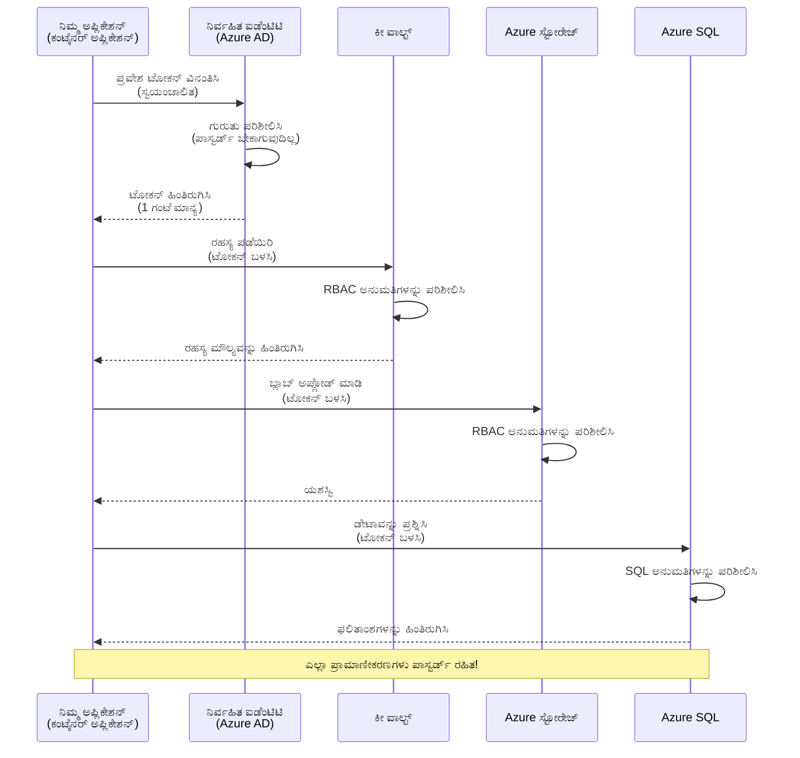
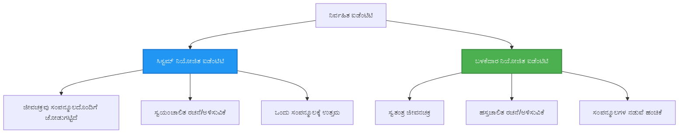

#Authentication Patterns and Managed Identity

⏱️ **ಅಂದಾಜು ಸಮಯ**: 45-60 ನಿಮಿಷಗಳು | 💰 **ಖರ್ಚು ಪ್ರಭಾವ**: ಉಚಿತ (ಹೆಚ್ಚುವರಿ ಶುಲ್ಕಗಳಿಲ್ಲ) | ⭐ **ಸಂಕೀರ್ಣತೆ**: ಮಧ್ಯಮ

**📚 ಕಲಿಕಾ ದಾರಿ:**
- ← ಹಿಂದಿನದು: [ಕಾನ್ಫಿಗರೇಶನ್ ನಿರ್ವಹಣೆ](configuration.md) - ಪರಿಸರ ಚರಗಳು ಮತ್ತು ರಹಸ್ಯಗಳ ನಿರ್ವಹಣೆ
- 🎯 **ನೀವು ಇಲ್ಲಿ ಇದ್ದೀರಿ**: ಅಥೆಂಟಿಕೇಶನ್ ಮತ್ತು ಭದ್ರತೆ (ನಿರ್ವಹಿತ ಐಡಿಂಟಿಟಿ, Key Vault, ಸುರಕ್ಷಿತ ಮಾದರಿಗಳು)
- → ಮುಂದಿನದು: [ಮೊದಲ ಪ್ರಾಜೆಕ್ಟ್](first-project.md) - ನಿಮ್ಮ ಮೊದಲ AZD ಅಪ್ಲಿಕೇಶನ್ ರಚಿಸಿ
- 🏠 [ಕೋರ್ಸ್ ಹೋಂ](../../README.md)

---

## ನೀವು ಏನು ಕಲಿಯುತ್ತೀರಿ

ಈ ಪಾಠವನ್ನು ಪೂರ್ಣಗೊಳಿಸಿದರೆ, ನೀವು:
- Azure ಅథೆಂಟಿಕೇಶನ್ ಮಾದರಿಗಳನ್ನು ಅರ್ಥಮಾಡಿಕೊಳ್ಳುವುದು (ಕೀಗಳು, ಕನೆಕ್ಷನ್ ಸ್ಟ್ರಿಂಗ್ಸ್, ನಿರ್ವಹಿತ ಐಡಿಂಟಿಟಿ)
- ಪಾಸ್ವರ್ಡ್ ರಹಿತ ಪ್ರಾಮಾಣೀಕರಣಕ್ಕಾಗಿ **Managed Identity** ಅನ್ನು ಅನ್ವಯಿಸುವುದು
- **Azure Key Vault** ಸಂಯೋಜನೆಯ ಮೂಲಕ ರಹಸ್ಯಗಳನ್ನು ಸುರಕ್ಷಿತಗೊಳಿಸುವುದು
- AZD ನಿಯೋಜನೆಗಳಿಗಾಗಿ **role-based access control (RBAC)** ಅನ್ನು ಸಂರಚಿಸುವುದು
- Container Apps ಮತ್ತು Azure ಸೇವೆಗಳಲ್ಲಿ ಭದ್ರತಾ ಉತ್ತಮ ಅಭ್ಯಾಸಗಳನ್ನು ಅನ್ವಯಿಸುವುದು
- ಕೀ ಆಧಾರಿತ ಪ್ರಾಮಾಣೀಕರಣದಿಂದ ಐಡಿಂಟಿಟಿ ಆಧಾರಿತಕ್ಕೆ ವರ್ಗಾಯಿಸುವುದು

## ನಿರ್ವಹಿತ ಐಡಿಂಟಿಟಿ ಪ್ರಮುಖತೆ

### ಸಮಸ್ಯೆ: ಸಾಂಪ್ರದಾಯಿಕ ಪ್ರಾಮಾಣೀಕರಣ

**Managed Identity ಮುನ್ನ:**
```javascript
// ❌ ಭದ್ರತಾ ಅಪಾಯ: ಕೋಡ್‌ನಲ್ಲಿ ಹಾರ್ಡ್‌ಕೋಡ್ ಆಗಿರುವ ರಹಸ್ಯಗಳು
const connectionString = "Server=mydb.database.windows.net;User=admin;Password=P@ssw0rd123";
const storageKey = "xK7mN9pQ2wR5tY8uI0oP3aS6dF1gH4jK...";
const cosmosKey = "C2x7B9n4M1p8Q5w3E6r0T2y5U8i1O4p7...";
```

**ಸಮಸ್ಯೆಗಳು:**
- 🔴 **ಪ್ರಕಟವಾದ ರಹಸ್ಯಗಳು** ಕೋಡ್, ಕಾನ್ಫಿಗ್ ಫೈಲ್‌ಗಳು, ಪರಿಸರ ಚರಗಳಲ್ಲಿ
- 🔴 **ಪ್ರಾಮಾಣಪತ್ರ ರೋಟೇಶನ್**‌ಗೆ ಕೋಡ್ ಬದಲಾವಣೆಗಳು ಮತ್ತು ಪುನಃನಿಯೋಜನೆ ಅಗತ್ಯ
- 🔴 **ಆಡಿಟ್ ಕಳವಳ** - ಯಾರು ಏನನ್ನು ಯಾವಾಗ ಪ್ರವೇಶಿಸಿದರು?
- 🔴 **ವಿಸ್ತಾರ** - ರಹಸ್ಯಗಳು ಅನೇಕ ವ್ಯವಸ್ಥೆಗಳಲ್ಲಿ ಹರಡಿವೆ
- 🔴 **ಅನುಕೂಲತಾ ಅಪಾಯಗಳು** - ಭದ್ರತಾ ಆಡಿಟ್‌ಗಳಿಗಾಗಿ ವಿಫಲವಾಗುವ ಸಾಧ್ಯತೆ

### ಪರಿಹಾರ: ನಿರ್ವಹಿತ ಐಡಿಂಟಿಟಿ

**Managed Identity ನಂತರ:**
```javascript
// ✅ ಸುರಕ್ಷಿತ: ಕೋಡ್‌ನಲ್ಲಿ ಯಾವುದೇ ರಹಸ್ಯಗಳಿಲ್ಲ
const credential = new DefaultAzureCredential();
const client = new BlobServiceClient(
  "https://mystorageaccount.blob.core.windows.net",
  credential  // ಏಜರ್ ಸ್ವಯಂಚಾಲಿತವಾಗಿ ಪ್ರಾಮಾಣೀಕರಣವನ್ನು ನಿರ್ವಹಿಸುತ್ತದೆ
);
```

**ಲಾಭಗಳು:**
- ✅ **ಕೋಡ್ ಅಥವಾ ಸಂರಚನೆಯಲ್ಲಿ ಯಾವುದೇ ರಹಸ್ಯಗಳಿಲ್ಲ**
- ✅ **ಸ್ವಯಂಚಾಲಿತ ರೋಟೇಶನ್** - ಇದನ್ನು Azure ನಡಿಸುತ್ತದೆ
- ✅ **Azure AD ಲಾಗ್‌ಗಳಲ್ಲಿ ಸಂಪೂರ್ಣ ಆಡಿಟ್ ಟ್ರೇಲ್**
- ✅ **ಕೆಂದ್ರೀಕೃತ ಭದ್ರತೆ** - Azure ಪೋರ್ಟಲ್‌ನಲ್ಲಿ ನಿರ್ವಹಿಸಿ
- ✅ **ಅನುಕೂಲತೆಯಾಗಿ ಸಿದ್ಧ** - ಭದ್ರತಾ ಮಾನದಂಡಗಳನ್ನು ಪೂರೈಸುತ್ತದೆ

**ಉಪಮಾನ**: ಸಾಂಪ್ರದಾಯಿಕ ಪ್ರಾಮಾಣೀಕರಣವು ವಿಭಿನ್ನ ಬಾಗಿಲುಗಳಿಗಾಗಿ ಅನೇಕ ಭೌತಿಕ ತಲೆಯಗಳನ್ನು ಹೊತ್ತುಕೊಳ್ಳುವುದರಂತೆ. ನಿರ್ವಹಿತ ಐಡಿಂಟಿಟಿ ಎಂದರೆ ನೀವು ಯಾರು ಎಂಬುದರ ಆಧಾರದಲ್ಲಿ ಸ್ವಯಂಚಾಲಿತವಾಗಿ ಪ್ರವೇಶವನ್ನು ಒದಗಿಸುವ ಭದ್ರತಾ ಬ್ಯಾಡ್ಜ್ ಹೊಂದಿರುವದು—ಹಾರಿಸಲು, ನಕಲು ಮಾಡಲು ಅಥವಾ ರೋಟೇಟ್ ಮಾಡಲು ಯಾವುದೇ ಕೀಲಿಗಳಿಲ್ಲ.

---

## ವಾಸ್ತುಶಿಲ್ಪ ಅವಲೋಕನ

### Managed Identity ಬಳಸಿ ಪ್ರಾಮಾಣೀಕರಣ ಪ್ರವಾಹ


### Managed Identities ಪ್ರಕಾರಗಳು


| Feature | System-Assigned | User-Assigned |
|---------|----------------|---------------|
| **Lifecycle** | ಸಂಪನ್ಮೂಲಕ್ಕೆ ಸಂಬಂಧಿಸಿದೆ | ಸ್ವತಂತ್ರ |
| **Creation** | ಸಂಪನ್ಮೂಲದೊಂದಿಗೆ ಸ್ವಯಂಚಾಲಿತ | ಕೈಯಿಂದ ರಚನೆ |
| **Deletion** | ಸಂಪನ್ಮೂಲದೊಂದಿಗೆ ಅಳಿಸಲಾಗುತ್ತದೆ | ಸಂಪನ್ಮೂಲ ಅಳಿಸಿದ ನಂತರ ಉಳಿಯುತ್ತದೆ |
| **Sharing** | ಒಂದೇ ಸಂಪನ್ಮೂಲಕ್ಕೂ ಮಾತ್ರ | ಅನೇಕ ಸಂಪನ್ಮೂಲಗಳಿಗೆ ಹಂಚಿಕೊಳ್ಳಬಹುದು |
| **Use Case** | ಸರಳ ಪರಿಸ್ಥಿತಿಗಳು | ಜಟಿಲ ಬಹು-ಸಂಪನ್ಮೂಲ ಪರಿಸ್ಥಿತಿಗಳು |
| **AZD Default** | ✅ ಶಿಫಾರಸು | ಐಚ್ಛಿಕ |

---

## ಪೂರ್ವಾಪೇಕ್ಷೆಗಳು

### ಅಗತ್ಯ ಟೂಲ್ಗಳು

ನೀವು ಈ ಕೆಳಗಿನವುಗಳನ್ನು ಹಿಂದಿನ ಪಾಠಗಳಿಂದ ಈಗಾಗಲೇ ಸ್ಥಾಪಿಸಿಕೊಂಡಿರಬೇಕು:

```bash
# ಏಜರ್ ಡೆವಲಪರ್ CLI ಅನ್ನು ಪರಿಶೀಲಿಸಿ
azd version
# ✅ ನಿರೀಕ್ಷಿಸಲಾಗಿದೆ: azd ಆವೃತ್ತಿ 1.0.0 ಅಥವಾ ಅದಕ್ಕೂ ಮೇಲು

# ಏಜರ್ CLI ಅನ್ನು ಪರಿಶೀಲಿಸಿ
az --version
# ✅ ನಿರೀಕ್ಷಿಸಲಾಗಿದೆ: azure-cli ಆವೃತ್ತಿ 2.50.0 ಅಥವಾ ಅದಕ್ಕೂ ಮೇಲು
```

### Azure ಅವಶ್ಯಕತೆಗಳು

- ಸಕ್ರಿಯ Azure subscription
- ಅನುಮತಿಗಳು:
  - ನಿರ್ವಹಿತ ಐಡಿಂಟಿಟಿಗಳನ್ನು ರಚಿಸಲು
  - RBAC ಪಾತ್ರಗಳನ್ನು ನಿಯುಕ್ತಪಡಿಸಲು
  - Key Vault ಸಂಪನ್ಮೂಲಗಳನ್ನು ರಚಿಸಲು
  - Container Apps ಅನ್ನು ನಿಯೋಜಿಸಲು

### ಜ್ಞಾನ ಪೂರ್ವಾಪೇಕ್ಷೆಗಳು

ನೀವು ಈಗಳನ್ನು ಪೂರ್ಣಗೊಳಿಸಿರಬೇಕು:
- [ಸ್ಥಾಪನಾ ಮಾರ್ಗದರ್ಶಿ](installation.md) - AZD ಸೆಟ್‌ಅಪ್
- [AZD ಮೊತ್ತದ ಮಾಹಿತಿ](azd-basics.md) - ಪ್ರಮುಖ ತತ್ವಗಳು
- [ಕಾನ್ಫಿಗರೇಶನ್ ನಿರ್ವಹಣೆ](configuration.md) - ಪರಿಸರ ಚರಗಳು

---

## ಪಾಠ 1: ಪ್ರಾಮಾಣೀಕರಣ ಮಾದರಿಗಳನ್ನು ಅರ್ಥಮಾಡಿಕೊಳ್ಳುವುದು

### ಮಾದರಿ 1: ಕನೆಕ್ಷನ್ ಸ್ಟ್ರಿಂಗ್ಸ್ (ಹಿಂದಿನ - ತಪ್ಪಿಸಿರಿ)

**ಇದು ಹೇಗೆ ಕೆಲಸ ಮಾಡುತ್ತದೆ:**
```bash
# ಕನೆಕ್ಷನ್ ಸ್ಟ್ರಿಂಗ್‌ನಲ್ಲಿ ಪ್ರಮಾಣಪತ್ರಗಳನ್ನು ಒಳಗೊಂಡಿದೆ
STORAGE_CONNECTION_STRING="DefaultEndpointsProtocol=https;AccountName=myaccount;AccountKey=xK7mN9pQ2wR5..."
COSMOS_CONNECTION_STRING="AccountEndpoint=https://myaccount.documents.azure.com:443/;AccountKey=C2x7..."
SQL_CONNECTION_STRING="Server=myserver.database.windows.net;User=admin;Password=P@ssw0rd..."
```

**ಸಮಸ್ಯೆಗಳು:**
- ❌ ರಹಸ್ಯಗಳು ಪರಿಸರ ಚರಗಳಲ್ಲಿ ಗೋಚರಿಸುತ್ತವೆ
- ❌ ಡಿಪ್ಲಾಯ್ಮೆಂಟ್ ವ್ಯವಸ್ಥೆಗಳಲ್ಲಿ ಲಾಗ್ ಆಗುತ್ತವೆ
- ❌ ರೋಟೇಶನ್ ಮಾಡುವುದು ಕಷ್ಟ
- ❌ ಪ್ರವೇಶದ ಆಡಿಟ್ ಟ್ರೇಲ್ ಇಲ್ಲ

**ಬಳಕೆ ಯಾವಾಗ:** ಕೇವಲ ಸ್ಥಳೀಯ ಅಭಿವೃದ್ಧಿಗಾಗಿ, ಎಂದಿಗೂ ಉತ್ಪಾದನೆಗೆ değil.

---

### ಮಾದರಿ 2: Key Vault ಉಲ್ಲೇಖಗಳು (ಉತ್ತಮ)

**ಇದು ಹೇಗೆ ಕೆಲಸ ಮಾಡುತ್ತದೆ:**
```bicep
// Store secret in Key Vault
resource keyVault 'Microsoft.KeyVault/vaults@2023-02-01' = {
  name: 'mykv'
  properties: {
    enableRbacAuthorization: true
  }
}

// Reference in Container App
env: [
  {
    name: 'STORAGE_KEY'
    secretRef: 'storage-key'  // References Key Vault
  }
]
```

**ಲಾಭಗಳು:**
- ✅ ರಹಸ್ಯಗಳು Key Vault ನಲ್ಲಿ ಸುರಕ್ಷಿತವಾಗಿ ಸಂಗ್ರಹವಾಗುತ್ತವೆ
- ✅ ಕೆಂದ್ರೀಕೃತ ರಹಸ್ಯ ನಿರ್ವಹಣೆ
- ✅ ಕೋಡ್ ಬದಲಾವಣೆಗಳಿಲ್ಲದೆ ರೋಟೇಶನ್

**ನಿಬಂಧನೆಗಳು:**
- ⚠️ ಇನ್ನೂ ಕೀ/ಪಾಸ್ವರ್ಡ್‌ಗಳನ್ನು ಬಳಕೆ ಮಾಡಲಾಗುತ್ತಿದೆ
- ⚠️ Key Vault ಪ್ರವೇಶವನ್ನು ನಿರ್ವಹಿಸಬೇಕಾಗುತ್ತದೆ

**ಬಳಕೆ ಯಾವಾಗ:** ಕನೆಕ್ಷನ್ ಸ್ಟ್ರಿಂಗ್ಸ್ నుండి ನಿರ್ವಹಿತ ಐಡಿಂಟಿಟಿಗೆ ಪರಿವರ್ತನೆಗಾದ ಹಂತವಾಗಿ.

---

### ಮಾದರಿ 3: ನಿರ್ವಹಿತ ಐಡಿಂಟಿಟಿ (ಉತ್ತಮ ಅಭ್ಯಾಸ)

**ಇದು ಹೇಗೆ ಕೆಲಸ ಮಾಡುತ್ತದೆ:**
```bicep
// Enable managed identity
resource containerApp 'Microsoft.App/containerApps@2023-05-01' = {
  name: 'myapp'
  identity: {
    type: 'SystemAssigned'  // Automatically creates identity
  }
}

// Grant permissions
resource roleAssignment 'Microsoft.Authorization/roleAssignments@2022-04-01' = {
  scope: storageAccount
  properties: {
    roleDefinitionId: storageBlobDataContributorRole
    principalId: containerApp.identity.principalId
  }
}
```

**ಅಪ್ಲಿಕೇಶನ್ ಕೋಡ್:**
```javascript
// ರಹಸ್ಯಗಳ ಅಗತ್ಯವಿಲ್ಲ!
const { DefaultAzureCredential } = require('@azure/identity');
const { BlobServiceClient } = require('@azure/storage-blob');

const credential = new DefaultAzureCredential();
const blobServiceClient = new BlobServiceClient(
  'https://mystorageaccount.blob.core.windows.net',
  credential
);
```

**ಲಾಭಗಳು:**
- ✅ ಕೋಡ್/ಕಾನ್ಫಿಗ್‌ನಲ್ಲಿ ರಹಸ್ಯಗಳಿಲ್ಲ
- ✅ ಸ್ವಯಂಚಾಲಿತ ಪ್ರಾಮಾಣಪತ್ರ ರೋಟೇಶನ್
- ✅ ಸಂಪೂರ್ಣ ಆಡಿಟ್ ಟ್ರೇಲ್
- ✅ RBAC ಆಧಾರದ permissions
- ✅ ಅನುಕೂಲತೆಯಾಗಿ ಸಿದ್ಧ

**ಬಳಕೆ ಯಾವಾಗ:** ಯಾವಾಗಲೂ, ಉತ್ಪಾದನಾ ಅಪ್ಲಿಕೇಶನ್‌ಗಳಿಗೆ.

---

## ಪಾಠ 2: AZD ಸಹಿತ ನಿರ್ವಹಿತ ಐಡಿಂಟಿಟಿಯನ್ನು ಅನುಷ್ಠಾನಗೊಳಿಸುವುದು

### ಹಂತದ ಮೂಲಕ ಅನುಷ್ಠಾನ

ನಾವು ನಿರ್ವಹಿತ ಐಡಿಂಟಿಟಿಯನ್ನು ಬಳಸಿಕೊಂಡು Azure Storage ಮತ್ತು Key Vault ಪ್ರವೇಶಿಸಲು ಸುರಕ್ಷಿತ Container App ಅನ್ನು ನಿರ್ಮಿಸೋಣ.

### ಪ್ರಾಜೆಕ್ಟ್ ರಚನೆ

```
secure-app/
├── azure.yaml                 # AZD configuration
├── infra/
│   ├── main.bicep            # Main infrastructure
│   ├── core/
│   │   ├── identity.bicep    # Managed identity setup
│   │   ├── keyvault.bicep    # Key Vault configuration
│   │   └── storage.bicep     # Storage with RBAC
│   └── app/
│       └── container-app.bicep
└── src/
    ├── app.js                # Application code
    ├── package.json
    └── Dockerfile
```

### 1. AZD ಅನ್ನು ಸಂರಚಿಸಿ (azure.yaml)

```yaml
name: secure-app
metadata:
  template: secure-app@1.0.0

services:
  api:
    project: ./src
    language: js
    host: containerapp

# Enable managed identity (AZD handles this automatically)
```

### 2. ಮೂಲಸೌಕರ್ಯ: ನಿರ್ವಹಿತ ಐಡಿಂಟಿಟಿ ಸಕ್ರಿಯಗೊಳಿಸಿ

**ಫೈಲ್: `infra/main.bicep`**

```bicep
targetScope = 'subscription'

param environmentName string
param location string = 'eastus'

var tags = { 'azd-env-name': environmentName }

// Resource group
resource rg 'Microsoft.Resources/resourceGroups@2021-04-01' = {
  name: 'rg-${environmentName}'
  location: location
  tags: tags
}

// Storage Account
module storage './core/storage.bicep' = {
  name: 'storage'
  scope: rg
  params: {
    name: 'st${uniqueString(rg.id)}'
    location: location
    tags: tags
  }
}

// Key Vault
module keyVault './core/keyvault.bicep' = {
  name: 'keyvault'
  scope: rg
  params: {
    name: 'kv-${uniqueString(rg.id)}'
    location: location
    tags: tags
  }
}

// Container App with Managed Identity
module containerApp './app/container-app.bicep' = {
  name: 'container-app'
  scope: rg
  params: {
    name: 'ca-${environmentName}'
    location: location
    tags: tags
    storageAccountName: storage.outputs.name
    keyVaultName: keyVault.outputs.name
  }
}

// Grant Container App access to Storage
module storageRoleAssignment './core/role-assignment.bicep' = {
  name: 'storage-role'
  scope: rg
  params: {
    principalId: containerApp.outputs.identityPrincipalId
    roleDefinitionId: 'ba92f5b4-2d11-453d-a403-e96b0029c9fe'  // Storage Blob Data Contributor
    targetResourceId: storage.outputs.id
  }
}

// Grant Container App access to Key Vault
module kvRoleAssignment './core/role-assignment.bicep' = {
  name: 'kv-role'
  scope: rg
  params: {
    principalId: containerApp.outputs.identityPrincipalId
    roleDefinitionId: '4633458b-17de-408a-b874-0445c86b69e6'  // Key Vault Secrets User
    targetResourceId: keyVault.outputs.id
  }
}

// Outputs
output AZURE_STORAGE_ACCOUNT_NAME string = storage.outputs.name
output AZURE_KEY_VAULT_NAME string = keyVault.outputs.name
output APP_URL string = containerApp.outputs.url
```

### 3. ಸಿಸ್ಟಮ್-ನಿಯೋಜಿತ ಐಡಿಂಟಿಟಿಯೊಂದಿಗೆ Container App

**ಫೈಲ್: `infra/app/container-app.bicep`**

```bicep
param name string
param location string
param tags object = {}
param storageAccountName string
param keyVaultName string

resource containerApp 'Microsoft.App/containerApps@2023-05-01' = {
  name: name
  location: location
  tags: tags
  identity: {
    type: 'SystemAssigned'  // 🔑 Enable managed identity
  }
  properties: {
    configuration: {
      ingress: {
        external: true
        targetPort: 3000
      }
    }
    template: {
      containers: [
        {
          name: 'api'
          image: 'myregistry.azurecr.io/api:latest'
          resources: {
            cpu: json('0.5')
            memory: '1Gi'
          }
          env: [
            {
              name: 'AZURE_STORAGE_ACCOUNT_NAME'
              value: storageAccountName
            }
            {
              name: 'AZURE_KEY_VAULT_NAME'
              value: keyVaultName
            }
            // 🔑 No secrets - managed identity handles authentication!
          ]
        }
      ]
    }
  }
}

// Output the identity for RBAC assignments
output identityPrincipalId string = containerApp.identity.principalId
output id string = containerApp.id
output url string = 'https://${containerApp.properties.configuration.ingress.fqdn}'
```

### 4. RBAC ಪಾತ್ರ ನಿಯೋಜನೆ ಮಾಡ್ಯೂಲ್

**ಫೈಲ್: `infra/core/role-assignment.bicep`**

```bicep
param principalId string
param roleDefinitionId string  // Azure built-in role ID
param targetResourceId string

resource roleAssignment 'Microsoft.Authorization/roleAssignments@2022-04-01' = {
  name: guid(principalId, roleDefinitionId, targetResourceId)
  scope: resourceId('Microsoft.Resources/resourceGroups', resourceGroup().name)
  properties: {
    roleDefinitionId: subscriptionResourceId('Microsoft.Authorization/roleDefinitions', roleDefinitionId)
    principalId: principalId
    principalType: 'ServicePrincipal'
  }
}

output id string = roleAssignment.id
```

### 5. ನಿರ್ವಹಿತ ಐಡಿಂಟಿಟಿಯೊಂದಿಗೆ ಅಪ್ಲಿಕೇಶನ್ ಕೋಡ್

**ಫೈಲ್: `src/app.js`**

```javascript
const express = require('express');
const { DefaultAzureCredential } = require('@azure/identity');
const { BlobServiceClient } = require('@azure/storage-blob');
const { SecretClient } = require('@azure/keyvault-secrets');

const app = express();
const PORT = process.env.PORT || 3000;

// 🔑 ಪ್ರಮಾಣಪತ್ರವನ್ನು ಪ್ರಾರಂಭಿಸಿ (ನಿರ್ವಹಿತ ಗುರುತಿನಿಂದ ಸ್ವಯಂಚಾಲಿತವಾಗಿ ಕಾರ್ಯನಿರ್ವಹಿಸುತ್ತದೆ)
const credential = new DefaultAzureCredential();

// Azure ಸಂಗ್ರಹಣೆ ಸಂರಚನೆ
const storageAccountName = process.env.AZURE_STORAGE_ACCOUNT_NAME;
const blobServiceClient = new BlobServiceClient(
  `https://${storageAccountName}.blob.core.windows.net`,
  credential  // ಕೀಗಳ ಅಗತ್ಯವಿಲ್ಲ!
);

// ಕೀ ವಾಲ್ಟ್ ಸಂರಚನೆ
const keyVaultName = process.env.AZURE_KEY_VAULT_NAME;
const secretClient = new SecretClient(
  `https://${keyVaultName}.vault.azure.net`,
  credential  // ಕೀಗಳ ಅಗತ್ಯವಿಲ್ಲ!
);

// ಆರೋಗ್ಯ ಪರಿಶೀಲನೆ
app.get('/health', (req, res) => {
  res.json({ status: 'healthy', authentication: 'managed-identity' });
});

// ಫೈಲ್ ಅನ್ನು ಬ್ಲಾಬ್ ಸಂಗ್ರಹಣೆಗೆ ಅಪ್ಲೋಡ್ ಮಾಡಿ
app.post('/upload', async (req, res) => {
  try {
    const containerClient = blobServiceClient.getContainerClient('uploads');
    await containerClient.createIfNotExists();
    
    const blobName = `file-${Date.now()}.txt`;
    const blockBlobClient = containerClient.getBlockBlobClient(blobName);
    
    await blockBlobClient.upload('Hello from managed identity!', 30);
    
    res.json({
      success: true,
      blobName: blobName,
      message: 'File uploaded using managed identity!'
    });
  } catch (error) {
    console.error('Upload error:', error);
    res.status(500).json({ error: error.message });
  }
});

// ಕೀ ವಾಲ್ಟ್‌ನಿಂದ ರಹಸ್ಯವನ್ನು ಪಡೆಯಿರಿ
app.get('/secret/:name', async (req, res) => {
  try {
    const secretName = req.params.name;
    const secret = await secretClient.getSecret(secretName);
    
    res.json({
      name: secretName,
      value: secret.value,
      message: 'Secret retrieved using managed identity!'
    });
  } catch (error) {
    console.error('Secret error:', error);
    res.status(500).json({ error: error.message });
  }
});

// ಬ್ಲಾಬ್ ಕಂಟೇನರ್‌ಗಳನ್ನು ಪಟ್ಟಿ ಮಾಡಿ (ಓದುವ ಪ್ರವೇಶವನ್ನು ತೋರಿಸುತ್ತದೆ)
app.get('/containers', async (req, res) => {
  try {
    const containers = [];
    for await (const container of blobServiceClient.listContainers()) {
      containers.push(container.name);
    }
    
    res.json({
      containers: containers,
      count: containers.length,
      message: 'Containers listed using managed identity!'
    });
  } catch (error) {
    console.error('List error:', error);
    res.status(500).json({ error: error.message });
  }
});

app.listen(PORT, () => {
  console.log(`Secure API listening on port ${PORT}`);
  console.log('Authentication: Managed Identity (passwordless)');
});
```

**ಫೈಲ್: `src/package.json`**

```json
{
  "name": "secure-app",
  "version": "1.0.0",
  "dependencies": {
    "express": "^4.18.2",
    "@azure/identity": "^4.0.0",
    "@azure/storage-blob": "^12.17.0",
    "@azure/keyvault-secrets": "^4.7.0"
  },
  "scripts": {
    "start": "node app.js"
  }
}
```

### 6. ನಿಯೋಜಿಸಿ ಮತ್ತು ಪರೀಕ್ಷಿಸಿ

```bash
# AZD ವಾತಾವರಣವನ್ನು ಆರಂಭಿಸಿ
azd init

# ಮೂಲಸೌಕರ್ಯ ಮತ್ತು ಅಪ್ಲಿಕೇಶನ್ ಅನ್ನು ನಿಯೋಜಿಸಿ
azd up

# ಅಪ್ಲಿಕೇಶನ್ URL ಪಡೆಯಿ
APP_URL=$(azd env get-values | grep APP_URL | cut -d '=' -f2 | tr -d '"')

# ಆರೋಗ್ಯ ತಪಾಸಣೆಯನ್ನು ಪರೀಕ್ಷಿಸಿ
curl $APP_URL/health
```

**✅ ನಿರೀಕ್ಷಿತ ಔಟ್ಪುಟ್:**
```json
{
  "status": "healthy",
  "authentication": "managed-identity"
}
```

**ಬ್ಲಾಬ್ ಅಪ್ಲೋಡ್ ಪರೀಕ್ಷೆ:**
```bash
curl -X POST $APP_URL/upload
```

**✅ ನಿರೀಕ್ಷಿತ ಔಟ್ಪುಟ್:**
```json
{
  "success": true,
  "blobName": "file-1700404800000.txt",
  "message": "File uploaded using managed identity!"
}
```

**ಕಂಟೈನರ್ ಲಿಸ್ಟಿಂಗ್ ಪರೀಕ್ಷೆ:**
```bash
curl $APP_URL/containers
```

**✅ ನಿರೀಕ್ಷಿತ ಔಟ್ಪುಟ್:**
```json
{
  "containers": ["uploads"],
  "count": 1,
  "message": "Containers listed using managed identity!"
}
```

---

## ಸಾಮಾನ್ಯ Azure RBAC ಪಾತ್ರಗಳು

### ನಿರ್ಮಿತ ಪಾತ್ರ ID ಗಳು ನಿರ್ವಹಿತ ಐಡಿಂಟಿಟಿಗಾಗಿ

| Service | Role Name | Role ID | Permissions |
|---------|-----------|---------|-------------|
| **Storage** | Storage Blob Data Reader | `2a2b9908-6b94-4a3d-8e5a-a7d8f8cc8a12` | ಬ್ಲಾಬ್‌ಗಳು ಮತ್ತು ಕಂಟೈನರ್‌ಗಳನ್ನು ಓದು |
| **Storage** | Storage Blob Data Contributor | `ba92f5b4-2d11-453d-a403-e96b0029c9fe` | ಬ್ಲಾಬ್‌ಗಳನ್ನು ಓದಲು, ಬರೆಯಲು, ಅಳಿಸಲು |
| **Storage** | Storage Queue Data Contributor | `974c5e8b-45b9-4653-ba55-5f855dd0fb88` | ಕ್ಯೂ ಸಂದೇಶಗಳನ್ನು ಓದಲು, ಬರೆಯಲು, ಅಳಿಸಲು |
| **Key Vault** | Key Vault Secrets User | `4633458b-17de-408a-b874-0445c86b69e6` | ರಹಸ್ಯಗಳನ್ನು ಓದುವ ಅನುಮತಿ |
| **Key Vault** | Key Vault Secrets Officer | `b86a8fe4-44ce-4948-aee5-eccb2c155cd7` | ರಹಸ್ಯಗಳನ್ನು ಓದಲು, ಬರೆಯಲು, ಅಳಿಸಲು |
| **Cosmos DB** | Cosmos DB Built-in Data Reader | `00000000-0000-0000-0000-000000000001` | Cosmos DB ಡೇಟಾವನ್ನು ಓದು |
| **Cosmos DB** | Cosmos DB Built-in Data Contributor | `00000000-0000-0000-0000-000000000002` | Cosmos DB ಡೇಟಾವನ್ನು ಓದು ಮತ್ತು ಬರೆಯು |
| **SQL Database** | SQL DB Contributor | `9b7fa17d-e63e-47b0-bb0a-15c516ac86ec` | SQL ಡೇಟಾಬೇಸ್‌ಗಳನ್ನು ನಿರ್ವಹಿಸುವುದು |
| **Service Bus** | Azure Service Bus Data Owner | `090c5cfd-751d-490a-894a-3ce6f1109419` | ಸಂದೇಶಗಳನ್ನು ಕಳುಹಿಸುವುದು, ಸ್ವೀಕರಿಸುವುದು, ನಿರ್ವಹಿಸುವುದು |

### ಪಾತ್ರ ID ಗಳನ್ನು ಹೇಗೆ ಹುಡುಕು

```bash
# ಎಲ್ಲಾ ಬಿಲ್ಟ್-ಇನ್ ಪಾತ್ರಗಳನ್ನು ಪಟ್ಟಿ ಮಾಡಿ
az role definition list --query "[].{Name:roleName, ID:name}" --output table

# ನಿರ್ದಿಷ್ಟ ಪಾತ್ರವನ್ನು ಹುಡುಕಿ
az role definition list --query "[?contains(roleName, 'Storage Blob')].{Name:roleName, ID:name}" --output table

# ಪಾತ್ರದ ವಿವರಗಳನ್ನು ಪಡೆಯಿ
az role definition list --name "Storage Blob Data Contributor"
```

---

## ಪ್ರಾಯೋಗಿಕ ವ್ಯಾಯಾಮಗಳು

### ವ್ಯಾಯಾಮ 1: ಅಸ್ತಿತ್ವದಲ್ಲಿರುವ ಅಪ್ಲಿಕೇಶನ್‌ಗೆ ನಿರ್ವಹಿತ ಐಡಿಂಟಿಟಿ ಸಕ್ರಿಯಗೊಳಿಸಿ ⭐⭐ (ಮಧ್ಯಮ)

**ಗೋಲು**: ಅಸ್ತಿತ್ವದಲ್ಲಿರುವ Container App ನಿಯೋಜನಕ್ಕೆ ನಿರ್ವಹಿತ ಐಡಿಂಟಿಟಿಯನ್ನು ಸೇರಿಸು

**ದೃಶ್ಯ**: ನಿಮ್ಮ ಬಳಿ ಕನೆಕ್ಷನ್ ಸ್ಟ್ರಿಂಗ್ಸ್ ಬಳಸುವ Container App ಇದೆ. ಇದನ್ನು ನಿರ್ವಹಿತ ಐಡಿಂಟಿಟಿಗೆ ಪರಿವರ್ತಿಸಿ.

**ಆರಂಭಿಕ ಬಿಂದುವು**: ಈ ಕಾನ್ಫಿಗರೇಶನ್ ಇರುವ Container App:

```bicep
// ❌ Current: Using connection string
env: [
  {
    name: 'STORAGE_CONNECTION_STRING'
    secretRef: 'storage-connection'
  }
]
```

**ಹಂತಗಳು**:

1. **Bicep ನಲ್ಲಿ ನಿರ್ವಹಿತ ಐಡಿಂಟಿಟಿ ಸಕ್ರಿಯಗೊಳಿಸಿ:**

```bicep
resource containerApp 'Microsoft.App/containerApps@2023-05-01' = {
  name: 'myapp'
  identity: {
    type: 'SystemAssigned'  // Add this
  }
  // ... rest of configuration
}
```

2. **Storage ಪ್ರವೇಶವನ್ನು ಮಂಜೂರು ಮಾಡಿ:**

```bicep
// Get storage account reference
resource storageAccount 'Microsoft.Storage/storageAccounts@2023-01-01' existing = {
  name: storageAccountName
}

// Assign role
resource roleAssignment 'Microsoft.Authorization/roleAssignments@2022-04-01' = {
  name: guid(containerApp.id, 'ba92f5b4-2d11-453d-a403-e96b0029c9fe', storageAccount.id)
  scope: storageAccount
  properties: {
    roleDefinitionId: subscriptionResourceId('Microsoft.Authorization/roleDefinitions', 'ba92f5b4-2d11-453d-a403-e96b0029c9fe')
    principalId: containerApp.identity.principalId
    principalType: 'ServicePrincipal'
  }
}
```

3. **ಅಪ್ಲಿಕೇಶನ್ ಕೋಡ್ ನವೀಕರಿಸಿ:**

**ಮೊದಲು (connection string):**
```javascript
const { BlobServiceClient } = require('@azure/storage-blob');

const blobServiceClient = BlobServiceClient.fromConnectionString(
  process.env.STORAGE_CONNECTION_STRING
);
```

**ನಂತರ (managed identity):**
```javascript
const { DefaultAzureCredential } = require('@azure/identity');
const { BlobServiceClient } = require('@azure/storage-blob');

const credential = new DefaultAzureCredential();
const blobServiceClient = new BlobServiceClient(
  `https://${process.env.STORAGE_ACCOUNT_NAME}.blob.core.windows.net`,
  credential
);
```

4. **ಪರಿಸರ ಚರಗಳನ್ನು ನವೀಕರಿಸಿ:**

```bicep
env: [
  {
    name: 'STORAGE_ACCOUNT_NAME'
    value: storageAccountName  // Just the name, no secrets!
  }
  // Remove STORAGE_CONNECTION_STRING
]
```

5. **ನಿಯೋಜಿಸಿ ಮತ್ತು ಪರೀಕ್ಷಿಸಿ:**

```bash
# ಮರು ಅಳवಡಿಸಿ
azd up

# ಇದು ಇನ್ನೂ ಕೆಲಸ ಮಾಡುತ್ತದೆಯೇ ಎಂದು ಪರೀಕ್ಷಿಸಿ
curl https://myapp.azurecontainerapps.io/upload
```

**✅ ಯಶಸ್ವಿ ಮಾನದಂಡಗಳು:**
- ✅ ಅಪ್ಲಿಕೇಶನ್ ದೋಷವಿಲ್ಲದೆ ನಿಯೋಜನೆಯಾಗುತ್ತದೆ
- ✅ Storage ಕಾರ್ಯಾಚರಣೆಗಳು ಕೆಲಸ ಮಾಡುತ್ತವೆ (ಅಪ್‌ಲೋಡ್, ಪಟ್ಟಿ, ಡೌನ್‌ಲೋಡ್)
- ✅ ಪರಿಸರ ಚರಗಳಲ್ಲಿ ಯಾವುದೇ ಸಂಪರ್ಕ ಸ್ಟ್ರಿಂಗ್‌ಗಳಿಲ್ಲ
- ✅ Azure ಪೋರ್ಟಲ್‌ನಲ್ಲಿ "Identity" ಬ್ಲೇಡ್ ಅಡಿಯಲ್ಲಿ ಐಡಿಂಟಿಟಿ ಗೋಚರಿಸುತ್ತದೆ

**ದೃಢೀಕರಣ:**

```bash
# ನಿರ್ವಹಿತ ಗುರುತು ಸಕ್ರಿಯವಾಗಿದೆ ಎಂಬುದನ್ನು ಪರಿಶೀಲಿಸಿ
az containerapp show \
  --name myapp \
  --resource-group rg-myapp \
  --query "identity.type"
# ✅ ನಿರೀಕ್ಷಿತ: "SystemAssigned"

# ಭೂಮಿಕೆಯ ನಿಯೋಜನೆಯನ್ನು ಪರಿಶೀಲಿಸಿ
az role assignment list \
  --assignee $(az containerapp show --name myapp --resource-group rg-myapp --query "identity.principalId" -o tsv) \
  --scope /subscriptions/{sub-id}/resourceGroups/rg-myapp/providers/Microsoft.Storage/storageAccounts/mystorageaccount
# ✅ ನಿರೀಕ್ಷಿತ: "Storage Blob Data Contributor" ಭೂಮಿಕೆಯನ್ನು ತೋರಿಸುತ್ತದೆ
```

**ಸಮಯ**: 20-30 ನಿಮಿಷಗಳು

---

### ವ್ಯಾಯಾಮ 2: ಬಳಕೆದಾರ-ನಿಯೋಜಿತ ಐಡಿಂಟಿಟಿಯೊಂದಿಗೆ ಬಹು-ಸೇವೆಗಳ ಪ್ರವೇಶ ⭐⭐⭐ (ಅಗತ್ಯವಿದೆ)

**ಗೋಲು**: ಅನೇಕ Container Apps ಗಳ ನಡುವೆ ಹಂಚಿಕೊಳ್ಳುವ ಬಳಕೆದಾರ-ನಿಯೋಜಿತ ಐಡಿಂಟಿಟಿಯನ್ನು ರಚಿಸಿ

**ದೃಶ್ಯ**: ನಿಮ್ಮ ಬಳಿ 3 ಮೈಕ್ರೋಸರ್ವಿಸ್‌ಗಳಿವೆ, ಅವು ಎಲ್ಲವೂ ಒಂದೇ Storage ಖಾತೆ ಮತ್ತು Key Vault ಗೆ ಪ್ರವೇಶ ಅಗತ್ಯವಿದೆ.

**ಹಂತಗಳು**:

1. **ಬಳಕೆದಾರ-ನಿಯೋಜಿತ ಐಡಿಂಟಿಟಿಯನ್ನು ರಚಿಸಿ:**

**ಫೈಲ್: `infra/core/identity.bicep`**

```bicep
param name string
param location string
param tags object = {}

resource userAssignedIdentity 'Microsoft.ManagedIdentity/userAssignedIdentities@2023-01-31' = {
  name: name
  location: location
  tags: tags
}

output id string = userAssignedIdentity.id
output principalId string = userAssignedIdentity.properties.principalId
output clientId string = userAssignedIdentity.properties.clientId
```

2. **ಬಳಕೆದಾರ-ನಿಯೋಜಿತ ಐಡಿಂટಿಟಿಗೆ ಪಾತ್ರಗಳನ್ನು ನಿಯೋಜಿಸಿ:**

```bicep
// In main.bicep
module userIdentity './core/identity.bicep' = {
  name: 'user-identity'
  scope: rg
  params: {
    name: 'id-${environmentName}'
    location: location
    tags: tags
  }
}

// Grant Storage access
resource storageRoleAssignment 'Microsoft.Authorization/roleAssignments@2022-04-01' = {
  name: guid(userIdentity.outputs.principalId, 'storage-contributor')
  scope: storageAccount
  properties: {
    roleDefinitionId: subscriptionResourceId('Microsoft.Authorization/roleDefinitions', 'ba92f5b4-2d11-453d-a403-e96b0029c9fe')
    principalId: userIdentity.outputs.principalId
    principalType: 'ServicePrincipal'
  }
}

// Grant Key Vault access
resource kvRoleAssignment 'Microsoft.Authorization/roleAssignments@2022-04-01' = {
  name: guid(userIdentity.outputs.principalId, 'kv-secrets-user')
  scope: keyVault
  properties: {
    roleDefinitionId: subscriptionResourceId('Microsoft.Authorization/roleDefinitions', '4633458b-17de-408a-b874-0445c86b69e6')
    principalId: userIdentity.outputs.principalId
    principalType: 'ServicePrincipal'
  }
}
```

3. **ಬಹು Container Apps ಗೆ ಐಡಿಂಟಿಟಿಯನ್ನು ನಿಯೋಜಿಸಿ:**

```bicep
resource apiGateway 'Microsoft.App/containerApps@2023-05-01' = {
  name: 'api-gateway'
  identity: {
    type: 'UserAssigned'
    userAssignedIdentities: {
      '${userIdentity.outputs.id}': {}
    }
  }
  // ... rest of config
}

resource productService 'Microsoft.App/containerApps@2023-05-01' = {
  name: 'product-service'
  identity: {
    type: 'UserAssigned'
    userAssignedIdentities: {
      '${userIdentity.outputs.id}': {}
    }
  }
  // ... rest of config
}

resource orderService 'Microsoft.App/containerApps@2023-05-01' = {
  name: 'order-service'
  identity: {
    type: 'UserAssigned'
    userAssignedIdentities: {
      '${userIdentity.outputs.id}': {}
    }
  }
  // ... rest of config
}
```

4. **ಅಪ್ಲಿಕೇಶನ್ ಕೋಡ್ (ಎಲ್ಲಾ ಸೇವೆಗಳು ಒಂದೇ ಮಾದರಿಯನ್ನು ಬಳಕೆ ಮಾಡುತ್ತವೆ):**

```javascript
const { DefaultAzureCredential, ManagedIdentityCredential } = require('@azure/identity');

// ಬಳಕೆದಾರ-ನಿಯೋಜಿತ ಗುರುತಿಗಾಗಿ, ಕ್ಲೈಂಟ್ ID ಅನ್ನು ನಿರ್ದಿಷ್ಟಪಡಿಸಿ
const credential = new ManagedIdentityCredential(
  process.env.AZURE_CLIENT_ID  // ಬಳಕೆದಾರ-ನಿಯೋಜಿತ ಗುರುತಿನ ಕ್ಲೈಂಟ್ ID
);

// ಅಥವಾ DefaultAzureCredential ಅನ್ನು ಬಳಸಿ (ಸ್ವಯಂಚಾಲಿತವಾಗಿ ಪತ್ತೆಮಾಡುತ್ತದೆ)
const credential = new DefaultAzureCredential();

const blobServiceClient = new BlobServiceClient(
  `https://${process.env.STORAGE_ACCOUNT_NAME}.blob.core.windows.net`,
  credential
);
```

5. **ನಿಯೋಜಿಸಿ ಮತ್ತು ಪರಿಶೀಲಿಸಿ:**

```bash
azd up

# ಎಲ್ಲಾ ಸೇವೆಗಳು ಸಂಗ್ರಣೆಗೆ ಪ್ರವೇಶಿಸಬಹುದೆಂದು ಪರೀಕ್ಷಿಸಿ
curl https://api-gateway.azurecontainerapps.io/upload
curl https://product-service.azurecontainerapps.io/upload
curl https://order-service.azurecontainerapps.io/upload
```

**✅ ಯಶಸ್ವಿ ಮಾನದಂಡಗಳು:**
- ✅ 3 ಸೇವೆಗಳ ನಡುವೆ ಹಂಚಿಕೊಳ್ಳಲಾಗುವ ಒಂದೇ ಐಡಿಂಟಿಟಿ
- ✅ ಎಲ್ಲಾ ಸೇವೆಗಳು Storage ಮತ್ತು Key Vault ಗೆ ಪ್ರವೇಶಿಸಬಹುದು
- ✅ ಒಂದು ಸೇವೆಯನ್ನು ಅಳಿಸಿದರೂ ಐಡಿಂಟಿಟಿ ಉಳಿಯುತ್ತದೆ
- ✅ ಕೇಂದ್ರಿತ ಅನುಮತಿ ನಿರ್ವಹಣೆ

**ಬಳಕೆದಾರ-ನಿಯೋಜಿತ ಐಡಿಂಟಿಟಿಯ ಲಾಭಗಳು:**
- ನಿರ್ವಹಿಸಲು ಒಂದೇ ಐಡಿಂಟಿಟಿ
- ಸೇವೆಗಳಾದ್ಯಾಂತ ಸತತ ಅನುಮತಿಗಳು
- ಸೇವೆ ಅಳಿಸಿದಾಗಲೂ ಉಳಿಯುತ್ತದೆ
- ಜಟಿಲ ವಾಸ್ತುಶಿಲ್ಪಗಳಿಗೆ ಉತ್ತಮ

**ಸಮಯ**: 30-40 ನಿಮಿಷಗಳು

---

### ವ್ಯಾಯಾಮ 3: Key Vault ರಹಸ್ಯ ರೋಟೇಶನ್ ಅನುಷ್ಠಾನಗೊಳಿಸಿ ⭐⭐⭐ (ಅಗತ್ಯವಿದೆ)

**ಗೋಲು**: ಮೂರನೇ-ಪಕ್ಷ API ಕೀಲಿಗಳನ್ನು Key Vault ನಲ್ಲಿ ಸಂಗ್ರಹಿಸಿ ಮತ್ತು ನಿರ್ವಹಿತ ಐಡಿಂಟಿಟಿ ಬಳಸಿ ಅವುಗಳನ್ನು ಪ್ರವೇಶಿಸು

**ದೃಶ್ಯ**: ನಿಮ್ಮ ಅಪ್ಲಿಕೇಶನ್‌ಗೆ OpenAI, Stripe, SendGrid ತರಹದ ಬಾಹ್ಯ API ಗಳನ್ನು ಕರೆ ಮಾಡಲು API ಕೀಲಿಗಳು ಬೇಕಾಗುತ್ತವೆ.

**ಹಂತಗಳು**:

1. **RBAC ನೊಂದಿಗೆ Key Vault ರಚಿಸಿ:**

**ಫೈಲ್: `infra/core/keyvault.bicep`**

```bicep
param name string
param location string
param tags object = {}

resource keyVault 'Microsoft.KeyVault/vaults@2023-02-01' = {
  name: name
  location: location
  tags: tags
  properties: {
    enableRbacAuthorization: true  // Use RBAC instead of access policies
    sku: {
      family: 'A'
      name: 'standard'
    }
    tenantId: subscription().tenantId
    enableSoftDelete: true
    softDeleteRetentionInDays: 90
  }
}

// Allow Container App to read secrets
output id string = keyVault.id
output name string = keyVault.name
output uri string = keyVault.properties.vaultUri
```

2. **Key Vault ನಲ್ಲಿ ರಹಸ್ಯಗಳನ್ನು ಸಂಗ್ರಹಿಸಿ:**

```bash
# Key Vault ಹೆಸರು ಪಡೆಯಿರಿ
KV_NAME=$(azd env get-values | grep AZURE_KEY_VAULT_NAME | cut -d '=' -f2 | tr -d '"')

# ತೃತೀಯ ಪಕ್ಷದ API ಕೀಗಳನ್ನು ಸಂಗ್ರಹಿಸಿ
az keyvault secret set \
  --vault-name $KV_NAME \
  --name "OpenAI-ApiKey" \
  --value "sk-proj-xxxxxxxxxxxxx"

az keyvault secret set \
  --vault-name $KV_NAME \
  --name "Stripe-ApiKey" \
  --value "sk_live_xxxxxxxxxxxxx"

az keyvault secret set \
  --vault-name $KV_NAME \
  --name "SendGrid-ApiKey" \
  --value "SG.xxxxxxxxxxxxx"
```

3. **ರಹಸ್ಯಗಳನ್ನು ಪಡೆಯಲು ಅಪ್ಲಿಕೇಶನ್ ಕೋಡ್:**

**ಫೈಲ್: `src/config.js`**

```javascript
const { DefaultAzureCredential } = require('@azure/identity');
const { SecretClient } = require('@azure/keyvault-secrets');

class Config {
  constructor() {
    this.credential = new DefaultAzureCredential();
    this.secretClient = new SecretClient(
      `https://${process.env.AZURE_KEY_VAULT_NAME}.vault.azure.net`,
      this.credential
    );
    this.cache = {};
  }

  async getSecret(secretName) {
    // ಮೊದಲೇ ಕ್ಯಾಶೆ ಪರಿಶೀಲಿಸಿ
    if (this.cache[secretName]) {
      return this.cache[secretName];
    }

    try {
      const secret = await this.secretClient.getSecret(secretName);
      this.cache[secretName] = secret.value;
      console.log(`✅ Retrieved secret: ${secretName}`);
      return secret.value;
    } catch (error) {
      console.error(`❌ Failed to get secret ${secretName}:`, error.message);
      throw error;
    }
  }

  async getOpenAIKey() {
    return this.getSecret('OpenAI-ApiKey');
  }

  async getStripeKey() {
    return this.getSecret('Stripe-ApiKey');
  }

  async getSendGridKey() {
    return this.getSecret('SendGrid-ApiKey');
  }
}

module.exports = new Config();
```

4. **ಅಪ್ಲಿಕೇಶನ್‌ನಲ್ಲಿ ರಹಸ್ಯಗಳನ್ನು ಬಳಸಿ:**

**ಫೈಲ್: `src/app.js`**

```javascript
const express = require('express');
const config = require('./config');
const { OpenAI } = require('openai');

const app = express();

// Key Vault ನಿಂದ ಪಡೆದ ಕೀಲನ್ನು ಬಳಸಿ OpenAI ಅನ್ನು ಪ್ರಾರಂಭಿಸಿ
let openaiClient;

async function initializeServices() {
  const openaiKey = await config.getOpenAIKey();
  openaiClient = new OpenAI({ apiKey: openaiKey });
  console.log('✅ Services initialized with secrets from Key Vault');
}

// ಆರಂಭದಲ್ಲಿ ಕರೆಮಾಡಿ
initializeServices().catch(console.error);

app.post('/chat', async (req, res) => {
  try {
    const completion = await openaiClient.chat.completions.create({
      model: 'gpt-4.1',
      messages: [{ role: 'user', content: 'Hello!' }]
    });
    
    res.json({
      response: completion.choices[0].message.content,
      authentication: 'Key from Key Vault via Managed Identity'
    });
  } catch (error) {
    res.status(500).json({ error: error.message });
  }
});

app.listen(3000, () => {
  console.log('Secure API with Key Vault integration running');
});
```

5. **ನಿಯೋಜಿಸಿ ಮತ್ತು ಪರೀಕ್ಷಿಸಿ:**

```bash
azd up

# API ಕೀಗಳು ಸರಿಯಾಗಿ ಕಾರ್ಯನಿರ್ವಹಿಸುತ್ತವೆ ಎಂದು ಪರೀಕ್ಷಿಸಿ
curl -X POST https://myapp.azurecontainerapps.io/chat \
  -H "Content-Type: application/json" \
  -d '{"message":"Hello AI"}'
```

**✅ ಯಶಸ್ವಿ ಮಾನದಂಡಗಳು:**
- ✅ ಕೋಡ್ ಅಥವಾ ಪರಿಸರ ಚರಗಳಲ್ಲಿ ಯಾವುದೇ API ಕೀಲಿಗಳು ಇಲ್ಲ
- ✅ ಅಪ್ಲಿಕೇಶನ್ Key Vault ನಿಂದ ಕೀಲಿಗಳನ್ನು ಪಡೆಯುತ್ತದೆ
- ✅ ತೃತೀಯ-ಪಕ್ಷ API ಗಳು ಸರಿಯಾಗಿ ಕಾರ್ಯನಿರ್ವಹಿಸುತ್ತವೆ
- ✅ ಕೋಡ್ ಬದಲಾವಣೆಗಳಿಲ್ಲದೇ ಕೀಲಿಗಳನ್ನು ರೋಟೇಟ್ ಮಾಡಬಹುದು

**ಒಂದು ರಹಸ್ಯವನ್ನು ರೋಟೇಟ್ ಮಾಡಿ:**

```bash
# ಕೀ ವಾಲ್ಟ್‌ನಲ್ಲಿ ಗುಪ್ತಾಂಶವನ್ನು ನವೀಕರಿಸಿ
az keyvault secret set \
  --vault-name $KV_NAME \
  --name "OpenAI-ApiKey" \
  --value "sk-proj-NEW_KEY_HERE"

# ಹೊಸ ಕೀ ಅನ್ನು ಬಳಸಲು ಆಪ್ ಅನ್ನು ಮರುಪ್ರಾರಂಭಿಸಿ
az containerapp revision restart \
  --name myapp \
  --resource-group rg-myapp
```

**ಸಮಯ**: 25-35 ನಿಮಿಷಗಳು

---

## ಜ್ಞಾನ ಪರಿಶೀಲನೆ

### 1. ಪ್ರಾಮಾಣೀಕರಣ ಮಾದರಿಗಳು ✓

ನಿಮ್ಮ ಅರ್ಥವನ್ನು ಪರೀಕ್ಷಿಸಿ:

- [ ] **Q1**: ಮೂರು ಮುಖ್ಯ ಪ್ರಾಮಾಣೀಕರಣ ಮಾದರಿಗಳು ಯಾವುವು? 
  - **A**: Connection strings (ಹಿಂದಿನ), Key Vault references (ಹಂತಾಂತರ), Managed Identity (ಉತ್ತಮ)
- [ ] **Q2**:.Managed Identity ಕನ್ನೋ ನೀಡಿconnection strings ಮೇಲು ಯಾಕೆ ಉತ್ತಮ?
  - **A**: ಕೋಡ್‌ನಲ್ಲಿ ರಹಸ್ಯಗಳಿಲ್ಲ, ಸ್ವಯಂಚಾಲಿತ ರೋಟೇಶನ್, ಸಂಪೂರ್ಣ ಆಡಿಟ್ ಟ್ರೇಲ್, RBAC ಅಧಾರಿತ ಅನುಮತಿಗಳು
- [ ] **Q3**: ಸಿಸ್ಟಮ್-ನಿಯೋಜಿತ ಬದಲು ಬಳಕೆದಾರ-ನಿಯೋಜಿತ ಐಡಿಂಟಿಟಿ ಯಾವಾಗ ಬಳಸಬೇಕು?
  - **A**: ಹಲವಾರು ಸಂಪನ್ಮೂಲಗಳನ್ನು ಹಂಚಿಕೊಳ್ಳುವಾಗ ಅಥವಾ ಐಡಿಂಟಿಟಿ ಜೀವನ ಚಕ್ರವು ಸಂಪನ್ಮೂಲ ಜೀವನಚಕ್ರದಿಂದ ಸ್ವತಂತ್ರವಾಗಿರಬೇಕಿರುವಾಗ

**ಹಸ್ತಾನುಷ್ಠಾನ ದೃಢೀಕರಣ:**
```bash
# ನಿಮ್ಮ ಅಪ್ಲಿಕೇಶನ್ ಯಾವ ವಿಧದ ಗುರುತನ್ನು ಬಳಸುತ್ತದೆ ಎಂದು ಪರಿಶೀಲಿಸಿ
az containerapp show \
  --name myapp \
  --resource-group rg-myapp \
  --query "identity.type"

# ಆ ಗುರುತಿಗೆ ಸಂಬಂಧಿಸಿದ ಎಲ್ಲಾ ಪಾತ್ರ ನಿಯೋಜನೆಗಳನ್ನು ಪಟ್ಟಿ ಮಾಡಿ
az role assignment list \
  --assignee $(az containerapp show --name myapp --resource-group rg-myapp --query "identity.principalId" -o tsv)
```

---

### 2. RBAC ಮತ್ತು ಅನುಮತಿಗಳು ✓

ನಿಮ್ಮ ಅರ್ಥವನ್ನು ಪರೀಕ್ಷಿಸಿ:

- [ ] **Q1**: "Storage Blob Data Contributor" ಗೆ ಪಾತ್ರ ID ಯಾವದು?
  - **A**: `ba92f5b4-2d11-453d-a403-e96b0029c9fe`

- [ ] **Q2**: "Key Vault Secrets User" ಯಾವ ಅನುಮತಿಗಳನ್ನು ನೀಡುತ್ತದೆ?
  - **A**: ರಹಸ್ಯಗಳನ್ನು ಓದಲು ಮಾತ್ರ ಅನುಮತಿ (ರಚಿಸಲು, ಅಪ್‌ಡೇಟ್ ಮಾಡಲು ಅಥವಾ ಅಳಿಸಲು ಸಾಧ್ಯವಿಲ್ಲ)

- [ ] **Q3**: Container App ಗೆ Azure SQL ಪ್ರವೇಶವನ್ನು ಯಾವುದೇ ರೀತಿಯಲ್ಲಿ ನೀಡುತ್ತೀರಿ?
  - **A**: "SQL DB Contributor" ಪಾತ್ರವನ್ನು ನೇಮಕ ಮಾಡಿ ಅಥವಾ SQL ಗಾಗಿ Azure AD प्रमಾಣೀಕರಣವನ್ನು ಸಂರಚಿಸಿ

**ಹಸ್ತಾನುಷ್ಠಾನ ದೃಢೀಕರಣ:**
```bash
# ನಿರ್ದಿಷ್ಟ ಪಾತ್ರವನ್ನು ಹುಡುಕಿ
az role definition list --name "Storage Blob Data Contributor"

# ನಿಮ್ಮ ಗುರುತಿಗೆ ಯಾವ ಪಾತ್ರಗಳನ್ನು ನಿಯೋಜಿಸಲಾಗಿದೆ ಎಂಬುದನ್ನು ಪರಿಶೀಲಿಸಿ
PRINCIPAL_ID=$(az containerapp show --name myapp --resource-group rg-myapp --query "identity.principalId" -o tsv)
az role assignment list --assignee $PRINCIPAL_ID --output table
```

---

### 3. Key Vault ಸಂಯೋಜನೆ ✓

Test your understanding:
- [ ] **Q1**: Key Vault ಗೆ access policies ಬದಲು RBAC ಅನ್ನು ನೀವು ಹೇಗೆ ಸಕ್ರಿಯಗೊಳಿಸುತ್ತೀರಿ?
  - **A**: Set `enableRbacAuthorization: true` in Bicep

- [ ] **Q2**: ನಿರ್ವಹಿತ ಗುರುತು ಪ್ರಮಾಣೀಕರಣವನ್ನು ಯಾವ Azure SDK ಲೈಬ್ರರಿ ಹ್ಯಾಂಡಲ್ ಮಾಡುತ್ತದೆ?
  - **A**: `@azure/identity` ಇದರೊಂದಿಗೆ `DefaultAzureCredential` ವರ್ಗ

- [ ] **Q3**: Key Vault ರಹಸ್ಯಗಳು ಕಾಯೆಯಿಂದ ಎಷ್ಟು ಕಾಲ ಉಳಿಯುತ್ತವೆ?
  - **A**: ಅಪ್ಲಿಕೇಶನ್-ಆಧಾರಿತ; ನಿಮ್ಮದೇ ಕ್ಯಾಶಿಂಗ್ ತಂತ್ರವನ್ನು ಅನುಷ್ಠಾನಗೊಳಿಸಿರಿ

**Hands-On Verification:**
```bash
# Key Vault ಪ್ರವೇಶವನ್ನು ಪರೀಕ್ಷಿಸಿ
az keyvault secret show \
  --vault-name $KV_NAME \
  --name "OpenAI-ApiKey" \
  --query "value"

# RBAC ಸಕ್ರಿಯವಾಗಿದೆ ಎಂದು ಪರಿಶೀಲಿಸಿ
az keyvault show \
  --name $KV_NAME \
  --query "properties.enableRbacAuthorization"
# ✅ ನಿರೀಕ್ಷಿತ: ಸತ್ಯ
```

---

## ಭದ್ರತಾ ಅತ್ಯುತ್ತಮ ಅಭ್ಯಾಸಗಳು

### ✅ ಮಾಡಿ:

1. **ಉತ್ಪಾದನಿಯಲ್ಲಿ ಯಾವಾಗಲೂ managed identity ಅನ್ನು ಬಳಸಿರಿ**
   ```bicep
   identity: {
     type: 'SystemAssigned'
   }
   ```

2. **ಕಡಿಮೆ ಹಕ್ಕುಗಳಿರುವ RBAC ಪಾತ್ರಗಳನ್ನು ಬಳಸಿ**
   - ಸಾಧ್ಯವಾದರೆ "Reader" ಪಾತ್ರಗಳನ್ನು ಬಳಸಿ
   - ಅಗತ್ಯವಿಲ್ಲದೆ "Owner" ಅಥವಾ "Contributor" ಅನ್ನು ನೀವು ತಪ್ಪಿಸಿ

3. **ಮೂರನೇ ಪಕ್ಷದ ಕೀಗಳನ್ನು Key Vault ನಲ್ಲಿ ಸಂಗ್ರಹಿಸಿ**
   ```javascript
   const apiKey = await secretClient.getSecret('ThirdPartyApiKey');
   ```

4. **ಆಡಿಟ್ ಲಾಗಿಂಗ್ ಅನ್ನು ಸಕ್ರಿಯಗೊಳಿಸಿ**
   ```bicep
   diagnosticSettings: {
     logs: [{ category: 'AuditEvent', enabled: true }]
   }
   ```

5. **dev/staging/prod ಗಾಗಿ ವಿಭಿನ್ನ identities ಅನ್ನು ಬಳಸಿ**
   ```bash
   azd env new dev
   azd env new staging
   azd env new prod
   ```

6. **ರಹಸ್ಯಗಳನ್ನು ನಿಯಮಿತವಾಗಿ ರೋಟೇಟ್ ಮಾಡಿ**
   - Key Vault ರಹಸ್ಯಗಳಿಗಾಗಿ ಅವಧಿ (expiration) ನಿದೇಶ್ ಮಾಡಿ
   - Azure Functions ಬಳಸಿ ರೋಟೇಷನ್ ಸ್ವಯಂಚಾಲಿತಗೊಳಿಸಿ

### ❌ ಮಾಡಬೇಡಿ:

1. **ರಹಸ್ಯಗಳನ್ನು ಹಾರ್ಡ್‌ಕೋಡ್ ಮಾಡಬೇಡಿ**
   ```javascript
   // ❌ ಕೆಟ್ಟ
   const apiKey = "sk-proj-xxxxxxxxxxxxx";
   ```

2. **ಉತ್ಪಾದನಿಯಲ್ಲಿ connection strings ಬಳಸಬೇಡಿ**
   ```javascript
   // ❌ ಕೆಟ್ಟ
   BlobServiceClient.fromConnectionString(process.env.STORAGE_CONNECTION_STRING)
   ```

3. **ಅತ್ಯಧಿಕ ಅನುವಾದ/ಅಧಿಕಾರಗಳನ್ನು ನೀಡಬೇಡಿ**
   ```bicep
   // ❌ BAD - too much access
   roleDefinitionId: 'Owner'
   
   // ✅ GOOD - least privilege
   roleDefinitionId: 'Storage Blob Data Reader'
   ```

4. **ರಹಸ್ಯಗಳನ್ನು ಲಾಗ್ ಮಾಡಬೇಡಿ**
   ```javascript
   // ❌ ಕೆಟ್ಟ
   console.log('API Key:', apiKey);
   
   // ✅ ಉತ್ತಮ
   console.log('API Key retrieved successfully');
   ```

5. **ಪ್ರೊಡಕ್ಷನ್ identities ಗಳನ್ನು ಪರಿಸರಗಳ ನಡುವೆ ಹಂಚಿಕೊಳ್ಳಬೇಡಿ**
   ```bicep
   // ❌ BAD - same identity for dev and prod
   // ✅ GOOD - separate identities per environment
   ```

---

## ತೊಂದರೆ ಪರಿಹಾರ ಮಾರ್ಗದರ್ಶಿ

### ಸಮಸ್ಯೆ: Azure Storage ಗೆ ಪ್ರವೇಶಿಸುವಾಗ "Unauthorized"

**ಲಕ್ಷಣಗಳು:**
```
Error: Unauthorized (403)
AuthorizationPermissionMismatch: This request is not authorized to perform this operation
```

**ನಿರ್ಣಯ:**

```bash
# ನಿರ್ವಹಿತ ಐಡೆಂಟಿಟಿ ಸಕ್ರಿಯವಾಗಿದೆ ಎಂಬುದನ್ನು ಪರಿಶೀಲಿಸಿ
az containerapp show \
  --name myapp \
  --resource-group rg-myapp \
  --query "identity.type"
# ✅ ನಿರೀಕ್ಷಿತ: "SystemAssigned" ಅಥವಾ "UserAssigned"

# ಭೂಮಿಕಾ ನಿಯೋಜನೆಗಳನ್ನು ಪರಿಶೀಲಿಸಿ
PRINCIPAL_ID=$(az containerapp show --name myapp --resource-group rg-myapp --query "identity.principalId" -o tsv)
az role assignment list --assignee $PRINCIPAL_ID

# ನಿರೀಕ್ಷಿತ: "Storage Blob Data Contributor" ಅಥವಾ ಸಮಾನವಾದ ಭೂಮಿಕೆಯನ್ನು ಕಾಣಬೇಕು
```

**ಉಪಾಯಗಳು:**

1. **ಸರಿಯಾದ RBAC ಪಾತ್ರವನ್ನು ನೀಡಿ:**
```bash
STORAGE_ID=$(az storage account show --name mystorageaccount --resource-group rg-myapp --query "id" -o tsv)
az role assignment create \
  --assignee $PRINCIPAL_ID \
  --role "Storage Blob Data Contributor" \
  --scope $STORAGE_ID
```

2. **ಪ್ರಸರಣೆಗೆ ಕಾಯಿರಿ (5-10 ನಿಮಿಷಗಳು ಬೇಕಾಗಬಹುದು):**
```bash
# ಭೂಮಿಕೆ ನಿಯೋಜನೆಯ ಸ್ಥಿತಿಯನ್ನು ಪರಿಶೀಲಿಸಿ
az role assignment list --assignee $PRINCIPAL_ID --scope $STORAGE_ID
```

3. **ಅಪ್ಲಿಕೇಶನ್ ಕೋಡ್ ಸರಿಯಾದ ಕ್ರೆಡೆನ್ಷಿಯಲ್ ಬಳಸುತ್ತಿದೆಯೇ ಎಂದು ಪರಿಶೀಲಿಸಿ:**
```javascript
// ನೀವು DefaultAzureCredential ಅನ್ನು ಬಳಸುತ್ತಿರುವುದನ್ನು ಖಚಿತಪಡಿಸಿಕೊಳ್ಳಿ
const credential = new DefaultAzureCredential();
```

---

### ಸಮಸ್ಯೆ: Key Vault ಪ್ರವೇಶ ನಿರಾಕರಿಸಲಾಗಿದೆ

**ಲಕ್ಷಣಗಳು:**
```
Error: Forbidden (403)
The user, group or application does not have secrets get permission
```

**ನಿರ್ಣಯ:**

```bash
# Key Vault RBAC ಸಕ್ರಿಯವಾಗಿದೆಯೇ ಎಂದು ಪರಿಶೀಲಿಸಿ
az keyvault show \
  --name $KV_NAME \
  --query "properties.enableRbacAuthorization"
# ✅ ನಿರೀಕ್ಷಿತ: ನಿಜ

# ಭೂಮಿಕಾ ನಿಯೋಜನೆಗಳನ್ನು ಪರಿಶೀಲಿಸಿ
az role assignment list \
  --assignee $PRINCIPAL_ID \
  --scope /subscriptions/{sub-id}/resourceGroups/rg-myapp/providers/Microsoft.KeyVault/vaults/$KV_NAME
```

**ಉಪಾಯಗಳು:**

1. **Key Vault ಮೇಲೆ RBAC ಅನ್ನು ಸಕ್ರಿಯಗೊಳಿಸಿ:**
```bash
az keyvault update \
  --name $KV_NAME \
  --enable-rbac-authorization true
```

2. **Key Vault Secrets User ಪಾತ್ರವನ್ನು ನೀಡಿ:**
```bash
KV_ID=$(az keyvault show --name $KV_NAME --query "id" -o tsv)
az role assignment create \
  --assignee $PRINCIPAL_ID \
  --role "Key Vault Secrets User" \
  --scope $KV_ID
```

---

### ಸಮಸ್ಯೆ: DefaultAzureCredential ಸ್ಥಳೀಯವಾಗಿ ವಿಫಲವಾಗುತ್ತಿದೆ

**ಲಕ್ಷಣಗಳು:**
```
Error: DefaultAzureCredential failed to retrieve a token
CredentialUnavailableError: No credential available
```

**ನಿರ್ಣಯ:**

```bash
# ನೀವು ಲಾಗಿನ್ ಆಗಿದ್ದೀರಾ ಎಂದು ಪರಿಶೀಲಿಸಿ
az account show

# Azure CLI ಯ ಪ್ರಮಾಣೀಕರಣವನ್ನು ಪರಿಶೀಲಿಸಿ
az ad signed-in-user show
```

**ಉಪಾಯಗಳು:**

1. **Azure CLI ಗೆ ಲಾಗಿನ್ ಮಾಡಿ:**
```bash
az login
```

2. **Azure subscription ಅನ್ನು ಸೆಟ್ ಮಾಡಿ:**
```bash
az account set --subscription "Your Subscription Name"
```

3. **ಸ್ಥಳೀಯ ಡೆವಲಪ್‌ಮೆಂಟ್‌ಗೆ environment variables ಬಳಸಿ:**
```bash
export AZURE_TENANT_ID="your-tenant-id"
export AZURE_CLIENT_ID="your-client-id"
export AZURE_CLIENT_SECRET="your-client-secret"
```

4. **ಅಥವಾ ಸ್ಥಳೀಯವಾಗಿ ಬೇರೆ ಕ್ರೆಡೆನ್ಶಿಯಲ್ ಬಳಸಿ:**
```javascript
const { DefaultAzureCredential, AzureCliCredential } = require('@azure/identity');

// ಸ್ಥಳೀಯ ಅಭಿವೃದ್ಧಿಗಾಗಿ AzureCliCredential ಅನ್ನು ಬಳಸಿ
const credential = process.env.NODE_ENV === 'production' 
  ? new DefaultAzureCredential()
  : new AzureCliCredential();
```

---

### ಸಮಸ್ಯೆ: ಪಾತ್ರ ನಿಯೋಜನೆ ಪ್ರಸರಣಕ್ಕೆ ತುಂಬಾ ಸಮಯ ತೆಗೆದುಕೊಳ್ಳುತ್ತದೆ

**ಲಕ್ಷಣಗಳು:**
- ಪಾತ್ರ ಸಫಲವಾಗಿ ನಿಯೋಜಿಸಲಾಯಿತು
- ಇನ್ನೂ 403 ದೋಷಗಳು ಬರುತ್ತಿವೆ
- ಮಧ್ಯಂತರ ಪ್ರವೇಶ (ಕೆಲವೊಮ್ಮೆ ಕೆಲಸ ಮಾಡುತ್ತದೆ, ಕೆಲವು ಬಾರಿ ಇಲ್ಲ)

**ವಿವರಣೆ:**
Azure RBAC ಬದಲಾವಣೆಗಳು ಜಾಗತಿಕವಾಗಿ ಪ್ರಸಾರವಾಗಲು 5-10 ನಿಮಿಷಗಳು ತೆಗೆದುಕೊಳ್ಳಬಹುದು.

**ಉಪಾಯ:**

```bash
# ಕಾಯಿರಿ ಮತ್ತು ಮತ್ತೆ ಪ್ರಯತ್ನಿಸಿ
echo "Waiting for RBAC propagation..."
sleep 300  # 5 ನಿಮಿಷ ಕಾಯಿರಿ

# ಪ್ರವೇಶವನ್ನು ಪರೀಕ್ಷಿಸಿ
curl https://myapp.azurecontainerapps.io/upload

# ಇನ್ನೂ ವಿಫಲವಾಗಿದ್ದರೆ, ಆಪ್ ಅನ್ನು ಮರುಪ್ರಾರಂಭಿಸಿ
az containerapp revision restart \
  --name myapp \
  --resource-group rg-myapp
```

---

## ವೆಚ್ಚ ಪರಿಗಣನೆಗಳು

### ನಿರ್ವಹಿತ ಗುರುತು ವೆಚ್ಚಗಳು

| Resource | Cost |
|----------|------|
| **Managed Identity** | 🆓 **FREE** - ಶುಲ್ಕವಿಲ್ಲ |
| **RBAC Role Assignments** | 🆓 **FREE** - ಶುಲ್ಕವಿಲ್ಲ |
| **Azure AD Token Requests** | 🆓 **FREE** - ಒಳಗೊಂಡಿದೆ |
| **Key Vault Operations** | $0.03 per 10,000 operations |
| **Key Vault Storage** | $0.024 per secret per month |

**Managed identity ಹಣವನ್ನು ಉಳಿಸುತ್ತದೆ ಏಕೆಂದರೆ:**
- ✅ ಸೇವೆ-देखि-ಸೇವೆ ಪ್ರಮಾಣೀಕರಣಕ್ಕಾಗಿ Key Vault ಕಾರ್ಯಾಚರಣೆಗಳನ್ನು ದೂರಮಾಡುತ್ತದೆ
- ✅ ಗುಪ್ತುಪದಗಳು ಲीकಾಗದಿರದಂತೆ ಭದ್ರತಾ ಘಟನೆಗಳನ್ನು ಕಡಿಮೆ ಮಾಡುತ್ತದೆ
- ✅ ಕಾರ್ಯಾಚರಣಾತ್ಮಕ ಹೊರೆ ಕಡಿಮೆ ಮಾಡುತ್ತದೆ (ಮ್ಯಾನುಯಲ್ ರೋಟೇಷನ್ ಅಗತ್ಯವಿಲ್ಲ)

**ಉದಾಹরণ ವೆಚ್ಚ ಹೋಲಿಕೆ (ಮಾಸಿಕ):**

| Scenario | Connection Strings | Managed Identity | Savings |
|----------|-------------------|-----------------|---------|
| Small app (1M requests) | ~$50 (Key Vault + ops) | ~$0 | $50/month |
| Medium app (10M requests) | ~$200 | ~$0 | $200/month |
| Large app (100M requests) | ~$1,500 | ~$0 | $1,500/month |

---

## ಹೆಚ್ಚು ತಿಳಿದುಕೊಳ್ಳಿ

### ಅಧಿಕೃತ ಡಾಕ್ಯುಮೆಂಟೇಷನ್
- [Azure Managed Identity](https://learn.microsoft.com/entra/identity/managed-identities-azure-resources/overview)
- [Azure RBAC](https://learn.microsoft.com/azure/role-based-access-control/overview)
- [Azure Key Vault](https://learn.microsoft.com/azure/key-vault/general/overview)
- [DefaultAzureCredential](https://learn.microsoft.com/dotnet/api/azure.identity.defaultazurecredential)

### SDK ಡಾಕ್ಯುಮೆಂಟೇಷನ್
- [@azure/identity (Node.js)](https://www.npmjs.com/package/@azure/identity)
- [Azure.Identity (C#)](https://www.nuget.org/packages/Azure.Identity/)
- [azure-identity (Python)](https://pypi.org/project/azure-identity/)

### ಈ ಕೋರ್ಸ್‌ನ ಮುಂದಿನ ಹೆಜ್ಜೆಗಳು
- ← ಹಿಂದಿನದು: [Configuration Management](configuration.md)
- → ಮುಂದಿನದು: [First Project](first-project.md)
- 🏠 [Course Home](../../README.md)

### ಸಂಬಂಧಿತ ಉದಾಹರಣೆಗಳು
- [Microsoft Foundry Models Chat Example](../../../../examples/azure-openai-chat) - Microsoft Foundry Models ಗೆ managed identity ಬಳಸುವ ಉದಾಹರಣೆ
- [Microservices Example](../../../../examples/microservices) - ಬಹು-ಸೇವಾ ಪ್ರಮಾಣೀಕರಣ ಮಾದರಿಗಳು

---

## ಸಾರಾಂಶ

**ನೀವು ಕಲಿತಿದ್ದೀರಿ:**
- ✅ ಮೂರು ಪ್ರಮಾಣೀಕರಣ ಮಾದರಿಗಳು (connection strings, Key Vault, managed identity)
- ✅ AZD ನಲ್ಲಿ managed identity ಅನ್ನು ಸಕ್ರಿಯಗೊಳಿಸುವ ಮತ್ತು ಸಂರಚಿಸುವ ವಿಧಾನ
- ✅ Azure ಸೇವೆಗಳಿಗೆ RBAC ಪಾತ್ರ ನಿಯೋಜನೆಗಳು
- ✅ ತೃತೀಯ-ಪಕ್ಷ ರಹಸ್ಯಗಳಿಗಾಗಿ Key Vault ಏಕರೂಪೀಕরণ
- ✅ ಯೂಸರ್-ನಿಯುಕ್ತ vs ಸಿಸ್ಟಮ್-ನಿಯುಕ್ತ identities
- ✅ ಭದ್ರತಾ ಅತ್ಯುತ್ತಮ ಅಭ್ಯಾಸಗಳು ಮತ್ತು ತೊಂದರೆ ಪರಿಹಾರ

**ಪ್ರಮುಖ takeaway ಗಳು:**
1. **ಉತ್ಪಾದನಿಯಲ್ಲಿ ಯಾವಾಗಲೂ managed identity ಬಳಸಿ** - ಶೂನ್ಯ ರಹಸ್ಯಗಳು, ಸ್ವಯಂಚಾಲಿತ ರೋಟೇಷನ್
2. **ಕಡಿಮೆ ಹಕ್ಕುಗಳಿರುವ RBAC ಪಾತ್ರಗಳನ್ನು ಬಳಸಿ** - ಅಗತ್ಯವಿರುವ ಹಕ್ಕುಗಳನ್ನು ಮಾತ್ರ ನೀಡಿ
3. **ಮೂರನೇ ಪಕ್ಷದ ಕೀಗಳನ್ನು Key Vault ನಲ್ಲಿ ಸಂಗ್ರಹಿಸಿ** - ಒಂದೋಂದಿಗೆ ರಹಸ್ಯ ನಿರ್ವಹಣೆ
4. **ಪರಿಸರ ಪ್ರತಿ ಪಾಸಿಗೆ ವಿಭಿನ್ನ identities ಇರಲಿ** - Dev, Staging, Prod पृथಕ್‌ತೆ
5. **ಆಡಿಟ್ ಲಾಗಿಂಗ್ ಅನ್ನು ಸಕ್ರಿಯಗೊಳಿಸಿ** - ಯಾರು ಯಾವದನ್ನು ಪ್ರವೇಶಿಸಿದ್ದು ತೋರಿಸು

**ಮುಂದಿನ ಹೆಜ್ಜೆಗಳು:**
1. ಮೇಲಿನ practical ವ್ಯಾಯಾಮಗಳನ್ನು ಪೂರ್ಣಗೊಳಿಸಿ
2. ಇರುವ ಅಪ್ಲಿಕೇಶನ್ ಅನ್ನು connection strings ನಿಂದ managed identity ಗೆ ಮೈಸಚ್ಚಿ
3. ಮೊದಲು ದಿನದಿಂದಲೇ ಭದ್ರತೆ ಹೊಂದಿದ ನಿಮ್ಮ ಮೊದಲ AZD ಪ್ರೊಜೆಕ್ಟ್ ನಿರ್ಮಿಸಿ: [First Project](first-project.md)

---

<!-- CO-OP TRANSLATOR DISCLAIMER START -->
**Disclaimer**:
ಈ ದಾಖಲೆ [Co-op Translator](https://github.com/Azure/co-op-translator) ಎಂಬ AI ಅನುವಾದ ಸೇವೆಯನ್ನು ಬಳಸಿ ಅನುವಾದಿಸಲಾಗಿದೆ. ನಾವು ಶುದ್ಧತೆಗೆ ಪ್ರಯತ್ನಿಸಿದರೂ, ಸ್ವಯಂಚಾಲಿತ ಅನುವಾದಗಳಲ್ಲಿ ದೋಷಗಳು ಅಥವಾ ಅಕ್ರಮತೆಯಾದ ಅರ್ಥಗುರುತುಗಳು ಇರಬಹುದು ಎಂದು ದಯವಿಟ್ಟು ಜ್ಞಾಪಿಸಿ. ಮೂಲ ಭಾಷೆಯಲ್ಲಿರುವ ಮೂಲ ಅಧಿಕೃತ ದಾಖಲೆನ್ನು ಅಧಿಕೃತ ಮೂಲವೆಂದು ಪರಿಗಣಿಸಲಾಗುತ್ತದೆ. ಪ್ರಮುಖ ಮಾಹಿತಿಗಾಗಿ ವೃತ್ತಿಪರ ಮಾನವ ಅನುವಾದವನ್ನು ಶಿಫಾರಸು ಮಾಡಲಾಗುತ್ತದೆ. ಈ ಅನುವಾದದ ಬಳಕೆಯಿಂದ ಉಂಟಾಗುವ ಯಾವುದೇ ತಪ್ಪು ಅರ್ಥಮಾಡಿಕೊಳ್ಳುವಿಕೆಗಳಕ್ಕೆ ಅಥವಾ ತಪ್ಪು ನಿರ್ವillacಿ[ Note: original text had no such fragment ]
<!-- CO-OP TRANSLATOR DISCLAIMER END -->