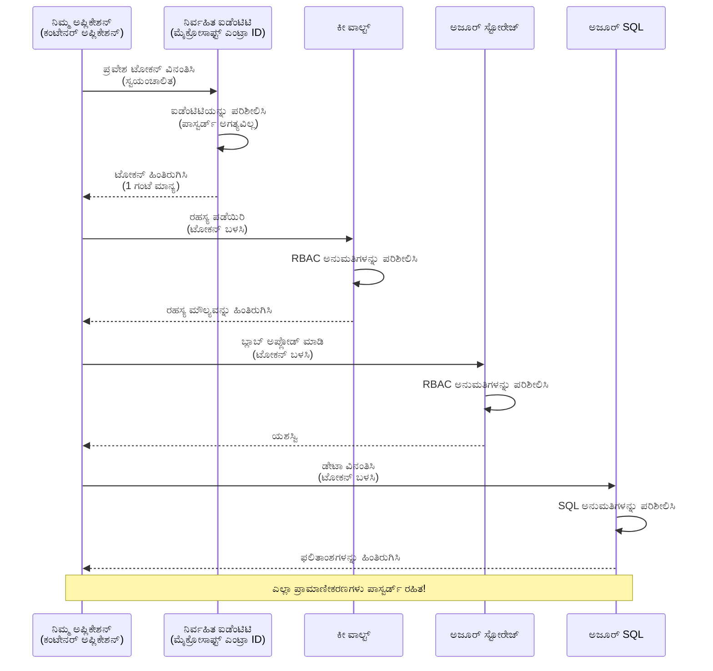
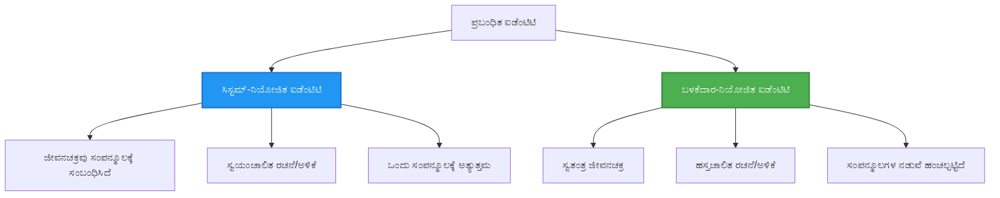

# ಪ್ರಮಾಣೀಕರಣ ಮಾದರಿಗಳು ಮತ್ತು Managed Identity

⏱️ **ಅಂದಾಜು ಸಮಯ**: 45-60 ನಿಮಿಷಗಳು | 💰 **ಖರ್ಚಿನ ಪರಿಣಾಮ**: ಉಚಿತ (ಯಾವುದೇ ಹೆಚ್ಚುವರಿ ಶುಲ್ಕ ಇಲ್ಲ) | ⭐ **ಸಂಕೀರ್ಣತೆ**: ಮಧ್ಯಮ

**📚 ಕಲಿಕೆ ಮಾರ್ಗ:**
- ← ಹಿಂದಿನದು: [Configuration Management](configuration.md) - ಪರಿಸರ ಚರಗಳು ಮತ್ತು ರಹಸ್ಯಗಳನ್ನು ನಿರ್ವಹಿಸಲಾಗುತ್ತಿದೆ
- 🎯 **ನೀವು ಇಲ್ಲಿ ಇರುತ್ತೀರಿ**: Authentication & Security (Managed Identity, Key Vault, ಸರಿಯಾದ ಮಾದರಿಗಳು)
- → ಮುಂದಿನದು: [First Project](first-project.md) - ನಿಮ್ಮ ಮೊದಲ AZD ಅಪ್ಲಿಕೇಶನ್ ನಿರ್ಮಿಸಿ
- 🏠 [Course Home](../../README.md)

---

## ನೀವು ಏನು ಕಲಿಯುತ್ತೀರಿ

ಈ ಪಾಠವನ್ನು ಪೂರ್ಣಗೊಳಿಸುವ ಮೂಲಕ, ನೀವು:
- ಕೀಗಳು, ಸಂಪರ್ಕ ಸ್ಟ್ರಿಂಗ್‌ಗಳು, managed identity ಸೇರಿದಂತೆ Azure ಪ್ರಮಾಣೀಕರಣ ಮಾದರಿಗಳನ್ನು ಅರ್ಥಮಾಡಿಕೊಳ್ಳುತ್ತೀರಿ
- ಪಾಸ್ವರ್ಡ್ ರಹಿತ ಪ್ರಮಾಣೀಕರಣಕ್ಕೆ **Managed Identity** ಅನ್ನು ಅನುಷ್ಠಾನಗೊಳಿಸುವುದು
- **Azure Key Vault** ಸಮೀಕರಣದೊಂದಿಗೆ ರಹಸ್ಯಗಳನ್ನು ಸುರಕ್ಷಿತಗೊಳಿಸುವುದು
- AZD ನಿಯೋಜನೆಗಳಿಗೆ **role-based access control (RBAC)** ಅನ್ನು ಸಂರಚಿಸುವುದು
- Container Apps ಮತ್ತು Azure ಸೇವೆಗಳಲ್ಲಿ ಸುರಕ್ಷತಾ ಉತ್ತಮ ಅಭ್ಯಾಸಗಳನ್ನು ಅನ್ವಯಿಸುವುದು
- ಕೀ ಆಧಾರಿತದಿಂದ identity ಆಧಾರಿತ ಪ್ರಮಾಣೀಕರಣಕ್ಕೆ ಮೈಗ್ರೇಟ್ ಮಾಡುವುದು

## Managed Identity ಯು ಯಾಕೆ ಮಹತ್ವದಿದೆ

### ಸಮಸ್ಯೆ: ಪರಂಪರাগত ಪ್ರಮಾಣೀಕರಣ

**Managed Identity ಗಿಂತ ಮುಂಚೆ:**
```javascript
// ❌ ಭದ್ರತಾ ಅಪಾಯ: ಕೋಡ್‌ನಲ್ಲಿ ಹಾರ್ಡ್‌ಕೋಡ್ ಮಾಡಿದ ರಹಸ್ಯಗಳು
const connectionString = "Server=mydb.database.windows.net;User=admin;Password=P@ssw0rd123";
const storageKey = "xK7mN9pQ2wR5tY8uI0oP3aS6dF1gH4jK...";
const cosmosKey = "C2x7B9n4M1p8Q5w3E6r0T2y5U8i1O4p7...";
```

**ಸಮಸ್ಯೆಗಳು:**
- 🔴 **ಕೋಡ್, ಕಾನ್ಫಿಗ್ ಫೈಲ್‌ಗಳು, ಪರಿಸರ ಚರಗಳಲ್ಲಿ ಹೊರಬಿದ್ದ ರಹಸ್ಯಗಳು**
- 🔴 **ಕ್ರೆಡೆನ್ಷಿಯಲ್ ರೋಟೇಶನ್** ಕೋಡ್ ಬದಲಾವಣೆ ಮತ್ತು ಪುನಃ ನಿಯೋಜನೆ ಅಗತ್ಯವಿರುತ್ತದೆ
- 🔴 **ಆಡಿಟ್ ಸಂಕಷ್ಟಗಳು** - ಯಾರೇ ಯಾವದು ಬಳಕೆಮಾಡಿತು, ಯಾವಾಗ ಎಂಬುದು ತಿಳಿಯದು
- 🔴 **ವಿಸ್ಥಾರ** - ರಹಸ್ಯಗಳು ಅನೇಕ ವ್ಯವಸ್ಥೆಗಳಲ್ಲಿ ಚದರಿಸಲಾಗಿದೆ
- 🔴 **ಅನುಸರಣೆ ಅಪಾಯಗಳು** - ಸುರಕ್ಷತಾ ಆಡಿಟ್ ಗಳಲ್ಲಿ ವಿಫಲವಾಗಬಹುದು

### ಪರಿಹಾರ: Managed Identity

**Managed Identity ನಂತರ:**
```javascript
// ✅ ಸುರಕ್ಷಿತ: ಕೋಡ್‌ನಲ್ಲಿ ಯಾವುದೇ ರಹಸ್ಯಗಳಿಲ್ಲ
const credential = new DefaultAzureCredential();
const client = new BlobServiceClient(
  "https://mystorageaccount.blob.core.windows.net",
  credential  // Azure ಸ್ವಯಂಚಾಲಿತವಾಗಿ ಪ್ರಮಾಣೀಕರಣವನ್ನು ನಿರ್ವಹಿಸುತ್ತದೆ
);
```

**ಲಾಭಗಳು:**
- ✅ **ಕೋಡ್ ಅಥವಾ ಕಾನ್ಫಿಗ್‌ನಲ್ಲಿ ನೂಲಾ ರಹಸ್ಯಗಳು**
- ✅ **ಸ್ವಯಂಚಾಲಿತ ರೋಟೇಶನ್** - Azure ಇದರ ನಿರ್ವಹಣೆ ಮಾಡುತ್ತದೆ
- ✅ **Microsoft Entra ID ಲಾಗ್‌ಗಳಲ್ಲಿ ಸಂಪೂರ್ಣ ಆಡಿಟ್ ಟ್ರೇಲ್**
- ✅ **ಕೇಂದ್ರೀಕೃತ ಸುರಕ್ಷತೆ** - Azure ಪೋರ್ಟಲ್‌ನಲ್ಲಿ ನಿರ್ವಹಿಸಬಹುದಾಗಿದೆ
- ✅ **ಅನುಸರಣೆ ಸಜ್ಜುಗೊಂಡಿದೆ** - ಸುರಕ್ಷತಾ ಮಾನದಂಡಗಳನ್ನು ಪೂರೈಸುತ್ತದೆ

**ಉಪಮಾನ**: ಪರಂಪರാഗത ಪ್ರಮಾಣೀಕರಣವು ವಿಭಿನ್ನ ಬಾಗಿಲುಗಳಿಗಾಗಿ ಹಲವಾರು ಭೌತಿಕ ಕೀಲಿಗಳನ್ನು ಹಿಡಿದಿರುವಂತೆ. Managed Identity ಎಂಬುದು ನೀವು ಯಾರು ಎಂಬುದಾದರ ಮೇಲೆ ಸ್ವಯಂಚಾಲಿತವಾಗಿ ಪ್ರವೇಶ ನೀಡುವ ಭದ್ರತಾ ಬ್ಯಾಡ್ಜ್‌ಂತೆ—ಹೊರಗೆ ಜೀವಿಸುವ ಕೀ ಅಥವಾ ನಕಲು ಅಥವಾ ರೋಟೇಟ್ಿಮಾಡಲು ಬೇಡ.

---

## ವಾಸ್ತುಶಿಲ್ಪ ಅವಲೋಕನ

### Managed Identity ಸಹಿತ ಪ್ರಮಾಣೀಕರಣ ಫ್ಲೋ



### Managed Identities 的 ಪ್ರಕಾರಗಳು



| ವೈಶಿಷ್ಟ್ಯ | System-Assigned | User-Assigned |
|---------|----------------|---------------|
| **ಜೀವಚಕ್ರ** | ಸಂಪನ್ಮೂಲಕ್ಕೆ ಸಂಬಂಧಿಸಿದೆ | ಸ್ವತಂತ್ರ |
| **ರಚನೆ** | ಸಂಪನ್ಮೂಲದೊಂದಿಗೆ ಸ್ವಯಂಚಾಲಿತ | ಹಸ್ತಚಾಲಿತ ರಚನೆ |
| **ಅಳಿಸುವಿಕೆ** | ಸಂಪನ್ಮೂಲದೊಂದಿಗೆ ಅಳಿಸಲ್ಪಡುವುದು | ಸಂಪನ್ಮೂಲ ಅಳಿಸುವಿಕೆಯ ನಂತರ ಉಳಿಯೋದು |
| **ಹಂಚಿಕೆ** | ಒಂದು ಸಂಪನ್ಮೂಲ ಮಾತ್ರ | ಬಹು ಸಂಪನ್ಮೂಲಗಳು |
| **ಬಳಕೆ ಪ್ರಕರಣ** | ಸರಳ ದೃಶ್ಯಗಳು | ಸಂಕೀರ್ಣ ಬಹು-ಸಂಪನ್ಮೂಲ ದೃಶ್ಯಗಳು |
| **AZD ಡೀಫಾಲ್ಟ್** | ✅ ಶಿಫಾರಸು | ಐಚ್ಛಿಕ |

---

## ಪೂರ್ವಾಪೇಕ್ಷೆಗಳು

### ಅಗತ್ಯವಾದ ಸಾಧನಗಳು

ನೀವು ಪೂರ್ವ ಪಾಠಗಳಿಂದ ಈ ಎಲ್ಲಾ ಸ್ಥಾಪನೆಗಳನ್ನು ಈಗಾಗಲೇ ಇನ್‌ಸ್ಟಾಲ್ ಮಾಡಿ ಇರಬೇಕು:

```bash
# Azure Developer CLI ಅನ್ನು ಪರಿಶೀಲಿಸಿ
azd version
# ✅ ನಿರೀಕ್ಷಿಸಲಾಗಿದೆ: azd ಆವೃತ್ತಿ 1.0.0 ಅಥವಾ ಹೆಚ್ಚು

# Azure CLI ಅನ್ನು ಪರಿಶೀಲಿಸಿ
az --version
# ✅ ನಿರೀಕ್ಷಿಸಲಾಗಿದೆ: azure-cli ಆವೃತ್ತಿ 2.50.0 ಅಥವಾ ಹೆಚ್ಚು
```

### Azure ಅಗತ್ಯಗಳು

- ಸಕ್ರಿಯ Azure ಚಂದಾದಾರಿಕೆ
- ಅವಕಾಶಗಳು:
  - Managed identities ರಚಿಸಲು
  - RBAC ಪಾತ್ರಗಳನ್ನು ನೀಡಿ
  - Key Vault ಸಂಪನ್ಮೂಲಗಳನ್ನು ರಚಿಸಲು
  - Container Apps ನಿಯೋಜಿಸಲು

### ಜ್ಞಾನ ಪೂರ್ವಾಪೇಕ್ಷೆಗಳು

ನೀವು ಈ ಕೆಳಗಿನವುಗಳನ್ನು ಪೂರ್ಣಗೊಳಿಸಿರುವುದು ಒಳ್ಳೆಯದು:
- [Installation Guide](installation.md) - AZD ಸೆಟ್‌ಅಪ್
- [AZD Basics](azd-basics.md) - ಕೋರ್ ಕನ್ಸೆಪ್ಟ್ಗಳು
- [Configuration Management](configuration.md) - ಪರಿಸರ ಚರಗಳು

---

## ಪಾಠ 1: ಪ್ರಮಾಣೀಕರಣ ಮಾದರಿಗಳನ್ನು ಅರ್ಥಮಾಡಿಕೊಳ್ಳುವುದು

### ಮಾದರಿ 1: ಸಂಪರ್ಕ ಸ್ಟ್ರಿಂಗ್‌ಗಳು (ಪರಂಪರೆಗತ - ತಪ್ಪಿಸಿಕೊಳ್ಳಿ)

**ಇದು ಹೇಗೆ ಕೆಲಸ ಮಾಡುತ್ತದೆ:**
```bash
# ಸಂಪರ್ಕ ಸ್ಟ್ರಿಂಗ್‌ನಲ್ಲಿ ಪ್ರಮಾಣೀಕರಣದ ವಿವರಗಳು ಒಳಗೊಂಡಿವೆ
STORAGE_CONNECTION_STRING="DefaultEndpointsProtocol=https;AccountName=myaccount;AccountKey=xK7mN9pQ2wR5..."
COSMOS_CONNECTION_STRING="AccountEndpoint=https://myaccount.documents.azure.com:443/;AccountKey=C2x7..."
SQL_CONNECTION_STRING="Server=myserver.database.windows.net;User=admin;Password=P@ssw0rd..."
```

**ಸಮಸ್ಯೆಗಳು:**
- ❌ ಪರಿಸರ ಚರಗಳಲ್ಲಿ ರಹಸ್ಯಗಳು ಗೋಚರವಾಗುತ್ತವೆ
- ❌ ನಿಯೋಜನಾ ವ್ಯವಸ್ಥೆಗಳಲ್ಲಿ ಲಾಗ್ ಆಗಬಹುದು
- ❌ ರೋಟೇಟು ಮಾಡಲು ಕಷ್ಟ
- ❌ ಪ್ರವೇಶದ ಆಡಿಟ್ ಟ್ರೇಲ್ ಇಲ್ಲ

**ಬಳಕೆ ಸಮಯ:** ಸ್ಥಳీయ ಡೆವಲಪ್‌ಮೆಂಟ್ ಮಾತ್ರ, ಪ್ರೊಡಕ್ಷನ್‌ಗೆ ಯಾವಾಗಲೂ ಬೇಡ.

---

### ಮಾದರಿ 2: Key Vault ರೆಫರೆನ್ಸ್‌ಗಳು (ಉತ್ತಮ)

**ಇದು ಹೇಗೆ ಕೆಲಸ ಮಾಡುತ್ತದೆ:**
```bicep
// Store secret in Key Vault
resource keyVault 'Microsoft.KeyVault/vaults@2023-02-01' = {
  name: 'mykv'
  properties: {
    enableRbacAuthorization: true
  }
}

// Reference in Container App
env: [
  {
    name: 'STORAGE_KEY'
    secretRef: 'storage-key'  // References Key Vault
  }
]
```

**ಲಾಭಗಳು:**
- ✅ ರಹಸ್ಯಗಳು Key Vault ನಲ್ಲಿ ಸುರಕ್ಷಿತವಾಗಿ ಸಂಗ್ರಹಿಸಲಾಗುತ್ತವೆ
- ✅ ಕೇಂದ್ರೀಕೃತ ರಹಸ್ಯ ನಿರ್ವಹಣೆ
- ✅ ಕೋಡ್ ಬದಲಾವಣೆ ಇಲ್ಲದೆ ರೋಟೇಶನ್ ಸಾಧ್ಯ

**ವೀಯತೆಗಳು:**
- ⚠️ ಇನ್ನೂ ಕೀಗಳು/ಪಾಸ್ವರ್ಡ್‌ಗಳನ್ನು ಬಳಕೆಮಾಡುತ್ತಿದೆ
- ⚠️ Key Vault ಪ್ರವೇಶವನ್ನು ನಿರ್ವಹಿಸಲು ಅಗತ್ಯವಿದೆ

**ಬಳಕೆ ಸಮಯ:** ಸಂಪರ್ಕ ಸ್ಟ್ರಿಂಗ್‌ಗಳಿಂದ managed identity ಗೆ ಹಾದಿಯಾಗಿ ತರಗಾವಣೆ.

---

### ಮಾದರಿ 3: Managed Identity (ಉತ್ತಮ ಅಭ್ಯಾಸ)

**ಇದು ಹೇಗೆ ಕೆಲಸ ಮಾಡುತ್ತದೆ:**
```bicep
// Enable managed identity
resource containerApp 'Microsoft.App/containerApps@2023-05-01' = {
  name: 'myapp'
  identity: {
    type: 'SystemAssigned'  // Automatically creates identity
  }
}

// Grant permissions
resource roleAssignment 'Microsoft.Authorization/roleAssignments@2022-04-01' = {
  scope: storageAccount
  properties: {
    roleDefinitionId: storageBlobDataContributorRole
    principalId: containerApp.identity.principalId
  }
}
```

**ಅಪ್ಲಿಕೇಶನ್ ಕೋಡ್:**
```javascript
// ರಹಸ್ಯಗಳ ಅಗತ್ಯವಿಲ್ಲ!
const { DefaultAzureCredential } = require('@azure/identity');
const { BlobServiceClient } = require('@azure/storage-blob');

const credential = new DefaultAzureCredential();
const blobServiceClient = new BlobServiceClient(
  'https://mystorageaccount.blob.core.windows.net',
  credential
);
```

**ಲಾಭಗಳು:**
- ✅ ಕೋಡ್/ಕಾನ್ಫಿಗ್‌ನಲ್ಲಿ ನೂಲಾ ರಹಸ್ಯಗಳು
- ✅ ಕ್ರೆಡೆನ್ಶಿಯಲ್ ಸ್ವಯಂಚಾಲಿತ ರೋಟೇಶನ್
- ✅ ಸಂಪೂರ್ಣ ಆಡಿಟ್ ಟ್ರೇಲ್
- ✅ RBAC ಆಧಾರಿತ ಅನುಮತಿಗಳು
- ✅ ಅನುಸರಣೆ ಸಜ್ಜುಗೊಂಡಿದೆ

**ಬಳಕೆ ಸಮಯ:** ಪ್ರೊಡಕ್ಷನ್ ಅಪ್ಲಿಕೇಶನ್‌ಗಳಿಗೆ ಎಂದಿಗೂ ಅನ್ವಯಿಸಿ.

---

### ಮಾದರಿ 4: ಸೇವಾ ಪ್ರಿನ್ಸಿಪಲ್‌ಗಳು (CI/CD ಮತ್ತು ಸ್ವಯಂಕ್ರಿಯೆ)

Managed identity ಆಧಾರಿತ ಪರಿಹಾರವು Azure ಒಳಗಿನ ಸಂಪನ್ಮೂಲಗಳಿಗಾಗಿ ಚಿನ್ನದ ಸ್ಟ್ಯಾಂಡರ್ಡ್ ಆಗಿದೆ. ಆದರೆ Azure ಹೊರಗೆ تشغيلವಾಗುತ್ತಿರುವ ವಸ್ತುಗಳು—ಉದಾಹರಣೆಗೆ build agent上的 CI/CD ಪೈಪ್‌ಲೈನ್ ಅಥವಾ ನಿಮ್ಮ ಲ್ಯಾಪ್‌ಟಾಪ್‌ನಲ್ಲಿ ಓಡುತ್ತಿರುವ ಸ್ಕ್ರಿಪ್ಟ್ ಅದು ನಿಮ್ಮ ಇಂಟರ್ಯಾಕ್ಟಿವ್ ಲಾಗಿನ್ ಬಳಸಲು ಸಾಧ್ಯವಿಲ್ಲ—ಅಂತಹ ಕೇಸ್‌ಗಳಿಗೆ **service principal** ಉಪಯುಕ್ತವಾಗಿದೆ: ಇದು ಸ್ವಯಂಕ್ರಿಯೆ ಪ್ರಕ್ರಿಯೆ ಸೈನ್ ಇನ್ ಆಗಬಹುದಾದ non-human identity ಯಾಗಿದೆ ಇದಕ್ಕೆ ತನ್ನದೇ ಕ್ರೆಡೆನ್ಶಿಯಲ್ಸ್ ಇರುತ್ತವೆ.

**ಇದು ಹೇಗೆ ಕೆಲಸ ಮಾಡುತ್ತದೆ:**

ಕನಿಷ್ಠಾಧಿಕಾರPrinciple ಆಗಿ resource group ಗೆ ಸ್ಕೋಪ್ ಮಾಡಲಾದ service principal ರಚಿಸಿ:

```bash
az ad sp create-for-rbac \
  --name "myapp-cicd" \
  --role contributor \
  --scopes /subscriptions/<sub-id>/resourceGroups/<rg-name>
```

ಇದು client ID, client secret, ಮತ್ತು tenant ID ಅನ್ನು ಮುದ್ರಿಸುತ್ತದೆ. azd ಅವುಗಳೊಂದಿಗೆ non-interactively ಸೈನ್ ಇನ್ ಮಾಡಬಹುದು:

```bash
azd auth login \
  --client-id "<appId>" \
  --client-secret "<password>" \
  --tenant-id "<tenant>"
```

**ರಹಸ್ಯಗಳ ಮೇಲೆ ಆಧಾರಿತುದಕ್ಕಿಂತ ಫೆಡರೆಟೆಡ್ ಕ್ರೆಡೆನ್ಶಿಯಲ್ಸ್ (OIDC) ಪ್ರಿಯವಿದೆ.** ದೀರ್ಘಾವಧಿ client secret ಬದಲೆ, ಫೆಡರೆಟೆಡ್ ಕ್ರೆಡೆನ್ಶಿಯಲ್ ಅನ್ನು ಸಂರಚಿಸಿ ಹಾಗಾಗಿ ಪೈಪ್‌ಲೈನ್ short-lived token ವಿನಿಮಯಮಾಡುತ್ತದೆ—ಉರಿದುಬರದ ರಹಸ್ಯವಿಲ್ಲ:

```bash
azd auth login \
  --client-id "<appId>" \
  --federated-credential-provider "github" \
  --tenant-id "<tenant>"
```

> `azd pipeline config` ನಿಮಗಾಗಿ ಇದನ್ನು ಸ್ವಯಂಚಾಲಿತವಾಗಿ ಸೆಟ್ ಅಪ್ ಮಾಡುತ್ತದೆ. [Chapter 8](../chapter-08-production/production-ai-practices.md) ನಲ್ಲಿ CI/CD ವಾಕ್ ಥ್ರೂಗಳನ್ನು ನೋಡಿ.

**ಲಾಭಗಳು:**
- ✅ Azure ಹೊರಗಿರುವ ಎಲ್ಲ ವಾತಾವರಣಗಳಲ್ಲಿ ಕೆಲಸ ಮಾಡುತ್ತದೆ (build agents, on-prem, ಇತರ ಕ್ಲೌಡ್ಗಳು)
- ✅ ಅದನ್ನು ಒಂದು roleೊಂದಿಗೆ single resource group ಗೆ ಸ್ಕೋಪ್ ಮಾಡಬಹುದು
- ✅ ಫೆಡರೆಟೆಡ್ (OIDC) ರೂಪಾಂತರಿ ಯಾವುದೇ ಸಂರಕ್ಷಿತ ರಹಸ್ಯವನ್ನು ಬಳಸುವುದಿಲ್ಲ

**ವ್ಯಾಪ್ತಿಗಳು:**
- ⚠️ ರಹಸ್ಯ ಆಧಾರಿತ ರೂಪಾಂತರಿ ನಿಖರ ಸಂಗ್ರಹಣೆ ಮತ್ತು ರೋಟೇಶನ್ ಅಗತ್ಯವಿದೆ
- ⚠️ ರಹಸ್ಯವು ಲಿಕಾದರೆ SP ಮಾಡಬಹುದಾದುದೆಲ್ಲವೂ ಸಿಕ್ಕಿಹಾಕುತ್ತದೆ—ಸ್ಕೋಪ್ ಅನ್ನು ತಗ್ಗಿಸಿ

**ಬಳಕೆ ಸಮಯ:** CI/CD ಪೈಪ್‌ಲೈನ್ಗಳು ಮತ್ತು managed identity ಬಳಸಲು ಸಾಧ್ಯವಾಗದ ಸ್ವಯಂಕ್ರಿಯೆಗತ ಕಾರ್ಯಗಳಿಗಾಗಿ. client secret ಬದಲೆ ಸದಾ **federated/OIDC** ರೂಪಾಂತರಿ ಪ್ರಾಧಾನ್ಯ ನೀಡಿ, ಮತ್ತು ಕಾರ್ಯಭಾರವು Azure ಒಳಗೆ ಓಡುತ್ತಿದ್ದರೆ ಸದಾ managed identity ಅನ್ನು ಆಯ್ಕೆಮಾಡಿ.

**ರಹಸ್ಯಗಳನ್ನು ಸುರಕ್ಷಿತವಾಗಿ ಸಂಗ್ರಹಿಸುವುದು:**
- ರಹಸ್ಯಗಳನ್ನು ಎಂದೂ commit ಮಾಡಬೇಡಿ—ನಿಮ್ಮ ಪೈಪ್‌ಲೈನಿನ ರಹಸ್ಯ ಸಂಗ್ರಹಣೆಯನ್ನು ಬಳಸಿ (GitHub Actions secrets, Azure DevOps variable groups / Key Vault).
- SP ಅನ್ನು ಅದರ ಅಗತ್ಯವಿರುವ ಅತ್ಯಲ୍ಪ роль್ ಮತ್ತು resource group ಗೆ ಮಾತ್ರ ಸ್ಕೋಪ್ ಮಾಡಿ.
- ಅವಧಿ ಹೊಂದಿಸಿ ಹಾಗೂ ರೋಟೇಟ್ ಮಾಡಿ, ಅಥವಾ OIDC ಮೂಲಕ ರಹಸ್ಯವನ್ನು ಸಂಪೂರ್ಣವಾಗಿ ನಿರ್ಮೂಲಗೊಳಿಸಿ.

---

## ಪಾಠ 2: AZD ಸಹಿತ Managed Identity ಅನ್ನು ಅನುಷ್ಠಾನಗೊಳಿಸುವುದು

### ಹಂತದ್ವಾರಾ ಅನುಷ್ಠಾನ

Managed identity ಬಳಸಿ Azure Storage ಮತ್ತು Key Vault ಗೆ ಪ್ರವೇಶ ಪಡೆಯುವ ಸುರಕ್ಷಿತ Container App ಅನ್ನು ನಿರ್ಮಿಸೋಣ.

### ಪ್ರಾಜೆಕ್ಟ್ ರಚನೆ

```
secure-app/
├── azure.yaml                 # AZD configuration
├── infra/
│   ├── main.bicep            # Main infrastructure
│   ├── core/
│   │   ├── identity.bicep    # Managed identity setup
│   │   ├── keyvault.bicep    # Key Vault configuration
│   │   └── storage.bicep     # Storage with RBAC
│   └── app/
│       └── container-app.bicep
└── src/
    ├── app.js                # Application code
    ├── package.json
    └── Dockerfile
```

### 1. AZD ಸಂರಚನೆ (azure.yaml)

```yaml
name: secure-app
metadata:
  template: secure-app@1.0.0

services:
  api:
    project: ./src
    language: js
    host: containerapp

# Enable managed identity (AZD handles this automatically)
```

### 2. ಇನ್‌ಫ್ರಾಸ್ಟ್ರಕ್ಚರ್: Managed Identity ಸಕ್ರಿಯಗೊಳಿಸಿ

**ಫೈಲ್: `infra/main.bicep`**

```bicep
targetScope = 'subscription'

param environmentName string
param location string = 'eastus'

var tags = { 'azd-env-name': environmentName }

// Resource group
resource rg 'Microsoft.Resources/resourceGroups@2021-04-01' = {
  name: 'rg-${environmentName}'
  location: location
  tags: tags
}

// Storage Account
module storage './core/storage.bicep' = {
  name: 'storage'
  scope: rg
  params: {
    name: 'st${uniqueString(rg.id)}'
    location: location
    tags: tags
  }
}

// Key Vault
module keyVault './core/keyvault.bicep' = {
  name: 'keyvault'
  scope: rg
  params: {
    name: 'kv-${uniqueString(rg.id)}'
    location: location
    tags: tags
  }
}

// Container App with Managed Identity
module containerApp './app/container-app.bicep' = {
  name: 'container-app'
  scope: rg
  params: {
    name: 'ca-${environmentName}'
    location: location
    tags: tags
    storageAccountName: storage.outputs.name
    keyVaultName: keyVault.outputs.name
  }
}

// Grant Container App access to Storage
module storageRoleAssignment './core/role-assignment.bicep' = {
  name: 'storage-role'
  scope: rg
  params: {
    principalId: containerApp.outputs.identityPrincipalId
    roleDefinitionId: 'ba92f5b4-2d11-453d-a403-e96b0029c9fe'  // Storage Blob Data Contributor
    targetResourceId: storage.outputs.id
  }
}

// Grant Container App access to Key Vault
module kvRoleAssignment './core/role-assignment.bicep' = {
  name: 'kv-role'
  scope: rg
  params: {
    principalId: containerApp.outputs.identityPrincipalId
    roleDefinitionId: '4633458b-17de-408a-b874-0445c86b69e6'  // Key Vault Secrets User
    targetResourceId: keyVault.outputs.id
  }
}

// Outputs
output AZURE_STORAGE_ACCOUNT_NAME string = storage.outputs.name
output AZURE_KEY_VAULT_NAME string = keyVault.outputs.name
output APP_URL string = containerApp.outputs.url
```

### 3. System-Assigned Identity ಹೊಂದಿರುವ Container App

**ಫೈಲ್: `infra/app/container-app.bicep`**

```bicep
param name string
param location string
param tags object = {}
param storageAccountName string
param keyVaultName string

resource containerApp 'Microsoft.App/containerApps@2023-05-01' = {
  name: name
  location: location
  tags: tags
  identity: {
    type: 'SystemAssigned'  // 🔑 Enable managed identity
  }
  properties: {
    configuration: {
      ingress: {
        external: true
        targetPort: 3000
      }
    }
    template: {
      containers: [
        {
          name: 'api'
          image: 'myregistry.azurecr.io/api:latest'
          resources: {
            cpu: json('0.5')
            memory: '1Gi'
          }
          env: [
            {
              name: 'AZURE_STORAGE_ACCOUNT_NAME'
              value: storageAccountName
            }
            {
              name: 'AZURE_KEY_VAULT_NAME'
              value: keyVaultName
            }
            // 🔑 No secrets - managed identity handles authentication!
          ]
        }
      ]
    }
  }
}

// Output the identity for RBAC assignments
output identityPrincipalId string = containerApp.identity.principalId
output id string = containerApp.id
output url string = 'https://${containerApp.properties.configuration.ingress.fqdn}'
```

### 4. RBAC ಪಾತ್ರ ನೇಮಕಾತಿ ಮಾಯೂಡೆಲ್

**ಫೈಲ್: `infra/core/role-assignment.bicep`**

```bicep
param principalId string
param roleDefinitionId string  // Azure built-in role ID
param targetResourceId string

resource roleAssignment 'Microsoft.Authorization/roleAssignments@2022-04-01' = {
  name: guid(principalId, roleDefinitionId, targetResourceId)
  scope: resourceId('Microsoft.Resources/resourceGroups', resourceGroup().name)
  properties: {
    roleDefinitionId: subscriptionResourceId('Microsoft.Authorization/roleDefinitions', roleDefinitionId)
    principalId: principalId
    principalType: 'ServicePrincipal'
  }
}

output id string = roleAssignment.id
```

### 5. Managed Identity ಯೊಂದಿಗೆ ಅಪ್ಲಿಕೇಶನ್ ಕೋಡ್

**ಫೈಲ್: `src/app.js`**

```javascript
const express = require('express');
const { DefaultAzureCredential } = require('@azure/identity');
const { BlobServiceClient } = require('@azure/storage-blob');
const { SecretClient } = require('@azure/keyvault-secrets');

const app = express();
const PORT = process.env.PORT || 3000;

// 🔑 ಪ್ರಮಾಣಪತ್ರವನ್ನು ಆರಂಭಿಸಿ (ಮ್ಯಾನೇಜ್ಡ್ ಐಡೆಂಟಿಟಿಯೊಂದಿಗೆ ಸ್ವಯಂಚಾಲಿತವಾಗಿ ಕೆಲಸ ಮಾಡುತ್ತದೆ)
const credential = new DefaultAzureCredential();

// Azure ಸ್ಟೋರೆಜ್ ಸಂರಚನೆ
const storageAccountName = process.env.AZURE_STORAGE_ACCOUNT_NAME;
const blobServiceClient = new BlobServiceClient(
  `https://${storageAccountName}.blob.core.windows.net`,
  credential  // ಯಾವುದೇ ಕೀಲಿಗಳು ಅಗತ್ಯವಿಲ್ಲ!
);

// ಕೀ ವಾಲ್ಟ್ ಸಂರಚನೆ
const keyVaultName = process.env.AZURE_KEY_VAULT_NAME;
const secretClient = new SecretClient(
  `https://${keyVaultName}.vault.azure.net`,
  credential  // ಯಾವುದೇ ಕೀಲಿಗಳು ಅಗತ್ಯವಿಲ್ಲ!
);

// ಆರೋಗ್ಯ ತಪಾಸಣೆ
app.get('/health', (req, res) => {
  res.json({ status: 'healthy', authentication: 'managed-identity' });
});

// ಬ್ಲಾಬ್ ಸಂಗ್ರಹಕ್ಕೆ ಫೈಲ್ ಅಪ್ಲೋಡ್ ಮಾಡಿ
app.post('/upload', async (req, res) => {
  try {
    const containerClient = blobServiceClient.getContainerClient('uploads');
    await containerClient.createIfNotExists();
    
    const blobName = `file-${Date.now()}.txt`;
    const blockBlobClient = containerClient.getBlockBlobClient(blobName);
    
    await blockBlobClient.upload('Hello from managed identity!', 30);
    
    res.json({
      success: true,
      blobName: blobName,
      message: 'File uploaded using managed identity!'
    });
  } catch (error) {
    console.error('Upload error:', error);
    res.status(500).json({ error: error.message });
  }
});

// ಕೀ ವಾಲ್ಟ್‌ನಿಂದ ರಹಸ್ಯ ಪಡೆಯಿರಿ
app.get('/secret/:name', async (req, res) => {
  try {
    const secretName = req.params.name;
    const secret = await secretClient.getSecret(secretName);
    
    res.json({
      name: secretName,
      value: secret.value,
      message: 'Secret retrieved using managed identity!'
    });
  } catch (error) {
    console.error('Secret error:', error);
    res.status(500).json({ error: error.message });
  }
});

// ಬ್ಲಾಬ್ ಕಂಟೇನರ್‌ಗಳ ಪಟ್ಟಿ (ಓದುವ ಪ್ರವೇಶವನ್ನು ಪ್ರದರ್ಶಿಸುತ್ತದೆ)
app.get('/containers', async (req, res) => {
  try {
    const containers = [];
    for await (const container of blobServiceClient.listContainers()) {
      containers.push(container.name);
    }
    
    res.json({
      containers: containers,
      count: containers.length,
      message: 'Containers listed using managed identity!'
    });
  } catch (error) {
    console.error('List error:', error);
    res.status(500).json({ error: error.message });
  }
});

app.listen(PORT, () => {
  console.log(`Secure API listening on port ${PORT}`);
  console.log('Authentication: Managed Identity (passwordless)');
});
```

**ಫೈಲ್: `src/package.json`**

```json
{
  "name": "secure-app",
  "version": "1.0.0",
  "dependencies": {
    "express": "^4.18.2",
    "@azure/identity": "^4.0.0",
    "@azure/storage-blob": "^12.17.0",
    "@azure/keyvault-secrets": "^4.7.0"
  },
  "scripts": {
    "start": "node app.js"
  }
}
```

### 6. ನಿಯೋಜಿಸಿ ಮತ್ತು ಪರೀಕ್ಷಿಸಿ

```bash
# AZD ಪರಿಸರವನ್ನು ಪ್ರಾರಂಭಿಸಿ
azd init

# ಮೂಲಸೌಕರ್ಯ ಮತ್ತು ಅಪ್ಲಿಕೇಶನ್ ಅನ್ನು ಸ್ಥಾಪಿಸಿ
azd up

# ಅಪ್ಲಿಕೇಶನ್ URL ಅನ್ನು ಪಡೆಯಿರಿ
APP_URL=$(azd env get-values | grep APP_URL | cut -d '=' -f2 | tr -d '"')

# ಹೆಲ್ತ್ ಚೆಕ್ ಅನ್ನು ಪರೀಕ್ಷಿಸಿ
curl $APP_URL/health
```

**✅ ನಿರೀಕ್ಷಿತ ಔಟ್‌ಪುಟ್:**
```json
{
  "status": "healthy",
  "authentication": "managed-identity"
}
```

**ಬ್ಲಾಬ್ ಅಪ್ಲೋಡ್ ಪರೀಕ್ಷಿಸು:**
```bash
curl -X POST $APP_URL/upload
```

**✅ ನಿರೀಕ್ಷಿತ ಔಟ್‌ಪುಟ್:**
```json
{
  "success": true,
  "blobName": "file-1700404800000.txt",
  "message": "File uploaded using managed identity!"
}
```

**ಕಂಟೈನರ್ ಲಿಸ್ಟಿಂಗ್ ಪರೀಕ್ಷಿಸು:**
```bash
curl $APP_URL/containers
```

**✅ ನಿರೀಕ್ಷಿತ ಔಟ್‌ಪುಟ್:**
```json
{
  "containers": ["uploads"],
  "count": 1,
  "message": "Containers listed using managed identity!"
}
```

---

## ಸಾಮಾನ್ಯ Azure RBAC ಪಾತ್ರಗಳು

### Managed Identity ಗೆ ಹೊಂದಿರುವ Built-in Role IDs

| ಸರ್ವಿಸ್ | Role Name | Role ID | Anumatiಗಳು |
|---------|-----------|---------|-------------|
| **Storage** | Storage Blob Data Reader | `2a2b9908-6b94-4a3d-8e5a-a7d8f8cc8a12` | ಬ್ಲಾಬ್‌ಗಳು ಮತ್ತು ಕಂಟೈನರ್‌ಗಳನ್ನು ಓದು |
| **Storage** | Storage Blob Data Contributor | `ba92f5b4-2d11-453d-a403-e96b0029c9fe` | ಬ್ಲಾಬ್‌ಗಳನ್ನು ಓದು, ಬರೆಯು, ಅಳಿಸು |
| **Storage** | Storage Queue Data Contributor | `974c5e8b-45b9-4653-ba55-5f855dd0fb88` | ಕ್ಯೂ ಸಂದೇಶಗಳನ್ನು ಓದು, ಬರೆಯು, ಅಳಿಸು |
| **Key Vault** | Key Vault Secrets User | `4633458b-17de-408a-b874-0445c86b69e6` | ರಹಸ್ಯಗಳನ್ನು ಓದು |
| **Key Vault** | Key Vault Secrets Officer | `b86a8fe4-44ce-4948-aee5-eccb2c155cd7` | ರಹಸ್ಯಗಳನ್ನು ಓದು, ಬರೆಯು, ಅಳಿಸು |
| **Cosmos DB** | Cosmos DB Built-in Data Reader | `00000000-0000-0000-0000-000000000001` | Cosmos DB ಡೇಟಾವನ್ನು ಓದು |
| **Cosmos DB** | Cosmos DB Built-in Data Contributor | `00000000-0000-0000-0000-000000000002` | Cosmos DB ಡೇಟಾವನ್ನು ಓದು, ಬರೆಯು |
| **SQL Database** | SQL DB Contributor | `9b7fa17d-e63e-47b0-bb0a-15c516ac86ec` | SQL ಡೇಟಾಬೇಸ್‌ಗಳನ್ನು ನಿರ್ವಹಿಸು |
| **Service Bus** | Azure Service Bus Data Owner | `090c5cfd-751d-490a-894a-3ce6f1109419` | ಸಂದೇಶಗಳನ್ನು ಕಳುಹಿಸು, ಸ್ವೀಕರಿಸು, ನಿರ್ವಹಿಸು |

### Role IDs ಅನ್ನು ಹೇಗೆ ಹುಡುಕುವುದು

```bash
# ಎಲ್ಲಾ ಅಂತರ್ಗತ ಪಾತ್ರಗಳನ್ನು ಪಟ್ಟಿ ಮಾಡಿ
az role definition list --query "[].{Name:roleName, ID:name}" --output table

# ನಿರ್ದಿಷ್ಟ ಪಾತ್ರವನ್ನು ಹುಡುಕಿ
az role definition list --query "[?contains(roleName, 'Storage Blob')].{Name:roleName, ID:name}" --output table

# ಪಾತ್ರದ ವಿವರಗಳನ್ನು ಪಡೆಯಿರಿ
az role definition list --name "Storage Blob Data Contributor"
```

---

## ಪ್ರಯುಕ್ತಿ ಅಭ್ಯಾಸಗಳು

### ಅಭ್ಯಾಸ 1: ಇExisting App ಗೆ Managed Identity ಸಕ್ರಿಯಗೊಳಿಸಿ ⭐⭐ (ಮಧ್ಯಮ)

**ಗೋಲು**: ಅಸ್ತಿತ್ವದಲ್ಲಿರುವ Container App ನಿಯೋಜನೆಗೆ managed identity ಜೊತೆಗೆ ಸೇರಿಸಿ

**ದೃಶ್ಯ:** ನಿಮ್ಮ Container App ಸಂಪರ್ಕ ಸ್ಟ್ರಿಂಗ್‌ಗಳನ್ನು ಬಳಸುತ್ತಿದೆ. ಅದನ್ನು managed identity ಗೆ ಪರಿವರ್ತಿಸಿ.

**ಪ್ರಾರಂಭಿಕ ಬಿಂದುವು**: ಈ ಸಂರಚನೆಯೊಂದಿಗೆ Container App:

```bicep
// ❌ Current: Using connection string
env: [
  {
    name: 'STORAGE_CONNECTION_STRING'
    secretRef: 'storage-connection'
  }
]
```

**ಹಂತಗಳು**:

1. **Bicep ನಲ್ಲಿ managed identity ಸಕ್ರಿಯಗೊಳಿಸಿ:**

```bicep
resource containerApp 'Microsoft.App/containerApps@2023-05-01' = {
  name: 'myapp'
  identity: {
    type: 'SystemAssigned'  // Add this
  }
  // ... rest of configuration
}
```

2. **Storage ಪ್ರವೇಶ ನೀಡಿರಿ:**

```bicep
// Get storage account reference
resource storageAccount 'Microsoft.Storage/storageAccounts@2023-01-01' existing = {
  name: storageAccountName
}

// Assign role
resource roleAssignment 'Microsoft.Authorization/roleAssignments@2022-04-01' = {
  name: guid(containerApp.id, 'ba92f5b4-2d11-453d-a403-e96b0029c9fe', storageAccount.id)
  scope: storageAccount
  properties: {
    roleDefinitionId: subscriptionResourceId('Microsoft.Authorization/roleDefinitions', 'ba92f5b4-2d11-453d-a403-e96b0029c9fe')
    principalId: containerApp.identity.principalId
    principalType: 'ServicePrincipal'
  }
}
```

3. **ಅಪ್ಲಿಕೇಶನ್ ಕೋಡ್ ಅನ್ನು ನವೀಕರಿಸಿ:**

**قبل (ಸಂಪರ್ಕ ಸ್ಟ್ರಿಂಗ್):**
```javascript
const { BlobServiceClient } = require('@azure/storage-blob');

const blobServiceClient = BlobServiceClient.fromConnectionString(
  process.env.STORAGE_CONNECTION_STRING
);
```

**ನಂತರ (managed identity):**
```javascript
const { DefaultAzureCredential } = require('@azure/identity');
const { BlobServiceClient } = require('@azure/storage-blob');

const credential = new DefaultAzureCredential();
const blobServiceClient = new BlobServiceClient(
  `https://${process.env.STORAGE_ACCOUNT_NAME}.blob.core.windows.net`,
  credential
);
```

4. **ಪರಿಸರ ಚರಗಳನ್ನು ನವೀಕರಿಸಿ:**

```bicep
env: [
  {
    name: 'STORAGE_ACCOUNT_NAME'
    value: storageAccountName  // Just the name, no secrets!
  }
  // Remove STORAGE_CONNECTION_STRING
]
```

5. **ನಿಯೋಜಿಸಿ ಮತ್ತು ಪರೀಕ್ಷಿಸಿ:**

```bash
# ಮತ್ತೆ ನಿಯೋಜಿಸಿ
azd up

# ಇದು ಇನ್ನೂ ಸರಿಯಾಗಿ ಕೆಲಸ ಮಾಡುತ್ತದೆಯೆ ಎಂದು ಪರೀಕ್ಷಿಸಿ
curl https://myapp.azurecontainerapps.io/upload
```

**✅ ಯಶಸ್ಸು ಮಾನದಂಡಗಳು:**
- ✅ ಅಪ್ಲಿಕೇಶನ್ ದೋಷರಿಹಿತವಾಗಿ ನಿಯೋಜಿತವಾಗಿದೆ
- ✅ Storage ಕಾರ್ಯಗಳು ಕೆಲಸ ಮಾಡುತ್ತವೆ (ಅಪ್ಲೋಡ್, ಲಿಸ್ಟ್, ಡೌನ್ಲೋಡ್)
- ✅ ಪರಿಸರ ಚರಗಳಲ್ಲಿ ಯಾವುದೇ ಸಂಪರ್ಕ ಸ್ಟ್ರಿಂಗ್ ಇಲ್ಲ
- ✅ Azure ಪೋರ್ಟಲ್‌ನಲ್ಲಿ "Identity" ಬ್ಲೇಡ್ ಅಡಿಯಲ್ಲಿ ಐಡಿಂಟಿಟಿ ಕಾಣಿಸುತ್ತದೆ

**ಶೋಧನೆಗಾಗಿ:**

```bash
# ನಿರ್ವಹಿತ ಗುರುತು (Managed Identity) ಸಕ್ರಿಯವಾಗಿದೆ ಎಂದು ಪರಿಶೀಲಿಸಿ
az containerapp show \
  --name myapp \
  --resource-group rg-myapp \
  --query "identity.type"
# ✅ ನಿರೀಕ್ಷಿತ: "SystemAssigned"

# ಭೂಮಿಕೆ ನಿಯೋಜನೆಯನ್ನು ಪರಿಶೀಲಿಸಿ
az role assignment list \
  --assignee $(az containerapp show --name myapp --resource-group rg-myapp --query "identity.principalId" -o tsv) \
  --scope /subscriptions/{sub-id}/resourceGroups/rg-myapp/providers/Microsoft.Storage/storageAccounts/mystorageaccount
# ✅ ನಿರೀಕ್ಷಿತ: "Storage Blob Data Contributor" ಭೂಮಿಕೆಯನ್ನು ತೋರಿಸುತ್ತದೆ
```

**ಸಮಯ**: 20-30 ನಿಮಿಷಗಳು

---

### ಅಭ್ಯಾಸ 2: User-Assigned Identity ಮೂಲಕ ಬಹು-ಸೇವೆ ಪ್ರವೇಶ ⭐⭐⭐ (ಅಡ್ವಾನ್ಸ್ಡ್)

**ಗೋಲು**: ಹಲವಾರು Container Apps ನಡುವೆ ಹಂಚಿಕೊಳ್ಳಲಾಗುವ user-assigned identity ರಚಿಸಿ

**ದೃಶ್ಯ:** ನಿಮಗಿದ್ದು 3 ಮೈಕ್ರೋಸേവೆಗಳು ಒಂದೇ Storage ಅಕೌಂಟ್ ಮತ್ತು Key Vault ಗೆ ಪ್ರವೇಶ ಬೇಕು.

**ಹಂತಗಳು**:

1. **user-assigned identity ರಚಿಸಿ:**

**ಫೈಲ್: `infra/core/identity.bicep`**

```bicep
param name string
param location string
param tags object = {}

resource userAssignedIdentity 'Microsoft.ManagedIdentity/userAssignedIdentities@2023-01-31' = {
  name: name
  location: location
  tags: tags
}

output id string = userAssignedIdentity.id
output principalId string = userAssignedIdentity.properties.principalId
output clientId string = userAssignedIdentity.properties.clientId
```

2. **user-assigned identity ಗೆ ಪಾತ್ರ ನಿಯೋಜನೆಗಳು ಮಾಡಿ:**

```bicep
// In main.bicep
module userIdentity './core/identity.bicep' = {
  name: 'user-identity'
  scope: rg
  params: {
    name: 'id-${environmentName}'
    location: location
    tags: tags
  }
}

// Grant Storage access
resource storageRoleAssignment 'Microsoft.Authorization/roleAssignments@2022-04-01' = {
  name: guid(userIdentity.outputs.principalId, 'storage-contributor')
  scope: storageAccount
  properties: {
    roleDefinitionId: subscriptionResourceId('Microsoft.Authorization/roleDefinitions', 'ba92f5b4-2d11-453d-a403-e96b0029c9fe')
    principalId: userIdentity.outputs.principalId
    principalType: 'ServicePrincipal'
  }
}

// Grant Key Vault access
resource kvRoleAssignment 'Microsoft.Authorization/roleAssignments@2022-04-01' = {
  name: guid(userIdentity.outputs.principalId, 'kv-secrets-user')
  scope: keyVault
  properties: {
    roleDefinitionId: subscriptionResourceId('Microsoft.Authorization/roleDefinitions', '4633458b-17de-408a-b874-0445c86b69e6')
    principalId: userIdentity.outputs.principalId
    principalType: 'ServicePrincipal'
  }
}
```

3. **ಈ ಐಡಿಂಟಿಟಿಯನ್ನು ಅನೇಕ Container Apps ಗೆ ನಿಯೋಜಿಸಿ:**

```bicep
resource apiGateway 'Microsoft.App/containerApps@2023-05-01' = {
  name: 'api-gateway'
  identity: {
    type: 'UserAssigned'
    userAssignedIdentities: {
      '${userIdentity.outputs.id}': {}
    }
  }
  // ... rest of config
}

resource productService 'Microsoft.App/containerApps@2023-05-01' = {
  name: 'product-service'
  identity: {
    type: 'UserAssigned'
    userAssignedIdentities: {
      '${userIdentity.outputs.id}': {}
    }
  }
  // ... rest of config
}

resource orderService 'Microsoft.App/containerApps@2023-05-01' = {
  name: 'order-service'
  identity: {
    type: 'UserAssigned'
    userAssignedIdentities: {
      '${userIdentity.outputs.id}': {}
    }
  }
  // ... rest of config
}
```

4. **ಅಪ್ಲಿಕೇಶನ್ ಕೋಡ್ (ಎಲ್ಲಾ ಸೇವೆಗಳು ಒಂದೇ ಮಾದರಿಯನ್ನು ಬಳಸುತ್ತವೆ):**

```javascript
const { DefaultAzureCredential, ManagedIdentityCredential } = require('@azure/identity');

// ಬಳಕೆದಾರ-ನಿಯೋಜಿತ ಐಡენტಿಟಿಗಾಗಿ, ಕ್ಲೈಂಟ್ ID ಅನ್ನು ನಿರ್ದಿಷ್ಟಪಡಿಸಿ
const credential = new ManagedIdentityCredential(
  process.env.AZURE_CLIENT_ID  // ಬಳಕೆದಾರ-ನಿಯೋಜಿತ ಐಡენტಿಟಿ ಕ್ಲೈಂಟ್ ID
);

// ಅಥವಾ DefaultAzureCredential ಅನ್ನು ಬಳಸಿ (ಸ್ವಯಂಚಾಲಿತವಾಗಿ ಪತ್ತೆಹಚ್ಚುತ್ತದೆ)
const credential = new DefaultAzureCredential();

const blobServiceClient = new BlobServiceClient(
  `https://${process.env.STORAGE_ACCOUNT_NAME}.blob.core.windows.net`,
  credential
);
```

5. **ನಿಯೋಜಿಸಿ ಮತ್ತು ದೃಢೀಕರಿಸಿ:**

```bash
azd up

# ಎಲ್ಲಾ ಸೇವೆಗಳು ಸಂಗ್ರಹಣೆಗೆ ಪ್ರವೇಶಿಸಬಲ್ಲವೋ ಎಂದು ಪರೀಕ್ಷಿಸಿ
curl https://api-gateway.azurecontainerapps.io/upload
curl https://product-service.azurecontainerapps.io/upload
curl https://order-service.azurecontainerapps.io/upload
```

**✅ ಯಶಸ್ಸು ಮಾನದಂಡಗಳು:**
- ✅ ಒಂದೇ ಐಡಿಂಟಿಟಿ 3 ಸೇವೆಗಳಲ್ಲಿ ಹಂಚಿಕೊಳ್ಳಲ್ಪಟ್ಟಿದೆ
- ✅ ಎಲ್ಲಾ ಸೇವೆಗಳು Storage ಮತ್ತು Key Vault ಗೆ ಪ್ರವೇಶಿಸಬಹುದು
- ✅ ಒಂದು ಸೇವೆಯನ್ನು ಅಳಿಸಿದರೂ ಐಡಿಂಟಿಟಿ ಉಳಿಯುತ್ತದೆ
- ✅ ಕೇಂದ್ರೀಕೃತ ಅನುಮತಿ ನಿರ್ವಹಣೆ

User-Assigned Identity ಗಳ ಲಾಭಗಳು:
- ನಿರ್ವಹಿಸಲು ಏಕೈಕ ಐಡಿಂಟಿಟಿ
- ಸೇವೆಗಳ ನಡುವೆ ನಿರಂತರ ಅನುಮತಿಗಳು
- ಸೇವೆ ಅಳಿಸುವಾಗ ಉಳಿಯುತ್ತದೆ
- ಸಂಕೀರ್ಣ ವಾಸ್ತುಶಿಲ್ಪಗಳಿಗೆ ಉತ್ತಮ

**ಸಮಯ**: 30-40 ನಿಮಿಷಗಳು

---

### ಅಭ್ಯಾಸ 3: Key Vault ರಹಸ್ಯ ರೋಟೇಶನ್ ಅನುಷ್ಠಾನಗೊಳಿಸಿ ⭐⭐⭐ (ಅಡ್ವಾನ್ಸ್ಡ್)

**ಗೋಲು**: ತೃತೀಯ-ಪಾರ್ಟಿ API ಕೀಸ್ ಅನ್ನು Key Vault ನಲ್ಲಿ ಸಂಗ್ರಹಿಸಿ ಮತ್ತು managed identity ಬಳಸಿ ಅವುಗಳನ್ನು ಪಡೆಯಿರಿ

**ದೃಶ್ಯ:** ನಿಮ್ಮ ಅಪ್ಲಿಕೇಶನ್ ಹೊರಗಿನ API (OpenAI, Stripe, SendGrid) ಕರೆಗೆ API ಕೀಸ್ ಬೇಕಾಗುತ್ತವೆ.

**ಹಂತಗಳು**:

1. **RBAC ಜೊತೆ Key Vault ರಚಿಸಿ:**

**ಫೈಲ್: `infra/core/keyvault.bicep`**

```bicep
param name string
param location string
param tags object = {}

resource keyVault 'Microsoft.KeyVault/vaults@2023-02-01' = {
  name: name
  location: location
  tags: tags
  properties: {
    enableRbacAuthorization: true  // Use RBAC instead of access policies
    sku: {
      family: 'A'
      name: 'standard'
    }
    tenantId: subscription().tenantId
    enableSoftDelete: true
    softDeleteRetentionInDays: 90
  }
}

// Allow Container App to read secrets
output id string = keyVault.id
output name string = keyVault.name
output uri string = keyVault.properties.vaultUri
```

2. **Key Vault ನಲ್ಲಿ ರಹಸ್ಯಗಳನ್ನು ಸಂಗ್ರಹಿಸಿ:**

```bash
# ಕೀ ವಾಲ್ಟ್ ಹೆಸರನ್ನು ಪಡೆಯಿರಿ
KV_NAME=$(azd env get-values | grep AZURE_KEY_VAULT_NAME | cut -d '=' -f2 | tr -d '"')

# ತೃತೀಯ ಪಕ್ಷದ API ಕೀಲಿಗಳನ್ನು ಸಂಗ್ರಹಿಸಿ
az keyvault secret set \
  --vault-name $KV_NAME \
  --name "OpenAI-ApiKey" \
  --value "sk-proj-xxxxxxxxxxxxx"

az keyvault secret set \
  --vault-name $KV_NAME \
  --name "Stripe-ApiKey" \
  --value "sk_live_xxxxxxxxxxxxx"

az keyvault secret set \
  --vault-name $KV_NAME \
  --name "SendGrid-ApiKey" \
  --value "SG.xxxxxxxxxxxxx"
```

3. **ರಹಸ್ಯಗಳನ್ನು ಪಡೆಯಲು ಅಪ್ಲಿಕೇಶನ್ ಕೋಡ್:**

**ಫೈಲ್: `src/config.js`**

```javascript
const { DefaultAzureCredential } = require('@azure/identity');
const { SecretClient } = require('@azure/keyvault-secrets');

class Config {
  constructor() {
    this.credential = new DefaultAzureCredential();
    this.secretClient = new SecretClient(
      `https://${process.env.AZURE_KEY_VAULT_NAME}.vault.azure.net`,
      this.credential
    );
    this.cache = {};
  }

  async getSecret(secretName) {
    // ಮೊದಲೇ ಕ್ಯಾಶೆ ಪರಿಶೀಲಿಸಿ
    if (this.cache[secretName]) {
      return this.cache[secretName];
    }

    try {
      const secret = await this.secretClient.getSecret(secretName);
      this.cache[secretName] = secret.value;
      console.log(`✅ Retrieved secret: ${secretName}`);
      return secret.value;
    } catch (error) {
      console.error(`❌ Failed to get secret ${secretName}:`, error.message);
      throw error;
    }
  }

  async getOpenAIKey() {
    return this.getSecret('OpenAI-ApiKey');
  }

  async getStripeKey() {
    return this.getSecret('Stripe-ApiKey');
  }

  async getSendGridKey() {
    return this.getSecret('SendGrid-ApiKey');
  }
}

module.exports = new Config();
```

4. **ಅಪ್ಲಿಕೇಶನ್‌ನಲ್ಲಿ ರಹಸ್ಯಗಳನ್ನು ಬಳಸಿ:**

**ಫೈಲ್: `src/app.js`**

```javascript
const express = require('express');
const config = require('./config');
const { OpenAI } = require('openai');

const app = express();

// Key Vaultನಿಂದ ಕೀ ಬಳಸಿ OpenAI ಅನ್ನು ಪ್ರಾರಂಭ ಮಾಡಿ
let openaiClient;

async function initializeServices() {
  const openaiKey = await config.getOpenAIKey();
  openaiClient = new OpenAI({ apiKey: openaiKey });
  console.log('✅ Services initialized with secrets from Key Vault');
}

// ಆರಂಭದ ವೇಳೆ ಕರೆಮಾಡಿ
initializeServices().catch(console.error);

app.post('/chat', async (req, res) => {
  try {
    const completion = await openaiClient.chat.completions.create({
      model: 'gpt-4.1',
      messages: [{ role: 'user', content: 'Hello!' }]
    });
    
    res.json({
      response: completion.choices[0].message.content,
      authentication: 'Key from Key Vault via Managed Identity'
    });
  } catch (error) {
    res.status(500).json({ error: error.message });
  }
});

app.listen(3000, () => {
  console.log('Secure API with Key Vault integration running');
});
```

5. **ನಿಯೋಜಿಸಿ ಮತ್ತು ಪರೀಕ್ಷಿಸಿ:**

```bash
azd up

# API ಕೀಗಳು ಕೆಲಸ ಮಾಡುತ್ತವೆಯೇ ಎಂದು ಪರೀಕ್ಷಿಸಿ
curl -X POST https://myapp.azurecontainerapps.io/chat \
  -H "Content-Type: application/json" \
  -d '{"message":"Hello AI"}'
```

**✅ ಯಶಸ್ಸು ಮಾನದಂಡಗಳು:**
- ✅ ಯಾವುದೇ API ಕೀಗಳನ್ನು ಕೋಡ್ ಅಥವಾ ಪರಿಸರ ವ್ಯತ್ಯಾಸಗಳಲ್ಲಿ ಇರಿಸಬೇಡಿ
- ✅ ಅಪ್ಲಿಕೇಶನ್ ಕೀಗಳನ್ನು Key Vault ನಿಂದ ಪಡೆಯುತ್ತದೆ
- ✅ ತೃತೀಯ-ಪಾರ್ಟಿ API ಗಳು ಸರಿಯಾಗಿ ಕಾರ್ಯನಿರ್ವಹಿಸುತ್ತವೆ
- ✅ ಕೋಡ್ ಬದಲಾವಣೆಯಿಲ್ಲದೆ ಕೀಲಿಗಳನ್ನು ರೋಟೇಟ್ ಮಾಡಬಹುದು

**ರಹಸ್ಯವನ್ನು ರೋಟೇಟ್ ಮಾಡಿ:**

```bash
# ಕೀ ವಾಲ್ಟ್‌ನಲ್ಲಿ ರಹಸ್ಯವನ್ನು ನವೀಕರಿಸಿ
az keyvault secret set \
  --vault-name $KV_NAME \
  --name "OpenAI-ApiKey" \
  --value "sk-proj-NEW_KEY_HERE"

# ಹೊಸ ಕೀಲಿಯನ್ನು ಪಡೆಯಲು ಆಪ್ ಅನ್ನು ಮರುಪ್ರಾರಂಭಿಸಿ
az containerapp revision restart \
  --name myapp \
  --resource-group rg-myapp
```

**ಸಮಯ**: 25-35 ನಿಮಿಷಗಳು

---

## ಜ್ಞಾನ ಪರಿಶೀಲನೆ

### 1. ಪ್ರಾಮಾಣೀಕರಣ ವಿನ್ಯಾಸಗಳು ✓

ನಿಮ್ಮ ತಿಳಿವಳಿಕೆಯನ್ನು ಪರೀಕ್ಷಿಸಿ:

- [ ] **Q1**: ಮೂರು ಪ್ರಮುಖ ಪ್ರಾಮಾಣೀಕರಣ ವಿನ್ಯಾಸಗಳು ಯಾವುವು? 
  - **A**: ಕನೆಕ್ಷನ್ ಸ್ಟ್ರಿಂಗ್‌ಗಳು (ಪಾರಂಪರಿಕ), Key Vault ಉಲ್ಲೇಖಗಳು (ಪ್ರವೃತ್ತಿ), Managed Identity (ಉತ್ತಮ)

- [ ] **Q2**: Managed identity ಅನ್ನು ಕನೆಕ್ಷನ್ ಸ್ಟ್ರಿಂಗ್‌ಗಳಿಗಿಂತ ಏಕೆ ಉತ್ತಮವೆಂದು ಪರಿಗಣಿಸಲಾಗುತ್ತದೆ?
  - **A**: ಕೋಡ್‌ನಲ್ಲಿ ಯಾವುದೇ ಗುಪ್ತಾಂಶಗಳಿಲ್ಲ, ಸ್ವಯಂಚಾಲಿತ ರೋಟೇಶನ್, ಸಂಪೂರ್ಣ ಆಡಿಟ್ ಟ್ರೇಲ್, RBAC ಅನುಮತಿಗಳು

- [ ] **Q3**: System-assigned ಬದಲಿಗೆ user-assigned identity ಯನ್ನು ಯಾವಾಗ ಉಪಯೋಗಿಸುತ್ತீರಿ?
  - **A**: ಒಮ್ಮೆ ಎರಡು ಅಥವಾ ಹೆಚ್ಚು ಸಂಪನ್ಮೂಲಗಳ ನಡುವೆ ಐಡೆಂಟಿಟಿಯನ್ನು ಹಂಚಿಕೊಳ್ಳಬೇಕಾದಾಗ ಅಥವಾ ಐಡೆಂಟಿಟಿ ಜೀವನಚಕ್ರವು ಸಂಪನ್ಮೂಲ ಜೀವನಚಕ್ರದಿಂದ ಸ್ವತಂತ್ರವಾಗಿರುವಾಗ

**Hands-On Verification:**
```bash
# ನಿಮ್ಮ ಆಪ್ ಯಾವ ಪ್ರಕಾರದ ಐಡೆಂಟಿಟಿ ಬಳಸುತ್ತದೆ ಎಂದು ಪರಿಶೀಲಿಸಿ
az containerapp show \
  --name myapp \
  --resource-group rg-myapp \
  --query "identity.type"

# ಐಡೆಂಟಿಟಿಗೆ ಸಂಬಂಧಿಸಿದ ಎಲ್ಲಾ ಪಾತ್ರ ನಿಯೋಜನೆಗಳನ್ನು ಪಟ್ಟಿ ಮಾಡಿ
az role assignment list \
  --assignee $(az containerapp show --name myapp --resource-group rg-myapp --query "identity.principalId" -o tsv)
```

---

### 2. RBAC ಮತ್ತು ಅನುಮತಿಗಳು ✓

ನಿಮ್ಮ ತಿಳಿವಳಿಕೆಯನ್ನು ಪರೀಕ್ಷಿಸಿ:

- [ ] **Q1**: "Storage Blob Data Contributor" ಗೆ ಸಂಬಂಧಿಸಿದ role ID ಯಾವುದು?
  - **A**: `ba92f5b4-2d11-453d-a403-e96b0029c9fe`

- [ ] **Q2**: "Key Vault Secrets User" ಯಾವ ಅನುಮತಿಗಳನ್ನು ನೀಡುತ್ತದೆ?
  - **A**: ರಹಸ್ಯಗಳಿಗೆ ಓದು-ಮಾತ್ರದ ಪ್ರವೇಶ (ರಚಿಸಲು, ನವೀಕರಿಸಲು, ಅಥವಾ ಅಳಿಸಲು ಸಾಧ್ಯವಿಲ್ಲ)

- [ ] **Q3**: Container App ನಿಗೆ Azure SQL ಪ್ರವೇಶವನ್ನು ನೀವು ಹೇಗೆ ನೀಡುತ್ತೀರಿ?
  - **A**: "SQL DB Contributor" ಪಾತ್ರವನ್ನು ನಿಗದಿ ಅಥವಾ SQL ಗೆ Microsoft Entra ID ಪ್ರಾಮಾಣೀಕರಣವನ್ನು ಸಂರಚಿಸಿ

**Hands-On Verification:**
```bash
# ನಿರ್ದಿಷ್ಟ ಪಾತ್ರವನ್ನು ಕಂಡುಹಿಡಿಯಿರಿ
az role definition list --name "Storage Blob Data Contributor"

# ನಿಮ್ಮ ಗುರುತಿಗೆ ಯಾವ ಪಾತ್ರಗಳು ನಿಯೋಜಿಸಲ್ಪಟ್ಟಿವೆ ಎಂದು ಪರಿಶೀಲಿಸಿ
PRINCIPAL_ID=$(az containerapp show --name myapp --resource-group rg-myapp --query "identity.principalId" -o tsv)
az role assignment list --assignee $PRINCIPAL_ID --output table
```

---

### 3. Key Vault ಇಂಟಿಗ್ರೇಶನ್ ✓

ನಿಮ್ಮ ತಿಳಿವಳಿಕೆಯನ್ನು ಪರೀಕ್ಷಿಸಿ:

- [ ] **Q1**: access policies ಬದಲಿಗೆ Key Vault ಗೆ RBAC ಅನ್ನು ಹೇಗೆ ಸಕ್ರಿಯಗೊಳಿಸಬಲ್ಲಿರಿ?
  - **A**: Bicep ನಲ್ಲಿ `enableRbacAuthorization: true` ಅನ್ನು ಸೆಟ್ ಮಾಡಿ

- [ ] **Q2**: ನಿರ್ವಹಿತ ಐಡೆಂಟಿಟಿ ಪ್ರಾಮಾಣೀಕರಣವನ್ನು ಯಾವ Azure SDK ಗ್ರಂಥಾಲಯ ನಿರ್ವಹಿಸುತ್ತದೆ?
  - **A**: `@azure/identity` ಹಾಗೂ `DefaultAzureCredential` క్లಾಸ್

- [ ] **Q3**: Key Vault ರಹಸ್ಯಗಳು ಕ್ಯಾಶ್‌ನಲ್ಲಿ ಎಷ್ಟು ಕಾಲ ಉಳಿಯುತ್ತವೆ?
  - **A**: ಅಪ್ಲಿಕೇಶನ್-ನಿರ್ಭರ; ನಿಮ್ಮದೇ ಕ್ಯಾಶಿಂಗ್ ತಂತ್ರನೀತಿಯನ್ನು ಅನುಷ್ಠಾನಗೊಳಿಸಿ

**Hands-On Verification:**
```bash
# ಕೀ ವಾಲ್ಟ್ ಪ್ರವೇಶವನ್ನು ಪರಿಶೀಲಿಸಿ
az keyvault secret show \
  --vault-name $KV_NAME \
  --name "OpenAI-ApiKey" \
  --query "value"

# RBAC ಸಕ್ರಿಯವಾಗಿದೆ ಎಂದು ಪರಿಶೀಲಿಸಿ
az keyvault show \
  --name $KV_NAME \
  --query "properties.enableRbacAuthorization"
# ✅ ನಿರೀಕ್ಷಿತ: true
```

---

## ಭದ್ರತಾ ಉತ್ತಮ ಅಭ್ಯಾಸಗಳು

### ✅ ಮಾಡಬೇಕಾದವು:

1. **ಉತ್ಪಾದನದಲ್ಲAlwaysManaged identity ಬಳಸಿ**
   ```bicep
   identity: {
     type: 'SystemAssigned'
   }
   ```

2. **ಕಿಷ್ಟ-ಪ್ರಾಪ್ತಿಯ RBAC ಪಾತ್ರಗಳನ್ನು ಬಳಸಿ**
   - ಸಾಧ್ಯವಾದರೆ "Reader" ಪಾತ್ರಗಳನ್ನು ಬಳಸಿ
   - ಅಗತ್ಯವಿಲ್ಲದಿದ್ದರೆ "Owner" ಅಥವಾ "Contributor" ಬಳಸದಿರಿ

3. **ತೃತೀಯ-ಪಾರ್ಟಿ ಕೀಯಗಳನ್ನು Key Vault ನಲ್ಲಿ ಸಂಗ್ರಹಿಸಿ**
   ```javascript
   const apiKey = await secretClient.getSecret('ThirdPartyApiKey');
   ```

4. **ಆಡಿಟ್ ಲಾಗಿಂಗ್ ಸಕ್ರಿಯಗೊಳಿಸಿ**
   ```bicep
   diagnosticSettings: {
     logs: [{ category: 'AuditEvent', enabled: true }]
   }
   ```

5. **ವಿಕಾಸ/ಸ್ಟೇಜಿಂಗ್/ಉತ್ಪಾದನೆಗಾಗಿ ವಿಭಿನ್ನ ಐಡೆಂಟಿಟಿಗಳನ್ನು ಬಳಸಿ**
   ```bash
   azd env new dev
   azd env new staging
   azd env new prod
   ```

6. **ಗುಪ್ತಾಂಶಗಳನ್ನು ನಿಯಮಿತವಾಗಿ ರೋಟೇಟ್ ಮಾಡಿ**
   - Key Vault ರಹಸ್ಯಗಳಲ್ಲಿ ಅವಧಿ ಮುಗಿಯುವ ದಿನಾಂಕಗಳನ್ನು ಹೊಂದಿಸಿ
   - Azure Functions ಮೂಲಕ ರೋಟೇಶನ್ ಸ್ವಯಂಚಾಲಿತಗೊಳಿಸಿ

### ❌ ಮಾಡಬಾರದು:

1. **ಎಂದಿಗೂ ಗುಪ್ತಾಂಶಗಳನ್ನು ಹಾರ್ಡ್‌ಕೋಡ್ ಮಾಡಬೇಡಿ**
   ```javascript
   // ❌ ಕೆಟ್ಟ
   const apiKey = "sk-proj-xxxxxxxxxxxxx";
   ```

2. **ಉತ್ಪಾದನದಲ್ಲಿ ಕನೆಕ್ಷನ್ ಸ್ಟ್ರಿಂಗ್‌ಗಳನ್ನು ಬಳಸದಿರಿ**
   ```javascript
   // ❌ ಕೆಟ್ಟ
   BlobServiceClient.fromConnectionString(process.env.STORAGE_CONNECTION_STRING)
   ```

3. **ಅತಿಯಾದ ಅನುಮತಿಗಳನ್ನು ನೀಡಬೇಡಿ**
   ```bicep
   // ❌ BAD - too much access
   roleDefinitionId: 'Owner'
   
   // ✅ GOOD - least privilege
   roleDefinitionId: 'Storage Blob Data Reader'
   ```

4. **ಗುಪ್ತಾಂಶಗಳನ್ನು ಲಾಗ್ ಮಾಡಬೇಡಿ**
   ```javascript
   // ❌ ಕೆಟ್ಟ
   console.log('API Key:', apiKey);
   
   // ✅ ಉತ್ತಮ
   console.log('API Key retrieved successfully');
   ```

5. **ಉತ್ಪಾದನಾ ಐಡೆಂಟಿಟಿಗಳನ್ನು ಪರಿಸರಗಳ ಮಧ್ಯೆ ಹಂಚಿಕೊಳ್ಳಬೇಡಿ**
   ```bicep
   // ❌ BAD - same identity for dev and prod
   // ✅ GOOD - separate identities per environment
   ```

---

## ತಾಂತ್ರಿಕ ಸಮಸ್ಯೆ ಪರಿಹಾರ ಮಾರ್ಗದರ್ಶಿ

### ಸಮಸ್ಯೆ: Azure Storage ಅನ್ನು ಪ್ರವೇಶಿಸುವಾಗ "Unauthorized"

**ಲಕ್ಷಣಗಳು:**
```
Error: Unauthorized (403)
AuthorizationPermissionMismatch: This request is not authorized to perform this operation
```

**ನಿರ್ಣಯ:**

```bash
# ನಿರ್ವಹಿತ ಐಡೆಂಟಿಟಿ ಸಕ್ರಿಯವಾಗಿದೆ ಎಂದು ಪರಿಶೀಲಿಸಿ
az containerapp show \
  --name myapp \
  --resource-group rg-myapp \
  --query "identity.type"
# ✅ ನಿರೀಕ್ಷಿಸಲಾಗಿದೆ: "SystemAssigned" ಅಥವಾ "UserAssigned"

# ರೋಲ್ ನಿಯೋಜನೆಗಳನ್ನು ಪರಿಶೀಲಿಸಿ
PRINCIPAL_ID=$(az containerapp show --name myapp --resource-group rg-myapp --query "identity.principalId" -o tsv)
az role assignment list --assignee $PRINCIPAL_ID

# ನಿರೀಕ್ಷಿಸಲಾಗಿದೆ: "Storage Blob Data Contributor" ಅಥವಾ ಹೋಲುವ ರೋಲ್ ಕಾಣಬೇಕು
```

**ಪರಿಹಾರಗಳು:**

1. **ಸರಿಯಾದ RBAC ಪಾತ್ರವನ್ನು ನೀಡಿ:**
```bash
STORAGE_ID=$(az storage account show --name mystorageaccount --resource-group rg-myapp --query "id" -o tsv)
az role assignment create \
  --assignee $PRINCIPAL_ID \
  --role "Storage Blob Data Contributor" \
  --scope $STORAGE_ID
```

2. **ಪ್ರಸಕ್ತತೆಗೆ ಕಾಯಿರಿ (ಸಾಮಾನ್ಯವಾಗಿ 5-10 ನಿಮಿಷಗಳು):**
```bash
# ಪಾತ್ರ ನಿಯೋಜನೆ ಸ್ಥಿತಿಯನ್ನು ಪರಿಶೀಲಿಸಿ
az role assignment list --assignee $PRINCIPAL_ID --scope $STORAGE_ID
```

3. **ಅಪ್ಲಿಕೇಶನ್ ಕೋಡ್ ಸರಿಯಾದ ಕ್ರೆಡೆನ್ಶಿಯಲ್ ಅನ್ನು ಬಳಸುತ್ತದೆಯೇ ಎಂಬುದನ್ನು ಪರಿಶೀಲಿಸಿ:**
```javascript
// ನೀವು DefaultAzureCredential ಅನ್ನು ಬಳಸುತ್ತಿದ್ದೀರಿ ಎಂದು ಖಚಿತಪಡಿಸಿಕೊಳ್ಳಿ
const credential = new DefaultAzureCredential();
```

---

### ಸಮಸ್ಯೆ: Key Vault ಪ್ರವೇಶ ನಿರಾಕರಿಸಲಾಗಿದೆ

**ಲಕ್ಷಣಗಳು:**
```
Error: Forbidden (403)
The user, group or application does not have secrets get permission
```

**ನಿರ್ಣಯ:**

```bash
# Key Vault RBAC ಸಕ್ರಿಯವಾಗಿದೆ ಎಂದು ಪರಿಶೀಲಿಸಿ
az keyvault show \
  --name $KV_NAME \
  --query "properties.enableRbacAuthorization"
# ✅ ನಿರೀಕ್ಷಿತ: true

# ಭೂಮಿಕಾ ನಿಯೋಜನೆಗಳನ್ನು ಪರಿಶೀಲಿಸಿ
az role assignment list \
  --assignee $PRINCIPAL_ID \
  --scope /subscriptions/{sub-id}/resourceGroups/rg-myapp/providers/Microsoft.KeyVault/vaults/$KV_NAME
```

**ಪರಿಹಾರಗಳು:**

1. **Key Vault ಮೇಲೆ RBAC ಸಕ್ರಿಯಗೊಳಿಸಿ:**
```bash
az keyvault update \
  --name $KV_NAME \
  --enable-rbac-authorization true
```

2. **Key Vault Secrets User ಪಾತ್ರವನ್ನು ನೀಡಿರಿ:**
```bash
KV_ID=$(az keyvault show --name $KV_NAME --query "id" -o tsv)
az role assignment create \
  --assignee $PRINCIPAL_ID \
  --role "Key Vault Secrets User" \
  --scope $KV_ID
```

---

### ಸಮಸ್ಯೆ: DefaultAzureCredential ಸ್ಥಳೀಯವಾಗಿ ವಿಫಲವಾಗಿದೆ

**ಲક્ષણಗಳು:**
```
Error: DefaultAzureCredential failed to retrieve a token
CredentialUnavailableError: No credential available
```

**ನಿರ್ಣಯ:**

```bash
# ನೀವು ಲಾಗಿನ್ ಆಗಿದ್ದೀರಾ ಎಂದು ಪರಿಶೀಲಿಸಿ
az account show

# Azure CLI ಪ್ರಾಮಾಣೀಕರಣವನ್ನು ಪರಿಶೀಲಿಸಿ
az ad signed-in-user show
```

**ಪರಿಹಾರಗಳು:**

1. **Azure CLI ಗೆ ಲಾಗಿನ್ ಮಾಡಿ:**
```bash
az login
```

2. **Azure ಸಬ್ಸ್‌ಕ್ರಿಪ್ಶನ್ ಸೆಟ್ ಮಾಡಿ:**
```bash
az account set --subscription "Your Subscription Name"
```

3. **ಸ್ಥಳೀಯ ಅಭಿವೃದ್ಧಿಗಾಗಿ ಪರಿಸರ ಚರಗಳನ್ನು ಬಳಸಿ:**
```bash
export AZURE_TENANT_ID="your-tenant-id"
export AZURE_CLIENT_ID="your-client-id"
export AZURE_CLIENT_SECRET="your-client-secret"
```

4. **ಅಥವಾ ಸ್ಥಳೀಯವಾಗಿ ವಿವಿಧ ಕ್ರೆಡೆನ್ಶಿಯಲ್ ಬಳಸುವುದು:**
```javascript
const { DefaultAzureCredential, AzureCliCredential } = require('@azure/identity');

// ಸ್ಥಳೀಯ ಅಭಿವೃದ್ಧಿಗಾಗಿ AzureCliCredential ಅನ್ನು ಬಳಸಿ
const credential = process.env.NODE_ENV === 'production' 
  ? new DefaultAzureCredential()
  : new AzureCliCredential();
```

---

### ಸಮಸ್ಯೆ: ಪಾತ್ರ ನಿಗದಿಯನ್ನು ಪ್ರಸರಣಕ್ಕಾಗಿ ತುಂಬಾ ಸಮಯ ಬೇಕಾಗುತ್ತದೆ

**ಲಕ್ಷಣಗಳು:**
- ಪಾತ್ರವನ್ನು ಯಶಸ್ವಿಯಾಗಿ ನಿಗದಿಸಲಾಗಿದೆ
- ಇನ್ನೂ 403 ತಪ್ಪುಗಳನ್ನು ಪಡೆಯಲಾಗುತ್ತಿದೆ
- ಎದೆಗೊಂದುಫ್ ಏಕಾಏಕ ಪ್ರವೇಶ (ಕೆಲವೊಮ್ಮೆ ಕೆಲಸ ಮಾಡುತ್ತದೆ, ಕೆಲವೊಮ್ಮೆ ಇಲ್ಲ)

**ವಿವರಣೆ:**
Azure RBAC ಬದಲಾವಣೆಗಳು ಜಾಗತಿಕವಾಗಿ ಪ್ರಸರಣಕ್ಕೆ 5-10 ನಿಮಿಷಗಳು ತೆಗೆದುಕೊಳ್ಳಬಹುದು.

**ಪರಿಹಾರ:**

```bash
# ನಿರೀಕ್ಷಿಸಿ ಮತ್ತು ಮರುಪ್ರಯತ್ನಿಸಿ
echo "Waiting for RBAC propagation..."
sleep 300  # 5 ನಿಮಿಷ ಕಾಯಿರಿ

# ಪ್ರವೇಶವನ್ನು ಪರೀಕ್ಷಿಸಿ
curl https://myapp.azurecontainerapps.io/upload

# ಇನ್ನೂ ವಿಫಲವಾಗಿದ್ದರೆ, ಆಪ್ ಅನ್ನು ಮರುಪ್ರಾರಂಭಿಸಿ
az containerapp revision restart \
  --name myapp \
  --resource-group rg-myapp
```

---

## ವೆಚ್ಚ ಪರಿಗಣನೆಗಳು

### ನಿರ್ವಹಿತ ಐಡೆಂಟಿಟಿಯ ವೆಚ್ಚಗಳು

| Resource | Cost |
|----------|------|
| **Managed Identity** | 🆓 **ಉಚಿತ** - ಶುಲ್ಕವಿಲ್ಲ |
| **RBAC Role Assignments** | 🆓 **ಉಚಿತ** - ಶುಲ್ಕವಿಲ್ಲ |
| **Microsoft Entra ID Token Requests** | 🆓 **ಉಚಿತ** - ಒಳಗೊಂಡಿದೆ |
| **Key Vault Operations** | $0.03 per 10,000 operations |
| **Key Vault Storage** | $0.024 per secret per month |

**ನಿರ್ವಹಿತ ಐಡೆಂಟಿಟಿ ಹಣವನ್ನು ಉಳಿಸುತ್ತದೆ ಹೀಗಾಗಿ:**
- ✅ ಸೇವೆಯ-ಮತ್ತೆ-ಸೇವೆಗೆ ಪ್ರಾಮಾಣೀಕರಣಕ್ಕಾಗಿ Key Vault ಆಪರೇಶನ್‌ಗಳನ್ನು ನಿರಾಕರಿಸುವ ಮೂಲಕ ವೆಚ್ಚವನ್ನು ಕಡಿಮಗೆ ಮಾಡುತ್ತದೆ
- ✅ ಭದ್ರತಾ ಘಟನೆಗಳನ್ನು ಕಡಿಮೆ ಮಾಡುತ್ತದೆ (ಕುಪ್ಪಿಯಾದ ಪ್ರಮಾಣಪತ್ರಗಳಿಲ್ಲ)
- ✅ ಕಾರ್ಯಾಚರಣಾತ್ಮಕ ಓವರ್‌ಹೆಡ್ ಅನ್ನು ಕಡಿಮೆ ಮಾಡುತ್ತದೆ (ಮ್ಯಾನ್ಯುವಲ್ ರೋಟೇಶನ್ ಇಲ್ಲ)

**ಉದಾಹರಣೆಯ ವೆಚ್ಚ ಹೋಲಿಕೆ (ಮಾಸಿಕ):**

| Scenario | Connection Strings | Managed Identity | Savings |
|----------|-------------------|-----------------|---------|
| Small app (1M requests) | ~$50 (Key Vault + ops) | ~$0 | $50/month |
| Medium app (10M requests) | ~$200 | ~$0 | $200/month |
| Large app (100M requests) | ~$1,500 | ~$0 | $1,500/month |

---

## ಇನ್ನಷ್ಟು ಕಲಿಯಿರಿ

### ಅಧಿಕೃತ ಡಾಕ್ಯುಮೆಂಟೇಷನ್
- [Azure Managed Identity](https://learn.microsoft.com/entra/identity/managed-identities-azure-resources/overview)
- [Azure RBAC](https://learn.microsoft.com/azure/role-based-access-control/overview)
- [Azure Key Vault](https://learn.microsoft.com/azure/key-vault/general/overview)
- [DefaultAzureCredential](https://learn.microsoft.com/dotnet/api/azure.identity.defaultazurecredential)

### SDK ಡಾಕ್ಯುಮೆಂಟೇಷನ್
- [@azure/identity (Node.js)](https://www.npmjs.com/package/@azure/identity)
- [Azure.Identity (C#)](https://www.nuget.org/packages/Azure.Identity/)
- [azure-identity (Python)](https://pypi.org/project/azure-identity/)

### ಈ ಕೋರ್ಸ್‌ನ ಮುಂದಿನ ಹೆಜ್ಜೆಗಳು
- ← ಹಿಂದಿನ: [Configuration Management](configuration.md)
- → ಮುಂದಿನ: [First Project](first-project.md)
- 🏠 [Course Home](../../README.md)

### ಸಂಬಂಧಿತ ಉದಾಹರಣೆಗಳು
- [Microsoft Foundry Models Chat Example](../../../../examples/azure-openai-chat) - Microsoft Foundry Models ಗೆ ನಿರ್ವಹಿತ ಐಡೆಂಟಿಟಿಯನ್ನು ಬಳಸಿದೆ
- [Microservices Example](../../../../examples/microservices) - ಬಹು-ಸೇವೆಗಳಿಗೆ ಪ್ರಾಮಾಣೀಕರಣ ವಿನ್ಯಾಸಗಳು

---

## ಸಾರಾಂಶ

**ನೀವು ಕಲಿತದ್ದು:**
- ✅ ಮೂರು ಪ್ರಾಮಾಣೀಕರಣ ವಿನ್ಯಾಸಗಳು (ಕನೆಕ್ಷನ್ ಸ್ಟ್ರಿಂಗ್‌ಗಳು, Key Vault, ನಿರ್ವಹಿತ ಐಡೆಂಟಿಟಿ)
- ✅ AZD ನಲ್ಲಿ ನಿರ್ವಹಿತ ಐಡೆಂಟಿಟಿ ಅನ್ನು ಸಕ್ರಿಯಗೊಳಿಸುವ ಮತ್ತು ಸಂರಚಿಸುವ ವಿಧಾನ
- ✅ Azure ಸೇವೆಗಳಿಗಾಗಿ RBAC ಪಾತ್ರ ನಿಗದಿಗಳು
- ✅ ತೃತೀಯ-ಪಾರ್ಟಿ ರಹಸ್ಯಗಳಿಗಾಗಿ Key Vault ಇಂಟಿಗ್ರೇಶನ್
- ✅ User-assigned vs system-assigned ಐಡೆಂಟಿಟಿ ತಾರತಮ್ಯ
- ✅ ಭದ್ರತಾ ಉತ್ತಮ ಅಭ್ಯಾಸಗಳು ಮತ್ತು ತಾಂತ್ರಿಕ ಪರಿಹಾರಗಳು

**ಮುಖ್ಯ ತಪ್ಪಿಸಿಕೊಳ್ಳಬಹುದಾದ ಅಂಶಗಳು:**
1. **ಉತ್ಪಾದನದಲ್ಲಿ ಯಾವಾಗಲೂ ನಿರ್ವಹಿತ ಐಡೆಂಟಿಟಿ ಬಳಸಿ** - ಶೂನ್ಯ ಗುಪ್ತಾಂಶಗಳು, ಸ್ವಯಂಚಾಲಿತ ರೋಟೇಶನ್
2. **ಕಿಷ್ಟ-ಪ್ರಾಪ್ತಿ RBAC ಪಾತ್ರಗಳನ್ನು ಬಳಸಿ** - ಅಗತ್ಯವಿರುವ ಮಾತ್ರ ಅನುಮತಿಗಳನ್ನು ನೀಡಿ
3. **ತೃತೀಯ-ಪಾರ್ಟಿ ಕೀಲಿಗಳನ್ನು Key Vault ನಲ್ಲಿ ಸಂಗ್ರಹಿಸಿ** - ಕೇಂದ್ರಗೊಳ್ಳುವ ರಹಸ್ಯ ನಿರ್ವಹಣೆ
4. **ಪ್ರತಿ ಪರಿಸರಕ್ಕೆ ಭಿನ್ನ ಐಡೆಂಟಿಟಿಯನ್ನು ಬಳಸಿ** - ಡೆವ್, ಸ್ಟೇಜಿಂಗ್, ಉತ್ಪಾದನೆ ಬೇರ್ಪಡಿಕೆ
5. **ಆಡಿಟ್ ಲಾಗಿಂಗ್ ಸಕ್ರಿಯಗೊಳಿಸಿ** - ಯಾರಿಗೆ ಯಾವದನ್ನು ಪ್ರವೇಶಿಸಲಾಗಿದೆ ಎಂಬುದನ್ನು ಟ್ರ್ಯಾಕ್ ಮಾಡಿ

**ಮುಂದಿನ ಹೆಜ್ಜೆಗಳು:**
1. ಮೇಲಿನ ಪ್ರಾಯೋಗಿಕ ವ್ಯಾಯಾಮಗಳನ್ನು ಪೂರ್ಣಗೊಳಿಸಿ
2. ಕೊನೆಗಿಳಿದಿರುವ ಅಪ್ಲಿಕೇಶನ್ ಅನ್ನು ಕನೆಕ್ಷನ್ ಸ್ಟ್ರಿಂಗ್‌ಗಳಿಂದ ನಿರ್ವಹಿತ ಐಡೆಂಟಿಟಿಗೆ ಸ್ಥಳಾಂತರಿಸಿ
3. ಮೊದಲ AZD ಪ್ರಾಜೆಕ್ಟ್ ಅನ್ನು ಪ್ರಾರಂಭ ದಿನದಿಂದಲೇ ಭದ್ರತೆಯೊಂದಿಗೆ ನಿರ್ಮಿಸಿ: [First Project](first-project.md)

---

<!-- CO-OP TRANSLATOR DISCLAIMER START -->
**ಅಸ್ವೀಕಾರ**:
ಈ ದಸ್ತಾವೇಜು AI ಅನುವಾದ ಸೇವೆ [Co-op Translator](https://github.com/Azure/co-op-translator) ಬಳಸಿ ಅನುವಾದಿಸಲಾಗಿದೆ. ನಾವು ನಿಖರತೆಯನ್ನು ಸಾಧಿಸಲು ಪ್ರಯತ್ನಿಸುತ್ತಿದ್ದರೂ, ದಯವಿಟ್ಟು ಗಮನಿಸಿ, ಸ್ವಯಂಚಾಲಿತ ಅನುವಾದಗಳಲ್ಲಿ ದೋಷಗಳು ಅಥವಾ ಅಸಡ್ಡೆಗಳು ಇರಬಹುದು. ಮೂಲ ಭಾಷೆಯಲ್ಲಿರುವ ಮೂಲ ದಸ್ತಾವೇಜು ಪ್ರಾಮಾಣಿಕ ಮೂಲವೆಂದು ಪರಿಗಣಿಸಬೇಕು. ಪ್ರಮುಖ ಮಾಹಿತಿಗಾಗಿ, ವೃತ್ತಿಪರ ಮಾನವ ಅನುವಾದವನ್ನು ಶಿಫಾರಸು ಮಾಡಲಾಗುತ್ತದೆ. ಈ ಅನುವಾದವನ್ನು ಬಳಸುವ ಮೂಲಕ ಉಂಟಾಗುವ ಯಾವುದೇ ತಪ್ಪು ಅರ್ಥಗಳ ಅಥವಾ ತಪ್ಪು ವ್ಯಾಖ್ಯಾನಗಳ ಬಗ್ಗೆ ನಾವು ಹೊಣೆಗಾರರಲ್ಲ.
<!-- CO-OP TRANSLATOR DISCLAIMER END -->