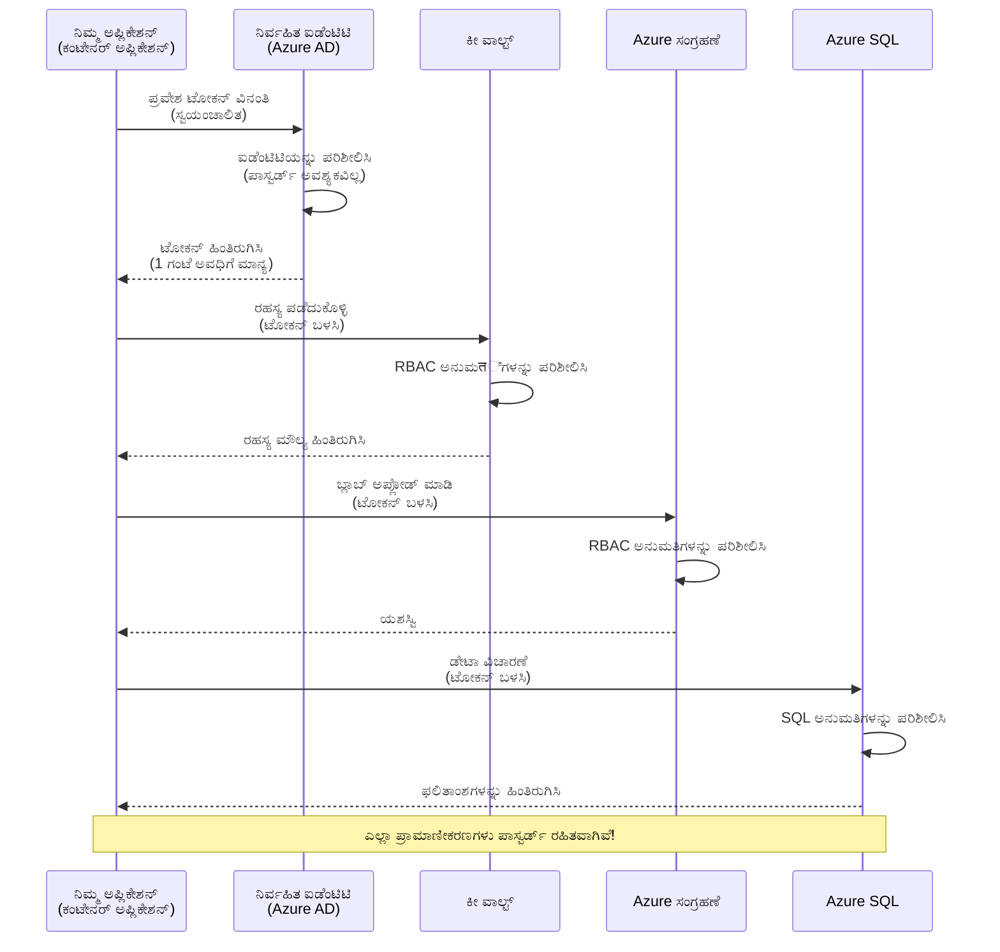

# ಪ್ರಮಾಣೀಕರಣ ಮಾದರಿಗಳು ಮತ್ತು ನಿರ್ವಹಿತ ಐಡೆಂಟಿಟಿ

⏱️ **ಅಂದಾಜು ಸಮಯ**: 45-60 ನಿಮಿಷಗಳು | 💰 **ಖರ್ಚು ಪ್ರಭಾವ**: ಉಚಿತ (ಯಾವುದೇ ಹೆಚ್ಚುವರಿ ಶುಲ್ಕಗಳು ಇಲ್ಲ) | ⭐ **ಸಂಕೀರ್ಣತೆ**: ಮಧ್ಯಮ

**📚 ಕಲಿಕೆಯ ಮಾರ್ಗ:**
- ← Previous: [ಕಾನ್ಫಿಗರೇಶನ್ ನಿರ್ವಹಣೆ](configuration.md) - ಪರಿಸರ ಚರಗಳು ಮತ್ತು ರಹಸ್ಯಗಳನ್ನು ನಿರ್ವಹಿಸುವುದು
- 🎯 **ನೀವು ಇಲ್ಲಿ ಇದ್ದೀರಿ**: ಪ್ರಮಾಣೀಕರಣ ಮತ್ತು ಭದ್ರತೆ (ನಿರ್ವಹಿತ ಐಡೆಂಟಿಟಿ, ಕೀ ವಾಲ್ಟ್, ಸುರಕ್ಷಿತ ಮಾದರಿಗಳು)
- → Next: [ಮೊದಲ ಪ್ರಾಜೆಕ್ಟ್](first-project.md) - ನಿಮ್ಮ ಮೊದಲ AZD ಅನ್ವಯಿಕೆಯನ್ನು ನಿರ್ಮಿಸಿ
- 🏠 [ಕೋರ್ಸ್ ಹೋಮ್](../../README.md)

---

## ನೀವು ಏನು ಕಲಿಯುತ್ತೀರಿ

ಈ ಪಾಠವನ್ನು ಮುಗಿಸುವ ಮೂಲಕ, ನೀವು:
- Azure ಪ್ರಮಾಣೀಕರಣ ಮಾದರಿಗಳನ್ನು ಅರ್ಥಮಾಡಿಕೊಳ್ಳುತ್ತೀರಿ (ಕೀಲಿಗಳು, ಕನೆಕ್ಷನ್ ಸ್ಟ್ರಿಂಗ್‌ಗಳು, ನಿರ್ವಹಿತ ಐಡೆಂಟಿಟಿ)
- ಪಾಸ್‌ವರ್ಡ್ ರಹಿತ ಪ್ರಮಾಣೀಕರಣಕ್ಕಾಗಿ **ನಿರ್ವಹಿತ ಐಡೆಂಟಿಟಿ** ಅನ್ನು ಅನುಷ್ಠಾನಗೊಳಿಸುತ್ತೀರಿ
- **Azure Key Vault** ಇಂಟಿಗ್ರೇಶನ್‌ ಮೂಲಕ ರಹಸ್ಯಗಳನ್ನು ಭದ್ರಗೊಳಿಸುತ್ತೀರಿ
- AZD ನಿಯೋಜನೆಗಳಿಗಾಗಿ **ಭೂಮಿಕಾ ಆಧಾರಿತ ಪ್ರವೇಶ ನಿಯಂತ್ರಣ (RBAC)** ಅನ್ನು ಸಂರಚಿಸುತ್ತೀರಿ
- Container Apps ಮತ್ತು Azure ಸೇವೆಗಳಲ್ಲಿ ಭದ್ರತಾ ಉತ್ತಮ ಅಭ್ಯಾಸಗಳನ್ನು ಅನ್ವಯಿಸುತ್ತೀರಿ
- ಕೀ-ಆಧಾರಿತದಿಂದ ಐಡೆಂಟಿಟಿ-ಆಧಾರಿತ ಪ್ರಮಾಣೀಕರಣಕ್ಕೆ ಮಿಕ್ಕಲಾಗುತ್ತೀರಿ

## ನಿರ್ವಹಿತ ಐಡೆಂಟಿಟಿ ಏಕೆ ಪ್ರಮುಖ

### ಸಮಸ್ಯೆ: ಸಾಂಪ್ರದಾಯಿಕ ಪ್ರಮಾಣೀಕರಣ

**ನಿರ್ವಹಿತ ಐಡೆಂಟಿಟಿಯ ಮೊದಲು:**
```javascript
// ❌ ಸುರಕ್ಷತಾ ಅಪಾಯ: ಕೋಡ್‌ನಲ್ಲಿ ಹಾರ್ಡ್‌ಕೋಡ್ ಆಗಿರುವ ರಹಸ್ಯಗಳು
const connectionString = "Server=mydb.database.windows.net;User=admin;Password=P@ssw0rd123";
const storageKey = "xK7mN9pQ2wR5tY8uI0oP3aS6dF1gH4jK...";
const cosmosKey = "C2x7B9n4M1p8Q5w3E6r0T2y5U8i1O4p7...";
```

**ಸಮಸ್ಯೆಗಳು:**
- 🔴 **ಪ್ರಕಟವಾದ ರಹಸ್ಯಗಳು** ಕೋಡ್, ಕನ್ಫಿಗ್ ಫೈಲುಗಳು, ಪರಿಸರ ಚರಗಳಲ್ಲಿ
- 🔴 **ಪ್ರಮಾಣಪತ್ರಗಳ ರೋಟೇಶನ್** ಕೋಡ್ ಬದಲಾವಣೆ ಮತ್ತು ಮರುನಿಯೋಜನೆ ಬೇಕಾಗುತ್ತದೆ
- 🔴 **ಆಡಿಟ್ ಸಮಸ್ಯೆಗಳು** - ಯಾರು ಯಾವ ವಸ್ತುಗಳಿಗೆ ಯಾವಾಗ ಪ್ರವೇಶ ಪಡೆದರು?
- 🔴 **ವಿತರಣಾ (sprawl)** - ರಹಸ್ಯಗಳು ಹಲವು ವ್ಯವಸ್ಥೆಗಳಾದ್ಯಂತ ಹರಡಿವೆ
- 🔴 **ಅನುಪಾಲನಾ ಅಪಾಯಗಳು** - ಭದ್ರತಾ ಆಡಿಟ್‌ಗಳಲ್ಲಿ ವಿಫಲವಾಗುವ ಸಾಧ್ಯತೆ

### ಪರಿಹಾರ: ನಿರ್ವಹಿತ ಐಡೆಂಟಿಟಿ

**ನಿರ್ವಹಿತ ಐಡೆಂಟಿಟಿಯ ನಂತರ:**
```javascript
// ✅ ಸುರಕ್ಷಿತ: ಕೋಡಿನಲ್ಲಿ ಯಾವುದೇ ರಹಸ್ಯಗಳು ಇಲ್ಲ
const credential = new DefaultAzureCredential();
const client = new BlobServiceClient(
  "https://mystorageaccount.blob.core.windows.net",
  credential  // Azure ಸ್ವಯಂಚಾಲಿತವಾಗಿ ಪ್ರಮಾಣೀಕರಣವನ್ನು ನಿರ್ವಹಿಸುತ್ತದೆ
);
```

**ಲಾಭಗಳು:**
- ✅ **ರಹಸ್ಯಗಳಿಲ್ಲ** ಕೋಡ್ ಅಥವಾ ಕಾನ್ಫಿಗ್‌ನಲ್ಲಿ
- ✅ **ಸ್ವಯಂಚಾಲಿತ ರೋಟೇಶನ್** - Azure ಇದನ್ನು ನಿರ್ವಹಿಸುತ್ತದೆ
- ✅ **ಸಂಪೂರ್ಣ ಆಡಿಟ್ ಟ್ರೇಲ್** Azure AD ಲಾಗ್‌ಗಳಲ್ಲಿ
- ✅ **ಕೇಂದ್ರೀಕೃತ ಭದ್ರತೆ** - Azure ಪೋರ್ಟಲ್‌ನಲ್ಲಿ ನಿರ್ವಹಿಸಬಹುದು
- ✅ **ಅನುಪಾಲನೆಗೆ ಸಿದ್ಧ** - ಭದ್ರತಾ ಮಾನದಂಡಗಳನ್ನು ಪೂರೈಸುತ್ತದೆ

**ಉಪಮೆ**: ಸಾಂಪ್ರದಾಯಿಕ ಪ್ರಮಾಣೀಕರಣವು ವಿಭಿನ್ನ ದ್ವಾರಗಳಿಗೆ ಅನೇಕ ಭೌತಿಕ ಕೀಲಿಗಳನ್ನು ಸಾಗಿಸುವಂತಿದೆ. ನಿರ್ವಹಿತ ಐಡೆಂಟಿಟಿ ಎಂದರೆ, ನೀವು ಯಾರು ಎಂಬುದರ ಆಧಾರದ ಮೇಲೆ ಸ್ವಯಂಚಾಲಿತವಾಗಿ ಪ್ರವೇಶ ನೀಡುವ ಭದ್ರತಾ ಬ್ಯಾಡ್ಜ್ ಹೊಂದಿರುವಂತಿದೆ — ಕೀಲಿಗಳನ್ನು ಕಳೆದುಕೊಳ್ಳುವುದು, ನಕಲಿಸುವುದು ಅಥವಾ ರೋಟೇಟ್ ಮಾಡುವ ಅಗತ್ಯವಿಲ್ಲ.

---

## ವಾಸ್ತುಶಿಲ್ಪ ಅವಲೋಕನ

### ನಿರ್ವಹಿತ ಐಡೆಂಟಿಟಿಯೊಂದಿಗೆ ಪ್ರಮಾಣೀಕರಣ ಪ್ರವಾಹ


### ನಿರ್ವಹಿತ ಐಡೆಂಟಿಟಿಗಳ ಪ್ರಕಾರಗಳು


| Feature | System-Assigned | User-Assigned |
|---------|----------------|---------------|
| **Lifecycle** | ಸಂಪನ್ಮೂಲಕ್ಕೆ ಜೋಡೆಸಿದೆ | ಸ್ವತಂತ್ರ |
| **Creation** | ಸಂಪನ್ಮೌಲದೊಂದಿಗೆ ಸ್ವಯಂಚಾಲಿತ | ಕೈಯಿಂದ ರಚನೆ |
| **Deletion** | ಸಂಪನ್ಮೂಲ ಅಳಿಸಿದಾಗ ಅಳಿಸಲಾಗುತ್ತದೆ | ಸಂಪನ್ಮೂಲ ಅಳಿಸಿದ ನಂತರವೂ ಉಳಿಯುತ್ತದೆ |
| **Sharing** | ಒಂದು ಸಂಪನ್ಮೂಲಕ್ಕೆ ಮಾತ್ರ | ಅನೇಕ ಸಂಪನ್ಮೂಲಗಳಿಗೆ |
| **Use Case** | ಸರಳ ಸಂದರ್ಭಗಳು | ಸಂಕೀರ್ಣ ಬಹು-ಸಂಪನ್ಮೂಲ ಸಂದರ್ಭಗಳು |
| **AZD Default** | ✅ ಶಿಫಾರಸು ಮಾಡಲಾಗಿದೆ | ಐಚ್ಛಿಕ |

---

## ಪೂರ್ವಾಪೇಕ್ಷಿತಗಳು

### ಅಗತ್ಯ ಸಾಧನಗಳು

ನೀವು ಹಿಂದಿನ ಪಾಠಗಳಿಂದ ನೀವು ಈಗಾಗಲೇ ಈ ಕೆಳಗಿನವುಗಳನ್ನು ಸ್ಥಾಪಿಸಿದ್ದಿರಬೇಕು:

```bash
# Azure Developer CLI ಅನ್ನು ಪರಿಶೀಲಿಸಿ
azd version
# ✅ ನಿರೀಕ್ಷಿಸಲಾಗಿದೆ: azd ಆವೃತ್ತಿ 1.0.0 ಅಥವಾ ಹೆಚ್ಚು

# Azure CLI ಅನ್ನು ಪರಿಶೀಲಿಸಿ
az --version
# ✅ ನಿರೀಕ್ಷಿಸಲಾಗಿದೆ: azure-cli 2.50.0 ಅಥವಾ ಹೆಚ್ಚು
```

### Azure ಅಗತ್ಯತೆಗಳು

- ಸಕ್ರಿಯ Azure ಸಬ್‌ಸ್ಕ್ರಿಪ್ಷನ್
- ಅನುಮತಿಗಳು:
  - ನಿರ್ವಹಿತ ಐಡೆಂಟಿಟಿಗಳನ್ನು ರಚಿಸುವುದು
  - RBAC ಪಾತ್ರಗಳನ್ನು ನಿಯೋಜಿಸುವುದು
  - Key Vault ಸಂಪನ್ಮೂಲಗಳನ್ನು ರಚಿಸುವುದು
  - Container Apps ಅನ್ನು ನಿಯೋಜಿಸುವುದು

### ಜ್ಞಾನ ಪೂರ್ವಾಪೇಕ್ಷಿತಗಳು

ನೀವು ಪೂರ್ಣಗೊಳಿಸಿದ್ದಿರಬೇಕು:
- [ಇನ್‌ಸ್ಟಾಲೇಶನ್ ಮಾರ್ಗದರ್ಶಿ](installation.md) - AZD ಸೆಟ್‌ಅಪ್
- [AZD ಮೂಲಭೂತಗಳು](azd-basics.md) - ಮುಖ್ಯ ಕಲ್ಪನೆಗಳು
- [ಕಾನ್ಫಿಗರೇಶನ್ ನಿರ್ವಹಣೆ](configuration.md) - ಪರಿಸರ ಚರಗಳು

---

## ಪಾಠ 1: ಪ್ರಮಾಣೀಕರಣ ಮಾದರಿಗಳನ್ನು ಅರ್ಥಮಾಡಿಕೊಳ್ಳುವುದು

### ಮಾದರಿ 1: ಕನೆಕ್ಷನ್ ಸ್ಟ್ರಿಂಗ್‌ಗಳು (ಹಳೆ ವಿಧಾನ - ಬಳಸಬೇಡಿ)

**ಇದು ಹೇಗೆ ಕಾರ್ಯನಿರ್ವಹಿಸುತ್ತದೆ:**
```bash
# ಕನೆಕ್ಷನ್ ಸ್ಟ್ರಿಂಗ್‌ನಲ್ಲಿ ಪ್ರಾಮಾಣೀಕರಣ ವಿವರಗಳು ಒಳಗೊಂಡಿವೆ
STORAGE_CONNECTION_STRING="DefaultEndpointsProtocol=https;AccountName=myaccount;AccountKey=xK7mN9pQ2wR5..."
COSMOS_CONNECTION_STRING="AccountEndpoint=https://myaccount.documents.azure.com:443/;AccountKey=C2x7..."
SQL_CONNECTION_STRING="Server=myserver.database.windows.net;User=admin;Password=P@ssw0rd..."
```

**ಸಮಸ್ಯೆಗಳು:**
- ❌ ಪರಿಸರ ಚರಗಳಲ್ಲಿ ರಹಸ್ಯಗಳು ಗೋಚರಿಸುತ್ತವೆ
- ❌ ಡಿಪ್ಲಾಯ್ ಸಿಸ್ಟಂಗಳಲ್ಲಿ ಲಾಗ್ ಆಗಬಹುದು
- ❌ ರೋಟೇಶನ್ ಮಾಡುವುದು ಕಷ್ಟಕರ
- ❌ ಪ್ರವೇಶದ ದಾಖಲೆ (ಆಡಿಟ್ ಟ್ರೇಲ್) ಇಲ್ಲ

**ಯಾವಾಗ ಬಳಸುವುದು:** ಸ್ಥಳೀಯ ಅಭಿವೃದ್ಧಿಗಾಗಿ ಮಾತ್ರ, ಉತ್ಪಾದನೆಗೆ ಎಂದಿಗೂ ಅಲ್ಲ.

---

### ಮಾದರಿ 2: Key Vault ಉಲ್ಲೇಖಗಳು (ಉತ್ತಮ)

**ಇದು ಹೇಗೆ ಕಾರ್ಯನಿರ್ವಹಿಸುತ್ತದೆ:**
```bicep
// Store secret in Key Vault
resource keyVault 'Microsoft.KeyVault/vaults@2023-02-01' = {
  name: 'mykv'
  properties: {
    enableRbacAuthorization: true
  }
}

// Reference in Container App
env: [
  {
    name: 'STORAGE_KEY'
    secretRef: 'storage-key'  // References Key Vault
  }
]
```

**ಲಾಭಗಳು:**
- ✅ ರಹಸ್ಯಗಳು Key Vault ನಲ್ಲಿ ಸುರಕ್ಷಿತವಾಗಿ ಸಂಗ್ರಹವಾಗುತ್ತವೆ
- ✅ ಕೇಂದ್ರೀಕೃತ ರಹಸ್ಯ ನಿರ್ವಹಣೆ
- ✅ ಕೋಡ್ ಬದಲಾವಣೆಗಳಿಲ್ಲದೆ ರೋಟೇಶನ್

**ಸೀಮಿತತೆಗಳು:**
- ⚠️ ಇನ್ನೂ ಕೀಲಿಗಳು/ಪಾಸ್ವರ್ಡ್‌ಗಳು ಬಳಸಲಾಗುತ್ತವೆ
- ⚠️ Key Vault ಪ್ರವೇಶವನ್ನು ನಿರ್ವಹಿಸುವ ಅಗತ್ಯ

**ಯಾವಾಗ ಬಳಸುವುದು:** ಕನೆಕ್ಷನ್ ಸ್ಟ್ರಿಂಗ್‌ಗಳಿಂದ ನಿರ್ವಹಿತ ಐಡೆಂಟಿಟಿಗೆ ಪರಿವರ್ತನೆಯ ಮಧ್ಯಹಂತ.

---

### ಮಾದರಿ 3: ನಿರ್ವಹಿತ ಐಡೆಂಟಿಟಿ (ಉತ್ತಮ ಅಭ್ಯಾಸ)

**ಇದು ಹೇಗೆ ಕಾರ್ಯನಿರ್ವಹಿಸುತ್ತದೆ:**
```bicep
// Enable managed identity
resource containerApp 'Microsoft.App/containerApps@2023-05-01' = {
  name: 'myapp'
  identity: {
    type: 'SystemAssigned'  // Automatically creates identity
  }
}

// Grant permissions
resource roleAssignment 'Microsoft.Authorization/roleAssignments@2022-04-01' = {
  scope: storageAccount
  properties: {
    roleDefinitionId: storageBlobDataContributorRole
    principalId: containerApp.identity.principalId
  }
}
```

**ಅಪ್ಲಿಕೇಶನ್ ಕೋಡ್:**
```javascript
// ಯಾವುದೇ ರಹಸ್ಯಗಳೂ ಬೇಕಾಗಿಲ್ಲ!
const { DefaultAzureCredential } = require('@azure/identity');
const { BlobServiceClient } = require('@azure/storage-blob');

const credential = new DefaultAzureCredential();
const blobServiceClient = new BlobServiceClient(
  'https://mystorageaccount.blob.core.windows.net',
  credential
);
```

**ಲಾಭಗಳು:**
- ✅ ಕೋಡ್/ಕಾನ್ಫಿಗ್‌ನಲ್ಲಿ ರಹಸ್ಯಗಳಿಲ್ಲ
- ✅ ಸ್ವಯಂಚಾಲಿತ ಪ್ರಮಾಣಪತ್ರ ರೋಟೇಶನ್
- ✅ ಸಂಪೂರ್ಣ ಆಡಿಟ್ ದಾಖಲೆ
- ✅ RBAC ಆಧಾರಿತ ಅನುಮತಿಗಳು
- ✅ ಅನುಪಾಲನೆಗೆ ಸಿದ್ಧ

**ಯಾವಾಗ ಬಳಸುವುದು:** ಪ್ರತಿಯೊಂದು ಉತ್ಪಾದನಾ ಅಪ್ಲಿಕೇಶನ್‌ಗೆ ಯಾವಾಗಲೂ.

---

## ಪಾಠ 2: AZD ಬಳಸಿ ನಿರ್ವಹಿತ ಐಡೆಂಟಿಟಿಯನ್ನು ಅನುಷ್ಠಾನಗೊಳಿಸುವುದು

### ಹಂತದ ಮೂಲಕ ಅನುಷ್ಠಾನ

ನಾವು Azure Storage ಮತ್ತು Key Vault ಗೆ ಪ್ರವೇಶಕ್ಕಾಗಿ ನಿರ್ವಹಿತ ಐಡೆಂಟಿಟಿ ಬಳಸುವ ಸುರಕ್ಷಿತ Container App ಅನ್ನು ನಿರ್ಮಿಸೋಣ.

### ಪ್ರಾಜೆಕ್ಟ್ ರಚನೆ

```
secure-app/
├── azure.yaml                 # AZD configuration
├── infra/
│   ├── main.bicep            # Main infrastructure
│   ├── core/
│   │   ├── identity.bicep    # Managed identity setup
│   │   ├── keyvault.bicep    # Key Vault configuration
│   │   └── storage.bicep     # Storage with RBAC
│   └── app/
│       └── container-app.bicep
└── src/
    ├── app.js                # Application code
    ├── package.json
    └── Dockerfile
```

### 1. AZD ಸಂರಚಿಸಿ (azure.yaml)

```yaml
name: secure-app
metadata:
  template: secure-app@1.0.0

services:
  api:
    project: ./src
    language: js
    host: containerapp

# Enable managed identity (AZD handles this automatically)
```

### 2. ಮೂಲಸೌಕರ್ಯ: ನಿರ್ವಹಿತ ಐಡೆಂಟಿಟಿಯನ್ನು ಸಕ್ರಿಯಗೊಳಿಸಿ

**ಫೈಲ್: `infra/main.bicep`**

```bicep
targetScope = 'subscription'

param environmentName string
param location string = 'eastus'

var tags = { 'azd-env-name': environmentName }

// Resource group
resource rg 'Microsoft.Resources/resourceGroups@2021-04-01' = {
  name: 'rg-${environmentName}'
  location: location
  tags: tags
}

// Storage Account
module storage './core/storage.bicep' = {
  name: 'storage'
  scope: rg
  params: {
    name: 'st${uniqueString(rg.id)}'
    location: location
    tags: tags
  }
}

// Key Vault
module keyVault './core/keyvault.bicep' = {
  name: 'keyvault'
  scope: rg
  params: {
    name: 'kv-${uniqueString(rg.id)}'
    location: location
    tags: tags
  }
}

// Container App with Managed Identity
module containerApp './app/container-app.bicep' = {
  name: 'container-app'
  scope: rg
  params: {
    name: 'ca-${environmentName}'
    location: location
    tags: tags
    storageAccountName: storage.outputs.name
    keyVaultName: keyVault.outputs.name
  }
}

// Grant Container App access to Storage
module storageRoleAssignment './core/role-assignment.bicep' = {
  name: 'storage-role'
  scope: rg
  params: {
    principalId: containerApp.outputs.identityPrincipalId
    roleDefinitionId: 'ba92f5b4-2d11-453d-a403-e96b0029c9fe'  // Storage Blob Data Contributor
    targetResourceId: storage.outputs.id
  }
}

// Grant Container App access to Key Vault
module kvRoleAssignment './core/role-assignment.bicep' = {
  name: 'kv-role'
  scope: rg
  params: {
    principalId: containerApp.outputs.identityPrincipalId
    roleDefinitionId: '4633458b-17de-408a-b874-0445c86b69e6'  // Key Vault Secrets User
    targetResourceId: keyVault.outputs.id
  }
}

// Outputs
output AZURE_STORAGE_ACCOUNT_NAME string = storage.outputs.name
output AZURE_KEY_VAULT_NAME string = keyVault.outputs.name
output APP_URL string = containerApp.outputs.url
```

### 3. ಸಿಸ್ಟಮ್-ನಿಯೋಜಿತ ಐಡೆಂಟಿಟ್ಟಿಯೊಂದಿಗೆ Container App

**ಫೈಲ್: `infra/app/container-app.bicep`**

```bicep
param name string
param location string
param tags object = {}
param storageAccountName string
param keyVaultName string

resource containerApp 'Microsoft.App/containerApps@2023-05-01' = {
  name: name
  location: location
  tags: tags
  identity: {
    type: 'SystemAssigned'  // 🔑 Enable managed identity
  }
  properties: {
    configuration: {
      ingress: {
        external: true
        targetPort: 3000
      }
    }
    template: {
      containers: [
        {
          name: 'api'
          image: 'myregistry.azurecr.io/api:latest'
          resources: {
            cpu: json('0.5')
            memory: '1Gi'
          }
          env: [
            {
              name: 'AZURE_STORAGE_ACCOUNT_NAME'
              value: storageAccountName
            }
            {
              name: 'AZURE_KEY_VAULT_NAME'
              value: keyVaultName
            }
            // 🔑 No secrets - managed identity handles authentication!
          ]
        }
      ]
    }
  }
}

// Output the identity for RBAC assignments
output identityPrincipalId string = containerApp.identity.principalId
output id string = containerApp.id
output url string = 'https://${containerApp.properties.configuration.ingress.fqdn}'
```

### 4. RBAC ಪಾತ್ರ ನಿಯೋಜನೆ ಮಾಡ್ಯೂಲ್

**ಫೈಲ್: `infra/core/role-assignment.bicep`**

```bicep
param principalId string
param roleDefinitionId string  // Azure built-in role ID
param targetResourceId string

resource roleAssignment 'Microsoft.Authorization/roleAssignments@2022-04-01' = {
  name: guid(principalId, roleDefinitionId, targetResourceId)
  scope: resourceId('Microsoft.Resources/resourceGroups', resourceGroup().name)
  properties: {
    roleDefinitionId: subscriptionResourceId('Microsoft.Authorization/roleDefinitions', roleDefinitionId)
    principalId: principalId
    principalType: 'ServicePrincipal'
  }
}

output id string = roleAssignment.id
```

### 5. ನಿರ್ವಹಿತ ಐಡೆಂಟಿಟಿಯೊಂದಿಗೆ ಅಪ್ಲಿಕೇಶನ್ ಕೋಡ್

**ಫೈಲ್: `src/app.js`**

```javascript
const express = require('express');
const { DefaultAzureCredential } = require('@azure/identity');
const { BlobServiceClient } = require('@azure/storage-blob');
const { SecretClient } = require('@azure/keyvault-secrets');

const app = express();
const PORT = process.env.PORT || 3000;

// 🔑 ಪ್ರಮಾಣಪತ್ರವನ್ನು ಪ್ರಾರಂಭಿಸಿ (ನಿರ್ವಹಿತ ಐಡಂಟಿಟಿಯೊಂದಿಗೆ ಸ್ವಯಂಚಾಲಿತವಾಗಿ ಕಾರ್ಯನಿರ್ವಹಿಸುತ್ತದೆ)
const credential = new DefaultAzureCredential();

// Azure ಸ್ಟೋರೆಜ್ ಸಂರಚನೆ
const storageAccountName = process.env.AZURE_STORAGE_ACCOUNT_NAME;
const blobServiceClient = new BlobServiceClient(
  `https://${storageAccountName}.blob.core.windows.net`,
  credential  // ಯಾವುದೇ ಕೀಲಿಗಳು ಬೇಕಾಗಿಲ್ಲ!
);

// ಕೀ ವಾಲ್ಟ್ ಸಂರಚನೆ
const keyVaultName = process.env.AZURE_KEY_VAULT_NAME;
const secretClient = new SecretClient(
  `https://${keyVaultName}.vault.azure.net`,
  credential  // ಯಾವುದೇ ಕೀಲಿಗಳು ಬೇಕಾಗಿಲ್ಲ!
);

// ಆರೋಗ್ಯ ಪರಿಶೀಲನೆ
app.get('/health', (req, res) => {
  res.json({ status: 'healthy', authentication: 'managed-identity' });
});

// ಫೈಲ್ ಅನ್ನು ಬ್ಲಾಬ್ ಸ್ಟೋರೆಜಿಗೆ ಅಪ್ಲೋಡ್ ಮಾಡಿ
app.post('/upload', async (req, res) => {
  try {
    const containerClient = blobServiceClient.getContainerClient('uploads');
    await containerClient.createIfNotExists();
    
    const blobName = `file-${Date.now()}.txt`;
    const blockBlobClient = containerClient.getBlockBlobClient(blobName);
    
    await blockBlobClient.upload('Hello from managed identity!', 30);
    
    res.json({
      success: true,
      blobName: blobName,
      message: 'File uploaded using managed identity!'
    });
  } catch (error) {
    console.error('Upload error:', error);
    res.status(500).json({ error: error.message });
  }
});

// ಕೀ ವಾಲ್ಟ್‌ನಿಂದ ರಹಸ್ಯವನ್ನು ಪಡೆಯಿರಿ
app.get('/secret/:name', async (req, res) => {
  try {
    const secretName = req.params.name;
    const secret = await secretClient.getSecret(secretName);
    
    res.json({
      name: secretName,
      value: secret.value,
      message: 'Secret retrieved using managed identity!'
    });
  } catch (error) {
    console.error('Secret error:', error);
    res.status(500).json({ error: error.message });
  }
});

// ಬ್ಲಾಬ್ ಕಂಟೇನರ್‌ಗಳನ್ನು ಪಟ್ಟಿ ಮಾಡಿ (ಓದುವ ಪ್ರವೇಶವನ್ನು ಪ್ರದರ್ಶಿಸುತ್ತದೆ)
app.get('/containers', async (req, res) => {
  try {
    const containers = [];
    for await (const container of blobServiceClient.listContainers()) {
      containers.push(container.name);
    }
    
    res.json({
      containers: containers,
      count: containers.length,
      message: 'Containers listed using managed identity!'
    });
  } catch (error) {
    console.error('List error:', error);
    res.status(500).json({ error: error.message });
  }
});

app.listen(PORT, () => {
  console.log(`Secure API listening on port ${PORT}`);
  console.log('Authentication: Managed Identity (passwordless)');
});
```

**ಫೈಲ್: `src/package.json`**

```json
{
  "name": "secure-app",
  "version": "1.0.0",
  "dependencies": {
    "express": "^4.18.2",
    "@azure/identity": "^4.0.0",
    "@azure/storage-blob": "^12.17.0",
    "@azure/keyvault-secrets": "^4.7.0"
  },
  "scripts": {
    "start": "node app.js"
  }
}
```

### 6. ನಿಯೋಜಿಸಿ ಮತ್ತು ಪರೀಕ್ಷಿಸಿ

```bash
# AZD ಪರಿಸರವನ್ನು ಆರಂಭಿಸಿ
azd init

# ಇನ್‌ಫ್ರಾಸ್ಟ್ರಕ್ಚರ್ ಮತ್ತು ಅಪ್ಲಿಕೇಶನ್ ಅನ್ನು ನಿಯೋಜಿಸಿ
azd up

# ಅಪ್ URL ಅನ್ನು ಪಡೆಯಿರಿ
APP_URL=$(azd env get-values | grep APP_URL | cut -d '=' -f2 | tr -d '"')

# ಆರೋಗ್ಯ ಪರಿಶೀಲನೆಯನ್ನು ಪರೀಕ್ಷಿಸಿ
curl $APP_URL/health
```

**✅ ನಿರೀಕ್ಷಿತ ಔಟ್‌ಪುಟ್:**
```json
{
  "status": "healthy",
  "authentication": "managed-identity"
}
```

**ಬ್ಲಾಬ್ ಅಪ್‌ಲೋಡ್ ಪರೀಕ್ಷೆ:**
```bash
curl -X POST $APP_URL/upload
```

**✅ ನಿರೀಕ್ಷಿತ ಔಟ್‌ಪುಟ್:**
```json
{
  "success": true,
  "blobName": "file-1700404800000.txt",
  "message": "File uploaded using managed identity!"
}
```

**ಕಂಟೇನರ್ ಪಟ್ಟಿಯನ್ನು ಪರೀಕ್ಷಿಸಿ:**
```bash
curl $APP_URL/containers
```

**✅ ನಿರೀಕ್ಷಿತ ಔಟ್‌ಪುಟ್:**
```json
{
  "containers": ["uploads"],
  "count": 1,
  "message": "Containers listed using managed identity!"
}
```

---

## ಸಾಮಾನ್ಯ Azure RBAC ಪಾತ್ರಗಳು

### ನಿರ್ವಹಿತ ಐಡೆಂಟಿಟಿಗಾಗಿ ನಿರ್ಮಿತ ಪಾತ್ರ ID ಗಳು

| Service | Role Name | Role ID | Permissions |
|---------|-----------|---------|-------------|
| **Storage** | Storage Blob Data Reader | `2a2b9908-6b94-4a3d-8e5a-a7d8f8cc8a12` | ಬ್ಲಾಬ್ ಮತ್ತು ಕಾಂಟೇನರ್ ಓದುವುದು |
| **Storage** | Storage Blob Data Contributor | `ba92f5b4-2d11-453d-a403-e96b0029c9fe` | ಬ್ಲಾಬ್‌ಗಳನ್ನು ಓದು, ಬರೆಯು, ಅಳಿಸಿ |
| **Storage** | Storage Queue Data Contributor | `974c5e8b-45b9-4653-ba55-5f855dd0fb88` | ಕ್ಯೂ ಸಂದೇಶಗಳನ್ನು ಓದು, ಬರೆಯು, ಅಳಿಸಿ |
| **Key Vault** | Key Vault Secrets User | `4633458b-17de-408a-b874-0445c86b69e6` | ರಹಸ್ಯಗಳನ್ನು ಓದು |
| **Key Vault** | Key Vault Secrets Officer | `b86a8fe4-44ce-4948-aee5-eccb2c155cd7` | ರಹಸ್ಯಗಳನ್ನು ಓದು, ಬರೆಯು, ಅಳಿಸಿ |
| **Cosmos DB** | Cosmos DB Built-in Data Reader | `00000000-0000-0000-0000-000000000001` | Cosmos DB ಡೇಟಾವನ್ನು ಓದು |
| **Cosmos DB** | Cosmos DB Built-in Data Contributor | `00000000-0000-0000-0000-000000000002` | Cosmos DB ಡೇಟಾವನ್ನು ಓದು, ಬರೆಯು |
| **SQL Database** | SQL DB Contributor | `9b7fa17d-e63e-47b0-bb0a-15c516ac86ec` | SQL ಡೇಟಾಬೇಸ್‌ಗಳನ್ನು ನಿರ್ವಹಿಸು |
| **Service Bus** | Azure Service Bus Data Owner | `090c5cfd-751d-490a-894a-3ce6f1109419` | ಸಂದೇಶಗಳನ್ನು ಕಳುಹಿಸು, ಸ್ವೀಕರಿಸು, ನಿರ್ವಹಿಸು |

### ಪಾತ್ರ ID ಗಳನ್ನು ಹೇಗೆ ಕಂಡುಹಿಡಿಯುವುದು

```bash
# ಎಲ್ಲಾ ನಿರ್ಮಿತ ರೋಲ್‌ಗಳನ್ನು ಪಟ್ಟಿ ಮಾಡಿ
az role definition list --query "[].{Name:roleName, ID:name}" --output table

# ನಿರ್ದಿಷ್ಟ ರೋಲ್ ಅನ್ನು ಹುಡುಕಿ
az role definition list --query "[?contains(roleName, 'Storage Blob')].{Name:roleName, ID:name}" --output table

# ರೋಲ್ ವಿವರಗಳನ್ನು ಪಡೆಯಿ
az role definition list --name "Storage Blob Data Contributor"
```

---

## ಪ್ರಾಯೋಗಿಕ ವ್ಯಾಯಾಮಗಳು

### ವ್ಯಾಯಾಮ 1: ಇರುತ್ತಿರುವ ಅಪ್ಲಿಕೇಶನ್‌ಗಾಗಿ ನಿರ್ವಹಿತ ಐಡೆಂಟಿಟಿಯನ್ನು ಸಕ್ರಿಯಗೊಳಿಸಿ ⭐⭐ (ಮಧ್ಯಮ)

**ಉದ್ದೇಶ:** ಇರುತ್ತಿರುವ Container App ನಿಯೋಜನೆಗೆ ನಿರ್ವಹಿತ ಐಡೆಂಟಿಟಿಯನ್ನು ಸೇರಿಸುವುದು

**ದೃಶ್ಯಾವಳಿ:** ನಿಮ್ಮ ಬಳಿ ಕನೆಕ್ಷನ್ ಸ್ಟ್ರಿಂಗ್‌ಗಳನ್ನು ಬಳಸುವ Container App ಇದೆ. ಅದನ್ನು ನಿರ್ವಹಿತ ಐಡೆಂಟಿಟಿಗೆ ಪರಿವರ್ತಿಸಿ.

**ಪ್ರಾರಂಭಿಕ ಸ್ಥಿತಿ:** Container App ಈ ಸಂರಚನೆಯೊಂದಿಗೆ:

```bicep
// ❌ Current: Using connection string
env: [
  {
    name: 'STORAGE_CONNECTION_STRING'
    secretRef: 'storage-connection'
  }
]
```

**ಹಂತಗಳು**:

1. **Bicep ನಲ್ಲಿ ನಿರ್ವಹಿತ ಐಡೆಂಟಿಟಿಯನ್ನು ಸಕ್ರಿಯಗೊಳಿಸಿ:**

```bicep
resource containerApp 'Microsoft.App/containerApps@2023-05-01' = {
  name: 'myapp'
  identity: {
    type: 'SystemAssigned'  // Add this
  }
  // ... rest of configuration
}
```

2. **Storage ಪ್ರವೇಶವನ್ನು ನೀಡುವುದು:**

```bicep
// Get storage account reference
resource storageAccount 'Microsoft.Storage/storageAccounts@2023-01-01' existing = {
  name: storageAccountName
}

// Assign role
resource roleAssignment 'Microsoft.Authorization/roleAssignments@2022-04-01' = {
  name: guid(containerApp.id, 'ba92f5b4-2d11-453d-a403-e96b0029c9fe', storageAccount.id)
  scope: storageAccount
  properties: {
    roleDefinitionId: subscriptionResourceId('Microsoft.Authorization/roleDefinitions', 'ba92f5b4-2d11-453d-a403-e96b0029c9fe')
    principalId: containerApp.identity.principalId
    principalType: 'ServicePrincipal'
  }
}
```

3. **ಅಪ್ಲಿಕೇಶನ್ ಕೋಡ್ ಅನ್ನು ನವೀಕರಿಸಿ:**

**ಹಿಂದೆ (ಕನೆಕ್ಷನ್ ಸ್ಟ್ರಿಂಗ್):**
```javascript
const { BlobServiceClient } = require('@azure/storage-blob');

const blobServiceClient = BlobServiceClient.fromConnectionString(
  process.env.STORAGE_CONNECTION_STRING
);
```

**ನಂತರ (ನಿರ್ವಹಿತ ಐಡೆಂಟಿಟಿ):**
```javascript
const { DefaultAzureCredential } = require('@azure/identity');
const { BlobServiceClient } = require('@azure/storage-blob');

const credential = new DefaultAzureCredential();
const blobServiceClient = new BlobServiceClient(
  `https://${process.env.STORAGE_ACCOUNT_NAME}.blob.core.windows.net`,
  credential
);
```

4. **ಪರಿಸರ ಚರಗಳನ್ನು ನವೀಕರಿಸಿ:**

```bicep
env: [
  {
    name: 'STORAGE_ACCOUNT_NAME'
    value: storageAccountName  // Just the name, no secrets!
  }
  // Remove STORAGE_CONNECTION_STRING
]
```

5. **ನಿಯೋಜಿಸಿ ಮತ್ತು ಪರೀಕ್ಷಿಸಿ:**

```bash
# ಮತ್ತೆ ನಿಯೋಜಿಸಿ
azd up

# ಇದು ಇನ್ನೂ ಕೆಲಸ ಮಾಡುತ್ತದೆಯೆಂದು ಪರಿಶೀಲಿಸಿ
curl https://myapp.azurecontainerapps.io/upload
```

**✅ ಯಶಸ್ಸಿನ ಮಾನದಂಡಗಳು:**
- ✅ ಅಪ್ಲಿಕೇಶನ್ ದೋಷರಹಿತವಾಗಿ ನಿಯೋಜಿಸಲಾಗುತ್ತದೆ
- ✅ Storage ಕಾರ್ಯಗಳು ಕೆಲಸ ಮಾಡುತ್ತವೆ (ಅಪ್‌ಲೋಡ್, ಪಟ್ಟಿ, ಡೌನ್ಲೋಡ್)
- ✅ ಪರಿಸರ ಚರಗಳಲ್ಲಿ ಯಾವುದೇ ಕನೆಕ್ಷನ್ ಸ್ಟ್ರಿಂಗ್‌ಗಳು ಇರಬಾರದು
- ✅ Azure ಪೋರ್ಟಲ್‌ನಲ್ಲಿ "Identity" ಬ್ಲೇಡ್ ಅಡಿಯಲ್ಲಿ ಐಡೆಂಟಿಟಿ ಗೋಚರಿಸುತ್ತದೆ

**ತಪಾಸಣೆ:**

```bash
# ನಿರ್ವಹಿಸಲಾದ ಗುರುತಿನ ಸಕ್ರಿಯತೆ ಇದೆ ಎಂದು ಪರಿಶೀಲಿಸಿ
az containerapp show \
  --name myapp \
  --resource-group rg-myapp \
  --query "identity.type"
# ✅ ನಿರೀಕ್ಷೆ: "SystemAssigned"

# ಭೂಮಿಕೆ ನಿಯೋಜನೆಯನ್ನು ಪರಿಶೀಲಿಸಿ
az role assignment list \
  --assignee $(az containerapp show --name myapp --resource-group rg-myapp --query "identity.principalId" -o tsv) \
  --scope /subscriptions/{sub-id}/resourceGroups/rg-myapp/providers/Microsoft.Storage/storageAccounts/mystorageaccount
# ✅ ನಿರೀಕ್ಷೆ: "Storage Blob Data Contributor" ಎಂಬ ಭೂಮಿಕೆಯನ್ನು ತೋರಿಸುತ್ತದೆ
```

**ಸಮಯ:** 20-30 ನಿಮಿಷಗಳು

---

### ವ್ಯಾಯಾಮ 2: ಬಳಕೆದಾರ-ನಿಯೋಜಿತ ಐಡೆಂಟಿಟಿಯೊಂದಿಗೆ ಬಹು-ಸೇವೆಗಳ ಪ್ರವೇಶ ⭐⭐⭐ (ಉನ್ನತ)

**ಉದ್ದೇಶ:** ಅನೇಕ Container App ಗಳಲ್ಲಿ ಹಂಚಿಕೊಳ್ಳಬಹುದಾದ ಬಳಕೆದಾರ-ನಿಯೋಜಿತ ಐಡೆಂಟಿಟಿಯನ್ನು ರಚಿಸುವುದು

**ದೃಶ್ಯಾವಳಿ:** ನಿಮಗೆ 3 ಮೈಕ್ರೋಸರ್ವೀಸ್‌ಗಳಿವೆ ಅವುಗಳೆಲ್ಲ ಒಂದೇ Storage ಖಾತೆ ಮತ್ತು Key Vault ಗೆ ಪ್ರವೇಶ ಅಗತ್ಯವಿದೆ.

**ಹಂತಗಳು**:

1. **ಬಳಕೆದಾರ-ನಿಯೋಜಿತ ಐಡೆಂಟಿಟಿಯನ್ನು ರಚಿಸಿ:**

**ಫೈಲ್: `infra/core/identity.bicep`**

```bicep
param name string
param location string
param tags object = {}

resource userAssignedIdentity 'Microsoft.ManagedIdentity/userAssignedIdentities@2023-01-31' = {
  name: name
  location: location
  tags: tags
}

output id string = userAssignedIdentity.id
output principalId string = userAssignedIdentity.properties.principalId
output clientId string = userAssignedIdentity.properties.clientId
```

2. **ಬಳಕೆದಾರ-ನಿಯೋಜಿತ ಐಡೆಂಟಿಟಿಗೆ ಪಾತ್ರಗಳನ್ನು ನಿಯೋಜಿಸಿ:**

```bicep
// In main.bicep
module userIdentity './core/identity.bicep' = {
  name: 'user-identity'
  scope: rg
  params: {
    name: 'id-${environmentName}'
    location: location
    tags: tags
  }
}

// Grant Storage access
resource storageRoleAssignment 'Microsoft.Authorization/roleAssignments@2022-04-01' = {
  name: guid(userIdentity.outputs.principalId, 'storage-contributor')
  scope: storageAccount
  properties: {
    roleDefinitionId: subscriptionResourceId('Microsoft.Authorization/roleDefinitions', 'ba92f5b4-2d11-453d-a403-e96b0029c9fe')
    principalId: userIdentity.outputs.principalId
    principalType: 'ServicePrincipal'
  }
}

// Grant Key Vault access
resource kvRoleAssignment 'Microsoft.Authorization/roleAssignments@2022-04-01' = {
  name: guid(userIdentity.outputs.principalId, 'kv-secrets-user')
  scope: keyVault
  properties: {
    roleDefinitionId: subscriptionResourceId('Microsoft.Authorization/roleDefinitions', '4633458b-17de-408a-b874-0445c86b69e6')
    principalId: userIdentity.outputs.principalId
    principalType: 'ServicePrincipal'
  }
}
```

3. **ಅನೇಕ Container App ಗಳಿಗೆ ಐಡೆಂಟಿಟಿಯನ್ನು ನಿಯೋಜಿಸಿ:**

```bicep
resource apiGateway 'Microsoft.App/containerApps@2023-05-01' = {
  name: 'api-gateway'
  identity: {
    type: 'UserAssigned'
    userAssignedIdentities: {
      '${userIdentity.outputs.id}': {}
    }
  }
  // ... rest of config
}

resource productService 'Microsoft.App/containerApps@2023-05-01' = {
  name: 'product-service'
  identity: {
    type: 'UserAssigned'
    userAssignedIdentities: {
      '${userIdentity.outputs.id}': {}
    }
  }
  // ... rest of config
}

resource orderService 'Microsoft.App/containerApps@2023-05-01' = {
  name: 'order-service'
  identity: {
    type: 'UserAssigned'
    userAssignedIdentities: {
      '${userIdentity.outputs.id}': {}
    }
  }
  // ... rest of config
}
```

4. **ಅಪ್ಲಿಕೇಶನ್ ಕೋಡ್ (ಎಲ್ಲಾ ಸೇವೆಗಳು ಒಂದೇ ಮಾದರಿಯನ್ನು ಬಳಸುತ್ತವೆ):**

```javascript
const { DefaultAzureCredential, ManagedIdentityCredential } = require('@azure/identity');

// ಬಳಕೆದಾರ ನಿಯೋಜಿತ ಐಡೆಂಟಿಟಿಗಾಗಿ ಕ್ಲೈಂಟ್ ID ಅನ್ನು ನಿರ್ದಿಷ್ಟಗೊಳಿಸಿ
const credential = new ManagedIdentityCredential(
  process.env.AZURE_CLIENT_ID  // ಬಳಕೆದಾರ ನಿಯೋಜಿತ ಐಡೆಂಟಿಟಿಯ ಕ್ಲೈಂಟ್ ID
);

// अथवा DefaultAzureCredential ಅನ್ನು ಬಳಸಿ (ಸ್ವಯಂಚಾಲಿತವಾಗಿ ಪತ್ತೆಮಾಡುತ್ತದೆ)
const credential = new DefaultAzureCredential();

const blobServiceClient = new BlobServiceClient(
  `https://${process.env.STORAGE_ACCOUNT_NAME}.blob.core.windows.net`,
  credential
);
```

5. **ನಿಯೋಜಿಸಿ ಮತ್ತು ದೃಢೀಕರಿಸಿ:**

```bash
azd up

# ಎಲ್ಲಾ ಸೇವೆಗಳು ಸ್ಟೋರೇಜ್‌ಗೆ ಪ್ರವೇಶಿಸಬಹುದು ಎಂದು ಪರೀಕ್ಷಿಸಿ
curl https://api-gateway.azurecontainerapps.io/upload
curl https://product-service.azurecontainerapps.io/upload
curl https://order-service.azurecontainerapps.io/upload
```

**✅ ಯಶಸ್ಸಿನ ಮಾನದಂಡಗಳು:**
- ✅ ಒಂದು ಐಡೆಂಟಿಟಿ 3 ಸೇವೆಗಳಾದ್ಯಂತ ಹಂಚಿಕೊಳ್ಳಲಾಗಿದೆ
- ✅ ಎಲ್ಲಾ ಸೇವೆಗಳು Storage ಮತ್ತು Key Vault ಗೆ ಪ್ರವೇಶಿಸಬಹುದು
- ✅ ಒಂದು ಸೇವೆಯನ್ನು ಅಳಿಸಿದರೂ ಐಡೆಂಟಿಟಿ ಉಳಿಯುತ್ತದೆ
- ✅ ಕೇಂದ್ರೀಕೃತ ಅನುಮತಿ ನಿರ್ವಹಣೆ

**ಬಳಕೆದಾರ-ನಿಯೋಜಿತ ಐಡೆಂಟಿಟಿಯ ಪ್ರಯೋಜನಗಳು:**
- ನಿರ್ವಹಿಸಲು ಏಕೈಕ ಐಡೆಂಟಿಟಿ
- ಸೇವೆಗಳಾದ್ಯಂತ ಸತತ ಅನುಮತಿಗಳು
- ಸೇವೆ ಅಳಿಸಿದರೂ ಉಳಿಯುವ ಸಾಮರ್ಥ್ಯ
- ಸಂಕೀರ್ಣ ಆರ್ಕಿಟೆಕ್ಚರ್‌ಗಳಿಗೆ ಉತ್ತಮ

**ಸಮಯ:** 30-40 ನಿಮಿಷಗಳು

---

### ವ್ಯಾಯಾಮ 3: Key Vault ರಹಸ್ಯ ರೋಟೇಶನ್ ಅನುಷ್ಠಾನಗೊಳಿಸಿ ⭐⭐⭐ (ಉನ್ನತ)

**ಉದ್ದೇಶ:** ತೃತೀಯ-ಪಕ್ಷ API ಕೀಲಿಗಳನ್ನು Key Vault ನಲ್ಲಿ ಸಂಗ್ರಹಿಸಿ ಮತ್ತು ನಿರ್ವಹಿತ ಐಡೆಂಟಿಟಿ ಬಳಸಿ ಅವುಗಳಿಗೆ ಪ್ರವೇಶ ಪಡೆಯುವುದು

**ದೃಶ್ಯಾವಳಿ:** ನಿಮ್ಮ ಆಪ್‌ಗೆ ಹೊರಗಿನ API ಗಳು (OpenAI, Stripe, SendGrid) ಕರೆ ಮಾಡಲು ಅಗತ್ಯವಿದೆ ಮತ್ತು ಅವು API ಕೀಲಿಗಳನ್ನು ಬೇಡುತ್ತವೆ.

**ಹಂತಗಳು**:

1. **RBAC ಜೊತೆ Key Vault ರಚಿಸಿ:**

**ಫೈಲ್: `infra/core/keyvault.bicep`**

```bicep
param name string
param location string
param tags object = {}

resource keyVault 'Microsoft.KeyVault/vaults@2023-02-01' = {
  name: name
  location: location
  tags: tags
  properties: {
    enableRbacAuthorization: true  // Use RBAC instead of access policies
    sku: {
      family: 'A'
      name: 'standard'
    }
    tenantId: subscription().tenantId
    enableSoftDelete: true
    softDeleteRetentionInDays: 90
  }
}

// Allow Container App to read secrets
output id string = keyVault.id
output name string = keyVault.name
output uri string = keyVault.properties.vaultUri
```

2. **Key Vault ನಲ್ಲಿ ರಹಸ್ಯಗಳನ್ನು ಸಂಗ್ರಹಿಸಿ:**

```bash
# Key Vault ಹೆಸರನ್ನು ಪಡೆಯಿ
KV_NAME=$(azd env get-values | grep AZURE_KEY_VAULT_NAME | cut -d '=' -f2 | tr -d '"')

# ತೃತೀಯ ಪಕ್ಷದ API ಕೀಲಿಗಳನ್ನು ಸಂಗ್ರಹಿಸಿ
az keyvault secret set \
  --vault-name $KV_NAME \
  --name "OpenAI-ApiKey" \
  --value "sk-proj-xxxxxxxxxxxxx"

az keyvault secret set \
  --vault-name $KV_NAME \
  --name "Stripe-ApiKey" \
  --value "sk_live_xxxxxxxxxxxxx"

az keyvault secret set \
  --vault-name $KV_NAME \
  --name "SendGrid-ApiKey" \
  --value "SG.xxxxxxxxxxxxx"
```

3. **ರಹಸ್ಯಗಳನ್ನು ಪಡೆಯಲು ಅಪ್ಲಿಕೇಶನ್ ಕೋಡ್:**

**ಫೈಲ್: `src/config.js`**

```javascript
const { DefaultAzureCredential } = require('@azure/identity');
const { SecretClient } = require('@azure/keyvault-secrets');

class Config {
  constructor() {
    this.credential = new DefaultAzureCredential();
    this.secretClient = new SecretClient(
      `https://${process.env.AZURE_KEY_VAULT_NAME}.vault.azure.net`,
      this.credential
    );
    this.cache = {};
  }

  async getSecret(secretName) {
    // ಮೊದಲು ಕ್ಯಾಶೆಯನ್ನು ಪರಿಶೀಲಿಸಿ
    if (this.cache[secretName]) {
      return this.cache[secretName];
    }

    try {
      const secret = await this.secretClient.getSecret(secretName);
      this.cache[secretName] = secret.value;
      console.log(`✅ Retrieved secret: ${secretName}`);
      return secret.value;
    } catch (error) {
      console.error(`❌ Failed to get secret ${secretName}:`, error.message);
      throw error;
    }
  }

  async getOpenAIKey() {
    return this.getSecret('OpenAI-ApiKey');
  }

  async getStripeKey() {
    return this.getSecret('Stripe-ApiKey');
  }

  async getSendGridKey() {
    return this.getSecret('SendGrid-ApiKey');
  }
}

module.exports = new Config();
```

4. **ಅಪ್ಲಿಕೇಶನ್‌ನಲ್ಲಿ ರಹಸ್ಯಗಳನ್ನು ಬಳಸಿ:**

**ಫೈಲ್: `src/app.js`**

```javascript
const express = require('express');
const config = require('./config');
const { OpenAI } = require('openai');

const app = express();

// Key Vault ನಿಂದ ಪಡೆದ ಕೀ ಬಳಸಿಕೊಂಡು OpenAI ಅನ್ನು ಪ್ರಾರಂಭಿಸಿ
let openaiClient;

async function initializeServices() {
  const openaiKey = await config.getOpenAIKey();
  openaiClient = new OpenAI({ apiKey: openaiKey });
  console.log('✅ Services initialized with secrets from Key Vault');
}

// ಪ್ರಾರಂಭಿಸುವಾಗ ಕರೆಮಾಡಿ
initializeServices().catch(console.error);

app.post('/chat', async (req, res) => {
  try {
    const completion = await openaiClient.chat.completions.create({
      model: 'gpt-4',
      messages: [{ role: 'user', content: 'Hello!' }]
    });
    
    res.json({
      response: completion.choices[0].message.content,
      authentication: 'Key from Key Vault via Managed Identity'
    });
  } catch (error) {
    res.status(500).json({ error: error.message });
  }
});

app.listen(3000, () => {
  console.log('Secure API with Key Vault integration running');
});
```

5. **ನಿಯೋಜಿಸಿ ಮತ್ತು ಪರೀಕ್ಷಿಸಿ:**

```bash
azd up

# API ಕೀಲಿಗಳು ಕಾರ್ಯನಿರ್ವಹಿಸುತ್ತವೆ ಎಂಬುದನ್ನು ಪರೀಕ್ಷಿಸಿ
curl -X POST https://myapp.azurecontainerapps.io/chat \
  -H "Content-Type: application/json" \
  -d '{"message":"Hello AI"}'
```

**✅ ಯಶಸ್ಸಿನ ಮಾನದಂಡಗಳು:**
- ✅ ಕೋಡ್ ಅಥವಾ ಪರಿಸರ ಚರಗಳಲ್ಲಿ ಯಾವುದೇ API ಕೀಲಿಗಳು ಇರಬಾರದು
- ✅ ಅಪ್ಲಿಕೇಶನ್ Key Vault ನಿಂದ ಕೀಲಿಗಳನ್ನು ಪಡೆಯುತ್ತದೆ
- ✅ ತೃತೀಯ-ಪಕ್ಷ API ಗಳು ಸರಿಯಾಗಿ ಕಾರ್ಯನಿರ್ವಹಿಸುತ್ತವೆ
- ✅ ಕೋಡ್ ಬದಲಾವಣೆಯಿಲ್ಲದೆ ಕೀಲಿಗಳನ್ನು ರೋಟೇಟ್ ಮಾಡಬಹುದು

**ರಹಸ್ಯವನ್ನು ರೋಟೇಟ್ ಮಾಡಿ:**

```bash
# ಕೀ ವಾಲ್ಟ್‌ನಲ್ಲಿ ರಹಸ್ಯವನ್ನು ನವೀಕರಿಸಿ
az keyvault secret set \
  --vault-name $KV_NAME \
  --name "OpenAI-ApiKey" \
  --value "sk-proj-NEW_KEY_HERE"

# ಹೊಸ ಕೀಲಿಯನ್ನು ಪಡೆಯಲು ಅಪ್ಲಿಕೇಶನ್ ಅನ್ನು ಮರುಪ್ರಾರಂಭಿಸಿ
az containerapp revision restart \
  --name myapp \
  --resource-group rg-myapp
```

**ಸಮಯ:** 25-35 ನಿಮಿಷಗಳು

---

## ಜ್ಞಾನ ತಪಾಸಣೆ

### 1. ಪ್ರಮಾಣೀಕರಣ ಮಾದರಿಗಳು ✓

ನಿಮ್ಮ ಅರಿವನ್ನು ಪರೀಕ್ಷಿಸಿ:

- [ ] **Q1**: ಮೂರು ಮುಖ್ಯ ಪ್ರಮಾಣೀಕರಣ ಮಾದರಿಗಳು ಯಾವುವು? 
  - **A**: ಕನೆಕ್ಷನ್ ಸ್ಟ್ರಿಂಗ್‌ಗಳು (ಹಳೆ), Key Vault ಉಲ್ಲೇಖಗಳು (ಪರಿವರ್ತನೆ), ನಿರ್ವಹಿತ ಐಡೆಂಟಿಟಿ (ಉತ್ತಮ)

- [ ] **Q2**: ಕನೆಕ್ಷನ್ ಸ್ಟ್ರಿಂಗ್‌ಗಳಿಗಿಂತ ನಿರ್ವಹಿತ ಐಡೆಂಟಿಟಿ ಏಕೆ ಉತ್ತಮ?
  - **A**: ಕೋಡ್‌ನಲ್ಲಿ ರಹಸ್ಯಗಳಿಲ್ಲ, ಸ್ವಯಂಚಾಲಿತ ರೋಟೇಶನ್, ಸಂಪೂರ್ಣ ಆಡಿಟ್ ಟ್ರೇಲ್, RBAC ಅನುಮತಿಗಳು

- [ ] **Q3**: ಸಿಸ್ಟಮ್-ನಿಯೋಜಿತದ ಬದಲು ಬಳಕೆದಾರ-ನಿಯೋಜಿತ ಐಡೆಂಟಿಟಿಯನ್ನು ಯಾವಾಗ ಬಳಸಬೇಕು?
  - **A**: ಐಡೆಂಟಿಟಿಯನ್ನು ಅನೇಕ ಸಂಪನ್ಮೂಲಗಳ ನಡುವೆ ಹಂಚಿಕೊಳ್ಳಬೇಕಾದಾಗ ಅಥವಾ ಐಡೆಂಟಿಟಿಯ ಜೀವಚಕ್ರವು ಸಂಪನ್ಮೂಲ ಜೀವನಚಕ್ರದಿಂದ ಸ್ವತಂತ್ರವಾಗಿದ್ದಾಗ

**ಪ್ರಾಯೋಗಿಕ ಪರಿಶೀಲನೆ:**
```bash
# ನಿಮ್ಮ ಅಪ್ಲಿಕೇಶನ್ ಯಾವ ರೀತಿಯ ಐಡೆಂಟಿಟಿಯನ್ನು ಬಳಸುತ್ತದೆ ಎಂಬುದನ್ನು ಪರಿಶೀಲಿಸಿ
az containerapp show \
  --name myapp \
  --resource-group rg-myapp \
  --query "identity.type"

# ಆ ಐಡೆಂಟಿಟಿಗೆ ಇರುವ ಎಲ್ಲಾ ಪಾತ್ರ ನಿಯೋಜನೆಗಳನ್ನು ಪಟ್ಟಿ ಮಾಡಿ
az role assignment list \
  --assignee $(az containerapp show --name myapp --resource-group rg-myapp --query "identity.principalId" -o tsv)
```

---

### 2. RBAC ಮತ್ತು ಅನುಮತಿಗಳು ✓

ನಿಮ್ಮ ಅರಿವನ್ನು ಪರೀಕ್ಷಿಸಿ:

- [ ] **Q1**: "Storage Blob Data Contributor" ಗೆ ಪಾತ್ರ ID ಏನು?
  - **A**: `ba92f5b4-2d11-453d-a403-e96b0029c9fe`

- [ ] **Q2**: "Key Vault Secrets User" ಯಾವ ಅನುಮತಿಗಳನ್ನು ನೀಡುತ್ತದೆ?
  - **A**: ರಹಸ್ಯಗಳಿಗೆ ಓದುವ ಮಾತ್ರದ ಪ್ರವೇಶ (ಸೃಷ್ಟಿಸುವುದು, ನವೀಕರಿಸುವುದು, ಅಥವಾ ಅಳಿಸುವುದು ಸಾಧ್ಯವಿಲ್ಲ)

- [ ] **Q3**: Container App ಗೆ Azure SQL ಪ್ರವೇಶವನ್ನು ನೀವು ಹೇಗೆ ನೀಡುತ್ತೀರಿ?
  - **A**: "SQL DB Contributor" ಪಾತ್ರವನ್ನು ನಿಯೋಜಿಸುವುದು ಅಥವಾ SQL ಗಾಗಿ Azure AD ದೃಢೀಕರಣವನ್ನು ಸಂರಚಿಸುವುದು

**ಪ್ರಾಯೋಗಿಕ ಪರಿಶೀಲನೆ:**
```bash
# ನಿರ್ದಿಷ್ಟ ಭೂಮಿಕೆಯನ್ನು ಹುಡುಕಿ
az role definition list --name "Storage Blob Data Contributor"

# ನಿಮ್ಮ ಗುರುತಿಗೆ ಯಾವ ಭೂಮಿಕೆಗಳು ನಿಯೋಜಿಸಲಾಗಿದೆ ಎಂಬುದನ್ನು ಪರಿಶೀಲಿಸಿ
PRINCIPAL_ID=$(az containerapp show --name myapp --resource-group rg-myapp --query "identity.principalId" -o tsv)
az role assignment list --assignee $PRINCIPAL_ID --output table
```

---

### 3. Key Vault ಇಂಟಿಗ್ರೇಶನ್ ✓

ನಿಮ್ಮ ಅರಿವನ್ನು ಪರೀಕ್ಷಿಸಿ:
- [ ] **Q1**: ಪ್ರವೇಶ ನೀತಿಗಳ ಬದಲು Key Vault ಗಾಗಿ RBAC ಅನ್ನು ಹೇಗೆ ಸಕ್ರಿಯ ಮಾಡಬಹುದು?
  - **A**: Bicep ನಲ್ಲಿ `enableRbacAuthorization: true` ಅನ್ನು ಸೆಟ್ ಮಾಡಿ

- [ ] **Q2**: Managed identity ಪ್ರಾಮಾಣಿ ಕರಣವನ್ನು ಯಾವ Azure SDK ಲೈಬ್ರರಿ ನಿರ್ವಹಿಸುತ್ತದೆ?
  - **A**: `@azure/identity` ಮತ್ತು `DefaultAzureCredential` ಕ್ಲಾಸ್

- [ ] **Q3**: Key Vault ರಹಸ್ಯಗಳು ಕ್ಯಾಶ್‌ನಲ್ಲಿ ಎಷ್ಟು ಕಾಲ ಉಳಿದಿರುತ್ತವೆ?
  - **A**: ಆಪ್ಲಿಕೇಶನ್ ಆಧಾರಿತ; ನಿಮ್ಮದೇ ಕ್ಯಾಶಿಂಗ್ ತಂತ್ರವನ್ನು ಜಾರಿಗೆ ತರುವುದನ್ನು ಅನುಷ್ಟಾನಗೊಳಿಸಿ

**ಪ್ರಾಯೋಗಿಕ ಪರಿಶೀಲನೆ:**
```bash
# ಕೀ ವಾಲ್ಟ್ ಪ್ರವೇಶವನ್ನು ಪರೀಕ್ಷಿಸಿ
az keyvault secret show \
  --vault-name $KV_NAME \
  --name "OpenAI-ApiKey" \
  --query "value"

# RBAC ಸಕ್ರಿಯವಾಗಿದೆ ಎಂಬುದನ್ನು ಪರಿಶೀಲಿಸಿ
az keyvault show \
  --name $KV_NAME \
  --query "properties.enableRbacAuthorization"
# ✅ ನಿರೀಕ್ಷಿಸಲಾಗಿದೆ: true
```

---

## ಭದ್ರತಾ ಉತ್ತಮ ಪದ್ಧತಿಗಳು

### ✅ ಮಾಡಿ:

1. **ಉತ್ಪಾದನ ಪರಿಸರದಲ್ಲಿ ಸದಾ managed identity ಬಳಸಿರಿ**
   ```bicep
   identity: {
     type: 'SystemAssigned'
   }
   ```

2. **ಕನಿಷ್ಠ-ಹಕ್ಕು RBAC ಪಾತ್ರಗಳನ್ನು ಬಳಸಿ**
   - ಸಾಧ್ಯವಾದರೆ "Reader" ಪಾತ್ರಗಳನ್ನು ಬಳಸಿ
   - ಅಗತ್ಯವಿಲ್ಲದಿದ್ದರೆ "Owner" ಅಥವಾ "Contributor" ನ್ನು ತಪ್ಪಿಸಿ

3. **ಮೂರನೇ-ಪಕ್ಷದ ಕೀಲಿಗಳನ್ನು Key Vault ನಲ್ಲಿ ಸಂಗ್ರಹಿಸಿ**
   ```javascript
   const apiKey = await secretClient.getSecret('ThirdPartyApiKey');
   ```

4. **ಆಡಿಟ್ ಲಾಗಿಂಗ್ ಸಕ್ರಿಯಗೊಳಿಸಿ**
   ```bicep
   diagnosticSettings: {
     logs: [{ category: 'AuditEvent', enabled: true }]
   }
   ```

5. **dev, staging, prod ಗಾಗಿ ವಿಭಿನ್ನ ಐಡೆಂಟಿಟಿಗಳನ್ನು ಬಳಸಿ**
   ```bash
   azd env new dev
   azd env new staging
   azd env new prod
   ```

6. **ರಹಸ್ಯಗಳನ್ನು ನಿಯಮಿತವಾಗಿ ರೋಟ್ೇಟ್ ಮಾಡಿ**
   - Key Vault ರಹಸ್ಯಗಳ ಮೇಲೆ ಅವಧಿ ಮುಕ್ತಾಯ ದಿನಾಂಕಗಳನ್ನು ನಿಗದಿಸಿರಿ
   - Azure Functions ಮೂಲಕ ರೋಟೇಶನ್ ಅನ್ನು ಸ್ವಯಂಚಾಲಿತಗೊಳಿಸಿ

### ❌ ಮಾಡಬೇಡಿ:

1. **ರಹಸ್ಯಗಳನ್ನು ಎಂದಿಗೂ ಹಾರ್ಡ್‌ಕೋಡ್ ಮಾಡಬೇಡಿ**
   ```javascript
   // ❌ ಕೆಟ್ಟ
   const apiKey = "sk-proj-xxxxxxxxxxxxx";
   ```

2. **ಉತ್ಪಾದನದಲ್ಲಿ connection strings ಬಳಸಬೇಡಿ**
   ```javascript
   // ❌ ಕೆಟ್ಟ
   BlobServiceClient.fromConnectionString(process.env.STORAGE_CONNECTION_STRING)
   ```

3. **ಅತಿಯಾದ ಅನುಮತಿಗಳನ್ನು ಒದಗಿಸಬೇಡಿ**
   ```bicep
   // ❌ BAD - too much access
   roleDefinitionId: 'Owner'
   
   // ✅ GOOD - least privilege
   roleDefinitionId: 'Storage Blob Data Reader'
   ```

4. **ರಹಸ್ಯಗಳನ್ನು ಲಾಗ್ ಮಾಡಬೇಡಿ**
   ```javascript
   // ❌ ಕೆಟ್ಟ
   console.log('API Key:', apiKey);
   
   // ✅ ಒಳ್ಳೆಯ
   console.log('API Key retrieved successfully');
   ```

5. **ಉತ್ಪಾದನಾ ಐಡೆಂಟಿಟಿಗಳನ್ನು ವಾತಾವರಣಗಳ ನಡುವೆ ಹಂಚಿಕೊಳ್ಳಬೇಡಿ**
   ```bicep
   // ❌ BAD - same identity for dev and prod
   // ✅ GOOD - separate identities per environment
   ```

---

## ಸಮಸ್ಯೆ ನಿವಾರಣಾ ಮಾರ್ಗದರ್ಶಿ

### ಸಮಸ್ಯೆ: Azure Storage ಅನ್ನು ಪ್ರವೇಶಿಸುವಾಗ "Unauthorized"

**ಲಕ್ಷಣಗಳು:**
```
Error: Unauthorized (403)
AuthorizationPermissionMismatch: This request is not authorized to perform this operation
```

**ನಿರ್ಣಯ:**

```bash
# ಮ್ಯಾನೇಜ್ಡ್ ಐಡೆಂಟಿಟಿ ಸಕ್ರಿಯವಾಗಿದೆ ಎಂಬುದನ್ನು ಪರಿಶೀಲಿಸಿ
az containerapp show \
  --name myapp \
  --resource-group rg-myapp \
  --query "identity.type"
# ✅ ನಿರೀಕ್ಷಿತ: "SystemAssigned" ಅಥವಾ "UserAssigned"

# ಭೂಮಿಕಾ ನಿಯೋಜನೆಗಳನ್ನು ಪರಿಶೀಲಿಸಿ
PRINCIPAL_ID=$(az containerapp show --name myapp --resource-group rg-myapp --query "identity.principalId" -o tsv)
az role assignment list --assignee $PRINCIPAL_ID

# ನಿರೀಕ್ಷಿತ: "Storage Blob Data Contributor" ಅಥವಾ ಸಮಾನ ಭೂಮಿಕೆಯನ್ನು ಕಾಣಬೇಕು
```

**ಉಪಾಯಗಳು:**

1. **ಸರಿಯಾದ RBAC ಪಾತ್ರವನ್ನು ನೀಡಿ:**
```bash
STORAGE_ID=$(az storage account show --name mystorageaccount --resource-group rg-myapp --query "id" -o tsv)
az role assignment create \
  --assignee $PRINCIPAL_ID \
  --role "Storage Blob Data Contributor" \
  --scope $STORAGE_ID
```

2. **ಪ್ರಚಾರಕ್ಕಾಗಿ ಕಾಯಿರಿ (5-10 ನಿಮಿಷಗಳಾಗಬಹುದು):**
```bash
# ಭೂಮಿಕೆ ನಿಯೋಜನೆಯ ಸ್ಥಿತಿಯನ್ನು ಪರಿಶೀಲಿಸಿ
az role assignment list --assignee $PRINCIPAL_ID --scope $STORAGE_ID
```

3. **ಅಪ್ಲಿಕೇಶನ್ ಕೋಡ್ ಸರಿಯಾದ ಕ್ರೆಡೆನ್ಷಿಯಲ್ ಅನ್ನು ಬಳಸುತ್ತಿದೆ ಎಂದು ಪರಿಶೀಲಿಸಿ:**
```javascript
// ನೀವು DefaultAzureCredential ಅನ್ನು ಬಳಸುತ್ತಿರುವುದನ್ನು ಖಚಿತಪಡಿಸಿಕೊಳ್ಳಿ
const credential = new DefaultAzureCredential();
```

---

### ಸಮಸ್ಯೆ: Key Vault ಪ್ರವೇಶ ನಿರಾಕರಿಸಲಾಗಿದೆ

**ಲಕ್ಷಣಗಳು:**
```
Error: Forbidden (403)
The user, group or application does not have secrets get permission
```

**ನಿರ್ಣಯ:**

```bash
# Key Vault RBAC ಸಕ್ರಿಯವಾಗಿದೆಯೇ ಎಂದು ಪರಿಶೀಲಿಸಿ
az keyvault show \
  --name $KV_NAME \
  --query "properties.enableRbacAuthorization"
# ✅ ನಿರೀಕ್ಷೆ: true

# ರೋಲ್ ನಿಯೋಜನೆಗಳನ್ನು ಪರಿಶೀಲಿಸಿ
az role assignment list \
  --assignee $PRINCIPAL_ID \
  --scope /subscriptions/{sub-id}/resourceGroups/rg-myapp/providers/Microsoft.KeyVault/vaults/$KV_NAME
```

**ಉಪಾಯಗಳು:**

1. **Key Vault ನಲ್ಲಿ RBAC ಅನ್ನು ಸಕ್ರಿಯಗೊಳಿಸಿ:**
```bash
az keyvault update \
  --name $KV_NAME \
  --enable-rbac-authorization true
```

2. **Key Vault Secrets User ಪಾತ್ರವನ್ನು ನೀಡಿ:**
```bash
KV_ID=$(az keyvault show --name $KV_NAME --query "id" -o tsv)
az role assignment create \
  --assignee $PRINCIPAL_ID \
  --role "Key Vault Secrets User" \
  --scope $KV_ID
```

---

### ಸಮಸ್ಯೆ: DefaultAzureCredential ಸ್ಥಳೀಯವಾಗಿ ವಿಫಲವಾಗುತ್ತಿದೆ

**ಲಕ್ಷಣಗಳು:**
```
Error: DefaultAzureCredential failed to retrieve a token
CredentialUnavailableError: No credential available
```

**ನಿರ್ಣಯ:**

```bash
# ನೀವು ಲಾಗಿನ್ ಆಗಿದ್ದೀರಾ ಎಂದು ಪರಿಶೀಲಿಸಿ
az account show

# Azure CLI ಪ್ರಾಮಾಣೀಕರಣವನ್ನು ಪರಿಶೀಲಿಸಿ
az ad signed-in-user show
```

**ಉಪಾಯಗಳು:**

1. **Azure CLI ಗೆ ಲಾಗಿನ್ ಮಾಡಿ:**
```bash
az login
```

2. **Azure ಸಬ್ಸ್ಕ್ರಿಪ್ಷನ್ ಸೆಟ್ ಮಾಡಿ:**
```bash
az account set --subscription "Your Subscription Name"
```

3. **ಸ್ಥಳೀಯ ಅಭಿವೃದ್ಧಿಗಾಗಿ ಪರಿಸರ ಚರಗಳನ್ನು (environment variables) ಬಳಸಿ:**
```bash
export AZURE_TENANT_ID="your-tenant-id"
export AZURE_CLIENT_ID="your-client-id"
export AZURE_CLIENT_SECRET="your-client-secret"
```

4. **ಅಥವಾ ಸ್ಥಳೀಯವಾಗಿ ಬೇರೆ ಕ್ರೆಡೆನ್ಷಿಯಲ್ ಅನ್ನು ಬಳಸಿ:**
```javascript
const { DefaultAzureCredential, AzureCliCredential } = require('@azure/identity');

// ಸ್ಥಳೀಯ ಅಭಿವೃದ್ಧಿಗಾಗಿ AzureCliCredential ಅನ್ನು ಬಳಸಿ
const credential = process.env.NODE_ENV === 'production' 
  ? new DefaultAzureCredential()
  : new AzureCliCredential();
```

---

### ಸಮಸ್ಯೆ: ಪಾತ್ರ ನಿಯೋಜನೆಯು ಪ್ರಸಾರಕ್ಕೆ ತುಂಬಾ ಸಮಯ ತೆಗೆದುಕೊಳ್ಳುತ್ತಿದೆ

**ಲಕ್ಷಣಗಳು:**
- ಪಾತ್ರ ಯಶಸ್ವಿಯಾಗಿ ನಿಯೋಜಿಸಲಾಗಿದೆ
- ಇನ್ನೂ 403 ದೋಷಗಳು ಬರುತ್ತಿವೆ
- ಅಂತರಾಲಿಕ ಪ್ರವೇಶ (ಕೆಲವೊಮ್ಮೆ ಕೆಲಸ ಮಾಡುತ್ತದೆ, ಕೆಲವೊಮ್ಮೆ ಕೆಲಸ ಮಾಡುವುದಿಲ್ಲ)

**ವಿವರಣೆ:**
Azure RBAC ಬದಲಾವಣೆಗಳು ಗ್ಲೋಬಾಲಿಯಾಗಿ ಪ್ರಸಾರವಾಗಲು 5-10 ನಿಮಿಷಗಳಾಗಬಹುದು.

**ಉಪಾಯ:**

```bash
# ಕಾಯಿರಿ ಮತ್ತು ಮರುಪ್ರಯತ್ನಿಸಿ
echo "Waiting for RBAC propagation..."
sleep 300  # 5 ನಿಮಿಷ ಕಾಯಿರಿ

# ಪ್ರವೇಶವನ್ನು ಪರೀಕ್ಷಿಸಿ
curl https://myapp.azurecontainerapps.io/upload

# ಇನ್ನೂ ವಿಫಲವಾಗುತ್ತಿದ್ದರೆ, ಆಪ್ ಅನ್ನು ಮರುಪ್ರಾರಂಭಿಸಿ
az containerapp revision restart \
  --name myapp \
  --resource-group rg-myapp
```

---

## ವೆಚ್ಚ ಪರಿಗಣನೆಗಳು

### Managed Identity ವೆಚ್ಚ

| ಸಂಪನ್ಮೂಲ | ವೆಚ್ಚ |
|----------|------|
| **Managed Identity** | 🆓 **ಉಚಿತ** - ಶುಲ್ಕ ಇಲ್ಲ |
| **RBAC Role Assignments** | 🆓 **ಉಚಿತ** - ಶುಲ್ಕ ಇಲ್ಲ |
| **Azure AD Token Requests** | 🆓 **ಉಚಿತ** - ಸೇರಿಸಲಾಗಿದೆ |
| **Key Vault Operations** | $0.03 ಪ್ರತಿ 10,000 ಕಾರ್ಯಾಚರಣೆಗಳಿಗೆ |
| **Key Vault Storage** | $0.024 ಪ್ರತಿ ರಹಸ್ಯಕ್ಕೆ ಪ್ರತಿತಿಂಗಳು |

**Managed identity ಮೂಲಕ ಖರ್ಚು ಈ ರೀತಿಯಲ್ಲಿ ಕಡಿಮೆಯಾಗುತ್ತದೆ:**
- ✅ ಸೇವೆಯಿಂದ ಸೇವೆಗೆ ಪ್ರಾಮಾಣಿ ಕರಣಕ್ಕಾಗಿ Key Vault ಕಾರ್ಯಾಚರಣೆಗಳನ್ನು ತೆಗೆದುಹಾಕುವುದು
- ✅ ಭದ್ರತಾ ಘಟನೆಗಳನ್ನು ಕಡಿಮೆ ಮಾಡುವುದು (ಕ್ರೆಡೆನ್ಷಿಯಲ್ ಲೀಕ್ ಆಗುವುದಿಲ್ಲ)
- ✅ ಕಾರ್ಯಾಚರಣಾ ಒತ್ತಡವನ್ನು ಕಡಿಮೆ ಮಾಡುವುದು (ಮ್ಯಾನುಯಲ್ ರೋಟೇಶನ್ ಇಲ್ಲ)

**ಉದಾಹರಣೆಯ ವೆಚ್ಚ ಹೋಲಿಕೆ (ತಿಂಗಳಿಗೆ):**

| ಸನ್ನಿವೇಶ | Connection Strings | Managed Identity | ಉಳಿತಾಯ |
|----------|-------------------|-----------------|---------|
| ಚಿಕ್ಕ ಅಪ್ಲಿಕೇಶನ್ (1M ವಿನಂತಿಗಳು) | ~$50 (Key Vault + ops) | ~$0 | $50/ತಿಂಗಳು |
| ಮಧ್ಯಮ ಅಪ್ಲಿಕೇಶನ್ (10M ವಿನಂತಿಗಳು) | ~$200 | ~$0 | $200/ತಿಂಗಳು |
| ದೊಡ್ಡ ಅಪ್ಲಿಕೇಶನ್ (100M ವಿನಂತಿಗಳು) | ~$1,500 | ~$0 | $1,500/ತಿಂಗಳು |

---

## ಹೆಚ್ಚಿನ ಮಾಹಿತಿಗೆ

### ಅಧಿಕೃತ ಡಾಕ್ಯುಮೆಂಟೇಶನ್
- [Azure Managed Identity](https://learn.microsoft.com/entra/identity/managed-identities-azure-resources/overview)
- [Azure RBAC](https://learn.microsoft.com/azure/role-based-access-control/overview)
- [Azure Key Vault](https://learn.microsoft.com/azure/key-vault/general/overview)
- [DefaultAzureCredential](https://learn.microsoft.com/dotnet/api/azure.identity.defaultazurecredential)

### SDK ಡಾಕ್ಯುಮೆಂಟೇಶನ್
- [@azure/identity (Node.js)](https://www.npmjs.com/package/@azure/identity)
- [Azure.Identity (C#)](https://www.nuget.org/packages/Azure.Identity/)
- [azure-identity (Python)](https://pypi.org/project/azure-identity/)

### ಈ ಕೋರ್ಸ್ನ ಮುಂದಿನ ಹಂತಗಳು
- ← ಹಿಂದಿನ: [ಕಾನ್ಫಿಗರೇಶನ್ ನಿರ್ವಹಣೆ](configuration.md)
- → ಮುಂದಿನ: [ಪ್ರಥಮ ಪ್ರಾಜೆಕ್ಟ್](first-project.md)
- 🏠 [ಕೋರ್ಸ್ ಹೋಮ್](../../README.md)

### ಸಂಬಂಧಿಸಿದ ಉದಾಹರಣೆಗಳು
- [Azure OpenAI ಚಾಟ್ ಉದಾಹರಣೆ](../../../../examples/azure-openai-chat) - Azure OpenAI ಗಾಗಿ managed identity ಅನ್ನು ಬಳಸುತ್ತದೆ
- [ಮೈಕ್ರೋಸರ್ವಿಸಸುಗಳ ಉದಾಹರಣೆ](../../../../examples/microservices) - ಬಹು-ಸೇವೆ ಪ್ರಾಮಾಣಿ ಕರಣ ಮಾದರಿಗಳು

---

## ಸಾರಾಂಶ

**ನೀವು ಕಲಿತಿರುವುದು:**
- ✅ ಮೂರು ಪ್ರಾಮಾಣಿ ಕರಣ ಮಾದರಿಗಳು (connection strings, Key Vault, managed identity)
- ✅ AZD ನಲ್ಲಿ managed identity ಅನ್ನು ಹೇಗೆ ಸಕ್ರಿಯಗೊಳಿಸಬೇಕು ಮತ್ತು ಸಂರಚಿಸಬೇಕು
- ✅ Azure ಸೇವೆಗಳಿಗೆ RBAC ಪಾತ್ರ ನಿಯೋಜನೆಗಳು
- ✅ ಮೂರನೇ-ಪಕ್ಷದ ರಹಸ್ಯಗಳಿಗೆ Key Vault ಸಂಯೋಜನೆ
- ✅ ಬಳಕೆದಾರ-ನಿಯೋಜಿತ ಮತ್ತು ಸಿಸ್ಟಂ-ನಿಯೋಜಿತ ಐಡೆಂಟಿಟಿಗಳು
- ✅ ಭದ್ರತಾ ಉತ್ತಮ ಅಭ್ಯಾಸಗಳು ಮತ್ತು ಸಮಸ್ಯೆ ಪರಿಹಾರ

**ಮುಖ್ಯವಾದ ಸಂಗತಿಗಳು:**
1. **ಉತ್ಪಾದನದಲ್ಲಿ ಸದಾ managed identity ಬಳಸಿ** - ರಹಸ್ಯಗಳಿಲ್ಲ, ಸ್ವಯಂಚಾಲಿತ ರೋಟೇಶನ್
2. **ಕನಿಷ್ಠ-ಹಕ್ಕು RBAC ಪಾತ್ರಗಳನ್ನು ಬಳಸಿ** - ಕೇವಲ ಅಗತ್ಯ ಅನುಮತಿಗಳನ್ನು ನೀಡಿ
3. **ಮೂರನೇ-ಪಕ್ಷದ ಕೀಲಿಗಳನ್ನು Key Vault ನಲ್ಲಿ ಸಂಗ್ರಹಿಸಿ** - ಕೇಂದ್ರಿತ ರಹಸ್ಯ ನಿರ್ವಹಣೆ
4. **ಪ್ರತಿ ವಾತಾವರಣಕ್ಕೆ ವಿಭಿನ್ನ ಐಡೆಂಟಿಟಿಗಳನ್ನು ಹೊಂದಿಸಿ** - Dev, staging, prod ಬೇರ್ಪಡೆ
5. **ಆಡಿಟ್ ಲಾಗಿಂಗ್ ಸಕ್ರಿಯಗೊಳಿಸಿ** - ಯಾರಿಗೆ ಯಾವವು ಪ್ರವೇಶವಾಯಿತು ಎಂದು ಟ್ರ್ಯಾಕ್ ಮಾಡಿ

**ಮುಂದಿನ ಹಂತಗಳು:**
1. ಮೇಲಿನ ಪ್ರಾಯೋಗಿಕ ಅಭ್ಯಾಸಗಳನ್ನು ಪೂರ್ಣಗೊಳಿಸಿ
2. ಈಗಿರುವ ಅಪ್ಲಿಕೇಶನ್ ಅನ್ನು connection strings ನಿಂದ managed identity ಗೆ ಸ್ಥಳಾಂತರಿಸಿ
3. ಮೊದಲ ದಿನದಿಂದ ಭದ್ರತೆಯೊಂದಿಗೆ ನಿಮ್ಮ ಪ್ರಥಮ AZD ಪ್ರಾಜೆಕ್ಟ್ ರಚಿಸಿ: [ಪ್ರಥಮ ಪ್ರಾಜೆಕ್ಟ್](first-project.md)

---

<!-- CO-OP TRANSLATOR DISCLAIMER START -->
ಜವಾಬ್ದಾರಿ ನಿರಾಕರಣೆ:

ಈ ದಾಖಲೆ ಕೃತಕ ಬುದ್ಧಿಮತ್ತೆ (AI) ಅನುವಾದ ಸೇವೆ [Co-op Translator](https://github.com/Azure/co-op-translator) ಬಳಸಿ ಅನುವಾದಿಸಲಾಗಿದೆ. ನಾವು ಶುದ್ಧತೆಗೆ ಪ್ರಯತ್ನಿಸಿದರೀತಿಯೂ ಕೂಡ, ಸ್ವಯಂಚಾಲಿತ ಅನುವಾದಗಳಲ್ಲಿ ದೋಷಗಳು ಅಥವಾ ಅಸತ್ಯತೆಗಳು ಇರಬಹುದೆಂದು ದಯವಿಟ್ಟು ಗಮನಿಸಿ. ಮೂಲ ಭಾಷೆಯಲ್ಲಿನ ಮೂಲ ದಾಖಲೆವನ್ನು ಪ್ರಾಧಿಕಾರಿಕ ಮೂಲವಾಗಿ ಪರಿಗಣಿಸಬೇಕು. ಗಂಭೀರ ಮಾಹಿತಿಗೆ ವೃತ್ತಿಪರ ಮಾನವ ಅನುವಾದವನ್ನು ಶಿಫಾರಸು ಮಾಡಲಾಗುತ್ತದೆ. ಈ ಅನುವಾದದ ಬಳಕೆಯಿಂದ ಉಂಟಾಗಬಹುದಾದ ಯಾವುದೇ ಅಸಮಂಜಸತೆಗಳು ಅಥವಾ ತಪ್ಪು ವ್ಯಾಖ್ಯೆಗಳಿಗೆ ನಾವು ಜವಾಬ್ದಾರರಾಗುವುದಿಲ್ಲ.
<!-- CO-OP TRANSLATOR DISCLAIMER END -->