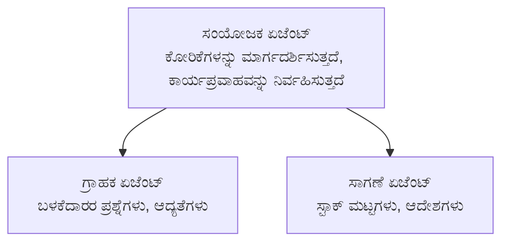

# ಅಧ್ಯಾಯ 5: ಬಹು-ಏಜೆಂಟ್ ಏಐ ಪರಿಹಾರಗಳು

**📚 Course**: [AZD ಆರಂಭಿಕರಿಗಾಗಿ](../../README.md) | **⏱️ Duration**: 2-3 ಗಂಟೆಗಳು | **⭐ Complexity**: ಉನ್ನತ

---

## ಅವಲೋಕನ

ಈ ಅಧ್ಯಾಯವು ಅತ್ಯಧಿಕ ಬಹು-ಏಜೆಂಟ್ ವಾಸ್ತುಶಿಲ್ಪ ಮಾದರಿಗಳನ್ನು, ಏಜೆಂಟ್ ಸಂಯೋಜನೆಯನ್ನು ಮತ್ತು ಸ сложಿತ ಸಂದರ್ಭಗಳಿಗೆ ಉತ್ಪಾದನೆಗೆ ಸಿದ್ಧ ಏಐ ನಿಯೋಜನೆಗಳನ್ನು ಒಳಗೊಂಡಿದೆ.

## ಕಲಿಕಾ ಉದ್ದೇಶಗಳು

ಈ ಅಧ್ಯಾಯವನ್ನು ಪೂರ್ಣಗೊಳಿಸುವ ಮೂಲಕ, ನೀವು:
- ಬಹು-ಏಜೆಂಟ್ ವಾಸ್ತುಶಿಲ್ಪ ಮಾದರಿಗಳನ್ನು ಅರ್ಥಮಾಡಿಕೊಳ್ಳುವುದು
- ಸಮನ್ವಿತ AI ಏಜೆಂಟ್ ವ್ಯವಸ್ಥೆಗಳನ್ನು ನಿಯೋಜಿಸುವುದು
- ಏಜೆಂಟ್-ನಿಂದ-ಏಜೆಂಟ್ ಸಂವಹನವನ್ನು ಅನುಷ್ಠಾನಗೊಳಿಸುವುದು
- ಉತ್ಪಾದನೆಗೆ ಸಿದ್ಧವಾದ ಬಹು-ಏಜೆಂಟ್ ಪರಿಹಾರಗಳನ್ನು ನಿರ್ಮಿಸುವುದು

---

## 📚 ಪಾಠಗಳು

| # | ಪಾಠ | ವಿವರಣೆ | ಸಮಯ |
|---|--------|-------------|------|
| 1 | [ರಿಟೇಲ್ ಬಹು-ಏಜೆಂಟ್ ಪರಿಹಾರ](../../examples/retail-scenario.md) | ಸಂಪೂರ್ಣ ಅನುಷ್ಠಾನದ ಸ್ಟೆಪ್-ಬೈ-ಸ್ಟೆಪ್ ಮಾರ್ಗದರ್ಶಿ | 90 ನಿಮಿಷ |
| 2 | [ಸಮನ್ವಯ ಮಾದರಿಗಳು](../chapter-06-pre-deployment/coordination-patterns.md) | ಏಜೆಂಟ್ ಸಂಯೋಜನಾ ತಂತ್ರಗಳು | 30 ನಿಮಿಷ |
| 3 | [ARM ಟೆಂಪ್ಲೇಟ್ ನಿಯೋಜನೆ](../../examples/retail-multiagent-arm-template/README.md) | ಒಂದು ಕ್ಲಿಕ್ ನಿಯೋಜನೆ | 30 ನಿಮಿಷ |

---

## 🚀 ಶೀಘ್ರ ಪ್ರಾರಂಭ

```bash
# ಆಯ್ಕೆ 1: ಟೆಂಪ್ಲೇಟಿನಿಂದ ನಿಯೋಜಿಸಿ
azd init --template agent-openai-python-prompty
azd up

# ಆಯ್ಕೆ 2: ಏಜೆಂಟ್ ವಿವರಣಾ ಕಡತದಿಂದ ನಿಯೋಜಿಸಿ (azure.ai.agents ವಿಸ್ತರಣೆ ಅಗತ್ಯವಿದೆ)
azd extension install azure.ai.agents
azd ai agent init -m agent-manifest.yaml
azd up
```

> **ಯಾವ ವಿಧಾನ?** ಕಾರ್ಯನಿರ್ವಹಿಸುವ ಮಾದರಿಯಿಂದ ಪ್ರಾರಂಭಿಸಲು `azd init --template` ಬಳಸಿ. ನಿಮ್ಮದೇ ಏಜೆಂಟ್ ಮ್ಯಾನಿಫೆಸ್ಟ್ ಇದ್ದಾಗ `azd ai agent init` ಬಳಸಿ. ಸಂಪೂರ್ಣ ವಿವರಗಳಿಗೆ [AZD AI CLI ಉಲ್ಲೇಖ](../chapter-08-production/production-ai-practices.md#azd-ai-cli-commands-and-extensions) ನೋಡಿ.

---

## 🤖 ಬಹು-ಏಜೆಂಟ್ ವಾಸ್ತುಶಿಲ್ಪ


---

## 🎯 ಪ್ರಮುಖ ಪರಿಹಾರ: ರಿಟೇಲ್ ಬಹು-ಏಜೆಂಟ್

The [Retail Multi-Agent Solution](../../examples/retail-scenario.md) ಪ್ರದರ್ಶಿಸುತ್ತದೆ:

- **ಗ್ರಾಹಕ ಏಜೆಂಟ್**: ಬಳಕೆದಾರರ ಸಂವಹನ ಮತ್ತು ಪ್ರಾಧಾನ್ಯತೆಗಳನ್ನು ನಿಭಾಯಿಸುತ್ತದೆ
- **ಇನ್ವೆಂಟರಿ ಏಜೆಂಟ್**: ಭಂಡಾರದ ಮತ್ತು ಆರ್ಡರ್ ಪ್ರಕ್ರಿಯೆಯನ್ನು ನಿರ್ವಹಿಸುತ್ತದೆ
- **ಸಂಯೋಜಕ**: ಏಜೆಂಟ್‌ಗಳ ನಡುವೆ ಸಮನ್ವಯವನ್ನು ಹಮ್ಮಿಕೊಳ್ಳುತ್ತದೆ
- **ಹಂಚಿಕೊಂಡ ಮೆಮೊರಿ**: ಏಜೆಂಟ್‌ಗಳ ನಡುವಿನ ಸಂದರ್ಭ ನಿರ್ವಹಣೆ

### ಬಳಸಿದ ಸೇವೆಗಳು

| ಸೇವೆ | ಉದ್ದೇಶ |
|---------|---------|
| Microsoft Foundry Models | ಭಾಷಾ ಅರ್ಥಗಮನ |
| Azure AI Search | ಉತ್ಪನ್ನ ಕ್ಯಾಟಲಾಗ್ |
| Cosmos DB | ಏಜೆಂಟ್ ಸ್ಥಿತಿ ಮತ್ತು ಮೆಮರಿ |
| Container Apps | ಏಜೆಂಟ್ ಹೋಸ್ಟಿಂಗ್ |
| Application Insights | ಮೇಲ್ವಿಚಾರಣೆ |

---

## 🔗 ನಾವಿಗೇಶನ್

| ದಿಕ್ಕು | ಅಧ್ಯಾಯ |
|-----------|---------|
| **Previous** | [ಅಧ್ಯಾಯ 4: Infrastructure](../chapter-04-infrastructure/README.md) |
| **Next** | [ಅಧ್ಯಾಯ 6: ಪೂರ್ವ-ನಿಯೋಜನೆ](../chapter-06-pre-deployment/README.md) |

---

## 📖 ಸಂಬಂಧಿತ ಸಂಪನ್ಮೂಲಗಳು

- [ಏಐ ಏಜೆಂಟ್ ಮಾರ್ಗದರ್ಶಿ](../chapter-02-ai-development/agents.md)
- [ಉತ್ಪಾದನಾ ಏಐ ಅಭ್ಯಾಸಗಳು](../chapter-08-production/production-ai-practices.md)
- [ಏಐ ಸಮಸ್ಯೆ ಪರಿಹಾರ](../chapter-07-troubleshooting/ai-troubleshooting.md)

---

<!-- CO-OP TRANSLATOR DISCLAIMER START -->
**ಅಸ್ವೀಕರಣ**:
ಈ ದಸ್ತಾವೇಜನ್ನು AI ಅನುವಾದ ಸೇವೆ [Co-op Translator](https://github.com/Azure/co-op-translator) ಬಳಸಿ ಅನುವದಿಸಲಾಗಿದೆ. ನಾವು ನಿಖರತೆಯತ್ತ ಪ್ರಯತ್ನಿಸಿದರೂ ಸಹ, ಸ್ವಯಂಚಾಲಿತ ಅನುವಾದಗಳಲ್ಲಿ ದೋಷಗಳು ಅಥವಾ ಅಶುದ್ಧತೆಗಳು ಇರಬಹುದು ಎಂಬುದನ್ನು ದಯವಿಟ್ಟು ಗಮನದಲ್ಲಿಡಿ. ಮೂಲ ಭಾಷೆಯಲ್ಲಿರುವ ಮೂಲ ದಸ್ತಾವೇಜನ್ನು ಪ್ರಾಧಿಕಾರಿಕ ಮೂಲವೆಂದು ಪರಿಗಣಿಸಬೇಕು. ಗಂಭೀರ ಮಾಹಿತಿಗಾಗಿ ವೃತ್ತಿಪರ ಮಾನವ ಅನುವಾದವನ್ನು ಶಿಫಾರಸು ಮಾಡಲಾಗುತ್ತದೆ. ಈ ಅನುವಾದದ ಬಳಕೆಯಿಂದ ಉಂಟಾಗುವ ಯಾವುದೇ ತಪ್ಪು ಅರ್ಥಗೊಳ್ಳುವಿಕೆಗಳು ಅಥವಾ ದುರ್ಭಾಷ್ಯಗಳಿಗಾಗಿ ನಾವು ಹೊಣೆಗಾರರಾಗುವುದಿಲ್ಲ.
<!-- CO-OP TRANSLATOR DISCLAIMER END -->