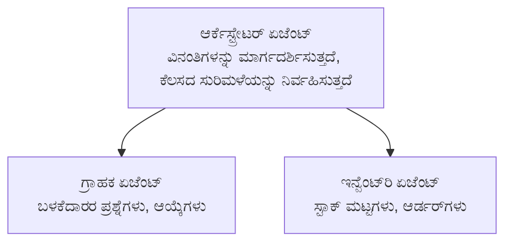

# ಅಧ್ಯಾಯ 5: ಬಹು-ಏಜೆಂಟ್ AI ಪರಿಹಾರಗಳು

**📚 ಕೋರ್ಸು**: [ಆಜಡಿಭಾಗಗಳು ಪ್ರಾಥಮಿಕರಿಗೆ](../../README.md) | **⏱️ ಸಮಯ**: 2-3 ಗಂಟೆಗಳು | **⭐ ಸಂಕೀರ್ಣತೆ**: ಮುಂದುವರೆದು

---

## ಅವಲೋಕನ

ಈ ಅಧ್ಯಾಯವು ಮುಂದುವರೆದ ಬಹು-ಏಜೆಂಟ್ ವಾಸ್ತುಶಿಲ್ಪ ಮಾದರಿಗಳು, ಏಜೆಂಟ್ ಸಂಯೋಜನೆ ಮತ್ತು ಕಠಿಣ ಸನ್ನಿವೇಶಗಳಿಗೆ ಉತ್ಪಾದನಾ-ಸಿದ್ಧ AI ನಿಯೋಜನೆಗಳನ್ನು ಒಳಗೊಂಡಿದೆ.

> ಜುಲೈ 2026 ರಲ್ಲಿ `azd 1.27.1` ವಿರುದ್ಧ ಮಾನ್ಯತೆ ಪಡೆದಿದೆ.

## ಅಧ್ಯಯನ ಉದ್ದೇಶಗಳು

ಈ ಅಧ್ಯಾಯವನ್ನು ಪೂರ್ಣಗೊಳಿಸುವ ಮೂಲಕ ನೀವು:
- ಬಹು-ಏಜೆಂಟ್ ವಾಸ್ತುಶಿಲ್ಪ ಮಾದರಿಗಳನ್ನು ಅರ್ಥಮಾಡಿಕೊಳ್ಳಬೇಕು
- ಸಂಯೋಜಿತ AI ಏಜೆಂಟ್ ಸಿಸ್ಟಮ್ಗಳನ್ನು ನಿಯೋಜಿಸಬೇಕು
- ಏಜೆಂಟ್-ಇಂದ-ಏಜೆಂಟ್ ಸಂವಹನವನ್ನು ಅನುಷ್ಠಾನಗೊಳಿಸಬೇಕು
- ಉತ್ಪಾದನಾ-ಸಿದ್ಧ ಬಹು-ಏಜೆಂಟ್ ಪರಿಹಾರಗಳನ್ನು ನಿರ್ಮಿಸಬೇಕು

---

## 📚 ಪಾಠಗಳು

| # | ಪಾಠ | ವಿವರಣೆ | ಸಮಯ |
|---|--------|-------------|------|
| 1 | [ಬಹು-ಏಜೆಂಟ್ ಮೂಲತತ್ವಗಳು](multi-agent-basics.md) | ಪ್ರಾಯೋಗಿಕ: `azd up` ಬಳಸಿ ಕಾರ್ಯನಿರ್ವಹಿಸುವ ಬಹು-ಏಜೆಂಟ್ ಅಪ್ಲಿಕೇಶನ್ ನಿಯೋಜಿಸಿ | 45 ನಿಮಿಷಗಳು |
| 2 | [ಸಂಯೋಜನೆ ಮಾದರಿಗಳನ್ನು](../chapter-06-pre-deployment/coordination-patterns.md) | ಏಜೆಂಟ್ ಸಂಯೋಜನೆ ತಂತ್ರಗಳನ್ನು ಪರಿಚಯಿಸುತ್ತದೆ (ಅಧ್ಯಾಯ 6 ರಲ್ಲಿ ನಿಂತುಕೊಂಡಿದೆ) | 30 ನಿಮಿಷಗಳು |
| 3 | [ARM ಟೆಂಪ್ಲೇಟ್ ನಿಯೋಜನೆ](../../examples/retail-multiagent-arm-template/README.md) | ಒರಟು ಕ್ಲಿಕ್ ನಿಯೋಜನೆ ಉದಾಹರಣೆ | 30 ನಿಮಿಷಗಳು |

> **ಪಾಠ 1 ರಿಂದ ಪ್ರಾರಂಭಿಸಿ.** ಇದು ಈ ಅಧ್ಯಾಯದಲ್ಲಿನ ಒಂದೇ ಸಂಪೂರ್ಣ ಪ್ರಾಯೋಗಿಕ, ನಿಯೋಜಿಸುವ ಪಾಠವಾಗಿದೆ. ಪಾಠ 2 ಅಧ್ಯಾಯ 6 ರಲ್ಲಿ ಇದೆ (ಅದು ಪೂರ್ವ-ನಿಯೋಜನೆ ಯೋಜನೆಯೊಂದಿಗೆ ಹಂಚಿಕೊಳ್ಳಲಾಗಿದೆ), ಮತ್ತು [ರೀಟೈಲ್ ಬಹು-ಏಜೆಂಟ್ ಪರಿಹಾರ](../../examples/retail-scenario.md) ವಾಸ್ತುಶಿಲ್ಪ ಬ್ಲೂಪ್ರಿಂಟ್ — ನಿರೂಪಣಾ संदರ್ಭ, ಇಡೀ ಆದೇಶ ಟೆಂಪ್ಲೇಟು ಅಲ್ಲ.

---

## 🚀 ವೇಗದ ಪ್ರಾರಂಭ

```bash
# ಆಯ್ಕೆ 1: ಟೆಂಪ್ಲೇಟಿನಿಂದ ನಿಯೋಜಿಸಿ
azd init --template agent-openai-python-prompty
azd up

# ಆಯ್ಕೆ 2: ಏಜೆಂಟ್ ಮ್ಯಾನಿಫೆಸ್ಟ್‌ನಿಂದ ನಿಯೋಜಿಸಿ (azure.ai.agents ವಿಸ್ತರಣೆ ಅಗತ್ಯವಿದೆ)
azd extension install azure.ai.agents
azd ai agent init -m agent-manifest.yaml
azd up
```

> **ಯಾವ ವಿಧಾನ?** ಕಾರ್ಯನಿರ್ವಹಿಸುವ ಮಾದರಿಯಿಂದ ಪ್ರಾರಂಭಿಸಲು `azd init --template` ಅನ್ನು ಬಳಸಿ. ನಿಮಗೆ ನಿಮ್ಮ ಸ್ವಂತ ಏಜೆಂಟ್ ಮ್ಯಾನಿಫೆಸ್ಟ್ ಇದ್ದಾಗ `azd ai agent init` ನ್ನು ಬಳಸಿ. ಸಂಪೂರ್ಣ ವಿವರಗಳಿಗಾಗಿ [AZD AI CLI ಉಲ್ಲೇಖ](../chapter-08-production/production-ai-practices.md#azd-ai-cli-commands-and-extensions) ನೋಡಿ.

---

## 🤖 ಬಹು-ಏಜೆಂಟ್ ವಾಸ್ತುಶಿಲ್ಪ



---

## 🎯 ಆಯ್ದ ಪರಿಹಾರ: ರೀಟೈಲ್ ಬಹು-ಏಜೆಂಟ್

[ರೀಟೈಲ್ ಬಹು-ಏಜೆಂಟ್ ಪರಿಹಾರ](../../examples/retail-scenario.md) ಇದನ್ನು ತೋರಿಸುತ್ತದೆ:

- **ಗ್ರಾಹಕ ಏಜೆಂಟ್**: ಬಳಕೆದಾರ ಸಂವಾದ ಮತ್ತು ಆಸಕ್ತಿಗಳನ್ನು ನಿರ್ವಹಿಸುತ್ತದೆ
- **ಸಾಗಣೆ ಘಟಕ ಏಜೆಂಟ್**: ಸ್ಟಾಕ್ ಮತ್ತು ಆರ್ಡರ್ ಪ್ರಕ್ರಿಯೆಯನ್ನು ನಿರ್ವಹಿಸುತ್ತದೆ
- **ಸಂಯೋಜಕ**: ಏಜೆಂಟ್‌ಗಳ ನಡುವೆ ಸಂಯೋಜನೆ ನಡೆಸುತ್ತದೆ
- **ಹಂಚಿಕೆಯಾಗಿರುವ ಮೆಮೊರಿ**: ಏಜೆಂಟ್‌ಗಳ ಪಾರದರ್ಶನ ವ್ಯವಸ್ಥಾಪನೆ

### ಬಳಸುವ ಸೇವೆಗಳು

| ಸೇವೆ | ಉದ್ದೇಶ |
|---------|---------|
| Microsoft Foundry ಮಾದರಿಗಳು | ಭಾಷೆ ಅರ್ಥಮಾಡಿಕೊಳ್ಳುವುದು |
| Azure AI ಹುಡುಕಾಟ | ಉತ್ಪನ್ನ ಪಟ್ಟಿ |
| Cosmos DB | ಏಜೆಂಟ್ ಸ್ಥಿತಿ ಮತ್ತು ಮೆಮೊರಿ |
| ಕಂಟೈನರ್ ಅಪ್ಲಿಕೇಶನ್ಗಳು | ಏಜೆಂಟ್ ಆತಿಥ್ಯ |
| ಅಪ್ಲಿಕೇಶನ್ ಇನ್ಸೈಟ್ಸ್ | ಮೇಲ್ವಿಚಾರಣೆ |

---

## 🔗 ನಾವಿಗೇಶನ್

| ದಿಕ್ಕು | ಅಧ್ಯಾಯ |
|-----------|---------|
| **ಹಿಂದಿನ** | [ಅಧ್ಯಾಯ 4: ಮೂಲಸೌಕರ್ಯ](../chapter-04-infrastructure/README.md) |
| **ಮುಂದಿನ** | [ಅಧ್ಯಾಯ 6: ಪೂರ್ವ-ನಿಯೋಜನೆ](../chapter-06-pre-deployment/README.md) |

---

## 📖 ಸಂಬಂಧಿತ ಸಂಪನ್ಮೂಲಗಳು

- [AI ಏಜೆಂಟ್‌ಗಳ ಮಾರ್ಗದರ್ಶಿ](../chapter-02-ai-development/agents.md)
- [ಉತ್ಪಾದನಾ AI ಅಭ್ಯಾಸಗಳು](../chapter-08-production/production-ai-practices.md)
- [AI ಸಮಸ್ಯೆ ಪರಿಹಾರ](../chapter-07-troubleshooting/ai-troubleshooting.md)

---

<!-- CO-OP TRANSLATOR DISCLAIMER START -->
**ಅಸ್ವೀಕಾರ**:
ಈ ದಸ್ತಾವೇಜು AI ಅನುವಾದ ಸೇವೆ [Co-op Translator](https://github.com/Azure/co-op-translator) ಬಳಸಿ ಅನುವಾದಿಸಲಾಗಿದೆ. ನಾವು ನಿಖರತೆಯನ್ನು ಸಾಧಿಸಲು ಪ್ರಯತ್ನಿಸುತ್ತಿದ್ದರೂ, ದಯವಿಟ್ಟು ಗಮನಿಸಿ, ಸ್ವಯಂಚಾಲಿತ ಅನುವಾದಗಳಲ್ಲಿ ದೋಷಗಳು ಅಥವಾ ಅಸಡ್ಡೆಗಳು ಇರಬಹುದು. ಮೂಲ ಭಾಷೆಯಲ್ಲಿರುವ ಮೂಲ ದಸ್ತಾವೇಜು ಪ್ರಾಮಾಣಿಕ ಮೂಲವೆಂದು ಪರಿಗಣಿಸಬೇಕು. ಪ್ರಮುಖ ಮಾಹಿತಿಗಾಗಿ, ವೃತ್ತಿಪರ ಮಾನವ ಅನುವಾದವನ್ನು ಶಿಫಾರಸು ಮಾಡಲಾಗುತ್ತದೆ. ಈ ಅನುವಾದವನ್ನು ಬಳಸುವ ಮೂಲಕ ಉಂಟಾಗುವ ಯಾವುದೇ ತಪ್ಪು ಅರ್ಥಗಳ ಅಥವಾ ತಪ್ಪು ವ್ಯಾಖ್ಯಾನಗಳ ಬಗ್ಗೆ ನಾವು ಹೊಣೆಗಾರರಲ್ಲ.
<!-- CO-OP TRANSLATOR DISCLAIMER END -->