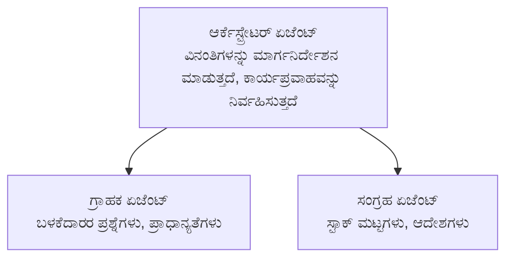

# ಅಧ್ಯಾಯ 5: ಬಹು-ಏಜೆಂಟ್ ಏಐ ಪರಿಹಾರಗಳು

**📚 Course**: [AZD ಪ್ರಾರಂಭಿಕರಿಗಾಗಿ](../../README.md) | **⏱️ ಅವಧಿ**: 2-3 ಗಂಟೆಗಳು | **⭐ ಜಟಿಲತೆ**: ಮುಂದುವರಿದ

---

## ಅವಲೋಕನ

ಈ ಅಧ್ಯಾಯವು ಮುಂದುವರಿದ ಬಹು-ಏಜೆಂಟ್ ವಾಸ್ತುಶಿಲ್ಪ ಮಾದರಿಗಳು, ಏಜೆಂಟ್ ಸಂಯೋಜನೆ ಮತ್ತು ಸಂಕೀರ್ಣ ಸಂದರ್ಭಗಳಿಗೆ ಉತ್ಪಾದನೆಗೆ ಸಿದ್ಧವಾದ AI ನಿಯೋಜನೆಗಳನ್ನು ಒಳಗೊಂಡಿದೆ.

> ಜೂನ್ 2026 ರಲ್ಲಿ `azd 1.25.6` ಗೆ ಪರಿಶೀಲಿಸಲಾಗಿದೆ.

## ಕಲಿಕೆಯ ಉದ್ದೇಶಗಳು

ಈ ಅಧ್ಯಾಯವನ್ನು ಪೂರ್ಣಗೊಳಿಸಿದರೆ, ನೀವು:
- ಬಹು-ಏಜೆಂಟ್ ವಾಸ್ತುಶಿಲ್ಪ ಮಾದರಿಗಳನ್ನು ಅರ್ಥಮಾಡಿಕೊಳ್ಳಿ
- ಸಂಯೋಜಿತ ಏಜೆಂಟ್ ವ್ಯವಸ್ಥೆಗಳನ್ನು ನಿಯೋಜಿಸಿ
- ಏಜೆಂಟ್-ಏಜೆಂಟ್ ಸಂವಹನವನ್ನು ಅನುಷ್ಠಾನಗೊಳಿಸಿ
- ಉತ್ಪಾದನೆ-ಸಿದ್ಧ ಬಹು-ಏಜೆಂಟ್ ಪರಿಹಾರಗಳನ್ನು ನಿರ್ಮಿಸಿ

---

## 📚 ಪಾಠಗಳು

| # | ಪಾಠ | ವಿವರ | ಸಮಯ |
|---|--------|-------------|------|
| 1 | [Multi-Agent Basics](multi-agent-basics.md) | ಹ್ಯಾಂಡ್ಸ್-ಆನ್: `azd up` ಬಳಸಿ ಕಾರ್ಯನಿರ್ವಹಿಸುವ ಬಹು-ಏಜೆಂಟ್ ಅಪ್ಲಿಕೇಶನ್ ಅನ್ನು ನಿಯೋಜಿಸಿ | 45 ನಿಮಿಷ |
| 2 | [ಸಂಯೋಜನೆ ಮಾದರಿಗಳು](../chapter-06-pre-deployment/coordination-patterns.md) | ಏಜೆಂಟ್ ಸಂಘಟನೆ ತಂತ್ರಗಳು (ಅಧ್ಯಾಯ 6ರಲ್ಲಿ ಮುಂದುವರೆಯುತ್ತದೆ) | 30 ನಿಮಿಷ |
| 3 | [ARM ಟೆಂಪ್ಲೆಟ್ ನಿಯೋಜನೆ](../../examples/retail-multiagent-arm-template/README.md) | ಒಂದು ಕ್ಲಿಕ್ ನಿಯೋಜನೆ ಉದಾಹರಣೆ | 30 ನಿಮಿಷ |

> **ಪಾಠ 1 ರಿಂದ ಪ್ರಾರಂಭಿಸಿ.** ಈ ಅಧ್ಯಾಯದಲ್ಲಿನ ಏಕೈಕ ಸಂಪೂರ್ಣ ಹ್ಯಾಂಡ್ಸ್-ಆನ್ ಮತ್ತು ನಿಯೋಜಿಸಲು ಸಿದ್ಧವಾದ ಪಾಠ ಇದೇ. ಪಾಠ 2 ಅಧ್ಯಾಯ 6ರಲ್ಲಿ ಇದೆ (ಇದು ಪೂರ್ವ-ನಿಯೋಜನೆ ಯೋಜನೆಯೊಂದಿಗೆ ಹಂಚಿಕೊಳ್ಳಲಾಗಿದೆ), ಮತ್ತು [ರಿಟೇಲ್ ಬಹು-ಏಜೆಂಟ್ ಪರಿಹಾರ](../../examples/retail-scenario.md) ಒಂದು ವಾಸ್ತುಶಿಲ್ಪ ಬ್ಲೂಪ್ರಿಂಟ್ — ವಿನ್ಯಾಸ ಉಲ್ಲೇಖ, ಒಂದು-ಆಜ್ಞೆ ಟೆಂಪ್ಲೇಟು ಅಲ್ಲ.

---

## 🚀 ತ್ವರಿತ ಪ್ರಾರಂಭ

```bash
# ಆಯ್ಕೆ 1: ಟೆಂಪ್ಲೇಟ್‌ನಿಂದ ನಿಯೋಜಿಸಿ
azd init --template agent-openai-python-prompty
azd up

# ಆಯ್ಕೆ 2: ಏಜೆಂಟ್ ಮ್ಯಾನಿಫೆಸ್ಟ್‌ನಿಂದ ನಿಯೋಜಿಸಿ (azure.ai.agents ವಿಸ್ತರಣೆ ಅಗತ್ಯವಿದೆ)
azd extension install azure.ai.agents
azd ai agent init -m agent-manifest.yaml
azd up
```

> **ಯಾವ ಕ್ರಮ?** ಕಾರ್ಯನಿರ್ವಹಿಸುತ್ತಿರುವ ಮಾದರಿಯಿಂದ ಪ್ರಾರಂಭಿಸಲು `azd init --template` ಬಳಸಿರಿ. ನಿಮ್ಮದೇ ಏಜೆಂಟ್ ಮ್ಯಾನಿಫೆಸ್ಟ್ನಿದ್ದಾಗ `azd ai agent init` ಅನ್ನು ಬಳಸಿ. ಸಂಪೂರ್ಣ ವಿವರಗಳಿಗೆ [AZD AI CLI ಉಲ್ಲೇಖ](../chapter-08-production/production-ai-practices.md#azd-ai-cli-commands-and-extensions) ನೋಡಿ.

---

## 🤖 ಬಹು-ಏಜೆಂಟ್ ವಾಸ್ತುಶಿಲ್ಪ



---

## 🎯 ಪ್ರಮುಖ ಪರಿಹಾರ: ರಿಟೇಲ್ ಬಹು-ಏಜೆಂಟ್

ಈ [ರಿಟೇಲ್ ಬಹು-ಏಜೆಂಟ್ ಪರಿಹಾರ](../../examples/retail-scenario.md) ತೋರಿಸುತ್ತದೆ:

- **ಗ್ರಾಹಕ ಏಜೆಂಟ್**: ಬಳಕೆದಾರರ ಸಂವಹನ ಮತ್ತು ಆದ್ಯತೆಗಳನ್ನು ನಿರ್ವಹಿಸುತ್ತದೆ
- **ಸಾಗಣೆ ಏಜೆಂಟ್**: ಸ್ಟಾಕ್ ಮತ್ತು ಆರ್ಡರ್ ಪ್ರಕ್ರಿಯೆಯನ್ನು ನಿರ್ವಹಿಸುತ್ತದೆ
- **ಸಂಯೋಜಕ**: ಏಜೆಂಟ್‌ಗಳ ನಡುವೆ ಸಂಯೋಜನೆಯನ್ನು ನಿರ್ವಹಿಸುತ್ತದೆ
- **ಹಂಚಿಕೊಂಡ ಮೆಮೊರಿ**: ಏಜೆಂಟ್‌ಗಳ ನಡುವೆ ಸಾಂದರ್ಭಿಕ ನಿರ್ವಹಣೆ

### ಬಳಸಿರುವ ಸೇವೆಗಳು

| ಸೇವೆ | ಉದ್ದೇಶ |
|---------|---------|
| Microsoft Foundry Models | ಭಾಷಾ ಅರ್ಥಗೊಳ್ಳುವಿಕೆ |
| Azure AI Search | ಉತ್ಪನ್ನ ಕ್ಯಾಟಲಾಗ್ |
| Cosmos DB | ಏಜೆಂಟ್ ಸ್ಥಿತಿ ಮತ್ತು ಮೆಮೊರಿ |
| Container Apps | ಏಜೆಂಟ್ ಹೋಸ್ಟಿಂಗ್ |
| Application Insights | ನಿರೀಕ್ಷಣೆ |

---

## 🔗 ನ್ಯಾವಿಗೇಶನ್

| ದಿಕ್ಕು | ಅಧ್ಯಾಯ |
|-----------|---------|
| **ಹಿಂದಿನ** | [ಅಧ್ಯಾಯ 4: ಮೂಲಸೌಕರ್ಯ](../chapter-04-infrastructure/README.md) |
| **ಮುಂದಿನ** | [ಅಧ್ಯಾಯ 6: ಪೂರ್ವ-ನಿಯೋಜನೆ](../chapter-06-pre-deployment/README.md) |

---

## 📖 ಸಂಬಂಧಿತ ಸಂಪನ್ಮೂಲಗಳು

- [AI ಏಜೆಂಟ್‌ಗಳ ಮಾರ್ಗದರ್ಶಿ](../chapter-02-ai-development/agents.md)
- [ಉತ್ಪಾದನಾ AI ಅಭ್ಯಾಸಗಳು](../chapter-08-production/production-ai-practices.md)
- [AI ತೊಂದರೆ ನಿವಾರಣೆ](../chapter-07-troubleshooting/ai-troubleshooting.md)

---

<!-- CO-OP TRANSLATOR DISCLAIMER START -->
**ಅಸ್ವೀಕಾರ**:
ಈ ದಸ್ತಾವೇಜು AI ಅನುವಾದ ಸೇವೆ [Co-op Translator](https://github.com/Azure/co-op-translator) ಬಳಸಿ ಅನುವಾದಿಸಲಾಗಿದೆ. ನಾವು ನಿಖರತೆಯನ್ನು ಸಾಧಿಸಲು ಪ್ರಯತ್ನಿಸುತ್ತಿದ್ದರೂ, ದಯವಿಟ್ಟು ಗಮನಿಸಿ, ಸ್ವಯಂಚಾಲಿತ ಅನುವಾದಗಳಲ್ಲಿ ದೋಷಗಳು ಅಥವಾ ಅಸಡ್ಡೆಗಳು ಇರಬಹುದು. ಮೂಲ ಭಾಷೆಯಲ್ಲಿರುವ ಮೂಲ ದಸ್ತಾವೇಜು ಪ್ರಾಮಾಣಿಕ ಮೂಲವೆಂದು ಪರಿಗಣಿಸಬೇಕು. ಪ್ರಮುಖ ಮಾಹಿತಿಗಾಗಿ, ವೃತ್ತಿಪರ ಮಾನವ ಅನುವಾದವನ್ನು ಶಿಫಾರಸು ಮಾಡಲಾಗುತ್ತದೆ. ಈ ಅನುವಾದವನ್ನು ಬಳಸುವ ಮೂಲಕ ಉಂಟಾಗುವ ಯಾವುದೇ ತಪ್ಪು ಅರ್ಥಗಳ ಅಥವಾ ತಪ್ಪು ವ್ಯಾಖ್ಯಾನಗಳ ಬಗ್ಗೆ ನಾವು ಹೊಣೆಗಾರರಲ್ಲ.
<!-- CO-OP TRANSLATOR DISCLAIMER END -->