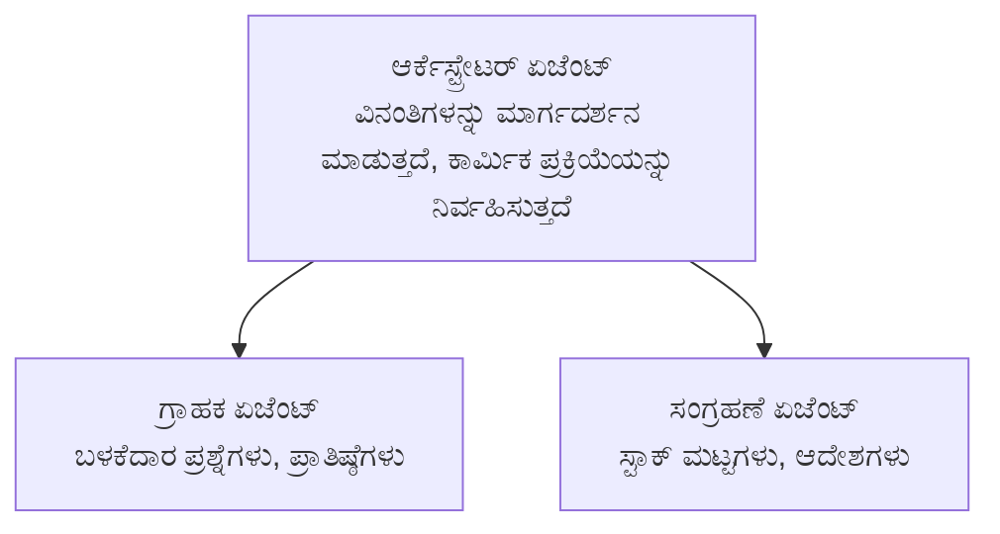

# ಅಧ್ಯಾಯ 5: ಬಹು-ಏಜೆಂಟ್ ಎಐ ಪರಿಹಾರಗಳು

**📚 ಕೋರ್ಸ್**: [ಆಜೆಡಿ ಆರಂಭಿಕರಿಗಾಗಿ](../../README.md) | **⏱️ ಅವಧಿ**: 2-3 ಗಂಟೆಗಳು | **⭐ ಸಂಕೀರ್ಣತೆ**: ಉನ್ನತ

---

## ಅವಲೋಕನ

ಈ ಅಧ್ಯಾಯದಲ್ಲಿ ಸುಧಾರಿತ ಬಹು-ಏಜೆಂಟ್ ನಿಗಮಿತ ಆರ್ಕಿಟೆಕ್ಚರ್ ಮಾದರಿಗಳು, ಏಜೆಂಟ್ ಸಂಯೋಜನೆ, ಮತ್ತು ಸಂಕೀರ್ಣ ಪರಿಸ್ಥಿತಿಗಳಿಗಾಗಿ ಉತ್ಪಾದನೆಗೆ ತಯಾರಾಗಿರುವ ಎಐ ನಿಯೋಜನೆಗಳನ್ನು ಒಳಗೊಂಡಿದೆ.

> ಮಾರ್ಚ್ 2026 ರಲ್ಲಿ `azd 1.23.12` ವಿರುದ್ಧ ಪರಿಶೀಲಿಸಲಾಗಿದೆ.

## ಅಧ್ಯಯನ ಗುರಿಗಳು

ಈ ಅಧ್ಯಾಯವನ್ನು ಪೂರ್ಣಗೊಳಿಸುವ ಮೂಲಕ, ನೀವು:
- ಬಹು-ಏಜೆಂಟ್ ಆರ್ಕಿಟೆಕ್ಚರ್ ಮಾದರಿಗಳನ್ನು ಅರ್ಥಮಾಡಿಕೊಳ್ಳುತ್ತೀರಿ
- ಸಂಯೋಜಿತ ಎಐ ಏಜೆಂಟ್ ವ್ಯವಸ್ಥೆಗಳನ್ನು ನಿಯೋಜಿಸುತ್ತೀರಿ
- ಏಜೆಂಟ್-ನಿಂದ-ಏಜೆಂಟ್ ಸಂವಹನವನ್ನು ಜಾರಿಗೊಳಿಸುತ್ತೀರಿ
- ಉತ್ಪಾದನೆಗೆ ತಯಾರಾಗಿರುವ ಬಹು-ಏಜೆಂಟ್ ಪರಿಹಾರಗಳನ್ನು ನಿರ್ಮಿಸುತ್ತೀರಿ

---

## 📚 ಪಾಠಗಳು

| # | ಪಾಠ | ವಿವರಣೆ | ಸಮಯ |
|---|--------|-------------|------|
| 1 | [खुदरा ಬಹು-ಏಜೆಂಟ್ ಪರಿಹಾರ](../../examples/retail-scenario.md) | ಸಂಪೂರ್ಣ ಜಾರಿ ಪ್ರಕ್ರಿಯೆ | 90 ನಿಮಿಷ |
| 2 | [ಸಂಯೋಜನೆ ಮಾದರಿಗಳು](../chapter-06-pre-deployment/coordination-patterns.md) | ಏಜೆಂಟ್ ಸಂಯೋಜನೆ ರಣನೀತಿಗಳು | 30 ನಿಮಿಷ |
| 3 | [ARM ಟೆಂಪ್ಲೇಟಿನ ನಿಯೋಜನೆ](../../examples/retail-multiagent-arm-template/README.md) | ಒಮ್ಮೆ ಕ್ಲಿಕ್ ಬಟನ್ ನಿಯೋಜನೆ | 30 ನಿಮಿಷ |

---

## 🚀 ವೇಗದ ಪ್ರಾರಂಭ

```bash
# ಆಯ್ಕೆ 1: ಟೆಂಪ್ಲೇಟಿನಿಂದ ನಿಯೋಜಿಸಿ
azd init --template agent-openai-python-prompty
azd up

# ಆಯ್ಕೆ 2: ಏಜೆಂಟ್ ಮ್ಯಾನಿಫೆಸ್ಟ್‌ನಿಂದ ನಿಯೋಜಿಸಿ (azure.ai.agents ವಿಸ್ತರಣೆ ಬೇಕಾಗುತ್ತದೆ)
azd extension install azure.ai.agents
azd ai agent init -m agent-manifest.yaml
azd up
```

> **ಯಾವ ವಿಧಾನ?** ಕಾರ್ಯನಿರ್ವಹಣೆಯ ಉದಾಹರಣೆಯಿಂದ ಪ್ರಾರಂಭಿಸಲು `azd init --template` ಬಳಸಿರಿ. ನಿಮ್ಮ ಸ್ವಂತ ಏಜೆಂಟ್ ಮ್ಯಾನಿಫೆಸ್ಟ್ ಇದ್ದಾಗ `azd ai agent init` ಬಳಸಿ. ಸಂಪೂರ್ಣ ವಿವರಗಳಿಗೆ [AZD AI CLI ಸೂಚನೆಗಳು](../chapter-08-production/production-ai-practices.md#azd-ai-cli-commands-and-extensions) ನೋಡಿ.

---

## 🤖 ಬಹು-ಏಜೆಂಟ್ ಆರ್ಕಿಟೆಕ್ಚರ್


---

## 🎯 ಮುಖ್ಯ ಪರಿಹಾರ: ಖುದರಾ ಬಹು-ಏಜೆಂಟ್

[ಖುದರಾ ಬಹು-ಏಜೆಂಟ್ ಪರಿಹಾರ](../../examples/retail-scenario.md) ಸೂಚಿಸುತ್ತದೆ:

- **ಗ್ರಾಹಕ ಏಜೆಂಟ್**: ಬಳಕೆದಾರ ಸಂವಹನ ಮತ್ತು ಆದ್ಯತೆಯನ್ನು ನಿರ್ವಹಿಸುತ್ತದೆ
- **ಸಂಗ್ರಹ ಏಜೆಂಟ್**: ಸ್ಟಾಕ್ ಮತ್ತು ಆದೇಶ ನಿರ್ವಹಣೆ
- **ಸಂಯೋಜಕ**: ಏಜೆಂಟ್ ಗಳ ನಡುವೆ ಸಂಯೋಜನೆ ಮಾಡುತ್ತದೆ
- **ಹಂಚಿಕೊಂಡ ನೆನಪು**: ಏಜೆಂಟ್‌ಗಳ ನಡುವಣ ಕಂಟೆಕ್ಸ್ಟ್ ನಿರ್ವಹಣೆ

### ಬಳಸಿದ ಸೇವೆಗಳು

| ಸೇವೆ | ಉದ್ದೇಶ |
|---------|---------|
| Microsoft Foundry ಮಾದರಿಗಳು | ಭಾಷಾ ಅರ್ಥಮಾಡಿಕೊಳ್ಳುವಿಕೆ |
| Azure AI ಶೋಧನೆ | ಉತ್ಪನ್ನ ಕಡತ |
| Cosmos DB | ಏಜೆಂಟ್ ಸ್ಥಿತಿ ಮತ್ತು ನೆನಪು |
| ಕಂಟೇನರ್ ಅಪ್ಲಿಕೇಶನ್ಗಳು | ಏಜೆಂಟ್ ಆರೈಕೆ |
| ಅಪ್ಲಿಕೇಶನ್ ಇನ್‌ಸೈಟ್ಸ್ | ಮೇಲ್ವಿಚಾರಣೆ |

---

## 🔗 ನವಿಕರಣ

| ದಿಕ್ಕು | ಅಧ್ಯಾಯ |
|-----------|---------|
| **ಹಿಂದಿನ** | [ಅಧ್ಯಾಯ 4: ಮೂಲಸೌಕರ್ಯ](../chapter-04-infrastructure/README.md) |
| **ಮುಂದಿನ** | [ಅಧ್ಯಾಯ 6: ಪೂರ್ವ-ನಿಯೋಜನೆ](../chapter-06-pre-deployment/README.md) |

---

## 📖 ಸಂಬಂಧಿತ ಸಂಪನ್ಮೂಲಗಳು

- [ಎಐ ಏಜೆಂಟ್ ಗಳ ಮಾರ್ಗದರ್ಶಿ](../chapter-02-ai-development/agents.md)
- [ಉತ್ಪಾದನಾ ಎಐ ಅಭ್ಯಾಸಗಳು](../chapter-08-production/production-ai-practices.md)
- [ಎಐ ಸಮಸ್ಯಾ ಪರಿಹಾರ](../chapter-07-troubleshooting/ai-troubleshooting.md)

---

<!-- CO-OP TRANSLATOR DISCLAIMER START -->
**ತಿರಸ್ಕರಣೆ:**
ಈ ದಸ್ತಾವೇಜನ್ನು AI ಅನುವಾದ ಸೇವೆ [Co-op Translator](https://github.com/Azure/co-op-translator) ಬಳಸಿ ಅನುವಾದಿಸಲಾಗಿದೆ. ನಾವು ನಿಖರತೆಗಾಗಿ ಪ್ರಯತ್ನಿಸುವಾಗಲೂ ಸ್ವಯಂಚಾಲಿತ ಅನುವಾದಗಳಲ್ಲಿ ದೋಷಗಳಿದ್ದುಕೊಳ್ಳಬಹುದೆಂಬುದನ್ನು ದಯವಿಟ್ಟು ಗಮನಿಸಿರಿ. ಮೂಲ ಭಾಷೆಯಲ್ಲಿನ ಮೂಲ ದಸ್ತಾವೇಜು ಅಧಿಕೃತ ಮೂಲವಾಗಿ ಪರಿಗಣಿಸಲಾಗಬೇಕು. ಗಂಭೀರ ಮಾಹಿತಿಗಾಗಿ, ವೃತ್ತಿಪರ ಮಾನವರಿಂದ ಅನುವಾದವನ್ನು ಶಿಫಾರಸು ಮಾಡಲಾಗುತ್ತದೆ. ಈ ಅನುವಾದದ ಬಳಕೆಯಿಂದ ಉಂಟಾಗುವ ಯಾವುದೇ ತಪ್ಪು ತಿಳುವಳಿಕೆ ಅಥವಾ ತಪ್ಪು ಅರ್ಥಮಾಡಿಕೊಳುವಿಕೆಗೆ ನಾವು ಹೊಣೆಗಾರರಲ್ಲ.
<!-- CO-OP TRANSLATOR DISCLAIMER END -->