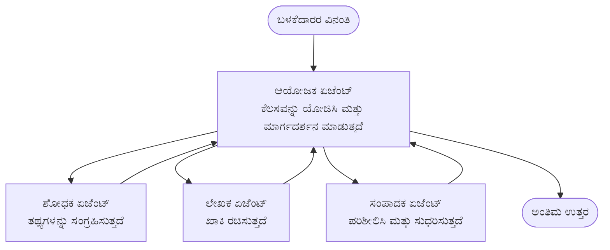

# ಬಹು-ಏಜೆಂಟ್ ಮೂಲಭೂತಗಳು - ನಿಮ್ಮ ಮೊದಲ ಸಂಯೋಜಿತ AI ವ್ಯವಸ್ಥೆಯನ್ನು ನಿಯೋಜಿಸಿ

**Chapter Navigation:**
- **📚 Course Home**: [AZD ಆರಂಭಿಕರಿಗೆ](../../README.md)
- **📖 Current Chapter**: ಅಧ್ಯಾಯ 5 - ಬಹು-ಏಜೆಂಟ್ AI ಪರಿಹಾರಗಳು
- **⬅️ Previous**: [ಅಧ್ಯಾಯ 4: ಮೂಲಸೌಕರ್ಯ](../chapter-04-infrastructure/README.md)
- **➡️ Next**: [ಸಂಯೋಜನೆ ಮಾದರಿಗಳು](../chapter-06-pre-deployment/coordination-patterns.md)

> `azd 1.25.6` ಅನ್ನು 2026 ಜೂನ್‌ನಲ್ಲಿ ಪರಿಶೀಲಿಸಲಾಗಿದೆ.

## ಪರಿಚಯ

ಮுந்தಿನ ಅಧ್ಯಾಯಗಳಲ್ಲಿ ನೀವು ಒಂಟಿ ಆಪ್ ಅನ್ನು ನಿಯೋಜಿಸಿದ್ದೀricos — ಮತ್ತು ಅಧ್ಯಾಯ 2 ರಲ್ಲಿ ನೀವು ಒಂಟಿ AI ಏಜೆಂಟ್ ಅನ್ನು ನಿಯೋಜಿಸಿದ್ದೀರಿ. ಈ ಪಾಠ ಮುಂದಿನ ಹಂತಕ್ಕೆ ಹೋಗುತ್ತದೆ: **ಬಹು-ಏಜೆಂಟ್ ವ್ಯವಸ್ಥೆ** ಅನ್ನು ನಿಯೋಜಿಸುವುದು, ಅಲ್ಲಿ ಹಲವಾರು ವಿಶೇಷಜ್ಞ ಏಜೆಂಟ್ ಗಳು ಒಟ್ಟಾಗಿ ಕೆಲಸ ಮಾಡಿ ಒಂದು ಏಜೆಂಟ್ ಒಂಟಿಯಾಗಿ ಚೆನ್ನಾಗಿ ನಿರ್ವಹಿಸಲು ಆಗದ ಸಮಸ್ಯೆಯನ್ನು ಪರಿಹರಿಸುತ್ತವೆ.

ಆರಂಭಿಕರಿಗಾಗಿ ಉತ್ತಮ ಸುದ್ದಿ: **ನೀವು ಹೊಸ ಆಜ್ಞೆಗಳ ಅಗತ್ಯವಿಲ್ಲ.** ಬಹು-ಏಜೆಂಟ್ ಪರಿಹಾರವೂ azd ಪ್ರಾಜೆಕ್ಟ್ ಆಗಿರುತ್ತದೆ. ನೀವು `azd init`, `azd up`, ಪರೀಕ್ಷೆ, ಮತ್ತು `azd down` ಅನ್ನು ನಡೆಸುತ್ತೀರಿ—ನೀವು ಈಗಾಗಲೇ ತಿಳಿದಿರುವ ಕೆಲಸಪ್ರವಾಹವೇ ನಡೆಯುತ್ತದೆ. ಬದಲಾಗುವುದು ಆಪ್‌ನ ಒಳಗಿನ *ಆಪ್‌ನ ಅಕಾರ* ಮಾತ್ರ.

## ಕಲಿಕೆಯ ಗುರಿಗಳು

ಈ ಪಾಠದ ಅಂತ್ಯಕ್ಕೆ ನೀವು:
- "multi-agent" ಎಂಬುದು ಏನೆಂಬುದನ್ನು ಮತ್ತು ಅದು ಹೆಚ್ಚುವರಿ ಸಂಕೀರ್ಣತೆಗೆ ಯುಕ್ತವಾಗುವಾಗ ಯಾವಾಗಂದು ಅರ್ಥಮಾಡಿಕೊಳ್ಳುವುದು
- ಬಹು-ಏಜೆಂಟ್ ವ್ಯವಸ್ಥೆಯ ಸಾಮಾನ್ಯ ಪಾತ್ರಗಳನ್ನು (ಸಂಯೋಜಕ + ವಿಶೇಷಜ್ಞರು) ಗುರುತಿಸುವುದು
- `azd up` ಬಳಸಿ ನೈಜ, ಕಾರ್ಯನಿರ್ವಹಿಸುವ ಬಹು-ಏಜೆಂಟ್ ಟೆಂಪ್ಲೇಟನ್ನು ನಿಯೋಜಿಸುವುದು
- ಬಹು-ಏಜೆಂಟ್ ಆಪ್ ಅನ್ನು ಬೆಂಬಲಿಸುವ Azure ಸಂಪನ್ಮೂಲಗಳನ್ನು ಅರ್ಥಮಾಡಿಕೊಳ್ಳುವುದು
- ಪರಿಹಾರವನ್ನು ಸುರಕ್ಷಿತವಾಗಿ ಪರಿಶೀಲಿಸುವುದು, ಕಸ್ಟಮೈಸ್ ಮಾಡುವುದು ಮತ್ತು ತೆರವುಗೊಳಿಸುವುದು ಹೇಗೆ ಎಂಬುದನ್ನು ತಿಳಿದುಕೊಳ್ಳುವುದು

## ಕಲಿಕೆ ಫಲಿತಾಂಶಗಳು

ಈ ಪಾಠವನ್ನು ಪೂರ್ಣಗೊಳಿಸಿದ ನಂತರ, ನೀವು ಮಾಡಬಲ್ಲಿರಿ:
- ಒಂಟಿ ಏಜೆಂಟ್ ಮತ್ತು ಬಹು-ಏಜೆಂಟ್ ವ್ಯವಸ್ಥೆಯ ನಡುವಿನ ವ್ಯತ್ಯಾಸವನ್ನು ವಿವರಿಸುವುದು
- ಉಪಕರಣಗಳೊಂದಿಗೆ ಒಂಟಿ ಏಜೆಂಟ್ ಅನ್ನು ಅಥವಾ ನಿಜವಾದ ಬಹು-ಏಜೆಂಟ್ ವಿನ್ಯಾಸವನ್ನು ಆಯ್ಕೆಮಾಡುವುದು
- azd ಮೂಲಕ ಒಂದು ಬಹು-ಏಜೆಂಟ್ 템್ಪ್ಲೇಟನ್ನು ಮುಗಿದಂತೆ ನಿಯೋಜಿಸಿ ಪರೀಕ್ಷಿಸುವುದು
- ಪ್ರತಿ ಏಜೆಂಟ್ ಎಲ್ಲಿ ಕಾರ್ಯನಿರ್ವಹಿಸುತ್ತದೆ ಮತ್ತು ಅವು ಹೇಗೆ ಸಂವಹನ ಮಾಡುತ್ತವೆ ಎಂಬುದನ್ನು ಗುರುತಿಸುವುದು
- ನಿರಂತರ ಶುಲ್ಕಗಳನ್ನು ತಪ್ಪಿಸಲು ಎಲ್ಲಾ ಸಂಪನ್ಮೂಲಗಳನ್ನು ಶುಚಿಗೊಳಿಸುವುದು

---

## ಬಹು-ಏಜೆಂಟ್ ವ್ಯವಸ್ಥೆ ಎಂದರೆ ಏನು?

ಒಂದು ಏಜೆಂಟ್ ಎಂದರೆ ಒಂದು ಮಾದರಿ ಮತ್ತು ಸೂಚನೆಗಳ ಸೆಟ್ (ಆವಶ್ಯಕವಾದರೆ ಕೆಲವು ಉಪಕರಣಗಳೊಂದಿಗೆ). ಅದು ನಿಗದಿತ ಕಾರ್ಯಗಳಿಗೆ ಚೆನ್ನಾಗಿತ್ತು. ಆದರೆ ಒಂದು ಕಾರ್ಯ ಬೆಳೆದಂತೆ—ಸಂಶೋಧನೆ, ನಂತರ ಬರವಣಿಗೆ, ನಂತರ ಸಂಪಾದನೆ, ನಂತರ ವಾಸ್ತವ ಪರಿಶೀಲನೆ—ಎಲ್ಲವನ್ನು ಒಂದೇ ಪ್ರಾಂಪ್ಟ್‌ಗೆ ಒಳಪಡಿಸುವುದು ಏಜೆಂಟ್ ಅನ್ನು ನಿಧಾನಗೊಳಿಸುತ್ತದೆ, ಕಡಿಮೆ ನಂಬಬಹುದಾಗಿರುತ್ತದೆ, ಮತ್ತು ಡೀಬಗ್ ಮಾಡಲು ಕಷ್ಟವಾಗಿಸಬಹುದು.

ಒಂದು **ಬಹು-ಏಜೆಂಟ್ ವ್ಯವಸ್ಥೆ** ಕೆಲಸವನ್ನು ನಿಪುಣತೆಗಳಾಗಿ ವಿಭಜಿಸುತ್ತದೆ, ಪ್ರತಿ ನಿಪುಣತೆ ಒಂದು ಕೆಲಸವನ್ನು ಚೆನ್ನಾಗಿ ಮಾಡುತ್ತದೆ ಮತ್ತು ಸಂಯೋಜಕದ ಮೂಲಕ ಹೊಂದಿಕೊಂಡಿರುತ್ತದೆ:



### ನೀವು ಸದಾ ಕಾಣುವ ಎರಡು ಪಾತ್ರಗಳು

| ಪಾತ್ರ | ಕೆಲಸ | ಉದಾಹರಣೆ |
|------|------|-----------|
| **ಸಂಯೋಜಕ** | ಮುಂದೇನಾಗಬೇಕು ಎಂಬುದನ್ನು ನಿರ್ಧರಿಸುತ್ತದೆ ಮತ್ತು ಏಜೆಂಟ್‌ಗಳ ನಡುವಣ ಕೆಲಸವನ್ನು ಮಾರ್ಗದರ್ಶಿಸುತ್ತದೆ | "ಮೊದಲಿಗೆ ಸಂಶೋಧನೆ, ಆಮೇಲೆ ಬರೆಯು, ನಂತರ ಸಂಪಾದಿಸು" |
| **ವಿಶೇಷಜ್ಞ** | ಒಂದು ಕೇಂದ್ರಿತ ಕೆಲಸವನ್ನು ಮಾಡುತ್ತದೆ ಮತ್ತು ಫಲಿತಾಂಶವನ್ನು ಮರಳಿಸುತ್ತದೆ | "ಶಾಸನಗಾರ" ಎಂಬ ಸಂಶೋಧಕ ಮಾತ್ರ ವಾಸ್ತವಾಂಶಗಳನ್ನು ಸಂಗ್ರಹಿಸುವವರು |

### ನಿಮಗೆ ನಿಜವಾಗಿಯೂ ಹಲವಾರು ಏಜೆಂಟ್‌ಗಳು ಬೇಕೇ?

ಸರಳವಾಗಿ ಪ್ರಾರಂಭಿಸಿ. ಕೆಳಗಿನವುಗಳಲ್ಲಿ ಒಂದಾದರೆ ಮಾತ್ರ ಬಹು-ಏಜೆಂಟ್‍ನ್ನು ಬಳಸಿರಿ:

- ✅ ಕಾರ್ಯದಲ್ಲಿ ಭಿನ್ನ ಹಂತಗಳು (**distinct stages**) ಇದ್ದರೆ ಮತ್ತು ವಿಭಿನ್ನ ಸೂಚನೆಗಳಿಂದ ಲಾಭ ದೊರಕುತ್ತವೆ (ಸಂಶೋಧನೆ vs. ಬರವಣಿಗೆ vs. ಪರಿಶೀಲನೆ)
- ✅ ಸಮಯವನ್ನು ಉಳಿಸಲು ನಿಪುಣರು **ಸಮಾನಾಂತರವಾಗಿ (in parallel)** ಓಡಿಸುವ ಅಗತ್ಯವಿದೆ
- ✅ ವಿಭಿನ್ನ ಹಂತಗಳಿಗೆ **ವಿಭಿನ್ನ ಉಪಕರಣಗಳು ಅಥವಾ ಡೇಟಾ ಮೂಲಗಳು** ಬೇಕಾಗುತ್ತವೆ
- ✅ ಪ್ರತಿ ಹಂತವನ್ನು **ಸ್ವತಂತ್ರವಾಗಿ ಪರೀಕ್ಷಿಸಬಹುದಾದ ಮತ್ತು ಡೀಬಗ್ ಮಾಡಬಹುದಾದ** ರೀತಿಯಲ್ಲಿ ಇರಬೇಕಾಗುತ್ತದೆ

ನಿಮ್ಮ ಕಾರ್ಯ ಒಂದು ಸರಳ ಪ್ರಶ್ನೆ-ಉತ್ತರ ಅಥವಾ ಸರಳ ಉಪಕರಣ ಕರೆ ಆಗಿದ್ದರೆ, ಒಂದು **ಉಪಕರಣಗಳೊಂದಿಗೆ ಒಂಟಿ ಏಜೆಂಟ್** (ಅಧ್ಯಾಯ 2) ಸರಳ, ಕಡಿಮೆ ವೆಚ್ಚದ, ಮತ್ತು ನಿರ್ವಹಣೆಗೆ ಸುಲಭವಾಗಿದೆ.

> **ಆರಂಭಿಕರ ಸಲಹೆ:** "ಹೆಚ್ಚು ಏಜೆಂಟ್ಗಳು" ಎಂದರೆ "ಉತ್ತಮ" ಅಲ್ಲ. ಪ್ರತಿ ಏಜೆಂಟ್ ವಿಳಂಬ, ವೆಚ್ಚ, ಮತ್ತು ಮೇಲ್ವಿಚಾರಣೆಗೆ ಹೊಸ ವಿಷಯವನ್ನು ಸೇರಿಸುತ್ತದೆ. ಸಮಸ್ಯೆ ಸ್ಪಷ್ಟವಾಗಿ ಭಾಗಗಳಾಗಿ ಬಿಸಿಯಲ್ಲಿರುವಾಗ ಮಾತ್ರ ಏಜೆಂಟ್‌ಗಳನ್ನು ಸೇರಿಸಿ.

---

## Azure ನಲ್ಲಿ ಬಹು-ಏಜೆಂಟ್ ನಿರ್ಮಿಸಲು ಎರಡು ವಿಧಗಳು

| ರೀತಿ | ಅದು ಏನು | सर्वोತ್ತಮಕ್ಕಾಗಿ |
|------|---------|--------------|
| **ಒಂಟಿ ಏಜೆಂಟ್ + ಉಪಕರಣಗಳು** | ಒಂದು Foundry ಏಜೆಂಟ್ ಫಂಕ್ಷನ್/ಉಪಕರಣಗಳನ್ನು ಕರೆಸುತ್ತದೆ | ಸರಳ ವರ್ಕ್‌ಫ್ಲೋಗಳು, ಪ್ರಾರಂಭಿಸಲು |
| **ಅನೇಕ ಸಂಯೋಜಿತ ಏಜೆಂಟ್‌ಗಳು** | ಒಂದು ಸಂಸ್ಥಾಪಕ ಜೊತೆ ಹಲವಾರು ಏಜೆಂಟ್‌ಗಳು | ಭಿನ್ನ ಹಂತಗಳು, ಸಮಾನಾಂತರ ಕೆಲಸ, ವಿಶೇಷೀಕರಣ |

ಈ ಪಾಠ ಎರಡನೆಯ ರೀತಿಯ ಮೇಲೆ ಕೇಂದ್ರೀಕರಿಸಿದೆ ಮತ್ತು **ಸಿದ್ಧ-ಮಾಡಿದ ಟೆಂಪ್ಲೇಟನ್ನು** ಬಳಸುತ್ತದೆ, ಆದ್ದರಿಂದ ನೀವು ನಿಮ್ಮದೇ ನಿರ್ಮಿಸುವ ಮೊದಲು ನಿಜವಾದ ಬಹು-ಏಜೆಂಟ್ ವ್ಯವಸ್ಥೆ ಎ ಹೇಗೆ ಓಡುತ್ತದೆಯೆಂದು ಕಾಣಬಹುದು.

---

## ಪ್ರಾಯೋಗಿಕ: ಕಾರ್ಯನಿರ್ವಹಿಸುವ ಬಹು-ಏಜೆಂಟ್ ಆಪ್ ಅನ್ನು ನಿಯೋಜಿಸಿ

ನಾವು **Contoso Creative Writer** ಅನ್ನು ನಿಯೋಜಿಸುತ್ತೇವೆ, ಇದು ಅಧಿಕೃತ Azure ಮಾದರಿ ಮತ್ತು ಇವು ಹಲವು ಏಜೆಂಟ್‌ಗಳು (ಸಂಶೋಧಕ, ಬರಹಗಾರ, ಸಂಪಾದಕ) ಸಂಯೋಜಿತವಾಗಿ ಲೇಖನವನ್ನು ತಯಾರಿಸಲು ಬಳಸುತ್ತದೆ. ಪಾತ್ರಗಳು ಅರ್ಥಮಾಡಿಕೊಳ್ಳಲು ಸುಲಭವಾಗಿರುವುದರಿಂದ ಇದು ಮೊದಲ ಬಹು-ಏಜೆಂಟ್ ಆಪ್‌ಗೆ ಉತ್ತಮ ಆಯ್ಕೆ.

### Step 1: ಟೆಂಪ್ಲೇಟ್ ಅನ್ನು ಪ್ರಾರಂಭಿಸಿ

```bash
# 工作的 ಫೋಲ್ಡರ್ ರಚಿಸಿ
mkdir creative-writer && cd creative-writer

# ಅಧಿಕೃತ ಬಹು-ಏಜೆಂಟ್ ಟೆಂಪ್ಲೇಟ್‌ನಿಂದ ಪ್ರಾರಂಭಿಸಿ
azd init --template contoso-creative-writer
```

> ಯಾವಾಗ ಬೇಕಾದರೂ ಹೆಚ್ಚಿನ ಬಹು-ಏಜೆಂಟ್ ಟೆಂಪ್ಲೇಟ್‌ಗಳನ್ನು [Awesome AZD AI ಗ್ಯಾಲರಿ](https://azure.github.io/awesome-azd/?tags=ai) ನಲ್ಲಿ ಬ್ರೌಸ್ ಮಾಡಿ. ಇತರ ಆರಂಭಿಕರಿಗೆ ಅನುಕೂಲಕರ ಆಯ್ಕೆಗಳು `get-started-with-ai-agents` ಮತ್ತು `azure-ai-travel-agents`.

### Step 2: ಪ್ರಮಾಣೀಕರಣ ಮಾಡಿ

```bash
# azd ಕಾರ್ಯಪ್ರವಾಹಗಳಿಗೆ ಅಗತ್ಯವಿದೆ
azd auth login
```

### Step 3: ಒಂದು ಪರಿಸರವನ್ನು ರಚಿಸಿ

```bash
azd env new dev
```

### Step 4: ಪೂರ್ವದರ್ಶಿಸಿ, ನಂತರ ನಿಯೋಜಿಸಿ

```bash
# ಏನು ನಿರ್ಮಿಸಲಾಗುವುದು ಎಂಬುದನ್ನು ಯಾವುದೇ ಹಣ ಖರ್ಚು ಮಾಡುವ ಮೊದಲು ನೋಡಿ (ಶಿಫಾರಸು)
azd provision --preview

# ಅಧಾರಭೂತ ಸಂರಚನೆಯನ್ನು ಒದಗಿಸಿ ಮತ್ತು ಎಲ್ಲಾ ಏಜೆಂಟ್‌ಗಳನ್ನು ಒಂದೇ ಹಂತದಲ್ಲಿ ನಿಯೋಜಿಸಿ
azd up
```

`azd up` ಸಬ್ಸ್ಕ್ರಿಪ್ಷನ್ ಮತ್ತು ಪ್ರಾಂತ್ಯವನ್ನು ಕೇಳಿ, ನಂತರ Azure ಸಂಪನ್ಮೂಲಗಳನ್ನು ಪ್ರಾವೀಕರಣ ಮಾಡಿ ಮತ್ತು ಅಪ್ಲಿಕೇಶನ್ ಅನ್ನು ನಿಯೋಜಿಸುತ್ತದೆ. AI ನಿಯೋಜನೆಗಳು ಸರಳ ವೆಬ್ ಆಪ್ ಗಿಂತ ಹೆಚ್ಚು ಸಮಯವನ್ನು ತೆಗೆದುಕೊಳ್ಳಬಹುದು—ನೀವು ದೊಡ್ಡ ಮಾದರಿಗಳನ್ನು ನಿಯೋಜಿಸುತ್ತಿದ್ದರೆ, ನೀವು ನಿಯೋಜನೆ ಸಮಯ ಮಿತಿಯನ್ನು ವಿಸ್ತರಿಸಬಹುದಾಗಿದೆ:

```bash
azd deploy --timeout 1800
```

> **ವೆಚ್ಚ ಮತ್ತು ಸಾಮರ್ಥ್ಯ ಕುರಿತುHeads up:** ಬಹು-ಏಜೆಂಟ್ ಆಪ್‌ಗಳು ಮಾದರಿಗಳನ್ನು ನಿಯೋಜಿಸುತ್ತವೆ ಮತ್ತು ಇದು ಕ್ವೋಟಾಗಳನ್ನು ಖಾಯಂ ಬಳಸುತ್ತದೆ ಮತ್ತು ವೆಚ್ಚ ಉಂಟುಮಾಡುತ್ತದೆ. ನೀವು `azd up` ನಲ್ಲಿ ಮಾದರಿ ಕ್ವೋಟಾ ಕಾರಣದಿಂದ ವಿಫಲವಾದರೆ, ಪ್ರದೇಶ ಮತ್ತು ಕ್ವೋಟಾ ಸಮಸ್ಯೆಗಳಿಗಾಗಿ [AI Troubleshooting](../chapter-07-troubleshooting/ai-troubleshooting.md) ನೋಡಿ ಮತ್ತು ಅಧ್ಯಾಯ 6 ರ [ಸಾಮರ್ಥ್ಯ ಯೋಜನೆ](../chapter-06-pre-deployment/capacity-planning.md) ಅನ್ನು ಪರಿಶೀಲಿಸಿ.

---

## ನೀವು ಏನು ನಿಯೋಜಿಸಿದ್ದೀರಿ ಎಂಬುದನ್ನು ಅರ್ಥಮಾಡಿಕೊಳ್ಳುವುದು

ಇಂತಹ ಸಾಮಾನ್ಯ ಬಹು-ಏಜೆಂಟ್ ಆಪ್ ಒಂದು ಸಾಲಿನ Azure ಸಂಪನ್ಮೂಲಗಳನ್ನು ಪ್ರಾವೀಜನ್ ಮಾಡುತ್ತದೆ, ಅವು ಮೇಲಿನ ಡایاಗ್ರಾಂನಲ್ಲಿ ನೀಡಿರುವ ಹೊಣೆಗಾರಿಕೆಗಳಿಗೆ ನೇರವಾಗಿ ನಕ್ಷೆ ಮಾಡುತ್ತವೆ:

| ಸಂಪನ್ಮೂಲ | ಅದು ಏಕೆ ಇದೆ |
|----------|----------------|
| **Microsoft Foundry / Models** | ಪ್ರತಿ ಏಜೆಂಟ್ ಬಳಸುವ ಭಾಷಾ ಮಾದರಿಗಳನ್ನು ಹೋಸ್ಟ್ ಮಾಡುತ್ತದೆ |
| **Azure AI Search** | ಸಂಶೋಧಕ ಏಜೆಂಟ್‌ಗೆ ಹುಡುಕಲು ಭೂತಳಿತ ಡೇಟಾವನ್ನು ನೀಡುತ್ತದೆ |
| **Container Apps** (or App Service) | ಸಂಯೋಜಕ ಮತ್ತು ಏಜೆಂಟ್ ಕೋಡ್ ಅನ್ನು ಹೋಸ್ಟ್ ಮಾಡುತ್ತದೆ |
| **Cosmos DB** (in some samples) | ಏಜೆಂಟ್‌ಗಳ ನಡುವೆ ಹಂಚಿಕೊಳ್ಳಲಾದ ಸ್ಥಿತಿ/ಮೆಮೊರಿ ಅನ್ನು ಸಂಗ್ರಹಿಸುತ್ತದೆ |
| **Application Insights** | ಏಜೆಂಟ್‌ಗಳ transversal ಆಗಿ ವಿನಂತಿಗಳನ್ನು ಟ್ರೇಸ್ ಮಾಡಿ, ನೀವು ಫ್ಲೋ ಅನ್ನು ಡೀಬಗ್ ಮಾಡಬಹುದು |

### ಏಜೆಂಟ್‌ಗಳು ಹೇಗೆ ಪರಸ್ಪರ ಮಾತನಾಡುತ್ತವೆ

ಬಹುತೇಕ azd ಬಹು-ಏಜೆಂಟ್ ಮಾದರಿಗಳಲ್ಲಿ, **ಸಂಯೋಜಕ ನಿಮ್ಮ ಅಪ್ಲಿಕೇಶನ್ ಕೋಡಿನಲ್ಲಿ** (ಉದಾಹರಣೆಗೆ, Semantic Kernel ಅಥವಾ Microsoft Agent Framework వంటి ಫ್ರೇಮ್ವರ್ಕ್ ಬಳಸಿ) ನಡೆಸಲಾಗುತ್ತದೆ. ಸಂಯೋಜಕವು ಪ್ರತಿ ವಿಶೇಷಜ್ಞ ಏಜೆಂಟ್ ಅನ್ನು ಕ್ರಮವಾಗಿ ಕರೆಯುತ್ತದೆ, ಫಲಿತಾಂಶಗಳನ್ನು ಹಂಚುತ್ತದೆ, ಮತ್ತು ಅಂತಿಮ ಉತ್ತರವನ್ನು ಸಂಯೋಜಿಸುತ್ತದೆ. ಏಜೆಂಟ್‌ಗಳು ಪ್ರೇಕ್ಷಣೆಯನ್ನೂ ಹಂಚಿಕೊಳ್ಳುತ್ತಾರೆ:

- **Function/tool calls** — ಸಂಯೋಜಕವೊಂದು ವಿಶೇಷಜ್ಞನನ್ನು ಕರೆದು ಫಲಿತಾಂಶವನ್ನು ಪಡೆಯುತ್ತದೆ
- **Shared memory** — ಡೇಟಾಬೇಸ್ (ಅCACಸುವಾಗಿ Cosmos DB) ಇಬ್ಬರೂ ಏಜೆಂಟ್ ಓದಿಕೊಳ್ಳಬಹುದಾದ ಸ್ಥಿತಿಯನ್ನು ಹೊಂದಿರುತ್ತದೆ
- **Messages/events** — ಅಲ್ಪ ಬಂಧನಕ್ಕಾಗಿ, ಏಜೆಂಟ್‌ಗಳು ಕ್ಯೂ ಅಥವಾ Service Bus ಮೂಲಕ ಸಂವಹನ ಮಾಡುತ್ತವೆ

> **ಡೀಬಗ್‌ಗೆ ಇದು ಯಾಕೆ ಮುಖ್ಯ:** ಪ್ರತಿ ಹಂತವು ಪ್ರತ್ಯೇಕವಾಗಿರುವುದರಿಂದ, Application Insights ನೀವು ಯಾವ ಏಜೆಂಟ್ ನಿಧಾನಗೊಳ್ಳಿತು ಅಥವಾ ವಿಫಲವಾಯಿತು ಎಂಬುದನ್ನು ತೋರಿಸುತ್ತದೆ. ಇದು ಕೆಲಸವನ್ನು ವಿಭಜಿಸುವ ಪ್ರಮುಖ ಕಾರಣಗಳಲ್ಲಿ ಒಂದಾಗಿದೆ.

---

## ನಿಯೋಜನೆಯನ್ನು ಪರಿಶೀಲಿಸಿ

ನظام skuteчески ಕಾರ್ಯನಿರ್ವಹಿಸುತ್ತಿದೆಯೇ ಎಂದು ಖಚಿತಪಡಿಸಿಕೊಳ್ಳಿ:

```bash
# ಡಿಪ್ಲಾಯ್ ಮಾಡಿದ ಎಂಡ್‌ಪಾಯಿಂಟ್‌ಗಳನ್ನು ಪ್ರದರ್ಶಿಸಿ
azd show

# ಅ್ಯಾಪ್‌ನ ಮೇಲ್ವಿಚಾರಣಾ ಡ್ಯಾಶ್‌ಬೋರ್ಡ್ ಅನ್ನು ತೆರೆಯಿ
azd monitor

# ಏನಾದರೂ ತಪ್ಪಾಗಿ ಕಂಡರೆ ಲಾಗ್‌ಗಳನ್ನು ಹಿಂಬಾಲಿಸಿ
azd monitor --logs
```

ನಂತರ `azd show` ನಿಂದ ಆಪ್ URL ಅನ್ನು ತೆರೆದಿಟ್ಟುಕೊಡಿ ಮತ್ತು ಎಲ್ಲಾ ಏಜೆಂಟ್‌ಗಳನ್ನು ಪರೀಕ್ಷಿಸುವಂತಹ ಒಂದು ವಿನಂತಿಯನ್ನು ಪ್ರಯತ್ನಿಸಿ (Creative Writer ಗಾಗಿ, ಒಂದು ವಿಷಯದ ಮೇಲೆ ಒಂದು ಚಿಕ್ಕ ಲೆಖನ ಬರೆಯಲು ಕೇಳಿ). Application Insights ನ **transaction search** ನಲ್ಲಿ ನೀವು ವಿನಂತಿಯು ಸಂಶೋಧಕ, ಬರಹಗಾರ ಮತ್ತು ಸಂಪಾದಕ ಹಂತಗಳಿಗೆ ಫ್ಯಾನ್ ಔಟ್ ಆಗುವುದು ಕಾಣಬೇಕು.

**ಯಶಸ್ವಿ ಮಾನದಂಡಗಳು:**
- ✅ `azd show` ಒಂದು ತಲುಪಿ ಹೋಗಬಹುದಾದ ಎಂಟಿಪಾಯಿಂಟ್ ಅನ್ನು ಪಟ್ಟಿಮಾಡುತ್ತದೆ
- ✅ ಒಂದು ವಿನಂತಿ ಬಹುಹಂತಗಳಿಂದ ಸ್ಪಷ್ಟವಾಗಿ ಹೋಗಿದೆಯೆಂಬ ಫಲಿತಾಂಶವನ್ನು ಉತ್ಪತ್ತಿ ಮಾಡುತ್ತದೆ
- ✅ Application Insights ಹೆಚ್ಚು ಒಂದು ಏಜೆಂಟ್ ಹಂತಕ್ಕಿಂತ ಹೆಚ್ಚಿನ ಟ್ರೇಸ್‌ಗಳನ್ನು ತೋರಿಸುತ್ತದೆ

---

## ಕಸ್ಟಮೈಸ್ ಮಾಡಿ: ಒಂದು ಏಜೆಂಟ್ ಸೇರಿಸು ಅಥವಾ ಹೊಂದಿಹೇಳು

ಪ್ರತಿ ಏಜೆಂಟ್ ಕೇವಲ ಸೂಚನೆಗಳು ಮತ್ತು ಉಪಕರಣಗಳಾಗಿರುವುದರಿಂದ, ಕಸ್ಟಮೈಜ್ ಮಾಡುವುದು ಸುಲಭವಾಗಿದೆ:

1. **ಟೆಂಪ್ಲೇಟ್ನಲ್ಲಿ ಏಜೆಂಟ್ ವ್ಯಾಖ್ಯಾನಗಳನ್ನು ಹುಡುಕಿ** (ಸಾಮಾನ್ಯವಾಗಿ `prompts/`, `agents/`, ಅಥವಾ `*.prompty` ಫೈಲ್‌ಗಳ ಸೆಟ್ ಆಗಿರುತ್ತದೆ).
2. **ಏಜೆಂಟ್‌ನ ಸೂಚನೆಗಳನ್ನು ಟ್ಯೂನ್ ಮಾಡಿ** — ಉದಾಹರಣೆಗೆ, ಸಂಪಾದಕ ಏಜೆಂಟ್‌ಗೆ ನಿರ್ದಿಷ್ಟ ಟೋನ್ ಅಥವಾ ಪದಗಳ ಇಲ್‍ಪು ಅನುಷ್ಠಾನ ಮಾಡಲು ಹೇಳಿ.
3. **ಕೆವಲ ಕೋಡ್ ಅನ್ನು ಪುನರ್ನಿಯೋಜಿಸಿ** (ಇಂಫ್ರಾಸ್ಟ್ರಕ್ಚರ್ ಬದಲಾಗುವುದಿಲ್ಲ):

   ```bash
   azd deploy
   ```

ಮುಂದುವರಿಯಲು ಮತ್ತು ನಿಮ್ಮ *ಸაკუთ್* manifests ಇಂದೇ ಏಜೆಂಟ್‌ಗಳನ್ನು ನಿರ್ಮಿಸಲು, ಏಜೆಂಟ್ ವಿಸ್ತರಣೆ ಮತ್ತು ಅದರ ಸಂಪೂರ್ಣ ಜೀವನಚಕ್ರವನ್ನು ಬಳಸಿ:

```bash
azd extension install azure.ai.agents
azd ai agent init -m agent-manifest.yaml
azd up
azd ai agent invoke      # ಪ್ರತಿಕ್ರಿಯೆ ಸಮಯದೊಂದಿಗೆ ಪರೀಕ್ಷೆ
```

ಸಂಪೂರ್ಣ ಏಜೆಂಟ್ ಜೀವನಚಕ್ರಕ್ಕಾಗಿ (`invoke`, `eval generate`, `optimize`, `delete`) [ಅಧ್ಯಾಯ 2: ಏಜೆಂಟ್‌ಗಳು](../chapter-02-ai-development/agents.md) ಮತ್ತು [AZD AI CLI ಉಲ್ಲೇಖ](../chapter-08-production/production-ai-practices.md#azd-ai-cli-commands-and-extensions) ಅನ್ನು ನೋಡಿ.

---

## ಶುದ್ಧಗೊಳಿಸಿ

ಬಹು-ಏಜೆಂಟ್ ಆಪ್‌ಗಳು ಹಲವಾರು ಬಿಲ್ಲಿಂಗ್ ಆಗುವ ಸರ್ವీస್ಗಳನ್ನು ಓಡಿಸುತ್ತವೆ. ನೀವು ಮುಗಿಸಿದ ಮೇಲೆ ಎಲ್ಲವನ್ನೂ ತೆರವುಗೊಳಿಸಿ:

```bash
azd down --force --purge
```

`--purge` ಫ್ಲ್ಯಾಗ್ ಸಧಾರಣವಾಗಿ мೃದು-ಅಳಿಸಿದ AI ಸಂಪನ್ಮೂಲಗಳನ್ನು (ಉದಾಹರಣೆಗೆ Foundry/Azure AI Services ಖಾತೆಗಳು) ಸಹ ತೆಗೆದುಹಾಕುತ್ತದೆ, ಆದ್ದರಿಂದ ಅವು ಭವಿಷ್ಯದಲ್ಲಿ ಪುನರ್‌ನಿಯೋಜನವನ್ನು ತಡೆಯುವುದಿಲ್ಲ ಅಥವಾ ವೆಚ್ಚವನ್ನು ನಿರಂತರವಾಗಿ ಇಡುವುದಿಲ್ಲ.

---

## ಉತ್ಪಾದನಾ ಬಹು-ಏಜೆಂಟ್ ವ್ಯವಸ್ಥೆಗಳ ಕುರಿತು ಟಿಪ್ಪಣಿ

ಈ ರೆಪೋ ಒಳಗೂಳ್ಳಿರುವ [Retail Multi-Agent Solution](../../examples/retail-scenario.md) ಒಂದು **ವಾಸ್ತುಶಿಲ್ಪ ಬ್ಲೂಪ್ರಿಂಟ್** ಆಗಿದ್ದು, ಒಂದು ಒಂಭತ್ತು-ಆಜ್ಞೆ ಟೆಂಪ್ಲೇಟು ಅಲ್ಲ—ಇದು ಉತ್ಪಾದನಾ ರಿಟೇಲ್ ವ್ಯವಸ್ಥೆಯು ಹೇಗೆ ನಿರ್ಮಿಸಲಾಗುವುದು ಎಂಬುದನ್ನು ದಾಖಲೆಗೊಳಿಸುತ್ತದೆ (ಮತ್ತು ಸಂಪೂರ್ಣ ನಿರ್ಮಾಣವು ಬಹಳಷ್ಟು ಪ್ರಯತ್ನವನ್ನು ಅಗತ್ಯವಿದೆ ಎಂಬುದನ್ನು ಸ್ಪಷ್ಟಪಡಿಸುತ್ತದೆ). ಇಲ್ಲಿ ನೀವು ಕಾರ್ಯನಿರ್ವಹಿಸುವ ಮಾದರಿಯನ್ನು ನಿಯೋಜಿಸಿದ ನಂತರ ಇದನ್ನು ವಿನ್ಯಾಸ ಉಲ್ಲೇಖವಾಗಿ ಬಳಸಿ. ಉತ್ಪಾದನಾ ವಿಚಾರಗಳು (ಪ್ರತಿರೋಧಕ್ಷಮತೆ, ವೆಚ್ಚ, ಮಾನಿಟರಿಂಗ್, ಮಂಡನ) ಕುರಿತಾಗಿ ಮುಂದುವರೆಯಲು [ಅಧ್ಯಾಯ 8: ಉತ್ಪಾದನಾ AI ಅಭ್ಯಾಸಗಳು](../chapter-08-production/production-ai-practices.md) ನೋಡಿ.

---

## ಸಾರಾಂಶ

- ಬಹು-ಏಜೆಂಟ್ ವ್ಯವಸ್ಥೆ ಕಾರ್ಯವನ್ನು ಸಂಯೋಜಕನಲ್ಲಿ ಸಂಯೋಜಿತ ನಿಪುಣರುಗಳ ನಡುವೆ ವಿಭಜಿಸುತ್ತದೆ.
- ಕಾರ್ಯದಲ್ಲಿ ವಿಭಿನ್ನ ಹಂತಗಳು, ಸಮಾನಾಂತರತೆ, ಅಥವಾ ಪ್ರತಿ ಹಂತಕ್ಕೆ ವಿಭಿನ್ನ ಉಪಕರಣಗಳ ಅಗತ್ಯವಿದ್ದಾಗ ಮಾತ್ರ ಇದನ್ನು ಬಳಸಿ—ಅಲ್ಲದಿದ್ದರೆ ಒಂಟಿ ಏಜೆಂಟ್ ಅನ್ನು tercih ಮಾಡಿ.
- azd ಕೆಲಸಪ್ರವಾಹ ಬದಲಾಗದು: `azd init` → `azd up` → ಪರೀಕ್ಷೆ → `azd down`.
- `contoso-creative-writer` ಸೇರಿದಂತೆ ನೈಜ ಟೆಂಪ್ಲೇಟುಗಳು ಇಂದು ತೆರೆಯಲು ಮತ್ತು ಕಸ್ಟಮೈಸ್ ಮಾಡಲು ನಿಮಗೆ ಸಹಾಯ ಮಾಡುತ್ತವೆ.
- ಏಜೆಂಟ್‌ಗಳ ನಡುವೆ Application Insights ಟ್ರೇಸಿಂಗ್ ಬಹು-ಏಜೆಂಟ್ ವಿನ್ಯಾಸದ ಅತ್ಯಂತ ಜನಪ್ರಿಯ ವ್ಯವಹಾರಿಕ ಪ್ರಯೋಜನಗಳಲ್ಲಿ ಒಂದಾಗಿದೆ.

---

## 🔗 Navigation

| Direction | Lesson |
|-----------|--------|
| **Previous** | [ಅಧ್ಯಾಯ 4: ಮೂಲಸೌಕರ್ಯ](../chapter-04-infrastructure/README.md) |
| **Next** | [ಸಂಯೋಜನೆ ಮಾದರಿಗಳು](../chapter-06-pre-deployment/coordination-patterns.md) |

## 📖 ಸಂಬಂಧಿತ ಸಂಪನ್ಮೂಲಗಳು

- [AI ಏಜೆಂಟ್‌ಗಳ ಮಾರ್ಗದರ್ಶಿ](../chapter-02-ai-development/agents.md)
- [ಸಂಯೋಜನೆ ಮಾದರಿಗಳು](../chapter-06-pre-deployment/coordination-patterns.md)
- [ಉತ್ಪಾದನಾ AI ಅಭ್ಯಾಸಗಳು](../chapter-08-production/production-ai-practices.md)
- [AI Troubleshooting](../chapter-07-troubleshooting/ai-troubleshooting.md)

---

<!-- CO-OP TRANSLATOR DISCLAIMER START -->
**ಅಸ್ವೀಕಾರ**:
ಈ ದಸ್ತಾವೇಜು AI ಅನುವಾದ ಸೇವೆ [Co-op Translator](https://github.com/Azure/co-op-translator) ಬಳಸಿ ಅನುವಾದಿಸಲಾಗಿದೆ. ನಾವು ನಿಖರತೆಯನ್ನು ಸಾಧಿಸಲು ಪ್ರಯತ್ನಿಸುತ್ತಿದ್ದರೂ, ದಯವಿಟ್ಟು ಗಮನಿಸಿ, ಸ್ವಯಂಚಾಲಿತ ಅನುವಾದಗಳಲ್ಲಿ ದೋಷಗಳು ಅಥವಾ ಅಸಡ್ಡೆಗಳು ಇರಬಹುದು. ಮೂಲ ಭಾಷೆಯಲ್ಲಿರುವ ಮೂಲ ದಸ್ತಾವೇಜು ಪ್ರಾಮಾಣಿಕ ಮೂಲವೆಂದು ಪರಿಗಣಿಸಬೇಕು. ಪ್ರಮುಖ ಮಾಹಿತಿಗಾಗಿ, ವೃತ್ತಿಪರ ಮಾನವ ಅನುವಾದವನ್ನು ಶಿಫಾರಸು ಮಾಡಲಾಗುತ್ತದೆ. ಈ ಅನುವಾದವನ್ನು ಬಳಸುವ ಮೂಲಕ ಉಂಟಾಗುವ ಯಾವುದೇ ತಪ್ಪು ಅರ್ಥಗಳ ಅಥವಾ ತಪ್ಪು ವ್ಯಾಖ್ಯಾನಗಳ ಬಗ್ಗೆ ನಾವು ಹೊಣೆಗಾರರಲ್ಲ.
<!-- CO-OP TRANSLATOR DISCLAIMER END -->