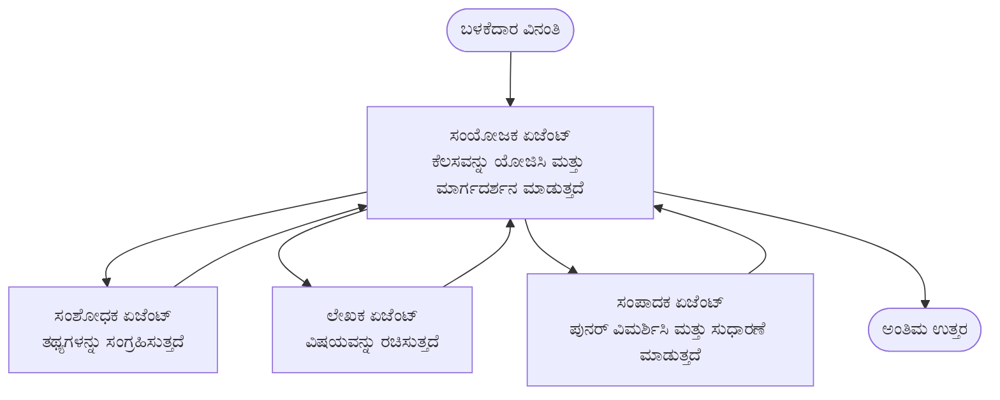

# ಮಲ್ಟಿ-ಏಜೆಂಟ್ ಮೂಲಭೂತಗಳು - ನಿಮ್ಮ ಮೊದಲ ಸಂಯೋಜಿತ AI ವ್ಯವಸ್ಥೆಯನ್ನು ನಿಯೋಜಿಸಿ

**ಅಧ್ಯಾಯ ನಾವಿಗೇಶನ್:**
- **📚 ಕೋರ್ಸ್ ಕುಟುಂಬ**: [AZD For Beginners](../../README.md)
- **📖 ಇತ್ತೀಚಿನ ಅಧ್ಯಾಯ**: ಅಧ್ಯಾಯ 5 - ಮಲ್ಟಿ-ಏಜೆಂಟ್ AI ಪರಿಹಾರಗಳು
- **⬅️ ಹಿಂದಿನದು**: [ಅಧ್ಯಾಯ 4: ಮೂಲಸೌಕರ್ಯ](../chapter-04-infrastructure/README.md)
- **➡️ ಮುಂದಿನದು**: [ಸಂಯೋಜನಾ ಮಾದರಿಗಳು](../chapter-06-pre-deployment/coordination-patterns.md)

> ಜುಲೈ 2026 ರಲ್ಲಿ `azd 1.27.1` ವಿರುದ್ಧ ಪ್ರಮಾಣಿತವಾಗಿದೆ.

## ಪರಿಚಯ

ಮೊದಲ ಅಧ್ಯಯಾಯಗಳಲ್ಲಿ ನೀವು ಒಂದು ಅನ್ವಯಿಕೆಯನ್ನು ನಿಯೋಜಿಸಿದ್ದೀರಿ—ಮತ್ತು ಅಧ್ಯಾಯ 2 ರಲ್ಲಿ ನೀವು ಒಂದು AI ಏಜೆಂಟ್ ಅನ್ನು ನಿಯೋಜಿಸಿದ್ದೀರಿ. ಈ ಪಾಠದ ಇನ್ನೊಂದು ಹಂತವನ್ನು ತೆಗೆದುಕೊಳ್ಳುತ್ತದೆ: ಒಂದು **ಮಲ್ಟಿ-ಏಜೆಂಟ್ ವ್ಯವಸ್ಥೆ**, ಅಲ್ಲಿ ಹಲವು ವಿಶೇಷ ಏಜೆಂಟುಗಳು ತಾವು ಒಬ್ಬ Based problems handled well by single agent. 

ಹೊಸಬರಿಗೆ ಒಳ್ಳೆಯ ಸುದ್ದಿ: **ನೀವು ಹೊಸ ಕಮಾಂಡ್‌ಗಳ ಅಗತ್ಯವಿಲ್ಲ.** ಮಲ್ಟಿ-ಏಜೆಂಟ್ ಪರಿಹಾರವು ಇನ್ನೂ azd ಪ್ರಾಜೆಕ್ಟ್ ಆಗಿದೆ. ನೀವು `azd init`, `azd up`, ಪರೀಕ್ಷಿಸಿ, ಮತ್ತು `azd down` ಮಾಡುತ್ತೀರಿ—ನೀವು ಈಗಾಗಲೇ ತಿಳಿದಿರುವ ಕಾರ್ಯಪ್ರವಾಹವೇ. ಬದಲಾವಣೆ ಆಗುವುದು ಅನ್ವಯಿಕೆಯ ಆಂತರಿಕ *ರೂಪ* ಮಾತ್ರ.

## ಅಧ್ಯಯನ ಗುರಿಗಳು

ಈ ಪಾಠದ ಅಂತ್ಯಕ್ಕೆ, ನೀವು:
- "ಮಲ್ಟಿ-ಏಜೆಂಟ್" ಎಂದರೇನು ಮತ್ತು ಇದನ್ನು ಸವಾಲಿನಷ್ಟು ಸಮಯದಲ್ಲಿ ಯಾಕಾಗಿ ಬಳಸಬೇಕು ಎಂಬುದನ್ನು ಅರ್ಥಮಾಡಿಕೊಳ್ಳುತ್ತಾರೆ
- ಮಲ್ಟಿ-ಏಜೆಂಟ್ ವ್ಯವಸ್ಥೆಯಲ್ಲಿ ಸಾಮಾನ್ಯ ಪಾತ್ರಗಳನ್ನು ಗುರುತಿಸಬಹುದು (ಸಂಯೋಜಕ + ತಜ್ಞರು)
- `azd up` ಬಳಸಿ ನಿಜವಾದ, ಕಾರ್ಯನಿರ್ವಹಿಸುವ ಮಲ್ಟಿ-ಏಜೆಂಟ್ ಟೆಂಪ್ಲೇಟ್ ಅನ್ನು ನಿಯೋಜಿಸುತ್ತೀರಿ
- ಮಲ್ಟಿ-ಏಜೆಂಟ್ ಅನ್ವಯಿಕೆಯನ್ನು ಬೆಂಬಲಿಸುವ ಅಜ್ಯುರ್ ಸಂಪನ್ಮೂಲಗಳನ್ನು ಅರ್ಥಮಾಡಿಕೊಳ್ಳುತ್ತೀರಿ
- ಪರಿಹಾರವನ್ನು ಸುರಕ್ಷಿತವಾಗಿ ಪರಿಶೀಲಿಸಲು, ಹೊಂದಿಸಲು ಮತ್ತು ತೆಗೆಯಲು ತಿಳಿದುಕೊಳ್ಳುತ್ತೀರಿ

## ಅಧ್ಯಯನ ಫಲಿತಾಂಶಗಳು

ಈ ಪಾಠವನ್ನು ಪೂರ್ಣಗೊಳಿಸಿದ ಮೇಲೆ, ನೀವು ಸಾಮರ್ಥ್ಯ ಹೊಂದಿರುತ್ತೀರಿ:
- ಒಬ್ಬ ಏಜೆಂಟ್ ಮತ್ತು ಮಲ್ಟಿ-ಏಜೆಂಟ್ ವ್ಯವಸ್ಥೆಯ ಭೇದವನ್ನು ವಿವರಿಸಲು
- ಉಪಕರಣಗಳೊಂದಿಗೆ ಒಬ್ಬ ಏಜೆಂಟ್ ಮತ್ತು ನಿಜವಾದ ಮಲ್ಟಿ-ಏಜೆಂಟ್ ವಿನ್ಯಾಸದ ನಡುವೆ ಆಯ್ಕೆ ಮಾಡುವುದರಲ್ಲಿ
- `azd` ಬಳಸಿ ಮಲ್ಟಿ-ಏಜೆಂಟ್ ಟೆಂಪ್ಲೇಟನ್ನು ಸಮಗ್ರವಾಗಿ ನಿಯೋಜಿಸಿ ಮತ್ತು ಪರೀಕ್ಷಿಸಿ
- ಪ್ರತಿ ಏಜೆಂಟ್ ಯಾವಲ್ಲಿ ಕಾರ್ಯನಿರ್ವಹಿಸುತ್ತದೆ ಮತ್ತು ಅವರು ಹೇಗೆ ಸಂವಹನ ಮಾಡುತ್ತಾರೆ ಎಂದು ಗುರುತಿಸಲು
- ನಿರಂತರ ಶುಲ್ಕದಿಂದ ತಪ್ಪಿಸಲು ಎಲ್ಲಾ ಸಂಪನ್ಮೂಲಗಳನ್ನು ಸ್ವಚ್ಛಮಾಡಲು

---

## ಮಲ್ಟಿ-ಏಜೆಂಟ್ ವ್ಯವಸ್ಥೆ ಎಂದರೆ ಏನು?

ಒಬ್ಬ ಏಜೆಂಟ್ ಒಂದು ಮಾದರಿ ಮತ್ತು ಸೂಚನೆಗಳ ಒಂದು ಸೆಟ್ (ಐಚ್ಛಿಕವಾಗಿ ಕೆಲ ಉಪಕರಣಗಳೊಂದಿಗೆ) ಆಗಿದೆ. ಇದು ಸ್ಪಷ್ಟ ಕಾರ್ಯಗಳಿಗೆ ಉತ್ತಮವಾಗಿದೆ. ಆದರೆ ಕೆಲಸ ಬೆಳೆದಂತೆ—ಹುಡುಕಾಟ, ಬರೆದಾಟ, ಸಂಪಾದನೆ, ಮತ್ತು ಪರಿಶೀಲನೆ—ಎಲ್ಲಾ ಒಂದೇ ಪ್ರಾಂಪ್ಟ್ ನಲ್ಲಿ ಹಾಕಬೇಡದು ಏಜೆಂಟ್ ನಿಷ್ಠುರ, ನಂಬಲಾರದ, ಮತ್ತು ಡಿಬಗ್ ಮಾಡಲು ಕಷ್ಟವಾಯಿತೆಂದು ಕಾಣುತ್ತದೆ.

**ಮಲ್ಟಿ-ಏಜೆಂಟ್ ವ್ಯವಸ್ಥೆ** ಕೆಲಸವನ್ನು ತಜ್ಞರಿಗೆ ವಿಭಜಿಸುವುದು, ಅಲ್ಲಿ ಪ್ರತಿಯೊಬ್ಬರೂ ಒಬ್ಬ ಕೆಲಸವನ್ನು ಚೆನ್ನಾಗಿ ನಿರ್ವಹಿಸುತ್ತಾರೆ, ಮತ್ತು ಸಂಯೋಜಕ ಅವರ ನಿಗ್ರಹದಲ್ಲಿರುತ್ತಾರೆ:



### ನೀವು ಯಾವಾಗಲೂ ನೋಡಲಿದ್ದ ಎರಡು ಪಾತ್ರಗಳು

| ಪಾತ್ರ | ಕೆಲಸ | ಉದಾಹರಣೆ |
|------|-----|---------|
| **ಸಂಯೋಜಕ** | *ಮುಂದೆ ಏನು ಸಂಭವಿಸುತ್ತದೆ* ತೀರ್ಮಾನಿಸಿ ಮತ್ತು ಏಜೆಂಟ್‌ಗಳ ನಡುವೆ ಕೆಲಸ ಮಾರ್ಗಸೂಚಿ ಮಾಡುತ್ತದೆ | "ಮೊದಲು ಹುಡುಕಾಟ, ನಂತರ ಬರೆಯು, ನಂತರ ಸಂಪಾದನೆ" |
| **ತಜ್ಞ** | ಒಂದು ಗಮನನಿಯೋಜಿತ ಕೆಲಸವನ್ನು ಮಾಡಿ ಫಲಿತಾಂಶವನ್ನು ನೀಡುತ್ತದೆ | "ಹುಡುಕಾಟಗಾರ" ಅವರು ಮಾತ್ರ ವಾಸ್ತವಾಂಶಗಳನ್ನು ಸಂಗ್ರಹಿಸುತ್ತಾರೆ |

### ನಿಮಗೆ ನಿಜವಾಗಿಯೂ ಬಹು ಏಜೆಂಟ್‌ಗಳು ಬೇಕೇ?

ಸರಳವಾಗಿ ಪ್ರಾರಂಭಿಸಿ. ಈವುಗಳಲ್ಲಿ ಒಂದಾಗಿದೆ ಅಂದಾಗ ಮಾತ್ರ ಮಲ್ಟಿ-ಏಜೆಂಟ್ ಬಳಸಿ:

- ✅ ಕಾರ್ಯವು **ಭಿನ್ನ ಹಂತಗಳನ್ನು** ಹೊಂದಿದೆ ಮತ್ತು ವಿವಿಧ ಸೂಚನೆಗಳಿಂದ ಲಾಭ ಪಡೆಯುತ್ತದೆ (ಹುಡುಕಾಟ, ಬರವಣಿಗೆ, ವಿಮರ್ಶೆ)
- ✅ ನೀವು ತಜ್ಞರು **ಸಮನ್ವಯವಾಗಿ** ಕಾರ್ಯನಿರ್ವಹಿಸಲು ಬಯಸುತ್ತೀರಿ ಸಮಯ ಉಳಿಸಲು
- ✅ ವಿಭಿನ್ನ ಹಂತಗಳಿಗೆ **ವಿಭಿನ್ನ ಉಪಕರಣಗಳು ಅಥವಾ ಡೇಟಾ ಮೂಲಗಳು** ಬೇಕಾಗಿವೆ
- ✅ ನೀವು ಪ್ರತಿ ಹಂತವನ್ನು **ಸ್ವತಂತ್ರವಾಗಿ ಪರೀಕ್ಷಿಸಬಹುದಾಗಿಯೂ ಮತ್ತು ದೋಷ ಪರಿಹರಿಸಬಹುದಾಗಿಯೂ** ಬೇಕಾಗಿದೆ

ನಿಮ್ಮ ಕಾರ್ಯವು ಒಂದು ಸರಳ ಪ್ರಶ್ನೆ-ಉತ್ತರ ಅಥವಾ ಸರಳ ಉಪಕರಣ ಕರೆ ಆಗಿದ್ದರೆ, **ಒಬ್ಬ ಏಜೆಂಟ್ ಉಪಕರಣಗಳೊಂದಿಗೆ** (ಅಧ್ಯಾಯ 2) ಹೆಚ್ಚು ಸರಳ, ಸಗ್ಗ, ಮತ್ತು ಸುಲಭ ಬಳಸಬಹುದಾಗಿದೆ.

> **ಹೊಸಬರಿಗೆ ಸಲಹೆ:** "ಹೆಚ್ಚಿನ ಏಜೆಂಟುಗಳು" ಎಂದರೆ "ಮೇಲ್ಗುಣವಿಲ್ಲ." ಪ್ರತಿ ಏಜೆಂಟ್ latency, ವೆಚ್ಚ ಮತ್ತು ಗಮನವನ್ನು ಹೆಚ್ಚಿಸುತ್ತದೆ. ಸಮಸ್ಯೆ ಸ್ಪಷ್ಟವಾಗಿ ಭಾಗಗಳಾಗಿ ವಿಭಜನೆಯಾಗದಿದ್ದರೆ ಏಜೆಂಟ್‌ಗಳನ್ನು ಹೆಚ್ಚಿಸಬೇಡಿ.

---

## ಅಜ್ಯುರ್ ನಲ್ಲಿ ಮಲ್ಟಿ-ಏಜೆಂಟ್ ನಿರ್ಮಿಸಲು ಎರಡು ವಿಧಾನಗಳು

| ವಿಧಾನ | ಅದು ಏನು | ಅತ್ಯುತ್ತಮವಾದುದು |
|----------|-----------|----------|
| **ಒಬ್ಬ ಏಜೆಂಟ್ + ಉಪಕರಣಗಳು** | ಒಂದೇ ಫೌಂಡ್ರಿ ಏಜೆಂಟ್ ವಿಭಾಗಗಳನ್ನು/ಉಪಕರಣಗಳನ್ನು ಕರೆ ಮಾಡುತ್ತದೆ | ಸರಳ ಕಾರ್ಯಪ್ರವಾಹಗಳು, ಪ್ರಾರಂಭಿಸಲು |
| **ಬಹು ಏಜೆಂಟ್ ಸಂಯೋಜನೆ** | ಸಂಯೋಜಕ ಮತ್ತು ಹಲವಾರು ಏಜೆಂಟ್‌ಗಳಿರುವ ವ್ಯವಸ್ಥೆ | ವಿಭಿನ್ನ ಹಂತಗಳು, ಸಮಾಂತರ ಕೆಲಸ, ವಿಶೇಷೀಕರಣ |

ಈ ಪಾಠ ಎರಡನೆಯ ವಿಧಾನವನ್ನು ಗಮನಿಸುತ್ತದೆ, **ತಯಾರಾಗಿರುವ ಟೆಂಪ್ಲೇಟ್ನ** ಮೂಲಕ, ಆದ್ದರಿಂದ ನೀವು ನಿಜವಾದ ಮಲ್ಟಿ-ಏಜೆಂಟ್ ವ್ಯವಸ್ಥೆಯನ್ನು ನೋಡಿ ಅದನ್ನು ಸ್ವತಂತ್ರವಾಗಿ ನಿರ್ಮಿಸಬಹುದು.

---

## ಕೈಗೆ-ಕೈ: ಕಾರ್ಯನಿರ್ವಹಿಸುವ ಮಲ್ಟಿ-ಏಜೆಂಟ್ ಅನ್ವಯಿಕೆಯನ್ನು ನಿಯೋಜಿಸಿ

ನಾವು ನಿಯೋಜಿಸುವುದು **Contoso Creative Writer**, ಅಧಿಕೃತ ಅಜ್ಯುರ್ ಮಾದರಿ, ಇದು ಹಲವಾರು ಏಜೆಂಟ್‌ಗಳನ್ನು (ಹುಡುಕಾಟಗಾರ, ಬರವಣಿಗಾರ, ಸಂಪಾದಕಿ) ಸಂಯೋಜಿಸಿ ಲೇಖನ ರಚಿಸುತ್ತದೆ. ಇದು ಬಹಳ ಒಳ್ಳೆಯ ಮೊದಲ ಮಲ್ಟಿ-ಏಜೆಂಟ್ ಅಪ್ಲಿಕೇಶನ್ ಆಗಿದೆ ಏಕೆಂದರೆ ಪಾತ್ರಗಳನ್ನು ಸರಳವಾಗಿ ಅರ್ಥಮಾಡಿಕೊಳ್ಳಬಹುದು.

### ಹಂತ 1: ಟೆಂಪ್ಲೇಟ್ನ ಶುರುಾವಣೆ

```bash
# ಕೆಲಸ ಮಾಡುವ ಫೋಲ್ಡರ್ ರಚಿಸಿ
mkdir creative-writer && cd creative-writer

# ಅಧಿಕೃತ ಬಹು-ಏಜೆಂಟ್ ಟೆಂಪ್ಲೇಟಿನಿಂದ ಆರಂಭಿಸಿ
azd init --template contoso-creative-writer
```

> ನೀವು ಯಾವಾಗ ಬೇಕಾದರೂ [Awesome AZD AI ಗ್ಯಾಲರಿ](https://azure.github.io/awesome-azd/?tags=ai) ನಲ್ಲಿ ಇನ್ನಷ್ಟು ಮಲ್ಟಿ-ಏಜೆಂಟ್ ಟೆಂಪ್ಲೇಟ್‌ಗಳನ್ನು ಬ್ರೌಸ್ ಮಾಡಬಹುದು. ಇನ್ನಷ್ಟು ಹೊಸಬರಿಗೆ ಅನುಕೂಲಕರ ಆಯ್ಕೆಗಳಲ್ಲಿ `get-started-with-ai-agents` ಮತ್ತು `azure-ai-travel-agents` ಸೇರಿವೆ.

### ಹಂತ 2: ಪ್ರಮಾಣೀಕರಣ ಮಾಡಿ

```bash
# azd ವರ್ಕ್‌ಫ್ಲೋಗಳಿಗಾಗಿ ಅಗತ್ಯವಿದೆ
azd auth login
```

### ಹಂತ 3: ಪರಿಸರವನ್ನು ರಚಿಸಿ

```bash
azd env new dev
```

### ಹಂತ 4: ಪೂರ್ವದೃಶ್ಯ ಮಾಡಿ, ಬಳಿಕ ನಿಯೋಜಿಸಿ

```bash
# ಯಾವುದನ್ನು ರಚಿಸುವುದೆಂದು ಮೊದಲು ನೋಡಿಕೊಳ್ಳಿ (ಶಿಫಾರಸು ಮಾಡಲಾಗಿದೆ)
azd provision --preview

# ಮೂಲಸೌಕರ್ಯ ಒದಗಿಸಿ ಮತ್ತು ಎಲ್ಲಾ ಏಜೆಂಟ್‌ಗಳನ್ನು ಒಂದು ಹಂತದಲ್ಲಿ ನಿಯೋಜಿಸಿ
azd up
```

`azd up` ಸಬ್ಸ್ಕ್ರಿಪ್ಷನ್ ಮತ್ತು ಪ್ರದೇಶ ಕೇಳುತ್ತದೆ, ನಂತರ ಅಜ್ಯುರ್ ಸಂಪನ್ಮೂಲಗಳನ್ನು ಪ್ರೊವಿಷನ್ ಮಾಡಿ ಮತ್ತು ಅಪ್ಲಿಕೇಶನ್ ನಿಯೋಜಿಸುತ್ತದೆ. AI ನಿಯೋಜನೆಗಳು ಸರಳ ವೆಬ್ ಅಪ್ ಗಿಂತ ಹೆಚ್ಚು ಸಮಯ ತೆಗೆದುಕೊಳ್ಳಬಹುದು—ನೀವು ದೊಡ್ಡ ಮಾದರಿಗಳನ್ನು ನಿಯೋಜಿಸುತ್ತಿರಾದರೆ, ನಿಯೋಜನೆ ಸಮಯವನ್ನು ವಿಸ್ತರಿಸಬಹುದು:

```bash
azd deploy --timeout 1800
```

> **ಶುಲ್ಕ ಮತ್ತು ಸಾಮರ್ಥ್ಯದ ಬಗ್ಗೆ ಗಮನಿಸಿ:** ಮಲ್ಟಿ-ಏಜೆಂಟ್ ಅಪ್ಲಿಕೇಶನ್‌ಗಳು AI ಮಾದರಿಗಳನ್ನು ನಿಯೋಜಿಸುತ್ತವೆ, ಅವು ಕ್ವೋಟಾ ಬಳಸಿ ವೆಚ್ಚವನ್ನು ಉಂಟುಮಾಡುತ್ತವೆ. `azd up` ಮಾದರಿ ಕ್ವೋಟಾ ತೊಂದರೆ ಎದುರಿಸಿದರೆ, [AI Troubleshooting](../chapter-07-troubleshooting/ai-troubleshooting.md) ನಲ್ಲಿ ಪ್ರದೇಶ ಮತ್ತು ಕ್ವೋಟಾ ಪರಿಹಾರಗಳು ಹಾಗೂ ಅಧ್ಯಾಯ 6 [Capacity Planning](../chapter-06-pre-deployment/capacity-planning.md) ನೋಡಿ.

---

## ನೀವು ನಿಯೋಜಿಸಿದ್ದದ್ದನ್ನು ಅರ್ಥಮಾಡಿಕೊಳ್ಳಿ

ಇಂತಹ ಸಾಂಪ್ರದಾಯಿಕ ಮಲ್ಟಿ-ಏಜೆಂಟ್ ಅಪ್ಲಿಕೇಶನ್ ಒಂದೋ ಹುದ್ದೆಗಳಲ್ಲಿ ಹೋಲುವಂತೆ ಅಜ್ಯುರ್ ಸಂಪನ್ಮೂಲಗಳ ಸೆಟ್ ಅನ್ನು ನಿಯೋಜಿಸುತ್ತದೆ.

| ಸಂಪನ್ಮೂಲ | ಅದು ಏಕೆ ಇದೆ |
|----------|----------------|
| **Microsoft Foundry / ಮಾದರಿಗಳು** | ಪ್ರತಿ ಏಜೆಂಟ್ ಬಳಸುವ ಭಾಷಾ ಮಾದರಿಗಳನ್ನು ಹೊಂದಿಸುತ್ತದೆ |
| **Azure AI ಸರ್ಚ್** | ಹುಡುಕಾಟಗಾರ ಏಜೆಂಟ್‌ಗೆ ನಂಬಿಕೆಯಾಗುವ ಡೇಟಾ ಅನ್ನು ನೀಡುತ್ತದೆ |
| **ಕಂಟೇನರ್ ಅಪ್ಸ್** (ಅಥವಾ ಅಪ್ಲಿಕೇಶನ್ ಸರ್ವೀಸ್) | ಸಂಯೋಜಕ ಮತ್ತು ಏಜೆಂಟ್ ಕೋಡ್ ಅನ್ನು ಹೊಂದಿಸುತ್ತದೆ |
| **ಕೋಸ್ಮೋಸ್ DB** (ಕೆಲವು ಮಾದರಿಗಳಲ್ಲಿ) | ಏಜೆಂಟ್‌ಗಳ ನಡುವೆ ಹಂಚಿಕೊಳ್ಳುವ ಸ್ಥಿತಿ/ಸ್ಮೃತಿಯನ್ನು ಸಂಗ್ರಹಿಸುತ್ತದೆ |
| **ಅಪ್ಲಿಕೇಶನ್ ಇನ್ಸೈಟ್ಸ್** | ಏಜೆಂಟ್‌ಗಳ ನಡುವೆ ವಿನಂತಿಗಳನ್ನು ಟ್ರೇಸ್ ಮಾಡಿ, ಹರಿವು ಡಿಬಗ್ ಮಾಡಲು ಸಹಾಯ ಮಾಡುತ್ತದೆ |

### ಏಜೆಂಟ್‌ಗಳು ಪರಸ್ಪರ ಹೇಗೆ ಮಾತನಾಡುತ್ತವೆ

ಹೆಚ್ಚಿನ azd ಮಲ್ಟಿ-ಏಜೆಂಟ್ ಮಾದರಿಗಳಲ್ಲಿ, **ಸಂಯೋಜಕ ನಿಮ್ಮ ಅಪ್ಲಿಕೇಶನ್ ಕೋಡ್‌ನಲ್ಲಿ ಕಾರ್ಯನಿರ್ವಹಿಸುತ್ತದೆ** (ಉದಾಹರಣೆಗೆ, Semantic Kernel ಅಥವಾ Microsoft Agent Framework ಬಳಸಿಕೊಂಡು). ಸಂಯೋಜಕ ತದನಂತರ ಪ್ರತಿ ತಜ್ಞ ಏಜೆಂಟ್ ಅನ್ನು ಕರೆಮಾಡಿ ಫಲಿತಾಂಶಗಳನ್ನು ಹಂಚಿಕೊಳ್ಳುತ್ತದೆ ಮತ್ತು ಅಂತಿಮ ಉತ್ತರವನ್ನು ತಯಾರಿಸುತ್ತದೆ. ಏಜೆಂಟ್‌ಗಳು ಈ ಮೂಲಕ ಸಂಪರ್ಕ ಹೊಂದುತ್ತವೆ:

- **ಫಂಕ್ಷನ್/ಉಪಕರಣ ಕರೆಗಳು** — ಸಂಯೋಜಕ ತಜ್ಞನನ್ನು ಕರೆಮಾಡಿ ಫಲಿತಾಂಶ ಪಡೆಯುತ್ತದೆ
- **ಹಂಚಿಕೊಳ್ಳಲಾದ ಸ್ಮೃತಿ** — ಡೇಟಾಬೇಸ್ (ಬಹುಶಃ ಕೋಸ್ಮೋಸ್ DB) ಎರಡು ಏಜೆಂಟ್‌ಗಳಿಗೂ ಓದಲು ಸಾಧ್ಯವಾಗುವ ಸ್ಥಿತಿಯನ್ನು ಇಡುವುದು
- **ಸಂದೇಶಗಳು/ಇವೆಂಟ್‌ಗಳು** — ಕಡಿಮೆ ಸಂಯೋಜನೆಗಾಗಿ, ಏಜೆಂಟ್‌ಗಳು ಕ್ಯೂ ಅಥವಾ ಸರ್ವೀಸ್ ಬಸ್ ಮೂಲಕ ಸಂವಹನ ಮಾಡುತ್ತವೆ

> **ಡಿಬಗ್ಗಿಂಗ್‌ಗೆ ಇದಾಗಿದ ಕಾರಣ:** ಪ್ರತಿ ಹಂತ ವ್ಯತ್ಯಾಸವಾಗಿದೆ, ಅಪ್ಲಿಕೇಶನ್ ಇನ್ಸೈಟ್ಸ್ ನಿಮಗೆ *ಯಾವ* ಏಜೆಂಟ್ ನಿಧಾನವಾಗಿದೆ ಅಥವಾ ವಿಫಲವಾಗಿದೆ ಎಂದು ತೋರಿಸುತ್ತದೆ. ಇದುವೇ ಕೆಲಸ ವಿಭಜನೆಯ ದೊಡ್ಡ ಕಾರಣ.

---

## ನಿಯೋಜನೆಯನ್ನು ಪರಿಶೀಲಿಸಿ

ವ್ಯವಸ್ಥೆ ನಿಜವಾಗಿಯೂ ಕಾರ್ಯನಿರ್ವಹಿಸುತ್ತಿದೆಯೇ ಎಂದು ದೃಢಪಡಿಸಿ ಮುಂದಕ್ಕೆ ಹೋಗಿ:

```bash
# ನಿಯೋಜಿತ ಎಂಡ್‌ಪಾಯಿಂಟ್‌ಗಳನ್ನು ತೋರಿಸಿ
azd show

# ಆಪ್‌ನ ಮೇಲ್ವಿಚಾರಣಾ ಡ್ಯಾಶ್‌ಬೋರ್ಡ್ ಅನ್ನು ತೆರೆಯಿರಿ
azd monitor

# ಏನಾದರೂ ತಪ್ಪಿದ್ದು ಹೋದೇಂಬಾಗ ಲಾಗ್‌ಗಳನ್ನು ತಡೆಯಿರಿ
azd monitor --logs
```

ನಂತರ `azd show` ನಿಂದ ಅಪ್ಲಿಕೇಶನ್ URL ತೆರೆಯಿರಿ ಮತ್ತು ಎಲ್ಲಾ ಏಜೆಂಟ್‌ಗಳನ್ನು ಬಳಿಸಿದ ವಿನಂತಿಯನ್ನು ಪ್ರಯತ್ನಿಸಿ (Creative Writer ಗೆ, ಒಂದು ವಿಷಯದ ಮೇಲೆ ಒಂದು ಸಣ್ಣ ಲೇಖನ ಬರೆಯಲು ಕೇಳಿ). ಅಪ್ಲಿಕೇಶನ್ ಇನ್ಸೈಟ್ಸ್ **ಟ್ರಾನ್ಸ್‌ಆಕ್ಷನ್ ಸರ್ಚ್** ನಲ್ಲಿ, ವಿನಂತಿ ಹುಡುಕಾಟಗಾರ, ಬರವಣಿಗಾರ, ಸಂಪಾದಕ ಹಂತಗಳನ್ನು ವಿಸ್ತರಿಸುವುದು ಕಾಣಬೇಕು.

**ಯಶಸ್ಸಿನ ಮಾನದಂಡ:**
- ✅ `azd show` ತಲುಪಿಕೊಳ್ಳಬಹುದಾದ ಎಂಡ್‌ಪಾಯಿಂಟ್ ಅನ್ನು ಸೂಚಿಸುತ್ತದೆ
- ✅ ಒಂದು ವಿನಂತಿ ಬಹು ಹಂತಗಳ ಮೂಲಕ ಸ್ಪಷ್ಟವಾಗಿ ಹಾದು ಹೋದ ಫಲಿತಾಂಶವನ್ನು ನೀಡುತ್ತದೆ
- ✅ ಅಪ್ಲಿಕೇಶನ್ ಇನ್ಸೈಟ್ಸ್ ಒಂದಕ್ಕಿಂತ ಹೆಚ್ಚು ಏಜೆಂಟ್ ಹಂತದ ಟ್ರೇಸ್‌ಗಳನ್ನು ತೋರಿಸುತ್ತದೆ

---

## ಕಸ್ಟಮೈಸ್: ಏಜೆಂಟ್ ಸೇರಿಸಿ ಅಥವಾ ಸರಿಪಡಿಸಿ

ಪ್ರತಿ ಏಜೆಂಟ್‌ವು ಸೂಚನೆಗಳಿಂದ ಮತ್ತು ಉಪಕರಣಗಳಿಂದ ಕೂಡಿರುತ್ತದೆ, ಆದ್ದರಿಂದ ಕಸ್ಟಮೈಸ್ ಮಾಡುವುದು ಸರಳವಾಗಿದೆ:

1. **ಟೆಂಪ್ಲೇಟ್ನಲ್ಲಿನ ಏಜೆಂಟ್ ವ್ಯಾಖ್ಯಾನಗಳನ್ನು ಪತ್ತೆಮಾಡಿ** (ಸಾಮಾನ್ಯವಾಗಿ `prompts/`, `agents/`, ಅಥವಾ `*.prompty` ಫೈಲ್‌ಗಳ ಸೆಟ್)
2. **ಏಜೆಂಟ್ ಸೂಚನೆಗಳನ್ನು ಟ್ಯೂನ್ ಮಾಡಿ** — ಉದಾಹರಣೆಗೆ, ಸಂಪಾದಕ ಏಜೆಂಟ್‌ಗೆ ನಿರ್ದಿಷ್ಟ ಧ್ವನಿಮಟ್ಟ ಅಥವಾ ಪದಗಣನೆ ಅನ್ವಯಿಸುವಂತೆ ಹೇಳಿ
3. **ಕೆवल ಕೋಡ್ ಅನ್ನು ಪುನಃ ನಿಯೋಜಿಸಿ** (ಮೂಲಸೌಕರ್ಯ ಬದಲಾವಣೆ ಇಲ್ಲ):

   ```bash
   azd deploy
   ```

ನಿಮ್ಮ *ತಾವು* ರಚಿಸಿದ ಮ್ಯಾನಿಫೆಸ್ಟ್‌ನಿಂದAgents ನಿರ್ಮಿಸಲು, ಏಜೆಂಟ್ ವಿಸ್ತರಣೆ ಮತ್ತು ಅದರ ಸಂಪೂರ್ಣ ಜೀವನಚಕ್ರವನ್ನು ಉಪಯೋಗಿಸಿ:

```bash
azd extension install azure.ai.agents
azd ai agent init -m agent-manifest.yaml
azd up
azd ai agent invoke      # ಪರೀಕ್ಷೆ, ಪ್ರತಿಕ್ರಿಯೆ ಕಾಲಮಾನದೊಂದಿಗೆ
```

ಸಂಪೂರ್ಣ ಏಜೆಂಟ್ ಜೀವನಚಕ್ರ (`invoke`, `eval generate`, `optimize`, `delete`) ಕಡೆಗೆ [ಅಧ್ಯಾಯ 2: ಏಜೆಂಟ್‌ಗಳು](../chapter-02-ai-development/agents.md) ಮತ್ತು [AZD AI CLI ಉದಾಹರಣೆ](../chapter-08-production/production-ai-practices.md#azd-ai-cli-commands-and-extensions) ನೋಡಿ.

---

## ಸ್ವಚ್ಛತೆ

ಮಲ್ಟಿ-ಏಜೆಂಟ್ ಅಪ್ಲಿಕೇಶನ್‌ಗಳು ಹಲವಾರು ಬಿಲ್ಲಿಂಗ್ ಸೇವೆಗಳನ್ನು ಚಲಿಸುತ್ತವೆ. ನೀವು ಮುಗಿಸಿದಾಗ ಎಲ್ಲಾ ನಾಶಪಡಿಸಿ:

```bash
azd down --force --purge
```

`--purge` ಧ್ವಜವು ಸೋಫ್ಟ್-ಅಪರಾದ AI ಸಂಪನ್ಮೂಲಗಳನ್ನು (ಫೌಂಡ್ರಿ / ಅಜ್ಯುರ್ AI ಸೇವೆಗಳ ಖಾತೆಗಳಂತಹ) ಕೂಡ ತೆಗೆದುಹಾಕುತ್ತದೆ, ಆದ್ದರಿಂದ ಮುಂದಿನ ನಿಯೋಜನೆಯಲ್ಲಿ ಅವು ಅಡಚಣೆ ಮಾಡುತ್ತಿಲ್ಲ ಅಥವಾ ವೆಚ್ಚ ಹೆಚ್ಚಿಸುವುದಿಲ್ಲ.

---

## ಉತ್ಪಾದನಾ ಮಲ್ಟಿ-ಏಜೆಂಟ್ ವ್ಯವಸ್ಥೆಗಳ ಮೇಲೆ ಒಂದು ಟಿಪ್ಪಣಿ

ಈ ರೆಪೊದಲ್ಲಿನ [Retail Multi-Agent Solution](../../examples/retail-scenario.md) ಒಂದು **ವ್ಯಾಸ್ಕೃತಿ ಬ್ಲೂಪ್ರಿಂಟ್**, ಒಂದು ಒಂದೇ ಕಮಾಂಡ್ ಟೆಂಪ್ಲೇಟ್ ಅಲ್ಲ—ಇದು ಉತ್ಪಾದನಾ ರೀಟೇಲ್ ವ್ಯವಸ್ಥೆಯನ್ನು *ಹಾಗಾಗಿ* ಹೇಗೆ ನಿರ್ಮಿಸಬಹುದು ಎಂಬುದನ್ನು ದಾಖಲಿಸುತ್ತದೆ (ಮತ್ತು ಪೂರ್ಣ ನಿರ್ಮಾಣ ದೊಡ್ಡ ಪ್ರಯತ್ನವಾಗಿದೆ ಎಂದು ಸ್ಪಷ್ಟಪಡಿಸುತ್ತದೆ). ನೀವು ಇಲ್ಲಿನ ಕೆಲಸ ಮಾಡುವ ಮಾದರಿಯನ್ನು ನಿಯೋಜಿಸಿರುವ ನಂತರ ಇದನ್ನು ವಿನ್ಯಾಸ ಸಂಧರ್ಭವಾಗಿ ಉಪಯೋಗಿಸಿ. ಉತ್ಪಾದನಾ ಚಿಂತನೆಗಳಿಗೆ (ಸ್ಥೈರ್ಯ, ವೆಚ್ಚ, ಮೇಲ್ವಿಚಾರಣೆ, ಆಡಳಿತ) ಮುಂದುವರಿಸಿ [ಅಧ್ಯಾಯ 8: ಉತ್ಪಾದನಾ AI ಅಭ್ಯಾಸಗಳು](../chapter-08-production/production-ai-practices.md).

---

## ಸಾರಾಂಶ

- ಮಲ್ಟಿ-ಏಜೆಂಟ್ ವ್ಯವಸ್ಥೆ ಕೆಲಸವನ್ನು ತಜ್ಞರಿಗೆ ವಿಭಜಿಸುತ್ತದೆ ಮತ್ತು ಸಂಯೋಜಕನ ಮೂಲಕ ಸಂಯೋಜಿತವಾಗಿರುತ್ತದೆ.
- ಕಾರ್ಯವು ವಿಭಿನ್ನ ಹಂತಗಳು, ಸಮಾಂತರತೆ, ಅಥವಾ ಪ್ರತಿ ಹಂತಕ್ಕೆ ವಿಭಿನ್ನ ಉಪಕರಣಗಳಿದ್ದಾಗ ಮಾತ್ರ ಬಳಸಿ—ಇಲ್ಲದಿದ್ದರೆ ಒಬ್ಬ ಏಜೆಂಟ್ ಬಳಸಿ.
- azd ಕಾರ್ಯಪ್ರವಾಹ ಅದೆಷ್ಟೇ: `azd init` → `azd up` → ಪರೀಕ್ಷೆ → `azd down`.
- `contoso-creative-writer` പോലുള്ള ನಿಜವಾದ ಟೆಂಪ್ಲೇಟ್ ಇಂದು ಕಾರ್ಯನಿರ್ವಹಿಸುವ ಮಲ್ಟಿ-ಏಜೆಂಟ್ ಅಪ್ಲಿಕೇಶನ್ ಅನ್ನು ನೋಡುವ ಮತ್ತು ಕಸ್ಟಮೈಸ್ ಮಾಡಲು ನಿಮಗೆ ಅವಕಾಶ ನೀಡುತ್ತದೆ.
- ಏಜೆಂಟ್‌ಗಳ ನಡುವೆ ಅಪ್ಲಿಕೇಶನ್ ಇನ್ಸೈಟ್ಸ್ ಟ್ರೇಸಿಂಗ್ ಮಲ್ಟಿ-ಏಜೆಂಟ್ ವಿನ್ಯಾಸದ ಪ್ರಮುಖ ವೈಶಿಷ್ಟ್ಯಗಳಲ್ಲಿ ಒಂದಾಗಿದೆ.

---

## 🔗 ನಾವಿಗೇಶನ್

| ದಿಕ್ಕು | ಪಾಠ |
|-----------|--------|
| **ಹಿಂದಿನದು** | [ಅಧ್ಯಾಯ 4: ಮೂಲಸೌಕರ್ಯ](../chapter-04-infrastructure/README.md) |
| **ಮುಂದಿನದು** | [ಸಂಯೋಜನಾ ಮಾದರಿಗಳು](../chapter-06-pre-deployment/coordination-patterns.md) |

## 📖 ಸಂಬಂಧಿಸಿದ ಸಂಪನ್ಮೂಲಗಳು

- [AI ಏಜೆಂಟ್‌ಗಳ ಗೈಡ್](../chapter-02-ai-development/agents.md)
- [ಸಂಯೋಜನಾ ಮಾದರಿಗಳು](../chapter-06-pre-deployment/coordination-patterns.md)
- [ಉತ್ಪಾದನಾ AI ಅಭ್ಯಾಸಗಳು](../chapter-08-production/production-ai-practices.md)
- [AI ತೊಂದರೆ ಪರಿಹಾರಗಳು](../chapter-07-troubleshooting/ai-troubleshooting.md)

---

<!-- CO-OP TRANSLATOR DISCLAIMER START -->
**ಅಸ್ವೀಕಾರ**:
ಈ ದಸ್ತಾವೇಜು AI ಅನುವಾದ ಸೇವೆ [Co-op Translator](https://github.com/Azure/co-op-translator) ಬಳಸಿ ಅನುವಾದಿಸಲಾಗಿದೆ. ನಾವು ನಿಖರತೆಯನ್ನು ಸಾಧಿಸಲು ಪ್ರಯತ್ನಿಸುತ್ತಿದ್ದರೂ, ದಯವಿಟ್ಟು ಗಮನಿಸಿ, ಸ್ವಯಂಚಾಲಿತ ಅನುವಾದಗಳಲ್ಲಿ ದೋಷಗಳು ಅಥವಾ ಅಸಡ್ಡೆಗಳು ಇರಬಹುದು. ಮೂಲ ಭಾಷೆಯಲ್ಲಿರುವ ಮೂಲ ದಸ್ತಾವೇಜು ಪ್ರಾಮಾಣಿಕ ಮೂಲವೆಂದು ಪರಿಗಣಿಸಬೇಕು. ಪ್ರಮುಖ ಮಾಹಿತಿಗಾಗಿ, ವೃತ್ತಿಪರ ಮಾನವ ಅನುವಾದವನ್ನು ಶಿಫಾರಸು ಮಾಡಲಾಗುತ್ತದೆ. ಈ ಅನುವಾದವನ್ನು ಬಳಸುವ ಮೂಲಕ ಉಂಟಾಗುವ ಯಾವುದೇ ತಪ್ಪು ಅರ್ಥಗಳ ಅಥವಾ ತಪ್ಪು ವ್ಯಾಖ್ಯಾನಗಳ ಬಗ್ಗೆ ನಾವು ಹೊಣೆಗಾರರಲ್ಲ.
<!-- CO-OP TRANSLATOR DISCLAIMER END -->