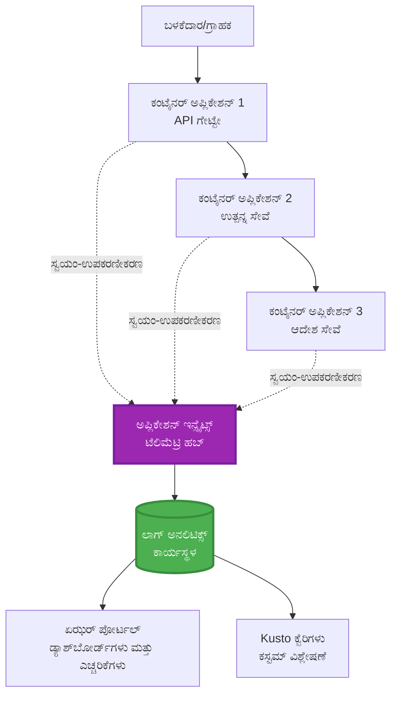
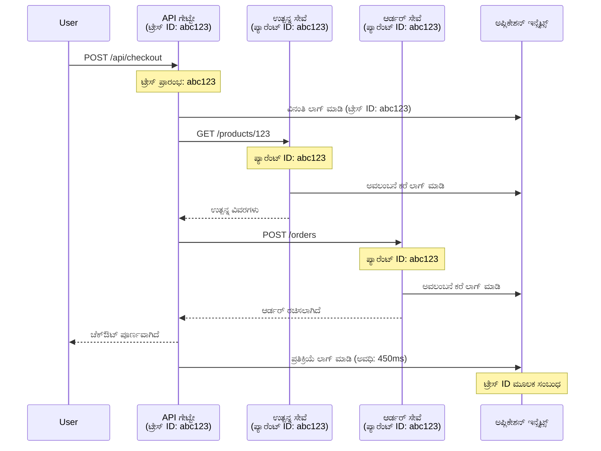

# AZD ಜೊತೆಗೆ Application Insights ಏಕೀಕರಣ

⏱️ **ಅಂದಾಜು ಸಮಯ**: 40-50 ನಿಮಿಷಗಳು | 💰 **ವೆಚ್ಚದ ಪ್ರಭಾವ**: ~$5-15/ತಿಂಗಳು | ⭐ **ಸಂಕೀರ್ಣತೆ**: ಮಧ್ಯಮ

**📚 ಕಲಿಕೆಯ ಮಾರ್ಗ:**
- ← ಹಿಂದಿನ: [ಪ್ರಿಫ್ಲೈಟ್ ತಪಾಸಣೆಗಳು](preflight-checks.md) - ಪ್ರಿ-ಡಿಪ್ಲಾಯ್ಮೆಂಟ್ ಪ್ರಮಾಣೀಕರಣ
- 🎯 **ನೀವು ಇಲ್ಲಿ ಇದ್ದೀರಿ**: Application Insights ಏಕೀಕರಣ (ನಿಗಾ, ಟೆಲಿಮೆಟ್ರಿ, ಡಿಬಗ್)
- → ಮುಂದಿನ: [ಡಿಪ್ಲಾಯ್‌ಮೆಂಟ್ ಗೈಡ್](../chapter-04-infrastructure/deployment-guide.md) - Azure ಗೆ ರವಾನಿಸಿ
- 🏠 [ಕೋರ್ಸ್ ಹೋಮ್](../../README.md)

---

## ನೀವು ಕಲಿಯುವುದೇನು

ಈ ಪಾಠವನ್ನು ಪೂರ್ಣಗೊಳಿಸುವ ಮೂಲಕ, ನೀವು:
- AZD ಪ್ರಾಜೆಕ್ಟ್‌ಗಳಿಗೆ **Application Insights** ಸ್ವಯಂಚಾಲಿತವಾಗಿ ಏಕೀಕರಿಸುವುದು
- ಮೈಕ್ರೋಸರ್ವೀಸ್‌ಗಳಿಗಾಗಿ **ವಿತರಿತ ಟ್ರೇಸಿಂಗ್** ಸಂರಚಿಸುವುದು
- **ಕಸ್ಟಮ್ ಟೆಲಿಮೆಟ್ರಿ** (ಮೆಟ್ರಿಕ್‌ಗಳು, ಇವೆಂಟ್ಸ್, ಡಿಪೆಂಡೆನ್ಸಿಗಳು) ಜಾರಿಗೊಳಿಸುವುದು
- ರಿಯಲ್-ಟೈಮ್ ನಿಗಾವಣಿಗೆ **ಲೈವ್ ಮೆಟ್ರಿಕ್ಸ್** ಸೆಟ್‌ಅಪ್ ಮಾಡುವುದು
- AZD ಡಿಪ್ಲಾಯ್‌ಮೆಂಟ್‌ಗಳಿಂದ **ಅಲರ್ಟ್‌ಗಳು ಮತ್ತು ಡ್ಯಾಶ್‌ಬೋರ್ಡ್** ಸೃಷ್ಟಿಸುವುದು
- **ಟೆಲಿಮೆಟ್ರಿ ಕ್ವೆರಿಗಳಿಂದ** ಪ್ರೊಡಕ್ಷನ್ ಸಮಸ್ಯೆಗಳನ್ನು ಡಿಬಗ್ ಮಾಡುವುದು
- ವೆಚ್ಚ ಮತ್ತು ಸ್ಯಾಂಪ್ಲಿಂಗ್ ತಂತ್ರಗಳನ್ನು ಆప్టಿಮೈಜ್ ಮಾಡುವುದನ್ನು ಕಲಿಯುವುದು
- **AI/LLM ಅಪ್ಲಿಕೇಶನ್‌ಗಳು** (ಟೋಕನ್ಗಳು, ತಡಸಮಯ, ವೆಚ್ಚ) ನಿಗಾವಣೆ ಮಾಡುವುದು

## ಏಕೆ AZD ಜೊತೆಗೆ Application Insights ಮುಖ್ಯ

### ಸವಾಲ್: ಪ್ರೊಡಕ್ಷನ್ ಗ್ರಹಣಶೀಲತೆ

**Application Insights ಇಲ್ಲದೆ:**
```
❌ No visibility into production behavior
❌ Manual log aggregation across services
❌ Reactive debugging (wait for customer complaints)
❌ No performance metrics
❌ Cannot trace requests across services
❌ Unknown failure rates and bottlenecks
```

**Application Insights + AZD ಜೊತೆಗೆ:**
```
✅ Automatic telemetry collection
✅ Centralized logs from all services
✅ Proactive issue detection
✅ End-to-end request tracing
✅ Performance metrics and insights
✅ Real-time dashboards
✅ AZD provisions everything automatically
```

**ಉಪಮೆ**: Application Insights ನಿಮ್ಮ ಅಪ್ಲಿಕೇಶನ್‌ಗೆ "ಬ್ಲಾಕ್ ಬಾಕ್ಸ್" ಫ್ಲೈಟ್ ರೆಕಾರ್ಡರ್ + ಕಾಕ್ಪಿಟ್ ಡ್ಯಾಶ್‌ಬೋರ್ಡ್ ಇದ್ದಂತೆ. ನೀವು ರಿಯಲ್-ಟೈಮ್‌ನಲ್ಲಿ ಏನಾಗುತ್ತಿದೆ ಎಂಬುದನ್ನು ನೋಡಬಹುದು ಮತ್ತು ಯಾವುದೇ ಘಟನೆಯನ್ನು ಮರುನಿರ್ವಹಿಸಬಹುದು.

---

## ವಾಸ್ತುಶಿಲ್ಪ ಅವಲೋಕನ

### AZD ವಾಸ್ತುಶಿಲ್ಪದಲ್ಲಿ Application Insights


### ಸ್ವಯಂಚಾಲಿತವಾಗಿ ಯಾವುದು ನಿಗಾವೆಯಾಗುತ್ತದೆ

| ಟೆಲಿಮೆಟ್ರಿ ಪ್ರಕಾರ | ಇದು ಏನು ಹಿಡಿಯುತ್ತದೆ | ಬಳಕೆಯ ಉದಾಹರಣೆ |
|--------------------|---------------------|-------------------|
| **Requests** | HTTP ವಿನಂತಿಗಳು, ಸ್ಥಿತಿ ಕೋಡ್‌ಗಳು, ಅವಧಿ | API ಕಾರ್ಯಕ್ಷಮತೆ ನಿಗಾವಣೆ |
| **Dependencies** | ಬಾಹ್ಯ ಕರೆಗಳು (DB, APIs, storage) | ಬಾಟ್ಲ್‌ನೇಕ್ ಗುರುತಿಸುವುದು |
| **Exceptions** | ಹ್ಯಾಂಡಲ್ ಆಗದ ದೋಷಗಳು ಮತ್ತು ಸ್ಟಾಕ್ ಟ್ರೇಸ್‌ಗಳು | ವ್ಯತ್ಯಯದ ಡಿಬಗ್ |
| **Custom Events** | ವ್ಯವಹಾರ ಘಟನೆಗಳು (signup, purchase) | ವಿಶ್ಲೇಷಣೆಗಳು ಮತ್ತು ಫನ್ನೆಲ್ಸ್ |
| **Metrics** | ಕಾರ್ಯಕ್ಷಮತೆ ಕೌಂಟರ್‌ಗಳು, ಕಸ್ಟಮ್ ಮೆಟ್ರಿಕ್‌ಗಳು | ಸಾಮರ್ಥ್ಯ ಯೋಜನೆ |
| **Traces** | ಗಂಭೀರತೆಯೊಂದಿಗೆ ಲಾಗ್ ಸಂದೇಶಗಳು | ಡಿಬಗ್ ಮತ್ತು ಆಡಿಟಿಂಗ್ |
| **Availability** | ಅಪ್‌ಟೈಮ್ ಮತ್ತು ಪ್ರತಿಕ್ರಿಯೆ ಸಮಯ ಪರೀಕ್ಷೆಗಳು | SLA ನಿಗಾವಣೆ |

---

## ಪೂರ್ವಾಪೇಕ್ಷಿತಗಳು

### ಅಗತ್ಯ ಸಲಕರಣೆಗಳು

```bash
# Azure Developer CLI ಅನ್ನು ಪರಿಶೀಲಿಸಿ
azd version
# ✅ ನಿರೀಕ್ಷಿತ: azd ಆವೃತ್ತಿ 1.0.0 ಅಥವಾ ಅದಕ್ಕಿಂತ ಹೆಚ್ಚಿನ

# Azure CLI ಅನ್ನು ಪರಿಶೀಲಿಸಿ
az --version
# ✅ ನಿರೀಕ್ಷಿತ: azure-cli 2.50.0 ಅಥವಾ ಅದಕ್ಕಿಂತ ಹೆಚ್ಚಿನ
```

### Azure ಅವಶ್ಯತೆಗಳು

- ಸಕ್ರಿಯ Azure subscription
- ರಚಿಸಲು ಅನುಮತಿಗಳು:
  - Application Insights resources
  - Log Analytics workspaces
  - Container Apps
  - Resource groups

### ಜ্ঞান ಪೂರ್ವಾಪೇಕ್ಷಿತಗಳು

ನೀವು ಪೂರ್ಣಗೊಳಿಸಿರಬೇಕು:
- [AZD Basics](../chapter-01-foundation/azd-basics.md) - ಮುಖ್ಯ AZD ಸಿದ್ಧಾಂತಗಳು
- [Configuration](../chapter-03-configuration/configuration.md) - ಪರಿಸರ ಸೆಟಪ್
- [First Project](../chapter-01-foundation/first-project.md) - ಮೂಲಭೂತ ಡಿಪ್ಲಾಯ್‌ಮೆಂಟ್

---

## ಪಾಠ 1: AZD ಮೂಲಕ ಸ್ವಯಂಚಾಲಿತ Application Insights

### AZD ಹೇಗೆ Application Insights ಒದಗಿಸುತ್ತದೆ

AZD ನೀವು ಡಿಪ್ಲಾಯ್ ಮಾಡಿದಾಗ ಸ್ವಯಂಚಾಲಿತವಾಗಿ Application Insights ಅನ್ನು ರಚಿಸುತ್ತದೆ ಮತ್ತು ರೂಪಗೊಳಿಸುತ್ತದೆ. ಇದು ಹೇಗೆ ಕೆಲಸಮಾಡುತ್ತದೆ ನೋಡೋಣ.

### ಪ್ರಾಜೆಕ್ಟ್ ರಚನೆ

```
monitored-app/
├── azure.yaml                     # AZD configuration
├── infra/
│   ├── main.bicep                # Main infrastructure
│   ├── core/
│   │   └── monitoring.bicep      # Application Insights + Log Analytics
│   └── app/
│       └── api.bicep             # Container App with monitoring
└── src/
    ├── app.py                    # Application with telemetry
    ├── requirements.txt
    └── Dockerfile
```

---

### ಹಂತ 1: AZD ಸಂರಚನೆ (azure.yaml)

**File: `azure.yaml`**

```yaml
name: monitored-app
metadata:
  template: monitored-app@1.0.0

services:
  api:
    project: ./src
    language: python
    host: containerapp

# AZD automatically provisions monitoring!
```

**ಅಷ್ಟೇ!** AZD ಮೂಲಭೂತ ಮಾನಿಟರಿಂಗ್‌ಗೆ ಅಗತ್ಯವಿರುವ Application Insightsನ್ನು ಡೀಫಾಲ್ಟ್ ಆಗಿ ರಚಿಸುತ್ತದೆ. ಮೂಲ ನಿಗಾವಣೆಗೆ ಹೆಚ್ಚುವರಿ ಕಾನ್ಫಿಗರೇಶನ್ ಅಗತ್ಯವಿಲ್ಲ.

---

### ಹಂತ 2: ಮಾನಿಟರಿಂಗ್ ಮೂಲಸೌಕರ್ಯ (Bicep)

**File: `infra/core/monitoring.bicep`**

```bicep
param logAnalyticsName string
param applicationInsightsName string
param location string = resourceGroup().location
param tags object = {}

// Log Analytics Workspace (required for Application Insights)
resource logAnalytics 'Microsoft.OperationalInsights/workspaces@2022-10-01' = {
  name: logAnalyticsName
  location: location
  tags: tags
  properties: {
    sku: {
      name: 'PerGB2018'  // Pay-as-you-go pricing
    }
    retentionInDays: 30  // Keep logs for 30 days
    features: {
      enableLogAccessUsingOnlyResourcePermissions: true
    }
  }
}

// Application Insights
resource applicationInsights 'Microsoft.Insights/components@2020-02-02' = {
  name: applicationInsightsName
  location: location
  tags: tags
  kind: 'web'
  properties: {
    Application_Type: 'web'
    WorkspaceResourceId: logAnalytics.id
    IngestionMode: 'LogAnalytics'
    publicNetworkAccessForIngestion: 'Enabled'
    publicNetworkAccessForQuery: 'Enabled'
  }
}

// Outputs for Container Apps
output logAnalyticsWorkspaceId string = logAnalytics.id
output logAnalyticsWorkspaceName string = logAnalytics.name
output applicationInsightsConnectionString string = applicationInsights.properties.ConnectionString
output applicationInsightsInstrumentationKey string = applicationInsights.properties.InstrumentationKey
output applicationInsightsName string = applicationInsights.name
```

---

### ಹಂತ 3: Container App ಅನ್ನು Application Insights ಗೆ ಸಂಪರ್ಕಿಸಿಡು

**File: `infra/app/api.bicep`**

```bicep
param name string
param location string
param tags object = {}
param containerAppsEnvironmentName string
param applicationInsightsConnectionString string

resource containerApp 'Microsoft.App/containerApps@2023-05-01' = {
  name: name
  location: location
  tags: tags
  properties: {
    configuration: {
      ingress: {
        external: true
        targetPort: 8000
      }
      secrets: [
        {
          name: 'appinsights-connection-string'
          value: applicationInsightsConnectionString
        }
      ]
    }
    template: {
      containers: [
        {
          name: 'api'
          image: 'myregistry.azurecr.io/api:latest'
          resources: {
            cpu: json('0.5')
            memory: '1Gi'
          }
          env: [
            {
              name: 'APPLICATIONINSIGHTS_CONNECTION_STRING'
              secretRef: 'appinsights-connection-string'
            }
            {
              name: 'APPLICATIONINSIGHTS_ENABLED'
              value: 'true'
            }
          ]
        }
      ]
    }
  }
}

output uri string = 'https://${containerApp.properties.configuration.ingress.fqdn}'
```

---

### ಹಂತ 4: ಟೆಲಿಮೆಟ್ರಿ ಜೊತೆಗೆ ಅಪ್ಲಿಕೇಶನ್ ಕೋಡ್

**File: `src/app.py`**

```python
from flask import Flask, request, jsonify
from opencensus.ext.azure.log_exporter import AzureLogHandler
from opencensus.ext.azure.trace_exporter import AzureExporter
from opencensus.ext.flask.flask_middleware import FlaskMiddleware
from opencensus.trace.samplers import ProbabilitySampler
import logging
import os

app = Flask(__name__)

# Application Insights ಕನೆಕ್ಷನ್ ಸ್ಟ್ರಿಂಗ್ ಅನ್ನು ಪಡೆಯಿರಿ
connection_string = os.environ.get('APPLICATIONINSIGHTS_CONNECTION_STRING')

if connection_string:
    # ವಿತರಿತ ಟ್ರೇಸಿಂಗ್ ಅನ್ನು ಸಂರಚಿಸಿ
    middleware = FlaskMiddleware(
        app,
        exporter=AzureExporter(connection_string=connection_string),
        sampler=ProbabilitySampler(rate=1.0)  # ಡೆವ್‌ಗಾಗಿ 100% ಸ್ಯಾಂಪ್ಲಿಂಗ್
    )
    
    # ಲಾಗಿಂಗ್ ಅನ್ನು ಸಂರಚಿಸಿ
    logger = logging.getLogger(__name__)
    logger.addHandler(AzureLogHandler(connection_string=connection_string))
    logger.setLevel(logging.INFO)
    
    print("✅ Application Insights enabled")
else:
    logger = logging.getLogger(__name__)
    logger.setLevel(logging.INFO)
    print("⚠️ Application Insights not configured")

@app.route('/health')
def health():
    logger.info('Health check endpoint called')
    return jsonify({'status': 'healthy', 'monitoring': 'enabled'})

@app.route('/api/products')
def get_products():
    logger.info('Fetching products')
    
    # ಡೇಟಾಬೇಸ್ ಕರೆಯನ್ನು ಅನುಕರಿಸಿ (ಸ್ವಯಂಚಾಲಿತವಾಗಿ ಅವಲಂಬನೆ ಎಂದು ಟ್ರ್ಯಾಕ್ ಆಗುತ್ತದೆ)
    products = [
        {'id': 1, 'name': 'Laptop', 'price': 999.99},
        {'id': 2, 'name': 'Mouse', 'price': 29.99},
        {'id': 3, 'name': 'Keyboard', 'price': 79.99}
    ]
    
    logger.info(f'Returned {len(products)} products')
    return jsonify(products)

@app.route('/api/error-test')
def error_test():
    """Test error tracking"""
    logger.error('Testing error tracking')
    try:
        raise ValueError('This is a test exception')
    except Exception as e:
        logger.exception('Exception occurred in error-test endpoint')
        return jsonify({'error': str(e)}), 500

@app.route('/api/slow')
def slow_endpoint():
    """Test performance tracking"""
    import time
    logger.info('Slow endpoint called')
    time.sleep(3)  # ಮಂದಗತ ಕಾರ್ಯವನ್ನು ಅನುಕರಿಸಿ
    logger.warning('Endpoint took 3 seconds to respond')
    return jsonify({'message': 'Slow operation completed'})

if __name__ == '__main__':
    app.run(host='0.0.0.0', port=8000)
```

**File: `src/requirements.txt`**

```txt
Flask==3.0.0
opencensus-ext-azure==1.1.13
opencensus-ext-flask==0.8.1
gunicorn==21.2.0
```

---

### ಹಂತ 5: ಡಿಪ್ಲಾಯ್ ಮಾಡಿ ಪರಿಶೀಲಿಸಿ

```bash
# AZD ಅನ್ನು ಪ್ರಾರಂಭಿಸಿ
azd init

# ಡಿಪ್ಲಾಯ್ ಮಾಡಿ (Application Insights ಅನ್ನು ಸ್ವಯಂಚಾಲಿತವಾಗಿ ಒದಗಿಸುತ್ತದೆ)
azd up

# ಅಪ್ URL ಪಡೆಯಿರಿ
APP_URL=$(azd env get-values | grep API_URL | cut -d '=' -f2 | tr -d '"')

# ಟೆಲಿಮೆಟ್ರಿ ಉತ್ಪಾದಿಸಿ
curl $APP_URL/health
curl $APP_URL/api/products
curl $APP_URL/api/error-test
curl $APP_URL/api/slow
```

**✅ ನಿರೀಕ್ಷಿತ ಔಟ್‌ಪುಟ್:**
```json
{
  "status": "healthy",
  "monitoring": "enabled"
}
```

---

### ಹಂತ 6: Azure ಪೋರ್‌ಟಲ್‌ನಲ್ಲಿ ಟೆಲಿಮೆಟ್ರಿ ವೀಕ್ಷಿಸಿ

```bash
# Application Insights ವಿವರಗಳನ್ನು ಪಡೆಯಿರಿ
azd env get-values | grep APPLICATIONINSIGHTS

# Azure ಪೋರ್ಟಲ್‌ನಲ್ಲಿ ತೆರೆಯಿರಿ
az monitor app-insights component show \
  --app $(azd env get-values | grep APPLICATIONINSIGHTS_NAME | cut -d '=' -f2 | tr -d '"') \
  --resource-group $(azd env get-values | grep AZURE_RESOURCE_GROUP | cut -d '=' -f2 | tr -d '"') \
  --query "appId" -o tsv
```

**Azure Portal → Application Insights → Transaction Searchಕ್ಕೆ ನ್ಯಾವಿಗೆಟ್ ಮಾಡಿ**

ನೀವು ಕಂಡುಕೊಳ್ಳಬೇಕು:
- ✅ HTTP ವಿನಂತಿಗಳು ಸ್ಥಿತಿ ಕೋಡ್‌ಗಳೊಂದಿಗೆ
- ✅ `/api/slow` ಗಾಗಿ ವಿನಂತಿಯ ಅವಧಿ (3+ ಸೆಕೆಂಡುಗಳು)
- ✅ `/api/error-test` ನಿಂದ ಹೊರಹೊಮ್ಮಿದ Exceptions ವಿವರಗಳು
- ✅ ಕಸ್ಟಮ್ ಲಾಗ್ ಸಂದೇಶಗಳು

---

## ಪಾಠ 2: ಕಸ್ಟಮ್ ಟೆಲಿಮೆಟ್ರಿ ಮತ್ತು ಘಟನೆಗಳು

### ವ್ಯವಹಾರ ಘಟನೆಗಳನ್ನು ಟ್ರ್ಯಾಕ್ ಮಾಡಿ

ವ್ಯವಹಾರ-ಗಣನೀಯ ಘಟನಗಳಿಗೆ ಕಸ್ಟಮ್ ಟೆಲಿಮೆಟ್ರಿ ಸೇರಿಸೋಣ.

**File: `src/telemetry.py`**

```python
from opencensus.ext.azure import metrics_exporter
from opencensus.stats import aggregation as aggregation_module
from opencensus.stats import measure as measure_module
from opencensus.stats import stats as stats_module
from opencensus.stats import view as view_module
from opencensus.tags import tag_map as tag_map_module
from opencensus.ext.azure.log_exporter import AzureLogHandler
from opencensus.ext.azure.trace_exporter import AzureExporter
from opencensus.trace import tracer as tracer_module
import logging
import os

class TelemetryClient:
    """Custom telemetry client for Application Insights"""
    
    def __init__(self, connection_string=None):
        self.connection_string = connection_string or os.environ.get('APPLICATIONINSIGHTS_CONNECTION_STRING')
        
        if not self.connection_string:
            print("⚠️ Application Insights connection string not found")
            return
        
        # ಲಾಗರ್ ಹೊಂದಿಸಿ
        self.logger = logging.getLogger(__name__)
        self.logger.addHandler(AzureLogHandler(connection_string=self.connection_string))
        self.logger.setLevel(logging.INFO)
        
        # ಮೆಟ್ರಿಕ್ ಎಕ್ಸ್ಪೋರ್ಟರ್ ಹೊಂದಿಸಿ
        self.stats = stats_module.stats
        self.view_manager = self.stats.view_manager
        self.stats_recorder = self.stats.stats_recorder
        
        exporter = metrics_exporter.new_metrics_exporter(
            connection_string=self.connection_string
        )
        self.view_manager.register_exporter(exporter)
        
        # ಟ್ರೇಸರ್ ಹೊಂದಿಸಿ
        self.tracer = tracer_module.Tracer(
            exporter=AzureExporter(connection_string=self.connection_string)
        )
        
        print("✅ Custom telemetry client initialized")
    
    def track_event(self, event_name: str, properties: dict = None):
        """Track custom business event"""
        properties = properties or {}
        self.logger.info(
            f"CustomEvent: {event_name}",
            extra={
                'custom_dimensions': {
                    'event_name': event_name,
                    **properties
                }
            }
        )
    
    def track_metric(self, metric_name: str, value: float, properties: dict = None):
        """Track custom metric"""
        properties = properties or {}
        self.logger.info(
            f"CustomMetric: {metric_name} = {value}",
            extra={
                'custom_dimensions': {
                    'metric_name': metric_name,
                    'value': value,
                    **properties
                }
            }
        )
    
    def track_dependency(self, name: str, dependency_type: str, duration: float, success: bool):
        """Track external dependency call"""
        with self.tracer.span(name=name) as span:
            span.add_attribute('dependency.type', dependency_type)
            span.add_attribute('duration', duration)
            span.add_attribute('success', success)

# ಜಾಗತಿಕ ಟೆಲಿಮೆಟ್ರಿ ಕ್ಲೈಂಟ್
telemetry = TelemetryClient()
```

### ಕಸ್ಟಮ್ ಘಟನೆಗಳೊಂದಿಗೆ ಅಪ್ಲಿಕೇಶನ್ ಅನ್ನು ಅಪ್ಡೇಟ್ ಮಾಡಿ

**File: `src/app.py` (ಶಕ್ತಿಮಂತ)**

```python
from flask import Flask, request, jsonify
from telemetry import telemetry
import time
import random

app = Flask(__name__)

@app.route('/api/purchase', methods=['POST'])
def purchase():
    """Track purchase event with custom telemetry"""
    data = request.json
    product_id = data.get('product_id')
    quantity = data.get('quantity', 1)
    price = data.get('price', 0)
    
    # ವ್ಯವಹಾರ ಘಟನೆಯನ್ನು ಟ್ರ್ಯಾಕ್ ಮಾಡಿ
    telemetry.track_event('Purchase', {
        'product_id': product_id,
        'quantity': quantity,
        'total_amount': price * quantity,
        'user_id': request.headers.get('X-User-Id', 'anonymous')
    })
    
    # ಆದಾಯ ಮಾಪಕವನ್ನು ಟ್ರ್ಯಾಕ್ ಮಾಡಿ
    telemetry.track_metric('Revenue', price * quantity, {
        'product_id': product_id,
        'currency': 'USD'
    })
    
    return jsonify({
        'order_id': f'ORD-{random.randint(1000, 9999)}',
        'status': 'confirmed',
        'total': price * quantity
    })

@app.route('/api/search')
def search():
    """Track search queries"""
    query = request.args.get('q', '')
    
    start_time = time.time()
    
    # ಹುಡುಕಾಟವನ್ನು ಅನುಕರಿಸಿ (ನಿಜವಾದ ಡೇಟಾಬೇಸ್ ಕ್ವೆರಿಯಾಗಿರುತ್ತದೆ)
    results = [{'id': 1, 'name': f'Result for {query}'}]
    
    duration = (time.time() - start_time) * 1000  # ms ಗೆ ಪರಿವರ್ತಿಸಿ
    
    # ಹುಡುಕಾಟ ಘಟನೆಯನ್ನು ಟ್ರ್ಯಾಕ್ ಮಾಡಿ
    telemetry.track_event('Search', {
        'query': query,
        'results_count': len(results),
        'duration_ms': duration
    })
    
    # ಹುಡುಕಾಟ ಕಾರ್ಯಕ್ಷಮತಾ ಮಾಪಕವನ್ನು ಟ್ರ್ಯಾಕ್ ಮಾಡಿ
    telemetry.track_metric('SearchDuration', duration, {
        'query_length': len(query)
    })
    
    return jsonify({'results': results, 'count': len(results)})

@app.route('/api/external-call')
def external_call():
    """Track external API dependency"""
    import requests
    
    start_time = time.time()
    success = True
    
    try:
        # ಬಾಹ್ಯ API ಕರೆ ಅನ್ನು ಅನುಕರಿಸಿ
        response = requests.get('https://api.example.com/data', timeout=5)
        result = response.json()
    except Exception as e:
        success = False
        result = {'error': str(e)}
    
    duration = (time.time() - start_time) * 1000
    
    # ನಿರ್ಭರತೆಯನ್ನು ಟ್ರ್ಯಾಕ್ ಮಾಡಿ
    telemetry.track_dependency(
        name='ExternalAPI',
        dependency_type='HTTP',
        duration=duration,
        success=success
    )
    
    return jsonify(result)

if __name__ == '__main__':
    app.run(host='0.0.0.0', port=8000)
```

### ಕಸ್ಟಮ್ ಟೆಲಿಮೆಟ್ರಿಯ ಪರೀಕ್ಷೆ

```bash
# ಖರೀದಿ ಘಟನೆಯನ್ನು ಟ್ರ್ಯಾಕ್ ಮಾಡಿ
curl -X POST $APP_URL/api/purchase \
  -H "Content-Type: application/json" \
  -H "X-User-Id: user123" \
  -d '{"product_id": 1, "quantity": 2, "price": 29.99}'

# ಶೋಧನಾ ಘಟನೆೆಯನ್ನು ಟ್ರ್ಯಾಕ್ ಮಾಡಿ
curl "$APP_URL/api/search?q=laptop"

# ಬಾಹ್ಯ ಅವಲಂಬನೆಯನ್ನು ಟ್ರ್ಯಾಕ್ ಮಾಡಿ
curl $APP_URL/api/external-call
```

**Azure Portal ನಲ್ಲಿ ವೀಕ್ಷಿಸಿ:**

Application Insights → Logsಗೆ ಹೋಗಿ, ನಂತರ ರನ್ ಮಾಡಿ:

```kusto
// View purchase events
traces
| where customDimensions.event_name == "Purchase"
| project 
    timestamp,
    product_id = tostring(customDimensions.product_id),
    total_amount = todouble(customDimensions.total_amount),
    user_id = tostring(customDimensions.user_id)
| order by timestamp desc

// View revenue metrics
traces
| where customDimensions.metric_name == "Revenue"
| summarize TotalRevenue = sum(todouble(customDimensions.value)) by bin(timestamp, 1h)
| render timechart

// View search performance
traces
| where customDimensions.event_name == "Search"
| summarize 
    AvgDuration = avg(todouble(customDimensions.duration_ms)),
    SearchCount = count()
  by bin(timestamp, 5m)
| render timechart
```

---

## ಪಾಠ 3: ಮೈಕ್ರೋಸರ್ವೀಸ್‌ಗಳಿಗೆ ವಿತರಿತ ಟ್ರೇಸಿಂಗ್

### ಕ್ರಾಸ್-ಸರ್ವಿಸ್ ಟ್ರೇಸಿಂಗ್ ಸಕ್ರಿಯಗೊಳಿಸಿ

ಮೈಕ್ರೋಸರ್ವೀಸ್‌ಗಳಿಗೆ, Application Insights ಸ್ವಯಂಚಾಲಿತವಾಗಿ ಸೇವೆಗಳ ಮಧ್ಯೆ ವಿನಂತಿಗಳನ್ನು ಸಮನ್ವಯಗೊಳಿಸುತ್ತದೆ.

**File: `infra/main.bicep`**

```bicep
targetScope = 'subscription'

param environmentName string
param location string = 'eastus'

var tags = { 'azd-env-name': environmentName }

resource rg 'Microsoft.Resources/resourceGroups@2021-04-01' = {
  name: 'rg-${environmentName}'
  location: location
  tags: tags
}

// Monitoring (shared by all services)
module monitoring './core/monitoring.bicep' = {
  name: 'monitoring'
  scope: rg
  params: {
    logAnalyticsName: 'log-${environmentName}'
    applicationInsightsName: 'appi-${environmentName}'
    location: location
    tags: tags
  }
}

// API Gateway
module apiGateway './app/api-gateway.bicep' = {
  name: 'api-gateway'
  scope: rg
  params: {
    name: 'ca-gateway-${environmentName}'
    location: location
    tags: union(tags, { 'azd-service-name': 'gateway' })
    applicationInsightsConnectionString: monitoring.outputs.applicationInsightsConnectionString
  }
}

// Product Service
module productService './app/product-service.bicep' = {
  name: 'product-service'
  scope: rg
  params: {
    name: 'ca-products-${environmentName}'
    location: location
    tags: union(tags, { 'azd-service-name': 'products' })
    applicationInsightsConnectionString: monitoring.outputs.applicationInsightsConnectionString
  }
}

// Order Service
module orderService './app/order-service.bicep' = {
  name: 'order-service'
  scope: rg
  params: {
    name: 'ca-orders-${environmentName}'
    location: location
    tags: union(tags, { 'azd-service-name': 'orders' })
    applicationInsightsConnectionString: monitoring.outputs.applicationInsightsConnectionString
  }
}

output APPLICATIONINSIGHTS_CONNECTION_STRING string = monitoring.outputs.applicationInsightsConnectionString
output GATEWAY_URL string = apiGateway.outputs.uri
```

### ಎಂಡ್-ಟು-ಎಂಡ್ ಟ್ರ್ಯಾನ್ಸಾಕ್ಷನ್ ವೀಕ್ಷಿಸಿ


**ಎಂಡ್-ಟು-ಎಂಡ್ ಟ್ರೇಸ್ ಕ್ವೇರಿ:**

```kusto
// Find complete request flow
let traceId = "abc123...";  // Get from response header
dependencies
| union requests
| where operation_Id == traceId
| project 
    timestamp,
    type = itemType,
    name,
    duration,
    success,
    cloud_RoleName
| order by timestamp asc
```

---

## ಪಾಠ 4: ಲೈವ್ ಮೆಟ್ರಿಕ್ಸ್ ಮತ್ತು ರಿಯಲ್-ಟೈಮ್ ನಿಗಾವಣೆ

### ಲೈವ್ ಮೆಟ್ರಿಕ್ಸ್ ಸ್ಟ್ರೀಮ್ ಸಕ್ರಿಯಗೊಳಿಸಿ

ಲೈವ್ ಮೆಟ್ರಿಕ್ಸ್ <1 ಸೆಕೆಂಡ್ ವಿಳಂಬದೊಂದಿಗೆ ರಿಯಲ್-ಟೈಮ್ ಟೆಲಿಮೆಟ್ರಿ ನೀಡುತ್ತದೆ.

**ಲೈವ್ ಮೆಟ್ರಿಕ್ಸ್‌ಗೆ ಪ್ರವೇಶಿಸಿ:**

```bash
# Application Insights ಸಂಪನ್ಮೂಲವನ್ನು ಪಡೆಯಿರಿ
APPI_NAME=$(azd env get-values | grep APPLICATIONINSIGHTS_NAME | cut -d '=' -f2 | tr -d '"')

# ಸಂಪನ್ಮೂಲ ಗುಂಪು ಪಡೆಯಿರಿ
RG_NAME=$(azd env get-values | grep AZURE_RESOURCE_GROUP | cut -d '=' -f2 | tr -d '"')

echo "Navigate to: Azure Portal → Resource Groups → $RG_NAME → $APPI_NAME → Live Metrics"
```

**ನೀವು ರಿಯಲ್-ಟೈಮ್‌ನಲ್ಲಿ ನೋಡಿ ಬೇಕೆಂಬುದು:**
- ✅ ಇನ್ಕಮಿಂಗ್ ವಿನಂತಿ ದರ (requests/sec)
- ✅ ಔಟ್‌ಗೋಯಿಂಗ್ ಡಿಪೆಂಡೆನ್ಸಿ ಕರೆದ-offs
- ✅ Exception ಎಣಿಕೆ
- ✅ CPU ಮತ್ತು ಮೆಮೊರಿ ಬಳಕೆ
- ✅ ಸಕ್ರಿಯ ಸರ್ವರ್ ಎಣಿಕೆ
- ✅ ಸ್ಯಾಂಪಲ್ ಟೆಲಿಮೆಟ್ರಿ

### ಪರೀಕ್ಷೆಗೆ ಲೋಡ್ ರಚಿಸಿ

```bash
# ಲೈವ್ ಮೆಟ್ರಿಕ್ಸ್ ನೋಡಲು ಲೋಡ್ ಸೃಷ್ಟಿಸಿ
for i in {1..100}; do
  curl $APP_URL/api/products &
  curl $APP_URL/api/search?q=test$i &
done

# Azure ಪೋರ್ಟಲ್‌ನಲ್ಲಿ ಲೈವ್ ಮೆಟ್ರಿಕ್ಸ್ ನೋಡಿ
# ನೀವು ವಿನಂತಿಗಳ ದರದಲ್ಲಿ ತೀವ್ರ ಏರಿಕೆಯನ್ನು ನೋಡಬೇಕು
```

---

## ಪ್ರಾಯೋಗಿಕ ವ್ಯಾಯಾಮಗಳು

### ವ್ಯಾಯಾಮ 1: ಅಲರ್ಟ್‌ಗಳನ್ನು ಸೆಟ್ ಅಪ್ ಮಾಡಿ ⭐⭐ (ಮಧ್ಯಮ)

**ಗೋಲ್**: ಉಚ್ಚ ದೋಷ ದರಗಳು ಮತ್ತು ನಿಧಾನ ಪ್ರತಿಕ್ರಿಯೆಗಳಿಗೆ ಅಲರ್ಟ್‌ಗಳನ್ನು ರಚಿಸಿ.

**ಹಂತಗಳು:**

1. **ದೋಷ ದರಕ್ಕಾಗಿ ಅಲರ್ಟ್ ರಚಿಸಿ:**

```bash
# Application Insights ಸಂಪನ್ಮೂಲದ ID ಅನ್ನು ಪಡೆಯಿರಿ
APPI_ID=$(az monitor app-insights component show \
  --app $APPI_NAME \
  --resource-group $RG_NAME \
  --query "id" -o tsv)

# ವಿಫಲವಾದ ವಿನಂತಿಗಳಿಗಾಗಿ ಮೆಟ್ರಿಕ್ ಎಚ್ಚರಿಕೆ ರಚಿಸಿ
az monitor metrics alert create \
  --name "High-Error-Rate" \
  --resource-group $RG_NAME \
  --scopes $APPI_ID \
  --condition "count requests/failed > 10" \
  --window-size 5m \
  --evaluation-frequency 1m \
  --description "Alert when error rate exceeds 10 per 5 minutes"
```

2. **ನಿಧಾನ ಪ್ರತಿಕ್ರಿಯೆಗಳಿಗೆ ಅಲರ್ಟ್ ರಚಿಸಿ:**

```bash
az monitor metrics alert create \
  --name "Slow-Responses" \
  --resource-group $RG_NAME \
  --scopes $APPI_ID \
  --condition "avg requests/duration > 3000" \
  --window-size 5m \
  --evaluation-frequency 1m \
  --description "Alert when average response time exceeds 3 seconds"
```

3. **Bicep ಮೂಲಕ ಅಲರ್ಟ್ ರಚಿಸಿ (AZD ಗೆ ಪ್ರಾಯೋಢತೆ):**

**File: `infra/core/alerts.bicep`**

```bicep
param applicationInsightsId string
param actionGroupId string = ''
param location string = resourceGroup().location

// High error rate alert
resource errorRateAlert 'Microsoft.Insights/metricAlerts@2018-03-01' = {
  name: 'high-error-rate'
  location: 'global'
  properties: {
    description: 'Alert when error rate exceeds threshold'
    severity: 2
    enabled: true
    scopes: [
      applicationInsightsId
    ]
    evaluationFrequency: 'PT1M'
    windowSize: 'PT5M'
    criteria: {
      'odata.type': 'Microsoft.Azure.Monitor.SingleResourceMultipleMetricCriteria'
      allOf: [
        {
          name: 'Error rate'
          metricName: 'requests/failed'
          operator: 'GreaterThan'
          threshold: 10
          timeAggregation: 'Count'
        }
      ]
    }
    actions: actionGroupId != '' ? [
      {
        actionGroupId: actionGroupId
      }
    ] : []
  }
}

// Slow response alert
resource slowResponseAlert 'Microsoft.Insights/metricAlerts@2018-03-01' = {
  name: 'slow-responses'
  location: 'global'
  properties: {
    description: 'Alert when response time is too high'
    severity: 3
    enabled: true
    scopes: [
      applicationInsightsId
    ]
    evaluationFrequency: 'PT1M'
    windowSize: 'PT5M'
    criteria: {
      'odata.type': 'Microsoft.Azure.Monitor.SingleResourceMultipleMetricCriteria'
      allOf: [
        {
          name: 'Response duration'
          metricName: 'requests/duration'
          operator: 'GreaterThan'
          threshold: 3000
          timeAggregation: 'Average'
        }
      ]
    }
  }
}

output errorAlertId string = errorRateAlert.id
output slowResponseAlertId string = slowResponseAlert.id
```

4. **ಅಲರ್ಟ್‌ಗಳನ್ನು ಪರೀಕ್ಷಿಸಿ:**

```bash
# ದೋಷಗಳನ್ನು ಉಂಟುಮಾಡಿ
for i in {1..20}; do
  curl $APP_URL/api/error-test
done

# मंद ಪ್ರತಿಕ್ರಿಯೆಗಳನ್ನು ಉಂಟುಮಾಡಿ
for i in {1..10}; do
  curl $APP_URL/api/slow
done

# ಅಲರ್ಟ್ ಸ್ಥಿತಿಯನ್ನು ಪರಿಶೀಲಿಸಿ (5-10 ನಿಮಿಷ ಕಾಯಿರಿ)
az monitor metrics alert list \
  --resource-group $RG_NAME \
  --query "[].{Name:name, Enabled:enabled, State:properties.enabled}" \
  --output table
```

**✅ ಯಶಸ್ವಿ ಮಾನದಂಡಗಳು:**
- ✅ ಅಲರ್ಟ್‌ಗಳು ಯಶಸ್ವಿಯಾಗಿ ರಚಿಸಲಾಗಿದೆ
- ✅ ಥ್ರೆಷೋಲ್ ಗಳು ಮೀರುವಾಗ ಅಲರ್ಟ್‌ಗಳು ಫೈರ್ ಆಗುತ್ತವೆ
- ✅ Azure Portal ನಲ್ಲಿ ಅಲರ್ಟ್ ಇತಿಹಾಸ ವೀಕ್ಷಿಸಬಹುದು
- ✅ AZD ಡಿಪ್ಲಾಯ್‌ಮೆಂಟ್‌ಗೆ ಏಕೀಕೃತವಾಗಿದೆ

**ಸಮಯ**: 20-25 ನಿಮಿಷಗಳು

---

### ವ್ಯಾಯಾಮ 2: ಕಸ್ಟಮ್ ಡ್ಯಾಶ್‌ಬೋರ್ಡ್ ರಚಿಸಿ ⭐⭐ (ಮಧ್ಯಮ)

**ಗೋಲ್**: ಪ್ರಮುಖ ಅಪ್ಲಿಕೇಶನ್ ಮೆಟ್ರಿಕ್‌ಗಳನ್ನು ತೋರಿಸುವ ಡ್ಯಾಶ್‌ಬೋರ್ಡ್ ನಿರ್ಮಿಸಿ.

**ಹಂತಗಳು:**

1. **Azure Portal ಮೂಲಕ ಡ್ಯಾಶ್‌ಬೋರ್ಡ್ ರಚಿಸಿ:**

ನ್ಯಾವಿಗೆಟ್ ಮಾಡಿ: Azure Portal → Dashboards → New Dashboard

2. **ಪ್ರಮುಖ ಮೆಟ್ರಿಕ್ ಟೈಲ್‌ಗಳನ್ನು ಸೇರಿಸಿ:**

- ವಿನಂತಿಗಳ ಎಣಿಕೆ (ಕಳೆದ 24 ಗಂಟೆಗಳು)
- ಸರಾಸರಿ ಪ್ರತಿಕ್ರಿಯೆ ಸಮಯ
- ದೋಷ ದರ
- ಟಾಪ್ 5 ನಿಧಾನ ಆಪರೇಷನ್ಗಳು
- ಬಳಕೆದಾರರ ಭೌಗೋಳಿಕ ವಿತರಣೆ

3. **Bicep ಮೂಲಕ ಡ್ಯಾಶ್‌ಬೋರ್ಡ್ ರಚಿಸಿ:**

**File: `infra/core/dashboard.bicep`**

```bicep
param dashboardName string
param applicationInsightsId string
param location string = resourceGroup().location

resource dashboard 'Microsoft.Portal/dashboards@2020-09-01-preview' = {
  name: dashboardName
  location: location
  properties: {
    lenses: [
      {
        order: 0
        parts: [
          // Request count
          {
            position: { x: 0, y: 0, rowSpan: 4, colSpan: 6 }
            metadata: {
              type: 'Extension/Microsoft_OperationsManagementSuite_Workspace/PartType/LogsDashboardPart'
              inputs: [
                {
                  name: 'resourceId'
                  value: applicationInsightsId
                }
                {
                  name: 'query'
                  value: '''
                    requests
                    | summarize RequestCount = count() by bin(timestamp, 1h)
                    | render timechart
                  '''
                }
              ]
            }
          }
          // Error rate
          {
            position: { x: 6, y: 0, rowSpan: 4, colSpan: 6 }
            metadata: {
              type: 'Extension/Microsoft_OperationsManagementSuite_Workspace/PartType/LogsDashboardPart'
              inputs: [
                {
                  name: 'resourceId'
                  value: applicationInsightsId
                }
                {
                  name: 'query'
                  value: '''
                    requests
                    | summarize 
                        Total = count(),
                        Failed = countif(success == false)
                    | extend ErrorRate = (Failed * 100.0) / Total
                    | project ErrorRate
                  '''
                }
              ]
            }
          }
        ]
      }
    ]
  }
}

output dashboardId string = dashboard.id
```

4. **ಡಿಪ್ಲಾಯ್ ಮಾಡಿ:**

```bash
# main.bicep ಗೆ ಸೇರಿಸಿ
module dashboard './core/dashboard.bicep' = {
  name: 'dashboard'
  scope: rg
  params: {
    dashboardName: 'dashboard-${environmentName}'
    applicationInsightsId: monitoring.outputs.applicationInsightsId
    location: location
  }
}

# ನಿಯೋಜಿಸಿ
azd up
```

**✅ ಯಶಸ್ವಿ ಮಾನದಂಡಗಳು:**
- ✅ ಡ್ಯಾಶ್‌ಬೋರ್ಡ್ ಪ್ರಮುಖ ಮೆಟ್ರಿಕ್‌ಗಳನ್ನು ಪ್ರದರ್ಶಿಸುತ್ತದೆ
- ✅ Azure Portal ಮನೆಗೆ ಪಿನ್ ಮಾಡಬಹುದು
- ✅ ರಿಯಲ್-ಟೈಮ್‌ನಲ್ಲಿ ಅಪ್ಡೇಟ್ ಆಗುತ್ತದೆ
- ✅ AZD ಮೂಲಕ ಡಿಪ್ಲಾಯ್ ಮಾಡಲು ಸಾಧ್ಯ

**ಸಮಯ**: 25-30 ನಿಮಿಷಗಳು

---

### ವ್ಯಾಯಾಮ 3: AI/LLM ಅಪ್ಲಿಕೇಶನ್ ನಿಗಾವಣೆ ⭐⭐⭐ (ಅ್ಯಡ್ವಾನ್ಸ್ಡ್)

**ಗೋಲ್**: Azure OpenAI ಬಳಕೆಯನ್ನು ಟ್ರ್ಯಾಕ್ ಮಾಡಿ (ಟೋಕನ್ಗಳು, ವೆಚ್ಚ, ತಡಸಮಯ).

**ಹಂತಗಳು:**

1. **AI ನಿಗಾವಿಗಾಗಿ ರ್ಯಾಪರ್ ರಚಿಸಿ:**

**File: `src/ai_telemetry.py`**

```python
from telemetry import telemetry
from openai import AzureOpenAI
import time

class MonitoredAzureOpenAI:
    """Azure OpenAI client with automatic telemetry"""
    
    def __init__(self, api_key, endpoint, api_version="2024-02-01"):
        self.client = AzureOpenAI(
            api_key=api_key,
            api_version=api_version,
            azure_endpoint=endpoint
        )
    
    def chat_completion(self, model: str, messages: list, **kwargs):
        """Track chat completion with telemetry"""
        start_time = time.time()
        
        try:
            # Azure OpenAI ಅನ್ನು ಕರೆಮಾಡಿ
            response = self.client.chat.completions.create(
                model=model,
                messages=messages,
                **kwargs
            )
            
            duration = (time.time() - start_time) * 1000  # ಮಿಲಿಸೆಕೆಂಡುಗಳು
            
            # ಬಳಕೆಯನ್ನು ಹೊರತೆಗೆಯಿರಿ
            usage = response.usage
            prompt_tokens = usage.prompt_tokens
            completion_tokens = usage.completion_tokens
            total_tokens = usage.total_tokens
            
            # ಖರ್ಚನ್ನು ಲೆಕ್ಕಿಸಿ (GPT-4 ಬೆಲೆ)
            prompt_cost = (prompt_tokens / 1000) * 0.03  # $0.03 ಪ್ರತಿ 1K ಟೋಕನ್ಗಳಿಗೆ
            completion_cost = (completion_tokens / 1000) * 0.06  # $0.06 ಪ್ರತಿ 1K ಟೋಕನ್ಗಳಿಗೆ
            total_cost = prompt_cost + completion_cost
            
            # ಕಸ್ಟಮ್ ಘಟನೆಯನ್ನು ಟ್ರ್ಯಾಕ್ ಮಾಡಿ
            telemetry.track_event('OpenAI_Request', {
                'model': model,
                'prompt_tokens': prompt_tokens,
                'completion_tokens': completion_tokens,
                'total_tokens': total_tokens,
                'duration_ms': duration,
                'cost_usd': total_cost,
                'success': True
            })
            
            # ಮೆಟ್ರಿಕ್‌ಗಳನ್ನು ಟ್ರ್ಯಾಕ್ ಮಾಡಿ
            telemetry.track_metric('OpenAI_Tokens', total_tokens, {
                'model': model,
                'type': 'total'
            })
            
            telemetry.track_metric('OpenAI_Cost', total_cost, {
                'model': model,
                'currency': 'USD'
            })
            
            telemetry.track_metric('OpenAI_Duration', duration, {
                'model': model
            })
            
            return response
            
        except Exception as e:
            duration = (time.time() - start_time) * 1000
            
            telemetry.track_event('OpenAI_Request', {
                'model': model,
                'duration_ms': duration,
                'success': False,
                'error': str(e)
            })
            
            raise
```

2. **ನಿಗಾವಾದ ಕ್ಲೈಂಟ್ ಬಳಸಿ:**

```python
from flask import Flask, request, jsonify
from ai_telemetry import MonitoredAzureOpenAI
import os

app = Flask(__name__)

# ನಿಗಾ ನಡೆಸಲಾಗುತ್ತಿರುವ OpenAI ಕ್ಲೈಂಟ್ ಅನ್ನು ಪ್ರಾರಂಭಿಸಿ
openai_client = MonitoredAzureOpenAI(
    api_key=os.environ['AZURE_OPENAI_API_KEY'],
    endpoint=os.environ['AZURE_OPENAI_ENDPOINT']
)

@app.route('/api/chat', methods=['POST'])
def chat():
    data = request.json
    user_message = data.get('message')
    
    # ಸ್ವಯಂಚಾಲಿತ ವೀಕ್ಷಣೆಯೊಂದಿಗೆ ಕರೆ ಮಾಡಿ
    response = openai_client.chat_completion(
        model='gpt-4',
        messages=[
            {'role': 'user', 'content': user_message}
        ]
    )
    
    return jsonify({
        'response': response.choices[0].message.content,
        'tokens': response.usage.total_tokens
    })
```

3. **AI ಮೆಟ್ರಿಕ್‌ಗಳನ್ನು ಕ್ವೇರಿ ಮಾಡಿ:**

```kusto
// Total AI spend over time
traces
| where customDimensions.event_name == "OpenAI_Request"
| where customDimensions.success == "True"
| summarize TotalCost = sum(todouble(customDimensions.cost_usd)) by bin(timestamp, 1h)
| render timechart

// Token usage by model
traces
| where customDimensions.event_name == "OpenAI_Request"
| summarize 
    TotalTokens = sum(toint(customDimensions.total_tokens)),
    RequestCount = count()
  by Model = tostring(customDimensions.model)

// Average latency
traces
| where customDimensions.event_name == "OpenAI_Request"
| summarize AvgDuration = avg(todouble(customDimensions.duration_ms))
| project AvgDurationSeconds = AvgDuration / 1000

// Cost per request
traces
| where customDimensions.event_name == "OpenAI_Request"
| extend Cost = todouble(customDimensions.cost_usd)
| summarize 
    TotalCost = sum(Cost),
    RequestCount = count(),
    AvgCostPerRequest = avg(Cost)
```

**✅ ಯಶಸ್ವಿ ಮಾನದಂಡಗಳು:**
- ✅ ಪ್ರತಿಯೊಂದು OpenAI ಕರೆ ಸ್ವಯಂಚಾಲಿತವಾಗಿ ಟ್ರ್ಯಾಕ್ ಆಗುತ್ತದೆ
- ✅ ಟೋಕನ್ ಬಳಕೆ ಮತ್ತು ವೆಚ್ಚвид قابل دید
- ✅ ತಡಸಮಯ ನಿಗಾವೆಯಾಗುತ್ತದೆ
- ✅ ಬಜೆಟ್ ಅಲರ್ಟ್‌ಗಳನ್ನು ಸೆಟ್ ಮಾಡಬಹುದು

**ಸಮಯ**: 35-45 ನಿಮಿಷಗಳು

---

## ವೆಚ್ಚ ಆప్టಿಮೈಜೆಷನ್

### ಸ್ಯಾಂಪ್ಲಿಂಗ್ ತಂತ್ರಗಳು

ಟೆಲಿಮೆಟ್ರಿ ಸ್ಯಾಂಪ್ಲಿಂಗ್ ಮೂಲಕ ವೆಚ್ಚ ನಿಯಂತ್ರಣ ಮಾಡಿ:

```python
from opencensus.trace.samplers import ProbabilitySampler

# ಅಭಿವೃದ್ಧಿ: 100% ಮಾದರಿ ಸಂಗ್ರಹಣೆ
sampler = ProbabilitySampler(rate=1.0)

# ಉತ್ಪಾದನೆ: 10% ಮಾದರಿ ಸಂಗ್ರಹಣೆ (ಖರ್ಚುಗಳನ್ನು 90% ಕಡಿಮೆ ಮಾಡುತ್ತದೆ)
sampler = ProbabilitySampler(rate=0.1)

# ಅನುಕೂಲಿತ ಮಾದರಿ ಸಂಗ್ರಹಣೆ (ಸ್ವಯಂಚಾಲಿತವಾಗಿ ಹೊಂದಿಕೊಳ್ಳುತ್ತದೆ)
from opencensus.trace.samplers import AdaptiveSampler
sampler = AdaptiveSampler()
```

**Bicep ನಲ್ಲಿ:**

```bicep
resource applicationInsights 'Microsoft.Insights/components@2020-02-02' = {
  name: applicationInsightsName
  properties: {
    SamplingPercentage: 10  // 10% sampling
  }
}
```

### ಡೇಟಾ ಸಂಗ್ರಹಕಾಲ

```bicep
resource logAnalytics 'Microsoft.OperationalInsights/workspaces@2022-10-01' = {
  name: logAnalyticsName
  properties: {
    retentionInDays: 30  // Minimum (cheapest)
    // Options: 30, 31, 60, 90, 120, 180, 270, 365, 550, 730
  }
}
```

### ಮಾಸಿಕ ವೆಚ್ಚದ ಅಂದಾಜುಗಳು

| ಡೇಟಾ ಪ್ರಮಾಣ | ಉಳಿಸುವ ಅವಧಿ | ಮಾಸಿಕ ವೆಚ್ಚ |
|-------------|--------------|------------|
| 1 GB/month | 30 days | ~$2-5 |
| 5 GB/month | 30 days | ~$10-15 |
| 10 GB/month | 90 days | ~$25-40 |
| 50 GB/month | 90 days | ~$100-150 |

**ಉಚಿತ ಟಿಯರ್**: 5 GB/month ಸೇರಿದೆ

---

## ಜ್ಞಾನ ಪರಿಶೀಲನೆ

### 1. ಮೂಲಭೂತ ಏಕೀಕರಣ ✓

ನಿಮ್ಮ ಅರ್ಥವನ್ನು ಪರೀಕ್ಷಿಸಿ:

- [ ] **Q1**: AZD ಹೇಗೆ Application Insights ಅನ್ನು ಒದಗಿಸುತ್ತದೆ?
  - **A**: `infra/core/monitoring.bicep` ನಲ್ಲಿ Bicep ಟೆಂಪ್ಲೇಟ್ಗಳ ಮೂಲಕ ಸ್ವಯಂಚಾಲಿತವಾಗಿ

- [ ] **Q2**: ಯಾವ ಪರಿಸರ ನಿಯತಾಂಕ Application Insights ಅನ್ನು ಸಕ್ರಿಯಗೊಳಿಸುತ್ತದೆ?
  - **A**: `APPLICATIONINSIGHTS_CONNECTION_STRING`

- [ ] **Q3**: ಮೂರು ಪ್ರಮುಖ ಟೆಲಿಮೆಟ್ರಿ ಪ್ರಕಾರ ಯಾವವು?
  - **A**: Requests (HTTP ಕರೆಗಳು), Dependencies (ಬಾಹ್ಯ ಕರೆಗಳು), Exceptions (ದೋಷಗಳು)

**Hands-On Verification:**
```bash
# Application Insights ಸಂರಚಿಸಲಾಗಿದೆ ಎಂದು ಪರಿಶೀಲಿಸಿ
azd env get-values | grep APPLICATIONINSIGHTS

# ಟೆಲಿಮೆಟ್ರಿ ಹರಿಯುತ್ತಿದೆ ಎಂದು ಪರಿಶೀಲಿಸಿ
az monitor app-insights metrics show \
  --app $APPI_NAME \
  --resource-group $RG_NAME \
  --metric "requests/count"
```

---

### 2. ಕಸ್ಟಮ್ ಟೆಲಿಮೆಟ್ರಿ ✓

ನಿಮ್ಮ ಅರ್ಥವನ್ನು ಪರೀಕ್ಷಿಸಿ:

- [ ] **Q1**: ನೀವು ಕಸ್ಟಮ್ ವ್ಯವಹಾರ ಘಟನೆಗಳನ್ನು ಹೇಗೆ ಟ್ರ್ಯಾಕ್ ಮಾಡುತ್ತೀರಿ?
  - **A**: `custom_dimensions` ಜೊತೆ ಲಾಗರ್ ಬಳಸುವುದು ಅಥವಾ `TelemetryClient.track_event()` ಬಳಸುವುದು

- [ ] **Q2**: ಇವೆಂಟ್ಸ್ ಮತ್ತು ಮೆಟ್ರಿಕ್‌ಗಳ ನಡುವಿನ ವ್ಯತ್ಯಾಸ ಏನು?
  - **A**: ಇವೆಂಟ್ಸ್ ವಿಭಿನ್ನ ಘಟನೆಗಳಾಗಿವೆ, ಮೆಟ್ರಿಕ್‌ಗಳು ಸಂಖ್ಯಾತ್ಮಕ ಉಪస్థಾಪನೆಗಳು

- [ ] **Q3**: ಸೇವೆಗಳ ನಡುವೆ ಟೆಲಿಮೆಟ್ರಿಯನ್ನು ಹೇಗೆ ಸಂಪರ್ಕಿಸಲಾಗುತ್ತದೆ?
  - **A**: Application Insights ಸ್ವಯಂಚಾಲಿತವಾಗಿ `operation_Id` ಅನ್ನು ಸಮನ್ವಯಕ್ಕಾಗಿ ಬಳಸುತ್ತದೆ

**Hands-On Verification:**
```kusto
// Verify custom events
traces
| where customDimensions.event_name != ""
| summarize count() by tostring(customDimensions.event_name)
```

---

### 3. ಪ್ರೊಡಕ್ಷನ್ ನಿಗಾವಣೆ ✓

ನಿಮ್ಮ ಅರ್ಥವನ್ನು ಪರೀಕ್ಷಿಸಿ:

- [ ] **Q1**: ಸ್ಯಾಂಪ್ಲಿಂಗ್ ಎಂದರೇನು ಮತ್ತು ಇದನ್ನು ಯಾಕೆ ಬಳಸುಕು?
  - **A**: ಸ್ಯಾಂಪ್ಲಿಂಗ್ ಡೇಟಾ ಪ್ರಮಾಣ (ಮತ್ತು ವೆಚ್ಚ) ಕಡಿಮೆ ಮಾಡುತ್ತದೆ ಮೂಲಕ ಮಾತ್ರ ಶೇಕಡಾವಾರು ಟೆಲಿಮೆಟ್ರಿಯನ್ನು ಕ್ಯಾಪ್ಚರ್ ಮಾಡುವುದು

- [ ] **Q2**: ಅಲರ್ಟ್‌ಗಳನ್ನು ನೀವು ಹೇಗೆ ಸೆಟ್ ಅಪ್ ಮಾಡುತ್ತೀರಿ?
  - **A**: Application Insights ಮೆಟ್ರಿಕ್‌ಗಳ ಆಧಾರದ ಮೇಲೆ Bicep ಅಥವಾ Azure Portal ನಲ್ಲಿ ಮೆಟ್ರಿಕ್ ಅಲರ್ಟ್‌ಗಳನ್ನು ಬಳಸಿ

- [ ] **Q3**: Log Analytics ಮತ್ತು Application Insights ನಡುವೆ ವ್ಯತ್ಯಾಸವೇನು?
  - **A**: Application Insights ಡೇಟಾವನ್ನು Log Analytics ವರ್ಕ್‌ಸ್ಪೇಸ್‌ನಲ್ಲಿ ಸಂಗ್ರಹಿಸುತ್ತದೆ; App Insights ಅಪ್ಲಿಕೇಶನ್-ನಿರ್ದಿಷ್ಟ ವೀಕ್ಷಣೆಗಳನ್ನು ಒದಗಿಸುತ್ತದೆ

**Hands-On Verification:**
```bash
# ಸ್ಯಾಂಪ್ಲಿಂಗ್ ಸಂರಚನೆಯನ್ನು ಪರಿಶೀಲಿಸಿ
az monitor app-insights component show \
  --app $APPI_NAME \
  --resource-group $RG_NAME \
  --query "properties.SamplingPercentage"
```

---

## ಉತ್ತಮ ಅಭ್ಯಾಸಗಳು

### ✅ ಮಾಡಬೇಕು:

1. **ಸಹಸಂಬಂಧ IDಗಳನ್ನು ಬಳಸಿ**
   ```python
   logger.info('Processing order', extra={
       'custom_dimensions': {
           'order_id': order_id,
           'user_id': user_id
       }
   })
   ```

2. **ಗಂಭೀರ ಮೆಟ್ರಿಕ್‌ಗಳಿಗೆ ಅಲರ್ಟ್‌ಗಳನ್ನು ಸೆಟ್ ಮಾಡಿ**
   ```bicep
   // Error rate, slow responses, availability
   ```

3. **ಸಂರಚಿತ ಲಾಗಿಂಗ್ ಬಳಸಿ**
   ```python
   # ✅ ಉತ್ತಮ: ಸಂರಚಿತ
   logger.info('User signup', extra={'custom_dimensions': {'user_id': 123}})
   
   # ❌ ಕೆಟ್ಟ: ಅಸಂರಚಿತ
   logger.info(f'User 123 signed up')
   ```

4. **ಡಿಪೆಂಡೆನ್ಸಿಗಳನ್ನು ನಿಗಾವಿಟ್ಟಿಕೊಳ್ಳಿ**
   ```python
   # ಸ್ವಯಂಚಾಲಿತವಾಗಿ ಡೇಟಾಬೇಸ್ ಕರೆಗಳು, HTTP ವಿನಂತಿಗಳು ಮತ್ತು ಇತ್ಯಾದಿಗಳನ್ನು ಟ್ರ್ಯಾಕ್ ಮಾಡಿ.
   ```

5. **ಡಿಪ್ಲಾಯ್‌ಮೆಂಟ್‌ಗಳ ಸಮಯದಲ್ಲಿ Live Metrics ಬಳಸಿ**

### ❌ ಮಾಡಬೇಡಿ:

1. **ಸಂವೇದನಶೀಲ ಡೇಟಾವನ್ನು ಲಾಗ್ ಮಾಡಬೇಡಿ**
   ```python
   # ❌ ಕೆಟ್ಟ
   logger.info(f'Login: {username}:{password}')
   
   # ✅ ಒಳ್ಳೆಯ
   logger.info('Login attempt', extra={'custom_dimensions': {'username': username}})
   ```

2. **ಪ್ರೊಡಕ್ಷನ್‌ನಲ್ಲಿ 100% ಸ್ಯಾಂಪ್ಲಿಂಗ್ ಬಳಸಬೇಡಿ**
   ```python
   # ❌ ದುಬಾರಿ
   sampler = ProbabilitySampler(rate=1.0)
   
   # ✅ ಕಿಫಾಯತಿ
   sampler = ProbabilitySampler(rate=0.1)
   ```

3. **ಡೆಡ್ ಲೆಟರ್ ಕ್ಯೂಗಳನ್ನು ನಿರ್ಲಕ್ಷಿಸಬೇಡಿ**

4. **ಡೇಟಾ ಉಳಿಸುವ ಪರಿಮಿತಿಗಳನ್ನು ಸೆಟ್ ಮಾಡುವುದು ಮರೆತೊಡಬೇಡಿ**

---

## ತೊಂದರೆ ಪರಿಹಾರ

### ಸಮಸ್ಯೆ: ಟೆಲಿಮೆಟ್ರಿ ಕಾಣಿಸುತ್ತಿಲ್ಲ

**ರೋಗನಿರ್ಣಯ:**
```bash
# ಕನೆಕ್ಷನ್ ಸ್ಟ್ರಿಂಗ್ ಸೆಟ್ ಆಗಿದೆಯೇ ಎಂದು ಪರಿಶೀಲಿಸಿ
azd env get-values | grep APPLICATIONINSIGHTS

# Azure Monitor ಮೂಲಕ ಅಪ್ಲಿಕೇಶನ್ ಲಾಗ್‌ಗಳನ್ನು ಪರಿಶೀಲಿಸಿ
azd monitor --logs

# ಅഥವಾ Container Apps ಗಾಗಿ Azure CLI ಅನ್ನು ಬಳಸಿ:
az containerapp logs show --name $APP_NAME --resource-group $RG_NAME --tail 50
```

**ಉಪಾಯ:**
```bash
# ಕಂಟೈನರ್ ಅಪ್ಲಿಕೇಶನ್‌ನಲ್ಲಿ ಕನೆಕ್ಷನ್ ಸ್ಟ್ರಿಂಗ್ ಪರಿಶೀಲಿಸಿ
az containerapp show \
  --name $APP_NAME \
  --resource-group $RG_NAME \
  --query "properties.template.containers[0].env" \
  | grep -i applicationinsights
```

---

### ಸಮಸ್ಯೆ: ಹೆಚ್ಚಿನ ವೆಚ್ಚ

**ರೋಗನಿರ್ಣಯ:**
```bash
# ಡೇಟಾ ಆಮದು ಪರಿಶೀಲಿಸಿ
az monitor app-insights metrics show \
  --app $APPI_NAME \
  --resource-group $RG_NAME \
  --metric "availabilityResults/count"
```

**ಉಪಾಯ:**
- ಸ್ಯಾಂಪ್ಲಿಂಗ್ ದರವನ್ನು ಕಡಿಮೆ ಮಾಡಿ
- ಉಳಿಸುವ ಅವಧಿಯನ್ನು ಕಡಿಮೆ ಮಾಡಿ
-Verbose ಲಾಗಿಂಗ್ ಅನ್ನು ತೆಗೆದುಹಾಕಿ

---

## ಹೆಚ್ಚಿನ ಮಾಹಿತಿಗೆ

### ಅಧಿಕೃತ ಡಾಕ್ಯುಮೆಂಟೇಷನ್
- [Application Insights Overview](https://learn.microsoft.com/azure/azure-monitor/app/app-insights-overview)
- [Application Insights for Python](https://learn.microsoft.com/azure/azure-monitor/app/opencensus-python)
- [Kusto Query Language](https://learn.microsoft.com/azure/data-explorer/kusto/query/)
- [AZD Monitoring](https://learn.microsoft.com/azure/developer/azure-developer-cli/monitor-your-app)

### ಈ ಕೋರ್ಸ್‌ನ ಮುಂದಿನ ಹಂತಗಳು
- ← ಹಿಂದಿನ: [ಪ್ರಿಫ್ಲೈಟ್ ತಪಾಸಣೆಗಳು](preflight-checks.md)
- → ಮುಂದಿನ: [ಡಿಪ್ಲಾಯ್‌ಮೆಂಟ್ ಗೈಡ್](../chapter-04-infrastructure/deployment-guide.md)
- 🏠 [ಕೋರ್ಸ್ ಹೋಮ್](../../README.md)

### ಸಂಬಂಧಿತ ಉದಾಹರಣೆಗಳು
- [Azure OpenAI Example](../../../../examples/azure-openai-chat) - AI ಟೆಲಿಮೆಟ್ರಿ
- [Microservices Example](../../../../examples/microservices) - ವಿತರಿತ ಟ್ರೇಸಿಂಗ್

---

## ಸಾರಾಂಶ

**ನೀವು ಕಲಿತದ್ದೇನು:**
- ✅ AZD ಜೊತೆ Application Insights ಸ್ವಯಂಚಾಲಿತ ಪ್ರೊವಿಷನಿಂಗ್
- ✅ ಕಸ್ಟಮ್ ಟೆಲಿಮೆಟ್ರಿ (ಇವೆಂಟ್ಸ್, ಮೆಟ್ರಿಕ್‌ಗಳು, ಡಿಪೆಂಡೆನ್ಸಿಗಳು)
- ✅ ಮೈಕ್ರೋಸರ್ವೀಸ್‌ಗಳಲ್ಲಿ ವಿತರಿತ ಟ್ರೇಸಿಂಗ್
- ✅ ಲೈವ್ ಮೆಟ್ರಿಕ್ಸ್ ಮತ್ತು ರಿಯಲ್-ಟೈಮ್ ಮಾನಿಟರಿಂಗ್
- ✅ ಎಚ್ಚರಿಕೆಗಳು ಮತ್ತು ಡ್ಯಾಶ್‌ಬೋರ್ಡ್ಗಳು
- ✅ AI/LLM ಅಪ್ಲಿಕೇಶನ್‌ಗಳ ಮಾನಿಟರಿಂಗ್
- ✅ ವೆಚ್ಚದ ಆಪ್ಟಿಮೈಜೆಶನ್ ತಂತ್ರಗಳು

**ಮುಖ್ಯ ಅಂಶಗಳು:**
1. **AZD ಸ್ವಯಂಚಾಲಿತವಾಗಿ ಮಾನಿಟರಿಂಗ್ ಒದಗಿಸುತ್ತದೆ** - ಕೈಯಿಂದ ಯಾವುದೇ ಸೆಟ್‌ಅಪ್ ಅಗತ್ಯವಿಲ್ಲ
2. **ಸಂರಚಿತ ಲಾಗಿಂಗ್ ಬಳಸಿ** - ಕ್ವೆರಿಗೆಗಳನ್ನು ಸುಲಭಗೊಳಿಸುತ್ತದೆ
3. **ವ್ಯವಹಾರ ಘಟನೆಗಳನ್ನು ಟ್ರ್ಯಾಕ್ ಮಾಡಿ** - ಕೇವಲ ತಾಂತ್ರಿಕ ಮೆಟ್ರಿಕ್‌ಗಳೇ ಅಲ್ಲ
4. **AI ವೆಚ್ಚಗಳನ್ನು ಮಾನಿಟರ್ ಮಾಡಿ** - ಟೋಕನ್‌ಗಳು ಮತ್ತು ಖರ್ಚುಗಳನ್ನು ಟ್ರ್ಯಾಕ್ ಮಾಡಿ
5. **ಎಚ್ಚರಿಕೆಗಳನ್ನು ಹೊಂದಿಸಿ** - ಪ್ರತಿಕ್ರಿಯಾತ್ಮಕವಾಗದೆ ಮುಂಚಿತ ಕ್ರಮ ಕೈಗೊಳ್ಳಿ
6. **ವೆಚ್ಚಗಳನ್ನು ಆಪ್ಟಿಮೈಸ್ ಮಾಡಿ** - ಸ್ಯಾಂಪ್ಲಿಂಗ್ ಮತ್ತು ರಿಟೆನ್ಶನ್ ಮಿತಿಗಳನ್ನು ಬಳಸಿ

**ಮುಂದಿನ ಹಂತಗಳು:**
1. ಪ್ರಾಯೋಗಿಕ ಅಭ್ಯಾಸಗಳನ್ನು ಪೂರ್ಣಗೊಳಿಸಿ
2. ನಿಮ್ಮ AZD ಪ್ರಾಜೆಕ್ಟ್‌ಗಳಿಗೆ Application Insights ಅನ್ನು ಸೇರಿಸಿ
3. ನಿಮ್ಮ ತಂಡಕ್ಕಾಗಿ ಕಸ್ಟಮ್ ಡ್ಯಾಶ್‌ಬೋರ್ಡ್‌ಗಳನ್ನು ರಚಿಸಿ
4. ಕಲಿಯಿರಿ [ಡಿಪ್ಲಾಯ್‌ಮೆಂಟ್ ಗೈಡ್](../chapter-04-infrastructure/deployment-guide.md)

---

<!-- CO-OP TRANSLATOR DISCLAIMER START -->
ಜವಾಬ್ದಾರಿ ನಿರാകರಣೆ:
ಈ ದಾಖಲೆವನ್ನು ಕೃತಕ ಬುದ್ಧಿಮತ್ತೆ ಆಧಾರಿತ ತರ್ಜುಮಾ ಸೇವೆ [Co-op Translator](https://github.com/Azure/co-op-translator) ಬಳಸಿ ಅನುವಾದಿಸಲಾಗಿದೆ. ನಾವು ಶುದ್ಧತೆಗೆ ಪ್ರಯತ್ನಿಸುತ್ತಿದ್ದರೂ ಸಹ, ಸ್ವಯಂಚಾಲಿತ ಅನುವಾದಗಳಲ್ಲಿ ದೋಷಗಳು ಅಥವಾ ಅಸತ್ಯತೆಗಳು ಇರಬಹುದು ಎಂಬುದನ್ನು ದಯವಿಟ್ಟು ಗಮನದಲ್ಲಿರಿಸಿಕೊಳ್ಳಿ. ಮೂಲ ಭಾಷೆಯಲ್ಲಿನ ಮೂಲ ದಾಖಲೆ ಅನ್ನು ಅಧಿಕೃತ ಮೂಲವೆಂದು ಪರಿಗಣಿಸಬೇಕು. ಅತ್ಯಂತ ಮುಖ್ಯವಾದ ಮಾಹಿತಿಗಾಗಿ ವೃತ್ತಿಪರ ಮಾನವ ತರ್ಜುಮೆಯನ್ನು ಶಿಫಾರಸು ಮಾಡಲಾಗುತ್ತದೆ. ಈ ಅನುವಾದದ ಬಳಕೆಯಿಂದ ಉಂಟಾಗುವ ಯಾವುದೇ ತಪ್ಪು ಅರ್ಥಗತಿಕೆಗಳು ಅಥವಾ ದುರವ್ಯಾಖ್ಯಾನಗಳಿಗೆ ನಾವು ಜವಾಬ್ದಾರಿಗಳಲ್ಲ.
<!-- CO-OP TRANSLATOR DISCLAIMER END -->