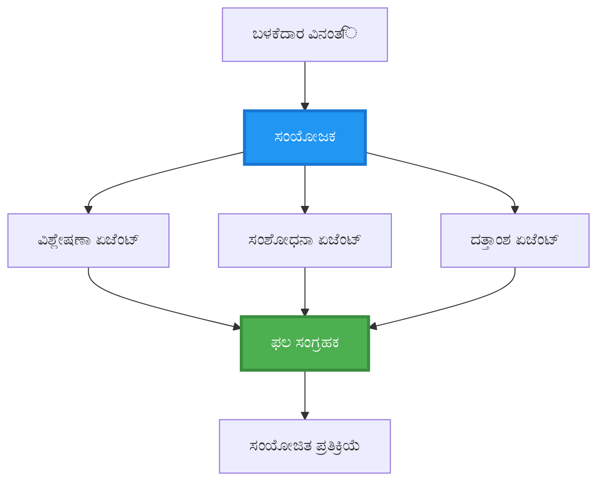
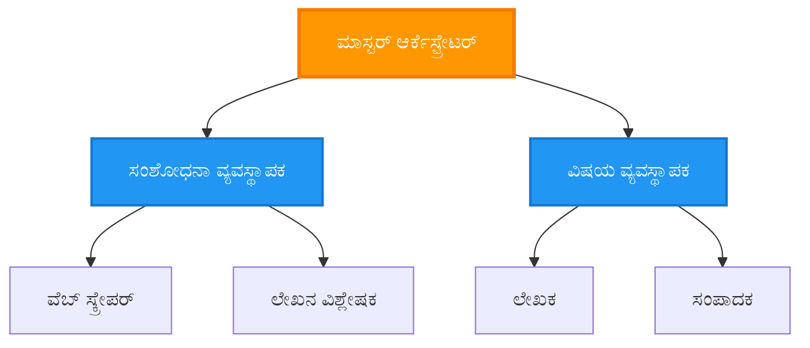
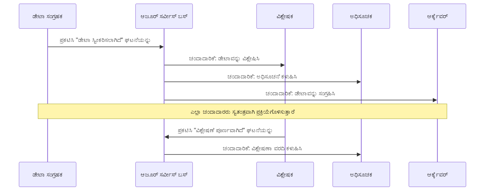
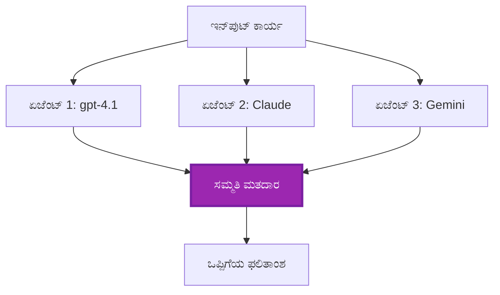
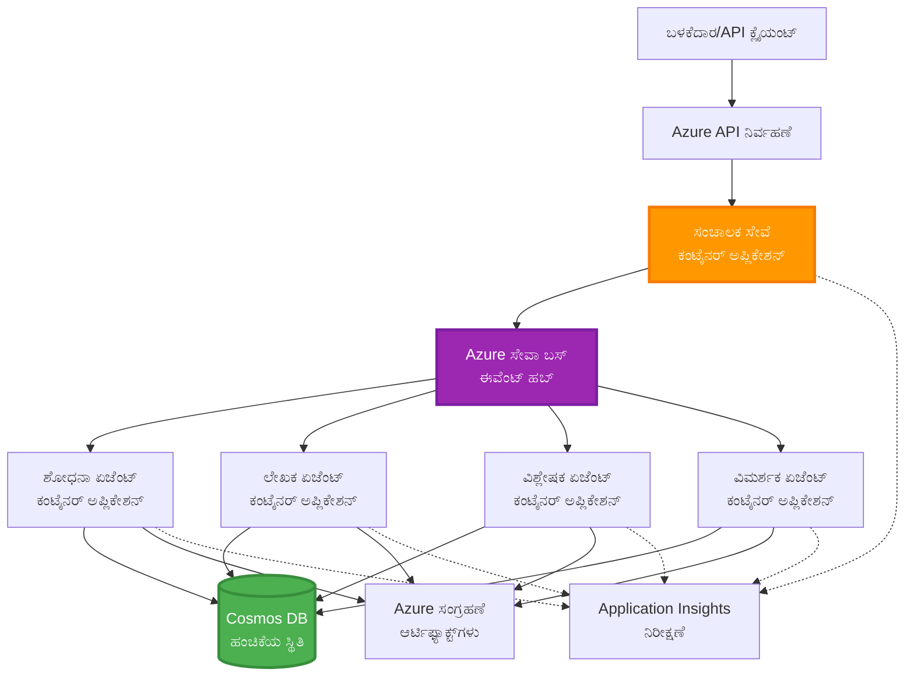

# ಬಹು-ಏಜೆಂಟ್ ಸಂಯೋಜನೆ ಮಾದರಿಗಳು

⏱️ **ಅಂದಾಜು ಸಮಯ**: 60-75 ನಿಮಿಷಗಳು | 💰 **ಅಂದಾಜು ವೆಚ್ಚ**: ~$100-300/ತಿಂಗಳು | ⭐ **ಸಂಕೀರ್ಣತೆ**: ಉನ್ನತ

**📚 ಅಧ್ಯಯನ ಮಾರ್ಗ:**
- ← Previous: [ಕ್ಷಮತಾ ಯೋಜನೆ](capacity-planning.md) - ಸಂಪನ್ಮೂಲ ಗಾತ್ರ ನಿರ್ಧಾರ ಮತ್ತು ಸ್ಕೇಲಿಂಗ್ ತಂತ್ರಗಳು
- 🎯 **ನೀವು ಇಲ್ಲಿ ಇದ್ದೀರಿ**: ಬಹು-ಏಜೆಂಟ್ ಸಂಯೋಜನೆ ಮಾದರಿಗಳು (ಆರ್ಕೆಸ್ಟ್ರೇಶನ್, ಸಂವಹನ, ಸ್ಥಿತಿ ನಿರ್ವಹಣೆ)
- → Next: [SKU ಆಯ್ಕೆ](sku-selection.md) - ಸರಿಯಾದ Azure ಸೇವೆಗಳ ಆಯ್ಕೆ
- 🏠 [ಕೋರ್ಸ್ ಹೋಮ್](../../README.md)

---

## ನೀವು ಕಲಿಯುವದು

ಈ ಪಾಠವನ್ನು ಪೂರ್ಣಗೊಳಿಸಿದರೆ, ನೀವು:
- **ಬಹು-ಏಜೆಂಟ್ ವಾಸ್ತುಶಿಲ್ಪ** ಮಾದರಿಗಳನ್ನು ಮತ್ತು ಅವುಗಳನ್ನು ಬಳಸಬೇಕಾಗುವ ಸಂದರ್ಭದಲ್ಲಿ ಅರ್ಥಮಾಡಿಕೊಳ್ಳುವುದು
- **ಆರ್ಕೆಸ್ಟ್ರೇಶನ್ ಮಾದರಿಗಳು** (ಕೇಂದ್ರಿತ, ವಿಕೇಂದ್ರಿತ, ಶ್ರೇಣೀಬದ್ಧ) ಅನ್ನು ಅನುಷ್ಟಾನಗೊಳಿಸುವುದು
- **ಏಜೆಂಟ್ ಸಂವಹನ** ತಂತ್ರಗಳನ್ನು ವಿನ್ಯಾಸಗೊಳಿಸುವುದು (ಸಮಕಾಲಿಕ, ಅಸಮಕಾಲಿಕ, ಘಟನಾನ್ವಿತ)
- ವಿತರಿತ ಏಜೆಂಟ್ ಗಳಲ್ಲಿ **ಹಂಚಿಕೊಂಡ ಸ್ಥಿತಿ** ಅನ್ನು ನಿರ್ವಹಿಸುವುದು
- AZD ಬಳಸಿ Azure ಮೇಲೆ **ಬಹು-ಏಜೆಂಟ್ ವ್ಯವಸ್ಥೆಗಳನ್ನು** ನಿಯೋಜಿಸುವುದು
- ವಾಸ್ತವಿಕ AI ದೃಶ್ಯಾವಳಿಗಳಿಗೆ **ಸಂಯೋಜನೆ ಮಾದರಿಗಳನ್ನು** ಅನ್ವಯಿಸುವುದು
- ವಿತರಿತ ಏಜೆಂಟ್ ವ್ಯವಸ್ಥೆಗಳನ್ನು ಮಾನಿಟರ್ ಮತ್ತು ಡೀಬಗ್ ಮಾಡುವುದು

## ಏಕೆ ಬಹು-ಏಜೆಂಟ್ ಸಂಯೋಜನೆ ಮುಖ್ಯ

### ರೂಪಾಂತರ: ಏಕಏಜೆಂಟ್ ನಿಂದ ಬಹು-ಏಜೆಂಟ್ ಗೆ

**ಏಕಏಜೆಂಟ್ (ಸರಳ):**
```
User → Agent → Response
```
- ✅ ಸರಳವಾಗಿ ಅರ್ಥಮಾಡಿಕೊಳ್ಳಲು ಮತ್ತು ಅನುಷ್ಟಾನಗೊಳಿಸಲು ಸುಲಭ
- ✅ ಸರಳ ಕಾರ್ಯಗಳಿಗೆ ವೇಗವಾಗಿ
- ❌ ಒಂದು ಮಾದಲಿನ ಸಾಮರ್ಥ್ಯದಲ್ಲೇ ಸೀಮಿತ
- ❌ ಸಂಕೀರ್ಣ ಕಾರ್ಯಗಳನ್ನು ಸಮಾಂತರಗೊಳಿಸಲು ಸಾಧ್ಯವಿಲ್ಲ
- ❌ ವಿಶೇಷೀಕರಣ ಇಲ್ಲ

**ಬಹು-ಏಜೆಂಟ್ ವ್ಯವಸ್ಥೆ (ಉನ್ನತ):**
```mermaid
graph TD
    Orchestrator[ಸಂಯೋಜಕ] --> Agent1[ಏಜೆಂಟ್1<br/>ಯೋಜನೆ]
    Orchestrator --> Agent2[ಏಜೆಂಟ್2<br/>ಕೋಡ್]
    Orchestrator --> Agent3[ಏಜೆಂಟ್3<br/>ಪರಿಶೀಲನೆ]
```- ✅ ನಿರ್ದಿಷ್ಟ ಕಾರ್ಯಗಳಿಗೆ ಪರಿಣತಿ ಹೊಂದಿದ ಏಜೆಂಟ್ ಗಳು
- ✅ ವೇಗಕ್ಕಾಗಿ ಸಮಂತರ ಕಾರ್ಯನಿರ್ವಹಣೆ
- ✅ ಮಾಡ್ಯೂಲರ್ ಮತ್ತು ನಿರ್ವಹಿಸಲು ಸುಲಭ
- ✅ ಸಂಕೀರ್ಣ ಕಾರ್ಯವಾಹಿಗಳಲ್ಲಿ ಉತ್ತಮ
- ⚠️ ಸಂಯೋಜನೆ ಲಾಜಿಕ್ ಅಗತ್ಯವಿದೆ

**ಉಪಮೆ**: ಏಕಏಜೆಂಟ್ ಒಂದು ವ್ಯಕ್ತಿಯಂತೆ ಎಲ್ಲ ಕೆಲಸಗಳನ್ನು ಕೈಗೊಳ್ಳುವುದು. ಬಹು-ಏಜೆಂಟ್ ಒಂದು ತಂಡದಂತೆ, ಪ್ರತಿಯೊಬ್ಬ ಸದಸ್ಯನಿಗೂ ವಿಶೇಷ ಕೌಶಲ್ಯಗಳಿವೆ (ಸಂಶೋಧಕ, ಕೋಡರ್, ವಿಮರ್ಶಕ, ಬರಹಗಾರ) ಮತ್ತು նրանք ಒಟ್ಟಾಗಿ ಕೆಲಸ ಮಾಡುತ್ತಾರೆ.

---

## ಪ್ರಮುಖ ಸಂಯೋಜನೆ ಮಾದರಿಗಳು

### ಮಾದರಿ 1: ಕ್ರಮಾನುಸಾರ ಸಂಯೋಜನೆ (ಉತ್ತರದಾಯಕತೆಯ ಸರಭಂಗಳು)

**ಬಳಸಬೇಕಾದ ಸಂದರ್ಭ**: ಕಾರ್ಯಗಳು ನಿರ್ದಿಷ್ಟ ಕ್ರಮದಲ್ಲಿ ಮುಗಿಸಬೇಕು, ಪ್ರತಿ ಏಜೆಂಟ್ ಹಿಂದಿನ ಔಟ್ಪುಟ್ನ ಮೆರೆ ಕಟ್ಟಿಕೊಳ್ಳುತ್ತದೆ.

```mermaid
sequenceDiagram
    participant User as ಬಳಕೆದಾರ
    participant Orchestrator as ಸಮನ್ವಯಕ
    participant Agent1 as ಸಂಶೋಧನಾ ಏಜೆಂಟ್
    participant Agent2 as ಲೇಖಕ ಏಜೆಂಟ್
    participant Agent3 as ಸಂಪಾದಕ ಏಜೆಂಟ್
    
    User->>Orchestrator: "ಎಐ ಬಗ್ಗೆ ಲೇಖನವನ್ನು ಬರೆಯಿರಿ"
    Orchestrator->>Agent1: ವಿಷಯವನ್ನು ಸಂಶೋಧಿಸಿ
    Agent1-->>Orchestrator: ಸಂಶೋಧನಾ ಫಲಿತಾಂಶಗಳು
    Orchestrator->>Agent2: ಡ್ರಾಫ್ಟ್ ಬರೆಯಿರಿ (ಸಂಶೋಧನೆ ಬಳಸಿ)
    Agent2-->>Orchestrator: ಡ್ರಾಫ್ಟ್ ಲೇಖನ
    Orchestrator->>Agent3: ಸಂಪಾದಿಸಿ ಮತ್ತು ಸುಧರಿಸಿ
    Agent3-->>Orchestrator: ಅಂತಿಮ ಲೇಖನ
    Orchestrator-->>User: ಸುಧಾರಿತ ಲೇಖನ
    
    Note over User,Agent3: ಕ್ರಮಾನುಗತ: ಪ್ರತಿ ಹಂತವು ಹಿಂದಿನದನ್ನು ಕಾಯುತ್ತದೆ
```
**ಲಾಭಗಳು:**
- ✅ ಸ್ಪಷ್ಟ ಡೇಟಾ ಹರಿವು
- ✅ ಡೀಬಗ್ ಮಾಡುವುದು ಸುಲಭ
- ✅ ನಿರೀಕ್ಷಿತ ಕಾರ್ಯನಿರ್ವಹಣಾ ಕ್ರಮ

**ಆಕೆಲಿಕೆಗಳು:**
- ❌ ನಿಧಾನ (ಸಮಂತರತೆ ಇಲ್ಲ)
- ❌ ಒಂದು ವೈಫಲ್ಯವು ಸಂಪೂರ್ಣ ಸರಭಂಗವನ್ನು ತಡೆಹಿಡಿಯುತ್ತದೆ
- ❌ ಪರಸ್ಪರ ಅವಲಂಬಿತ ಕಾರ್ಯಗಳನ್ನು ನಿರ್ವಹಿಸಲು ಅಸಾಧ್ಯ

**ಉದಾಹರಣೆ ಬಳಕೆ ಪ್ರಕರಣಗಳು:**
- ವಿಷಯ ರಚನೆ ಪೈಪ್‌ಲೈನ್ (ಸಂಶೋಧನೆ → ಬರೆಯು → ಸಂಪಾದನೆ → ಪ್ರಕಟಣೆ)
- ಕೋಡ್ ಉಂಟುಮಾಡುವಿಕೆ ( ಯೋಜನೆ → ಅನುಷ್ಠಾನ → ಪರೀಕ್ಷೆ → разгор್ಯ ) 
- ವರದಿ ರಚನೆ (ಡೇಟಾ ಸಂಗ್ರಹ → ವಿಶ್ಲೇಷಣೆ → ದೃಶ್ಯೀಕರಣ → ಸಾರಾಂಶ)

---

### ಮಾದರಿ 2: ಸಮಾಂತರ ಸಂಯೋಜನೆ (Fan-Out/Fan-In)

**ಬಳಸಬೇಕಾದ ಸಂದರ್ಭ**: ಸ್ವತಂತ್ರ ಕಾರ್ಯಗಳು ಸಇಮ್ಮಳಾಗಿ ನಿರ್ವಹಿಸಬಹುದು, ಫಲಿತಾಂಶಗಳನ್ನು ಅಂತ್ಯದಲ್ಲಿ ಸಂಯೋಜಿಸಲಾಗುತ್ತದೆ.


**ಲಾಭಗಳು:**
- ✅ ವೇಗ (ಸಮಾಂತರ ನಿರ್ವಹಣೆ)
- ✅ ದೋಷ ತಡೆಗಟ್ಟಲು ಸಾಮರ್ಥ್ಯ (ಭಾಗಶಃ ಫಲಿತಾಂಶಗಳು ಸ್ವೀಕರಿಸಬಲ್ಲವು)
- ✅ অনুভೂತಿ ಹಾರಾಟದಂತೆ ವಿಸ್ತಾರಗೊಳ್ಳುತ್ತದೆ

**ಆಕೆಲಿಕೆಗಳು:**
- ⚠️ ಫಲಿತಾಂಶಗಳು ಕ್ರಮಭೇದವಾಗಿ ಬರುತ್ತವೆ
- ⚠️ ಸಂಗ್ರಹಣಾ ತರ್ಕ ಬೇಕಾಗುತ್ತದೆ
- ⚠️ ಸ್ಥಿತಿ ನಿರ್ವಹಣೆ ಸಂಕೀರ್ಣ

**ಉದಾಹರಣೆ ಬಳಕೆ ಪ್ರಕರಣಗಳು:**
- ಬಹು-ಮೂಲ ಡೇಟಾ ಸಂಗ್ರಹಣೆ (APIs + ಡೇಟಾಬೇಸ್ಗಳು + ವೆಬ್ ಸ್ಕ್ರಾಪಿಂಗ್)
- ಸ್ಪರ್ಧಾತ್ಮಕ ವಿಶ್ಲೇಷಣೆ (ಹೇಗೆಂದರೆ ಬಹು ಮಾದರಿಗಳು ಪರಿಹಾರಗಳನ್ನು ರಚಿಸುತ್ತವೆ, ಉತ್ತಮವು ಆಯ್ಕೆಯಾಗುತ್ತದೆ)
- ಅನುವಾದ ಸೇವೆಗಳು (ಒಂದು ಸಮಯದಲ್ಲಿ ಹಲವಾರು ಭಾಷೆಗಳಿಗೆ ಅನುವಾದ)

---

### ಮಾದರಿ 3: ಶ್ರೇಣೀಬದ್ಧ ಸಂಯೋಜನೆ (ಮ್ಯಾನೇಜರ್-ವರ್ಕರ್)

**ಬಳಸಬೇಕಾದ ಸಂದರ್ಭ**: ಉಪಕಾರ್ಯಗಳೊಂದಿಗೆ ಸಂಕೀರ್ಣ ಕಾರ್ಯವಾಹಿಗಳು ಇದ್ದಾಗ, ನಿಯೋಜನೆ ಅಗತ್ಯವಿದೆ.


**ಲಾಭಗಳು:**
- ✅ ಸಂಕೀರ್ಣ ಕಾರ್ಯವಾಹಿಗಳನ್ನು ನಿರ್ವಹಿಸುತ್ತದೆ
- ✅ ಮಾಡ್ಯೂಲರ್ ಮತ್ತು ನಿರ್ವಹಿಸಲು ಸುಲಭ
- ✅ ಜವಾಬ್ದಾರಿ ಸೀಮೆ ಸ್ಪಷ್ಟವಾಗುತ್ತದೆ

**ಆಕೆಲಿಕೆಗಳು:**
- ⚠️ معمಾರ್ಚಿಅರ್ (ವಸ್ತು) ಗಳು ಹೆಚ್ಚು ಸಂಕೀರ್ಣವಾಗಬಹುದು
- ⚠️ ಹೆಚ್ಚಿನ ಹೊತ್ತಿಗೆ (ಹೆಚ್ಚು ಸಂಯೋಜನಾ پرتಿಗಳು)
- ⚠️ ಜಟಿಲ ಆರ್ಕೆಸ್ಟ್ರೇಶನ್ ಅಗತ್ಯ

**ಉದಾಹರಣೆ ಬಳಕೆ ಪ್ರಕರಣಗಳು:**
- ಎಂಟರ್ಪ್ರೈಸ್ ಡಾಕ್ಯುಮೆಂಟ್ ಪ್ರೋಸೆಸಿಂಗ್ (ವರ್ಗೀಕರಿಸು → ಮಾರ್ಗದರ್ಶಿಸಿ → ಪ್ರಕ್ರಿಯೆ → ಸಂಗ್ರಹ)
- ಬਹੁ-ಹಂತದ ಡೇಟಾ ಪೈಪ್‌ಲೈನ್ಗಳು (ಇಂಜೆಸ್ಟ್ → ಕ್ಲೀನ್ → ಟ್ರಾನ್ಸ್‌ಫಾರ್ಮ್ → ವಿಶ್ಲೇಷಣೆ → ವರದಿ)
- ಸಂಕೀರ್ಣ ಸ್ವಯಂಚಾಲಿತ ಕಾರ್ಯವಾಹಿಗಳು (ಯೋಜನೆ → ಸಂಪನ್ಮೂಲ ಹಂಚಿಕೆ → ನಿರ್ವಾಹಣೆ → ಮಾನಿಟರಿಂಗ್)

---

### ಮಾದರಿ 4: ಘಟನೆ-ಚಾಲಿತ ಸಂಯೋಜನೆ (ಪ್ರಕಟನೆ-ದಾಯಿತ್ವ)

**ಬಳಸಬೇಕಾದ ಸಂದರ್ಭ**: ಏಜೆಂಟ್‌ಗಳು ಘಟನೆಗಳಿಗೆ ಪ್ರತಿಕ್ರಿಯಿಸಬೇಕಾದಾಗ, ಸಡಿಲ ಜೋಡಣೆ ಬೇಕಾದಾಗ.


**ಲಾಭಗಳು:**
- ✅ ಏಜೆಂಟ್ ಗಳ ನಡುವೆ ಸಡಿಲ ಜೋಡಣೆ
- ✅ ಹೊಸ ಏಜೆಂಟ್ ಗಳನ್ನು ಸೇರಿಸುವುದು ಸುಲಭ (ಕೇವಲ ಸಬ್ಸ್ಕ್ರೈಬ್ ಮಾಡಿ)
- ✅ ಅಸಮಕಾಲಿಕ ಪ್ರಕ್ರಿಯೆ
- ✅ ಪ್ರತಿರೋಧಕ (ಸಂದೇಶ persistence)

**ಆಕೆಲಿಕೆಗಳು:**
- ⚠️ ಅಂತಿಮ ಸಮಾನತೆ (eventual consistency)
- ⚠️ ಡೀಬಗ್ کردن ಜಟಿಲ
- ⚠️ ಸಂದೇಶ ಕ್ರಮ ನಿರ್ವಹಣೆ ಸವಾಲು

**ಉದಾಹರಣೆ ಬಳಕೆ ಪ್ರಕರಣಗಳು:**
- ರಿಯಲ್-ಟೈಮ್ ಮಾನಿಟರಿಂಗ್ ವ್ಯವಸ್ಥೆಗಳು (ಅಲರ್ಟ್ ಗಳು, ಡ್ಯಾಶ್ಬೋರ್ಡ್ ಗಳು, لاگز)
- ಬಹು-ಚಾನಲ್ ಅಧಿಸೂಚನೆಗಳು (ಇಮೇಲ್, SMS, ಪುಷ್, Slack)
- ಡೇಟಾ ಪ್ರಕ್ರಿಯೆ ಪೈಪ್‌ಲೈನ್ಗಳು (ಒಂದು ಡೇಟಾಗೆ ಹಲವಾರು ಗ್ರಾಹಕರು)

---

### ಮಾದರಿ 5: ಸಮಮತ ಆಧಾರಿತ ಸಂಯೋಜನೆ (ಮತದಾನ/ಕ್ವೋರಂ)

**ಬಳಸಬೇಕಾದ ಸಂದರ್ಭ**: ಮುಂದುವರಿಯುವ ಮೊದಲು ಹಲವಾರು ಏಜೆಂಟ್ ಗಳಿಂದ ಒಪ್ಪಂದ ಬೇಕಾಗುವಾಗ.


**ಲಾಭಗಳು:**
- ✅ ಹೆಚ್ಚಿನ ಸಸತ್ಥಿತ (ಹಲವಾರು ಅಭಿಪ್ರಾಯಗಳು)
- ✅ ದೋಷ ಸಹಿಷ್ಣುತೆ (Alಕುಲ್ಲಿಕೆಯ ವೈಫಲ್ಯಗಳನ್ನು ಸಹಿಸಲಾಗುತ್ತದೆ)
- ✅ ಗುಣಮಟ್ಟ ಖಚಿತತೆ ಒಳಗೊಂಡಿದೆ

**ಆಕೆಲಿಕೆಗಳು:**
- ❌ ಖರ್ಚು ಹೆಚ್ಚಾಗುತ್ತದೆ (ಹಲವಾರು ಮಾದರಿ ಕರೆಗಳು)
- ❌ ನಿಧಾನ (ಎಲ್ಲಾ ಏಜೆಂಟ್ ಗಳನ್ನು ಕಾಯುತ್ತದೆ)
- ⚠️ ಸಂಘರ್ಷ ಪರಿಹಾರ ಬೇಕಾಗುತ್ತದೆ

**ಉದಾಹರಣೆ ಬಳಕೆ ಪ್ರಕರಣಗಳು:**
- ವಿಷಯ ನಿಯಂತ್ರಣ (ಹಲವಾರು ಮಾದರಿ ಗಳು ವಿಷಯ ಪರಿಶೀಲಿಸುವವು)
- ಕೋಡ್ ವಿಮರ್ಶೆ (ಹಲವಾರು ಲಿಂಟರ್/ವಿಶ್ಲೇಷಕಗಳು)
- ವೈದ್ಯಕೀಯ ನಿರ್ಣಯ (ಹಲವಾರು AI ಮಾದರಿ ಗಳು, ತಜ್ಞ ಪರಿಶೀಲನೆ)

---

## ವಾಸ್ತುಶಿಲ್ಪ ಅವಲೋಕನ

### Azure ಮೇಲೆ ಸಂಪೂರ್ಣ ಬಹು-ಏಜೆಂಟ್ ವ್ಯವಸ್ಥೆ


**ಮುಖ್ಯ ಘಟಕಗಳು:**

| Component | Purpose | Azure Service |
|-----------|---------|---------------|
| **API Gateway** | ಪ್ರವೇಶ ಬಿಂದು, ದರ ಮಿತಿ, ಪ್ರಮಾಣೀಕರಣ | API Management |
| **Orchestrator** | ಏಜೆಂಟ್ ಕಾರ್ಯಪ್ರವಾಹಗಳನ್ನು ಸಂಯೋಜಿಸುತ್ತದೆ | Container Apps |
| **Message Queue** | ಅಸಮಕಾಲಿಕ ಸಂವಹನ | Service Bus / Event Hubs |
| **Agents** | ನಿರ್ದಿಷ್ಟತೆ ಹೊಂದಿದ AI ಕೆಲಸಗಾರರು | Container Apps / Functions |
| **State Store** | ಹಂಚಿದ ಸ್ಥಿತಿ, ಕಾರ್ಯ ಟ್ರ್ಯಾಕಿಂಗ್ | Cosmos DB |
| **Artifact Storage** | ಡಾಕ್ಯುಮೆಂಟ್‌ಗಳು, ಫಲಿತಾಂಶಗಳು, ಲಾಗ್‌ಗಳು | Blob Storage |
| **Monitoring** | ವಿತರಿತ ಟ್ರೇಸಿಂಗ್, ಲಾಗ್‌ಗಳು | Application Insights |

---

## ಪೂರ್ವಾಪೇಕ್ಶೆಗಳು

### ಅಗತ್ಯ ಸಾಧನಗಳು

```bash
# Azure ಡೆವಲಪರ್ CLI ಅನ್ನು ಪರಿಶೀಲಿಸಿ
azd version
# ✅ ನಿರೀಕ್ಷಿತ: azd ಆವೃತ್ತಿ 1.0.0 ಅಥವಾ ಅದಕ್ಕಿಂತ ಮೇಲು

# Azure CLI ಅನ್ನು ಪರಿಶೀಲಿಸಿ
az --version
# ✅ ನಿರೀಕ್ಷಿತ: azure-cli 2.50.0 ಅಥವಾ ಅದಕ್ಕಿಂತ ಮೇಲು

# ಡೋಕರ್ ಅನ್ನು (ಸ್ಥಳೀಯ ಪರೀಕ್ಷೆಗಾಗಿ) ಪರಿಶೀಲಿಸಿ
docker --version
# ✅ ನಿರೀಕ್ಷಿತ: ಡೋಕರ್ ಆವೃತ್ತಿ 20.10 ಅಥವಾ ಅದಕ್ಕಿಂತ ಮೇಲು
```

### Azure ಅಗತ್ಯಗಳು

- ಸಕ್ರಿಯ Azure ಚಂದಾ
- ಸೃಷ್ಟಿ ಮಾಡಬಹುದಾದ ಅನುಮತಿಗಳು:
  - Container Apps
  - Service Bus namespaces
  - Cosmos DB accounts
  - Storage accounts
  - Application Insights

### ಜ್ಞಾನ ಪೂರ್ವಾಪೇಕ್ಶೆಗಳು

ನೀವು ಪೂರ್ಣಗೊಳಿಸಿರಬೇಕು:
- [ಕಾನ್ಫಿಗರೇಷನ್ ನಿರ್ವಹಣೆ](../chapter-03-configuration/configuration.md)
- [ಪ್ರಾಮಾಣೀಕರಣ ಮತ್ತು ಭದ್ರತೆ](../chapter-03-configuration/authsecurity.md)
- [ಮೈಕ್ರೋಸರ್ವಿಸ್ ಉದಾಹರಣೆ](../../../../examples/microservices)

---

## ಅನುಷ್ಠಾನ ಮಾರ್ಗದರ್ಶಿ

### ಪ್ರಾಜೆಕ್ಟ್ ರಚನೆ

```
multi-agent-system/
├── azure.yaml                    # AZD configuration
├── infra/
│   ├── main.bicep               # Main infrastructure
│   ├── core/
│   │   ├── servicebus.bicep     # Message queue
│   │   ├── cosmos.bicep         # State store
│   │   ├── storage.bicep        # Artifact storage
│   │   └── monitoring.bicep     # Application Insights
│   └── app/
│       ├── orchestrator.bicep   # Orchestrator service
│       └── agent.bicep          # Agent template
└── src/
    ├── orchestrator/            # Orchestration logic
    │   ├── app.py
    │   ├── workflows.py
    │   └── Dockerfile
    ├── agents/
    │   ├── research/            # Research agent
    │   ├── writer/              # Writer agent
    │   ├── analyst/             # Analyst agent
    │   └── reviewer/            # Reviewer agent
    └── shared/
        ├── state_manager.py     # Shared state logic
        └── message_handler.py   # Message handling
```

---

## ಪಾಠ 1: ಕ್ರಮಾನುಸಾರ ಸಂಯೋಜನೆ ಮಾದರಿ

### ಅನುಷ್ಠಾನ: ವಿಷಯ ರಚನೆ ಪೈಪ್‌ಲೈನ್

ಚರಿತ್ರೆ: ಸಂಶೋಧನೆ → ಬರೆಯು → ಸಂಪಾದಿಸಿ → ಪ್ರಕಟಿಸು

### 1. AZD ಸಂರಚನೆ

**ಫೈಲ್: `azure.yaml`**

```yaml
name: content-pipeline
metadata:
  template: multi-agent-sequential@1.0.0

services:
  orchestrator:
    project: ./src/orchestrator
    language: python
    host: containerapp
  
  research-agent:
    project: ./src/agents/research
    language: python
    host: containerapp
  
  writer-agent:
    project: ./src/agents/writer
    language: python
    host: containerapp
  
  editor-agent:
    project: ./src/agents/editor
    language: python
    host: containerapp
```

### 2. ಮೂಲಭೂತ ವಿನ್ಯಾಸ: ಸಂಯೋಜನೆಗಾಗಿ Service Bus

**ಫೈಲ್: `infra/core/servicebus.bicep`**

```bicep
param name string
param location string
param tags object = {}

resource serviceBusNamespace 'Microsoft.ServiceBus/namespaces@2022-10-01-preview' = {
  name: name
  location: location
  tags: tags
  sku: {
    name: 'Standard'
    tier: 'Standard'
  }
  properties: {
    minimumTlsVersion: '1.2'
  }
}

// Queue for orchestrator → research agent
resource researchQueue 'Microsoft.ServiceBus/namespaces/queues@2022-10-01-preview' = {
  parent: serviceBusNamespace
  name: 'research-tasks'
  properties: {
    maxDeliveryCount: 3
    lockDuration: 'PT5M'
    deadLetteringOnMessageExpiration: true
  }
}

// Queue for research agent → writer agent
resource writerQueue 'Microsoft.ServiceBus/namespaces/queues@2022-10-01-preview' = {
  parent: serviceBusNamespace
  name: 'writer-tasks'
  properties: {
    maxDeliveryCount: 3
    lockDuration: 'PT5M'
  }
}

// Queue for writer agent → editor agent
resource editorQueue 'Microsoft.ServiceBus/namespaces/queues@2022-10-01-preview' = {
  parent: serviceBusNamespace
  name: 'editor-tasks'
  properties: {
    maxDeliveryCount: 3
    lockDuration: 'PT5M'
  }
}

output namespace string = serviceBusNamespace.name
output connectionString string = listKeys('${serviceBusNamespace.id}/AuthorizationRules/RootManageSharedAccessKey', serviceBusNamespace.apiVersion).primaryConnectionString
```

### 3. ಹಂಚಿಕೊಂಡ ಸ್ಥಿತಿ ನಿರ್ವಾಹಕ

**ಫೈಲ್: `src/shared/state_manager.py`**

```python
from azure.cosmos import CosmosClient, PartitionKey
from datetime import datetime
import os

class StateManager:
    """Manages shared state across agents using Cosmos DB"""
    
    def __init__(self):
        endpoint = os.environ['COSMOS_ENDPOINT']
        key = os.environ['COSMOS_KEY']
        
        self.client = CosmosClient(endpoint, key)
        self.database = self.client.get_database_client('agent-state')
        self.container = self.database.get_container_client('tasks')
    
    def create_task(self, task_id: str, task_type: str, input_data: dict):
        """Create a new task"""
        task = {
            'id': task_id,
            'type': task_type,
            'status': 'pending',
            'input': input_data,
            'created_at': datetime.utcnow().isoformat(),
            'steps': []
        }
        self.container.create_item(task)
        return task
    
    def update_task_step(self, task_id: str, step_name: str, result: dict):
        """Update task with completed step"""
        task = self.container.read_item(task_id, partition_key=task_id)
        
        task['steps'].append({
            'name': step_name,
            'completed_at': datetime.utcnow().isoformat(),
            'result': result
        })
        
        self.container.replace_item(task_id, task)
        return task
    
    def complete_task(self, task_id: str, final_result: dict):
        """Mark task as complete"""
        task = self.container.read_item(task_id, partition_key=task_id)
        task['status'] = 'completed'
        task['result'] = final_result
        task['completed_at'] = datetime.utcnow().isoformat()
        self.container.replace_item(task_id, task)
        return task
    
    def get_task(self, task_id: str):
        """Retrieve task state"""
        return self.container.read_item(task_id, partition_key=task_id)
```

### 4. ಆರ್ಕೆಸ್ಟ್ರೇಟರ್ ಸೇವೆ

**ಫೈಲ್: `src/orchestrator/app.py`**

```python
from flask import Flask, request, jsonify
from azure.servicebus import ServiceBusClient, ServiceBusMessage
import json
import uuid
import os
from shared.state_manager import StateManager

app = Flask(__name__)
state_manager = StateManager()

# ಸರ್ವಿಸ್ ಬಸ್ ಸಂಪರ್ಕ
servicebus_connection_str = os.environ['SERVICEBUS_CONNECTION_STRING']
servicebus_client = ServiceBusClient.from_connection_string(servicebus_connection_str)

@app.route('/health', methods=['GET'])
def health():
    return jsonify({'status': 'healthy', 'service': 'orchestrator'})

@app.route('/create-content', methods=['POST'])
def create_content():
    """
    Sequential workflow: Research → Write → Edit → Publish
    """
    data = request.json
    topic = data.get('topic')
    
    if not topic:
        return jsonify({'error': 'Topic required'}), 400
    
    # ಸ್ಟೇಟ್ ಸ್ಟೋರ್‌ನಲ್ಲಿ ಟಾಸ್ಕ್ ರಚಿಸಿ
    task_id = str(uuid.uuid4())
    task = state_manager.create_task(
        task_id=task_id,
        task_type='content_creation',
        input_data={'topic': topic}
    )
    
    # ಶೋಧನಾ ಏಜೆಂಟ್‌ಗೆ ಸಂದೇಶ ಕಳುಹಿಸಿ (ಮೊದಲ ಹಂತ)
    sender = servicebus_client.get_queue_sender('research-tasks')
    message = ServiceBusMessage(
        body=json.dumps({
            'task_id': task_id,
            'topic': topic,
            'next_queue': 'writer-tasks'  # ಫಲಿತಾಂಶಗಳನ್ನು ಎಲ್ಲಿಗೆ ಕಳುಹಿಸಬೇಕು
        }),
        content_type='application/json'
    )
    
    with sender:
        sender.send_messages(message)
    
    return jsonify({
        'task_id': task_id,
        'status': 'started',
        'workflow': 'sequential',
        'steps': ['research', 'write', 'edit', 'publish'],
        'message': 'Content creation pipeline initiated'
    }), 202

@app.route('/task/<task_id>', methods=['GET'])
def get_task_status(task_id):
    """Check task status"""
    try:
        task = state_manager.get_task(task_id)
        return jsonify(task)
    except Exception as e:
        return jsonify({'error': str(e)}), 404

if __name__ == '__main__':
    app.run(host='0.0.0.0', port=8080)
```

### 5. ಸಂಶೋಧನೆ ಏಜೆಂಟ್

**ಫೈಲ್: `src/agents/research/app.py`**

```python
from azure.servicebus import ServiceBusClient, ServiceBusMessage
from openai import AzureOpenAI
import json
import os
import time
from shared.state_manager import StateManager

# ಕ್ಲೈಂಟ್‌ಗಳನ್ನು ಆರಂಭಿಸಿ
state_manager = StateManager()
servicebus_client = ServiceBusClient.from_connection_string(
    os.environ['SERVICEBUS_CONNECTION_STRING']
)

openai_client = AzureOpenAI(
    api_key=os.environ['AZURE_OPENAI_API_KEY'],
    api_version="2024-02-01",
    azure_endpoint=os.environ['AZURE_OPENAI_ENDPOINT']
)

def process_research_task(message_data):
    """Process research request and pass to writer"""
    task_id = message_data['task_id']
    topic = message_data['topic']
    next_queue = message_data['next_queue']
    
    print(f"🔬 Researching: {topic}")
    
    # ಸಂಶೋಧನೆಗಾಗಿ Microsoft Foundry ಮಾದರಿಗಳನ್ನು ಕರೆಮಾಡಿ
    response = openai_client.chat.completions.create(
        model="gpt-4.1",
        messages=[
            {"role": "system", "content": "You are a research assistant. Provide comprehensive research on the given topic."},
            {"role": "user", "content": f"Research this topic thoroughly: {topic}"}
        ],
        max_tokens=1500
    )
    
    research_results = response.choices[0].message.content
    
    # ಸ್ಥಿತಿಯನ್ನು ನವೀಕರಿಸಿ
    state_manager.update_task_step(
        task_id=task_id,
        step_name='research',
        result={'research': research_results}
    )
    
    # ಮುಂದಿನ ಏಜೆಂಟ್ (ಲೇಖಕ)ಗೆ ಕಳುಹಿಸಿ
    sender = servicebus_client.get_queue_sender(next_queue)
    message = ServiceBusMessage(
        body=json.dumps({
            'task_id': task_id,
            'topic': topic,
            'research': research_results,
            'next_queue': 'editor-tasks'
        }),
        content_type='application/json'
    )
    
    with sender:
        sender.send_messages(message)
    
    print(f"✅ Research complete for task {task_id}")

def main():
    """Listen to research queue"""
    receiver = servicebus_client.get_queue_receiver('research-tasks')
    
    print("🔬 Research Agent started, listening for tasks...")
    
    with receiver:
        while True:
            messages = receiver.receive_messages(max_wait_time=5)
            for message in messages:
                try:
                    message_data = json.loads(str(message))
                    process_research_task(message_data)
                    receiver.complete_message(message)
                except Exception as e:
                    print(f"❌ Error processing message: {e}")
                    receiver.abandon_message(message)

if __name__ == '__main__':
    main()
```

### 6. ಬರಹಗಾರ ಏಜೆಂಟ್

**ಫೈಲ್: `src/agents/writer/app.py`**

```python
from azure.servicebus import ServiceBusClient, ServiceBusMessage
from openai import AzureOpenAI
import json
import os
from shared.state_manager import StateManager

state_manager = StateManager()
servicebus_client = ServiceBusClient.from_connection_string(
    os.environ['SERVICEBUS_CONNECTION_STRING']
)

openai_client = AzureOpenAI(
    api_key=os.environ['AZURE_OPENAI_API_KEY'],
    api_version="2024-02-01",
    azure_endpoint=os.environ['AZURE_OPENAI_ENDPOINT']
)

def process_writing_task(message_data):
    """Write article based on research"""
    task_id = message_data['task_id']
    topic = message_data['topic']
    research = message_data['research']
    next_queue = message_data['next_queue']
    
    print(f"✍️ Writing article: {topic}")
    
    # ಲೇಖನ ಬರೆಯಲು Microsoft Foundry Models ಅನ್ನು ಕರೆಮಾಡಿ
    response = openai_client.chat.completions.create(
        model="gpt-4.1",
        messages=[
            {"role": "system", "content": "You are a professional writer. Write engaging, well-structured articles."},
            {"role": "user", "content": f"Based on this research:\n\n{research}\n\nWrite a comprehensive article about: {topic}"}
        ],
        max_tokens=2000
    )
    
    article_draft = response.choices[0].message.content
    
    # ಸ್ಥಿತಿಯನ್ನು ನವೀಕರಿಸಿ
    state_manager.update_task_step(
        task_id=task_id,
        step_name='writing',
        result={'draft': article_draft}
    )
    
    # ಸಂಪಾದಕರಿಗೆ ಕಳುಹಿಸಿ
    sender = servicebus_client.get_queue_sender(next_queue)
    message = ServiceBusMessage(
        body=json.dumps({
            'task_id': task_id,
            'topic': topic,
            'draft': article_draft
        }),
        content_type='application/json'
    )
    
    with sender:
        sender.send_messages(message)
    
    print(f"✅ Article draft complete for task {task_id}")

def main():
    """Listen to writer queue"""
    receiver = servicebus_client.get_queue_receiver('writer-tasks')
    
    print("✍️ Writer Agent started, listening for tasks...")
    
    with receiver:
        while True:
            messages = receiver.receive_messages(max_wait_time=5)
            for message in messages:
                try:
                    message_data = json.loads(str(message))
                    process_writing_task(message_data)
                    receiver.complete_message(message)
                except Exception as e:
                    print(f"❌ Error: {e}")
                    receiver.abandon_message(message)

if __name__ == '__main__':
    main()
```

### 7. ಸಂಪಾದಕ ಏಜೆಂಟ್

**ಫೈಲ್: `src/agents/editor/app.py`**

```python
from azure.servicebus import ServiceBusClient
from openai import AzureOpenAI
import json
import os
from shared.state_manager import StateManager

state_manager = StateManager()
servicebus_client = ServiceBusClient.from_connection_string(
    os.environ['SERVICEBUS_CONNECTION_STRING']
)

openai_client = AzureOpenAI(
    api_key=os.environ['AZURE_OPENAI_API_KEY'],
    api_version="2024-02-01",
    azure_endpoint=os.environ['AZURE_OPENAI_ENDPOINT']
)

def process_editing_task(message_data):
    """Edit and finalize article"""
    task_id = message_data['task_id']
    topic = message_data['topic']
    draft = message_data['draft']
    
    print(f"📝 Editing article: {topic}")
    
    # ಸಂಪಾದನೆ ಮಾಡಲು Microsoft Foundry Models ಅನ್ನು ಕರೆ ಮಾಡಿ
    response = openai_client.chat.completions.create(
        model="gpt-4.1",
        messages=[
            {"role": "system", "content": "You are an expert editor. Improve grammar, clarity, and structure."},
            {"role": "user", "content": f"Edit and improve this article:\n\n{draft}"}
        ],
        max_tokens=2000
    )
    
    final_article = response.choices[0].message.content
    
    # ಕಾರ್ಯವನ್ನು ಪೂರ್ಣಗೊಂಡಂತೆ ಗುರುತಿಸಿ
    state_manager.complete_task(
        task_id=task_id,
        final_result={
            'topic': topic,
            'final_article': final_article,
            'word_count': len(final_article.split())
        }
    )
    
    print(f"✅ Article finalized for task {task_id}")

def main():
    """Listen to editor queue"""
    receiver = servicebus_client.get_queue_receiver('editor-tasks')
    
    print("📝 Editor Agent started, listening for tasks...")
    
    with receiver:
        while True:
            messages = receiver.receive_messages(max_wait_time=5)
            for message in messages:
                try:
                    message_data = json.loads(str(message))
                    process_editing_task(message_data)
                    receiver.complete_message(message)
                except Exception as e:
                    print(f"❌ Error: {e}")
                    receiver.abandon_message(message)

if __name__ == '__main__':
    main()
```

### 8. ನಿಯೋಜಿಸಿ ಮತ್ತು ಪರೀಕ್ಷಿಸಿ

```bash
# ಆಯ್ಕೆ A: ಟೆಂಪ್ಲೇಟ್ ಆಧಾರಿತ ನಿಯೋಜನೆ
azd init
azd up

# ಆಯ್ಕೆ B: ಏಜೆಂಟ್ ಮೆನಿಫೆಸ್ಟ್ ನಿಯೋಜನೆ (ವಿಸ್ತರಣೆ ಅಗತ್ಯವಿದೆ)
azd extension install azure.ai.agents
azd ai agent init -m agent-manifest.yaml
azd up
```

> ನೋಡಿ [AZD AI CLI ಕಮಾಂಡ್‌ಗಳು](../chapter-08-production/production-ai-practices.md#azd-ai-cli-commands-and-extensions) ಎಲ್ಲಾ `azd ai` ಫ್ಲ್ಯಾಗ್‌ಗಳು ಮತ್ತು ಆಯ್ಕೆಗಳಿಗಾಗಿ.

```bash
# ಒರ್ಕೆಸ್ಟ್ರೇಟರ್ URL ಅನ್ನು ಪಡೆಯಿರಿ
ORCHESTRATOR_URL=$(azd env get-values | grep ORCHESTRATOR_URL | cut -d '=' -f2 | tr -d '"')

# ವಿಷಯವನ್ನು ರಚಿಸಿ
curl -X POST $ORCHESTRATOR_URL/create-content \
  -H "Content-Type: application/json" \
  -d '{"topic": "The Future of AI in Healthcare"}'
```

**✅ ನಿರೀಕ್ಷಿತ ಔಟ್ಪುಟ್:**
```json
{
  "task_id": "a1b2c3d4-e5f6-7890-abcd-ef1234567890",
  "status": "started",
  "workflow": "sequential",
  "steps": ["research", "write", "edit", "publish"],
  "message": "Content creation pipeline initiated"
}
```

**ಕಾರ್ಯ ಪ್ರಗತಿಯನ್ನು ಪರಿಶೀಲಿಸಿ:**
```bash
TASK_ID="a1b2c3d4-e5f6-7890-abcd-ef1234567890"
curl $ORCHESTRATOR_URL/task/$TASK_ID
```

**✅ ನಿರೀಕ್ಷಿತ ಔಟ್ಪುಟ್ (ಸಂಪೂರ್ಣ):**
```json
{
  "id": "a1b2c3d4-e5f6-7890-abcd-ef1234567890",
  "type": "content_creation",
  "status": "completed",
  "steps": [
    {
      "name": "research",
      "completed_at": "2025-11-19T10:30:00Z",
      "result": {"research": "..."}
    },
    {
      "name": "writing",
      "completed_at": "2025-11-19T10:32:00Z",
      "result": {"draft": "..."}
    }
  ],
  "result": {
    "topic": "The Future of AI in Healthcare",
    "final_article": "...",
    "word_count": 1500
  }
}
```

---

## ಪಾಠ 2: ಸಮಾಂತರ ಸಂಯೋಜನೆ ಮಾದರಿ

### ಅನುಷ್ಠಾನ: ಬಹು-ಮೂಲ ಸಂಶೋಧನಾ ಸಂಗ್ರಹಕ

ನಾವು ಒಂದೇ ಸಮಯದಲ್ಲಿ ಅನೇಕ ಮೂಲಗಳಿಂದ ಮಾಹಿತಿ ಸಂಗ್ರಹಿಸುವ ಸಮಾಂತರ ವ್ಯವಸ್ಥೆಯನ್ನು ನಿರ್ಮಿಸೋಣ.

### ಸಮಾಂತರ ಆರ್ಕೆಸ್ಟ್ರೇಟರ್

**ಫೈಲ್: `src/orchestrator/parallel_workflow.py`**

```python
from flask import Flask, request, jsonify
from azure.servicebus import ServiceBusClient, ServiceBusMessage
import json
import uuid
import os
from shared.state_manager import StateManager

app = Flask(__name__)
state_manager = StateManager()

servicebus_client = ServiceBusClient.from_connection_string(
    os.environ['SERVICEBUS_CONNECTION_STRING']
)

@app.route('/research-parallel', methods=['POST'])
def research_parallel():
    """
    Parallel workflow: Multiple agents work simultaneously
    """
    data = request.json
    query = data.get('query')
    
    task_id = str(uuid.uuid4())
    task = state_manager.create_task(
        task_id=task_id,
        task_type='parallel_research',
        input_data={
            'query': query,
            'agents': ['web', 'academic', 'news', 'social']
        }
    )
    
    # ಫ್ಯಾನ್-ಔಟ್: ಎಲ್ಲಾ ಏಜೆಂಟ್‌ಗಳಿಗೆ ಒಂದೇ ಸಮಯದಲ್ಲಿ ಕಳುಹಿಸಿ
    agents = [
        ('web-research-queue', 'web'),
        ('academic-research-queue', 'academic'),
        ('news-research-queue', 'news'),
        ('social-research-queue', 'social')
    ]
    
    for queue_name, agent_type in agents:
        sender = servicebus_client.get_queue_sender(queue_name)
        message = ServiceBusMessage(
            body=json.dumps({
                'task_id': task_id,
                'query': query,
                'agent_type': agent_type,
                'result_queue': 'aggregation-queue'
            }),
            content_type='application/json'
        )
        
        with sender:
            sender.send_messages(message)
    
    return jsonify({
        'task_id': task_id,
        'status': 'started',
        'workflow': 'parallel',
        'agents_dispatched': 4,
        'message': 'Parallel research initiated'
    }), 202

if __name__ == '__main__':
    app.run(host='0.0.0.0', port=8080)
```

### ಸಂಯೋಜನಾ ತರ್ಕ

**ಫೈಲ್: `src/agents/aggregator/app.py`**

```python
from azure.servicebus import ServiceBusClient
import json
import os
from collections import defaultdict
from shared.state_manager import StateManager

state_manager = StateManager()
servicebus_client = ServiceBusClient.from_connection_string(
    os.environ['SERVICEBUS_CONNECTION_STRING']
)

# ಪ್ರತಿ ಕಾರ್ಯದ ಫಲಿತಾಂಶಗಳನ್ನು ಟ್ರ್ಯಾಕ್ ಮಾಡಿ
task_results = defaultdict(list)
expected_agents = 4  # ವೆಬ್, ಶೈಕ್ಷಣಿಕ, ಸುದ್ದಿಗಳು, ಸಾಮಾಜಿಕ

def process_result(message_data):
    """Aggregate results from parallel agents"""
    task_id = message_data['task_id']
    agent_type = message_data['agent_type']
    result = message_data['result']
    
    # ಫಲಿತಾಂಶವನ್ನು ಸಂಗ್ರಹಿಸಿ
    task_results[task_id].append({
        'agent': agent_type,
        'data': result
    })
    
    print(f"📊 Received result from {agent_type} agent ({len(task_results[task_id])}/{expected_agents})")
    
    # ಎಲ್ಲಾ ಏಜೆಂಟ್‌들이 ಮುಗಿಸಿದ್ದಾರೆಯೇ ಎಂದು ಪರಿಶೀಲಿಸಿ (ಫ್ಯಾನ್-ಇನ್)
    if len(task_results[task_id]) == expected_agents:
        print(f"✅ All agents completed for task {task_id}. Aggregating...")
        
        # ಫಲಿತಾಂಶಗಳನ್ನು ಸಂಯೋಜಿಸಿ
        aggregated = {
            'query': message_data['query'],
            'sources': task_results[task_id],
            'summary': generate_summary(task_results[task_id])
        }
        
        # ಸಂಪೂರ್ಣ ಎಂದು ಗುರುತಿಸಿ
        state_manager.complete_task(task_id, aggregated)
        
        # ಸ್ವಚ್ಛಗೊಳಿಸಿ
        del task_results[task_id]
        
        print(f"✅ Aggregation complete for task {task_id}")

def generate_summary(results):
    """Generate summary from all sources"""
    summaries = [r['data'].get('summary', '') for r in results]
    return '\n\n'.join(summaries)

def main():
    """Listen to aggregation queue"""
    receiver = servicebus_client.get_queue_receiver('aggregation-queue')
    
    print("📊 Aggregator started, listening for results...")
    
    with receiver:
        while True:
            messages = receiver.receive_messages(max_wait_time=5)
            for message in messages:
                try:
                    message_data = json.loads(str(message))
                    process_result(message_data)
                    receiver.complete_message(message)
                except Exception as e:
                    print(f"❌ Error: {e}")
                    receiver.abandon_message(message)

if __name__ == '__main__':
    main()
```

**ಸಮಾಂತರ ಮಾದರಿಯ ಲಾಭಗಳು:**
- ⚡ **4x ವೇಗವಾಗುತ್ತದೆ** (ಏಜೆಂಟ್‌ಗಳು ഒരೇ ಸಮಯದಲ್ಲಿ ಕಾರ್ಯನಿರ್ವಹಿಸುತ್ತವೆ)
- 🔄 **ದೋಷರಹಿತ** (ಭಾಗಶಃ ಫಲಿತಾಂಶಗಳು ಸ್ವೀಕರಿಸಬಹುದಾಗಿದೆ)
- 📈 **ಸ್ಕೇಲಬಲ್** (ಹೆಚ್ಚಿನ ಏಜೆಂಟ್‍ಗಳನ್ನು ಸುಲಭವಾಗಿ ಸೇರಿಸಬಹುದು)

---

## ಪ್ರಾಯೋಗಿಕ ವ್ಯಾಯಾಮಗಳು

### ವ್ಯಾಯಾಮ 1:Timeout ಹ್ಯಾಂಡ್ಲಿಂಗ್ ಸೇರಿಸಿ ⭐⭐ (ಮಧ್ಯಮ)

**ಲಕ್ಷ್ಯ**: aggregator ನಿಧಾನಗತಿಯ ಏಜೆಂಟ್‌ಗಳಿಗೆ ಸದಾಕಾಲ ಕಾಯದೆ timeout ಲಾಜಿಕ್ ಅನ್ನು ಜೋಡಿಸಿ.

**ಹೊಂದಿಸಿ:**

1. **aggregator ಗೆ timeout ಟ್ರ್ಯಾಕಿಂಗ್ ಸೇರಿಸಿ:**

```python
from datetime import datetime, timedelta

task_timeouts = {}  # task_id -> expiration_time

def process_result(message_data):
    task_id = message_data['task_id']
    
    # ಮೊದಲ ಫಲಿತಾಂಶಕ್ಕೆ ಸಮಯ ಮಿತಿಯನ್ನು ನಿಗದಿಪಡಿಸಿ
    if task_id not in task_timeouts:
        task_timeouts[task_id] = datetime.utcnow() + timedelta(seconds=30)
    
    task_results[task_id].append({
        'agent': message_data['agent_type'],
        'data': message_data['result']
    })
    
    # ಪೂರ್ಣವಾಗಿದೆ ಅಥವಾ ಸಮಯ ಮುಗಿದಿದೆಯೇ ಎಂದು ಪರಿಶೀಲಿಸಿ
    if len(task_results[task_id]) == expected_agents or \
       datetime.utcnow() > task_timeouts[task_id]:
        
        print(f"📊 Aggregating with {len(task_results[task_id])}/{expected_agents} results")
        
        aggregated = {
            'query': message_data['query'],
            'sources': task_results[task_id],
            'completed_agents': len(task_results[task_id]),
            'timed_out': len(task_results[task_id]) < expected_agents
        }
        
        state_manager.complete_task(task_id, aggregated)
        
        # ಶುದ್ಧೀಕರಣ
        del task_results[task_id]
        del task_timeouts[task_id]
```

2. **ಕೃತಕ ವಿಳಂಬಗಳೊಂದಿಗೆ ಪರೀಕ್ಷೆ ಮಾಡಿ:**

```python
# ಒಂದು ಏಜೆಂಟ್‌ನಲ್ಲಿ ನಿಧಾನ ಪ್ರಕ್ರಿಯೆಯನ್ನು ಅನುಕರಿಸಲು ವಿಳಂಬವನ್ನು ಸೇರಿಸಿ
import time
time.sleep(35)  # 30 ಸೆಕೆಂಡಿನ ಕಾಲಮಿತೆಯನ್ನು ಮೀರುತ್ತದೆ
```

3. **ನಿಯೋಜಿಸಿ ಮತ್ತು ಪರಿಶೀಲಿಸಿ:**

```bash
azd deploy aggregator

# ಕಾರ್ಯವನ್ನು ಸಲ್ಲಿಸಿ
curl -X POST $ORCHESTRATOR_URL/research-parallel \
  -H "Content-Type: application/json" \
  -d '{"query": "AI safety research"}'

# 30 ಸೆಕೆಂಡುಗಳ ನಂತರ ಫಲಿತಾಂಶಗಳನ್ನು ಪರಿಶೀಲಿಸಿ
curl $ORCHESTRATOR_URL/task/$TASK_ID
```

**✅ ಯಶಸ್ಸಿನ ಮಾನದಂಡಗಳು:**
- ✅ ಏಜೆಂಟ್ ಗಳು ಅಪೂರ್ಣವಾದರೂ 30 ಸೆಕೆಂಡಿನಲ್ಲಿ ಕಾರ್ಯ ಪೂರ್ಣಗೊಳ್ಳುತ್ತದೆ
- ✅ ಪ್ರತಿಕ್ರಿಯೆ ಭಾಗಶಃ ಫಲಿತಾಂಶಗಳನ್ನು ಸೂಚಿಸುತ್ತದೆ (`"timed_out": true`)
- ✅ ಲಭ್ಯವಿರುವ ಫಲಿತಾಂಶಗಳು ವಾಪಸ್ಸಾಗುತ್ತವೆ (4ರಲ್ಲಿ 3 ಏಜೆಂಟ್ ಗಳು)

**ಸಮಯ**: 20-25 ನಿಮಿಷಗಳು

---

### ವ್ಯಾಯಾಮ 2: Retry ಲಾಜಿಕ್ ಅನುಷ್ಠಾನ ಮಾಡಿ ⭐⭐⭐ (ಉನ್ನತ)

**ಲಕ್ಷ್ಯ**: ವಿಫಲವಾದ ಏಜೆಂಟ್ ಕಾರ್ಯಗಳನ್ನು ಕೊನೆಯವರೆಗೂ ತ್ಯಜಿಸುವದಕ್ಕೆ ಹಿಂದೆ retries ಅನ್ನು ಸ್ವಯಂಚಾಲಿತವಾಗಿ ಮಾಡಿ.

**ಹೊಂದಿಸಿ:**

1. **ಆರ್ಕೆಸ್ಟ್ರೇಟರ್ ಗೆ retry ಟ್ರ್ಯಾಕಿಂಗ್ ಸೇರಿಸಿ:**

```python
from dataclasses import dataclass
from typing import Dict

@dataclass
class RetryConfig:
    max_retries: int = 3
    backoff_seconds: int = 5

retry_counts: Dict[str, int] = {}  # ಸಂದೇಶ_ಐಡಿ -> ಮರುಪ್ರಯತ್ನ_ಎಣಿಕೆ

def send_with_retry(queue_name: str, message_data: dict, retry_config: RetryConfig):
    """Send message with retry metadata"""
    message_id = message_data.get('message_id', str(uuid.uuid4()))
    message_data['message_id'] = message_id
    message_data['retry_count'] = retry_counts.get(message_id, 0)
    message_data['max_retries'] = retry_config.max_retries
    
    sender = servicebus_client.get_queue_sender(queue_name)
    message = ServiceBusMessage(
        body=json.dumps(message_data),
        content_type='application/json',
        message_id=message_id
    )
    
    with sender:
        sender.send_messages(message)
```

2. **ಏಜೆಂಟ್ ಗಳಿಗೆ retry ಹ್ಯಾಂಡ್ಲರ್ ಸೇರಿಸಿ:**

```python
def process_with_retry(message, receiver, process_func):
    """Process message with automatic retry on failure"""
    try:
        message_data = json.loads(str(message))
        
        # ಸಂದೇಶವನ್ನು ಪ್ರಕ್ರಿಯೆ ಮಾಡಿ
        process_func(message_data)
        
        # ಯಶಸ್ಸು - ಸಂಪೂರ್ಣ
        receiver.complete_message(message)
        
    except Exception as e:
        message_id = message.message_id
        retry_count = message_data.get('retry_count', 0)
        max_retries = message_data.get('max_retries', 3)
        
        if retry_count < max_retries:
            # ಮತ್ತೊಮ್ಮೆ ಪ್ರಯತ್ನಿಸಿ: ತ್ಯಜಿಸಿ ಮತ್ತು ಎಣಿಕೆಯನ್ನು ಹೆಚ್ಚಿಸಿ ಪುನಃ ಕ್ಯೂಗೆ ಸೇರಿಸಿ
            print(f"⚠️ Retry {retry_count + 1}/{max_retries} for message {message_id}")
            
            message_data['retry_count'] = retry_count + 1
            
            # ಅದೇ ಕ್ಯೂಗೆ ವಿಳಂಬದಿಂದ ಹಿಂತಿರುಗಿಸಿ
            time.sleep(5 * (retry_count + 1))  # ಘಟಾತ್ಮಕ ಹಿಂಜರಿಕೆ
            send_with_retry(queue_name, message_data, RetryConfig())
            
            receiver.complete_message(message)  # ಮೂಲವನ್ನು ತೆಗೆದುಹಾಕಿ
        else:
            # ಗರಿಷ್ಠ ಪುನರ್‌ಪ್ರಯತ್ನ ಮೀರಿದೆ - ಡೆಡ್ ಲೆಟರ್ ಕ್ಯೂಗೆ ಸ್ಥಳಾಂತರಿಸಿ
            print(f"❌ Max retries exceeded for message {message_id}")
            receiver.dead_letter_message(
                message,
                reason="MaxRetriesExceeded",
                error_description=str(e)
            )
```

3. **ಡೆಡ್ ಲೆಟರ್ ಕ್ಯೂ ಅನ್ನು ಮಾನಿಟರ್ ಮಾಡಿ:**

```python
def monitor_dead_letters():
    """Check dead letter queue for failed messages"""
    receiver = servicebus_client.get_queue_receiver(
        'research-queue',
        sub_queue='deadletter'
    )
    
    with receiver:
        messages = receiver.receive_messages(max_wait_time=5)
        for message in messages:
            print(f"☠️ Dead letter: {message.message_id}")
            print(f"Reason: {message.dead_letter_reason}")
            print(f"Description: {message.dead_letter_error_description}")
```

**✅ ಯಶಸ್ಸಿನ ಮಾನದಂಡಗಳು:**
- ✅ ವಿಫಲವಾದ ಕಾರ್ಯಗಳು ಸ್ವಯಂಚಾಲಿತವಾಗಿ ಮರುಪ್ರಯತ್ನಿಸಲಾಗುತ್ತದೆ (ಅಧಿಕ ಅತ್ಯುತ್ತಮ 3 ಬಾರಿ)
- ✅ ಮರುಪ್ರಯತ್ನಗಳ ನಡುವೆ exponential backoff (5s, 10s, 15s)
- ✅ ಗರಿಷ್ಠ ಮರುಪ್ರಯತ್ನದ ನಂತರ, ಸಂದೇಶಗಳು ಡೆಡ್ ಲೆಟರ್ ಕ್ಯೂಗೆ ಹೋಗುತ್ತವೆ
- ✅ ಡೆಡ್ ಲೆಟರ್ ಕ್ಯೂ ಮಾನಿಟರ್ ಮಾಡಿ ಪುನರಾವೃತ್ತಿ ಮಾಡಬಹುದು

**ಸಮಯ**: 30-40 ನಿಮಿಷಗಳು

---

### ವ್ಯಾಯಾಮ 3: ಸರ್ಕಿಟ್ ಬ್ರೇಕರ್ ಅನುಷ್ಠಾನ ಮಾಡಿ ⭐⭐⭐ (ಉನ್ನತ)

**ಲಕ್ಷ್ಯ**: ವಿಫಲಗೊಳ್ಳುತ್ತಿರುವ ಏಜೆಂಟ್ ಗಳಿಗೆ ವಿನಂತಿಗಳನ್ನು ನಿಲ್ಲಿಸಿ cascading ವಿಫಲತೆಗಳನ್ನು ತಡೆಗೊಳಿಸಿ.

**ಹೊಂದಿಸಿ:**

1. **ಸರ್ಕಿಟ್ ಬ್ರೇಕರ್ ಕ್ಲಾಸ್ ರಚಿಸಿ:**

```python
from enum import Enum
from datetime import datetime, timedelta

class CircuitState(Enum):
    CLOSED = "closed"      # ಸಾಮಾನ್ಯ ಕಾರ್ಯಾಚರಣೆ
    OPEN = "open"          # ವಿಫಲವಾಗಿದೆ, ವಿನಂತಿಗಳನ್ನು ನಿರಾಕರಿಸಿ
    HALF_OPEN = "half_open"  # ಮರುಸ್ಥಿತಿಗೆ ಬಂದಿದೆಯೇ ಎಂಬುದನ್ನು ಪರೀಕ್ಷಿಸಲಾಗುತ್ತಿದೆ

class CircuitBreaker:
    def __init__(self, failure_threshold=5, timeout_seconds=60):
        self.failure_threshold = failure_threshold
        self.timeout_seconds = timeout_seconds
        self.failure_count = 0
        self.last_failure_time = None
        self.state = CircuitState.CLOSED
    
    def call(self, func):
        """Execute function with circuit breaker protection"""
        if self.state == CircuitState.OPEN:
            # ಟೈಮೌಟ್ ಮುಗಿದಿದೆಯೇ ಎಂದು ಪರಿಶೀಲಿಸಿ
            if datetime.utcnow() - self.last_failure_time > timedelta(seconds=self.timeout_seconds):
                self.state = CircuitState.HALF_OPEN
                print("🔄 Circuit breaker: HALF_OPEN (testing)")
            else:
                raise Exception(f"Circuit breaker OPEN for agent. Try again in {self.timeout_seconds}s")
        
        try:
            result = func()
            
            # ಯಶಸ್ಸು
            if self.state == CircuitState.HALF_OPEN:
                self.state = CircuitState.CLOSED
                self.failure_count = 0
                print("✅ Circuit breaker: CLOSED (recovered)")
            
            return result
            
        except Exception as e:
            self.failure_count += 1
            self.last_failure_time = datetime.utcnow()
            
            if self.failure_count >= self.failure_threshold:
                self.state = CircuitState.OPEN
                print(f"🔴 Circuit breaker: OPEN (too many failures)")
            
            raise e
```

2. **ಏಜೆಂಟ್ ಕರೆದರೆ ಇದನ್ನು ಅನ್ವಯಿಸಿ:**

```python
# ಆರ್ಕೆಸ್ಟ್ರೇಟರ್‌ನಲ್ಲಿ
agent_circuits = {
    'web': CircuitBreaker(failure_threshold=5, timeout_seconds=60),
    'academic': CircuitBreaker(failure_threshold=5, timeout_seconds=60),
    'news': CircuitBreaker(failure_threshold=5, timeout_seconds=60),
    'social': CircuitBreaker(failure_threshold=5, timeout_seconds=60)
}

def send_to_agent(agent_type, message_data):
    """Send with circuit breaker protection"""
    circuit = agent_circuits[agent_type]
    
    try:
        circuit.call(lambda: send_message(agent_type, message_data))
    except Exception as e:
        print(f"⚠️ Skipping {agent_type} agent: {e}")
        # ಇತರೆ ಏಜೆಂಟ್‌ಗಳೊಂದಿಗೆ ಮುಂದುವರಿಸಿ
```

3. **ಸರ್ಕಿಟ್ ಬ್ರೇಕರ್ ಪರೀಕ್ಷಿಸಿ:**

```bash
# ಮತ್ತೆಮತ್ತೆ ಆಗುವ ವಿಫಲತೆಗಳನ್ನು ಅನುಕರಿಸಿ (ಒಂದು ಏಜೆಂಟ್ ಅನ್ನು ನಿಲ್ಲಿಸಿ)
az containerapp stop --name web-research-agent --resource-group rg-agents

# ಹಲವಾರು ವಿನಂತಿಗಳನ್ನು ಕಳುಹಿಸಿ
for i in {1..10}; do
  curl -X POST $ORCHESTRATOR_URL/research-parallel \
    -H "Content-Type: application/json" \
    -d '{"query": "test query '$i'"}'
  sleep 2
done

# ಲಾಗ್‌ಗಳನ್ನು ಪರಿಶೀಲಿಸಿ - 5 ವಿಫಲತೆಗಳ ನಂತರ ಸರ್ಕ್ಯೂಟ್ ತೆರೆಯಲ್ಪಟ್ಟಿದೆ ಎಂದು ಕಾಣಬೇಕು
# Container App ಲಾಗ್‌ಗಳಿಗಾಗಿ Azure CLI ಬಳಸಿ:
az containerapp logs show --name orchestrator --resource-group $RG_NAME --tail 50
```

**✅ ಯಶಸ್ಸಿನ ಮಾನದಂಡಗಳು:**
- ✅ 5 ವಿಫಲತೆಯ ನಂತರ, ಸರ್ಕಿಟ್ ತೆರೆದಾಗುತ್ತದೆ (ವಿನಂತಿಗಳನ್ನು ನಿರಾಕರಿಸುತ್ತದೆ)
- ✅ 60 ಸೆಕೆಂಡಿನ ನಂತರ, ಸರ್ಕಿಟ್ ಹಾಫ್-ಓಪನ್ ಆಗುತ್ತದೆ (ಸೇರಿಕೆ ಪರೀಕ್ಷೆ)
- ✅ ಇತರ ಏಜೆಂಟ್ ಗಳು ಸಾಮಾನ್ಯವಾಗಿ ಕೆಲಸ ಮಾಡುತ್ತವೆ
- ✅ ಏಜೆಂಟ್ ಸರಿ ಬಂದಾಗ ಸರ್ಕಿಟ್ ಸ್ವಯಂಚಾಲಿತವಾಗಿ ಮುಚ್ಚುತ್ತದೆ

**ಸಮಯ**: 40-50 ನಿಮಿಷಗಳು

---

## ಮಾನಿಟರಿಂಗ್ ಮತ್ತು ಡೀಬಗಿಂಗ್

### Application Insights ಮೂಲಕ ವಿತರಿತ ಟ್ರೇಸಿಂಗ್

**ಫೈಲ್: `src/shared/tracing.py`**

```python
from opencensus.ext.azure.log_exporter import AzureLogHandler
from opencensus.ext.azure.trace_exporter import AzureExporter
from opencensus.trace import config_integration
from opencensus.trace.tracer import Tracer
from opencensus.trace.samplers import AlwaysOnSampler
import logging
import os

# ಟ್ರೇಸಿಂಗ್ ಅನ್ನು ಸಂರಚಿಸಿ
config_integration.trace_integrations(['requests', 'logging'])

connection_string = os.environ.get('APPLICATIONINSIGHTS_CONNECTION_STRING')

# ಟ್ರೇಸರ್ ರಚಿಸಿ
tracer = Tracer(
    exporter=AzureExporter(connection_string=connection_string),
    sampler=AlwaysOnSampler()
)

# ಲಾಗಿಂಗ್ ಅನ್ನು ಸಂರಚಿಸಿ
logger = logging.getLogger(__name__)
logger.addHandler(AzureLogHandler(connection_string=connection_string))
logger.setLevel(logging.INFO)

def trace_agent_call(agent_name, task_id, operation):
    """Trace agent operations"""
    with tracer.span(name=f'{agent_name}.{operation}') as span:
        span.add_attribute('agent', agent_name)
        span.add_attribute('task_id', task_id)
        span.add_attribute('operation', operation)
        
        try:
            result = operation()
            span.add_attribute('status', 'success')
            return result
        except Exception as e:
            span.add_attribute('status', 'error')
            span.add_attribute('error', str(e))
            raise
```

### Application Insights ಕ್ವೆರಿಗಳು

**ಬಹು-ಏಜೆಂಟ್ ಕಾರ್ಯಪ್ರವಾಹಗಳನ್ನು ಟ್ರ್ಯಾಕ್ ಮಾಡಿ:**

```kusto
// Trace complete workflow for a task
traces
| where customDimensions.task_id == "a1b2c3d4-..."
| project timestamp, message, customDimensions.agent, customDimensions.operation
| order by timestamp asc
```

**ಏಜೆಂಟ್ ದಕ್ಷತೆ ಹೋಲಿಕೆ:**

```kusto
// Compare agent execution times
dependencies
| where name contains "agent"
| summarize 
    avg_duration = avg(duration),
    p95_duration = percentile(duration, 95),
    count = count()
  by agent = tostring(customDimensions.agent)
| order by avg_duration desc
```

**ವಿಫಲತೆ ವಿಶ್ಲೇಷಣೆ:**

```kusto
// Find which agents fail most
exceptions
| where customDimensions.agent != ""
| summarize 
    failure_count = count(),
    unique_errors = dcount(outerMessage)
  by agent = tostring(customDimensions.agent)
| order by failure_count desc
```

---

## ವೆಚ್ಚ ವಿಶ್ಲೇಷಣೆ

### ಬಹು-ಏಜೆಂಟ್ ವ್ಯವಸ್ಥೆಯ ವೆಚ್ಚಗಳು (ಮಾಸಿಕ ಅಂದಾಜುಗಳು)

| Component | Configuration | Cost |
|-----------|--------------|------|
| **Orchestrator** | 1 Container App (1 vCPU, 2GB) | $30-50 |
| **4 Agents** | 4 Container Apps (0.5 vCPU, 1GB each) | $60-120 |
| **Service Bus** | Standard tier, 10M messages | $10-20 |
| **Cosmos DB** | Serverless, 5GB storage, 1M RUs | $25-50 |
| **Blob Storage** | 10GB storage, 100K operations | $5-10 |
| **Application Insights** | 5GB ingestion | $10-15 |
| **Microsoft Foundry Models** | gpt-4.1, 10M tokens | $100-300 |
| **Total** | | **$240-565/month** |

### ವೆಚ್ಚ ಕಡಿಮೆ ಮಾಡುವ ತಂತ್ರಗಳು

1. **ಸಾಧ್ಯವಾದಲ್ಲಿ ಸರ್ವರ್‌ಲೆಸ್ ಉಪಯೋಗಿಸಿ:**
   ```bicep
   // Cosmos DB serverless (no minimum cost)
   properties: {
     databaseAccountOfferType: 'Standard'
     capabilities: [{ name: 'EnableServerless' }]
   }
   ```

2. **ಎಜಂಟ್ಗಳನ್ನು ಐಡೆಲ್ ಆಗಿದ್ದಾಗ ಶೂನ್ಯಕ್ಕೆ ಸ್ಕೇಲ್ ಮಾಡಿ:**
   ```bicep
   scale: {
     minReplicas: 0  // Scale to zero when no messages
     maxReplicas: 10
   }
   ```

3. **Service Bus ಗಾಗಿ ಬ್ಯಾಚಿಂಗ್ ಬಳಸಿ:**
   ```python
   # ಸಂದೇಶಗಳನ್ನು ಗುಂಪುಗಳಲ್ಲಿ ಕಳುಹಿಸಿ (ಕಡಿಮೆ ವೆಚ್ಚ)
   sender.send_messages([message1, message2, message3])
   ```

4. **ಅನೇಕ ಬಾರಿ ಬಳಸುವ ಫಲಿತಾಂಶಗಳನ್ನು ಕ್ಯಾಶ್ ಮಾಡಿ:**
   ```python
   # Redisಗಾಗಿ Azure Cache ಅನ್ನು ಬಳಸಿ
   if cache.exists(query_hash):
       return cache.get(query_hash)
   ```

---

## ಉತ್ತಮ ಚಟುವಟಿಕೆಗಳು

### ✅ ಮಾಡಿರಿ:

1. **ಐಡಾಂಪೋಟೆಂಟ್ ಕಾರ್ಯಚಟುವಟಿಕೆಯನ್ನು ಬಳಸಿ**
   ```python
   # ಏಜೆಂಟ್ ಒಂದೇ ಸಂದೇಶವನ್ನು ಸುರಕ್ಷಿತವಾಗಿ ಅನೇಕ ಬಾರಿ ಪ್ರಕ್ರಿಯೆಗೊಳಿಸಬಹುದು
   def process_task(task_id):
       if state_manager.task_exists(task_id):
           print(f"Task {task_id} already processed, skipping")
           return
       # ಕಾರ್ಯವನ್ನು ಪ್ರಕ್ರಿಯೆಗೊಳಿಸಲಾಗುತ್ತಿದೆ...
   ```

2. **ವಿಸ್ತೃತ ಲಾಗಿಂಗ್ ಅನುಷ್ಠಾನ ಮಾಡಿ**
   ```python
   logger.info(f"Agent: {agent_name}, Task: {task_id}, Action: {action}")
   ```

3. **ಸಂಬಂಧಿತ IDs (correlation IDs) ಬಳಸಿ**
   ```python
   # task_id ಅನ್ನು ಸಂಪೂರ್ಣ ಕಾರ್ಯಪ್ರವಾಹದ ಮೂಲಕ ಸಾಗಿಸಿ
   message_data = {
       'task_id': task_id,  # ಸಂಬಂಧಿತ ಐಡಿ
       'timestamp': datetime.utcnow().isoformat()
   }
   ```

4. **ಸಂದೇಶ TTL (time-to-live) ನಿಗದಿ ಮಾಡಿ**
   ```bicep
   properties: {
     defaultMessageTimeToLive: 'PT1H'  // 1 hour max
   }
   ```

5. **ಡೆಡ್ ಲೆಟರ್ ಕ್ಯೂಗಳನ್ನು ಮಾನಿಟರ್ ಮಾಡಿ**
   ```python
   # ವಿಫಲವಾದ ಸಂದೇಶಗಳನ್ನು ನಿಯಮಿತವಾಗಿ ವೀಕ್ಷಣೆ ಮಾಡುವುದು
   monitor_dead_letters()
   ```

### ❌ ಮಾಡಬೇಡಿ:

1. **ವೃತ್ತಾಕಾರ ಅವಲಂಬನೆಗಳನ್ನು ಸೃಷ್ಟಿಸಬೇಡಿ**
   ```python
   # ❌ ಕೆಟ್ಟ: Agent A → Agent B → Agent A (ಅನಂತ ಲೂಪ್)
   # ✅ ಉತ್ತಮ: ಸ್ಪಷ್ಟ ನಿರ್ದೇಶಿತ ಅಪಚಕ್ರರಹಿತ ಗ್ರಾಫ್ (DAG) ಅನ್ನು ನಿರ್ಧರಿಸಿ
   ```

2. **ಏಜೆಂಟ್ ಥ್ರೆಡ್‌ಗಳನ್ನು ತಡೆಬೇಡಿ**
   ```python
   # ❌ ತಪ್ಪು: ಸಮಕಾಲಿಕ ನಿರೀಕ್ಷೆ
   while not task_complete:
       time.sleep(1)
   
   # ✅ ಉತ್ತಮ: ಸಂದೇಶ ಕ್ಯೂಗಳ ಕಾಲ್‌ಬ್ಯಾಕ್‌ಗಳನ್ನು ಬಳಸಿ
   ```

3. **ಭಾಗಶಃ ವಿಫಲತೆಗಳನ್ನು ನಿರ್ಲಕ್ಷಿಸಬೇಡಿ**
   ```python
   # ❌ ಕೆಟ್ಟ: ಒಂದು ಏಜೆಂಟ್ ವಿಫಲವಾದರೆ ಸಂಪೂರ್ಣ ಕಾರ್ಯಪ್ರವಾಹವನ್ನು ವಿಫಲಗೊಳಿಸಿ
   # ✅ ಉತ್ತಮ: ದೋಷ ಸೂಚಕಗಳೊಂದಿಗೆ ಭಾಗಿಕ ಫಲಿತಾಂಶಗಳನ್ನು ಹಿಂತಿರುಗಿಸಿ
   ```

4. **ಅಸೀಮಿತ ಮರುಪ್ರಯತ್ನಗಳನ್ನು ಬಳಸಬೇಡಿ**
   ```python
   # ❌ ಕೆಟ್ಟದು: ಅನಂತವಾಗಿ ಪುನಃಪ್ರಯತ್ನಿಸುವುದು
   # ✅ ಉತ್ತಮ: max_retries = 3, ನಂತರ ಡೆಡ್ ಲೆಟರ್
   ```

---

## ಸಮಸ್ಯೆ ಪರಿಹಾರ ಮಾರ್ಗದರ್ಶಿ

### ಸಮಸ್ಯೆ: ಸಂದೇಶಗಳು ಕ್ಯೂನಲ್ಲಿ ಅಟಕಿಕೊಂಡಿವೆ

**ಲಕ್ಷಣಗಳು:**
- ಸಂದೇಶಗಳು ಕ್ಯೂನಲ್ಲಿ ಕೂಡುತ್ತವೆ
- ಏಜೆಂಟ್‌ಗಳು ಪ್ರಕ್ರಿಯೆಗೊಳಿಸುತ್ತಿಲ್ಲ
- ಟಾಸ್ಕ್ ಸ್ಥಿತಿ "pending" ನಲ್ಲಿ ಅಟಕಿದೆ

**ನಿರ್ಣಯ:**
```bash
# ಕ್ಯೂ ಆಳ ಪರಿಶೀಲಿಸಿ
az servicebus queue show \
  --namespace-name mybus \
  --name research-tasks \
  --query "countDetails"

# ಏಜ್ಯೂರ್ CLI ಬಳಸಿ ಏಜೆಂಟ್ ಲಾಗ್‌ಗಳನ್ನು ಪರಿಶೀಲಿಸಿ
az containerapp logs show --name research-agent --resource-group $RG_NAME --tail 50
```

**ಉಪಾಯಗಳು:**

1. **ಏಜೆಂಟ್‌ನ ಪ್ರತಿಗಳನ್ನು ಹೆಚ್ಚಿಸಿ:**
   ```bash
   az containerapp update \
     --name research-agent \
     --min-replicas 3 \
     --max-replicas 10
   ```

2. **ಡೆಡ್ ಲೆಟರ್ ಕ್ಯೂ ಅನ್ನು ಪರಿಶೀಲಿಸಿ:**
   ```bash
   az servicebus queue show \
     --namespace-name mybus \
     --name research-tasks \
     --query "countDetails.deadLetterMessageCount"
   ```

---

### ಸಮಸ್ಯೆ: ಟಾಸ್ಕ್ ಸಮಯ ಮೀರಿದೆ / ಎಂದಿಗೂ ಪೂರ್ಣಗೊಳ್ಳುವುದಿಲ್ಲ

**ಲಕ್ಷಣಗಳು:**
- ಟಾಸ್ಕ್ ಸ್ಥಿತಿ "in_progress" ಆಗಿಯೇ ಇರುತ್ತದೆ
- ಕೆಲವು ಏಜೆಂಟ್‌ಗಳು ಪೂರ್ಣಗೊಳ್ಳುತ್ತವೆ, ಇತರರು ಪೂರ್ಣಗೊಳ್ಳುತ್ತಿಲ್ಲ
- ಯಾವುದೇ ದೋಷ ಸಂದೇಶಗಳಿಲ್ಲ

**ನಿರ್ಣಯ:**
```bash
# ಟಾಸ್ಕ್ ಸ್ಥಿತಿಯನ್ನು ಪರಿಶೀಲಿಸಿ
curl $ORCHESTRATOR_URL/task/$TASK_ID

# Application Insights ಅನ್ನು ಪರಿಶೀಲಿಸಿ
# ಕ್ವೇರಿ ಚಲಾಯಿಸಿ: traces | where customDimensions.task_id == "..."
```

**ಉಪಾಯಗಳು:**

1. **ಎಗ್ರಿಗೇಟರ್‌ನಲ್ಲಿ ಟೈಮೌಟ್ ಜಾರಿಗೆ ತರು (Exercise 1)**

2. **Azure Monitor ಬಳಸಿ ಏಜೆಂಟ್ ವೈಫಲ್ಯಗಳನ್ನು ಪರಿಶೀಲಿಸಿ:**
   ```bash
   # azd monitor ಮೂಲಕ ಲಾಗ್‌ಗಳನ್ನು ವೀಕ್ಷಿಸಿ
   azd monitor --logs
   
   # ಅಥವಾ ನಿರ್ದಿಷ್ಟ ಕಂಟೈನರ್ ಆಪ್ ಲಾಗ್‌ಗಳನ್ನು ಪರಿಶೀಲಿಸಲು Azure CLI ಅನ್ನು ಬಳಸಿ
   az containerapp logs show --name <agent-name> --resource-group $RG_NAME --follow | grep "ERROR\|FAIL"
   ```

3. **ಎಲ್ಲಾ ಏಜೆಂಟ್‌ಗಳು ಚಾಲನೆಯಲ್ಲಿ ಇದ್ದಾರೆ ಎಂಬುದನ್ನು ಪರಿಶೀಲಿಸಿ:**
   ```bash
   az containerapp list \
     --resource-group rg-agents \
     --query "[].{name:name, status:properties.runningStatus}"
   ```

---

## ಇನ್ನಷ್ಟು ತಿಳಿದುಕೊಳ್ಳಿ

### ಅಧಿಕೃತ ದಾಖಲೆಗಳು
- [Azure Service Bus](https://learn.microsoft.com/azure/service-bus-messaging/service-bus-messaging-overview)
- [Cosmos DB](https://learn.microsoft.com/azure/cosmos-db/introduction)
- [Container Apps DAPR](https://learn.microsoft.com/azure/container-apps/dapr-overview)
- [Multi-Agent Design Patterns](https://learn.microsoft.com/azure/architecture/guide/ai/multi-agent-systems)

### ಈ ಕೋರ್ಸ್‌ನ ಮುಂದಿನ ಹಂತಗಳು
- ← ಹಿಂದಿನ: [Capacity Planning](capacity-planning.md)
- → ಮುಂದಿನ: [SKU Selection](sku-selection.md)
- 🏠 [ಕೋರ್ಸ್ ಹೋಮ್](../../README.md)

### ಸಂಬಂಧಿತ ಉದಾಹರಣೆಗಳು
- [Microservices Example](../../../../examples/microservices) - ಸೇವೆಯ ಸಂವಹನ ಮಾದರಿಗಳು
- [Microsoft Foundry Models Example](../../../../examples/azure-openai-chat) - ಎಐ ಸಂಯೋಜನೆ

---

## ಸಾರಾಂಶ

**ನೀವು ಕಲಿತಿರಿ:**
- ✅ ಐದು ಸಂಯೋಜನಾ ಮಾದರಿಗಳು (sequential, parallel, hierarchical, event-driven, consensus)
- ✅ Azure ಮೇಲೆ ಬಹು-ಏಜೆಂಟ್ ವಾಸ್ತುಶಿಲ್ಪ (Service Bus, Cosmos DB, Container Apps)
- ✅ ವಿತರಿತ ಏಜೆಂಟ್‌ಗಳ ನಡುವೆ ಸ್ಥಿತಿ ನಿರ್ವಹಣೆ
- ✅ ಟೈಮೌಟ್ ನಿರ್ವಹಣೆ, ಮರುಪ್ರಯತ್ನಗಳು ಮತ್ತು ಸರ್ಕ್ಯೂಟ್ ಬ್ರೇಕರ್‌ಗಳು
- ✅ ವಿತರಣಾ ವ್ಯವಸ್ಥೆಗಳ ನಿಗಾ ಮತ್ತು ಡಿಬಗ್
- ✅ ವೆಚ್ಚ ಆಪ್ಟ್‌ಮೈಜೇಷನ್ ತಂತ್ರಗಳು

**ಮುಖ್ಯ ಅಂಶಗಳು:**
1. **ಸರಿಯಾದ ಮಾದರಿಯನ್ನು ಆಯ್ಕೆಮಾಡಿ** - ಕ್ರಮಾನುಗತವು ಕ್ರಮಬದ್ಧ ಕಾರ್ಯಪ್ರವಾಹಗಳಿಗೆ, ಸಮಾಂತರವು ವೇಗಕ್ಕೆ, ಘಟನೆ-ಚಾಲಿತವು ಹೆಚ್ಚಿನ ಲವಚಿಕತೆಗೆ
2. **ಸ್ಥಿತಿಯನ್ನು ಜವಾಬ್ದಾರಿಯಾಗಿ ನಿರ್ವಹಿಸಿ** - ಹಂಚಿಕೊಂಡ ಸ್ಥಿತಿಗಾಗಿ Cosmos DB ಅಥವಾ ಸಮಾನವಾದುದನ್ನು ಬಳಸಿ
3. **ಫೇಲಿಯರ್‌ಗಳನ್ನು ಸೌಮ್ಯವಾಗಿ ನಿರ್ವಹಿಸಿ** - ಟೈಮೌಟ್‌ಗಳು, ಮರುಪ್ರಯತ್ನಗಳು, ಸರ್ಕ್ಯೂಟ್ ಬ್ರೇಕರ್‌ಗಳು, ಡೆಡ್ ಲೆಟರ್ ಕ್ಯೂಗಳು
4. **ಎಲ್ಲಾವನ್ನೂ ನಿಗಾ ಮಾಡಿ** - ವಿತರಣಾ ಟ್ರೇಸಿಂಗ್ ಡಿಬಗ್‌ಗಾಗಿ ಅತ್ಯಾವಶ್ಯಕ
5. **ವೆಚ್ಚವನ್ನು ಆಪ್ಟಿಮೈಸ್ ಮಾಡಿ** - ಶೂನ್ಯಕ್ಕೆ ಸ್ಕೇಲ್ ಮಾಡಿ, ಸರ್ವರ್‌ಲೆಸ್ ಬಳಸಿ, ಕ್ಯಾಶಿಂಗ್ ಜಾರಿಗೆ ತರು

**ಮುಂದಿನ ಹಂತಗಳು:**
1. ವಾಸ್ತವಿಕ ವ್ಯಾಯಾಮಗಳನ್ನು ಪೂರ್ಣಗೊಳಿಸಿ
2. ನಿಮ್ಮ ಬಳಕೆಯುಕ್ಕಾಗಿ ಬಹು-ಏಜೆಂಟ್ ವ್ಯವಸ್ಥೆಯನ್ನು ನಿರ್ಮಿಸಿ
3. ಕಾರ್ಯಕ್ಷಮತೆ ಮತ್ತು ವೆಚ್ಚವನ್ನು ಆಪ್ಟಿಮೈಸ್ ಮಾಡಲು [SKU Selection](sku-selection.md) ಅಧ್ಯಯನ ಮಾಡಿ

---

<!-- CO-OP TRANSLATOR DISCLAIMER START -->
**ನಿರಾಕರಣೆ**:
ಈ ದಸ್ತಾವೇಜನ್ನು AI ಅನುವಾದ ಸೇವೆ [Co-op Translator](https://github.com/Azure/co-op-translator) ಬಳಸಿ ಅನುವಾದಿಸಲಾಗಿದೆ. ನಾವು ನಿಖರತೆಯನ್ನು ಸಾಧಿಸಲು ಪ್ರಯತ್ನಿಸಿದರೂ, ದಯವಿಟ್ಟು ಗಮನಿಸಿ: ಸ್ವಯಂಚಾಲಿತ ಅನುವಾದಗಳಲ್ಲಿ ದೋಷಗಳು ಅಥವಾ ಅಸತ್ಯತೆಗಳು ಇರಬಹುದು. ಮೂಲ ಭಾಷೆಯಲ್ಲಿರುವ ಮೂಲ ದಸ್ತಾವೇಜನ್ನು ಅಧಿಕೃತ ಮೂಲವೆಂದು ಪರಿಗಣಿಸಬೇಕು. ಗಂಭೀರ ಮಾಹಿತಿಗಾಗಿ, ವೃತ್ತಿಪರ ಮಾನವ ಅನುವಾದವನ್ನು ಶಿಫಾರಸು ಮಾಡಲಾಗುತ್ತದೆ. ಈ ಅನುವಾದವನ್ನು ಬಳಕೆ ಮಾಡುವುದರಿಂದ ಉಂಟಾಗುವ ಯಾವುದೇ ತಪ್ಪಾಗಿ ಅರ್ಥಮಾಡಿಕೊಳ್ಳುವಿಕೆಗಳು ಅಥವಾ ತಪ್ಪು ವ್ಯಾಖ್ಯಾನಗಳಿಗೆ ನಾವು ಜವಾಬ್ದಾರಿಯಲ್ಲ.
<!-- CO-OP TRANSLATOR DISCLAIMER END -->