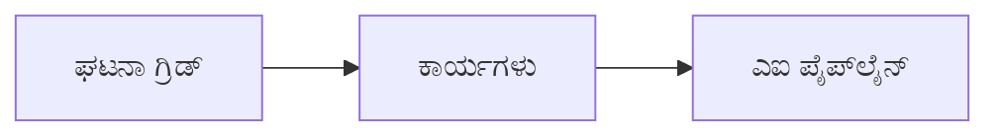

# ಅಧ್ಯಾಯ 8: ಉತ್ಪಾದನೆ ಮತ್ತು ಎಂಟರ್‌ಪ್ರೈಸ್ ಮಾದರಿಗಳು

**📚 ಕೋರ್ಸ್**: [AZD For Beginners](../../README.md) | **⏱️ ಅವಧಿ**: 2-3 ಗಂಟೆಗಳು | **⭐ ಸಂಕೀರ್ಣತೆ**: ಉನ್ನತ

---

## ಸಾರಾಂಶ

ಈ ಅಧ್ಯಾಯವು ಎಂಟರ್‌ಪ್ರೈಸ್-ಸಿದ್ಧ ನಿಯೋಜನೆ ಮಾದರಿಗಳು, ಭದ್ರತಾ ಕಠಿಣಗೊಳಿಸುವಿಕೆ, ನಿಗಾವಣೆ ಮತ್ತು ಉತ್ಪಾದನಾ AI ಕೆಲಸಭಾರಗಳಿಗೆ ಖರ್ಚು ಆಪ್ಟಿಮೈಸೇಶನ್ ಅನ್ನು ಒಳಗೊಂಡಿದೆ.

> ಈ ದಾಖಲೆ `azd 1.25.6` ಅನ್ನು ಜೂನ್ 2026 ರಲ್ಲಿ ದೃಢೀಕರಿಸಲಾಗಿದೆ.

## ಕಲಿಕೆಯ ಉದ್ದೇಶಗಳು

ಈ ಅಧ್ಯಾಯವನ್ನು ಪೂರ್ಣಗೊಳಿಸುವ ಮೂಲಕ ನೀವು:
- ಬಹು-ಪ್ರದೇಶ ಪ್ರತಿರೂಪಿತ ಅನ್ವಯಗಳನ್ನು ನಿಯೋಜಿಸುವುದು
- ಎಂಟರ್‌ಪ್ರೈಸ್ ಭದ್ರತಾ ಮಾದರಿಗಳನ್ನು ಜಾರಿಗೆ ತರುವುದು
- ಸಮಗ್ರ ನಿಗಾವಣೆಯನ್ನು ಸಂರಚಿಸುವುದು
- ಪ್ರಕೋಪದ ಮೇಲೆ ಖರ್ಚನ್ನು ಆಪ್ಟಿಮೈಸ್ ಮಾಡುವುದು
- AZD ನೊಂದಿಗೆ CI/CD ಪೈಪ್‌ಲೈನ್ಗಳನ್ನು ಹೊಂದಿಸುವುದು

---

## 📚 ಪಾಠಗಳು

| # | ಪಾಠ | ವಿವರಣೆ | ಸಮಯ |
|---|--------|-------------|------|
| 1 | [ಉತ್ಪಾದನಾ AI ಅಭ್ಯಾಸಗಳು](production-ai-practices.md) | ಎಂಟರ್‌ಪ್ರೈಸ್ ನಿಯೋಜನೆ ಮಾದರಿಗಳು | 90 min |

---

## 🚀 ಉತ್ಪಾದನಾ ಪರಿಶೀಲನಾ ಪಟ್ಟಿ

- [ ] ಬಹು-ಪ್ರದೇಶ ನಿಯೋಜನೆ ಪ್ರತಿರೋಧಕ್ಕೆ
- [ ] ಪ್ರಮಾಣೀಕರಣಕ್ಕಾಗಿ ನಿರ್ವಹಿತ ಐಡೆಂಟಿಟಿ (ಕೀಗಳು ಇಲ್ಲ)
- [ ] ನಿಗಾವಿಗಾಗಿ Application Insights
- [ ] ಖರ್ಚು ಬಜೆಟ್‌ಗಳು ಮತ್ತು ಎಚ್ಚರಿಕೆಗಳು ಕಾನ್ಫಿಗರ್ ಮಾಡಲಾಗಿದೆ
- [ ] ಭದ್ರತಾ ಸ್ಕ್ಯಾನಿಂಗ್ ಸಕ್ರಿಯವಾಗಿದೆ
- [ ] CI/CD ಪೈಪ್‌ಲೈನ್ ಸಂಯೋಜನೆ
- [ ] ವಿಪತ್ತು ಪುನಃಸ್ಥಾಪನಾ ಯೋಜನೆ

---

## 🏗️ ವಾಸ್ತುಶಿಲ್ಪ ಮಾದರಿಗಳು

### ಮಾದರಿ 1: ಮೈಕ್ರೋಸರ್ವಿಸಸ್ AI


### ಮಾದರಿ 2: ಘಟನೆ-ಚಾಲಿತ AI



---

## 🔐 ಭದ್ರತಾ ಉತ್ತಮ ಅಭ್ಯಾಸಗಳು

```bicep
// Use managed identity
identity: {
  type: 'SystemAssigned'
}

// Private endpoints for AI services
properties: {
  publicNetworkAccess: 'Disabled'
  networkAcls: {
    defaultAction: 'Deny'
  }
}
```

---

## 💰 ಖರ್ಚು ಆಪ್ಟಿಮೈಸೇಶನ್

| ತಂತ್ರ | ಉಳಿತಾಯ |
|----------|---------|
| ಶೂನ್ಯಕ್ಕೆ ಸ್ಕೇಲ್ (Container Apps) | 60-80% |
| ಡೆವ್‌ಗಾಗಿ ਉಪಭೋಗ ಮಟ್ಟಗಳನ್ನು ಬಳಸಿ | 50-70% |
| ನಿಗದಿತ ವೇಳೆಯ ಸ್ಕೇಲಿಂಗ್ | 30-50% |
| ಕಾಯ್ದಿರಿಸಿದ ಸಾಮರ್ಥ್ಯ | 20-40% |

```bash
# ಬಜೆಟ್ ಎಚ್ಚರಿಕೆಗಳನ್ನು ಸೆಟ್ ಮಾಡಿ
az consumption budget create \
  --budget-name "AI-Budget" \
  --amount 500 \
  --category Cost \
  --time-grain Monthly
```

---

## 📊 ಮೋನಿಟರಿಂಗ್ ಸೆಟ್‌ಅಪ್

```bash
# ಲಾಗ್‌ಗಳನ್ನು ಸ್ಟ್ರೀಮ್ ಮಾಡಿ
azd monitor --logs

# Application Insights ಅನ್ನು ಪರಿಶೀಲಿಸಿ
azd monitor --overview

# ಮೆಟ್ರಿಕ್‌ಗಳನ್ನು ವೀಕ್ಷಿಸಿ
az monitor metrics list --resource <resource-id>
```

---

## 🔗 ನ್ಯಾವಿಗೇಶನ್

| ದಿಕ್ಕು | ಅಧ್ಯಾಯ |
|-----------|---------|
| **ಹಿಂದಿನ** | [ಅಧ್ಯಾಯ 7: ದೋಷ ಪರಿಹಾರ](../chapter-07-troubleshooting/README.md) |
| **ಕೋರ್ಸ್ ಪೂರ್ಣ** | [Course Home](../../README.md) |

---

## 📖 ಸಂಬಂಧಿತ ಸಂಪನ್ಮೂಲಗಳು

- [AI ಏಜೆಂಟ್ಸ್ ಮಾರ್ಗದರ್ಶಿ](../chapter-02-ai-development/agents.md)
- [Application Insights](../chapter-06-pre-deployment/application-insights.md)
- [ಬಹು-ಏಜೆಂಟ್ ಪರಿಹಾರಗಳು](../chapter-05-multi-agent/README.md)
- [ಮೈಕ್ರೋಸರ್ವಿಸಸ್ ಉದಾಹರಣೆ](../../examples/microservices/README.md)

---

<!-- CO-OP TRANSLATOR DISCLAIMER START -->
**ಅಸ್ವೀಕಾರ**:
ಈ ದಸ್ತಾವೇಜು AI ಅನುವಾದ ಸೇವೆ [Co-op Translator](https://github.com/Azure/co-op-translator) ಬಳಸಿ ಅನುವಾದಿಸಲಾಗಿದೆ. ನಾವು ನಿಖರತೆಯನ್ನು ಸಾಧಿಸಲು ಪ್ರಯತ್ನಿಸುತ್ತಿದ್ದರೂ, ದಯವಿಟ್ಟು ಗಮನಿಸಿ, ಸ್ವಯಂಚಾಲಿತ ಅನುವಾದಗಳಲ್ಲಿ ದೋಷಗಳು ಅಥವಾ ಅಸಡ್ಡೆಗಳು ಇರಬಹುದು. ಮೂಲ ಭಾಷೆಯಲ್ಲಿರುವ ಮೂಲ ದಸ್ತಾವೇಜು ಪ್ರಾಮಾಣಿಕ ಮೂಲವೆಂದು ಪರಿಗಣಿಸಬೇಕು. ಪ್ರಮುಖ ಮಾಹಿತಿಗಾಗಿ, ವೃತ್ತಿಪರ ಮಾನವ ಅನುವಾದವನ್ನು ಶಿಫಾರಸು ಮಾಡಲಾಗುತ್ತದೆ. ಈ ಅನುವಾದವನ್ನು ಬಳಸುವ ಮೂಲಕ ಉಂಟಾಗುವ ಯಾವುದೇ ತಪ್ಪು ಅರ್ಥಗಳ ಅಥವಾ ತಪ್ಪು ವ್ಯಾಖ್ಯಾನಗಳ ಬಗ್ಗೆ ನಾವು ಹೊಣೆಗಾರರಲ್ಲ.
<!-- CO-OP TRANSLATOR DISCLAIMER END -->