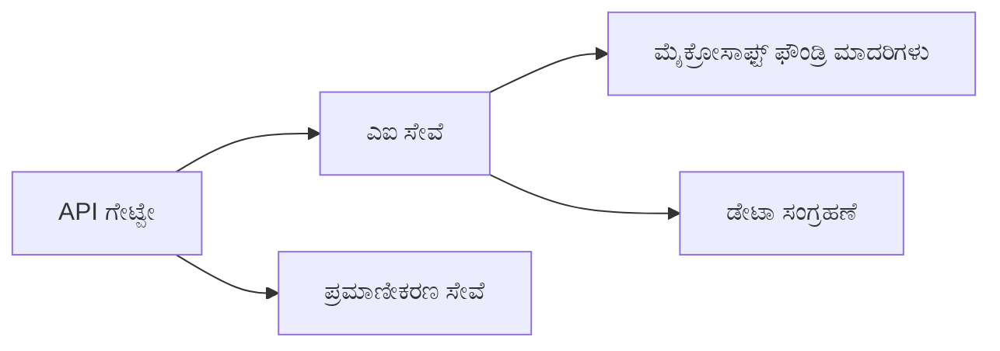
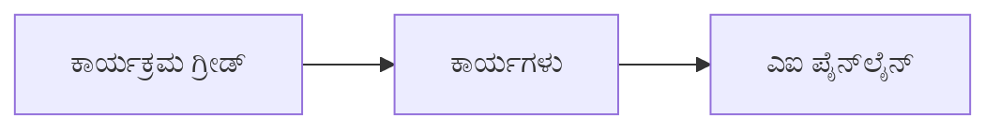

# ಅಧ್ಯಾಯ 8: ಉತ್ಪಾದನೆ ಮತ್ತು ಎಂಟರ್‌ಪ್ರೈಸ್ ಮಾದರಿಗಳು

**📚 ಕೋರ್ಸ್**: [ಆಪ್ಟಿಜೆಡಿಯು ಶುರುವಾಗಿದವರಿಗಾಗಿ](../../README.md) | **⏱️ ಅವಧಿ**: 2-3 ಗಂಟೆಗಳು | **⭐ ಸಂಕೀರ್ಣತೆ**: ಅಗ್ರಗಣ್ಯ

---

## ಅವಲೋಕನ

ಈ ಅಧ್ಯಾಯವು ಉತ್ಸಾಹಪೂರ್ವಕ ಎಂಟರ್‌ಪ್ರೈಸ್ ಹೊರಡಿಸುವ ಮಾದರಿಗಳು, ಭದ್ರತೆ ಗಟ್ಟಿಮುಟ್ಟಿಸುವುದು, ಮಾನಿಟರಿಂಗ್, ಮತ್ತು ಉತ್ಪಾದನಾ AI ಕೆಲಸಗಳಿಗೆ ವೆಚ್ಚ ನಿಯಂತ್ರಣ ಕುರಿತು ಹೇಳುತ್ತದೆ.

> ಮಾರ್ಚ್ 2026 ರಲ್ಲಿ `azd 1.23.12` ವಿರುದ್ಧ ಪರಿಶೀಲಿಸಲಾಗಿದೆ.

## ಕಲಿಕಾ ಗುರಿಗಳು

ಈ ಅಧ್ಯಾಯವನ್ನು ಪೂರ್ಣಗೊಳಿಸುವ ಮೂಲಕ, ನೀವು:
- ಬಹು-ಪ್ರದೇಶ ಪ್ರತಿರೋಧಕ ಅಪ್ಲಿಕೇಶನ್‌ಗಳನ್ನು ಕಂಡುಹಿಡಿಯಬಹುದು
- ಎಂಟರ್‌ಪ್ರೈಸ್ ಭದ್ರತಾ ಮಾದರಿಗಳನ್ನು ಅನುಷ್ಠಾನ ಮಾಡಬಹುದು
- ಸಂಪೂರ್ಣ ಮಾನಿಟರಿಂಗ್ ಅನ್ನು ಸಂರಚಿಸಬಹುದು
- ವ್ಯಾಪಕ ಪ್ರಮಾಣದಲ್ಲಿ ವೆಚ್ಚಗಳನ್ನು ಆಪ್ಟಿಮೈಸ್ ಮಾಡಬಹುದು
- AZD ಮೂಲಕ CI/CD ಪೈಪ್‌ಲೈನ್ಗಳನ್ನು ಸ್ಥಾಪಿಸಬಹುದು

---

## 📚 ಪಾಠಗಳು

| # | ಪಾಠ | ವಿವರಣೆ | ಸಮಯ |
|---|--------|-------------|------|
| 1 | [ಉತ್ಪಾದನಾ AI ಅಭ್ಯಾಸಗಳು](production-ai-practices.md) | ಎಂಟರ್‌ಪ್ರೈಸ್ ಹೊರಡಿಸುವ ಮಾದರಿಗಳು | 90 ನಿಮಿಷಗಳು |

---

## 🚀 ಉತ್ಪಾದನಾ ಪರಿಶೀಲನಾ ಪಟ್ಟಿ

- [ ] ಪ್ರತಿರೋಧಕತೆಗಾಗಿ ಬಹು-ಪ್ರದೇಶ ವಿನ್ಯಾಸ
- [ ] ಪರಿಶೀಲನೆಗೆ ನಿರ್ವಹಿತ ಐಡಿಂಟಿಟಿ (ಯಾವುದೇ ಕೀಸ್ ಇಲ್ಲ)
- [ ] ಮಾನಿಟರಿಂಗ್‌ಗಾಗಿ ಅಪ್ಲಿಕೇಶನ್ ಇನ್ಸೈಟ್ಸ್
- [ ] ಖರ್ಚು ಬಜೆಟ್ ಮತ್ತು ಅಲರ್ಟ್‌ಗಳ ಸಂರಚನೆ
- [ ] ಭದ್ರತೆ ಸ್ಕ್ಯಾನಿಂಗ್ ಸಕ್ರಿಯಗೊಳಿಸಲಾಗಿದೆ
- [ ] CI/CD ಪೈಪ್‌ಲೈನ್ ಎಂಟಿಗ್ರೇಶನ್
- [ ] ವಿಪತ್ತು ಪುನರ್‌ಪ್ರಾಪ್ತಿ ಯೋಜನೆ

---

## 🏗️ ವಾಸ್ತುಶಿಲ್ಪ ಮಾದರಿಗಳು

### ಮಾದರಿ 1: ಮೈಕ್ರೋಸರ್ವಿಸಸ್ AI


### ಮಾದರಿ 2: ಈವೆಂಟ್‌ನಿರ್ದೇಶಿತ AI


---

## 🔐 ಭದ್ರತೆ ಉತ್ತಮ ಅಭ್ಯಾಸಗಳು

```bicep
// Use managed identity
identity: {
  type: 'SystemAssigned'
}

// Private endpoints for AI services
properties: {
  publicNetworkAccess: 'Disabled'
  networkAcls: {
    defaultAction: 'Deny'
  }
}
```

---

## 💰 ವೆಚ್ಚ ಆಪ್ಟಿಮೈಜೆಷನ್

| ತಂತ್ರ | ಉಳಿತಾಯ |
|----------|---------|
| ಸ್ಕೇಲ್ ಟು ಜೀರು (ಕಂಟೈನರ್ ಅಪ್ಸ್) | 60-80% |
| ಡೆವ್‌ಗಾಗಿ ಬಳಕೆಯ ಮಟ್ಟಗಳು | 50-70% |
| ನಿಗದಿತ ಸ್ಕೇಲಿಂಗ್ | 30-50% |
| ಮೀಸಲಿಡಲ್ಪಟ್ಟ ಸಾಮರ್ಥ್ಯ | 20-40% |

```bash
# ಬಜೆಟ್ ಎಚ್ಚರಿಕೆಗಳನ್ನು ಸೆಟ್ ಮಾಡಿ
az consumption budget create \
  --budget-name "AI-Budget" \
  --amount 500 \
  --category Cost \
  --time-grain Monthly
```

---

## 📊 ಮಾನಿಟರಿಂಗ್ ಸ್ಥಾಪನೆ

```bash
# ಲಾಗ್‌ಗಳನ್ನು ಸ್ಟ್ರೀಮ್ ಮಾಡಿ
azd monitor --logs

# ಅಪ್ಲಿಕೇಶನ್ ಇನ್ಸೈಟ್ಸ್ ಪರಿಶೀಲಿಸಿ
azd monitor --overview

# ಮೆಟ್ರಿಕ್‌ಗಳನ್ನು ವೀಕ್ಷಿಸಿ
az monitor metrics list --resource <resource-id>
```

---

## 🔗 ನಾವಿಗೇಶನ್

| ದಿಕ್ಕು | ಅಧ್ಯಾಯ |
|-----------|---------|
| **ಹಿಂದಿನದು** | [ಅಧ್ಯಾಯ 7: ಸಮಸ್ಯೆ ಪರಿಹಾರ](../chapter-07-troubleshooting/README.md) |
| **ಕೋರ್ಸ್ ಪೂರ್ಣ** | [ಕೋರ್ಸ್ ಹೋಮ್](../../README.md) |

---

## 📖 ಸಂಬಂಧಿತ ಸಂಪನ್ಮೂಲಗಳು

- [AI ಏಜೆಂಟ್ಸ್ ಮಾರ್ಗದರ್ಶಿ](../chapter-02-ai-development/agents.md)
- [ಅಪ್ಲಿಕೇಶನ್ ಇನ್ಸೈಟ್ಸ್](../chapter-06-pre-deployment/application-insights.md)
- [ಬහු ಏಜೆಂಟ್ ಪರಿಹಾರಗಳು](../chapter-05-multi-agent/README.md)
- [ಮೈಕ್ರೋಸರ್ವಿಸಸ್ ಉದಾಹರಣೆ](../../examples/microservices/README.md)

---

<!-- CO-OP TRANSLATOR DISCLAIMER START -->
**ಒಪ್ಪಿಗೆಯ ನಿರಾಕರಣೆ**:  
ಈ ದಾಖಲೆ AI ಭಾಷಾಂತರ ಸೇವೆ [Co-op Translator](https://github.com/Azure/co-op-translator) ಬಳಸಿ ಭಾಷಾಂತರಿಸಲಾಗಿದೆ. ನಾವು ಶುದ್ದತೆಯನ್ನು ಸಾಕಷ್ಟು ಗಮನಿಸುವುದಾದರೂ, ಸ್ವಯಂಚಾಲಿತ ಭಾಷಾಂತರಗಳಲ್ಲಿ ತಪ್ಪುಗಳು ಅಥವಾ ಅಸ್ಪಷ್ಟತೆಗಳಿರಬಹುದು ಎಂದು ದಯವಿಟ್ಟು ಗಮನಿಸಿ. ಮೂಲ ಭಾಷೆಯ ದಾಖಲೆಯನ್ನು ಪ್ರಾಮಾಣಿಕ ಮೂಲ ಎಂದು ಪರಿಗಣಿಸಬೇಕು. ಪ್ರಮುಖ ಮಾಹಿತಿಗಾಗಿ ವೃತ್ತಿಪರ ಮಾನವ ಭಾಷಾಂತರವನ್ನು ಶಿಫಾರಸು ಮಾಡಲಾಗುತ್ತದೆ. ಈ ಭಾಷಾಂತರ ಬಳಕೆಯಿಂದ ಉಂಟಾಗುವ ಯಾವುದೇ ಅರ್ಥಮಾಡಿಕೊಳ್ಳುವಿಕೆ ಅಥವಾ ತಪ್ಪು ಅರ್ಥಮಾಡಿಕೊಳ್ಳುವಿಕೆಗೆ ನಾವು ಹೊಣೆಗಾರರಾಗುವುದಿಲ್ಲ.
<!-- CO-OP TRANSLATOR DISCLAIMER END -->