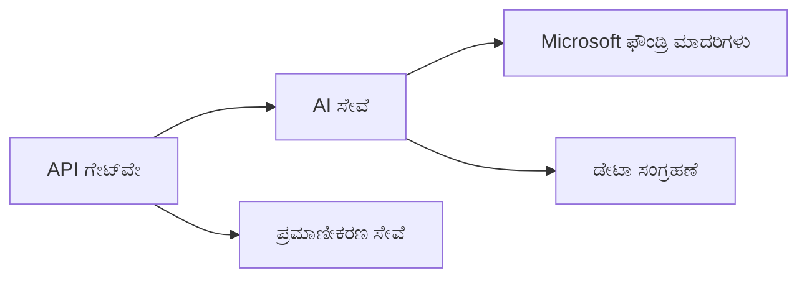
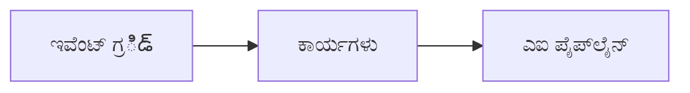

# ಅಧ್ಯಾಯ 8: ಉತ್ಪಾದನೆ ಮತ್ತು ಎಂಟರ್‌ಪ್ರೈಸ್ ಮಾದರಿಗಳು

**📚 ಪಾಠ್ಯಕ್ರಮ**: [ಆರಂಭಿಕರಿಗಾಗಿ AZD](../../README.md) | **⏱️ ಕಾಲಾವಧಿ**: 2-3 ಗಂಟೆಗಳು | **⭐ ಸಂಕೀರ್ಣತೆ**: ಉನ್ನತ

---

## ಅವಲೋಕನ

ಈ ಅಧ್ಯಾಯವು ಎಂಟರ್‌ಪ್ರೈಸ್-ಸಿದ್ಧ ನಿಯೋಜನಾ ಮಾದರಿಗಳು, ಭದ್ರತಾ ಧೃಢೀಕರಣ, ಮಾನಿಟರಿಂಗ್, ಮತ್ತು ಉತ್ಪಾದನಾ AI ಕೆಲಸಗಳಿಗೆ ವೆಚ್ಚದ ಅನುಕೂಲಗೊಳಿಸುವಿಕೆಗಳನ್ನು ಒಳಗೊಂಡಿದೆ.

## ಕಲಿಯುವ ಉದ್ದೇಶಗಳು

ಈ ಅಧ್ಯಾಯವನ್ನು ಪೂರ್ಣಗೊಳಿಸಿದರೆ, ನೀವು:
- ಬಹು-ರೀಜನಲ್ ಪ್ರತಿರೋಧಕ ಅಪ್ಲಿಕೇಶನ್‌ಗಳನ್ನು ನಿಯೋಜಿಸುವುದು
- ಎಂಟರ್‌ಪ್ರೈಸ್ ಭದ್ರತಾ ಮಾದರಿಗಳನ್ನು ಜಾರಿಗೆ ತರುವುದು
- ವ್ಯಾಪಕ ಮಾನಿಟರಿಂಗ್ ಅನ್ನು ಸಂರಚಿಸುವುದು
- ವಿಸ್ತೃತ ಮಟ್ಟದಲ್ಲಿ ವೆಚ್ಚಗಳನ್ನು ಉತ್ತಮಗೊಳಿಸುವುದು
- AZD ಬಳಸಿ CI/CD ಪೈಪ್‌ಲೈನ್‌ಗಳನ್ನು ಸ್ಥಾಪಿಸುವುದು

---

## 📚 ಪಾಠಗಳು

| # | ಪಾಠ | ವಿವರಣೆ | ಸಮಯ |
|---|--------|-------------|------|
| 1 | [ಉತ್ಪಾದನಾ AI ಅಭ್ಯಾಸಗಳು](production-ai-practices.md) | ಎಂಟರ್‌ಪ್ರೈಸ್ ನಿಯೋಜನಾ ಮಾದರಿಗಳು | 90 ನಿಮಿಷ |

---

## 🚀 ಉತ್ಪಾದನಾ ಪರಿಶೀಲನೆ ಪಟ್ಟಿ

- [ ] ಬಹು-ರೀಜನಲ್ ಸ್ಥಿರತೆಗಾಗಿ ನಿಯೋಜನೆ
- [ ] ಪ್ರಮಾಣೀಕರಣಕ್ಕಾಗಿ ನಿರ್ವಹಿತ ಐಡೆಂಟಿಟಿ (ಕೀಲಿಗಳು ಇಲ್ಲ)
- [ ] ಮಾನಿಟರಿಂಗ್‌ಗಾಗಿ Application Insights
- [ ] ವೆಚ್ಚ ಬಜೆಟ್‌ಗಳು ಮತ್ತು ಎಚ್ಚರಿಕೆಗಳನ್ನು ಸಂರಚಿಸಲಾಗಿದೆ
- [ ] ಭದ್ರತಾ ಸ್ಕ್ಯಾನಿಂಗ್ ಸಕ್ರಿಯವಾಗಿದೆ
- [ ] CI/CD ಪೈಪ್‌ಲೈನ್ ಒಗ್ಗೂಡಿಕೆ
- [ ] ವಿಪತ್ತು ಪುನರ್‌ಸ್ಥಾಪನ ಯೋಜನೆ

---

## 🏗️ ವಾಸ್ತುಶಿಲ್ಪ ಮಾದರಿಗಳು

### ಮಾದರಿ 1: ಮೈಕ್ರೋಸರ್ವಿಸಸ್ AI


### ಮಾದರಿ 2: ಘಟನೆ-ಚಾಲಿತ AI


---

## 🔐 ಸುರಕ್ಷತಾ ಉತ್ತಮ ಅಭ್ಯಾಸಗಳು

```bicep
// Use managed identity
identity: {
  type: 'SystemAssigned'
}

// Private endpoints for AI services
properties: {
  publicNetworkAccess: 'Disabled'
  networkAcls: {
    defaultAction: 'Deny'
  }
}
```

---

## 💰 ವೆಚ್ಚದ ಅನುಕೂಲಗೊಳಿಸುವಿಕೆ

| ತಂತ್ರ | ಉಳಿತಾಯ |
|----------|---------|
| ಶೂನ್ಯಕ್ಕೆ ಸ್ಕೇಲ್ (Container Apps) | 60-80% |
| ಅಭಿವೃದ್ಧಿಗಾಗಿ ಬಳಕೆ ಮಟ್ಟಗಳನ್ನು ಬಳಸಿ | 50-70% |
| ನಿಗದಿತ ವೇಳೆಯ ಸ್ಕೇಲಿಂಗ್ | 30-50% |
| ಮೀಸಲಾಗಿರುವ ಸಾಮರ್ಥ್ಯ | 20-40% |

```bash
# ಬಜೆಟ್ ಎಚ್ಚರಿಕೆಗಳನ್ನು ಹೊಂದಿಸಿ
az consumption budget create \
  --budget-name "AI-Budget" \
  --amount 500 \
  --category Cost \
  --time-grain Monthly
```

---

## 📊 ಮಾನಿಟರಿಂಗ್ ಕಾನ್ಫಿಗರೇಶನ್

```bash
# ಲಾಗ್‌ಗಳನ್ನು ಸ್ಟ್ರೀಮ್ ಮಾಡಿ
azd monitor --logs

# Application Insights ಪರಿಶೀಲಿಸಿ
azd monitor

# ಮೆಟ್ರಿಕ್‌ಗಳನ್ನು ವೀಕ್ಷಿಸಿ
az monitor metrics list --resource <resource-id>
```

---

## 🔗 ಸಂಚರಣೆ

| ದಿಕ್ಕು | ಅಧ್ಯಾಯ |
|-----------|---------|
| **ಹಿಂದಿನ** | [ಅಧ್ಯಾಯಕ 7: ಸಮಸ್ಯೆ ಪರಿಹಾರ](../chapter-07-troubleshooting/README.md) |
| **ಕೋರ್ಸ್ ಪೂರ್ಣ** | [ಕೋರ್ಸ್ ಮುಖ್ಯಪುಟ](../../README.md) |

---

## 📖 ಸಂಬಂಧಿತ ಸಂಪನ್ಮೂಲಗಳು

- [AI ಏಜೆಂಟ್ಸ್ ಮಾರ್ಗದರ್ಶನ](../chapter-02-ai-development/agents.md)
- [Application Insights](../chapter-06-pre-deployment/application-insights.md)
- [ಬಹು-ಏಜೆಂಟ್ ಪರಿಹಾರಗಳು](../chapter-05-multi-agent/README.md)
- [ಮೈಕ್ರೋಸರ್ವಿಸಸ್ ಉದಾಹರಣೆ](../../examples/microservices/README.md)

---

<!-- CO-OP TRANSLATOR DISCLAIMER START -->
**ನಿರಾಕರಣೆ**:
ಈ ದಸ್ತಾವೇಜನ್ನು AI ಅನುವಾದ ಸೇವೆ [Co-op Translator](https://github.com/Azure/co-op-translator) ಬಳಸಿ ಅನುವಾದಿಸಲಾಗಿದೆ. ನಾವು ಶುದ್ಧತೆಗೆ ಪ್ರಯತ್ನಿಸಿದರೂ ಸಹ, ಸ್ವಯಂಚಾಲಿತ ಅನುವಾದಗಳಲ್ಲಿ ದೋಷಗಳು ಅಥವಾ ಅಸತ್ಯತೆಗಳು ಇರಬಹುದೆನೆಂದು कृಪಯಾ ಗಮನದಲ್ಲಿರಲಿ. ಮೂಲ ಭಾಷೆಯಲ್ಲಿರುವ ಮೂಲ ದಸ್ತಾವೇಜನ್ನು ಅಧಿಕೃತ ಮೂಲವೆಂದು ಪರಿಗಣಿಸಬೇಕು. ಮಹತ್ವದ ಮಾಹಿತಿಗಾಗಿ ವೃತ್ತಿಪರ ಮಾನವ ಅನುವಾದವನ್ನು ಶಿಫಾರಸು ಮಾಡಲಾಗುತ್ತದೆ. ಈ ಅನುವಾದದ ಬಳಕೆಯಿಂದ ಉಂಟಾಗುವ ಯಾವುದೇ ತಪ್ಪು ಅರ್ಥಗತಿಗಳು ಅಥವಾ ತಪ್ಪು ವ್ಯಾಖ್ಯಾನಗಳಿಗೆ ನಾವು ಜವಾಬ್ದಾರಿಯಲ್ಲ.
<!-- CO-OP TRANSLATOR DISCLAIMER END -->