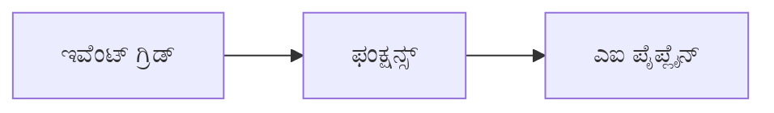

# ಅಧ್ಯಾಯ 8: ಉತ್ಪಾದನೆ ಮತ್ತು ಉದ್ಯಮ ಮಾದರಿಗಳು

**📚 ಕೋರ್ಸ್**: [ಆಜ್ಡಿ ಆರಂಭಿಕರಿಗಾಗಿ](../../README.md) | **⏱️ ಅವಧಿ**: 2-3 ಗಂಟೆಗಳು | **⭐ ಸಂಕೀರ್ಣತೆ**: ಪ್ರगतಿಶೀಲ

---

## ಅವಲೋಕನ

ಈ ಅಧ್ಯಾಯದಲ್ಲಿ ಉದ್ಯಮಕ್ಕೆ ತಾಕತ್ತುಗಾರ ಮડಿಸಲು ಅನುಸರಿಸುವ ನಿಯೋಜನೆ ಮಾದರಿಗಳು, ಭದ್ರತೆ ಬಲಪಡಿಸುವಿಕೆ, ಮೇಲ್ವಿಚಾರಣೆ ಮತ್ತು ಉತ್ಪಾದನಾ AI ಕೆಲಸಗಳಿಗೆ ವೆಚ್ಚದ ಅನ್ವಯಿಕತೆಗಳನ್ನು ತಿಳಿಸಲಾಗುತ್ತದೆ.

> `azd 1.27.1` ಜುಲೈ 2026 ರಲ್ಲಿ ಪರಿಶೀಲಿಸಲಾಗಿದೆ.

## ಅಧ್ಯಯನ ಗುರಿಗಳು

ಈ ಅಧ್ಯಾಯವನ್ನು ಪೂರ್ಣಗೊಳಿಸುವ ಮೂಲಕ, ನೀವು:
- ಬಹು-ಪ್ರದೇಶ ಸತತ ಕಾರ್ಯನಿರ್ವಹಣಾ ಅಪ್ಲಿಕೇಶನ್‌ಗಳನ್ನು ನಿಯೋಜಿಸುವಿರಿ
- ಉದ್ಯಮ ಭದ್ರತೆ ಮಾದರಿಗಳನ್ನು ಅನುಷ್ಠಾನ ಮಾಡುವುದು
- ಸಂಯುಕ್ತ ಮೇಲ್ವಿಚಾರಣೆಯನ್ನು ಕಾನ್ಫಿಗರ್ ಮಾಡುವುದು
- ಅಳತೆಯ ಮೇಲೆ ವೆಚ್ಚವನ್ನು ತಕ್ಕಮಟ್ಟಿಗೆ ಕಡಿಮೆ ಮಾಡುವುದು
- ಆಜ್ಡಿ ಮೂಲಕ ಸಿಐ/ಸಿಡಿ ಪೈಪ್ಲೈನ್ಸ್ ಸ್ಥಾಪಿಸುವುದು

---

## 📚 ಪಾಠಗಳು

| # | ಪಾಠ | ವಿವರಣೆ | ಸಮಯ |
|---|--------|-------------|------|
| 1 | [ಉತ್ಪಾದನಾ AI ಅಭ್ಯಾಸಗಳು](production-ai-practices.md) | ಉದ್ಯಮ ನಿಯೋಜನೆ ಮಾದರಿಗಳು | 90 ನಿಮಿಷಗಳು |

---

## 🚀 ಉತ್ಪಾದನೆ ಪರಿಶೀಲನೆ ಪಟ್ಟಿ

- [ ] ಬಹು-ಪ್ರದೇಶ ನಿಯೋಜನೆಗಾಗಿ ಸತತತೆ
- [ ] ಉತ್ಪತ್ತಿಗಾಗಿ ನಿರ್ವಹಿತ ಗುರುತು (ಕೀಗಳಿಲ್ಲ)
- [ ] ಅಪ್ಲಿಕೇಶನ್ ಇನ್ಸೈಟ್ಸ್ ಮೂಲಕ ಮೇಲ್ವಿಚಾರಣೆ
- [ ] ವೆಚ್ಚ ಬಜೆಟ್‌ಗಳು ಮತ್ತು ಎಚ್ಚರಿಕೆಗಳ ಕಾನ್ಫಿಗರೇಶನ್
- [ ] ಭದ್ರತೆ ಸ್ಕ್ಯಾನಿಂಗ್ ಸಕ್ರಿಯವಾಗಿದೆ
- [ ] ಸಿಐ/ಸಿಡಿ ಪೈಪ್ಲೈನ್ ಏಕೀಕರಣ
- [ ] ದುರಂತ ಪುನರುತ್ಪಾದನಾ ಯೋಜನೆ

---

## 🏗️ ವಾಸ್ತುಶಿಲ್ಪ ಮಾದರಿಗಳು

### ಮಾದರಿ 1: ಮೈಕ್ರೋಸರ್ವಿಸಸ್ AI


### ಮಾದರಿ 2: ಘಟನೆಚಾಲಿತ AI



---

## 🔐 ಭದ್ರತೆ ಉತ್ತಮ ಅಭ್ಯಾಸಗಳು

```bicep
// Use managed identity
identity: {
  type: 'SystemAssigned'
}

// Private endpoints for AI services
properties: {
  publicNetworkAccess: 'Disabled'
  networkAcls: {
    defaultAction: 'Deny'
  }
}
```

---

## 💰 ವೆಚ್ಚ ತಗ್ಗಿಸುವಿಕೆ

| ತಂತ್ರ | ಉಳಿತಾಯ |
|----------|---------|
| ಶೂನ್ಯಕ್ಕೆ ಸ್ಕೆಲ್ (ಕಂಟೇನರ್ ಅಪ್ಸ್) | 60-80% |
| ಅಭಿವೃದ್ಧಿಗಾಗಿ ಉಪಭೋಗಿ ಮಟ್ಟಗಳನ್ನು ಬಳಸು | 50-70% |
| ಕಾರ್ಯಕ್ರಮಿತ ಪ್ರಮಾಣವನ್ನು ಹೆಚ್ಚಿಸುವುದು | 30-50% |
| ಮೀಸಲಾದ ಸಾಮರ್ಥ್ಯ | 20-40% |

```bash
# ಬಜೆಟ್ ಎಚ್ಚರಿಕೆಗಳನ್ನು ಹೊಂದಿಸಿ
az consumption budget create \
  --budget-name "AI-Budget" \
  --amount 500 \
  --category Cost \
  --time-grain Monthly
```

---

## 📊 ಮೇಲ್ವಿಚಾರಣಾ ಸ್ಥಾಪನೆ

```bash
# ಸ್ಟ್ರೀಮ್ ಲಾಗ್ಗಳು
azd monitor --logs

# ಅಪ್ಲಿಕೇಶನ್ ಇನ್ಸೈಟ್ಸ್ ಪರಿಶೀಲಿಸಿ
azd monitor --overview

# ಮೆಟ್ರಿಕ್ಸ್ ವೀಕ್ಷಿಸಿ
az monitor metrics list --resource <resource-id>
```

---

## 🔗 ನ್ಯಾವಿಗೇಶನ್

| ದಿಕ್ಕು | ಅಧ್ಯಾಯ |
|-----------|---------|
| **ಹಿಂದಿನದು** | [ಅಧ್ಯಾಯ 7: ಸಮಸ್ಯೆ ಪರಿಹಾರ](../chapter-07-troubleshooting/README.md) |
| **ಕೋರ್ಸ್ ಪೂರ್ಣಗೊಂಡಿದೆ** | [ಕೋರ್ಸ್ ಮುಖಪುಟ](../../README.md) |

---

## 📖 ಸಂಬಂಧಿತ ಸಂಪನ್ಮೂಲಗಳು

- [AI ಏಜೆಂಟ್ಸ್ ಗೈಡ್](../chapter-02-ai-development/agents.md)
- [ಅಪ್ಲಿಕೇಶನ್ ಇನ್ಸೈಟ್ಸ್](../chapter-06-pre-deployment/application-insights.md)
- [ಬಹು ಏಜೆಂಟ್ ಪರಿಹಾರಗಳು](../chapter-05-multi-agent/README.md)
- [ಮೈಕ್ರೋಸರ್ವಿಸಸ್ ಉದಾಹರಣೆ](../../examples/microservices/README.md)

---

<!-- CO-OP TRANSLATOR DISCLAIMER START -->
**ಅಸ್ವೀಕಾರ**:
ಈ ದಸ್ತಾವೇಜು AI ಅನುವಾದ ಸೇವೆ [Co-op Translator](https://github.com/Azure/co-op-translator) ಬಳಸಿ ಅನುವಾದಿಸಲಾಗಿದೆ. ನಾವು ನಿಖರತೆಯನ್ನು ಸಾಧಿಸಲು ಪ್ರಯತ್ನಿಸುತ್ತಿದ್ದರೂ, ದಯವಿಟ್ಟು ಗಮನಿಸಿ, ಸ್ವಯಂಚಾಲಿತ ಅನುವಾದಗಳಲ್ಲಿ ದೋಷಗಳು ಅಥವಾ ಅಸಡ್ಡೆಗಳು ಇರಬಹುದು. ಮೂಲ ಭಾಷೆಯಲ್ಲಿರುವ ಮೂಲ ದಸ್ತಾವೇಜು ಪ್ರಾಮಾಣಿಕ ಮೂಲವೆಂದು ಪರಿಗಣಿಸಬೇಕು. ಪ್ರಮುಖ ಮಾಹಿತಿಗಾಗಿ, ವೃತ್ತಿಪರ ಮಾನವ ಅನುವಾದವನ್ನು ಶಿಫಾರಸು ಮಾಡಲಾಗುತ್ತದೆ. ಈ ಅನುವಾದವನ್ನು ಬಳಸುವ ಮೂಲಕ ಉಂಟಾಗುವ ಯಾವುದೇ ತಪ್ಪು ಅರ್ಥಗಳ ಅಥವಾ ತಪ್ಪು ವ್ಯಾಖ್ಯಾನಗಳ ಬಗ್ಗೆ ನಾವು ಹೊಣೆಗಾರರಲ್ಲ.
<!-- CO-OP TRANSLATOR DISCLAIMER END -->