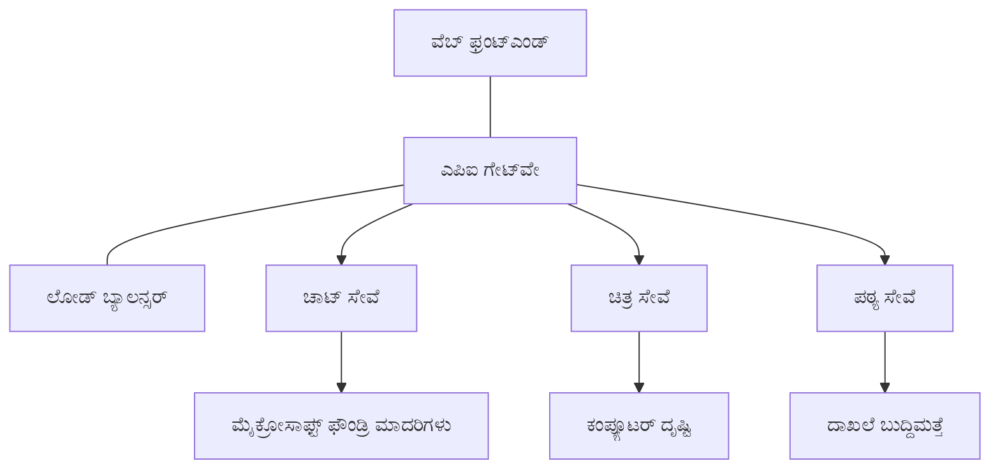

# AZDೊಂದಿಗೆ ಉತ್ಪಾದನಾ AI ಕೆಲಸದ ಭಾರದ ಉತ್ತಮ ಅಭ್ಯಾಸಗಳು

**ಅಧ್ಯಾಯ ನ್ಯಾವಿಗೇಶನ್:**
- **📚 ಕೋರ್ಸ್ ಮನೆ**: [ಆರ್ಜಿಡಿ ಆರಂಭಿಕರಿಗಾಗಿ](../../README.md)
- **📖 ಪ್ರಸ್ತುತ ಅಧ್ಯಾಯ**: ಅಧ್ಯಾಯ 8 - ಉತ್ಪಾದನೆ & ಎಂಟರ್ಪ್ರೈಸ್ ಪ್ಯಾಟರ್ನ್ಸ್
- **⬅️ ಹಿಂದಿನ ಅಧ್ಯಾಯ**: [ಅಧ್ಯಾಯ 7: ಟ್ರಬಲ್‌ಶೂಟಿಂಗ್](../chapter-07-troubleshooting/debugging.md)
- **⬅️ ಸಂಬಂಧಿಸಿದ**: [AI ವರ್ಕ್‌ಶಾಪ್ ಲ್ಯಾಬ್](ai-workshop-lab.md)
- **🎯 ಕೋರ್ಸ್ ಪೂರ್ಣಗೊಂಡಿದೆ**: [ಆರ್ಜಿಡಿ ಆರಂಭಿಕರಿಗಾಗಿ](../../README.md)

## ಅವಲೋಕನ

ಈ ಮಾರ್ಗಸೂಚಿ ಅಜೂರ್ ಡೆವಲಪರ್ CLI (AZD) ಬಳಸಿಕೊಂಡು ಉತ್ಪಾದನಾ-ಸಿದ್ಧ AI ಕೆಲಸದ ಭಾರವನ್ನು ನಿಯೋಜಿಸುವ ಕುರಿತು ಸಮಗ್ರ ಉತ್ತಮ ಅಭ್ಯಾಸಗಳನ್ನು ಒದಗಿಸುತ್ತದೆ. Microsoft Foundry Discord ಸಮುದಾಯ ಮತ್ತು ವಾಸ್ತವಿಕ ಗ್ರಾಹಕ ನಿಯೋಜನೆಗಳಿಂದ ಪಡೆದ ಪ್ರತಿಕ್ರಿಯೆಗಳ ಆಧಾರದ ಮೇಲೆ, ಈ ಅಭ್ಯಾಸಗಳು ಉತ್ಪಾದನಾ AI ವ್ಯವಸ್ಥೆಗಳಲ್ಲಿ ಸಾಮಾನ್ಯವಾದ ಸಮಸ್ಯೆಗಳನ್ನು ಪರಿಹರಿಸುತ್ತವೆ.

## ಮುಖ್ಯ ಸವಾಲುಗಳ ಪರಿಹಾರ

ನಮ್ಮ ಸಮುದಾಯದ ಮತದಾನದ ಫಲಿತಾಂಶಗಳ ಆಧಾರದ ಮೇಲೆ, ಡೆವಲಪರ್‌ಗಳು ಎದುರಿಸುವ ಪ್ರಮುಖ ಸವಾಲುಗಳು:

- **45%** ಬಹು-ಸೇವಾ AI ನಿಯೋಜನೆಗಳಲ್ಲಿ ಸಮಸ್ಯೆ ಅನುಭವಿಸುತ್ತಾರೆ
- **38%** ಕ್ರೆಡೆನ್ಶಿಯಲ್ ಮತ್ತು ರಹಸ್ಯ ನಿರ್ವಹಣೆಯಲ್ಲಿ ಸಮಸ್ಯೆ
- **35%** ಉತ್ಪಾದನಾ ಸಿದ್ಧತೆ ಮತ್ತು ಸ್ಕೇಲಿಂಗ್ ಕಷ್ಟಕರವಾಗಿದೆ
- **32%** ಉತ್ತಮ ವೆಚ್ಚ ಸಂರಚನಾ ನೀತಿಗಳನ್ನು ಬೇಕಾಗಿವೆ
- **29%** ಉತ್ತಮ ಮానಿಟರಿಂಗ್ ಮತ್ತು ಟ್ರಬಲ್‌ಶೂಟಿಂಗ್ ಊಹಿದೆಯಾಗಿದೆ

## ಉತ್ಪಾದನಾ AI ಗುಟ್ಟು ವಿನ್ಯಾಸ

### ಪ್ಯಾಟರ್ನ್ 1: ಮೈಕ್ರೋಸರ್ವೀಸ್ AI ವಾಸ್ತುಶಿಲ್ಪ

**ಬಳಸುವ ಸಮಯ**: ಬಾನಗಿನ ವಿವಿಧ ಸಾಮರ್ಥ್ಯಗಳಿರುವ ಸಂಕುಲ AI ಅರ್ಜಿಗಳು


**AZD ಅನುಸ್ಥಾಪನೆ**:

```yaml
# azure.yaml
name: enterprise-ai-platform
services:
  web:
    project: ./web
    host: staticwebapp
  api-gateway:
    project: ./api-gateway
    host: containerapp
  chat-service:
    project: ./services/chat
    host: containerapp
  vision-service:
    project: ./services/vision
    host: containerapp
  text-service:
    project: ./services/text
    host: containerapp
```

### ಪ್ಯಾಟರ್ನ್ 2: ಘಟನೆ ಚಾಲಿತ AI ಪ್ರಕ್ರಿಯೆ

**ಬಳಸುವ ಸಮಯ**: ಬ್ಯಾಚ್ ಪ್ರೊಸೆಸಿಂಗ್, ಡಾಕ್ಯುಮೆಂಟ್ ವಿಶ್ಲೇಷಣೆ, ಅಸಿಂಕ್ರೋನ್ ಕಾರ್‌ವಾರ್ಗಳು

```bicep
// Event Hub for AI processing pipeline
resource eventHub 'Microsoft.EventHub/namespaces@2023-01-01-preview' = {
  name: eventHubNamespaceName
  location: location
  sku: {
    name: 'Standard'
    tier: 'Standard'
    capacity: 1
  }
}

// Service Bus for reliable message processing
resource serviceBus 'Microsoft.ServiceBus/namespaces@2022-10-01-preview' = {
  name: serviceBusNamespaceName
  location: location
  sku: {
    name: 'Premium'
    tier: 'Premium'
    capacity: 1
  }
}

// Function App for processing
resource functionApp 'Microsoft.Web/sites@2023-01-01' = {
  name: functionAppName
  location: location
  kind: 'functionapp,linux'
  properties: {
    siteConfig: {
      appSettings: [
        {
          name: 'FUNCTIONS_EXTENSION_VERSION'
          value: '~4'
        }
        {
          name: 'AZURE_OPENAI_ENDPOINT'
          value: '@Microsoft.KeyVault(VaultName=${keyVault.name};SecretName=openai-endpoint)'
        }
      ]
    }
  }
}
```

## AI ಏಜೆಂಟ್ ಆರೋಗ್ಯದ ಬಗ್ಗೆ ಯೋಚನೆ

ಪ್ರಚಲಿತ ವೆಬ್ ಅಪ್ಲಿಕೇಶನ್ ಲಭ್ಯವಿಲ್ಲದಾಗ, ಲಕ್ಷಣಗಳು ಪರಿಚಿತವಾಗಿರುತ್ತವೆ: ಪುಟ ಲೋಡ್ ಆಗುವುದಿಲ್ಲ, API ದೋಷವನ್ನು ಹಿಂತಿರುಗಿಸುತ್ತದೆ, ಅಥವಾ ನಿಯೋಜನೆ ವಿಫಲವಾಗುತ್ತದೆ. AI ಚಾಲಿತ ಅಪ್ಲಿಕೇಶನ್‌ಗಳೂ ಈ ರೀತಿಯಾಗಿ ಮುರಿದುಹೋಯಬಹುದು—ಆದರೆ ಅವು ಸ್ಪষ্ট ದೋಷ ಸಂದೇಶಗಳನ್ನು ಮಾಡದೇ ಸೂಕ್ಷ್ಮವಾಗಿ ತಪ್ಪು ನಡೆದುಕೊಳ್ಳಬಹುದು.

ಈ ವಿಭಾಗವು ನಿಮಗೆ AI ಕೆಲಸದ ಭಾರವನ್ನು ಮಾನಿಟರ್ ಮಾಡುವ ಮಾನಸಿಕ ಮಾದರಿಯನ್ನು ರಚಿಸಲು ಸಹಾಯ ಮಾಡುತ್ತದೆ ಆದ್ದರಿಂದ ಹಾಗೆ ಅಲ್ಲದಿದ್ದಾಗ ಯಾವುದು ಪರಿಶೀಲಿಸುವುದೆಂದು ತಿಳಿದುಕೊಳ್ಳಬಹುದು.

### ಏಜೆಂಟ್ ಆರೋಗ್ಯವು ಪರಂಪರಾ ಅಪ್ಲಿಕೇಶನ್ ಆರೋಗ್ಯದಿಂದ ಹರಿದಾಡುವುದು ಹೇಗೆ

ಒಂದು ಪರಂಪರಾ ಅಪ್ಲಿಕೇಶನ್ ಅಲ್ವಾ ಕಾರ್ಯನಿರ್ವಹಿಸುತ್ತದೆ ಅಥವಾ ಇಲ್ಲ. AI ಏಜೆಂಟ್ ಕಾರ್ಯನಿರ್ವಹಿಸುತ್ತಿದ್ದು ಹೋಲಬಹುದು ಆದರೆ ದುರ್ಬಲ ಫಲಿತಾಂಶಗಳನ್ನು ತಯಾರಿಸಬಹುದು. ಏಜೆಂಟ್ ಆರೋಗ್ಯವನ್ನು ಎರಡು ಹಂತಗಳಲ್ಲಿ ಯೋಚಿಸಿ:

| ಹಂತ | ಗಮನಿಸಬೇಕಾದುದು | ಎಲ್ಲಿ ನೋಡಬೇಕು |
|-------|--------------|---------------|
| **ಸ್ಥಾಪತಂತ್ರ ಆರೋಗ್ಯ** | ಸೇವೆ ಚಾಲನೆಯಲ್ಲಿದೆಯೆ? ಸಂಪನ್ಮೂಲಗಳು ನಿಯೋಜಿತವಿವೆ? ಎಂಡ್‌ಪಾಯಿಂಟ್‍ಗೆ ತಲುಪಬಹುದೇ? | `azd monitor`, ಅಜೂರ್ ಪೋರ್ಟಲ್ ಸಂಪನ್ಮೂಲ ಆರೋಗ್ಯ, ಕಂಟೈನರ್/ಆಪ್ ಲಾಗ್‌ಗಳು |
| **ವರ್ತನೆ ಆರೋಗ್ಯ** | ಏಜೆಂಟ್ ಸರಿಯಾಗಿ ಪ್ರತಿಕ್ರಿಯಿಸುತ್ತಿದೆಯೆ? ಪ್ರತಿಕ್ರಿಯೆಗಳು ಸಮಯ ಪಾಲನೆಯಾಗಿದೆಯೆ? ಮಾದರಿ ಸರಿಯಾಗಿ ಕರೆ ಮಾಡಲಾಯಿತೆ? | ಅಪ್ಲಿಕೇಶನ್ ಇನ್ಸೈಟ್ಸ್ ಟ್ರೇಸ್‌ಗಳು, ಮಾದರಿ ಕರೆಯ ಲೇಟೆನ್ಸಿ ಅಂಶಗಳು, ಪ್ರತಿಕ್ರಿಯೆ ಗುಣಮಟ್ಟದ ಲಾಗ್‌ಗಳು |

ಸ್ಥಾಪತಂತ್ರ ಆರೋಗ್ಯ ಪರಿಚಿತವು—ಯಾವುದೇ azd ಆಪ್‌ಗೆ ಇದು ಸಮಾನವಾಗಿದೆ. ವರ್ತನೆ ಆರೋಗ್ಯ AI ಕೆಲಸದ ಭಾರಗಳ ಹೊಸ ಹಂತವನ್ನು ಅಳವಡಿಸುತ್ತದೆ.

### AI ಅಪ್ಲಿಕೇಶನ್ ನಿರೀಕ್ಷೆ ಹೊರತುಪಡುವಾಗ ಎಲ್ಲಿ ನೋಡಬೇಕು

ನಿಮ್ಮ AI ಅಪ್ಲಿಕೇಶನ್ ನಿರೀಕ್ಷಿತ ಫಲಿತಾಂಶಗಳನ್ನು ನೀಡದಿದ್ದರೆ, ಇಲ್ಲಿ ತತ್ತ್ವಮೂಲಕ ಪರಿಶೀಲನೆ ಪಟ್ಟಿ ಇದೆ:

1. **ಆಧಾರಭೂತಗಳೊಂದಿಗೆ ಆರಂಭಿಸಿ.** ಆಪ್ ಕಾರ್ಯನಿರ್ವಹಿಸುತ್ತಿದೆಯೆ? ಅವಲಂಬನೆಗಳಿಗೆ ತಲುಪಬಹುದೇ? ಯಾವುದಾದರೂ ಆಪ್‌ಗಾಗಿ `azd monitor` ಮತ್ತು ಸಂಪನ್ಮೂಲ ಆರೋಗ್ಯ ಪರಿಶೀಲಿಸಿ.
2. **ಮಾದರಿ ಸಂಪರ್ಕ ಪರಿಶೀಲಿಸಿ.** ನಿಮ್ಮ ಅಪ್ಲಿಕೇಶನ್ ಯಶಸ್ವಿಯಾಗಿ AI ಮಾದರಿಯನ್ನು ಕರೆಮಾಡುತ್ತಿದ್ದದೆಯೆ? ವಿಫಲವಾದ ಅಥವಾ ಸಮಯ ಮುಗಿದ ಮಾದರಿ ಕರೆಗಳು ಸಾಮಾನ್ಯ AI ಅಪ್ಲಿಕೇಶನ್ ಸಮಸ್ಯೆಗಳ ಮುಖ್ಯ ಕಾರಣವಾಗಿವೆ ಮತ್ತು ಅಪ್ಲಿಕೇಶನ್ ಲಾಗ್‌ಗಳಲ್ಲಿ ಕಾಣಿಸಿಕೊಳ್ಳುತ್ತದೆ.
3. **ಮಾದರಿಗೆ ಏನು ಪಡೆದಿದೆ ನೋಡಿರಿ.** AI ಪ್ರತಿಕ್ರಿಯೆಗಳು ಇನ್‌ಪುಟ್ (ಪ್ರಾಂಪ್ಟ್ ಮತ್ತು ಯಾವುದೇ ಪುನಃ ಪಡೆದ ಪರಿಸರ) ಮೇಲೆ ಅವಲಂಭಿತವಾಗಿವೆ. ಔಟ್‌ಪುಟ್ ತಪ್ಪಿದ್ದರೆ, ಇನ್‌ಪುಟ್ ಸಾಮಾನ್ಯವಾಗಿ ತಪ್ಪಿದೆ. ನಿಮ್ಮ ಅಪ್ಲಿಕೇಶನ್ ಸರಿಯಾದ ಡೇಟಾವನ್ನು ಮಾದರಿಗೆ ಕಳುಹಿಸುತ್ತಿದೆಯೆ ಅಂದು ಪರಿಶೀಲಿಸಿ.
4. **ಪ್ರತಿಕ್ರಿಯೆ ಲೇಟೆನ್ಸಿ ಪರಿಶೀಲಿಸಿ.** AI ಮಾದರಿ ಕರೆಗಳು ಸಾಮಾನ್ಯ API ಕರೆಗಳಿಗಿಂತ ನಿಧಾನವಾಗಿರುತ್ತವೆ. ನಿಮ್ಮ ಆಪ್ ನಿಧಾನಗತಿಯಾಗಿದೆ ಎಂದಾದರೆ, ಮಾದರಿ ಪ್ರತಿಕ್ರಿಯೆ ಸಮಯಗಳು ಹೆಚ್ಚಾದವೋ ಇಲ್ಲವೋ ಪರಿಶೀಲಿಸಿ—ಇದು ತಡೆ, ಸಾಮರ್ಥ್ಯ ಮಿತಿಗಳು ಅಥವಾ ಪ್ರಾದೇಶಿಕ ಜಾಮಾಗುಸಾಗುವಿಕೆ ಸೂಚಿಸಬಹುದು.
5. **ವೆಚ್ಚ ಸಂಕೇತಗಳನ್ನು ಗಮನಿಸಿ.** ಟೋಕನ್ ಬಳಕೆ ಅಥವಾ API ಕರೆಗಳಲ್ಲಿ ಅತಿರಜನಿಕ ಏರಿಕೆಗಳು ಲೂಪ್, ತಪ್ಪು ಸಂರಚಿಸಿದ್ದ ಪ್ರಾಂಪ್ಟ್ ಅಥವಾ ಹೆಚ್ಚಿನ ಪುನಃಪ್ರಯತ್ನಗಳನ್ನು ತೋರಿಸಬಹುದು.

ನೀವು ಕೂಡಲೇ ಅಭ್ಯರ್ಥಿ ಪ್ರಸಾರ ಸಾಧನಗಳನ್ನು ಸಂಪೂರ್ಣ ನಿಭಾಯಿಸುವ ಅಗತ್ಯವಿಲ್ಲ. ಮುಖ್ಯ ಅಂಶವೆಂದರೆ AI ಅಪ್ಲಿಕೇಶನ್‌ಗಳಿಗೆ ಮನುಷ್ಯರ ವರ್ತನೆಯ ಮೇಲ್ವಿಚಾರಣೆಯ ಹೆಚ್ಚುವರಿ ಹಂತವಿದ್ದು, azd ನ ಒಳಗೊಂಡ ಮಾನಿಟರಿಂಗ್ (`azd monitor`) ಎರಡೂ ಹಂತಗಳನ್ನು ಪರಿಶೀಲಿಸಲು ಪ್ರಾರಂಭಿಕ ಸ್ಥಳ ಒದಗಿಸುತ್ತದೆ.

---

## ಭದ್ರತಾ ಉತ್ತಮ ಅಭ್ಯಾಸಗಳು

### 1. ಶೂನ್ಯ-ವಿಶ್ವಾಸ ಭದ್ರತಾ ಮಾದರಿ

**ನಿರ್ವಹಣೆ ತಂತ್ರ**:
- ಅದುತ್ಯ.authentication ಇಲ್ಲದೆ ಯಾವುದೇ ಸೇವೆಯಿಂದ-ಸೇವೆಗೆ ಸಂಪರ್ಕ ಇಲ್ಲ
- ಎಲ್ಲಾ API ಕರೆಗಳು ನಿರ್ವಾಹಿತ ಲೆಕ್ಕಾಚಾರಗಳನ್ನು ಬಳಸುತ್ತವೆ
- ಖಾಸಗಿ ಎಂಡ್‌ಪಾಯಿಂಟ್‌ಗಳೊಂದಿಗೆ ಜಾಲವಿಭಜನೆ
- ಕನಿಷ್ಠ ವಿಶೇಷಾವಕಾಶ ಪ್ರವೇಶ ನಿಯಂತ್ರಣಗಳು

```bicep
// Managed Identity for each service
resource chatServiceIdentity 'Microsoft.ManagedIdentity/userAssignedIdentities@2023-01-31' = {
  name: 'chat-service-identity'
  location: location
}

// Role assignments with minimal permissions
resource openAIUserRole 'Microsoft.Authorization/roleAssignments@2022-04-01' = {
  scope: openAIAccount
  name: guid(openAIAccount.id, chatServiceIdentity.id, openAIUserRoleDefinitionId)
  properties: {
    roleDefinitionId: subscriptionResourceId('Microsoft.Authorization/roleDefinitions', '5e0bd9bd-7b93-4f28-af87-19fc36ad61bd')
    principalId: chatServiceIdentity.properties.principalId
    principalType: 'ServicePrincipal'
  }
}
```

### 2. ಭದ್ರ ರಹಸ್ಯ ನಿರ್ವಹಣೆ

**ಕೀ ವಾಲ್ಟ್ ಇಂಟಿಗ್ರೇಶನ್ ಪ್ಯಾಟರ್ನ್**:

```bicep
// Key Vault with proper access policies
resource keyVault 'Microsoft.KeyVault/vaults@2023-02-01' = {
  name: keyVaultName
  location: location
  properties: {
    tenantId: tenant().tenantId
    sku: {
      family: 'A'
      name: 'premium'  // Use premium for production
    }
    enableRbacAuthorization: true  // Use RBAC instead of access policies
    enablePurgeProtection: true    // Prevent accidental deletion
    enableSoftDelete: true
    softDeleteRetentionInDays: 90
  }
}

// Store all AI service credentials
resource openAIKeySecret 'Microsoft.KeyVault/vaults/secrets@2023-02-01' = {
  parent: keyVault
  name: 'openai-api-key'
  properties: {
    value: openAIAccount.listKeys().key1
    attributes: {
      enabled: true
    }
  }
}
```

### 3. ಜಾಲ ಭದ್ರತೆ

**ಖಾಸಗಿ ಎಂಡ್‌ಪಾಯಿಂಟ್ ಸಂರಚನೆ**:

```bicep
// Virtual Network for AI services
resource virtualNetwork 'Microsoft.Network/virtualNetworks@2023-04-01' = {
  name: vnetName
  location: location
  properties: {
    addressSpace: {
      addressPrefixes: ['10.0.0.0/16']
    }
    subnets: [
      {
        name: 'ai-services-subnet'
        properties: {
          addressPrefix: '10.0.1.0/24'
          privateEndpointNetworkPolicies: 'Disabled'
        }
      }
      {
        name: 'app-services-subnet'
        properties: {
          addressPrefix: '10.0.2.0/24'
          delegations: [
            {
              name: 'Microsoft.Web/serverFarms'
              properties: {
                serviceName: 'Microsoft.Web/serverFarms'
              }
            }
          ]
        }
      }
    ]
  }
}

// Private endpoints for all AI services
resource openAIPrivateEndpoint 'Microsoft.Network/privateEndpoints@2023-04-01' = {
  name: '${openAIAccountName}-pe'
  location: location
  properties: {
    subnet: {
      id: virtualNetwork.properties.subnets[0].id
    }
    privateLinkServiceConnections: [
      {
        name: 'openai-connection'
        properties: {
          privateLinkServiceId: openAIAccount.id
          groupIds: ['account']
        }
      }
    ]
  }
}
```

## ಕಾರ್ಯಕ್ಷಮತೆ ಮತ್ತು ಸ್ಕೇಲಿಂಗ್

### 1. ಸ್ವಯಂಚಾಲಿತ ಸ್ಕೇಲಿಂಗ್ ನೀತಿಗಳು

**ಕಂಟೈನರ್ ಆಪ್‌ಗಳ ಸ್ವಯಂ-ಸ್ಕೇಲಿಂಗ್**:

```bicep
resource containerApp 'Microsoft.App/containerApps@2023-05-01' = {
  name: containerAppName
  location: location
  properties: {
    configuration: {
      ingress: {
        external: true
        targetPort: 8000
        transport: 'http'
      }
    }
    template: {
      scale: {
        minReplicas: 2  // Always have 2 instances minimum
        maxReplicas: 50 // Scale up to 50 for high load
        rules: [
          {
            name: 'http-scaling'
            http: {
              metadata: {
                concurrentRequests: '20'  // Scale when >20 concurrent requests
              }
            }
          }
          {
            name: 'cpu-scaling'
            custom: {
              type: 'cpu'
              metadata: {
                type: 'Utilization'
                value: '70'  // Scale when CPU >70%
              }
            }
          }
        ]
      }
    }
  }
}
```

### 2. ಕ್ಯಾಶಿಂಗ್ ತಂತ್ರಗಳು

**AI ಪ್ರತಿಕ್ರಿಯೆಗಾಗಿ ರೆಡಿಸ್ ಕ್ಯಾಶೆ**:

```bicep
// Redis Premium for production workloads
resource redisCache 'Microsoft.Cache/redis@2023-04-01' = {
  name: redisCacheName
  location: location
  properties: {
    sku: {
      name: 'Premium'
      family: 'P'
      capacity: 1
    }
    enableNonSslPort: false
    minimumTlsVersion: '1.2'
    redisConfiguration: {
      'maxmemory-policy': 'allkeys-lru'
    }
    // Enable clustering for high availability
    redisVersion: '6.0'
    shardCount: 2
  }
}

// Cache configuration in application
var cacheConnectionString = '${redisCache.properties.hostName}:6380,password=${redisCache.listKeys().primaryKey},ssl=True,abortConnect=False'
```

### 3. ಲೋಡ್ ಬ್ಯಾಲೆನ್ಸಿಂಗ್ ಮತ್ತು ಟ್ರಾಫಿಕ್ ನಿರ್ವಹಣೆ

**ವ್ಯವಸಾಯ ಗೇಟ್ವೇ WAF ಜೊತೆಗೆ**:

```bicep
// Application Gateway with Web Application Firewall
resource applicationGateway 'Microsoft.Network/applicationGateways@2023-04-01' = {
  name: appGatewayName
  location: location
  properties: {
    sku: {
      name: 'WAF_v2'
      tier: 'WAF_v2'
      capacity: 2
    }
    webApplicationFirewallConfiguration: {
      enabled: true
      firewallMode: 'Prevention'
      ruleSetType: 'OWASP'
      ruleSetVersion: '3.2'
    }
    // Backend pools for AI services
    backendAddressPools: [
      {
        name: 'ai-services-pool'
        properties: {
          backendAddresses: [
            {
              fqdn: '${containerApp.properties.configuration.ingress.fqdn}'
            }
          ]
        }
      }
    ]
  }
}
```

## 💰 ವೆಚ್ಚ ಅನುಕೂಲಪಡುವಿಕೆ

### 1. ಸಂಪನ್ಮೂಲ ಸರಿಯಾದ ಗಾತ್ರಕ್ಕೆ ಹೊಂದಿಸುವಿಕೆ

**ಪರಿಸರ-ವಿಶಿಷ್ಟ ಸಂರಚನೆಗಳು**:

```bash
# ಅಭಿವೃದ್ಧಿ ಪರಿಸರ
azd env new development
azd env set AZURE_OPENAI_SKU "S0"
azd env set AZURE_OPENAI_CAPACITY 10
azd env set AZURE_SEARCH_SKU "basic"
azd env set CONTAINER_CPU 0.5
azd env set CONTAINER_MEMORY 1.0

# ಉತ್ಪಾದನಾ ಪರಿಸರ
azd env new production
azd env set AZURE_OPENAI_SKU "S0"
azd env set AZURE_OPENAI_CAPACITY 100
azd env set AZURE_SEARCH_SKU "standard"
azd env set CONTAINER_CPU 2.0
azd env set CONTAINER_MEMORY 4.0
```

### 2. ವೆಚ್ಚ ಮಾನಿಟರಿಂಗ್ ಮತ್ತು ಬಜೆಟ್‌ಗಳು

```bicep
// Cost management and budgets
resource budget 'Microsoft.Consumption/budgets@2023-05-01' = {
  name: 'ai-workload-budget'
  properties: {
    timePeriod: {
      startDate: '2024-01-01'
      endDate: '2024-12-31'
    }
    timeGrain: 'Monthly'
    amount: 2000  // $2000 monthly budget
    category: 'Cost'
    notifications: {
      warning: {
        enabled: true
        operator: 'GreaterThan'
        threshold: 80
        contactEmails: [
          'finance@company.com'
          'engineering@company.com'
        ]
        contactRoles: [
          'Owner'
          'Contributor'
        ]
      }
      critical: {
        enabled: true
        operator: 'GreaterThan'
        threshold: 95
        contactEmails: [
          'cto@company.com'
        ]
      }
    }
  }
}
```

### 3. ಟೋಕನ್ ಬಳಕೆ ವಿನ್ಯಾಸ

**OpenAI ವೆಚ್ಚ ನಿರ್ವಹಣೆ**:

```typescript
// ಅಪ್ಲಿಕೇಶನ್ ಮಟ್ಟದ ಟೋಕನ್ ತಿದ್ದುಪಡಿ
class TokenOptimizer {
  private readonly maxTokens = 4000;
  private readonly reserveTokens = 500;
  
  optimizePrompt(userInput: string, context: string): string {
    const availableTokens = this.maxTokens - this.reserveTokens;
    const estimatedTokens = this.estimateTokens(userInput + context);
    
    if (estimatedTokens > availableTokens) {
      // ಬಳಕೆದಾರ ಇನ್ಪುಟ್ ಅನ್ನು ಅಲ್ಲ, ಅಂಗಸೂಚನೆಯನ್ನು ಕಡಿಮೆಮಾಡಿ
      context = this.truncateContext(context, availableTokens - this.estimateTokens(userInput));
    }
    
    return `${context}\n\nUser: ${userInput}`;
  }
  
  private estimateTokens(text: string): number {
    // ಅಂದಾಜು: 1 ಟೋಕನ್ ≈ 4 ಅಕ್ಷರಗಳು
    return Math.ceil(text.length / 4);
  }
}
```

## ಮಾನಿಟರಿಂಗ್ ಮತ್ತು ಅವಲೋಕನ

### 1. ಸಮಗ್ರ ಅಪ್ಲಿಕೇಶನ್ ಇನ್ಸೈಟ್ಸ್

```bicep
// Application Insights with advanced features
resource applicationInsights 'Microsoft.Insights/components@2020-02-02' = {
  name: applicationInsightsName
  location: location
  kind: 'web'
  properties: {
    Application_Type: 'web'
    WorkspaceResourceId: logAnalyticsWorkspace.id
    SamplingPercentage: 100  // Full sampling for AI apps
    DisableIpMasking: false  // Enable for security
  }
}

// Custom metrics for AI operations
resource aiMetricAlerts 'Microsoft.Insights/metricAlerts@2018-03-01' = {
  name: 'ai-high-error-rate'
  location: 'global'
  properties: {
    description: 'Alert when AI service error rate is high'
    severity: 2
    enabled: true
    scopes: [
      applicationInsights.id
    ]
    evaluationFrequency: 'PT1M'
    windowSize: 'PT5M'
    criteria: {
      'odata.type': 'Microsoft.Azure.Monitor.SingleResourceMultipleMetricCriteria'
      allOf: [
        {
          name: 'high-error-rate'
          metricName: 'requests/failed'
          operator: 'GreaterThan'
          threshold: 10
          timeAggregation: 'Count'
        }
      ]
    }
  }
}
```

### 2. AI-ಪ್ರತ್ಯೇಕ ಮಾನಿಟರಿಂಗ್

**AI ಅಂಶಗಳಿಗೆ ಕಸ್ಟಮ್ ಡ್ಯಾಶ್‌ಬೋರ್ಡ್‌ಗಳು**:

```json
// Dashboard configuration for AI workloads
{
  "dashboard": {
    "name": "AI Application Monitoring",
    "tiles": [
      {
        "name": "OpenAI Request Volume",
        "query": "requests | where name contains 'openai' | summarize count() by bin(timestamp, 5m)"
      },
      {
        "name": "AI Response Latency",
        "query": "requests | where name contains 'openai' | summarize avg(duration) by bin(timestamp, 5m)"
      },
      {
        "name": "Token Usage",
        "query": "customMetrics | where name == 'openai_tokens_used' | summarize sum(value) by bin(timestamp, 1h)"
      },
      {
        "name": "Cost per Hour",
        "query": "customMetrics | where name == 'openai_cost' | summarize sum(value) by bin(timestamp, 1h)"
      }
    ]
  }
}
```

### 3. ಆರೋಗ್ಯ ಪರೀಕ್ಷೆಗಳು ಮತ್ತು ಅಪ್ಟೈಮ್ ಮಾನಿಟರಿಂಗ್

```bicep
// Application Insights availability tests
resource availabilityTest 'Microsoft.Insights/webtests@2022-06-15' = {
  name: 'ai-app-availability-test'
  location: location
  tags: {
    'hidden-link:${applicationInsights.id}': 'Resource'
  }
  properties: {
    SyntheticMonitorId: 'ai-app-availability-test'
    Name: 'AI Application Availability Test'
    Description: 'Tests AI application endpoints'
    Enabled: true
    Frequency: 300  // 5 minutes
    Timeout: 120    // 2 minutes
    Kind: 'ping'
    Locations: [
      {
        Id: 'us-east-2-azr'
      }
      {
        Id: 'us-west-2-azr'
      }
    ]
    Configuration: {
      WebTest: '''
        <WebTest Name="AI Health Check" 
                 Id="8d2de8d2-a2b0-4c2e-9a0d-8f9c9a0b8c8d" 
                 Enabled="True" 
                 CssProjectStructure="" 
                 CssIteration="" 
                 Timeout="120" 
                 WorkItemIds="" 
                 xmlns="http://microsoft.com/schemas/VisualStudio/TeamTest/2010" 
                 Description="" 
                 CredentialUserName="" 
                 CredentialPassword="" 
                 PreAuthenticate="True" 
                 Proxy="default" 
                 StopOnError="False" 
                 RecordedResultFile="" 
                 ResultsLocale="">
          <Items>
            <Request Method="GET" 
                     Guid="a5f10126-e4cd-570d-961c-cea43999a200" 
                     Version="1.1" 
                     Url="${webApp.properties.defaultHostName}/health" 
                     ThinkTime="0" 
                     Timeout="120" 
                     ParseDependentRequests="True" 
                     FollowRedirects="True" 
                     RecordResult="True" 
                     Cache="False" 
                     ResponseTimeGoal="0" 
                     Encoding="utf-8" 
                     ExpectedHttpStatusCode="200" 
                     ExpectedResponseUrl="" 
                     ReportingName="" 
                     IgnoreHttpStatusCode="False" />
          </Items>
        </WebTest>
      '''
    }
  }
}
```

## ವಿಪತ್ತು ಮುಟ್ಟಿಸುವಿಕೆ ಮತ್ತು ಹೆಚ್ಚಿನ ಲಭ್ಯತೆ

### 1. ಬಹು-ಪ್ರದೇಶ ನಿಯೋಜನೆ

```yaml
# azure.yaml - Multi-region configuration
name: ai-app-multiregion
services:
  api-primary:
    project: ./api
    host: containerapp
    env:
      - AZURE_REGION=eastus
  api-secondary:
    project: ./api
    host: containerapp
    env:
      - AZURE_REGION=westus2
```

```bicep
// Traffic Manager for global load balancing
resource trafficManager 'Microsoft.Network/trafficManagerProfiles@2022-04-01' = {
  name: trafficManagerProfileName
  location: 'global'
  properties: {
    profileStatus: 'Enabled'
    trafficRoutingMethod: 'Priority'
    dnsConfig: {
      relativeName: trafficManagerProfileName
      ttl: 30
    }
    monitorConfig: {
      protocol: 'HTTPS'
      port: 443
      path: '/health'
      intervalInSeconds: 30
      toleratedNumberOfFailures: 3
      timeoutInSeconds: 10
    }
    endpoints: [
      {
        name: 'primary-endpoint'
        type: 'Microsoft.Network/trafficManagerProfiles/azureEndpoints'
        properties: {
          targetResourceId: primaryAppService.id
          endpointStatus: 'Enabled'
          priority: 1
        }
      }
      {
        name: 'secondary-endpoint'
        type: 'Microsoft.Network/trafficManagerProfiles/azureEndpoints'
        properties: {
          targetResourceId: secondaryAppService.id
          endpointStatus: 'Enabled'
          priority: 2
        }
      }
    ]
  }
}
```

### 2. ಡೇಟಾ ಬ್ಯಾಕಪ್ ಮತ್ತು ಪುರಸ್ಕರಣೆ

```bicep
// Backup configuration for critical data
resource backupVault 'Microsoft.DataProtection/backupVaults@2023-05-01' = {
  name: backupVaultName
  location: location
  identity: {
    type: 'SystemAssigned'
  }
  properties: {
    storageSettings: [
      {
        datastoreType: 'VaultStore'
        type: 'LocallyRedundant'
      }
    ]
  }
}

// Backup policy for AI models and data
resource backupPolicy 'Microsoft.DataProtection/backupVaults/backupPolicies@2023-05-01' = {
  parent: backupVault
  name: 'ai-data-backup-policy'
  properties: {
    policyRules: [
      {
        backupParameters: {
          backupType: 'Full'
          objectType: 'AzureBackupParams'
        }
        trigger: {
          schedule: {
            repeatingTimeIntervals: [
              'R/2024-01-01T02:00:00+00:00/P1D'  // Daily at 2 AM
            ]
          }
          objectType: 'ScheduleBasedTriggerContext'
        }
        dataStore: {
          datastoreType: 'VaultStore'
          objectType: 'DataStoreInfoBase'
        }
        name: 'BackupDaily'
        objectType: 'AzureBackupRule'
      }
    ]
  }
}
```

## ಎಸ್‌ಐ/ಸಿಐಡಿ ಸಮ್ಮೇಳನ

### 1. GitHub ಕ್ರಿಯೆಗಳು ವರ್ಕ್‌ಫ್ಲೋ

```yaml
# .github/workflows/deploy-ai-app.yml
name: Deploy AI Application

on:
  push:
    branches: [main]
  pull_request:
    branches: [main]

jobs:
  test:
    runs-on: ubuntu-latest
    steps:
      - uses: actions/checkout@v4
      
      - name: Setup Python
        uses: actions/setup-python@v4
        with:
          python-version: '3.11'
          
      - name: Install dependencies
        run: |
          pip install -r requirements.txt
          pip install pytest
          
      - name: Run tests
        run: pytest tests/
        
      - name: AI Safety Tests
        run: |
          python scripts/test_ai_safety.py
          python scripts/validate_prompts.py

  deploy-staging:
    needs: test
    if: github.event_name == 'pull_request'
    runs-on: ubuntu-latest
    steps:
      - uses: actions/checkout@v4
      
      - name: Setup AZD
        uses: Azure/setup-azd@v2
        
      - name: Login to Azure
        uses: azure/login@v1
        with:
          creds: ${{ secrets.AZURE_CREDENTIALS }}
          
      - name: Deploy to Staging
        run: |
          azd env select staging
          azd deploy

  deploy-production:
    needs: test
    if: github.ref == 'refs/heads/main'
    runs-on: ubuntu-latest
    steps:
      - uses: actions/checkout@v4
      
      - name: Setup AZD
        uses: Azure/setup-azd@v2
        
      - name: Login to Azure
        uses: azure/login@v1
        with:
          creds: ${{ secrets.AZURE_CREDENTIALS }}
          
      - name: Deploy to Production
        run: |
          azd env select production
          azd deploy
          
      - name: Run Production Health Checks
        run: |
          python scripts/health_check.py --env production
```

### 2. ಸ್ಥಾಪತಂತ್ರ ಮಾನ್ಯತೆ

```bash
# scripts/validate_infrastructure.sh
#!/bin/bash

echo "Validating AI infrastructure deployment..."

# ಎಲ್ಲಾ ಅಗತ್ಯ ಸೇವೆಗಳು ಚಲಿಸಲಾಗುತ್ತಿವೆಯೇ ಎಂದು ಪರಿಶೀಲಿಸಿ
services=("openai" "search" "storage" "keyvault")
for service in "${services[@]}"; do
    echo "Checking $service..."
    if ! az resource list --resource-type "Microsoft.CognitiveServices/accounts" --query "[?contains(name, '$service')]" -o tsv; then
        echo "ERROR: $service not found"
        exit 1
    fi
done

# OpenAI ಮಾದರಿ ನಿಯೋಜನೆಗಳನ್ನು ಪರಿಶೀಲಿಸಿ
echo "Validating OpenAI model deployments..."
models=$(az cognitiveservices account deployment list --name $AZURE_OPENAI_NAME --resource-group $AZURE_RESOURCE_GROUP --query "[].name" -o tsv)
if [[ ! $models == *"gpt-4.1-mini"* ]]; then
  echo "ERROR: Required model gpt-4.1-mini not deployed"
    exit 1
fi

# AI ಸೇವೆಯ ಸಂಪರ್ಕವನ್ನು ಪರೀಕ್ಷಿಸಿ
echo "Testing AI service connectivity..."
python scripts/test_connectivity.py

echo "Infrastructure validation completed successfully!"
```

## ಉತ್ಪಾದನಾ ಸಿದ್ಧತಾ ಪರಿಶೀಲನೆ ಪಟ್ಟಿ

### ಭದ್ರತೆ ✅
- [ ] ಎಲ್ಲಾ ಸೇವೆಗಳು ನಿರ್ವಾಹಿತ ಲೆಕ್ಕವನ್ನು ಬಳಸುತ್ತವೆ
- [ ] ರಹಸ್ಯಗಳು ಕೀ ವಾಲ್ಟಿನಲ್ಲಿ ಸಂರಕ್ಷಣೆಯಾಗಿವೆ
- [ ] ಖಾಸಗಿ ಎಂಡ್‌ಪಾಯಿಂಟ್‌ಗಳು ಸಂರಚಿತವಾಗಿವೆ
- [ ] ಜಾಲ ಭದ್ರತಾ ಗುಂಪುಗಳು ಅನುಷ್ಠಾನಗೊಳಿಸಲ್ಪಟ್ಟಿವೆ
- [ ] ಕನಿಷ್ಠ ವಿಶೇಷಾವಕಾಶದ RBAC
- [ ] ಸಾರ್ವಜನಿಕ ಎಂಡ್‌ಪಾಯಿಂಟ್‌ಗಳ ಮೇಲೆ WAF ಸಕ್ರಿಯವಾಗಿದೆ

### ಕಾರ್ಯಕ್ಷಮತೆ ✅
- [ ] ಸ್ವಯಂ-ಸ್ಕೇಲಿಂಗ್ ಸಂರಚಿತವಾಗಿದೆ
- [ ] ಕ್ಯಾಶಿಂಗ್ ಅನುಷ್ಠಾನಗೊಂಡಿದೆ
- [ ] ಲೋಡ್ ಬ್ಯಾಲೆನ್ಸಿಂಗ್ ಸಿದ್ಧಪಡಿಸಲಾಗಿದೆ
- [ ] ಸ್ಥಿರ ವಿಷಯಕ್ಕಾಗಿ CDN
- [ ] ಡೇಟಾಬೇಸ್ ಸಂಪರ್ಕ ಪೂಳಿಂಗ್
- [ ] ಟೋಕನ್ ಬಳಕೆಯ ಅಳವಡಿಕೆ

### ಮಾನಿಟರಿಂಗ್ ✅
- [ ] ಅಪ್ಲಿಕೇಶನ್ ಇನ್ಸೈಟ್ಸ್ ಸಂರಚಿತವಾಗಿದೆ
- [ ] ಕಸ್ಟಮ್ ಪ್ರಮಾಣಾಂಕಿತಗಳು ನಿರ್ಧರಿಸಲಾಗಿದೆ
- [ ] ಅಲರ್ಟ್ ನಿಯಮಗಳು ಸಿದ್ಧಪಡಿಸಲಾಗಿದೆ
- [ ] ಡ್ಯಾಶ್‌ಬೋರ್ಡ್ ರಚಿಸಲಾಗಿದೆ
- [ ] ಆರೋಗ್ಯ ಪರೀಕ್ಷೆಗಳು ಅನುಷ್ಠಾನಗೊಂಡಿವೆ
- [ ] ಲಾಗ್ ಸಂಗ್ರಹ ನೀತಿಗಳು

### ವಿಶ್ವಾಸಾರ್ಹತೆ ✅
- [ ] ಬಹು-ಪ್ರದೇಶ ನಿಯೋಜನೆ
- [ ] ಬ್ಯಾಕಪ್ ಮತ್ತು ಪುರಸ್ಕರಣೆ ಯೋಜನೆ
- [ ] ಸರ್ಕ್ಯೂಟ್ ಬ್ರೇಕರ್‌ಗಳು ಜಾರಿಗೆ ಬಂದಿವೆ
- [ ] ಪುನಃಪ್ರಯತ್ನ ನೀತಿಗಳು ಸಂರಚಿತವಾಗಿವೆ
- [ ] ಸೋಪಾನ ಹಾಳಾಗುವಿಕೆ
- [ ] ಆರೋಗ್ಯ ಪರಿಶೀಲನಾ ಎಂಡ್‌ಪಾಯಿಂಟ್‌ಗಳು

### ವೆಚ್ಚ ನಿರ್ವಹಣೆ ✅
- [ ] ಬಜೆಟ್ ಅಲರ್ಟ್‌ಗಳು ಸಂರಚಿತವಾಗಿವೆ
- [ ] ಸಂಪನ್ಮೂಲ ಸರಿಯಾದ ಗಾತ್ರಕ್ಕೆ ಹೊಂದಿಸಲಾಗಿದೆ
- [ ] ಡೆವ್/ಟೆಸ್ಟ್ ಡಿಸ್ಕೌಂಟ್‌ಗಳು ಅನ್ವಯಿಸುತ್ತವೆ
- [ ] ಮೀಸಲಾದ ಇನ್ಸ್ಟಾನ್ಸ್‌ಗಳು ಖರೀದಿಸಲಾಗಿದೆ
- [ ] ವೆಚ್ಚ ಮಾನಿಟರಿಂಗ್ ಡ್ಯಾಶ್‌ಬೋರ್ಡ್
- [ ] ನಿಯಮಿತ ವೆಚ್ಚ ವಿಮರ್ಶೆಗಳು

### ಅನುಕೂಲತೆ ✅
- [ ] ಡೇಟಾ ನಿವಾಸಿತ್ವ ಅವಶ್ಯಕತೆಗಳು ಪೂರೈಸಲಾಗಿದೆ
- [ ] ಆಡಿಟ್ ಲಾಗಿಂಗ್ ಸಕ್ರಿಯವಾಗಿದೆ
- [ ] ಅನುಕೂಲತಾ ನೀತಿಗಳು ಅನ್ವಯಿಸಲಾಗಿದೆ
- [ ] ಭದ್ರತಾ ಮೂಲಭೂತಗಳು ಅನುಷ್ಠಾನಗೊಂಡಿವೆ
- [ ] ನಿಯಮಿತ ಭದ್ರತಾ ಮೌಲ್ಯಮಾಪನಗಳು
- [ ] ಘಟನೆಯ ಪ್ರತಿಕ್ರಿಯೆ ಯೋಜನೆ

## ಕಾರ್ಯಕ್ಷಮತೆ ಮಾನದಂಡಗಳು

### ಸಾಮಾನ್ಯ ಉತ್ಪಾದನಾ ಅಂಶಗಳು

| ಅಂಶ | ಗುರಿ | ಮಾನಿಟರಿಂಗ್ |
|--------|--------|------------|
| **ಪ್ರತಿಕ್ರಿಯೆ ಸಮಯ** | < 2 ಸೆಕೆಂಡುಗಳು | ಅಪ್ಲಿಕೇಶನ್ ಇನ್ಸೈಟ್ಸ್ |
| **ಲಭ್ಯತೆ** | 99.9% | ಅಪ್ಟೈಮ್ ಮಾನಿಟರಿಂಗ್ |
| **ದೋಷ ದರ** | < 0.1% | ಅಪ್ಲಿಕೇಶನ್ ಲಾಗ್‌ಗಳು |
| **ಟೋಕನ್ ಬಳಕೆ** | < $500/ತಿಂಗಳು | ವೆಚ್ಚ ನಿರ್ವಹಣೆ |
| **ಒಟ್ಟಿಗೆ ಬಳಕೆದಾರರು** | 1000+ | ಲೋಡ್ ಪರೀಕ್ಷೆ |
| **ಪುನರುಹಿತಿ ಸಮಯ** | < 1 ಘಂಟೆ | ವಿಪತ್ತು ಪುನರುಹಿತಿ ಪರೀಕ್ಷೆಗಳು |

### ಲೋಡ್ ಪರೀಕ್ಷೆ

```bash
# AI ಅನ್ವಯಿಕೆಗಳಿಗೆ ಲೋಡ್ ಪರೀಕ್ಷಾ ಸ್ಕ್ರಿಪ್ಟ್
python scripts/load_test.py \
  --endpoint https://your-ai-app.azurewebsites.net \
  --concurrent-users 100 \
  --duration 300 \
  --ramp-up 60
```

## 🤝 ಸಮುದಾಯ ಉತ್ತಮ ಅಭ್ಯಾಸಗಳು

Microsoft Foundry Discord ಸಮುದಾಯ ಪ್ರತಿಕ್ರಿಯೆ ಆಧಾರದ ಮೇಲೆ:

### ಸಮುದಾಯದಿಂದ ಮುಖ್ಯ ಶಿಫಾರಸುಗಳು:

1. **ಸಣ್ಣದಾಗಿ ಪ್ರಾರಂಭಿಸಿ, تدريجವಾಗಿ ಸ್ಕೇಲ್ ಮಾಡಿ**: ಮೂಲಭೂತ SKUಗಳಿಂದ ಪ್ರಾರಂಭಿಸಿ ಮತ್ತು ನಿಜವಾದ ಬಳಕೆ ಆಧಾರಿತವಾಗಿ ವಿಸ್ತರಣೆ ಮಾಡಿ
2. **ಎಲ್ಲವನ್ನು ಮಾನಿಟರ್ ಮಾಡಿ**: ಮೊದಲ ದಿನದಿಂದ ಸಮಗ್ರ ಮಾನಿಟರಿಂಗ್ ಹೊಂದಿಸಿ
3. **ಭದ್ರತೆಯನ್ನು ಸ್ವಯಂಚಾಲಿತ ಮಾಡಿ**: ಸತತ ಭದ್ರತೆಗಾಗಿ ಸ್ಥಾಪತಂತ್ರವನ್ನು ಕೋಡ್ ಆಗಿ ಬಳಸಿ
4. **ತಪ್ಪದೆ ಪರೀಕ್ಷಿಸಿ**: ನಿಮ್ಮ ಪೈಪ್ಲೈನ್‌ನಲ್ಲಿ AI-ನಿರ್ದಿಷ್ಟ ಪರೀಕ್ಷೆಯನ್ನು ಸೇರಿಸಿ
5. **ವೆಚ್ಚಗಳಿಗೆ ಯೋಜನೆ ಮಾಡಿ**: ಟೋಕನ್ ಬಳಕೆ ಮಾನಿಟರ್ ಮಾಡಿ ಮತ್ತು ಮೊದಲು ಬಜೆಟ್ ಅಲರ್ಟ್‌ಗಳನ್ನು ಹೊಂದಿಸಿ

### ತಪ್ಪುಗಳು ತಪ್ಪಿಸಲು:

- ❌ ಕೋಡ್‌ನಲ್ಲಿ API ಕೀಗಳನ್ನು ಹಾರ್ಡ್‌ಕೋಡ್ ಮಾಡಿ
- ❌ ಸೂಕ್ತ ಮಾನಿಟರಿಂಗ್ ಹೊಂದಿಸದಿರುವುದು
- ❌ ವೆಚ್ಚ ಕನಸು ಮಾಡದಿರುವುದು
- ❌ ವೈಫಲ್ಯ ಪರಿಸ್ಥಿತಿಗಳನ್ನು ಪರೀಕ್ಷಿಸದೆ ಇರುವುದು
- ❌ ಆರೋಗ್ಯ ತಪಾಸಣೆಯಿಲ್ಲದೆ ನಿಯೋಜನೆ

## AZD AI CLI ಆಜ್ಞೆಗಳು ಮತ್ತು ವಿಸ್ತರಣೆಗಳು

AZD ಉತ್ತಮ produksan AI ಕೆಲಸದ ಭಾರಗಳಿಗೆ ಸರಳ ಪ್ರತಿಷ್ಠಾಪನೆಗಳಿಗೆ AI-ನಿರ್ದಿಷ್ಟ ಆಜ್ಞೆಗಳು ಮತ್ತು ವಿಸ್ತರಣೆಗಳ ಬೆಳೆಸುವ ಸಮೂಹವನ್ನು ಒಳಗೊಂಡಿದೆ.

### AIಗಾಗಿ AZD ವಿಸ್ತರಣೆಗಳು

AZD AI-ನಿರ್ದಿಷ್ಟ ಕಾರ್ಯಗಳನ್ನು ಸೇರಿಸಲು ವಿಸ್ತರಣಾ ವ್ಯವಸ್ಥೆಯನ್ನು ಬಳಸುತ್ತದೆ. ವಿಸ್ತರಣೆಗಳನ್ನು ಸ್ಥಾಪಿಸಿ ನಿರ್ವಹಿಸಲು:

```bash
# ಲಭ್ಯವಿರುವ ಎಲ್ಲಾ ವಿಸ್ತರಣೆಗಳನ್ನು ಪಟ್ಟಿ ಮಾಡಿರಿ (AI ಸೇರಿ)
azd extension list

# ಇಸ್ತಮಾಲಾದ ವಿಸ್ತರಣೆಗಳ ವಿವರಗಳನ್ನು ಪರಿಶೀಲಿಸು
azd extension show azure.ai.agents

# ಫೌಂಡ್‌ರಿ ಏಜೆಂಟ್ಸ್ ವಿಸ್ತರಣೆ ಅನ್ನು ಇನ್‌ಸ್ಟಾಲ್ ಮಾಡು
azd extension install azure.ai.agents

# ಫೈನ್-ಟೂನಿಂಗ್ ವಿಸ್ತರಣೆ ಅನ್ನು ಇನ್‌ಸ್ಟಾಲ್ ಮಾಡು
azd extension install azure.ai.finetune

# ಕಸ್ಟಮ್ ಮಾದರಿಗಳು ವಿಸ್ತರಣೆ ಅನ್ನು ಇನ್‌ಸ್ಟಾಲ್ ಮಾಡು
azd extension install azure.ai.models

# ಇನ್‌ಸ್ಟಾಲ್ ಮಾಡಿದ ಎಲ್ಲಾ ವಿಸ್ತರಣೆಗಳನ್ನು ಅಪ್‌ಗ್ರೇಡ್ ಮಾಡು
azd extension upgrade --all
```

**ಲಭ್ಯವಿರುವ AI ವಿಸ್ತರಣೆಗಳು:**

| ವಿಸ್ತರಣೆ | ಉದ್ದೇಶ | ಸ್ಥಿತಿ |
|-----------|---------|--------|
| `azure.ai.agents` | Foundry ಏಜೆಂಟ್ ಸೇವೆ ನಿರ್ವಹಣೆ | ಪೂರ್ವಾವಲೋಕನ |
| `azure.ai.finetune` | Foundry ಮಾದರಿ ಸೂಕ್ಷ್ಮ-ಶಿಕ್ಷಣೆ | ಪೂರ್ವಾವಲೋಕನ |
| `azure.ai.models` | Foundry ಕಸ್ಟಮ್ ಮಾದರಿಗಳು | ಪೂರ್ವಾವಲೋಕನ |
| `azure.coding-agent` | ಕೋಡಿಂಗ್ ಏಜೆಂಟ್ ಸಂರಚನೆ | ಲಭ್ಯವಿದೆ |

### `azd ai agent init`ೊಂದಿಗೆ ಏಜೆಂಟ್ ಪ್ರಾಜೆಕ್ಟ್ ಶುರುಮಾಡುವುದು

`azd ai agent init` ಆಜ್ಞೆ Microsoft Foundry ಏಜೆಂಟ್ ಸೇವೆಯೊಂದಿಗೆ ಸಹಗಾರಿಯಾಗಿ ಉತ್ಪಾದನಾ-ಸಿದ್ಧ AI ಏಜೆಂಟ್ ಪ್ರಾಜೆಕ್ಟ್‌ನ ಸ್ಥಾಪನೆಯನ್ನು ನೆರವಾಗಿಸುತ್ತದೆ:

```bash
# ಏಜೆಂಟ್ ಮ್ಯಾನಿಫೆಸ್ಟ್ ನಿಂದ ಹೊಸ ಏಜೆಂಟ್ ಪ್ರಾಜೆಕ್ಟ್ ಅನ್ನು ಪ್ರಾರಂಭಿಸಿ
azd ai agent init -m <manifest-path-or-uri>

# ಒಂದು ನಿರ್ದಿಷ್ಟ ಫೌಂಡ್ರಿ ಪ್ರಾಜೆಕ್ಟ್ ಅನ್ನು ಪ್ರಾರಂಭಿಸಿ ಮತ್ತು ಗುರಿಪಡಿಸಿ
azd ai agent init -m agent-manifest.yaml --project-id <foundry-project-id>

# ಕಸ್ಟಮ್ ಮೂಲ ಡೈರೆಕ್ಟರಿಯಿಂದ ಪ್ರಾರಂಭಿಸಿ
azd ai agent init -m agent-manifest.yaml --src ./agents/my-agent

# ಹೋಸ್ಟ್ ಆಗಿ ಕಂಟೇನರ್ ಅಪ್ಸ್ ಅನ್ನು ಗುರಿಪಡಿಸಿ
azd ai agent init -m agent-manifest.yaml --host containerapp
```

**ಮುಖ್ಯ ಫ್ಲಾಗ್‌ಗಳು:**

| ಫ್ಲಾಗ್ | ವಿವರಣೆ |
|------|-------------|
| `-ಮ, --manifest` | ನಿಮ್ಮ ಪ್ರಾಜೆಕ್ಟ್‌ಗೆ ಸೇರಿಸಲು ಏಜೆಂಟ್ ಮ್ಯಾನಿಫೆಸ್ಟ್‌ಗಾದ ಪಥ ಅಥವಾ URI |
| `-p, --project-id` | ನಿಮ್ಮ azd ಪರಿಸರಕ್ಕೆ ಈಗಿರುವ Microsoft Foundry ಪ್ರಾಜೆಕ್ಟ್ ID |
| `-s, --src` | ಏಜೆಂಟ್ ವ್ಯಾಖ್ಯಾನವನ್ನು ಡೌನ್‌ಲೋಡ್ ಮಾಡಲು ಡೈರೆಕ್ಟರಿ (ಪೂರ್ವನಿಯೋಜಿತ `src/<agent-id>`) |
| `--host` | ಡೀಫಾಲ್ಟ್ ಹೋಸ್ಟ್ ಅನ್ನು ಮೀರಿಸುವುದು (ಉದಾ. `containerapp`) |
| `-e, --environment` | ಬಳಸುವ azd ಪರಿಸರ |

**ಉತ್ಫಲ ಟಿಪ್ಪಣಿ**: `--project-id` ಬಳಸಿ ನೇರವಾಗಿ ಇತ್ತೀಚಿನ Foundry ಪ್ರಾಜೆಕ್ಟ್‌ಗೆ ಸಂಪರ್ಕ ಹೊಂದುತ್ತಿದ್ದು, ನಿಮ್ಮ ಏಜೆಂಟ್ ಕೋಡ್ ಹಾಗೂ ಕ್ಲೌಡ್ ಸಂಪನ್ಮೂಲಗಳು ಪ್ರಾರಂಭದಿಂದಲೇ ಜೋಡಣೆಗೊಳ್ಳುತ್ತವೆ.

### `azd mcp` ಮೂಲಕ ಮಾದರಿ ಸಂದ್ರಭ ಸಂಚಾರ ಪ್ರೋಟೋಕಾಲ್ (MCP)

AZD ಒಳಗೊಂಡ MCP ಸರ್ವರ್ ಬೆಂಬಲ (ಅಲ್ಫಾ) ಅನ್ನು ಹೊಂದಿದ್ದು AI ಏಜೆಂಟ್‌ಗಳು ಮತ್ತು ಸಾಧನಗಳು ನಿಮ್ಮ ಅಜೂರ್ ಸಂಪನ್ಮೂಲಗಳೊಂದಿಗೆ ಸ್ಥಾಯೀಕೃತ ಪ್ರೋಟೋಕಾಲ್ ಮೂಲಕ ಸಂವಹನ ಮಾಡಬಹುದು:

```bash
# ನಿಮ್ಮ ಪ್ರಾಜೆಕ್ಟ್‌ಗೆ MCP ಸರ್ವರ್ ಪ್ರಾರಂಭಿಸಿ
azd mcp start

# ಸಾಧನ ಕಾರ್ಯಾಚರಣೆಗೆ ಪ್ರಸ್ತುತ ಕოპಿಲಟ್ ಅನುಮತಿ ನಿಯಮಗಳನ್ನು ಪರಿಶೀಲಿಸಿ
azd copilot consent list
```

MCP ಸರ್ವರ್ ನಿಮ್ಮ azd ಪ್ರಾಜೆಕ್ಟ್ ಸಂದ್ರಭ—ಪರಿಸರಗಳು, ಸೇವೆಗಳು, ಅಜೂರ್ ಸಂಪನ್ಮೂಲಗಳು—AI ಆಧಾರಿತ ಅಭಿವೃದ್ಧಿ ಸಾಧನಗಳಿಗೆ ಅನಾವರಣ ಮಾಡುತ್ತದೆ. ಇದರಿಂದ ಸಾಧ್ಯವಾಗುತ್ತದೆ:

- **AI ಸಹಾಯಿತ ನಿಯೋಜನೆ**: ಕೋಡಿಂಗ್ ಏಜೆಂಟ್‌ಗಳು ನಿಮ್ಮ ಪ್ರಾಜೆಕ್ಟ್ ಸ್ಥಿತಿಯನ್ನು ವಿಚಾರಿಸಿ ನಿಯೋಜನೆಗಳನ್ನು ಪ್ರಾರಂಭಿಸಬಹುದು
- **ಸಂಪನ್ಮೂಲ ಅನ್ವೇಷಣೆ**: AI ಸಾಧನಗಳು ನಿಮ್ಮ ಪ್ರಾಜೆಕ್ಟ್ ಬಳಸುವ ಅಜೂರ್ ಸಂಪನ್ಮೂಲಗಳನ್ನು ಕಂಡುಹಿಡಿಯಬಹುದು
- **ಪರಿಸರ ನಿರ್ವಹಣೆ**: ಏಜೆಂಟ್‌ಗಳು ಡೆವ್/ಸ್ಟೇಜಿಂಗ್/ಉತ್ಪಾದನಾ ಪರಿಸರಗಳ ನಡುವೆ ಬದಲಾಯಿಸಬಹುದು

### `azd infra generate` ಮೂಲಕ ಸ್ಥಾಪತಂತ್ರ ರಚನೆ

ಉತ್ಪಾದನಾ AI ಕೆಲಸದ ಭಾರಗಳಿಗೆ, ನೀವು IaC ರಚಿಸಿ ಕಸ್ಟಮೈಸ್ ಮಾಡಬಹುದು, ಸ್ವಯಂಚಾಲಿತ ನಿಯೋಜನೆಗಳ ಮೇಲೆ ಅವಲಂಬಿಸದೆ:

```bash
# ನಿಮ್ಮ ಪ್ರಾಜೆಕ್ಟ್ ವ್ಯಾಖ್ಯಾನದಿಂದ ಬೈಸೆಪ್/ಟೆರಾಫಾರ್ಮ್ ಫೈಲ್‌ಗಳನ್ನು ರಚಿಸಿ
azd infra generate
```

ಇದು IaC ಅನ್ನು ಡಿಸ್ಕ್‌ಗೆ ಬರೆಯುತ್ತದೆ:

- ನಿಯೋಜನೆಯ ಮುನ್ನ ಸ್ಥಾಪತಂತ್ರ ಪರಿಶೀಲಿಸಿ ಮತ್ತು ಆಡಿಟ್ ಮಾಡಿರಿ
- ಕಸ್ಟಮ್ ಭದ್ರತಾ ನೀತಿಗಳನ್ನು ಸೇರಿಸಿ (ಜಾಲ ನಿಯಮಗಳು, ಖಾಸಗಿ ಎಂಡ್‌ಪಾಯಿಂಟ್‌ಗಳು)
- ಇಡೀ IaC ಪರಿಶೀಲನೆ ಪ್ರಕ್ರಿಯೆಗಳಲ್ಲಿ ಸೇರಿಸಿ
- ಅಪ್ಲಿಕೇಶನ್ ಕೋಡ್ ಮುಸುಕದಲ್ಲದೆ ಸ್ಥಾಪತಂತ್ರ ಬದಲಾವಣೆಗಳನ್ನು ವರ್ಶನ್ ನಿಯಂತ್ರಣದಲ್ಲಿ ಇಡಿ

### ಉತ್ಪಾದನಾ ಜೀವನಚರ್ಯ ಹೂಕ್‌ಗಳು

AZD ಹೂಕ್‌ಗಳು ಎಲ್ಲ ನಿಯೋಜನೆ ಹಂತದಲ್ಲಿ ಕಸ್ಟಮ್ ಲಾಜಿಕ್руಸಲು ಅವಕಾಶ ನೀಡುತ್ತದೆ—ಉತ್ಪಾದನಾ AI ಕೆಲಸದ ಭಾರಗಳಿಗೆ ಮುಖ್ಯವಾದವು:

```yaml
# azure.yaml - Production hooks example
name: ai-production-app
hooks:
  preprovision:
    shell: sh
    run: scripts/validate-quotas.sh    # Check AI model quota before provisioning
  postprovision:
    shell: sh
    run: scripts/configure-networking.sh  # Set up private endpoints
  predeploy:
    shell: sh
    run: scripts/run-ai-safety-tests.sh  # Run prompt safety checks
  postdeploy:
    shell: sh
    run: scripts/smoke-test.sh           # Verify agent responses post-deploy
services:
  agent-api:
    project: ./src/agent
    host: containerapp
    hooks:
      predeploy:
        shell: sh
        run: scripts/validate-model-access.sh  # Per-service hook
```

```bash
# ಅಭಿವೃದ್ಧಿ ಸಮಯದಲ್ಲಿ ನಿರ್ದಿಷ್ಟ ಯಾವುದೋ ಹೂಕ್ ಅನ್ನು ಕೈಯಿಂದ ಚಾಲನೆಯೊಳಿಸಿ
azd hooks run predeploy
```

**AI ಕೆಲಸದ ಭಾರಗಳಿಗೆ ಶಿಫಾರಸು ಮಾಡಿದ ಉತ್ಪಾದನಾ ಹೂಕ್‌ಗಳು:**

| ಹೂಕ್ | ಬಳಕೆ ಪ್ರಕರಣ |
|------|----------|
| `preprovision` | AI ಮಾದರಿ ಸಾಮರ್ಥ್ಯಕ್ಕಾಗಿ ಸಬ್ಸ್ಕ್ರಿಪ್ಶನ್ ಕೋಟಾ ಪರಿಶೀಲನೆ |
| `postprovision` | ಖಾಸಗಿ ಎಂಡ್‌ಪಾಯಿಂಟ್‌ಗಳನ್ನು ಸಂರಚಿಸಿ, ಮಾದರಿ ತೂಕಗಳನ್ನು ನಿಯೋಜಿಸಿ |
| `predeploy` | AI ಸುರಕ್ಷತೆ ಪರೀಕ್ಷೆಗಳನ್ನು ನಡೆಸಿ, ಪ್ರಾಂಪ್ಟ್ ಟೆಂಪ್ಲೇಟುಗಳನ್ನು ಪರಿಶೀಲಿಸಿ |
| `postdeploy` | ಏಜೆಂಟ್ ಪ್ರತಿಕ್ರಿಯೆಗಳನ್ನು ಸ್ಮೋಕ್ ಟೆಸ್ಟ್ ಮಾಡಿ, ಮಾದರಿ ಸಂಪರ್ಕವನ್ನು ಪರಿಶೀಲಿಸಿ |

### CI/CD ಪೈಪ್ಲೈನ್ ಸಂರಚನೆ

ನಿಮ್ಮ ಪ್ರಾಜೆಕ್ಟ್ ಅನ್ನು GitHub Actions ಅಥವಾ Azure Pipelines ಗೆ ಭದ್ರ ಅಜೂರ್ ಪ್ರಮಾಣೀಕರಣದೊಂದಿಗೆ ಸಂಪರ್ಕಿಸಲು `azd pipeline config` ಅನ್ನು ಬಳಸಿ:

```bash
# CI/CD ಪೈಪ್‌ಲೈನ್ ಅನ್ನು ಕಾನ್ಫಿಗರ್ ಮಾಡಿ (ಪರಸ್ಪರ ಕ್ರಿಯಾತ್ಮಕ)
azd pipeline config

# ನಿರ್ದಿಷ್ಟ ಪೂರೈಕೆದಾರನೊಂದಿಗೆ ಕಾನ್ಫಿಗರ್ ಮಾಡಿ
azd pipeline config --provider github
```

ಈ ಆಜ್ಞೆ:
- ಕನಿಷ್ಟ ವಿಶೇಷಾವಕಾಶದ ಸೇವಾ ಪ್ರಾಂಶಿಯನ್ನು ಸೃಷ್ಟಿಸುತ್ತದೆ
- ಗಡಿಬಿಡಿ ರಹಿತ ಶಂಕುಚಿತ್ತಗಳನ್ನು ಸಂರಚಿಸುತ್ತದೆ (ರಹಸ್ಯಗಳ ಸಂಗ್ರಹವಿಲ್ಲದೆ)
- ನಿಮ್ಮ ಪೈಪ್ಲೈನ್ ವ್ಯಾಖ್ಯಾನ ಫೈಲನ್ನು ತಯಾರಿಸುತ್ತದೆ ಅಥವಾ ನವೀಕರಿಸುತ್ತದೆ
- ನಿಮ್ಮ ಸಿಐ/ಸಿಡಿ ವ್ಯವಸ್ಥೆಯಲ್ಲಿನ ಅಗತ್ಯ ಪರಿಸರ ಬದಲಾವಣೆಗಳನ್ನು ಹೊಂದಿಸಿ

**ಪೈಪ್ಲೈನ್ ಕಾನ್ಫಿಗೊಂದಿಗೆ ಉತ್ಪಾದನಾ ಕಾರ್ಯಪ್ರವಾಹ:**

```bash
# 1. ಉತ್ಪಾದನಾ ಪರಿಸರವನ್ನು ಸ್ಥಾಪಿಸಿ
azd env new production
azd env set AZURE_OPENAI_CAPACITY 100

# 2. ಪೈಪಲೈನ್ ಅನ್ನು ಸಂರಚಿಸಿ
azd pipeline config --provider github

# 3. ಪೈಪಲೈನ್ ಪ್ರತಿ ಮುಖ್ಯ ಪುಶ್‌ಗೆ azd deploy ಅನ್ನು ಚಾಲನೆ ಮಾಡುತ್ತದೆ
```

### `azd add` ಮೂಲಕ ಘಟಕಗಳನ್ನು ಸೇರಿಸುವಿಕೆ

ನಿರಂತರವಾಗಿ ಇತ್ತೀಚಿನ ಪ್ರಾಜೆಕ್ಟಿಗೆ ಅಜೂರ್ ಸೇವೆಗಳನ್ನು ಸೇರಿಸಿ:

```bash
# ಹೊಸ ಸೇವಾ ಘಟಕವನ್ನು ಪರಸ್ಪರ ಸಂವಹನದ ಮೂಲಕ ಸೇರಿಸಿ
azd add
```

ಇದು ಉತ್ಪಾದನಾ AI ಅಪ್ಲಿಕೇಶನ್‌ಗಳನ್ನು ವಿಸ್ತರಿಸಲು ವಿಶೇಷವಾಗಿ ಸಹಾಯಕ, ಉದಾಹರಣೆಗೆ, ವೆಕ್ಟರ್ ಹುಡುಕಾಟ ಸೇವೆ, ಹೊಸ ಏಜೆಂಟ್ ಎಂಡ್‌ಪಾಯಿಂಟ್, ಅಥವಾ ಮಾನಿಟರಿಂಗ್ ಘಟಕವನ್ನು ಹಳೆಯ ನಿಯೋಜನೆಗೆ ಸೇರಿಸುವುದು.

## ಹೆಚ್ಚುವರಿ ಸಂಪನ್ಮೂಲಗಳು
- **ಅಜುರೆ ಚೆನ್ನಾಗಿ ವಿನ್ಯಾಸಗೊಳಿಸಿದ ರೂಪರೆಖೆ**: [AI ಕೆಲಸದ ದಿಕ್ಕು](https://learn.microsoft.com/azure/well-architected/ai/)
- **Microsoft Foundry ಡಾಕ್ಯುಮೆಂಟೇಶನ್**: [ಅಧಿಕೃತ ಡಾಕ್ಸ್](https://learn.microsoft.com/azure/ai-studio/)
- **ಸಮುದಾಯ ಮಾದರಿಗಳು**: [ಅಜುರೆ ಉದಾಹರಣೆಗಳು](https://github.com/Azure-Samples)
- **ಡಿಸ್ಕಾರ್ಡ್ ಸಮುದಾಯ**: [#Azure ಚಾನೆಲ್](https://discord.gg/microsoft-azure)
- **ಅಜುರೆಗಾಗಿ ಏಜೆಂಟ್ ಕೌಶಲ್ಯಗಳು**: [microsoft/github-copilot-for-azure on skills.sh](https://skills.sh/microsoft/github-copilot-for-azure) - ಅಜುರೆ AI, Foundry, ನಿಯೋಜನೆ, ವೆಚ್ಚ tốiಕparsಾಯವಲು ಮತ್ತು ರೋಗನಿರ್ಣಯಕ್ಕಾಗಿ 37 ಓಪನ್ ಏಜೆಂಟ್ ಕೌಶಲ್ಯಗಳು. ನಿಮ್ಮ ಸಂಪಾದಕದಲ್ಲಿ ಸ್ಥಾಪಿಸಿ:
  ```bash
  npx skills add microsoft/github-copilot-for-azure
  ```

---

**ಅಧ್ಯಾಯ ನ್ಯಾವಿಗೇಷನ್:**
- **📚 ಕೋರ್ಸ್ ಮನೆ**: [AZD For Beginners](../../README.md)
- **📖 ಪ್ರಸ್ತುತ ಅಧ್ಯಾಯ**: ಅಧ್ಯಾಯ 8 - ಉತ್ಪಾದನೆ ಮತ್ತು ಎಂಟರ್ಪ್ರೈಸ್ ಮಾದರಿಗಳು
- **⬅️ ಹಿಂದೆ ಅಧ್ಯಾಯ**: [ಅಧ್ಯಾಯ 7: troubleshooting](../chapter-07-troubleshooting/debugging.md)
- **⬅️ ಸಂಬಂಧಿತವೂ ಇದೆ**: [AI ವರ್ಕ್‌ಶಾಪ್ ಪ್ರಯೋಗಾಲಯ](ai-workshop-lab.md)
- **� ಕೋರ್ಸ್ ಪೂರ್ಣವಾಗಿದೆ**: [AZD For Beginners](../../README.md)

**ಸ್ಮರಿಸಿ**: ಉತ್ಪಾದನಾ AI ಕೆಲಸಗಳಿಗೆ ಜಾಗರೂಕತೆಯ ಯೋಜನೆ, ನಿಗಾದಾರಣೆ ಮತ್ತು ನಿರಂತರ tốiಕparsಾಯವಲು ಅಗತ್ಯವಿದೆ. ಈ ಮಾದರಿಗಳನ್ನು ಪ್ರಾರಂಭಿಸಿ ಮತ್ತು ನಿಮ್ಮ ನಿಖರ ಅವಶ್ಯಕತೆಗಳಿಗೆ ಅವರವನ್ನು ಹೊಂದಿಸಿ.

---

<!-- CO-OP TRANSLATOR DISCLAIMER START -->
**ತ್ಯಾಗಪತ್ರ**:  
ಈ ದಾಖಲೆ [Co-op Translator](https://github.com/Azure/co-op-translator) ಎಂಬ AI ಅನುವಾದ ಸೇವೆಯನ್ನು ಬಳಸಿ ಅನುವಾದಿಸಲಾಗಿದೆ. ನಾವು ಸರಿಯಾಗಿರುವುದಕ್ಕೆ ಪ್ರಯತ್ನಿಸುವಾಗಲು, ಸ್ವಯಂಚಾಲಿತ ಅನುವಾದಗಳಲ್ಲಿ ತಪ್ಪುಗಳು ಅಥವಾ ಅಸ್ವಾಭಾವಿಕತೆಗಳು ಇರಬಹುದಾದುದನ್ನು ತಿಳಿದಿರಲಿ. ಮೂಲ ಭಾಷೆಯಲ್ಲಿನ ಮೂಲ ದಾಖಲೆ ಕುಲಧರ್ಮ ವಿವರಣಾ ಮೂಲವಾಗಿರಬೇಕು. ಮಹತ್ವದ ಮಾಹಿತಿಗಾಗಿ, ವೃತ್ತಿಪರ ಮಾನವ ಅನುವಾದವನ್ನು ಶಿಫಾರಸು ಮಾಡಲಾಗುತ್ತದೆ. ಈ ಅನುವಾದವನ್ನು ಬಳಸದರಿಂದ ಉಂಟಾಗುವ ಯಾವುದೇ ತಪ್ಪು ಅರ್ಥ ಮಾಡುವಿಕೆಗಳ ಅಥವಾ ತಪ್ಪು ವಿವರಣೆಗಳಿಗಾಗಿ ನಮಗೆ ಜವಾಬ್ದಾರಿಯಿಲ್ಲ.
<!-- CO-OP TRANSLATOR DISCLAIMER END -->