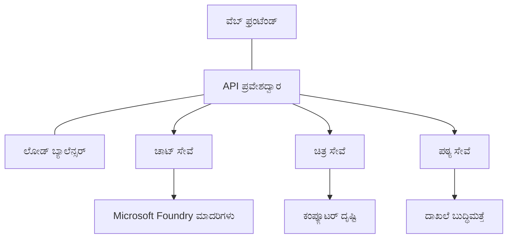

# AZD ಬಳಸಿ ಉತ್ಪಾದನಾ AI ಕಾರ್ಯಭಾರಗಳ ಉತ್ತಮ ಅಭ್ಯಾಸಗಳು

**ಅಧ್ಯಾಯ ನ್ಯಾವಿಗೇಶನ್:**
- **📚 ಕೋರ್ಸ್ ಹೋಮ್**: [AZD For Beginners](../../README.md)
- **📖 ಹಾಲಿನ ಅಧ್ಯಾಯ**: Chapter 8 - Production & Enterprise Patterns
- **⬅️ ಹಿಂದಿನ ಅಧ್ಯಾಯ**: [Chapter 7: Troubleshooting](../chapter-07-troubleshooting/debugging.md)
- **⬅️ ಸಂಬಂಧಿಸಿದದ್ದು ಸಹ**: [AI Workshop Lab](ai-workshop-lab.md)
- **🎯 ಕೋರ್ಸ್ ಪೂರ್ಣ**: [AZD For Beginners](../../README.md)

## ಅವಲೋಕನ

ಈ ಮಾರ್ಗದರ್ಶಕಿ Azure Developer CLI (AZD) ಬಳಸಿ ಉತ್ಪಾದನಾ-ಸಿದ್ಧ AI ಕಾರ್ಯಭಾರಗಳನ್ನು ನಿಯೋಜಿಸುವುದಕ್ಕಾಗಿ ಸಮಗ್ರ ಉತ್ತಮ ಅಭ್ಯಾಸಗಳನ್ನು ನೀಡುತ್ತದೆ. Microsoft Foundry Discord ಸಮುದಾಯದಿಂದ ಪಡೆದ ಪ್ರತಿಕ್ರಿಯೆ ಮತ್ತು ವಾಸ್ತವ ಗ್ರಾಹಕ ನಿಯೋಜನೆಗಳ ಆಧಾರದ ಮೇಲೆ, ಈ ಅಭ್ಯಾಸಗಳು ಉತ್ಪಾದನಾ AI ವ್ಯವಸ್ಥೆಗಳಲ್ಲಿ ಸಾಮಾನ್ಯವಾದ ಅಡೆತಡೆಗಳನ್ನು ಎದುರಿಸುತ್ತವೆ.

## ಮುಖ್ಯ ಸವಾಲುಗಳು

ನಮ್ಮ ಸಮುದಾಯದ ವಿಚಾರಣಾ ಫಲಿತಾಂಶಗಳ ಆಧಾರದ ಮೇಲೆ, ಡೆವೆಲಪರ್‌ಗಳು ಎದುರಿಸುವ ಪ್ರಮುಖ ಸವಾಲುಗಳು ಇವು:

- **45%** ಬಹು-ಸೇವಾ AI ನಿಯೋಜನೆಗಳಲ್ಲಿ ಕಷ್ಟಪಡುವರು
- **38%** ಪ್ರಮಾದ ಮತ್ತು ಗುಪ್ತತೆಯ ನಿರ್ವಹಣೆಯಲ್ಲಿ ಸಮಸ್ಯೆಗಳನ್ನು ಹೊಂದಿರುವವರು  
- **35%** ಉತ್ಪಾದನಾ ಸಿದ್ಧತೆ ಮತ್ತು ಅಳವಡಿಕೆಯನ್ನು ಕಷ್ಟವಾಗಿ ಕಾಣುತ್ತಾರೆ
- **32%** ಉತ್ತಮ ವೆಚ್ಚ ಆಪ್ಟಿಮೈಜೇಶನ್ ತಂತ್ರಗಳನ್ನು ಬೇಕಾದಿದ್ದಾರೆ
- **29%** ಮೇಲ್ವಿಚಾರಣೆ ಮತ್ತು ಡಿಬಗ್ ಸುಧಾರಣೆ ಅಗತ್ಯವಿದೆ

## ಉತ್ಪಾದನಾ AI ಗೆ معمಠೆ ಆರ್ಕಿಟೆಕ್ಚರ್ ಪ್ಯಾಟರ್ನ್‌ಗಳು

### ಪ್ಯಾಟರ್ನ್ 1: ಮைக್ರೋಸೇವಾ AI ಆರ್ಕಿಟೆಕ್ಚರ್

**ಯಾವಾಗ ಬಳಸುವುದು**: ಹಲವು ಸಾಮರ್ಥ್ಯಗಳಿರುವ ಸಂಕೀರ್ಣ AI ಅನ್ವಯಿಕೆಗಳಿಗಾಗಿ


**AZD ಜಾರಿಗೆ**:

```yaml
# azure.yaml
name: enterprise-ai-platform
services:
  web:
    project: ./web
    host: staticwebapp
  api-gateway:
    project: ./api-gateway
    host: containerapp
  chat-service:
    project: ./services/chat
    host: containerapp
  vision-service:
    project: ./services/vision
    host: containerapp
  text-service:
    project: ./services/text
    host: containerapp
```

### ಪ್ಯಾಟರ್ನ್ 2: ಈವೆಂಟ್-ಚಾಲಿತ AI ಪ್ರಕ್ರಿಯೆ

**ಯಾವಾಗ ಬಳಸುವುದು**: ಬ್ಯಾಚ್ ಪ್ರೊಸೆಸಿಂಗ್, ಡಾಕ್ಯೂಮೆಂಟ್ ವಿಶ್ಲೇಷಣೆ, ಅಸಿಂಕ್ರೋನಸ್ ವರ್ಕ್‌ಫ್ಲೋಗಳು

```bicep
// Event Hub for AI processing pipeline
resource eventHub 'Microsoft.EventHub/namespaces@2023-01-01-preview' = {
  name: eventHubNamespaceName
  location: location
  sku: {
    name: 'Standard'
    tier: 'Standard'
    capacity: 1
  }
}

// Service Bus for reliable message processing
resource serviceBus 'Microsoft.ServiceBus/namespaces@2022-10-01-preview' = {
  name: serviceBusNamespaceName
  location: location
  sku: {
    name: 'Premium'
    tier: 'Premium'
    capacity: 1
  }
}

// Function App for processing
resource functionApp 'Microsoft.Web/sites@2023-01-01' = {
  name: functionAppName
  location: location
  kind: 'functionapp,linux'
  properties: {
    siteConfig: {
      appSettings: [
        {
          name: 'FUNCTIONS_EXTENSION_VERSION'
          value: '~4'
        }
        {
          name: 'AZURE_OPENAI_ENDPOINT'
          value: '@Microsoft.KeyVault(VaultName=${keyVault.name};SecretName=openai-endpoint)'
        }
      ]
    }
  }
}
```

## AI ಏಜೆಂಟ್ ಆರೋಗ್ಯವನ್ನು ಕುರಿತು ಯೋಚನೆ

ಸಾಂಪ್ರದಾಯಿಕ ವೆಬ್ ಅಪ್ಲಿಕೇಶನ್ ಕೊಳವೇ ಬಂದಾಗ ಲಕ್ಷಣಗಳು ಪರಿಚಿತವಾಗಿವೆ: ಪುಟ ಲೋಡ್ ಆಗುವುದಿಲ್ಲ, API ದೋಷ ನೀಡುತ್ತದೆ, ಅಥವಾ ನಿಯೋಜನೆ ವಿಫಲಗೊಳ್ಳುತ್ತದೆ. AI-ಚಾಲಿತ ಅನ್ವಯಿಕೆಗಳು ಆ ಎಲ್ಲ ಮಾರ್ಗಗಳಲ್ಲಿಯೂ ಕೆಟ್ಟಡಾಗಿ ನಡೆಯಬಹುದು—ಆದರೆ ಅವು ಸ್ಪಷ್ಟ ದೋಷ ಸಂದೇಶಗಳನ್ನು ಉತ್ಪನ್ನಿಸದ ಸುಕ್ಷ್ಮ ರೀತಿಯ ಅನಾಚರಣೆಗಳನ್ನು ಕೂಡ ತೋರಿಸಬಹುದು.

ಈ ವಿಭಾಗವು AI ಕಾರ್ಯಭಾರಗಳನ್ನು ಮಾನಿಟರ್ ಮಾಡುವ ಮಾನಸಿಕ ಮಾದರಿಯನ್ನು ನಿರ್ಮಿಸಲು ಸಹಾಯ ಮಾಡುತ್ತದೆ, ಆದ್ದರಿಂದ ಯಾವುದೇ ಸಮಸ್ಯೆಯಿದ್ದಾಗ ಹುಡುಕಬೇಕಾದ ಸ್ಥಳಗಳನ್ನು ನಿಮಗೆ ತಿಳಿಸುತ್ತದೆ.

### ಏಜೆಂಟ್ ಆರೋಗ್ಯವು ಸಾಂಪ್ರದಾಯಿಕ ಅಪ್ಲಿಕೇಶನ್ ಆರೋಗ್ಯದಿಂದ ಹೇಗೆ ವಿಭಿನ್ನವಾಗಿದೆ

ಸಾಂಪ್ರದಾಯಿಕ ಅಪ್ಲಿಕೇಶನ್ ಕಾರ್ಯನಿರ್ವಹಿಸುತ್ತದೆ ಅಥವಾ ನಿರ್ವಹಿಸುವುದಿಲ್ಲ ಎನ್ನುವ ಹೊಂದಾಣಿಕೆಯಲ್ಲಿ ಇರುತ್ತದೆ. AI ಏಜೆಂಟ್ ಕೆಲಸಮಾಡುತ್ತಿರುವಂತೆ ಕಾಣಬಹುದು ಆದರೆ ದೀರ್ಘಫಲಿತಾಂಶಗಳನ್ನು ನೀಡಬಹುದು. ಏಜೆಂಟ್ ಆರೋಗ್ಯವನ್ನು ಎರಡು ತಳಿಗಳಲ್ಲಿ ಯೋಚಿಸಿ:

| Layer | What to Watch | Where to Look |
|-------|--------------|---------------|
| **Infrastructure health** | Is the service running? Are resources provisioned? Are endpoints reachable? | `azd monitor`, Azure Portal resource health, container/app logs |
| **Behavior health** | Is the agent responding accurately? Are responses timely? Is the model being called correctly? | Application Insights traces, model call latency metrics, response quality logs |

ಅನುಭವಿಕ ಸಂಪರ್ಕ ಆರೋಗ್ಯ ಪರಿಚಿತವಾಗಿದೆ—ಇದು ಯಾವುದೇ azd ಅಪ್ಲಿಕೇಶನ್‌ಗೆ ಸಾಮಾನ್ಯವಾಗಿರುತ್ತದೆ. ವರ್ತನ ಆರೋಗ್ಯವೇ AI ಕಾರ್ಯಭಾರಗಳು ಪರಿಚಯಿಸುವ ಹೊಸ ತಿರುವು.

### AI ಅಪ್ಲಿಕೇಶನ್‌ಗಳು ನಿರೀಕ್ಷಿತಂತೆ ವರ್ತಿಸದಿದ್ದಾಗ ಎಲ್ಲಿ ನೋಡಬೇಕು

ನಿಮ್ಮ AI ಅನ್ವಯಿಕೆ ನಿರೀಕ್ಷಿತ ಫಲಿತಾಂಶಗಳನ್ನು ನೀಡದಿದ್ದರೆ, ಇಲ್ಲಿ ಒಂದು ತತ್ತ್ವಚಿಂತನೆಯ ತಾಸುಪಟ್ಟಿ ಇದೆ:

1. **ಆಶಯಗಳಿಂದ ಪ್ರಾರಂಭಿಸಿ.** ಅಪ್ಲಿಕೇಶನ್ ಚಾಲನಾಯಿತ್ತಾ? ತನ್ನ ಅವಲಂಬನೆಗಳಿಗೆ ತಲುಪಬಹುದೇ? ಯಾವುದೇ ಅಪ್ಲಿಕೇಶನ್‌ಗೆ ಮಾಡುವಂತೆ `azd monitor` ಮತ್ತು ಸಂಪನ್ಮೂಲ ಆರೋಗ್ಯವನ್ನು ಪರಿಶೀಲಿಸಿ.
2. **ಮಾದರಿ ಸಂಪರ್ಕವನ್ನು ಪರಿಶೀಲಿಸಿ.** ನಿಮ್ಮ ಅಪ್ಲಿಕೇಶನ್ ಯಶಸ್ವಿಯಾಗಿ AI ಮಾದರಿಯನ್ನು ಕರೆ ಮಾಡುತ್ತಿದೆಯೇ? ವಿಫಲವಾದ ಅಥವಾ ಸಮಯಾವಧಿ ಮೀರಿದ ಮಾದರಿ ಕರೆಗಳು AI ಅಪ್ಲಿಕೇಶನ್ ಸಮಸ್ಯೆಗಳಲ್ಲಿನ ಅತ್ಯಂತ ಸಾಮಾನ್ಯ ಕಾರಣವಾಗಿವೆ ಮತ್ತು ನಿಮ್ಮ ಅಪ್ಲಿಕೇಶನ್ ಲಾಗ್‌ಗಳಲ್ಲಿ ತೋರಿಕೆ ಮಾಡುತ್ತವೆ.
3. **ಮಾದರಿಗೆ ಏನು ಬಂದಿದೆ ನೋಡಿ.** AI ಪ್ರತಿಕ್ರಿಯೆಗಳು ಇನ್‌ಪುಟ್ (ಪ್ರಾಂಪ್ಟ್ ಮತ್ತು<any> ರೀಟ್ರಿವ್ಡ್ ಸੰਦਰಭ) ಮೇಲೆ ಅವಲಂಬಿತವಾಗಿವೆ. ಔಟ್‌ಪುಟ್ ತಪ್ಪಿದ್ದರೆ, ಇನ್‌ಪುಟ್ ಸಾಮಾನ್ಯವಾಗಿ ತಪ್ಪಾಗಿರುತ್ತದೆ. ನಿಮ್ಮ ಅಪ್ಲಿಕೇಶನ್ ಮಾದರಿಗೆ ಸರಿಯಾದ ಡೇಟಾ ಕಳುಹಿಸುತ್ತಿದೆಯೇ ಎಂದು ಪರಿಶೀಲಿಸಿ.
4. **ಪ್ರತಿಕ್ರಿಯೆ ವಿಳಂಬವನ್ನು ವಿಮರ್ಶಿಸಿ.** AI ಮಾದರಿ ಕರೆಗಳು ಸಾಮಾನ್ಯ API ಕರೆಗಳಿಗಿಂತ ನಿಧಾನವಾಗಿರುತ್ತವೆ. ನಿಮ್ಮ ಅಪ್ಲಿಕೇಶನ್ ನಿಧಾನವಾಗಿ ಅನುಭವಿಸುತ್ತಿದ್ದರೆ, ಮಾದರಿ ಪ್ರತಿಕ್ರಿಯೆ ಸಮಯಗಳು ಹೆಚ್ಚಿದವೆಯೇ ಎಂದು ಪರಿಶೀಲಿಸಿ—ಇದರರ್ಥ ಥ್ರಾಟ್ಲಿಂಗ್, ಸಾಮರ್ಥ್ಯ ಮಿತಿ, ಅಥವಾ ಪ್ರಾಂತ ಮಟ್ಟದ ಘರ್ಷಣೆಯಾಗಿರಬಹುದು.
5. **ವೆಚ್ಚ ಸೂಚನೆಗಳಿಗೆ ಗಮನವಿರಿಸಿ.** ಟೋಕನ್ ಬಳಕೆ ಅಥವಾAPI ಕರೆಗಳಲ್ಲಿ ಅನಿರೀಕ್ಷಿತ ಏರಿಕೆಗಳು ಲೂಪ್, ತಪ್ಪಾಗಿ ಕಾನ್ಫಿಗರ್ ಮಾಡಲಾದ ಪ್ರಾಂಪ್ಟ್, ಅಥವಾ ಅತಿರೇಕದ ಮತ್ತೆ ಪ್ರಯತ್ನಗಳನ್ನು ಸೂಚಿಸಬಹುದು.

ನಿಮ್ಮು ಕೈಗೊಳ್ಳಬೇಕಾದುದಾಗಿ ಮೇಲ್ವಿಚಾರಣಾ ಉಪಕರಣಗಳಲ್ಲಿ ತಕ್ಷಣದ ಪರಿಣತಿಯನ್ನು ಪಡೆದಿರಬೇಕಾಗಿಲ್ಲ. ಪ್ರಮುಖ ಅಂಶವೆಂದರೆ AI ಅಪ್ಲಿಕೇಶನ್‌ಗಳಿಗೆ ಮೇಲ್ಮನಸ್ಸಿನ ವರ್ತನಾ ತಳಿಯೊಂದು ಹೆಚ್ಚಾಗಿ ಇರುತ್ತದೆ, ಮತ್ತು azdನ ಬಿಲ್ಟ್-ಇನ್ ಮೇಲ್ವಿಚಾರಣೆ (`azd monitor`) ಈ ಎರಡೂ ತಳಿಗಳನ್ನು ತನಿಖೆ ಮಾಡುವ ಆರಂಭಿಕ ಬಿಂದುವನ್ನು ನೀಡುತ್ತದೆ.

---

## ಭದ್ರತಾ ಉತ್ತಮ ಅಭ್ಯಾಸಗಳು

### 1. ಶೂನ್ಯ-ವಿಶ್ವಾಸ (Zero-Trust) ಭದ್ರತಾ ಮಾದರಿ

**ಜಾರಿಗೊಳಿಸುವ ತಂತ್ರಜ್ಞಾನ**:
- ಯಾವುದೇ ಸೇವೆ-ದಿಂದ-ಸೇವೆ ಸಂವಹನವು ಪ್ರಾಮಾಣೀಕರಣವಿಲ್ಲದೆ ಇಲ್ಲ
- ಎಲ್ಲಾ API ಕರೆಗಳು મેನೇಗ್ಡ್ ಐಡೆಂಟಿಟಿಗಳನ್ನು ಬಳಸುತ್ತವೆ
- ಖಾಸಗಿ ಎಂಡ್ಪಾಯಿಂಟ್‌ಗಳೊಂದಿಗೆ ನೆಟ್‌ವರ್ಕ್ বিচ್ಛೇದನೆ
- ಕನಿಷ್ಠ ಅವಶ್ಯಕತಾ ಆಕ್ಸೆಸ್ ನಿಯಂತ್ರಣಗಳು

```bicep
// Managed Identity for each service
resource chatServiceIdentity 'Microsoft.ManagedIdentity/userAssignedIdentities@2023-01-31' = {
  name: 'chat-service-identity'
  location: location
}

// Role assignments with minimal permissions
resource openAIUserRole 'Microsoft.Authorization/roleAssignments@2022-04-01' = {
  scope: openAIAccount
  name: guid(openAIAccount.id, chatServiceIdentity.id, openAIUserRoleDefinitionId)
  properties: {
    roleDefinitionId: subscriptionResourceId('Microsoft.Authorization/roleDefinitions', '5e0bd9bd-7b93-4f28-af87-19fc36ad61bd')
    principalId: chatServiceIdentity.properties.principalId
    principalType: 'ServicePrincipal'
  }
}
```

### 2. ಸುರಕ್ಷಿತ ಗುಪ್ತತೆಯ ನಿರ್ವಹಣೆ

**Key Vault ಸಂಯೋಜನೆ ಪ್ಯಾಟರ್ನ್**:

```bicep
// Key Vault with proper access policies
resource keyVault 'Microsoft.KeyVault/vaults@2023-02-01' = {
  name: keyVaultName
  location: location
  properties: {
    tenantId: tenant().tenantId
    sku: {
      family: 'A'
      name: 'premium'  // Use premium for production
    }
    enableRbacAuthorization: true  // Use RBAC instead of access policies
    enablePurgeProtection: true    // Prevent accidental deletion
    enableSoftDelete: true
    softDeleteRetentionInDays: 90
  }
}

// Store all AI service credentials
resource openAIKeySecret 'Microsoft.KeyVault/vaults/secrets@2023-02-01' = {
  parent: keyVault
  name: 'openai-api-key'
  properties: {
    value: openAIAccount.listKeys().key1
    attributes: {
      enabled: true
    }
  }
}
```

### 3. ನೆಟ್‌ವರ್ಕ್ ಭದ್ರತೆ

**ಖಾಸಗಿ ಎಂಡ್ಪಾಯಿಂಟ್ ಕಾನ್ಫಿಗರೇಷನ್**:

```bicep
// Virtual Network for AI services
resource virtualNetwork 'Microsoft.Network/virtualNetworks@2023-04-01' = {
  name: vnetName
  location: location
  properties: {
    addressSpace: {
      addressPrefixes: ['10.0.0.0/16']
    }
    subnets: [
      {
        name: 'ai-services-subnet'
        properties: {
          addressPrefix: '10.0.1.0/24'
          privateEndpointNetworkPolicies: 'Disabled'
        }
      }
      {
        name: 'app-services-subnet'
        properties: {
          addressPrefix: '10.0.2.0/24'
          delegations: [
            {
              name: 'Microsoft.Web/serverFarms'
              properties: {
                serviceName: 'Microsoft.Web/serverFarms'
              }
            }
          ]
        }
      }
    ]
  }
}

// Private endpoints for all AI services
resource openAIPrivateEndpoint 'Microsoft.Network/privateEndpoints@2023-04-01' = {
  name: '${openAIAccountName}-pe'
  location: location
  properties: {
    subnet: {
      id: virtualNetwork.properties.subnets[0].id
    }
    privateLinkServiceConnections: [
      {
        name: 'openai-connection'
        properties: {
          privateLinkServiceId: openAIAccount.id
          groupIds: ['account']
        }
      }
    ]
  }
}
```

## ಕಾರ್ಯಕ್ಷಮತೆ ಮತ್ತು ವಿಸ್ತರಣೆ

### 1. ಸ್ವಯಂ-ವಿಸ್ತರಣೆ (Auto-Scaling) ತಂತ್ರಗಳು

**Container Apps ಸ್ವಯಂ-ವಿಸ್ತರಣೆ**:

```bicep
resource containerApp 'Microsoft.App/containerApps@2023-05-01' = {
  name: containerAppName
  location: location
  properties: {
    configuration: {
      ingress: {
        external: true
        targetPort: 8000
        transport: 'http'
      }
    }
    template: {
      scale: {
        minReplicas: 2  // Always have 2 instances minimum
        maxReplicas: 50 // Scale up to 50 for high load
        rules: [
          {
            name: 'http-scaling'
            http: {
              metadata: {
                concurrentRequests: '20'  // Scale when >20 concurrent requests
              }
            }
          }
          {
            name: 'cpu-scaling'
            custom: {
              type: 'cpu'
              metadata: {
                type: 'Utilization'
                value: '70'  // Scale when CPU >70%
              }
            }
          }
        ]
      }
    }
  }
}
```

### 2. ಕ್ಯಾಶಿಂಗ್ ತಂತ್ರಗಳು

**AI ಪ್ರತಿಕ್ರಿಯೆಗಳಿಗೆ Redis ಕ್ಯಾಶೆ**:

```bicep
// Redis Premium for production workloads
resource redisCache 'Microsoft.Cache/redis@2023-04-01' = {
  name: redisCacheName
  location: location
  properties: {
    sku: {
      name: 'Premium'
      family: 'P'
      capacity: 1
    }
    enableNonSslPort: false
    minimumTlsVersion: '1.2'
    redisConfiguration: {
      'maxmemory-policy': 'allkeys-lru'
    }
    // Enable clustering for high availability
    redisVersion: '6.0'
    shardCount: 2
  }
}

// Cache configuration in application
var cacheConnectionString = '${redisCache.properties.hostName}:6380,password=${redisCache.listKeys().primaryKey},ssl=True,abortConnect=False'
```

### 3. ಲೋಡ್ ಬ್ಯಾಲನ್ಸಿಂಗ್ ಮತ್ತು ಟ್ರಾಫಿಕ್ ನಿರ್ವಹಣೆ

**WAF ಇರುವ Application Gateway**:

```bicep
// Application Gateway with Web Application Firewall
resource applicationGateway 'Microsoft.Network/applicationGateways@2023-04-01' = {
  name: appGatewayName
  location: location
  properties: {
    sku: {
      name: 'WAF_v2'
      tier: 'WAF_v2'
      capacity: 2
    }
    webApplicationFirewallConfiguration: {
      enabled: true
      firewallMode: 'Prevention'
      ruleSetType: 'OWASP'
      ruleSetVersion: '3.2'
    }
    // Backend pools for AI services
    backendAddressPools: [
      {
        name: 'ai-services-pool'
        properties: {
          backendAddresses: [
            {
              fqdn: '${containerApp.properties.configuration.ingress.fqdn}'
            }
          ]
        }
      }
    ]
  }
}
```

## 💰 ವೆಚ್ಚ ಆಪ್ಟಿಮೈಜೇಶನ್

### 1. ಸಂಪನ್ಮೂಲ ಸರಿ-ಗಾತ್ರಮಾಡುವುದು

**ಪರಿಸರ-ನಿರ್ದಿಷ್ಟ ಕಾನ್ಫಿಗರೇಶನ್‌ಗಳು**:

```bash
# ಅಭಿವೃದ್ಧಿ ಪರಿಸರ
azd env new development
azd env set AZURE_OPENAI_SKU "S0"
azd env set AZURE_OPENAI_CAPACITY 10
azd env set AZURE_SEARCH_SKU "basic"
azd env set CONTAINER_CPU 0.5
azd env set CONTAINER_MEMORY 1.0

# ಉತ್ಪಾದನಾ ಪರಿಸರ
azd env new production
azd env set AZURE_OPENAI_SKU "S0"
azd env set AZURE_OPENAI_CAPACITY 100
azd env set AZURE_SEARCH_SKU "standard"
azd env set CONTAINER_CPU 2.0
azd env set CONTAINER_MEMORY 4.0
```

### 2. ವೆಚ್ಚ ಮಾನಿಟರಿಂಗ್ ಮತ್ತು ಬಜೆಟ್‌ಗಳು

```bicep
// Cost management and budgets
resource budget 'Microsoft.Consumption/budgets@2023-05-01' = {
  name: 'ai-workload-budget'
  properties: {
    timePeriod: {
      startDate: '2024-01-01'
      endDate: '2024-12-31'
    }
    timeGrain: 'Monthly'
    amount: 2000  // $2000 monthly budget
    category: 'Cost'
    notifications: {
      warning: {
        enabled: true
        operator: 'GreaterThan'
        threshold: 80
        contactEmails: [
          'finance@company.com'
          'engineering@company.com'
        ]
        contactRoles: [
          'Owner'
          'Contributor'
        ]
      }
      critical: {
        enabled: true
        operator: 'GreaterThan'
        threshold: 95
        contactEmails: [
          'cto@company.com'
        ]
      }
    }
  }
}
```

### 3. ಟೋಕನ್ ಬಳಕೆ ಆಪ್ಟಿಮೈಜೇಶನ್

**OpenAI ವೆಚ್ಚ ನಿರ್ವಹಣೆ**:

```typescript
// ಅಪ್ಲಿಕೇಶನ್-ಮಟ್ಟದ ಟೋಕನ್ ಸುಧಾರಣೆ
class TokenOptimizer {
  private readonly maxTokens = 4000;
  private readonly reserveTokens = 500;
  
  optimizePrompt(userInput: string, context: string): string {
    const availableTokens = this.maxTokens - this.reserveTokens;
    const estimatedTokens = this.estimateTokens(userInput + context);
    
    if (estimatedTokens > availableTokens) {
      // ಸಂಧರ್ಭವನ್ನು ಕತ್ತರಿಸಿ, ಬಳಕೆದಾರರ ಇನ್‌ಪುಟ್ ಅನ್ನು ಕತ್ತರಿಸಬೇಡಿ
      context = this.truncateContext(context, availableTokens - this.estimateTokens(userInput));
    }
    
    return `${context}\n\nUser: ${userInput}`;
  }
  
  private estimateTokens(text: string): number {
    // ಸುಮಾರು ಅಂದಾಜು: 1 ಟೋಕನ್ ≈ 4 ಅಕ್ಷರಗಳು
    return Math.ceil(text.length / 4);
  }
}
```

## ಮೆಾನಿಟರಿಂಗ್ ಮತ್ತು ನೋಡಿಕೆ

### 1. ಸಮಗ್ರ Application Insights

```bicep
// Application Insights with advanced features
resource applicationInsights 'Microsoft.Insights/components@2020-02-02' = {
  name: applicationInsightsName
  location: location
  kind: 'web'
  properties: {
    Application_Type: 'web'
    WorkspaceResourceId: logAnalyticsWorkspace.id
    SamplingPercentage: 100  // Full sampling for AI apps
    DisableIpMasking: false  // Enable for security
  }
}

// Custom metrics for AI operations
resource aiMetricAlerts 'Microsoft.Insights/metricAlerts@2018-03-01' = {
  name: 'ai-high-error-rate'
  location: 'global'
  properties: {
    description: 'Alert when AI service error rate is high'
    severity: 2
    enabled: true
    scopes: [
      applicationInsights.id
    ]
    evaluationFrequency: 'PT1M'
    windowSize: 'PT5M'
    criteria: {
      'odata.type': 'Microsoft.Azure.Monitor.SingleResourceMultipleMetricCriteria'
      allOf: [
        {
          name: 'high-error-rate'
          metricName: 'requests/failed'
          operator: 'GreaterThan'
          threshold: 10
          timeAggregation: 'Count'
        }
      ]
    }
  }
}
```

### 2. AI-ನಿರ್ದಿಷ್ಟ ಮೇಲ್ವಿಚಾರಣೆ

**AI ಮೆಟ್ರಿಕ್‌ಗಳಿಗಾಗಿ ಕಸ್ಟಮ್ ಡ್ಯಾಶ್‌ಬೋರ್ಡ್‌ಗಳು**:

```json
// Dashboard configuration for AI workloads
{
  "dashboard": {
    "name": "AI Application Monitoring",
    "tiles": [
      {
        "name": "OpenAI Request Volume",
        "query": "requests | where name contains 'openai' | summarize count() by bin(timestamp, 5m)"
      },
      {
        "name": "AI Response Latency",
        "query": "requests | where name contains 'openai' | summarize avg(duration) by bin(timestamp, 5m)"
      },
      {
        "name": "Token Usage",
        "query": "customMetrics | where name == 'openai_tokens_used' | summarize sum(value) by bin(timestamp, 1h)"
      },
      {
        "name": "Cost per Hour",
        "query": "customMetrics | where name == 'openai_cost' | summarize sum(value) by bin(timestamp, 1h)"
      }
    ]
  }
}
```

### 3. ಆರೋಗ್ಯ ಪರಿಶೀಲನೆಗಳು ಮತ್ತು ಅಪ್‌ಟೈಮ್ ಮಾನಿಟರಿಂಗ್

```bicep
// Application Insights availability tests
resource availabilityTest 'Microsoft.Insights/webtests@2022-06-15' = {
  name: 'ai-app-availability-test'
  location: location
  tags: {
    'hidden-link:${applicationInsights.id}': 'Resource'
  }
  properties: {
    SyntheticMonitorId: 'ai-app-availability-test'
    Name: 'AI Application Availability Test'
    Description: 'Tests AI application endpoints'
    Enabled: true
    Frequency: 300  // 5 minutes
    Timeout: 120    // 2 minutes
    Kind: 'ping'
    Locations: [
      {
        Id: 'us-east-2-azr'
      }
      {
        Id: 'us-west-2-azr'
      }
    ]
    Configuration: {
      WebTest: '''
        <WebTest Name="AI Health Check" 
                 Id="8d2de8d2-a2b0-4c2e-9a0d-8f9c9a0b8c8d" 
                 Enabled="True" 
                 CssProjectStructure="" 
                 CssIteration="" 
                 Timeout="120" 
                 WorkItemIds="" 
                 xmlns="http://microsoft.com/schemas/VisualStudio/TeamTest/2010" 
                 Description="" 
                 CredentialUserName="" 
                 CredentialPassword="" 
                 PreAuthenticate="True" 
                 Proxy="default" 
                 StopOnError="False" 
                 RecordedResultFile="" 
                 ResultsLocale="">
          <Items>
            <Request Method="GET" 
                     Guid="a5f10126-e4cd-570d-961c-cea43999a200" 
                     Version="1.1" 
                     Url="${webApp.properties.defaultHostName}/health" 
                     ThinkTime="0" 
                     Timeout="120" 
                     ParseDependentRequests="True" 
                     FollowRedirects="True" 
                     RecordResult="True" 
                     Cache="False" 
                     ResponseTimeGoal="0" 
                     Encoding="utf-8" 
                     ExpectedHttpStatusCode="200" 
                     ExpectedResponseUrl="" 
                     ReportingName="" 
                     IgnoreHttpStatusCode="False" />
          </Items>
        </WebTest>
      '''
    }
  }
}
```

## ವಿಪತ್ತು ಪುನರುದ್ಧಾರ ಮತ್ತು ಹೆಚ್ಚಿನ ಲಭ್ಯತೆ

### 1. ಬಹು-ಪ್ರಾಂತ್ಯ ನಿಯೋಜನೆ

```yaml
# azure.yaml - Multi-region configuration
name: ai-app-multiregion
services:
  api-primary:
    project: ./api
    host: containerapp
    env:
      - AZURE_REGION=eastus
  api-secondary:
    project: ./api
    host: containerapp
    env:
      - AZURE_REGION=westus2
```

```bicep
// Traffic Manager for global load balancing
resource trafficManager 'Microsoft.Network/trafficManagerProfiles@2022-04-01' = {
  name: trafficManagerProfileName
  location: 'global'
  properties: {
    profileStatus: 'Enabled'
    trafficRoutingMethod: 'Priority'
    dnsConfig: {
      relativeName: trafficManagerProfileName
      ttl: 30
    }
    monitorConfig: {
      protocol: 'HTTPS'
      port: 443
      path: '/health'
      intervalInSeconds: 30
      toleratedNumberOfFailures: 3
      timeoutInSeconds: 10
    }
    endpoints: [
      {
        name: 'primary-endpoint'
        type: 'Microsoft.Network/trafficManagerProfiles/azureEndpoints'
        properties: {
          targetResourceId: primaryAppService.id
          endpointStatus: 'Enabled'
          priority: 1
        }
      }
      {
        name: 'secondary-endpoint'
        type: 'Microsoft.Network/trafficManagerProfiles/azureEndpoints'
        properties: {
          targetResourceId: secondaryAppService.id
          endpointStatus: 'Enabled'
          priority: 2
        }
      }
    ]
  }
}
```

### 2. ಡೇಟಾ ಬ್ಯಾಕಪ್ ಮತ್ತು ಪುನರುದ್ಧಾರ

```bicep
// Backup configuration for critical data
resource backupVault 'Microsoft.DataProtection/backupVaults@2023-05-01' = {
  name: backupVaultName
  location: location
  identity: {
    type: 'SystemAssigned'
  }
  properties: {
    storageSettings: [
      {
        datastoreType: 'VaultStore'
        type: 'LocallyRedundant'
      }
    ]
  }
}

// Backup policy for AI models and data
resource backupPolicy 'Microsoft.DataProtection/backupVaults/backupPolicies@2023-05-01' = {
  parent: backupVault
  name: 'ai-data-backup-policy'
  properties: {
    policyRules: [
      {
        backupParameters: {
          backupType: 'Full'
          objectType: 'AzureBackupParams'
        }
        trigger: {
          schedule: {
            repeatingTimeIntervals: [
              'R/2024-01-01T02:00:00+00:00/P1D'  // Daily at 2 AM
            ]
          }
          objectType: 'ScheduleBasedTriggerContext'
        }
        dataStore: {
          datastoreType: 'VaultStore'
          objectType: 'DataStoreInfoBase'
        }
        name: 'BackupDaily'
        objectType: 'AzureBackupRule'
      }
    ]
  }
}
```

## DevOps ಮತ್ತು CI/CD ಏಕೀಕರಣ

### 1. GitHub Actions ವರ್ಕ್‌ಫ್ಲೋ

```yaml
# .github/workflows/deploy-ai-app.yml
name: Deploy AI Application

on:
  push:
    branches: [main]
  pull_request:
    branches: [main]

jobs:
  test:
    runs-on: ubuntu-latest
    steps:
      - uses: actions/checkout@v4
      
      - name: Setup Python
        uses: actions/setup-python@v4
        with:
          python-version: '3.11'
          
      - name: Install dependencies
        run: |
          pip install -r requirements.txt
          pip install pytest
          
      - name: Run tests
        run: pytest tests/
        
      - name: AI Safety Tests
        run: |
          python scripts/test_ai_safety.py
          python scripts/validate_prompts.py

  deploy-staging:
    needs: test
    if: github.event_name == 'pull_request'
    runs-on: ubuntu-latest
    steps:
      - uses: actions/checkout@v4
      
      - name: Setup AZD
        uses: Azure/setup-azd@v1.0.0
        
      - name: Login to Azure
        uses: azure/login@v1
        with:
          creds: ${{ secrets.AZURE_CREDENTIALS }}
          
      - name: Deploy to Staging
        run: |
          azd env select staging
          azd deploy

  deploy-production:
    needs: test
    if: github.ref == 'refs/heads/main'
    runs-on: ubuntu-latest
    steps:
      - uses: actions/checkout@v4
      
      - name: Setup AZD
        uses: Azure/setup-azd@v1.0.0
        
      - name: Login to Azure
        uses: azure/login@v1
        with:
          creds: ${{ secrets.AZURE_CREDENTIALS }}
          
      - name: Deploy to Production
        run: |
          azd env select production
          azd deploy
          
      - name: Run Production Health Checks
        run: |
          python scripts/health_check.py --env production
```

### 2. ಇನ್ಫ್ರಾಸ್ಟ್ರಕ್ಚರ್ ಮಾನ್ಯತೆ

```bash
# scripts/validate_infrastructure.sh
#!/bin/bash

echo "Validating AI infrastructure deployment..."

# ಎಲ್ಲಾ ಅಗತ್ಯವಾದ ಸೇವೆಗಳು ಚಾಲನೆಯಲ್ಲಿವೆ ಎಂದು ಪರಿಶೀಲಿಸಿ
services=("openai" "search" "storage" "keyvault")
for service in "${services[@]}"; do
    echo "Checking $service..."
    if ! az resource list --resource-type "Microsoft.CognitiveServices/accounts" --query "[?contains(name, '$service')]" -o tsv; then
        echo "ERROR: $service not found"
        exit 1
    fi
done

# OpenAI ಮಾದರಿ ನಿಯೋಜನೆಗಳನ್ನು ಪರಿಶೀಲಿಸಿ
echo "Validating OpenAI model deployments..."
models=$(az cognitiveservices account deployment list --name $AZURE_OPENAI_NAME --resource-group $AZURE_RESOURCE_GROUP --query "[].name" -o tsv)
if [[ ! $models == *"gpt-35-turbo"* ]]; then
    echo "ERROR: Required model gpt-35-turbo not deployed"
    exit 1
fi

# ಎಐ ಸೇವೆಯ ಸಂಪರ್ಕವನ್ನು ಪರೀಕ್ಷಿಸಿ
echo "Testing AI service connectivity..."
python scripts/test_connectivity.py

echo "Infrastructure validation completed successfully!"
```

## ಉತ್ಪಾದನಾ ಸಿದ್ಧತೆ ತಾಸುಪಟ್ಟಿ

### ಸುರಕ್ಷತೆ ✅
- [ ] ಎಲ್ಲಾ ಸೇವೆಗಳು ಮೇನೇಜ್ಡ್ ಐಡೆಂಟಿಟಿಗಳನ್ನು ಬಳಸುತ್ತವೆ
- [ ] ಗುಪ್ತಗಳೆಗಳು Key Vault ನಲ್ಲಿ ಸಂಗ್ರಹಿಸಲಾಗಿದೆ
- [ ] ಖಾಸಗಿ ಎಂಡ್ಪಾಯಿಂಟ್‌ಗಳು ಕಾನ್ಫಿಗರ್ ಮಾಡಲಾಗಿದೆ
- [ ] ನೆಟ್‌ವರ್ಕ್ ಸೆಕ್ಯೂರಿಟಿ ಗ್ರೂپس ಅನುಷ್ಠಾನಗೊಳ್ಳಲಾಗಿದೆ
- [ ] ಕನಿಷ್ಟ ಅನುಮತಿ ಹೊಂದಿರುವ RBAC
- [ ] ಪಬ್ಲಿಕ್ ಎಂಡ್ಪಾಯಿಂಟ್‌ಗಳ ಮೇಲೆ WAF ಸಕ್ರಿಯ

### ಕಾರ್ಯಕ್ಷಮತೆ ✅
- [ ] ಸ್ವಯಂ-ವಿಸ್ತರಣೆ ಕಾನ್ಫಿಗರ್ ಮಾಡಲಾಗಿದೆ
- [ ] ಕ್ಯಾಶಿಂಗ್ ಅನುಷ್ಠಾನಗೊಳಿಸಲಾಗಿದೆ
- [ ] ಲೋಡ್ ಬ್ಯಾಲನ್ಸಿಂಗ್ ಸೆಟ್‌ಅಪ್ ಮಾಡಲಾಗಿದೆ
- [ ] ಸ್ಥಿರ ವಿಷಯಕ್ಕಾಗಿ CDN
- [ ] ಡೇಟಾಬೇಸ್ ಸಂಪರ್ಕ ಪೂಲ್‌ಿಂಗ್
- [ ] ಟೋಕನ್ ಬಳಕೆಯ ಆಪ್ಟಿಮೈಜೇಶನ್

### ಮೇಲ್ವಿಚಾರಣೆ ✅
- [ ] Application Insights ಕಾನ್ಫಿಗರ್ ಮಾಡಲಾಗಿದೆ
- [ ] ಕಸ್ಟಮ್ ಮೆಟ್ರಿಕ್‌ಗಳು నిర్వಚಿಸಲಾಗಿದೆ
- [ ] ಅಲರ್ಟ್ ನಿಯಮಗಳು ಸಜ್ಜುಗೊಂಡಿವೆ
- [ ] ಡ್ಯಾಶ್‌ಬೋರ್ಡ್ ರಚಿಸಲಾಗಿದೆ
- [ ] ಆರೋಗ್ಯ ಪರಿಶೀಲನೆಗಳು ಅನುಷ್ಠಾನಗೊಂಡಿವೆ
- [ ] ಲಾಗ್ ಉಳಿತಾಯ ನೀತಿಗಳು

### ವಿಶ್ವಾಸಾರ್ಹತೆ ✅
- [ ] ಬಹು-ಪ್ರಾಂತ್ಯ ನಿಯೋಜನೆ
- [ ] ಬ್ಯಾಕಪ್ ಮತ್ತು ಪುನರುದ್ಧಾರ ಯೋಜನೆ
- [ ] ಸರ್ಕ್ಯೂಟ್ ಬ್ರೇಕರ್ಸ್ ಅನುಷ್ಠಾನಗೊಂಡಿವೆ
- [ ] ರಿಟ್ರೈ ನೀತಿಗಳು ಕಾನ್ಫಿಗರ್ ಮಾಡಲಾಗಿದೆ
- [ ] ಶ್ರದ್ಧIANT ವಿಕಲಪ (Graceful degradation)
- [ ] ಆರೋಗ್ಯ ಪರಿಶೀಲನೆ ಎಂಡ್ಪಾಯಿಂಟ್‌ಗಳು

### ವೆಚ್ಚ ನಿರ್ವಹಣೆ ✅
- [ ] ಬಜೆಟ್ ಅಲರ್ಟ್‌ಗಳನ್ನು ಕಾನ್ಫಿಗರ್ ಮಾಡಲಾಗಿದೆ
- [ ] ಸಂಪನ್ಮೂಲ ಸರಿ-ಗಾತ್ರ
- [ ] ಡೆವ್/ಟೆಸ್ಟ್ ರಿಯಾಯಿತಿಗಳು ಅನ್ವಯಿಸಲಾಗಿದೆ
- [ ] ರಿಸರ್ವ್ಡ್ ಇನ್ಸ್ಟಾನ್ಸುಗಳು ಖರೀದಿಸಲಾಗಿದೆ
- [ ] ವೆಚ್ಚ ಮಾನಿಟರಿಂಗ್ ಡ್ಯಾಶ್‌ಬೋರ್ಗ
- [ ] ನಿಯಮಿತ ವೆಚ್ಚ ಪರಿಶೀಲನೆಗಳು

### ಅನುಗುಣತೆ ✅
- [ ] ಡೇಟಾ ನಿವಾಸ ಅವಶ್ಯಕತೆಗಳು ಪೂರ್ತಿಯಾಗಿದೆ
- [ ] ಆಡ್‌ಟ್ನ ಲಾಗಿಂಗ್ ಸಕ್ರಿಯ
- [ ] ಅನುಗುಣತಾ ನೀತಿಗಳು ಅನ್ವಯ
- [ ] ಭದ್ರತಾ ಮೂಲರೇಖೆಗಳನ್ನು ಅನುಷ್ಠಾನಗೊಳಿಸಲಾಗಿದೆ
- [ ] ನಿಯಮಿತ ಭದ್ರತಾ ಮೌಲ್ಯಮಾಪನಗಳು
- [ ] ಘಟನೆ ಪ್ರತಿಕ್ರಿಯಾ ಪ್ರಕ್ರಿಯೆಯ ಯೋಜನೆ

## ಕಾರ್ಯಕ್ಷಮತಾ ಬೆನ್ಚ್ಮಾರ್ಕ್‌ಗಳು

### ಸಾಮಾನ್ಯ ಉತ್ಪಾದನಾ ಮೆಟ್ರಿಕ್‌ಗಳು

| Metric | Target | Monitoring |
|--------|--------|------------|
| **Response Time** | < 2 seconds | Application Insights |
| **Availability** | 99.9% | Uptime monitoring |
| **Error Rate** | < 0.1% | Application logs |
| **Token Usage** | < $500/month | Cost management |
| **Concurrent Users** | 1000+ | Load testing |
| **Recovery Time** | < 1 hour | Disaster recovery tests |

### ಲೋಡ್ ಟೆಸ್ಟಿಂಗ್

```bash
# ಕೃತಕ ಬುದ್ಧಿಮತ್ತೆ ಆಧಾರಿತ ಅಪ್ಲಿಕೇಶನ್‌ಗಳಿಗಾಗಿ ಲೋಡ್ ಪರೀಕ್ಷಾ ಸ್ಕ್ರಿಪ್ಟ್
python scripts/load_test.py \
  --endpoint https://your-ai-app.azurewebsites.net \
  --concurrent-users 100 \
  --duration 300 \
  --ramp-up 60
```

## 🤝 ಸಮುದಾಯ ಉತ್ತಮ ಅಭ್ಯಾಸಗಳು

Microsoft Foundry Discord ಸಮುದಾಯದ ಪ್ರತಿಕ್ರಿಯೆ ಆಧಾರದ ಮೇಲೆ:

### ಸಮುದಾಯದ ಶ್ರೇಷ್ಠ ಶಿಪಾರಸುಗಳು:

1. **ಸ小ದಾಗಿ ಪ್ರಾರಂಭಿಸಿ, Gradually ವಿಸ್ತರಿಸಿ**: ಮೂಲ SKUs ನೊಂದಿಗೆ ಪ್ರಾರಂಭಿಸಿ ಮತ್ತು ನಿಜವಾದ ಬಳಕೆಯ ಆಧಾರದ ಮೇಲೆ ಏರಿಸಿ
2. **ಎಲ್ಲವನ್ನೂ ಮಾನಿಟರ್ ಮಾಡಿ**: ಮೊದಲ ದಿನದಿಂದ ಸಮಗ್ರ ಮೇಲ್ವಿಚಾರಣೆ ಸಜ್ಜುಗೊಳಿಸಿ
3. **ಭದ್ರತೆಯನ್ನು ಸ್ವಯಂಚಾಲಿತಗೊಳಿಸಿ**: ಸಮರಚನೆ ಕ್ಲಾಸ್‌ಮೊಧ (IaC) ಉಪಯೋಗಿಸಿ ಸತತ ಭದ್ರತೆಗಾಗಿ
4. **ವಿಸ್ತೃತವಾಗಿ ಪರೀಕ್ಷಿಸಿ**: ನಿಮ್ಮ ಪೈಪ್‌ಲೈನ್‌ನಲ್ಲಿ AI-ನಿರ್ದಿಷ್ಟ ಟೆಸ್ಟಿಂಗ್ ಒಳಗೊಂಡಿರಲಿ
5. **ವೆಚ್ಚಗಳಿಗಾಗಿ ಯೋಜಿಸಿ**: ಟೋಕನ್ ಬಳಕೆ ಮಾನಿಟರ್ ಮಾಡಿ ಮತ್ತು ಬೇಗೇ ಬಜೆಟ್ ಅಲರ್ಟ್‌ಗಳನ್ನು ಹೊಂದಿಸಿ

### ತಪ್ಪುಗಳ ಅವಗಾಹನೆ ಇಲ್ಲವೇ ಹೊರತು ಮೀರಿಸಬೇಡಿ:

- ❌ ಕೋಡ್‌ನಲ್ಲಿ API ಕೀಗಳನ್ನು ಹಾರ್ಡ್‌ಕೋಡ್ ಮಾಡುವುದು
- ❌ ಸೂಕ್ತ ಮೇಲ್ವಿಚಾರಣೆ ಸ್ಥಾಪಿಸದಿರುವುದು
- ❌ ವೆಚ್ಚ ಆಪ್ಟಿಮೈಜೇಶನ್ ನಿರ್ಲಕ್ಷಿಸುವುದು
- ❌ ವೈಫಲ್ಯ ಸನ್ನಿವೇಶಗಳನ್ನು ಪರೀಕ್ಷಿಸದಿರುವುದು
- ❌ ಆರೋಗ್ಯ ಪರಿಶೀಲನೆಗಳಿಲ್ಲದೆ ನಿಯೋಜಿಸುವುದು

## AZD AI CLI ಕಮಾಂಡ್‌ಗಳು ಮತ್ತು ವಿಸ್ತರಣೆಗಳು

AZD ಉತ್ಪಾದನಾ AI ಕಾರ್ಯಭಾರಗಳ ಕಾರ್ಯಪ್ರವಾಹಗಳನ್ನು ಸರಳಗೊಳಿಸುವ AI-ನಿರ್ದಿಷ್ಟ ಕಮಾಂಡ್‌ಗಳು ಮತ್ತು ವಿಸ್ತರಣೆಗಳ ಬೆಳೆಯುತ್ತಿರುವ ಸೆಟ್ ಅನ್ನು ಒಳಗೊಂಡಿದೆ. ಈ ಟೂಲ್ಗಳು ಸ್ಥಳೀಯ ಡೆವಲಪ್‌ಮೆಂಟ್ ಮತ್ತು ಉತ್ಪಾದನಾ ನಿಯೋಜನೆ ನಡುವಿನ ಗ್ಯಾಪ್‌ನ್ನು ಸೇತುವೆಯಾಗಿ ಕೆಲಸ ಮಾಡುತ್ತವೆ.

### AI ಗೆ AZD ವಿಸ್ತರಣೆಗಳು

AZD AI-ನಿರ್ದಿಷ್ಟ ಸಾಮರ್ಥ್ಯಗಳನ್ನು ಸೇರಿಸಲು ವಿಸ್ತರಣೆ ವ್ಯವಸ್ಥೆಯನ್ನು ಬಳಸುತ್ತದೆ. ಇನ್ಸ್ಟಾಲ್ ಮಾಡಿ ಮತ್ತು ವಿಸ್ತರಣೆಗಳನ್ನು ನಿರ್ವಹಿಸಲು:

```bash
# ಎಲ್ಲಾ ಲಭ್ಯವಿರುವ ವಿಸ್ತರಣೆಗಳನ್ನು (AI ಅನ್ನು ಒಳಗೊಂಡಂತೆ) ಪಟ್ಟಿ ಮಾಡಿ
azd extension list

# Foundry agents ವಿಸ್ತರಣೆಯನ್ನು ಸ್ಥಾಪಿಸಿ
azd extension install azure.ai.agents

# ಫೈನ್‌ಟ್ಯೂನಿಂಗ್ ವಿಸ್ತರಣೆಯನ್ನು ಸ್ಥಾಪಿಸಿ
azd extension install azure.ai.finetune

# ಕಸ್ಟಮ್ ಮಾದರಿಗಳ ವಿಸ್ತರಣೆಯನ್ನು ಸ್ಥಾಪಿಸಿ
azd extension install azure.ai.models

# ಸ್ಥಾಪಿಸಿರುವ ಎಲ್ಲಾ ವಿಸ್ತರಣೆಗಳನ್ನು ಅಪ್‌ಗ್ರೇಡ್ ಮಾಡಿ
azd extension upgrade --all
```

**ಲಭ್ಯವಿರುವ AI ವಿಸ್ತರಣೆಗಳು:**

| Extension | Purpose | Status |
|-----------|---------|--------|
| `azure.ai.agents` | Foundry Agent Service management | Preview |
| `azure.ai.finetune` | Foundry model fine-tuning | Preview |
| `azure.ai.models` | Foundry custom models | Preview |
| `azure.coding-agent` | Coding agent configuration | Available |

### `azd ai agent init` ಬಳಸಿ ಏಜೆಂಟ್ ಪ್ರಾಜೆಕ್ಟ್‌ಗಳನ್ನು ಪ್ರಾರಂಭಿಸುವುದು

`azd ai agent init` ಕಮಾಂಡ್ Microsoft Foundry Agent Service ಜೊತೆಗೆ ಸಂಯೋಜಿತ ಉದ್ದಿಮೆ-ಸಿದ್ಧ AI ಏಜೆಂಟ್ ಪ್ರಾಜೆಕ್ಟ್ ಅನ್ನು scaffolds ಮಾಡುತ್ತದೆ:

```bash
# ಏಜೆಂಟ್ ಮ್ಯಾನಿಫೆಸ್ಟ್‌ನಿಂದ ಹೊಸ ಏಜೆಂಟ್ ಪ್ರಾಜೆಕ್ಟ್ ಪ್ರಾರಂಭಿಸಿ
azd ai agent init -m <manifest-path-or-uri>

# ನಿರ್ದಿಷ್ಟ Foundry ಪ್ರಾಜೆಕ್ಟ್‌ವನ್ನು ಪ್ರಾರಂಭಿಸಿ ಮತ್ತು ಅದನ್ನು ಗುರಿಯಾಗಿ ನಿಗದಿಪಡಿಸಿ
azd ai agent init -m agent-manifest.yaml --project-id <foundry-project-id>

# ಕಸ್ಟಮ್ ಮೂಲ ಡೈರೆಕ್ಟರಿಯೊಂದಿಗೆ ಪ್ರಾರಂಭಿಸಿ
azd ai agent init -m agent-manifest.yaml --src ./agents/my-agent

# Container Apps ಅನ್ನು ಹೋಸ್ಟ್ ಆಗಿ ಗುರಿಯಾಗಿ ನಿಗದಿಪಡಿಸಿ
azd ai agent init -m agent-manifest.yaml --host containerapp
```

**ಮುಖ್ಯ ಫ್ಲಾಗ್‌ಗಳು:**

| Flag | Description |
|------|-------------|
| `-m, --manifest` | Path or URI to an agent manifest to add to your project |
| `-p, --project-id` | Existing Microsoft Foundry Project ID for your azd environment |
| `-s, --src` | Directory to download the agent definition (defaults to `src/<agent-id>`) |
| `--host` | Override the default host (e.g., `containerapp`) |
| `-e, --environment` | The azd environment to use |

**ಉತ್ಪಾದನಾ ಸಲಹೆ**: ಆರಂಭದಿಂದಲೇ ನಿಮ್ಮ ಏಜೆಂಟ್ ಕೋಡ್ ಮತ್ತು ಕ್ಲೌಡ್ ಸಂಪನ್ಮೂಲಗಳನ್ನು ಜೋಡಿಸಲು `--project-id` ಬಳಸಿ ಒಂದು ಇದ್ದ Microsoft Foundry ಪ್ರಾಜೆಕ್ಟ್‌ಗೆ ನೇರವಾಗಿ ಸಂಪರ್ಕಿಸಿ.

### `azd mcp` ಮೂಲಕ Model Context Protocol (MCP)

AZD ನಿರ್ದಿಷ್ಟ MCP ಸರ್ವರ್ ಬೆಂಬಲವನ್ನು (Alpha) ಒಳಗೊಂಡಿದೆ, ಇದು AI ಏಜೆಂಟ್‌ಗಳು ಮತ್ತು ಉಪಕರಣಗಳು ನಿಮಗೂ Azure ಸಂಪನ್ಮೂಲಗಳೊಂದಿಗೆ ಸ್ತರಬದ್ಧ ಪ್ರೋಟೋಕಾಲ್ ಮೂಲಕ ಸಂವಹನ ಮಾಡಲು ಸಾದ್ಯವಾಗಿಸುತ್ತದೆ:

```bash
# ನಿಮ್ಮ ಪ್ರಾಜೆಕ್ಟ್‌ಗಾಗಿ MCP ಸರ್ವರ್ ಅನ್ನು ಪ್ರಾರಂಭಿಸಿ
azd mcp start

# MCP ಕಾರ್ಯಾಚರಣೆಗಳಿಗಾಗಿ ಟೂಲ್‌ನ ಒಪ್ಪಿಗೆಯನ್ನು ನಿರ್ವಹಿಸಿ
azd mcp consent
```

MCP ಸರ್ವರ್ ನಿಮ್ಮ azd ಪ್ರಾಜೆಕ್ಟ್ ಕಾಂಟೆಕ್ಸ್ಟ್—ಪರಿಸರಗಳು, ಸೇವೆಗಳು, ಮತ್ತು Azure ಸಂಪನ್ಮೂಲಗಳನ್ನು—AI-ಚಾಲಿತ ಡೆವಲಪ್‌ಮೆಂಟ್ ಟೂಲ್ಗೆ ಬಹಿರಂಗಗೊಳಿಸುತ್ತದೆ. ಇದರಿಂದ ಸಾಧ್ಯವಾಗುತ್ತದೆ:

- **AI-ಸಹಾಯಕ ನಿಯೋಜನೆ**: ಕೋಡಿಂಗ್ ಏಜೆಂಟ್‌ಗಳು ನಿಮ್ಮ ಪ್ರಾಜೆಕ್ಟ್ ಸ್ಥಿತಿಯನ್ನು ಪ್ರಶ್ನಿಸಿ ನಿಯೋಜನೆಗಳನ್ನು ಟ್ರಿಗರ್ ಮಾಡಬಹುದು
- **ಸಂಪನ್ಮೂಲ ಕಂಡುಹಿಡಿಯುವಿಕೆ**: AI ಟೂಲ್ಗಳು ನಿಮ್ಮ ಪ್ರಾಜೆಕ್ಟ್ ಬಳಸುವ Azure ಸಂಪನ್ಮೂಲಗಳನ್ನು ಕಂಡುಹಿಡಿಯಬಹುದು
- **ಪರಿಸರ ನಿರ್ವಹಣೆ**: ಏಜೆಂಟ್‌ಗಳು dev/staging/production ಪರಿಸರಗಳ ನಡುವೆ ಬದಲಾಗಿಬಹುದು

### `azd infra generate` ಮೂಲಕ ಇನ್ಫ್ರಾಸ್ಟ್ರಕ್ಚರ್ ಅರ್ಥಜನನ

ಉತ್ಪಾದನಾ AI ಕಾರ್ಯಭಾರಗಳಿಗಾಗಿ, ಸ್ವಯಂಚಾಲಿತ ಪ್ರೊವಿಷನಿಂಗ್ ಮೇಲೆ ಅವಲಂಬಿಸದಂತೆ ನೀವು Infrastructure as Code ಅನ್ನು ರಚಿಸಿ ಕಸ್ಟಮೈಸ್ ಮಾಡಬಹುದು:

```bash
# ನಿಮ್ಮ ಯೋಜನೆಯ ವಿವರಣೆಯಿಂದ Bicep/Terraform ಫೈಲ್‌ಗಳನ್ನು ರಚಿಸಿ
azd infra generate
```

ಇದು IaC ಅನ್ನು ಡಿಸ್ಕ್‌ಗೆ ಬರೆಯುತ್ತದೆ ಆದ್ದರಿಂದ ನೀವು:
- ನಿಯೋಜಿಸುವ ಮೊದಲು ಇನ್ಫ್ರಾಸ್ಟ್ರಕ್ಚರ್ ಪರಿಶೀಲಿಸಿ ಮತ್ತು ಆಸ್ಟುಡಿಟ್ ಮಾಡಬಹುದು
- ಕಸ್ಟಮ್ ಭದ್ರತಾ ನೀತಿಗಳನ್ನು ಸೇರಿಸಬಹುದು (ನೆಟ್‌ವರ್ಕ್ ನಿಯಮಗಳು, ಖಾಸಗಿ ಎಂಡ್ಪಾಯಿಂಟ್‌ಗಳು)
- ಈಗಾಗಲೇ ಇರುವ IaC ವಿಮರ್ಶಾ ಪ್ರಕ್ರಿಯೆಗಳಿಗೆ ಏಕೀಕರಿಸಬಹುದು
- ಅಪ್ಲಿಕೇಶನ್ ಕೋಡ್‌ನಿಂದ ಪ್ರತ್ಯೇಕವಾಗಿ ಇನ್ಫ್ರಾಸ್ಟ್ರಕ್ಚರ್ ಬದಲಾವಣೆಗಳನ್ನು ವರ್ಸನ್ ಕಂಟ್ರೋಲ್ ಮಾಡಬಹುದು

### ಉತ್ಪಾದನಾ ಜೀವನಚಕ್ರ ಹುಕ್‌ಗಳು

AZD ಹೂಕ್‌ಗಳು ನಿಮಗೆ ನಿಯೋಜನೆ ಜೀವನಚಕ್ರದ ಪ್ರತಿಯೊಂದು ಹಂತದಲ್ಲಿ ಕಸ್ಟಮ್ ಲಾಜಿಕ್ಗಳನ್ನು ಎಂಜೆಕ್ಟ್ ಮಾಡಲು ಅನುಮತಿಸುತ್ತವೆ—ಉತ್ಪಾದನಾ AI ಕಾರ್ಯಭಾರಗಳಿಗಾಗಿ ಬಹುಮುಖ್ಯ:

```yaml
# azure.yaml - Production hooks example
name: ai-production-app
hooks:
  preprovision:
    shell: sh
    run: scripts/validate-quotas.sh    # Check AI model quota before provisioning
  postprovision:
    shell: sh
    run: scripts/configure-networking.sh  # Set up private endpoints
  predeploy:
    shell: sh
    run: scripts/run-ai-safety-tests.sh  # Run prompt safety checks
  postdeploy:
    shell: sh
    run: scripts/smoke-test.sh           # Verify agent responses post-deploy
services:
  agent-api:
    project: ./src/agent
    host: containerapp
    hooks:
      predeploy:
        shell: sh
        run: scripts/validate-model-access.sh  # Per-service hook
```

```bash
# ವಿಕಾಸದ ವೇಳೆ ನಿರ್ದಿಷ್ಟ ಹೂಕ್ ಅನ್ನು ಹಸ್ತಚಾಲಿತವಾಗಿ ಚಾಲನೆ ಮಾಡಿ
azd hooks run predeploy
```

**AI ಕಾರ್ಯಭಾರಗಳಿಗಾಗಿ ಶಿಫಾರಸು ಮಾಡಲಾದ ಉತ್ಪಾದನಾ ಹೂಕ್‌ಗಳು:**

| Hook | Use Case |
|------|----------|
| `preprovision` | Validate subscription quotas for AI model capacity |
| `postprovision` | Configure private endpoints, deploy model weights |
| `predeploy` | Run AI safety tests, validate prompt templates |
| `postdeploy` | Smoke test agent responses, verify model connectivity |

### CI/CD ಪೈಪ್‌ಲೈನ್ ಕಾನ್ಫಿಗರೇಷನ್

ನಿಮ್ಮ ಪ್ರಾಜೆಕ್ಟ್ ಅನ್ನು GitHub Actions ಅಥವಾ Azure Pipelines ಗೆ ಸುರಕ್ಷಿತ Azure ಪ್ರಾಮಾಣಿಕತೆಯೊಂದಿಗೆ ಸಂಪರ್ಕಿಸಲು `azd pipeline config` ಬಳಸಿ:

```bash
# CI/CD ಪೈಪ್‌ಲೈನ್ ಅನ್ನು ಸಂರಚಿಸಿ (ಇಂಟರಾಕ್ಟಿವ್)
azd pipeline config

# ನಿರ್ದಿಷ್ಟ ಪೂರೈಕೆದಾರನೊಂದಿಗೆ ಸಂರಚಿಸಿ
azd pipeline config --provider github
```

ಈ ಕಮಾಂಡ್:
- ಕನಿಷ್ಠ-ಅನುಮತಿ ಪ್ರವೇಶದೊಂದಿಗೆ ಸರ್ವಿಸ್ ಪ್ರಿಂಸಿಪಲ್ ಅನ್ನು ರಚಿಸುತ್ತದೆ
- ಫೆಡರೇಟೆಡ್ ಕ್ರೆಡೆನ್ಷಿಯಲ್ಸ್ ಕಾನ್ಫಿಗರ್ ಮಾಡುತ್ತದೆ (ಸಂಗ್ರಹಿತ ಗುಪ್ತಸಮಗ್ರತೆ ಇಲ್ಲದೆ)
- ನಿಮ್ಮ ಪೈಪ್‌ಲೈನ್ ವ್ಯಾಖ್ಯಾನ ಕಡತವನ್ನು ರಚಿಸುತ್ತದೆ ಅಥವಾ ಅಪ್ಡೇಟ್ ಮಾಡುತ್ತದೆ
- ನಿಮ್ಮ CI/CD სისტემ್‌ನ ಅಗತ್ಯವಿರುವ ಪಾರಿಸರ ಚರ들을 ಸೆಟ್ ಮಾಡುತ್ತದೆ

**ಉತ್ಪಾದನಾ ವರ್ಕ್‌ಫ್ಲೋ ಜತೆ pipeline config**:

```bash
# 1. ಉತ್ಪಾದನಾ ಪರಿಸರವನ್ನು ಸ್ಥಾಪಿಸಿ
azd env new production
azd env set AZURE_OPENAI_CAPACITY 100

# 2. ಪೈಪ್‌ಲೈನ್ ಅನ್ನು ಸಂರಚಿಸಿ
azd pipeline config --provider github

# 3. ಪ್ರತಿ main ಗೆ ಪುಷ್ ಆಗುವಾಗ ಪೈಪ್‌ಲೈನ್ azd deploy ಅನ್ನು ಚಾಲಿಸುತ್ತದೆ
```

### `azd add` ಬಳಸಿ ಘಟಕಗಳನ್ನು ಸೇರಿಸುವುದು

ಇತ್ತೀಚೆಗೆ ಇರುವ ಪ್ರಾಜೆಕ್ಟ್‌ಗೆ ಕ್ರಮೇಣ Azure ಸೇವೆಗಳನ್ನು ಸೇರಿಸಿ:

```bash
# ಸಂವಾದಾತ್ಮಕವಾಗಿ ಹೊಸ ಸೇವಾ ಘಟಕವನ್ನು ಸೇರಿಸಿ
azd add
```

ಇದು ಉತ್ಪಾದನಾ AI ಅನ್ವಯಿಕೆಗಳನ್ನು ವಿಸ್ತರಿಸಲು ವಿಶೇಷವಾಗಿ ಉಪಯುಕ್ತ—for example, ಒಂದು ವೆಕ್ಟರ್ ಹುಡುಕಾಟ ಸೇವೆ ಸೇರಿಸುವುದು, ಹೊಸ ಏಜೆಂಟ್ ಎಂಡ್ಪಾಯಿಂಟ್, ಅಥವಾ ಮಾನಿಟರಿಂಗ್ ಘಟಕವನ್ನು ಇತ್ತೀಚೆಗೆ ನಿಯೋಜನಗೆ ಸೇರಿಸುವುದು.

## ಹೆಚ್ಚುವರಿ ಸಂಪನ್ಮೂಲಗಳು
- **Azure Well-Architected Framework**: [AI ಕಾರ್ಯಭಾರ ಮಾರ್ಗದರ್ಶನ](https://learn.microsoft.com/azure/well-architected/ai/)
- **Microsoft Foundry Documentation**: [ಅಧಿಕೃತ ಡಾಕ್ಯುಮೆಂಟ್‌ಗಳು](https://learn.microsoft.com/azure/ai-studio/)
- **Community Templates**: [Azure Samples](https://github.com/Azure-Samples)
- **Discord Community**: [#Azure ಚಾನೆಲ್](https://discord.gg/microsoft-azure)
- **Azureಗಾಗಿ ಏಜೆಂಟ್ ಕೌಶಲ್ಯಗಳು**: [microsoft/github-copilot-for-azure on skills.sh](https://skills.sh/microsoft/github-copilot-for-azure) - Azure AI, Foundry, ನಿಯೋಜನೆ, ವೆಚ್ಚ ಆಪ್ಟಿಮೈಸೇಶನ್, ಮತ್ತು ಡಯಾಗ್ನೋಸ್ಟಿಕ್ಸ್‌ಗಾಗಿ 37 ತೆರೆಯಲಾದ ಏಜೆಂಟ್ ಕೌಶಲ್ಯಗಳು. ನಿಮ್ಮ ಸಂಪಾದಕದಲ್ಲಿ ಸ್ಥಾಪಿಸಿ:
  ```bash
  npx skills add microsoft/github-copilot-for-azure
  ```

---

**ಅಧ್ಯಾಯ ನ್ಯಾವಿಗೇಶನ್:**
- **📚 ಕೋರ್ಸ್ ಮುಖ್ಯ ಪುಟ**: [AZD For Beginners](../../README.md)
- **📖 ಪ್ರಸ್ತುತ ಅಧ್ಯಾಯ**: ಅಧ್ಯಾಯ 8 - ಉತ್ಪಾದನೆ ಮತ್ತು ಎಂಟರ್‌ಪ್ರೈಸ್ ಮಾದರಿಗಳು
- **⬅️ ಹಿಂದಿನ ಅಧ್ಯಾಯ**: [ಅಧ್ಯಾಯ 7: ದೋಷ ಪರಿಹಾರ](../chapter-07-troubleshooting/debugging.md)
- **⬅️ ಇನ್ನೂ ಸಂಬಂಧಿಸಿದವು**: [AI ವರ್ಕ್‌ಶಾಪ್ ಲ್ಯಾಬ್](ai-workshop-lab.md)
- **� ಕೋರ್ಸ್ ಪೂರ್ಣವಾಗಿದೆ**: [AZD For Beginners](../../README.md)

**ಸ್ಮರಿಸಿ**: ಉತ್ಪಾದನಾ AI ಕಾರ್ಯಭಾರಗಳಿಗೆ ಜಾಗ್ರತೆಯಾದ ಯೋಜನೆ, ಮೇಲ್ವಿಚಾರಣೆ ಮತ್ತು ನಿರಂತರ ಸುಧಾರಣೆ ಅಗತ್ಯವಿದೆ. ಈ ಮಾದರಿಗಳೊಂದಿಗೆ ಪ್ರಾರಂಭಿಸಿ ಮತ್ತು ನಿಮ್ಮ ನಿರ್ದಿಷ್ಟ ಅಗತ್ಯಗಳಿಗೆ ಹೊಂದಿಸಿ.

---

<!-- CO-OP TRANSLATOR DISCLAIMER START -->
**ಜವಾಬ್ದಾರಿ ನಿರಾಕರಣೆ**:
ಈ ದಾಖಲೆ AI ಅನುವಾದ ಸೇವೆ [Co-op Translator](https://github.com/Azure/co-op-translator) ಬಳಸಿ ಅನುವಾದಿಸಲಾಗಿದೆ. ನಾವು ನಿಖರತೆಯನ್ನು ಸಾಧಿಸಲು ಪ್ರಯತ್ನಿಸುತ್ತಿದ್ದರೂ, ಸ್ವಯಂಚಾಲಿತ ಅನುವಾದಗಳಲ್ಲಿ ತಪ್ಪುಗಳು ಅಥವಾ ಅಸಮತೋಲನಗಳು ಇರಬಹುದೆಂದು ದಯವಿಟ್ಟು ಗಮನದಲ್ಲಿಡಿ. ಮೂಲ ಭಾಷೆಯಲ್ಲಿ ಇರುವ ಮೂಲ ದಾಖಲೆ ಅನ್ನು ಅಧಿಕೃತ ಆಧಾರವೆಂದು ಪರಿಗಣಿಸಬೇಕು. ಗಂಭೀರ ಮಾಹಿತಿಗಾಗಿ, ವೃತ್ತಿಪರ ಮಾನವ ಅನುವಾದವನ್ನು ಶಿಫಾರಸು ಮಾಡಲಾಗುತ್ತದೆ. ಈ ಅನುವಾದದ ಬಳಕೆಯಿಂದ ಉಂಟಾಗುವ quaisquer ಅಸಮಜ್ಞಾನತೆಗಳು ಅಥವಾ ದುರ್ವ್ಯಾಖ್ಯಾನಗಳಿಗಾಗಿ ನಾವು ಜವಾಬ್ದಾರರಾಗುವುದಿಲ್ಲ.
<!-- CO-OP TRANSLATOR DISCLAIMER END -->