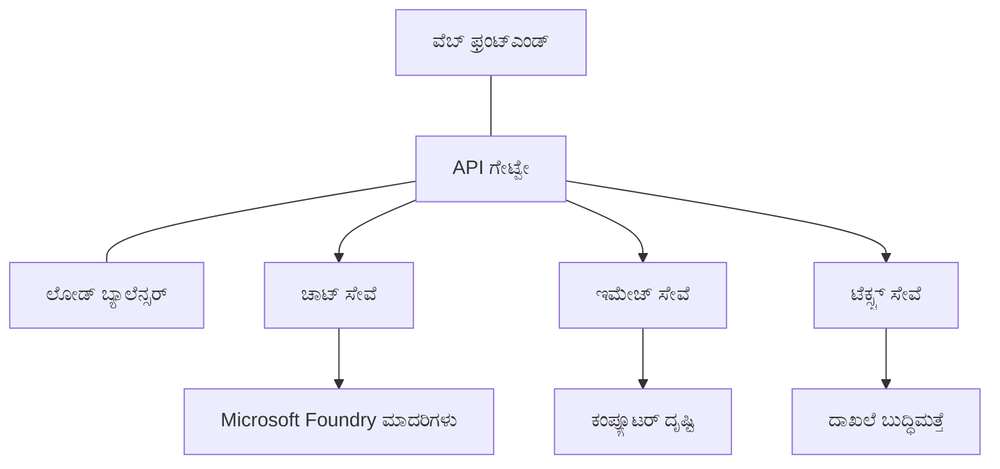

# ಉತ್ಪಾದನಾ AI ಕೆಲಸದ ಭಾರಾಂಶಕ್ಕಾಗಿ ಶುಭ ಅಭ್ಯಾಸಗಳು AZD ನೊಂದಿಗೆ

**Chapter Navigation:**
- **📚 کور್ಸ್ ಹೋಮ್**: [AZD ಆರಂಭಿಕರಿಗಾಗಿ](../../README.md)
- **📖 ಪ್ರಸ್ತುತ ಅಧ್ಯಾಯ**: ಅಧ್ಯಾಯ 8 - ಉತ್ಪಾದನೆ & ಎಂಟರ್ಪ್ರೈಸ್ ಮಾದರಿಗಳು
- **⬅️ ಹಿಂದಿನ ಅಧ್ಯಾಯ**: [Chapter 7: Troubleshooting](../chapter-07-troubleshooting/debugging.md)
- **⬅️ ಸಂಬಂಧಿಸಿದವು**: [AI Workshop Lab](ai-workshop-lab.md)
- **🎯 کور್ಸ್ ಸಂಪೂರ್ಣ**: [AZD ಆರಂಭಿಕರಿಗಾಗಿ](../../README.md)

## ಅವಲೋಕನ

ಈ ಮಾರ್ಗಸೂಚಿ Azure Developer CLI (AZD) ಬಳಸಿ ಉತ್ಪಾದನೆಗೆ ಸಿದ್ಧವಾದ AI ವರ್ಕ್‌ಲಾಗ್‌ಗಳನ್ನು ನಿಯೋಜಿಸಲು ಸಮಗ್ರ ಶುಭ ಅಭ್ಯಾಸಗಳನ್ನು ಒದಗಿಸುತ್ತದೆ. Microsoft Foundry Discord ಸಮುದಾಯದ ಪ್ರತಿಕ್ರಿಯೆ ಮತ್ತು ವಾಸ್ತವಿಕ ಗ್ರಾಹಕ ನಿಯೋಜನೆಗಳ ಆಧಾರದ ಮೇಲೆ, ಈ ಅಭ್ಯಾಸಗಳು ಉತ್ಪಾದನಾ AI ವ್ಯವಸ್ಥೆಗಳಲ್ಲಿನ ಸಾಮಾನ್ಯ ಸವಾಲುಗಳನ್ನು ಪರಿಹರಿಸಲು ವಿನ್ಯಾಸಗೊಳಿಸಲಾಗಿದೆ.

## ಪರಿಹರಿಸಲಾಗುತ್ತಿರುವ ಮುಖ್ಯ ಸವಾಲುಗಳು

ನಮ್ಮ ಸಮುದಾಯದ ತೀರ್ಮಾನ ಫಲಿತಾಂಶಗಳ ಆಧಾರದ ಮೇಲೆ, ಡೆವಲಪರ್‌ಗಳು ಎದುರಿಸುವ ಪ್ರಮುಖ ಸವಾಲುಗಳು ಇವು:

- **45%** ಬಹು-ಸೇವೆ AI ನಿಯೋಜನೆಗಳೊಂದಿಗೆ ಸಂಕುಲನೆ ಹೊಂದಿದ್ದಾರೆ
- **38%** ಕ್ರೆಡೆನ್ಷಿಯಲ್ ಮತ್ತು ರಹಸ್ಯ ನಿರ್ವಹಣದಲ್ಲಿ ಸಮಸ್ಯೆಗಳನ್ನು ಹೊಂದಿದ್ದಾರೆ  
- **35%** ಉತ್ಪಾದನಾ ಸಿದ್ಧತೆ ಮತ್ತು స్కೇಲಿಂಗ್ ಕಷ್ಟಸಾಧ್ಯವಾಗಿದೆ
- **32%** ಉತ್ತಮ ವೆಚ್ಚ ಆప్టಿಮೈಸೇಶನ್ ರಣನೀತಿಗಳು ಬೇಕಾಗಿವೆ
- **29%** ನಿಗಾ ಮತ್ತು ಡೀಬಗ್ಗಿಂಗ್ ಸುಧಾರಣೆ ಅಗತ್ಯವಿದೆ

## ಉತ್ಪಾದನಾ AI ಗಾಗಿ ವಾಸ್ತುಶಿಲ್ಪ ಮಾದರಿಗಳು

### ಮಾದರಿ 1: ಮೈಕ್ರೋಸರ್ವಿಸ್ AI ವಾಸ್ತುಶಿಲ್ಪ

**ಯಾವಾಗ ಬಳಸಬೇಕು**: ಬಹು ಸಾಮರ್ಥ್ಯದ ಸಂಯೋಜನೆಯೊಂದಿಗೆ ಸಂಕೀರ್ಣ AI ಅಪ್ಲಿಕೇಶನ್‌ಗಳಿಗಾಗಿ



**AZD ಅನುಷ್ಠಾನ**:

```yaml
# azure.yaml
name: enterprise-ai-platform
services:
  web:
    project: ./web
    host: staticwebapp
  api-gateway:
    project: ./api-gateway
    host: containerapp
  chat-service:
    project: ./services/chat
    host: containerapp
  vision-service:
    project: ./services/vision
    host: containerapp
  text-service:
    project: ./services/text
    host: containerapp
```

### ಮಾದರಿ 2: ಇವೆಂಟ್-ಚಾಲಿತ AI ಪ್ರಕ್ರಿಯೆ

**ಯಾವಾಗ ಬಳಸಬೇಕು**: ಬ್ಯಾಚ್ ಪ್ರಕ್ರಿಯೆ, ಡಾಕ್ಯುಮೆಂಟ್ ವಿಶ್ಲೇಷಣೆ, ಅಸಿಂಕ್ರೋನಸ್ ವರ್ಕ್‌ಫ್ಲೋಗಳು

```bicep
// Event Hub for AI processing pipeline
resource eventHub 'Microsoft.EventHub/namespaces@2023-01-01-preview' = {
  name: eventHubNamespaceName
  location: location
  sku: {
    name: 'Standard'
    tier: 'Standard'
    capacity: 1
  }
}

// Service Bus for reliable message processing
resource serviceBus 'Microsoft.ServiceBus/namespaces@2022-10-01-preview' = {
  name: serviceBusNamespaceName
  location: location
  sku: {
    name: 'Premium'
    tier: 'Premium'
    capacity: 1
  }
}

// Function App for processing
resource functionApp 'Microsoft.Web/sites@2023-01-01' = {
  name: functionAppName
  location: location
  kind: 'functionapp,linux'
  properties: {
    siteConfig: {
      appSettings: [
        {
          name: 'FUNCTIONS_EXTENSION_VERSION'
          value: '~4'
        }
        {
          name: 'AZURE_OPENAI_ENDPOINT'
          value: '@Microsoft.KeyVault(VaultName=${keyVault.name};SecretName=openai-endpoint)'
        }
      ]
    }
  }
}
```

## AI ಏಜೆಂಟ್ ಆರೋಗ್ಯ ಕುರಿತು ಯೋಚನೆ

ಸಾಂಪ್ರದಾಯಿಕ ವೆಬ್ ಅಪ್ಲಿಕೇಶನ್ ಬ್ರೇಕ್ ಆದಾಗ, ಲಕ್ಷಣಗಳು ಪರಿಚಿತ — ಪುಟ ಲೋಡ್ ಆಗುವುದಿಲ್ಲ, API ದೋಷವನ್ನು ತೋರಿಸುತ್ತದೆ, ಅಥವಾ ನಿಯೋಜನೆ ವಿಫಲವಾಗುತ್ತದೆ. AI-ಸಂವಿಗಧಿತ ಅಪ್ಲಿಕೇಶನ್‌ಗಳು ಎಲ್ಲ ಅವುಗಳಲ್ಲಿಯೇ ತೊಂದರೆ ಕಾಣಿಸಬಹುದು — ಆದರೆ ಅವು ಸಾಧ್ಯತೆಯೇನಂದರೆ ಸ್ಪಷ್ಟ ದೋಷ ಸಂದೇಶಗಳನ್ನು ಉಂಟುಮಾಡದ ಸೂಕ್ಷ್ಮ ರೀತಿಗಳಲ್ಲಿ ತಪ್ಪು ವರ್ತನೆ ಕೂಡ ಆಗಬಹುದು.

ಈ ವಿಭಾಗವು AI ವರ್ಕ್‌್ಲಾಡ್‌ಗಳ ನಿಗಾವೆಗೆ ಮಾನಸಿಕ ಮಾದರಿಯನ್ನು ನಿರ್ಮಿಸಲು ಸಹಾಯ ಮಾಡುತ್ತದೆ যাতে ಸಮಸ್ಯೆಗಳು ಕಂಡುಬಂದಾಗ ನೀವು ಎಲ್ಲಿ ಹುಡುಕಬೇಕು ಎಂದು ತಿಳಿಯುತ್ತದೆ.

### ಏಜೆಂಟ್ ಆರೋಗ್ಯವು ಸಾಂಪ್ರದಾಯಿಕ ಅಪ್ಲಿಕೇಶನ್ ಆರೋಗ್ಯದಿಂದ ಹೇಗೆ ವಿಭಿನ್ನವಾಗಿದೆ

ಸಾಂಪ್ರದಾಯಿಕ ಅಪ್ಲಿಕೇಶನ್ ಕೆಲಸ ಮಾಡುತ್ತದೆ ಅಥವಾ ಮಾಡದು. AI ಏಜೆಂಟ್ ಕೆಲಸ ಮಾಡುತ್ತಿರುವಂತೆ ತೋರುವಾಗ ಹೀನಫಲಿತಾಂಶಗಳನ್ನು ಕೊಡಬಹುದು. ಏಜೆಂಟ್ ಆರೋಗ್ಯವನ್ನು ಎರಡು ಸ್ತರಗಳಲ್ಲಿ ಪರಿಗಣಿಸಿ:

| Layer | What to Watch | Where to Look |
|-------|--------------|---------------|
| **Infrastructure health** | ಸರ್ವಿಸ್ ಕಾರ್ಯನಿರ್ವಹಿಸುತ್ತಿದೆಯೇ? ಸಂಪನ್ಮೂಲಗಳು ಪ್ರೊವಿಷನ್ ಆಗಿದೆಯೇ? ಎಂಡ್‌ಪಾಯಿಂಟ್‌ಗಳು ತಲುಪಬಹುದೇ? | `azd monitor`, Azure Portal resource health, container/app logs |
| **Behavior health** | ಏಜೆಂಟ್ ಸರಿಯಾಗಿ ಪ್ರತಿಕ್ರಿಯಿಸುತ್ತಿದೆಯೇ? ಪ್ರತಿಕ್ರಿಯೆಗಳು ಸಮಯೋಚಿತವೇ? ಮಾದರಿಯನ್ನು ಸರಿಯಾಗಿ ಕರೆ ಮಾಡಲಾಗುತ್ತಿದ್ದದೆಯೇ? | Application Insights traces, model call latency metrics, response quality logs |

Infrastructure ಆರೋಗ್ಯ ಪರಿಚಿತ—ಇದು ಯಾವುದೇ azd ಅಪ್‌ಗಾಗಿ ಒಂದೇ. Behavior ಆರೋಗ್ಯ AI ವರ್ಕ್‌ಲಾಗ್ಗಳಿಗೆ ಪರಿಚಯಿಸುವ ಹೊಸ ಸ್ತರವಾಗಿದೆ.

### AI ಅಪ್ಲಿಕೇಶನ್‌ಗಳು ನಿರೀಕ್ಷೆಗಿಂತ ಬೇರೆಯಾಗಿ ವರತಿಸುವಾಗ ಎಲ್ಲಿಗೆ ನೋಡಬೇಕು

ನಿಮ್ಮ AI ಅಪ್ಲಿಕೇಶನ್ ನಿರೀಕ್ಷೆಯಂತೆ ಫಲಿತಾಂಶಗಳನ್ನು ನೀಡುತ್ತಿಲ್ಲದಿದ್ದರೆ, ಇಲ್ಲಿ概念ಾತ್ಮಕ ತಪಾಸಣಾ ಪಟ್ಟಿಯಿದೆ:

1. **ಮೂಲಭೂತಗಳಿಂದ ಪ್ರಾರಂಭಿಸಿ.** ಅಪ್ಲಿಕೇಶನ್ ಚಾಲನೆಗೊಂಡಿದೆಯೇ? ಅದು ಅವಲಂಬನೆಗಳನ್ನು ತಲುಪಬಹುದೇ? ಯಾವುದೇ ಅಪ್ಲಿಕೇಶನ್ ಆಗಿರುವಂತೆ `azd monitor` ಮತ್ತು ಸಂಪನ್ಮೂಲ ಆರೋಗ್ಯವನ್ನು ಪರಿಶೀಲಿಸಿ.
2. **ಮಾದರಿ ಸಂಪರ್ಕವನ್ನು ಪರಿಶೀಲಿಸಿ.** ನಿಮ್ಮ ಅಪ್ಲಿಕೇಶನ್ ಯಶಸ್ವಿಯಾಗಿ AI ಮಾದರಿಯನ್ನು ಕರೆ ಮಾಡುತ್ತಿದೆಯೇ? ವಿಫಲ ಅಥವಾ ಸಮಯ ಮೀರಿದ ಮಾದರಿ ಕರೆಗಳು AI ಅಪ್ಲಿಕೇಶನ್ ಸಮಸ್ಯೆಗಳ ಅತ್ಯಂತ ಸಾಮಾನ್ಯ ಕಾರಣ ಮತ್ತು ಅವು ನಿಮ್ಮ ಅಪ್ಲಿಕೇಶನ್ ಲಾಗ್‌ಗಳಲ್ಲಿ ಕಾಣಿಸಿಕೊಳ್ಳುತ್ತವೆ.
3. **ಮಾದರಿ ಪಡೆದಿರುವದನ್ನು ನೋಡಿ.** AI ಪ್ರತಿಕ್ರಿಯೆಗಳು ಇನ್‌ಪುಟ್ (ಪ್ರಾಂಪ್ಟ್ ಮತ್ತು ಏನೆಲ್ಲಾ ತರುವ ಸಂದರ್ಭ) ಮೇಲೆ ಅವಲಂಬಿತವಾಗಿವೆ. ಔಟ್‌ಪುಟ್ ತಪ್ಪಿದ್ದರೆ, ಸಾಮಾನ್ಯವಾಗಿ ಇನ್‌ಪುಟ್ ತಪ್ಪಿದೆ. ನಿಮ್ಮ ಅಪ್ಲಿಕೇಶನ್ ಮಾದರಿಗೆ ಸರಿಯಾದ ಮಾಹಿತಿಯನ್ನು ಕಳುಹಿಸುತ್ತಿದೆಯೇ ಎಂದು ಚೆಕ್ ಮಾಡಿ.
4. **ಪ್ರತಿಕ್ರಿಯಾ ವಿಳಂಬವನ್ನು ಪರಿಶೀಲಿಸಿ.** AI ಮಾದರಿ ಕರೆಗಳು ಸಾಮಾನ್ಯ API ಕರೆಗಳಿಗಿಂತ ನಿಧಾನವಾಗಿವೆ. ಅಪ್ಲಿಕೇಶನ್ ನಿಧಾನವಾಗುತ್ತಿರುವಂತೆ ಅನಿಸುತ್ತಿದ್ದರೆ, ಮಾದರಿ ಪ್ರತಿಕ್ರಿಯಾ ಸಮಯಗಳು ಹೆಚ್ಚಿದಿವೆ ಎಂಬುದನ್ನು ಪರಿಶೀಲಿಸಿ—ಇದು ಥ್ರಾಟ್ಲಿಂಗ್, ظرفیت ಮಿತಿಗಳು, ಅಥವಾ ಪ್ರಾದೇಶಿಕ ದಿಟ್ಟತೆ ಸೂಚಿಸಬಹುದು.
5. **ವೆಚ್ಚಸೂಚನೆಗಳನ್ನು ಗಮನಿಸಿ.** ಟೋಕನ್ ಬಳಕೆ ಅಥವಾ API ಕರೆಗಳಲ್ಲಿ ಅನಿರೀಕ್ಷಿತ ಏರಿಕೆಗಳು ಲೂಪ್, ತಪ್ಪಾಗಿ ಸಂರಚಿಸಲಾದ ಪ್ರಾಂಪ್ಟ್, ಅಥವಾ ಹೆಚ್ಚು ಪುನರಾಯ್ತುಕরণಗಳನ್ನು ಸೂಚಿಸಬಹುದು.

ನೀವು ತಕ್ಷಣವೇ ನಿಗಾವೆ ಉಪಕರಣಗಳಲ್ಲಿ ನಿಪುಣರಾಗಬೇಕಾಗಿಲ್ಲ. ಮುಖ್ಯ ಒಳನೋಟವೆಂದರೆ AI ಅಪ್ಲಿಕೇಶನ್‌ಗಳಿಗೆ ಗಮನಿಸಬೇಕಾದ ಮತ್ತೊಂದು ವರ್ತನಾತ್ಮಕ ಸ್ತರವಿದೆ, ಮತ್ತು azd ನ ಒಳಹೊಕ್ಕ ನಿಗಾವೆ (`azd monitor`) ನಿಮಗೆ ಎರಡೂ ಸ್ತರಗಳ ತನಿಖೆಗಾಗಿ ಆರಂಭಿಕ ಬಿಂದು ಒದಗಿಸುತ್ತದೆ.

---

## ಭದ್ರತಾ ಶುಭ ಅಭ್ಯಾಸಗಳು

### 1. ಶೂನ್ಯ-ವಿಶ್ವಾಸ (Zero-Trust) ಭದ್ರತಾ ಮಾದರಿ

**ಅನುಷ್ಠಾನ ತಂತ್ರ:** 
- ದೃಢೀಕರಣವಿಲ್ಲದೆ ಯಾವುದೇ ಸರ್ವಿಸ್-ದಿಂದ-ಸರ್ವಿಸ್ ಸಂವಹನವಿಲ್ಲ
- ಎಲ್ಲಾ API ಕರೆಗಳು managed identities ಬಳಸುತ್ತವೆ
- ಖಾಸಗಿ ಎಂಡ್‌ಪಾಯಿಂಟ್‌ಗಳೊಂದಿಗೆ ನೆಟ್ವರ್ಕ್ isolamento
- ಕನಿಷ್ಠ ಆದ 권ಗಳು ಹೊಂದಿರುವ ಪ್ರವೇಶ ನಿಯಂತ್ರಣ

```bicep
// Managed Identity for each service
resource chatServiceIdentity 'Microsoft.ManagedIdentity/userAssignedIdentities@2023-01-31' = {
  name: 'chat-service-identity'
  location: location
}

// Role assignments with minimal permissions
resource openAIUserRole 'Microsoft.Authorization/roleAssignments@2022-04-01' = {
  scope: openAIAccount
  name: guid(openAIAccount.id, chatServiceIdentity.id, openAIUserRoleDefinitionId)
  properties: {
    roleDefinitionId: subscriptionResourceId('Microsoft.Authorization/roleDefinitions', '5e0bd9bd-7b93-4f28-af87-19fc36ad61bd')
    principalId: chatServiceIdentity.properties.principalId
    principalType: 'ServicePrincipal'
  }
}
```

### 2. ರಹಸ್ಯಗಳ ಸುರಕ್ಷಿತ ನಿರ್ವಹಣೆ

**Key Vault ಸಮಾವೇಶ ಮಾದರಿ**:

```bicep
// Key Vault with proper access policies
resource keyVault 'Microsoft.KeyVault/vaults@2023-02-01' = {
  name: keyVaultName
  location: location
  properties: {
    tenantId: tenant().tenantId
    sku: {
      family: 'A'
      name: 'premium'  // Use premium for production
    }
    enableRbacAuthorization: true  // Use RBAC instead of access policies
    enablePurgeProtection: true    // Prevent accidental deletion
    enableSoftDelete: true
    softDeleteRetentionInDays: 90
  }
}

// Store all AI service credentials
resource openAIKeySecret 'Microsoft.KeyVault/vaults/secrets@2023-02-01' = {
  parent: keyVault
  name: 'openai-api-key'
  properties: {
    value: openAIAccount.listKeys().key1
    attributes: {
      enabled: true
    }
  }
}
```

### 3. ನೆಟ್ವರ್ಕ್ ಭದ್ರತೆ

**ಖಾಸಗಿ ಎಂಡ್‌ಪಾಯಿಂಟ್ ಸಂರಚನೆ**:

```bicep
// Virtual Network for AI services
resource virtualNetwork 'Microsoft.Network/virtualNetworks@2023-04-01' = {
  name: vnetName
  location: location
  properties: {
    addressSpace: {
      addressPrefixes: ['10.0.0.0/16']
    }
    subnets: [
      {
        name: 'ai-services-subnet'
        properties: {
          addressPrefix: '10.0.1.0/24'
          privateEndpointNetworkPolicies: 'Disabled'
        }
      }
      {
        name: 'app-services-subnet'
        properties: {
          addressPrefix: '10.0.2.0/24'
          delegations: [
            {
              name: 'Microsoft.Web/serverFarms'
              properties: {
                serviceName: 'Microsoft.Web/serverFarms'
              }
            }
          ]
        }
      }
    ]
  }
}

// Private endpoints for all AI services
resource openAIPrivateEndpoint 'Microsoft.Network/privateEndpoints@2023-04-01' = {
  name: '${openAIAccountName}-pe'
  location: location
  properties: {
    subnet: {
      id: virtualNetwork.properties.subnets[0].id
    }
    privateLinkServiceConnections: [
      {
        name: 'openai-connection'
        properties: {
          privateLinkServiceId: openAIAccount.id
          groupIds: ['account']
        }
      }
    ]
  }
}
```

## ಪ್ರದರ್ಶನ ಮತ್ತು స్కೇಲಿಂಗ್

### 1. ಸ್ವಯಂಚಾಲಿತ-ಸ್ಕೇಲಿಂಗ್ ತಂತ್ರಗಳು

**Container Apps auto-scaling**:

```bicep
resource containerApp 'Microsoft.App/containerApps@2023-05-01' = {
  name: containerAppName
  location: location
  properties: {
    configuration: {
      ingress: {
        external: true
        targetPort: 8000
        transport: 'http'
      }
    }
    template: {
      scale: {
        minReplicas: 2  // Always have 2 instances minimum
        maxReplicas: 50 // Scale up to 50 for high load
        rules: [
          {
            name: 'http-scaling'
            http: {
              metadata: {
                concurrentRequests: '20'  // Scale when >20 concurrent requests
              }
            }
          }
          {
            name: 'cpu-scaling'
            custom: {
              type: 'cpu'
              metadata: {
                type: 'Utilization'
                value: '70'  // Scale when CPU >70%
              }
            }
          }
        ]
      }
    }
  }
}
```

### 2. ಕ್ಯಾಶಿಂಗ್ ತಂತ್ರಗಳು

**Redis Cache for AI Responses**:

```bicep
// Redis Premium for production workloads
resource redisCache 'Microsoft.Cache/redis@2023-04-01' = {
  name: redisCacheName
  location: location
  properties: {
    sku: {
      name: 'Premium'
      family: 'P'
      capacity: 1
    }
    enableNonSslPort: false
    minimumTlsVersion: '1.2'
    redisConfiguration: {
      'maxmemory-policy': 'allkeys-lru'
    }
    // Enable clustering for high availability
    redisVersion: '6.0'
    shardCount: 2
  }
}

// Cache configuration in application
var cacheConnectionString = '${redisCache.properties.hostName}:6380,password=${redisCache.listKeys().primaryKey},ssl=True,abortConnect=False'
```

### 3. ಲೋಡ್ ಬ್ಯಾಲನ್ಸಿಂಗ್ ಮತ್ತು ಟ್ರಾಫಿಕ್ ನಿರ್ವಹಣೆ

**Application Gateway with WAF**:

```bicep
// Application Gateway with Web Application Firewall
resource applicationGateway 'Microsoft.Network/applicationGateways@2023-04-01' = {
  name: appGatewayName
  location: location
  properties: {
    sku: {
      name: 'WAF_v2'
      tier: 'WAF_v2'
      capacity: 2
    }
    webApplicationFirewallConfiguration: {
      enabled: true
      firewallMode: 'Prevention'
      ruleSetType: 'OWASP'
      ruleSetVersion: '3.2'
    }
    // Backend pools for AI services
    backendAddressPools: [
      {
        name: 'ai-services-pool'
        properties: {
          backendAddresses: [
            {
              fqdn: '${containerApp.properties.configuration.ingress.fqdn}'
            }
          ]
        }
      }
    ]
  }
}
```

## 💰 ವೆಚ್ಚವನ್ನು ಆప్టಿಮೈಸೆ ಮಾಡುವಿಕೆ

### 1. ಸಂಪನ್ಮೂಲ ಪ್ರಮಾಣವನ್ನು ಸರಿಹೊಂದಿಸುವಿಕೆ

**ಪರಿಸರ-ನಿರ್ದಿಷ್ಟ ಸಂರಚನೆಗಳು**:

```bash
# ಅಭಿವೃದ್ಧಿ ಪರಿಸರ
azd env new development
azd env set AZURE_OPENAI_SKU "S0"
azd env set AZURE_OPENAI_CAPACITY 10
azd env set AZURE_SEARCH_SKU "basic"
azd env set CONTAINER_CPU 0.5
azd env set CONTAINER_MEMORY 1.0

# ಉತ್ಪಾದನಾ ಪರಿಸರ
azd env new production
azd env set AZURE_OPENAI_SKU "S0"
azd env set AZURE_OPENAI_CAPACITY 100
azd env set AZURE_SEARCH_SKU "standard"
azd env set CONTAINER_CPU 2.0
azd env set CONTAINER_MEMORY 4.0
```

### 2. ವೆಚ್ಚ ನಿಗಾ ಮತ್ತು ಬಜೆಟ್‌ಗಳು

```bicep
// Cost management and budgets
resource budget 'Microsoft.Consumption/budgets@2023-05-01' = {
  name: 'ai-workload-budget'
  properties: {
    timePeriod: {
      startDate: '2024-01-01'
      endDate: '2024-12-31'
    }
    timeGrain: 'Monthly'
    amount: 2000  // $2000 monthly budget
    category: 'Cost'
    notifications: {
      warning: {
        enabled: true
        operator: 'GreaterThan'
        threshold: 80
        contactEmails: [
          'finance@company.com'
          'engineering@company.com'
        ]
        contactRoles: [
          'Owner'
          'Contributor'
        ]
      }
      critical: {
        enabled: true
        operator: 'GreaterThan'
        threshold: 95
        contactEmails: [
          'cto@company.com'
        ]
      }
    }
  }
}
```

### 3. ಟೋಕನ್ ಬಳಕೆ ಆప్టಿಮೈಸೇಶನ್

**OpenAI ವೆಚ್ಚ ನಿರ್ವಹಣೆ**:

```typescript
// ಅಪ್ಲಿಕೇಶನ್-ಮಟ್ಟದ ಟೋಕನ್ ಅನುಕೂಲನೆ
class TokenOptimizer {
  private readonly maxTokens = 4000;
  private readonly reserveTokens = 500;
  
  optimizePrompt(userInput: string, context: string): string {
    const availableTokens = this.maxTokens - this.reserveTokens;
    const estimatedTokens = this.estimateTokens(userInput + context);
    
    if (estimatedTokens > availableTokens) {
      // ಸಂಧರ್ಭವನ್ನು ಕತ್ತರಿಸಿ, ಬಳಕೆದಾರರ ಇನ್‌ಪುಟ್ ಅನ್ನು ಕತ್ತರಿಸಬೇಡಿ
      context = this.truncateContext(context, availableTokens - this.estimateTokens(userInput));
    }
    
    return `${context}\n\nUser: ${userInput}`;
  }
  
  private estimateTokens(text: string): number {
    // ಸುಮಾರು ಅಂದಾಜು: 1 ಟೋಕನ್ ≈ 4 ಅಕ್ಷರಗಳು
    return Math.ceil(text.length / 4);
  }
}
```

## ನಿಗಾವೆ ಮತ್ತು ಅವಲೋಕನ

### 1. ಸಮಗ್ರ Application Insights

```bicep
// Application Insights with advanced features
resource applicationInsights 'Microsoft.Insights/components@2020-02-02' = {
  name: applicationInsightsName
  location: location
  kind: 'web'
  properties: {
    Application_Type: 'web'
    WorkspaceResourceId: logAnalyticsWorkspace.id
    SamplingPercentage: 100  // Full sampling for AI apps
    DisableIpMasking: false  // Enable for security
  }
}

// Custom metrics for AI operations
resource aiMetricAlerts 'Microsoft.Insights/metricAlerts@2018-03-01' = {
  name: 'ai-high-error-rate'
  location: 'global'
  properties: {
    description: 'Alert when AI service error rate is high'
    severity: 2
    enabled: true
    scopes: [
      applicationInsights.id
    ]
    evaluationFrequency: 'PT1M'
    windowSize: 'PT5M'
    criteria: {
      'odata.type': 'Microsoft.Azure.Monitor.SingleResourceMultipleMetricCriteria'
      allOf: [
        {
          name: 'high-error-rate'
          metricName: 'requests/failed'
          operator: 'GreaterThan'
          threshold: 10
          timeAggregation: 'Count'
        }
      ]
    }
  }
}
```

### 2. AI-ನಿರ್ದಿಷ್ಟ ನಿಗಾವೆ

**AI ಮೆಟ್ರಿಕ್ಸ್‌ಗಾಗಿ ಕಸ್ಟಂ ಡ್ಯಾಶ್‌ಬೋರ್ಡ್‌ಗಳು**:

```json
// Dashboard configuration for AI workloads
{
  "dashboard": {
    "name": "AI Application Monitoring",
    "tiles": [
      {
        "name": "OpenAI Request Volume",
        "query": "requests | where name contains 'openai' | summarize count() by bin(timestamp, 5m)"
      },
      {
        "name": "AI Response Latency",
        "query": "requests | where name contains 'openai' | summarize avg(duration) by bin(timestamp, 5m)"
      },
      {
        "name": "Token Usage",
        "query": "customMetrics | where name == 'openai_tokens_used' | summarize sum(value) by bin(timestamp, 1h)"
      },
      {
        "name": "Cost per Hour",
        "query": "customMetrics | where name == 'openai_cost' | summarize sum(value) by bin(timestamp, 1h)"
      }
    ]
  }
}
```

### 3. ಆರೋಗ್ಯ ಪರೀಕ್ಷೆಗಳು ಮತ್ತು ಅಪ್ಟೈಮ್ ನಿಗಾವೆ

```bicep
// Application Insights availability tests
resource availabilityTest 'Microsoft.Insights/webtests@2022-06-15' = {
  name: 'ai-app-availability-test'
  location: location
  tags: {
    'hidden-link:${applicationInsights.id}': 'Resource'
  }
  properties: {
    SyntheticMonitorId: 'ai-app-availability-test'
    Name: 'AI Application Availability Test'
    Description: 'Tests AI application endpoints'
    Enabled: true
    Frequency: 300  // 5 minutes
    Timeout: 120    // 2 minutes
    Kind: 'ping'
    Locations: [
      {
        Id: 'us-east-2-azr'
      }
      {
        Id: 'us-west-2-azr'
      }
    ]
    Configuration: {
      WebTest: '''
        <WebTest Name="AI Health Check" 
                 Id="8d2de8d2-a2b0-4c2e-9a0d-8f9c9a0b8c8d" 
                 Enabled="True" 
                 CssProjectStructure="" 
                 CssIteration="" 
                 Timeout="120" 
                 WorkItemIds="" 
                 xmlns="http://microsoft.com/schemas/VisualStudio/TeamTest/2010" 
                 Description="" 
                 CredentialUserName="" 
                 CredentialPassword="" 
                 PreAuthenticate="True" 
                 Proxy="default" 
                 StopOnError="False" 
                 RecordedResultFile="" 
                 ResultsLocale="">
          <Items>
            <Request Method="GET" 
                     Guid="a5f10126-e4cd-570d-961c-cea43999a200" 
                     Version="1.1" 
                     Url="${webApp.properties.defaultHostName}/health" 
                     ThinkTime="0" 
                     Timeout="120" 
                     ParseDependentRequests="True" 
                     FollowRedirects="True" 
                     RecordResult="True" 
                     Cache="False" 
                     ResponseTimeGoal="0" 
                     Encoding="utf-8" 
                     ExpectedHttpStatusCode="200" 
                     ExpectedResponseUrl="" 
                     ReportingName="" 
                     IgnoreHttpStatusCode="False" />
          </Items>
        </WebTest>
      '''
    }
  }
}
```

## ವಿಪತ್ತು ವಾಪಸಿ ಮತ್ತು உயರ್ದ ಲಭ್ಯತೆ

### 1. ಬಹು-ಪ್ರಾದೇಶಿಕ ನಿಯೋಜನೆ

```yaml
# azure.yaml - Multi-region configuration
name: ai-app-multiregion
services:
  api-primary:
    project: ./api
    host: containerapp
    env:
      - AZURE_REGION=eastus
  api-secondary:
    project: ./api
    host: containerapp
    env:
      - AZURE_REGION=westus2
```

```bicep
// Traffic Manager for global load balancing
resource trafficManager 'Microsoft.Network/trafficManagerProfiles@2022-04-01' = {
  name: trafficManagerProfileName
  location: 'global'
  properties: {
    profileStatus: 'Enabled'
    trafficRoutingMethod: 'Priority'
    dnsConfig: {
      relativeName: trafficManagerProfileName
      ttl: 30
    }
    monitorConfig: {
      protocol: 'HTTPS'
      port: 443
      path: '/health'
      intervalInSeconds: 30
      toleratedNumberOfFailures: 3
      timeoutInSeconds: 10
    }
    endpoints: [
      {
        name: 'primary-endpoint'
        type: 'Microsoft.Network/trafficManagerProfiles/azureEndpoints'
        properties: {
          targetResourceId: primaryAppService.id
          endpointStatus: 'Enabled'
          priority: 1
        }
      }
      {
        name: 'secondary-endpoint'
        type: 'Microsoft.Network/trafficManagerProfiles/azureEndpoints'
        properties: {
          targetResourceId: secondaryAppService.id
          endpointStatus: 'Enabled'
          priority: 2
        }
      }
    ]
  }
}
```

### 2. ಡೇಟಾ ಬ್ಯಾಕಪ್ ಮತ್ತು ರಿಕವರಿ

```bicep
// Backup configuration for critical data
resource backupVault 'Microsoft.DataProtection/backupVaults@2023-05-01' = {
  name: backupVaultName
  location: location
  identity: {
    type: 'SystemAssigned'
  }
  properties: {
    storageSettings: [
      {
        datastoreType: 'VaultStore'
        type: 'LocallyRedundant'
      }
    ]
  }
}

// Backup policy for AI models and data
resource backupPolicy 'Microsoft.DataProtection/backupVaults/backupPolicies@2023-05-01' = {
  parent: backupVault
  name: 'ai-data-backup-policy'
  properties: {
    policyRules: [
      {
        backupParameters: {
          backupType: 'Full'
          objectType: 'AzureBackupParams'
        }
        trigger: {
          schedule: {
            repeatingTimeIntervals: [
              'R/2024-01-01T02:00:00+00:00/P1D'  // Daily at 2 AM
            ]
          }
          objectType: 'ScheduleBasedTriggerContext'
        }
        dataStore: {
          datastoreType: 'VaultStore'
          objectType: 'DataStoreInfoBase'
        }
        name: 'BackupDaily'
        objectType: 'AzureBackupRule'
      }
    ]
  }
}
```

## DevOps ಮತ್ತು CI/CD ಏಕೀಕರಣ

### 1. GitHub Actions ವರ্ক್‌ಫ್ಲೋ

```yaml
# .github/workflows/deploy-ai-app.yml
name: Deploy AI Application

on:
  push:
    branches: [main]
  pull_request:
    branches: [main]

jobs:
  test:
    runs-on: ubuntu-latest
    steps:
      - uses: actions/checkout@v4
      
      - name: Setup Python
        uses: actions/setup-python@v4
        with:
          python-version: '3.11'
          
      - name: Install dependencies
        run: |
          pip install -r requirements.txt
          pip install pytest
          
      - name: Run tests
        run: pytest tests/
        
      - name: AI Safety Tests
        run: |
          python scripts/test_ai_safety.py
          python scripts/validate_prompts.py

  deploy-staging:
    needs: test
    if: github.event_name == 'pull_request'
    runs-on: ubuntu-latest
    steps:
      - uses: actions/checkout@v4
      
      - name: Setup AZD
        uses: Azure/setup-azd@v2
        
      - name: Login to Azure
        uses: azure/login@v1
        with:
          creds: ${{ secrets.AZURE_CREDENTIALS }}
          
      - name: Deploy to Staging
        run: |
          azd env select staging
          azd deploy

  deploy-production:
    needs: test
    if: github.ref == 'refs/heads/main'
    runs-on: ubuntu-latest
    steps:
      - uses: actions/checkout@v4
      
      - name: Setup AZD
        uses: Azure/setup-azd@v2
        
      - name: Login to Azure
        uses: azure/login@v1
        with:
          creds: ${{ secrets.AZURE_CREDENTIALS }}
          
      - name: Deploy to Production
        run: |
          azd env select production
          azd deploy
          
      - name: Run Production Health Checks
        run: |
          python scripts/health_check.py --env production
```

### 2. ಸ್ಥಾವರ ದೃಡೀಕರಣ (Infrastructure Validation)

```bash
# scripts/validate_infrastructure.sh
#!/bin/bash

echo "Validating AI infrastructure deployment..."

# ಎಲ್ಲಾ ಅಗತ್ಯ ಸೇವೆಗಳು ಕಾರ್ಯನಿರ್ವಹಿಸುತ್ತಿರುವವೆಯೇ ಎಂದು ಪರಿಶೀಲಿಸಿ
services=("openai" "search" "storage" "keyvault")
for service in "${services[@]}"; do
    echo "Checking $service..."
    if ! az resource list --resource-type "Microsoft.CognitiveServices/accounts" --query "[?contains(name, '$service')]" -o tsv; then
        echo "ERROR: $service not found"
        exit 1
    fi
done

# OpenAI ಮಾದರಿ ನಿಯೋಜನೆಗಳನ್ನು ಪರಿಶೀಲಿಸಿ
echo "Validating OpenAI model deployments..."
models=$(az cognitiveservices account deployment list --name $AZURE_OPENAI_NAME --resource-group $AZURE_RESOURCE_GROUP --query "[].name" -o tsv)
if [[ ! $models == *"gpt-4.1-mini"* ]]; then
  echo "ERROR: Required model gpt-4.1-mini not deployed"
    exit 1
fi

# AI ಸೇವೆಯ ಸಂಪರ್ಕವನ್ನು ಪರೀಕ್ಷಿಸಿ
echo "Testing AI service connectivity..."
python scripts/test_connectivity.py

echo "Infrastructure validation completed successfully!"
```

## ಉತ್ಪಾದನಾ ಸಿದ್ಧತೆ ಚೆಕ್ಲಿಸ್ಟ್

### ಭದ್ರತೆ ✅
- [ ] ಎಲ್ಲಾ ಸೇವೆಗಳು managed identities ಬಳಸಿ
- [ ] ರಹಸ್ಯಗಳು Key Vault ನಲ್ಲಿ ಸಂಗ್ರಹಿಸಲಾಗಿದೆ
- [ ] ಖಾಸಗಿ ಎಂಡ್‌ಪಾಯಿಂಟ್‌ಗಳು ಸಂರಚಿಸಲಾಗಿದೆ
- [ ] ನೆಟ್ವರ್ಕ್ ಸೆಕ್ಯುರಿಟಿ ಗುಂಪುಗಳು ಜಾರಿಗೊಳಿಸಲಾಗಿದೆ
- [ ] ಕನಿಷ್ಠ ಪ್ರವೇಶದೊಂದಿಗೆ RBAC
- [ ] ಪಬ್ಲಿಕ್ ಎಂಡ್‌ಪಾಯಿಂಟ್‌ಗಳ ಮೇಲೆ WAF ಸಕ್ರಿಯವಾಗಿದೆ

### ಪ್ರದರ್ಶನ ✅
- [ ] ಸ್ವಯಂ-ಸ್ಕೇಲಿಂಗ್ ಸಂರಚಿಸಲಾಗಿದೆ
- [ ] ಕ್ಯಾಶಿಂಗ್ ಜಾರಿಗೆ ತಂದಲಾಗಿದೆ
- [ ] ಲೋಡ್ ಬ್ಯಾಲನ್ಸಿಂಗ್ ಸ್ಥಾಪನೆ
- [ ] ಸ್ಥಿರ ವಿಷಯಕ್ಕೆ CDN
- [ ] ಡೇಟಾಬೇಸ್ ಕನೆಕ್ಷನ್ ಪೂಲ್‌ಿಂಗ್
- [ ] ಟೋಕನ್ ಬಳಕೆಯ ಆప్టಿಮೈಸೇಶನ್

### ನಿಗಾವೆ ✅
- [ ] Application Insights ಸಂರಚಿತವಾಗಿದೆ
- [ ] ಕಸ್ಟಮ್ ಮೆಟ್ರಿಕ್ಸ್ definidos
- [ ] ಅಲರ್ಟ್ ನಿಯಮಗಳು ಕಾನ್ಫಿಗರ್ ಆಗಿವೆ
- [ ] ಡ್ಯಾಶ್‌ಬೋರ್ಡ್ ರಚಿಸಲಾಗಿದೆ
- [ ] ಆರೋಗ್ಯ ಪರೀಕ್ಷೆಗಳು ಜಾರಿಗೆ ಬಂದಿವೆ
- [ ] ಲಾಗ್ ಸಂಗ್ರಹಣೆಯ ನೀತಿಗಳು

### ನಂಬತಕ್ಕತೆ ✅
- [ ] ಬಹು-ಪ್ರಾದೇಶಿಕ ನಿಯೋಜನೆ
- [ ] ಬ್ಯಾಕಪ್ ಮತ್ತು ರಿಕವರಿ ಯೋಜನೆ
- [ ] ಸರ್ಕಟ್ ಬ್ರೇಕರ್‌ಗಳು ಜಾರಿಗೆ ಬಂದಿವೆ
- [ ] ಪುನರಾಯ್ತುಕಣಿ ನೀತಿಗಳು ಕಾನ್ಫಿಗರ್ ಆಗಿವೆ
- [ ] ವಿನಯಪೂರ್ವಕ ಅಗಲಿಕೆ (Graceful degradation)
- [ ] ಆರೋಗ್ಯ ಪರೀಕ್ಷಾ ಎಂಡ್‌ಪಾಯಿಂಟ್‌ಗಳು

### ವೆಚ್ಚ ನಿರ್ವಹಣೆ ✅
- [ ] ಬಜೆಟ್ ಎಚ್ಚರಿಕೆಗಳು ಕಾನ್ಫಿಗರ್ ಆಗಿವೆ
- [ ] ಸಂಪನ್ಮೂಲ ಪ್ರಮಾಣ ಸರಿಹೊಂದಿಸಲಾಗಿದೆ
- [ ] Dev/test ರಿಯಾಯಿತಿಗಳು ಅನ್ವಯಪಟ್ಟಿವೆ
- [ ] ರಿಸರ್ವ್ಡ್ ಇನ್‌ಸ್ಟಾನ್ಸ್‌ಗಳು ಖರೀದಿಸಿವೆ
- [ ] ವೆಚ್ಚ ನಿಗಾ ಡ್ಯಾಶ್‌ಬೋರ್ಡ್
- [ ] ನಿಯಮಿತ ವೆಚ್ಚ ವಿಮರ್ಶೆಗಳು

### ಅನುಪಾಲನೆ ✅
- [ ] ಡೇಟಾ ನಿವಾಸಿತ್ವದ ಅಗತ್ಯಗಳು ಪೂರೈಸಲ್ಪಟ್ಟಿವೆ
- [ ] ಆಡಿಟ್ ಲಾಗಿಂಗ್ ಸಕ್ರಿಯವಾಗಿದೆ
- [ ] ಅನುಪಾಲನಾ ನೀತಿಗಳು ಅನ್ವಯಿಸಲಾಗಿದೆ
- [ ] ಭದ್ರತಾ ಬೇಸ್‌ಲೈನ್‌ಗಳು ಜಾರಿಗೆ ಬಂದಿವೆ
- [ ] ನಿಯಮಿತ ಭದ್ರತಾ ವಿಮರ್ಶೆಗಳು
- [ ] ಘಟನೆಯ ಪ್ರತಿಕ್ರಿಯಾ ಯೋಜನೆ

## ಪ್ರದರ್ಶನ ಮೇಲ್ಪಡಿಕೆಯ ಮೂಲ್ಯಮಾಪನಗಳು

### ಸಾಮಾನ್ಯ ಉತ್ಪಾದನಾ ಮೇಟ್ರಿಕ್ಸ್

| Metric | Target | Monitoring |
|--------|--------|------------|
| **Response Time** | < 2 seconds | Application Insights |
| **Availability** | 99.9% | Uptime monitoring |
| **Error Rate** | < 0.1% | Application logs |
| **Token Usage** | < $500/month | Cost management |
| **Concurrent Users** | 1000+ | Load testing |
| **Recovery Time** | < 1 hour | Disaster recovery tests |

### ಲೋಡ್ ಟೆಸ್ಟಿಂಗ್

```bash
# ಎಐ ಅಪ್ಲಿಕೇಶನ್‌ಗಳಿಗಾಗಿ ಲೋಡ್ ಪರೀಕ್ಷಾ ಸ್ಕ್ರಿಪ್ಟ್
python scripts/load_test.py \
  --endpoint https://your-ai-app.azurewebsites.net \
  --concurrent-users 100 \
  --duration 300 \
  --ramp-up 60
```

## 🤝 ಸಮುದಾಯ ಶ್ರೇಷ್ಠ ಅಭ್ಯಾಸಗಳು

Microsoft Foundry Discord ಸಮುದಾಯದ ಪ್ರತಿಕ್ರಿಯೆಯ ಆಧಾರದ ಮೇಲೆ:

### ಸಮುದಾಯದಿಂದ ದೊರಕಿದ ಪ್ರಮುಖ ಶಿಫಾರಸುಗಳು:

1. **ಸಣ್ಣದರಿಂದ ಪ್ರಾರಂಭಿಸಿ, ಹತೋಟಿ ಕ್ರಮವಾಗಿ ವಿಸ್ತರಿಸಿ**: ಮೂಲ SKUs ನೊಂದಿಗೆ ಪ್ರಾರಂಭಿಸಿ ಮತ್ತು ವಾಸ್ತವ ಬಳಕೆ ಆಧಾರದ ಮೇಲೆ ವಿಸ್ತರಿಸಿಕೊಳ್ಳಿ
2. **ಎಲ್ಲವನ್ನೂ ನಿಗಾ ಮಾಡಿ**: ಮೊದಲ ದಿನದಿಂದ ಸಮಗ್ರ ನಿಗಾವೆ ಸ್ಥಾಪಿಸಿ
3. **ಭದ್ರತೆಯನ್ನು ಸ್ವಯಂಗೊಳಿಸಿ**: ಸ್ಥಾವರವನ್ನು ಕೋಡ್ ಆಗಿ ಬಳಸಿಕೊಂಡು ಸಮತೋಲಿತ ಭದ್ರತೆಯನ್ನು ಅನುಸರಿಸಿ
4. **ಸಂಪೂರ್ಣ ಪರೀಕ್ಷೆ ಮಾಡಿ**: ನಿಮ್ಮ ಪೈಪ್‌ಲೈನ್‌ನಲ್ಲಿ AI-ನಿರ್ದಿಷ್ಟ ಪರೀಕ್ಷೆಗಳನ್ನು ಸೇರಿಸಿ
5. **ವೆಚ್ಚಗಳಿಗಾಗಿ ಯೋಜನೆ ಮಾಡಿ**: ಟೋಕನ್ ಬಳಕೆಯನ್ನು ನಿಗಾ ಮಾಡಿ ಮತ್ತು ಬಜೆಟ್ ಎಚ್ಚರಿಕೆಗಳನ್ನು ಮೊದಲೇ ಸೆಟ್ ಮಾಡಿ

### ತಪ್ಪುಗಳಿಗೆ ಜಾಗರೂಕರಾಗಿರಿ:

- ❌ ಕೋಡ್‌ನಲ್ಲಿ API ಕೀಗಳನ್ನು ಕಠಿಣವಾಗಿ ಹಾರ್ಡ್ಕೋಡ್ ಮಾಡುವುದು
- ❌ ಸರಿಯಾದ ನಿಗಾವೆ ಸ್ಥಾಪಿಸದೇ ಇರುವುದು
- ❌ ವೆಚ್ಚ ಆప్టಿಮೈಸೇಶನ್‌ನ್ನು ನಿರ್ಲಕ್ಷಿಸುವುದು
- ❌ ವೈಫಲ್ಯ ಸನ್ನಿವೇಶಗಳನ್ನು ಪರೀಕ್ಷಿಸದೇ ನಿಯೋಜಿಸುವುದು
- ❌ ಆರೋಗ್ಯ ಪರೀಕ್ಷೆಗಳಿಲ್ಲದೆ ನಿಯೋಜಿಸುವುದು

## AZD AI CLI ಕಮಾಂಡ್‌ಗಳು ಮತ್ತು ಎಕ್ಸ್ಟೆನ್ಷನ್‌ಗಳು

AZD ಉತ್ಪಾದನಾ AI ವರ್ಕ್‌ಲಾಗ್‌ಗಳಿಗಾಗಿ ಪ್ರಕ್ರಿಯೆಗಳನ್ನು ಸುಗಮಗೊಳಿಸುವ AI-ನಿರ್ದಿಷ್ಟ ಕಮಾಂಡ್ ಮತ್ತು ಎಕ್ಸ್ಟೆನ್ಷನ್‌ಗಳ ವೇದಿಕೆಯೊಂದಿಗೆ ಬರುತ್ತದೆ. ಈ ಒزارಗಳು ಸ್ಥಳೀಯ ಅಭಿವೃದ್ಧಿ ಮತ್ತು ಉತ್ಪಾದನಾ ನಿಯೋಜನೆಗಳ ನಡುವೆ ಸೇತುವೆ ನಿರ್ಮಿಸುತ್ತವೆ.

### AI ಗಾಗಿ AZD ಎಕ್ಸ್ಟೆನ್ಷನ್‌ಗಳು

AZD AI-ನಿರ್ದಿಷ್ಟ ಸಾಮರ್ಥ್ಯಗಳನ್ನು ಸೇರಿಸಲು ಎಕ್ಸ್ಟೆನ್ಷನ್ ಸಿಸ್ಟಂ ಅನ್ನು ಬಳಸುತ್ತದೆ. ಎಕ್ಸ್ಟೆನ್ಷನ್‌ಗಳನ್ನು ಇನ್‌ಸ್ಟಾಲ್ ಮತ್ತು ನಿರ್ವಹಿಸಲು:

```bash
# ಎಲ್ಲಾ ಲಭ್ಯವಿರುವ ವಿಸ್ತರಣೆಗಳನ್ನು ಪಟ್ಟಿ ಮಾಡಿ (AI ಸಹಿತ)
azd extension list

# ಸ್ಥಾಪಿತ ವಿಸ್ತರಣೆಗಳ ವಿವರಗಳನ್ನು ಪರಿಶೀಲಿಸಿ
azd extension show azure.ai.agents

# Foundry agents ವಿಸ್ತರಣೆಯನ್ನು ಸ್ಥಾಪಿಸಿ
azd extension install azure.ai.agents

# fine-tuning ವಿಸ್ತರಣೆಯನ್ನು ಸ್ಥಾಪಿಸಿ
azd extension install azure.ai.finetune

# ಕಸ್ಟಮ್ ಮಾದರಿಗಳ ವಿಸ್ತರಣೆಯನ್ನು ಸ್ಥಾಪಿಸಿ
azd extension install azure.ai.models

# ಎಲ್ಲಾ ಸ್ಥಾಪಿತ ವಿಸ್ತರಣೆಗಳನ್ನು ನವೀಕರಿಸಿ
azd extension upgrade --all
```

**ಪ್ರಾಪ್ತ AI ಎಕ್ಸ್ಟೆನ್ಷನ್‌ಗಳು:**

| Extension | Purpose | Status |
|-----------|---------|--------|
| `azure.ai.agents` | Foundry Agent ಸೇವೆಯ ನಿರ್ವಹಣೆ | Preview |
| `azure.ai.skills` | ಪುನರುಪಯೋಗ ಸಾಧ್ಯವಾದ ಏಜೆಂಟ್ ಕೌಶಲ್ಯಗಳು | Preview |
| `azure.ai.connections` | Foundry ಸಂಪರ್ಕಗಳು (ಡೇಟಾ ಮೂಲಗಳು, ಟ್ರೂಲ್‌ಗಳು) | Preview |
| `azure.ai.finetune` | Foundry ಮಾದರಿ ಫೈನ್-ಟ್ಯೂನಿಂಗ್ | Preview |
| `azure.ai.models` | Foundry ಕಸ್ಟಮ್ ಮಾದರಿಗಳು | Preview |
| `azure.coding-agent` | ಕೋಡಿಂಗ್ ಏಜೆಂಟ್ ಕಾನ್ಫಿಗರೇಷನ್ | Available |

> `azure.ai.agents` ಎಕ್ಸ್ಟೆನ್ಷನ್ দ্রুতವಾಗಿ ಅಭಿವೃದ್ಧಿಯಾಗುತ್ತಿದೆ. ಈ ಕೋರ್ಸ್ ಅನ್ನು `0.1.40-preview` ವಿರುದ್ಧ ಪ್ರಮಾಣೀಕರಿಸಲಾಗಿದೆ. ಇತ್ತೀಚಿನ ಕಮಾಂಡ್ ಸೆಟ್ ಪಡೆಯಲು `azd extension upgrade --all` ಅನ್ನು ರನ್ ಮಾಡಿ, ಮತ್ತು ನಿಮ್ಮ ಇನ್‌ಸ್ಟಾಲ್ ಮಾಡಿದ ಸಂಸ್ಕರಣೆಯನ್ನು ದೃಢೀಕರಿಸಲು `azd extension show azure.ai.agents` ರನ್ ಮಾಡಿ.

**ಹೊಸ `skills` ಮತ್ತು `connections` ಎಕ್ಸ್ಟೆನ್ಷನ್‌ಗಳು ಏನು?**

ಎಜೆಂಟ್ ಉಪಕರಣಗಳ ಜೊತೆಗೆ שתי ಪ್ರಿವ್ಯೂ ಎಕ್ಸ್ಟೆನ್ಷನ್‌ಗಳು ಕಾಣಿಸಿವೆ ಮತ್ತು ಆರಂಭಿಕರಿಗೆеранಗಾಗಿ ಅರ್ಥಮಾಡಿಕೊಳ್ಳುವಂತೆ-worth:

- **`azure.ai.skills`** — ಒಂದು **skill** ಪುನರುಪಯೋಗವಾಗುವ ಸಾಮರ್ಥ್ಯ (ಪ್ಯಾಕೇಜ್ಡ್ ಟೂಲ್ ಅಥವಾ ವರ್ತನೆ) ಆಗಿದ್ದು, ನೀವು ಅದನ್ನು ಪ್ರತಿಯೊಂದು ಏಜೆಂಟ್‌ಗೆ ಮರು-ಅಳವಡಿಸಿಕೊಳ್ಳುವ ಬದಲು ಒಂದು ಬಾರಿ ಲಗತ್ತಿಸಬಹುದು. ಇದನ್ನು ಹಂಚಿಕೊಂಡ ನಿರ್ಮಾಣ ಘಟಕವಾಗಿ ಪರಿಗಣಿಸಿ: "ಡಾಕ್ಯುಮೆಂಟ್ ಹುಡುಕು" ಅಥವಾ "ಒರ್ಡರ್ ಪರಿಶೀಲನೆ" ಎಂಬ skill ಅನ್ನು ಒಂದೇ ಬಾರಿนิರ್ದಿಷ್ಟವಾಗಿ ಹೆರೆಸಿ, ಅನೇಕ ಏಜೆಂಟ್‌ಗಳಲ್ಲಿ ಮರುಬಳಕೆ ಮಾಡಿ. ಇದು ಬಹು-ಏಜೆಂಟ್ ವ್ಯವಸ್ಥೆಗಳನ್ನು ಸ್ಥಿರವಾಗಿರಿಸಲು ಮತ್ತು ನಕಲಿಸುವುದನ್ನು ತಡೆಯಲು ಸಹಾಯ ಮಾಡುತ್ತದೆ.
- **`azure.ai.connections`** — ಒಂದು **connection** ನಿಮ್ಮ Foundry ಪ್ರಾಜೆಕ್ಟ್‌ನಿಂದ ಬೇಕಾದ ಹೊರಗಿನ ಸಂಪನ್ಮೂಲಕ್ಕೆ ನಿರ್ವಹಿಸಲಾದ ಲಿಂಕ್ ಆಗಿದೆ — ಒಂದು ಡೇಟಾ ಮೂಲ (ಉದಾ: Azure AI Search), ಟೂಲ್ ಎಂಡ್‌ಪಾಯಿಂಟ್, ಅಥವಾ ಮತ್ತೊಂದು ಸೇವೆ. Connections ಆಗಿರುವ ಸ್ಥಳ ಮತ್ತು ಪ್ರವೇಶ ವಿಧವನ್ನು ಕೇಂದ್ರೀಕೃತಗೊಳಿಸುತ್ತವೆ, ಆದ್ದರಿಂದ ಕ್ರೆಡೆನ್ಷಿಯಲ್‌ಗಳು ಮತ್ತು ಎಂಡ್‌ಪಾಯಿಂಟ್‌ಗಳು ಕೋಡ್‌ನಲ್ಲಿ verstreute ಆಗಿ ಇರುವ ಬದಲು ಒಂದು ಗವರ್ನ್ಡ್ ಸ್ಥಳದಲ್ಲಿ ಉಳಿಯುತ್ತವೆ.

ನೀವು ನಿಮ್ಮ ಮೊದಲ ಏಜೆಂಟ್‌ಗಳನ್ನು ನಿಯೋಜಿಸಲು ಇದನ್ನು ಅಗತ್ಯವಿಲ್ಲ — ಕಲಿಯುವಾಗ `azure.ai.agents` ನೊಂದಿಗೆ ಹಿಡಿದಿರಿರಿ. ನೀವು ಅದೇ ಟೂಲ್ ಅನ್ನು ಏಜೆಂಟ್‌ಗಳಲ್ಲಿ ಪ್ರತಿಕ್ರಮವಾಗಿ ಕಂಡಾಗ `skills` ಬಳಸಿ, ಮತ್ತು ಹಲವಾರು ಏಜೆಂಟ್‌ಗಳು ಒಂದೇ ಡೇಟಾ ಮೂಲವನ್ನು ಹಂಚಿಕೊಳ್ತಿದ್ದರೆ `connections` ಬಳಸಿ.

### `azd ai agent init` ಬಳಸಿ ಏಜೆಂಟ್ ಪ್ರಾಜೆಕ್ಟ್ ಪ್ರಾರಂಭಿಸುವಿಕೆ

`azd ai agent init` ಕಮಾಂಡ್ Microsoft Foundry Agent Service ಜೊತೆಗೆ ಏಕೀಕೃತವಾದ ಉತ್ಪಾದನಾ-ಸಿದ್ಧ AI ಏಜೆಂಟ್ ಪ್ರಾಜೆಕ್ಟ್‌ಗೆ ಸ್ಕಾಫೋಲ್ಡ್ ಮಾಡುತ್ತದೆ:

```bash
# ಏಜೆಂಟ್ ಮಾನಿಫೆಸ್ಟ್‌ನಿಂದ ಹೊಸ ಏಜೆಂಟ್ ಪ್ರಾಜೆಕ್ಟ್ ಆರಂಭಿಸಿ
azd ai agent init -m <manifest-path-or-uri>

# ನಿರ್ದಿಷ್ಟ Foundry ಪ್ರಾಜೆクト ಅನ್ನು ಆರಂಭಿಸಿ ಮತ್ತು ಗುರಿಯಾಗಿಸಿ
azd ai agent init -m agent-manifest.yaml --project-id <foundry-project-id>

# ಕಸ್ಟಮ್ ಮೂಲ ಡೈರೆಕ್ಟರಿಯನ್ನು ಬಳಸಿಕೊಂಡು ಆರಂಭಿಸಿ
azd ai agent init -m agent-manifest.yaml --src ./agents/my-agent

# Container Apps ಅನ್ನು ಹೋಸ್ಟ್ ಆಗಿ ಗುರಿಯಾಗಿಸಿ
azd ai agent init -m agent-manifest.yaml --host containerapp
```

**ಮುಖ್ಯ ಫ್ಲೆಗ್ಗುಗಳು:**

| Flag | Description |
|------|-------------|
| `-m, --manifest` | ನಿಮ್ಮ ಪ್ರಾಜೆಕ್ಟಿಗೆ ಸೇರಿಸಲು ಏಜೆಂಟ್ ಮ್ಯಾನಿಫೆಸ್ಟ್‌ಗೆ ಪಾಥ್ ಅಥವಾ URI |
| `-p, --project-id` | ನಿಮ್ಮ azd ಪರಿಸರಕ್ಕೆ ಇರುವ ಅಸ್ತಿತ್ವದಲ್ಲಿರುವ Microsoft Foundry Project ID |
| `-s, --src` | ಏಜೆಂಟ್ ವ್ಯಾಖ್ಯಾನವನ್ನು ಡೌನ್‌ಲೋಡ್ ಮಾಡಲು ಡೈರೆಕ್ಟರಿ (డಿಫಾಲ್ಟ್ `src/<agent-id>`) |
| `--host` | ಡಿಫಾಲ್ಟ್ ಹೋಸ್ಟ್ ಅನ್ನು ಓವರ್‌ರೈಡ್ ಮಾಡು (ಉದಾ., `containerapp`) |
| `-e, --environment` | ಬಳಸಬೇಕಾದ azd ಪರಿಸರ |

**ಉತ್ಪಾದನಾ ಸಲಹೆ**: ಪ್ರಾರಂಭದಿಂದಲೇ ನಿಮ್ಮ ಏಜೆಂಟ್ ಕೋಡ್ ಮತ್ತು ಕ್ಲೌಡ್ ಸಂಪನ್ಮೂಲಗಳನ್ನು ಲಿಂಕ್ ಮಾಡಿದ 상태ಯಲ್ಲಿ ಇಡಲು `--project-id` ಅನ್ನು ಬಳಸಿರಿ.

### ಏಜೆಂಟ್ ಜೀವನಚರ್ಯೆಯನ್ನು ನಿರ್ವಹಿಸುವುದು

`init` ಹೊರತುಪಡಿಸಿ, `azure.ai.agents` ಎಕ್ಸ್ಟೆನ್ಷನ್ ಐಚ್ಛಿಕ ಏಜೆಂಟ್‌ಗಾಗಿ ಸಂಪೂರ್ಣ ಜೀವನಚರ್ಯೆ—ಪರೀಕ್ಷೆ, ಮೌಲ್ಯಮಾಪನ, ಸುಧಾರಣೆ ಮತ್ತು ನಿವೃತ್ತಿ—ನಿಮಗೆ ಕಮಾಂಡ್‌ಗಳನ್ನು ಒದಗಿಸುತ್ತದೆ:

```bash
# ನಿಯೋಜಿಸಲಾದ ಏಜೆಂಟ್ ಅನ್ನು ಕರೆ ಮಾಡಿ ಮತ್ತು ಸರ್ವರ್ ಪ್ರತಿಕ್ರಿಯೆಯ ಸಮಯವನ್ನು ನೋಡಿ
# (ಒಟ್ಟು ವಿಳಂಬ ಮತ್ತು ಮೊದಲ ಬೈಟ್‌ಗೆ ಆಗುವ ಸಮಯ)
azd ai agent invoke

# ಬದಲಾಗಿಸುವ ಮೊದಲು ಲೈವ್ ಎಂಡ್‌ಪಾಯಿಂಟ್ ಸಂರಚನೆಯನ್ನು ತೋರಿಸಿ
azd ai agent endpoint show

# ಏಜೆಂಟ್‌ಗಾಗಿ ಮೌಲ್ಯಮಾಪನ ಡೇಟಾಸೆಟ್ ರಚಿಸಿ
azd ai agent eval generate --dataset ./eval/dataset.jsonl

# ನಿಮ್ಮ ಮೌಲ್ಯಮಾಪನ ಡೇಟಾ ಆಧರಿಸಿ ಏಜೆಂಟ್ ಸೂಚನೆಗಳನ್ನು ಅತ್ಯುತ್ತಮಗೊಳಿಸಿ
# (ಏಜೆಂಟ್ ಯೋಜನೆಯಲ್ಲಿ optimization_model ಬೇಕಾಗುತ್ತದೆ)
azd ai agent optimize

# ಕೋಡ್-ಆಧಾರಿತ ಹೋಸ್ಟೆಡ್ ಏಜೆಂಟ್‌ನ ನಿಯೋಜಿಸಲಾದ ಮೂಲವನ್ನು ಡೌನ್‌ಲೋಡ್ ಮಾಡಿ
# (SHA-256 ಪರಿಶೀಲನೆ ಸಹಿತ)
azd ai agent code download

# ಒಂದು ಹೋಸ್ಟೆಡ್ ಏಜೆಂಟ್ ಮತ್ತು ಅದರ ಎಲ್ಲಾ ಆವೃತ್ತಿಗಳನ್ನು ಅಳಿಸಿ
# (--force ಸಕ್ರಿಯ ಸೆಶನ್‌ಗಳನ್ನು ಮುಗಿಸುತ್ತದೆ)
azd ai agent delete --force
```

**ಜೀವನಚರ್ಯೆ ಒಟ್ಟು ನೋಟು:**

| Stage | Command | Production use |
|-------|---------|----------------|
| Test | `azd ai agent invoke` | ಬಿಡುಗಡೆಯಿಕ್ಕೆ ಮುಂಚೆ ಪ್ರತಿಕ್ರಿಯೆಗಳನ್ನು ಮಾನ್ಯಗೊಳಿಸಿ ಮತ್ತು ವಿಳಂಬವನ್ನು ಮಾಪಿಸಿ |
| Inspect | `azd ai agent endpoint show` | ಎಂಡ್‌ಪಾಯಿಂಟ್ authentication/ಕಾನ್ಫಿಗರೇಷನ್ ಪರಿಶೀಲಿಸಿ; ಮುಂಭಾಗದ ಬದಲಾವಣೆಗಳನ್ನು ಕಂಡು ಹಿಡಿಯಿರಿ |
| Measure | `azd ai agent eval generate` | ನಿಜವಾದ ಟ್ರೇಸ್‌ಗಳಿಂದ ಪುನರಾವರ್ತಿತ ಮೌಲ್ಯಮಾಪನ ಸೆಟ್ ನಿರ್ಮಿಸಿ |
| Improve | `azd ai agent optimize` | ಅಳೆಯದ ಗುಣಮಟ್ಟನ ವಿರುದ್ಧ ಸೂಚನೆಗಳನ್ನು ಟ್ಯೂನ್ ಮಾಡಿ |
| Recover | `azd ai agent code download` | ನಿರೀಕ್ಷಿತವಾಗಿ ನಿಯೋಜಿತ ಮೂಲವನ್ನು ಆಡಿಟ್/ರೋಲ್‌ಬ್ಯಾಕ್ ಗಾಗಿ ಪಡೆಯಿರಿ |
| Retire | `azd ai agent delete --force` | ಏಜೆಂಟ್ ಮತ್ತು ಅದರ ಸಂಸ್ಕರಣೆಗಳನ್ನು ಸ್ವಚ್ಛವಾಗಿ ತೆಗೆದುಹಾಕಿ |

> ಇವು ಪ್ರಿವ್ಯೂ ಕಮಾಂಡ್‌ಗಳು ಮತ್ತು ಎಕ್ಸ್ಟೆನ್ಷನ್ ಬಿಡುಗಡೆಯ ನಡುವೆ ಬದಲಾಗಬಹುದು. ನಿಮ್ಮ ಇನ್‌ಸ್ಟಾಲ್ ಮಾಡಿದ ಸಂಸ್ಕರಣೆಯಲ್ಲಿ ಲಭ್ಯವಿರುವ ನಿಖರ ಉಪಕಮಾಂಡ್‌ಗಳನ್ನು ನೋಡಲು `azd ai agent --help` ರನ್ ಮಾಡಿ.

### Model Context Protocol (MCP) with `azd mcp`
AZD ನಲ್ಲಿ ನಿರ್ಮಿತ MCP ಸರ್ವರ್ ಬೆಂಬಲ (Alpha) ಒಳಗೊಂಡಿದೆ, ಇದು AI ಏಜೆಂಟ್‌ಗಳು ಮತ್ತು ಸಾಧನಗಳಿಗೆ ನಿಯಮಿತ ಪ್ರೋಟೋಕಾಲ್ ಮುಖಾಂತರ ನಿಮ್ಮ Azure ಸಂಪನ್ಮೂಲಗಳೊಂದಿಗೆ ಸಂವಹನ ಮಾಡಲು ಅನುಮತಿಸುತ್ತದೆ:

```bash
# ನಿಮ್ಮ ಯೋಜನೆಗಾಗಿ MCP ಸರ್ವರ್ ಅನ್ನು ಪ್ರಾರಂಭಿಸಿ
azd mcp start

# ಉಪಕರಣದ ಕಾರ್ಯನಿರ್ವಹಣೆಗೆ ಪ್ರಸ್ತುತ Copilot ಒಪ್ಪಿಗೆಯ ನಿಯಮಗಳನ್ನು ಪರಿಶೀಲಿಸಿ
azd copilot consent list
```

MCP ಸರ್ವರ್ ನಿಮ್ಮ azd ಪ್ರಾಜೆಕ್ಟ್ ಪೃ\<contexts>—ಪರಿಸರಗಳು, ಸೇವೆಗಳು, ಮತ್ತು Azure ಸಂಪನ್ಮೂಲಗಳು—AI-ಸಚಾಲಿತ ಡೆವಲಪ್‌ಮೆಂಟ್ ಸಾಧನಗಳಿಗೆ ಬಹಿರಂಗಗೊಳಿಸುತ್ತದೆ. ಇದರಿಂದ ಸಾಧ್ಯವಾಗುತ್ತದೆ:

- **AI-assisted deployment**: ಕೋಡಿಂಗ್ ಏಜೆಂಟ್‌ಗಳಿಗೆ ನಿಮ್ಮ ಪ್ರಾಜೆಕ್ಟಿನ ಸ್ಥಿತಿಯನ್ನು ವಿಚಾರಿಸಿಕೊಳ್ಳಲು ಮತ್ತು ನಿಯೋಜನೆಗಳನ್ನು ಪ್ರಾರಂಭಿಸಲು ಅವಕಾಶ ನೀಡಿ
- **Resource discovery**: AI ಸಾಧನಗಳು ನಿಮ್ಮ ಪ್ರಾಜೆಕ್ಟು ಬಳಸುವ Azure ಸಂಪನ್ಮೂಲಗಳನ್ನು ಕಂಡುಹಿಡಿಯಬಹುದು
- **Environment management**: ಏಜೆಂಟ್‌ಗಳು dev/staging/production ಪರಿಸರಗಳ ಮಧ್ಯೆ ಬದಲಾಯಿಸಬಹುದು

### ಒಳಸೌಕರ್ಯ ರಚನೆ `azd infra generate` ಮೂಲಕ

ಉತ್ಪಾದನಾ AI ಕಾರ್ಯಭಾರಗಳಿಗೆ, ಸ್ವಯಂಚಾಲಿತ ಪ್ರೊವಿಷನಿಂಗ್‌ನ ಮೇಲೆ ಅವಲಂಬಿಸದಂತೆ ನೀವು Infrastructure as Code ರಚಿಸಿ ಕಸ್ಟಮೈಸ್ ಮಾಡಬಹುದು:

```bash
# ನಿಮ್ಮ ಯೋಜನೆಯ ವ್ಯಾಖ್ಯಾನದಿಂದ Bicep/Terraform ಫೈಲ್‌ಗಳನ್ನು ರಚಿಸಿ
azd infra generate
```

ಇದು IaC ಅನ್ನು ಡಿಸ್ಕ್‌ಗೆ ಬರೆಯುತ್ತದೆ ಆದ್ದರಿಂದ ನೀವು ಮಾಡಿಕೊಳ್ಳಬಹುದು:
- ನಿಯೋಜಿಸುವ ಮೊದಲು ಒಳಸೌಕರ್ಯವನ್ನು ಪರಿಶೀಲಿಸಿ ಮತ್ತು ಆಡಿಟ್ ಮಾಡಿ
- ಕಸ್ಟಮ್ ಭದ್ರತಾ ನೀತಿಗಳನ್ನು ಸೇರಿಸಿ (ನೆಟ್ವರ್ಕ್ ನಿಯಮಗಳು, ಖಾಸಗಿ ಎಂಡ್ಪಾಯಿಂಟ್‌ಗಳು)
- ಇತ್ತೀಚಿನ IaC ಪರಿಶೀಲನಾ ಪ್ರಕ್ರಿಯೆಗಳೊಂದಿಗೆ ಏಕೀಕೃತಗೊಳಿಸಿ
- ಅಪ್ಲಿಕೇಶನ್ ಕೋಡ್‌ನಿಂದ ಪ್ರತ್ಯೇಕವಾಗಿ ಒಳಸೌಕರ್ಯ ಬದಲಾವಣೆಗಳನ್ನು ಆವೃತ್ತಿ ನಿಯಂತ್ರಣದಲ್ಲಿ ಇಡಿ

### ಉತ್ಪಾದನಾ ಲೈಫ್‌ಸೈಕಲ್ ಹುಕ್‌ಗಳು

AZD ಹುಕ್‌ಗಳು ನಿಮಗೆ ನಿಯೋಜನೆ ಜೀವನಚಕ್ರದ ಪ್ರತಿಯೊಂದು ಹಂತದಲ್ಲಿಯೂ ಕಸ್ಟಮ್ ಲಾಜಿಕ್ ಅನ್ನು ಸೇರಿಸಲು ಅನುಮತಿಸುತ್ತವೆ—ಉತ್ಪಾದನಾ AI ಕಾರ್ಯಪ್ರವಾಹಗಳಿಗಾಗಿ ಇದು ಅತ್ಯಾವಶ್ಯಕವಾಗಿದೆ:

```yaml
# azure.yaml - Production hooks example
name: ai-production-app
hooks:
  preprovision:
    shell: sh
    run: scripts/validate-quotas.sh    # Check AI model quota before provisioning
  postprovision:
    shell: sh
    run: scripts/configure-networking.sh  # Set up private endpoints
  predeploy:
    shell: sh
    run: scripts/run-ai-safety-tests.sh  # Run prompt safety checks
  postdeploy:
    shell: sh
    run: scripts/smoke-test.sh           # Verify agent responses post-deploy
services:
  agent-api:
    project: ./src/agent
    host: containerapp
    hooks:
      predeploy:
        shell: sh
        run: scripts/validate-model-access.sh  # Per-service hook
```

```bash
# ವಿಕಾಸದ ವೇಳೆ ನಿರ್ದಿಷ್ಟ ಹುಕ್ ಅನ್ನು ಕೈಯಿಂದ ಚಾಲನೆ ಮಾಡಿ
azd hooks run predeploy
```

**AI ಕಾರ್ಯಭಾರಗಳಿಗೆ ಶಿಫಾರಸು ಮಾಡಿದ ಉತ್ಪಾದನಾ ಹುಕ್‌ಗಳು:**

| Hook | Use Case |
|------|----------|
| `preprovision` | AI ಮಾದರಿಯ ಸಾಮರ್ಥ್ಯಕ್ಕೆ ಸಬ್ಸ್ಕ್ರಿಪ್ಷನ್ ಕೋಟಾಗಳನ್ನು ಪರಿಶೀಲಿಸಿ |
| `postprovision` | ಖಾಸಗಿ ಎಂಡ್ಪಾಯಿಂಟ್‌ಗಳನ್ನು ಸಂರಚಿಸಿ, ಮಾದರಿ ತೂಕಗಳನ್ನು ನಿಯೋಜಿಸಿ |
| `predeploy` | AI ಭದ್ರತಾ ಪರೀಕ್ಷೆಗಳನ್ನು ನಡೆಸಿ, ಪ್ರಾಂಪ್ಟ್ ಟೆಂಪ್ಲೇಟುಗಳ ಮಾನ್ಯತೆ ಪರೀಕ್ಷಿಸಿ |
| `postdeploy` | ಏಜೆಂಟ್ ಪ್ರತಿಕ್ರಿಯೆಗಳ ಸ್ಮೋಕ್ ಟೆಸ್ಟ್ ಮಾಡಿ, ಮಾದರಿ ಸಂಪರ್ಕವನ್ನು ಪರಿಶೀಲಿಸಿ |

### CI/CD ಪೈಪ್‌ಲೈನ್ ಸಂರಚನೆ

ನಿಮ್ಮ ಪ್ರಾಜೆಕ್ಟ್ ಅನ್ನು GitHub Actions ಅಥವಾ Azure Pipelines ಗೆ ಸುರಕ್ಷಿತ Azure ಪ್ರಾಮಾಣೀಕರಣದೊಂದಿಗೆ ಸಂಪರ್ಕ ಮಾಡಲು `azd pipeline config` ಬಳಸಿರಿ:

```bash
# CI/CD ಪೈಪ್‌ಲೈನ್ ಅನ್ನು ಸಂರಚಿಸಿ (ಅಂತರಕ್ರಿಯಾತ್ಮಕ)
azd pipeline config

# ನಿರ್ದಿಷ್ಟ ಪ್ರೊವೈಡರ್‌ನೊಂದಿಗೆ ಸಂರಚಿಸಿ
azd pipeline config --provider github
```

ಈ ಕಮಾಂಡ್:
- ಕನಿಷ್ಠ-ಅಧಿಕಾರ ಪ್ರವೇಶದೊಂದಿಗೆ ಒಂದು ಸರ್ವೀಸ್ ಪ್ರಿಂಸಿಪಲ್ ರಚಿಸುತ್ತದೆ
- ಒಕ್ಕೂಟಿತ ಕ್ರೆಡೆನ್ಷಿಯಲ್ಗಳನ್ನು (federated credentials) ಸಂರಚಿಸುತ್ತದೆ (ಯಾವುದೇ ಸಂಗ್ರಹಿತ ರಹಸ್ಯಗಳಿಲ್ಲ)
- ನಿಮ್ಮ ಪೈಪ್‌ಲೈನ್ ವ್ಯಾಖ್ಯಾನ ಫೈಲ್ ಅನ್ನು ರಚಿಸುತ್ತದೆ ಅಥವಾ ಅಪ್‌ಡೇಟ್ ಮಾಡುತ್ತದೆ
- ನಿಮ್ಮ CI/CD ವ್ಯವಸ್ಥೆಯಲ್ಲಿ ಅಗತ್ಯವಾದ ಪರಿಸರ ಚರಗಳನ್ನು ಸೆಟ್ ಮಾಡುತ್ತದೆ

#### ಹಂತ-ಹಂತ: ನಿಮ್ಮ ಮೊದಲ GitHub Actions ಪೈಪ್‌ಲೈನ್

ಕೆಲಸಮಾಡುತ್ತಿರುವ azd ಪ್ರಾಜೆಕ್ಟಿನಿಂದ ಪ್ರತಿಯೊಂದು ಪುಶ್‌ನಲ್ಲಿ ಸ್ವಯಂಚಾಲಿತ ನಿಯೋಜನೆಗಳವರೆಗೆ ಇದರ ಸಂಪೂರ್ಣ ಮಾರ್ಗದರ್ಶನ ಇಲ್ಲಿದೆ.

**1. ನಿಮ್ಮ ಪ್ರಾಜೆಕ್ಟ್ GitHub ನಲ್ಲಿ ಇದೆ ಎಂಬುದನ್ನು ಖಚಿತಪಡಿಸಿಕೊಳ್ಳಿ**

```bash
git init
git add .
git commit -m "Initial azd project"
gh repo create my-ai-app --private --source=. --push
```

**2. pipeline config ಅನ್ನು ರನ್ ಮಾಡಿ**

```bash
azd pipeline config --provider github
```

azd ಇಂಟರ್ಯಾಕ್ಟಿವ್ ರೀತಿಯಲ್ಲಿ:
- ನಿಮ್ಮ ಗುರಿ ಆಗಿರುವ Azure ಸಬ್ಸ್ಕ್ರಿಪ್‌ಷನ್ ಮತ್ತು ಪರಿಸರ ಯಾವದು ಎಂದು ಕೇಳುತ್ತದೆ
- pipeline ಗಾಗಿ Entra **app registration + service principal** ರಚಿಸುತ್ತದೆ
- **federated credentials (OIDC)** ಸೆಟ್‌ಅಪ್ ಮಾಡುತ್ತದೆ—ಹೀಗಾಗಿ GitHub ಕಡಿಮೆ ಅವಧಿಯ ಟೋಕನ್‌ಗಳೊಂದಿಗೆ Azure ಗೆ ಪ್ರಾಮಾಣೀಕೃತಗೊಳ್ಳುತ್ತದೆ ಮತ್ತು **ಯಾವುದೇ ರಹಸ್ಯಗಳನ್ನು ಸಂಗ್ರಹಿಸಲಾಗುವುದಿಲ್ಲ**
- ಅಗತ್ಯ **variables** ಅನ್ನು ನಿಮ್ಮ GitHub ರೆಪೊಗೆ ಪುಷ್ ಮಾಡುತ್ತದೆ (`AZURE_CLIENT_ID`, `AZURE_TENANT_ID`, `AZURE_SUBSCRIPTION_ID`, `AZURE_ENV_NAME`, `AZURE_LOCATION`)

**3. ರಚಿಸಲ್ಪಟ್ಟ ವರ್ಕ್ಫ್ಲೋ ಅನ್ನು ಅರ್ಥಮಾಡಿಕೊಳ್ಳಿ**

azd `.github/workflows/azure-dev.yml` ಅನ್ನು ಸೇರಿಸುತ್ತದೆ. ಪ್ರಮುಖ ಭಾಗಗಳು ಈ ರೀತಿಯವಾಗಿವೆ:

```yaml
# .github/workflows/azure-dev.yml
on:
  push:
    branches: [ main ]
  workflow_dispatch:        # lets you run it manually too

permissions:
  id-token: write           # required for OIDC federated login
  contents: read

jobs:
  build:
    runs-on: ubuntu-latest
    env:
      AZURE_CLIENT_ID: ${{ vars.AZURE_CLIENT_ID }}
      AZURE_TENANT_ID: ${{ vars.AZURE_TENANT_ID }}
      AZURE_SUBSCRIPTION_ID: ${{ vars.AZURE_SUBSCRIPTION_ID }}
      AZURE_ENV_NAME: ${{ vars.AZURE_ENV_NAME }}
      AZURE_LOCATION: ${{ vars.AZURE_LOCATION }}
    steps:
      - uses: actions/checkout@v4
      - name: Install azd
        uses: Azure/setup-azd@v2
      - name: Log in with OIDC
        run: azd auth login --client-id "$AZURE_CLIENT_ID" --federated-credential-provider "github" --tenant-id "$AZURE_TENANT_ID"
      - name: Provision infrastructure
        run: azd provision --no-prompt
      - name: Deploy application
        run: azd deploy --no-prompt
```

**4. ಅದು ಕೆಲಸಮಾಡುತ್ತದೆಯೇ ಎಂದು ಪರಿಶೀಲಿಸಿ**

```bash
# ಪೈಪ್‌ಲೈನ್ ಅನ್ನು ಪ್ರೇರೇಪಿಸಲು ಬದಲಾವಣೆಯನ್ನು ಪುಶ್ ಮಾಡಿ
git commit -am "Trigger pipeline" --allow-empty
git push
```

ನಿಮ್ಮ GitHub ರೆಪೊದಲ್ಲಿ **Actions** ಟ್ಯಾಬ್ ತೆರೆಯಿರಿ ಮತ್ತು ವರ್ಕ್ಫ್ಲೋ ಸ್ವಯಂಚಾಲಿತವಾಗಿ `azd provision` ಮತ್ತು `azd deploy` ಅನ್ನು ಚಾಲನೆ ಮಾಡುತ್ತಿರುವುದನ್ನು ವೀಕ್ಷಿಸಿ.

> **ಒಕ್ಕೂಟಿತ ಕ್ರೆಡೆನ್ಷಿಯಲ್ಗಳ ಮಹತ್ವ ಏಕೆ:** ಹಳೆಯ ಪೈಪ್‌ಲೈನ್ಗಳು GitHub ನಲ್ಲಿ ಕ್ಲೈಯಂಟ್ ರಹಸ್ಯವನ್ನು ಸಂಗ್ರಹವಾಗಿಸುತ್ತಿದವು. OIDC ಒಕ್ಕೂಟಿತ ಕ್ರೆಡೆನ್ಷಿಯಲ್ಗಳು ಆ ರಹಸ್ಯವನ್ನು ಸಂಪೂರ್ಣವಾಗಿ ತೆಗೆದುಹಾಕುತ್ತವೆ—GitHub ರನ್‌ಟೈಮ್‌ನಲ್ಲಿ ಕಡಿಮೆ ಅವಧಿಯ ಟೋಕನ್ ಅನ್ನು ವಿನಂತಿಸುತ್ತದೆ, ಇದು ಹೆಚ್ಚು ಸುರಕ್ಷಿತ ಮತ್ತು ರೋಟೇಟ್ ಅಥವಾ ಲೀಕ್ ಆಗುವುದಿಲ್ಲ. ಇದು `azd pipeline config` ಡೀಫಾಲ್ಟ್ ಆಗಿ ಸ್ಥಾಪಿಸುತ್ತದೆ.

> **Secrets vs. variables:** ಅಸಂವೇದನಶೀಲ ಗುರುತಿಸುವicators (`AZURE_CLIENT_ID`, ಇತ್ಯಾದಿ) ರೆಪೊ **variables** ನಲ್ಲಿ ಹೋಗುತ್ತವೆ. ನಿಮ್ಮ ಅಪ್ಲಿಕೇಶನ್‌ಗೆ ನಿರ್ಮಾಣ ಸಂದರ್ಭದಲ್ಲಿ ನಿಜವಾಗಿ ರಹಸ್ಯ ಬೇಕಾದರೆ ಅದನ್ನು GitHub **secret** ಆಗಿ ಸೇರಿಸಿ ಮತ್ತು `${{ secrets.NAME }}` ಮೂಲಕ ಉಲ್ಲೇಖಿಸಿ—ಆದರೆ ರನ್‌ಟೈಮ್‌ನಲ್ಲಿ Key Vault + managed identity ನ್ನೇ ಆದ್ಯತೆಯಾಗಿ ಬಳಸಿರಿ (ಒಳಗಿನ粮 [ಅಧ್ಯಾಯ 3](../chapter-03-configuration/authsecurity.md) ನೋಡಿ).

**pipeline config ನೊಂದಿಗೆ ಉತ್ಪಾದನಾ ವರ್ಕ್ಫ್ಲೋ:**

```bash
# 1. ಉತ್ಪಾದನಾ ಪರಿಸರವನ್ನು ಸ್ಥಾಪಿಸಿ
azd env new production
azd env set AZURE_OPENAI_CAPACITY 100

# 2. ಪೈಪ್‌ಲೈನ್ ಅನ್ನು ಸಂರಚಿಸಿ
azd pipeline config --provider github

# 3. ಪ್ರತಿ 'main' ಗೆ ಪುಷ್ ಆಗುವಾಗ ಪೈಪ್‌ಲೈನ್ azd deploy ಅನ್ನು ಚಾಲನೆ ಮಾಡುತ್ತದೆ
```

#### ಹಂತ-ಹಂತ: Azure DevOps ಪೈಪ್‌ಲೈನ್ಗಳು

GitHub Actions ನ ಹೊರತಾಗಿಯೇ Azure DevOps ಅನ್ನು ಇಚ್ಚಿಸುತ್ತೀರಾ? azd ಇದನ್ನು `azdo` ಪ್ರೊವೈಡರ್ ಮೂಲಕ ಮೂಲಭೂತವಾಗಿ ಬೆಂಬಲಿಸುತ್ತದೆ. ಲೋಹವು ಸಮಾನವಾಗಿದ್ದು—azd ಪೈಪ್‌ಲೈನ್ ಫೈಲ್ ಅನ್ನು ರಚಿಸುತ್ತದೆ, ಸರ್ವೀಸ್ ಕನೆಕ್ಷನ್ ಅನ್ನು ರಚಿಸುತ್ತದೆ, ಮತ್ತು ಪ್ರಾಮಾಣೀಕರಣವನ್ನು ಜೋಡಿಸುತ್ತದೆ.

**1. ನಿಮ್ಮ ಬಳಿ Azure DevOps ಪ್ರಾಜೆಕ್ಟ್ ಇದೆ ಎಂದು ಖಚಿತಪಡಿಸಿಕೊಳ್ಳಿ**

ನಿಮಗೆ `https://dev.azure.com/<your-org>` ನಲ್ಲಿ ಒಂದು ಸಂಸ್ಥೆ ಮತ್ತು ಒಂದು ಪ್ರಾಜೆಕ್ಟ್ ಬೇಕಾಗಿರುತ್ತದೆ. **Build (Read & execute)**, **Code (Read & write)** ಮತ್ತು **Service Connections (Read, query & manage)** ಸ್ಕೋಪ್ಗಳೊಂದಿಗೆ Personal Access Token (PAT) ಅನ್ನು ರಚಿಸಿ—azd ಅದಕ್ಕಾಗಿ ನಿಮಗೆ ಸೂಚಿಸುತ್ತದೆ.

**2. ಪೈಪ್‌ಲೈನ್ ಅನ್ನು ಸಂರಚಿಸಿ**

```bash
azd pipeline config --provider azdo
```

azd ಈ ಕೆಳಗಿನಂತೆ ಮಾಡುತ್ತದೆ:
- ನಿಮ್ಮ Azure DevOps ಸಂಸ್ಥೆ ಮತ್ತು ಪ್ರಾಜೆಕ್ಟ್‌ ಅನ್ನು ಕೇಳುತ್ತದೆ
- ಸರ್ವೀಸ್ ಪ್ರಿಂಸಿಪಲ್ ಬಳಸಿ Azure ಗೆ **service connection** ಅನ್ನು ರಚಿಸುತ್ತದೆ (ಅಥವಾ ಮರುಬಳಕೆ ಮಾಡುತ್ತದೆ)
- ಯಾವುದೇ ಕ್ಲೈಯಂಟ್ ರಹಸ್ಯ ಸಂಗ್ರಹಿಸದಂತೆ **workload identity federation (OIDC)** ಅನ್ನು ಕಾನ್ಫಿಗರ್ ಮಾಡುತ್ತದೆ
- ನಿಮ್ಮ ರೆಪೊಗೆ `azure-dev.yml` ಪೈಪ್‌ಲೈನ್ ವ್ಯಾಖ್ಯಾನವನ್ನು ಕಮಿಟ್ ಮಾಡುತ್ತದೆ

**3. ರಚಿಸಲ್ಪಟ್ಟ `azure-dev.yml` ಅನ್ನು ಪರಿಶೀಲಿಸಿ**

azd ಪ್ರತಿ ಪುಶ್‌ಗೆ `main` ಗೆ ಪ್ರೊವೈಜನ್ ಮತ್ತು ಡಿಪ್ಲಾಯ್ ಮಾಡುವಂತೆ ಒಂದು ಪೈಪ್‌ಲೈನ್ ಬರೆಯುತ್ತದೆ:

```yaml
# azure-dev.yml
trigger:
  - main

pool:
  vmImage: ubuntu-latest

steps:
  - task: setup-azd@1
    displayName: Install azd

  - script: azd provision --no-prompt
    displayName: Provision Infrastructure
    env:
      AZURE_SUBSCRIPTION_ID: $(AZURE_SUBSCRIPTION_ID)
      AZURE_ENV_NAME: $(AZURE_ENV_NAME)
      AZURE_LOCATION: $(AZURE_LOCATION)

  - script: azd deploy --no-prompt
    displayName: Deploy Application
    env:
      AZURE_SUBSCRIPTION_ID: $(AZURE_SUBSCRIPTION_ID)
      AZURE_ENV_NAME: $(AZURE_ENV_NAME)
      AZURE_LOCATION: $(AZURE_LOCATION)
```

**4. ಚರಗಳು ಎಂದಿಂದ ಬರುತ್ತವೆ**

azd ಅನ್ನು ಪರಿಸರ ಮೌಲ್ಯಗಳನ್ನು (`AZURE_ENV_NAME`, `AZURE_LOCATION`, `AZURE_SUBSCRIPTION_ID`) ಅನ್ನು Azure DevOps ನಲ್ಲಿ **variable group** ಆಗಿ ಸಂಗ್ರಹಿಸುತ್ತದೆ ताकि ಪೈಪ್‌ಲೈನ್ ಅವುಗಳನ್ನು ಓದಿಕೊಳ್ಳಬಹುದು. ನೀವು ಅವುಗಳನ್ನು **Pipelines → Library** ಅಡಿಯಲ್ಲಿ ವೀಕ್ಷಿಸಿ ಮತ್ತು ಸಂಪಾದಿಸಬಹುದು.

> **GitHub ನಂತಹವೇ OIDC ಪ್ರಯೋಜನ:** `azdo` ಪ್ರೊವೈಡರ್ ಕೂಡ ಕಾರ್ಯಭಾರ ಐಡಂಟಿಟಿ ಫೆಡರೇಶನ್ ಅನ್ನು ಡೀಫಾಲ್ಟ್ ಆಗಿ ಕಾನ್ಫಿಗರ್ ಮಾಡುತ್ತದೆ, ಆದ್ದರಿಂದ ಸರ್ವೀಸ್ ಕನೆಕ್ಷನ್‌ನಲ್ಲಿ ಯಾವುದೇ ಕ್ಲೈಯಂಟ್ ಸೀಕ್ರೆಟ್ ಸಂಗ್ರಹವಾಗುವುದಿಲ್ಲ—Azure DevOps ರನ್‌ಟೈಮ್‌ನಲ್ಲಿ ಕಡಿಮೆ ಅವಧಿಯ ಟೋಕನ್ ವಿನಿಮಯಗೊಳ್ಳುತ್ತದೆ. ನಿಮ್ಮ ಸಂಸ್ಥೆ OIDC ಬಳಸಲು ಅನ್ನಿಸಿಕೊಂಡಿಲ್ಲ ಎಂದಾದರೆ ಮಾತ್ರ `--auth-type client-credentials` ಅನ್ನು ಪಾಸ್ ಮಾಡಿ.

**5. ಅದನ್ನು ರನ್ ಮಾಡಿ**

```bash
git commit -am "Add Azure DevOps pipeline" --allow-empty
git push
```

Azure DevOps ನಲ್ಲಿ **Pipelines** ತೆರೆಯಿರಿ ಮತ್ತು `azd provision` ಮತ್ತು `azd deploy` ಚಾಲನೆಯಲ್ಲಿರುವುದನ್ನು ವೀಕ್ಷಿಸಿ.

### `azd add` ಜೊತೆಗೆ ಕಾಂಪೊನೆಂಟ್‌ಗಳನ್ನು ಸೇರಿಸುವುದು

ಒಂದು ಇತ್ತೀಚೆಗೆ ಇರುವ ಪ್ರಾಜೆಕ್ಟಿಗೆ ಕ್ರಮವಾಗಿ Azure ಸೇವೆಗಳನ್ನು ಸೇರಿಸಿ:

```bash
# ಹೊಸ ಸೇವಾ ಘಟಕವನ್ನು ಸಂವಾದಾತ್ಮಕವಾಗಿ ಸೇರಿಸಿ
azd add
```

ಇದು ಉತ್ಪಾದನಾ AI ಅಪ್ಲಿಕೇಶನ್‌ಗಳನ್ನು ವಿಸ್ತರಿಸುವಲ್ಲಿ ವಿಶೇಷವಾಗಿ ಉಪಯುಕ್ತವಾಗಿದೆ—ಉದಾಹರಣೆಗೆ, ಒಂದು ವೆಕ್ಟರ್ سرچ್ ಸರ್ವಿಸ್, ಹೊಸ ಏಜೆಂಟ್ ಎಂಡ್ಪಾಯಿಂಟ್, ಅಥವಾ ಉಪಯೋಗದ ನಿಯೋಜನೆಗೆ ಮಾನಿಟರಿಂಗ್ ಕಂಪೊನೆಂಟ್ ಅನ್ನು ಸೇರಿಸುವುದು.

## ಹೆಚ್ಚುವರಿ ಸಂಪನ್ಮೂಲಗಳು

- **Azure ಉತ್ತಮವಾಗಿ ವಿನ್ಯಾಸಗೊಳಿಸಿದ ರೂಪರೇಖೆ**: [AI ಕಾರ್ಯಭಾರ ಮಾರ್ಗದರ್ಶನ](https://learn.microsoft.com/azure/well-architected/ai/)
- **Microsoft Foundry ಡಾಕ್ಯುಮೆಂಟೇಶನ್**: [ಅಧಿಕೃತ ಡಾಕ್ಸ್](https://learn.microsoft.com/azure/ai-studio/)
- **ಸಮುದಾಯ ಟೆಂಪ್ಲೇಟುಗಳು**: [Azure Samples](https://github.com/Azure-Samples)
- **Discord ಸಮುದಾಯ**: [#Azure ಚಾನೆಲ್](https://discord.gg/microsoft-azure)
- **Agent Skills for Azure**: [microsoft/github-copilot-for-azure on skills.sh](https://skills.sh/microsoft/github-copilot-for-azure) - Azure AI, Foundry, ನಿಯೋಜನೆ, ವೆಚ್ಚ_OPTIMIZATION_, ಮತ್ತು ಡಯಾಗ್ನೋಸ್ಟಿಕ್ಸ್‌ಗೆ 37 ಓಪನ್ ಏಜೆಂಟ್ ಸ್ಕಿಲ್ಸ್. ನಿಮ್ಮ ಎಡಿಟರ್‌ನಲ್ಲಿ ಸ್ಥಾಪಿಸಿ:
  ```bash
  npx skills add microsoft/github-copilot-for-azure
  ```

---

**ಅಧ್ಯಾಯ ನಾವಿಗೇಷನ್:**
- **📚 ಪಠ್ಯ ಗೃಹಪುಟ**: [AZD For Beginners](../../README.md)
- **📖 ಪ್ರಸ್ತುತ ಅಧ್ಯಾಯ**: ಅಧ್ಯಾಯ 8 - ಉತ್ಪಾದನೆ ಮತ್ತು ಎಂಟರ್‌ಪ್ರೈಸ್ ಮಾದರಿಗಳು
- **⬅️ ಹಿಂದಿನ ಅಧ್ಯಾಯ**: [ಅಧ್ಯಾಯ 7: ತೊಂದರೆ ಪರಿಹಾರ](../chapter-07-troubleshooting/debugging.md)
- **⬅️ ಇದಕ್ಕೂ ಸಂಬಂಧಿಸಿದವು**: [AI Workshop Lab](ai-workshop-lab.md)
- **� ಪಾಠ ಸಂಪೂರ್ಣ**: [AZD For Beginners](../../README.md)

**ಸ್ಮರಿಸಿ**: ಉತ್ಪಾದನಾ AI ಕಾರ್ಯಭಾರಗಳಿಗೆ ನಿಖರ ಯೋಜನೆ, ನಿರಂತರ ನಿಗಾವಳಿ ಮತ್ತು ನಿರಂತರ ಆಪ್ಟಿಮೈಸೇಶನ್ ಅವಶ್ಯಕ. ಈ ಮಾದರಿಗಳಿಂದ ಪ್ರಾರಂಭಿಸಿ ಮತ್ತು ಅವುಗಳನ್ನು ನಿಮ್ಮ ನಿರ್ದಿಷ್ಟ ಅಗತ್ಯಗಳಿಗೆ ಹೊಂದಿಸಿ.

---

<!-- CO-OP TRANSLATOR DISCLAIMER START -->
**ಅಸ್ವೀಕಾರ**:
ಈ ದಸ್ತಾವೇಜು AI ಅನುವಾದ ಸೇವೆ [Co-op Translator](https://github.com/Azure/co-op-translator) ಬಳಸಿ ಅನುವಾದಿಸಲಾಗಿದೆ. ನಾವು ನಿಖರತೆಯನ್ನು ಸಾಧಿಸಲು ಪ್ರಯತ್ನಿಸುತ್ತಿದ್ದರೂ, ದಯವಿಟ್ಟು ಗಮನಿಸಿ, ಸ್ವಯಂಚಾಲಿತ ಅನುವಾದಗಳಲ್ಲಿ ದೋಷಗಳು ಅಥವಾ ಅಸಡ್ಡೆಗಳು ಇರಬಹುದು. ಮೂಲ ಭಾಷೆಯಲ್ಲಿರುವ ಮೂಲ ದಸ್ತಾವೇಜು ಪ್ರಾಮಾಣಿಕ ಮೂಲವೆಂದು ಪರಿಗಣಿಸಬೇಕು. ಪ್ರಮುಖ ಮಾಹಿತಿಗಾಗಿ, ವೃತ್ತಿಪರ ಮಾನವ ಅನುವಾದವನ್ನು ಶಿಫಾರಸು ಮಾಡಲಾಗುತ್ತದೆ. ಈ ಅನುವಾದವನ್ನು ಬಳಸುವ ಮೂಲಕ ಉಂಟಾಗುವ ಯಾವುದೇ ತಪ್ಪು ಅರ್ಥಗಳ ಅಥವಾ ತಪ್ಪು ವ್ಯಾಖ್ಯಾನಗಳ ಬಗ್ಗೆ ನಾವು ಹೊಣೆಗಾರರಲ್ಲ.
<!-- CO-OP TRANSLATOR DISCLAIMER END -->