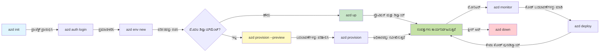
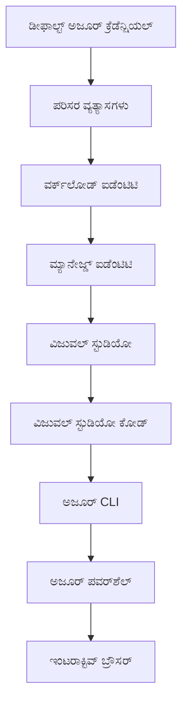

<!--
CO_OP_TRANSLATOR_METADATA:
{
  "original_hash": "e855e899d2705754fe85b04190edd0f0",
  "translation_date": "2025-11-25T00:15:24+00:00",
  "source_file": "docs/getting-started/azd-basics.md",
  "language_code": "kn"
}
-->
# AZD ಮೂಲಭೂತಗಳು - Azure Developer CLI ಅನ್ನು ಅರ್ಥಮಾಡಿಕೊಳ್ಳುವುದು

# AZD ಮೂಲಭೂತಗಳು - ಮುಖ್ಯ ಪರಿಕಲ್ಪನೆಗಳು ಮತ್ತು ಮೂಲಭೂತಗಳು

**ಅಧ್ಯಾಯ ನಾವಿಗೇಶನ್:**
- **📚 ಕೋರ್ಸ್ ಹೋಮ್**: [AZD For Beginners](../../README.md)
- **📖 ಪ್ರಸ್ತುತ ಅಧ್ಯಾಯ**: ಅಧ್ಯಾಯ 1 - ಅಡಿಪಾಯ ಮತ್ತು ತ್ವರಿತ ಪ್ರಾರಂಭ
- **⬅️ ಹಿಂದಿನ**: [ಕೋರ್ಸ್ ಅವಲೋಕನ](../../README.md#-chapter-1-foundation--quick-start)
- **➡️ ಮುಂದಿನ**: [ಸ್ಥಾಪನೆ ಮತ್ತು ಸೆಟಪ್](installation.md)
- **🚀 ಮುಂದಿನ ಅಧ್ಯಾಯ**: [ಅಧ್ಯಾಯ 2: AI-First Development](../microsoft-foundry/microsoft-foundry-integration.md)

## ಪರಿಚಯ

ಈ ಪಾಠವು ನಿಮಗೆ Azure Developer CLI (azd) ಅನ್ನು ಪರಿಚಯಿಸುತ್ತದೆ, ಇದು ಸ್ಥಳೀಯ ಅಭಿವೃದ್ಧಿಯಿಂದ Azure ನಿಯೋಜನೆಗೆ ನಿಮ್ಮ ಪ್ರಯಾಣವನ್ನು ವೇಗಗೊಳಿಸುವ ಶಕ್ತಿಯುತ ಕಮಾಂಡ್-ಲೈನ್ ಸಾಧನವಾಗಿದೆ. ನೀವು ಮೂಲಭೂತ ಪರಿಕಲ್ಪನೆಗಳನ್ನು, ಮುಖ್ಯ ವೈಶಿಷ್ಟ್ಯಗಳನ್ನು ಕಲಿಯುತ್ತೀರಿ ಮತ್ತು azd ಕ್ಲೌಡ್-ನೆಟಿವ್ ಅಪ್ಲಿಕೇಶನ್ ನಿಯೋಜನೆಯನ್ನು ಹೇಗೆ ಸರಳಗೊಳಿಸುತ್ತದೆ ಎಂಬುದನ್ನು ಅರ್ಥಮಾಡಿಕೊಳ್ಳುತ್ತೀರಿ.

## ಕಲಿಕೆಯ ಗುರಿಗಳು

ಈ ಪಾಠದ ಅಂತ್ಯಕ್ಕೆ, ನೀವು:
- Azure Developer CLI ಏನು ಮತ್ತು ಅದರ ಪ್ರಾಥಮಿಕ ಉದ್ದೇಶವನ್ನು ಅರ್ಥಮಾಡಿಕೊಳ್ಳುತ್ತೀರಿ
- ಟೆಂಪ್ಲೇಟುಗಳು, ಪರಿಸರಗಳು, ಮತ್ತು ಸೇವೆಗಳ ಮೂಲಭೂತ ಪರಿಕಲ್ಪನೆಗಳನ್ನು ಕಲಿಯುತ್ತೀರಿ
- ಟೆಂಪ್ಲೇಟು-ಚಾಲಿತ ಅಭಿವೃದ್ಧಿ ಮತ್ತು Infrastructure as Code ಸೇರಿದಂತೆ ಪ್ರಮುಖ ವೈಶಿಷ್ಟ್ಯಗಳನ್ನು ಅನ್ವೇಷಿಸುತ್ತೀರಿ
- azd ಪ್ರಾಜೆಕ್ಟ್ ರಚನೆ ಮತ್ತು ಕಾರ್ಯಪ್ರವಾಹವನ್ನು ಅರ್ಥಮಾಡಿಕೊಳ್ಳುತ್ತೀರಿ
- ನಿಮ್ಮ ಅಭಿವೃದ್ಧಿ ಪರಿಸರಕ್ಕಾಗಿ azd ಅನ್ನು ಸ್ಥಾಪಿಸಲು ಮತ್ತು ಸಂರಚಿಸಲು ಸಿದ್ಧರಾಗುತ್ತೀರಿ

## ಕಲಿಕೆಯ ಫಲಿತಾಂಶಗಳು

ಈ ಪಾಠವನ್ನು ಪೂರ್ಣಗೊಳಿಸಿದ ನಂತರ, ನೀವು:
- ಆಧುನಿಕ ಕ್ಲೌಡ್ ಅಭಿವೃದ್ಧಿ ಕಾರ್ಯಪ್ರವಾಹಗಳಲ್ಲಿ azd ನ ಪಾತ್ರವನ್ನು ವಿವರಿಸಬಹುದು
- azd ಪ್ರಾಜೆಕ್ಟ್ ರಚನೆಯ ಅಂಶಗಳನ್ನು ಗುರುತಿಸಬಹುದು
- ಟೆಂಪ್ಲೇಟುಗಳು, ಪರಿಸರಗಳು, ಮತ್ತು ಸೇವೆಗಳು ಹೇಗೆ ಒಟ್ಟಿಗೆ ಕೆಲಸ ಮಾಡುತ್ತವೆ ಎಂಬುದನ್ನು ವಿವರಿಸಬಹುದು
- azd ನೊಂದಿಗೆ Infrastructure as Code ನ ಪ್ರಯೋಜನಗಳನ್ನು ಅರ್ಥಮಾಡಿಕೊಳ್ಳಬಹುದು
- ವಿವಿಧ azd ಕಮಾಂಡ್‌ಗಳು ಮತ್ತು ಅವುಗಳ ಉದ್ದೇಶಗಳನ್ನು ಗುರುತಿಸಬಹುದು

## Azure Developer CLI (azd) ಏನು?

Azure Developer CLI (azd) ಒಂದು ಕಮಾಂಡ್-ಲೈನ್ ಸಾಧನವಾಗಿದೆ, ಇದು ಸ್ಥಳೀಯ ಅಭಿವೃದ್ಧಿಯಿಂದ Azure ನಿಯೋಜನೆಗೆ ನಿಮ್ಮ ಪ್ರಯಾಣವನ್ನು ವೇಗಗೊಳಿಸಲು ವಿನ್ಯಾಸಗೊಳಿಸಲಾಗಿದೆ. ಇದು Azure ನಲ್ಲಿ ಕ್ಲೌಡ್-ನೆಟಿವ್ ಅಪ್ಲಿಕೇಶನ್‌ಗಳನ್ನು ನಿರ್ಮಿಸುವ, ನಿಯೋಜಿಸುವ, ಮತ್ತು ನಿರ್ವಹಿಸುವ ಪ್ರಕ್ರಿಯೆಯನ್ನು ಸರಳಗೊಳಿಸುತ್ತದೆ.

### 🎯 ಏಕೆ AZD ಬಳಸಬೇಕು? ನೈಜ-ಜಗತ್ತಿನ ಹೋಲಿಕೆ

ಒಂದು ಸರಳ ವೆಬ್ ಅಪ್ಲಿಕೇಶನ್ ಅನ್ನು ಡೇಟಾಬೇಸ್‌ನೊಂದಿಗೆ ನಿಯೋಜಿಸುವುದನ್ನು ಹೋಲಿಸಿ:

#### ❌ AZD ಇಲ್ಲದೆ: ಕೈಯಿಂದ Azure ನಿಯೋಜನೆ (30+ ನಿಮಿಷ)

```bash
# ಹಂತ 1: ಸಂಪತ್ತು ಗುಂಪು ರಚಿಸಿ
az group create --name myapp-rg --location eastus

# ಹಂತ 2: ಅಪ್ ಸರ್ವಿಸ್ ಯೋಜನೆ ರಚಿಸಿ
az appservice plan create --name myapp-plan \
  --resource-group myapp-rg \
  --sku B1 --is-linux

# ಹಂತ 3: ವೆಬ್ ಅಪ್ ರಚಿಸಿ
az webapp create --name myapp-web-unique123 \
  --resource-group myapp-rg \
  --plan myapp-plan \
  --runtime "NODE:18-lts"

# ಹಂತ 4: ಕೋಸ್ಮೋಸ್ ಡಿಬಿ ಖಾತೆ ರಚಿಸಿ (10-15 ನಿಮಿಷಗಳು)
az cosmosdb create --name myapp-cosmos-unique123 \
  --resource-group myapp-rg \
  --kind MongoDB

# ಹಂತ 5: ಡೇಟಾಬೇಸ್ ರಚಿಸಿ
az cosmosdb mongodb database create \
  --account-name myapp-cosmos-unique123 \
  --resource-group myapp-rg \
  --name tododb

# ಹಂತ 6: ಸಂಗ್ರಹಣೆ ರಚಿಸಿ
az cosmosdb mongodb collection create \
  --account-name myapp-cosmos-unique123 \
  --resource-group myapp-rg \
  --database-name tododb \
  --name todos

# ಹಂತ 7: ಸಂಪರ್ಕ ಸ್ಟ್ರಿಂಗ್ ಪಡೆಯಿರಿ
CONN_STR=$(az cosmosdb keys list \
  --name myapp-cosmos-unique123 \
  --resource-group myapp-rg \
  --type connection-strings \
  --query "connectionStrings[0].connectionString" -o tsv)

# ಹಂತ 8: ಅಪ್ ಸೆಟ್ಟಿಂಗ್‌ಗಳನ್ನು ಸಂರಚಿಸಿ
az webapp config appsettings set \
  --name myapp-web-unique123 \
  --resource-group myapp-rg \
  --settings MONGODB_URI="$CONN_STR"

# ಹಂತ 9: ಲಾಗಿಂಗ್ ಸಕ್ರಿಯಗೊಳಿಸಿ
az webapp log config --name myapp-web-unique123 \
  --resource-group myapp-rg \
  --application-logging filesystem \
  --detailed-error-messages true

# ಹಂತ 10: ಅಪ್ಲಿಕೇಶನ್ ಇನ್‌ಸೈಟ್ಸ್ ಸೆಟ್ ಅಪ್ ಮಾಡಿ
az monitor app-insights component create \
  --app myapp-insights \
  --location eastus \
  --resource-group myapp-rg

# ಹಂತ 11: ಅಪ್ ಇನ್‌ಸೈಟ್ಸ್ ಅನ್ನು ವೆಬ್ ಅಪ್‌ಗೆ ಲಿಂಕ್ ಮಾಡಿ
INSTRUMENTATION_KEY=$(az monitor app-insights component show \
  --app myapp-insights \
  --resource-group myapp-rg \
  --query "instrumentationKey" -o tsv)

az webapp config appsettings set \
  --name myapp-web-unique123 \
  --resource-group myapp-rg \
  --settings APPINSIGHTS_INSTRUMENTATIONKEY="$INSTRUMENTATION_KEY"

# ಹಂತ 12: ಅಪ್ಲಿಕೇಶನ್ ಅನ್ನು ಸ್ಥಳೀಯವಾಗಿ ನಿರ್ಮಿಸಿ
npm install
npm run build

# ಹಂತ 13: ಡಿಪ್ಲಾಯ್‌ಮೆಂಟ್ ಪ್ಯಾಕೇಜ್ ರಚಿಸಿ
zip -r app.zip . -x "*.git*" "node_modules/*"

# ಹಂತ 14: ಅಪ್ಲಿಕೇಶನ್ ಅನ್ನು ಡಿಪ್ಲಾಯ್ ಮಾಡಿ
az webapp deployment source config-zip \
  --resource-group myapp-rg \
  --name myapp-web-unique123 \
  --src app.zip

# ಹಂತ 15: ಕಾಯಿರಿ ಮತ್ತು ಅದು ಕೆಲಸ ಮಾಡುತ್ತದೆ ಎಂದು ಪ್ರಾರ್ಥಿಸಿ 🙏
# (ಯಾಂತ್ರಿಕ ದೃಢೀಕರಣವಿಲ್ಲ, ಕೈಯಿಂದ ಪರೀಕ್ಷೆ ಅಗತ್ಯವಿದೆ)
```

**ಸಮಸ್ಯೆಗಳು:**
- ❌ 15+ ಕಮಾಂಡ್‌ಗಳನ್ನು ನೆನಪಿನಲ್ಲಿ ಇಟ್ಟುಕೊಳ್ಳಬೇಕು ಮತ್ತು ಸರಿಯಾಗಿ ಕಾರ್ಯಗತಗೊಳಿಸಬೇಕು
- ❌ 30-45 ನಿಮಿಷಗಳ ಕೈಯಿಂದ ಕೆಲಸ
- ❌ ತಪ್ಪುಗಳನ್ನು ಮಾಡುವುದು ಸುಲಭ (ಟೈಪೋಗಳು, ತಪ್ಪು ಪ್ಯಾರಾಮೀಟರ್‌ಗಳು)
- ❌ ಟರ್ಮಿನಲ್ ಇತಿಹಾಸದಲ್ಲಿ ಸಂಪರ್ಕ ಸ್ಟ್ರಿಂಗ್‌ಗಳು ಬಹಿರಂಗವಾಗುತ್ತವೆ
- ❌ ಏನಾದರೂ ವಿಫಲವಾದರೆ ಸ್ವಯಂಚಾಲಿತRollback ಇಲ್ಲ
- ❌ ತಂಡದ ಸದಸ್ಯರಿಗೆ ಪುನರಾವರ್ತಿಸಲು ಕಷ್ಟ
- ❌ ಪ್ರತಿ ಬಾರಿ ವಿಭಿನ್ನ (ಪುನರಾವರ್ತಿಸಬಹುದಾದವಲ್ಲ)

#### ✅ AZD ಸಹಿತ: ಸ್ವಯಂಚಾಲಿತ ನಿಯೋಜನೆ (5 ಕಮಾಂಡ್‌ಗಳು, 10-15 ನಿಮಿಷ)

```bash
# ಹಂತ 1: ಟೆಂಪ್ಲೇಟಿನಿಂದ ಪ್ರಾರಂಭಿಸಿ
azd init --template todo-nodejs-mongo

# ಹಂತ 2: ದೃಢೀಕರಿಸಿ
azd auth login

# ಹಂತ 3: ಪರಿಸರವನ್ನು ರಚಿಸಿ
azd env new dev

# ಹಂತ 4: ಬದಲಾವಣೆಗಳನ್ನು ಪೂರ್ವದೃಶ್ಯದಲ್ಲಿ ನೋಡಿ (ಐಚ್ಛಿಕ ಆದರೆ ಶಿಫಾರಸು ಮಾಡಲಾಗಿದೆ)
azd provision --preview

# ಹಂತ 5: ಎಲ್ಲವನ್ನೂ ನಿಯೋಜಿಸಿ
azd up

# ✨ ಮುಗಿದಿದೆ! ಎಲ್ಲವನ್ನೂ ನಿಯೋಜಿಸಲಾಗಿದೆ, ಸಂರಚಿಸಲಾಗಿದೆ, ಮತ್ತು ನಿಗಾದಲ್ಲಿ ಇಡಲಾಗಿದೆ
```

**ಪ್ರಯೋಜನಗಳು:**
- ✅ **5 ಕಮಾಂಡ್‌ಗಳು** vs. 15+ ಕೈಯಿಂದ ಹಂತಗಳು
- ✅ **10-15 ನಿಮಿಷಗಳು** ಒಟ್ಟು ಸಮಯ (ಮುಖ್ಯವಾಗಿ Azureಗಾಗಿ ಕಾಯುವುದು)
- ✅ **ಶೂನ್ಯ ತಪ್ಪುಗಳು** - ಸ್ವಯಂಚಾಲಿತ ಮತ್ತು ಪರೀಕ್ಷಿತ
- ✅ **Key Vault ಮೂಲಕ ಸುರಕ್ಷಿತವಾಗಿ ನಿರ್ವಹಿಸಲಾದ ರಹಸ್ಯಗಳು**
- ✅ **ವಿಫಲವಾದಾಗ ಸ್ವಯಂಚಾಲಿತRollback**
- ✅ **ಪೂರ್ಣವಾಗಿ ಪುನರಾವರ್ತಿಸಬಹುದಾದ** - ಪ್ರತಿ ಬಾರಿ ಒಂದೇ ಫಲಿತಾಂಶ
- ✅ **ತಂಡ-ಸಿದ್ಧ** - ಯಾರಾದರೂ ಒಂದೇ ಕಮಾಂಡ್‌ಗಳೊಂದಿಗೆ ನಿಯೋಜಿಸಬಹುದು
- ✅ **Infrastructure as Code** - ಆವೃತ್ತಿ ನಿಯಂತ್ರಿತ Bicep ಟೆಂಪ್ಲೇಟುಗಳು
- ✅ **ಅಂತರ್ಗತ ನಿಗಾವಹಿಸುವಿಕೆ** - Application Insights ಸ್ವಯಂಚಾಲಿತವಾಗಿ ಸಂರಚಿಸಲಾಗಿದೆ

### 📊 ಸಮಯ ಮತ್ತು ತಪ್ಪು ಕಡಿತ

| ಮೆಟ್ರಿಕ್ | ಕೈಯಿಂದ ನಿಯೋಜನೆ | AZD ನಿಯೋಜನೆ | ಸುಧಾರಣೆ |
|:-------|:------------------|:---------------|:------------|
| **ಕಮಾಂಡ್‌ಗಳು** | 15+ | 5 | 67% ಕಡಿಮೆ |
| **ಸಮಯ** | 30-45 ನಿಮಿಷ | 10-15 ನಿಮಿಷ | 60% ವೇಗವಾಗಿ |
| **ತಪ್ಪು ದರ** | ~40% | <5% | 88% ಕಡಿತ |
| **ಸ್ಥಿರತೆ** | ಕಡಿಮೆ (ಕೈಯಿಂದ) | 100% (ಸ್ವಯಂಚಾಲಿತ) | ಪರಿಪೂರ್ಣ |
| **ತಂಡದ ತರಬೇತಿ** | 2-4 ಗಂಟೆ | 30 ನಿಮಿಷ | 75% ವೇಗವಾಗಿ |
| **Rollback ಸಮಯ** | 30+ ನಿಮಿಷ (ಕೈಯಿಂದ) | 2 ನಿಮಿಷ (ಸ್ವಯಂಚಾಲಿತ) | 93% ವೇಗವಾಗಿ |

## ಮುಖ್ಯ ಪರಿಕಲ್ಪನೆಗಳು

### ಟೆಂಪ್ಲೇಟುಗಳು
ಟೆಂಪ್ಲೇಟುಗಳು azd ನ ಅಡಿಪಾಯ. ಅವು ಒಳಗೊಂಡಿವೆ:
- **ಅಪ್ಲಿಕೇಶನ್ ಕೋಡ್** - ನಿಮ್ಮ ಮೂಲ ಕೋಡ್ ಮತ್ತು ಅವಲಂಬನೆಗಳು
- **ಅವಸ್ಥಾಪನೆಯ ವ್ಯಾಖ್ಯಾನಗಳು** - Bicep ಅಥವಾ Terraform ನಲ್ಲಿ ವ್ಯಾಖ್ಯಾನಿಸಿದ Azure ಸಂಪತ್ತುಗಳು
- **ಕಾನ್ಫಿಗರೇಶನ್ ಫೈಲ್‌ಗಳು** - ಸೆಟ್ಟಿಂಗ್‌ಗಳು ಮತ್ತು ಪರಿಸರ ವ್ಯತ್ಯಾಸಗಳು
- **ನಿಯೋಜನೆ ಸ್ಕ್ರಿಪ್ಟ್‌ಗಳು** - ಸ್ವಯಂಚಾಲಿತ ನಿಯೋಜನೆ ಕಾರ್ಯಪ್ರವಾಹಗಳು

### ಪರಿಸರಗಳು
ಪರಿಸರಗಳು ವಿಭಿನ್ನ ನಿಯೋಜನೆ ಗುರಿಗಳನ್ನು ಪ್ರತಿನಿಧಿಸುತ್ತವೆ:
- **ಅಭಿವೃದ್ಧಿ** - ಪರೀಕ್ಷೆ ಮತ್ತು ಅಭಿವೃದ್ಧಿಗಾಗಿ
- **ಸ್ಟೇಜಿಂಗ್** - ಪೂರ್ವ-ಉತ್ಪಾದನಾ ಪರಿಸರ
- **ಉತ್ಪಾದನೆ** - ಲೈವ್ ಉತ್ಪಾದನಾ ಪರಿಸರ

ಪ್ರತಿ ಪರಿಸರವು ತನ್ನದೇ ಆದ:
- Azure ಸಂಪತ್ತು ಗುಂಪು
- ಕಾನ್ಫಿಗರೇಶನ್ ಸೆಟ್ಟಿಂಗ್‌ಗಳು
- ನಿಯೋಜನೆ ಸ್ಥಿತಿ

### ಸೇವೆಗಳು
ಸೇವೆಗಳು ನಿಮ್ಮ ಅಪ್ಲಿಕೇಶನ್‌ನ ನಿರ್ಮಾಣ ಬ್ಲಾಕ್‌ಗಳಾಗಿವೆ:
- **ಫ್ರಂಟ್‌ಎಂಡ್** - ವೆಬ್ ಅಪ್ಲಿಕೇಶನ್‌ಗಳು, SPAs
- **ಬ್ಯಾಕ್‌ಎಂಡ್** - APIಗಳು, ಮೈಕ್ರೋಸೇವೆಗಳು
- **ಡೇಟಾಬೇಸ್** - ಡೇಟಾ ಸಂಗ್ರಹಣಾ ಪರಿಹಾರಗಳು
- **ಸಂಗ್ರಹಣೆ** - ಫೈಲ್ ಮತ್ತು ಬ್ಲಾಬ್ ಸ್ಟೋರೇಜ್

## ಪ್ರಮುಖ ವೈಶಿಷ್ಟ್ಯಗಳು

### 1. ಟೆಂಪ್ಲೇಟು-ಚಾಲಿತ ಅಭಿವೃದ್ಧಿ
```bash
# ಲಭ್ಯವಿರುವ ಟೆಂಪ್ಲೇಟುಗಳನ್ನು ಬ್ರೌಸ್ ಮಾಡಿ
azd template list

# ಟೆಂಪ್ಲೇಟಿನಿಂದ ಪ್ರಾರಂಭಿಸಿ
azd init --template <template-name>
```

### 2. Infrastructure as Code
- **Bicep** - Azure ನ ಡೊಮೈನ್-ಸ್ಪೆಸಿಫಿಕ್ ಲ್ಯಾಂಗ್ವೇಜ್
- **Terraform** - ಮಲ್ಟಿ-ಕ್ಲೌಡ್ ಇನ್‌ಫ್ರಾಸ್ಟ್ರಕ್ಚರ್ ಸಾಧನ
- **ARM ಟೆಂಪ್ಲೇಟುಗಳು** - Azure Resource Manager ಟೆಂಪ್ಲೇಟುಗಳು

### 3. ಸಮಗ್ರ ಕಾರ್ಯಪ್ರವಾಹಗಳು
```bash
# ಸಂಪೂರ್ಣ ನಿಯೋಜನೆ ಕಾರ್ಯಪ್ರವಾಹ
azd up            # ಒದಗಿಸು + ನಿಯೋಜಿಸು ಇದು ಮೊದಲ ಬಾರಿಗೆ ಸೆಟಪ್ ಮಾಡಲು ಹಸ್ತಕ್ಷೇಪವಿಲ್ಲ

# 🧪 ಹೊಸದು: ನಿಯೋಜನೆಗೆ ಮುನ್ನ ಮೂಲಸೌಕರ್ಯ ಬದಲಾವಣೆಗಳನ್ನು ಪೂರ್ವದೃಶ್ಯಗೊಳಿಸಿ (ಸುರಕ್ಷಿತ)
azd provision --preview    # ಯಾವುದೇ ಬದಲಾವಣೆಗಳನ್ನು ಮಾಡದೆ ಮೂಲಸೌಕರ್ಯ ನಿಯೋಜನೆಯನ್ನು ಅನುಕರಿಸಿ

azd provision     # ನೀವು ಮೂಲಸೌಕರ್ಯವನ್ನು ನವೀಕರಿಸಿದರೆ Azure ಸಂಪತ್ತನ್ನು ರಚಿಸಿ
azd deploy        # ಅಪ್ಲಿಕೇಶನ್ ಕೋಡ್ ಅನ್ನು ನಿಯೋಜಿಸಿ ಅಥವಾ ಅಪ್ಲಿಕೇಶನ್ ಕೋಡ್ ಅನ್ನು ನವೀಕರಣದ ನಂತರ ಮರುನಿಯೋಜಿಸಿ
azd down          # ಸಂಪತ್ತನ್ನು ಸ್ವಚ್ಛಗೊಳಿಸಿ
```

#### 🛡️ ಸುರಕ್ಷಿತ ಇನ್‌ಫ್ರಾಸ್ಟ್ರಕ್ಚರ್ ಯೋಜನೆ ಪ್ರಿವ್ಯೂನೊಂದಿಗೆ
`azd provision --preview` ಕಮಾಂಡ್ ಸುರಕ್ಷಿತ ನಿಯೋಜನೆಗಳಿಗೆ ಆಟವನ್ನು ಬದಲಾಯಿಸುವ ಸಾಧನವಾಗಿದೆ:
- **ಡ್ರೈ-ರನ್ ವಿಶ್ಲೇಷಣೆ** - ಏನು ಸೃಜಿಸಲಾಗುತ್ತದೆ, ತಿದ್ದುಪಡಿ ಮಾಡಲಾಗುತ್ತದೆ ಅಥವಾ ಅಳಿಸಲಾಗುತ್ತದೆ ಎಂಬುದನ್ನು ತೋರಿಸುತ್ತದೆ
- **ಶೂನ್ಯ ಅಪಾಯ** - ನಿಮ್ಮ Azure ಪರಿಸರದಲ್ಲಿ ಯಾವುದೇ ನಿಜವಾದ ಬದಲಾವಣೆಗಳನ್ನು ಮಾಡಲಾಗುವುದಿಲ್ಲ
- **ತಂಡದ ಸಹಕಾರ** - ನಿಯೋಜನೆಗೆ ಮುನ್ನ ಪ್ರಿವ್ಯೂ ಫಲಿತಾಂಶಗಳನ್ನು ಹಂಚಿಕೊಳ್ಳಿ
- **ಖರ್ಚು ಅಂದಾಜು** - ಬದ್ಧತೆಯ ಮೊದಲು ಸಂಪತ್ತು ವೆಚ್ಚವನ್ನು ಅರ್ಥಮಾಡಿಕೊಳ್ಳಿ

```bash
# ಉದಾಹರಣೆಯ ಪೂರ್ವದೃಶ್ಯ ಕಾರ್ಯಪ್ರವಾಹ
azd provision --preview           # ಏನು ಬದಲಾಯಿಸುತ್ತದೆ ಎಂಬುದನ್ನು ನೋಡಿ
# ಔಟ್‌ಪುಟ್ ಪರಿಶೀಲಿಸಿ, ತಂಡದೊಂದಿಗೆ ಚರ್ಚಿಸಿ
azd provision                     # ನಂಬಿಕೆಯಿಂದ ಬದಲಾವಣೆಗಳನ್ನು ಅನ್ವಯಿಸಿ
```

### 📊 ದೃಶ್ಯ: AZD ಅಭಿವೃದ್ಧಿ ಕಾರ್ಯಪ್ರವಾಹ


**ಕಾರ್ಯಪ್ರವಾಹ ವಿವರಣೆ:**
1. **Init** - ಟೆಂಪ್ಲೇಟು ಅಥವಾ ಹೊಸ ಪ್ರಾಜೆಕ್ಟ್‌ನೊಂದಿಗೆ ಪ್ರಾರಂಭಿಸಿ
2. **Auth** - Azure ಗೆ ಪ್ರಾಮಾಣೀಕರಿಸಿ
3. **ಪರಿಸರ** - ಪ್ರತ್ಯೇಕ ನಿಯೋಜನೆ ಪರಿಸರವನ್ನು ರಚಿಸಿ
4. **Preview** - 🆕 ಇನ್‌ಫ್ರಾಸ್ಟ್ರಕ್ಚರ್ ಬದಲಾವಣೆಗಳನ್ನು ಪ್ರಿವ್ಯೂ ಮಾಡುವುದು (ಸುರಕ್ಷಿತ ಅಭ್ಯಾಸ)
5. **Provision** - Azure ಸಂಪತ್ತುಗಳನ್ನು ರಚಿಸಿ/ಅಪ್ಡೇಟ್ ಮಾಡಿ
6. **Deploy** - ನಿಮ್ಮ ಅಪ್ಲಿಕೇಶನ್ ಕೋಡ್ ಅನ್ನು ಪುಷ್ ಮಾಡಿ
7. **Monitor** - ಅಪ್ಲಿಕೇಶನ್ ಕಾರ್ಯಕ್ಷಮತೆಯನ್ನು ಗಮನಿಸಿ
8. **Iterate** - ಬದಲಾವಣೆಗಳನ್ನು ಮಾಡಿ ಮತ್ತು ಕೋಡ್ ಅನ್ನು ಪುನಃ ನಿಯೋಜಿಸಿ
9. **Cleanup** - ಕೆಲಸ ಮುಗಿದ ನಂತರ ಸಂಪತ್ತುಗಳನ್ನು ಅಳಿಸಿ

### 4. ಪರಿಸರ ನಿರ್ವಹಣೆ
```bash
# ಪರಿಸರಗಳನ್ನು ರಚಿಸಿ ಮತ್ತು ನಿರ್ವಹಿಸಿ
azd env new <environment-name>
azd env select <environment-name>
azd env list
```

## 📁 ಪ್ರಾಜೆಕ್ಟ್ ರಚನೆ

ಸಾಮಾನ್ಯ azd ಪ್ರಾಜೆಕ್ಟ್ ರಚನೆ:
```
my-app/
├── .azd/                    # azd configuration
│   └── config.json
├── .azure/                  # Azure deployment artifacts
├── .devcontainer/          # Development container config
├── .github/workflows/      # GitHub Actions
├── .vscode/               # VS Code settings
├── infra/                 # Infrastructure code
│   ├── main.bicep        # Main infrastructure template
│   ├── main.parameters.json
│   └── modules/          # Reusable modules
├── src/                  # Application source code
│   ├── api/             # Backend services
│   └── web/             # Frontend application
├── azure.yaml           # azd project configuration
└── README.md
```

## 🔧 ಕಾನ್ಫಿಗರೇಶನ್ ಫೈಲ್‌ಗಳು

### azure.yaml
ಮುಖ್ಯ ಪ್ರಾಜೆಕ್ಟ್ ಕಾನ್ಫಿಗರೇಶನ್ ಫೈಲ್:
```yaml
name: my-awesome-app
metadata:
  template: my-template@1.0.0

services:
  web:
    project: ./src/web
    language: js
    host: appservice
  api:
    project: ./src/api
    language: js
    host: appservice

hooks:
  preprovision:
    shell: pwsh
    run: echo "Preparing to provision..."
```

### .azure/config.json
ಪರಿಸರ-ನಿರ್ದಿಷ್ಟ ಕಾನ್ಫಿಗರೇಶನ್:
```json
{
  "version": 1,
  "defaultEnvironment": "dev",
  "environments": {
    "dev": {
      "subscriptionId": "your-subscription-id",
      "location": "eastus"
    }
  }
}
```

## 🎪 ಸಾಮಾನ್ಯ ಕಾರ್ಯಪ್ರವಾಹಗಳು ಮತ್ತು ಪ್ರಾಯೋಗಿಕ ವ್ಯಾಯಾಮಗಳು

> **💡 ಕಲಿಕೆಯ ಟಿಪ್ಪಣಿ:** ಈ ವ್ಯಾಯಾಮಗಳನ್ನು ಕ್ರಮವಾಗಿ ಅನುಸರಿಸಿ ನಿಮ್ಮ AZD ಕೌಶಲಗಳನ್ನು ಕ್ರಮವಾಗಿ ನಿರ್ಮಿಸಲು.

### 🎯 ವ್ಯಾಯಾಮ 1: ನಿಮ್ಮ ಮೊದಲ ಪ್ರಾಜೆಕ್ಟ್ ಅನ್ನು ಪ್ರಾರಂಭಿಸಿ

**ಗುರಿ:** ಒಂದು AZD ಪ್ರಾಜೆಕ್ಟ್ ಅನ್ನು ರಚಿಸಿ ಮತ್ತು ಅದರ ರಚನೆಯನ್ನು ಅನ್ವೇಷಿಸಿ

**ಹಂತಗಳು:**
```bash
# ಸಾಬೀತಾದ ಟೆಂಪ್ಲೇಟನ್ನು ಬಳಸಿ
azd init --template todo-nodejs-mongo

# ರಚಿಸಲಾದ ಫೈಲ್‌ಗಳನ್ನು ಅನ್ವೇಷಿಸಿ
ls -la  # ಎಲ್ಲಾ ಫೈಲ್‌ಗಳನ್ನು, ಮರೆಮಾಡಲಾದವುಗಳನ್ನು ಸೇರಿಸಿ ವೀಕ್ಷಿಸಿ

# ಮುಖ್ಯ ಫೈಲ್‌ಗಳು ರಚಿಸಲಾಗಿದೆ:
# - azure.yaml (ಮುಖ್ಯ ಸಂರಚನೆ)
# - infra/ (ಅಧಿಕಾರ ಕೋಡ್)
# - src/ (ಅಪ್ಲಿಕೇಶನ್ ಕೋಡ್)
```

**✅ ಯಶಸ್ಸು:** ನೀವು azure.yaml, infra/, ಮತ್ತು src/ ಡೈರೆಕ್ಟರಿಗಳನ್ನು ಹೊಂದಿದ್ದೀರಿ

---

### 🎯 ವ್ಯಾಯಾಮ 2: Azure ಗೆ ನಿಯೋಜಿಸಿ

**ಗುರಿ:** ಸಂಪೂರ್ಣ ಅಂತ್ಯ-ಅಂತ್ಯ ನಿಯೋಜನೆ

**ಹಂತಗಳು:**
```bash
# 1. ದೃಢೀಕರಿಸಿ
az login && azd auth login

# 2. ಪರಿಸರವನ್ನು ರಚಿಸಿ
azd env new dev
azd env set AZURE_LOCATION eastus

# 3. ಬದಲಾವಣೆಗಳನ್ನು ಪೂರ್ವದೃಶ್ಯದಲ್ಲಿ ನೋಡಿ (ಶಿಫಾರಸು)
azd provision --preview

# 4. ಎಲ್ಲವನ್ನೂ ನಿಯೋಜಿಸಿ
azd up

# 5. ನಿಯೋಜನೆಯನ್ನು ಪರಿಶೀಲಿಸಿ
azd show    # ನಿಮ್ಮ ಅಪ್ಲಿಕೇಶನ್ URL ಅನ್ನು ವೀಕ್ಷಿಸಿ
```

**ಅಂದಾಜು ಸಮಯ:** 10-15 ನಿಮಿಷ  
**✅ ಯಶಸ್ಸು:** ಅಪ್ಲಿಕೇಶನ್ URL ಬ್ರೌಸರ್‌ನಲ್ಲಿ ತೆರೆಯುತ್ತದೆ

---

### 🎯 ವ್ಯಾಯಾಮ 3: ಬಹು ಪರಿಸರಗಳು

**ಗುರಿ:** dev ಮತ್ತು staging ಗೆ ನಿಯೋಜಿಸಿ

**ಹಂತಗಳು:**
```bash
# ಈಗಾಗಲೇ ಡೆವ್ ಇದೆ, ಸ್ಟೇಜಿಂಗ್ ರಚಿಸಿ
azd env new staging
azd env set AZURE_LOCATION westus2
azd up

# ಅವುಗಳ ನಡುವೆ ಬದಲಾಯಿಸಿ
azd env list
azd env select dev
```

**✅ ಯಶಸ್ಸು:** Azure ಪೋರ್ಟಲ್‌ನಲ್ಲಿ ಎರಡು ಪ್ರತ್ಯೇಕ ಸಂಪತ್ತು ಗುಂಪುಗಳು

---

### 🛡️ ಕ್ಲೀನ್ ಸ್ಲೇಟ್: `azd down --force --purge`

ನೀವು ಸಂಪೂರ್ಣವಾಗಿ ಮರುಹೊಂದಿಸಲು ಅಗತ್ಯವಿದ್ದಾಗ:

```bash
azd down --force --purge
```

**ಇದು ಏನು ಮಾಡುತ್ತದೆ:**
- `--force`: ದೃಢೀಕರಣ ಪ್ರಾಂಪ್ಟ್‌ಗಳು ಇಲ್ಲ
- `--purge`: ಎಲ್ಲಾ ಸ್ಥಳೀಯ ಸ್ಥಿತಿಯನ್ನು ಮತ್ತು Azure ಸಂಪತ್ತುಗಳನ್ನು ಅಳಿಸುತ್ತದೆ

**ಬಳಸುವಾಗ:**
- ನಿಯೋಜನೆ ಮಧ್ಯದಲ್ಲಿ ವಿಫಲವಾಗಿದೆ
- ಪ್ರಾಜೆಕ್ಟ್‌ಗಳನ್ನು ಬದಲಾಯಿಸುತ್ತಿದೆ
- ಹೊಸ ಪ್ರಾರಂಭವನ್ನು ಅಗತ್ಯವಿದೆ

---

## 🎪 ಮೂಲ ಕಾರ್ಯಪ್ರವಾಹ ಉಲ್ಲೇಖ

### ಹೊಸ ಪ್ರಾಜೆಕ್ಟ್ ಪ್ರಾರಂಭಿಸುವುದು
```bash
# ವಿಧಾನ 1: ಅಸ್ತಿತ್ವದಲ್ಲಿರುವ ಟೆಂಪ್ಲೇಟನ್ನು ಬಳಸಿ
azd init --template todo-nodejs-mongo

# ವಿಧಾನ 2: ಹೊಸದಾಗಿ ಪ್ರಾರಂಭಿಸಿ
azd init

# ವಿಧಾನ 3: ಪ್ರಸ್ತುತ ಡೈರೆಕ್ಟರಿಯನ್ನು ಬಳಸಿ
azd init .
```

### ಅಭಿವೃದ್ಧಿ ಚಕ್ರ
```bash
# ಅಭಿವೃದ್ಧಿ ಪರಿಸರವನ್ನು ಸ್ಥಾಪಿಸಿ
azd auth login
azd env new dev
azd env select dev

# ಎಲ್ಲವನ್ನೂ ನಿಯೋಜಿಸಿ
azd up

# ಬದಲಾವಣೆಗಳನ್ನು ಮಾಡಿ ಮತ್ತು ಪುನಃ ನಿಯೋಜಿಸಿ
azd deploy

# ಮುಗಿದ ನಂತರ ಸ್ವಚ್ಛಗೊಳಿಸಿ
azd down --force --purge # Azure Developer CLI ನಲ್ಲಿ ಆಜ್ಞೆ ನಿಮ್ಮ ಪರಿಸರಕ್ಕಾಗಿ **ಹಾರ್ಡ್ ರಿಸೆಟ್** ಆಗಿದೆ—ವಿಶೇಷವಾಗಿ ನೀವು ವಿಫಲವಾದ ನಿಯೋಜನೆಗಳನ್ನು ಪರಿಹರಿಸುತ್ತಿರುವಾಗ, ಅನಾಥ ಸಂಪತ್ತನ್ನು ಸ್ವಚ್ಛಗೊಳಿಸುತ್ತಿರುವಾಗ, ಅಥವಾ ಹೊಸ ನಿಯೋಜನೆಗೆ ತಯಾರಾಗುತ್ತಿರುವಾಗ ಉಪಯುಕ್ತವಾಗಿದೆ.
```

## `azd down --force --purge` ಅನ್ನು ಅರ್ಥಮಾಡಿಕೊಳ್ಳುವುದು
`azd down --force --purge` ಕಮಾಂಡ್ ನಿಮ್ಮ azd ಪರಿಸರ ಮತ್ತು ಸಂಬಂಧಿತ ಸಂಪತ್ತುಗಳನ್ನು ಸಂಪೂರ್ಣವಾಗಿ ತಗ್ಗಿಸಲು ಶಕ್ತಿಯುತ ಮಾರ್ಗವಾಗಿದೆ. ಪ್ರತಿ ಫ್ಲಾಗ್ ಏನು ಮಾಡುತ್ತದೆ ಎಂಬುದರ ವಿವರಣೆ ಇಲ್ಲಿದೆ:
```
--force
```
- ದೃಢೀಕರಣ ಪ್ರಾಂಪ್ಟ್‌ಗಳನ್ನು ಬಿಟ್ಟುಹೋಗುತ್ತದೆ.
- ಕೈಯಿಂದ ಇನ್‌ಪುಟ್ ಸಾಧ್ಯವಿಲ್ಲದ Automation ಅಥವಾ ಸ್ಕ್ರಿಪ್ಟಿಂಗ್‌ಗಾಗಿ ಉಪಯುಕ್ತವಾಗಿದೆ.
- CLI ಅಸಂಗತತೆಗಳನ್ನು ಪತ್ತೆಹಚ್ಚಿದರೂ, ತಗ್ಗಿಸುವಿಕೆ ನಿರಂತರವಾಗಿ ಮುಂದುವರಿಯುತ್ತದೆ.

```
--purge
```
**ಎಲ್ಲಾ ಸಂಬಂಧಿತ ಮೆಟಾಡೇಟಾ** ಅಳಿಸುತ್ತದೆ, ಇದರಲ್ಲಿ:
ಪರಿಸರ ಸ್ಥಿತಿ
ಸ್ಥಳೀಯ `.azure` ಫೋಲ್ಡರ್
ಕ್ಯಾಶ್ ಮಾಡಿದ ನಿಯೋಜನೆ ಮಾಹಿತಿ
ಹಿಂದಿನ ನಿಯೋಜನೆಗಳನ್ನು "ನೆನಪಿನಲ್ಲಿ" ಇಡುವುದನ್ನು ತಡೆಯುತ್ತದೆ, ಇದು ಸಂಪತ್ತು ಗುಂಪುಗಳು ಅಥವಾ ಹಳೆಯ ರಿಜಿಸ್ಟ್ರಿ ಉಲ್ಲೇಖಗಳಂತಹ ಸಮಸ್ಯೆಗಳನ್ನು ಉಂಟುಮಾಡಬಹುದು.

### ಏಕೆ ಎರಡನ್ನೂ ಬಳಸಬೇಕು?
`azd up` ನೊಂದಿಗೆ ನೀವು ಸ್ಥಿತಿಯ ಅಥವಾ ಭಾಗಿಕ ನಿಯೋಜನೆಗಳ ಕಾರಣದಿಂದಾಗಿ ಅಡ್ಡಗೋಡೆಯನ್ನು ಹೊಡೆದಿದ್ದಾಗ, ಈ ಕಾಂಬೋ **ಕ್ಲೀನ್ ಸ್ಲೇಟ್** ಅನ್ನು ಖಚಿತಪಡಿಸುತ್ತದೆ.

ಇದು Azure ಪೋರ್ಟಲ್‌ನಲ್ಲಿ ಕೈಯಿಂದ ಸಂಪತ್ತು ಅಳಿಸುವಿಕೆಯ ನಂತರ ಅಥವಾ ಟೆಂಪ್ಲೇಟುಗಳು, ಪರಿಸರಗಳು, ಅಥವಾ ಸಂಪತ್ತು ಗುಂಪು ಹೆಸರಿಸುವ ಸಂಪ್ರದಾಯಗಳನ್ನು ಬದಲಾಯಿಸುವಾಗ ವಿಶೇಷವಾಗಿ ಸಹಾಯಕವಾಗಿದೆ.

### ಬಹು ಪರಿಸರಗಳನ್ನು ನಿರ್ವಹಿಸುವುದು
```bash
# ಸ್ಟೇಜಿಂಗ್ ಪರಿಸರವನ್ನು ರಚಿಸಿ
azd env new staging
azd env select staging
azd up

# ಡೆವ್‌ಗೆ ಹಿಂತಿರುಗಿ
azd env select dev

# ಪರಿಸರಗಳನ್ನು ಹೋಲಿಸಿ
azd env list
```

## 🔐 ಪ್ರಾಮಾಣೀಕರಣ ಮತ್ತು ಕ್ರೆಡೆನ್ಷಿಯಲ್‌ಗಳು

ಯಶಸ್ವಿ azd ನಿಯೋಜನೆಗಳಿಗೆ ಪ್ರಾಮಾಣೀಕರಣವನ್ನು ಅರ್ಥಮಾಡಿಕೊಳ್ಳುವುದು ಅತ್ಯಂತ ಮುಖ್ಯವಾಗಿದೆ. Azure ಹಲವಾರು ಪ್ರಾಮಾಣೀಕರಣ ವಿಧಾನಗಳನ್ನು ಬಳಸುತ್ತದೆ, ಮತ್ತು azd ಇತರ Azure ಸಾಧನಗಳು ಬಳಸುವ ಅದೇ ಕ್ರೆಡೆನ್ಷಿಯಲ್ ಚೈನ್ ಅನ್ನು ಬಳಸುತ್ತದೆ.

### Azure CLI ಪ್ರಾಮಾಣೀಕರಣ (`az login`)

azd ಅನ್ನು ಬಳಸುವ ಮೊದಲು, ನೀವು Azure ಗೆ ಪ್ರಾಮಾಣೀಕರಿಸಬೇಕು. ಸಾಮಾನ್ಯ ವಿಧಾನವು Azure CLI ಅನ್ನು ಬಳಸುವುದು:

```bash
# ಇಂಟರಾಕ್ಟಿವ್ ಲಾಗಿನ್ (ಬ್ರೌಸರ್ ತೆರೆಯುತ್ತದೆ)
az login

# ನಿರ್ದಿಷ್ಟ ಟೆನಂಟ್‌ನೊಂದಿಗೆ ಲಾಗಿನ್ ಮಾಡಿ
az login --tenant <tenant-id>

# ಸರ್ವಿಸ್ ಪ್ರಿನ್ಸಿಪಲ್‌ನೊಂದಿಗೆ ಲಾಗಿನ್ ಮಾಡಿ
az login --service-principal -u <app-id> -p <password> --tenant <tenant-id>

# ಪ್ರಸ್ತುತ ಲಾಗಿನ್ ಸ್ಥಿತಿಯನ್ನು ಪರಿಶೀಲಿಸಿ
az account show

# ಲಭ್ಯವಿರುವ ಚಂದಾದಾರಿಕೆಗಳನ್ನು ಪಟ್ಟಿ ಮಾಡಿ
az account list --output table

# ಡೀಫಾಲ್ಟ್ ಚಂದಾದಾರಿಕೆಯನ್ನು ಸೆಟ್ ಮಾಡಿ
az account set --subscription <subscription-id>
```

### ಪ್ರಾಮಾಣೀಕರಣ ಪ್ರಕ್ರಿಯೆ
1. **ಇಂಟರಾಕ್ಟಿವ್ ಲಾಗಿನ್**: ಪ್ರಾಮಾಣೀಕರಣಕ್ಕಾಗಿ ನಿಮ್ಮ ಡೀಫಾಲ್ಟ್ ಬ್ರೌಸರ್ ಅನ್ನು ತೆರೆಯುತ್ತದೆ
2. **ಡಿವೈಸ್ ಕೋಡ್ ಪ್ರಕ್ರಿಯೆ**: ಬ್ರೌಸರ್ ಪ್ರವೇಶವಿಲ್ಲದ ಪರಿಸರಗಳಿಗೆ
3. **ಸರ್ವಿಸ್ ಪ್ರಿನ್ಸಿಪಲ್**: Automation ಮತ್ತು CI/CD ದೃಶ್ಯಗಳಿಗೆ
4. **ಮ್ಯಾನೇಜ್ಡ್ ಐಡೆಂಟಿಟಿ**: Azure-ನಲ್ಲಿನ ಅಪ್ಲಿಕೇಶನ್‌ಗಳಿಗೆ

### DefaultAzureCredential ಚೈನ್

`DefaultAzureCredential` ಒಂದು ಕ್ರೆಡೆನ್ಷಿಯಲ್ ಪ್ರಕಾರವಾಗಿದೆ, ಇದು ನಿರ್ದಿಷ್ಟ ಕ್ರಮದಲ್ಲಿ ಹಲವಾರು ಕ್ರೆಡೆನ್ಷಿಯಲ್ ಮೂಲಗಳನ್ನು ಸ್ವಯಂಚಾಲಿತವಾಗಿ ಪ್ರಯತ್ನಿಸುವ ಮೂಲಕ ಸರಳ ಪ್ರಾಮಾಣೀಕರಣ ಅನುಭವವನ್ನು ಒದಗಿಸುತ್ತದೆ:

#### ಕ್ರೆಡೆನ್ಷಿಯಲ್ ಚೈನ್ ಕ್ರಮ

#### 1. ಪರಿಸರ ವ್ಯತ್ಯಾಸಗಳು
```bash
# ಸೇವಾ ಮುಖ್ಯಸ್ಥನಿಗಾಗಿ ಪರಿಸರ ವ್ಯತ್ಯಯಗಳನ್ನು ಹೊಂದಿಸಿ
export AZURE_CLIENT_ID="<app-id>"
export AZURE_CLIENT_SECRET="<password>"
export AZURE_TENANT_ID="<tenant-id>"
```

#### 2. ವರ್ಕ್‌ಲೋಡ್ ಐಡೆಂಟಿಟಿ (Kubernetes/GitHub Actions)
ಸ್ವಯಂಚಾಲಿತವಾಗಿ ಬಳಸಲಾಗುತ್ತದೆ:
- Azure Kubernetes Service (AKS) ವರ್ಕ್‌ಲೋಡ್ ಐಡೆಂಟಿಟಿಯೊಂದಿಗೆ
- GitHub Actions OIDC ಫೆಡರೇಶನ್‌ನೊಂದಿಗೆ
- ಇತರ ಫೆಡರೇಟೆಡ್ ಐಡೆಂಟಿಟಿ ದೃಶ್ಯಗಳು

#### 3. ಮ್ಯಾನೇಜ್ಡ್ ಐಡೆಂಟಿಟಿ
Azure ಸಂಪತ್ತುಗಳಿಗಾಗಿ:
- ವರ್ಚುವಲ್ ಮೆಷೀನ್‌ಗಳು
- App Service
- Azure Functions
- Container Instances

```bash
# ನಿರ್ವಹಿತ ಗುರುತಿನೊಂದಿಗೆ Azure ಸಂಪತ್ತಿನಲ್ಲಿ ಕಾರ್ಯನಿರ್ವಹಿಸುತ್ತಿದೆಯೇ ಎಂದು ಪರಿಶೀಲಿಸಿ
az account show --query "user.type" --output tsv
# ಮರಳಿಸುತ್ತದೆ: "servicePrincipal" ನಿರ್ವಹಿತ ಗುರುತನ್ನು ಬಳಸುತ್ತಿದ್ದರೆ
```

#### 4. ಡೆವಲಪರ್ ಸಾಧನಗಳ ಸಮಗ್ರೀಕರಣ
- **Visual Studio**: ಲಾಗಿನ್ ಮಾಡಿದ ಖಾತೆಯನ್ನು ಸ್ವಯಂಚಾಲಿತವಾಗಿ ಬಳಸುತ್ತದೆ
- **VS Code**: Azure Account ವಿಸ್ತರಣೆ ಕ್ರೆಡೆನ್ಷಿಯಲ್‌ಗಳನ್ನು ಬಳಸುತ್ತದೆ
- **Azure CLI**: `az login` ಕ್ರೆಡೆನ್ಷಿಯಲ್‌ಗಳನ್ನು ಬಳಸುತ್ತದೆ (ಸ್ಥಳೀಯ ಅಭಿವೃದ್ಧಿಗೆ ಸಾಮಾನ್ಯ)

### AZD ಪ್ರಾಮಾಣೀಕರಣ ಸೆಟಪ್

```bash
# ವಿಧಾನ 1: Azure CLI ಬಳಸಿ (ಅಭಿವೃದ್ಧಿಗಾಗಿ ಶಿಫಾರಸು ಮಾಡಲಾಗಿದೆ)
az login
azd auth login  # ಈಗಿರುವ Azure CLI ಪ್ರಮಾಣಪತ್ರಗಳನ್ನು ಬಳಸುತ್ತದೆ

# ವಿಧಾನ 2: ನೇರ azd ಪ್ರಮಾಣೀಕರಣ
azd auth login --use-device-code  # ತಲೆಹೀನ ಪರಿಸರಗಳಿಗಾಗಿ

# ವಿಧಾನ 3: ಪ್ರಮಾಣೀಕರಣ ಸ್ಥಿತಿಯನ್ನು ಪರಿಶೀಲಿಸಿ
azd auth login --check-status

# ವಿಧಾನ 4: ಲಾಗ್ ಔಟ್ ಮಾಡಿ ಮತ್ತು ಪುನಃ ಪ್ರಮಾಣೀಕರಿಸಿ
azd auth logout
azd auth login
```

### ಪ್ರಾಮಾಣೀಕರಣ ಉತ್ತಮ ಅಭ್ಯಾಸಗಳು

#### ಸ್ಥಳೀಯ ಅಭಿವೃದ್ಧಿಗಾಗಿ
```bash
# 1. Azure CLI ಬಳಸಿ ಲಾಗಿನ್ ಮಾಡಿ
az login

# 2. ಸರಿಯಾದ ಸಬ್ಸ್ಕ್ರಿಪ್ಷನ್ ಪರಿಶೀಲಿಸಿ
az account show
az account set --subscription "Your Subscription Name"

# 3. ಅಜ್ಡ್ ಅನ್ನು ಇರುವ ಪ್ರಮಾಣಪತ್ರಗಳೊಂದಿಗೆ ಬಳಸಿ
azd auth login
```

#### CI/CD ಪೈಪ್ಲೈನ್‌ಗಳಿಗಾಗಿ
```yaml
# GitHub Actions example
- name: Azure Login
  uses: azure/login@v1
  with:
    creds: ${{ secrets.AZURE_CREDENTIALS }}

- name: Deploy with azd
  run: |
    azd auth login --client-id ${{ secrets.AZURE_CLIENT_ID }} \
                    --client-secret ${{ secrets.AZURE_CLIENT_SECRET }} \
                    --tenant-id ${{ secrets.AZURE_TENANT_ID }}
    azd up --no-prompt
```

#### ಉತ್ಪಾದನಾ ಪರಿಸರಗಳಿಗಾಗಿ
- **ಮ್ಯಾನೇಜ್ಡ್ ಐಡೆಂಟಿಟಿ** ಅನ್ನು Azure ಸಂಪತ್ತುಗಳಲ್ಲಿ ಚಲಿಸುತ್ತಿರುವಾಗ ಬಳಸಿರಿ
- Automation ದೃಶ್ಯಗಳಿಗೆ **ಸರ್ವಿಸ್ ಪ್ರಿನ್ಸಿಪಲ್** ಅನ್ನು ಬಳಸಿರಿ
- ಕೋಡ್ ಅಥವಾ ಕಾನ್ಫಿಗರೇಶನ್ ಫೈಲ್‌ಗಳಲ್ಲಿ ಕ್ರೆಡೆನ್ಷಿಯಲ್‌ಗಳನ್ನು ಸಂಗ್ರಹಿಸುವುದನ್ನು ತಪ್ಪಿಸಿ
- [ಸ್ಥಾಪನೆ ಮತ್ತು ಸೆಟಪ್](installation.md) - azd ಅನ್ನು ಸ್ಥಾಪಿಸಿ ಮತ್ತು ಸಂರಚಿಸಿ
- [ನಿಮ್ಮ ಮೊದಲ ಪ್ರಾಜೆಕ್ಟ್](first-project.md) - ಪ್ರಾಯೋಗಿಕ ಟ್ಯುಟೋರಿಯಲ್ ಪೂರ್ಣಗೊಳಿಸಿ
- [ಕಾನ್ಫಿಗರೇಶನ್ ಗೈಡ್](configuration.md) - ಉನ್ನತ ಮಟ್ಟದ ಕಾನ್ಫಿಗರೇಶನ್ ಆಯ್ಕೆಗಳು

**🎯 ಮುಂದಿನ ಅಧ್ಯಾಯಕ್ಕೆ ಸಿದ್ಧವೇ?**
- [ಅಧ್ಯಾಯ 2: AI-ಆಧಾರಿತ ಅಭಿವೃದ್ಧಿ](../microsoft-foundry/microsoft-foundry-integration.md) - AI ಅಪ್ಲಿಕೇಶನ್‌ಗಳನ್ನು ನಿರ್ಮಿಸಲು ಪ್ರಾರಂಭಿಸಿ

## ಹೆಚ್ಚುವರಿ ಸಂಪತ್ತುಗಳು

- [Azure Developer CLI ಅವಲೋಕನ](https://learn.microsoft.com/en-us/azure/developer/azure-developer-cli/)
- [ಟೆಂಪ್ಲೇಟ್ ಗ್ಯಾಲರಿ](https://azure.github.io/awesome-azd/)
- [ಕಮ್ಯೂನಿಟಿ ಮಾದರಿಗಳು](https://github.com/Azure-Samples)

---

## 🙋 ಸಾಮಾನ್ಯವಾಗಿ ಕೇಳುವ ಪ್ರಶ್ನೆಗಳು

### ಸಾಮಾನ್ಯ ಪ್ರಶ್ನೆಗಳು

**ಪ್ರ: AZD ಮತ್ತು Azure CLI ನಡುವಿನ ವ್ಯತ್ಯಾಸವೇನು?**

ಉ: Azure CLI (`az`) ಅನ್ನು ಪ್ರತ್ಯೇಕ Azure ಸಂಪತ್ತನ್ನು ನಿರ್ವಹಿಸಲು ಬಳಸಲಾಗುತ್ತದೆ. AZD (`azd`) ಅನ್ನು ಸಂಪೂರ್ಣ ಅಪ್ಲಿಕೇಶನ್‌ಗಳನ್ನು ನಿರ್ವಹಿಸಲು ಬಳಸಲಾಗುತ್ತದೆ:

```bash
# Azure CLI - ಕಡಿಮೆ ಮಟ್ಟದ ಸಂಪತ್ತಿನ ನಿರ್ವಹಣೆ
az webapp create --name myapp --resource-group rg
az sql server create --name myserver --resource-group rg
# ...ಹೆಚ್ಚಿನ ಆಜ್ಞೆಗಳು ಅಗತ್ಯವಿದೆ

# AZD - ಅಪ್ಲಿಕೇಶನ್ ಮಟ್ಟದ ನಿರ್ವಹಣೆ
azd up  # ಎಲ್ಲಾ ಸಂಪತ್ತಿನೊಂದಿಗೆ ಸಂಪೂರ್ಣ ಅಪ್ಲಿಕೇಶನ್ ಅನ್ನು ನಿಯೋಜಿಸುತ್ತದೆ
```

**ಇದನ್ನು ಹೀಗೆ ಯೋಚಿಸಿ:**
- `az` = ಪ್ರತ್ಯೇಕ ಲೆಗೊ ಬ್ಲಾಕ್‌ಗಳ ಮೇಲೆ ಕಾರ್ಯನಿರ್ವಹಿಸುವುದು
- `azd` = ಸಂಪೂರ್ಣ ಲೆಗೊ ಸೆಟ್‌ಗಳೊಂದಿಗೆ ಕೆಲಸ ಮಾಡುವುದು

---

**ಪ್ರ: AZD ಬಳಸಲು ನನಗೆ Bicep ಅಥವಾ Terraform ತಿಳಿದಿರಬೇಕೆ?**

ಉ: ಇಲ್ಲ! ಟೆಂಪ್ಲೇಟ್‌ಗಳಿಂದ ಪ್ರಾರಂಭಿಸಿ:
```bash
# ಅಸ್ತಿತ್ವದಲ್ಲಿರುವ ಟೆಂಪ್ಲೇಟನ್ನು ಬಳಸಿ - IaC ಜ್ಞಾನ ಅಗತ್ಯವಿಲ್ಲ
azd init --template todo-nodejs-mongo
azd up
```

ನೀವು ನಂತರ Bicep ಅನ್ನು ಕಲಿಯಬಹುದು ಇನ್‌ಫ್ರಾಸ್ಟ್ರಕ್ಚರ್ ಅನ್ನು ಕಸ್ಟಮೈಸ್ ಮಾಡಲು. ಟೆಂಪ್ಲೇಟ್‌ಗಳು ಕಲಿಯಲು ಕಾರ್ಯನಿರ್ವಹಿಸುವ ಉದಾಹರಣೆಗಳನ್ನು ಒದಗಿಸುತ್ತವೆ.

---

**ಪ್ರ: AZD ಟೆಂಪ್ಲೇಟ್‌ಗಳನ್ನು ಚಲಾಯಿಸಲು ವೆಚ್ಚ ಎಷ್ಟು?**

ಉ: ವೆಚ್ಚವು ಟೆಂಪ್ಲೇಟ್‌ಗಳ ಪ್ರಕಾರ ಬದಲಾಗುತ್ತದೆ. ಹೆಚ್ಚಿನ ಡೆವಲಪ್‌ಮೆಂಟ್ ಟೆಂಪ್ಲೇಟ್‌ಗಳಿಗೆ $50-150/ತಿಂಗಳು ವೆಚ್ಚವಾಗುತ್ತದೆ:

```bash
# ನಿಯೋಜಿಸುವ ಮೊದಲು ವೆಚ್ಚಗಳನ್ನು ಪೂರ್ವದೃಶ್ಯದಲ್ಲಿ ನೋಡಿ
azd provision --preview

# ಬಳಸದಾಗ ಯಾವಾಗಲೂ ಸ್ವಚ್ಛಗೊಳಿಸಿ
azd down --force --purge  # ಎಲ್ಲಾ ಸಂಪತ್ತನ್ನು ತೆಗೆದುಹಾಕುತ್ತದೆ
```

**ಪ್ರೊ ಟಿಪ್:** ಉಚಿತ ಟಿಯರ್‌ಗಳನ್ನು ಲಭ್ಯವಿರುವಲ್ಲಿ ಬಳಸಿರಿ:
- ಆಪ್ ಸರ್ವೀಸ್: F1 (ಉಚಿತ) ಟಿಯರ್
- Azure OpenAI: 50,000 ಟೋಕನ್‌ಗಳು/ತಿಂಗಳು ಉಚಿತ
- Cosmos DB: 1000 RU/s ಉಚಿತ ಟಿಯರ್

---

**ಪ್ರ: ನಾನು ಈಗಾಗಲೇ ಇರುವ Azure ಸಂಪತ್ತಿನೊಂದಿಗೆ AZD ಅನ್ನು ಬಳಸಬಹುದೇ?**

ಉ: ಹೌದು, ಆದರೆ ಹೊಸದಾಗಿ ಪ್ರಾರಂಭಿಸುವುದು ಸುಲಭ. AZD ಸಂಪೂರ್ಣ ಜೀವನಚಕ್ರವನ್ನು ನಿರ್ವಹಿಸುವಾಗ ಉತ್ತಮವಾಗಿ ಕಾರ್ಯನಿರ್ವಹಿಸುತ್ತದೆ. ಈಗಾಗಲೇ ಇರುವ ಸಂಪತ್ತಿಗಾಗಿ:

```bash
# ಆಯ್ಕೆ 1: ಈಗಿರುವ ಸಂಪತ್ತನ್ನು ಆಮದುಮಾಡಿ (ಅಧುನಿಕ)
azd init
# ನಂತರ infra/ ಅನ್ನು ಈಗಿರುವ ಸಂಪತ್ತನ್ನು ಉಲ್ಲೇಖಿಸಲು ತಿದ್ದುಮಾಡಿ

# ಆಯ್ಕೆ 2: ಹೊಸದಾಗಿ ಪ್ರಾರಂಭಿಸಿ (ಶಿಫಾರಸು)
azd init --template matching-your-stack
azd up  # ಹೊಸ ಪರಿಸರವನ್ನು ರಚಿಸುತ್ತದೆ
```

---

**ಪ್ರ: ನಾನು ನನ್ನ ಪ್ರಾಜೆಕ್ಟ್ ಅನ್ನು ಸಹೋದ್ಯೋಗಿಗಳೊಂದಿಗೆ ಹಂಚಿಕೊಳ್ಳುವುದು ಹೇಗೆ?**

ಉ: AZD ಪ್ರಾಜೆಕ್ಟ್ ಅನ್ನು Git ಗೆ ಕಮಿಟ್ ಮಾಡಿ (ಆದರೆ .azure ಫೋಲ್ಡರ್ ಅನ್ನು ಅಲ್ಲ):

```bash
# ಡಿಫಾಲ್ಟ್ ಆಗಿ .gitignore ನಲ್ಲಿ ಈಗಾಗಲೇ ಇದೆ
.azure/        # ರಹಸ್ಯಗಳು ಮತ್ತು ಪರಿಸರ ಡೇಟಾವನ್ನು ಹೊಂದಿದೆ
*.env          # ಪರಿಸರ ಚರಾಂಶಗಳು

# ತಂಡದ ಸದಸ್ಯರು ನಂತರ:
git clone <your-repo>
azd auth login
azd env new <their-name>-dev
azd up
```

ಎಲ್ಲರೂ ಒಂದೇ ಟೆಂಪ್ಲೇಟ್‌ಗಳಿಂದ ಒಂದೇ ರೀತಿಯ ಇನ್‌ಫ್ರಾಸ್ಟ್ರಕ್ಚರ್ ಅನ್ನು ಪಡೆಯುತ್ತಾರೆ.

---

### ತಾಂತ್ರಿಕ ಸಮಸ್ಯೆ ಪರಿಹಾರ ಪ್ರಶ್ನೆಗಳು

**ಪ್ರ: "azd up" ಮಧ್ಯದಲ್ಲಿ ವಿಫಲವಾಯಿತು. ನಾನು ಏನು ಮಾಡಬೇಕು?**

ಉ: ದೋಷವನ್ನು ಪರಿಶೀಲಿಸಿ, ಸರಿಪಡಿಸಿ, ನಂತರ ಪುನಃ ಪ್ರಯತ್ನಿಸಿ:

```bash
# ವಿವರವಾದ ಲಾಗ್‌ಗಳನ್ನು ವೀಕ್ಷಿಸಿ
azd show

# ಸಾಮಾನ್ಯ ದುರಸ್ತಿಗಳು:

# 1. ಕೊಟಾ ಮೀರಿದರೆ:
azd env set AZURE_LOCATION "westus2"  # ವಿಭಿನ್ನ ಪ್ರದೇಶವನ್ನು ಪ್ರಯತ್ನಿಸಿ

# 2. ಸಂಪತ್ತಿನ ಹೆಸರಿನ冲突:
azd down --force --purge  # ಸ್ವಚ್ಛ ಸ್ಥಿತಿ
azd up  # ಪುನಃ ಪ್ರಯತ್ನಿಸಿ

# 3. ಪ್ರಾಮಾಣೀಕರಣ ಅವಧಿ ಮುಗಿದರೆ:
az login
azd auth login
azd up
```

**ಸಾಮಾನ್ಯ ಸಮಸ್ಯೆ:** ತಪ್ಪಾದ Azure ಸಬ್ಸ್ಕ್ರಿಪ್ಷನ್ ಆಯ್ಕೆಮಾಡಲಾಗಿದೆ
```bash
az account list --output table
az account set --subscription "<correct-subscription>"
```

---

**ಪ್ರ: ಇನ್‌ಫ್ರಾಸ್ಟ್ರಕ್ಚರ್ ಅನ್ನು ಪುನಃ ಒದಗಿಸದೆ ಕೇವಲ ಕೋಡ್ ಬದಲಾವಣೆಗಳನ್ನು ಡಿಪ್ಲಾಯ್ ಮಾಡುವುದು ಹೇಗೆ?**

ಉ: `azd up` ಬದಲು `azd deploy` ಅನ್ನು ಬಳಸಿ:

```bash
azd up          # ಮೊದಲ ಬಾರಿ: ಒದಗಿಸುವಿಕೆ + ನಿಯೋಜನೆ (ನೀವು)

# ಕೋಡ್ ಬದಲಾವಣೆಗಳನ್ನು ಮಾಡಿ...

azd deploy      # ನಂತರದ ಬಾರಿ: ನಿಯೋಜನೆ ಮಾತ್ರ (ವೇಗ)
```

ವೇಗದ ಹೋಲಿಕೆ:
- `azd up`: 10-15 ನಿಮಿಷಗಳು (ಇನ್‌ಫ್ರಾಸ್ಟ್ರಕ್ಚರ್ ಒದಗಿಸುತ್ತದೆ)
- `azd deploy`: 2-5 ನಿಮಿಷಗಳು (ಕೇವಲ ಕೋಡ್)

---

**ಪ್ರ: ನಾನು ಇನ್‌ಫ್ರಾಸ್ಟ್ರಕ್ಚರ್ ಟೆಂಪ್ಲೇಟ್‌ಗಳನ್ನು ಕಸ್ಟಮೈಸ್ ಮಾಡಬಹುದೇ?**

ಉ: ಹೌದು! `infra/` ನಲ್ಲಿ Bicep ಫೈಲ್‌ಗಳನ್ನು ಸಂಪಾದಿಸಿ:

```bash
# azd ಪ್ರಾರಂಭಿಸಿದ ನಂತರ
cd infra/
code main.bicep  # VS Code ನಲ್ಲಿ ಸಂಪಾದಿಸಿ

# ಬದಲಾವಣೆಗಳನ್ನು ಪೂರ್ವದೃಶ್ಯದಲ್ಲಿ ನೋಡಿ
azd provision --preview

# ಬದಲಾವಣೆಗಳನ್ನು ಅನ್ವಯಿಸಿ
azd provision
```

**ಟಿಪ್:** ಚಿಕ್ಕದಾಗಿ ಪ್ರಾರಂಭಿಸಿ - ಮೊದಲು SKUs ಬದಲಾಯಿಸಿ:
```bicep
// infra/main.bicep
sku: {
  name: 'B1'  // Change to 'P1V2' for production
}
```

---

**ಪ್ರ: AZD ರಚಿಸಿದ ಎಲ್ಲವನ್ನೂ ಅಳಿಸುವುದು ಹೇಗೆ?**

ಉ: ಒಂದು ಕಮಾಂಡ್ ಎಲ್ಲಾ ಸಂಪತ್ತನ್ನು ಅಳಿಸುತ್ತದೆ:

```bash
azd down --force --purge

# ಇದು ಅಳಿಸುತ್ತದೆ:
# - ಎಲ್ಲಾ Azure ಸಂಪತ್ತುಗಳು
# - ಸಂಪತ್ತು ಗುಂಪು
# - ಸ್ಥಳೀಯ ಪರಿಸರ ಸ್ಥಿತಿ
# - ಕ್ಯಾಶ್ ಮಾಡಲಾದ ನಿಯೋಜನೆ ಡೇಟಾ
```

**ಈಗಾಗಲೇ ಈ ಕಾರ್ಯವನ್ನು ನಿರ್ವಹಿಸಿ:**
- ಟೆಂಪ್ಲೇಟ್ ಪರೀಕ್ಷೆಯನ್ನು ಪೂರ್ಣಗೊಳಿಸಿದ ನಂತರ
- ವಿಭಿನ್ನ ಪ್ರಾಜೆಕ್ಟ್‌ಗೆ ಬದಲಾಯಿಸುವಾಗ
- ಹೊಸದಾಗಿ ಪ್ರಾರಂಭಿಸಲು ಬಯಸುವಾಗ

**ವೆಚ್ಚ ಉಳಿತಾಯ:** ಬಳಸದ ಸಂಪತ್ತನ್ನು ಅಳಿಸುವುದು = $0 ಶುಲ್ಕ

---

**ಪ್ರ: ನಾನು ತಪ್ಪಾಗಿ Azure ಪೋರ್ಟಲ್‌ನಲ್ಲಿ ಸಂಪತ್ತನ್ನು ಅಳಿಸಿದ್ದರೆ?**

ಉ: AZD ಸ್ಥಿತಿ ಅಸಮತೋಲನವಾಗಬಹುದು. ಕ್ಲೀನ್ ಸ್ಲೇಟ್ ವಿಧಾನ:

```bash
# 1. ಸ್ಥಳೀಯ ಸ್ಥಿತಿಯನ್ನು ತೆಗೆದುಹಾಕಿ
azd down --force --purge

# 2. ಹೊಸದಾಗಿ ಪ್ರಾರಂಭಿಸಿ
azd up

# ಪರ್ಯಾಯ: AZD ಪತ್ತೆಹಚ್ಚಿ ಮತ್ತು ಸರಿಪಡಿಸಿ
azd provision  # ಕಣ್ಮರೆಯಾದ ಸಂಪತ್ತನ್ನು ರಚಿಸುತ್ತದೆ
```

---

### ಉನ್ನತ ಮಟ್ಟದ ಪ್ರಶ್ನೆಗಳು

**ಪ್ರ: ನಾನು AZD ಅನ್ನು CI/CD ಪೈಪ್‌ಲೈನ್‌ಗಳಲ್ಲಿ ಬಳಸಬಹುದೇ?**

ಉ: ಹೌದು! GitHub Actions ಉದಾಹರಣೆ:

```yaml
# .github/workflows/deploy.yml
name: Deploy with AZD

on:
  push:
    branches: [main]

jobs:
  deploy:
    runs-on: ubuntu-latest
    steps:
      - uses: actions/checkout@v2
      
      - name: Install azd
        run: curl -fsSL https://aka.ms/install-azd.sh | bash
      
      - name: Azure Login
        run: |
          azd auth login \
            --client-id ${{ secrets.AZURE_CLIENT_ID }} \
            --client-secret ${{ secrets.AZURE_CLIENT_SECRET }} \
            --tenant-id ${{ secrets.AZURE_TENANT_ID }}
      
      - name: Deploy
        run: azd up --no-prompt
```

---

**ಪ್ರ: ರಹಸ್ಯಗಳು ಮತ್ತು ಸಂವೇದನಾಶೀಲ ಡೇಟಾವನ್ನು ನಾನು ಹೇಗೆ ನಿರ್ವಹಿಸಬೇಕು?**

ಉ: AZD ಸ್ವಯಂಚಾಲಿತವಾಗಿ Azure Key Vault ಅನ್ನು ಒದಗಿಸುತ್ತದೆ:

```bash
# ರಹಸ್ಯಗಳನ್ನು ಕೋಡ್‌ನಲ್ಲಿ ಅಲ್ಲ, ಕೀ ವಾಲ್ಟ್‌ನಲ್ಲಿ ಸಂಗ್ರಹಿಸಲಾಗುತ್ತದೆ
azd env set DATABASE_PASSWORD "$(openssl rand -base64 32)"

# AZD ಸ್ವಯಂಚಾಲಿತವಾಗಿ:
# 1. ಕೀ ವಾಲ್ಟ್ ಅನ್ನು ರಚಿಸುತ್ತದೆ
# 2. ರಹಸ್ಯವನ್ನು ಸಂಗ್ರಹಿಸುತ್ತದೆ
# 3. ನಿರ್ವಹಿತ ಐಡೆಂಟಿಟಿ ಮೂಲಕ ಅಪ್ಲಿಕೇಶನ್ ಪ್ರವೇಶವನ್ನು ನೀಡುತ್ತದೆ
# 4. ರನ್‌ಟೈಮ್‌ನಲ್ಲಿ ಇಂಜೆಕ್ಟ್ ಮಾಡುತ್ತದೆ
```

**ಎಂದಿಗೂ ಕಮಿಟ್ ಮಾಡಬೇಡಿ:**
- `.azure/` ಫೋಲ್ಡರ್ (ಪರಿಸರ ಡೇಟಾವನ್ನು ಹೊಂದಿದೆ)
- `.env` ಫೈಲ್‌ಗಳು (ಸ್ಥಳೀಯ ರಹಸ್ಯಗಳು)
- ಸಂಪರ್ಕ ಸ್ಟ್ರಿಂಗ್‌ಗಳು

---

**ಪ್ರ: ನಾನು ಬಹು ಪ್ರದೇಶಗಳಿಗೆ ಡಿಪ್ಲಾಯ್ ಮಾಡಬಹುದೇ?**

ಉ: ಹೌದು, ಪ್ರತಿ ಪ್ರದೇಶಕ್ಕೆ ಒಂದು ಪರಿಸರವನ್ನು ರಚಿಸಿ:

```bash
# ಪೂರ್ವ ಯುಎಸ್ ಪರಿಸರ
azd env new prod-eastus
azd env set AZURE_LOCATION eastus
azd up

# ಪಶ್ಚಿಮ ಯುರೋಪ್ ಪರಿಸರ
azd env new prod-westeurope
azd env set AZURE_LOCATION westeurope
azd up

# ಪ್ರತಿ ಪರಿಸರವು ಸ್ವತಂತ್ರವಾಗಿದೆ
azd env list
```

ನಿಜವಾದ ಬಹು ಪ್ರದೇಶದ ಅಪ್ಲಿಕೇಶನ್‌ಗಳಿಗೆ, Bicep ಟೆಂಪ್ಲೇಟ್‌ಗಳನ್ನು ಕಸ್ಟಮೈಸ್ ಮಾಡಿ ಮತ್ತು ಒಂದೇ ಸಮಯದಲ್ಲಿ ಬಹು ಪ್ರದೇಶಗಳಿಗೆ ಡಿಪ್ಲಾಯ್ ಮಾಡಿ.

---

**ಪ್ರ: ನಾನು ಸಿಕ್ಕಿಹಾಕಿಕೊಂಡಿದ್ದರೆ ಸಹಾಯವನ್ನು ಎಲ್ಲಿ ಪಡೆಯಬಹುದು?**

1. **AZD ಡಾಕ್ಯುಮೆಂಟೇಶನ್:** https://learn.microsoft.com/azure/developer/azure-developer-cli/
2. **GitHub Issues:** https://github.com/Azure/azure-dev/issues
3. **Discord:** [Azure Discord](https://discord.gg/microsoft-azure) - #azure-developer-cli ಚಾನೆಲ್
4. **Stack Overflow:** Tag `azure-developer-cli`
5. **ಈ ಕೋರ್ಸ್:** [ತಾಂತ್ರಿಕ ಸಮಸ್ಯೆ ಪರಿಹಾರ ಗೈಡ್](../troubleshooting/common-issues.md)

**ಪ್ರೊ ಟಿಪ್:** ಕೇಳುವ ಮೊದಲು, ಈ ಕಮಾಂಡ್ ಅನ್ನು ಚಲಾಯಿಸಿ:
```bash
azd show       # ಪ್ರಸ್ತುತ ಸ್ಥಿತಿಯನ್ನು ತೋರಿಸುತ್ತದೆ
azd version    # ನಿಮ್ಮ ಆವೃತ್ತಿಯನ್ನು ತೋರಿಸುತ್ತದೆ
```
ನಿಮ್ಮ ಪ್ರಶ್ನೆಯಲ್ಲಿ ಈ ಮಾಹಿತಿಯನ್ನು ಸೇರಿಸಿ ವೇಗವಾಗಿ ಸಹಾಯ ಪಡೆಯಲು.

---

## 🎓 ಮುಂದೇನು?

ನೀವು ಈಗ AZD ಮೂಲಭೂತಗಳನ್ನು ಅರ್ಥಮಾಡಿಕೊಂಡಿದ್ದೀರಿ. ನಿಮ್ಮ ಪಥವನ್ನು ಆಯ್ಕೆಮಾಡಿ:

### 🎯 ಪ್ರಾರಂಭಿಕರಿಗಾಗಿ:
1. **ಮುಂದಿನದು:** [ಸ್ಥಾಪನೆ ಮತ್ತು ಸೆಟಪ್](installation.md) - ನಿಮ್ಮ ಯಂತ್ರದಲ್ಲಿ AZD ಅನ್ನು ಸ್ಥಾಪಿಸಿ
2. **ನಂತರ:** [ನಿಮ್ಮ ಮೊದಲ ಪ್ರಾಜೆಕ್ಟ್](first-project.md) - ನಿಮ್ಮ ಮೊದಲ ಅಪ್ಲಿಕೇಶನ್ ಅನ್ನು ಡಿಪ್ಲಾಯ್ ಮಾಡಿ
3. **ಅಭ್ಯಾಸ:** ಈ ಪಾಠದ ಎಲ್ಲಾ 3 ವ್ಯಾಯಾಮಗಳನ್ನು ಪೂರ್ಣಗೊಳಿಸಿ

### 🚀 AI ಡೆವಲಪರ್‌ಗಳಿಗಾಗಿ:
1. **ನೇರವಾಗಿ ಹೋಗಿ:** [ಅಧ್ಯಾಯ 2: AI-ಆಧಾರಿತ ಅಭಿವೃದ್ಧಿ](../microsoft-foundry/microsoft-foundry-integration.md)
2. **ಡಿಪ್ಲಾಯ್ ಮಾಡಿ:** `azd init --template get-started-with-ai-chat` ನಿಂದ ಪ್ರಾರಂಭಿಸಿ
3. **ಕಲಿಯಿರಿ:** ಡಿಪ್ಲಾಯ್ ಮಾಡುವಾಗ ನಿರ್ಮಿಸಿ

### 🏗️ ಅನುಭವೀ ಡೆವಲಪರ್‌ಗಳಿಗಾಗಿ:
1. **ಪುನರ್ ವಿಮರ್ಶೆ ಮಾಡಿ:** [ಕಾನ್ಫಿಗರೇಶನ್ ಗೈಡ್](configuration.md) - ಉನ್ನತ ಮಟ್ಟದ ಸೆಟ್ಟಿಂಗ್‌ಗಳು
2. **ಅನ್ವೇಷಿಸಿ:** [ಇನ್‌ಫ್ರಾಸ್ಟ್ರಕ್ಚರ್ ಆಸ್ ಕೋಡ್](../deployment/provisioning.md) - Bicep ಆಳವಾದ ಅಧ್ಯಯನ
3. **ನಿರ್ಮಿಸಿ:** ನಿಮ್ಮ ಸ್ಟ್ಯಾಕ್‌ಗೆ ಕಸ್ಟಮ್ ಟೆಂಪ್ಲೇಟ್‌ಗಳನ್ನು ರಚಿಸಿ

---

**ಅಧ್ಯಾಯ ನಾವಿಗೇಶನ್:**
- **📚 ಕೋರ್ಸ್ ಹೋಮ್**: [AZD ಪ್ರಾರಂಭಿಕರಿಗಾಗಿ](../../README.md)
- **📖 ಪ್ರಸ್ತುತ ಅಧ್ಯಾಯ:** ಅಧ್ಯಾಯ 1 - ಮೂಲಭೂತಗಳು ಮತ್ತು ವೇಗದ ಪ್ರಾರಂಭ  
- **⬅️ ಹಿಂದಿನದು:** [ಕೋರ್ಸ್ ಅವಲೋಕನ](../../README.md#-chapter-1-foundation--quick-start)
- **➡️ ಮುಂದಿನದು:** [ಸ್ಥಾಪನೆ ಮತ್ತು ಸೆಟಪ್](installation.md)
- **🚀 ಮುಂದಿನ ಅಧ್ಯಾಯ:** [ಅಧ್ಯಾಯ 2: AI-ಆಧಾರಿತ ಅಭಿವೃದ್ಧಿ](../microsoft-foundry/microsoft-foundry-integration.md)

---

<!-- CO-OP TRANSLATOR DISCLAIMER START -->
**ಅಸಮಾಕ್ಷ್ಯತೆ**:  
ಈ ದಸ್ತಾವೇಜು AI ಅನುವಾದ ಸೇವೆ [Co-op Translator](https://github.com/Azure/co-op-translator) ಬಳಸಿ ಅನುವಾದಿಸಲಾಗಿದೆ. ನಾವು ನಿಖರತೆಯಿಗಾಗಿ ಪ್ರಯತ್ನಿಸುತ್ತಿದ್ದರೂ, ದಯವಿಟ್ಟು ಗಮನಿಸಿ, ಸ್ವಯಂಚಾಲಿತ ಅನುವಾದಗಳಲ್ಲಿ ದೋಷಗಳು ಅಥವಾ ಅಸಮಾಕ್ಷ್ಯತೆಗಳು ಇರಬಹುದು. ಮೂಲ ಭಾಷೆಯಲ್ಲಿರುವ ಮೂಲ ದಸ್ತಾವೇಜು ಪ್ರಾಮಾಣಿಕ ಮೂಲವೆಂದು ಪರಿಗಣಿಸಬೇಕು. ಮಹತ್ವದ ಮಾಹಿತಿಗಾಗಿ, ವೃತ್ತಿಪರ ಮಾನವ ಅನುವಾದವನ್ನು ಶಿಫಾರಸು ಮಾಡಲಾಗುತ್ತದೆ. ಈ ಅನುವಾದವನ್ನು ಬಳಸುವ ಮೂಲಕ ಉಂಟಾಗುವ ಯಾವುದೇ ತಪ್ಪು ಅರ್ಥಗಳ ಅಥವಾ ತಪ್ಪು ವ್ಯಾಖ್ಯಾನಗಳ ಬಗ್ಗೆ ನಾವು ಹೊಣೆಗಾರರಲ್ಲ.
<!-- CO-OP TRANSLATOR DISCLAIMER END -->