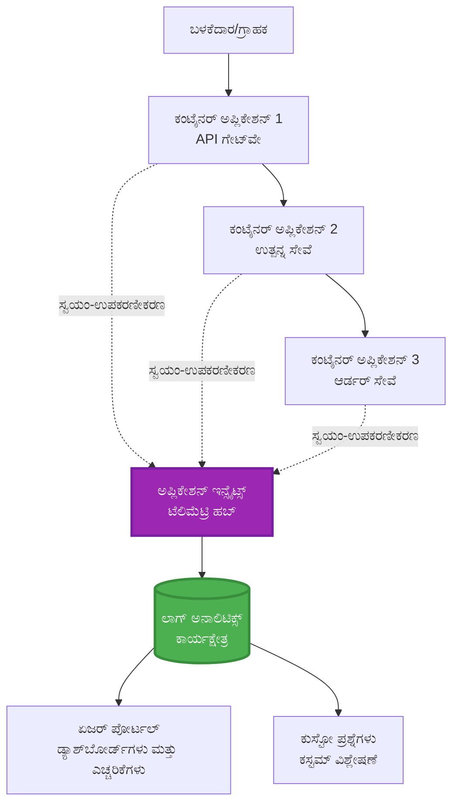
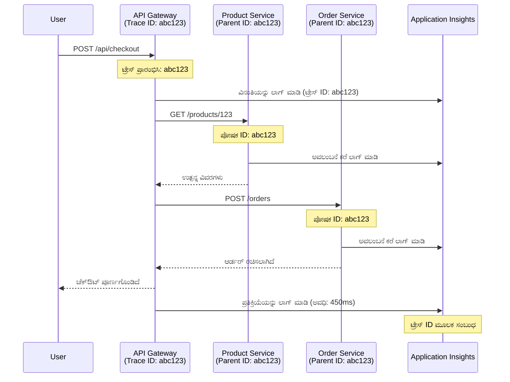

<!--
CO_OP_TRANSLATOR_METADATA:
{
  "original_hash": "e5aa37cdb6378c09099500ac31600b8c",
  "translation_date": "2025-11-24T23:20:22+00:00",
  "source_file": "docs/pre-deployment/application-insights.md",
  "language_code": "kn"
}
-->
# AZD ಜೊತೆ Application Insights ಇಂಟಿಗ್ರೇಶನ್

⏱️ **ಅಂದಾಜಿತ ಸಮಯ**: 40-50 ನಿಮಿಷಗಳು | 💰 **ಖರ್ಚು ಪ್ರಭಾವ**: ~$5-15/ತಿಂಗಳು | ⭐ **ಸಂಕೀರ್ಣತೆ**: ಮಧ್ಯಮ

**📚 ಕಲಿಕೆಯ ಪಥ:**
- ← ಹಿಂದಿನ: [Preflight Checks](preflight-checks.md) - ಪ್ರೀ-ಡಿಪ್ಲಾಯ್‌ಮೆಂಟ್ ಮಾನ್ಯತೆ
- 🎯 **ನೀವು ಇಲ್ಲಿ ಇದ್ದೀರಿ**: Application Insights Integration (ಮೋನಿಟರಿಂಗ್, ಟೆಲಿಮೆಟ್ರಿ, ಡಿಬಗಿಂಗ್)
- → ಮುಂದಿನ: [Deployment Guide](../deployment/deployment-guide.md) - Azure ಗೆ ಡಿಪ್ಲಾಯ್ ಮಾಡುವುದು
- 🏠 [ಕೋರ್ಸ್ ಹೋಮ್](../../README.md)

---

## ನೀವು ಏನು ಕಲಿಯುತ್ತೀರಿ

ಈ ಪಾಠವನ್ನು ಪೂರ್ಣಗೊಳಿಸುವ ಮೂಲಕ, ನೀವು:
- **Application Insights** ಅನ್ನು AZD ಪ್ರಾಜೆಕ್ಟ್‌ಗಳಿಗೆ ಸ್ವಯಂಚಾಲಿತವಾಗಿ ಇಂಟಿಗ್ರೇಟ್ ಮಾಡುತ್ತೀರಿ
- **Distributed tracing** ಅನ್ನು ಮೈಕ್ರೋಸರ್ವಿಸ್‌ಗಳಿಗೆ ಕಾನ್ಫಿಗರ್ ಮಾಡುತ್ತೀರಿ
- **ಕಸ್ಟಮ್ ಟೆಲಿಮೆಟ್ರಿ** (ಮೆಟ್ರಿಕ್ಸ್, ಈವೆಂಟ್‌ಗಳು, ಡಿಪೆಂಡೆನ್ಸಿಗಳು) ಅನ್ನು ಅನುಷ್ಠಾನಗೊಳಿಸುತ್ತೀರಿ
- **Live metrics** ಅನ್ನು ರಿಯಲ್-ಟೈಮ್ ಮೋನಿಟರಿಂಗ್‌ಗಾಗಿ ಸೆಟ್ ಮಾಡುತ್ತೀರಿ
- AZD ಡಿಪ್ಲಾಯ್‌ಮೆಂಟ್‌ಗಳಿಂದ **ಅಲರ್ಟ್‌ಗಳು ಮತ್ತು ಡ್ಯಾಶ್‌ಬೋರ್ಡ್‌ಗಳನ್ನು** ರಚಿಸುತ್ತೀರಿ
- **Telemetry queries** ಮೂಲಕ ಪ್ರೊಡಕ್ಷನ್ ಸಮಸ್ಯೆಗಳನ್ನು ಡಿಬಗ್ ಮಾಡುತ್ತೀರಿ
- **ಖರ್ಚುಗಳು ಮತ್ತು ಸ್ಯಾಂಪ್ಲಿಂಗ್** ತಂತ್ರಗಳನ್ನು ಆಪ್ಟಿಮೈಸ್ ಮಾಡುತ್ತೀರಿ
- **AI/LLM ಅಪ್ಲಿಕೇಶನ್‌ಗಳನ್ನು** (ಟೋಕನ್‌ಗಳು, ಲೇಟೆನ್ಸಿ, ಖರ್ಚುಗಳು) ಮೋನಿಟರ್ ಮಾಡುತ್ತೀರಿ

## AZD ಜೊತೆ Application Insights ಯಾಕೆ ಮುಖ್ಯ

### ಸವಾಲು: ಪ್ರೊಡಕ್ಷನ್ ಓಬ್ಸರ್ವಬಿಲಿಟಿ

**Application Insights ಇಲ್ಲದೆ:**
```
❌ No visibility into production behavior
❌ Manual log aggregation across services
❌ Reactive debugging (wait for customer complaints)
❌ No performance metrics
❌ Cannot trace requests across services
❌ Unknown failure rates and bottlenecks
```

**Application Insights + AZD ಜೊತೆ:**
```
✅ Automatic telemetry collection
✅ Centralized logs from all services
✅ Proactive issue detection
✅ End-to-end request tracing
✅ Performance metrics and insights
✅ Real-time dashboards
✅ AZD provisions everything automatically
```

**ಉಪಮೆ**: Application Insights ನಿಮ್ಮ ಅಪ್ಲಿಕೇಶನ್‌ಗಾಗಿ "ಬ್ಲಾಕ್ ಬಾಕ್ಸ್" ಫ್ಲೈಟ್ ರೆಕಾರ್ಡರ್ + ಕಾಕ್ಪಿಟ್ ಡ್ಯಾಶ್‌ಬೋರ್ಡ್ ಹೊಂದಿರುವಂತೆ. ನೀವು ರಿಯಲ್-ಟೈಮ್‌ನಲ್ಲಿ ನಡೆಯುತ್ತಿರುವ ಎಲ್ಲವನ್ನೂ ನೋಡಬಹುದು ಮತ್ತು ಯಾವುದೇ ಘಟನೆವನ್ನು ಪುನಃ ಪ್ಲೇ ಮಾಡಬಹುದು.

---

## ಆರ್ಕಿಟೆಕ್ಚರ್ ಓವರ್‌ವ್ಯೂ

### AZD ಆರ್ಕಿಟೆಕ್ಚರ್‌ನಲ್ಲಿ Application Insights


### ಸ್ವಯಂಚಾಲಿತವಾಗಿ ಮೋನಿಟರ್ ಮಾಡಲಾಗುವವು

| ಟೆಲಿಮೆಟ್ರಿ ಪ್ರಕಾರ | ಇದು ಸೆರೆಹಿಡಿಯುವದು | ಬಳಕೆ |
|----------------|------------------|----------|
| **Requests** | HTTP ರಿಕ್ವೆಸ್ಟ್‌ಗಳು, ಸ್ಟೇಟಸ್ ಕೋಡ್‌ಗಳು, ಅವಧಿ | API ಕಾರ್ಯಕ್ಷಮತೆಯ ಮೋನಿಟರಿಂಗ್ |
| **Dependencies** | ಬಾಹ್ಯ ಕರೆಗಳು (DB, APIಗಳು, ಸ್ಟೋರೇಜ್) | ಬಾಟಲ್‌ನೆಕ್‌ಗಳನ್ನು ಗುರುತಿಸುವುದು |
| **Exceptions** | ಸ್ಟಾಕ್ ಟ್ರೇಸ್‌ಗಳೊಂದಿಗೆ ನಿರ್ವಹಿಸದ ದೋಷಗಳು | ವೈಫಲ್ಯಗಳನ್ನು ಡಿಬಗ್ ಮಾಡುವುದು |
| **Custom Events** | ವ್ಯವಹಾರ ಈವೆಂಟ್‌ಗಳು (ಸೈನ್ ಅಪ್, ಖರೀದಿ) | ಅನಾಲಿಟಿಕ್ಸ್ ಮತ್ತು ಫನ್ನೆಲ್‌ಗಳು |
| **Metrics** | ಕಾರ್ಯಕ್ಷಮತೆಯ ಕೌಂಟರ್‌ಗಳು, ಕಸ್ಟಮ್ ಮೆಟ್ರಿಕ್ಸ್ | ಸಾಮರ್ಥ್ಯ ಯೋಜನೆ |
| **Traces** | ತೀವ್ರತೆಯೊಂದಿಗೆ ಲಾಗ್ ಸಂದೇಶಗಳು | ಡಿಬಗಿಂಗ್ ಮತ್ತು ಆಡಿಟಿಂಗ್ |
| **Availability** | ಅಪ್‌ಟೈಮ್ ಮತ್ತು ಪ್ರತಿಕ್ರಿಯಾ ಸಮಯ ಪರೀಕ್ಷೆಗಳು | SLA ಮೋನಿಟರಿಂಗ್ |

---

## ಪೂರ್ವಶರತ್ತುಗಳು

### ಅಗತ್ಯವಿರುವ ಟೂಲ್ಸ್

```bash
# ಆಜೂರ್ ಡೆವಲಪರ್ CLI ಪರಿಶೀಲಿಸಿ
azd version
# ✅ ನಿರೀಕ್ಷಿತ: azd ಆವೃತ್ತಿ 1.0.0 ಅಥವಾ ಹೆಚ್ಚು

# ಆಜೂರ್ CLI ಪರಿಶೀಲಿಸಿ
az --version
# ✅ ನಿರೀಕ್ಷಿತ: azure-cli 2.50.0 ಅಥವಾ ಹೆಚ್ಚು
```

### Azure ಅಗತ್ಯಗಳು

- ಸಕ್ರಿಯ Azure ಸಬ್ಸ್ಕ್ರಿಪ್ಷನ್
- ರಚಿಸಲು ಅನುಮತಿಗಳು:
  - Application Insights ಸಂಪತ್ತುಗಳು
  - Log Analytics ವರ್ಕ್‌ಸ್ಪೇಸ್‌ಗಳು
  - Container Apps
  - Resource groups

### ಜ್ಞಾನ ಪೂರ್ವಶರತ್ತುಗಳು

ನೀವು ಈ ಪಾಠಗಳನ್ನು ಪೂರ್ಣಗೊಳಿಸಿರಬೇಕು:
- [AZD Basics](../getting-started/azd-basics.md) - AZD ಮೂಲಭೂತ ಪರಿಕಲ್ಪನೆಗಳು
- [Configuration](../getting-started/configuration.md) - ಪರಿಸರ ಸೆಟಪ್
- [First Project](../getting-started/first-project.md) - ಮೂಲ ಡಿಪ್ಲಾಯ್‌ಮೆಂಟ್

---

## ಪಾಠ 1: AZD ಜೊತೆ ಸ್ವಯಂಚಾಲಿತ Application Insights

### AZD Application Insights ಅನ್ನು ಹೇಗೆ ಪ್ರೊವಿಷನ್ ಮಾಡುತ್ತದೆ

AZD ನೀವು ಡಿಪ್ಲಾಯ್ ಮಾಡಿದಾಗ Application Insights ಅನ್ನು ಸ್ವಯಂಚಾಲಿತವಾಗಿ ರಚಿಸುತ್ತದೆ ಮತ್ತು ಕಾನ್ಫಿಗರ್ ಮಾಡುತ್ತದೆ. ಇದು ಹೇಗೆ ಕೆಲಸ ಮಾಡುತ್ತದೆ ಎಂಬುದನ್ನು ನೋಡೋಣ.

### ಪ್ರಾಜೆಕ್ಟ್ ರಚನೆ

```
monitored-app/
├── azure.yaml                     # AZD configuration
├── infra/
│   ├── main.bicep                # Main infrastructure
│   ├── core/
│   │   └── monitoring.bicep      # Application Insights + Log Analytics
│   └── app/
│       └── api.bicep             # Container App with monitoring
└── src/
    ├── app.py                    # Application with telemetry
    ├── requirements.txt
    └── Dockerfile
```

---

### ಹಂತ 1: AZD ಅನ್ನು ಕಾನ್ಫಿಗರ್ ಮಾಡುವುದು (azure.yaml)

**ಫೈಲ್: `azure.yaml`**

```yaml
name: monitored-app
metadata:
  template: monitored-app@1.0.0

services:
  api:
    project: ./src
    language: python
    host: containerapp

# AZD automatically provisions monitoring!
```

**ಅಷ್ಟೇ!** AZD ಮೂಲಭೂತ ಮೋನಿಟರಿಂಗ್‌ಗಾಗಿ Application Insights ಅನ್ನು ಡಿಫಾಲ್ಟ್ ಆಗಿ ರಚಿಸುತ್ತದೆ. ಹೆಚ್ಚುವರಿ ಕಾನ್ಫಿಗರೇಶನ್ ಅಗತ್ಯವಿಲ್ಲ.

---

### ಹಂತ 2: ಮೋನಿಟರಿಂಗ್ ಇನ್‌ಫ್ರಾಸ್ಟ್ರಕ್ಚರ್ (Bicep)

**ಫೈಲ್: `infra/core/monitoring.bicep`**

```bicep
param logAnalyticsName string
param applicationInsightsName string
param location string = resourceGroup().location
param tags object = {}

// Log Analytics Workspace (required for Application Insights)
resource logAnalytics 'Microsoft.OperationalInsights/workspaces@2022-10-01' = {
  name: logAnalyticsName
  location: location
  tags: tags
  properties: {
    sku: {
      name: 'PerGB2018'  // Pay-as-you-go pricing
    }
    retentionInDays: 30  // Keep logs for 30 days
    features: {
      enableLogAccessUsingOnlyResourcePermissions: true
    }
  }
}

// Application Insights
resource applicationInsights 'Microsoft.Insights/components@2020-02-02' = {
  name: applicationInsightsName
  location: location
  tags: tags
  kind: 'web'
  properties: {
    Application_Type: 'web'
    WorkspaceResourceId: logAnalytics.id
    IngestionMode: 'LogAnalytics'
    publicNetworkAccessForIngestion: 'Enabled'
    publicNetworkAccessForQuery: 'Enabled'
  }
}

// Outputs for Container Apps
output logAnalyticsWorkspaceId string = logAnalytics.id
output logAnalyticsWorkspaceName string = logAnalytics.name
output applicationInsightsConnectionString string = applicationInsights.properties.ConnectionString
output applicationInsightsInstrumentationKey string = applicationInsights.properties.InstrumentationKey
output applicationInsightsName string = applicationInsights.name
```

---

### ಹಂತ 3: Application Insights ಗೆ Container App ಅನ್ನು ಸಂಪರ್ಕಿಸುವುದು

**ಫೈಲ್: `infra/app/api.bicep`**

```bicep
param name string
param location string
param tags object = {}
param containerAppsEnvironmentName string
param applicationInsightsConnectionString string

resource containerApp 'Microsoft.App/containerApps@2023-05-01' = {
  name: name
  location: location
  tags: tags
  properties: {
    configuration: {
      ingress: {
        external: true
        targetPort: 8000
      }
      secrets: [
        {
          name: 'appinsights-connection-string'
          value: applicationInsightsConnectionString
        }
      ]
    }
    template: {
      containers: [
        {
          name: 'api'
          image: 'myregistry.azurecr.io/api:latest'
          resources: {
            cpu: json('0.5')
            memory: '1Gi'
          }
          env: [
            {
              name: 'APPLICATIONINSIGHTS_CONNECTION_STRING'
              secretRef: 'appinsights-connection-string'
            }
            {
              name: 'APPLICATIONINSIGHTS_ENABLED'
              value: 'true'
            }
          ]
        }
      ]
    }
  }
}

output uri string = 'https://${containerApp.properties.configuration.ingress.fqdn}'
```

---

### ಹಂತ 4: ಟೆಲಿಮೆಟ್ರಿಯೊಂದಿಗೆ ಅಪ್ಲಿಕೇಶನ್ ಕೋಡ್

**ಫೈಲ್: `src/app.py`**

```python
from flask import Flask, request, jsonify
from opencensus.ext.azure.log_exporter import AzureLogHandler
from opencensus.ext.azure.trace_exporter import AzureExporter
from opencensus.ext.flask.flask_middleware import FlaskMiddleware
from opencensus.trace.samplers import ProbabilitySampler
import logging
import os

app = Flask(__name__)

# ಅಪ್ಲಿಕೇಶನ್ ಇನ್‌ಸೈಟ್ಸ್ ಸಂಪರ್ಕ ಸ್ಟ್ರಿಂಗ್ ಪಡೆಯಿರಿ
connection_string = os.environ.get('APPLICATIONINSIGHTS_CONNECTION_STRING')

if connection_string:
    # ವಿತರಿತ ಟ್ರೇಸಿಂಗ್ ಅನ್ನು ಸಂರಚಿಸಿ
    middleware = FlaskMiddleware(
        app,
        exporter=AzureExporter(connection_string=connection_string),
        sampler=ProbabilitySampler(rate=1.0)  # ಡೆವ್‌ಗಾಗಿ 100% ಸ್ಯಾಂಪ್ಲಿಂಗ್
    )
    
    # ಲಾಗಿಂಗ್ ಅನ್ನು ಸಂರಚಿಸಿ
    logger = logging.getLogger(__name__)
    logger.addHandler(AzureLogHandler(connection_string=connection_string))
    logger.setLevel(logging.INFO)
    
    print("✅ Application Insights enabled")
else:
    logger = logging.getLogger(__name__)
    logger.setLevel(logging.INFO)
    print("⚠️ Application Insights not configured")

@app.route('/health')
def health():
    logger.info('Health check endpoint called')
    return jsonify({'status': 'healthy', 'monitoring': 'enabled'})

@app.route('/api/products')
def get_products():
    logger.info('Fetching products')
    
    # ಡೇಟಾಬೇಸ್ ಕರೆವನ್ನು ಅನುಕರಿಸಿ (ಸ್ವಯಂಚಾಲಿತವಾಗಿ ಅವಲಂಬನೆ ಎಂದು ಟ್ರ್ಯಾಕ್ ಮಾಡಲಾಗುತ್ತದೆ)
    products = [
        {'id': 1, 'name': 'Laptop', 'price': 999.99},
        {'id': 2, 'name': 'Mouse', 'price': 29.99},
        {'id': 3, 'name': 'Keyboard', 'price': 79.99}
    ]
    
    logger.info(f'Returned {len(products)} products')
    return jsonify(products)

@app.route('/api/error-test')
def error_test():
    """Test error tracking"""
    logger.error('Testing error tracking')
    try:
        raise ValueError('This is a test exception')
    except Exception as e:
        logger.exception('Exception occurred in error-test endpoint')
        return jsonify({'error': str(e)}), 500

@app.route('/api/slow')
def slow_endpoint():
    """Test performance tracking"""
    import time
    logger.info('Slow endpoint called')
    time.sleep(3)  # ನಿಧಾನವಾದ ಕಾರ್ಯವನ್ನು ಅನುಕರಿಸಿ
    logger.warning('Endpoint took 3 seconds to respond')
    return jsonify({'message': 'Slow operation completed'})

if __name__ == '__main__':
    app.run(host='0.0.0.0', port=8000)
```

**ಫೈಲ್: `src/requirements.txt`**

```txt
Flask==3.0.0
opencensus-ext-azure==1.1.13
opencensus-ext-flask==0.8.1
gunicorn==21.2.0
```

---

### ಹಂತ 5: ಡಿಪ್ಲಾಯ್ ಮಾಡಿ ಮತ್ತು ಪರಿಶೀಲಿಸಿ

```bash
# AZD ಪ್ರಾರಂಭಿಸಿ
azd init

# ನಿಯೋಜಿಸಿ (ಸ್ವಯಂಚಾಲಿತವಾಗಿ ಅಪ್ಲಿಕೇಶನ್ ಇನ್‌ಸೈಟ್ಸ್ ಒದಗಿಸುತ್ತದೆ)
azd up

# ಅಪ್ಲಿಕೇಶನ್ URL ಪಡೆಯಿರಿ
APP_URL=$(azd env get-values | grep API_URL | cut -d '=' -f2 | tr -d '"')

# ಟೆಲಿಮೆಟ್ರಿ ರಚಿಸಿ
curl $APP_URL/health
curl $APP_URL/api/products
curl $APP_URL/api/error-test
curl $APP_URL/api/slow
```

**✅ ನಿರೀಕ್ಷಿತ ಔಟ್‌ಪುಟ್:**
```json
{
  "status": "healthy",
  "monitoring": "enabled"
}
```

---

### ಹಂತ 6: Azure ಪೋರ್ಟಲ್‌ನಲ್ಲಿ ಟೆಲಿಮೆಟ್ರಿ ವೀಕ್ಷಿಸಿ

```bash
# ಅಪ್ಲಿಕೇಶನ್ ಇನ್‌ಸೈಟ್ಸ್ ವಿವರಗಳನ್ನು ಪಡೆಯಿರಿ
azd env get-values | grep APPLICATIONINSIGHTS

# ಅಜೂರ್ ಪೋರ್ಟಲ್‌ನಲ್ಲಿ ತೆರೆಯಿರಿ
az monitor app-insights component show \
  --app $(azd env get-values | grep APPLICATIONINSIGHTS_NAME | cut -d '=' -f2 | tr -d '"') \
  --resource-group $(azd env get-values | grep AZURE_RESOURCE_GROUP | cut -d '=' -f2 | tr -d '"') \
  --query "appId" -o tsv
```

**Azure ಪೋರ್ಟಲ್ → Application Insights → Transaction Search ಗೆ ಹೋಗಿ**

ನೀವು ನೋಡಬಹುದು:
- ✅ HTTP ರಿಕ್ವೆಸ್ಟ್‌ಗಳು ಸ್ಟೇಟಸ್ ಕೋಡ್‌ಗಳೊಂದಿಗೆ
- ✅ `/api/slow` ಗೆ 3+ ಸೆಕೆಂಡುಗಳ ರಿಕ್ವೆಸ್ಟ್ ಅವಧಿ
- ✅ `/api/error-test` ನಿಂದ ದೋಷ ವಿವರಗಳು
- ✅ ಕಸ್ಟಮ್ ಲಾಗ್ ಸಂದೇಶಗಳು

---

## ಪಾಠ 2: ಕಸ್ಟಮ್ ಟೆಲಿಮೆಟ್ರಿ ಮತ್ತು ಈವೆಂಟ್‌ಗಳು

### ವ್ಯವಹಾರ ಈವೆಂಟ್‌ಗಳನ್ನು ಟ್ರಾಕ್ ಮಾಡುವುದು

ವ್ಯವಹಾರ-ಮಹತ್ವದ ಈವೆಂಟ್‌ಗಳಿಗೆ ಕಸ್ಟಮ್ ಟೆಲಿಮೆಟ್ರಿ ಸೇರಿಸೋಣ.

**ಫೈಲ್: `src/telemetry.py`**

```python
from opencensus.ext.azure import metrics_exporter
from opencensus.stats import aggregation as aggregation_module
from opencensus.stats import measure as measure_module
from opencensus.stats import stats as stats_module
from opencensus.stats import view as view_module
from opencensus.tags import tag_map as tag_map_module
from opencensus.ext.azure.log_exporter import AzureLogHandler
from opencensus.ext.azure.trace_exporter import AzureExporter
from opencensus.trace import tracer as tracer_module
import logging
import os

class TelemetryClient:
    """Custom telemetry client for Application Insights"""
    
    def __init__(self, connection_string=None):
        self.connection_string = connection_string or os.environ.get('APPLICATIONINSIGHTS_CONNECTION_STRING')
        
        if not self.connection_string:
            print("⚠️ Application Insights connection string not found")
            return
        
        # ಲಾಗರ್ ಸೆಟಪ್ ಮಾಡಿ
        self.logger = logging.getLogger(__name__)
        self.logger.addHandler(AzureLogHandler(connection_string=self.connection_string))
        self.logger.setLevel(logging.INFO)
        
        # ಮೆಟ್ರಿಕ್ಸ್ ಎಕ್ಸ್‌ಪೋರ್ಟರ್ ಸೆಟಪ್ ಮಾಡಿ
        self.stats = stats_module.stats
        self.view_manager = self.stats.view_manager
        self.stats_recorder = self.stats.stats_recorder
        
        exporter = metrics_exporter.new_metrics_exporter(
            connection_string=self.connection_string
        )
        self.view_manager.register_exporter(exporter)
        
        # ಟ್ರೇಸರ್ ಸೆಟಪ್ ಮಾಡಿ
        self.tracer = tracer_module.Tracer(
            exporter=AzureExporter(connection_string=self.connection_string)
        )
        
        print("✅ Custom telemetry client initialized")
    
    def track_event(self, event_name: str, properties: dict = None):
        """Track custom business event"""
        properties = properties or {}
        self.logger.info(
            f"CustomEvent: {event_name}",
            extra={
                'custom_dimensions': {
                    'event_name': event_name,
                    **properties
                }
            }
        )
    
    def track_metric(self, metric_name: str, value: float, properties: dict = None):
        """Track custom metric"""
        properties = properties or {}
        self.logger.info(
            f"CustomMetric: {metric_name} = {value}",
            extra={
                'custom_dimensions': {
                    'metric_name': metric_name,
                    'value': value,
                    **properties
                }
            }
        )
    
    def track_dependency(self, name: str, dependency_type: str, duration: float, success: bool):
        """Track external dependency call"""
        with self.tracer.span(name=name) as span:
            span.add_attribute('dependency.type', dependency_type)
            span.add_attribute('duration', duration)
            span.add_attribute('success', success)

# ಗ್ಲೋಬಲ್ ಟೆಲಿಮೆಟ್ರಿ ಕ್ಲೈಂಟ್
telemetry = TelemetryClient()
```

### ಕಸ್ಟಮ್ ಈವೆಂಟ್‌ಗಳೊಂದಿಗೆ ಅಪ್ಲಿಕೇಶನ್ ಅನ್ನು ಅಪ್ಡೇಟ್ ಮಾಡುವುದು

**ಫೈಲ್: `src/app.py` (ವರ್ಧಿತ)**

```python
from flask import Flask, request, jsonify
from telemetry import telemetry
import time
import random

app = Flask(__name__)

@app.route('/api/purchase', methods=['POST'])
def purchase():
    """Track purchase event with custom telemetry"""
    data = request.json
    product_id = data.get('product_id')
    quantity = data.get('quantity', 1)
    price = data.get('price', 0)
    
    # ವ್ಯವಹಾರ ಘಟನೆಗಳನ್ನು ಟ್ರ್ಯಾಕ್ ಮಾಡಿ
    telemetry.track_event('Purchase', {
        'product_id': product_id,
        'quantity': quantity,
        'total_amount': price * quantity,
        'user_id': request.headers.get('X-User-Id', 'anonymous')
    })
    
    # ಆದಾಯ ಮೆಟ್ರಿಕ್ ಅನ್ನು ಟ್ರ್ಯಾಕ್ ಮಾಡಿ
    telemetry.track_metric('Revenue', price * quantity, {
        'product_id': product_id,
        'currency': 'USD'
    })
    
    return jsonify({
        'order_id': f'ORD-{random.randint(1000, 9999)}',
        'status': 'confirmed',
        'total': price * quantity
    })

@app.route('/api/search')
def search():
    """Track search queries"""
    query = request.args.get('q', '')
    
    start_time = time.time()
    
    # ಹುಡುಕಾಟವನ್ನು ಅನುಕರಿಸಿ (ನಿಜವಾದ ಡೇಟಾಬೇಸ್ ಪ್ರಶ್ನೆ ಆಗಿರುತ್ತದೆ)
    results = [{'id': 1, 'name': f'Result for {query}'}]
    
    duration = (time.time() - start_time) * 1000  # ಮಿಲಿಸೆಕೆಂಡ್ಗಳಿಗೆ ಪರಿವರ್ತಿಸಿ
    
    # ಹುಡುಕಾಟ ಘಟನೆಗಳನ್ನು ಟ್ರ್ಯಾಕ್ ಮಾಡಿ
    telemetry.track_event('Search', {
        'query': query,
        'results_count': len(results),
        'duration_ms': duration
    })
    
    # ಹುಡುಕಾಟ ಕಾರ್ಯಕ್ಷಮತೆ ಮೆಟ್ರಿಕ್ ಅನ್ನು ಟ್ರ್ಯಾಕ್ ಮಾಡಿ
    telemetry.track_metric('SearchDuration', duration, {
        'query_length': len(query)
    })
    
    return jsonify({'results': results, 'count': len(results)})

@app.route('/api/external-call')
def external_call():
    """Track external API dependency"""
    import requests
    
    start_time = time.time()
    success = True
    
    try:
        # ಬಾಹ್ಯ API ಕರೆವನ್ನು ಅನುಕರಿಸಿ
        response = requests.get('https://api.example.com/data', timeout=5)
        result = response.json()
    except Exception as e:
        success = False
        result = {'error': str(e)}
    
    duration = (time.time() - start_time) * 1000
    
    # ಅವಲಂಬನೆಯನ್ನು ಟ್ರ್ಯಾಕ್ ಮಾಡಿ
    telemetry.track_dependency(
        name='ExternalAPI',
        dependency_type='HTTP',
        duration=duration,
        success=success
    )
    
    return jsonify(result)

if __name__ == '__main__':
    app.run(host='0.0.0.0', port=8000)
```

### ಕಸ್ಟಮ್ ಟೆಲಿಮೆಟ್ರಿ ಪರೀಕ್ಷೆ

```bash
# ಖರೀದಿ ಘಟನೆವನ್ನು ಟ್ರ್ಯಾಕ್ ಮಾಡಿ
curl -X POST $APP_URL/api/purchase \
  -H "Content-Type: application/json" \
  -H "X-User-Id: user123" \
  -d '{"product_id": 1, "quantity": 2, "price": 29.99}'

# ಹುಡುಕಾಟ ಘಟನೆವನ್ನು ಟ್ರ್ಯಾಕ್ ಮಾಡಿ
curl "$APP_URL/api/search?q=laptop"

# ಬಾಹ್ಯ ಅವಲಂಬನೆವನ್ನು ಟ್ರ್ಯಾಕ್ ಮಾಡಿ
curl $APP_URL/api/external-call
```

**Azure ಪೋರ್ಟಲ್‌ನಲ್ಲಿ ವೀಕ್ಷಿಸಿ:**

Application Insights → Logs ಗೆ ಹೋಗಿ, ನಂತರ ಈ ರನ್ ಮಾಡಿ:

```kusto
// View purchase events
traces
| where customDimensions.event_name == "Purchase"
| project 
    timestamp,
    product_id = tostring(customDimensions.product_id),
    total_amount = todouble(customDimensions.total_amount),
    user_id = tostring(customDimensions.user_id)
| order by timestamp desc

// View revenue metrics
traces
| where customDimensions.metric_name == "Revenue"
| summarize TotalRevenue = sum(todouble(customDimensions.value)) by bin(timestamp, 1h)
| render timechart

// View search performance
traces
| where customDimensions.event_name == "Search"
| summarize 
    AvgDuration = avg(todouble(customDimensions.duration_ms)),
    SearchCount = count()
  by bin(timestamp, 5m)
| render timechart
```

---

## ಪಾಠ 3: ಮೈಕ್ರೋಸರ್ವಿಸ್‌ಗಳಿಗೆ Distributed Tracing

### ಕ್ರಾಸ್-ಸರ್ವಿಸ್ ಟ್ರೇಸಿಂಗ್ ಅನ್ನು ಸಕ್ರಿಯಗೊಳಿಸುವುದು

ಮೈಕ್ರೋಸರ್ವಿಸ್‌ಗಳಿಗೆ, Application Insights ಸ್ವಯಂಚಾಲಿತವಾಗಿ ಸರ್ವಿಸ್‌ಗಳಾದ್ಯಂತ ರಿಕ್ವೆಸ್ಟ್‌ಗಳನ್ನು ಸಂಬಂಧಿಸುತ್ತದೆ.

**ಫೈಲ್: `infra/main.bicep`**

```bicep
targetScope = 'subscription'

param environmentName string
param location string = 'eastus'

var tags = { 'azd-env-name': environmentName }

resource rg 'Microsoft.Resources/resourceGroups@2021-04-01' = {
  name: 'rg-${environmentName}'
  location: location
  tags: tags
}

// Monitoring (shared by all services)
module monitoring './core/monitoring.bicep' = {
  name: 'monitoring'
  scope: rg
  params: {
    logAnalyticsName: 'log-${environmentName}'
    applicationInsightsName: 'appi-${environmentName}'
    location: location
    tags: tags
  }
}

// API Gateway
module apiGateway './app/api-gateway.bicep' = {
  name: 'api-gateway'
  scope: rg
  params: {
    name: 'ca-gateway-${environmentName}'
    location: location
    tags: union(tags, { 'azd-service-name': 'gateway' })
    applicationInsightsConnectionString: monitoring.outputs.applicationInsightsConnectionString
  }
}

// Product Service
module productService './app/product-service.bicep' = {
  name: 'product-service'
  scope: rg
  params: {
    name: 'ca-products-${environmentName}'
    location: location
    tags: union(tags, { 'azd-service-name': 'products' })
    applicationInsightsConnectionString: monitoring.outputs.applicationInsightsConnectionString
  }
}

// Order Service
module orderService './app/order-service.bicep' = {
  name: 'order-service'
  scope: rg
  params: {
    name: 'ca-orders-${environmentName}'
    location: location
    tags: union(tags, { 'azd-service-name': 'orders' })
    applicationInsightsConnectionString: monitoring.outputs.applicationInsightsConnectionString
  }
}

output APPLICATIONINSIGHTS_CONNECTION_STRING string = monitoring.outputs.applicationInsightsConnectionString
output GATEWAY_URL string = apiGateway.outputs.uri
```

### ಎಂಡ್-ಟು-ಎಂಡ್ ಟ್ರಾನ್ಸಾಕ್ಷನ್ ವೀಕ್ಷಣೆ


**ಎಂಡ್-ಟು-ಎಂಡ್ ಟ್ರೇಸ್ ಕ್ವೇರಿ:**

```kusto
// Find complete request flow
let traceId = "abc123...";  // Get from response header
dependencies
| union requests
| where operation_Id == traceId
| project 
    timestamp,
    type = itemType,
    name,
    duration,
    success,
    cloud_RoleName
| order by timestamp asc
```

---

## ಪಾಠ 4: ಲೈವ್ ಮೆಟ್ರಿಕ್ಸ್ ಮತ್ತು ರಿಯಲ್-ಟೈಮ್ ಮೋನಿಟರಿಂಗ್

### ಲೈವ್ ಮೆಟ್ರಿಕ್ಸ್ ಸ್ಟ್ರೀಮ್ ಅನ್ನು ಸಕ್ರಿಯಗೊಳಿಸುವುದು

ಲೈವ್ ಮೆಟ್ರಿಕ್ಸ್ <1 ಸೆಕೆಂಡು ಲೇಟೆನ್ಸಿಯೊಂದಿಗೆ ರಿಯಲ್-ಟೈಮ್ ಟೆಲಿಮೆಟ್ರಿ ಒದಗಿಸುತ್ತದೆ.

**ಲೈವ್ ಮೆಟ್ರಿಕ್ಸ್ ಪ್ರವೇಶ:**

```bash
# ಅಪ್ಲಿಕೇಶನ್ ಇನ್‌ಸೈಟ್ಸ್ ಸಂಪತ್ತನ್ನು ಪಡೆಯಿರಿ
APPI_NAME=$(azd env get-values | grep APPLICATIONINSIGHTS_NAME | cut -d '=' -f2 | tr -d '"')

# ಸಂಪತ್ತಿನ ಗುಂಪನ್ನು ಪಡೆಯಿರಿ
RG_NAME=$(azd env get-values | grep AZURE_RESOURCE_GROUP | cut -d '=' -f2 | tr -d '"')

echo "Navigate to: Azure Portal → Resource Groups → $RG_NAME → $APPI_NAME → Live Metrics"
```

**ನೀವು ರಿಯಲ್-ಟೈಮ್‌ನಲ್ಲಿ ನೋಡುತ್ತೀರಿ:**
- ✅ ಇನ್‌ಕಮಿಂಗ್ ರಿಕ್ವೆಸ್ಟ್ ರೇಟ್ (requests/sec)
- ✅ ಔಟ್‌ಗೋಯಿಂಗ್ ಡಿಪೆಂಡೆನ್ಸಿ ಕರೆಗಳು
- ✅ ಎಕ್ಸೆಪ್ಷನ್ ಎಣಿಕೆ
- ✅ CPU ಮತ್ತು ಮೆಮೊರಿ ಬಳಕೆ
- ✅ ಸಕ್ರಿಯ ಸರ್ವರ್ ಎಣಿಕೆ
- ✅ ಸ್ಯಾಂಪಲ್ ಟೆಲಿಮೆಟ್ರಿ

### ಪರೀಕ್ಷೆಗಾಗಿ ಲೋಡ್ ರಚನೆ

```bash
# ಲೈವ್ ಮೆಟ್ರಿಕ್ಸ್ ನೋಡಲು ಲೋಡ್ ಉತ್ಪಾದಿಸಿ
for i in {1..100}; do
  curl $APP_URL/api/products &
  curl $APP_URL/api/search?q=test$i &
done

# ಆಜೂರ್ ಪೋರ್ಟಲ್‌ನಲ್ಲಿ ಲೈವ್ ಮೆಟ್ರಿಕ್ಸ್ ವೀಕ್ಷಿಸಿ
# ನೀವು ವಿನಂತಿ ದರದ ಏರಿಕೆಯನ್ನು ನೋಡಬಹುದು
```

---

## ಪ್ರಾಯೋಗಿಕ ವ್ಯಾಯಾಮಗಳು

### ವ್ಯಾಯಾಮ 1: ಅಲರ್ಟ್‌ಗಳನ್ನು ಸೆಟ್ ಮಾಡುವುದು ⭐⭐ (ಮಧ್ಯಮ)

**ಗುರಿ**: ಹೆಚ್ಚಿನ ದೋಷ ದರ ಮತ್ತು ನಿಧಾನ ಪ್ರತಿಕ್ರಿಯೆಗಳಿಗೆ ಅಲರ್ಟ್‌ಗಳನ್ನು ರಚಿಸಿ.

**ಹಂತಗಳು:**

1. **ದೋಷ ದರಕ್ಕೆ ಅಲರ್ಟ್ ರಚಿಸಿ:**

```bash
# ಅಪ್ಲಿಕೇಶನ್ ಇನ್‌ಸೈಟ್ಸ್ ಸಂಪತ್ತಿನ ಐಡಿಯನ್ನು ಪಡೆಯಿರಿ
APPI_ID=$(az monitor app-insights component show \
  --app $APPI_NAME \
  --resource-group $RG_NAME \
  --query "id" -o tsv)

# ವಿಫಲವಾದ ವಿನಂತಿಗಳಿಗಾಗಿ ಮೆಟ್ರಿಕ್ ಎಚ್ಚರಿಕೆಯನ್ನು ರಚಿಸಿ
az monitor metrics alert create \
  --name "High-Error-Rate" \
  --resource-group $RG_NAME \
  --scopes $APPI_ID \
  --condition "count requests/failed > 10" \
  --window-size 5m \
  --evaluation-frequency 1m \
  --description "Alert when error rate exceeds 10 per 5 minutes"
```

2. **ನಿಧಾನ ಪ್ರತಿಕ್ರಿಯೆಗಳಿಗೆ ಅಲರ್ಟ್ ರಚಿಸಿ:**

```bash
az monitor metrics alert create \
  --name "Slow-Responses" \
  --resource-group $RG_NAME \
  --scopes $APPI_ID \
  --condition "avg requests/duration > 3000" \
  --window-size 5m \
  --evaluation-frequency 1m \
  --description "Alert when average response time exceeds 3 seconds"
```

3. **Bicep ಮೂಲಕ ಅಲರ್ಟ್ ರಚಿಸಿ (AZD ಗೆ ಆದ್ಯತೆ):**

**ಫೈಲ್: `infra/core/alerts.bicep`**

```bicep
param applicationInsightsId string
param actionGroupId string = ''
param location string = resourceGroup().location

// High error rate alert
resource errorRateAlert 'Microsoft.Insights/metricAlerts@2018-03-01' = {
  name: 'high-error-rate'
  location: 'global'
  properties: {
    description: 'Alert when error rate exceeds threshold'
    severity: 2
    enabled: true
    scopes: [
      applicationInsightsId
    ]
    evaluationFrequency: 'PT1M'
    windowSize: 'PT5M'
    criteria: {
      'odata.type': 'Microsoft.Azure.Monitor.SingleResourceMultipleMetricCriteria'
      allOf: [
        {
          name: 'Error rate'
          metricName: 'requests/failed'
          operator: 'GreaterThan'
          threshold: 10
          timeAggregation: 'Count'
        }
      ]
    }
    actions: actionGroupId != '' ? [
      {
        actionGroupId: actionGroupId
      }
    ] : []
  }
}

// Slow response alert
resource slowResponseAlert 'Microsoft.Insights/metricAlerts@2018-03-01' = {
  name: 'slow-responses'
  location: 'global'
  properties: {
    description: 'Alert when response time is too high'
    severity: 3
    enabled: true
    scopes: [
      applicationInsightsId
    ]
    evaluationFrequency: 'PT1M'
    windowSize: 'PT5M'
    criteria: {
      'odata.type': 'Microsoft.Azure.Monitor.SingleResourceMultipleMetricCriteria'
      allOf: [
        {
          name: 'Response duration'
          metricName: 'requests/duration'
          operator: 'GreaterThan'
          threshold: 3000
          timeAggregation: 'Average'
        }
      ]
    }
  }
}

output errorAlertId string = errorRateAlert.id
output slowResponseAlertId string = slowResponseAlert.id
```

4. **ಅಲರ್ಟ್‌ಗಳನ್ನು ಪರೀಕ್ಷಿಸಿ:**

```bash
# ದೋಷಗಳನ್ನು ಉತ್ಪಾದಿಸಿ
for i in {1..20}; do
  curl $APP_URL/api/error-test
done

# ನಿಧಾನ ಪ್ರತಿಸ್ಪಂದನೆಗಳನ್ನು ಉತ್ಪಾದಿಸಿ
for i in {1..10}; do
  curl $APP_URL/api/slow
done

# ಎಚ್ಚರಿಕೆ ಸ್ಥಿತಿಯನ್ನು ಪರಿಶೀಲಿಸಿ (5-10 ನಿಮಿಷಗಳ ಕಾಲ ಕಾಯಿರಿ)
az monitor metrics alert list \
  --resource-group $RG_NAME \
  --query "[].{Name:name, Enabled:enabled, State:properties.enabled}" \
  --output table
```

**✅ ಯಶಸ್ಸಿನ ಮಾನದಂಡ:**
- ✅ ಅಲರ್ಟ್‌ಗಳು ಯಶಸ್ವಿಯಾಗಿ ರಚಿಸಲಾಗಿದೆ
- ✅ ಥ್ರೆಶೋಲ್ಡ್‌ಗಳನ್ನು ಮೀರಿದಾಗ ಅಲರ್ಟ್‌ಗಳು ಫೈರ್ ಆಗುತ್ತವೆ
- ✅ Azure ಪೋರ್ಟಲ್‌ನಲ್ಲಿ ಅಲರ್ಟ್ ಇತಿಹಾಸವನ್ನು ವೀಕ್ಷಿಸಬಹುದು
- ✅ AZD ಡಿಪ್ಲಾಯ್‌ಮೆಂಟ್‌ಗಳೊಂದಿಗೆ ಇಂಟಿಗ್ರೇಟೆಡ್

**ಸಮಯ**: 20-25 ನಿಮಿಷಗಳು

---

### ವ್ಯಾಯಾಮ 2: ಕಸ್ಟಮ್ ಡ್ಯಾಶ್‌ಬೋರ್ಡ್ ರಚಿಸಿ ⭐⭐ (ಮಧ್ಯಮ)

**ಗುರಿ**: ಪ್ರಮುಖ ಅಪ್ಲಿಕೇಶನ್ ಮೆಟ್ರಿಕ್ಸ್‌ಗಳನ್ನು ತೋರಿಸುವ ಡ್ಯಾಶ್‌ಬೋರ್ಡ್ ಅನ್ನು ನಿರ್ಮಿಸಿ.

**ಹಂತಗಳು:**

1. **Azure ಪೋರ್ಟಲ್ ಮೂಲಕ ಡ್ಯಾಶ್‌ಬೋರ್ಡ್ ರಚಿಸಿ:**

Azure ಪೋರ್ಟಲ್ → Dashboards → New Dashboard ಗೆ ಹೋಗಿ

2. **ಪ್ರಮುಖ ಮೆಟ್ರಿಕ್ಸ್‌ಗಳಿಗೆ ಟೈಲ್‌ಗಳನ್ನು ಸೇರಿಸಿ:**

- ರಿಕ್ವೆಸ್ಟ್ ಎಣಿಕೆ (ಕಳೆದ 24 ಗಂಟೆ)
- ಸರಾಸರಿ ಪ್ರತಿಕ್ರಿಯಾ ಸಮಯ
- ದೋಷ ದರ
- ಟಾಪ್ 5 ನಿಧಾನ ಕಾರ್ಯಾಚರಣೆಗಳು
- ಬಳಕೆದಾರರ ಭೌಗೋಳಿಕ ವಿತರಣೆ

3. **Bicep ಮೂಲಕ ಡ್ಯಾಶ್‌ಬೋರ್ಡ್ ರಚಿಸಿ:**

**ಫೈಲ್: `infra/core/dashboard.bicep`**

```bicep
param dashboardName string
param applicationInsightsId string
param location string = resourceGroup().location

resource dashboard 'Microsoft.Portal/dashboards@2020-09-01-preview' = {
  name: dashboardName
  location: location
  properties: {
    lenses: [
      {
        order: 0
        parts: [
          // Request count
          {
            position: { x: 0, y: 0, rowSpan: 4, colSpan: 6 }
            metadata: {
              type: 'Extension/Microsoft_OperationsManagementSuite_Workspace/PartType/LogsDashboardPart'
              inputs: [
                {
                  name: 'resourceId'
                  value: applicationInsightsId
                }
                {
                  name: 'query'
                  value: '''
                    requests
                    | summarize RequestCount = count() by bin(timestamp, 1h)
                    | render timechart
                  '''
                }
              ]
            }
          }
          // Error rate
          {
            position: { x: 6, y: 0, rowSpan: 4, colSpan: 6 }
            metadata: {
              type: 'Extension/Microsoft_OperationsManagementSuite_Workspace/PartType/LogsDashboardPart'
              inputs: [
                {
                  name: 'resourceId'
                  value: applicationInsightsId
                }
                {
                  name: 'query'
                  value: '''
                    requests
                    | summarize 
                        Total = count(),
                        Failed = countif(success == false)
                    | extend ErrorRate = (Failed * 100.0) / Total
                    | project ErrorRate
                  '''
                }
              ]
            }
          }
        ]
      }
    ]
  }
}

output dashboardId string = dashboard.id
```

4. **ಡ್ಯಾಶ್‌ಬೋರ್ಡ್ ಡಿಪ್ಲಾಯ್ ಮಾಡಿ:**

```bash
# ಮುಖ್ಯ.bicep ಗೆ ಸೇರಿಸಿ
module dashboard './core/dashboard.bicep' = {
  name: 'dashboard'
  scope: rg
  params: {
    dashboardName: 'dashboard-${environmentName}'
    applicationInsightsId: monitoring.outputs.applicationInsightsId
    location: location
  }
}

# ನಿಯೋಜಿಸಿ
azd up
```

**✅ ಯಶಸ್ಸಿನ ಮಾನದಂಡ:**
- ✅ ಡ್ಯಾಶ್‌ಬೋರ್ಡ್ ಪ್ರಮುಖ ಮೆಟ್ರಿಕ್ಸ್‌ಗಳನ್ನು ತೋರಿಸುತ್ತದೆ
- ✅ Azure ಪೋರ್ಟಲ್ ಹೋಮ್‌ಗೆ ಪಿನ್ ಮಾಡಬಹುದು
- ✅ ರಿಯಲ್-ಟೈಮ್‌ನಲ್ಲಿ ಅಪ್ಡೇಟ್ ಆಗುತ್ತದೆ
- ✅ AZD ಮೂಲಕ ಡಿಪ್ಲಾಯ್ ಮಾಡಬಹುದಾಗಿದೆ

**ಸಮಯ**: 25-30 ನಿಮಿಷಗಳು

---

### ವ್ಯಾಯಾಮ 3: AI/LLM ಅಪ್ಲಿಕೇಶನ್ ಮೋನಿಟರ್ ಮಾಡುವುದು ⭐⭐⭐ (ಅಡ್ವಾನ್ಸ್‌ಡ್)

**ಗುರಿ**: Azure OpenAI ಬಳಕೆ (ಟೋಕನ್‌ಗಳು, ಖರ್ಚುಗಳು, ಲೇಟೆನ್ಸಿ) ಅನ್ನು ಟ್ರಾಕ್ ಮಾಡುವುದು.

**ಹಂತಗಳು:**

1. **AI ಮೋನಿಟರಿಂಗ್ ರಾಪರ್ ರಚಿಸಿ:**

**ಫೈಲ್: `src/ai_telemetry.py`**

```python
from telemetry import telemetry
from openai import AzureOpenAI
import time

class MonitoredAzureOpenAI:
    """Azure OpenAI client with automatic telemetry"""
    
    def __init__(self, api_key, endpoint, api_version="2024-02-01"):
        self.client = AzureOpenAI(
            api_key=api_key,
            api_version=api_version,
            azure_endpoint=endpoint
        )
    
    def chat_completion(self, model: str, messages: list, **kwargs):
        """Track chat completion with telemetry"""
        start_time = time.time()
        
        try:
            # ಅಜೂರ್ ಓಪನ್AI ಅನ್ನು ಕರೆಮಾಡಿ
            response = self.client.chat.completions.create(
                model=model,
                messages=messages,
                **kwargs
            )
            
            duration = (time.time() - start_time) * 1000  # ಮಿಲಿಸೆಕೆಂಡುಗಳು
            
            # ಬಳಕೆಯನ್ನು ಹೊರತೆಗೆ
            usage = response.usage
            prompt_tokens = usage.prompt_tokens
            completion_tokens = usage.completion_tokens
            total_tokens = usage.total_tokens
            
            # ವೆಚ್ಚವನ್ನು ಲೆಕ್ಕಹಾಕಿ (GPT-4 ಬೆಲೆ)
            prompt_cost = (prompt_tokens / 1000) * 0.03  # 1K ಟೋಕನ್‌ಗಳಿಗೆ $0.03
            completion_cost = (completion_tokens / 1000) * 0.06  # 1K ಟೋಕನ್‌ಗಳಿಗೆ $0.06
            total_cost = prompt_cost + completion_cost
            
            # ಕಸ್ಟಮ್ ಈವೆಂಟ್ ಅನ್ನು ಟ್ರ್ಯಾಕ್ ಮಾಡಿ
            telemetry.track_event('OpenAI_Request', {
                'model': model,
                'prompt_tokens': prompt_tokens,
                'completion_tokens': completion_tokens,
                'total_tokens': total_tokens,
                'duration_ms': duration,
                'cost_usd': total_cost,
                'success': True
            })
            
            # ಮೆಟ್ರಿಕ್ಸ್ ಅನ್ನು ಟ್ರ್ಯಾಕ್ ಮಾಡಿ
            telemetry.track_metric('OpenAI_Tokens', total_tokens, {
                'model': model,
                'type': 'total'
            })
            
            telemetry.track_metric('OpenAI_Cost', total_cost, {
                'model': model,
                'currency': 'USD'
            })
            
            telemetry.track_metric('OpenAI_Duration', duration, {
                'model': model
            })
            
            return response
            
        except Exception as e:
            duration = (time.time() - start_time) * 1000
            
            telemetry.track_event('OpenAI_Request', {
                'model': model,
                'duration_ms': duration,
                'success': False,
                'error': str(e)
            })
            
            raise
```

2. **ಮೋನಿಟರ್ ಮಾಡಿದ ಕ್ಲೈಂಟ್ ಬಳಸಿ:**

```python
from flask import Flask, request, jsonify
from ai_telemetry import MonitoredAzureOpenAI
import os

app = Flask(__name__)

# ಮೇಲ್ವಿಚಾರಣೆ ಮಾಡಲಾದ OpenAI ಕ್ಲೈಂಟ್ ಅನ್ನು ಪ್ರಾರಂಭಿಸಿ
openai_client = MonitoredAzureOpenAI(
    api_key=os.environ['AZURE_OPENAI_API_KEY'],
    endpoint=os.environ['AZURE_OPENAI_ENDPOINT']
)

@app.route('/api/chat', methods=['POST'])
def chat():
    data = request.json
    user_message = data.get('message')
    
    # ಸ್ವಯಂಚಾಲಿತ ಮೇಲ್ವಿಚಾರಣೆಯೊಂದಿಗೆ ಕರೆ ಮಾಡಿ
    response = openai_client.chat_completion(
        model='gpt-4',
        messages=[
            {'role': 'user', 'content': user_message}
        ]
    )
    
    return jsonify({
        'response': response.choices[0].message.content,
        'tokens': response.usage.total_tokens
    })
```

3. **AI ಮೆಟ್ರಿಕ್ಸ್ ಕ್ವೇರಿ ಮಾಡಿ:**

```kusto
// Total AI spend over time
traces
| where customDimensions.event_name == "OpenAI_Request"
| where customDimensions.success == "True"
| summarize TotalCost = sum(todouble(customDimensions.cost_usd)) by bin(timestamp, 1h)
| render timechart

// Token usage by model
traces
| where customDimensions.event_name == "OpenAI_Request"
| summarize 
    TotalTokens = sum(toint(customDimensions.total_tokens)),
    RequestCount = count()
  by Model = tostring(customDimensions.model)

// Average latency
traces
| where customDimensions.event_name == "OpenAI_Request"
| summarize AvgDuration = avg(todouble(customDimensions.duration_ms))
| project AvgDurationSeconds = AvgDuration / 1000

// Cost per request
traces
| where customDimensions.event_name == "OpenAI_Request"
| extend Cost = todouble(customDimensions.cost_usd)
| summarize 
    TotalCost = sum(Cost),
    RequestCount = count(),
    AvgCostPerRequest = avg(Cost)
```

**✅ ಯಶಸ್ಸಿನ ಮಾನದಂಡ:**
- ✅ ಪ್ರತಿ OpenAI ಕರೆ ಸ್ವಯಂಚಾಲಿತವಾಗಿ ಟ್ರಾಕ್ ಮಾಡಲಾಗಿದೆ
- ✅ ಟೋಕನ್ ಬಳಕೆ ಮತ್ತು ಖರ್ಚುಗಳು ಗೋಚರಿಸುತ್ತವೆ
- ✅ ಲೇಟೆನ್ಸಿ ಮೋನಿಟರ್ ಮಾಡಲಾಗಿದೆ
- ✅ ಬಜೆಟ್ ಅಲರ್ಟ್‌ಗಳನ್ನು ಸೆಟ್ ಮಾಡಬಹುದು

**ಸಮಯ**: 35-45 ನಿಮಿಷಗಳು

---

## ಖರ್ಚು ಆಪ್ಟಿಮೈಜೇಶನ್

### ಸ್ಯಾಂಪ್ಲಿಂಗ್ ತಂತ್ರಗಳು

ಟೆಲಿಮೆಟ್ರಿ ಮೂಲಕ ಖರ್ಚುಗಳನ್ನು ನಿಯಂತ್ರಿಸಿ:

```python
from opencensus.trace.samplers import ProbabilitySampler

# ಅಭಿವೃದ್ಧಿ: 100% ಮಾದರೀಕರಣ
sampler = ProbabilitySampler(rate=1.0)

# ಉತ್ಪಾದನೆ: 10% ಮಾದರೀಕರಣ (ಖರ್ಚುಗಳನ್ನು 90% ಕಡಿಮೆ ಮಾಡಿ)
sampler = ProbabilitySampler(rate=0.1)

# ಅಡಾಪ್ಟಿವ್ ಮಾದರೀಕರಣ (ಸ್ವಯಂಚಾಲಿತವಾಗಿ ಹೊಂದಿಕೊಳ್ಳುತ್ತದೆ)
from opencensus.trace.samplers import AdaptiveSampler
sampler = AdaptiveSampler()
```

**Bicep ನಲ್ಲಿ:**

```bicep
resource applicationInsights 'Microsoft.Insights/components@2020-02-02' = {
  name: applicationInsightsName
  properties: {
    SamplingPercentage: 10  // 10% sampling
  }
}
```

### ಡೇಟಾ ರಿಟೆನ್ಷನ್

```bicep
resource logAnalytics 'Microsoft.OperationalInsights/workspaces@2022-10-01' = {
  name: logAnalyticsName
  properties: {
    retentionInDays: 30  // Minimum (cheapest)
    // Options: 30, 31, 60, 90, 120, 180, 270, 365, 550, 730
  }
}
```

### ತಿಂಗಳ ಖರ್ಚಿನ ಅಂದಾಜುಗಳು

| ಡೇಟಾ ವಾಲ್ಯೂಮ್ | ರಿಟೆನ್ಷನ್ | ತಿಂಗಳ ಖರ್ಚು |
|-------------|-----------|--------------|
| 1 GB/ತಿಂಗಳು | 30 ದಿನಗಳು | ~$2-5 |
| 5 GB/ತಿಂಗಳು | 30 ದಿನಗಳು | ~$10-15 |
| 10 GB/ತಿಂಗಳು | 90 ದಿನಗಳು | ~$25-40 |
| 50 GB/ತಿಂಗಳು | 90 ದಿನಗಳು | ~$100-150 |

**ಉಚಿತ ಟೈರ್**: 5 GB/ತಿಂಗಳು ಒಳಗೊಂಡಿದೆ

---

## ಜ್ಞಾನ ತಪಾಸಣೆ

### 1. ಮೂಲ ಇಂಟಿಗ್ರೇಶನ್ ✓

ನಿಮ್ಮ ಅರ್ಥವನ್ನು ಪರೀಕ್ಷಿಸಿ:

- [ ] **Q1**: AZD Application Insights ಅನ್ನು ಹೇಗೆ ಪ್ರೊವಿಷನ್ ಮಾಡುತ್ತದೆ?
  - **A**: `infra/core/monitoring.bicep` ನಲ್ಲಿ Bicep ಟೆಂಪ್ಲೇಟುಗಳ ಮೂಲಕ ಸ್ವಯಂಚಾಲಿತವಾಗಿ

- [ ] **Q2**: Application Insights ಅನ್ನು ಸಕ್ರಿಯಗೊಳಿಸುವ ಪರಿಸರ ವ್ಯತ್ಯಯ ಯಾವುದು?
  - **A**: `APPLICATIONINSIGHTS_CONNECTION_STRING`

- [ ] **Q3**: ಮೂರು ಮುಖ್ಯ ಟೆಲಿಮೆಟ್ರಿ ಪ್ರಕಾರಗಳು ಯಾವುವು?
  - **A**: Requests (HTTP ಕರೆಗಳು), Dependencies (ಬಾಹ್ಯ ಕರೆಗಳು), Exceptions (ದೋಷಗಳು)

**ಹ್ಯಾಂಡ್ಸ್-ಆನ್ ಪರಿಶೀಲನೆ:**
```bash
# ಅಪ್ಲಿಕೇಶನ್ ಇನ್‌ಸೈಟ್ಸ್ ಕಾನ್ಫಿಗರ್ ಮಾಡಲಾಗಿದೆ ಎಂದು ಪರಿಶೀಲಿಸಿ
azd env get-values | grep APPLICATIONINSIGHTS

# ಟೆಲಿಮೆಟ್ರಿ ಹರಿಯುತ್ತಿದೆ ಎಂದು ದೃಢೀಕರಿಸಿ
az monitor app-insights metrics show \
  --app $APPI_NAME \
  --resource-group $RG_NAME \
  --metric "requests/count"
```

---

### 2. ಕಸ್ಟಮ್ ಟೆಲಿಮೆಟ್ರಿ ✓

ನಿಮ್ಮ ಅರ್ಥವನ್ನು ಪರೀಕ್ಷಿಸಿ:

- [ ] **Q1**: ನೀವು ಕಸ್ಟಮ್ ವ್ಯವಹಾರ ಈವೆಂಟ್‌ಗಳನ್ನು ಹೇಗೆ ಟ್ರಾಕ್ ಮಾಡುತ್ತೀರಿ?
  - **A**: `custom_dimensions` ಅಥವಾ `TelemetryClient.track_event()` ಬಳಸಿ ಲಾಗರ್ ಬಳಸಿ

- [ ] **Q2**: ಈವೆಂಟ್‌ಗಳು ಮತ್ತು ಮೆಟ್ರಿಕ್ಸ್ ನಡುವಿನ ವ್ಯತ್ಯಾಸವೇನು?
  - **A**: ಈವೆಂಟ್‌ಗಳು ವಿಭಜಿತ ಘಟನೆಗಳು, ಮೆಟ್ರಿಕ್ಸ್ ಸಂಖ್ಯಾತ್ಮಕ ಅಳತೆಗಳು

- [ ] **Q3**: ಸರ್ವಿಸ್‌ಗಳಾದ್ಯಂತ ಟೆಲಿಮೆಟ್ರಿಯನ್ನು ನೀವು ಹೇಗೆ ಸಂಬಂಧಿಸುತ್ತೀರಿ?
  - **A**: Application Insights ಸ್ವಯಂಚಾಲಿತವಾಗಿ `operation_Id` ಅನ್ನು ಬಳಸುತ್ತದೆ

**ಹ್ಯಾಂಡ್ಸ್-ಆನ್ ಪರಿಶೀಲನೆ:**
```kusto
// Verify custom events
traces
| where customDimensions.event_name != ""
| summarize count() by tostring(customDimensions.event_name)
```

---

### 3. ಪ್ರೊಡಕ್ಷನ್ ಮೋನಿಟರಿಂಗ್ ✓

ನಿಮ್ಮ ಅರ್ಥವನ್ನು ಪರೀಕ್ಷಿಸಿ:

- [ ] **Q1**: ಸ್ಯಾಂಪ್ಲಿಂಗ್ ಎಂದರೇನು ಮತ್ತು ಇದನ್ನು ಯಾಕೆ ಬಳಸಬೇಕು?
  - **A**: ಸ್ಯಾಂಪ್ಲಿಂಗ್ ಡೇಟಾ ವಾಲ್ಯೂಮ್ (ಮತ್ತು ಖರ್ಚು) ಅನ್ನು ಕಡಿಮೆ ಮಾಡುತ್ತದೆ, ಟೆಲಿಮೆಟ್ರಿಯ ಶೇಕಡಾವಾರುವನ್ನು ಮಾತ್ರ ಸೆರೆಹಿಡಿಯುತ್ತದೆ

- [ ] **Q2**: ನೀವು ಅಲರ್ಟ್‌ಗಳನ್ನು ಹೇಗೆ ಸೆಟ್ ಮಾಡುತ್ತೀರಿ?
  - **A**: Application Insights ಮೆಟ್ರಿಕ್ಸ್ ಆಧರಿಸಿ Bicep ಅಥವಾ Azure ಪೋರ್ಟಲ್‌ನಲ್ಲಿ ಮೆಟ್ರಿಕ್ ಅಲರ್ಟ್‌ಗಳನ್ನು ಬಳಸಿ

- [ ] **Q3**: Log Analytics ಮತ್ತು Application Insights ನಡುವಿನ ವ್ಯತ್ಯಾಸವೇನು?
  - **A**: Application Insights ಡೇಟಾವನ್ನು Log Analytics ವರ್ಕ್‌ಸ್ಪೇಸ್‌ನಲ್ಲಿ ಸಂಗ್ರಹಿಸುತ್ತದೆ; App Insights ಅಪ್ಲಿಕೇಶನ್-ನಿರ್ದಿಷ್ಟ ವೀಕ್ಷಣೆಗಳನ್ನು ಒದಗಿಸುತ್ತದೆ

**ಹ್ಯಾಂಡ್ಸ್-ಆನ್ ಪರಿಶೀಲನೆ:**
```bash
# ಮಾದರೀಕರಣ ಸಂರಚನೆಯನ್ನು ಪರಿಶೀಲಿಸಿ
az monitor app-insights component show \
  --app $APPI_NAME \
  --resource-group $RG_NAME \
  --query "properties.SamplingPercentage"
```

---

## ಉತ್ತಮ ಅಭ್ಯಾಸಗಳು

### ✅ ಮಾಡಬೇಕು:

1. **Correlation IDs ಬಳಸಿ**
   ```python
   logger.info('Processing order', extra={
       'custom_dimensions': {
           'order_id': order_id,
           'user_id': user_id
       }
   })
   ```

2. **ಪ್ರಮುಖ ಮೆಟ್ರಿಕ್ಸ್‌ಗಳಿಗೆ ಅಲರ್ಟ್‌ಗಳನ್ನು ಸೆಟ್ ಮಾಡಿ**
   ```bicep
   // Error rate, slow responses, availability
   ```

3. **ಸಂರಚಿತ ಲಾಗಿಂಗ್ ಬಳಸಿ**
   ```python
   # ✅ ಉತ್ತಮ: ರಚಿತ
   logger.info('User signup', extra={'custom_dimensions': {'user_id': 123}})
   
   # ❌ ಕೆಟ್ಟದು: ಅರಚಿತ
   logger.info(f'User 123 signed up')
   ```

4. **ಡಿಪೆಂಡೆನ್ಸಿಗಳನ್ನು ಮೋನಿಟರ್ ಮಾಡಿ**

- ✅ AI/LLM ಅಪ್ಲಿಕೇಶನ್ ನಿಗಾವಹಿಸುವಿಕೆ
- ✅ ವೆಚ್ಚವನ್ನು ಆಪ್ಟಿಮೈಸ್ ಮಾಡುವ ತಂತ್ರಗಳು

**ಮುಖ್ಯ ಅಂಶಗಳು:**
1. **AZD ಸ್ವಯಂಚಾಲಿತವಾಗಿ ನಿಗಾವಹಿಸುವಿಕೆಯನ್ನು ಒದಗಿಸುತ್ತದೆ** - ಕೈಯಿಂದ ಸೆಟಪ್ ಅಗತ್ಯವಿಲ್ಲ
2. **ಸಂರಚಿತ ಲಾಗಿಂಗ್ ಬಳಸಿ** - ಕ್ವೆರಿ ಮಾಡುವುದು ಸುಲಭವಾಗುತ್ತದೆ
3. **ವ್ಯಾಪಾರ ಘಟನೆಗಳನ್ನು ಟ್ರ್ಯಾಕ್ ಮಾಡಿ** - ತಾಂತ್ರಿಕ ಮೆಟ್ರಿಕ್‌ಗಳಷ್ಟೇ ಅಲ್ಲ
4. **AI ವೆಚ್ಚಗಳನ್ನು ನಿಗಾವಹಿಸಿ** - ಟೋಕನ್‌ಗಳು ಮತ್ತು ಖರ್ಚುಗಳನ್ನು ಟ್ರ್ಯಾಕ್ ಮಾಡಿ
5. **ಅಲರ್ಟ್‌ಗಳನ್ನು ಸೆಟಪ್ ಮಾಡಿ** - ಪ್ರತಿಕ್ರಿಯಾತ್ಮಕವಾಗುವುದಕ್ಕಿಂತ ಮುಂಚೆ ಕ್ರಮ ಕೈಗೊಳ್ಳಿ
6. **ವೆಚ್ಚವನ್ನು ಆಪ್ಟಿಮೈಸ್ ಮಾಡಿ** - ಸ್ಯಾಂಪ್ಲಿಂಗ್ ಮತ್ತು ರಿಟೆನ್ಷನ್ ಮಿತಿಗಳನ್ನು ಬಳಸಿ

**ಮುಂದಿನ ಹಂತಗಳು:**
1. ಪ್ರಾಯೋಗಿಕ ವ್ಯಾಯಾಮಗಳನ್ನು ಪೂರ್ಣಗೊಳಿಸಿ
2. ನಿಮ್ಮ AZD ಪ್ರಾಜೆಕ್ಟ್‌ಗಳಿಗೆ Application Insights ಸೇರಿಸಿ
3. ನಿಮ್ಮ ತಂಡಕ್ಕಾಗಿ ಕಸ್ಟಮ್ ಡ್ಯಾಶ್‌ಬೋರ್ಡ್‌ಗಳನ್ನು ರಚಿಸಿ
4. [ಡಿಪ್ಲಾಯ್‌ಮೆಂಟ್ ಗೈಡ್](../deployment/deployment-guide.md) ಕಲಿಯಿರಿ

---

<!-- CO-OP TRANSLATOR DISCLAIMER START -->
**ಅಸಮಾಕ್ಷ್ಯತೆ**:  
ಈ ದಸ್ತಾವೇಜು AI ಅನುವಾದ ಸೇವೆ [Co-op Translator](https://github.com/Azure/co-op-translator) ಬಳಸಿ ಅನುವಾದಿಸಲಾಗಿದೆ. ನಾವು ನಿಖರತೆಯನ್ನು ಸಾಧಿಸಲು ಪ್ರಯತ್ನಿಸುತ್ತಿದ್ದರೂ, ದಯವಿಟ್ಟು ಗಮನಿಸಿ, ಸ್ವಯಂಚಾಲಿತ ಅನುವಾದಗಳಲ್ಲಿ ದೋಷಗಳು ಅಥವಾ ಅಸಮಾಕ್ಷ್ಯತೆಗಳು ಇರಬಹುದು. ಮೂಲ ಭಾಷೆಯಲ್ಲಿರುವ ಮೂಲ ದಸ್ತಾವೇಜು ಪ್ರಾಮಾಣಿಕ ಮೂಲವೆಂದು ಪರಿಗಣಿಸಬೇಕು. ಮಹತ್ವದ ಮಾಹಿತಿಗಾಗಿ, ವೃತ್ತಿಪರ ಮಾನವ ಅನುವಾದವನ್ನು ಶಿಫಾರಸು ಮಾಡಲಾಗುತ್ತದೆ. ಈ ಅನುವಾದವನ್ನು ಬಳಸುವ ಮೂಲಕ ಉಂಟಾಗುವ ಯಾವುದೇ ತಪ್ಪು ಅರ್ಥಗಳು ಅಥವಾ ತಪ್ಪು ವ್ಯಾಖ್ಯಾನಗಳಿಗೆ ನಾವು ಹೊಣೆಗಾರರಲ್ಲ.
<!-- CO-OP TRANSLATOR DISCLAIMER END -->