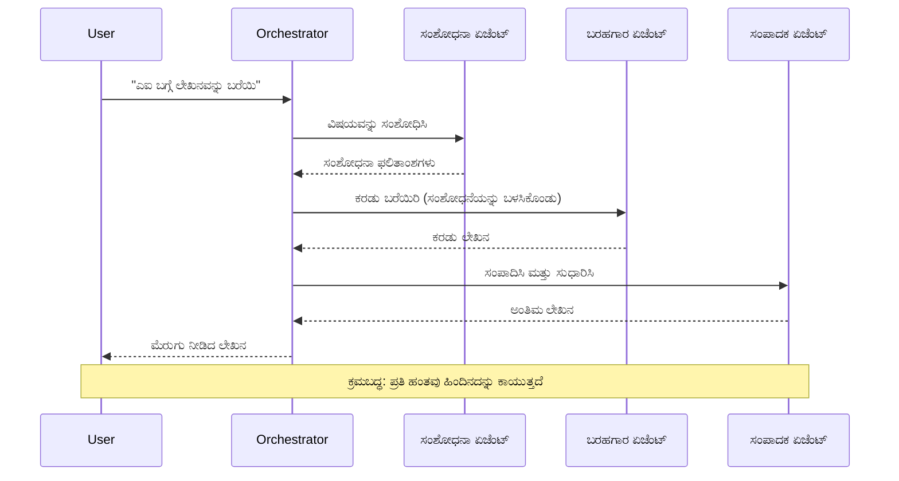

<!--
CO_OP_TRANSLATOR_METADATA:
{
  "original_hash": "bcefbd5d0107691ef3e6e33ba694d6f4",
  "translation_date": "2025-11-24T23:02:52+00:00",
  "source_file": "docs/pre-deployment/coordination-patterns.md",
  "language_code": "kn"
}
-->
# ಬಹು-ಏಜೆಂಟ್ ಸಮನ್ವಯ ಮಾದರಿಗಳು

⏱️ **ಅಂದಾಜು ಸಮಯ**: 60-75 ನಿಮಿಷಗಳು | 💰 **ಅಂದಾಜು ವೆಚ್ಚ**: ~$100-300/ತಿಂಗಳು | ⭐ **ಸಂಕೀರ್ಣತೆ**: ಉನ್ನತ ಮಟ್ಟ

**📚 ಕಲಿಕೆಯ ಪಥ:**
- ← ಹಿಂದಿನ: [ಕ್ಷಮತೆ ಯೋಜನೆ](capacity-planning.md) - ಸಂಪತ್ತು ಗಾತ್ರ ಮತ್ತು ವಿಸ್ತರಣೆ ತಂತ್ರಗಳು
- 🎯 **ನೀವು ಇಲ್ಲಿ ಇದ್ದೀರಿ**: ಬಹು-ಏಜೆಂಟ್ ಸಮನ್ವಯ ಮಾದರಿಗಳು (ಆರ್ಕೆಸ್ಟ್ರೇಷನ್, ಸಂವಹನ, ಸ್ಥಿತಿ ನಿರ್ವಹಣೆ)
- → ಮುಂದಿನ: [SKU ಆಯ್ಕೆ](sku-selection.md) - ಸರಿಯಾದ Azure ಸೇವೆಗಳನ್ನು ಆಯ್ಕೆ ಮಾಡುವುದು
- 🏠 [ಪಾಠದ ಮನೆ](../../README.md)

---

## ನೀವು ಏನು ಕಲಿಯುತ್ತೀರಿ

ಈ ಪಾಠವನ್ನು ಪೂರ್ಣಗೊಳಿಸುವ ಮೂಲಕ, ನೀವು:
- **ಬಹು-ಏಜೆಂಟ್ ಆರ್ಕಿಟೆಕ್ಚರ್** ಮಾದರಿಗಳನ್ನು ಮತ್ತು ಅವುಗಳನ್ನು ಯಾವಾಗ ಬಳಸಬೇಕು ಎಂಬುದನ್ನು ಅರ್ಥಮಾಡಿಕೊಳ್ಳುತ್ತೀರಿ
- **ಆರ್ಕೆಸ್ಟ್ರೇಷನ್ ಮಾದರಿಗಳನ್ನು** (ಕೇಂದ್ರಿತ, ವಿಕೇಂದ್ರೀಕೃತ, ಹೈರಾರ್ಕಿಕ) ಅನುಷ್ಠಾನಗೊಳಿಸುತ್ತೀರಿ
- **ಏಜೆಂಟ್ ಸಂವಹನ** ತಂತ್ರಗಳನ್ನು ವಿನ್ಯಾಸಗೊಳಿಸುತ್ತೀರಿ (ಸಮಕಾಲೀನ, ಅಸಮಕಾಲೀನ, ಈವೆಂಟ್-ಚಾಲಿತ)
- ವಿತರಿತ ಏಜೆಂಟ್‌ಗಳಾದ್ಯಂತ **ಹಂಚಿದ ಸ್ಥಿತಿಯನ್ನು ನಿರ್ವಹಿಸುತ್ತೀರಿ**
- AZD ಬಳಸಿ **ಬಹು-ಏಜೆಂಟ್ ವ್ಯವಸ್ಥೆಗಳನ್ನು** Azure ನಲ್ಲಿ ನಿಯೋಜಿಸುತ್ತೀರಿ
- ನೈಜ ಜಗತ್ತಿನ AI ಸನ್ನಿವೇಶಗಳಿಗೆ **ಸಮನ್ವಯ ಮಾದರಿಗಳನ್ನು** ಅನ್ವಯಿಸುತ್ತೀರಿ
- ವಿತರಿತ ಏಜೆಂಟ್ ವ್ಯವಸ್ಥೆಗಳನ್ನು **ನಿರೀಕ್ಷಿಸಿ ಮತ್ತು ಡೀಬಗ್** ಮಾಡುತ್ತೀರಿ

## ಬಹು-ಏಜೆಂಟ್ ಸಮನ್ವಯದ ಮಹತ್ವ

### ಪ್ರಗತಿ: ಏಕ ಏಜೆಂಟ್‌ನಿಂದ ಬಹು-ಏಜೆಂಟ್‌ಗೆ

**ಏಕ ಏಜೆಂಟ್ (ಸರಳ):**
```
User → Agent → Response
```
- ✅ ಅರ್ಥಮಾಡಿಕೊಳ್ಳಲು ಮತ್ತು ಅನುಷ್ಠಾನಗೊಳಿಸಲು ಸುಲಭ
- ✅ ಸರಳ ಕಾರ್ಯಗಳಿಗೆ ವೇಗವಾದದು
- ❌ ಏಕ ಮಾದರಿಯ ಸಾಮರ್ಥ್ಯಗಳಿಗೆ ಮಿತಿಯಿದೆ
- ❌ ಸಂಕೀರ್ಣ ಕಾರ್ಯಗಳನ್ನು ಸಮಾಂತರಗೊಳಿಸಲು ಸಾಧ್ಯವಿಲ್ಲ
- ❌ ವಿಶೇಷೀಕರಣವಿಲ್ಲ

**ಬಹು-ಏಜೆಂಟ್ ವ್ಯವಸ್ಥೆ (ಉನ್ನತ):**
```
           ┌─────────────┐
           │ Orchestrator│
           └──────┬──────┘
        ┌─────────┼─────────┐
        │         │         │
    ┌───▼──┐  ┌──▼───┐  ┌──▼────┐
    │Agent1│  │Agent2│  │Agent3 │
    │(Plan)│  │(Code)│  │(Review)│
    └──────┘  └──────┘  └───────┘
```
- ✅ ನಿರ್ದಿಷ್ಟ ಕಾರ್ಯಗಳಿಗೆ ವಿಶೇಷೀಕೃತ ಏಜೆಂಟ್‌ಗಳು
- ✅ ವೇಗಕ್ಕಾಗಿ ಸಮಾಂತರ ಕಾರ್ಯಗತಗೊಳಿಸುವಿಕೆ
- ✅ ಮಾಡ್ಯುಲರ್ ಮತ್ತು ನಿರ್ವಹಣೀಯ
- ✅ ಸಂಕೀರ್ಣ ಕಾರ್ಯಪ್ರವಾಹಗಳಲ್ಲಿ ಉತ್ತಮ
- ⚠️ ಸಮನ್ವಯ ತರ್ಕವನ್ನು ಅಗತ್ಯವಿದೆ

**ಉದಾಹರಣೆ**: ಏಕ ಏಜೆಂಟ್ ಎಲ್ಲ ಕೆಲಸಗಳನ್ನು ಮಾಡುವ ಒಬ್ಬ ವ್ಯಕ್ತಿಯಂತೆ. ಬಹು-ಏಜೆಂಟ್ ಪ್ರತಿ ಸದಸ್ಯನಿಗೂ (ಶೋಧಕ, ಕೋಡರ್, ವಿಮರ್ಶಕ, ಬರಹಗಾರ) ವಿಶೇಷ ಕೌಶಲ್ಯಗಳಿರುವ ತಂಡದಂತೆ.

---

## ಮುಖ್ಯ ಸಮನ್ವಯ ಮಾದರಿಗಳು

### ಮಾದರಿ 1: ಕ್ರಮಬದ್ಧ ಸಮನ್ವಯ (ಚೈನ್ ಆಫ್ ರೆಸ್ಪಾನ್ಸಿಬಿಲಿಟಿ)

**ಯಾವಾಗ ಬಳಸಬೇಕು**: ಕಾರ್ಯಗಳು ನಿರ್ದಿಷ್ಟ ಕ್ರಮದಲ್ಲಿ ಪೂರ್ಣಗೊಳ್ಳಬೇಕು, ಪ್ರತಿ ಏಜೆಂಟ್ ಹಿಂದಿನ ಔಟ್‌ಪುಟ್‌ನ ಮೇಲೆ ನಿರ್ಮಿಸುತ್ತದೆ.


**ಲಾಭಗಳು:**
- ✅ ಸ್ಪಷ್ಟ ಡೇಟಾ ಹರಿವು
- ✅ ಡೀಬಗ್ ಮಾಡಲು ಸುಲಭ
- ✅ ನಿರೀಕ್ಷಿತ ಕಾರ್ಯಗತಗತಗತಗತಗತಗತಗತಗತಗತಗತಗತಗತಗತಗತಗತಗತಗತಗತಗತಗತಗತಗತಗತಗತಗತಗತಗತಗತಗತಗತಗತಗತಗತಗತಗತಗತಗತಗತಗತಗತಗತಗತಗತಗತಗತಗತಗತಗತಗತಗತಗತಗತಗತಗತಗತಗತಗತಗತಗತಗತಗತಗತಗತಗತಗತಗತಗತಗತಗತಗತಗತಗತಗತಗತಗತಗತಗತಗತಗತಗತಗತಗತಗತಗತಗತಗತಗತಗತಗತಗತಗತಗತಗತಗತಗತಗತಗತಗತಗತಗತಗತಗತಗತಗತಗತಗತಗತಗತಗತಗತಗತಗತಗತಗತಗತಗತಗತಗತಗತಗತಗತಗತಗತಗತಗತಗತಗತಗತಗತಗತಗತಗತಗತಗತಗತಗತಗತಗತಗತಗತಗತಗತಗತಗತಗತಗತಗತಗತಗತಗತಗತಗತಗತಗತಗತಗತಗತಗತಗತಗತಗತಗತಗತಗತಗತಗತಗತಗತಗತಗತಗತಗತಗತಗತಗತಗತಗತಗತಗತಗತಗತಗತಗತಗತಗತಗತಗತಗತಗತಗತಗತಗತಗತಗತಗತಗತಗತಗತಗತಗತಗತಗತಗತಗತಗತಗತಗತಗತಗತಗತಗತಗತಗತಗತಗತಗತಗತಗತಗತಗತಗತಗತಗತಗತಗತಗತಗತಗತಗತಗತಗತಗತಗತಗತಗತಗತಗತಗತಗತಗತಗತಗತಗತಗತಗತಗತಗತಗತಗತಗತಗತಗತಗತಗತಗತಗತಗತಗತಗತಗತಗತಗತಗತಗತಗತಗತಗತಗತಗತಗತಗತಗತಗತಗತಗತಗತಗತಗತಗತಗತಗತಗತಗತಗತಗತಗತಗತಗತಗತಗತಗತಗತಗತಗತಗತಗತಗತಗತಗತಗತಗತಗತಗತಗತಗತಗತಗತಗತಗತಗತಗತಗತಗತಗತಗತಗತಗತಗತಗತಗತಗತಗತಗತಗತಗತಗತಗತಗತಗತಗತಗತಗತಗತಗತಗತಗತಗತಗತಗತಗತಗತಗತಗತಗತಗತಗತಗತಗತಗತಗತಗತಗತಗತಗತಗತಗತಗತಗತಗತಗತಗತಗತಗತಗತಗತಗತಗತಗತಗತಗತಗತಗತಗತಗತಗತಗತಗತಗತಗತಗತಗತಗತಗತಗತಗತಗತಗತಗತಗತಗತಗತಗತಗತಗತಗತಗತಗತಗತಗತಗತಗತಗತಗತಗತಗತಗತಗತಗತಗತಗತಗತಗತಗತಗತಗತಗತಗತಗತಗತಗತಗತಗತಗತಗತಗತಗತಗತಗತಗತಗತಗತಗತಗತಗತಗತಗತಗತಗತಗತಗತಗತಗತಗತಗತಗತಗತಗತಗತಗತಗತಗತಗತಗತಗತಗತಗತಗತಗತಗತಗತಗತಗತಗತಗತಗತಗತಗತಗತಗತಗತಗತಗತಗತಗತಗತಗತಗತಗತಗತಗತಗತಗತಗತಗತಗತಗತಗತಗತಗತಗತಗತಗತಗತಗತಗತಗತಗತಗತಗತಗತಗತಗತಗತಗತಗತಗತಗತಗತಗತಗತಗತಗತಗತಗತಗತಗತಗತಗತಗತಗತಗತಗತಗತಗತಗತಗತಗತಗತಗತಗತಗತಗತಗತಗತಗತಗತಗತಗತಗತಗತಗತಗತಗತಗತಗತಗತಗತಗತಗತಗತಗತಗತಗತಗತಗತಗತಗತಗತಗತಗತಗತಗತಗತಗತಗತಗತಗತಗತಗತಗತಗತಗತಗತಗತಗತಗತಗತಗತಗತಗತಗತಗತಗತಗತಗತಗತಗತಗತಗತಗತಗತಗತಗತಗತಗತಗತಗತಗತಗತಗತಗತಗತಗತಗತಗತಗತಗತಗತಗತಗತಗತಗತಗತಗತಗತಗತಗತಗತಗತಗತಗತಗತಗತಗತಗತಗತಗತಗತಗತಗತಗತಗತಗತಗತಗತಗತಗತಗತಗತಗತಗತಗತಗತಗತಗತಗತಗತಗತಗತಗತಗತಗತಗತಗತಗತಗತಗತಗತಗತಗತಗತಗತಗತಗತಗತಗತಗತಗತಗತಗತಗತಗತಗತಗತಗತಗತಗತಗತಗತಗತಗತಗತಗತಗತಗತಗತಗತಗತಗತಗತಗತಗತಗತಗತಗತಗತಗತಗತಗತಗತಗತಗತಗತಗತಗತಗತಗತಗತಗತಗತಗತಗತಗತಗತಗತಗತಗತಗತಗತಗತಗತಗತಗತಗತಗತಗತಗತಗತಗತಗತಗತಗತಗತಗತಗತಗತಗತಗತಗತಗತಗತಗತಗತಗತಗತಗತಗತಗತಗತಗತಗತಗತಗತಗತಗತಗತಗತಗತಗತಗತಗತಗತಗತಗತಗತಗತಗತಗತಗತಗತಗತಗತಗತಗತಗತಗತಗತಗತಗತಗತಗತಗತಗತಗತಗತಗತಗತಗತಗತಗತಗತಗತಗತಗತಗತಗತಗತಗತಗತಗತಗತಗತಗತಗತಗತಗತಗತಗತಗತಗತಗತಗತಗತಗತಗತಗತಗತಗತಗತಗತಗತಗತಗತಗತಗತಗತಗತಗತಗತಗತಗತಗತಗತಗತಗತಗತಗತಗತಗತಗತಗತಗತಗತಗತಗತಗತಗತಗತಗತಗತಗತಗತಗತಗತಗತಗತಗತಗತಗತಗತಗತಗತಗತಗತಗತಗತಗತಗತಗತಗತಗತಗತಗತಗತಗತಗತಗತಗತಗತಗತಗತಗತಗತಗತಗತಗತಗತಗತಗತಗತಗತಗತಗತಗತಗತಗತಗತಗತಗತಗತಗತಗತಗತಗತಗತಗತಗತಗತಗತಗತಗತಗತಗತಗತಗತಗತಗತಗತಗತಗತಗತಗತಗತಗತಗತಗತಗತಗತಗತಗತಗತಗತಗತಗತಗತಗತಗತಗತಗತಗತಗತಗತಗತಗತಗತಗತಗತಗತಗತಗತಗತಗತಗತಗತಗತಗತಗತಗತಗತಗತಗತಗತಗತಗತಗತಗತಗತಗತಗತಗತಗತಗತಗತಗತಗತಗತಗತಗತಗತಗತಗತಗತಗತಗತಗತಗತಗತಗತಗತಗತಗತಗತಗತಗತಗತಗತಗತಗತಗತಗತಗತಗತಗತಗತಗತಗತಗತಗತಗತಗತಗತಗತಗತಗತಗತಗತಗತಗತಗತಗತಗತಗತಗತಗತಗತಗತಗತಗತಗತಗತಗತಗತಗತಗತಗತಗತಗತಗತಗತಗತಗತಗತಗತಗತಗತಗತಗತಗತಗತಗತಗತಗತಗತಗತಗತಗತಗತಗತಗತಗತಗತಗತಗತಗತಗತಗತಗತಗತಗತಗತಗತಗತಗತಗತಗತಗತಗತಗತಗತಗತಗತಗತಗತಗತಗತಗತಗತಗತಗತಗತಗತಗತಗತಗತಗತಗತಗತಗತಗತಗತಗತಗತಗತಗತಗತಗತಗತಗತಗತಗತಗತಗತಗತಗತಗತಗತಗತಗತಗತಗತಗತಗತಗತಗತಗತಗತಗತಗತಗತಗತಗತಗತಗತಗತಗತಗತಗತಗತಗತಗತಗತಗತಗತಗತಗತಗತಗತಗತಗತಗತಗತಗತಗತಗತಗತಗತಗತಗತಗತಗತಗತಗತಗತಗತಗತಗತಗತಗತಗತಗತಗತಗತಗತಗತಗತಗತಗತಗತಗತಗತಗತಗತಗತಗತಗತಗತಗತಗತಗತಗತಗತಗತಗತಗತಗತಗತಗತಗತಗತಗತಗತಗತಗತಗತಗತಗತಗತಗತಗತಗತಗತಗತಗತಗತಗತಗತಗತಗತಗತಗತಗತಗತಗತಗತಗತಗತಗತಗತಗತಗತಗತಗತಗತಗತಗತಗತಗತಗತಗತಗತಗತಗತಗತಗತಗತಗತಗತಗತಗತಗತಗತಗತಗತಗತಗತಗತಗತಗತಗತಗತಗತಗತಗತಗತಗತಗತಗತಗತಗತಗತಗತಗತಗತಗತಗತಗತಗತಗತಗತಗತಗತಗತಗತಗತಗತಗತಗತಗತಗತಗತಗತಗತಗತಗತಗತಗತಗತಗತಗತಗತಗತಗತಗತಗತಗತಗತಗತಗತಗತಗತಗತಗತಗತಗತಗತಗತಗತಗತಗತಗತಗತಗತಗತಗತಗತಗತಗತಗತಗತಗತಗತಗತಗತಗತಗತಗತಗತಗತಗತಗತಗತಗತಗತಗತಗತಗತಗತಗತಗತಗತಗತಗತಗತಗತಗತಗತಗತಗತಗತಗತಗತಗತಗತಗತಗತಗತಗತಗತಗತಗತಗತಗತಗತಗತಗತಗತಗತಗತಗತಗತಗತಗತಗತಗತಗತಗತಗತಗತಗತಗತಗತಗತಗತಗತಗತಗತಗತಗತಗತಗತಗತಗತಗತಗತಗತಗತಗತಗತಗತಗತಗತಗತಗತಗತಗತಗತಗತಗತಗತಗತಗತಗತಗತಗತಗತಗತಗತಗತಗತಗತಗತಗತಗತಗತಗತಗತಗತಗತಗತಗತಗತಗತಗತಗತಗತಗತಗತಗತಗತಗತಗತಗತಗತಗತಗತಗತಗತಗತಗತಗತಗತಗತಗತಗತಗತಗತಗತಗತಗತಗತಗತಗತಗತಗತಗತಗತಗತಗತಗತಗತಗತಗತಗತಗತಗತಗತಗತಗತಗತಗತಗತಗತಗತಗತಗತಗತಗತಗತಗತಗತಗತಗತಗತಗತಗತಗತಗತಗತಗತಗತಗತಗತಗತಗತಗತಗತಗತಗತಗತಗತಗತಗತಗತಗತಗತಗತಗತಗತಗತಗತಗತಗತಗತಗತಗತಗತಗತಗತಗತಗತಗತಗತಗತಗತಗತಗತಗತಗತಗತಗತಗತಗತಗತಗತಗತಗತಗತಗತಗತಗತಗತಗತಗತಗತಗತಗತಗತಗತಗತಗತಗತಗತಗತಗತಗತಗತಗತಗತಗತಗತಗತಗತಗತಗತಗತಗತಗತಗತಗತಗತಗತಗತಗತಗತಗತಗತಗತಗತಗತಗತಗತಗತಗತಗತಗತಗತಗತಗತಗತಗತಗತಗತಗತ
## ತೊಂದರೆ ಪರಿಹಾರ ಮಾರ್ಗದರ್ಶಿ

### ಸಮಸ್ಯೆ: ಸಂದೇಶಗಳು ಕ್ಯೂನಲ್ಲಿ ಸಿಲುಕಿವೆ

**ಲಕ್ಷಣಗಳು:**
- ಸಂದೇಶಗಳು ಕ್ಯೂನಲ್ಲಿ ಜಮೆಯಾಗುತ್ತವೆ
- ಏಜೆಂಟ್‌ಗಳು ಪ್ರಕ್ರಿಯೆಗೊಳಿಸುತ್ತಿಲ್ಲ
- ಕಾರ್ಯ ಸ್ಥಿತಿ "pending" ನಲ್ಲಿ ಸಿಲುಕಿದೆ

**ನಿರ್ಣಯ:**
```bash
# ಕ್ಯೂ ಆಳವನ್ನು ಪರಿಶೀಲಿಸಿ
az servicebus queue show \
  --namespace-name mybus \
  --name research-tasks \
  --query "countDetails"

# ಏಜೆಂಟ್ ಆರೋಗ್ಯವನ್ನು ಪರಿಶೀಲಿಸಿ
azd logs research-agent --tail 50
```

**ಪರಿಹಾರಗಳು:**

1. **ಏಜೆಂಟ್ ಪ್ರತಿಗಳನ್ನು ಹೆಚ್ಚಿಸಿ:**
   ```bash
   az containerapp update \
     --name research-agent \
     --min-replicas 3 \
     --max-replicas 10
   ```

2. **ಡೆಡ್ ಲೆಟರ್ ಕ್ಯೂ ಪರಿಶೀಲಿಸಿ:**
   ```bash
   az servicebus queue show \
     --namespace-name mybus \
     --name research-tasks \
     --query "countDetails.deadLetterMessageCount"
   ```

---

### ಸಮಸ್ಯೆ: ಕಾರ್ಯ ಟೈಮ್‌ಔಟ್/ಪೂರ್ಣಗೊಳ್ಳುವುದಿಲ್ಲ

**ಲಕ್ಷಣಗಳು:**
- ಕಾರ್ಯ ಸ್ಥಿತಿ "in_progress" ನಲ್ಲಿ ಉಳಿಯುತ್ತದೆ
- ಕೆಲವು ಏಜೆಂಟ್‌ಗಳು ಪೂರ್ಣಗೊಳಿಸುತ್ತವೆ, ಇತರರು ಪೂರ್ಣಗೊಳಿಸುತ್ತಿಲ್ಲ
- ಯಾವುದೇ ದೋಷ ಸಂದೇಶಗಳಿಲ್ಲ

**ನಿರ್ಣಯ:**
```bash
# ಕಾರ್ಯದ ಸ್ಥಿತಿಯನ್ನು ಪರಿಶೀಲಿಸಿ
curl $ORCHESTRATOR_URL/task/$TASK_ID

# ಅಪ್ಲಿಕೇಶನ್ ಇನ್‌ಸೈಟ್ಸ್ ಪರಿಶೀಲಿಸಿ
# ಕ್ವೆರಿ ಚಲಾಯಿಸಿ: traces | where customDimensions.task_id == "..."
```

**ಪರಿಹಾರಗಳು:**

1. **ಅಗ್ರಿಗೇಟರ್‌ನಲ್ಲಿ ಟೈಮ್‌ಔಟ್ ಅನ್ನು ಜಾರಿಗೆ ತರುವಿರಿ (ಅಭ್ಯಾಸ 1)**

2. **ಏಜೆಂಟ್ ವೈಫಲ್ಯಗಳನ್ನು ಪರಿಶೀಲಿಸಿ:**
   ```bash
   azd logs --follow | grep "ERROR\|FAIL"
   ```

3. **ಎಲ್ಲಾ ಏಜೆಂಟ್‌ಗಳು ಕಾರ್ಯನಿರ್ವಹಿಸುತ್ತಿರುವುದನ್ನು ದೃಢೀಕರಿಸಿ:**
   ```bash
   az containerapp list \
     --resource-group rg-agents \
     --query "[].{name:name, status:properties.runningStatus}"
   ```

---

## ಇನ್ನಷ್ಟು ತಿಳಿಯಿರಿ

### ಅಧಿಕೃತ ಡಾಕ್ಯುಮೆಂಟೇಶನ್
- [Azure Service Bus](https://learn.microsoft.com/azure/service-bus-messaging/service-bus-messaging-overview)
- [Cosmos DB](https://learn.microsoft.com/azure/cosmos-db/introduction)
- [Container Apps DAPR](https://learn.microsoft.com/azure/container-apps/dapr-overview)
- [Multi-Agent Design Patterns](https://learn.microsoft.com/azure/architecture/guide/ai/multi-agent-systems)

### ಈ ಕೋರ್ಸ್‌ನ ಮುಂದಿನ ಹಂತಗಳು
- ← ಹಿಂದಿನದು: [ಕ್ಷಮತೆ ಯೋಜನೆ](capacity-planning.md)
- → ಮುಂದಿನದು: [SKU ಆಯ್ಕೆ](sku-selection.md)
- 🏠 [ಕೋರ್ಸ್ ಹೋಮ್](../../README.md)

### ಸಂಬಂಧಿತ ಉದಾಹರಣೆಗಳು
- [ಮೈಕ್ರೋಸರ್ವಿಸ್‌ಗಳ ಉದಾಹರಣೆ](../../../../examples/microservices) - ಸೇವಾ ಸಂವಹನ ಮಾದರಿಗಳು
- [Azure OpenAI ಉದಾಹರಣೆ](../../../../examples/azure-openai-chat) - AI ಏಕೀಕರಣ

---

## ಸಾರಾಂಶ

**ನೀವು ಕಲಿತಿದ್ದೀರಿ:**
- ✅ ಐದು ಸಂಯೋಜನಾ ಮಾದರಿಗಳು (ಕ್ರಮಬದ್ಧ, ಸಮಾಂತರ, ಹಿರಾರ್ಕಿಕ, ಈವೆಂಟ್ ಚಾಲಿತ, ಒಪ್ಪಿಗೆ)
- ✅ Azure ನಲ್ಲಿ ಬಹು-ಏಜೆಂಟ್ ಆರ್ಕಿಟೆಕ್ಚರ್ (Service Bus, Cosmos DB, Container Apps)
- ✅ ವಿತರಿತ ಏಜೆಂಟ್‌ಗಳಾದ್ಯಂತ ಸ್ಥಿತಿಯನ್ನು ನಿರ್ವಹಿಸುವುದು
- ✅ ಟೈಮ್‌ಔಟ್ ಹ್ಯಾಂಡ್ಲಿಂಗ್, ಮರುಪ್ರಯತ್ನಗಳು, ಮತ್ತು ಸರ್ಕ್ಯೂಟ್ ಬ್ರೇಕರ್‌ಗಳು
- ✅ ವಿತರಿತ ವ್ಯವಸ್ಥೆಗಳ ನಿಗಾವಹನೆ ಮತ್ತು ಡೀಬಗಿಂಗ್
- ✅ ವೆಚ್ಚ ಆಪ್ಟಿಮೈಜೇಶನ್ ತಂತ್ರಗಳು

**ಮುಖ್ಯ ಅಂಶಗಳು:**
1. **ಸರಿಯಾದ ಮಾದರಿಯನ್ನು ಆಯ್ಕೆಮಾಡಿ** - ಕ್ರಮಬದ್ಧವು ಕ್ರಮಬದ್ಧ ಕಾರ್ಯಪ್ರವಾಹಗಳಿಗೆ, ಸಮಾಂತರವು ವೇಗಕ್ಕೆ, ಈವೆಂಟ್ ಚಾಲಿತವು ಲಚ್ಯತೆಯಿಗಾಗಿ
2. **ಸ್ಥಿತಿಯನ್ನು ಎಚ್ಚರಿಕೆಯಿಂದ ನಿರ್ವಹಿಸಿ** - ಹಂಚಿದ ಸ್ಥಿತಿಗಾಗಿ Cosmos DB ಅಥವಾ ಸಮಾನವನ್ನು ಬಳಸಿ
3. **ವೈಫಲ್ಯಗಳನ್ನು ಸುಗಮವಾಗಿ ನಿರ್ವಹಿಸಿ** - ಟೈಮ್‌ಔಟ್‌ಗಳು, ಮರುಪ್ರಯತ್ನಗಳು, ಸರ್ಕ್ಯೂಟ್ ಬ್ರೇಕರ್‌ಗಳು, ಡೆಡ್ ಲೆಟರ್ ಕ್ಯೂಗಳು
4. **ಎಲ್ಲವನ್ನೂ ನಿಗಾವಹಿಸಿ** - ವಿತರಿತ ಟ್ರೇಸಿಂಗ್ ಡೀಬಗಿಂಗ್‌ಗಾಗಿ ಅತ್ಯಗತ್ಯ
5. **ವೆಚ್ಚವನ್ನು ಆಪ್ಟಿಮೈಸ್ ಮಾಡಿ** - ಶೂನ್ಯಕ್ಕೆ ಸ್ಕೇಲ್ ಮಾಡಿ, ಸರ್ವರ್‌ಲೆಸ್ ಬಳಸಿ, ಕ್ಯಾಶಿಂಗ್ ಜಾರಿಗೆ ತರುವಿರಿ

**ಮುಂದಿನ ಹಂತಗಳು:**
1. ಪ್ರಾಯೋಗಿಕ ಅಭ್ಯಾಸಗಳನ್ನು ಪೂರ್ಣಗೊಳಿಸಿ
2. ನಿಮ್ಮ ಬಳಕೆ ಪ್ರಕರಣಕ್ಕಾಗಿ ಬಹು-ಏಜೆಂಟ್ ವ್ಯವಸ್ಥೆಯನ್ನು ನಿರ್ಮಿಸಿ
3. ಕಾರ್ಯಕ್ಷಮತೆ ಮತ್ತು ವೆಚ್ಚವನ್ನು ಆಪ್ಟಿಮೈಸ್ ಮಾಡಲು [SKU ಆಯ್ಕೆ](sku-selection.md) ಅಧ್ಯಯನ ಮಾಡಿ

---

<!-- CO-OP TRANSLATOR DISCLAIMER START -->
**ಅಸಮಾಕ್ಷಿಕೆ**:  
ಈ ದಸ್ತಾವೇಜು AI ಅನುವಾದ ಸೇವೆ [Co-op Translator](https://github.com/Azure/co-op-translator) ಬಳಸಿ ಅನುವಾದಿಸಲಾಗಿದೆ. ನಾವು ನಿಖರತೆಯಿಗಾಗಿ ಪ್ರಯತ್ನಿಸುತ್ತಿದ್ದರೂ, ದಯವಿಟ್ಟು ಗಮನಿಸಿ, ಸ್ವಯಂಚಾಲಿತ ಅನುವಾದಗಳಲ್ಲಿ ತಪ್ಪುಗಳು ಅಥವಾ ಅಸಡ್ಡೆಗಳು ಇರಬಹುದು. ಮೂಲ ಭಾಷೆಯಲ್ಲಿರುವ ಮೂಲ ದಸ್ತಾವೇಜು ಪ್ರಾಮಾಣಿಕ ಮೂಲವೆಂದು ಪರಿಗಣಿಸಬೇಕು. ಮಹತ್ವದ ಮಾಹಿತಿಗಾಗಿ, ವೃತ್ತಿಪರ ಮಾನವ ಅನುವಾದವನ್ನು ಶಿಫಾರಸು ಮಾಡಲಾಗುತ್ತದೆ. ಈ ಅನುವಾದವನ್ನು ಬಳಸುವ ಮೂಲಕ ಉಂಟಾಗುವ ಯಾವುದೇ ತಪ್ಪು ಅರ್ಥಗಳ ಅಥವಾ ತಪ್ಪು ವ್ಯಾಖ್ಯಾನಗಳ ಬಗ್ಗೆ ನಾವು ಹೊಣೆಗಾರರಲ್ಲ.
<!-- CO-OP TRANSLATOR DISCLAIMER END -->