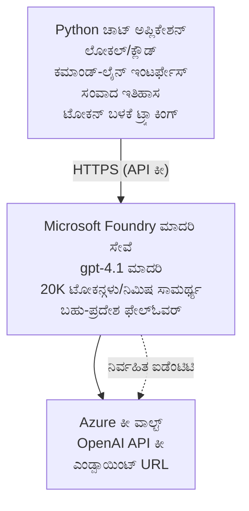

# Microsoft Foundry Models Chat Application

**Learning Path:** ಮಧ್ಯಮ ⭐⭐ | **Time:** 35-45 minutes | **Cost:** $50-200/month

Azure Developer CLI (azd) ಬಳಸಿಕೊಂಡು ನಿಯೋಜಿಸಲಾದ ಸಂಪೂರ್ಣ Microsoft Foundry Models ಚಾಟ್ ಅಪ್ಲಿಕೇಶನ್. ಈ ಉದಾಹರಣೆ gpt-4.1 ನಿಯೋಜನೆ, ಸುರಕ್ಷಿತ API ಪ್ರವೇಶ ಮತ್ತು ಸರಳ ಚಾಟ್ ಇಂಟರ್ಫೇಸ್ ಅನ್ನು ಪ್ರದರ್ಶಿಸುತ್ತದೆ.

## 🎯 ನೀವು ಏನು ಕಲಿಯುತ್ತೀರಿ

- gpt-4.1 ಮಾದರಿಯನ್ನು ಬಳಸಿಕೊಂಡು Microsoft Foundry Models ಸೇವೆಯನ್ನು ನಿಯೋಜಿಸುವುದು  
- Key Vault ಬಳಸಿ OpenAI API ಕೀಗಳನ್ನು ಸುರಕ್ಷಿತಗೊಳಿಸುವುದು  
- Python ಬಳಸಿ ಸರಳ ಚಾಟ್ ಇಂಟರ್ಫೇಸ್ ನಿರ್ಮಿಸುವುದು  
- ಟೋಕನ್ ಬಳಕೆ ಮತ್ತು ವೆಚ್ಚಗಳನ್ನು ಟ್ರ್ಯಾಕ್ ಮಾಡುವುದು  
- ರೇಟ್ ಲಿಮಿಟಿಂಗ್ ಮತ್ತು ದೋಷ ನಿರ್ವಹಣೆ ಅನುಷ್ಠಾನಗೊಳಿಸುವುದು

## 📦 ಏನು ಸೇರಿದೆ

✅ **Microsoft Foundry Models Service** - gpt-4.1 ಮಾದರಿ ನಿಯೋಜನೆ  
✅ **Python Chat App** - ಸರಳ ಕಮಾಂಡ್-ಲೈನ್ ಚಾಟ್ ಇಂಟರ್ಫೇಸ್  
✅ **Key Vault Integration** - API ಕೀಲಿಗಳನ್ನು ಸುರಕ್ಷಿತ ಪ್ರ хранства  
✅ **ARM Templates** - ಕೋಡ್ ರೂಪದಲ್ಲಿ ಸಂಪೂರ್ಣ ಮೂಲಸೌಕರ್ಯ  
✅ **Cost Monitoring** - ಟೋಕನ್ ಬಳಕೆಯನ್ನು ಟ್ರ್ಯಾಕ್ ಮಾಡುವುದು  
✅ **Rate Limiting** - ಕೋಟಾ ಉತ್ಸಾಹದ ನಿರೋಧನೆ  

## Architecture



## Prerequisites

### Required

- **Azure Developer CLI (azd)** - [ಸ್ಥಾಪನೆ ಮಾರ್ಗದರ್ಶಿ](https://learn.microsoft.com/azure/developer/azure-developer-cli/install-azd)
- **Azure ಚಂದಾದಾರಿಕೆ** with OpenAI access - [ಪ್ರವೇಶಕ್ಕಾಗಿ ವಿನಂತಿ](https://aka.ms/oai/access)
- **Python 3.9+** - [Python ಸ್ಥಾಪಿಸಿ](https://www.python.org/downloads/)

### Verify Prerequisites

```bash
# azd ಆವೃತ್ತಿಯನ್ನು ಪರಿಶೀಲಿಸಿ (ಕನಿಷ್ಠ 1.5.0 ಅಥವಾ ಅದಕ್ಕಿಂತ ಮೇಲಿನದು ಬೇಕು)
azd version

# Azure ಲಾಗಿನ್ ಪರಿಶೀಲಿಸಿ
azd auth login

# Python ಆವೃತ್ತಿಯನ್ನು ಪರಿಶೀಲಿಸಿ
python --version  # ಅಥವಾ python3 --version

# OpenAI ಪ್ರವೇಶವನ್ನು ಪರಿಶೀಲಿಸಿ (Azure ಪೋರ್ಟಲ್‌ನಲ್ಲಿ ಪರಿಶೀಲಿಸಿ)
az cognitiveservices account list-skus \
  --kind OpenAI \
  --location eastus
```

> **⚠️ Important:** Microsoft Foundry Models ಅಪ್ಲಿಕೇಶನ್ ಅಫ್ರೂವಲ್ ಅಗತ್ಯವಿದೆ. ನೀವು ಅರ್ಜಿ ಸಲ್ಲಿಸದಿದ್ದರೆ, ಭೇಟಿ ನೀಡಿ [aka.ms/oai/access](https://aka.ms/oai/access). ಅಫ್ರೂವಲ್ ಸಾಮಾನ್ಯವಾಗಿ 1-2 ಕೆಲಸದ ದಿನಗಳು ತೆಗೆದುಕೊಂಡಿದೆ.

## ⏱️ ನಿಯೋಜನೆ ಸಮಯರೇಖೆ

| ಹಂತ | ಅವಧಿ | ಏನಾಗುತ್ತದೆ |
|-------|----------|--------------|
| ಆವಶ್ಯಕತೆಗಳ ಪರಿಶೀಲನೆ | 2-3 minutes | OpenAI ಕೊಟಾ ಲಭ್ಯತೆಯನ್ನು ಪರಿಶೀಲಿಸಲಾಗುತ್ತದೆ |
| ಮೂಲಸೌಕರ್ಯ ನಿಯೋಜನೆ | 8-12 minutes | OpenAI, Key Vault, ಮಾದರಿ ನಿಯೋಜನೆವನ್ನು ರಚಿಸಲಾಗುತ್ತದೆ |
| ಅಪ್ಲಿಕೇಶನ್ ಸಂರಚನೆ | 2-3 minutes | ಪರಿಸರ ಮತ್ತು ಅವಲಂಬನೆಗಳನ್ನು ಹೊಂದಿಸಲಾಗುತ್ತದೆ |
| **ಒಟ್ಟು** | **12-18 minutes** | gpt-4.1 ಜೊತೆ ಚಾಟ್ ಮಾಡಲು ಸಿದ್ದವಾಗಿದೆ |

** ಟಿಪ್ಪಣಿ:** ಮೊದಲಬಾರಿಗೆ OpenAI ನಿಯೋಜನೆಗೆ ಮಾದರಿ ಒದಗಿಸುವಿಕೆಯ ಕಾರಣ ಹೆಚ್ಚು ಸಮಯ ಬೇಕಾಗಬಹುದು.

## ವೇಗದ ಪ್ರಾರಂಭ

```bash
# ಉದಾಹರಣೆಗೆ ಹೋಗಿ
cd examples/azure-openai-chat

# ಪರಿಸರವನ್ನು ಪ್ರಾರಂಭಿಸಿ
azd env new myopenai

# ಎಲ್ಲವನ್ನೂ ನಿಯೋಜಿಸಿ (ಆಧಾರಸೌಕರ್ಯ + ಸಂರಚನೆ)
azd up
# ನಿಮಗೆ ಈ ಕೆಳಕಂಡವು ಕೇಳಲಾಗುತ್ತದೆ:
# 1. Azure ಚಂದಾದಾರಿಕೆಯನ್ನು ಆಯ್ಕೆ ಮಾಡಿ
# 2. OpenAI ಲಭ್ಯತೆ ಇರುವ ಸ್ಥಳವನ್ನು ಆಯ್ಕೆ ಮಾಡಿ (ಉದಾ., eastus, eastus2, westus)
# 3. ನಿಯೋಜನೆಗಾಗಿ 12-18 ನಿಮಿಷ ಕಾಯಿರಿ

# Python ಅವಲಂಬನೆಗಳನ್ನು ಇನ್‌ಸ್ಟಾಲ್ ಮಾಡಿ
pip install -r requirements.txt

# ಚಾಟ್ ಪ್ರಾರಂಭಿಸಿ!
python chat.py
```

**ನಿರೀಕ್ಷಿತ ಔಟ್‍ಪುಟ್:**
```
🤖 Microsoft Foundry Models Chat Application
Connected to: gpt-4.1 (eastus)
Type your message (or 'quit' to exit)

You: Hello! Tell me about Microsoft Foundry Models.
Assistant: Microsoft Foundry Models Service provides REST API access to OpenAI's powerful language models including gpt-4.1, GPT-3.5-Turbo, and Embeddings...

[Tokens used: 145 | Estimated cost: $0.0044]
```

## ✅ ನಿಯೋಜನೆಯನ್ನು ಪರಿಶೀಲಿಸಿ

### ಹಂತ 1: Azure ಸಂಪನ್ಮೂಲಗಳನ್ನು ಪರಿಶೀಲಿಸಿ

```bash
# ನಿಯೋಜಿಸಲಾದ ಸಂಪನ್ಮೂಲಗಳನ್ನು ವೀಕ್ಷಿಸಿ
azd show

# ನಿರೀಕ್ಷಿತ ಔಟ್‌ಪುಟ್ ತೋರಿಸುತ್ತದೆ:
# - OpenAI ಸೇವೆ: (ಸಂಪನ್ಮೂಲದ ಹೆಸರು)
# - ಕೀ ವಾಲ್ಟ್: (ಸಂಪನ್ಮೂಲದ ಹೆಸರು)
# - ನಿಯೋಜನೆ: gpt-4.1
# - ಸ್ಥಳ: eastus (ಅಥವಾ ನೀವು ಆಯ್ಕೆ ಮಾಡಿದ ಪ್ರದೇಶ)
```

### ಹಂತ 2: OpenAI API ಅನ್ನು ಪರೀಕ್ಷಿಸಿ

```bash
# OpenAI ಎಂಡ್ಪಾಯಿಂಟ್ ಮತ್ತು ಕೀ ಪಡೆಯಿರಿ
OPENAI_ENDPOINT=$(azd env get-value AZURE_OPENAI_ENDPOINT)
OPENAI_KEY=$(azd env get-value AZURE_OPENAI_API_KEY)

# API ಕರೆ ಪರೀಕ್ಷಿಸಿ
curl "$OPENAI_ENDPOINT/openai/deployments/gpt-4.1/chat/completions?api-version=2024-08-01-preview" \
  -H "Content-Type: application/json" \
  -H "api-key: $OPENAI_KEY" \
  -d '{
    "messages": [{"role": "user", "content": "Say hello!"}],
    "max_tokens": 50
  }'
```

**ನಿರೀಕ್ಷಿತ ಪ್ರತಿಕ್ರಿಯೆ:**
```json
{
  "choices": [
    {
      "message": {
        "role": "assistant",
        "content": "Hello! How can I assist you today?"
      }
    }
  ],
  "usage": {
    "prompt_tokens": 8,
    "completion_tokens": 9,
    "total_tokens": 17
  }
}
```

### ಹಂತ 3: Key Vault ಪ್ರವೇಶವನ್ನು ಪರಿಶೀಲಿಸಿ

```bash
# Key Vault ನಲ್ಲಿ ರಹಸ್ಯಗಳನ್ನು ಪಟ್ಟಿ ಮಾಡಿ
KV_NAME=$(azd env get-value AZURE_KEY_VAULT_NAME)

az keyvault secret list \
  --vault-name $KV_NAME \
  --query "[].name" \
  --output table
```

**ನಿರೀಕ್ಷಿತ ರಹಸ್ಯಗಳು:**
- `openai-api-key`
- `openai-endpoint`

**ಯಶಸ್ಸಿನ ಮಾನದಂಡಗಳು:**
- ✅ OpenAI ಸೇವೆ gpt-4.1 ಜೊತೆಗೆ ನಿಯೋಜಿಸಲಾಗಿದೆ  
- ✅ API ಕರೆ ಮಾನ್ಯ ಪ್ರತಿಕ್ರಿಯೆ 반환ಿಸುತ್ತದೆ  
- ✅ ರಹಸ್ಯಗಳು Key Vault ನಲ್ಲಿ ಸಂಗ್ರಹಿಸಲ್ಪಟ್ಟಿವೆ  
- ✅ ಟೋಕನ್ ಬಳಕೆ ಟ್ರ್ಯಾಕಿಂಗ್ ಕೆಲಸ ಮಾಡುತ್ತಿದೆ

## Project Structure

```
azure-openai-chat/
├── README.md                   ✅ This guide
├── azure.yaml                  ✅ AZD configuration
├── infra/                      ✅ Infrastructure as Code
│   ├── main.bicep             ✅ Main Bicep template
│   ├── main.parameters.json   ✅ Parameters
│   └── openai.bicep           ✅ OpenAI resource definition
├── src/                        ✅ Application code
│   ├── chat.py                ✅ Chat interface
│   ├── config.py              ✅ Configuration loader
│   └── requirements.txt       ✅ Python dependencies
└── .gitignore                  ✅ Git ignore rules
```

## ಅಪ್ಲಿಕೇಶನ್ ವೈಶಿಷ್ಟ್ಯಗಳು

### ಚಾಟ್ ಇಂಟರ್ಫೇಸ್ (`chat.py`)

ಚಾಟ್ ಅಪ್ಲಿಕೇಶನ್ ಒಳಗೊಂಡಿರುತ್ತದೆ:

- **ಸಂವಾದ ಇತಿಹಾಸ** - ಸಂದೇಶಗಳ ಮಧ್ಯೆ ಪ್ರಾಸಂಗಿಕತೆಯನ್ನು ಕಾಪಾಡುತ್ತದೆ  
- **ಟೋಕನ್ ಎಣಿಕೆ** - ಬಳಕೆಯನ್ನು ಟ್ರ್ಯಾಕ್ ಮಾಡಿ ವೆಚ್ಚಗಳನ್ನು ಅಂದಾಜು ಮಾಡುತ್ತದೆ  
- **ದೋಷ ನಿರ್ವಹಣೆ** - ರೇಟ್ ಲಿಮಿಟ್‌ಗಳು ಮತ್ತು API ದೋಷಗಳನ್ನು ಮೃದುವಾಗಿ ನಿರ್ವಹಿಸುತ್ತದೆ  
- **ವೆಚ್ಚ ಅಂದಾಜು** - ಪ್ರತಿ ಸಂದೇಶದ ರಿಯಲ್-ಟೈಮ್ ವೆಚ್ಚ ಲೆಕ್ಕಾಚಾರ  
- **ಸ್ಟ್ರೀಮಿಂಗ್ ಬೆಂಬಲ** - ಐಚ್ಛಿಕ ಸ್ಟ್ರೀಮಿಂಗ್ ಪ್ರತಿಕ್ರಿಯೆಗಳು

### ಕಮಾಂಡ್‌ಗಳು

ಚಾಟ್ ಮಾಡುವಾಗ, ನೀವು ಬಳಸಬಹುದು:
- `quit` or `exit` - ಸೆಷನ್ ಮುಗಿಸಲು  
- `clear` - ಸಂವಾದ ಇತಿಹಾಸವನ್ನು ತೆರವುಗೊಳಿಸಲು  
- `tokens` - ಒಟ್ಟು ಟೋಕನ್ ಬಳಕೆಯನ್ನು ತೋರಿಸಲು  
- `cost` - ಅಂದಾಜು ಒಟ್ಟು ವೆಚ್ಚವನ್ನು ತೋರಿಸಲು

### ಸಂರಚನೆ (`config.py`)

ಪರಿಸರ ವೇರಿಯಬಲ್ಗಳಿಂದ ಸಂರಚನೆಯನ್ನು ಲೋಡ್ ಮಾಡುತ್ತದೆ:
```python
AZURE_OPENAI_ENDPOINT  # ಕೀ ವಾಲ್ಟ್‌ನಿಂದ
AZURE_OPENAI_API_KEY   # ಕೀ ವಾಲ್ಟ್‌ನಿಂದ
AZURE_OPENAI_MODEL     # ಡೀಫಾಲ್ಟ್: gpt-4.1
AZURE_OPENAI_MAX_TOKENS # ಡೀಫಾಲ್ಟ್: 800
```

## ಬಳಸುವ ಉದಾಹರಣೆಗಳು

### ಮೂಲಭೂತ ಚಾಟ್

```bash
python chat.py
```

### ಕಸ್ಟಮ್ ಮಾದರಿಯೊಂದಿಗೆ ಚಾಟ್

```bash
export AZURE_OPENAI_MODEL=gpt-35-turbo
python chat.py
```

### ಸ್ಟ್ರೀಮಿಂಗ್ ಸಹಿತ ಚಾಟ್

```bash
python chat.py --stream
```

### ಉದಾಹರಣೆಯ ಸಂವಾದ

```
You: Explain Microsoft Foundry Models Service in 3 sentences.
Assistant: Microsoft Foundry Models Service is Microsoft Azure's cloud platform offering 
that provides access to OpenAI's powerful language models. It enables developers 
to integrate capabilities like gpt-4.1 into their applications with enterprise-grade 
security and compliance. The service includes features for content filtering, 
abuse monitoring, and responsible AI practices.

[Tokens used: 89 | Estimated cost: $0.0027]

You: What models are available?
Assistant: Microsoft Foundry Models Service offers several model families including gpt-4.1 
(most capable), GPT-3.5-Turbo (faster and cost-effective), and Embeddings models 
for vector search. Each model has different capabilities, pricing, and token limits.

[Tokens used: 67 | Estimated cost: $0.0020]

Total session: 156 tokens | $0.0047
```

## ವೆಚ್ಚ ನಿರ್ವಹಣೆ

### ಟೋಕನ್ ಬೆಲೆ (gpt-4.1)

| ಮಾದರಿ | ಇನ್‌ಪುಟ್ (ಪ್ರತಿ 1K ಟೋಕನ್‌ಗಳು) | ಔಟ್‌ಪುಟ್ (ಪ್ರತಿ 1K ಟೋಕನ್‌ಗಳು) |
|-------|----------------------|------------------------|
| gpt-4.1 | $0.03 | $0.06 |
| GPT-3.5-Turbo | $0.0015 | $0.002 |

### ಅಂದಾಜು ಮಾಸಿಕ ವೆಚ್ಚಗಳು

ಬಳಕೆ ಮಾದರಿಗಳ ಆಧಾರದ ಮೇಲೆ:

| ಬಳಕೆ ಮಟ್ಟ | Messages/Day | Tokens/Day | Monthly Cost |
|-------------|--------------|------------|--------------|
| **ಲಘು** | 20 messages | 3,000 tokens | $3-5 |
| **ಮಧ್ಯಮ** | 100 messages | 15,000 tokens | $15-25 |
| **ಭಾರಿ** | 500 messages | 75,000 tokens | $75-125 |

**ಮೂಲಸೌಕರ್ಯ ಮೂಲ ವೆಚ್ಚ:** $1-2/month (Key Vault + minimal compute)

### ವೆಚ್ಚ ಮಿತಿಗೊಳಿಸುವ ಸಲಹೆಗಳು

```bash
# 1. ಸರಳ ಕಾರ್ಯಗಳಿಗಾಗಿ GPT-3.5-Turbo ಅನ್ನು ಬಳಸಿ (20 ಪಟ್ಟು ಕಡಿಮೆ ವೆಚ್ಚ)
export AZURE_OPENAI_MODEL=gpt-35-turbo

# 2. ಸಣ್ಣ ಉತ್ತರಗಳಿಗಾಗಿ ಗರಿಷ್ಠ ಟೋಕನ್ಗಳನ್ನು ಕಡಿಮೆ ಮಾಡಿ
export AZURE_OPENAI_MAX_TOKENS=400

# 3. ಟೋಕನ್ ಬಳಕೆಯನ್ನು ಗಮನಿಸಿ
python chat.py --show-tokens

# 4. ಬಜೆಟ್ ಎಚ್ಚರಿಕೆಗಳನ್ನು ಹೊಂದಿಸಿ
az consumption budget create \
  --budget-name "openai-budget" \
  --amount 50 \
  --time-grain Monthly
```

## ನಿಗಾವಣಾ

### ಟೋಕನ್ ಬಳಕೆ ವೀಕ್ಷಿಸಿ

```bash
# Azure ಪೋರ್ಟಲ್‌ನಲ್ಲಿ:
# OpenAI ಸಂಪನ್ಮೂಲ → ಮಾಪಕಗಳು → "ಟೋಕನ್ ವ್ಯವಹಾರ" ಅನ್ನು ಆಯ್ಕೆ ಮಾಡಿ

# ಅಥವಾ Azure CLI ಮೂಲಕ:
az monitor metrics list \
  --resource $(azd env get-value AZURE_OPENAI_RESOURCE_ID) \
  --metric "TokenTransaction" \
  --start-time $(date -u -d '1 hour ago' '+%Y-%m-%dT%H:%M:%S') \
  --interval PT1M
```

### API ಲಾಗ್‌ಗಳು ವೀಕ್ಷಿಸಿ

```bash
# ತಪಾಸಣಾ ಲಾಗ್‌ಗಳನ್ನು ಸ್ಟ್ರೀಮ್ ಮಾಡಿ
az monitor diagnostic-settings create \
  --resource $(azd env get-value AZURE_OPENAI_RESOURCE_ID) \
  --name openai-logs \
  --logs '[{"category": "Audit", "enabled": true}]' \
  --workspace $(azd env get-value LOG_ANALYTICS_WORKSPACE_ID)

# ಕ್ವೇರಿ ಲಾಗ್‌ಗಳು
az monitor log-analytics query \
  --workspace $(azd env get-value LOG_ANALYTICS_WORKSPACE_ID) \
  --analytics-query "AzureDiagnostics | where Category == 'Audit' | top 10 by TimeGenerated"
```

## ದೋಷ ಪರಿಹಾರ

### ಸಮಸ್ಯೆ: "Access Denied" ದೋಷ

**ಲಕ್ಷಣಗಳು:** API ಕರೆ ಮಾಡಿದಾಗ 403 Forbidden

**ಪರಿಹಾರಗಳು:**
```bash
# 1. OpenAI ಪ್ರವೇಶ ಅನುಮೋದಿತವಾಗಿದೆ ಎಂದು ಪರಿಶೀಲಿಸಿ
az cognitiveservices account show \
  --name $(azd env get-value AZURE_OPENAI_NAME) \
  --resource-group $(azd env get-value AZURE_RESOURCE_GROUP)

# 2. API ಕೀ ಸರಿಯಾಗಿದೆಯೇ ಎಂದು ಪರಿಶೀಲಿಸಿ
azd env get-value AZURE_OPENAI_API_KEY

# 3. ಎಂಡ್‌ಪಾಯಿಂಟ್ URL ಫಾರ್ಮ್ಯಾಟ್ ಅನ್ನು ಪರಿಶೀಲಿಸಿ
azd env get-value AZURE_OPENAI_ENDPOINT
# ಇದಾಗಿರಬೇಕು: https://[name].openai.azure.com/
```

### ಸಮಸ್ಯೆ: "Rate Limit Exceeded"

**ಲಕ್ಷಣಗಳು:** 429 Too Many Requests

**ಪರಿಹಾರಗಳು:**
```bash
# 1. ಪ್ರಸ್ತುತ ಕ್ವೋಟಾವನ್ನು ಪರಿಶೀಲಿಸಿ
az cognitiveservices account deployment show \
  --name $(azd env get-value AZURE_OPENAI_NAME) \
  --resource-group $(azd env get-value AZURE_RESOURCE_GROUP) \
  --deployment-name gpt-4.1

# 2. ಕ್ವೋಟಾ ಹೆಚ್ಚಳಕ್ಕಾಗಿ ವಿನಂತಿ ಮಾಡಿ (ಅವಶ್ಯಕವಾದರೆ)
# Go to Azure Portal → OpenAI Resource → Quotas → Request Increase

# 3. ಮರುಪ್ರಯತ್ನ ಲಾಜಿಕ್ ಜಾರಿಗೆ ತರ (chat.py ನಲ್ಲಿ ಈಗಾಗಲೇ ಇದೆ)
# ಅಪ್ಲಿಕೇಶನ್ ಸ್ವಯಂಚಾಲಿತವಾಗಿ ಘಾತೀಯ ಹಿಂದಿಕ್ಕುವಿಕೆಯಿಂದ ಮರುಪ್ರಯತ್ನಿಸುತ್ತದೆ
```

### ಸಮಸ್ಯೆ: "Model Not Found"

**ಲಕ್ಷಣಗಳು:** ನಿಯೋಜನೆಗೆ 404 ದೋಷ

**ಪರಿಹಾರಗಳು:**
```bash
# 1. ಲಭ್ಯವಿರುವ ನಿಯೋಜನೆಗಳನ್ನು ಪಟ್ಟಿ ಮಾಡಿ
az cognitiveservices account deployment list \
  --name $(azd env get-value AZURE_OPENAI_NAME) \
  --resource-group $(azd env get-value AZURE_RESOURCE_GROUP)

# 2. ಪರಿಸರದಲ್ಲಿ ಮಾದರಿ ಹೆಸರನ್ನು ಪರಿಶೀಲಿಸಿ
echo $AZURE_OPENAI_MODEL

# 3. ಸರಿಯಾದ ನಿಯೋಜನೆ ಹೆಸರಿಗೆ ನವೀಕರಿಸಿ
export AZURE_OPENAI_MODEL=gpt-4.1  # ಅಥವಾ gpt-35-turbo
```

### ಸಮಸ್ಯೆ: ಉನ್ನತ ವಿಳಂಬ (High Latency)

**ಲಕ್ಷಣಗಳು:** ನಿಧಾನ ಪ್ರತಿಕ್ರಿಯಾ ಸಮಯಗಳು (>5 seconds)

**ಪರಿಹಾರಗಳು:**
```bash
# 1. ಪ್ರಾದೇಶಿಕ ವಿಳಂಬವನ್ನು ಪರಿಶೀಲಿಸಿ
# ಬಳಕೆದಾರರಿಗೆ ಅತ್ಯಂತ ಹತ್ತಿರ ಇರುವ ಪ್ರದೇಶದಲ್ಲಿ ನಿಯೋಜಿಸಿ

# 2. ವೇಗವಾದ ಪ್ರತಿಕ್ರಿಯೆಗಳಿಗೆ max_tokens ಅನ್ನು ಕಡಿಮೆ ಮಾಡಿ
export AZURE_OPENAI_MAX_TOKENS=400

# 3. ಉತ್ತಮ ಬಳಕೆದಾರ ಅನುಭವಕ್ಕಾಗಿ ಸ್ಟ್ರೀಮಿಂಗ್ ಬಳಸಿ
python chat.py --stream
```

## ಭದ್ರತಾ ಉತ್ತಮ ಅಭ್ಯಾಸಗಳು

### 1. API ಕೀಲಿಗಳನ್ನು ರಕ್ಷಿಸಿ

```bash
# ಕೀಲಿಗಳನ್ನು ಎಂದಿಗೂ ಸೋರ್ಸ್ ಕಂಟ್ರೋಲ್‌ಗೆ ಕಮಿಟ್ ಮಾಡಬೇಡಿ
# Key Vault ಅನ್ನು ಬಳಸಿ (ಈಗಾಗಲೇ ಸಂರಚಿಸಲಾಗಿದೆ)

# ಕೀಲಿಗಳನ್ನು ನಿಯಮಿತವಾಗಿ ಬದಲಿಸಿ
az cognitiveservices account keys regenerate \
  --name $(azd env get-value AZURE_OPENAI_NAME) \
  --resource-group $(azd env get-value AZURE_RESOURCE_GROUP) \
  --key-name key1
```

### 2. ವಿಷಯ ಫಿಲ್ಟರಿಂಗ್ ಅನುಷ್ಠಾನಗೊಳಿಸಿ

```python
# Microsoft Foundry ಮಾದರಿಗಳಲ್ಲಿ ನಿರ್ಮಿತ ವಿಷಯ ಫಿಲ್ಟರಿಂಗ್ ಇದೆ
# Azure ಪೋರ್ಟಲ್‌ನಲ್ಲಿ ಸಂರಚಿಸಿ:
# OpenAI ಸಂಪನ್ಮೂಲ → ವಿಷಯ ಫಿಲ್ಟರ್‌ಗಳು → ಕಸ್ಟಮ್ ಫಿಲ್ಟರ್ ರಚಿಸಿ

# ವರ್ಗಗಳು: ದ್ವೇಷ, ಯೌನ, ಹಿಂಸೆ, ಸ್ವಯಂ ಹಾನಿ
# ಮಟ್ಟಗಳು: ಕಡಿಮೆ, ಮಧ್ಯಮ, ಉನ್ನತ ಫಿಲ್ಟರಿಂಗ್
```

### 3. Managed Identity ಬಳಸಿ (ಉತ್ಪಾದನೆ)

```bash
# ಉತ್ಪಾದನಾ ನಿಯೋಜನೆಗಳಿಗಾಗಿ ನಿರ್ವಹಿತ ಐಡೆಂಟಿಟಿಯನ್ನು ಬಳಸಿ
# API ಕೀಲಿಗಳ ಬದಲಿಗೆ (ಅಪ್ಲಿಕೇಶನ್ ಅನ್ನು Azure ನಲ್ಲಿ ಹೋಸ್ಟ್ ಮಾಡುವ ಅಗತ್ಯವಿದೆ)

# infra/openai.bicep ಅನ್ನು ಒಳಗೊಂಡಂತೆ ನವೀಕರಿಸಿ:
# identity: { type: 'SystemAssigned' }
```

## ಅಭಿವೃದ್ಧಿ

### ಸ್ಥಳೀಯವಾಗಿ ಚಲಾಯಿಸಿ

```bash
# ಅವಲಂಬನೆಗಳನ್ನು ಸ್ಥಾಪಿಸಿ
pip install -r src/requirements.txt

# ಪರಿಸರ ಚರಗಳನ್ನು ಹೊಂದಿಸಿ
export AZURE_OPENAI_ENDPOINT="https://[name].openai.azure.com/"
export AZURE_OPENAI_API_KEY="your-api-key"
export AZURE_OPENAI_MODEL="gpt-4.1"

# ಅರ್ಜಿಯನ್ನು ಚಲಾಯಿಸಿ
python src/chat.py
```

### ಪರೀಕ್ಷೆಗಳನ್ನು ಚಲಾಯಿಸಿ

```bash
# ಟೆಸ್ಟ್ ಅವಲಂಬನೆಗಳನ್ನು ಸ್ಥಾಪಿಸಿ
pip install pytest pytest-cov

# ಟೆಸ್ಟ್‌ಗಳನ್ನು ನಡೆಸಿ
pytest tests/ -v

# ಕೋಡ್ ಕವರೆಜ್ ಸಹಿತ
pytest tests/ --cov=src --cov-report=html
```

### ಮಾದರಿ ನಿಯೋಜನೆಯನ್ನು ನವೀಕರಿಸಿ

```bash
# ವಿಭಿನ್ನ ಮಾದರಿ ಆವೃತ್ತಿಯನ್ನು ನಿಯೋಜಿಸಿ
az cognitiveservices account deployment create \
  --name $(azd env get-value AZURE_OPENAI_NAME) \
  --resource-group $(azd env get-value AZURE_RESOURCE_GROUP) \
  --deployment-name gpt-35-turbo \
  --model-name gpt-35-turbo \
  --model-version "0613" \
  --model-format OpenAI \
  --sku-capacity 20 \
  --sku-name "Standard"
```

## ಸಾಫ್ಫರ್ ಅಪ್ (Clean Up)

```bash
# ಎಲ್ಲಾ Azure ಸಂಪನ್ಮೂಲಗಳನ್ನು ಅಳಿಸಿ
azd down --force --purge

# ಇದರಿಂದ ಕೆಳಕಂಡವುಗಳು ತೆಗೆದುಹಾಕಲಾಗುತ್ತದೆ:
# - OpenAI ಸೇವೆ
# - ಕೀ ವಾಲ್ಟ್ (90-ದಿನ ಸಾಫ್ಟ್ ಡಿಲೀಟ್ ಸಹಿತ)
# - ಸಂಪನ್ಮೂಲ ಗುಂಪು
# - ಎಲ್ಲಾ ನಿಯೋಜನೆಗಳು ಮತ್ತು ಸಂರಚನೆಗಳು
```

## ಮುಂದಿನ ಹಂತಗಳು

### ಈ ಉದಾಹರಣೆಯನ್ನು ವಿಸ್ತರಿಸಿ

1. **ವೆಬ್ ಇಂಟರ್ಫೇಸ್ ಸೇರಿಸಿ** - React/Vue ಫ್ರಂಟ್‌ಎಂಡ್ ನಿರ್ಮಿಸಿ  
   ```bash
   # azure.yaml ಗೆ ಫ್ರಂಟ್‌ಎಂಡ್ ಸೇವೆಯನ್ನು ಸೇರಿಸಿ
   # Azure Static Web Apps ಗೆ ಡಿಪ್ಲಾಯ್ ಮಾಡಿ
   ```

2. **RAG ಅನ್ನು ಅನುಷ್ಠಾನಗೊಳಿಸಿ** - Azure AI Search ಬಳಸಿ ದಾಖಲೆ ಹುಡುಕುವುದನ್ನು ಸೇರಿಸಿ  
   ```python
   # Azure AI Search ಅನ್ನು ಏಕೀಕರಿಸಿ
   # ದಾಖಲೆಗಳನ್ನು ಅಪ್ಲೋಡ್ ಮಾಡಿ ಮತ್ತು ವೆಕ್ಟರ್ ಸೂಚ್ಯಂಕವನ್ನು ರಚಿಸಿ
   ```

3. **ಫಂಕ್ಷನ್ ಕಾಲಿಂಗ್ ಸೇರಿಸಿ** - ಟೂಲ್ ಬಳಕೆಯನ್ನು ಸಕ್ರಿಯಗೊಳಿಸಿ  
   ```python
   # chat.py ನಲ್ಲಿ ಫಂಕ್ಷನ್‌ಗಳನ್ನು ವ್ಯಾಖ್ಯಾನಿಸಿ
   # gpt-4.1 ಗೆ ಬಾಹ್ಯ APIಗಳನ್ನು ಕರೆಮಾಡಲು ಅನುಮತಿ ನೀಡಿ
   ```

4. **ಬಹು-ಮಾದರಿ ಬೆಂಬಲ** - ಹಲವಾರು ಮಾದರಿಗಳನ್ನು ನಿಯೋಜಿಸಿ  
   ```bash
   # gpt-35-turbo ಮತ್ತು ಎಂಬೆಡಿಂಗ್ ಮಾದರಿಗಳನ್ನು ಸೇರಿಸಿ
   # ಮಾದರಿ ಮಾರ್ಗನಿರ್ದೇಶನ ತರ್ಕವನ್ನು ಅನುಷ್ಠಾನಗೊಳಿಸಿ
   ```

### ಸಂಬಂಧಿತ ಉದಾಹರಣೆಗಳು

- **[Retail Multi-Agent](../retail-scenario.md)** - ಉನ್ನತ ಮಟ್ಟದ ಬಹು-ಏಜೆಂಟ್ ಆರ್ಕಿಟೆಕ್ಚರ್  
- **[Database App](../../../../examples/database-app)** - ಸ್ಥಿರ ಸಂಗ್ರಹಣೆಯನ್ನು ಸೇರಿಸಿ  
- **[Container Apps](../../../../examples/container-app)** - ಕಂಟೇನರ್ ಸಾಧನೆ ಯಾಗಿ ನಿಯೋಜಿಸಿ

### ಅಭ್ಯಾಸ ಸಂಪನ್ಮೂಲಗಳು

- 📚 [AZD For Beginners Course](../../README.md) - ಮುಖ್ಯ ಕೋರ್ಸ್ ಮನೆ  
- 📚 [Microsoft Foundry Models Documentation](https://learn.microsoft.com/azure/ai-services/openai/) - ಅಧಿಕೃತ ಡಾಕ್ಯುಮೆಂಟೇಶನ್  
- 📚 [OpenAI API Reference](https://platform.openai.com/docs/api-reference) - API ವಿವರಗಳು  
- 📚 [Responsible AI](https://www.microsoft.com/ai/responsible-ai) - ಉತ್ತಮ ಅಭ್ಯಾಸಗಳು

## ನೆರೆಯ ಸಂಪನ್ಮೂಲಗಳು

### ಡಾಕ್ಯುಮೆಂಟೇಶನ್
- **[Microsoft Foundry Models Service](https://learn.microsoft.com/azure/ai-services/openai/)** - ಸಂಪೂರ್ಣ ಮಾರ್ಗದರ್ಶಿ  
- **[gpt-4.1 Models](https://learn.microsoft.com/azure/ai-services/openai/concepts/models)** - ಮಾದರಿ ಸಾಮರ್ಥ್ಯಗಳು  
- **[Content Filtering](https://learn.microsoft.com/azure/ai-services/openai/concepts/content-filter)** - ಭದ್ರತಾ ವೈಶಿಷ್ಟ್ಯಗಳು  
- **[Azure Developer CLI](https://learn.microsoft.com/azure/developer/azure-developer-cli/)** - azd ರೆಫರೆನ್ಸ್

### ಟ್ಯುಟೋರಿಯಲ್ಸ್
- **[OpenAI Quickstart](https://learn.microsoft.com/azure/ai-services/openai/quickstart)** - ಮೊದಲ ನಿಯೋಜನೆ  
- **[Chat Completions](https://learn.microsoft.com/azure/ai-services/openai/how-to/chatgpt)** - ಚಾಟ್ ಅಪ್ಲಿಕೇಶನ್ ನಿರ್ಮಿಸುವುದು  
- **[Function Calling](https://learn.microsoft.com/azure/ai-services/openai/how-to/function-calling)** - ಉನ್ನತ ವೈಶಿಷ್ಟ್ಯಗಳು

### ಸಾಧನಗಳು
- **[Microsoft Foundry Models Studio](https://oai.azure.com/)** - ವೆಬ್ ಆಧಾರಿತ ಪ್ಲೇಗ್ರೌಂಡ್  
- **[Prompt Engineering Guide](https://platform.openai.com/docs/guides/prompt-engineering)** - ಉತ್ತಮ ಪ್ರಾಂಪ್ಟ್ ಬರೆಯುವ ಮಾರ್ಗದರ್ಶಿ  
- **[Token Calculator](https://platform.openai.com/tokenizer)** - ಟೋಕನ್ ಬಳಕೆಯನ್ನು ಅಂದಾಜು ಮಾಡಿ

### ಸಮುದಾಯ
- **[Azure AI Discord](https://discord.gg/azure)** - ಸಮುದಾಯದಿಂದ ಸಹಾಯ ಪಡೆಯಿರಿ  
- **[GitHub Discussions](https://github.com/Azure-Samples/openai/discussions)** - Q&A ಫೋರಮ್  
- **[Azure Blog](https://azure.microsoft.com/blog/tag/azure-openai-service/)** - تازಾ ನವೀಕರಣಗಳು

---

**🎉 ಯಶಸ್ಸು!** ನೀವು Microsoft Foundry Models ಅನ್ನು ನಿಯೋಜಿಸಿದ್ದೀರಿ ಮತ್ತು ಕಾರ್ಯನಿರ್ವಹಿಸುವ ಚಾಟ್ ಅಪ್ಲಿಕೇಶನ್ ನಿರ್ಮಿಸಿರುವಿರಿ. gpt-4.1 ನ ಸಾಮರ್ಥ್ಯಗಳನ್ನು ಅನ್ವೇಷಿಸಿ ಮತ್ತು ವಿಭಿನ್ನ ಪ್ರಾಂಪ್ಟ್‌ಗಳು ಮತ್ತು ಬಳಕೆ ಪ್ರಕರಣಗಳೊಂದಿಗೆ ಪ್ರಯೋಗ ಮಾಡಿ.

**ಪ್ರಶ್ನೆಗಳಿವೆಯೇ?** [Open an issue](https://github.com/microsoft/AZD-for-beginners/issues) ಅಥವಾ [FAQ](../../resources/faq.md) ಪರಿಶೀಲಿಸಿ

**ಕೆಲವಚೇತಾವಣಿ:** ಪರೀಕ್ಷೆ ಮುಗಿಸಿದ ಮೇಲೆ ನಿರಂತರ ಶುಲ್ಕಗಳನ್ನು ತಪ್ಪಿಸಲು `azd down` ಅನ್ನು ಓಡಿಸಲು ಮರೆತಬೇಡಿ (~$50-100/month ಸಕ್ರಿಯ ಬಳಕೆಗಾಗಿ).

---

<!-- CO-OP TRANSLATOR DISCLAIMER START -->
**ಅಸ್ವೀಕಾರ**:
ಈ ದಸ್ತಾವೇಜು AI ಅನುವಾದ ಸೇವೆ [Co-op Translator](https://github.com/Azure/co-op-translator) ಬಳಸಿ ಅನುವಾದಿಸಲಾಗಿದೆ. ನಾವು ನಿಖರತೆಯನ್ನು ಸಾಧಿಸಲು ಪ್ರಯತ್ನಿಸುತ್ತಿದ್ದರೂ, ದಯವಿಟ್ಟು ಗಮನಿಸಿ, ಸ್ವಯಂಚಾಲಿತ ಅನುವಾದಗಳಲ್ಲಿ ದೋಷಗಳು ಅಥವಾ ಅಸಡ್ಡೆಗಳು ಇರಬಹುದು. ಮೂಲ ಭಾಷೆಯಲ್ಲಿರುವ ಮೂಲ ದಸ್ತಾವೇಜು ಪ್ರಾಮಾಣಿಕ ಮೂಲವೆಂದು ಪರಿಗಣಿಸಬೇಕು. ಪ್ರಮುಖ ಮಾಹಿತಿಗಾಗಿ, ವೃತ್ತಿಪರ ಮಾನವ ಅನುವಾದವನ್ನು ಶಿಫಾರಸು ಮಾಡಲಾಗುತ್ತದೆ. ಈ ಅನುವಾದವನ್ನು ಬಳಸುವ ಮೂಲಕ ಉಂಟಾಗುವ ಯಾವುದೇ ತಪ್ಪು ಅರ್ಥಗಳ ಅಥವಾ ತಪ್ಪು ವ್ಯಾಖ್ಯಾನಗಳ ಬಗ್ಗೆ ನಾವು ಹೊಣೆಗಾರರಲ್ಲ.
<!-- CO-OP TRANSLATOR DISCLAIMER END -->