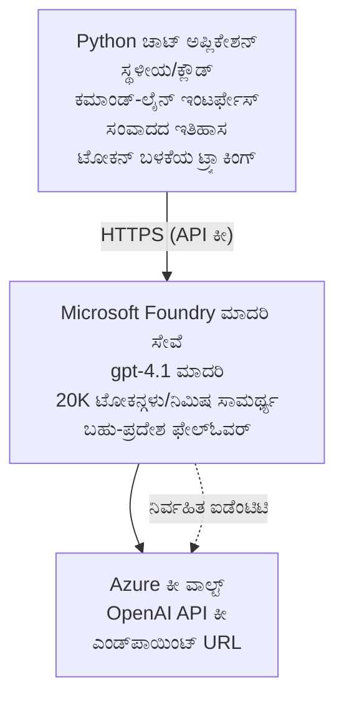

# Microsoft Foundry Models ಚಾಟ್ ಅಪ್ಲಿಕೇಶನ್

**ಅಭ್ಯಾಸ ಮಾರ್ಗ:** ಮಧ್ಯಮ ⭐⭐ | **ಸಮಯ:** 35-45 ನಿಮಿಷಗಳು | **ಖರ್ಚು:** $50-200/ತಿಂಗಳು

A complete Microsoft Foundry Models chat application deployed using Azure Developer CLI (azd). This example demonstrates gpt-4.1 deployment, secure API access, and a simple chat interface.

## 🎯 ನೀವು ಏನು ಕಲಿಯುತ್ತೀರಿ

- gpt-4.1 ಮಾದರಿಯೊಂದಿಗೆ Microsoft Foundry Models ಸೇವೆಯನ್ನು ನಿಯೋಜಿಸುವುದು
- Key Vault ಬಳಸಿ OpenAI API ಕೀಗಳನ್ನು ಸುರಕ್ಷಿತಗೊಳಿಸುವುದು
- Python ಬಳಸಿ ಸರಳ ಚಾಟ್ ಇಂಟರ್ಫೇಸ್ ನಿರ್ಮಿಸುವುದು
- ಟೋಕನ್ ಬಳಕೆ ಮತ್ತು ಖರ್ಚುಗಳನ್ನು നിരೀಕ್ಷಿಸುವುದು
- ರೇಟ್ ಲಿಮಿಟಿಂಗ್ ಮತ್ತು ದೋಷ ನಿರ್ವಹಣೆಯನ್ನು ಜಾರಿಗೆ ತರುವುದು

## 📦 ಏನು ಒಳಗೊಂಡಿದೆ

✅ **Microsoft Foundry Models Service** - gpt-4.1 ಮಾದರಿ ನಿಯೋಜನೆ  
✅ **Python Chat App** - ಸರಳ ಕಮಾಂಡ್-ಲೈನ್ ಚಾಟ್ ಇಂಟರ್ಫೇಸ್  
✅ **Key Vault Integration** - API ಕೀಗಳನ್ನು ಸುರಕ್ಷಿತವಾಗಿ ಸಂಗ್ರಹಿಸುವುದು  
✅ **ARM Templates** - ಸಂಪೂರ್ಣ ಇನ್ಫ್ರಾಸ್ಟ್ರಕ್ಚರ್ ಅನ್ನು ಕೋಡ್ ಆಗಿ  
✅ **Cost Monitoring** - ಟೋಕನ್ ಬಳಕೆ ಟ್ರ್ಯಾಕಿಂಗ್  
✅ **Rate Limiting** - ಕ್ವೋಟಾ ಕೊನೆಗೊಳ್ಳುವುದನ್ನು ತಡೆಯುವುದು  

## Architecture


## ಪೂರ್ವಾಪೇಕ್ಷೆಗಳು

### ಅಗತ್ಯವಿರುವವು

- **Azure Developer CLI (azd)** - [ಇನ್‌ಸ್ಟಾಲ್ ಮಾರ್ಗದರ್ಶಿ](https://learn.microsoft.com/azure/developer/azure-developer-cli/install-azd)
- **Azure subscription** with OpenAI access - [Request access](https://aka.ms/oai/access)
- **Python 3.9+** - [Python ಅನ್ನು ಇನ್‌ಸ್ಟಾಲ್ ಮಾಡಿ](https://www.python.org/downloads/)

### ಪೂರ್ವಾಪೇಕ್ಷಣೆಗಳ ಪರಿಶೀಲನೆ

```bash
# azd ಆವೃತ್ತಿ ಪರಿಶೀಲಿಸಿ (1.5.0 ಅಥವಾ ಅದಕ್ಕಿಂತ ಮೇಲಿನ ಆವೃತ್ತಿ ಬೇಕು)
azd version

# Azure ಲಾಗಿನ್ ಪರಿಶೀಲಿಸಿ
azd auth login

# Python ಆವೃತ್ತಿ ಪರಿಶೀಲಿಸಿ
python --version  # ಅಥವಾ python3 --version

# OpenAI ಪ್ರವೇಶ ಪರಿಶೀಲಿಸಿ (Azure ಪೋರ್ಟಲ್‌ನಲ್ಲಿ ಪರಿಶೀಲಿಸಿ)
az cognitiveservices account list-skus \
  --kind OpenAI \
  --location eastus
```

> **⚠️ ಮಹತ್ವದ್ದು:** Microsoft Foundry Models requires application approval. If you haven't applied, visit [aka.ms/oai/access](https://aka.ms/oai/access). Approval typically takes 1-2 business days.

## ⏱️ ನಿಯೋಜನೆ ಸಮಯರೇಖೆ

| ಹಂತ | ಅವಧಿ | ಏನಾಗುತ್ತದೆ |
|-------|----------|--------------|
| ಪೂರ್ವಾಪೇಕ್ಷಣೆಗಳ ಪರಿಶೀಲನೆ | 2-3 ನಿಮಿಷಗಳು | OpenAI ಕ್ವೋಟಾ ಲಭ್ಯತೆಯನ್ನು ಪರಿಶೀಲಿಸಿ |
| ಇನ್‌ಫ್ರಾಸ್ಟ್ರಕ್ಚರ್ ನಿಯೋಜನೆ | 8-12 ನಿಮಿಷಗಳು | OpenAI, Key Vault ಮತ್ತು ಮಾದರಿ ನಿಯೋಜನೆಯನ್ನು ರಚಿಸಿ |
| ಅಪ್ಲಿಕೇಶನ್ ಅನ್ನು ಕಾನ್ಫಿಗರ್ ಮಾಡಿ | 2-3 ನಿಮಿಷಗಳು | ಪರಿಸರ ಮತ್ತು ಅವಲಂಬನೆಗಳನ್ನು ಸೆಟ್ ಅಪ್ ಮಾಡಿ |
| **ಒಟ್ಟು** | **12-18 ನಿಮಿಷಗಳು** | gpt-4.1 ಜೊತೆ ಚಾಟ್ ಮಾಡಲು ಸಿದ್ಧ |

**ಟಿಪ್ಪಣಿ:** ಮೊದಲ ಬಾರಿ OpenAI ನಿಯೋಜನೆಗೆ ಮಾದರಿ ಒದಗಿಸುವಿಕೆ ಕಾರಣವಾಗಿ ಹೆಚ್ಚು ಸಮಯ ಬೇಕಾಗಬಹುದು.

## ತ್ವರಿತ ಪ್ರಾರಂಭ

```bash
# ಉದಾಹರಣೆಗೆ ಹೋಗಿ
cd examples/azure-openai-chat

# ಪರಿಸರವನ್ನು ಪ್ರಾರಂಭಿಸಿ
azd env new myopenai

# ಎಲ್ಲವನ್ನೂ ನಿಯೋಜಿಸಿ (ಆಧಾರಸೌಕರ್ಯ + ಸಂರಚನೆ)
azd up
# ನಿಮಗೆ ಕೆಳಕಂಡವು ಕೇಳಲಾಗುತ್ತದೆ:
# 1. Azure ಚಂದಾದಾರಿಕೆಯನ್ನು ಆಯ್ಕೆಮಾಡಿ
# 2. OpenAI ಲಭ್ಯತೆ ಇರುವ ಸ್ಥಳವನ್ನು ಆಯ್ಕೆಮಾಡಿ (ಉದಾ., eastus, eastus2, westus)
# 3. ನಿಯೋಜನಿಗಾಗಿ 12-18 ನಿಮಿಷಗಳವರೆಗೆ ಕಾಯಿರಿ

# Python ಅವಲಂಬನೆಗಳನ್ನು ಸ್ಥಾಪಿಸಿ
pip install -r requirements.txt

# ಚಾಟ್ ಪ್ರಾರಂಭಿಸಿ!
python chat.py
```

**ನಿರೀಕ್ಷಿತ ಔಟ್‌ಪುಟ್:**
```
🤖 Microsoft Foundry Models Chat Application
Connected to: gpt-4.1 (eastus)
Type your message (or 'quit' to exit)

You: Hello! Tell me about Microsoft Foundry Models.
Assistant: Microsoft Foundry Models Service provides REST API access to OpenAI's powerful language models including gpt-4.1, GPT-3.5-Turbo, and Embeddings...

[Tokens used: 145 | Estimated cost: $0.0044]
```

## ✅ ನಿಯೋಜನೆಯನ್ನು ಪರಿಶೀಲಿಸಿ

### ಹಂತ 1: Azure ಸಂಪನ್ಮೂಲಗಳನ್ನು ಪರಿಶೀಲಿಸಿ

```bash
# ನಿಯೋಜಿತ ಸಂಪನ್ಮೂಲಗಳನ್ನು ವೀಕ್ಷಿಸಿ
azd show

# ನಿರೀಕ್ಷಿತ ಔಟ್‌ಪುಟ್ ತೋರಿಸುತ್ತದೆ:
# - OpenAI ಸೇವೆ: (ಸಂಪನ್ಮೂಲದ ಹೆಸರು)
# - ಕೀ ವಾಲ್ಟ್: (ಸಂಪನ್ಮೂಲದ ಹೆಸರು)
# - ನಿಯೋಜನೆ: gpt-4.1
# - ಸ್ಥಳ: eastus (ಅಥವಾ ನೀವು ಆಯ್ದ ಪ್ರದೇಶ)
```

### ಹಂತ 2: OpenAI API ಅನ್ನು ಪರೀಕ್ಷಿಸಿ

```bash
# OpenAI ಎಂಡ್ಪಾಯಿಂಟ್ ಮತ್ತು ಕೀ ಪಡೆಯಿರಿ
OPENAI_ENDPOINT=$(azd env get-value AZURE_OPENAI_ENDPOINT)
OPENAI_KEY=$(azd env get-value AZURE_OPENAI_API_KEY)

# API ಕರೆ ಪರೀಕ್ಷಿಸಿ
curl "$OPENAI_ENDPOINT/openai/deployments/gpt-4.1/chat/completions?api-version=2024-08-01-preview" \
  -H "Content-Type: application/json" \
  -H "api-key: $OPENAI_KEY" \
  -d '{
    "messages": [{"role": "user", "content": "Say hello!"}],
    "max_tokens": 50
  }'
```

**ನಿರೀಕ್ಷಿತ ಪ್ರತಿಕ್ರಿಯೆ:**
```json
{
  "choices": [
    {
      "message": {
        "role": "assistant",
        "content": "Hello! How can I assist you today?"
      }
    }
  ],
  "usage": {
    "prompt_tokens": 8,
    "completion_tokens": 9,
    "total_tokens": 17
  }
}
```

### ಹಂತ 3: Key Vault ಪ್ರವೇಶವನ್ನು ಪರಿಶೀಲಿಸಿ

```bash
# ಕೀ ವಾಲ್ಟ್‌ನಲ್ಲಿನ ರಹಸ್ಯಗಳನ್ನು ಪಟ್ಟಿ ಮಾಡಿ
KV_NAME=$(azd env get-value AZURE_KEY_VAULT_NAME)

az keyvault secret list \
  --vault-name $KV_NAME \
  --query "[].name" \
  --output table
```

**ನಿರೀಕ್ಷಿತ ರಹಸ್ಯಗಳು:**
- `openai-api-key`
- `openai-endpoint`

**ಯಶಸ್ಸಿನ ಮಾನದಂಡಗಳು:**
- ✅ gpt-4.1 ಸಹಿತ OpenAI ಸೇವೆ ನಿಯೋಜಿಸಲಾಗಿದೆ
- ✅ API ಕರೆ ಮಾನ್ಯ ಪೂರ್ಣ ಸಮರ್ಪಣೆಯನ್ನು ಹಿಂತಿರುಗಿಸುತ್ತದೆ
- ✅ ರಹಸ್ಯಗಳು Key Vault ನಲ್ಲಿ ಸಂಗ್ರಹಿಸಲ್ಪಟ್ಟಿವೆ
- ✅ ಟೋಕನ್ ಬಳಕೆ ಟ್ರ್ಯಾಕಿಂಗ್ ಕಾರ್ಯನಿರ್ವಹಿಸುತ್ತದೆ

## ಪ್ರಾಜೆಕ್ಟ್ ರಚನೆ

```
azure-openai-chat/
├── README.md                   ✅ This guide
├── azure.yaml                  ✅ AZD configuration
├── infra/                      ✅ Infrastructure as Code
│   ├── main.bicep             ✅ Main Bicep template
│   ├── main.parameters.json   ✅ Parameters
│   └── openai.bicep           ✅ OpenAI resource definition
├── src/                        ✅ Application code
│   ├── chat.py                ✅ Chat interface
│   ├── config.py              ✅ Configuration loader
│   └── requirements.txt       ✅ Python dependencies
└── .gitignore                  ✅ Git ignore rules
```

## ಅಪ್ಲಿಕೇಶನ್ ವೈಶಿಷ್ಟ್ಯಗಳು

### ಚಾಟ್ ಇಂಟರ್ಫೇಸ್ (`chat.py`)

ಚಾಟ್ ಅಪ್ಲಿಕೇಶನ್ ಒಳಗೊಂಡಿದೆ:

- **ಚರ್ಚೆಯ ಇತಿಹಾಸ** - ಸಂದೇಶಗಳ ನಡುವೆ ಸಂದರ್ಭವನ್ನು ಕಾಪಾಡುತ್ತದೆ
- **ಟೋಕನ್ ಗಣನೆ** - ಬಳಕೆಯನ್ನು ಟ್ರ್ಯಾಕ್ ಮಾಡಿ ಖರ್ಚುಗಳನ್ನು ಅಂದಾಜು ಮಾಡುತ್ತದೆ
- **ದೋಷ ನಿರ್ವಹಣೆ** - ರೇಟ್ ಲಿಮಿಟ್ಗಳನ್ನು ಮತ್ತು API ದೋಷಗಳನ್ನು ಸಮರ್ಪಕವಾಗಿ ನಿರ್ವಹಿಸುತ್ತದೆ
- **ಖರ್ಚಿನ ಅಂದಾಜು** - ಪ್ರತಿ ಸಂದೇಶಕ್ಕೆ ರಿಯಲ್-ಟೈಮ್ ಖರ್ಚು ಲೆಕ್ಕಾಚಾರ
- **ಸ್ಟ್ರೀಮಿಂಗ್ ಬೆಂಬಲ** - ಐಚ್ಛಿಕ ಸ್ಟ್ರೀಮಿಂಗ್ ಪ್ರತಿಕ್ರಿಯೆಗಳು

### ಕಮಾಂಡ್ಗಳು

ಚಾಟ್ ಮಾಡುತ್ತಿರುವಾಗ, ನೀವು ಬಳಸಬಹುದು:
- `quit` or `exit` - ಸೆಶನ್ ಅಂತ್ಯಗೊಳಿಸಿ
- `clear` - ಚರ್ಚೆಯ ಇತಿಹಾಸವನ್ನು ಅಳಿಸಿ
- `tokens` - ಒಟ್ಟು ಟೋಕನ್ ಬಳಕೆಯನ್ನು ತೋರಿಸಿ
- `cost` - ಒಟ್ಟು ಅಂದಾಜಿತ ಖರ್ಚನ್ನು ತೋರಿಸಿ

### ಸಂರಚನೆ (`config.py`)

ಪರಿಸರ ಚರಗಳಿಂದ ಸಂರಚನೆಯನ್ನು ಲೋಡ್ ಮಾಡುತ್ತದೆ:
```python
AZURE_OPENAI_ENDPOINT  # ಕೀ ವಾಲ್ಟ್‌ನಿಂದ
AZURE_OPENAI_API_KEY   # ಕೀ ವಾಲ್ಟ್‌ನಿಂದ
AZURE_OPENAI_MODEL     # ಡೀಫಾಲ್ಟ್: gpt-4.1
AZURE_OPENAI_MAX_TOKENS # ಡೀಫಾಲ್ಟ್: 800
```

## ಬಳಕೆ ಉದಾಹರಣೆಗಳು

### ಮೂಲಭೂತ ಚಾಟ್

```bash
python chat.py
```

### ಕಸ್ಟಮ್ ಮಾದರಿಯೊಂದಿಗೆ ಚಾಟ್

```bash
export AZURE_OPENAI_MODEL=gpt-35-turbo
python chat.py
```

### ಸ್ಟ್ರೀಮಿಂಗ್ ಸಹಿತ ಚಾಟ್

```bash
python chat.py --stream
```

### ಉದಾಹರಣೆಯ ಸಂವಾದ

```
You: Explain Microsoft Foundry Models Service in 3 sentences.
Assistant: Microsoft Foundry Models Service is Microsoft Azure's cloud platform offering 
that provides access to OpenAI's powerful language models. It enables developers 
to integrate capabilities like gpt-4.1 into their applications with enterprise-grade 
security and compliance. The service includes features for content filtering, 
abuse monitoring, and responsible AI practices.

[Tokens used: 89 | Estimated cost: $0.0027]

You: What models are available?
Assistant: Microsoft Foundry Models Service offers several model families including gpt-4.1 
(most capable), GPT-3.5-Turbo (faster and cost-effective), and Embeddings models 
for vector search. Each model has different capabilities, pricing, and token limits.

[Tokens used: 67 | Estimated cost: $0.0020]

Total session: 156 tokens | $0.0047
```

## ವೆಚ್ಚ ನಿರ್ವಹಣೆ

### ಟೋಕನ್ ಬೆಲೆ (gpt-4.1)

| ಮಾದರಿ | ಇನ್‌ಪುಟ್ (ಪ್ರತಿ 1K ಟೋಕನ್ಗಳಿಗೆ) | ಔಟ್‌ಪುಟ್ (ಪ್ರತಿ 1K ಟೋಕನ್ಗಳಿಗೆ) |
|-------|----------------------|------------------------|
| gpt-4.1 | $0.03 | $0.06 |
| GPT-3.5-Turbo | $0.0015 | $0.002 |

### ಅಂದಾಜಿತ ಮಾಸಿಕ ವೆಚ್ಚಗಳು

ಬಳಕೆ ಮಾದರಿಗಳ ಆಧಾರದಲ್ಲಿ:

| ಬಳಕೆ ಮಟ್ಟ | ಸಂದೇಶಗಳು/ದಿನ | ಟೋಕನ್‌ಗಳು/ದಿನ | ಮಾಸಿಕ ವೆಚ್ಚ |
|-------------|--------------|------------|--------------|
| **ಹಗುರ** | 20 messages | 3,000 tokens | $3-5 |
| **ಮಧ್ಯಮ** | 100 messages | 15,000 tokens | $15-25 |
| **ಭಾರಿ** | 500 messages | 75,000 tokens | $75-125 |

**ಮೂಲ ಇನ್ಫ್ರಾಸ್ಟ್ರಕ್ಚರ್ ವೆಚ್ಚ:** $1-2/ತಿಂಗಳು (Key Vault + ಕನಿಷ್ಠ ಕಂಪ್ಯೂಟ್)

### ವೆಚ್ಚ ಲಘೂಕರಣ ಸಲಹೆಗಳು

```bash
# 1. ಸರಳ ಕಾರ್ಯಗಳಿಗಾಗಿ GPT-3.5-Turbo ಅನ್ನು ಬಳಸಿರಿ (20 ಪಟ್ಟು ಸस्तಾಗಿದೆ)
export AZURE_OPENAI_MODEL=gpt-35-turbo

# 2. ಚಿಕ್ಕ ಉತ್ತರಗಳಿಗೆ ಗರಿಷ್ಠ ಟೋಕನ್‌ಗಳನ್ನು ಕಡಿಮೆ ಮಾಡಿ
export AZURE_OPENAI_MAX_TOKENS=400

# 3. ಟೋಕನ್ ಬಳಕೆಯನ್ನು ನಿಗಾ ವಹಿಸಿ
python chat.py --show-tokens

# 4. ಬಜೆಟ್ ಎಚ್ಚರಿಕೆಗಳನ್ನು ಹೊಂದಿಸಿ
az consumption budget create \
  --budget-name "openai-budget" \
  --amount 50 \
  --time-grain Monthly
```

## ಮೇಲ್ವಿಚಾರಣೆ

### ಟೋಕನ್ ಬಳಕೆಯನ್ನು ವೀಕ್ಷಿಸಿ

```bash
# Azure ಪೋರ್ಟಲ್‌ನಲ್ಲಿ:
# OpenAI ಸಂಪನ್ಮೂಲ → ಮೆಟ್ರಿಕ್‌ಗಳು → "ಟೋಕನ್ ವ್ಯವಹಾರ" ಆಯ್ಕೆ ಮಾಡಿ

# ಅಥವಾ Azure CLI ಮೂಲಕ:
az monitor metrics list \
  --resource $(azd env get-value AZURE_OPENAI_RESOURCE_ID) \
  --metric "TokenTransaction" \
  --start-time $(date -u -d '1 hour ago' '+%Y-%m-%dT%H:%M:%S') \
  --interval PT1M
```

### API ಲಾಗ್‌ಗಳನ್ನು ವೀಕ್ಷಿಸಿ

```bash
# ಡಯಾಗ್ನೋಸ್ಟಿಕ್ ಲಾಗ್‌ಗಳನ್ನು ಸ್ಟ್ರೀಮ್ ಮಾಡಿ
az monitor diagnostic-settings create \
  --resource $(azd env get-value AZURE_OPENAI_RESOURCE_ID) \
  --name openai-logs \
  --logs '[{"category": "Audit", "enabled": true}]' \
  --workspace $(azd env get-value LOG_ANALYTICS_WORKSPACE_ID)

# ಕ್ವೇರಿ ಲಾಗ್‌ಗಳು
az monitor log-analytics query \
  --workspace $(azd env get-value LOG_ANALYTICS_WORKSPACE_ID) \
  --analytics-query "AzureDiagnostics | where Category == 'Audit' | top 10 by TimeGenerated"
```

## ತೊಂದರೆ ಪರಿಹಾರ

### ಸಮಸ್ಯೆ: "Access Denied" ದೋಷ

**ಲಕ್ಷಣಗಳು:** API ಕರೆ ಮಾಡಿದಾಗ 403 Forbidden

**ಉಪಾಯಗಳು:**
```bash
# 1. OpenAI ಪ್ರವೇಶವು ಅನುಮೋದಿಸಲಾಗಿದೆ ಎಂದು ಪರಿಶೀಲಿಸಿ
az cognitiveservices account show \
  --name $(azd env get-value AZURE_OPENAI_NAME) \
  --resource-group $(azd env get-value AZURE_RESOURCE_GROUP)

# 2. API ಕೀ ಸರಿಯಾದದ್ದೇ ಎಂದು ಪರಿಶೀಲಿಸಿ
azd env get-value AZURE_OPENAI_API_KEY

# 3. ಎಂಡ್‌ಪಾಯಿಂ್ಟ್ URL ರೂಪವನ್ನು ಪರಿಶೀಲಿಸಿ
azd env get-value AZURE_OPENAI_ENDPOINT
# ಇದಾಗಿರಬೇಕು: https://[name].openai.azure.com/
```

### ಸಮಸ್ಯೆ: "Rate Limit Exceeded"

**ಲಕ್ಷಣಗಳು:** 429 Too Many Requests

**ಉಪಾಯಗಳು:**
```bash
# 1. ಪ್ರಸ್ತುತ ಕ್ವೋಟಾವನ್ನು ಪರಿಶೀಲಿಸಿ
az cognitiveservices account deployment show \
  --name $(azd env get-value AZURE_OPENAI_NAME) \
  --resource-group $(azd env get-value AZURE_RESOURCE_GROUP) \
  --deployment-name gpt-4.1

# 2. ಕ್ವೋಟಾ ವೃದ್ಧಿಯನ್ನು ವಿನಂತಿ ಮಾಡಿ (ಅಗತ್ಯವಿದ್ದರೆ)
# Azure ಪೋರ್ಟಲ್‌ಗೆ ಹೋಗಿ → OpenAI ಸಂಪನ್ಮೂಲ → ಕ್ವೋಟಾಗಳು → ವೃದ್ಧಿಗಾಗಿ ವಿನಂತಿ ಮಾಡಿ

# 3. ಮರುಪ್ರಯತ್ನ ಲಾಜಿಕ್ ಅನ್ನು ಜಾರಿಗೆ ತರು (ಈಗಾಗಲೇ chat.py ನಲ್ಲಿ ಇದೆ)
# ಅಪ್ಲಿಕೇಶನ್ ಸ್ವಯಂಚಾಲಿತವಾಗಿ ಘಾತಾಕಾರ ಹಿಂಜರಿಕೆಯೊಂದಿಗೆ ಮರುಪ್ರಯತ್ನ ಮಾಡುತ್ತದೆ
```

### ಸಮಸ್ಯೆ: "Model Not Found"

**ಲಕ್ಷಣಗಳು:** ನಿಯೋಜನೆಗಾಗಿ 404 ದೋಷ

**ಉಪಾಯಗಳು:**
```bash
# 1. ಲಭ್ಯವಿರುವ ನಿಯೋಜನೆಗಳನ್ನು ಪಟ್ಟಿ ಮಾಡಿ
az cognitiveservices account deployment list \
  --name $(azd env get-value AZURE_OPENAI_NAME) \
  --resource-group $(azd env get-value AZURE_RESOURCE_GROUP)

# 2. ಪರಿಸರದಲ್ಲಿನ ಮಾದರಿ ಹೆಸರನ್ನು ಪರಿಶೀಲಿಸಿ
echo $AZURE_OPENAI_MODEL

# 3. ಸರಿಯಾದ ನಿಯೋಜನೆ ಹೆಸರಿಗೆ ನವೀಕರಿಸಿ
export AZURE_OPENAI_MODEL=gpt-4.1  # ಅಥವಾ gpt-35-turbo
```

### ಸಮಸ್ಯೆ: ಹೆಚ್ಚಿದ ವಿಳಂಬ

**ಲಕ್ಷಣಗಳು:** ಪ್ರತಿಕ್ರಿಯೆ ಸಮಯಗಳು ನಿಧಾನ (>5 ಸೆಕೆಂಡುಗಳು)

**ಉಪಾಯಗಳು:**
```bash
# 1. ಪ್ರಾದೇಶಿಕ ವಿಳಂಬವನ್ನು ಪರಿಶೀಲಿಸಿ
# ಬಳಕೆದಾರರಿಗೆ ಅತಿ ಸಮೀಪದ ಪ್ರದೇಶಕ್ಕೆ ನಿಯೋಜಿಸಿ

# 2. ವೇಗದ ಪ್ರತಿಕ್ರಿಯೆಗಳಿಗಾಗಿ max_tokens ಅನ್ನು ಕಡಿಮೆ ಮಾಡಿ
export AZURE_OPENAI_MAX_TOKENS=400

# 3. ಉತ್ತಮ ಬಳಕೆದಾರ ಅನುಭವಕ್ಕಾಗಿ ಸ್ಟ್ರೀಮಿಂಗ್ ಬಳಸಿ
python chat.py --stream
```

## ಭದ್ರತಾ ಉತ್ತಮ ಅಭ್ಯಾಸಗಳು

### 1. API ಕೀಲಿಗಳನ್ನು ರಕ್ಷಿಸಿ

```bash
# ಎಂದಿಗೂ ಕೀಲಿಗಳನ್ನು ಸೋರ್ಸ್ ಕಂಟ್ರೋಲ್‌ಗೆ ಕಮಿಟ್ ಮಾಡಬೇಡಿ
# Key Vault ಬಳಸಿ (ಈಗಾಗಲೇ ಸಂರಚಿಸಲಾಗಿದೆ)

# ಕೀಲಿಗಳನ್ನು ನಿಯಮಿತವಾಗಿ ಮರುಬದಲಾಯಿಸಿ
az cognitiveservices account keys regenerate \
  --name $(azd env get-value AZURE_OPENAI_NAME) \
  --resource-group $(azd env get-value AZURE_RESOURCE_GROUP) \
  --key-name key1
```

### 2. ವಿಷಯ ಫಿಲ್ಟರಿಂಗ್ ಅನ್ನು ಜಾರಿಗೆ ತರು

```python
# Microsoft Foundry ಮಾದರಿಗಳು ಒಳನಿರ್ಮಿತ ವಿಷಯ ಫಿಲ್ಟರಿಂಗ್ ಅನ್ನು ಒಳಗೊಂಡಿವೆ
# Azure ಪೋರ್ಟಲ್‌ನಲ್ಲಿ ಸಂರಚಿಸಿ:
# OpenAI ಸಂಪನ್ಮೂಲ → ವಿಷಯ ಫಿಲ್ಟರ್‌ಗಳು → ಕಸ್ಟಮ್ ಫಿಲ್ಟರ್ ಸೃಷ್ಟಿಸಿ

# ವರ್ಗಗಳು: ದ್ವೇಷ, ಲೈಂಗಿಕ, ಹಿಂಸಾಚಾರ, ಸ್ವಯಂ ಹಾನಿ
# ಮಟ್ಟಗಳು: ಕಡಿಮೆ, ಮಧ್ಯಮ, ಹೆಚ್ಚು ಫಿಲ್ಟರಿಂಗ್
```

### 3. Managed Identity ಬಳಸಿ (ಉತ್ಪಾದನೆ)

```bash
# ಉತ್ಪಾದನಾ ನಿಯೋಜನೆಗಳಿಗಾಗಿ ನಿರ್ವಹಿತ ಗುರುತನ್ನು ಬಳಸಿ
# API ಕೀಲಿಗಳ ಬದಲು (Azure‌ನಲ್ಲಿ ಅಪ್ಲಿಕೇಶನ್ ಅನ್ನು ಹೋಸ್ಟ್ ಮಾಡುವ ಅಗತ್ಯವಿದೆ)

# infra/openai.bicep ಫೈಲ್‌ನಲ್ಲಿ ಕೆಳಕಂಡುದನ್ನು ಸೇರಿಸಲು ನವೀಕರಿಸಿ:
# identity: { type: 'SystemAssigned' }
```

## ಅಭಿವೃದ್ಧಿ

### ಸ್ಥಳೀಯವಾಗಿ ಚಾಲನೆ

```bash
# ಅವಲಂಬನೆಗಳನ್ನು ಸ್ಥಾಪಿಸಿ
pip install -r src/requirements.txt

# ಪರಿಸರ ಚರಗಳನ್ನು ಹೊಂದಿಸಿ
export AZURE_OPENAI_ENDPOINT="https://[name].openai.azure.com/"
export AZURE_OPENAI_API_KEY="your-api-key"
export AZURE_OPENAI_MODEL="gpt-4.1"

# ಅನ್ವಯಿಕೆಯನ್ನು ಚಾಲನೆಗೊಳಿಸಿ
python src/chat.py
```

### ಪರೀಕ್ಷೆಗಳನ್ನು ನಡೆಸಿ

```bash
# ಟೆಸ್ಟ್ ನಿರ್ಭರತೆಗಳನ್ನು ಸ್ಥಾಪಿಸಿ
pip install pytest pytest-cov

# ಟೆಸ್ಟ್‌ಗಳನ್ನು ನಡೆಸಿ
pytest tests/ -v

# ಕವರೆಜ್ ಸಹಿತ
pytest tests/ --cov=src --cov-report=html
```

### ಮಾದರಿ ನಿಯೋಜನೆಯನ್ನು ನವೀಕರಿಸಿ

```bash
# ವಿಭಿನ್ನ ಮಾದರಿ ಆವೃತ್ತಿಯನ್ನು ನಿಯೋಜಿಸಿ
az cognitiveservices account deployment create \
  --name $(azd env get-value AZURE_OPENAI_NAME) \
  --resource-group $(azd env get-value AZURE_RESOURCE_GROUP) \
  --deployment-name gpt-35-turbo \
  --model-name gpt-35-turbo \
  --model-version "0613" \
  --model-format OpenAI \
  --sku-capacity 20 \
  --sku-name "Standard"
```

## ಸ್ವಚ್ಛತೆ

```bash
# ಎಲ್ಲಾ Azure ಸಂಪನ್ಮೂಲಗಳನ್ನು ಅಳಿಸಿ
azd down --force --purge

# ಇದು ಕೆಳಗಿನವುಗಳನ್ನು ತೆಗೆದುಹಾಕುತ್ತದೆ:
# - OpenAI ಸೇವೆ
# - ಕೀ ವಾಲ್ಟ್ (90-ದಿನಗಳ ಸಾಫ್ಟ್‌ಡಿಲೀಟ್ ಜೊತೆಗೆ)
# - ಸಂಪನ್ಮೂಲ ಗುಂಪು
# - ಎಲ್ಲಾ ನಿಯೋಜನೆಗಳು ಮತ್ತು ಸಂರಚನೆಗಳು
```

## ಮುಂದಿನ ಹಂತಗಳು

### ಈ ಉದಾಹರಣೆಯನ್ನು ವಿಸ್ತರಿಸಿ

1. **ವೆಬ್ ಇಂಟರ್ಫೇಸ್ ಸೇರಿಸಿ** - React/Vue ಫ್ರಂಟ್‌ಎಂಡ್ ನಿರ್ಮಿಸಿ
   ```bash
   # azure.yaml ಗೆ ಫ್ರಂಟ್‌ಎಂಡ್ ಸೇವೆಯನ್ನು ಸೇರಿಸಿ
   # Azure Static Web Apps ಗೆ ನಿಯೋಜಿಸಿ
   ```

2. **RAG ಅನುಷ್ಠಾನ ಮಾಡಿ** - Azure AI Search ಸಹಿತ ಡಾಕ್ಯುಮೆಂಟ್ ಹುಡುಕಾಟ ಸೇರಿಸಿ
   ```python
   # Azure Cognitive Search ಅನ್ನು ಸಂಯೋಜಿಸಿ
   # ದಾಖಲೆಗಳನ್ನು ಅಪ್‌ಲೋಡ್ ಮಾಡಿ ಮತ್ತು ವೆಕ್ಟರ್ ಸೂಚ್ಯಂಕವನ್ನು ರಚಿಸಿ
   ```

3. **ಫಂಕ್ಷನ್ ಕಾಲಿಂಗ್ ಸೇರಿಸಿ** - ಟೂಲ್ಗಳ ಬಳಕೆಗೆ ಅನುಮತಿಸಿ
   ```python
   # chat.py ನಲ್ಲಿ ಫಂಕ್ಷನ್‌ಗಳನ್ನು ವ್ಯಾಖ್ಯಾನಿಸಿ
   # gpt-4.1 ಗೆ ಬಾಹ್ಯ APIಗಳನ್ನು ಕರೆ ಮಾಡಲು ಅನುಮತಿಸಿ
   ```

4. **ಬಹು-ಮಾದರಿ ಬೆಂಬಲ** - ಬಹು ಮಾದರಿಗಳನ್ನು ನಿಯೋಜಿಸಿ
   ```bash
   # gpt-35-turbo ಮತ್ತು ಎಂಬೆಡ್ಡಿಂಗ್ ಮಾದರಿಗಳನ್ನು ಸೇರಿಸಿ
   # ಮಾದರಿ ರೌಟಿಂಗ್ ಲಾಜಿಕ್ ಅನ್ನು ಅನುಷ್ಠಾನಗೊಳಿಸಿ
   ```

### ಸಂಬಂಧಿತ ಉದಾಹರಣೆಗಳು

- **[Retail Multi-Agent](../retail-scenario.md)** - ಉನ್ನತ ಮಟ್ಟದ ಬಹು-ಏಜೆಂಟ್ ಆರ್ಕಿಟೆಕ್ಚರ್
- **[Database App](../../../../examples/database-app)** - ಸ್ಥಿರ ಸಂಗ್ರಹಣೆ ಸೇರಿಸಿ
- **[Container Apps](../../../../examples/container-app)** - ಕಂಟೈನರೈಸ್ ಮಾಡಿದ ಸೇವೆಯಾಗಿ ನಿಯೋಜಿಸಿ

### ಅಧ್ಯಯನ ಸಂಪನ್ಮೂಲಗಳು

- 📚 [AZD For Beginners Course](../../README.md) - ಮುಖ್ಯ ಕೋರ್ಸ್ ಮುಖಪುಟ
- 📚 [Microsoft Foundry Models Documentation](https://learn.microsoft.com/azure/ai-services/openai/) - ಅಧಿಕೃತ ಡಾಕ್ಯುಮೆಂಟ್‌ಗಳು
- 📚 [OpenAI API Reference](https://platform.openai.com/docs/api-reference) - API ವಿವರಗಳು
- 📚 [Responsible AI](https://www.microsoft.com/ai/responsible-ai) - ಉತ್ತಮ ಅಭ್ಯಾಸಗಳು

## ಹೆಚ್ಚುವರಿ ಸಂಪನ್ಮೂಲಗಳು

### ಡಾಕ್ಯುಮೆಂಟೇಷನ್
- **[Microsoft Foundry Models Service](https://learn.microsoft.com/azure/ai-services/openai/)** - ಸಂಪೂರ್ಣ ಮಾರ್ಗದರ್ಶಿ
- **[gpt-4.1 Models](https://learn.microsoft.com/azure/ai-services/openai/concepts/models)** - ಮಾದರಿ ಸಾಮರ್ಥ್ಯಗಳು
- **[Content Filtering](https://learn.microsoft.com/azure/ai-services/openai/concepts/content-filter)** - ಸುರಕ್ಷತಾ ವೈಶಿಷ್ಟ್ಯಗಳು
- **[Azure Developer CLI](https://learn.microsoft.com/azure/developer/azure-developer-cli/)** - azd ಉಲ್ಲೇಖ

### ತರಬೇತಿಗಳು
- **[OpenAI Quickstart](https://learn.microsoft.com/azure/ai-services/openai/quickstart)** - ಪ್ರಥಮ ನಿಯೋಜನೆ
- **[Chat Completions](https://learn.microsoft.com/azure/ai-services/openai/how-to/chatgpt)** - ಚಾಟ್ ಅಪ್ಲಿಕೇಶನ್ಗಳನ್ನು ನಿರ್ಮಿಸುವುದು
- **[Function Calling](https://learn.microsoft.com/azure/ai-services/openai/how-to/function-calling)** - ಉನ್ನತ ವೈಶಿಷ್ಟ್ಯಗಳು

### ಸಾಧನಗಳು
- **[Microsoft Foundry Models Studio](https://oai.azure.com/)** - ವೆಬ್-ಆಧಾರಿತ ಪ್ಲೇಗ್ರೌಂಡ್
- **[Prompt Engineering Guide](https://platform.openai.com/docs/guides/prompt-engineering)** - ಉತ್ತಮ ಪ್ರಾಂಪ್ಟ್ ಬರೆಯುವುದು
- **[Token Calculator](https://platform.openai.com/tokenizer)** - ಟೋಕನ್ ಬಳಕೆಯನ್ನು ಅಂದಾಜು ಮಾಡಿ

### ಸಮುದಾಯ
- **[Azure AI Discord](https://discord.gg/azure)** - ಸಮುದായದಿಂದ ಸಹಾಯ ಪಡೆಯಿರಿ
- **[GitHub Discussions](https://github.com/Azure-Samples/openai/discussions)** - ಪ್ರಶ್ನೋತ್ತರ ವೇದಿಕೆ
- **[Azure Blog](https://azure.microsoft.com/blog/tag/azure-openai-service/)** - ಇತ್ತೀಚಿನ ಅಪ್ಡೇಟ್ಗಳು

---

**🎉 ಯಶಸ್ಸು!** ನೀವು Microsoft Foundry Models ಅನ್ನು ನಿಯೋಜಿಸಿದ್ದೀರಿ ಮತ್ತು ಕಾರ್ಯನಿರ್ವಹಿಸುವ ಚಾಟ್ ಅಪ್ಲಿಕೇಶನ್ ನಿರ್ಮಿಸಿದ್ದೀರಿ. gpt-4.1 ಯ ಸಾಮರ್ಥ್ಯಗಳನ್ನು ಅನ್ವೇಷಿಸಿ ಮತ್ತು ವಿಭಿನ್ನ ಪ್ರಾಂಪ್ಟ್‌ಗಳು ಮತ್ತು ಉಪಯೋಗಗಳೊಂದಿಗೆ ಪ್ರಯೋಗ ಮಾಡಿ.

**ಪ್ರಶ್ನೆಗಳು?** [Open an issue](https://github.com/microsoft/AZD-for-beginners/issues) ಅಥವಾ [FAQ](../../resources/faq.md) を ಪರಿಶೀಲಿಸಿ

**ಖರ್ಚು ಎಚ್ಚರಿಕೆ:** ಪರೀಕ್ಷೆ ಮುಗಿಸಿದ ನಂತರ ನಿರಂತರ ಶುಲ್ಕಗಳನ್ನು ತಪ್ಪಿಸಲು `azd down` ಅನ್ನು ಚಲಾಯಿಸುವುದನ್ನು ನೆನಪಿಡಿ (~ಸಕ್ರಿಯ ಬಳಕೆಗೆ $50-100/ತಿಂಗಳಿಗೆ).

---

<!-- CO-OP TRANSLATOR DISCLAIMER START -->
**Disclaimer**:
ಈ ದಾಖಲೆ [Co-op Translator](https://github.com/Azure/co-op-translator) ಎಂಬ AI ಅನುವಾದ ಸೇವೆಯನ್ನು ಬಳಸಿ ಅನುವಾದಿಸಲಾಗಿದೆ. ನಾವು ನಿಖರತೆಗೆ ಪ್ರಯತ್ನಿಸಿದರೂ, ದಯವಿಟ್ಟು ತಿಳಿದುಕೊಳ್ಳಿ — ಸ್ವಯಂಚಾಲಿತ ಅನುವಾದಗಳಲ್ಲಿ ತಪ್ಪುಗಳು ಅಥವಾ ಅಸಮರ್ಪಕತೆಗಳು ಇರಬಹುದು. ಮೂಲ ಭಾಷೆಯಲ್ಲಿರುವ ಮೂಲ ದಾಖಲೆನ್ನು ಪ್ರಾಧಿಕಾರೀಕೃತ ಮೂಲವೆಂದು ಪರಿಗಣಿಸಬೇಕು. ಗಂಭೀರ ಮಾಹಿತಿಗಾಗಿ, ವೃತ್ತಿಪರ ಮಾನವ ಅನುವಾದವನ್ನು ಶಿಫಾರಸು ಮಾಡಲಾಗುತ್ತದೆ. ಈ ಅನುವಾದವನ್ನು ಬಳಸುವುದರಿಂದ ಉಂಟಾದ ಯಾವುದೇ ತಪ್ಪು ಗ್ರಹಿಕೆಗಳು ಅಥವಾ ತಪ್ಪು ವ್ಯಾಖ್ಯಾನಗಳಿಗಾಗಿ ನಾವು ಜವಾಬ್ದಾರರಾಗಿರುವುದಿಲ್ಲ.
<!-- CO-OP TRANSLATOR DISCLAIMER END -->