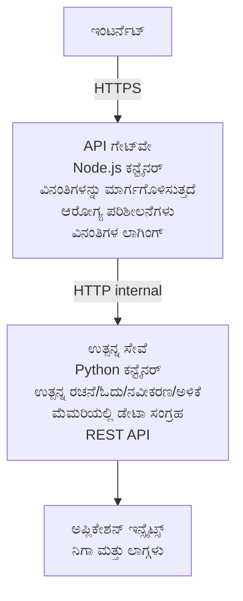

# Microservices Architecture - Container App Example

⏱️ **ಅಂದಾಜಿತ ಸಮಯ**: 25-35 ನಿಮಿಷಗಳು | 💰 **ಅಂದಾಜಿತ ವೆಚ್ಚ**: ~$50-100/ತಿಂಗಳು | ⭐ **ಸಾಮಾನ್ಯತೆ**: ಉನ್ನತ

ಈದು AZD CLI ಬಳಸಿ Azure Container Apps ಗೆ ನಿಯೋಜಿಸಲಾದ ಒಂದು **ಸರಳೀಕೃತ ಆದರೆ ಕಾರ್ಯರತ್ಪಕ** ಮೈಕ್ರೋಸರ್ವಿಸಸ್ ವಾಸ್ತುಶಿಲ್ಪ ಉದಾಹರಣೆ. ಈ ಉದಾಹರಣೆ ಸರ್ವಿಸ್-ಟ್-ಸರ್ವಿಸ್ ಸಂವಹನ, ಕಂಟೈನರ್ ಒರ್ಕೆಸ್ಟ್ರೇಶನ್ ಮತ್ತು ಮಾನಿಟರಿಂಗ್ ಹೇಗೆ ಕಾರ್ಯನಿರ್ವಹಿಸುತ್ತದೆ ಎಂಬುದನ್ನು 2-ಸರ್ವಿಸ್ ಪ್ರಾಯೋಗಿಕ ಸೆಟ್‌ಅಪ್ ಮೂಲಕ ತೋರಿಸುತ್ತದೆ.

> **📚 ಅಧ್ಯಯನ ವಿಧಾನ**: ಈ ಉದಾಹರಣೆ ಮೂಲತಃ ಕನಿಷ್ಠ 2-ಸರ್ವಿಸ್ ವಾಸ್ತುಶಿಲ್ಪದಿಂದ (API Gateway + Backend Service) ಪ್ರಾರಂಭವಾಗುತ್ತದೆ, ನೀವು ಇದನ್ನು ನಿಜವಾಗಿಯೂ ನಿಯೋಜಿಸಿ ಕಲಿಯಬಹುದು. ಈ ಮೂಲವನ್ನು ಮುಗಿಸಿದ ನಂತರ, ಸಂಪೂರ್ಣ ಮೈಕ್ರೋಸರ್ವಿಸಸ್ ಪರಿಸರಕ್ಕೆ ವಿಸ್ತರಿಸುವ ಮಾರ್ಗದರ್ಶನವನ್ನು ನೀಡಲಾಗುತ್ತದೆ.

## ನೀವು ಏನು ಕಲಿಯುತ್ತೀರಿ

ಈ ಉದಾಹರಣೆಯನ್ನು ಪೂರ್ಣಗೊಳಿಸುವ ಮೂಲಕ, ನೀವು:
- Azure Container Apps ಗೆ ಬಹು ಕಂಟೈನರ್ಗಳನ್ನು ನಿಯೋಜಿಸುವುದನ್ನು ಕಲಿಯುತ್ತೀರಿ
- ಆಂತರಿಕ ನೆಟ್‌ವರ್ಕಿಂಗ್ ಮೂಲಕ ಸರ್ವಿಸ್-ಟ್-ಸರ್ವಿಸ್ ಸಂವಹನ ಅನ್ನು ಜಾರಿ ಮಾಡುವುದು
- ಪರಿಸರ ಆಧಾರಿತ ಸ್ಕೇಲಿಂಗ್ ಮತ್ತು ಹಾಲ್ತ್ ಚೆಕ್ಸ್‌ಗಳನ್ನು ಸಂರಚಿಸುವುದು
- Application Insights ಮೂಲಕ ವಿತರಣಾ अनुप್ರಯೋಗಗಳನ್ನು ಮಾನಿಟರ್ ಮಾಡುವುದು
- ಮೈಕ್ರೋಸರ್ವಿಸಸ್ ನಿಯೋಜನೆ ಮಾದರಿಗಳು ಮತ್ತು ಉತ್ತಮ ಅಭ್ಯಾಸಗಳನ್ನು ಅರ್ಥಮಾಡಿಕೊಳ್ಳುವುದು
- ಸರಳದಿಂದ ಸಂಕೀರ್ಣ ವಾಸ್ತುಶಿಲ್ಪಕ್ಕೆ ಪ್ರಗತಿಶೀಲವಾಗಿ ವಿಸ್ತಾರಗೊಳ್ಳುವುದನ್ನು ಕಲಿಯುವುದು

## ವಾಸ್ತುಶಿಲ್ಪ

### ಹಂತ 1: ನಾವು ಏನನ್ನು ನಿರ್ಮಿಸುತ್ತಿದ್ದೇವೆ (ಈ ಉದಾಹರಣೆಯಲ್ಲಿ ಸೇರಿಸಲಾಗಿದೆ)


**ಸರಳದಿಂದ ಪ್ರಾರಂಭಿಸುವ ಕಾರಣ ಏನು?**
- ✅ ತ್ವರಿತವಾಗಿ ನಿಯೋಜಿಸಿ ಮತ್ತು ಅರ್ಥಮಾಡಿಕೊಳ್ಳಿ (25-35 ನಿಮಿಷ)
- ✅ ಸಂಕೀರ್ಣತೆ ರಹಿತವಾಗಿ ಕೋರ್ ಮೈಕ್ರೋಸರ್ವಿಸಸ್ ಮಾದರಿಗಳನ್ನು ಕಲಿಯಿರಿ
- ✅ ನೀವು ತಿದ್ದುಪಡಿಗಳು ಮಾಡಿ ಅನುಪ್ರಯೋಗ ಮಾಡಲು ಸಾಧ್ಯವಾದ ಕಾರ್ಯನಿರತ ಕೋಡ್
- ✅ ಕಲಿಕೆಗೆ ಕಡಿಮೆ ವೆಚ್ಚ (~$50-100/ತಿಂಗಳು vs $300-1400/ತಿಂಗಳು)
- ✅ ಡೇಟಾಬೇಸ್‌ಗಳು ಮತ್ತು ಮೆಸೇಜ್ ಕ್ಯೂಗಳನ್ನು ಸೇರಿಸುವ ಮೊದಲು ಆತ್ಮವಿಶ್ವಾಸ ನಿರ್ಮಿಸಿ

**ಉಪಮಾನ**: ಇದನ್ನು ಡ್ರೈವಿಂಗ್ ಕಲಿಯುವುದಾಗಿ ಪರಿಗಣಿಸಿ. ನೀವು ಖಾಲಿ ಪಾರ್ಕಿಂಗ್ ಲಾಟ್ (2 ಸರ್ವಿಸಸ್) ರಿಂದ ಪ್ರಾರಂಭಿಸಿ, ಮೂಲಗಳನ್ನು ಮ್ಯಾಸ್ಟರ್ ಮಾಡಿ, ನಂತರ ನಗರ ಸಂಚಾರ (5+ ಸರ್ವಿಸಸ್ ಮತ್ತು ಡೇಟಾಬೇಸ್‌ಗಳು) ಕಡೆಗೆ ಮುಂದುವರಿಯಿರಿ.

### ಹಂತ 2: ಭವಿಷ್ಯದ ವಿಸ್ತರಣೆ (ಉಲ್ಲೇಖ ವಾಸ್ತುಶಿಲ್ಪ)

ಒಮ್ಮೆ ನೀವು 2-ಸರ್ವಿಸ್ ವಾಸ್ತುಶಿಲ್ಪವನ್ನು ಅರ್ಥಮಾಡಿಕೊಂಡಾಗ, ನೀವು ವಿಸ್ತರಿಸಬಹುದು:

```
Full Architecture (Not Included - For Reference)
├── API Gateway (✅ Included)
├── Product Service (✅ Included)
├── Order Service (🔜 Add next)
├── User Service (🔜 Add next)
├── Notification Service (🔜 Add last)
├── Azure Service Bus (🔜 For async communication)
├── Cosmos DB (🔜 For product persistence)
├── Azure SQL (🔜 For order management)
└── Azure Storage (🔜 For file storage)
```

ಹಂತಬದ್ಧ ನಿರ್ದೇಶನಗಳಿಗೆ "Expansion Guide" ವಿಭಾಗವನ್ನು ಕೊನೆಯಲ್ಲಿ ನೋಡಿ.

## ಒಳಗೊಂಡ ವೈಶಿಷ್ಟ್ಯಗಳು

✅ **ಸರ್ವಿಸ್ ಡಿಸ್ಕವರಿ**: ಕಂಟೈನರ್‌ಗಳ ನಡುವೆ ಸ್ವಯಂಚಾಲಿತ DNS ಆಧಾರಿತ ಅನ್ವೇಷಣೆ  
✅ **ಲೋಡ್ ಬ್ಯಾಲನ್ಸಿಂಗ್**: ಪ್ರತಿರೆಪ್ಲಿಕಾ ದಾಟಿ ಬಲಗೊಳಿಸುವ ಬಿಲ್ಟ್-ಇನ್ ಲೋಡ್ ಬ್ಯಾಲನ್ಸಿಂಗ್  
✅ **ಸ್ವಯಂ-ಸ್ಕೇಲಿಂಗ್**: HTTP ವಿನಂತಿಗಳ ಆಧಾರದ ಮೇಲೆ ಪ್ರತಿ ಸರ್ವಿಸ್ ಸ್ವತಂತ್ರ ಸ್ಕೇಲಿಂಗ್  
✅ **ಹೆಲ್‌ಥ್ ಮಾನಿಟರಿಂಗ್**: ಎರಡೂ ಸರ್ವಿಸಸ್‌ಗಳಿಗೆ ಲೈವ್‌ನೇಸ್ ಮತ್ತು ರೆಡಿನೆಸ್ ಪ್ರೋಬ್‌ಗಳು  
✅ **ವಿತರಿತ ಲಾಗಿಂಗ್**: Application Insights ಮೂಲಕ ಕೇಂದ್ರಿತ ಲಾಗಿಂಗ್  
✅ **ಆಂತರಿಕ ನೆಟ್‌ವರ್ಕಿಂಗ್**: ಸುರಕ್ಷಿತ ಸರ್ವಿಸ್-ಟ್-ಸರ್ವಿಸ್ ಸಂವಹನ  
✅ **ಕಂಟೈನರ್ ಒರ್ಕೆಸ್ಟ್ರೇಶನ್**: ಸ್ವಯಂಚಾಲಿತ ನಿಯೋಜನೆ ಮತ್ತು ಸ್ಕೇಲಿಂಗ್  
✅ **ಶೂನ್ಯ-ಡೌನ್‌ಟೈಮ್ ಅಪ್‌ಡೇಟ್ಸ್**: ರೆವಿಷನ್ ನಿರ್ವಹಣೆಯೊಂದಿಗೆ ರೋಲಿಂಗ್ ಅಪ್ಡೇಟ್ಸ್  

## ಪೂರ್ವಶರತ್ತುಗಳು

### ಅಗತ್ಯ ಸಾಧನಗಳು

ಆರಂಭಿಸುವ ಮೊದಲು, ಈ ಸಾಧನಗಳು ಇನ್‌ಸ್ಟಾಲ್ ಆಗಿರುವುದನ್ನು ಪರಿಶೀಲಿಸಿ:

1. **[Azure Developer CLI (azd)](https://learn.microsoft.com/azure/developer/azure-developer-cli/install-azd)** (ಆವೃತ್ತಿ 1.0.0 ಅಥವಾ ಮೇಲಿನದು)
   ```bash
   azd version
   # ನಿರೀಕ್ಷಿತ ಔಟ್‌ಪುಟ್: azd ಆವೃತ್ತಿ 1.0.0 ಅಥವಾ ಹೆಚ್ಚಿನ ಆವೃತ್ತಿ
   ```

2. **[Azure CLI](https://learn.microsoft.com/cli/azure/install-azure-cli)** (ಆವೃತ್ತಿ 2.50.0 ಅಥವಾ ಮೇಲಿನದು)
   ```bash
   az --version
   # ನಿರೀಕ್ಷಿತ ಫಲಿತಾಂಶ: azure-cli 2.50.0 ಅಥವಾ ಅದರ ಮೇಲಿನ ಆವೃತ್ತಿ
   ```

3. **[Docker](https://www.docker.com/get-started)** (ಸ್ಥಳೀಯ ಅಭಿವೃದ್ಧಿ/ಪರೀಕ್ಷಣೆಗೆ - ಐಚ್ಛಿಕ)
   ```bash
   docker --version
   # ನಿರೀಕ್ಷಿತ ಫಲಿತಾಂಶ: Docker ಆವೃತ್ತಿ 20.10 ಅಥವಾ ಅದರ ಮೇಲಿನ
   ```

### Azure ಅಗತ್ಯಗಳು

- ಸಕ್ರಿಯ **Azure ಸಬ್ಸ್ಕ್ರಿಪ್ಷನ್** ([create a free account](https://azure.microsoft.com/free/))
- ನಿಮ್ಮ ಸಬ್ಸ್ಕ್ರಿಪ್ಷನ್‌ನಲ್ಲಿ ರಿಸೋರ್ಸ್ಗಳನ್ನು ಸೃಷ್ಠಿಸಲು ಅನುಮತಿಗಳು
- ಸಬ್ಸ್ಕ್ರಿಪ್ಷನ್ ಅಥವಾ ರಿಸೋರ್ಸ್ ಗ್ರೂಪ್ ಮೇಲೆ **Contributor** ಪಾತ್ರ

### ಜ್ಞಾನ ಪೂರ್ವಶರತ್ತುಗಳು

ಇದು **ಅಧಿಕ-ಮಟ್ಟದ** ಉದಾಹರಣೆ. ನೀವು ಇವುಗಳನ್ನು ಹೊಂದಿರಬೇಕು:
- [Simple Flask API example](../../../../../examples/container-app/simple-flask-api) ಅನ್ನು ಪೂರ್ಣಗೊಳಿಸಿದ್ದಿರಬೇಕು 
- ಮೈಕ್ರೋಸರ್ವಿಸಸ್ ವಾಸ್ತುಶಿಲ್ಪದ ಮೂಲಭೂತ ಅರ್ಥ
- REST APIಗಳು ಮತ್ತು HTTP ಗೆ ಪರಿಚಯ
- ಕಂಟೈನರ್ ಕಲ್ಪನೆಗಳ ಅರ್ಥ

**Container Apps ಹೊಸದೆ?** ಮೂಲಭೂತಗಳನ್ನು ಕಲಿಯಲು ಮೊದಲಿಗೆ [Simple Flask API example](../../../../../examples/container-app/simple-flask-api) ಅನ್ನು ನೋಡಿ.

## ತ್ವರಿತ ಪ್ರಾರಂಭ (ಹಂತದ್ವಾರಾ)

### ಹಂತ 1: ಕ್ಲೋನ್ ಮಾಡಿ ಮತ್ತು ನ್ಯಾವಿಗೇಟ್ ಮಾಡಿ

```bash
git clone https://github.com/microsoft/AZD-for-beginners.git
cd AZD-for-beginners/examples/container-app/microservices
```

**✓ ಯಶಸ್ಸಿನ ಪರಿಶೀಲನೆ**: ನೀವು `azure.yaml` ಕಾಣಿಸುತ್ತಿದೆಯೇ ಪರಿಶೀಲಿಸಿ:
```bash
ls
# ನಿರೀಕ್ಷಿತ: README.md, azure.yaml, infra/, src/
```

### ಹಂತ 2: Azure ಜೊತೆ ಪ್ರಾಮಾಣೀಕರಣ

```bash
azd auth login
```

ಇದು ನಿಮ್ಮ ಬ್ರೌಸರ್ ಅನ್ನು Azure ಪ್ರಾಮಾಣೀಕರಣಕ್ಕಾಗಿ ತೆರೆಯುತ್ತದೆ. ನಿಮ್ಮ Azure ಪ್ರಮಾಣಪತ್ರಗಳೊಂದಿಗೆ ಸೈನ್ ಇನ್ ಮಾಡಿ.

**✓ ಯಶಸ್ಸಿನ ಪರಿಶೀಲನೆ**: ನೀವು ಈ ಕೆಳಕಾಣುವುದು ಕಾಣಬೇಕು:
```
Logged in to Azure.
```

### ಹಂತ 3: ಪರಿಸರಗಳನ್ನು ಆರಂಭಿಸಿ

```bash
azd init
```

**ನೀವು ನೋಡಲಿರುವ ಪ್ರಾಂಪ್ಟ್‌ಗಳು**:
- **Environment name**: ಒಂದು ಚಿಕ್ಕ ಹೆಸರು ನಮೂದಿಸಿ (ಉದಾ., `microservices-dev`)
- **Azure subscription**: ನಿಮ್ಮ ಸಬ್ಸ್ಕ್ರಿಪ್ಷನ್ ಆಯ್ಕೆಮಾಡಿ
- **Azure location**: ಪ್ರದೇಶ ಎಳೆಯಿರಿ (ಉದಾ., `eastus`, `westeurope`)

**✓ ಯಶಸ್ಸಿನ ಪರಿಶೀಲನೆ**: ನೀವು ಈ ಕೆಳಕಾಣುವುದು ಕಾಣಬೇಕು:
```
SUCCESS: New project initialized!
```

### ಹಂತ 4: ಇನ್‌ಫ್ರಾಸ್ಟ್ರಕ್ಟ್ ಮತ್ತು ಸರ್ವಿಸಸ್ ನಿಯೋಜಿಸಿ

```bash
azd up
```

**ಏನು ಜರುಗುತ್ತದೆ** (8-12 ನಿಮಿಷ ತೆಗೆದುಕೊಳ್ಳಬಹುದು):
1. Container Apps ಪರಿಸರವನ್ನು ರಚಿಸುತ್ತದೆ
2. ವಿತರಿತ ಲಾಗಿಂಗ್‌ಗಾಗಿ Application Insights ರಚಿಸುತ್ತದೆ
3. API Gateway ಕಂಟೈನರ್ (Node.js) ಅನ್ನು ನಿರ್ಮಿಸುತ್ತದೆ
4. Product Service ಕಂಟೈನರ್ (Python) ಅನ್ನು ನಿರ್ಮಿಸುತ್ತದೆ
5. ಎರಡೂ ಕಂಟೈನರ್‌ಗಳನ್ನು Azure ಗೆ ನಿಯೋಜಿಸುತ್ತದೆ
6. ನೆಟ್‌ವರ್ಕಿಂಗ್ ಮತ್ತು ಹಾಲ್ತ್ ಚೆಕ್ಸ್‌ಗಳನ್ನು ಸಂರಚಿಸುತ್ತದೆ
7. ಮಾನಿಟರಿಂಗ್ ಮತ್ತು ಲಾಗಿಂಗ್ ಅನ್ನು ಸೆಟ್ ಅಪ್ ಮಾಡುತ್ತದೆ

**✓ ಯಶಸ್ಸಿನ ಪರಿಶೀಲನೆ**: ನೀವು ಈ ಕೆಳಕಾಣುವುದು ಕಾಣಬೇಕು:
```
SUCCESS: Your application was deployed to Azure in X minutes Y seconds.
Endpoint: https://api-gateway-<unique-id>.azurecontainerapps.io
```

**⏱️ ಸಮಯ**: 8-12 ನಿಮಿಷ

### ಹಂತ 5: ನಿಯೋಜನೆಯನ್ನು ಪರೀಕ್ಷಿಸಿ

```bash
# ಗೇಟ್ವೇ ಎಂಡ್‌ಪಾಯಿಂಟ್ ಪಡೆಯಿರಿ
GATEWAY_URL=$(azd env get-values | grep API_GATEWAY_URL | cut -d '=' -f2 | tr -d '"')

# API ಗೇಟ್ವೇನ ಆರೋಗ್ಯವನ್ನು ಪರೀಕ್ಷಿಸಿ
curl $GATEWAY_URL/health

# ನಿರೀಕ್ಷಿತ ಫಲಿತಾಂಶ:
# {"status":"healthy","service":"api-gateway","timestamp":"2025-11-19T10:30:00Z"}
```

**ಗೇಟ್ವೇ ಮೂಲಕ ಪ್ರಾಡಕ್ಟ್ ಸರ್ವಿಸ್ ಪರೀಕ್ಷೆ**:
```bash
# ಉತ್ಪನ್ನಗಳನ್ನು ಪಟ್ಟಿ ಮಾಡಿ
curl $GATEWAY_URL/api/products

# ನಿರೀಕ್ಷಿತ ಫಲಿತಾಂಶ:
# [
#   {"id":1,"name":"ಲ್ಯಾಪ್‌ಟಾಪ್","price":999.99,"stock":50},
#   {"id":2,"name":"ಮೌಸ್","price":29.99,"stock":200},
#   {"id":3,"name":"ಕೀಬೋರ್ಡ್","price":79.99,"stock":150}
# ]
```

**✓ ಯಶಸ್ಸಿನ ಪರಿಶೀಲನೆ**: ಎರಡೂ ಎಂಡ್ಪಾಯಿಂಟ್‌ಗಳು ದೋಷವಿಲ್ಲದೆ JSON ಡೇಟಾವನ್ನು ಹಿಂತಿರುಗಿಸಬೇಕಾಗುತ್ತದೆ.

---

**🎉 ಅಭಿನಂದನೆ!** ನೀವು Azure ಗೆ ಮೈಕ್ರೋಸర్వಿಸಸ್ ವಾಸ್ತುಶಿಲ್ಪವನ್ನು ನಿಯೋಜಿಸಿದ್ದೀರಿ!

## ಪ್ರಾಜೆಕ್ಟ್ ഘಟನರಚನೆ

ಎಲ್ಲಾ ಕಾರ್ಯಗತಗೊಳಿಸುವ ಫೈಲ್‌ಗಳು ಸೇರಿಸಲಾಗಿದೆ—ಇದು ಸಂಪೂರ್ಣ, ಕಾರ್ಯನಿರತ ಉದಾಹರಣೆ:

```
microservices/
│
├── README.md                         # This file
├── azure.yaml                        # AZD configuration
├── .gitignore                        # Git ignore patterns
│
├── infra/                           # Infrastructure as Code (Bicep)
│   ├── main.bicep                   # Main orchestration
│   ├── abbreviations.json           # Naming conventions
│   ├── core/                        # Shared infrastructure
│   │   ├── container-apps-environment.bicep  # Container environment + registry
│   │   └── monitor.bicep            # Application Insights + Log Analytics
│   └── app/                         # Service definitions
│       ├── api-gateway.bicep        # API Gateway container app
│       └── product-service.bicep    # Product Service container app
│
└── src/                             # Application source code
    ├── api-gateway/                 # Node.js API Gateway
    │   ├── app.js                   # Express server with routing
    │   ├── package.json             # Node dependencies
    │   └── Dockerfile               # Container definition
    └── product-service/             # Python Product Service
        ├── main.py                  # Flask API with product data
        ├── requirements.txt         # Python dependencies
        └── Dockerfile               # Container definition
```

**ಪ್ರತಿ ಘಟಕ 무엇ನ್ನು ಮಾಡುತ್ತದೆ:**

**Infrastructure (infra/)**:
- `main.bicep`: ಎಲ್ಲಾ Azure ರಿಸೋರ್ಸ್ಗಳು మరియు ಅವುಗಳ ಅವಲಂಬನೆಗಳನ್ನು ಏಕರೂಪಗೊಳಿಸುತ್ತದೆ
- `core/container-apps-environment.bicep`: Container Apps ಪರಿಸರ ಮತ್ತು Azure Container Registry ರಚಿಸುತ್ತದೆ
- `core/monitor.bicep`: ವಿತರಿತ ಲಾಗಿಂಗಿಗಾಗಿ Application Insights ಅನ್ನು ಸೆಟ್ ಅಪ್ ಮಾಡುತ್ತದೆ
- `app/*.bicep`: ಸ್ಕೇಲಿಂಗ್ ಮತ್ತು ಹಾಲ್ತ್ ಚೆಕ್ಸ್‌ಗಳೊಂದಿಗೆ ಪ್ರತಿ ಕಂಟೈನರ್ ಅಪ್ ವ್ಯಾಖ್ಯಾನಗಳು

**API Gateway (src/api-gateway/)**:
- ಹಿಂದಿರುಗಿಸುವ ಸೇವೆಗಳಿಗೆ ಯುನಿವರ್ಸಲ್ ಮುಂಭಾಗದ ಸೇವೆ
- ಲಾಗಿಂಗ್, ದೋಷ ನಿರ್ವಹಣಾ ಮತ್ತು ವಿನಂತಿ ಫಾರ್ವರ್ಡಿಂಗ್ ಅನ್ನು ಜಾರಿ ಮಾಡುತ್ತದೆ
- ಸರ್ವಿಸ್-ಟ್-ಸರ್ವಿಸ್ HTTP ಸಂವಹನವನ್ನು ಪ್ರದರ್ಶಿಸುತ್ತದೆ

**Product Service (src/product-service/)**:
- ಆಂತರಿಕ ಸೇವೆ(product catalog) — ಸರಳತೆಗೆ ಮೆಮೊರಿ ಆಧಾರಿತ
- REST API ಮತ್ತು ಹೆಲ್‌ಥ್ ಚೆಕ್ಸ್‌ಗಳು
- ಬ್ಯಾಕ್‌ಎಂಡ್ ಮೈಕ್ರೋಸರ್ವಿಸ್ ಮಾದರಿಯ ಉದಾಹರಣೆ

## ಸರ್ವಿಸಸ್ ಅವಲೋಕನ

### API Gateway (Node.js/Express)

**Port**: 8080  
**Access**: Public (external ingress)  
**ಉದ್ದೇಶ**: ಬರುವ ವಿನಂತಿಗಳನ್ನು ಸಮರ್ಪಕ ಬ್ಯಾಕ್‌ಎಂಡ್ ಸರ್ವಿಸ್‌ಗಳಿಗೆ ಮಾರ್ಗದರ್ಶಿಸುವುದು  

**ಎಂಡ್ಪಾಯಿಂಟ್‌ಗಳು**:
- `GET /` - ಸೇವೆ ಮಾಹಿತಿ
- `GET /health` - ಹೆಲ್‌ಥ್ ಚೆಕ್ ಎಂಡ್ಪಾಯಿಂಟ್
- `GET /api/products` - product ಸರ್ವಿಸ್‌ಗೆ ಫಾರ್ವರ್ಡ್ (ಎಲ್ಲಾ ಪಟ್ಟಿಮಾಡಿ)
- `GET /api/products/:id` - product ಸರ್ವಿಸ್‌ಗೆ ಫಾರ್ವರ್ಡ್ (ID ಮೂಲಕ ಪಡೆಯಿರಿ)

**ಮುಖ್ಯ ವೈಶಿಷ್ಟ್ಯಗಳು**:
- axios ಮೂಲಕ ವಿನಂತಿ ಮಾರ್ಗದರ್ಶನ
- ಕೇಂದ್ರಿತ ಲಾಗಿಂಗ್
- ದೋಷ ನಿರ್ವಹಣೆ ಮತ್ತು ಟೈಮೌಟ್ ನಿರ್ವಹಣೆ
- ಪರಿಸರ ವ್ಯತ್ಯಯಗಳ ಮೂಲಕ ಸರ್ವಿಸ್ ಅನ್ವೇಷಣೆ
- Application Insights ಏಕೀಕರಣ

**ಕೋಡ್ ಹೈಲೈಟ್** (`src/api-gateway/app.js`):
```javascript
// ಅಂತರಿಕ ಸೇವೆಗಳ ಸಂವಹನ
app.get('/api/products', async (req, res) => {
  const response = await axios.get(`${PRODUCT_SERVICE_URL}/products`);
  res.json(response.data);
});
```

### Product Service (Python/Flask)

**Port**: 8000  
**Access**: ಆಂತರಿಕ ಮಾತ್ರ (ಬಾಹ್ಯ ಇನ್‌ಗ್ರೆಸ್ಸ್ ಇಲ್ಲ)  
**ಉದ್ದೇಶ**: ಮೆಮೊರಿ内 ಡೇಟಾ ಬಳಸಿಕೊಂಡು ಉತ್ಪನ್ನ ಕ್ಯಾಟಲಾಗ್ ನಿರ್ವಹಿಸುತ್ತದೆ  

**ಎಂಡ್ಪಾಯಿಂಟ್‌ಗಳು**:
- `GET /` - ಸೇವೆ ಮಾಹಿತಿ
- `GET /health` - ಹೆಲ್‌ಥ್ ಚೆಕ್ ಎಂಡ್ಪಾಯಿಂಟ್
- `GET /products` - ಎಲ್ಲಾ ಉತ್ಪನ್ನಗಳನ್ನು ಪಟ್ಟಿ ಮಾಡಿ
- `GET /products/<id>` - ID ಮೂಲಕ ಉತ್ಪನ್ನ ಪಡೆಯಿರಿ

**ಮುಖ್ಯ ವೈಶಿಷ್ಟ್ಯಗಳು**:
- Flask ಮೂಲಕ RESTful API
- ಮೆಮೊರಿ-ಆಧಾರಿತ ಉತ್ಪನ್ನ ಸ್ಟೋರ್ (ಸರಳ, ಡೇಟಾಬೇಸ್ ಅಗತ್ಯವಿಲ್ಲ)
- ಪ್ರೋಬ್‌ಗಳೊಂದಿಗೆ ಹೆಲ್ತ್ ಮಾನಿಟರಿಂಗ್
- ನಿರೂಪಿತ ಲಾಗಿಂಗ್
- Application Insights ಏಕೀಕರಣ

**ಡೇಟಾ ಮಾದರಿ**:
```python
{
  "id": 1,
  "name": "Laptop",
  "description": "High-performance laptop",
  "price": 999.99,
  "stock": 50
}
```

**ಆಂತರಿಕ ಮಾತ್ರ ಏಕೆ?**
Product ಸೇವೆಯನ್ನು ಸಾರ್ವಜನಿಕವಾಗಿ ಪ್ರದರ್ಶಿಸಲಾಗುವುದಿಲ್ಲ. ಎಲ್ಲಾ ವಿನಂತಿಗಳು API Gateway ಮೂಲಕ ಹೋಗಲೇಬೇಕು, ಅದು ನೀಡುವದು:
- ಭದ್ರತೆ: ನಿಯಂತ್ರಿತ ಪ್ರವೇಶ ಬಿಂದುವು
- ಲವಚಿಕತೆ: ಬ್ಯಾಕ್‌ಎಂಡ್ ಬದಲಿಸಿದರೂ ಕ್ಲೈಂಟ್‌ಗಳಿಗೆ ಪರಿಣಾಮ ಬೀರುವುದಿಲ್ಲ
- ಮಾನಿಟರಿಂಗ್: ಕೇಂದ್ರಿತ ವಿನಂತಿ ಲಾಗಿಂಗ್

## ಸರ್ವಿಸ್ ಸಂವಹನವನ್ನು ಅರ್ಥಮಾಡಿಕೊಳ್ಳುವುದು

### ಸರ್ವಿಸ್ಸ್ ಪರಸ್ಪರ ಹೇಗೆ ಮಾತನಾಡುತ್ತವೆ

ಈ ಉದಾಹರಣೆಯಲ್ಲಿ, API Gateway Product Service ಜೊತೆ ಆಂತರಿಕ HTTP ಕರೆಗಳನ್ನು ಉಪಯೋಗಿಸಿ ಸಂವಹನ ಮಾಡುತ್ತದೆ:

```javascript
// API ಗೇಟ್ವೇ (src/api-gateway/app.js)
const PRODUCT_SERVICE_URL = process.env.PRODUCT_SERVICE_URL;

// ಆಂತರಿಕ HTTP ವಿನಂತಿ ಮಾಡಿ
const response = await axios.get(`${PRODUCT_SERVICE_URL}/products`);
```

**ಪ್ರಮುಖ ಬಿಂದುಗಳು**:

1. **DNS-ಆಧಾರಿತ ಅನ್ವೇಷಣೆ**: Container Apps ಸ್ವಯಂಚಾಲಿತವಾಗಿ ಆಂತರಿಕ ಸೇವೆಗಳಿಗೆ DNS ಒದಗಿಸುತ್ತದೆ
   - Product Service FQDN: `product-service.internal.<environment>.azurecontainerapps.io`
   - ಸರಳೀಕೃತವಾಗಿ: `http://product-service` (Container Apps ಇದನ್ನು ಪರಿಹರಿಸುತ್ತದೆ)

2. **ಸಾರ್ವಜನಿಕ ಪ್ರದರ್ಶನವಿಲ್ಲ**: Product Service ನಲ್ಲಿ Bicep ನಲ್ಲಿ `external: false` ಇದೆ
   - ಕೇವಲ Container Apps ಪರಿಸರದ ಒಳಗೆ ಲಭ್ಯ
   - ಇಂಟರ್ನೆಟ್‌ನಿಂದ ತಲುಪಲಾಗುವುದಿಲ್ಲ

3. **ಪರಿಸರ ಬದಲಾವಣೆಗಳು**: ಸೇವೆ URLಗಳು ನಿಯೋಜನೆ ಸಮಯದಲ್ಲಿ ಇಂಜೆಕ್ಟ್ ಹೊರಟಿವೆ
   - Bicep ಗೇಟ್‌ವೇಕ್ಕೆ ಆಂತರಿಕ FQDN ಪಾಸ್ ಮಾಡುತ್ತದೆ
   - ಅಪ್ಲಿಕೇಶನ್ ಕೋಡ್‌ನಲ್ಲಿಗೆ ಹಾರ್ಡ್ಕೋಡ್ URLಗಳು ಇಲ್ಲ

**ಉಪಮಾನ**: ಇದನ್ನು ಕಚೇರಿ ಕೊಠಡಿಗಳಂತೆ ಪರಿಗಣಿಸಿ. API Gateway ಸ್ವಾಗತ ಡೆಸ್ಕ್ (ಪಬ್ಲಿಕ್-ಫೇಸಿಂಗ್) ಹಾಗು Product Service ಒಂದು ಆಫೀಸ್ ಕೊಠಡಿ (ಆಂತರಿಕ ಮಾತ್ರ). ಭೇಟ್ ಮಾಡಬಯಸುವವರು ಸ್ವಾಗತದ ಮೂಲಕ ಹೋಗಬೇಕು.

## ನಿಯೋಜನೆ ಆಯ್ಕೆಗಳು

### ಸಂಪೂರ್ಣ ನಿಯೋಜನೆ (ಶಿಫಾರಸು)

```bash
# ಮೂಲಸೌಕರ್ಯ ಮತ್ತು ಎರಡೂ ಸೇವೆಗಳನ್ನು ನಿಯೋಜಿಸಿ
azd up
```

ಇದು ನಿಯೋಜಿಸುತ್ತದೆ:
1. Container Apps ಪರಿಸರ
2. Application Insights
3. Container Registry
4. API Gateway ಕಂಟೈನರ್
5. Product Service ಕಂಟೈನರ್

**ಸಮಯ**: 8-12 ನಿಮಿಷ

### ವೈಯಕ್ತಿಕ ಸರ್ವಿಸ್ ಅನ್ನು ನಿಯೋಜಿಸಿ

```bash
# ಒಂದು ಸೇವೆ ಮಾತ್ರ ಡಿಪ್ಲಾಯ್ ಮಾಡಿ (ಆರಂಭಿಕ azd up ನ ನಂತರ)
azd deploy api-gateway

# ಅಥವಾ ಉತ್ಪನ್ನ ಸೇವೆಯನ್ನು ಡಿಪ್ಲಾಯ್ ಮಾಡಿ
azd deploy product-service
```

**ಬಳಕೆದೃಷ್ಟಾಂತ**: ನೀವು ಒಂದೇ ಸರ್ವಿಸ್‌ನಲ್ಲಿ ಕೋಡ್ ಅಪ್ಡೇಟ್ ಮಾಡಿ ಅದನ್ನೇ ಮರು-ನಿಯೋಜಿಸಲು ಬಯಸಿದಾಗ.

### ಸಂರಚನೆ ಅಪ್ಡೇಟ್ ಮಾಡಿ

```bash
# ಸ್ಕೇಲಿಂಗ್ ಪ್ಯಾರಾಮೀಟರ್‌ಗಳನ್ನು ಬದಲಿಸಿ
azd env set GATEWAY_MAX_REPLICAS 30

# ಹೊಸ ಸಂರಚನೆಯೊಂದಿಗೆ ಮರು ನಿಯೋಜಿಸಿ
azd up
```

## ಸಂರಚನೆ

### ಸ್ಕೇಲಿಂಗ್ ಸಂರಚನೆ

ಎರಡೂ ಸೇವೆಗಳು Bicep ಫೈಲ್‌ಗಳಲ್ಲಿ HTTP-ಆಧಾರಿತ ಸ್ವಚ್ಛಂದ ಸ್ಕೇಲಿಂಗ್‌ನೊಂದಿಗೆ ಸಂರಚಿಸಲಾಗಿದೆ:

**API Gateway**:
- ಕನಿಷ್ಟ ಪ್ರತಿಲಿಪಿಗಳು: 2 (ಲಭ್ಯತೆಯಿಗಾಗಿ ಕನಿಷ್ಟ 2)
- ಗರಿಷ್ಠ ಪ್ರತಿಲಿಪಿಗಳು: 20
- ಸ್ಕೇಲ್ ಟ್ರಿಗರ್: ಪ್ರತಿ ಪ್ರತಿಲಿಪಿಗೆ 50 ಸಮಕಾಲೀನ ವಿನಂತಿಗಳು

**Product Service**:
- ಕನಿಷ್ಟ ಪ್ರತಿಲಿಪಿಗಳು: 1 (ಆವಶ್ಯಕವೆಂದು ಇದ್ದಲ್ಲಿ ಬಸುಲಿ-ಶೂನ್ಯಕ್ಕೆ ಸ್ಕೇಲ್ ಆಗಬಹುದು)
- ಗರಿಷ್ಠ ಪ್ರತಿಲಿಪಿಗಳು: 10
- ಸ್ಕೇಲ್ ಟ್ರಿಗರ್: ಪ್ರತಿ ಪ್ರತಿಲಿಪಿಗೆ 100 ಸಮಕಾಲೀನ ವಿನಂತಿಗಳು

**ಸ್ಕೇಲಿಂಗ್ ಕಸ್ಟಮೈಸ್ ಮಾಡಿ** (in `infra/app/*.bicep`):
```bicep
scale: {
  minReplicas: 1
  maxReplicas: 10
  rules: [
    {
      name: 'http-scale-rule'
      http: {
        metadata: {
          concurrentRequests: '100'  // Adjust this
        }
      }
    }
  ]
}
```

### ಸಂಪನ್ಮೂಲ ಹಂಚಿಕೆ

**API Gateway**:
- CPU: 1.0 vCPU
- ಮೆಮರಿ: 2 GiB
- ಕಾರಣ: ಎಲ್ಲಾ ಬಾಹ್ಯ ಟ್ರಾಫಿಕ್ ಅನ್ನು ಹ್ಯಾಂಡಲ್ ಮಾಡುತ್ತದೆ

**Product Service**:
- CPU: 0.5 vCPU
- ಮೆಮರಿ: 1 GiB
- ಕಾರಣ: ಲೈಟ್‌ವೇಟ್ ಮೆಮೊರಿ ಆಧಾರಿತ ಕಾರ್ಯಗಳು

### ಹೆಲ್ತ್ ಚೆಕ್ಸ್

ಎರಡೂ ಸೇವೆಗಳು ಲೈವ್‌ನೆಸ್ ಮತ್ತು ರೆಡಿನೆಸ್ ಪ್ರೋಬ್‌ಗಳನ್ನು ಒಳಗೊಂಡಿರುತ್ತವೆ:

```bicep
probes: [
  {
    type: 'Liveness'
    httpGet: {
      path: '/health'
      port: 8080
    }
    initialDelaySeconds: 10
    periodSeconds: 30
  }
  {
    type: 'Readiness'
    httpGet: {
      path: '/health'
      port: 8080
    }
    initialDelaySeconds: 5
    periodSeconds: 10
  }
]
```

**ಇದರ ಅರ್ಥ ಏನು**:
- **Liveness**: ಆರೋಗ್ಯ ಚೆಕ್ ವಿಫಲವಾದರೆ, Container Apps ಕಂಟೈನರ್ ಅನ್ನು ಮರುಪ್ರಾರಂಭಿಸುತ್ತದೆ
- **Readiness**: ಸಿದ್ಧವಿಲ್ಲದಿದ್ದರೆ, Container Apps ಆ ಪ್ರತಿಲಿಪಿಯನ್ನು ಟ್ರಾಫಿಕ್‌ಗೆ ಮಾರ್ಗದರ್ಶಿಸುವುದನ್ನು ನಿಲ್ಲಿಸುತ್ತದೆ


## ಮಾನಿಟರಿಂಗ್ ಮತ್ತು ದೃಶ್ಯೀಕರಣ

### ಸೇವೆ ಲಾಗ್‌ಗಳನ್ನು ವೀಕ್ಷಿಸಿ

```bash
# azd monitor ಬಳಸಿ ಲಾಗ್‌ಗಳನ್ನು ವೀಕ್ಷಿಸಿ
azd monitor --logs

# ಅಥವಾ ನಿರ್ದಿಷ್ಟ Container Apps ಗಾಗಿ Azure CLI ಅನ್ನು ಬಳಸಿ:
# API Gateway ನಿಂದ ಲಾಗ್‌ಗಳನ್ನು ಸ್ಟ್ರೀಮ್ ಮಾಡಿ
az containerapp logs show --name api-gateway --resource-group $RG_NAME --follow

# ಇತ್ತೀಚಿನ ಉತ್ಪನ್ನ ಸೇವೆಯ ಲಾಗ್‌ಗಳನ್ನು ವೀಕ್ಷಿಸಿ
az containerapp logs show --name product-service --resource-group $RG_NAME --tail 100
```

**ನಿರೀಕ್ಷಿತ ಔಟ್‌ಪುಟ್**:
```
[api-gateway] API Gateway listening on port 8080
[api-gateway] Product Service URL: http://product-service
[api-gateway] GET /api/products 200 - 45ms
[product-service] Retrieved 5 products
```

### Application Insights ಕ್ವೆರಿಗಳು

Azure ಪೋರ್ಟಲ್‌ನಲ್ಲಿ Application Insights ಪ್ರವೇಶಿಸಿ, ನಂತರ ಈ ಕ್ವೆರಿಗಳನ್ನು ರನ್ ಮಾಡಿ:

**Slow Requests ಹುಡುಕು**:
```kusto
requests
| where timestamp > ago(1h)
| where duration > 1000  // Requests taking >1 second
| summarize count() by name, cloud_RoleName
| order by count_ desc
```

**ಸರ್ವಿಸ್-ಟ್-ಸರ್ವಿಸ್ ಕರೆಗಳನ್ನು ಟ್ರ್ಯಾಕ್ ಮಾಡಿ**:
```kusto
dependencies
| where timestamp > ago(1h)
| where type == "Http"
| project timestamp, name, target, duration, success
| order by timestamp desc
```

**ಸೇವಾವারে ದೋಷ ಪ್ರಮಾಣ**:
```kusto
exceptions
| where timestamp > ago(24h)
| summarize errorCount = count() by cloud_RoleName, type
| order by errorCount desc
```

**ಕಾಲಕಾಲದಲ್ಲಿ ವಿನಂತಿ ಪ್ರ.filtered**:
```kusto
requests
| where timestamp > ago(1h)
| summarize requestCount = count() by bin(timestamp, 5m), cloud_RoleName
| render timechart
```

### ಮಾನಿಟರಿಂಗ್ ಡ್ಯಾಶ್‍ಬೋರ್ಡ್‍ಗೆ ಪ್ರವೇಶಿಸಿ

```bash
# Application Insights ನ ವಿವರಗಳನ್ನು ಪಡೆಯಿರಿ
azd env get-values | grep APPLICATIONINSIGHTS

# Azure Portal‌ನ ಮಾನಿಟರಿಂಗ್ ತೆರೆಯಿರಿ
az monitor app-insights component show \
  --app $(azd env get-values | grep APPLICATIONINSIGHTS_CONNECTION_STRING | cut -d '=' -f2) \
  --resource-group $(azd env get-values | grep AZURE_RESOURCE_GROUP | cut -d '=' -f2) \
  --query "appId" -o tsv
```

### ಲೈವ್ ಮೆಟ್ರಿಕ್ಸ್

1. Azure ಪೋರ್ಟಲ್‌ನಲ್ಲಿ Application Insights ಗೆ ನ್ಯಾವಿಗೇಟ್ ಮಾಡಿ
2. "Live Metrics" ಮೇಲೆ ಕ್ಲಿಕ್ ಮಾಡಿ
3. ರಿಯಲ್-ಟೈಮ್ ವಿನಂತಿಗಳು, ವಿಫಲತೆಗಳು ಮತ್ತು ಕಾರ್ಯಕ್ಷಮತೆ ನೋಡಿ
4. ಈ ಮೂಲಕ ಪರೀಕ್ಷೆ ಮಾಡಿ: `curl $(azd env get-values | grep API_GATEWAY_URL | cut -d '=' -f2 | tr -d '"')/api/products`

## ಪ್ರಾಯೋಗಿಕ ವ್ಯಾಯಾಮಗಳು

[Note: ವಿವರವಾದ ಹಂತದ್ವಾರಾ ವ್ಯಾಯಾಮಗಳಿಗಾಗಿ "Practical Exercises" ವಿಭಾಗದಲ್ಲಿ ಮೇಲಿನ ಪೂರ್ಣ ವ್ಯಾಯಾಮಗಳನ್ನು ನೋಡಿ, ಇದರಲ್ಲಿ ನಿಯೋಜನೆ ಪರಿಶೀಲನೆ, ಡೇಟಾ ತಿದ್ದುಪಡಿ, ಸ್ವಯಂ-ಸ್ಕೇಲಿಂಗ್ ಪರೀಕ್ಷೆ, ದೋಷ ನಿರ್ವಹಣೆ ಮತ್ತು ಮೂರನೇ ಸೇವೆಯನ್ನು ಸೇರಿಸುವುದರಲ್ಲಿನ ಹಂತಗಳನ್ನು ಒಳಗೊಂಡಿದೆ.]

## ವೆಚ್ಚ ವಿಶ್ಲೇಷಣೆ

### ಅಂದಾಜಿತ ಮಾಸಿಕ ವೆಚ್ಚಗಳು (ಈ 2-ಸೇವಿನ ಉದಾಹರಣೆಗೆ)

| Resource | Configuration | Estimated Cost |
|----------|--------------|----------------|
| API Gateway | 2-20 replicas, 1 vCPU, 2GB RAM | $30-150 |
| Product Service | 1-10 replicas, 0.5 vCPU, 1GB RAM | $15-75 |
| Container Registry | Basic tier | $5 |
| Application Insights | 1-2 GB/month | $5-10 |
| Log Analytics | 1 GB/month | $3 |
| **Total** | | **$58-243/month** |

**ಬಳಕೆಯ ಪ್ರಕಾರ ವೆಚ್ಚ ವಿಗ್ರಹ**:
- **ಹಾಸ್ಟ್ರ್ಯಿಕ್ ಟ್ರಾಫಿಕ್** (ಪರೀಕ್ಷೆ/ಕಲಿಕೆ): ~$60/ತಿಂಗಳು
- **ಮಧ್ಯಮ ಟ್ರಾಫಿಕ್** (ಸಣ್ಣ ಉತ್ಪಾದನೆ): ~$120/ತಿಂಗಳು
- **ಉದಾತ್ತ ಟ್ರಾಫಿಕ್** (ಹಗ್ಗ ಮೇಲಿನ ಸಮಯ): ~$240/ತಿಂಗಳು

### ವೆಚ್ಚ оптимೈಸೇಶನ್ ಟಿಪ್‌ಗಳು

1. **ವಿಕಸನಕ್ಕಾಗಿ ಶೂನ್ಯಕ್ಕೆ ಸ್ಕೇಲ್ ಮಾಡಲು**:
   ```bicep
   scale: {
     minReplicas: 0  // Save $30-40/month when not in use
     maxReplicas: 10
   }
   ```

2. **Cosmos DB ಗೆ Consumption Plan ಬಳಸಿ** (ನೀವು ಅದನ್ನು ಸೇರಿಸುವಾಗ):
   - ನೀವು ಬಳೆಯುವಷ್ಟೇ ಪಾವತಿಸಿ
   - ಕನಿಷ್ಠ ಶುಲ್ಕವಿಲ್ಲ

3. **Application Insights ಸೆಂಪ್ಲಿಂಗ್ ಸೆಟ್ ಮಾಡಿ**:
   ```javascript
   appInsights.defaultClient.config.samplingPercentage = 50; // ವಿನಂತಿಗಳ 50% ಅನ್ನು ಮಾದರಿ ಮಾಡಿ
   ```

4. **ಅವಶ್ಯಕವಿಲ್ಲದಾಗ ತೆರವುಗೊಳಿಸಿ**:
   ```bash
   azd down
   ```

### ಉಚಿತ ಮಟ್ಟ ಆಯ್ಕೆಗಳು

ಕಲಿಕೆ/ಪರೀಕ್ಷಣೆಗೆ, ಪರಿಗಣಿಸಬೇಕಾದವು:
- Azure ಉಚಿತ ಕ್ರೆಡಿಟ್‌ಗಳನ್ನು ಬಳಸಿ (ಮೊದಲ 30 ದಿನಗಳು)
- ರಿಪ್ಲಿಕಾಗಳನ್ನು ಕನಿಷ್ಠವಾಗಿರಿಸಿ
- ಪರೀಕ್ಷೆಯ ನಂತರ ಅಳಿಸಿ (ನಿರಂತರ ಶುಲ್ಕಗಳಿಲ್ಲ)

---

## ಶುದ್ಧೀಕರಣ

ನಿರಂತರ ಶುಲ್ಕಗಳನ್ನು ತಪ್ಪಿಸಲು, ಎಲ್ಲಾ ಸಂಪನ್ಮೂಲಗಳನ್ನು ಅಳಿಸಿ:

```bash
azd down --force --purge
```

**ದೃಢೀಕರಣ ಕೋರಿಕೆ**:
```
? Total resources to delete: 6, are you sure you want to continue? (y/N)
```

ದೃಢೀಕರಿಸಲು `y` ಅನ್ನು ಟೈಪ್ ಮಾಡಿ.

**ಯಾವುದನ್ನು ಅಳಿಸಲಾಗುತ್ತದೆ**:
- Container Apps Environment
- ಎರಡೂ Container Apps (gateway & product service)
- Container Registry
- Application Insights
- Log Analytics Workspace
- Resource Group

**✓ ಶುದ್ಧೀಕರಣವನ್ನು ಖಚಿತಪಡಿಸಿಕೊಳ್ಳಿ**:
```bash
az group list --query "[?starts_with(name,'rg-microservices')]" --output table
```

ಖಾಲಿ ಆಗಬೇಕು.

---

## ವಿಸ್ತರಣೆ ಮಾರ್ಗದರ್ಶಿ: 2 ರಿಂದ 5+ ಸೇವೆಗಳಿಗೆ

ಈ 2-ಸೇವೆಗಳ ವಾಸ್ತುಶಿಲ್ಪವನ್ನು ನೀವು ನಿಪುಣರಾಗಿಸಿದ ಮೇಲೆ, ವಿಸ್ತರಿಸುವ ವಿಧಾನ ಇಂತಿದೆ:

### ಹಂತ 1: ಡೇಟಾಬೇಸ್ ಸ್ಥಿರತೆಯನ್ನು ಸೇರಿಸಿ (ಮುಂದಿನ ಹೆಜ್ಜೆ)

**ಉತ್ಪನ್ನ ಸೇವೆಗೆ Cosmos DB ಸೇರಿಸಿ**:

1. `infra/core/cosmos.bicep` ರಚಿಸಿ:
   ```bicep
   resource cosmosAccount 'Microsoft.DocumentDB/databaseAccounts@2023-04-15' = {
     name: name
     location: location
     kind: 'GlobalDocumentDB'
     properties: {
       databaseAccountOfferType: 'Standard'
       locations: [{ locationName: location, failoverPriority: 0 }]
     }
   }
   ```

2. in-memory ಡೇಟಾ ಬದಲಾಗಿ Product service ಅನ್ನು Cosmos DB ಬಳಸುವಂತೆ ನವೀಕರಿಸಿ

3. ಅಂದಾಜು ಹೆಚ್ಚುವರಿ ವೆಚ್ಚ: ~$25/ತಿಂಗಳು (serverless)

### ಹಂತ 2: ಮೂರನೇ ಸೇವೆಯನ್ನು ಸೇರಿಸಿ (ಆರ್ಡರ್ ನಿರ್ವಹಣೆ)

**Order ಸೇವೆಯನ್ನು ರಚಿಸಿ**:

1. ಹೊಸ ಫೋಲ್ಡರ್: `src/order-service/` (Python/Node.js/C#)
2. ಹೊಸ Bicep: `infra/app/order-service.bicep`
3. API Gateway ಅನ್ನು `/api/orders` ಗೆ ರೌಟ್ ಮಾಡಲು ನವೀಕರಿಸಿ
4. ಆರ್ಡರ್ ಸ್ಥಿರತೆಯಿಗಾಗಿ Azure SQL Database ಸೇರಿಸಿ

**ವಾಸ್ತುಶಿಲ್ಪ ಇವೀಗ ಇಂತಹದು**:
```
API Gateway → Product Service (Cosmos DB)
           → Order Service (Azure SQL)
```

### ಹಂತ 3: ಅಸಿಂಕ್ರೋನಸ್ಆ ಸಂವಹನ ಸೇರಿಸಿ (Service Bus)

**ಘಟನಾ ಚಾಲಿತ ವಾಸ್ತುಶಿಲ್ಪ ಜಾರಿಗೆ ತರು**:

1. Azure Service Bus ಸೇರಿಸಿ: `infra/core/servicebus.bicep`
2. Product Service "ProductCreated" ઘટನೆಯನ್ನು ಪ್ರಕಟಿಸುತ್ತದೆ
3. Order Service ಉತ್ಪನ್ನ ಘಟನೆಗಳಿಗೆ ಚಂದಾದಾರನಾಗುತ್ತದೆ
4. ಘಟನೆಗಳನ್ನು ಪ್ರಕ್ರಿಯೆಗೊಳಿಸಲು Notification Service ಅನ್ನು ಸೇರಿಸಿ

**ಪ್ಯಾಟರ್ನ್**: Request/Response (HTTP) + Event-Driven (Service Bus)

### ಹಂತ 4: ಬಳಕೆದಾರ ಪ್ರಾಮಾಣೀಕರಣ ಸೇರಿಸಿ

**User ಸೇವೆಯನ್ನು ಜಾರಿಗೆ ತರು**:

1. `src/user-service/` ರಚಿಸಿ (Go/Node.js)
2. Azure AD B2C ಅಥವಾ ಕಸ್ಟಮ್ JWT ಪ್ರಾಮಾಣೀಕರಣ ಸೇರಿಸಿ
3. API Gateway ಟೋಕನ್‌ಗಳನ್ನು ಮಾನ್ಯಗೊಳಿಸುತ್ತದೆ
4. ಸೇವೆಗಳು ಬಳಕೆದಾರ ಅನುಮತಿಗಳನ್ನು ಪರಿಶೀಲಿಸುತ್ತವೆ

### ಹಂತ 5: ಉತ್ಪಾದನಾ ಸಿದ್ಧತೆ

**ಈ ಕಾಂಪೋನೆಂಟ್‌ಗಳನ್ನು ಸೇರಿಸಿ**:
- Azure Front Door (global load balancing)
- Azure Key Vault (secret management)
- Azure Monitor Workbooks (custom dashboards)
- CI/CD Pipeline (GitHub Actions)
- Blue-Green Deployments
- ಎಲ್ಲಾ ಸೇವೆಗಳಿಗೆ Managed Identity

**ಪೂರ್ಣ ಉತ್ಪಾದನಾ ವಾಸ್ತುಶಿಲ್ಪ ವೆಚ್ಚ**: ~$300-1,400/ತಿಂಗಳು

---

## ಇನ್ನೂ ಹೆಚ್ಚು ತಿಳಿಯಿರಿ

### ಸಂಬಂಧಿತ ಡಾಕ್ಯುಮೆಂಟೇಷನ್
- [Azure Container Apps ಡಾಕ್ಯುಮೆಂಟೇಷನ್](https://learn.microsoft.com/azure/container-apps/)
- [ಮೈಕ್ರೋಸರ್ವಿಸಸ್ ವಾಸ್ತುಶಿಲ್ಪ ಮಾರ್ಗದರ್ಶಿ](https://learn.microsoft.com/azure/architecture/guide/architecture-styles/microservices)
- [ವಿತರಣಾ ಟ್ರೇಸಿಂಗ್‌ಗಾಗಿ Application Insights](https://learn.microsoft.com/azure/azure-monitor/app/distributed-tracing)
- [Azure Developer CLI ಡಾಕ್ಯುಮೆಂಟೇಷನ್](https://learn.microsoft.com/azure/developer/azure-developer-cli/)

### ಈ ಕೋರ್ಸ್‌ನ ಮುಂದಿನ ಹಂತಗಳು
- ← ಹಿಂದಿನದು: [ಸರಳ Flask API](../../../../../examples/container-app/simple-flask-api) - ಪ್ರಾರಂಭಿಕ ಒನ್-ಕಂಟೇನರ್ ಉದಾಹರಣೆ
- → ಮುಂದಿನದು: [AI ಏಕೀಕರಣ ಮಾರ್ಗದರ್ಶಿ](../../../../../examples/docs/ai-foundry) - AI ಸಾಮರ್ಥ್ಯಗಳನ್ನು ಸೇರಿಸಿ
- 🏠 [ಕೋರ್ಸ್ ಹೋಮ್](../../README.md)

### ಹೋಲಿಕೆ: ಯಾವಾಗ ಯಾವದು ಬಳಸುವುದು

**ಒಂದು ಕಂಟೇನರ್ ಅಪ್ಲಿಕೇಶನ್** (ಸರಳ Flask API ಉದಾಹರಣೆ):
- ✅ ಸರಳ ಅಪ್ಲಿಕೇಶನ್‌ಗಳು
- ✅ ಒಗ್ಗೂಡಿರುವ ವಾಸ್ತುಶಿಲ್ಪ
- ✅ ನಿಯೋಜಿಸಲು ವೇಗವಾಗಿ
- ❌ ವಿಸ್ತರಣೆಯಲ್ಲಿ ಮಿತಿಯಿದೆ
- **ವೆಚ್ಚ**: ~$15-50/ತಿಂಗಳು

**ಮೈಕ್ರೋಸರ್ವಿಸಸ್** (ಈ ಉದಾಹರಣೆ):
- ✅ ಸಂಕೀರ್ಣ ಅಪ್ಲಿಕೇಶನ್‌ಗಳು
- ✅ ಪ್ರತೀ ಸೇವೆಗೆ ಸ್ವತಂತ್ರ ವಿಸ್ತರಣೆ
- ✅ ತಂಡದ ಸ್ವಾಯತ್ತತೆ (ಬೇರೆ ಸೇವೆಗಳು, ಬೇರೆ ತಂಡಗಳು)
- ❌ ನಿರ್ವಹಣೆಯಲ್ಲಿ ಹೆಚ್ಚು ಸಂಕೀರ್ಣ
- **ವೆಚ್ಚ**: ~$60-250/ತಿಂಗಳು

**Kubernetes (AKS)**:
- ✅ ಗರಿಷ್ಠ ನಿಯಂತ್ರಣ ಮತ್ತು ಲವಚಿಕತೆ
- ✅ ಬಹು-ಕ್ಲೌಡ್ ಪೋರ್ಟಬಿಲಿಟಿ
- ✅ ಉನ್ನತ ಮಟ್ಟದ ನೆಟ್ವರ್ಕಿಂಗ್
- ❌ Kubernetes ಪರಿಣತಿ ಅಗತ್ಯ
- **ವೆಚ್ಚ**: ಕನಿಷ್ಠ ~$150-500/ತಿಂಗಳು

**ಶಿಫಾರಸು**: ಈ ಉದಾಹರಣೆಯಂತೆ Container Apps ನಲ್ಲಿ ಪ್ರಾರಂಭಿಸಿ, Kubernetes-ನ ವಿಶೇಷ ಅಗತ್ಯಗಳಿದ್ದಾಗ ಮಾತ್ರ AKS ಗೆ ಮೊೂವ್ ಮಾಡಿ.

---

## ಹೆಚ್ಚಾಗಿ ಕೇಳುವ ಪ್ರಶ್ನೆಗಳು

**Q: 5+ ಬದಲು ಕೇವಲ 2 ಸೇವೆಗಳು ಏಕೆ?**  
A: ಶಿಕ್ಷಣಾತ್ಮಕ ಕ್ರಮ. ಜಟಿಲತೆಯನ್ನು ಸೇರಿಸುವ ಮೊದಲು ಮೂಲಭೂತಗಳನ್ನು (ಸೇವಾ ಸಂವಹನ, ನಿಗಾವಣೆ, ಸ್ಕೇಲಿಂಗ್) ಸರಳ ಉದಾಹರಣೆಯೊಂದಿಗೆ ನಿಭಾಯಿಸಿ. ಇಲ್ಲಿ ಕಲಿತ ಮಾದರಿಗಳು 100-ಸೇವೆಗಳ ವಾಸ್ತುಶಿಲ್ಪಗಳಿಗೆ ಕೂಡ ಅನ್ವಯಿಸುತ್ತವೆ.

**Q: ನಾನು ಸ್ವತಃ ಹೆಚ್ಚು ಸೇವೆಗಳನ್ನು ಸೇರಿಸಬಹುದುವೇ?**  
A: ಖಚಿತವಾಗಿ! ಮೇಲಿನ ವಿಸ್ತರಣೆ ಮಾರ್ಗದರ್ಶಿಯನ್ನು ಅನುಸರಿಸಿ. ಪ್ರತಿ ಹೊಸ ಸೇವೆಯು ಇದೇ ಮಾದರಿಯನ್ನು ಅನುಸರಿಸುತ್ತದೆ: src ಫೋಲ್ಡರ್ ರಚಿಸಿ, Bicep ಫೈಲ್ ರಚಿಸಿ, azure.yaml ನವೀಕರಿಸಿ, ಡಿಪ್ಲಾಯ್ ಮಾಡಿ.

**Q: ಇದು ಉತ್ಪಾದನೆಗೆ ಸಿದ್ಧವಾಗಿದೆಯೆ?**  
A: ಇದು ಸದೃಢ ಆಧಾರವಾಗಿದೆ. ಉತ್ಪಾದನಕ್ಕಾಗಿ ಸೇರಿಸಬೇಕು: Managed Identity, Key Vault, ಸ್ಥಿರ ಡೇಟಾಬೇಸ್ ಗಳು, CI/CD ಪೈಪ್‌ಲೈನ್, ಮೇಲ್ವಿಚಾರಣೆಯ ಎಚ್ಚರಿಕೆಗಳು ಮತ್ತು ಬ್ಯಾಕಪ್ ತಂತ್ರರಚನೆ.

**Q: Dapr ಅಥವಾ ಬೇರೆ ಸರ್ವಿಸ್ ಮೆಶ್ ಬಳಸಬಾರದು ಏಕೆ?**  
A: ಅಧ್ಯಯನಕ್ಕಾಗಿ ಸರಳವಾಗಿರಲಿ. ಸ್ವದೇಶಿ Container Apps ನೆಟ್ವರ್ಕಿಂಗ್ ಅನ್ನು ನೀವು ಅರ್ಥಮಾಡಿಕೊಂಡ ನಂತರ, ಉನ್ನತ ಸಂದರ್ಭಗಳಿಗಾಗಿ Dapr ಅನ್ನು ಅಳವಡಿಸಬಹುದು.

**Q: ನಾನು ಸ್ಥಳೀಯವಾಗಿ ಹೇಗೆ ಡಿಬಗ್ ಮಾಡುತ್ತೇನೆ?**  
A: ಸ್ಥಳೀಯವಾಗಿ Docker ಬಳಸಿ ಸೇವೆಗಳನ್ನು ಚಲಾಯಿಸಿ:
```bash
cd src/api-gateway
docker build -t local-gateway .
docker run -p 8080:8080 -e PRODUCT_SERVICE_URL=http://localhost:8000 local-gateway
```

**Q: ವಿಂಗಡಿತ ಪ್ರೋಗ್ರಾಮಿಂಗ್ ಭಾಷೆಗಳನ್ನೂ ಬಳಸಬಹುದುವೇ?**  
A: ಹೌದು! ಈ ಉದಾಹರಣೆಯಲ್ಲಿ Node.js (gateway) + Python (product service) ಇವೆ. ಕಂಟೇನರ್‌ನಲ್ಲಿ ಚಾಲನೆಗೊಳ್ಳುವ ಯಾವುದೇ ಭಾಷೆಗಳನ್ನು ಮಿಶ್ರಿತವಾಗಿ ಬಳಸಬಹುದು.

**Q: ನನ್ನ ಬಳಿ Azure ಕ್ರೆಡಿಟ್‌ಗಳಿಲ್ಲದಿದ್ದರೆ ಏನು?**  
A: ಹೊಸ ಖಾತೆಗಳಿಗಾಗಿ Azure ಉಚಿತ ಟಿಯರ್ (ಮೊದಲ 30 ದಿನಗಳು) ಬಳಸಿರಿ ಅಥವಾ ಸಂಕ್ಷಿಪ್ತ ಪರೀಕ್ಷಾ ಅವಧಿಗಳಿಗೆ ನಿಯೋಜಿಸಿ ಮತ್ತು ತಕ್ಷಣ ಅಳಿಸಿ.

---

> **🎓 ಕಲಿಕೆಯ ಮಾರ್ಗಸಂಚಿ ಸಾರಾಂಶ**: ನೀವು ಸ್ವಯಂಚಾಲಿತ ಸ್ಕೇಲಿಂಗ್, ಆಂತರಿಕ ನೆಟ್ವರ್ಕಿಂಗ್, централизಡ್ ಮಾನಿಟರಿಂಗ್ ಮತ್ತು ಉತ್ಪಾದನಾ-ಸಿದ್ಧ ಮಾದರಿಗಳೊಂದಿಗೆ ಬಹು-ಸೇವಾ ವಾಸ್ತುಶಿಲ್ಪವನ್ನು ನಿಯೋಜಿಸುವುದನ್ನು ಕಲಿತಿದ್ದೀರಿ. ಈ ಮೂಲಭೂತವು ಜಟಿಲ ವಿಂಗಡಿತ ವ್ಯವಸ್ಥೆಗಳು ಮತ್ತು ಉದ್ಯಮ ಮೈಕ್ರೋಸರ್ವಿಸಸ್ ವಾಸ್ತುಶಿಲ್ಪಗಳಿಗಾಗಿ ನಿಮ್ಮನ್ನು ಸಿದ್ಧಗೊಳಿಸುತ್ತದೆ.

**📚 ಕೋರ್ಸ್ ನ್ಯಾವಿಗೇಶನ್:**
- ← ಹಿಂದಿನದು: [ಸರಳ Flask API](../../../../../examples/container-app/simple-flask-api)
- → ಮುಂದಿನದು: [ಡೇಟಾಬೇಸ್ ಏಕೀಕರಣ ಉದಾಹರಣೆ](../../../../../examples/database-app)
- 🏠 [ಕೋರ್ಸ್ ಹೋಮ್](../../../README.md)
- 📖 [Container Apps ಉತ್ತಮ ಅಭ್ಯಾಸಗಳು](../../../docs/chapter-04-infrastructure/deployment-guide.md)

---

<!-- CO-OP TRANSLATOR DISCLAIMER START -->
**ಜವಾಬ್ದಾರಿ ನಿರಾಕರಣೆ**:
ಈ ದಸ್ತಾವೇಜು [Co-op Translator](https://github.com/Azure/co-op-translator) ಎಂಬ AI ಅನುವಾದ ಸೇವೆಯನ್ನು ಬಳಸಿ ಅನುವಾದಿಸಲಾಗಿದೆ. ನಾವು ನಿಖರತೆಗೆ ಪ್ರಯತ್ನಿಸಿದರೂ, ದಯವಿಟ್ಟು ಗಮನಿಸಿ ಸ್ವಯಂಚಾಲಿತ ಅನುವಾದಗಳಲ್ಲಿ ತಪ್ಪುಗಳು ಅಥವಾ ಅಸತ್ಯತೆಗಳು ಇರಬಹುದಾಗಿದೆ. ಮೂಲ ಭಾಷೆಯಲ್ಲಿರುವ ಮೂಲ ದಸ್ತಾವೇಜನ್ನು ಪ್ರಾಧಿಕಾರಿಕ ಮೂಲವಾಗಿ ಪರಿಗಣಿಸಬೇಕು. ಗಂಭೀರ ಮಾಹಿತಿಗಾಗಿ, ವೃತ್ತಿಪರ ಮಾನವ ಅನುವಾದವನ್ನು ಶಿಫಾರಸು ಮಾಡಲಾಗುತ್ತದೆ. ಈ ಅನುವಾದವನ್ನು ಬಳಸಿದರಿಂದ ಉಂಟಾಗುವ ಯಾವುದೇ ತಪ್ಪು ಅರ್ಥಗಮನಗಳು ಅಥವಾ ತಪ್ಪಾಗಿ ವ್ಯಾಖ್ಯಾನಗಳಿಗಾಗಿ ನಾವು ಹೊಣೆಗಾರರಲ್ಲ.
<!-- CO-OP TRANSLATOR DISCLAIMER END -->