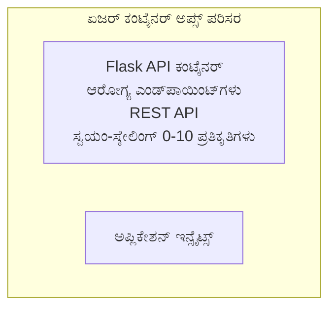

# ಸರಳ Flask API - Container Apps ಉದಾಹರಣೆ

**ಅಧ್ಯಯನ ಮಾರ್ಗ:** ಆರಂಭಿಕ ⭐ | **ಸಮಯ:** 25-35 ನಿಮಿಷಗಳು | **ಖರ್ಚು:** $0-15/ಮಾಸ

Azure Container Apps ಅನ್ನು ಬಳಸಿಕೊಂಡು Azure Developer CLI (azd) ಮೂಲಕ ನಿಯೋಜಿಸಲಾದ ಪೂರ್ಣವಾಗಿ ಕಾರ್ಯನಿರ್ವಹಿಸುವ Python Flask REST API. ಈ ಉದಾಹರಣೆ ಕಂಟೈನರ್ ನಿಯೋಜನೆ, ಸ್ವಯಂ-ಸ್ಕೇಲಿಂಗ್ ಮತ್ತು ಮಾನಿಟರಿಂಗ್ ಮೂಲಭೂತಗಳನ್ನು ತೋರಿಸುತ್ತದೆ.

## 🎯 ನೀವು ಏನು ಕಲಿಯುತ್ತೀರಿ

- ಕಂಟೈನರೀಕೃತ Python ಅಪ್ಲಿಕೇಶನ್ ಅನ್ನು Azure ಗೆ ನಿಯೋಜಿಸುವುದು
- scale-to-zero ಸಹಿತ ಸ್ವಯಂ-ಸ್ಕೇಲಿಂಗ್ ಅನ್ನು ಸಂರಚಿಸುವುದು
- ಹೆಲ್ತ್ ಪ್ರೋಬ್‌ಗಳು ಮತ್ತು ರೆಡಿಯ್ನೆಸ್ ಚೆಕ್‌ಗಳನ್ನು ಜಾರಿಗೆ ತರುವುದು
- ಅಪ್ಲಿಕೇಶನ್ ಲಾಗ್‌ಗಳು ಮತ್ತು ಮೆಟ್ರಿಕ್ಸ್‌ಗಳನ್ನು ಗಮನಿಸುವುದು
- ವೇಗದ ನಿಯೋಜನೆಗಾಗಿ Azure Developer CLI ಬಳಸುವುದು

## 📦 ಒಳಗೊಂಡಿರುವವು

✅ **Flask Application** - ಪೂರ್ಣ REST API CRUD ಕಾರ್ಯಾಚರಣೆಗಳೊಂದಿಗೆ (`src/app.py`)  
✅ **Dockerfile** - ಉತ್ಪಾದನಾ-ಸಿದ್ಧ ಕಂಟೈನರ್ ಸಂರಚನೆ  
✅ **Bicep Infrastructure** - Container Apps ಪರಿಸರ ಮತ್ತು API ನಿಯೋಜನೆ  
✅ **AZD Configuration** - ಒಂದು ಆಜ್ಞೆಯಿಂದ ನಿಯೋಜನೆ ಸೆಟ್‌ಅಪ್  
✅ **Health Probes** - ಲೈವ್ನೆಸ್ ಮತ್ತು ರೆಡಿನೆಸ್ ಚೆಕ್‌ಗಳು ಸಂರಚಿಸಲಾಗಿದೆ  
✅ **Auto-scaling** - HTTP ಲೋಡ್ ಆಧಾರದ ಮೇಲೆ 0-10 ರಿಪ್ಲಿಕಾಗಳು  

## ವಾಸ್ತುಶಿಲ್ಪ



## ಪೂರ್ವಾಪೇಕ್ಷೆಗಳು

### ಅಗತ್ಯ
- **Azure Developer CLI (azd)** - [ಸ್ಥಾಪನಾ ಮಾರ್ಗದರ್ಶಿ](https://learn.microsoft.com/azure/developer/azure-developer-cli/install-azd)
- **Azure subscription** - [ಉಚಿತ ಖಾತೆ](https://azure.microsoft.com/free/)
- **Docker Desktop** - [Docker ಅನ್ನು ಸ್ಥಾಪಿಸಿ](https://www.docker.com/products/docker-desktop/) (ಸ್ಥಳೀಯ ಪರೀಕ್ಷೆಗಾಗಿ)

### ಪೂರ್ವಾಪೇಕ್ಷೆಗಳನ್ನು ಪರಿಶೀಲಿಸಿ

```bash
# azd ಆವೃತ್ತಿಯನ್ನು ಪರಿಶೀಲಿಸಿ (1.5.0 ಅಥವಾ ಅದಕ್ಕಿಂತ ಮೇಲಿನ ಅಗತ್ಯ)
azd version

# Azure ಲಾಗಿನ್ ಪರಿಶೀಲಿಸಿ
azd auth login

# Docker ಪರಿಶೀಲಿಸಿ (ಐಚ್ಛಿಕ, ಸ್ಥಳೀಯ ಪರೀಕ್ಷೆಗಾಗಿ)
docker --version
```

## ⏱️ ನಿಯೋಜನೆ ಸಮಯರೇಖೆ

| ಹಂತ | ಅವಧಿ | ಏನಾಗುತ್ತದೆ |
|-------|----------|--------------||
| ಪರಿಸರ ಸ್ಥಾಪನೆ | 30 ಸೆಕೆಂಡುಗಳು | azd ಪರಿಸರವನ್ನು ರಚಿಸಿ |
| Build container | 2-3 ನಿಮಿಷಗಳು | Docker ಮೂಲಕ Flask ಅಪ್ಲಿಕೇಶನ್ ಅನ್ನು ನಿರ್ಮಿಸಿ |
| Provision infrastructure | 3-5 ನಿಮಿಷಗಳು | Container Apps, ರೆಜಿಸ್ಟ್ರಿ, ಮಾನಿಟರಿಂಗ್ ರಚಿಸಿ |
| Deploy application | 2-3 ನಿಮಿಷಗಳು | ಇಮೇಜ್ ಪುಶ್ ಮಾಡಿ ಮತ್ತು Container Apps ಗೆ ನಿಯೋಜಿಸಿ |
| **ಒಟ್ಟು** | **8-12 ನಿಮಿಷಗಳು** | ಪೂರ್ಣ ನಿಯೋಜನೆ ತಯಾರಾಗಿದೆ |

## ತ್ವರಿತ ಪ್ರಾರಂಭ

```bash
# ಉದಾಹರಣೆಗೆ ನವಿಗೇಟ್ ಮಾಡಿ
cd examples/container-app/simple-flask-api

# ಪರಿಸರವನ್ನು ಪ್ರಾರಂಭಿಸಿ (ವಿಶಿಷ್ಟ ಹೆಸರನ್ನು ಆಯ್ಕೆಮಾಡಿ)
azd env new myflaskapi

# ಎಲ್ಲವನ್ನೂ ನಿಯೋಜಿಸಿ (ಇನ್ಫ್ರಾಸ್ಟ್ರಕ್ಚರ್ + ಅಪ್ಲಿಕೇಶನ್)
azd up
# ನಿಮಗೆ ಕೆಳಗಿನಂತೆ ಕೇಳಲಾಗುತ್ತದೆ:
# 1. Azure ಸಬ್ಸ್ಕ್ರಿಪ್ಶನ್ ಆಯ್ಕೆಮಾಡಿ
# 2. ಸ್ಥಳ ಆಯ್ಕೆಮಾಡಿ (ಉದಾ., eastus2)
# 3. ನಿಯೋಜನೆಗಾಗಿ 8-12 ನಿಮಿಷ ಕಾಯಿರಿ

# ನಿಮ್ಮ API ಎಂಡ್‌ಪಾಯಿಂಟ್ ಪಡೆಯಿರಿ
azd env get-values

# API ಅನ್ನು ಪರೀಕ್ಷಿಸಿ
curl $(azd env get-value API_ENDPOINT)/health
```

**ಅಂದುಕೊಂಡ ಫಲಿತಾಂಶ:**
```json
{
  "status": "healthy",
  "timestamp": "2025-11-19T10:30:00Z",
  "service": "simple-flask-api",
  "version": "1.0.0"
}
```

## ✅ ನಿಯೋಜನೆಯನ್ನು ಪರಿಶೀಲಿಸಿ

### ಹಂತ 1: ನಿಯೋಜನೆ ಸ್ಥಿತಿಯನ್ನು ಪರಿಶೀಲಿಸಿ

```bash
# ಅಳವಡಿಸಿರುವ ಸೇವೆಗಳನ್ನು ವೀಕ್ಷಿಸಿ
azd show

# ನಿರೀಕ್ಷಿತ ಔಟ್‌ಪುಟ್ ತೋರಿಸುತ್ತದೆ:
# - ಸೇವೆ: api
# - ಎಂಡ್‌ಪಾಯಿಂಟ್: https://ca-api-[env].xxx.azurecontainerapps.io
# - ಸ್ಥಿತಿ: ಚಾಲನೆಯಲ್ಲಿದೆ
```

### ಹಂತ 2: API ಎಂಡ್‌ಪಾಯಿಂಟ್‌ಗಳನ್ನು ಪರೀಕ್ಷಿಸಿ

```bash
# API ಎಂಡ್‌ಪಾಯಿಂಟ್ ಪಡೆಯಿರಿ
API_URL=$(azd env get-value API_ENDPOINT)

# ಹೆಲ್ತ್ ಪರೀಕ್ಷಿಸಿ
curl $API_URL/health

# ರೂಟ್ ಎಂಡ್‌ಪಾಯಿಂಟ್ ಪರೀಕ್ಷಿಸಿ
curl $API_URL/

# ಒಂದು ಐಟಂ ರಚಿಸಿ
curl -X POST $API_URL/api/items \
  -H "Content-Type: application/json" \
  -d '{"name": "Test Item", "description": "My first item"}'

# ಎಲ್ಲಾ ಐಟಂಗಳನ್ನು ಪಡೆಯಿರಿ
curl $API_URL/api/items
```

**ಯಶಸ್ಸಿನ ಮಾಪಕಗಳು:**
- ✅ Health endpoint HTTP 200 ಅನ್ನು ಹಿಂತಿರುಗಿಸುತ್ತದೆ
- ✅ ರೂಟ್ ಎಂಡ್‌ಪಾಯಿಂಟ್ API ಮಾಹಿತಿಯನ್ನು ತೋರಿಸುತ್ತದೆ
- ✅ POST ಐಟಂ ಅನ್ನು ರಚಿಸುತ್ತದೆ ಮತ್ತು HTTP 201 ಅನ್ನು ಹಿಂತಿರುಗಿಸುತ್ತದೆ
- ✅ GET ರಚಿಸಿದ ಐಟಂಗಳನ್ನು ಹಿಂತಿರುಗಿಸುತ್ತದೆ

### ಹಂತ 3: ಲಾಗ್‌ಗಳನ್ನು ವೀಕ್ಷಿಸಿ

```bash
# azd monitor ಬಳಸಿ ಜೀವಂತ ಲಾಗ್‌ಗಳನ್ನು ಸ್ಟ್ರೀಮ್ ಮಾಡಿ
azd monitor --logs

# ಅಥವಾ Azure CLI ಬಳಸಿ:
az containerapp logs show --name api --resource-group $RG_NAME --follow

# ನೀವು ಕೆಳಗಿನವುಗಳನ್ನು ಕಾಣಬಹುದು:
# - Gunicorn ಪ್ರಾರಂಭದ ಸಂದೇಶಗಳು
# - HTTP ವಿನಂತಿ ಲಾಗ್‌ಗಳು
# - ಅಪ್ಲಿಕೇಶನ್ ಮಾಹಿತಿ ಲಾಗ್‌ಗಳು
```

## ಪ್ರಾಜೆಕ್ಟ್ ರಚನೆ

```
simple-flask-api/
├── azure.yaml              # AZD configuration
├── infra/
│   ├── main.bicep         # Main infrastructure
│   ├── main.parameters.json
│   └── app/
│       ├── container-env.bicep
│       └── api.bicep
└── src/
    ├── app.py             # Flask application
    ├── requirements.txt
    └── Dockerfile
```

## API ಎಂಡ್‌ಪಾಯಿಂಟ್‌ಗಳು

| ಎಂಡ್‌ಪಾಯಿಂಟ್ | ವಿಧಾನ | ವಿವರಣೆ |
|----------|--------|-------------|
| `/health` | GET | ಹೆಲ್ತ್ ಚೆಕ್ |
| `/api/items` | GET | ಎಲ್ಲಾ ಐಟಂಗಳನ್ನು ಪಟ್ಟಿ ಮಾಡಿ |
| `/api/items` | POST | ಹೊಸ ಐಟಂ ರಚಿಸು |
| `/api/items/{id}` | GET | ನಿರ್ದಿಷ್ಟ ಐಟಂ ಪಡೆಯಿರಿ |
| `/api/items/{id}` | PUT | ಐಟಂ ನವೀಕರಿಸಿ |
| `/api/items/{id}` | DELETE | ಐಟಂ ಅಳಿಸಿ |

## ಸಂರಚನೆ

### ಪರಿಸರ ಚರಗಳು

```bash
# ಕಸ್ಟಮ್ ಸಂರಚನೆಯನ್ನು ಹೊಂದಿಸಿ
azd env set PORT 8000
azd env set LOG_LEVEL info
azd env set MAX_REPLICAS 20
```

### ಸ್ಕೇಲಿಂಗ್ ಸಂರಚನೆ

API ಸ್ವಯಂಚಾಲಿತವಾಗಿ HTTP ಟ್ರಾಫಿಕ್ ಆಧಾರದ ಮೇಲೆ ಸ್ಕೇಲ್ ಆಗುತ್ತದೆ:
- **ಕನಿಷ್ಟ ರಿಪ್ಲಿಕಾಗಳು**: 0 (ನಿಶ್ಚಲ ಸಮಯದಲ್ಲಿ ಶೂನ್ಯಕ್ಕೆ ಸ್ಕೇಲ್ ಆಗುತ್ತದೆ)
- **ಗರಿಷ್ಠ ರಿಪ್ಲಿಕಾಗಳು**: 10
- **ಪ್ರತಿ ರಿಪ್ಲಿಕಾಗೆ ಸಮಕಾಲೀನ ವಿನಂತಿಗಳು**: 50

## ಅಭಿವೃದ್ಧಿ

### ಸ್ಥಳೀಯವಾಗಿ ಚಾಲನೆ ಮಾಡಿ

```bash
# ಅವಲಂಬನೆಗಳನ್ನು ಇನ್‌ಸ್ಟಾಲ್ ಮಾಡಿ
cd src
pip install -r requirements.txt

# ಆಪ್ ಅನ್ನು ಓಡಿಸಿ
python app.py

# ಸ್ಥಳೀಯವಾಗಿ ಪರೀಕ್ಷಿಸಿ
curl http://localhost:8000/health
```

### ಕಂಟೈನರ್ ನಿರ್ಮಿಸಿ ಮತ್ತು ಪರೀಕ್ಷೆ ಮಾಡಿ

```bash
# Docker ಇಮೇಜ್ ನಿರ್ಮಿಸಿ
docker build -t flask-api:local ./src

# ಸ್ಥಳೀಯವಾಗಿ ಕಂಟೇನರ್ ಅನ್ನು ಓಡಿಸಿ
docker run -p 8000:8000 flask-api:local

# ಕಂಟೇನರ್ ಅನ್ನು ಪರೀಕ್ಷಿಸಿ
curl http://localhost:8000/health
```

## ನಿಯೋಜನೆ

### ಪೂರ್ಣ ನಿಯೋಜನೆ

```bash
# ಆಧಾರಸೌಕರ್ಯ ಮತ್ತು ಅಪ್ಲಿಕೇಶನ್ ಅನ್ನು ನಿಯೋಜಿಸಿ
azd up
```

### ಕೋಡ್-ಮಾತ್ರ ನಿಯೋಜನೆ

```bash
# ಅಪ್ಲಿಕೇಶನ್‌ ಕೋಡ್ ಅನ್ನು ಮಾತ್ರ ನಿಯೋಜಿಸಿ (ಮೂಲಸೌಕರ್ಯ ಬದಲಾಗದಿರಲಿ)
azd deploy api
```

### ಸಂರಚನೆಯನ್ನು ನವೀಕರಿಸಿ

```bash
# ಪರಿಸರ ಚರಗಳನ್ನು ನವೀಕರಿಸಿ
azd env set API_KEY "new-api-key"

# ಹೊಸ ಸಂರಚನೆಯೊಂದಿಗೆ ಮರುಸ್ಥಾಪನೆ ಮಾಡಿ
azd deploy api
```

## ಮಾನಿಟರಿಂಗ್

### ಲಾಗ್‌ಗಳನ್ನು ವೀಕ್ಷಿಸಿ

```bash
# azd monitor ಬಳಸಿ ನೇರ ಲಾಗ್‌ಗಳನ್ನು ಸ್ಟ್ರೀಮ್ ಮಾಡಿ
azd monitor --logs

# ಅಥವಾ Container Apps ಗಾಗಿ Azure CLI ಬಳಸಿ:
az containerapp logs show --name api --resource-group $RG_NAME --follow

# ಕೊನೆಯ 100 ಸಾಲುಗಳನ್ನು ವೀಕ್ಷಿಸಿ
az containerapp logs show --name api --resource-group $RG_NAME --tail 100
```

### ಮೆಟ್ರಿಕ್‌ಗಳನ್ನು ಮಾನಿಟರ್ ಮಾಡಿ

```bash
# Azure Monitor ಡ್ಯಾಶ್‌ಬೋರ್ಡ್ ತೆರೆಯಿರಿ
azd monitor --overview

# ನಿರ್ದಿಷ್ಟ ಮೆಟ್ರಿಕ್‌ಗಳನ್ನು ವೀಕ್ಷಿಸಿ
az monitor metrics list \
  --resource $(azd show --output json | jq -r '.services.api.resourceId') \
  --metric "Requests,ResponseTime"
```

## ಪರೀಕ್ಷೆ

### ಆರೋಗ್ಯ ಪರಿಶೀಲನೆ

```bash
curl $(azd show --output json | jq -r '.services.api.endpoint')/health
```

ಎಂದು ನಿರೀಕ್ಷಿತ ಪ್ರತಿಕ್ರಿಯೆ:
```json
{
  "status": "healthy",
  "timestamp": "2025-11-19T10:30:00Z"
}
```

### ಐಟಂ ರಚನೆ

```bash
curl -X POST $(azd show --output json | jq -r '.services.api.endpoint')/api/items \
  -H "Content-Type: application/json" \
  -d '{"name": "Test Item", "description": "A test item"}'
```

### ಎಲ್ಲಾ ಐಟಂಗಳನ್ನು ಪಡೆಯಿರಿ

```bash
curl $(azd show --output json | jq -r '.services.api.endpoint')/api/items
```

## ವೆಚ್ಚ ಉಳಿತಾಯ

ಈ ನಿಯೋಜನೆ scale-to-zero ಬಳಸುತ್ತದೆ, ಆದ್ದರಿಂದ API ವಿನಂತಿಗಳನ್ನು ಪ್ರಾಸೆಸ್ ಮಾಡುವಾಗ ಮಾತ್ರ ನೀವು ಪಾವತಿಸುತ್ತೀರಿ:

- **ನಿಶ್ಚಲ ವೆಚ್ಚ**: ~$0/ಮಾಸ (ಶೂನ್ಯಕ್ಕೆ ಸ್ಕೇಲ್ ಆಗುತ್ತದೆ)
- **ಚಟುವಟಿಕೆಯ ವೆಚ್ಚ**: ~$0.000024/ಸೆಕೆಂಡ್ ಪ್ರತಿ ರಿಪ್ಲಿಕಾ
- **ನಿರೀಕ್ಷಿತ ಮಾಸಿಕ ವೆಚ್ಚ** (ತಗ್ಗಿನ ಬಳಕೆ): $5-15

### ವೆಚ್ಚ ಇನ್ನು ಕಡಿಮೆ ಮಾಡುವುದು

```bash
# ಡೆವ್‌ಗಾಗಿ ಗರಿಷ್ಠ ರೆಪ್ಲಿಕಾಗಳನ್ನು ಕಡಿಮೆ ಮಾಡಿ
azd env set MAX_REPLICAS 3

# ಕಡಿಮೆ ನಿಷ್ಕ್ರಿಯ ಸಮಯ ಮಿತಿಯನ್ನು ಬಳಸಿ
azd env set SCALE_TO_ZERO_TIMEOUT 300  # 5 ನಿಮಿಷ
```

## ಸಮಸ್ಯೆ ಪರಿಹಾರ

### ಕಂಟೈನರ್ ಪ್ರಾರಂಭವಾಗುವುದಿಲ್ಲ

```bash
# Azure CLI ಬಳಸಿ ಕಂಟೇನರ್ ಲಾಗ್‌ಗಳನ್ನು ಪರಿಶೀಲಿಸಿ
az containerapp logs show --name api --resource-group $RG_NAME --tail 100

# Docker ಇಮೇಜ್‌ಗಳ ನಿರ್ಮಾಣವನ್ನು ಸ್ಥಳೀಯವಾಗಿ ಪರಿಶೀಲಿಸಿ
docker build -t test ./src
```

### API ಪ್ರವೇಶವಿಲ್ಲ

```bash
# Ingress ಹೊರಗಿನದಾಗಿದೆ ಎಂದು ಪರಿಶೀಲಿಸಿ
az containerapp show --name api --resource-group rg-simple-flask-api \
  --query properties.configuration.ingress.external
```

### ಉತ್ತರ ಸಮಯ ಹೆಚ್ಚಾಗಿದೆ

```bash
# CPU/ಮೆಮೊರಿ ಬಳಕೆಯನ್ನು ಪರಿಶೀಲಿಸಿ
az monitor metrics list \
  --resource $(azd show --output json | jq -r '.services.api.resourceId') \
  --metric "CPUPercentage,MemoryPercentage"

# ಅಗತ್ಯವಿದ್ದರೆ ಸಂಪನ್ಮೂಲಗಳನ್ನು ಹೆಚ್ಚಿಸಿ
az containerapp update --name api --resource-group rg-simple-flask-api \
  --cpu 1.0 --memory 2Gi
```

## ಸ್ವಚ್ಛಗೊಳಿಸು

```bash
# ಎಲ್ಲಾ ಸಂಪನ್ಮೂಲಗಳನ್ನು ಅಳಿಸಿ
azd down --force --purge
```

## ಮುಂದಿನ ಹಂತಗಳು

### ಈ ಉದಾಹರಣೆಯನ್ನು ವಿಸ್ತರಿಸಿ

1. **ಡೇಟಾಬೇಸ್ ಸೇರಿಸಿ** - Azure Cosmos DB ಅಥವಾ SQL Database ಅನ್ನು ಇಂಟಿಗ್ರೇಟ್ ಮಾಡಿ
   ```bash
   # infra/main.bicep ಗೆ Cosmos DB ಮಾಡ್ಯೂಲ್ ಸೇರಿಸಿ
   # app.py ಅನ್ನು ಡೇಟಾಬೇಸ್ ಸಂಪರ್ಕದೊಂದಿಗೆ ನವೀಕರಿಸಿ
   ```

2. **ಪ್ರಮಾಣೀಕರಣ ಸೇರಿಸಿ** - Microsoft Entra ID ಅಥವಾ API ಕೀಗಳನ್ನು ಜಾರಿಗೆ ತರು
   ```python
   # app.py ಗೆ ಪ್ರಾಮಾಣೀಕರಣ ಮಧ್ಯವರ್ತಿಯನ್ನು ಸೇರಿಸಿ
   from functools import wraps
   ```

3. **CI/CD ಅನ್ನು ಹೊಂದಿಸಿ** - GitHub Actions ವರ್ಕ್‌ಫ್ಲೋ
   ```yaml
   # Create .github/workflows/deploy.yml
   name: Deploy to Azure
   on: [push]
   ```

4. **Managed Identity ಸೇರಿಸಿ** - Azure ಸೇವೆಗಳಿಗೆ ಸುರಕ್ಷಿತ ಪ್ರವೇಶ ದೊರಕಿಸಲು
   ```bicep
   # Update infra/app/api.bicep
   identity: { type: 'SystemAssigned' }
   ```

### ಸಂಬಂಧಿತ ಉದಾಹರಣೆಗಳು

- **[ಡೇಟಾಬೇಸ್ ಅಪ್](../../../../../examples/database-app)** - SQL ಡೇಟಾಬೇಸ್‌ನೊಂದಿಗೆ ಸಂಪೂರ್ಣ ಉದಾಹರಣೆ
- **[ಮೈಕ್ರೋಸರ್ವಿಸಸ್](../../../../../examples/container-app/microservices)** - ಬಹು-ಸೇವೆಗಳ ವಾಸ್ತುಶಿಲ್ಪ
- **[Container Apps Master Guide](../README.md)** - ಎಲ್ಲಾ ಕಂಟೈನರ್ ಮಾದರಿಗಳು

### ಅಭ್ಯಾಸ ಸಂಪನ್ಮೂಲಗಳು

- 📚 [AZD For Beginners Course](../../../README.md) - ಮುಖ್ಯ ಕೋರ್ಸ್ ಹೋಮ್
- 📚 [Container Apps Patterns](../README.md) - ಇನ್ನಷ್ಟು ನಿಯೋಜನೆ ಮಾದರಿಗಳು
- 📚 [AZD Templates Gallery](https://azure.github.io/awesome-azd/) - ಸಮುದಾಯ ಟೆಂಪ್ಲೇಟುಗಳು

## ಹೆಚ್ಚುವರಿ ಸಂಪನ್ಮೂಲಗಳು

### ಡಾಕ್ಯುಮೆಂಟೇಶನ್
- **[Flask Documentation](https://flask.palletsprojects.com/)** - Flask ಫ್ರೇಮ್ವರ್ಕ್ ಮಾರ್ಗದರ್ಶಿ
- **[Azure Container Apps](https://learn.microsoft.com/azure/container-apps/)** - ಅಧಿಕೃತ Azure ಡಾಕ್ಯುಮೆಂಟ್‌ಗಳು
- **[Azure Developer CLI](https://learn.microsoft.com/azure/developer/azure-developer-cli/)** - azd ಆಜ್ಞೆಗಳ ಉಲ್ಲೇಖ

### ಟ್ಯುಟೋರಿಯಲ್ಸ್
- **[Container Apps Quickstart](https://learn.microsoft.com/azure/container-apps/quickstart-portal)** - ನಿಮ್ಮ ಮೊದಲ ಅಪ್ಲಿಕೇಶನ್ ಅನ್ನು ನಿಯೋಜಿಸಿ
- **[Python on Azure](https://learn.microsoft.com/azure/developer/python/)** - Python ಅಭಿವೃದ್ಧಿ ಮಾರ್ಗದರ್ಶಿ
- **[Bicep Language](https://learn.microsoft.com/azure/azure-resource-manager/bicep/)** - ಮೂಲಸೌಕರ್ಯವನ್ನು ಕೋಡ್‌ ಆಗಿ

### ಉಪಕರಣಗಳು
- **[Azure Portal](https://portal.azure.com)** - ಸಂಪನ್ಮೂಲಗಳನ್ನು ದೃಶ್ಯವಾಗಿ ನಿರ್ವಹಿಸಿ
- **[VS Code Azure Extension](https://marketplace.visualstudio.com/items?itemName=ms-azuretools.vscode-azurecontainerapps)** - IDE ಇಂಟಿಗ್ರೇಶನ್

---

**🎉 ಅಭಿನಂದನೆಗಳು!** ನೀವು auto-scaling ಮತ್ತು ಮಾನಿಟರಿಂಗ್‌ ಜೊತೆಗೆ Azure Container Apps ಗೆ ಉತ್ಪಾದನಾ-ಯೋಗ್ಯ Flask API ಅನ್ನು ನಿಯೋಜಿಸಿದ್ದೀರಿ.

**ಪ್ರಶ್ನೆಗಳು?** [ಇಶ್ಯೂ ತೆರೆಯಿರಿ](https://github.com/microsoft/AZD-for-beginners/issues) ಅಥವಾ [ಸಾಮಾನ್ಯ ಪ್ರಶ್ನೆಗಳು](../../../resources/faq.md) ಪರಿಶೀಲಿಸಿ

---

<!-- CO-OP TRANSLATOR DISCLAIMER START -->
**ಅಸ್ವೀಕಾರ**:
ಈ ದಸ್ತಾವೇಜು AI ಅನುವಾದ ಸೇವೆ [Co-op Translator](https://github.com/Azure/co-op-translator) ಬಳಸಿ ಅನುವಾದಿಸಲಾಗಿದೆ. ನಾವು ನಿಖರತೆಯನ್ನು ಸಾಧಿಸಲು ಪ್ರಯತ್ನಿಸುತ್ತಿದ್ದರೂ, ದಯವಿಟ್ಟು ಗಮನಿಸಿ, ಸ್ವಯಂಚಾಲಿತ ಅನುವಾದಗಳಲ್ಲಿ ದೋಷಗಳು ಅಥವಾ ಅಸಡ್ಡೆಗಳು ಇರಬಹುದು. ಮೂಲ ಭಾಷೆಯಲ್ಲಿರುವ ಮೂಲ ದಸ್ತಾವೇಜು ಪ್ರಾಮಾಣಿಕ ಮೂಲವೆಂದು ಪರಿಗಣಿಸಬೇಕು. ಪ್ರಮುಖ ಮಾಹಿತಿಗಾಗಿ, ವೃತ್ತಿಪರ ಮಾನವ ಅನುವಾದವನ್ನು ಶಿಫಾರಸು ಮಾಡಲಾಗುತ್ತದೆ. ಈ ಅನುವಾದವನ್ನು ಬಳಸುವ ಮೂಲಕ ಉಂಟಾಗುವ ಯಾವುದೇ ತಪ್ಪು ಅರ್ಥಗಳ ಅಥವಾ ತಪ್ಪು ವ್ಯಾಖ್ಯಾನಗಳ ಬಗ್ಗೆ ನಾವು ಹೊಣೆಗಾರರಲ್ಲ.
<!-- CO-OP TRANSLATOR DISCLAIMER END -->