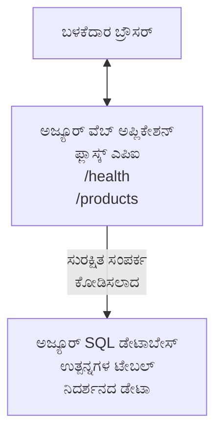

# AZD ಸಹಿತ Microsoft SQL ಡೇಟಾಬೇಸ್ ಮತ್ತು ವೆಬ್ ಅಪ್ ಅನ್ನು ನಿಯೋಜಿಸುವುದು

⏱️ **ಅಂದಾಜು ಸಮಯ**: 20-30 ನಿಮಿಷಗಳು | 💰 **ಅಂದಾಜು ವೆಚ್ಚ**: ~$15-25/ತಿಂಗಳು | ⭐ **ಸಂಕೀರ್ಣತೆ**: ಮಧ್ಯಮ

ಈ **ಪೂರ್ಣ, ಕಾರ್ಯನಿರ್ವಹಿಸುತ್ತಿರುವ ಉದಾಹರಣೆ** [Azure Developer CLI (azd)](https://learn.microsoft.com/azure/developer/azure-developer-cli/) ಬಳಸಿಕೊಂಡು Python Flask ವೆಬ್ ಅಪ್ಲಿಕೇಶನ್‌ನ್ನು Microsoft SQL ಡೇಟಾಬೇಸ್ ಜೊತೆಗೆ Azure ಗೆ ನಿಯೋಜಿಸುವುದನ್ನು ತೋರಿಸುತ್ತದೆ. ಎಲ್ಲಾ ಕೋಡ್ ಸೇರಿಸಲಾಗಿದೆ ಮತ್ತು ಪರೀಕ್ಷಿಸಲಾಗಿದೆ—ಯಾವುದೇ ಬಾಹ್ಯ ಅವಶ್ಯಕತೆ ಇಲ್ಲ.

## ನೀವು ಕಲಿಯುವದು ಏನು

ಈ ಉದಾಹರಣೆಯನ್ನು ಪೂರ್ಣಗೊಳಿಸುವ ಮೂಲಕ ನೀವು:
- ಬಹು-ಸ್ಥರ ಅಪ್ಲಿಕೇಶನ್ (ವೆಬ್ ಅಪ್ + ಡೇಟಾಬೇಸ್) ಅನ್ನು ತುಂಡನೆಯಂತೆ ಆಧಾರಿತವಾಗಿಸಿ ನಿಯೋಜಿಸುವುದು
- ರಹಸ್ಯಗಳನ್ನು ಹಾರ್ಡ್‌ಕೋಡ್ ಮಾಡದೆ ಸುರಕ್ಷಿತ ಡೇಟಾಬೇಸ್ ಸಂಪರ್ಕಗಳನ್ನು ಸಂರಚಿಸುವುದು
- ಅಪ್ಲಿಕೇಶನ್ ಇನ್ಸೈಟ್ಸ್ ಮೂಲಕ ಅಪ್ಲಿಕೇಶನ್ ಆರೋಗ್ಯವನ್ನು ಮೇಲ್ವಿಚಾರಣೆ ಮಾಡುವುದು
- AZD CLI ಬಳಸಿ Azure ಸಂಪನ್ಮೂಲಗಳನ್ನು ಪರಿಣಾಮಕಾರಿಯಾಗಿ ನಿರ್ವಹಿಸುವುದು
- ಸುರಕ್ಷತೆ, ವೆಚ್ಚ ಉತ್ಕೃಷ್ಟತೆ ಮತ್ತು ನಿಗಾವಣೆಗಾಗಿ Azure ಉತ್ತಮ ಅಭ್ಯಾಸಗಳನ್ನು ಅನುಸರಿಸುವುದು

## ದೃಶ್ಯಕ್ರಮ ಅವಲೋಕನ
- **ವೆಬ್ ಅಪ್ಲಿಕೇಶನ್**: Python Flask REST API ಡೇಟಾಬೇಸ್ ಸಂಪರ್ಕದೊಂದಿಗೆ
- **ಡೇಟಾಬೇಸ್**: ಮಾದರಿ ಡೇಟಾ ಹೊಂದಿದ್ದ Azure SQL ಡೇಟಾಬೇಸ್
- **ಇನ್ಫ್ರಾಸ್ಟ್ರಕ್ಚರ್**: Bicep (ಮಾಡ್ಯೂಲರ್, ಪುನರಿಮುಖ ಟೆಂಪ್ಲೇಟ್ಗಳು) ಮೂಲಕ ಒದಗಿಸಲಾಗಿದೆ
- **ನಿಯೋಜನೆ**: azd ಕಮಾಂಡ್ಗಳ ಮೂಲಕ ಸಂಪೂರ್ಣ ಸ್ವಯಂಚಾಲಿತ
- **ಮೊನಿಟರಿಂಗ್**: ಲಾಗ್‌ಗಳು ಮತ್ತು ಟೆಲಿಮೆಟ್ರಿಗಾಗಿ ಅಪ್ಲಿಕೇಶನ್ ಇನ್ಸೈಟ್ಸ್

## ಪೂರ್ವಾಪೇಕ್ಷಿತಗಳು

### ಅಗತ್ಯ ಉಪಕರಣಗಳು

ಪ್ರಾರಂಭಿಸುವ ಮೊದಲು, ನೀವು ಈ ಉಪಕರಣಗಳನ್ನು ಸ್ಥಾಪಿಸಿಕೊಂಡಿರಬೇಕು ಎಂದು ಖಚಿತಪಡಿಸಿಕೊಳ್ಳಿ:

1. **[Azure CLI](https://learn.microsoft.com/cli/azure/install-azure-cli)** (ಆವೃತ್ತಿ 2.50.0 ಅಥವಾ ಹೆಚ್ಚುವರಿ)
   ```sh
   az --version
   # ನಿರೀಕ್ಷಿತ ಕಳೆದಿಸು: azure-cli 2.50.0 ಅಥವಾ ಹೆಚ್ಚಿನದು
   ```

2. **[Azure Developer CLI (azd)](https://learn.microsoft.com/azure/developer/azure-developer-cli/install-azd)** (ಆವೃತ್ತಿ 1.0.0 ಅಥವಾ ಹೆಚ್ಚುವರಿ)
   ```sh
   azd version
   # ನಿರೀಕ್ಷಿತ ಔಟ್‌ಪುಟ್: azd ಆವೃತ್ತಿ 1.0.0 ಅಥವಾ ನಂತರದದ್ದು
   ```

3. **[Python 3.8+](https://www.python.org/downloads/)** (ಸ್ಥಳೀಯ ಅಭಿವೃದ್ಧಿಗೆ)
   ```sh
   python --version
   # ನಿರೀಕ್ಷಿತ ಫಲಿತಾಂಶ: Python 3.8 ಅಥವಾ أعلى
   ```

4. **[Docker](https://www.docker.com/get-started)** (ಐಚ್ಛಿಕ, ಸ್ಥಳೀಯ ಕಂಟೈನರೈಜ್ಡ್ ಅಭಿವೃದ್ಧಿಗಾಗಿ)
   ```sh
   docker --version
   # ನಿರೀಕ್ಷಿಸಲಾದ ಔಟ್‌ಪುಟ್: ಡೋಕರ್ ಸಂಸ್ಕರಣೆ 20.10 ಅಥವಾ ಹೆಚ್ಚು
   ```

### Azure ಅವಶ್ಯಕತೆಗಳು

- ಸಕ್ರಿಯ **Azure ಸಬ್ಸ್ಕ್ರಿಪ್ಷನ್** ([ಉಚಿತ ಖಾತೆ ನಿರ್ಮಿಸಿ](https://azure.microsoft.com/free/))
- ನಿಮ್ಮ ಸಬ್ಸ್ಕ್ರಿಪ್ಷನ್‌ನಲ್ಲಿ ಸಂಪನ್ಮೂಲಗಳನ್ನು ರಚಿಸುವ ಅನುಮತಿಗಳು
- ಸಬ್ಸ್ಕ್ರಿಪ್ಷನ್ ಅಥವಾ ಸಂಪನ್ಮೂಲ ಗುಂಪಿನ ಮೇಲೆ **ಮಾಲೀಕ** ಅಥವಾ **ಕಾಲುಹಾಕಿದವರ** ಪಾತ್ರ

### ಜ್ಞಾನ ಪೂರ್ವಾಪೇಕ್ಷಿತಗಳು

ಇದು **ಮಧ್ಯಮ ಮಟ್ಟದ** ಉದಾಹರಣೆ. ನೀವು ತಿಳಿದಿರುವುದು ಉತ್ತಮ:
- ಮೂಲ ಭೂತ ಆಜ್ಞಾ ಸಾಲ ಕಾರ್ಯಾಚರಣೆಗಳು
- ಮೂಲಭೂತ ಕ್ಲೌಡ್ ತತ್ವಗಳು (ಸಂಪನ್ಮೂಲಗಳು, ಸಂಪನ್ಮೂಲ ಗುಂಪುಗಳು)
- ವೆಬ್ ಅಪ್ಲಿಕೇಶನ್‌ಗಳು ಮತ್ತು ಡೇಟಾಬೇಸ್‌ಗಳ ಮೂಲದಾಯಕ ತಿಳಿವು

**AZD ಹೊಸದಾಗಿ?** ಮೊದಲು [ಪ್ರಾರಂಭಿಸುವ ಮಾರ್ಗದರ್ಶಿ](../../docs/chapter-01-foundation/azd-basics.md) ಓದಿ.

## ವಾಸ್ತವ್ಯಶಿಲ್ಪ

ಈ ಉದಾಹರಣೆ ಎರಡು-ಹಂತ ವಾಸ್ತವ್ಯಶಿಲ್ಪವನ್ನು ವೆಬ್ ಅಪ್ಲಿಕೇಶನ್ ಮತ್ತು SQL ಡೇಟಾಬೇಸ್ ಜೊತೆಗೆ ನಿಯೋಜಿಸುತ್ತದೆ:


**ಸಂಪನ್ಮೂಲ ನಿಯೋಜನೆ:**
- **ಸಂಪನ್ಮೂಲ ಗುಂಪು**: ಎಲ್ಲಾ ಸಂಪನ್ಮೂಲಗಳಿಗೆ ಕಂಟೈನರ್
- **ಅ್ಯಪ್ ಸೇವಾ ಯೋಜನೆ**: ಲಿನಕ್ಸರ್ ಆಧಾರಿತ ಆತಿಥ್ಯ (ವೆಚ್ಚ ಸಮರ್ಥನೆಗಾಗಿ B1 ಹಂತ)
- **ವೆಬ್ ಅಪ್**: Python 3.11 ರನ್‌ಟೈಮ್ ಮತ್ತು Flask ಅಪ್ಲಿಕೇಶನ್
- **SQL ಸರ್ವರ್**: TLS 1.2 ಕನಿಷ್ಠ ಹೊಂದಿರುವ ನಿರ್ವಹಿತ ಡೇಟಾಬೇಸ್ ಸರ್ವರ್
- **SQL ಡೇಟಾಬೇಸ್**: ಬೇಸಿಕ್ ಹಂತ (2GB ಅಭಿವೃದ್ಧಿ/ಪರೀಕ್ಷೆಗಾಗಿ ಸೂಕ್ತ)
- **ಅಪ್ಲಿಕೇಶನ್ ಇನ್ಸೈಟ್ಸ್**: ಮೇಲ್ವಿಚಾರಣೆ ಮತ್ತು ಲಾಗಿಂಗ್
- **ಲಾಗ್ ಅನಾಲಿಟಿಕ್ಸ್ ವರ್ಕ್‌ಸ್ಪೇಸ್**: ಕೇಂದ್ರಿತ ಲಾಗ್ ಸಂಗ್ರಹಣೆ

**ಉಪಮಾನ**: ಇದು ಒಂದು ಉಪಾಹಾರ ಮಂದಿರ (ವೆಬ್ ಅಪ್ಲಿಕೇಶನ್) ಹಾಗೂ ವಾಕ್-ಇನ್ ಫ್ರೀಜರ್ (ಡೇಟಾಬೇಸ್) ಇದ್ದಂತೆ. ಗ್ರಾಹಕರು ಮೆನು (API ಎಂಡ್ಪಾಯಿಂಟ್‌ಗಳು) ನಿಂದ ಆದೇಶಿಸುತ್ತಾರೆ, ಮತ್ತು ಅಡುಗೆಮನೆ (Flask ಅಪ್ಲಿಕೇಶನ್) ಫ್ರೀಜರ್‌ನಿಂದ (ಡೇಟಾ) ಪದಾರ್ಥಗಳನ್ನು ತೆಗೆದುಕೊಳ್ಳುತ್ತದೆ. ಉಪಾಹಾರ ಮಂದಿರದ ವ್ಯವಸ್ಥಾಪಕ (ಅಪ್ಲಿಕೇಶನ್ ಇನ್ಸೈಟ್ಸ್) ಎಲ್ಲವೂ ಟ್ರ್ಯಾಕ್ ಮಾಡುತ್ತಾನೆ.

## ಫೋಲ್ಡರ್ ರಚನೆ

ಈ ಉದಾಹರಣೆಯಲ್ಲಿ ಎಲ್ಲಾ ಫೈಲ್‌ಗಳು ಸೇರಿವೆ—ಯಾವುದೇ ಬಾಹ್ಯ ಅವಶ್ಯಕತೆ ಇಲ್ಲ:

```
examples/database-app/
│
├── README.md                    # This file
├── azure.yaml                   # AZD configuration file
├── .env.sample                  # Sample environment variables
├── .gitignore                   # Git ignore patterns
│
├── infra/                       # Infrastructure as Code (Bicep)
│   ├── main.bicep              # Main orchestration template
│   ├── abbreviations.json      # Azure naming conventions
│   └── resources/              # Modular resource templates
│       ├── sql-server.bicep    # SQL Server configuration
│       ├── sql-database.bicep  # Database configuration
│       ├── app-service-plan.bicep  # Hosting plan
│       ├── app-insights.bicep  # Monitoring setup
│       └── web-app.bicep       # Web application
│
└── src/
    └── web/                    # Application source code
        ├── app.py              # Flask REST API
        ├── requirements.txt    # Python dependencies
        └── Dockerfile          # Container definition
```

**ಪ್ರತಿ ಫೈಲ್ ಏನು ಮಾಡುತ್ತದೆ:**
- **azure.yaml**: AZD ಗೆ ಏನು ಮತ್ತು ಎಲ್ಲಿ ನಿಯೋಜಿಸುವುದೆಂದು ಸೂಚಿಸುತ್ತದೆ
- **infra/main.bicep**: ಎಲ್ಲಾ Azure ಸಂಪನ್ಮೂಲಗಳನ್ನು ನಿಯಂತ್ರಿಸುತ್ತದೆ
- **infra/resources/*.bicep**: ವೈಯಕ್ತಿಕ ಸಂಪನ್ಮೂಲ ವಿವರಣೆಗಳು (ಮಾಡ್ಯೂಲರ್ ಪುನರಾವರ್ತನೆಗೆ)
- **src/web/app.py**: ಡೇಟಾಬೇಸ್ ಲಾಜಿಕ್ ಹೊಂದಿದ Flask ಅಪ್ಲಿಕೇಶನ್
- **requirements.txt**: Python ಪ್ಯಾಕೇಜ್ ಅವಶ್ಯಕತೆಗಳು
- **Dockerfile**: ನಿಯೋಜನೆಗೆ ಕಂಟೈನರೈಜೇಶನ್ ಸೂಚನೆಗಳು

## ತ್ವರಿತ ಆರಂಭ (ಹಂತ ಹಂತವಾಗಿ)

### ಹಂತ 1: ಕ್ಲೋನ್ ಮಾಡಿ ಮತ್ತು ನಾವಿಗೇಟ್ ಮಾಡಿ

```sh
git clone https://github.com/microsoft/AZD-for-beginners.git
cd AZD-for-beginners/examples/database-app
```

**✓ ಯಶಸ್ಸಿನ ಪರಿಶೀಲನೆ**: ನೀವು `azure.yaml` ಮತ್ತು `infra/` ಫೋಲ್ಡರ್ ಕಾಣಬೇಕು:
```sh
ls
# ನಿರೀಕ್ಷಿಸಲಾಗಿದೆ: README.md, azure.yaml, infra/, src/
```

### ಹಂತ 2: Azure ಜೊತೆ ಪ್ರಾಮಾಣೀಕರಣ

```sh
azd auth login
```

ಇದು ನಿಮ್ಮ ಬ್ರೌಸರ್ ತೆರೆಯುತ್ತದೆ Azure ಪ್ರಾಮಾಣೀಕರಣಕ್ಕೆ. ನಿಮ್ಮ Azure ಕ್ರೆಡೆನ್‌ಷಿಯಲ್‌ಗಳ ಮೂಲಕ ಲಾಗಿನ್ ಆಗಿ.

**✓ ಯಶಸ್ಸಿನ ಪರಿಶೀಲನೆ**: ನೀವು ನೋಡಬೇಕು:
```
Logged in to Azure.
```

### ಹಂತ 3: ಪರಿಸರ ಆರಂಭಿಸು

```sh
azd init
```

**ಏನಾಗುತ್ತದೆ**: AZD ನಿಮ್ಮ ನಿಯೋಜನೆಗಾಗಿ ಸ್ಥಳೀಯ ಸಂರಚನೆಯನ್ನು ರಚಿಸುತ್ತದೆ.

**ನೀವು ಕಾಣಲಿರುವ ಪ್ರಾಂಪ್ಟ್‌ಗಳು**:
- **ಪರಿಸರದ ಹೆಸರು**: ಚಿಕ್ಕ ಹೆಸರು ನಮೂದಿಸಿ (ಉದಾ: `dev`, `myapp`)
- **Azure ಸಬ್ಸ್ಕ್ರಿಪ್ಷನ್**: ಪಟ್ಟಿ ನಿಂದ ನಿಮ್ಮ ಸಬ್ಸ್ಕ್ರಿಪ್ಷನ್ ಆರಿಸಿ
- **Azure ಸ್ಥಳ**: ಒಂದು ಪ್ರದೇಶ ಆಯ್ಕೆಮಾಡಿ (ಉದಾ: `eastus`, `westeurope`)

**✓ ಯಶಸ್ಸಿನ ಪರಿಶೀಲನೆ**: ನೀವು ನೋಡಬೇಕು:
```
SUCCESS: New project initialized!
```

### ಹಂತ 4: Azure ಸಂಪನ್ಮೂಲಗಳನ್ನು ಒದಗಿಸು

```sh
azd provision
```

**ಏನಾಗುತ್ತದೆ**: AZD ಎಲ್ಲಾ ಇನ್ಫ್ರಾಸ್ಟ್ರಕ್ಚರ್ ಅನ್ನು ನಿಯೋಜಿಸುತ್ತದೆ (5-8 ನಿಮಿಷ ತೆಗೆದುಕೊಲ್ಲಬಹುದು):
1. ಸಂಪನ್ಮೂಲ ಗುಂಪು ರಚಿಸುತ್ತದೆ
2. SQL ಸರ್ವರ್ ಮತ್ತು ಡೇಟಾಬೇಸ್ ರಚಿಸುತ್ತದೆ
3. ಅಪ್ ಸೇವಾ ಯೋಜನೆ ರಚಿಸುತ್ತದೆ
4. ವೆಬ್ ಅಪ್ ರಚಿಸುತ್ತದೆ
5. ಅಪ್ಲಿಕೇಶನ್ ಇನ್ಸೈಟ್ಸ್ ರಚಿಸುತ್ತದೆ
6. ನೆಟ್‌ವರ್ಕಿಂಗ್ ಮತ್ತು ಸುರಕ್ಷತೆ ಸಂರಚಿಸುತ್ತದೆ

**ನೀವು ನೀಡಬೇಕಾಗಿರುವುದು**:
- **SQL ಆಡಳಿತ ಬಳಕೆದಾರ ಹೆಸರು**: ಬಳಕೆದಾರ ಹೆಸರು ನಮೂದಿಸಿ (ಉದಾ: `sqladmin`)
- **SQL ಆಡಳಿತ ಗುಪ್ತಪದ**: ಬಲವಾದ ಗುಪ್ತಪದ ನಮೂದಿಸಿ (ಇದನ್ನು ಉಳಿಸಿ!)

**✓ ಯಶಸ್ಸಿನ ಪರಿಶೀಲನೆ**: ನೀವು ನೋಡಬಹುದು:
```
SUCCESS: Your application was provisioned in Azure in X minutes Y seconds.
You can view the resources created under the resource group rg-<env-name> in Azure Portal:
https://portal.azure.com/#@/resource/subscriptions/.../resourceGroups/rg-<env-name>
```

**⏱️ ಸಮಯ**: 5-8 ನಿಮಿಷಗಳು

### ಹಂತ 5: ಅಪ್ಲಿಕೇಶನ್ ನಿಯೋಜಿಸಿ

```sh
azd deploy
```

**ಏನಾಗುತ್ತದೆ**: AZD ನಿಮ್ಮ Flask ಅಪ್ಲಿಕೇಶನ್ ನಿರ್ಮಿಸಿ ನಿಯೋಜಿಸುತ್ತದೆ:
1. Python ಅಪ್ಲಿಕೇಶನ್ ಪ್ಯಾಕೇಜ್ ಮಾಡುತ್ತದೆ
2. ಡೋಕರ್ ಕಂಟೈನರ್ ನಿರ್ಮಿಸುತ್ತದೆ
3. ಅದನ್ನು Azure Web App ಗೆ ಪುಷ್ ಮಾಡುತ್ತದೆ
4. ಮಾದರಿ ಡೇಟಾ ಸಹಿತ ಡೇಟಾಬೇಸ್ ಪ್ರಾರಂಭಿಸುತ್ತದೆ
5. ಅಪ್ಲಿಕೇಶನ್ ಪ್ರಾರಂಭಿಸುತ್ತದೆ

**✓ ಯಶಸ್ಸಿನ ಪರಿಶೀಲನೆ**: ನೀವು ನೋಡಬಹುದು:
```
SUCCESS: Your application was deployed to Azure in X minutes Y seconds.
You can view the resources created under the resource group rg-<env-name> in Azure Portal:
https://portal.azure.com/#@/resource/subscriptions/.../resourceGroups/rg-<env-name>
```

**⏱️ ಸಮಯ**: 3-5 ನಿಮಿಷಗಳು

### ಹಂತ 6: ಅಪ್ಲಿಕೇಶನ್ ಬ್ರೌಸ್ ಮಾಡಿ

```sh
azd browse
```

ಇது ನಿಮ್ಮ ನಿಯೋಜಿಸಿರುವ ವೆಬ್ ಅಪ್ ಅನ್ನು ಬ್ರೌಸರ್ ನಲ್ಲಿ ತೆರೆಯುತ್ತದೆ `https://app-<unique-id>.azurewebsites.net`

**✓ ಯಶಸ್ಸಿನ ಪರಿಶೀಲನೆ**: ನೀವು JSON ಔಟ್‌ಪುಟ್ ನೋಡಬಹುದು:
```json
{
  "message": "Welcome to the Database App API",
  "endpoints": {
    "/": "This help message",
    "/health": "Health check endpoint",
    "/products": "List all products",
    "/products/<id>": "Get product by ID"
  }
}
```

### ಹಂತ 7: API ಎಂಡ್‌ಪಾಯಿಂಟ್‌ಗಳ ಪರೀಕ್ಷೆ

**ಆರೋಗ್ಯ ಪರೀಕ್ಷೆ** (ಡೇಟಾಬೇಸ್ ಸಂಪರ್ಕ ಪರಿಶೀಲಿಸಿ):
```sh
curl https://app-<your-id>.azurewebsites.net/health
```

**ನಿರೀಕ್ಷಿತ ಪ್ರತಿಕ್ರಿಯೆ**:
```json
{
  "status": "healthy",
  "database": "connected"
}
```

**ಉತ್ಪನ್ನಗಳ ಪಟ್ಟಿ** (ಮಾದರಿ ಡೇಟಾ):
```sh
curl https://app-<your-id>.azurewebsites.net/products
```

**ನಿರೀಕ್ಷಿತ ಪ್ರತಿಕ್ರಿಯೆ**:
```json
[
  {
    "id": 1,
    "name": "Laptop",
    "description": "High-performance laptop",
    "price": 1299.99,
    "created_at": "2025-11-19T10:30:00"
  },
  ...
]
```

**ಒಂದು ಉತ್ಪನ್ನ ಪಡೆಯಿರಿ**:
```sh
curl https://app-<your-id>.azurewebsites.net/products/1
```

**✓ ಯಶಸ್ಸಿನ ಪರಿಶೀಲನೆ**: ಎಲ್ಲಾ ಎಂಡ್‌ಪಾಯಿಂಟ್‌ಗಳು ದೋಷವಿಲ್ಲದೆ JSON ಡೇಟಾವನ್ನು ನೀಡಬೇಕು.

---

**🎉 ಅಭಿನಂದನೆಗಳು!** ನೀವು AZD ಬಳಸಿ ಡೇಟಾಬೇಸ್ ಜೊತೆಗೆ ವೆಬ್ ಅಪ್ಲಿಕೇಶನ್ ಅನ್ನು ಯಶಸ್ವಿಯಾಗಿ Azure ಗೆ ನಿಯೋಜಿಸಿದ್ದೀರಿ.

## ಸಂರಚನೆ ಆಳವಾದ ವಿವರಣೆ

### ಪರಿಸರ ವ್ಯತ್ಯಾಸಗಳು (Environment Variables)

ರಹಸ್ಯಗಳನ್ನು ಆಜೂರ್ ಅಪ್ಲಿಕೇಶನ್ ಸೇವೆಯ ಸಂರಚನೆಯ ಮೂಲಕ ಸುರಕ್ಷಿತವಾಗಿ ನಿರ್ವಹಿಸಲಾಗುತ್ತದೆ—**ಮೂಲ ಕೋಡ್‌ನಲ್ಲಿ ಯಾವಾಗಲೂ ಹಾರ್ಡ್‌ಕೋಡ್ ಮಾಡಬಾರದು**.

**ಸ್ವಯಂಚಾಲಿತವಾಗಿ AZD ಮೂಲಕ ಸಂರಚಿಸಲಾಗಿದೆ**:
- `SQL_CONNECTION_STRING`: ಗುಪ್ತಪದ ಸಂರಕ್ಷಿತ ಡೇಟಾಬೇಸ್ ಸಂಪರ್ಕ ಸ್ಟ್ರಿಂಗ್
- `APPLICATIONINSIGHTS_CONNECTION_STRING`: ಮೇಲ್ವಿಚಾರಣೆ ಟೆಲಿಮೆಟ್ರಿ ಎಂಡ್‌ಪಾಯಿಂಟ್
- `SCM_DO_BUILD_DURING_DEPLOYMENT`: ಸ್ವಯಂ_DEPENDENCY ස්ಶ್ರೇಯ ಉಸ್ಥಾಪನೆ

**ರಹಸ್ಯಗಳು ಹೋಗುವುದು**:
1. `azd provision` ಸಮಯದಲ್ಲಿ ನೀವು ಸುರಕ್ಷಿತ ಪ್ರಾಂಪ್ಟ್ ಮೂಲಕ SQL ಕ್ರೆಡೆನ್‌ಷಿಯಲ್ಸ್ ನೀಡುತ್ತಾರೆ
2. AZD ಅವುಗಳನ್ನು ನಿಮ್ಮ ಸ್ಥಳೀಯ `.azure/<env-name>/.env` ಫೈಲ್‌ನಲ್ಲಿ ಇಡುತ್ತದೆ (git-ಈಗ್ನೋರ್ ಆಗಿರುತ್ತದೆ)
3. AZD ಅವುಗಳನ್ನು Azure App Service ಸಂರಚನೆಗೆ (ಶುಭ್ರಗೊಳಿಸಲಾದ ಸ್ಥಿತಿಯಲ್ಲಿ) ಸೇರಿಸುತ್ತದೆ
4. ಅಪ್ಲಿಕೇಶನ್ ಫೈಲಿನಲ್ಲಿ `os.getenv()` ಬಳಸಿ ಓದುವಂತೆ

### ಸ್ಥಳೀಯ ಅಭಿವೃದ್ಧಿ

ಸ್ಥಳೀಯ ಪರೀಕ್ಷನೆಗಾಗಿ ಮಾದರಿ `.env` ಕಡತದಿಂದ ರಚಿಸಿ:

```sh
cp .env.sample .env
# ನಿಮ್ಮ ಸ್ಥಳೀಯ ಡೇಟಾಬೇಸ್ ಸಂಪರ್ಕವನ್ನು ಹೊಂದಿಸಲು .env ಅನ್ನು ಸಂಪಾದಿಸಿ
```

**ಸ್ಥಳೀಯ ಅಭಿವೃದ್ಧಿ ಕಾರ್ಯಪ್ರವಾಹ**:
```sh
# ಅವಲಂಬನೆಗಳನ್ನು ಸ್ಥಾಪಿಸಿ
cd src/web
pip install -r requirements.txt

# ಪರಿಸರ ಚರಗಳು ರಚಿಸಿ
export SQL_CONNECTION_STRING="your-local-connection-string"

# ಅಪ್ಲಿಕೇಶನ್ ಚಾಲನೆಯಿಗೊಳಿಸಿ
python app.py
```

**ಸ್ಥಳೀಯವಾಗಿ ಪರೀಕ್ಷಿಸಿ**:
```sh
curl http://localhost:8000/health
# ನಿರೀಕ್ಷಿತ: {"ಸ್ಥಿತಿ": "ಆರೋಗ್ಯಕರ", "ಡೇಟಾಬೇಸ್": "ಸಂಪರ್ಕಿಸಲಾಗಿದೆ"}
```

### ಇನ್ಫ್ರಾಸ್ಟ್ರಕ್ಚರ್ ಆಸ್ ಕೋಡ್

ಎಲ್ಲಾ Azure ಸಂಪನ್ಮೂಲಗಳು **Bicep ಟೆಂಪ್ಲೇಟುಗಳಲ್ಲಿವೆ** (`infra/` ಫೋಲ್ಡರ್):

- **ಮಾಡ್ಯೂಲರ್ ವಿನ್ಯಾಸ**: ಪ್ರತಿ ಸಂಪನ್ಮೂಲ ತಾರ್ಗೆತರಿಗೆ ಸ್ವಂತ ಫೈಲ್ ಪುನರಾವರ್ತನೆಗೆ
- **ಪ್ಯಾರಾಮೆಟರೈಸ್ಡ್**: SKUಗಳು, ಪ್ರದೇಶಗಳು, ಹೆಸರಿಸುವ ನಿಯಮಗಳನ್ನು ಕಸ್ಟಮೈಸ್ ಮಾಡಬಹುದು
- **ಉತ್ತಮ ಅಭ್ಯಾಸಗಳು**: Azure ನಾಮಕರಣ ನೀತಿಗಳು ಮತ್ತು ಸುರಕ್ಷತೆ ನಿಖರಪಡಿಸಲಾಗಿದೆ
- **ಆವೃತ್ತಿ ನಿಯಂತ್ರಣ**: ಇನ್ಫ್ರಾಸ್ಟ್ರಕ್ಚರ್ ಬದಲಾಗುವುದು Git ನಲ್ಲಿ ಟ್ರ್ಯಾಕ್ ಆಗುತ್ತದೆ

**ಕಸ್ಟಮೈಜೇಶನ್ ಉದಾಹರಣೆ**:
ಡೇಟಾಬೇಸ್ ಹಂತ ಬದಲಾವಣೆ ಮಾಡಲು, `infra/resources/sql-database.bicep` ಎಡಿಟ್ ಮಾಡಿ:
```bicep
sku: {
  name: 'Standard'  // Changed from 'Basic'
  tier: 'Standard'
  capacity: 10
}
```

## ಸುರಕ್ಷತಾ ಉತ್ತಮ ಅಭ್ಯಾಸಗಳು

ಈ ಉದಾಹರಣೆ Azure ಸುರಕ್ಷತಾ ಉತ್ತಮ ಅಭ್ಯಾಸಗಳನ್ನು ಅನುಸರಿಸುತ್ತದೆ:

### 1. **ಮೂಲ ಕೋಡ್‌ನಲ್ಲಿ ಯಾವುದೇ ರಹಸ್ಯಗಳಿಲ್ಲ**
- ✅ ಕ್ರೆಡೆನ್ಷಿಯಲ್ಸ್ Azure ಅಪ್ಲಿಕೇಶನ್ ಸೇವೆಯ ಸಂರಚನೆಯಲ್ಲಿ ಕಳುಹಿಸಲಾಗಿದೆ (ಗುಪ್ತಗೊಳಿಸಲಾಗಿದೆ)
- ✅ `.env` ಕಡತಗಳು Git ನಲ್ಲಿ ಅದೃಶ್ಯ ಮಾಡಲಾಗಿದೆ `.gitignore` ಮೂಲಕ
- ✅ ರಹಸ್ಯಗಳು ಸುರಕ್ಷಿತ ಪ್ಯಾರಾಮೀಟರ್‌ಗಳ ಮೂಲಕ ಒದಗಿಸಲ್ಪಡುತ್ತವೆ

### 2. **ಗುಪ್ತಗೊಳಿಸಿದ ಸಂಪರ್ಕಗಳು**
- ✅ SQL ಸರ್ವರ್‌ಗಾಗಿ ಕನಿಷ್ಟ TLS 1.2
- ✅ ವೆಬ್ ಅಪ್‌ಗಾಗಿ HTTPS ಮಾತ್ರ ಅನ್ವಯ
- ✅ ಡೇಟಾಬೇಸ್ ಸಂಪರ್ಕಗಳು ಗುಪ್ತ ಚಾನೆಲ್‌ಗಳನ್ನು ಬಳಕೆಮಾಡುತ್ತವೆ

### 3. **ನೆಟ್‌ವರ್ಕ್ ಭದ್ರತೆ**
- ✅ SQL ಸರ್ವರ್ ಫೈರ್ವಾಲ್ Azure ಸೇವೆಗಳಿಗಾಗಿ ಮಾತ್ರ ಮಂಜೂರಾತಿ
- ✅ ಸಾರ್ವಜನಿಕ ನೆಟ್‌ವರ್ಕ್ ಪ್ರವೇಶ ನಿರ್ಬಂಧಿತ (ಖಾಸಗಿ ಎಂಡ್ಪಾಯಿಂಟ್‌ಗಳೊಂದಿಗೆ ಮತ್ತಷ್ಟು ಮುಚ್ಚಬಹುದು)
- ✅ ವೆಬ್ ಅಪ್‌ನಲ್ಲಿ FTPS ನಿಷ್ಕ್ರಿಯ

### 4. **ಪ್ರಾಮಾಣೀಕರಣ ಮತ್ತು ಪ್ರಾಧಿಕಾರ**
- ⚠️ **ಪ್ರಸ್ತುತ**: SQL ಪ್ರಾಮಾಣೀಕರಣ (ಬಳಕೆದಾರಹೆಸರು/ಗುಪ್ತಪದ)
- ✅ **ಉತ್ಪಾದನೆ ಶಿಫಾರಸು**: ಪಾಸ್ವರ್ಡ್‌ರಹಿತ ಪ್ರಾಮಾಣೀಕರಣಕ್ಕಾಗಿ Azure ಮ್ಯಾನೇಜ್ಡ್ ಐಡెంటಿಟಿ ಬಳಸಿ

**ಮ್ಯಾನೇಜ್ಡ್ ಐಡెంటಿಟಿಗೆ ನವೀಕರಿಸುವುದೆಂತೆ** (ಉತ್ಪಾದನಿಗಾಗಿ):
1. ವೆಬ್ ಅಪ್‌ನಲ್ಲಿ ಮ್ಯಾನೇಜ್ಡ್ ಐಡೆಂಟಿಟಿ ಸಕ್ರಿಯಗೊಳಿಸಿ
2. ಐಡೆಂಟಿಟಿಗೆ SQL ಅನುಮತಿಗಳನ್ನು ನೀಡಿ
3. ಸಂಪರ್ಕ ಸ್ಟ್ರಿಂಗ್ ಮ್ಯಾನೇಜಡ್ ಐಡೆಂಟಿಟಿ ಬಳಕೆಗೆ ಮಾರ್ಪಡಿ
4. ಪಾಸ್‌ವರ್ಡ್ ಆಧಾರಿತ ಪ್ರಾಮಾಣೀಕರಣವನ್ನು ತೆಗೆದುಹಾಕಿ

### 5. **ಆಡಿಟಿಂಗ್ ಮತ್ತು ಅನುಪಾಲನೆ**
- ✅ ಅಪ್ಲಿಕೇಶನ್ ಇನ್ಸೈಟ್ಸ್ ಎಲ್ಲಾ ವಿನಂತಿಗಳು ಮತ್ತು ದೋಷಗಳನ್ನು ಲಾಗ್ ಮಾಡುತ್ತದೆ
- ✅ SQL ಡೇಟಾಬೇಸ್ ಆಡಿಟಿಂಗ್ ಸಕ್ರಿಯ (ಅನುಪಾಲನೆಗಾಗಿ ಕಾನ್ಫಿಗರ್ ಮಾಡಬಹುದಾದದು)
- ✅ ಎಲ್ಲಾ ಸಂಪನ್ಮೂಲಗಳು ಆಡಳಿತಕ್ಕಾಗಿಯೂ ಟ್ಯಾಗ್ ಆಗಿವೆ

**ಉತ್ಪಾದನೆಮೂದಲು ಸುರಕ್ಷತಾ ತಪಾಸಣಾ ಪಟ್ಟಿ**:
- [ ] SQL ಗೆ Azure ಡಿಫೆಂಡರ್ ಸಕ್ರಿಯಗೊಳಿಸಿ
- [ ] SQL ಡೇಟಾಬೇಸ್‌ಗೆ ಖಾಸಗಿ ಎಂಡ್ಪಾಯಿಂಟ್‌ಗಳನ್ನು ಸಂರಚಿಸಿ
- [ ] ವೆಬ್ ಅಪ್ಲಿಕೇಶನ್ ಫೈರ್‌ವಾಲ್ (WAF) ಸಕ್ರಿಯಗೊಳಿಸಿ
- [ ] ರಹಸ್ಯ ತಿರುಗುಲುಗಾಗಿ Azure ಕೀ ವಾಲ್ಟ್ ಅಳವಡಿಸಿ
- [ ] Azure AD ಪ್ರಾಮಾಣೀಕರಣ ಕಾನ್ಫಿಗರ್ ಮಾಡಿ
- [ ] ಎಲ್ಲಾ ಸಂಪನ್ಮೂಲಗಳಿಗಾಗಿ ಡಯಾಗ್ನೋಸ್ಟಿಕ್ ಲಾಗಿಂಗ್ ಸಕ್ರಿಯಗೊಳಿಸಿ

## ವೆಚ್ಚ ಉತ್ಕೃಷ್ಟತೆ

**ಅಂದಾಜು ಮಾಸಿಕ ವೆಚ್ಚಗಳು** (ನವೆಂಬರ್ 2025 ರ ವೇಳೆಗೆ):

| ಸಂಪನ್ಮೂಲ | SKU/ಹಂತ | ಅಂದಾಜು ವೆಚ್ಚ |
|----------|----------|----------------|
| ಅಪ್ ಸೇವಾ ಯೋಜನೆ | B1 (ಬೇಸಿಕ್) | ~$13/ತಿಂಗಳು |
| SQL ಡೇಟಾಬೇಸ್ | ಬೇಸಿಕ್ (2GB) | ~$5/ತಿಂಗಳು |
| ಅಪ್ಲಿಕೇಶನ್ ಇನ್ಸೈಟ್ಸ್ | ಪೇ ಅಸ್ ಯು ಗೋ | ~$2/ತಿಂಗಳು (ಕಡಿಮೆ ಟ್ರಾಫಿಕ್) |
| **ಒಟ್ಟು** | | **~$20/ತಿಂಗಳು** |

**💡 ವೆಚ್ಚ ಉಳಿತಾಯ ಸಲಹೆಗಳು**:

1. **ಕಲಿಕೆಗೆ ಉಚಿತ ಹಂತವನ್ನು ಬಳಸಿ**:
   - ಅಪ್ ಸೇವಾ: F1 ಹಂತ (ಉಚಿತ, Hours ಲಿಮಿಟೆಡ್)
   - SQL ಡೇಟಾಬೇಸ್: Azure SQL ಡೇಟಾಬೇಸ್ ಸರ್ವರ್‌ಲೆಸ್ ಬಳಸಿ
   - ಅಪ್ಲಿಕೇಶನ್ ಇನ್ಸೈಟ್ಸ್: 5GB/ತಿಂಗಳು ಉಚಿತ ಇನ್‌ಜೆಕ್ಷನ್

2. **ಬಳಕೆ ಇಲ್ಲಾದಾಗ ಸಂಪನ್ಮೂಲಗಳನ್ನು ನಿಲ್ಲಿಸಿ**:
   ```sh
   # ವೆಬ್ ಅಪ್ಲಿಕೇಶನ್ ನಿಲ್ಲಿಸಿ (ಡೇಟಾಬೇಸ್ ಇನ್ನೂ ಶುಲ್ಕ ನಿಗದಿಯಾಗುತ್ತದೆ)
   az webapp stop --name <app-name> --resource-group <rg-name>
   
   # ಅಗತ್ಯವಿದ್ದಾಗ ಮರುಪ್ರಾರಂಭಿಸಿ
   az webapp start --name <app-name> --resource-group <rg-name>
   ```

3. **ಪರಿಶೀಲನೆ ನಂತರ ಎಲ್ಲಾ ಸಂಪನ್ಮೂಲಗಳನ್ನು ಅಳಿಸಿ**:
   ```sh
   azd down
   ```
   ಇದು ಎಲ್ಲಾ ಸಂಪನ್ಮೂಲಗಳನ್ನು ತೆಗೆದುಹಾಕಿ ಶುಲ್ಕವನ್ನು ನಿಲ್ಲಿಸುತ್ತದೆ.

4. **ಅಭಿವೃದ್ಧಿ ಮತ್ತು ಉತ್ಪಾದನಾ SKUಗಳ ಭೇದ**:
   - **ಅಭಿವೃದ್ಧಿ**: ಈ ಉದಾಹರಣೆಯಲ್ಲಿ ಬಳಕೆಯಾದ ಬೇಸಿಕ್ ಹಂತ
   - **ಉತ್ಪಾದನಾ**: ಮೌಲ್ಯವರ್ಧಿತ/ಪ್ರೀಮಿಯಂ ಹಂತದೊಂದಿಗೆ redundant

**ವೆಚ್ಚ ಮೌಲ್ಯಮಾಪನ**:
- [Azure ವೆಚ್ಚ ನಿರ್ವಹಣೆ](https://portal.azure.com/#view/Microsoft_Azure_CostManagement) ನಲ್ಲಿ ವೆಚ್ಚಗಳನ್ನು ಅವಲೋಕಿಸಿ
- ಅಚಾನಾಕ್ ಖರ್ಚುಗಾರಿಕೆ ತಪ್ಪಿಸಲು ವೆಚ್ಚ ಎಚ್ಚರಿಕೆಗಳನ್ನು ಹೊಂದಿಸಿ
- ಟ್ರ್ಯಾಕಿಂಗ್‌ಗಾಗಿ ಎಲ್ಲಾ ಸಂಪನ್ಮೂಲಗಳಿಗೆ `azd-env-name` ಟ್ಯಾಗ್ ಹಾಕಿ

**ಉಚಿತ ಹಂತ ಪರ್ಯಾಯ**:
ಕಲಿಕೆಯ ಉದ್ದೇಶಕ್ಕಾಗಿ, ನೀವು `infra/resources/app-service-plan.bicep` ಅನ್ನು ಬದಲಾಯಿಸಬಹುದು:
```bicep
sku: {
  name: 'F1'  // Free tier
  tier: 'Free'
}
```
**ಗಮನಿಸಿ**: ಉಚಿತ ಹಂತದ 일부 ನಿಯಮಿತತೆಗಳಿವೆ (ಪ್ರತಿದಿನ CPU 60 ನಿಮಿಷ, ಸದಾ-ಆನ್ ಇಲ್ಲ).

## ಮೇಲ್ವಿಚಾರಣೆ ಮತ್ತು ನಿಗಾವಣೆ

### ಅಪ್ಲಿಕೇಶನ್ ಇನ್ಸೈಟ್ಸ್ ಏಕೀಕರಣ

ಈ ಉದಾಹರಣೆಯಲ್ಲಿ ಸಂಪೂರ್ಣ ಮೇಲ್ವಿಚಾರಣೆಗೆ **ಅಪ್ಲಿಕೇಶನ್ ಇನ್ಸೈಟ್ಸ್** ಸೇರಿಸಲಾಗಿದೆ:

**ಮೇಲ್ವಾಚನಾ ಅಂಶಗಳು**:
- ✅ HTTP ಕೇಳುವಿಕೆಗಳು (ನಿಧಾನ, ಸ್ಥಿತಿ ಕೋಡ್, ಎಂಡ್‌ಪಾಯಿಂಟ್‌ಗಳು)
- ✅ ಅಪ್ಲಿಕೇಶನ್ ದೋಷಗಳು ಮತ್ತು ವಿಶೇಷತೆಗಳು
- ✅ Flask ಅಪ್ಲಿಕೇಶನ್‌ನಿಂದ ಕಸ್ಟಮ್ ಲಾಗಿಂಗ್
- ✅ ಡೇಟಾಬೇಸ್ ಸಂಪರ್ಕ ಆರೋಗ್ಯ
- ✅ ಕಾರ್ಯಕ್ಷಮತೆಯ ಅಂಶಗಳು (CPU, ಸ್ಮೃತಿ)

**ಅಪ್ಲಿಕೇಶನ್ ಇನ್ಸೈಟ್ಸ್ ನೋಡಲು**:
1. [Azure ಪೋರ್ಟಲ್](https://portal.azure.com) ತೆರೆಯಿರಿ
2. ನಿಮ್ಮ ಸಂಪನ್ಮೂಲ ಗುಂಪಿಗೆ ಹೋಗಿ (`rg-<env-name>`)
3. ಅಪ್ಲಿಕೇಶನ್ ಇನ್ಸೈಟ್ಸ್ ಸಂಪನ್ಮೂಲ (`appi-<unique-id>`) ಕ್ಲಿಕ್ ಮಾಡಿ

**ಫಯದೆಯ Queries** (ಅಪ್ಲಿಕೇಶನ್ ಇನ್ಸೈಟ್ಸ್ → ಲಾಗ್‌ಗಳು):

**ಎಲ್ಲಾ ವಿನಂತಿಗಳನ್ನು ವೀಕ್ಷಿಸಿ**:
```kusto
requests
| where timestamp > ago(1h)
| order by timestamp desc
| project timestamp, name, url, resultCode, duration
```

**ದೋಷಗಳನ್ನು ಹುಡುಕಿ**:
```kusto
exceptions
| where timestamp > ago(24h)
| order by timestamp desc
| project timestamp, type, outerMessage, operation_Name
```

**ಆರೋಗ್ಯ ಎಂಡ್‌ಪಾಯಿಂಟ್ ಪರಿಶೀಲನೆ**:
```kusto
requests
| where name contains "health"
| summarize count() by resultCode, bin(timestamp, 1h)
```

### SQL ಡೇಟಾಬೇಸ್ ಆಡಿಟಿಂಗ್

**SQL ಡೇಟಾಬೇಸ್ ಆಡಿಟಿಂಗ್ ಸಕ್ರಿಯ** ಇದೆ ಮತ್ತು ಇದು ಹೀಗಾಗಿರುವುದನ್ನು ಟ್ರ್ಯಾಕ್ ಮಾಡುತ್ತದೆ:
- ಡೇಟಾಬೇಸ್ ಪ್ರವೇಶ ಮಾದರಿಗಳು
- ವಿಫಲ ಲಾಗಿನ್ ಪ್ರಯತ್ನಗಳು
- ಸ್ಕೆಮಾ ಬದಲಾವಣೆಗಳು
- ಡೇಟಾ ಪ್ರವೇಶ (ಅನುಪಾಲನೆಗಾಗಿ)

**ಆಡಿಟ್ ಲಾಗ್‌ಗಳನ್ನು ಪ್ರವೇಶಿಸಲು**:
1. Azure ಪೋರ್ಟಲ್ → SQL ಡೇಟಾಬೇಸ್ → ಆಡಿಟಿಂಗ್
2. ಲಾಗ್‌ಗಳನ್ನು ಲಾಗ್ ಅನಾಲಿಟಿಕ್ಸ್ ವರ್ಕ್‌ಸ್ಪೇಸ್‌ನಲ್ಲಿ ವೀಕ್ಷಿಸಿ

### ರಿಯಲ್-ಟೈಮ್ ಮೇಲ್ವಿಚಾರಣೆ

**ಲೈವ್ ಮ್ಯಾಟ್ರಿಕ್ಸ್ ವೀಕ್ಷಿಸಿ**:
1. ಅಪ್ಲಿಕೇಶನ್ ಇನ್ಸೈಟ್ಸ್ → ಲೈವ್ ಮ್ಯಾಟ್ರಿಕ್ಸ್
2. ವಿನಂತಿಗಳು, ವಿಫಲತೆ ಮತ್ತು ಪ್ರದರ್ಶನವನ್ನು ನೇರ ಸಮಯದಲ್ಲಿ ನೋಡಿ

**ಎಚ್ಚರಿಕೆಗಳನ್ನು ಹೊಂದಿಸಿ**:
ಗಂಭೀರ ಘಟನೆಗಳಿಗೆ ಎಚ್ಚರಿಕೆ ನಿರ್ಮಿಸಿ:
- HTTP 500 ದೋಷಗಳು > 5 ಐದು ನಿಮಿಷಗಳಲ್ಲಿ
- ಡೇಟಾಬೇಸ್ ಸಂಪರ್ಕ ವಿಫಲತೆಗಳು
- ಉನ್ನತ ಪ್ರತಿಕ್ರಿಯೆ ಸಮಯ (>2 ಸೆಕೆಂಡುಗಳು)

**ಏಕೋಪಯೋಗಿ ಎಚ್ಚರಿಕೆ ರಚನೆ ಉದಾಹರಣೆ**:
```sh
az monitor metrics alert create \
  --name "High-Response-Time" \
  --resource-group <rg-name> \
  --scopes <app-insights-resource-id> \
  --condition "avg requests/duration > 2000" \
  --description "Alert when response time exceeds 2 seconds"
```

## ಸಮಸ್ಯೆ ಪರಿಹಾರ
### ಸಾಮಾನ್ಯ ಸಮಸ್ಯೆಗಳು ಮತ್ತು ಪರಿಹಾರಗಳು

#### 1. `azd provision` "Location not available" ಎಂದು ವಿಫಲವಾಗುತ್ತದೆ

**ಲಕ್ಷಣ**:  
```
Error: The subscription is not registered for the resource type 'components' in the location 'centralus'.
```
  
**ಪರಿಹಾರ**:  
ವಿಭಿನ್ನ ಅಜ್ಯೂರ್ ಪ್ರಾಂತ್ಯವನ್ನು ಆಯ್ಕೆಮಾಡಿ ಅಥವಾ ಸಂಪನ್ಮೂಲ ಪೂರೈಕೆದಾರರನ್ನು ನೋಂದಣಿ ಮಾಡಿ:  
```sh
az provider register --namespace Microsoft.Insights
```
  
#### 2. SQL ಸಂಪರ್ಕ ವಿತರಣೆ ವೇಳೆ ವಿಫಲವಾಗುತ್ತದೆ

**ಲಕ್ಷಣ**:  
```
pyodbc.OperationalError: ('08001', '[08001] [Microsoft][ODBC Driver 18 for SQL Server]TCP Provider...')
```
  
**ಪರಿಹಾರ**:  
- SQL ಸರ್ವರ್ ಫೈರ್‌ವಾಲ್ ಅಜ್ಯೂರ್ ಸೇವೆಗಳನ್ನು ಅನುಮತಿಸುವುದನ್ನು ದೃಢೀಕರಿಸಿ (ಸ್ವಯಂಚಾಲಿತವಾಗಿ ಸಂರಚಿತವಾಗಿದೆ)  
- `azd provision` ವೇಳೆಯಲ್ಲಿ SQL ಅಡ್ಮಿನ್ ಪಾಸ್‌ವರ್ಡ್ ಸರಿಯಾಗಿ ನಮೂದಿಸಲಾಗಿದೆ ಎಂಬುದನ್ನು ಪರಿಶೀಲಿಸಿ  
- SQL ಸರ್ವರ್ ಸಂಪೂರ್ಣವಾಗಿ ಪ್ರೊವಿಷನ್ ಆಗಿರುವುದನ್ನು ಖಾತ್ರಿಪಡಿಸಿ (2-3 ನಿಮಿಷಗಳು ಹಿಡಿಯಬಹುದು)  

**ಸಂಪರ್ಕ ಪರಿಶೀಲಿಸಿ**:  
```sh
# ಝೂರ್ ಪೋರ್ಟಲ್‌ನಿಂದ, SQL ಡೇಟಾಬೇಸ್ → ಕ್ವೇರಿ ಸಂಪಾದಕಕ್ಕೆ ಹೋಗಿ
# ನಿಮ್ಮ ಪ್ರಮಾಣಪತ್ರಗಳೊಂದಿಗೆ ಸಂಪರ್ಕಿಸಲು ಪ್ರಯತ್ನಿಸಿ
```
  
#### 3. ವೆಬ್ ಅಪ್ಲಿಕೇಶನ್ "Application Error" ತೋರಿಸುತ್ತದೆ

**ಲಕ್ಷಣ**:  
ಬ್ರೌಸರ್ ಸಾಮಾನ್ಯ ದೋಷ ಪುಟವನ್ನು ತೋರಿಸುತ್ತದೆ.

**ಪರಿಹಾರ**:  
ಅಪ್ಲಿಕೇಶನ್ ಲಾಗ್‌ಗಳನ್ನು ಪರಿಶೀಲಿಸಿ:  
```sh
# ಇತ್ತೀಚಿನ ಲಾಗ್‌ಗಳನ್ನು ನೋಡಿ
az webapp log tail --name <app-name> --resource-group <rg-name>
```
  
**ಸাধಾರಣ ಕಾರಣಗಳು**:  
- ಪ್ರಮಾಣೀಕರಣದ ಪರಿಸರ ಚರ (environment variables) ಇಲ್ಲದಿರುವುದು (App Service → Configuration ಪರಿಶೀಲಿಸಿ)  
- Python ಪ್ಯಾಕೇಜ್ ಸ್ಥಾಪನೆ ವಿಫಲವಾದುದು (ವಿತರಣೆ ಲಾಗ್‌ಗಳು ಪರಿಶೀಲಿಸಿ)  
- ಡೇಟಾಬೇಸ್ ಆರಂಭಿಕರಣೆ ದೋಷ (SQL ಸಂಪರ್ಕಾಹಿತ್ತೆ ಪರಿಶೀಲಿಸಿ)  

#### 4. `azd deploy` "Build Error" ಜೊತೆ ವಿಫಲವಾಗುತ್ತದೆ

**ಲಕ್ಷಣ**:  
```
Error: Failed to build project
```
  
**ಪರಿಹಾರ**:  
- `requirements.txt` ನಲ್ಲಿ ಯಾವುದೇ ವ್ಯಾಕರಣ ದೋಷಗಳಿಲ್ಲ ಎಂದು ಖಾತ್ರಿಪಡಿಸಿ  
- `infra/resources/web-app.bicep` ನಲ್ಲಿ Python 3.11 ಸೂಚಿಸಲಾಗಿದೆ ಎಂಬುದನ್ನು ಪರಿಶೀಲಿಸಿ  
- Dockerfile ನಲ್ಲಿ ಸರಿಯಾದ ಬೇಸ್ ಇಮೇಜ್ ಬಳಸಲಾಗಿದೆ ಎಂದು ಖಾತ್ರಿಪಡಿಸಿ  

**ಸ್ಥಳೀಯವಾಗಿ ಡಿಬಗ್ ಮಾಡಿ**:  
```sh
cd src/web
docker build -t test-app .
docker run -p 8000:8000 test-app
```
  
#### 5. AZD ಕಮಾಂಡ್‌ಗಳು "Unauthorized" ತೋರಿಸುತ್ತವೆ

**ಲಕ್ಷಣ**:  
```
ERROR: (Unauthorized) The client '<id>' with object id '<id>' does not have authorization
```
  
**ಪರಿಹಾರ**:  
ಅಜ್ಯೂರ್‌ನಲ್ಲಿ ಪುನಃ ದೃಢೀಕರಣ ಮಾಡಿ:  
```sh
# AZD ಕಾರ್ಯಪ್ರವಾಹಗಳಿಗೆ ಅಗತ್ಯವಿದೆ
azd auth login

# ನೀವು ನೇರವಾಗಿ Azure CLI ಆಜ್ಞೆಗಳನ್ನು ಬಳಸುತ್ತಿದ್ದರೆ ಐಚ್ಛಿಕವಾಗಿದೆ
az login
```
  
ನೀವು ಸಬ್ಸ್ಕ್ರಿಪ್ಶನ್‌ನಲ್ಲಿ ಸರಿಯಾದ ಅನುಮತಿಗಳು (Contributor ಪಾತ್ರ) ಹೊಂದಿದ್ದೀರಾ ಎಂದು ಪರಿಶೀಲಿಸಿ.  

#### 6. ಹೆಚ್ಚಿನ ಡೇಟಾಬೇಸ್ ಖರ್ಚುಗಳು

**ಲಕ್ಷಣ**:  
ಅನೀಕ್ಷಿತವಾದ ಅಜ್ಯೂರ್ ಬಿಲ್.

**ಪರಿಹಾರ**:  
- ಪರೀಕ್ಷಿಸಿದ ಬಳಿಕ ನೀವು `azd down` ಅನ್ನು ಕರೆಯಲು ಮರೆಯದಿದ್ದೀರಾ ಎಂದು ಪರಿಶೀಲಿಸಿ  
- SQL ಡೇಟಾಬೇಸ್ ಬೇವರ್ (Basic) ದರ್ಜೆಯಲ್ಲಿ ಇದೆ (ಪ್ರೀಮಿಯಂ ಅಲ್ಲ) ಎಂದು ಖಾತ್ರಿ ಮಾಡಿಕೊಳ್ಳಿ  
- ಅಜ್ಯೂರ್ ವೆಚ್ಚ ನಿರ್ವಹಣೆಯಲ್ಲಿ ವೆಚ್ಚ ಪರಿಶೀಲಿಸಿ  
- ವೆಚ್ಚ ಎಚ್ಚರಿಕೆಗಳನ್ನು ಸೆಟ್‌ಅಪ್ ಮಾಡಿ  

### ಸಹಾಯ ಪಡೆಯುವುದು

**ಎಲ್ಲಾ AZD ಪರಿಸರ ಚರಗಳನ್ನು ವೀಕ್ಷಿಸಿ**:  
```sh
azd env get-values
```
  
**ವಿತರಣೆ ಸ್ಥಿತಿಯನ್ನು ಪರಿಶೀಲಿಸಿ**:  
```sh
az webapp show --name <app-name> --resource-group <rg-name> --query state
```
  
**ಅಪ್ಲಿಕೇಶನ್ ಲಾಗ್‌ಗಳನ್ನು ಪಡೆಯಿರಿ**:  
```sh
az webapp log download --name <app-name> --resource-group <rg-name> --log-file app-logs.zip
```
  
**ಹೆಚ್ಚು ಸಹಾಯ ಬೇಕೇ?**  
- [AZD ಪರಿಹಾರ ಮಾರ್ಗದರ್ಶನ](../../docs/chapter-07-troubleshooting/common-issues.md)  
- [ಅಜ್ಯೂರ್ ಅಪ್ಲಿಕೇಶನ್ ಸರ್ವಿಸ್ ಪರಿಹಾರಗಳು](https://learn.microsoft.com/azure/app-service/troubleshoot-diagnostic-logs)  
- [ಅಜ್ಯೂರ್ SQL ಪರಿಹಾರಗಳು](https://learn.microsoft.com/azure/azure-sql/database/troubleshoot-common-errors-issues)  

## ವ್ಯವಹಾರ ಭ್ಯಾಸಗಳು

### ವ್ಯಾಯಾಮ 1: ನಿಮ್ಮ ವಿತರಣೆ ಪರಿಶೀಲಿಸಿ (ಆರಂಭಿಕ)

**ಲಕ್ಷ್ಯ**: ಎಲ್ಲಾ ಸಂಪನ್ಮೂಲಗಳು ವಿತರಿಸಲ್ಪಟ್ಟಿವೆ ಮತ್ತು ಅಪ್ಲಿಕೇಶನ್ ಕಾರ್ಯ ಮಾಡುತ್ತಿದೆ ಎಂದು ಪರಿಶೀಲಿಸುವುದು.

**ಹಂತಗಳು**:  
1. ನಿಮ್ಮ ಸಂಪನ್ಮೂಲ ಗುಂಪಿನಲ್ಲಿ ಎಲ್ಲಾ ಸಂಪನ್ಮೂಲಗಳನ್ನು ಪಟ್ಟಿಮಾಡಿ:  
   ```sh
   az resource list --resource-group rg-<env-name> --output table
   ```
  
  **ನಿರೀಕ್ಷೆ**: 6-7 ಸಂಪನ್ಮೂಲಗಳು (ವೆಬ್ ಅಪ್, SQL ಸರ್ವರ್, SQL ಡೇಟಾಬೇಸ್, ಅಪ್ ಸರ್ವೀಸ್ ಪ್ಲಾನ್, ಅಪ್ಲಿಕೇಶನ್ ಇನ್ಸೈಟ್, ಲಾಗ್ ಅನಾಲಿಟಿಕ್ಸ್)  

2. ಎಲ್ಲಾ API ಎಂಡ್ಪಾಯಿಂಟ್‌ಗಳನ್ನು ಪರೀಕ್ಷಿಸಿ:  
   ```sh
   curl https://app-<your-id>.azurewebsites.net/
   curl https://app-<your-id>.azurewebsites.net/health
   curl https://app-<your-id>.azurewebsites.net/products
   curl https://app-<your-id>.azurewebsites.net/products/1
   ```
  
  **ನಿರೀಕ್ಷೆ**: ಎಲ್ಲವೂ ತಪ್ಪಿಲ್ಲದೆ ಮಾನ್ಯ JSON ಅನ್ನು ಹಿಂತಿರುಗಿಸುವುವು  

3. ಅಪ್ಲಿಕೇಶನ್ ಇನ್ಸೈಟ್ ಪರಿಶೀಲಿಸಿ:  
   - ಅಜ್ಯೂರ್ ಪೋರ್ಟಲ್‌ನಲ್ಲಿ ಅಪ್ಲಿಕೇಶನ್ ಇನ್ಸೈಟ್‌ಗೆ ಹೋಗಿ  
   - "ಲೈವ್ ಮೆಟ್ರಿಕ್ಸ್" ಗೆ ಭೇಟಿ ನೀಡಿ  
   - ವೆಬ್ ಅಪ್ಲಿಕೇಶನ್‍ನಲ್ಲಿ ಬ್ರೌಸರ್ ಅನ್ನು ರಿಫ್ರರೇಶ್ ಮಾಡಿ  
   **ನಿರೀಕ್ಷೆ**: ಕೇಳಿದ ವಿನಂತಿಗಳು ನೈಜ-ಸಮಯದಲ್ಲಿ ಕಾಣಿಸುತ್ತವೆ  

**ಯಶಸ್ಸಿನ ಮಾನದಂಡ**: 6-7 ಸಂಪನ್ಮೂಲಗಳೂ ಇರುವವು, ಎಲ್ಲಾ ಎಂಡ್ಪಾಯಿಂಟ್‌ಗಳು ಡೇಟಾ ಹಿಂತಿರುಗಿಸುವವು, ಲೈವ್ ಮೆಟ್ರಿಕ್ಸ್ ಕ್ರಿಯಾಶೀಲತೆ ತೋರಿಸುವುದು.  

---

### ವ್ಯಾಯಾಮ 2: ಹೊಸ API ಎಂಡ್ಪಾಯಿಂಟ್ ಸೇರಿಸಿ (ಮಧ್ಯಮ ಮಟ್ಟ)

**ಲಕ್ಷ್ಯ**: ಫ್ಲಾಸ್ಕ್ ಅಪ್ಲಿಕೇಶನ್‌ಗೆ ಹೊಸ ಎಂಡ್ಪಾಯಿಂಟ್ ಸೇರಿಸುವುದು.

**ಆರಂಭಿಕ ಕೋಡ್**: `src/web/app.py` ಯಲ್ಲಿ ಈಗಿನ ಎಂಡ್ಪಾಯಿಂಟ್‌ಗಳು

**ಹಂತಗಳು**:  
1. `src/web/app.py` ಸಂಪಾದಿಸಿ ಮತ್ತು `get_product()` ಫಂಕ್ಷನ್ ನಂತರ ಹೊಸ ಎಂಡ್ಪಾಯಿಂಟ್ ಸೇರಿಸಿ:  
   ```python
   @app.route('/products/search/<keyword>')
   def search_products(keyword):
       """Search products by name or description."""
       try:
           conn = get_db_connection()
           cursor = conn.cursor()
           cursor.execute(
               "SELECT id, name, description, price, created_at FROM products WHERE name LIKE ? OR description LIKE ?",
               (f'%{keyword}%', f'%{keyword}%')
           )
           
           products = []
           for row in cursor.fetchall():
               products.append({
                   'id': row[0],
                   'name': row[1],
                   'description': row[2],
                   'price': float(row[3]) if row[3] else None,
                   'created_at': row[4].isoformat() if row[4] else None
               })
           
           cursor.close()
           conn.close()
           
           logger.info(f"Search for '{keyword}' returned {len(products)} results")
           return jsonify(products), 200
           
       except Exception as e:
           logger.error(f"Error searching products: {str(e)}")
           return jsonify({'error': str(e)}), 500
   ```
  
2. ಮರುಪ್ರಚೋದಿತ ಅಪ್ಲಿಕೇಶನ್ ಅನ್ನು ವಿತರಿಸಿ:  
   ```sh
   azd deploy
   ```
  
3. ಹೊಸ ಎಂಡ್ಪಾಯಿಂಟ್ ಅನ್ನು ಪರೀಕ್ಷಿಸಿ:  
   ```sh
   curl https://app-<your-id>.azurewebsites.net/products/search/laptop
   ```
  
  **ನಿರೀಕ್ಷೆ**: "laptop" ಗೆ ಹೊಂದಿಕೆಯಾಗುವ ಉತ್ಪನ್ನಗಳನ್ನು ಹಿಂತಿರುಗಿಸುವುದು  

**ಯಶಸ್ಸಿನ ಮಾನದಂಡ**: ಹೊಸ ಎಂಡ್ಪಾಯಿಂಟ್ ಕಾರ್ಯನಿರ್ವಹಿಸುತ್ತದೆ, ಶೋಧಿತ ಫಲಿತಾಂಶಗಳನ್ನು ಹಿಂತಿರುಗಿಸುತ್ತದೆ, ಅಪ್ಲಿಕೇಶನ್ ಇನ್ಸೈಟ್ ಲಾಗ್‌ಗಳಲ್ಲಿ ಕಾಣಿಸುತ್ತದೆ.  

---

### ವ್ಯಾಯಾಮ 3: ಮನಿಘಟಕ ವೀಕ್ಷಣೆ ಮತ್ತು ಎಚ್ಚರಿಕೆಗಳನ್ನು ಸೇರಿಸಿ (ಅತ್ಯಂತ)

**ಲಕ್ಷ್ಯ**: ಮನಿಘಟಕ ವೀಕ್ಷಣೆ ಮತ್ತು ಎಚ್ಚರಿಕೆ ವ್ಯವಸ್ಥೆಯನ್ನು ಸ್ಥಾಪಿಸುವುದು.

**ಹಂತಗಳು**:  
1. HTTP 500 ದೋಷಗಳಿಗಾಗಿ ಎಚ್ಚರಿಕೆ ರಚಿಸಿ:  
   ```sh
   # ಅಪ್ಲಿಕೇಶನ್ ಇನ್‌ಸೈಟ್ಸ್ ಶ್ರೋತ ಐಡಿ ಪಡೆಯಿರಿ
   AI_ID=$(az monitor app-insights component show \
     --app appi-<your-id> \
     --resource-group rg-<env-name> \
     --query id -o tsv)
   
   # ಎಚ್ಚರಿಕೆ ರಚಿಸಿ
   az monitor metrics alert create \
     --name "High-Error-Rate" \
     --resource-group rg-<env-name> \
     --scopes $AI_ID \
     --condition "count requests/failed > 5" \
     --window-size 5m \
     --evaluation-frequency 1m \
     --description "Alert when >5 failed requests in 5 minutes"
   ```
  
2. ದೋಷಗಳು ಉಂಟಾಗಿಸುವ ಮೂಲಕ ಎಚ್ಚರಿಕೆಯನ್ನು ಪ್ರೇರೇಪಿಸಿ:  
   ```sh
   # ಅಸ್ತಿತ್ವದಲ್ಲಿಲ್ಲದ ಉತ್ಪನ್ನವನ್ನು ವಿನಂತಿ ಮಾಡು
   for i in {1..10}; do curl https://app-<your-id>.azurewebsites.net/products/999; done
   ```
  
3. ಎಚ್ಚರಿಕೆಯು ಸಕ್ರಿಯವಾಗಿದೆಯೇ ಎಂದು ಪರಿಶೀಲಿಸಿ:  
   - ಅಜ್ಯೂರ್ ಪೋರ್ಟಲ್ → ಎಚ್ಚರಿಕೆಗಳು → ಎಚ್ಚರಿಕೆ ನಿಯಮಗಳು  
   - ನಿಮ್ಮ ಇಮೇಲ್ ಪರಿಶೀಲಿಸಿ (ಸೆಟ್‌ಅಪ್ ಆಗಿದ್ದರೆ)  

**ಯಶಸ್ಸಿನ ಮಾನದಂಡ**: ಎಚ್ಚರಿಕೆ ನಿಯಮ ರಚಿಸಲಾಗಿದೆ, ದೋಷಗಳ ಮೇಲೆ ಸಕ್ರಿಯಗೊಳ್ಳುತ್ತದೆ, ಸೂಚನೆಗಳನ್ನು ಪಡೆದಿರುವುದು.  

---

### ವ್ಯಾಯಾಮ 4: ಡೇಟಾಬೇಸ್ ಯೋಜನೆ ಬದಲಾವಣೆಗಳು (ಅತ್ಯಂತ)

**ಲಕ್ಷ್ಯ**: ಹೊಸ ಟೇಬಲ್ ಸೇರಿಸಿ ಮತ್ತು ಅಪ್ಲಿಕೇಶನ್ ಅನ್ನು ಆ ಟೇಬಲ್ ಉಪಯೋಗಿಸುವಂತೆ ಬದಲಾಯಿಸಿ.

**ಹಂತಗಳು**:  
1. ಅಜ್ಯೂರ್ ಪೋರ್ಟಲ್ ಕ್ವೆರಿ ಎಡಿಟರ್‌ ಮೂಲಕ SQL ಡೇಟಾಬೇಸ್‌ಗೆ ಸಂಪರ್ಕ ಮಾಡಿ  

2. ಹೊಸ `categories` ಟೇಬಲ್ ರಚಿಸಿ:  
   ```sql
   CREATE TABLE categories (
       id INT PRIMARY KEY IDENTITY(1,1),
       name NVARCHAR(50) NOT NULL,
       description NVARCHAR(200)
   );
   
   INSERT INTO categories (name, description) VALUES
   ('Electronics', 'Electronic devices and accessories'),
   ('Office Supplies', 'Office equipment and supplies');
   
   -- Add category to products table
   ALTER TABLE products ADD category_id INT;
   UPDATE products SET category_id = 1; -- Set all to Electronics
   ```
  
3. `src/web/app.py` ನಲ್ಲಿ ಪ್ರತಿಕ್ರಿಯೆಗಳಲ್ಲಿ ವರ್ಗ (category) ಮಾಹಿತಿ ಸೇರಿಸಿ  

4. ವಿತರಿಸಿ ಮತ್ತು ಪರೀಕ್ಷಿಸಿ  

**ಯಶಸ್ಸಿನ ಮಾನದಂಡ**: ಹೊಸ ಟೇಬಲ್ ಇರುವದು, ಉತ್ಪನ್ನಗಳು ವರ್ಗ ಮಾಹಿತಿಯೊಂದಿಗೆ ತೋರುತ್ತವೆ, ಅಪ್ಲಿಕೇಶನ್ ಕಾರ್ಯನಿರ್ವಹಣೆಯಲ್ಲಿದೆ.  

---

### ವ್ಯಾಯಾಮ 5: ಕ್ಯಾಶಿಂಗ್ ಜಾರಿಗೊಳಿಸಿ (ತೆರೆಮುತ್ತುಗ)

**ಲಕ್ಷ್ಯ**: ಕಾರ್ಯಕ್ಷಮತೆ ಹೆಚ್ಚಿಸಲು ಅಜ್ಯೂರ್ ರೆಡಿಸ್ ಕ್ಯಾಶ್ ಸೇರಿಸಿ.

**ಹಂತಗಳು**:  
1. `infra/main.bicep` ನಲ್ಲಿ ರೆಡಿಸ್ ಕ್ಯಾಶ್ ಸೇರಿಸಿ  
2. `src/web/app.py` ಅಪ್ಡೇಟ್ ಮಾಡಿ ಉತ್ಪನ್ನ ಪ್ರಶ್ನೆಗಳನ್ನು ಕ್ಯಾಶ್ ಮಾಡಲು  
3. ಅಪ್ಲಿಕೇಶನ್ ಇನ್ಸೈಟ್ ಮೂಲಕ ಕಾರ್ಯಕ್ಷಮತೆಯನ್ನು ಉಲ್ಲೇಖಿಸಿ  
4. ಕ್ಯಾಶಿಂಗ್ ಮೊದಲು ಮತ್ತು ನಂತರ ಪ್ರತಿಕ್ರಿಯೆ ಸಮಯಗಳನ್ನು ಹೋಲಿಸಿ  

**ಯಶಸ್ಸಿನ ಮಾನದಂಡ**: ರೆಡಿಸ್ ವಿತರಿಸಲಾಗಿದೆ, ಕ್ಯಾಶಿಂಗ್ ಕಾರ್ಯನಿರ್ವಹಿಸುತ್ತದೆ, ಪ್ರತಿಕ್ರಿಯೆ ಸಮಯ 50% ಕ್ಕಿಂತ ಹೆಚ್ಚು ಕಡಿಮೆಯಾಗಿದೆ.  

**ಸೂಚನೆ**: ಆರಂಭಿಸಲು [Azure Cache for Redis documentation](https://learn.microsoft.com/azure/azure-cache-for-redis/) ನೋಡಿ.  

---

## ಸ್ವಚ್ಛತೆ

ತಿಮ್ಮ ಮುಗಿದ ಮೇಲೆ ನಿರಂತರ ಶುಲ್ಕಗಳನ್ನು ತಪ್ಪಿಸಲು ಎಲ್ಲಾ ಸಂಪನ್ಮೂಲಗಳನ್ನು ಅಳಿಸಿ:  

```sh
azd down
```
  
**ದೃಢೀಕರಣ ಸಂವಾದ**:  
```
? Total resources to delete: 7, are you sure you want to continue? (y/N)
```
  
`y` ಟೈಪ್ ಮಾಡಿ ದೃಢೀಕರಿಸಿ.  

**✓ ಯಶಸ್ಸಿನ ಪರಿಶೀಲನೆ**:  
- ಎಲ್ಲಾ ಸಂಪನ್ಮೂಲಗಳು ಅಜ್ಯೂರ್ ಪೋರ್ಟಲ್‌ನಿಂದ ಅಳಿಸಲಾಗಿದೆ  
- ಯಾವುದೇ ನಿರಂತರ ಶುಲ್ಕಗಳಿಲ್ಲ  
- ಸ್ಥಳೀಯ `.azure/<env-name>` ಫೋಲ್ಡರ್ ಅಳಿಸಬಹುದು  

**ಪರ್ಯಾಯ (ಸಂಸ್ಥಾಪನೆಯೂ ಉಳಿಸಿ, ಡೇಟಾನೂ ಅಳಿಸಿ)**:  
```sh
# ಸಂಪನ್ಮೂಲ ಗುಂಪನ್ನು ಮಾತ್ರ ಅಳಿಸಿ (AZD ಸಂರಚನೆಯನ್ನು ಉಳಿಸಿ)
az group delete --name rg-<env-name> --yes
```
  
## ಇನ್ನಷ್ಟು ಕಲಿಯೋಣ

### ಸಂಬಂಧಿಸಿದ ಡಾಕ್ಯುಮೆಂಟೇಶನ್  
- [ಅಜ್ಯೂರ್ ಡೆವಲಪರ್ CLI ಡಾಕ್ಯುಮೆಂಟೇಶನ್](https://learn.microsoft.com/azure/developer/azure-developer-cli/)  
- [ಅಜ್ಯೂರ್ SQL ಡೇಟಾಬೇಸ್ ಡಾಕ್ಯುಮೆಂಟೇಶನ್](https://learn.microsoft.com/azure/azure-sql/database/)  
- [ಅಜ್ಯೂರ್ ಅಪ್ಲಿಕೇಶನ್ ಸರ್ವಿಸ್ ಡಾಕ್ಯುಮೆಂಟೇಶನ್](https://learn.microsoft.com/azure/app-service/)  
- [ಅಪ್ಲಿಕೇಶನ್ ಇನ್ಸೈಟ್ ಡಾಕ್ಯುಮೆಂಟೇಶನ್](https://learn.microsoft.com/azure/azure-monitor/app/app-insights-overview)  
- [ಬೈಸೆಪ್ ಭಾಷಾ ಉಲ್ಲೇಖ](https://learn.microsoft.com/azure/azure-resource-manager/bicep/)  

### ಈ ಕೋರ್ಸ್‌ನಮುಂದಿನ ಹಂತಗಳು  
- **[ಕಂಟೈನರ್ ಅಪ್ಲಿಕೇಶನ ಉದಾಹರಣೆ](../../../../examples/container-app)**: ಅಜ್ಯೂರ್ ಕಂಟೈನರ್ ಅಪ್ಲಿಕೇಶನ್ಗಳೊಂದಿಗೆ ಮೈಕ್ರೋಸರ್‌ವೀಸ್ ವಿತರಣೆ  
- **[ಎಐ ಸಂಯೋಜನೆ ಮಾರ್ಗದರ್ಶನ](../../../../docs/ai-foundry)**: ನಿಮ್ಮ ಅಪ್ಲಿಕೇಶನ್‌ಗೆ ಎಐ ಶಕ್ತಿಗಳನ್ನು ಸೇರಿಸಿ  
- **[ವಿತರಣೆ ಉತ್ತಮ ಅಭ್ಯಾಸಗಳು](../../docs/chapter-04-infrastructure/deployment-guide.md)**: ಉತ್ಪಾದನಾ ವಿತರಣಾ ಮಾದರಿಗಳು  

### ಉನ್ನತ ವಿಷಯಗಳು  
- **ನಿರ್ವಹಿತ ಐಡೆಂಟಿಟಿ**: ಪಾಸ್‌ವರ್ಡ್‌ಗಳ ಕಡಿತ ಮಾಡಿ ಮತ್ತು ಅಜ್ಯೂರ್ AD ದೃಢೀಕರಣ ಬಳಸಿಕೊಳ್ಳಿ  
- **ಖಾಸಗಿ ಎಂಡ್ಪಾಯಿಂಟ್‌ಗಳು**: ವಾಸ್ತವ ಜಾಲದಲ್ಲಿ ಡೇಟಾಬೇಸ್ ಸಂಪರ್ಕಗಳನ್ನು ಭದ್ರಗೊಳಿಸಿ  
- **CI/CD ಸಂಯೋಜನೆ**: GitHub Actions ಅಥವಾ ಅಜ್ಯೂರ್ ಡೆವ್ಓಪ್ಸ್ ಮೂಲಕ ವಿತರಣೆ ಸ್ವಯಂಚಾಲಿತಗೊಳಿಸಿ  
- **ಬಹು-ಪರಿಸರಗಳು**: ಅಭಿವೃದ್ಧಿ, ಟೆಸ್ಟಿಂಗ್ ಮತ್ತು ಉತ್ಪಾದನಾ ಪರಿಸರಗಳನ್ನು ಹೊಂದಿಸಿ  
- **ಡೇಟಾಬೇಸ್ ಮಿಗ್ರೇಷನ್‌ಗಳು**: Alembic ಅಥವಾ Entity Framework ಬಳಸಿ ಯೋಜನಾ ಆವೃತ್ತಿ ನಿರ್ವಹಣೆ  

### ಇತರ ವಿಧಾನಗಳೊಂದಿಗೆ ಹೋಲಿಕೆ

**AZD ಮತ್ತು ARM ಟೆಂಪ್ಲೇಟ್ಸ್**:  
- ✅ AZD: ಮೇಲ್ಮಟ್ಟದ ಅವಲೋಕನ, ಸರಳ ಕಮಾಂಡ್‌ಗಳು  
- ⚠️ ARM: ಹೆಚ್ಚು ವಿವರವಾದ, ಸೂಕ್ಷ್ಮ ನಿಯಂತ್ರಣ  

**AZD ಮತ್ತು Terraform**:  
- ✅ AZD: ಅಜ್ಯೂರ್-ನೇಟಿವ್, ಅಜ್ಯೂರ್ ಸೇವೆಗಳೊಂದಿಗೆ ಸಂಯೋಜಿತ  
- ⚠️ Terraform: ಬಹು-ಕ್ಲೌಡ್ ಬೆಂಬಲ, ವಿಶಾಲ ಪರಿಸರ  

**AZD ಮತ್ತು ಅಜ್ಯೂರ್ ಪೋರ್ಟಲ್**:  
- ✅ AZD: ಪುನರಾವರ್ತನೆಯಾಗುವ, ಆವೃತ್ತಿ ನಿಯಂತ್ರಿತ, ಸ್ವಯಂಚಾಲಿತ  
- ⚠️ ಪೋರ್ಟಲ್: ಕೈಯಲ್ಲಿ ಕ್ಲಿಕ್‌ಗಳು, ಪುನರಾವರ್ತಿಸಲು ಕಷ್ಟ  

**AZD ಅನ್ನು ಈ ರೀತಿಯಲ್ಲಿಕಲ್ಪನೆ ಮಾಡಿರಿ**: ಅಜ್ಯೂರ್‌ಗಾಗಿ ಡಾಕರ್ ಕಾಂಪೋಸ್ — ಸಂಕೀರ್ಣ ವಿತರಣೆಗೆ ಸರಳ ಸಂರಚನೆ.  

---

## ಮುಖ್ಯ ಪ್ರಶ್ನೆಗಳು

**ಪ್ರ:** ನಾನು ಬೇರೆ ಪ್ರೋಗ್ರಾಮಿಂಗ್ ಭಾಷೆಯನ್ನು ಬಳಸಬಹುದೇ?  
ಉ: ಹೌದು! `src/web/`ನ್ನು Node.js, C#, Go, ಅಥವಾ ಬೇರೆ ಭಾಷೆಗಳೊಂದಿಗೆ ಬದಲಾಯಿಸಿ. `azure.yaml` ಮತ್ತು ಬೈಸೆಪ್ ಅನುಸಾರವಾಗಿ ಬದಲಿಸಿ.  

**ಪ್ರ:** ಇನ್ನಷ್ಟು ಡೇಟಾಬೇಸ್‌ಗಳನ್ನು ಹೇಗೆ ಸೇರಿಸಬಹುದು?  
ಉ: `infra/main.bicep`ನಲ್ಲಿ ಮತ್ತೊಂದು SQL ಡೇಟಾಬೇಸ್ ಮಾಯಾಜಾಲ ಸೇರಿಸಿ ಅಥವಾ ಅಜ್ಯೂರ್ ಡೇಟಾಬೇಸ್ ಸೇವೆಗಳ PostgreSQL/MySQL ಅನ್ನು ಉಪಯೋಗಿಸಿ.  

**ಪ್ರ:** ಇದನ್ನು ಉತ್ಪಾದನೆಗೆ ಬಳಸಬಹುದೇ?  
ಉ: ಇದು ಆರಂಭ ಸ್ಥಳ. ಉತ್ಪಾದನೆಗೆ: ನಿರ್ವಹಿತ ಐಡೆಂಟಿಟಿ, ಖಾಸಗಿ ಎಂಡ್ಪಾಯಿಂಟ್‌ಗಳು, ಬ್ಯಾಕಪ್ ತಂತ್ರ, WAF, ಮತ್ತು ವಿಸ್ತೃತ ವೀಕ್ಷಣೆ ಸೇರಿಸಿ.  

**ಪ್ರ:** ನಾನು ಕೋಡ್ ವಿತರಣೆ ಬದಲು ಕಂಟೈನರ್‌ಗಳನ್ನು ಬಳಸಬಹುದೇ?  
ಉ: ಹೌದು, [ಕಂಟೈನರ್ ಅಪ್ಲಿಕೇಶನ್ ಉದಾಹರಣೆ](../../../../examples/container-app) ಅನ್ನು ನೋಡಿ, ಅದು ಡಾಕರ್ ಕಂಟೈನರ್‌ಗಳನ್ನು ಸಮಗ್ರವಾಗಿ ಬಳಸುತ್ತದೆ.  

**ಪ್ರ:** ನನ್ನ ಸ್ಥಳೀಯ ಯಂತ್ರದಿಂದ ಡೇಟಾಬೇಸ್‌ಗೆ ಹೇಗೆ ಸಂಪರ್ಕಿಸಬಹುದು?  
ಉ: SQL ಸರ್ವರ್ ಫೈರ್‌ವಾಲ್‌ಗೆ ನಿಮ್ಮ ಐಪಿ ಸೇರಿಸಿ:  
```sh
az sql server firewall-rule create \
  --resource-group rg-<env-name> \
  --server sql-<unique-id> \
  --name AllowMyIP \
  --start-ip-address <your-ip> \
  --end-ip-address <your-ip>
```
  
**ಪ್ರ:** ಹೊಸದಾಗಿ ಸೃಷ್ಟಿಸುವ ಬದಲು ಇದೇ SQL ಡೇಟಾಬೇಸ್ ಅನ್ನು ಉಪಯೋಗಿಸಬಹುದೇ?  
ಉ: ಹೌದು, `infra/main.bicep` ನಲ್ಲಿ ಈಗಿನ SQL ಸರ್ವರ್ ಅನ್ನು ಸೂಚಿಸಿ ಮತ್ತು ಸಂಪರ್ಕ_Metadata ವಿತರಣಾ ಪ್ಯಾರಾಮೀಟರ್‌ಗಳನ್ನು ಅಪ್ಡೇಟ್ ಮಾಡಿ.  

---

> **ಗಮನಿಸಿ:** ಈ ಉದಾಹರಣೆ AZD ಬಳಸಿ ಡೇಟಾಬೇಸ್ ಜೊತೆಗೆ ವೆಬ್ ಅಪ್ಲಿಕೇಶನ್ ವಿತರಿಸುವ ಉತ್ತಮ ಅಭ್ಯಾಸಗಳನ್ನು ತೋರಿಸುತ್ತದೆ. ಇದರಲ್ಲಿ ಕಾರ್ಯನಿರ್ವಹಿಸುವ ಕೋಡ್, ಸಮಗ್ರ ಡಾಕ್ಯುಮೆಂಟೇಶನ್, ಮತ್ತು ವ್ಯವಹಾರಾಭ್ಯಾಸಗಳು ಒಳಗೊಂಡಿವೆ. ಉತ್ಪಾದನಾ ವಿತರಣೆಗೆ ನಿಮ್ಮ ಸಂಸ್ಥೆಯ ಭದ್ರತೆ, ವ್ಯಾಪ್ತಿಗೆ ಅನುಗುಣವಾಗಿ ಪರಿಶೀಲನೆ ಮಾಡಿರಿ.  

**📚 ಕೋರ್ಸ್ ನ್ಯಾವಿಗೇಶನ್:**  
- ← ಹಿಂದಿನದು: [ಕಂಟೈನರ್ ಅಪ್ಲಿಕೇಶನ್ ಉದಾಹರಣೆ](../../../../examples/container-app)  
- → ಮುಂದಿನದು: [ಎಐ ಸಂಯೋಜನೆ ಮಾರ್ಗದರ್ಶನ](../../../../docs/ai-foundry)  
- 🏠 [ಕೋರ್ಸ್ ಗೃಹ](../../README.md)

---

<!-- CO-OP TRANSLATOR DISCLAIMER START -->
**ನಿರಾಕರಣೆ**:  
ಈ ದಾಖಲೆ [Co-op Translator](https://github.com/Azure/co-op-translator) ಎಂಬ AI ಅನುವಾದ ಸೇವೆಯನ್ನು ಬಳಸಿಕೊಂಡು ಅನುವಾದಿಸಲಾಗಿದೆ. ನಾವು ಶುದ್ಧತೆಯನ್ನು ಸಾಧಿಸಲು ಪ್ರಯತ್ನಿಸುತ್ತಿದ್ದರೂ, ಸ್ವಯಂಚಾಲಿತ ಅನುವಾದಗಳಲ್ಲಿ ದೋಷಗಳು ಅಥವಾ ಅಸಂಕುಲತೆಗಳಿರಬಹುದು ಎಂದು ದಯವಿಟ್ಟು ಗಮನിക്കുക. ಮೂಲ ಭಾಷೆಯಲ್ಲಿರುವ ಮೂಲ ದಾಖಲೆನ್ನು ಅಧಿಕೃತ ಮೂಲವೆಂದು ಪರಿಗಣಿಸಬೇಕು. ಮಹತ್ವದ ಮಾಹಿತಿಗಾಗಿ ಪ್ರೊಫೆಷನಲ್ ಮಾನವ ಅನುವಾದವನ್ನು ಶಿಫಾರಸು ಮಾಡಲಾಗುತ್ತದೆ. ಈ ಅನುವಾದ ಬಳಕೆಯಿಂದ ಉಂಟಾಗುವ ಯಾವುದೇ ಅರ್ಥದ ಭ್ರಮೆಗಳು ಅಥವಾ ತಪ್ಪಾಗಿ ಅರ್ಥಮಾಡಿಕೊಳ್ಳುವ ಸಮಸ್ಯೆಗಳಿಗೆ ನಾವು ಜವಾಬ್ದಾರಿಯಲ್ಲ.
<!-- CO-OP TRANSLATOR DISCLAIMER END -->