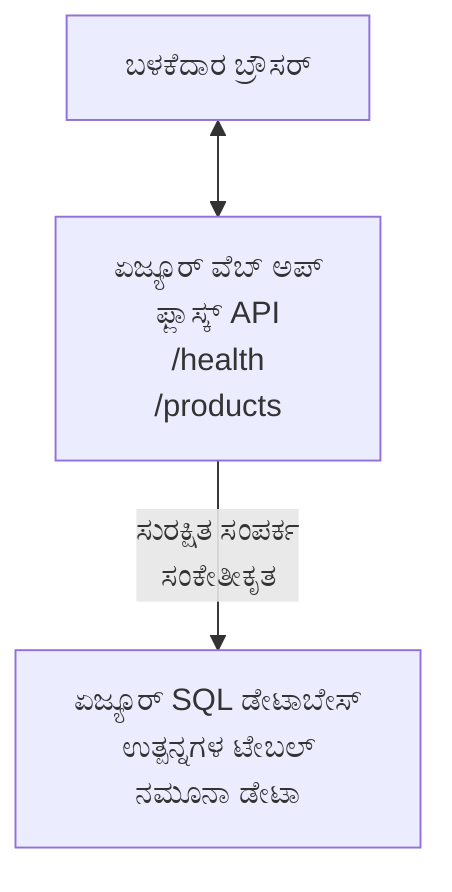

# AZD ಬಳಸಿ Microsoft SQL ಡೇಟಾಬೇಸ್ ಮತ್ತು ವೆಬ್ ಅಪ್ಲಿಕ್ಕೇಶನ್ despleoyment

⏱️ **ಅಂದಾಜು ಸಮಯ**: 20-30 ನಿಮಿಷಗಳು | 💰 **ಅಂದಾಜು ವೆಚ್ಚ**: ~$15-25/ತಿಂಗಳು | ⭐ **ಸಂಕೀರ್ಣತೆ**: ಮಧ್ಯಮ

ಈ **ಸಂಪೂರ್ಣ, ಕಾರ್ಯಾನ್ವಯ ಉದಾಹರಣೆ** ಹೇಗೆ ಬಳಸಬೇಕೆಂದು ತೋರಿಸುತ್ತದೆ [Azure Developer CLI (azd)](https://learn.microsoft.com/azure/developer/azure-developer-cli/) ಬಳಸಿ Python Flask ವೆಬ್ ಅಪ್ಲಿಕ್ಕೇಶನ್ ಅನ್ನು Microsoft SQL ಡೇಟಾಬೇಸ್‌ಗೆ Azure ಗೆ ನಿಯೋಜಿಸುವುದು. ಎಲ್ಲ ಕೋಡ್ ಸೇರಿಸಲಾಗಿದೆ ಮತ್ತು ಪರೀಕ್ಷಿಸಲಾಗಿದೆ—ಯಾವುದೇ ಬಾಹ್ಯ ಅವಲಂಬನೆಗಳನ್ನು ಅಗತ್ಯವಿಲ್ಲ.

## ನೀವು ಏನು ಕಲಿಯುವಿರಿ

ಈ ಉದಾಹರಣೆಯನ್ನು ಪೂರ್ಣಗೊಳಿಸುವ ಮೂಲಕ, ನೀವು:
- ಮೂಲಸೌಕರ್ಯ-ಆಧಾರಿತ ಕೋಡ್ ಬಳಸಿ ಬಹು-ಪಾರದರ್ಶಕ ಅಪ್ಲಿಕೇಶನ್ (ವೆಬ್ ಅಪ್ + ಡೇಟಾಬೇಸ್) ನಿಯೋಜಿಸಲು
- ರಹಸ್ಯಗಳನ್ನು ನಮೂದಿಸದೆ ಸುರಕ್ಷಿತ ಡೇಟಾಬೇಸ್ ಸಂಪರ್ಕಗಳನ್ನು ಕಾನ್ಫಿಗರ್ ಮಾಡಲು
- Application Insights ಮೂಲಕ ಅಪ್ಲಿಕೇಶನ್ ಆರೋಗ್ಯವನ್ನು ಗಮನಿಸಲು
- AZD CLI ಮೂಲಕ Azure ಸಂಪನ್ಮೂಲಗಳನ್ನು ಪರಿಣಾಮಕಾರಿಯಾಗಿ ನಿರ್ವಹಿಸಲು
- ಭದ್ರತೆ, ವೆಚ್ಚ ಆಪ್ಟಿಮೈಜೇಶನ್ ಮತ್ತು ಗಮನಾರ್ಹತೆಗಾಗಿ Azure ಉತ್ತಮ ಅಭ್ಯಾಸಗಳನ್ನು ಅನುಸರಿಸಲು

## ಸಂದರ್ಭ ಅವಲೋಕನ
- **Web App**: ಡೇಟಾಬೇಸ್ ಸಂಪರ್ಕವಿರುವ Python Flask REST API
- **Database**: ಉದಾಹರಣಾ ಡೇಟಾವನ್ನು ಹೊಂದಿರುವ Azure SQL Database
- **Infrastructure**: Bicep (ಮಾಡ್ಯೂಲರ್, ಪುನರುಪಯೋಗযোগ্য ಟೆಂಪ್ಲೇಟ್ಗಳು) ಬಳಸಿ ಪ್ರೊವಿಷನಿಂಗ್
- **Deployment**: `azd` ಕಮಾಂಡ್‌ಗಳೊಂದಿಗೆ ಸಂಪೂರ್ಣ ಸ್ವಯಂಚಾಲಿತ
- **Monitoring**: ಲಾಗ್ಗಳು ಮತ್ತು ಟೆಲೆಮೆಟ್ರಿಗಾಗಿ Application Insights

## ಪೂರ್ವಾಪೇಕ್ಷಿತಗಳು

### ಅವಶ್ಯಕ ಟೂಲ್‌ಗಳು

ಪ್ರಾರಂಭಿಸುವ ಮೊದಲು, ನೀವು ಈ ಸಾಧನಗಳನ್ನು ಸ್ಥಾಪಿಸಿದ್ದೀರಿ ಎಂದು ಪರಿಶೀಲಿಸಿ:

1. **[Azure CLI](https://learn.microsoft.com/cli/azure/install-azure-cli)** (ಆವೃತ್ತಿ 2.50.0 ಅಥವಾ ಅದಕ್ಕೂ ಮೇಲಿಂದ)
   ```sh
   az --version
   # ನಿರೀಕ್ಷಿತ ಔಟ್‌ಪುಟ್: azure-cli 2.50.0 ಅಥವಾ ಅದಕ್ಕಿಂತ ಮೇಲಿನ ಆವೃತ್ತಿ
   ```

2. **[Azure Developer CLI (azd)](https://learn.microsoft.com/azure/developer/azure-developer-cli/install-azd)** (ಆವೃತ್ತಿ 1.0.0 ಅಥವಾ ಅದಕ್ಕೂ ಮೇಲಿಂದ)
   ```sh
   azd version
   # ನಿರೀಕ್ಷಿತ ಔಟ್‌ಪುಟ್: azd ಆವೃತ್ತಿ 1.0.0 ಅಥವಾ ಹೆಚ್ಚಿನ ಆವೃತ್ತಿ
   ```

3. **[Python 3.8+](https://www.python.org/downloads/)** (ಸ್ಥಳೀಯ ಅಭಿವೃದ್ಧಿಗಾಗಿ)
   ```sh
   python --version
   # ನಿರೀಕ್ಷಿತ ಔಟ್‌ಪುಟ್: Python 3.8 ಅಥವಾ ಅದರ ಮೇಲಿನ
   ```

4. **[Docker](https://www.docker.com/get-started)** (ಐચ્છಿಕ, ಸ್ಥಳೀಯ ಕಂಟೈನರೈಜ್ಡ್ ಅಭಿವೃದ್ಧಿಗಾಗಿ)
   ```sh
   docker --version
   # ನಿರೀಕ್ಷಿತ ಫಲಿತಾಂಶ: Docker ಆವೃತ್ತಿ 20.10 ಅಥವಾ ಅದಕ್ಕೂ ಮೇಲಿನ
   ```

### Azure ಅಗತ್ಯತೆಗಳು

- ಸಕ್ರಿಯ **Azure ಸಬ್ಸ್ಕ್ರಿಪ್ಷನ್** ([create a free account](https://azure.microsoft.com/free/))
- ನಿಮ್ಮ ಸಬ್ಸ್ಕ್ರಿಪ್ಷನ್‌ನಲ್ಲಿ ಸಂಪನ್ಮೂಲಗಳನ್ನು ರಚಿಸುವ ಅನುಮತಿಗಳು
- ಸಬ್ಸ್ಕ್ರಿಪ್ಷನ್ ಅಥವಾ ರಿಸೋರ್ಸ್ ಗ್ರೂಪ್ ಮೇಲೆ **Owner** ಅಥವಾ **Contributor** ಪಾತ್ರ

### ಜ್ಞಾನ ಪೂರ್ವಾಪೇಕ್ಷಿತಗಳು

ಇದು **ಮಧ್ಯಮ ಸ್ತರ** ಉದಾಹರಣೆ. ನಿಮಗೆ ಪರಿಚಿತವಾಗಿರಬೇಕು:
- ಮೂಲ ಕಮಾಂಡ್-ಲೈನ್ ಕಾರ್ಯಾಚರಣೆಗಳು
- ಕ್ಲೌಡ್ ಮೂಲಭೂತ ধারণೆಗಳು (ಸಂಪನ್ಮೂಲಗಳು, ರಿಸೋರ್ಸ್ ಗ್ರೂಪ್ಸ್)
- ವೆಬ್ ಅಪ್ಲಿಕೇಶನ್‌ಗಳು ಮತ್ತು ಡೇಟಾಬೇಸ್‌ಗಳ ಮೂಲಭೂತ ಅರ್ಥ

**AZD ನಲ್ಲಿ ಹೊಸವನಾ?** ಮೊದಲು [Getting Started guide](../../docs/chapter-01-foundation/azd-basics.md) ಅನ್ನು ಪ್ರಾರಂಭಿಸಿ.

## ವಾಸ್ತುಶಿಲ್ಪ

ಈ ಉದಾಹರಣೆ ವೆಬ್ ಅಪ್ಲಿಕೇಶನ್ ಮತ್ತು SQL ಡೇಟಾಬೇಸ್ ಹೊಂದಿರುವ ಎರಡು-ಪರ<TEntity> ಆರ** (two-tier) ವಾಸ್ತುಶಿಲ್ಪವನ್ನು ನಿಯೋಜಿಸುತ್ತದೆ:


**ಸಂಪನ್ಮೂಲ ನಿಯೋಜನೆ:**
- **Resource Group**: ಎಲ್ಲಾ ಸಂಪನ್ಮೂಲಗಳಿಗಾಗಿ ಕಂಟೈನರ್
- **App Service Plan**: Linux ಆಧಾರಿತ ಹೋಸ್ಟಿಂಗ್ (ಕೆಲವೊಂದು ವೆಚ್ಚದ ಅನುಕೂಲಕ್ಕೆ B1 ಟಿಯರ್)
- **Web App**: Python 3.11 ರನ್‌ಟೈಮ್ ಹೊಂದಿರುವ Flask ಅಪ್ಲಿಕೇಶನ್
- **SQL Server**: TLS 1.2 ಕನಿಷ್ಠ ವಿನಿಯೋಗದೊಂದಿಗೆ ನಿರ್ವಹಿತ ಡೇಟಾಬೇಸ್ ಸರ್ವರ್
- **SQL Database**: Basic ಟಿಯರ್ (2GB, ಅಭಿವೃದ್ಧಿ/ಪರೀಕ್ಷಣೆಗೆ ಸೂಕ್ತ)
- **Application Insights**: ಮಾನಿಟರಿಂಗ್ ಮತ್ತು ಲಾಗಿಂಗ್
- **Log Analytics Workspace**: কেন্দ್ರೀಕೃತ ಲಾಗ್ ಸಂಗ್ರಹಣೆ

**ಉಪಮಾನ**: ಇದನ್ನು ಒಂದು ರೆಸ್ಟೋರೆಂಟ್ (ವೆಬ್ ಅಪ್) ಮತ್ತು ಒಂದು ವಾಕ್-ಇನ್ ಫ್ರೀಜರ್ (ಡೇಟಾಬೇಸ್) ಎಂದು ಯೋಚಿಸಿ. ಗ್ರಾಹಕರು ಮೆನು (API ಎಂಡ್‌ಪಾಯಿಂಟ್‌ಗಳು) ಇಂದಾಗಿ ಆರ್ಡರ್ ಮಾಡುತ್ತಾರೆ, ಮತ್ತು ಕುಕೀನ್ (Flask ಅಪ್ಲಿಕೇಶನ್) ಫ್ರೀಜರ್‌ನಿಂದ ಅಂಗಾಂಶಗಳನ್ನು (ಡೇಟಾ) ಪಡೆಯುತ್ತದೆ. ರೆಸ್ಟೋರೆಂಟ್ ಮ್ಯಾನೇಜರ್ (Application Insights) ಪ್ರಯೋಗವನ್ನು ಎಲ್ಲಾ ಘಟನೆಗಳನ್ನು ಟ್ರ್ಯಾಕ್ ಮಾಡುತ್ತಾರೆ.

## ಫೋಲ್ಡರ್ ರಚನೆ

ಎಲ್ಲ ಫೈಲ್ಗಳು ಈ ಉದಾಹರಣೆಯಲ್ಲಿ ಸೇರಿಸಲಾಗಿದೆ—ಯಾವುದೇ ಬಾಹ್ಯ ಅವಲಂಬನೆಗಳ ಅವಶ್ಯಕತೆ ಇಲ್ಲ:

```
examples/database-app/
│
├── README.md                    # This file
├── azure.yaml                   # AZD configuration file
├── .env.sample                  # Sample environment variables
├── .gitignore                   # Git ignore patterns
│
├── infra/                       # Infrastructure as Code (Bicep)
│   ├── main.bicep              # Main orchestration template
│   ├── abbreviations.json      # Azure naming conventions
│   └── resources/              # Modular resource templates
│       ├── sql-server.bicep    # SQL Server configuration
│       ├── sql-database.bicep  # Database configuration
│       ├── app-service-plan.bicep  # Hosting plan
│       ├── app-insights.bicep  # Monitoring setup
│       └── web-app.bicep       # Web application
│
└── src/
    └── web/                    # Application source code
        ├── app.py              # Flask REST API
        ├── requirements.txt    # Python dependencies
        └── Dockerfile          # Container definition
```

**ಪ್ರತಿ ಫೈಲ್ ಏನು ಮಾಡುತ್ತದೆ:**
- **azure.yaml**: `azd` ಅನ್ನು ಯಾವನ್ನೂ ನಿಯೋಜಿಸಿ ಮತ್ತು ಎಲ್ಲಿಯೇ ಎಂದು ಹೇಳುತ್ತದೆ
- **infra/main.bicep**: ಎಲ್ಲಾ Azure ಸಂಪನ್ಮೂಲಗಳನ್ನು ಸಂಯೋಜಿಸುತ್ತದೆ
- **infra/resources/*.bicep**: ವೈಯಕ್ತಿಕ ಸಂಪನ್ಮೂಲ ವ್ಯಾಖ್ಯಾನಗಳು (ಮರುಬಳಕೆಗಾಗಿ ಮಾಡ್ಯೂಲರ್)
- **src/web/app.py**: ಡೇಟಾಬೇಸ್ ಲಾಜಿಕ್ ಹೊಂದಿರುವ Flask ಅಪ್ಲಿಕೇಶನ್
- **requirements.txt**: Python ಪ್ಯಾಕೇಜ್ ಅವಲಂಬನೆಗಳು
- **Dockerfile**: ನಿಯೋಜನೆಗಾಗಿ ಕಂಟೈನರೈಜೇಶನ್ ಸೂಚನೆಗಳು

## ಕ್ಲಿಕ್‌ಸ್ಟಾರ್ಟ್ (ಹಂತದ ಮೂಲಕ)

### ಹಂತ 1: ಕ್ಲೋನ್ ಮಾಡಿ ಮತ್ತು ನ್ಯಾವಿಗೇಟ್ ಮಾಡಿ

```sh
git clone https://github.com/microsoft/AZD-for-beginners.git
cd AZD-for-beginners/examples/database-app
```

**✓ ಯಶಸ್ವಿ ಪರಿಶೀಲನೆ**: ನೀವು `azure.yaml` ಮತ್ತು `infra/` ಫೋಲ್ಡರ್ ಅನ್ನು ನೋಡುತ್ತಿರುವುದನ್ನು ಪರಿಶೀಲಿಸಿ:
```sh
ls
# ನಿರೀಕ್ಷಿತ: README.md, azure.yaml, infra/, src/
```

### ಹಂತ 2: Azure ನಲ್ಲಿ ಪ್ರಾಮಾಣೀಕರಣ ಮಾಡಿ

```sh
azd auth login
```

ಇದು ನಿಮ್ಮ ಬ್ರೌಸರ್ ಅನ್ನು ತೆರೆಯುತ್ತದೆ Azure ಪ್ರಾಮಾಣೀಕರಣಕ್ಕಾಗಿ. ನಿಮ್ಮ Azure ಕ್ರೆಡೆನ್ಶಿಯಲ್ಸ್ ಬಳಸಿ ಸೈನ್ ಇನ್ ಮಾಡಿ.

**✓ ಯಶಸ್ವಿ ಪರಿಶೀಲನೆ**: ನೀವು ಕೆಳಕಂಡವನ್ನು ನೋಡಬೇಕು:
```
Logged in to Azure.
```

### ಹಂತ 3: ಪರಿಸರವನ್ನು ಆರಂಭಿಸಿ

```sh
azd init
```

**ಏನು ಇಂದು ನಡೆಯುತ್ತದೆ**: `azd` ನಿಮ್ಮ ನಿಯೋಜನೆಗಾಗಿ ಸ್ಥಳೀಯ ಕಾನ್ಫಿಗರೇಶನ್ ಸೃಷ್ಟಿಸುತ್ತದೆ.

**ನೀವು ನೋಡಬಹುದಾದ ಪ್ರಾಂಪ್ಟ್‌ಗಳು**:
- **Environment name**: ರುಚಿಗೆ ಹೊಂದುವ ಶೀಘ್ರ ಹೆಸರು ನಮೂದಿಸಿ (ಉದಾಹರಣೆ: `dev`, `myapp`)
- **Azure subscription**: ಪಟ್ಟಿಯಿಂದ ನೀವು ನಿಮ್ಮ ಸಬ್ಸ್ಕ್ರಿಪ್ಷನ್ ಆಯ್ಕೆಮಾಡಿ
- **Azure location**: ಒಂದು ರೆಜಿಯನ್ ಆಯ್ಕೆಮಾಡಿ (ಉದಾಹರಣೆ: `eastus`, `westeurope`)

**✓ ಯಶಸ್ವಿ ಪರಿಶೀಲನೆ**: ನೀವು ಎದುರಿಸುವುದಿಲ್ಲ:
```
SUCCESS: New project initialized!
```

### ಹಂತ 4: Azure ಸಂಪನ್ಮೂಲಗಳನ್ನು ಪ್ರೊವಿಷನ್ ಮಾಡಿ

```sh
azd provision
```

**ಏನುನಾಗಬೇಕು**: `azd` ಎಲ್ಲಾ ಮೂಲಸೌಕರ್ಯವನ್ನು ನಿಯೋಜಿಸುತ್ತದೆ (5-8 ನಿಮಿಷಗಳು ತೆಗೆದುಕೊಳ್ಳಬಹುದು):
1. ರಿಸೋರ್ಸ್ ಗುಂಪನ್ನು ಸೃಷ್ಟಿಸುತ್ತದೆ
2. SQL ಸರ್ವರ್ ಮತ್ತು ಡೇಟಾಬೇಸ್ ರಚಿಸುತ್ತದೆ
3. App Service Plan ರಚಿಸುತ್ತದೆ
4. Web App ರಚಿಸುತ್ತದೆ
5. Application Insights ರಚಿಸುತ್ತದೆ
6. ನೆಟ್ವರ್ಕಿಂಗ್ ಮತ್ತು ಭದ್ರತೆ ಕಾನ್ಫಿಗರ್ ಮಾಡುತ್ತದೆ

**ನೀವು ಪ್ರಾಂಪ್ಟ್ ಮಾಡಲ್ಪಡುತ್ತೀರಿ**:
- **SQL admin username**: ಒಂದು ಬಳಕೆಹೆಸರನ್ನು ನಮೂದಿಸಿ (ಉದಾಹರಣೆ: `sqladmin`)
- **SQL admin password**: ಒಂದು ಬಲವಾದ ಪಾಸ್ವರ್ಡ್ ನಮೂದಿಸಿ (ಇನ್ನು ಉಳಿಸಿ!)

**✓ ಯಶಸ್ವಿ ಪರಿಶೀಲನೆ**: ನೀವು ನೋಡಬೇಕು:
```
SUCCESS: Your application was provisioned in Azure in X minutes Y seconds.
You can view the resources created under the resource group rg-<env-name> in Azure Portal:
https://portal.azure.com/#@/resource/subscriptions/.../resourceGroups/rg-<env-name>
```

**⏱️ ಸಮಯ**: 5-8 ನಿಮಿಷಗಳು

### ಹಂತ 5: ಅಪ್ಲಿಕೇಶನ್ ನಿಯೋಜಿಸಿ

```sh
azd deploy
```

**ಏನುನಾಗುತ್ತದೆ**: `azd` ನಿಮ್ಮ Flask ಅಪ್ಲಿಕೇಶನ್ ಅನ್ನು ನಿರ್ಮಿಸಿ ಮತ್ತು ನಿಯೋಜಿಸುತ್ತದೆ:
1. Python ಅಪ್ಲಿಕೇಶನ್ ಪ್ಯಾಕೇಜ್ ಮಾಡುತ್ತದೆ
2. Docker ಕಂಟೈನರ್ ಅನ್ನು ನಿರ್ಮಿಸುತ್ತದೆ
3. Azure Web App ಗೆ ಪುಷ್ ಮಾಡುತ್ತದೆ
4. ಉದಾಹರಣಾ ಡೇಟಾ ಬಳಸಿ ಡೇಟಾಬೇಸ್ ಅನ್ನು ಇನಿಷಿಯಲೈಸ್ ಮಾಡುತ್ತದೆ
5. ಅಪ್ಲಿಕೇಶನ್ ಪ್ರಾರಂಭಗೊಳ್ಳುತ್ತದೆ

**✓ ಯಶಸ್ವಿ ಪರಿಶೀಲನೆ**: ನೀವು ನೋಡಬಹುದು:
```
SUCCESS: Your application was deployed to Azure in X minutes Y seconds.
You can view the resources created under the resource group rg-<env-name> in Azure Portal:
https://portal.azure.com/#@/resource/subscriptions/.../resourceGroups/rg-<env-name>
```

**⏱️ ಸಮಯ**: 3-5 ನಿಮಿಷಗಳು

### ಹಂತ 6: ಅಪ್ಲಿಕೇಶನ್ ಬ್ರೌಸ್ ಮಾಡಿ

```sh
azd browse
```

ಇದು ನಿಮ್ಮ ನಿಯೋಜಿಸಿದ ವೆಬ್ ಅಪ್ ಅನ್ನು ಬ್ರೌಸರ್‌ನಲ್ಲಿ ತೆರೆದಿಡುತ್ತದೆ `https://app-<unique-id>.azurewebsites.net`

**✓ ಯಶಸ್ವಿ ಪರಿಶೀಲನೆ**: ನೀವು JSON ಔಟ್ಪುಟ್ ನೋಡಬೇಕು:
```json
{
  "message": "Welcome to the Database App API",
  "endpoints": {
    "/": "This help message",
    "/health": "Health check endpoint",
    "/products": "List all products",
    "/products/<id>": "Get product by ID"
  }
}
```

### ಹಂತ 7: API ಎಂಡ್‌ಪಾಯಿಂಟ್‌ಗಳನ್ನು ಪರೀಕ್ಷಿಸಿ

**Health Check** (ಡೇಟಾಬೇಸ್ ಸಂಪರ್ಕವನ್ನು ಪರಿಶೀಲಿಸಿ):
```sh
curl https://app-<your-id>.azurewebsites.net/health
```

**ನಿರೀಕ್ಷಿತ ಪ್ರತಿಕ್ರಿಯೆ**:
```json
{
  "status": "healthy",
  "database": "connected"
}
```

**List Products** (ಉದಾಹರಣಾ ಡೇಟಾ):
```sh
curl https://app-<your-id>.azurewebsites.net/products
```

**ನಿರೀಕ್ಷಿತ ಪ್ರತಿಕ್ರಿಯೆ**:
```json
[
  {
    "id": 1,
    "name": "Laptop",
    "description": "High-performance laptop",
    "price": 1299.99,
    "created_at": "2025-11-19T10:30:00"
  },
  ...
]
```

**Get Single Product**:
```sh
curl https://app-<your-id>.azurewebsites.net/products/1
```

**✓ ಯಶಸ್ವಿ ಪರಿಶೀಲನೆ**: 모든 ಎಂಡ್‌ಪಾಯಿಂಟ್‌ಗಳು ದೋಷವಿಲ್ಲದೆ JSON ಡೇಟಾವನ್ನು ವಾಪಸು ನೀಡುತ್ತವೆ.

---

**🎉 ಅಭಿನಂದನೆಗಳು!** ನೀವು ಯಶಸ್ವಿಯಾಗಿ AZD ಬಳಸಿ Azure ಗೆ ಡೇಟಾಬೇಸ್ ಹೊಂದಿರುವ ವೆಬ್ ಅಪ್ಲಿಕೇಶನ್ ಅನ್ನು ನಿಯೋಜಿಸಿದ್ದೀರಿ.

## ಸಂರಚನೆ ಡೀಪ್-ಡೈವ್

### ಪರಿಸರ ಚರಗಳು

ರಹಸ್ಯಗಳನ್ನು Azure App Service ಕಾನ್ಫಿಗರೇಶನ್ಗಳ ಮೂಲಕ ಸುರಕ್ಷಿತವಾಗಿ ನಿರ್ವಹಿಸಲಾಗುತ್ತದೆ—**ಮೂಲ ಕೋಡ್‌ನಲ್ಲಿ ಎಂದಿಗೂ ಹಾರ್ಡ್‌ಕೋಡ್ ಮಾಡಬೇಡಿ**.

**AZD দ্বারা ಸ್ವಯಂಚಾಲಿತವಾಗಿ ಕಾನ್ಫಿಗರ್ ಆಗುತ್ತದೆ**:
- `SQL_CONNECTION_STRING`: ಎನ್‌ಕ್ರಿಪ್ಟ್ ಮಾಡಿದ ಕ್ರೆಡೆನ್ಶಿಯಲ್‌ಗಳೊಂದಿಗೆ ಡೇಟಾಬೇಸ್ ಸಂಪರ್ಕ
- `APPLICATIONINSIGHTS_CONNECTION_STRING`: ಮಾನಿಟರಿಂಗ್ ಟೆಲೆಮೆಟ್ರಿ ಎಂಡ್ಪಾಯಿಂಟ್
- `SCM_DO_BUILD_DURING_DEPLOYMENT`: ಸ್ವಯಂಚಾಲಿತ ಅವಲಂಬನೆ ಸ್ಥಾಪನೆ ಸಕ್ರಿಯಗೊಳಿಸುತ್ತದೆ

**ರಹಸ್ಯಗಳು ಎಲ್ಲಿ ಸಂಗ್ರಹಿತವಾಗುತ್ತವೆ**:
1. `azd provision` ಸಮಯದಲ್ಲಿ, ನೀವು ಸುರಕ್ಷಿತ ಪ್ರಾಂಪ್ಟ್‌ಗಳ ಮೂಲಕ SQL ಕ್ರೆಡೆನ್ಶಿಯಲ್ಸ್ ಒದಗಿಸುತ್ತೀರಿ
2. AZD ಅವುಗಳನ್ನು ನಿಮ್ಮ ಸ್ಥಳೀಯ `.azure/<env-name>/.env` ಫೈಲ್‌ನಲ್ಲಿ ಸಂಗ್ರಹಿಸುತ್ತದೆ (git-ignored)
3. AZD ಅವುಗಳನ್ನು Azure App Service ಕಾನ್ಫಿಗರೇಶನ್‌ಗೆ ಇಂಜೆಕ್ಟ್ ಮಾಡುತ್ತದೆ (ರಾಷ್ಟ್ರೀಯದಲ್ಲಿ ಎನ್‌ಕ್ರಿಪ್ಟ್)
4. ಅಪ್ಲಿಕೇಶನ್ ಅವುಗಳನ್ನು ರನ್‌ಟೈಮ್‌ನಲ್ಲಿ `os.getenv()` ಮೂಲಕ ಓದುತ್ತದೆ

### ಸ್ಥಳೀಯ ಅಭಿವೃದ್ಧಿ

ಸ್ಥಳೀಯ ಪರೀಕ್ಷೆಗೆ, ನಕಲು `.env` ಫೈಲ್ ಅನ್ನು ಉದಾಹರಣೆದಿಂದ ಸೃಷ್ಟಿಸಿ:

```sh
cp .env.sample .env
# .env ಅನ್ನು ನಿಮ್ಮ ಸ್ಥಳೀಯ ಡೇಟಾಬೇಸ್ ಸಂಪರ್ಕದೊಂದಿಗೆ ಸಂಪಾದಿಸಿ
```

**ಸ್ಥಳೀಯ ಅಭಿವೃದ್ಧಿ ವರ್ಕ್‌ಫ್ಲೋ**:
```sh
# ಆಶ್ರಿತಗಳನ್ನು ಸ್ಥಾಪಿಸಿ
cd src/web
pip install -r requirements.txt

# ಪರಿಸರ ಚರಗಳನ್ನು ಹೊಂದಿಸಿ
export SQL_CONNECTION_STRING="your-local-connection-string"

# ಅನ್ವಯಿಕೆಯನ್ನು ಚಾಲನೆಗೊಳಿಸಿ
python app.py
```

**ಸ್ಥಳೀಯವಾಗಿ ಪರೀಕ್ಷಿಸಿ**:
```sh
curl http://localhost:8000/health
# ನಿರೀಕ್ಷಿಸಲಾಗಿದೆ: {"status": "healthy", "database": "connected"}
```

### Infrastructure as Code

ಎಲ್ಲಾ Azure ಸಂಪನ್ಮೂಲಗಳು **Bicep ಟೆಂಪ್ಲೇಟ್ಸ್** (`infra/` ಫೋಲ್ಡರ್) ನಲ್ಲಿ ವ್ಯಾಖ್ಯಾನಿಸಲಾಗಿದೆ:

- **ಮಾಡ್ಯೂಲರ್ ವಿನ್ಯಾಸ**: ಪ್ರತಿ ಸಂಪನ್ಮೂಲ ಪ್ರಕಾರಕ್ಕೆ ಪುನರುಪಯೋಗಕ್ಕಾಗಿ ಪ್ರತ್ಯೇಕ ಫೈಲ್
- **ಪ್ಯಾರಾಮೇಟರೈಜ್ಡ್**: SKU ಗಳು, ರೆಜಿಯನ್ಸ್, ನೇಮಿಂಗ್ ಕಸ್ಟಮೈಸ್ ಮಾಡಬಹುದು
- **ಉತ್ತಮ ಅಭ್ಯಾಸಗಳು**: Azure ನೇಮಿಂಗ್ ಸ್ಟ್ಯಾಂಡರ್ಡ್ ಮತ್ತು ಭದ್ರತಾ ಡಿಫಾಲ್ಟ್‌ಗಳನ್ನು ಅನುಸರಿಸುತ್ತದೆ
- **ವರ್ಶನ್ ಕಂಟ್ರೋಲ್**: ಮೂಲಸೌಕರ್ಯ ಬದಲಾವಣೆಗಳು Git ನಲ್ಲಿ ಟ್ರ್ಯಾಕ್ ಆಗುತ್ತವೆ

**ಕಸ್ಟಮೈಸೇಶನ್ ಉದಾಹರಣೆ**:
ಡೇಟಾಬೇಸ್ ಟಿಯರ್ ಅನ್ನು ಬದಲಾಯಿಸಲು, `infra/resources/sql-database.bicep` ಅನ್ನು ಸಂಪಾದಿಸಿ:
```bicep
sku: {
  name: 'Standard'  // Changed from 'Basic'
  tier: 'Standard'
  capacity: 10
}
```

## ಭದ್ರತಾ ಉತ್ತಮ ಅಭ್ಯಾಸಗಳು

ಈ ಉದಾಹರಣೆ Azure ಭದ್ರತಾ ಉತ್ತಮ ಅಭ್ಯಾಸಗಳನ್ನು ಅನುಸರಿಸುತ್ತದೆ:

### 1. **ಮೂಲ ಕೋಡ್‌ನಲ್ಲಿ ರಹಸ್ಯಗಳಿಲ್ಲ**
- ✅ ಕ್ರೆಡೆನ್ಶಿಯಲ್ಸ್ Azure App Service ಕಾನ್ಫಿಗರೇಶನ್‌ನಲ್ಲಿ ಸಂಗ್ರಹಿಸಲಾಗಿದೆ (ಎನ್‌ಕ್ರಿಪ್ಟ್)
- ✅ `.env` ಫೈಲ್‌ಗಳು Git ಮೂಲಕ ಹೊರಗೆ ಇರಿಸಲಾಗುತ್ತದೆ `.gitignore` ಮೂಲಕ
- ✅ ಪ್ರೊವಿಷನಿಂಗ್ ಸಮಯದಲ್ಲಿ ಸುರಕ್ಷಿತ ಪಾರಾಮೀಟರ್‌ಗಳ ಮೂಲಕ ರಹಸ್ಯಗಳು ಪಾಸ್ ಮಾಡಲಾಗುತ್ತವೆ

### 2. **ಎನ್‌ಕ್ರಿಪ್ಟ್ ಸಂಪರ್ಕಗಳು**
- ✅ SQL Server ಗಾಗಿ ಕನಿಷ್ಠ TLS 1.2
- ✅ Web App ಗಾಗಿ ಮಾತ್ರ HTTPS ಅನಿವಾರ್ಯ
- ✅ ಡೇಟಾಬೇಸ್ ಸಂಪರ್ಕಗಳು ಎನ್‌ಕ್ರಿಪ್ಟ್ ಚ್ಯಾನೆಲ್‌ಗಳನ್ನು ಬಳಸುತ್ತವೆ

### 3. **ನೆಟ್ವರ್ಕ್ ಭದ್ರತೆ**
- ✅ SQL Server ಫೈರ್‌ವಾಲ್ ಅನ್ನು Azure ಸೇವೆಗಳಿಗೆ ಮಾತ್ರ ಅನುಮತಿಸುತ್ತಂತೆ ಕಾನ್ಫಿಗರ್ ಮಾಡಲಾಗಿದೆ
- ✅ ಸಾರ್ವಜನಿಕ ನೆಟ್ವರ್ಕ್ ಪ್ರವೇಶ ಕರಿದಿದ್ದು (ಅಗಾದ್ Private Endpoints ನೊಂದಿಗೆ ಮತ್ತಷ್ಟು ಲಾಕ್ ಮಾಡಬಹುದು)
- ✅ Web App ಮೇಲೆ FTPS ನಿಷ್ಕ್ರಿಯಗೊಳಿಸಲಾಗಿದೆ

### 4. **ಆಥೆಂಟಿಕೇಷನ್ & ಆಥೋರೈಸೇಶನ್**
- ⚠️ **ಪ್ರಸ್ತುತ**: SQL ಪ್ರಮಾಣೀಕರಣ (ಬಳಕೆಹೆಸರು/ಪಾಸ್ವರ್ಡ್)
- ✅ **ಉತ್ಪಾದನೆ ಶಿಫಾರಸು**: ಪಾಸ್ವರ್ಡ್-ರಹಿತ ಆಥೆಂಟಿಕೇಷನ್‌ಗಾಗಿ Azure Managed Identity ಬಳಸಿ

**ಮ್ಯಾನೇಜ್ಡ್ ಐಡೆಂಟಿಟಿಗೆ ಮೇಲ್ಛಾವಣಿ ಮಾಡಲು** (ಉತ್ಪಾದನೆಗಾಗಿ):
1. Web App ಮೇಲೆ managed identity ಸಕ್ರಿಯಗೊಳಿಸಿ
2. ಐಡೆಂಟಿಟಿಗೆ SQL ಅನುಮತಿಗಳನ್ನು ನೀಡಿ
3. ಕನೆಕ್ಷನ್ ಸ್ತ್ರಿಂಗ್ ಅನ್ನು managed identity ಬಳಕೆಗಾಗಿ ನವೀಕರಿಸಿ
4. ಪಾಸ್ವರ್ಡ್ ಆಧಾರಿತ ಪ್ರಮಾಣೀಕರಣವನ್ನು ತೆಗೆದುಹಾಕಿ

### 5. **ಅಡಿಟ್ & ಅನುಸರಣೆ**
- ✅ Application Insights ಎಲ್ಲಾ ವಿನಂತಿಗಳು ಮತ್ತು ದೋಷಗಳನ್ನು ಲಾಗ್ ಮಾಡುತ್ತದೆ
- ✅ SQL Database auditing ಸಕ್ರಿಯಗೊಳಿಸಲಾಗಿದೆ (ಅನುಸರಣೆಗಾಗಿ ಕಾನ್ಫಿಗರ್ ಮಾಡಬಹುದು)
- ✅ ಎಲ್ಲಾ ಸಂಪನ್ಮೂಲಗಳು ಆಡಳಿತಕ್ಕಾಗಿ ಟ್ಯಾಗ್ ಮಾಡಲ್ಪಟ್ಟಿವೆ

**ಉತ್ಪಾದನೆಯ ಮೊದಲು ಭದ್ರತಾ ಚೆಕ್ಲಿಸ್ಟ್**:
- [ ] SQL ಗಾಗಿ Azure Defender ಸಕ್ರಿಯಗೊಳಿಸಿ
- [ ] SQL Database ಗಾಗಿ Private Endpoints ಅನ್ನು ಕಾನ್ಫಿಗರ್ ಮಾಡಿರಿ
- [ ] Web Application Firewall (WAF) ಸಕ್ರಿಯಗೊಳಿಸಿ
- [ ] ರಹಸ್ಯ ರೋಟೇಶನ್‌ಗಾಗಿ Azure Key Vault ಅನುಷ್ಠಾನಗೊಳಿಸಿ
- [ ] Azure AD ಪ್ರಾಮಾಣೀಕರಣವನ್ನು ಕಾನ್ಫಿಗರ್ ಮಾಡಿ
- [ ] ಎಲ್ಲಾ ಸಂಪನ್ಮೂಲಗಳಿಗೆ ಡಯಾಗ್ನೋಸ್ಟಿಕ್ ಲಾಗಿಂಗ್ ಸಕ್ರಿಯಗೊಳಿಸಿ

## ವೆಚ್ಚ ಆಪ್ಟಿಮೈಜೇಶನ್

**ಅಂದಾಜು ಮಾಸಿಕ ವೆಚ್ಚಗಳು** (ನವೆಂಬರ್ 2025 ರ ಪ್ರಕಾರ):

| Resource | SKU/Tier | Estimated Cost |
|----------|----------|----------------|
| App Service Plan | B1 (Basic) | ~$13/month |
| SQL Database | Basic (2GB) | ~$5/month |
| Application Insights | Pay-as-you-go | ~$2/month (low traffic) |
| **Total** | | **~$20/month** |

**💡 ವೆಚ್ಚ ಉಳಿಸುವ ಸಲಹೆಗಳು**:

1. **ಕಲಿಕೆಗೆ ಉಚಿತ ಟಿಯರ್ ಬಳಸಿ**:
   - App Service: F1 ಟಿಯರ್ (ಉಚಿತ, ಸೀಮಿತ ಗಂಟೆಗಳು)
   - SQL Database: Azure SQL Database serverless ಬಳಸಿ
   - Application Insights: 5GB/ತಿಂಗಳು ಉಚಿತ ಇಂಗೆಷನ್

2. **ಬಳಕೆಯಲ್ಲಿಲ್ಲದಾಗ ಸಂಪನ್ಮೂಲಗಳನ್ನು ನಿಲ್ಲಿಸಿ**:
   ```sh
   # ವೆಬ್ ಅಪ್ಲಿಕೇಶನ್ ನಿಲ್ಲಿಸಿ (ಡೇಟಾಬೇಸ್‌ಗೆ ಇನ್ನೂ ಶುಲ್ಕ ವಿಧಿಸಲಾಗುತ್ತದೆ)
   az webapp stop --name <app-name> --resource-group <rg-name>
   
   # ಅಗತ್ಯವಿದ್ದಾಗ ಮರುಪ್ರಾರಂಭಿಸಿ
   az webapp start --name <app-name> --resource-group <rg-name>
   ```

3. **ಪರೀಕ್ಷೆಯ ನಂತರ ಎಲ್ಲವನ್ನೂ ಅಳಿಸಿ**:
   ```sh
   azd down
   ```
   ಇದು ಎಲ್ಲಾ ಸಂಪನ್ಮೂಲಗಳನ್ನು ತೆಗೆದುಹಾಕುತ್ತದೆ ಮತ್ತು ಶುಲ್ಕಗಳನ್ನು ನಿಲ್ಲಿಸುತ್ತದೆ.

4. **ಅಭಿವೃದ್ಧಿ vs. ಉತ್ಪಾದನೆ SKUಗಳು**:
   - **ಅಭಿವೃದ್ಧಿ**: Basic ಟಿಯರ್ (ಈ ಉದಾಹರಣೆಯಲ್ಲಿ ಬಳಕೆಯಾಗಿದೆ)
   - **ಉತ್ಪಾದನೆ**: ಮಾನದಂಡ/ಪ್ರೀಮಿಯಂ ಟಿಯರ್ ಅಭಿನಯದೊಂದಿಗೆ

**ವೆಚ್ಚ ניטುವಣಿಕೆ**:
- [Azure Cost Management](https://portal.azure.com/#view/Microsoft_Azure_CostManagement) ನಲ್ಲಿ ವೆಚ್ಚಗಳನ್ನು ನೋಡಿ
- ಅಚ್ಚರಿ ತಪ್ಪಿಸಲು ವೆಚ್ಚ ಎಚ್ಚರಿಕೆಗಳನ್ನು ಸೆಟ್ ಮಾಡಿ
- ಟ್ರ್ಯಾಕಿಂಗ್‌ಗೆ ಎಲ್ಲ ಸಂಪನ್ಮೂಲಗಳನ್ನೂ `azd-env-name` ಟ್ಯಾಗ್ ಮಾಡಿ

**ಉಚಿತ ಟಿಯರ್ ಪರ್ಯಾಯ**:
ಕಲಿಕೆಗೆ, ನೀವು `infra/resources/app-service-plan.bicep` ಅನ್ನು ಪರಿಷ್ಕರಿಸಬಹುದು:
```bicep
sku: {
  name: 'F1'  // Free tier
  tier: 'Free'
}
```
**ಗಮನಿಸಿ**: ಉಚಿತ ಟಿಯರ್‌ಗೆ ಸೀಮಿತತೆಗಳಿವೆ (60 ನಿಮಿಷ/ದಿನ CPU, ಯಾವಾಗಲೂ-ಆನ್ ಇಲ್ಲ).

## ಮಾನಿಟರಿಂಗ್ & ಗಮನಾರ್ಹತೆ

### Application Insights ರೈಲೀಗೆ ಸಂಯೋಜನೆ

ಈ ಉದಾಹರಣೆಯು ಸಂಪೂರ್ಣ ಮಾನಿಟರಿಂಗ್‌ಗಾಗಿ **Application Insights** ಅನ್ನು ಸೇರಿಸುತ್ತದೆ:

**ಯಾವುವನ್ನೇ ಮಾನಿಟರ್ ಮಾಡಲಾಗುತ್ತದೆ**:
- ✅ HTTP ವಿನಂತಿಗಳು (ಲೇಟೆನ್ಸಿ, ಸ್ಥಿತಿ ಕೋಡ್ಗಳು, ಎಂಡ್‌ಪಾಯಿಂಟ್‌ಗಳು)
- ✅ ಅಪ್ಲಿಕೇಶನ್ ದೋಷಗಳು ಮತ್ತು ಎನ್ನಿಪ್ಸಕ್ಷಣೆಗಳು
- ✅ Flask ಅಪ್ಪ್ನಿಂದ ಕಸ್ಟಮ್ ಲಾಗಿಂಗ್
- ✅ ಡೇಟಾಬೇಸ್ ಸಂಪರ್ಕ ಆರೋಗ್ಯ
- ✅ ಕಾರ್ಯಕ್ಷಮತೆ ಮೆಟ್ರಿಕ್ಸ್ (CPU, ಮೆಮೊರಿ)

**Application Insights ಅನ್ನು ಪ್ರವೇಶಿಸುವುದು**:
1. [Azure Portal](https://portal.azure.com) ತೆರೆಯಿರಿ
2. ನಿಮ್ಮ ರಿಸೋರ್ಸ್ ಗುಂಪ್ (`rg-<env-name>`) ಗೆ ಹೋಗಿ
3. Application Insights ಸಂಪನ್ಮೂಲ (`appi-<unique-id>`) ಮೇಲೆ ಕ್ಲಿಕ್ ಮಾಡಿ

**ಉಪಯುಕ್ತ ಕ್ವೆರಿ‌ಗಳು** (Application Insights → Logs):

**ಎಲ್ಲಾ ವಿನಂತಿಗಳನ್ನು ನೋಡಿ**:
```kusto
requests
| where timestamp > ago(1h)
| order by timestamp desc
| project timestamp, name, url, resultCode, duration
```

**ತಪ್ಪುಗಳನ್ನು ಕಂಡುಹಿಡಿ**:
```kusto
exceptions
| where timestamp > ago(24h)
| order by timestamp desc
| project timestamp, type, outerMessage, operation_Name
```

**ಹೇಳ್ತಾಯೋ ಹೆಲ್ತ್ ಎಂಡ್‌ಪಾಯಿಂಟ್ ಪರಿಶೀಲಿಸಿ**:
```kusto
requests
| where name contains "health"
| summarize count() by resultCode, bin(timestamp, 1h)
```

### SQL Database auditing

**SQL Database auditing ಸಕ್ರಿಯಗೊCtl** ಎಂಬುದರಿಂದ ಹೀಗೆಗಳನ್ನು ಟ್ರ್ಯಾಕ್ ಮಾಡಲಾಗುತ್ತದೆ:
- ಡೇಟಾಬೇಸ್ ಪ್ರವೇಶ ಮಾದರಿಗಳು
- ವಿಫಲ ಲಾಗಿನ್ ಪ್ರಯತ್ನಗಳು
- ಸ್ಕೀมา ಬದಲಾವಣೆಗಳು
- ಡೇಟಾ ಪ್ರವೇಶ (ಅನುಸರಣೆಗಾಗಿ)

**ಆದಿಟ್ ಲಾಗ್‌ಗಳನ್ನು ಪ್ರವೇಶಿಸುವುದು**:
1. Azure Portal → SQL Database → Auditing
2. Log Analytics ವರ್ಕ್‌ಸ್ಪೇಸ್‌ನಲ್ಲಿ ಲಾಗ್‌ಗಳನ್ನು ನೋಡಿ

### ರಿಯಲ್-ಟೈಂ ಮಾನಿಟರಿಂಗ್

**ಲೈವ್ ಮೆಟ್ರಿಕ್ಸ್ ವೀಕ್ಷಿಸಿ**:
1. Application Insights → Live Metrics
2. ವಿನಂತಿಗಳು, ವಿಫಲತೆಗಳು ಮತ್ತು ಕಾರ್ಯಕ್ಷಮತೆ ರಿಯಲ್-ಟೈಮಿನಲ್ಲಿ ನೋಡಿ

**ಎಚ್ಚರಿಕೆಗಳನ್ನು ಸೆಟ್ ಮಾಡಿ**:
ನಿಗಮ ಘಟನೆಗಳಿಗೆ ಎಚ್ಚರಿಕೆಗಳನ್ನು ರಚಿಸಿ:
- HTTP 500 ದೋಷಗಳು > 5 in 5 minutes
- ಡೇಟಾಬೇಸ್ ಸಂಪರ್ಕ ವಿಫಲತೆಗಳು
- ಹೆಚ್ಚು ಪ್ರತಿಕ್ರಿಯಾ ಸಮಯ (>2 ಸೆಕೆಂಡುಗಳು)

**ಎಚ್ಚರಿಕೆ ರಚನೆ ಉದಾಹರಣೆ**:
```sh
az monitor metrics alert create \
  --name "High-Response-Time" \
  --resource-group <rg-name> \
  --scopes <app-insights-resource-id> \
  --condition "avg requests/duration > 2000" \
  --description "Alert when response time exceeds 2 seconds"
```

## ಸಮಸ್ಯಾ ಪರಿಹಾರ


### ಸಾಮಾನ್ಯ ಸಮಸ್ಯೆಗಳು ಮತ್ತು ಪರಿಹಾರಗಳು

#### 1. `azd provision` fails with "Location not available"

**ಲಕ್ಷಣ**:
```
Error: The subscription is not registered for the resource type 'components' in the location 'centralus'.
```

**ಪರಿಹಾರ**:
ಬೇರೊಂದು Azure ಪ್ರದೇಶವನ್ನು ಆಯ್ಕೆಮಾಡಿ ಅಥವಾ ರಿಸೋರ್ಸ್ ಪ್ರೊವೈಡರ್ ಅನ್ನು ನೋಂದಣಿ ಮಾಡಿ:
```sh
az provider register --namespace Microsoft.Insights
```

#### 2. SQL ಸಂಪರ್ಕ ಡಿಪ್ಲಾಯ್ ಮಾಡುವಾಗ ವಿಫಲವಾಗುತ್ತದೆ

**ಲಕ್ಷಣ**:
```
pyodbc.OperationalError: ('08001', '[08001] [Microsoft][ODBC Driver 18 for SQL Server]TCP Provider...')
```

**ಪರಿಹಾರ**:
- SQL Server ಫೈರ್‌ವಾಲ್ Azure ಸೇವೆಗಳನ್ನು ಅನುಮತಿಸುತ್ತದೆ ಎಂದು ಪರಿಶೀಲಿಸಿ (ಸ್ವಯಂಚಾಲಿತವಾಗಿ ಸಂರಚಿತವಾಗಿದೆ)
- `azd provision` ಸಮಯದಲ್ಲಿ SQL ಅಡ್ಮಿನ್ ಪಾಸ್‌ವರ್ಡ್ ಸರಿಯಾಗಿ ನಮೂದಿಸಲಾಗಿದೆ ಎಂದು ಪರಿಶೀಲಿಸಿ
- SQL Server ಸಂಪೂರ್ಣವಾಗಿ ಸೃಷ್ಟಿಯಾಗಿದೆ ಎಂದು ಖಚಿತಪಡಿಸಿ (ಇದಕ್ಕೆ 2-3 ನಿಮಿಷ ಸಮಯ ಪಡೆಯಬಹುದು)

**ಸಂಪರ್ಕವನ್ನು ಪರಿಶೀಲಿಸಿ**:
```sh
# Azure ಪೋರ್ಟಲ್‌ನಿಂದ, SQL ಡೇಟಾಬೇಸ್ → ಕ್ವೇರಿ ಸಂಪಾದಕಕ್ಕೆ ಹೋಗಿ
# ನಿಮ್ಮ ಪ್ರಮಾಣಪತ್ರಗಳೊಂದಿಗೆ ಸಂಪರ್ಕಿಸಲು ಪ್ರಯತ್ನಿಸಿ
```

#### 3. Web App Shows "Application Error"

**ಲಕ್ಷಣ**:
ಬ್ರೌಸರ್ ಸಾಮಾನ್ಯ ದೋಷ ಪುಟವನ್ನು ತೋರಿಸುತ್ತದೆ.

**ಪರಿಹಾರ**:
ಅಪ್ಲಿಕೇಶನ್ ಲಾಗ್‌ಗಳನ್ನು ಪರಿಶೀಲಿಸಿ:
```sh
# ಇತ್ತೀಚಿನ ಲಾಗ್‌ಗಳನ್ನು ವೀಕ್ಷಿಸಿ
az webapp log tail --name <app-name> --resource-group <rg-name>
```

**ಸಾಮಾನ್ಯ ಕಾರಣಗಳು**:
- ಪರಿಸರ ಚರಗಳು ಲೋಪ ಆಗಿರುತ್ತವೆ (App Service → Configuration ಪರಿಶೀಲಿಸಿ)
- Python ಪ್ಯಾಕೇಜ್ ಸ್ಥಾಪನೆ ವಿಫಲವಾಗಿದೆ (ಡಿಪ್ಲಾಯ್ ಲಾಗ್‌ಗಳನ್ನು ಪರಿಶೀಲಿಸಿ)
- ಡೇಟಾಬೇಸ್ ಪ್ರಾರಂಭಿಕರಣ ದೋಷ (SQL ಸಂಪರ್ಕವನ್ನು ಪರಿಶೀಲಿಸಿ)

#### 4. `azd deploy` Fails with "Build Error"

**ಲಕ್ಷಣ**:
```
Error: Failed to build project
```

**ಪರಿಹಾರ**:
- `requirements.txt` ನಲ್ಲಿ ಯಾವುದೇ ಸಿಂಟ್ಯಾಕ್ಸ್ ದೋಷಗಳಿಲ್ಲದಿರುವುದನ್ನು ಖಚಿತಪಡಿಸಿ
- Python 3.11 ಅನ್ನು `infra/resources/web-app.bicep` ನಲ್ಲಿ ಸೂಚಿಸಲಾಗಿದೆ ಎಂದು ಪರಿಶೀಲಿಸಿ
- Dockerfile ನಲ್ಲಿ ಸರಿಯಾದ base image ಇದೆ ಎಂದು ಪರಿಶೀಲಿಸಿ

**ಸ್ಥಳೀಯವಾಗಿ ಡಿಬಗ್ ಮಾಡಿ**:
```sh
cd src/web
docker build -t test-app .
docker run -p 8000:8000 test-app
```

#### 5. "Unauthorized" When Running AZD Commands

**ಲಕ್ಷಣ**:
```
ERROR: (Unauthorized) The client '<id>' with object id '<id>' does not have authorization
```

**ಪರಿಹಾರ**:
Azure ಜೊತೆಗೆ ಮರು-ಪ್ರಾಮಾಣೀಕರಿಸಿ:
```sh
azd auth login
az login
```

ನೀವು ಚಂದಾದಾರಿಯಲ್ಲಿ ಸರಿಯಾದ ಅನುಮತಿಗಳು (Contributor ಪಾತ್ರ) ಹೊಂದಿದೀರಾ ಎಂಬುದನ್ನು ಪರಿಶೀಲಿಸಿ.

#### 6. ಹೆಚ್ಚು ಡೇಟಾಬೇಸ್ ವೆಚ್ಚಗಳು

**ಲಕ್ಷಣ**:
ಅಪ್ರತ್ಯಾಶಿತ Azure ಬಿಲ್.

**ಪರಿಹಾರ**:
- ಪರೀಕ್ಷೆಯ ನಂತರ `azd down` ಚಾಲನೆಯಲ್ಲಿಟ್ಟುಕೊಟ್ಟಿಲ್ಲವೇ ಎಂದು ಪರಿಶೀಲಿಸಿ
- SQL Database Basic tier (Premium ಅಲ್ಲ) ಬಳಸುತ್ತಿರುವುದನ್ನು ಖಚಿತಪಡಿಸಿ
- Azure Cost Management ನಲ್ಲಿ ವೆಚ್ಚಗಳನ್ನು ಪರಿಶೀಲಿಸಿ
- ವೆಚ್ಚ ಎಚ್ಚರಿಕೆಗಳನ್ನು ಸ್ಥಾಪಿಸಿ

### ಸಹಾಯ ಪಡೆಯುವುದು

**ಎಲ್ಲಾ AZD ವಾತಾವರಣ ಚರಗಳನ್ನು ವೀಕ್ಷಿಸಿ**:
```sh
azd env get-values
```

**ಡಿಪ್ಲಾಯ್ ಸ್ಥಿತಿಯನ್ನು ಪರಿಶೀಲಿಸಿ**:
```sh
az webapp show --name <app-name> --resource-group <rg-name> --query state
```

**ಅಪ್ಲಿಕೇಶನ್ ಲಾಗ್‌ಗಳಿಗೆ ಪ್ರವೇಶಿಸಿ**:
```sh
az webapp log download --name <app-name> --resource-group <rg-name> --log-file app-logs.zip
```

**ಹೆಚ್ಚು ಸಹಾಯ ಬೇಕೇ?**
- [AZD ಸಮಸ್ಯೆ ಪರಿಹಾರ ಮಾರ್ಗದರ್ಶಿ](../../docs/chapter-07-troubleshooting/common-issues.md)
- [Azure App Service ತೊಂದರೆ ಪರಿಹಾರ](https://learn.microsoft.com/azure/app-service/troubleshoot-diagnostic-logs)
- [Azure SQL ತೊಂದರೆ ಪರಿಹಾರ](https://learn.microsoft.com/azure/azure-sql/database/troubleshoot-common-errors-issues)

## ಪ್ರಾಯೋಗಿಕ ಅಭ್ಯಾಸಗಳು

### ಅಭ್ಯಾಸ 1: ನಿಮ್ಮ ಡಿಪ್ಲಾಯ್ ಪರಿಶೀಲಿಸಿ (ಆರಂಭಿಕ)

**ಲಕ್ಷ್ಯ**: ಎಲ್ಲಾ ಸಂಪನ್ಮೂಲಗಳು ಡಿಪ್ಲಾಯ್ ಆಗಿರುತ್ತವೆ ಮತ್ತು ಅಪ್ಲಿಕೇಶನ್ ಕೆಲಸ ಮಾಡುತ್ತಿದೆ ಎನ್ನುವುದನ್ನು ಖಚಿತಪಡಿಸಿಕೊಳ್ಳಿ.

**ಹಂತಗಳು**:
1. ನಿಮ್ಮ ರಿಸೋರ್ಸ್ ಗ್ರೂಪ್‌ನಲ್ಲಿ ಎಲ್ಲಾ ಸಂಪನ್ಮೂಲಗಳನ್ನು ಪಟ್ಟಿ ಮಾಡಿ:
   ```sh
   az resource list --resource-group rg-<env-name> --output table
   ```
   **ನಿರೀಕ್ಷಿತ**: 6-7 ಸಂಪನ್ಮೂಲಗಳು (Web App, SQL Server, SQL Database, App Service Plan, Application Insights, Log Analytics)

2. ಎಲ್ಲಾ API ಎಂಡ್‌ಪಾಯಿಂಟ್‌ಗಳನ್ನು ಪರೀಕ್ಷಿಸಿ:
   ```sh
   curl https://app-<your-id>.azurewebsites.net/
   curl https://app-<your-id>.azurewebsites.net/health
   curl https://app-<your-id>.azurewebsites.net/products
   curl https://app-<your-id>.azurewebsites.net/products/1
   ```
   **ನಿರೀಕ್ಷಿತ**: ಎಲ್ಲಾ JSONನ್ನು ತಪ್ಪುಗಳಿಲ್ಲದೆ ಪ್ರತ್ಯುತ್ತರಿಸಿ

3. Application Insights ಪರಿಶೀಲಿಸಿ:
   - Azure ಪೋರ್ಟಲ್‌ನಲ್ಲಿ Application Insights ಗೆ ಹೋಗಿ
   - "Live Metrics" ಗೆ ಹೋಗಿ
   - ವೆಬ್ ಅಪ್ಲಿಕೇಶನ್ ಮೇಲೆ ನಿಮ್ಮ ಬ್ರೌಸರ್ ಅನ್ನು ರಿಫ್ರೆಶ್ ಮಾಡಿ
   **ನಿರೀಕ್ಷಿತ**: ರియಲ್-ಟೈಮ್‌ನಲ್ಲಿ ವಿನಂತಿಗಳು ಕಾಣುತ್ತಿವೆ

**ಯಶಸ್ಸಿನ ಮಾನದಂಡಗಳು**: ಎಲ್ಲಾ 6-7 ಸಂಪನ್ಮೂಲಗಳು ಇವೆ, ಎಲ್ಲಾ ಎಂಡ್‌ಪಾಯಿಂಟ್‌ಗಳು ಡೇಟಾವನ್ನು ನೀಡುತ್ತಿವೆ, Live Metrics ನಲ್ಲಿ ಚಟುವಟಿಕೆ ಕಾಣಿಸುತ್ತದೆ.

---

### ಅಭ್ಯಾಸ 2: ಹೊಸ API ಎಂಡ್‌ಪಾಯಿಂಟ್ ಸೇರಿಸಿ ( ಮಧ್ಯಮ )

**ಲಕ್ಷ್ಯ**: Flask ಅಪ್ಲಿಕೇಶನ್‌ಗೆ ಹೊಸ ಎಂಡ್‌ಪಾಯಿಂಟ್ ವಿಸ್ತರಿಸಿ.

**ಪ್ರಾರಂಭಿಕ ಕೋಡ್**:ಈಗಾಗಿನ ಎಂಡ್‌ಪಾಯಿಂಟ್‌ಗಳು `src/web/app.py` ನಲ್ಲಿ

**ಹಂತಗಳು**:
1. `src/web/app.py` ಅನ್ನು ಸಂಪಾದಿಸಿ ಮತ್ತು `get_product()` ಫಂಕ್ಷನ್ ನಂತರ ಹೊಸ ಎಂಡ್‌ಪಾಯಿಂಟ್‌ ಅನ್ನು ಸೇರಿಸಿ:
   ```python
   @app.route('/products/search/<keyword>')
   def search_products(keyword):
       """Search products by name or description."""
       try:
           conn = get_db_connection()
           cursor = conn.cursor()
           cursor.execute(
               "SELECT id, name, description, price, created_at FROM products WHERE name LIKE ? OR description LIKE ?",
               (f'%{keyword}%', f'%{keyword}%')
           )
           
           products = []
           for row in cursor.fetchall():
               products.append({
                   'id': row[0],
                   'name': row[1],
                   'description': row[2],
                   'price': float(row[3]) if row[3] else None,
                   'created_at': row[4].isoformat() if row[4] else None
               })
           
           cursor.close()
           conn.close()
           
           logger.info(f"Search for '{keyword}' returned {len(products)} results")
           return jsonify(products), 200
           
       except Exception as e:
           logger.error(f"Error searching products: {str(e)}")
           return jsonify({'error': str(e)}), 500
   ```

2. ಅಪ್ಡೇಟ್ ಮಾಡಲಾದ ಅಪ್ಲಿಕೇಶನ್ ಅನ್ನು ಡಿಪ್ಲಾಯ್ ಮಾಡಿ:
   ```sh
   azd deploy
   ```

3. ಹೊಸ ಎಂಡ್‌ಪಾಯಿಂಟ್ ಅನ್ನು ಪರೀಕ್ಷಿಸಿ:
   ```sh
   curl https://app-<your-id>.azurewebsites.net/products/search/laptop
   ```
   **ನಿರೀಕ್ಷಿತ**: "laptop" ಗೆ ಹೊಂದುವ ಉತ್ಪನ್ನಗಳನ್ನು 반환ಿಸುತ್ತದೆ

**ಯಶಸ್ಸಿನ ಮಾನದಂಡಗಳು**: ಹೊಸ ಎಂಡ್‌ಪಾಯಿಂಟ್ ಕಾರ್ಯನಿರ್ವಹಿಸುತ್ತಿದೆ, ಫಿಲ್ಟರ್ ಮಾಡಿದ ಫಲಿತಾಂಶಗಳನ್ನು ನೀಡುತ್ತದೆ, Application Insights ಲಾಗ್‌ಗಳಲ್ಲಿ ಕಾಣಿಸುತ್ತದೆ.

---

### ಅಭ್ಯಾಸ 3: ಮಾನಿಟರಿಂಗ್ ಮತ್ತು ಎಚ್ಚರಿಕೆಗಳನ್ನು ಸೇರಿಸಿ (ಅ್ಯಡ್ವಾನ್ಸ್ಡ್)

**ಲಕ್ಷ್ಯ**: ಎಚ್ಚರಿಕೆಗಳೊಂದಿಗೆ ಪ್ರೊಆಕ್ಟಿವ್ ಮಾನಿಟರಿಂಗ್ ಅನ್ನು ಸ್ಥಾಪಿಸಿ.

**ಹಂತಗಳು**:
1. HTTP 500 ದೋಷಗಳಿಗಾಗಿ ಅಲರ್ಟ್ ರಚಿಸಿ:
   ```sh
   # Application Insights ಸಂಪನ್ಮೂಲ ID ಪಡೆಯಿ
   AI_ID=$(az monitor app-insights component show \
     --app appi-<your-id> \
     --resource-group rg-<env-name> \
     --query id -o tsv)
   
   # ಅಲರ್ಟ್ ರಚಿಸಿ
   az monitor metrics alert create \
     --name "High-Error-Rate" \
     --resource-group rg-<env-name> \
     --scopes $AI_ID \
     --condition "count requests/failed > 5" \
     --window-size 5m \
     --evaluation-frequency 1m \
     --description "Alert when >5 failed requests in 5 minutes"
   ```

2. ದೋಷಗಳನ್ನು ಉಂಟುಮಾಡಿ ಅಲರ್ಟ್ ಅನ್ನು ಟ್ರಿಗರ್ ಮಾಡಿ:
   ```sh
   # ಅಸ್ತಿತ್ವದಲ್ಲಿಲ್ಲದ ಉತ್ಪನ್ನವನ್ನು ವಿನಂತಿ ಮಾಡಿ
   for i in {1..10}; do curl https://app-<your-id>.azurewebsites.net/products/999; done
   ```

3. ಅಲರ್ಟ್ ಜಾರಿಗೆ ಬಂದಿದೆಯೇ ಎಂದು ಪರಿಶೀಲಿಸಿ:
   - Azure Portal → Alerts → Alert Rules
   - ಇಮೇಲ್ ಅನ್ನು ಪರಿಶೀಲಿಸಿ (ಕಾನ್ಫಿಗರ್ ಆಗಿದ್ದರೆ)

**ಯಶಸ್ಸಿನ ಮಾನದಂಡಗಳು**: ಅಲರ್ಟ್ ನಿಯಮ ರಚಿಸಲಾಗಿದೆ, ದೋಷಗಳ ಮೇಲೆ ಟ್ರಿಗರ್ ಆಗುತ್ತದೆ, ಅಧಿಸೂಚನೆಗಳನ್ನು ಸ್ವೀಕರಿಸಲಾಗುತ್ತದೆ.

---

### ಅಭ್ಯಾಸ 4: ಡೇಟಾಬೇಸ್ ಸ್ಕೀಮಾ ಬದಲಾವಣೆಗಳು (ಅ್ಯಡ್ವಾನ್ಸ್ಡ್)

**ಲಕ್ಷ್ಯ**: ಹೊಸ ಟೇಬಲ್ ಅನ್ನು ಸೇರಿಸಿ ಮತ್ತು ಅಪ್ಲಿಕೇಶನ್ ಅದನ್ನು ಬಳಸುವಂತೆ ಬದಲಿಸಿ.

**ಹಂತಗಳು**:
1. Azure Portal Query Editor ಮೂಲಕ SQL Database ಗೆ ಸಂಪರ್ಕಿಸಿ

2. ಹೊಸ `categories` ಟೇಬಲ್ ರಚಿಸಿ:
   ```sql
   CREATE TABLE categories (
       id INT PRIMARY KEY IDENTITY(1,1),
       name NVARCHAR(50) NOT NULL,
       description NVARCHAR(200)
   );
   
   INSERT INTO categories (name, description) VALUES
   ('Electronics', 'Electronic devices and accessories'),
   ('Office Supplies', 'Office equipment and supplies');
   
   -- Add category to products table
   ALTER TABLE products ADD category_id INT;
   UPDATE products SET category_id = 1; -- Set all to Electronics
   ```

3. `src/web/app.py` ಅನ್ನು ಅಪ್ಡೇಟ್ ಮಾಡಿ ಪ್ರತಿಕ್ರಿಯೆಗಳಲ್ಲಿ ವರ್ಗ ಮಾಹಿತಿ ಸೇರಿಸಿ

4. ಡಿಪ್ಲಾಯ್ ಮಾಡಿ ಮತ್ತು ಪರೀಕ್ಷಿಸಿ

**ಯಶಸ್ಸಿನ ಮಾನದಂಡಗಳು**: ಹೊಸ ಟೇಬಲ್ ಅಸ್ತಿತ್ವದಲ್ಲಿದೆ, ಉತ್ಪನ್ನಗಳು ವರ್ಗ ಮಾಹಿತಿಯನ್ನು ತೋರಿಸುತ್ತವೆ, ಅಪ್ಲಿಕೇಶನ್ ಇನ್ನೂ ಕೆಲಸ ಮಾಡುತ್ತಿವೆ.

---

### ಅಭ್ಯಾಸ 5: ಕ್ಯಾಶಿಂಗ್ ಅನ್ನು ಜಾರಿಗೆ ತರುತ್ತದೆ (ಅತ್ಯಿರ್ಜಿತ)

**ಲಕ್ಷ್ಯ**: өнімದಕ್ಷತೆಯನ್ನು ಸುಧಾರಿಸಲು Azure Redis Cache ಸೇರಿಸಿ.

**ಹಂತಗಳು**:
1. `infra/main.bicep` ಗೆ Redis Cache ಅನ್ನು ಸೇರಿಸಿ
2. `src/web/app.py` ಅನ್ನು ಅಪ್ಡೇಟ್ ಮಾಡಿ ಉತ್ಪನ್ನ ಪ್ರಶ್ನೆಗಳನ್ನು ಕ್ಯಾಶ್ ಮಾಡಲು
3. Application Insights ಬಳಸಿ ಪ್ರದರ್ಶನ ಸುಧಾರಣೆಯನ್ನು ಅಳೆಯಿರಿ
4. ಕ್ಯಾಶಿಂಗ್ ಮುನ್ನ/ನಂತರ ಪ್ರತಿಕ್ರಿಯೆ ಸಮಯಗಳನ್ನು ಹೋಲಿಸಿ

**ಯಶಸ್ಸಿನ ಮಾನದಂಡಗಳು**: Redis ಡಿಪ್ಲಾಯ್ ಮಾಡಲಾಗಿದೆ, ಕ್ಯಾಶಿಂಗ್ ಕೆಲಸ ಮಾಡುತ್ತದೆ, ಪ್ರತಿಕ್ರಿಯೆ ಸಮಯಗಳು >50% ಕಡಿಮೆಯಾಗಿವೆ.

**ಸೂಚನೆ**: ಪ್ರಾರಂಭಿಸಲು [Azure Cache for Redis documentation](https://learn.microsoft.com/azure/azure-cache-for-redis/) ಅನ್ನು ನೋಡಿ.

---

## ವಿಸರ್ಜನೆ

ನಿರಂತರ ಶುಲ್ಕಗಳನ್ನು ತಪ್ಪಿಸಲು, ಮುಗಿದ ನಂತರ ಎಲ್ಲಾ ಸಂಪನ್ಮೂಲಗಳನ್ನು ಅಳಿಸಿ:

```sh
azd down
```

**ದೃಢೀಕರಣ ಸೂಚನೆ**:
```
? Total resources to delete: 7, are you sure you want to continue? (y/N)
```

Type `y` to confirm.

**✓ ಯಶಸ್ಸಿನ ಪರಿಶೀಲನೆ**: 
- ಎಲ್ಲಾ ಸಂಪನ್ಮೂಲಗಳು Azure ಪೋರ್ಟಲ್‌ನಿಂದ ಅಳಿಸಲಾಗಿದೆ
- ಯಾವುದೇ ನಿರಂತರ ಶುಲ್ಕಗಳಿಲ್ಲ
- ಸ್ಥಳೀಯ `.azure/<env-name>` ಫೋಲ್ಡರ್ ಅಳಿಸಬಹುದಾಗಿದೆ

**ವೈಕಲ್ಪಿಕ** (ಸಂರಚನೆಯನ್ನು ಕಾಯ್ದುಕೊಳ್ಳಿ, ಡೇಟಾವನ್ನು ಅಳಿಸಿ):
```sh
# ಸಂಪನ್ಮೂಲ ಗುಂಪನ್ನು ಮಾತ್ರ ಅಳಿಸಿ (AZD ಸಂರಚನೆಯನ್ನು ಉಳಿಸಿ)
az group delete --name rg-<env-name> --yes
```
## ಇನ್ನಷ್ಟು ತಿಳಿಯಿರಿ

### ಸಂಬಂಧಿತ ಡಾಕ್ಯುಮೆಂಟೇಶನ್
- [Azure Developer CLI Documentation](https://learn.microsoft.com/azure/developer/azure-developer-cli/)
- [Azure SQL Database Documentation](https://learn.microsoft.com/azure/azure-sql/database/)
- [Azure App Service Documentation](https://learn.microsoft.com/azure/app-service/)
- [Application Insights Documentation](https://learn.microsoft.com/azure/azure-monitor/app/app-insights-overview)
- [Bicep Language Reference](https://learn.microsoft.com/azure/azure-resource-manager/bicep/)

### ಈ ಕೋರ್ಸ್‌ನ ಮುಂದಿನ ಹಂತಗಳು
- **[Container Apps Example](../../../../examples/container-app)**: Azure Container Apps ಬಳಸಿ ಮೈಕ್ರೋಸರ್ವಿಸಸ್ ಅನ್ನು ಡಿಪ್ಲಾಯ್ ಮಾಡಿ
- **[AI Integration Guide](../../../../docs/ai-foundry)**: ನಿಮ್ಮ ಅಪ್ಲಿಕೇಶನ್‌ಗೆ AI ಸಾಮರ್ಥ್ಯಗಳನ್ನು ಸೇರಿಸಿ
- **[Deployment Best Practices](../../docs/chapter-04-infrastructure/deployment-guide.md)**: ಉತ್ಪಾದನಾ ಡಿಪ್ಲಾಯ್ ಮಾದರಿಗಳು

### ಉನ್ನತ ವಿಷಯಗಳು
- **Managed Identity**: ಪಾಸ್ವರ್ಡ್‌ಗಳನ್ನು ತೆಗೆದುಹಾಕಿ ಮತ್ತು Azure AD ಪ್ರಾಮಾಣೀಕರಣವನ್ನು ಬಳಸಿ
- **Private Endpoints**: ವರ್ಚುವಲ್ ನೆಟ್‌ವರ್ಕ್ ಒಳಗೆ ಡೇಟಾಬೇಸ್ ಸಂಪರ್ಕಗಳನ್ನು ಸುರಕ್ಷಿತಗೊಳಿಸಿ
- **CI/CD Integration**: GitHub Actions ಅಥವಾ Azure DevOps ಬಳಸಿ ಡಿಪ್ಲಾಯ್‌ಮೆಂಟ್‌ಗಳನ್ನು ಸ್ವಯಂಚಾಲಿತಗೊಳಿಸಿ
- **Multi-Environment**: dev, staging, ಮತ್ತು production ವಾತಾವರಣಗಳನ್ನು ಸೆಟ್ ಅಪ್ ಮಾಡಿ
- **Database Migrations**: schema ವರ್ಶನ್‌ಗೆ Alembic ಅಥವಾ Entity Framework ಅನ್ನು ಬಳಸಿ

### ಇತರ ವಿಧಾನಗಳೊಂದಿಗೆ ಹೋಲಿಕೆ

**AZD vs. ARM Templates**:
- ✅ AZD: ಮೇಲ್ಮಟ್ಟದ ಅವಲೋಕನ, ಸರಳವಾದ ಕಮಾಂಡ್‌ಗಳು
- ⚠️ ARM: ಹೆಚ್ಚಿನ ವಿವರ, ಸೂಕ್ಷ್ಮ ನಿಯಂತ್ರಣ

**AZD vs. Terraform**:
- ✅ AZD: Azure-ನೇಟಿವ್, Azure ಸೇವೆಗಳೊಂದಿಗೆ ಒಕ್ಕಣೆ
- ⚠️ Terraform: ಬಹು-ಕ್ಲೌಡ್ ಬೆಂಬಲ, ದೊಡ್ಡ ಪರಿಸರವೇ

**AZD vs. Azure Portal**:
- ✅ AZD: ಪುನರಾವರ್ತನೆಗೊಳ್ಳುವ, ವರ್ಶನ್-ಕಂಟ್ರೋಲ್ಡ್, ಸ್ವಯಂಚಾಲಿತಗೊಳಿಸಲು ಸಾಧ್ಯ
- ⚠️ Portal: ಕೈಯಲ್ಲಿ ಕ್ಲಿಕ್ಕುಗಳು, ಪುನರುತ್ಪಾದನೆ ಕಠಿಣ

**AZD ಅನ್ನು ಈ ರೀತಿ ಯೋಚಿಸಿ**: Azure ಗೆ Docker Compose — ಸಂಕೀರ್ಣ ಡಿಪ್ಲಾಯ್‌ಮೆಂಟ್‌ಗಳಿಗೆ ಸರಳೀಕೃತ ಸಂರಚನೆ.

---

## ಸಾಮಾನ್ಯವಾಗಿ ಕೇಳುವ ಪ್ರಶ್ನೆಗಳು

**Q: ನಾನು ಬೇರೆ ಪ್ರೋಗ್ರಾಮಿಂಗ್ ಭಾಷೆಯನ್ನು ಬಳಸಬಹುದೇ?**  
A: ಹೌದು! `src/web/` ಅನ್ನು Node.js, C#, Go, ಅಥವಾ ಯಾವುದೇ ಭಾಷೆಯೊಂದಿಗೆ ಬದಲಾಯಿಸಿ. `azure.yaml` ಮತ್ತು Bicep ಅನ್ನು ಅನುಗುಣವಾಗಿ ಅಪ್ಡೇಟ್ ಮಾಡಿ.

**Q: ನಾನು ಇನ್ನಷ್ಟು ಡೇಟಾಬೇಸ್‌ಗಳನ್ನು ಹೇಗೆ ಸೇರಿಸಬಹುದು?**  
A: `infra/main.bicep` ನಲ್ಲಿ ಮತ್ತೊಂದು SQL Database ಮೋಡೆಲ್ ಸೇರಿಸಿ ಅಥವಾ Azure Database ಸೇವೆಯಿಂದ PostgreSQL/MySQL ಅನ್ನು ಬಳಸಿ.

**Q: ಇದನ್ನು ಉತ್ಪಾದನೆಗೆ ಬಳಸಬಹುದೇ?**  
A: ಇದು ಪ್ರಾರಂಭಿಕ ಬಿಂದು. ಉತ್ಪಾದನೆಗಾಗಿ: ನಿರ್ವಹಿತ ಗುರುತು, ಖಾಸಗಿ ಎಂಡ್‌ಪಾಯಿಂಟ್‌ಗಳು, redundancy, ಬ್ಯಾಕಪ್ ತಂತ್ರ, WAF, ಮತ್ತು ವಧುನಾಯವಾದ ಮಾನಿಟರಿಂಗ್ ಸೇರಿಸಿ.

**Q: ಕೋಡ್ ಡಿಪ್ಲಾಯ್ ಬದಲಾಗಿ ಕಂಟೈನರ್‌ಗಳನ್ನು ಬಳಸಲು ಬಯಸಿದರೆ?**  
A: Docker ಕಂಟೈನರ್‌ಗಳನ್ನು ಸಂಪೂರ್ಣವಾಗಿ ಬಳಸುವ [Container Apps Example](../../../../examples/container-app) ಅನ್ನು ನೋಡಿ.

**Q: ಲೊಕಲ್ ಯಂತ್ರದಿಂದ ಡೇಟಾಬೇಸ್‌ಗೆ ಹೇಗೆ ಕನೆಕ್ಟ್ ಆಗುವುದು?**  
A: SQL Server ಫೈರ್‌ವಾಲ್‌ಗೆ ನಿಮ್ಮ IP ಅನ್ನು ಸೇರಿಸಿ:
```sh
az sql server firewall-rule create \
  --resource-group rg-<env-name> \
  --server sql-<unique-id> \
  --name AllowMyIP \
  --start-ip-address <your-ip> \
  --end-ip-address <your-ip>
```

**Q: ಹೊಸದಾಗಿ ಸೃಷ್ಟಿಸಿದ ಡೇಟಾಬೇಸ್ ಬದಲಿಗೆ ಈಗಾಗಿರುವ ಡೇಟಾಬೇಸ್ ಬಳಸಬಹುದೆ?**  
A: ಹೌದು, `infra/main.bicep` ಅನ್ನು ಸಂಪಾದಿಸಿ ಇದ್ದ SQL Server ಅನ್ನು ರೆಫರೆನ್ಸ್ ಮಾಡಿ ಮತ್ತು ಸಂಪರ್ಕ ಸ್ಟ್ರಿಂಗ್ ಪ್ಯಾರಾಮೀಟರ್‌ಗಳನ್ನು ಅಪ್ಡೇಟ್ ಮಾಡಿ.

---

> **ಸೂಚನೆ:** ಈ ಉದಾಹರಣೆ AZD ಬಳಸಿ ಡೇಟಾಬೇಸ್‌ ಜೊತೆಗೆ ಒಂದು ವೆಬ್ ಅಪ್ಲಿಕೇಶನ್ ಅನ್ನು ಡಿಪ್ಲಾಯ್ ಮಾಡುವ ಅತ್ಯತ್ ಉತ್ತಮ ಅಭ್ಯಾಸಗಳನ್ನು ತೋರಿಸುತ್ತದೆ. ಇದು ಕಾರ್ಯನಿರ್ವಹಿಸುವ ಕೋಡ್, ವ್ಯಾಪಕ ಡಾಕ್ಯುಮೆಂಟೇಶನ್ ಮತ್ತು ಕಲಿಕೆಯನ್ನು ಬಲಪಡಿಸಲು ಪ್ರಾಯೋಗಿಕ ಅಭ್ಯಾಸಗಳನ್ನು ಒಳಗೊಂಡಿದೆ. ಉತ್ಪಾದನಾ ಡಿಪ್ಲಾಯ್‌ಗಳಿಗಾಗಿ, ನಿಮ್ಮ ಸಂಸ್ಥೆಗೆ ವಿಶೇಷವಾದ ಭದ್ರತೆ, ಸ್ಕೇಲಿಂಗ್, ಅನುಕೂಲಾಸಕ್ತಿ ಮತ್ತು ವೆಚ್ಚದ ಅವಶ್ಯಕತೆಗಳನ್ನು ಪರಿಶೀಲಿಸಿ.

**📚 ಕೋರ್ಸ್ ನವಿಗೇಶನ್:**
- ← ಹಿಂದಿನ: [Container Apps Example](../../../../examples/container-app)
- → ಮುಂದಿನ: [AI Integration Guide](../../../../docs/ai-foundry)
- 🏠 [Course Home](../../README.md)

---

<!-- CO-OP TRANSLATOR DISCLAIMER START -->
**Disclaimer**:
ಈ ದಸ್ತಾವೇಜನ್ನು AI ಅನುವಾದ ಸೇವೆ [Co-op Translator](https://github.com/Azure/co-op-translator) ಬಳಸಿ ಅನುವಾದಿಸಲಾಗಿದೆ. ನಾವು ನಿಖರತೆಯನ್ನು ലക്ഷ್ಯವಾಗಿಟ್ಟುಕೊಳ್ಳುವುದಾದರೂ, ಸ್ವಯಂಚಾಲಿತ ಅನುವಾದಗಳಲ್ಲಿ ತಪ್ಪುಗಳು ಅಥವಾ ಅಸತ್ಯತೆಗಳಿರುವ ಸಾಧ್ಯತೆ ಇದೆ ಎಂದು ದಯವಿಟ್ಟು ಗಮನಿಸಿ. ಮೂಲ ದಸ್ತಾವೇಜನ್ನು ಅದರ ಮೂಲ ಭಾಷೆಯಲ್ಲಿ ಅಧಿಕೃತ ಮೂಲವೆಂದು ಪರಿಗಣಿಸಬೇಕು. ಅತ್ಯವಶ್ಯಕ ಮಾಹಿತಿಗಾಗಿ ವೃತ್ತಿಪರ ಮಾನವ ಅನುವಾದವನ್ನು ಶಿಫಾರಸು ಮಾಡಲಾಗುತ್ತದೆ. ಈ ಅನುವಾದದ ಬಳಕೆಯಿಂದ ಉಂಟಾಗುವ ಯಾವುದೇ ಅಸಮಜ್ಞತೆಗಳು ಅಥವಾ ತಪ್ಪು ಅರ್ಥಮಾಡಿಕೆಗೆ ನಾವು ಹೊಣೆಗಾರರಲ್ಲ.
<!-- CO-OP TRANSLATOR DISCLAIMER END -->