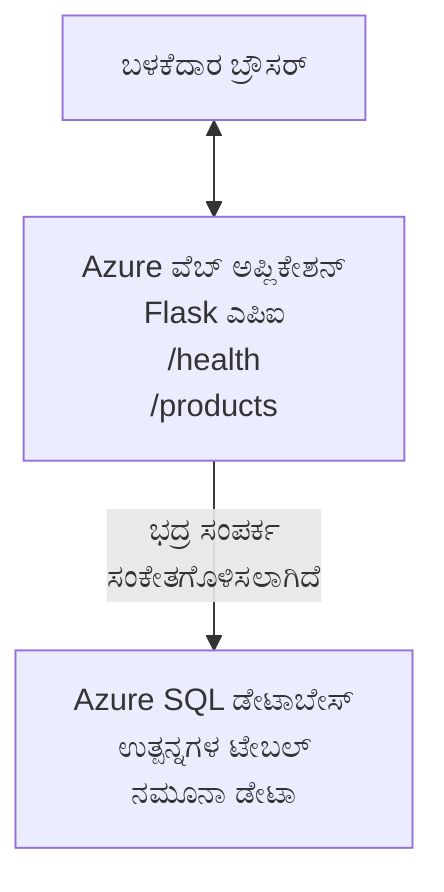

# AZD ನೊಂದಿಗೆ Microsoft SQL ಡೇಟಾಬೇಸ್ ಮತ್ತು ವೆಬ್ ಅಪ್ಲಿಕೇಷನ್ ಅನ್ನು ನಿಯೋಜಿಸುವುದು

⏱️ **ಅಂದಾಜು ಸಮಯ**: 20-30 ನಿಮಿಷಗಳು | 💰 **ಅಂದಾಜು ವೆಚ್ಚ**: ~$15-25/ತಿಂಗಳು | ⭐ **ಸಂಕೀರ್ಣತೆ**: ಮಧ್ಯಮ

ಈ **ಪೂರ್ಣ, ಕಾರ್ಯನಿರತ ಉದಾಹರಣೆ** [Azure Developer CLI (azd)](https://learn.microsoft.com/azure/developer/azure-developer-cli/) ಅನ್ನು ಬಳಸಿ Python Flask ವೆಬ್ ಅಪ್ಲಿಕೇಷನ್ ಅನ್ನು Microsoft SQL Database ಗೆ Azure ಗೆ ನಿಯೋಜಿಸುವ ವಿಧಾನವನ್ನು ಡೆಮೊನ್ಸ್ಟ್ರೇಟ್ ಮಾಡುತ್ತದೆ. ಎಲ್ಲಾ ಕೋಡ್ ಸೇರಿದೆ ಮತ್ತು ಪರೀಕ್ಷೆ ಮಾಡಲಾಗಿದೆ—ಬಾಹ್ಯ ಅವಲಂಬನೆಗಳ ಅಗತ್ಯವಿಲ್ಲ.

## ನೀವು ಏನು ಕಲಿಯುತ್ತೀರಿ

ಈ ಉದಾಹರಣೆಯನ್ನು ಪೂರ್ಣಗೊಳಿಸುವ ಮೂಲಕ, ನೀವು:
- ಮೂಲಸೌಕರ್ಯ-ಆಧರಿತ ಕೋಡ್ ಬಳಸಿ ಬಹು-ತಲೆ ಆ್ಯಪ್ಲಿಕೇಷನ್ ಅನ್ನು (ವೆಬ್ ಅಪ್ + ಡೇಟಾಬೇಸ್) ನಿಯೋಜಿಸುವುದು
- ರಹಸ್ಯಗಳನ್ನು ಹಾರ್ಡ್‌ಕೋಡ್ ಮಾಡದೆ ಸುರಕ್ಷಿತ ಡೇಟಾಬೇಸ್ ಸಂಪರ್ಕಗಳನ್ನು ಕಾನ್ಫಿಗರ್ ಮಾಡುವುದು
- Application Insights ಮೂಲಕ ಅಪ್ಲಿಕೇಶನ್ ಆರೋಗ್ಯವನ್ನು ನಿಗಾವಿಡುವುದು
- AZD CLI ಮೂಲಕ Azure ಸಂಪನ್ಮೂಲಗಳನ್ನು ಪರಿಣಾಮಕಾರಿಯಾಗಿ ನಿರ್ವಹಿಸುವುದು
- ಭದ್ರತೆ, ವೆಚ್ಚ ಆಪ್ಟಿಮೈಸೇಶನ್ ಮತ್ತು ಅನುಸಂಧಾನದ Azure ಉತ್ತಮ ಅಭ್ಯಾಸಗಳನ್ನು ಅನುಸರಿಸುವುದು

## ಸಂದರ್ಭದ ಅವಲೋಕನ

- **Web App**: ಡೇಟಾಬೇಸ್ ಸಂಪರ್ಕವಿರುವ Python Flask REST API
- **Database**: નમૂನಾ ಡೇಟಾ‌ನೊಂದಿಗೆ Azure SQL Database
- **Infrastructure**: Bicep ಬಳಸಿ (ಮೊಡ್ಯುಲರ್, ಮರುಬಳಕೆ ಮಾಡಬಹುದಾದ ಟೆಂಪ್ಲೇಟುಗಳು)
- **Deployment**: `azd` ಕಮಾಂಡ್‌ಗಳೊಂದಿಗೆ ಸಂಪೂರ್ಣ ಸ್ವಯಂಚಾಲಿತ
- **Monitoring**: ಲಾಗ್‌ಗಳು ಮತ್ತು ಟೆಲೆಮೆಟ್ರಿಗಾಗಿ Application Insights

## ಪೂರ್ವಅಗತ್ಯತೆಗಳು

### ಅಗತ್ಯ ಉಪಕರಣಗಳು

ಆರಂಭಿಸುವ ಮೊದಲು, ನಿಮ್ಮ ಬಳಿ ಈ ಉಪಕರಣಗಳು ಇನ್‌ಸ್ಟಾಲ್ ಆಗಿವೆ ಎಂದು ಪರಿಶೀಲಿಸಿ:

1. **[Azure CLI](https://learn.microsoft.com/cli/azure/install-azure-cli)** (ಆವೃತ್ತಿ 2.50.0 ಅಥವಾ ಹೆಚ್ಚಿನದು)
   ```sh
   az --version
   # ನಿರೀಕ್ಷಿತ ಔಟ್‌ಪುಟ್: azure-cli 2.50.0 ಅಥವಾ ಹೆಚ್ಚಿನ ಆವೃತ್ತಿ
   ```

2. **[Azure Developer CLI (azd)](https://learn.microsoft.com/azure/developer/azure-developer-cli/install-azd)** (ಆವೃತ್ತಿ 1.0.0 ಅಥವಾ ಹೆಚ್ಚಿನದು)
   ```sh
   azd version
   # ನಿರೀಕ್ಷಿತ ಫಲಿತಾಂಶ: azd ಆವೃತ್ತಿ 1.0.0 ಅಥವಾ ಹೆಚ್ಚಿನದು
   ```

3. **[Python 3.8+](https://www.python.org/downloads/)** (ಸ್ಥಳೀಯ ಅಭಿವೃದ್ಧಿಗೆ)
   ```sh
   python --version
   # ನಿರೀಕ್ಷಿತ ಔಟ್‌ಪುಟ್: Python 3.8 ಅಥವಾ ಅದಕ್ಕಿಂತ ಮೇಲಿನ
   ```

4. **[Docker](https://www.docker.com/get-started)** (ಐಚ್ಛಿಕ, ಸ್ಥಳೀಯ ಕಂಟೇನರೈಸ್ ಅಭಿವೃದ್ಧಿಗಾಗಿ)
   ```sh
   docker --version
   # ನಿರೀಕ್ಷಿತ ಫಲಿತಾಂಶ: Docker ಆವೃತ್ತಿ 20.10 ಅಥವಾ ಅದಕ್ಕಿಂತ ಮೇಲಿನದು
   ```

### Azure ಅವಶ್ಯಕತೆಗಳು

- ಸಕ್ರಿಯ **Azure subscription** ([create a free account](https://azure.microsoft.com/free/))
- ನಿಮ್ಮ ಸಬ್ಸ್ಕ್ರಿಪ್ಶನ್‌ನಲ್ಲಿ ಸಂಪನ್ಮೂಲಗಳನ್ನು ರಚಿಸುವ ಅನುಮತಿಗಳು
- ಸಬ್ಸ್ಕ್ರಿಪ್ಶನ್ ಅಥವಾ ರಿಸೋರ್ಸ್ ಗ್ರೂಪ್ ಮೇಲೆ **Owner** ಅಥವಾ **Contributor** ಪಾತ್ರ

### ಪೂರ್ವಜ್ಞಾನ ಅಗತ್ಯಗಳು

ಇದು **ಮಧ್ಯಮ-ಮಟ್ಟದ** ಉದಾಹರಣೆಯಾಗಿದ್ದು, ನಿಮಗೆ ಈ ವಿಷಯಗಳಲ್ಲಿ ಪರಿಚಯ ಇರಬೇಕು:
- ಮೂಲ ಕಮಾಂಡ್-ಲೈನ್ ಕಾರ್ಯಾಚರಣೆಗಳು
- ಕ್ಲೌಡ್ ಮೂಲಭೂತ ತತ್ವಗಳು (ಸಂಪನ್ಮೂಲಗಳು, ರಿಸೋರ್ಸ್ ಗ್ರೂಪ್‌ಗಳು)
- ವೆಬ್ ಅಪ್ಲಿಕೇಶನ್‌ಗಳು ಮತ್ತು ಡೇಟಾಬೇಸ್‌ಗಳ ಮೂಲಭೂತ ಅರ್ಥ

**AZD ಹೊಸದಾಗಿದೆಯೇ?** ಮೊದಲು [Getting Started guide](../../docs/chapter-01-foundation/azd-basics.md) ಅನ್ನು ಓದಿ.

## ವಾಸ್ತುಶಿಲ್ಪ

ಈ ಉದಾಹರಣೆ ಒಂದು ಎರಡು-ತಲೆ ವಾಸ್ತುಶಿಲ್ಪವನ್ನು ನಿಯೋಜಿಸುತ್ತದೆ — ವೆಬ್ ಅಪ್ಲಿಕೇಷನ್ ಮತ್ತು SQL ಡೇಟಾಬೇಸ್:



**ಸಂಪನ್ಮೂಲ ನಿಯೋಜನೆ:**
- **Resource Group**: ಎಲ್ಲಾ ಸಂಪನ್ಮೂಲಗಳ.Container
- **App Service Plan**: Linux ಆಧಾರಿತ ہوس್ಟಿಂಗ್ (ಖರ್ಚು ಕಮ್ಮಿ ಮಾಡಲು B1 ತಹ)
- **Web App**: Python 3.11 ರಂಟೈಮ್‌ನೊಂದಿಗೆ Flask ಅಪ್ಲಿಕೇಶನ್
- **SQL Server**: TLS 1.2 ಕನಿಷ್ಠವನ್ನು ಹೊಂದಿರುವ ನಿರ್ವಹಿತ ಡೇಟಾಬೇಸ್ ಸರ್ವರ್
- **SQL Database**: Basic ತಹ (2GB, ಅಭಿವೃದ್ಧಿ/ಟೆಸ್ಟಿಂಗ್‌ಗೆ ಸೂಕ್ತ)
- **Application Insights**: ನಿಗාවು ಮತ್ತು ಲಾಗಿಂಗ್
- **Log Analytics Workspace**: ಕೇಂದ್ರೀಕೃತ ಲಾಗ್ ಸ್ಟೋರೇಜ್

**ಉಪಮನಾ**: ಇದನ್ನು ರೆಸ್ಟೋರೆಂಟ್ (ವೆಬ್ ಅಪ್) ಮತ್ತು ಓಟದ ಫ್ರೀಜರ್ (ಡೇಟಾಬೇಸ್) ಅಂತಾದರೆ ಕಂಡುಹಿಡಿಯಿರಿ. ಗ್ರಾಹಕರು ಮೆನು (API ಎಂಡ್‌ಪಾಯಿಂಟ್‌ಗಳು) ನಿಂದ ಆರ್ಡರ್ ಮಾಡುತ್ತಾರೆ, ಮತ್ತು ಅಡಿಗೆಮನೆ (Flask ಅಪ್ಲಿಕೇಶನ್) ಫ್ರೀಜರ್‌ನಿಂದ ಪದಾರ್ಥಗಳು (ಡೇಟಾ) ತರುತ್ತದೆ. ರೆಸ್ಟೋರೆಂಟ್ ಮ್ಯಾನೇಜರ್ (Application Insights) ಎಲ್ಲವೂ ಟ್ರ್ಯಾಕ್ ಮಾಡುತ್ತಾನೆ.

## ಫೋಲ್ಡರ್ ರಚನೆ

ಈ ಉದಾಹರಣೆಯಲ್ಲಿ ಎಲ್ಲಾ ಫೈಲ್‌ಗಳು ಸೇರಿವೆ—ಯಾವುದೇ ಬಾಹ್ಯ ಅವಲಂಬನೆಗಳ ಅಗತ್ಯವಿಲ್ಲ:

```
examples/database-app/
│
├── README.md                    # This file
├── azure.yaml                   # AZD configuration file
├── .env.sample                  # Sample environment variables
├── .gitignore                   # Git ignore patterns
│
├── infra/                       # Infrastructure as Code (Bicep)
│   ├── main.bicep              # Main orchestration template
│   ├── abbreviations.json      # Azure naming conventions
│   └── resources/              # Modular resource templates
│       ├── sql-server.bicep    # SQL Server configuration
│       ├── sql-database.bicep  # Database configuration
│       ├── app-service-plan.bicep  # Hosting plan
│       ├── app-insights.bicep  # Monitoring setup
│       └── web-app.bicep       # Web application
│
└── src/
    └── web/                    # Application source code
        ├── app.py              # Flask REST API
        ├── requirements.txt    # Python dependencies
        └── Dockerfile          # Container definition
```

**ಪ್ರತಿ ಫೈಲ್ ಏನು ಮಾಡುತ್ತದೆ:**
- **azure.yaml**: AZD ಗೆ ಏನು ನಿಯೋಜಿಸಲು ಮತ್ತು ಎಲ್ಲಿಗೆ ತಿಳಿಸಿ
- **infra/main.bicep**: ಎಲ್ಲಾ Azure ಸಂಪನ್ಮೂಲಗಳನ್ನು ಒತ್ತಾಯಿಸುವ ಒಳ್ಳೆಯ ನಿರ್ವಹಣೆ
- **infra/resources/*.bicep**: ವೈಯಕ್ತಿಕ ಸಂಪನ್ಮೂಲ ವ್ಯಾಖ್ಯಾನಗಳು (ಮರುಬಳಕೆಗಾಗಿಯೂ ಮೊಡ್ಯುಲರ್)
- **src/web/app.py**: ಡೇಟಾಬೇಸ್ ಲಾಜಿಕ್ ಹೊಂದಿರುವ Flask ಅಪ್ಲಿಕೇಶನ್
- **requirements.txt**: Python ಪ್ಯಾಕೇಜ್ ಅವಲಂಬನೆಗಳು
- **Dockerfile**: ನಿಯೋಜನೆಗಾಗಿ ಕಂಟೇನರೈಸೇಶನ್ ಸೂಚನೆಗಳು

## ತ್ವರಿತ ಪ್ರಾರಂಭ (ಹಂತಗತ)

### ಹಂತ 1: ಕ್ಲೋನ್ ಮಾಡಿ ಮತ್ತು ನಾವಿಗೇಟ್ ಮಾಡಿ

```sh
git clone https://github.com/microsoft/AZD-for-beginners.git
cd AZD-for-beginners/examples/database-app
```

**✓ ಯಶಸ್ವಿ ಪರಿಶೀಲನೆ**: ನೀವು `azure.yaml` ಮತ್ತು `infra/` ಫೋಲ್ಡರ್ ಅನ್ನು ಕಾಣುತ್ತಿರುವುದನ್ನು ಪರಿಶೀಲಿಸಿ:
```sh
ls
# ನಿರೀಕ್ಷಿತ: README.md, azure.yaml, infra/, src/
```

### ಹಂತ 2: Azure ನಲ್ಲಿ ಪ್ರಾಮಾಣೀಕರಣ ಮಾಡಿ

```sh
azd auth login
```

ಇದು ನಿಮ್ಮ ಬ್ರೌಸರ್ ಅನ್ನು ತೆರೆಯುತ್ತದೆ ಮತ್ತು Azure ಪ್ರಾಮಾಣೀಕರಣಕ್ಕಾಗಿ. ನಿಮ್ಮ Azure ಕ್ರೆಡೆನ್ಶಿಯಲ್ಸ್‌ನೊಂದಿಗೆ ಸೈನ್ ಇನ್ ಮಾಡಿ.

**✓ ಯಶಸ್ವಿ ಪರಿಶೀಲನೆ**: ನಿಮಗೆ ಕೆಳಗಿನ ರೀತಿಯ আউಟ್‌ಪುಟ್ ಕಾಣಿಸಬೇಕು:
```
Logged in to Azure.
```

### ಹಂತ 3: ಪರಿಸರವನ್ನು ಪ್ರಾರಂಭಿಸಿ

```sh
azd init
```

**ಯಾವಾಗ ನೆರವೇರುತ್ತದೆ**: AZD ನಿಮ್ಮ ನಿಯೋಜನೆಗೆ ಸ್ಥಳೀಯ ಕಾನ್ಫಿಗರೇಶನ್ ಸೃಷ್ಟಿಸುತ್ತದೆ.

**ನೀವು ಕಾಣಬಹುದಾದ ಪ್ರಾಂಪ್ಟ್‌ಗಳು**:
- **Environment name**: ಒಂದು ಸಂಕ್ಷಿಪ್ತ ಹೆಸರು ನಮೂದಿಸಿ (ಉದಾ., `dev`, `myapp`)
- **Azure subscription**: ಪಟ್ಟಿ‌ನಿಂದ ನಿಮ್ಮ ಸಬ್ಸ್ಕ್ರಿಪ್ಶನ್ ಆಯ್ಕೆಮಾಡಿ
- **Azure location**: ಒಂದು ರೀಜನೆ ಆಯ್ಕೆ ಮಾಡಿ (ಉದಾ., `eastus`, `westeurope`)

**✓ ಯಶಸ್ವಿ ಪರಿಶೀಲನೆ**: ನಿಮಗೆ ಈ ರೀತಿಯ ಔಟ್‌‌ಪುಟ್ ಕಾಣಿಸಬೇಕು:
```
SUCCESS: New project initialized!
```

### ಹಂತ 4: Azure ಸಂಪನ್ಮೂಲಗಳನ್ನು ಪ್ರಾವಿಧಾನ ಮಾಡಿ

```sh
azd provision
```

**ಯಾವಾಗ ನೆರವೇರುತ್ತದೆ**: AZD ಎಲ್ಲಾ ಮೂಲಸೌಕರ್ಯವನ್ನು ನಿಯೋಜಿಸುತ್ತದೆ (5-8 ನಿಮಿಷಗಳು ತೆಗೆದುಕೊಳ್ಳಬಹುದು):
1. Resource Group ನಿರ್ಮಿಸುತ್ತದೆ
2. SQL Server ಮತ್ತು Database ಅನ್ನು ರಚಿಸುತ್ತದೆ
3. App Service Plan ಅನ್ನು ರಚಿಸುತ್ತದೆ
4. Web App ಅನ್ನು ರಚಿಸುತ್ತದೆ
5. Application Insights ಅನ್ನು ರಚಿಸುತ್ತದೆ
6. ನೆಟ್ವರ್ಕಿಂಗ್ ಮತ್ತು ಭದ್ರತೆಯನ್ನು কಾನ್ಫಿಗರ್ ಮಾಡುತ್ತದೆ

**ನೀವು ಕೋರಿಕೊಳ್ಳಲ್ಪಡುವುದು**:
- **SQL admin username**: ಒಂದು ಬಳಕೆದಾರಹೆಸರು ನಮೂದಿಸಿ (ಉದಾ., `sqladmin`)
- **SQL admin password**: ಬಲವಾದ ಪಾಸ್ವರ್ಡ್ ನಮೂದಿಸಿ (ಇದನ್ನು ಸೇವ್ ಮಾಡಿ!)

**✓ ಯಶಸ್ವಿ ಪರಿಶೀಲನೆ**: ನಿಮಗೆ ಈ ರೀತಿಯ ಔಟ್‌‌ಪುಟ್ ಕಾಣಿಸಬೇಕು:
```
SUCCESS: Your application was provisioned in Azure in X minutes Y seconds.
You can view the resources created under the resource group rg-<env-name> in Azure Portal:
https://portal.azure.com/#@/resource/subscriptions/.../resourceGroups/rg-<env-name>
```

**⏱️ ಸಮಯ**: 5-8 ನಿಮಿಷಗಳು

### ಹಂತ 5: ಆ್ಯಪ್ಲಿಕೇಶನ್ ಅನ್ನು ನಿಯೋಜಿಸಿ

```sh
azd deploy
```

**ಯಾವಾಗ ನೆರವೇರುತ್ತದೆ**: AZD ನಿಮ್ಮ Flask ಅಪ್ಲಿಕೇಶನ್ ಅನ್ನು ಬಿಲ್ಡ್ ಮತ್ತು ನಿಯೋಜಿಸುತ್ತದೆ:
1. Python ಅಪ್ಲಿಕೇಶನ್ ಪ್ಯಾಕೇಜ್ ಮಾಡುತ್ತದೆ
2. Docker ಕಂಟೇನರ್ ಅನ್ನು ಬಿಲ್ಡ್ ಮಾಡುತ್ತದೆ
3. Azure Web App ಗೆ ಪುಶ್ ಮಾಡುತ್ತದೆ
4. ನಕಲಿ ಡೇಟಾಗಳೊಂದಿಗೆ ಡೇಟಾಬೇಸ್ ಅನ್ನು ಆರಂಭಿಕಗೊಳಿಸುತ್ತದೆ
5. ಅಪ್ಲಿಕೇಶನ್ ಅನ್ನು ಪ್ರಾರಂಭಿಸುತ್ತದೆ

**✓ ಯಶಸ್ವಿ ಪರಿಶೀಲನೆ**: ನಿಮಗೆ ಈ ರೀತಿಯ ಔಟ್‌‌ಪುಟ್ ಕಾಣಿಸಬೇಕು:
```
SUCCESS: Your application was deployed to Azure in X minutes Y seconds.
You can view the resources created under the resource group rg-<env-name> in Azure Portal:
https://portal.azure.com/#@/resource/subscriptions/.../resourceGroups/rg-<env-name>
```

**⏱️ ಸಮಯ**: 3-5 ನಿಮಿಷಗಳು

### ಹಂತ 6: ಅಪ್ಲಿಕೇಶನ್ ಬ್ರೌಸ್ ಮಾಡಿ

```sh
azd browse
```

ಇದು ನಿಮ್ಮ ನಿಯೋಜಿತ ವೆಬ್ ಅಪ್ ಅನ್ನು ಬ್ರೌಸರ್‌ನಲ್ಲಿ `https://app-<unique-id>.azurewebsites.net` ನಲ್ಲಿ ತೆರೆಯುತ್ತದೆ

**✓ ಯಶಸ್ವಿ ಪರಿಶೀಲನೆ**: ನಿಮಗೆ JSON ಔಟ್‌ಪುಟ್ ಕಾಣಿಸಬೇಕು:
```json
{
  "message": "Welcome to the Database App API",
  "endpoints": {
    "/": "This help message",
    "/health": "Health check endpoint",
    "/products": "List all products",
    "/products/<id>": "Get product by ID"
  }
}
```

### ಹಂತ 7: API ಎಂಡ್‌ಪಾಯಿಂಟ್‌ಗಳನ್ನು ಪರೀಕ್ಷೆ ಮಾಡಿ

**ಹೀಕ್ಷಾ ಪರಿಶೀಲನೆ** (ಡೇಟಾಬೇಸ್ ಸಂಪರ್ಕವನ್ನು ದೃಢೀಕರಿಸಿ):
```sh
curl https://app-<your-id>.azurewebsites.net/health
```

**ನಿರೀಕ್ಷಿತ ಪ್ರತಿಕ್ರಿಯೆ**:
```json
{
  "status": "healthy",
  "database": "connected"
}
```

**ಉತ್ಪನ್ನಗಳನ್ನು ಪಟ್ಟಿ** (ನಮೂನಾ ಡೇಟಾ):
```sh
curl https://app-<your-id>.azurewebsites.net/products
```

**ನಿರೀಕ್ಷಿತ ಪ್ರತಿಕ್ರಿಯೆ**:
```json
[
  {
    "id": 1,
    "name": "Laptop",
    "description": "High-performance laptop",
    "price": 1299.99,
    "created_at": "2025-11-19T10:30:00"
  },
  ...
]
```

**ಒಂದು ಉತ್ಪನ್ನವನ್ನು ಪಡೆಯಿರಿ**:
```sh
curl https://app-<your-id>.azurewebsites.net/products/1
```

**✓ ಯಶಸ್ವಿ ಪರಿಶೀಲನೆ**: ಎಲ್ಲಾ ಎಂಡ್‌ಪಾಯಿಂಟ್‌ಗಳು ದೋಷವಿಲ್ಲದೆ JSON ಡೇಟಾವನ್ನು ಹಿಂತಿರುಗಿಸುತ್ತವೆ.

---

**🎉 ಅಭಿನಂದನೆಗಳು!** ನೀವು AZD ಬಳಸಿ ಒಂದು ವೆಬ್ ಅಪ್ಲಿಕೇಶನ್ ಮತ್ತು ಡೇಟಾಬೇಸ್ ಅನ್ನು ಯಶಸ್ವಿಯಾಗಿ Azure ಗೆ ನಿಯೋಜಿಸಿದ್ದೀರಿ.

## ಕಾನ್ಫಿಗರೇಶನ್ ಆಳವಾದ ವಿಶ್ಲೇಷಣೆ

### ಪರಿಸರ ವ್ಯಾರಿಯಬಲ್ಸ್

ರಹಸ್ಯಗಳನ್ನು Azure App Service ಕಾನ್ಫಿಗರೇಶನ್ ಮೂಲಕ ಸುರಕ್ಷಿತವಾಗಿ ನಿರ್ವಹಿಸಲಾಗುತ್ತದೆ—**ಮೂಲಸೋರ್ಸ್‌ ಕೋಡ್‌ನಲ್ಲಿ ಎಚ್ಚರಿಕೆಯಿಂದ ಹಾರ್ಡ್‌ಕೋಡ್ ಮಾಡಬೇಡಿ**.

**AZD ಮೂಲಕ ಸ್ವಯಂಚಾಲಿತವಾಗಿ ಕಾನ್ಫಿಗರ್ ಆಗುವುದು**:
- `SQL_CONNECTION_STRING`: ಎನ್‌ಕ್ರಿಪ್ಟ್ ಮಾಡಿದ ಕ್ರೆಡೆನ್ಶಿಯಲ್‌ಗಳೊಂದಿಗೆ ಡೇಟಾಬೇಸ್ ಸಂಪರ್ಕದ ಸ್ಟ್ರಿಂಗ್
- `APPLICATIONINSIGHTS_CONNECTION_STRING`: ಮಾನಿಟರಿಂಗ್ ಟೆಲೆಮೆಟ್ರಿ ಎಂಡ್‌ಪುಟ್
- `SCM_DO_BUILD_DURING_DEPLOYMENT`: ಸ್ವಯಂಚಾಲಿತವಾಗಿ ಡಿಪೆಂಡೆನ್ಸಿಗಳನ್ನು ಇನ್‌ಸ್ಟಾಲ್ ಮಾಡುವ ಸೂಚನೆ

**ರಹಸ್ಯಗಳು ಎಲ್ಲಿಗೆ ಸಂಗ್ರಹವಾಗುತ್ತವೆ**:
1. `azd provision` ನಡೆಸುವಾಗ, ನೀವು ಸುರಕ್ಷಿತ ಪ್ರಾಂಪ್ಟ್‌ಗಳ ಮೂಲಕ SQL ಕ್ರೆಡೆನ್ಶಿಯಲ್ಸ್ ಕೊಡುತ್ತೀರಿ
2. AZD ಈ ಕ್ರೆಡೆನ್ಶಿಯಲ್ಸ್ ಅನ್ನು ನಿಮ್ಮ ಸ್ಥಳೀಯ `.azure/<env-name>/.env` ಫೈಲಿನಲ್ಲಿ (git-ignored) ಸಂಗ್ರಹಿಸುತ್ತದೆ
3. AZD ಅವುಗಳನ್ನು Azure App Service ಕಾನ್ಫಿಗರೇಶನ್‌ಗೆ ಇಂಜೆಕ್ಟ್ ಮಾಡುತ್ತದೆ (ರೇಸ್ಟ್‌ನಲ್ಲಿ ಎನ್‌ಕ್ರಿಪ್ಟ್)
4. ಅಪ್ಲಿಕೇಶನ್ ರನটাইಮ್‌ನಲ್ಲಿ ಅವುಗಳನ್ನು `os.getenv()` ಮೂಲಕ ಓದುತ್ತದೆ

### ಸ್ಥಳೀಯ ಅಭಿವೃದ್ಧಿ

ಸ್ಥಳೀಯ ಪರೀಕ್ಷೆಗಾಗಿ, ಮಾದರಿ `.env` ಫೈಲ್‌ನಿಂದ ನಿಮ್ಮ ಫೈಲ್ ರಚಿಸಿ:

```sh
cp .env.sample .env
# ನಿಮ್ಮ ಸ್ಥಳೀಯ ಡೇಟಾಬೇಸ್ ಸಂಪರ್ಕವನ್ನು ಹೊಂದಿಸಲು .env ಅನ್ನು ಸಂಪಾದಿಸಿ
```

**ಸ್ಥಳೀಯ ಅಭಿವೃದ್ಧಿ ವರ್ಕ್‌ಫ್ಲೋ**:
```sh
# ಅವಲಂಬನೆಗಳನ್ನು ಸ್ಥಾಪಿಸಿ
cd src/web
pip install -r requirements.txt

# ಪರಿಸರ ಚರಗಳನ್ನು ಹೊಂದಿಸಿ
export SQL_CONNECTION_STRING="your-local-connection-string"

# ಅನ್ವಯಿಕೆಯನ್ನು ಚಾಲನೆಗೊಳಿಸಿ
python app.py
```

**ಸ್ಥಳೀಯವಾಗಿ ಪರೀಕ್ಷೆ ಮಾಡಿ**:
```sh
curl http://localhost:8000/health
# ನಿರೀಕ್ಷಿತ: {"status": "healthy", "database": "connected"}
```

### ಇನ್‌ಫ್ರಾಸ್ಟ್ರಕ್ಚರ್ ಆಫ್ ಕೋಡ್

ಎಲ್ಲಾ Azure ಸಂಪನ್ಮೂಲಗಳು **Bicep ಟೆಂಪ್ಲೇಟುಗಳಲ್ಲಿ** (`infra/` ಫೋಲ್ಡರ್) ವ್ಯಾಖ್ಯಾನಿಸಲಾಗಿವೆ:

- **ಮೊಡ್ಯುಲರ್ ವಿನ್ಯಾಸ**: ಪ್ರತಿಯೊಂದು ಸಂಪನ್ಮೂಲ ಪ್ರಕಾರಕ್ಕೂ ಮರುಬಳಕೆಯಾಗಿ ಫೈಲ್ ಇದೆ
- **ಪ್ಯಾರಮೆಟರೈಜ್ಡ್**: SKUಗಳು, ರೀಜನ್‌ಗಳು, ನಾಮಕರಣ ಪರಂಪರೆಗಳನ್ನು ಕಸ್ಟಮೈಸ್ ಮಾಡಬಹುದು
- **ಉತ್ತಮ ಅಭ್ಯಾಸಗಳು**: Azure ನಾಮಕರಣ ಮಾನದಂಡ ಮತ್ತು ಭದ್ರತಾ ಡೆಫಾಲ್ಟ್‌ಗಳನ್ನು ಅನುಸರಿಸುತ್ತದೆ
- **ವರ್ಷನ್ ಕಂಟ್ರೋಲ್ ಮಾಡಲಾಗಿದೆ**: ಮೂಲಸೌಕರ್ಯದ ಬದಲಾವಣೆಗಳು Git ನಲ್ಲಿ ಟ್ರ್ಯಾಕ್ ಆಗುತ್ತವೆ

**ಕಸ್ಟಮೈಜೆಶನ್ ಉದಾಹರಣೆ**:
ಡೇಟಾಬೇಸ್ ತಹವನ್ನು ಬದಲಾಯಿಸಲು, `infra/resources/sql-database.bicep` ಅನ್ನು ಸಂಪಾದಿಸಿ:
```bicep
sku: {
  name: 'Standard'  // Changed from 'Basic'
  tier: 'Standard'
  capacity: 10
}
```

## ಸುರಕ್ಷತಾ ಉತ್ತಮ ಅಭ್ಯಾಸಗಳು

ಈ ಉದಾಹರಣೆ Azure ಸುರಕ್ಷತಾ ಉತ್ತಮ ಅಭ್ಯಾಸಗಳನ್ನು ಅನುಸರಿಸುತ್ತದೆ:

### 1. **ಮೂಲಸೋರ್ಸ್ ಕೋಡ್‌ನಲ್ಲಿ ಯಾವುದೇ ರಹಸ್ಯಗಳಿಲ್ಲ**
- ✅ ಕ್ರೆಡೆನ್ಶಿಯಲ್ಸ್ Azure App Service ಕಾನ್ಫಿಗರೇಶನಿನಲ್ಲಿ ಸಂಗ್ರಹಿತ (ಎನ್‌ಕ್ರಿಪ್ಟ್ ಆಗಿ)
- ✅ `.env` ಫೈಲ್‌ಗಳು `.gitignore` ಮೂಲಕ Git ನಿರ್ಗೋಚರಗೊಳ್ಳುತ್ತವೆ
- ✅ ಪ್ರಾವಿಧಾನ ಸಂದರ್ಭದಲ್ಲಿ ರಹಸ್ಯಗಳು ಸುರಕ್ಷಿತ ಪ್ಯಾರಾಮೀಟರ್‌ಗಳ ಮೂಲಕ ಪಾಸಿಂಗ್ ಮಾಡಲಾಗುತ್ತವೆ

### 2. **ಎನ್‌ಕ್ರಿಪ್ಟ್ ಮಾಡಿದ ಸಂಪರ್ಕಗಳು**
- ✅ SQL Server ಗೆ ಕನಿಷ್ಠ TLS 1.2
- ✅ Web App ಗೆ ಕೇವಲ HTTPS ಅನ್ವಯ
- ✅ ಡೇಟಾಬೇಸ್ ಸಂಪರ್ಕಗಳು ಎನ್‌ಕ್ರಿಪ್ಟ್ ಚಾನಲ್‌ಗಳನ್ನು ಬಳಸುತ್ತವೆ

### 3. **ನೆಟ್ವರ್ಕ್ ಭದ್ರತೆ**
- ✅ SQL Server ಫೈರ್‌ವಾಲ್ Azure ಸೇವೆಗಳಿಗೆ ಮಾತ್ರ ಅನುಮತಿ ನೀಡಿ ಕಾನ್ಫಿಗರ್ ಮಾಡಿದೆ
- ✅ ಸಾರ್ವಜನಿಕ ನೆಟ್ವರ್ಕ್ ಪ್ರವೇಶವನ್ನು ನಿರ್ಬಂಧಿಸಲಾಗಿದೆ (Private Endpoints ನಿಂದ ಇನ್ನೂ ಭದ್ರಗೊಳಿಸಬಹುದು)
- ✅ Web App ಮೇಲೆ FTPS ನಿಷ್ಕ್ರಿಯಗೊಳಿಸಲಾಗಿದೆ

### 4. **ಆಥೆಂಟಿಕೇಶನ್ ಮತ್ತು ಅನAuthorೈಜೇಶನ್**
- ⚠️ **ಪ್ರಸ್ತುತ**: SQL ಆಥೆಂಟಿಕೇಶನ್ (ಬಳಕೆದಾರಹೆಸರು/ಪಾಸ್ವರ್ಡ್)
- ✅ **ಉತ್ಪಾದನೆ ಶಿಫಾರಸು**: ಪಾಸ್ವರ್ಡ್ ರಹಿತ ಆಥೆಂಟಿಕೇಶನ್ಗಾಗಿ Azure Managed Identity ಬಳಸಿ

**Managed Identity ಗೆ ಅಪ್‌ಗ್ರೇಡ್ ಮಾಡಲು** (ಉತ್ಪಾದನೆಗಾಗಿ):
1. Web App ನಲ್ಲಿ Managed Identity ಸಕ್ರಿಯಗೊಳಿಸಿ
2. ಆ ಐಡೆಂಟಿಟಿಗೆ SQL ಅನುಮತಿಗಳನ್ನು ನೀಡಿ
3. ಕನೆಕ್ಷನ್ ಸ್ಟ್ರಿಂಗ್ ಅನ್ನು Managed Identity ಬಳಸುವಂತೆ ನವೀಕರಿಸಿ
4. ಪಾಸ್ವರ್ಡ್ ಆಧಾರಿತ ಆಥೆಂಟಿಕೇಶನ್ ಅನ್ನು ತೆಗೆದುಹಾಕಿ

### 5. **ಆಡಿಟಿಂಗ್ ಮತ್ತು ಅನುಕೂಲತೆ**
- ✅ Application Insights ಎಲ್ಲಾ ವಿನಂತಿಗಳು ಮತ್ತು ದೋಷಗಳನ್ನು ಲಾಗ್ ಮಾಡುತ್ತದೆ
- ✅ SQL Database auditing ಸಕ್ರಿಯವಾಗಿದೆ (ಅನುಕೂಲತೆಯಿಗಾಗಿ ಕಾನ್ಫಿಗರ್ ಮಾಡಬಹುದು)
- ✅ ಎಲ್ಲ ಸಂಪನ್ಮೂಲಗಳು ಗವರ್ನನ್ಸ್‌ಗಾಗಿ ಟ್ಯಾಗ್ ಮಾಡಲಾಗಿದೆ

**ಉತ್ಪಾದನೆಗೆ ಮುನ್ನ ಸುರಕ್ಷತಾ ಚೆಕ್‌ಲಿಸ್ಟ್**:
- [ ] Azure Defender for SQL ಸಕ್ರಿಯಗೊಳಿಸಿ
- [ ] SQL Database ಗೆ Private Endpoints ಕಾನ್ಫಿಗರ್ ಮಾಡಿ
- [ ] Web Application Firewall (WAF) ಸಕ್ರಿಯಗೊಳಿಸಿ
- [ ] ರಹಸ್ಯ ರೊಟೇಶನ್ ಗೆ Azure Key Vault ಅನ್ನು ಅನುಷ್ಠಾನಗೊಳಿಸಿ
- [ ] Microsoft Entra ID ಆಥೆಂಟಿಕೇಶನ್ ಕಾನ್ಫಿಗರ್ ಮಾಡಿ
- [ ] ಎಲ್ಲಾ ಸಂಪನ್ಮೂಲಗಳಿಗಾಗಿ ಡಯಾಗ್ನೋಸ್ಟಿಕ್ ಲಾಗಿಂಗ್ ಸಕ್ರಿಯಗೊಳಿಸಿ

## ವೆಚ್ಚದ ದಕ್ಷತೆ

**ಅಂದಾಜು ಮಾಸಿಕ ವೆಚ್ಚಗಳು** (ನವಂಬರ್ 2025 ರಂತೆ):

| Resource | SKU/Tier | Estimated Cost |
|----------|----------|----------------|
| App Service Plan | B1 (Basic) | ~$13/month |
| SQL Database | Basic (2GB) | ~$5/month |
| Application Insights | Pay-as-you-go | ~$2/month (low traffic) |
| **Total** | | **~$20/month** |

**💡 ವೆಚ್ಚ ಉಳಿತಾಯ ಸಲಹೆಗಳು**:

1. **ಅಭ್ಯಾಸಕ್ಕಾಗಿ ಉಚಿತ ತಹ ಬಳಸಿರಿ**:
   - App Service: F1 ತಹ (ಉಚಿತ, ಸೀಮಿತ ಗಂಟೆಗಳು)
   - SQL Database: Azure SQL Database serverless ಬಳಸಿ
   - Application Insights: 5GB/ತಿಂಗಳ ಉಚಿತ ಇಂಗೇಷನ್

2. **ಬಳಸದಾಗ ಸಂಪನ್ಮೂಲಗಳನ್ನು ನಿಲ್ಲಿಸಿ**:
   ```sh
   # ವೆಬ್ ಅಪ್ಲಿಕೇಶನ್ ನಿಲ್ಲಿಸಿ (ಡೇಟಾಬೇಸ್‌ಗೆ ಇನ್ನೂ ಶುಲ್ಕ ವಿಧಿಸಲಾಗುತ್ತದೆ)
   az webapp stop --name <app-name> --resource-group <rg-name>
   
   # ಅವಶ್ಯಕವಾದಾಗ ಪುನಃ ಪ್ರಾರಂಭಿಸಿ
   az webapp start --name <app-name> --resource-group <rg-name>
   ```

3. **ಪರೀಕ್ಷೆ ಮುಗಿದ ಮೇಲೆ ಎಲ್ಲವನ್ನೂ ಅಳಿಸಿ**:
   ```sh
   azd down
   ```
   ಇದರಿಂದ ಎಲ್ಲಾ ಸಂಪನ್ಮೂಲಗಳು ಅಳಿಸಿಕೊಳ್ಳುತ್ತವೆ ಮತ್ತು ವಿಧೆಗಳಿಗೆ ಶುಲ್ಕ ಸಿಗುವುದಿಲ್ಲ.

4. **ಅಭಿವೃದ್ಧಿ ಮತ್ತು ಉತ್ಪಾದನೆ SKU ಗಳು**:
   - **ಅಭಿವೃದ್ಧಿ**: Basic ತಹ (ಈ ಉದಾಹರಣೆಯಲ್ಲಿ ಬಳಕೆ ಆಗಿದೆ)
   - **ಉತ್ಪಾದನೆ**: redundancy ಇರುವ Standard/Premium ತಹ

**ವೆಚ್ಚ ನಿಗಾವಳಿ**:
- [Azure Cost Management](https://portal.azure.com/#view/Microsoft_Azure_CostManagement) ನಲ್ಲಿ ವೆಚ್ಚಗಳನ್ನು ವೀಕ್ಷಿಸಿ
- ಅಚಾನಕ ವೆಚ್ಚಗಳನ್ನು ತಪ್ಪಿಸಲು ವೆಚ್ಚ ಅಲರ್ಟ್‌ಗಳನ್ನು ಸೆಟ್ ಮಾಡಿ
- ಟ್ರ್ಯಾಕಿಂಗ್‌ಗಾಗಿ ಎಲ್ಲಾ ಸಂಪನ್ಮೂಲಗಳನ್ನು `azd-env-name` ಟ್ಯಾಗ್‌ನೊಂದಿಗೆ ಟ್ಯಾಗ್ ಮಾಡಿ

**ಉಚಿತ ತಹ ಪರ್ಯಾಯ**:
ಒಳ್ಳೆಯ ಕಲಿಕೆಗೆ, ನೀವು `infra/resources/app-service-plan.bicep` ಅನ್ನು ಪರಿಷ್ಕರಿಸಬಹುದು:
```bicep
sku: {
  name: 'F1'  // Free tier
  tier: 'Free'
}
```
**ಗಮನಿಸಿ**: ಉಚಿತ ತಹಕ್ಕೆ ನಿರ್ಬಂಧಗಳಿವೆ (CPU 60 ನಿಮಿ/ದಿನ, ಯಾವಾಗಲೂ-ಆನ್ ಇಲ್ಲ).

## ನಿಗಾ ಮತ್ತು ಅರ್‌ಓಬ್‌ಸರ್ವಬಿಲಿಟಿ

### Application Insights ಏಕೀಕರಣ

ಈ ಉದಾಹರಣೆಯಲ್ಲಿ ಸಮಗ್ರ ನಿಗಾವಿಗಾಗಿ **Application Insights** ಸೇರಿಸಲಾಗಿದೆ:

**ಯಾವುದು ನಿಗಾ ಆಗುತ್ತದೆ**:
- ✅ HTTP ವಿನಂತಿಗಳು (ಲೆಟೆನ್ಸಿ, ಸ್ಥಿತಿಕೋಡ್, ಎಂಡ್ಪಾಯಿಂಟ್‌ಗಳು)
- ✅ ಅಪ್ಲಿಕೇಶನ್ ದೋಷಗಳು ಮತ್ತು ಎಕ್ಸೆಪ್ಷನ್ಗಳು
- ✅ Flask ಅಪ್ಲಿಕೇಶನ್‌ನ ಕಸ್ಟಮ್ ಲಾಗ್‌ಗಳು
- ✅ ಡೇಟಾಬೇಸ್ ಸಂಪರ್ಕ ಆರೋಗ್ಯ
- ✅ ಕಾರ್ಯಕ್ಷಮತಾ ಮೆಟ್ರಿಕ್ಸ್ (CPU, ಮೆಮೊರಿ)

**Application Insights ಗೆ ಪ್ರವೇಶಿಸುವುದು**:
1. [Azure Portal](https://portal.azure.com) ತೆರೆಯಿರಿ
2. ನಿಮ್ಮ Resource Group (`rg-<env-name>`) ಗೆ ನವಿಗೇಟ್ ಮಾಡಿ
3. Application Insights ಸಂಪನ್ಮೂಲ (`appi-<unique-id>`) ಮೇಲೆ ಕ್ಲಿಕ್ ಮಾಡಿ

**ಉಪಯುಕ್ತ ಕ್ವೆರಿಗಳา** (Application Insights → Logs):

**ಎಲ್ಲಾ ವಿನಂತಿಗಳನ್ನು ವೀಕ್ಷಿಸಿ**:
```kusto
requests
| where timestamp > ago(1h)
| order by timestamp desc
| project timestamp, name, url, resultCode, duration
```

**ದೋಷಗಳನ್ನು ಕಂಡುಹಿಡಿಯಿರಿ**:
```kusto
exceptions
| where timestamp > ago(24h)
| order by timestamp desc
| project timestamp, type, outerMessage, operation_Name
```

**ಹೆಲ್ತ್ ಎಂಡ್­ಪಾಯಿಂಟ್ ಪರಿಶೀಲನೆ ಮಾಡಿ**:
```kusto
requests
| where name contains "health"
| summarize count() by resultCode, bin(timestamp, 1h)
```

### SQL Database Auditing

**SQL Database auditing ಸಕ್ರಿಯವಾಗಿದೆ** ಮತ್ತು ಕೆಳಗಿನ ವ್ಯವಹಾರಗಳನ್ನು ಟ್ರ್ಯಾಕ್ ಮಾಡುತ್ತದೆ:
- ಡೇಟಾಬೇಸ್ ಪ್ರವೇಶ ಮಾದರಿಗಳು
- ವಿಫಲ ಲಾಗಿನ್ ಪ್ರಯತ್ನಗಳು
- ಸ್ಕೀಮಾ ಬದಲಾವಣೆಗಳು
- ಡೇಟಾ ಪ್ರವೇಶ (ಗುಣಾತ್ಮಕುವಾಗಿ ಅನುಕೂಲತೆಗಾಗಿ)

**ಆಡಿಟ್ ಲಾಗ್‌ಗಳಿಗೆ ಪ್ರವೇಶ**:
1. Azure Portal → SQL Database → Auditing
2. Log Analytics workspace ನಲ್ಲಿ ಲಾಗ್‌ಗಳನ್ನು ವೀಕ್ಷಿಸಿ

### ರಿಯಲ್-ಟೈಮ್ ನಿಗಾ

**ಲೈವ್ ಮೆಟ್ರಿಕ್ಸ್ ವೀಕ್ಷಿಸಿ**:
1. Application Insights → Live Metrics
2. ಲೈವ್‌ನಲ್ಲಿ ವಿನಂತಿಗಳು, ವಿಫಲತೆಗಳು ಮತ್ತು ಕಾರ್ಯಕ್ಷಮತೆಯನ್ನು ನೋಡಿ

**ಅಲರ್ಟ್‌ಗಳನ್ನು ಸೆಟ್ ಮಾಡಿ**:
ನಿಬಂಧಿತ ಘಟನಗಳಿಗಾಗಿ ಅಲರ್ಟ್‌ಗಳನ್ನು ರಚಿಸಿ:
- HTTP 500 ದೋಷಗಳು > 5 ಅನ್ನು 5 ನಿಮಿಷಗಳಲ್ಲಿ
- ಡೇಟಾಬೇಸ್ ಸಂಪರ್ಕ ವೈಫಲ್ಯಗಳು
- ಉನ್ನತ ಪ್ರತಿಕ್ರಿಯಾ ಸಮಯ (>2 ಸೆಕೆಂಡ್)

**ಅಲರ್ಟ್ ರಚನೆಯ ಉದಾಹರಣೆ**:
```sh
az monitor metrics alert create \
  --name "High-Response-Time" \
  --resource-group <rg-name> \
  --scopes <app-insights-resource-id> \
  --condition "avg requests/duration > 2000" \
  --description "Alert when response time exceeds 2 seconds"
```

## ದೋಷ ಪರಿಹಾರ
### ಸಾಮಾನ್ಯ ಸಮಸ್ಯೆಗಳು ಮತ್ತು ಪರಿಹಾರಗಳು

#### 1. `azd provision` "Location not available" ಅಯೋಗ್ಯತೆ ಹೊಂದಿದೆ

**ಲಕ್ಷಣ**:
```
Error: The subscription is not registered for the resource type 'components' in the location 'centralus'.
```

**ಪರಿಹಾರ**:
ವಿಭಿನ್ನ Azure ಪ್ರಾಂಶವನ್ನು ಆಯ್ಕೆಮಾಡಿ ಅಥವಾ ರಿಸೋರ್ಸ್ ಪ್ರೊವೈಡರ್ ಅನ್ನು регистраಟ್ ಮಾಡಿ:
```sh
az provider register --namespace Microsoft.Insights
```

#### 2. ನಿಯೋಜನೆಯ ಸಮಯದಲ್ಲಿ SQL ಸಂಪರ್ಕ ವಿಫಲವಾಗುತ್ತದೆ

**ಲક્ષણ**:
```
pyodbc.OperationalError: ('08001', '[08001] [Microsoft][ODBC Driver 18 for SQL Server]TCP Provider...')
```

**ಪರಿಹಾರ**:
- SQL Server ಫೈರ್‌ವಾಲ್ Azure ಸೇವೆಗಳನ್ನು ಅನುಮತಿಸುತ್ತದೆ ಎಂದು ದೃಢೀಕರಿಸಿ (ಸ್ವಯಂಚಾಲಿತವಾಗಿ ಸಂರಚಿತ)
- `azd provision` ಸಮಯದಲ್ಲಿ SQL ಆಡಳಿತ ಪಾಸ್‌ವರ್ಡ್ ಸರಿಯಾಗಿ ನಮೂದಿಸಲಾಗಿದೆ ಎಂದು ಪರಿಶೀಲಿಸಿ
- SQL Server ಪೂರ್ಣವಾಗಿ ಪ್ರೊವಿಷನ್ ಆಗಿರುವುದನ್ನು ಖಚಿತಪಡಿಸಿಕೊಳ್ಳಿ (2-3 ನಿಮಿಷಗಳು ತೆಗೆದುಕೊಳ್ಳಬಹುದು)

**ಸಂಪರ್ಕವನ್ನು ಪರಿಶೀಲಿಸಿ**:
```sh
# Azure ಪೋರ್ಟಲ್‌ನಿಂದ, SQL ಡೇಟಾಬೇಸ್ → ಕ್ವೆರಿ ಸಂಪಾದಕಕ್ಕೆ ಹೋಗಿ
# ನಿಮ್ಮ ದೃಢೀಕರಣ ವಿವರಗಳೊಂದಿಗೆ ಸಂಪರ್ಕಿಸಲು ಪ್ರಯತ್ನಿಸಿ
```

#### 3. ವೆಬ್ ಆಪ್ "Application Error" ತೋರಿಸುತ್ತದೆ

**ಲಕ್ಷಣ**:
ಬ್ರೌಸರ್ ಸಾಮಾನ್ಯ ದೋಷ ಪುಟವನ್ನು ತೋರಿಸುತ್ತದೆ.

**ಪರಿಹಾರ**:
ಅ್ಯಪ್ ಲಾಗ್‌ಗಳನ್ನು ಪರಿಶೀಲಿಸಿ:
```sh
# ಇತ್ತೀಚಿನ ಲಾಗ್‌ಗಳನ್ನು ವೀಕ್ಷಿಸಿ
az webapp log tail --name <app-name> --resource-group <rg-name>
```

**ಸಾಮಾನ್ಯ ಕಾರಣಗಳು**:
- ಪರಿಸರ ವ್ಯತ್ಯಯಗಳು ಮಾಡುವಿಕೆಯಾಗಿಲ್ಲ (App Service → Configuration ಪರಿಶೀಲಿಸಿ)
- Python ಪ್ಯಾಕೇಜ್‌ಗಳ ಸ್ಥಾಪನೆ ವಿಫಲವಾಗಿದೆ (ನಿಯೋಜನಾ ಲಾಗ್‌ಗಳನ್ನು ಪರಿಶೀಲಿಸಿ)
- ಡೇಟಾಬೇಸ್ ಪ್ರಾರಂಭಿಕ ಲೋಪ (SQL ಸಂಪರ್ಕವನ್ನು ಪರಿಶೀಲಿಸಿ)

#### 4. `azd deploy` "Build Error" ಮೂಲಕ ವಿಫಲವಾಗುತ್ತದೆ

**ಲಕ್ಷಣ**:
```
Error: Failed to build project
```

**ಪರಿಹಾರ**:
- `requirements.txt` ನಲ್ಲಿ ಯಾವುದೇ ವ್ಯಾಕರಣ ದೋಷಗಳಿಲ್ಲ ಎಂದು ಖಚಿತಪಡಿಸಿಕೊಳ್ಳಿ
- `infra/resources/web-app.bicep` ನಲ್ಲಿ Python 3.11 ಇವೆಂದು ಸೂಚಿಸಲಾಗಿದೆ ಎಂದು ಪರಿಶೀಲಿಸಿ
- Dockerfile ನಲ್ಲಿ ಸರಿಯಾದ ಬೆ이스 ಇಮೇಜ್ ಇದ್ದರೆ ಪರಿಶೀಲಿಸಿ

**ಸ್ಥಳೀಯವಾಗಿ ಡೀಬಗ್ ಮಾಡಿ**:
```sh
cd src/web
docker build -t test-app .
docker run -p 8000:8000 test-app
```

#### 5. AZD ಕಮಾಂಡ್‌ಗಳು 실행ಿಸಿದಾಗ "Unauthorized"

**ಲಕ್ಷಣ**:
```
ERROR: (Unauthorized) The client '<id>' with object id '<id>' does not have authorization
```

**ಪರಿಹಾರ**:
Azure ಗೆ ಪುನಃ ಪ್ರಾಮಾಣೀಕರಿಸಿ:
```sh
# AZD ಕಾರ್ಯಪ್ರವಾಹಗಳಿಗೆ ಅಗತ್ಯವಿದೆ
azd auth login

# ನೀವು ನೇರವಾಗಿ Azure CLI ಆಜ್ಞೆಗಳನ್ನು ಕೂಡ ಬಳಸುತ್ತಿದ್ದರೆ ಇದು ಐಚ್ಛಿಕವಾಗಿದೆ
az login
```

ನಿಮ್ಮ ಸಬ್ಸ್ಕ್ರಿಪ್ಷನ್ ಮೇಲೆ ಸರಿಯಾದ ಅನುಮತಿಗಳು (Contributor ಪಾತ್ರ) ಇವೆ ಎಂದು ದೃಢೀಕರಿಸಿ.

#### 6. 높된 ಡೇಟಾಬೇಸ್ ವೆಚ್ಚಗಳು

**ಲಕ್ಷಣ**:
ಅನಿರೀಕ್ಷಿತ Azure ಬಿಲ್.

**ಪರಿಹಾರ**:
- ಪರೀಕ್ಷೆಯ ನಂತರ `azd down` ಚಾಲನೆ ಮಾಡಲು ಮರೆತಿದ್ದೀರಾ ಎಂದು ಪರಿಶೀಲಿಸಿ
- SQL Database Basic ತಗಡನ್ನು ಬಳಸುತ್ತಿದೆ ಎಂದು ಪರಿಶೀಲಿಸಿ (Premium ಅಲ್ಲ)
- Azure Cost Management ನಲ್ಲಿ ವೆಚ್ಚಗಳನ್ನು ಪರಿಶೀಲಿಸಿ
- ವೆಚ್ಚ ಎಚ್ಚರಿಕೆಗಳನ್ನು ಸೆಟ್ ಮಾಡಿ

### ಸಹಾಯ ಪಡೆಯುವುದು

**ಎಲ್ಲಾ AZD ಪರಿಸರ ವ್ಯತ್ಯಯಗಳನ್ನು ವೀಕ್ಷಿಸಿ**:
```sh
azd env get-values
```

**ನಿಯೋಜನಾ ಸ್ಥಿತಿಯನ್ನು ಪರಿಶೀಲಿಸಿ**:
```sh
az webapp show --name <app-name> --resource-group <rg-name> --query state
```

**ಅ್ಯಾಪ್ಲಿಕೇಷನ್ ಲಾಗ್ಗಳ ಪ್ರವೇಶ**:
```sh
az webapp log download --name <app-name> --resource-group <rg-name> --log-file app-logs.zip
```

**ಇನ್ನಷ್ಟು ಸಹಾಯ ಬೇಕೆ?**
- [AZD ಸಮಸ್ಯೆ ಪರಿಹಾರ ಮಾರ್ಗದರ್ಶಿ](../../docs/chapter-07-troubleshooting/common-issues.md)
- [Azure App Service Troubleshooting](https://learn.microsoft.com/azure/app-service/troubleshoot-diagnostic-logs)
- [Azure SQL Troubleshooting](https://learn.microsoft.com/azure/azure-sql/database/troubleshoot-common-errors-issues)

## ಪ್ರಾಯೋಗಿಕ ಅಭ್ಯಾಸಗಳು

### ಅಭ್ಯಾಸ 1: ನಿಮ್ಮ ನಿಯೋಜನೆಯನ್ನು ಪರಿಶೀಲಿಸಿ (ಪ್ರಾರಂಭಿಕ)

**ಗುರಿ**: ಎಲ್ಲಾ ರಿಸೋರ್ಸ್‌ಗಳು ನಿಯೋಜಿಸಲ್ಪಟ್ಟಿವೆ ಮತ್ತು ಅಪ್ಲಿಕೇಷನ್ ಕಾರ್ಯಗತವಾಗಿದೆಯೇ ಎಂದು ದೃಢೀಕರಿಸಿ.

**ಹಂತಗಳು**:
1. ನಿಮ್ಮ ರಿಸೋರ್ಸ್ ಗ್ರೂಪ್‌ನಲ್ಲಿರುವ ಎಲ್ಲಾ ರಿಸೋರ್ಸ್‌ಗಳನ್ನು ಪಟ್ಟಿ ಮಾಡಿ:
   ```sh
   az resource list --resource-group rg-<env-name> --output table
   ```
   **ನಿರೀಕ್ಷಿತ**: 6-7 ರಿಸೋರ್ಸ್‌ಗಳು (Web App, SQL Server, SQL Database, App Service Plan, Application Insights, Log Analytics)

2. ಎಲ್ಲಾ API ಎಂಡ್‌ಪಾಯಿಂಟ್‌ಗಳನ್ನು ಪರೀಕ್ಷಿಸಿ:
   ```sh
   curl https://app-<your-id>.azurewebsites.net/
   curl https://app-<your-id>.azurewebsites.net/health
   curl https://app-<your-id>.azurewebsites.net/products
   curl https://app-<your-id>.azurewebsites.net/products/1
   ```
   **ನಿರೀಕ್ಷಿತ**: ಎಲ್ಲವೂ ದೋಷವಿಲ್ಲದೆ ಮಾನ್ಯ JSON 반환ಿಸಬೇಕು

3. Application Insights ಪರಿಶೀಲಿಸಿ:
   - Azure ಪೋರ್ಟಲ್‌ನಲ್ಲಿ Application Insights ಗೆ ನಾವಿಗೇಟ್ ಮಾಡಿ
   - "Live Metrics" ಗೆ ಹೋಗಿ
   - ವೆಬ್ ಆಪ್‌ನಲ್ಲಿ ನಿಮ್ಮ ಬ್ರೌಸರ್ ಅನ್ನು ರಿಫ್ರೆಶ್ ಮಾಡಿ
   **ನಿರೀಕ್ಷಿತ**: ರಿಯಲ್-ಟೈಮ್‌ನಲ್ಲಿ ವಿನಂತಿಗಳನ್ನು ಕಾಣಬಹುದು

**ಯಶಸ್ಸಿನ ಮಾನದಂಡಗಳು**: ಎಲ್ಲಾ 6-7 ರಿಸೋರ್ಸ್‌ಗಳು ಇದ್ದವೆ, ಎಲ್ಲಾ ಎಂಡ್‌ಪಾಯಿಂಟ್‌ಗಳು ಡೇಟಾ 반환ಿಸುತ್ತವೆ, Live Metrics ಚಟುವಟಿಕೆಯನ್ನು ತೋರಿಸುತ್ತದೆ.

---

### ಅಭ್ಯಾಸ 2: ಹೊಸ API ಎಂಡ್‌ಪಾಯಿಂಟ್ ಸೇರಿಸಿ (ಮಧ್ಯಮ)

**ಗುರಿ**: Flask ಅಪ್ಲಿಕೇಷನ್ ಅನ್ನು ಹೊಸ ಎಂಡ್‌ಪಾಯಿಂಟ್‌ನೊಂದಿಗೆ ವಿಸ್ತರಿಸಿ.

**ಆರಂಭಿಕ ಕೋಡ್**: ನೀವೇ ಇರುವ ಎಂಡ್‌ಪಾಯಿಂಟ್‌ಗಳು `src/web/app.py`

**ಹಂತಗಳು**:
1. `src/web/app.py` ಅನ್ನು ಸಂಪಾದಿಸಿ ಮತ್ತು `get_product()` ಫಂಕ್ಷನ್‌ನ ನಂತರ ಹೊಸ ಎಂಡ್‌ಪಾಯಿಂಟ್ ಸೇರಿಸಿ:
   ```python
   @app.route('/products/search/<keyword>')
   def search_products(keyword):
       """Search products by name or description."""
       try:
           conn = get_db_connection()
           cursor = conn.cursor()
           cursor.execute(
               "SELECT id, name, description, price, created_at FROM products WHERE name LIKE ? OR description LIKE ?",
               (f'%{keyword}%', f'%{keyword}%')
           )
           
           products = []
           for row in cursor.fetchall():
               products.append({
                   'id': row[0],
                   'name': row[1],
                   'description': row[2],
                   'price': float(row[3]) if row[3] else None,
                   'created_at': row[4].isoformat() if row[4] else None
               })
           
           cursor.close()
           conn.close()
           
           logger.info(f"Search for '{keyword}' returned {len(products)} results")
           return jsonify(products), 200
           
       except Exception as e:
           logger.error(f"Error searching products: {str(e)}")
           return jsonify({'error': str(e)}), 500
   ```

2. ನವೀಕೃತ ಅಪ್ಲಿಕೇಷನ್ ಅನ್ನು ನಿಯೋಜಿಸಿ:
   ```sh
   azd deploy
   ```

3. ಹೊಸ ಎಂಡ್‌ಪಾಯಿಂಟ್ ಅನ್ನು ಪರೀಕ್ಷಿಸಿ:
   ```sh
   curl https://app-<your-id>.azurewebsites.net/products/search/laptop
   ```
   **ನಿರೀಕ್ಷಿತ**: "laptop"ಕ್ಕೆ ಹೊಂದಿಕೆಯಾಗುವ ಉತ್ಪನ್ನಗಳನ್ನು 반환ಿಸಬಹುದು

**ಯಶಸ್ಸಿನ ಮಾನದಂಡಗಳು**: ಹೊಸ ಎಂಡ್‌ಪಾಯಿಂಟ್ ಕಾರ್ಯನಿರ್ವಹಿಸುತ್ತದೆ, ಆವರಿಸಿದ ಫಲಿತಾಂಶಗಳನ್ನು 반환ಿಸುತ್ತದೆ, Application Insights ಲಾಗ್‌ಗಳಲ್ಲಿ ಕಾಣಿಸುತ್ತದೆ.

---

### ಅಭ್ಯಾಸ 3: ಮಾನಿಟರಿಂಗ್ ಮತ್ತು ಎಚ್ಚರಿಕೆಗಳನ್ನು ಸೇರಿಸಿ (ಅಗ್ನಿಮಟ್ಟ)

**ಗುರಿ**: ಎಚ್ಚರಿಕೆಗಳೊಂದಿಗೆ ಪ್ರಾಕ್ಟಿವ್ ಮಾನಿಟರಿಂಗ್ ಅನ್ನು ಸೆಟ್ ಮಾಡಿ.

**ಹಂತಗಳು**:
1. HTTP 500 ದೋಷಗಳಿಗೆ ಎಚ್ಚರಿಕೆಯನ್ನು ರಚಿಸಿ:
   ```sh
   # Application Insights ಸಂಪನ್ಮೂಲ ID ಅನ್ನು ಪಡೆಯಿ
   AI_ID=$(az monitor app-insights component show \
     --app appi-<your-id> \
     --resource-group rg-<env-name> \
     --query id -o tsv)
   
   # ಎಚ್ಚರಿಕೆ ರಚಿಸಿ
   az monitor metrics alert create \
     --name "High-Error-Rate" \
     --resource-group rg-<env-name> \
     --scopes $AI_ID \
     --condition "count requests/failed > 5" \
     --window-size 5m \
     --evaluation-frequency 1m \
     --description "Alert when >5 failed requests in 5 minutes"
   ```

2. ದೋಷಗಳನ್ನು ಉಂಟುಮಾಡಿ ಎಚ್ಚರಿಕೆಯನ್ನು ಪ್ರೇರೇಪಿಸಿ:
   ```sh
   # ಅಸ್ತಿತ್ವವಿಲ್ಲದ ಉತ್ಪನ್ನವನ್ನು ವಿನಂತಿಸಿ
   for i in {1..10}; do curl https://app-<your-id>.azurewebsites.net/products/999; done
   ```

3. ಎಚ್ಚರಿಕೆ ಫೈರ್ ಆಯಿತೇ ಎಂದು ಪರಿಶೀಲಿಸಿ:
   - Azure Portal → Alerts → Alert Rules
   - (ಕಾಂಫಿಗರ್ ಇದ್ದರೆ) ನಿಮ್ಮ ಇಮೇಲ್ ಪರಿಶೀಲಿಸಿ

**ಯಶಸ್ಸಿನ ಮಾನದಂಡಗಳು**: ಎಚ್ಚರಿಕೆ ನಿಯಮ ರಚಿಸಲಾಗಿದೆ, ದೋಷಗಳ ಮೇಲೆ ಚಾಲನಗೊಳ್ಳುತ್ತದೆ, ಅಧಿಸೂಚನೆಗಳು ಸ್ವೀಕರಿಸಲಾಗಿವೆ.

---

### ಅಭ್ಯಾಸ 4: ಡೇಟಾಬೇಸ್_SCHEMA ಬದಲಾವಣೆಗಳು (ಅಗ್ನಿಮಟ್ಟ)

**ಗುರಿ**: ಹೊಸ ಟೇಬಲ್ ಸೇರಿಸಿ ಮತ್ತು ಅಪ್ಲಿಕೇಷನ್ ಅದನ್ನು ಬಳಸುವಂತೆ ಬದಲಾಯಿಸಿ.

**ಹಂತಗಳು**:
1. Azure Portal Query Editor ಮೂಲಕ SQL Database ಗೆ ಸಂಪರ್ಕ ಮಾಡಿ

2. ಹೊಸ `categories` ಟೇಬಲ್ ರಚಿಸಿ:
   ```sql
   CREATE TABLE categories (
       id INT PRIMARY KEY IDENTITY(1,1),
       name NVARCHAR(50) NOT NULL,
       description NVARCHAR(200)
   );
   
   INSERT INTO categories (name, description) VALUES
   ('Electronics', 'Electronic devices and accessories'),
   ('Office Supplies', 'Office equipment and supplies');
   
   -- Add category to products table
   ALTER TABLE products ADD category_id INT;
   UPDATE products SET category_id = 1; -- Set all to Electronics
   ```

3. ಪ್ರತಿಕ್ರಿಯೆಗಳಲ್ಲಿ ವರ್ಗ ಮಾಹಿತಿ ಒಳಗೊಂಡಂತೆ `src/web/app.py` ಅನ್ನು ಅಪ್ಡೇಟ್ ಮಾಡಿ

4. ನಿಯೋಜಿಸಿ ಮತ್ತು ಪರೀಕ್ಷಿಸಿ

**ಯಶಸ್ಸಿನ ಮಾನದಂಡಗಳು**: ಹೊಸ ಟೇಬಲ್ ಅಸ್ತಿತ್ವದಲ್ಲಿದೆ, ಉತ್ಪನ್ನಗಳು ವರ್ಗ ಮಾಹಿತಿಯನ್ನು ತೋರಿಸುತ್ತವೆ, ಅಪ್ಲಿಕೇಷನ್ ಇನ್ನೂ ಕಾರ್ಯನಿರ್ವಹಿಸುತ್ತದೆ.

---

### ಅಭ್ಯಾಸ 5: ಕ್ಯಾಶಿಂಗ್ ಜಾರಿ ಮಾಡು (ವೀಶಿಷ್ಟ)

**ಗುರಿ**: ಕಾರ್ಯಕ್ಷಮತೆಯನ್ನು ಸುಧಾರಿಸಲು Azure Redis Cache ಸೇರಿಸಿ.

**ಹಂತಗಳು**:
1. `infra/main.bicep` ಗೆ Redis Cache ಸೇರಿಸಿ
2. ಉತ್ಪನ್ನ ಪ್ರಶ್ನೆಗಳನ್ನು ಕ್ಯಾಸ್ಟ್ ಮಾಡಲು `src/web/app.py` ಅಪ್ಡೇಟ್ ಮಾಡಿ
3. Application Insights ಮೂಲಕ ಕಾರ್ಯಕ್ಷಮತೆಯ ಸುಧಾರಣೆಯನ್ನು ಅಳೆಯಿರಿ
4. ಕ್ಯಾಸಿಂಗ್ ಮುಂಚಿನ/ನಂತರ ಪ್ರತಿಕ್ರಿಯೆ ಸಮಯಗಳನ್ನು ಹೋಲಿಸಿ

**ಯಶಸ್ಸಿನ ಮಾನದಂಡಗಳು**: Redis despleaged ಆಗಿದೆ, ಕ್ಯಾಸಿಂಗ್ ಕಾರ್ಯನಿರ್ವಹಿಸುತ್ತದೆ, ಪ್ರತಿಕ್ರಿಯೆ ಸಮಯಗಳು >50% ಸುಧಾರಣೆ ಹೊಂದಿವೆ.

**ಸೂಚನೆ**: ಆರಂಭಿಸಲು [Azure Cache for Redis documentation](https://learn.microsoft.com/azure/azure-cache-for-redis/) ನೋಡಿ.

---

## ಕ್ಲೀನ್ ಅಪ್

ನಿರಂತರ ಶುಲ್ಕಗಳನ್ನು ತಪ್ಪಿಸಲು, ಮುಗಿಸಿದ ಮೇಲೆ ಎಲ್ಲಾ ರಿಸೋರ್ಸ್‌ಗಳನ್ನು ಅಳಿಸಿ:

```sh
azd down
```

**ದೃಢೀಕರಣ ಪ್ರಾಂಪ್ಟ್**:
```
? Total resources to delete: 7, are you sure you want to continue? (y/N)
```

Type `y` to confirm.

**✓ ಯಶಸ್ಸಿನ ಪರಿಶೀಲನೆ**: 
- ಎಲ್ಲಾ ರಿಸೋರ್ಸ್‌ಗಳು Azure ಪೋರ್ಟಲ್‌ನಿಂದ ಅಳಿಸಲಾಗಿದೆ
- ಯಾವುದೇ ನಿರಂತರ ಶುಲ್ಕ ಇಲ್ಲ
- ಸ್ಥಳೀಯ `.azure/<env-name>` ಫೋಲ್ಡರ್ ಅನ್ನು ಅಳಿಸಬಹುದು

**ವ альтернатив (ಇನ್ಫ್ರಾಸ್ಟ್ರಕ್ಚರ್ ಉಳಿಸಿ, ಡೇಟಾ ಅಳಿಸಿ)**:
```sh
# ಸಂಪನ್ಮೂಲ ಗುಂಪನ್ನು ಮಾತ್ರ ಅಳಿಸಿ (AZD ಸಂರಚನೆಯನ್ನು ಉಳಿಸಿ)
az group delete --name rg-<env-name> --yes
```
## ಹೆಚ್ಚಿನ ಮಾಹಿತಿಯನ್ನು ತಿಳಿದುಕೊಳ್ಳಿ

### ಸಂಬಂಧಿತ ಡಾಕ್ಯುಮೆಂಟೇಷನ್
- [Azure Developer CLI Documentation](https://learn.microsoft.com/azure/developer/azure-developer-cli/)
- [Azure SQL Database Documentation](https://learn.microsoft.com/azure/azure-sql/database/)
- [Azure App Service Documentation](https://learn.microsoft.com/azure/app-service/)
- [Application Insights Documentation](https://learn.microsoft.com/azure/azure-monitor/app/app-insights-overview)
- [Bicep Language Reference](https://learn.microsoft.com/azure/azure-resource-manager/bicep/)

### ಈ ಕೋರ್ಸ್‌ನ ಮುಂದಿನ ಹಂತಗಳು
- **[Container Apps Example](../../../../examples/container-app)**: Azure Container Apps ಬಳಸಿ ಮೈಕ್ರೋಸರ್ವಿಸ್‌ಗಳನ್ನು ನಿಯೋಜಿಸಿ
- **[AI Integration Guide](../../../../docs/ai-foundry)**: ನಿಮ್ಮ ಅಪ್ಲಿಕೇಷನ್‌ಗೆ AI ಸಾಮರ್ಥ್ಯಗಳನ್ನು ಸೇರಿಸಿ
- **[Deployment Best Practices](../../docs/chapter-04-infrastructure/deployment-guide.md)**: ಉತ್ಪಾದನೆ ನಿಯೋಜನೆ ಮಾದರಿಗಳು

### ಅಗ್ರತು ವಿಷಯಗಳು
- **Managed Identity**: ಪಾಸ್‌ವರ್ಡ್‌ಗಳನ್ನು ತೆಗೆದುಹಾಕಿ ಮತ್ತು Microsoft Entra ID ಪ್ರಾಮಾಣೀಕರಣವನ್ನು ಉಪಯೋಗಿಸಿ
- **Private Endpoints**: ವರ್ಚುವಲ್ ನೆಟ್‌ವರ್ಕ್ ಒಳಗಿನಲ್ಲಿ ಡೇಟಾಬೇಸ್ ಸಂಪರ್ಕಗಳನ್ನು ಸುರಕ್ಷಿತಗೊಳಿಸಿ
- **CI/CD Integration**: GitHub Actions ಅಥವಾ Azure DevOps ಮೂಲಕ ನಿಯೋಜನೆಗಳನ್ನು ಸ್ವಯಂಚಾಲಿತಗೊಳಿಸಿ
- **Multi-Environment**: dev, staging, ಮತ್ತು production ಪರಿಸರಗಳನ್ನು ಸೆಟ್ ಮಾಡಿ
- **Database Migrations**: ಸ್ಕೀಮಾ සංಸ್ಕರಣಾ ನಿರ್ವಹಣೆಗೆ Alembic ಅಥವಾ Entity Framework ಬಳಸಿ

### ಇतर ವಿಧಾನಗಳೊಂದಿಗೆ ಹೋಲಿಕೆ

**AZD vs. ARM Templates**:
- ✅ AZD: ಹೆಚ್ಚಿನ ಮಟ್ಟದ ಸారಾಂಶ, ಸರಳ ಆಜ್ಞೆಗಳು
- ⚠️ ARM: ಹೆಚ್ಚು ವಿವರವಾದ, ಸೂಕ್ಷ್ಮ ನಿಯಂತ್ರಣ

**AZD vs. Terraform**:
- ✅ AZD: Azure-ಮುಖ್ಯ, Azure ಸೇವೆಗಳೊಂದಿಗೆ ಚೇತರಿಕ
- ⚠️ Terraform: ಬಹು-ಕ್ಲೌಡ್ ಬೆಂಬಲ, ದೊಡ್ಡ ಇಕೋಸಿಸ್ಟಮ್

**AZD vs. Azure Portal**:
- ✅ AZD: ಪುನರೂಕ್ತವಾಗುವ, ವರ್ಶನ್-ನಿಯಂತ್ರಿತ, ಸ್ವಯಂಚಾಲಿತಗೊಳಿಸಲು ಸಾಧ್ಯ
- ⚠️ Portal: ಕೈಯಿಂದ 클릭್‌ಗಳು, ಮರುಉತ್ಪಾದಿಸಲು ಕಷ್ಟ

**AZD ಅನ್ನು ಯೋಚಿಸಿ**: Azure ಗಾಗಿ Docker Compose — ಕುಶಲ ನಿಯೋಜನೆಗಳಿಗಾಗಿ ಸರಳೀಕೃತ ಸಂರಚನೆ.

---

## ಮರುಪರಿಶೀಲನೆ ಪ್ರಶ್ನೆಗಳು

**ಪ್ರ: ನಾನು ಬೇರೆ ಪ್ರೋಗ್ರಾಮಿಂಗ್ ಭಾಷೆ ಬಳಸಬಹುದೇ?**  
ಉಾ: ಹೌದು! `src/web/` ಅನ್ನು Node.js, C#, Go, ಅಥವಾ ಯಾವುದಾದರು ಭಾಷೆ দিয়ে ಬದಲಾಯಿಸಿ. `azure.yaml` ಮತ್ತು Bicep ಅನ್ನು ಅನುಗುಣವಾಗಿ ಅಪ್ಡೇಟ್ ಮಾಡಿ.

**ಪ್ರ: ನಾನು ಹೆಚ್ಚು ಡೇಟಾಬೇಸ್‌ಗಳನ್ನು ಹೇಗೆ ಸೇರಿಸಬಹುದು?**  
ಉಾ: `infra/main.bicep` ನಲ್ಲಿ ಇನ್ನೊಂದು SQL Database ಮೊಡ್ಯೂಲ್ ಸೇರಿಸಿ ಅಥವಾ Azure Database ಸೇವೆಗಳಿಂದ PostgreSQL/MySQL ಬಳಸಿರಿ.

**ಪ್ರ: ಇದನ್ನು ಉತ್ಪಾದನೆಗಾಗಿ ಬಳಸಬಹುದೇ?**  
ಉಾ: ಇದು ಪ್ರಾರಂಭಿಕೆಯ ಪಟ್ಟಿತ. ಉತ್ಪಾದನೆಗಾಗಿ: managed identity, private endpoints, redundancy, ಬ್ಯಾಕಫ್ stratégi, WAF, ಮತ್ತು ವೃದ್ಧಿಸಲಾದ ಮಾನಿಟರಿಂಗ್ ಸೇರಿಸಿ.

**ಪ್ರ: ನಾನು ಕೋಡ್ ನಿಯೋಜನೆ ಬದಲು ಕಂಟೇನರ್ ಬಳಸಲು ಬಯಸಿದರೆ?**  
ಉಾ: [Container Apps Example](../../../../examples/container-app) ಅನ್ನು ಪರಿಶೀಲಿಸಿ, ಇದು Docker ಕಂಟೇನರ್‌ಗಳನ್ನು ಸಮಗ್ರವಾಗಿ ಬಳಸುತ್ತದೆ.

**ಪ್ರ: ನಾನು lokaľ ಯಂತ್ರದಿಂದ ಡೇಟಾಬೇಸ್‌ಗೆ ಸಂಪರ್ಕ ಹೇಗೆ ಮಾಡಬಲ್ಲೆ?**  
ಉಾ: SQL Server ಫೈರ್‌ವಾಲ್‌ಗೆ ನಿಮ್ಮ IP ಸೇರಿಸಿ:
```sh
az sql server firewall-rule create \
  --resource-group rg-<env-name> \
  --server sql-<unique-id> \
  --name AllowMyIP \
  --start-ip-address <your-ip> \
  --end-ip-address <your-ip>
```

**ಪ್ರ: ನಾನು ಹೊಸದಾಗಿ ಡೇಟಾಬೇಸ್ ಸೃಷ್ಟಿಸುವ ಬದಲು ಇರುವ ಡೇಟಾಬೇಸ್ ಅನ್ನು ಬಳಸಬಹುದೇ?**  
ಉಾ: ಹೌದು, `infra/main.bicep` ಅನ್ನು ಹೊಂದಿರುವ SQL Server ಅನ್ನು ಉಲ್ಲೇಖಿಸಲು ಬದಲಾಯಿಸಿ ಮತ್ತು ಕನೆಕ್ಷನ್ ಸ್ಟ್ರಿಂಗ್ ಪರಾಮೀಟರ್‌ಗಳನ್ನು ಅಪ್ಡೇಟ್ ಮಾಡಿ.

---

> **ಗಮನಿಸಿ:** ಈ ಉದಾಹರಣೆ AZD ಬಳಸಿ ಡೇಟಾಬೇಸ್ ಇರುವ ವೆಬ್ ಅಪ್ಲಿಕೇಷನ್ ನಿಯೋಜಿಸುವ ಉತ್ತಮ ಅಭ್ಯಾಸಗಳನ್ನು ಪ್ರದರ್ಶಿಸುತ್ತದೆ. ಇದರಲ್ಲಿ ಕಾರ್ಯನಿರ್ವಹಿಸುವ ಕೋಡ್, ಸಮಗ್ರ ಡಾಕ್ಯುಮೆಂಟೇಷನ್ ಮತ್ತು ಕಲಿಕೆಯನ್ನು ದೃಢೀಕರಿಸಲು ಪ್ರಾಯೋಗಿಕ ಅಭ್ಯಾಸಗಳಿವೆ. ಉತ್ಪಾದನಾ ನಿಯೋಜನೆಗಳಿಗೆ, ನಿಮ್ಮ ಸಂಸ್ಥೆಗೆ ವಿಶೇಷವಾದ ಭದ್ರತೆ, ಸ್ಕೇಲಿಂಗ್, ಅನುಗುಣತೆ ಮತ್ತು ವೆಚ್ಚ ಅಗತ್ಯಗಳನ್ನು ಪರಿಶೀಲಿಸಿ.

**📚 ಕೋರ್ಸ್ ನ್ಯಾವಿಗೇಶನ್:**
- ← ಹಿಂದಿನದ್ದು: [Container Apps Example](../../../../examples/container-app)
- → ಮುಂದಿನದು: [AI Integration Guide](../../../../docs/ai-foundry)
- 🏠 [Course Home](../../README.md)

---

<!-- CO-OP TRANSLATOR DISCLAIMER START -->
**ಅಸ್ವೀಕಾರ**:
ಈ ದಸ್ತಾವೇಜು AI ಅನುವಾದ ಸೇವೆ [Co-op Translator](https://github.com/Azure/co-op-translator) ಬಳಸಿ ಅನುವಾದಿಸಲಾಗಿದೆ. ನಾವು ನಿಖರತೆಯನ್ನು ಸಾಧಿಸಲು ಪ್ರಯತ್ನಿಸುತ್ತಿದ್ದರೂ, ದಯವಿಟ್ಟು ಗಮನಿಸಿ, ಸ್ವಯಂಚಾಲಿತ ಅನುವಾದಗಳಲ್ಲಿ ದೋಷಗಳು ಅಥವಾ ಅಸಡ್ಡೆಗಳು ಇರಬಹುದು. ಮೂಲ ಭಾಷೆಯಲ್ಲಿರುವ ಮೂಲ ದಸ್ತಾವೇಜು ಪ್ರಾಮಾಣಿಕ ಮೂಲವೆಂದು ಪರಿಗಣಿಸಬೇಕು. ಪ್ರಮುಖ ಮಾಹಿತಿಗಾಗಿ, ವೃತ್ತಿಪರ ಮಾನವ ಅನುವಾದವನ್ನು ಶಿಫಾರಸು ಮಾಡಲಾಗುತ್ತದೆ. ಈ ಅನುವಾದವನ್ನು ಬಳಸುವ ಮೂಲಕ ಉಂಟಾಗುವ ಯಾವುದೇ ತಪ್ಪು ಅರ್ಥಗಳ ಅಥವಾ ತಪ್ಪು ವ್ಯಾಖ್ಯಾನಗಳ ಬಗ್ಗೆ ನಾವು ಹೊಣೆಗಾರರಲ್ಲ.
<!-- CO-OP TRANSLATOR DISCLAIMER END -->