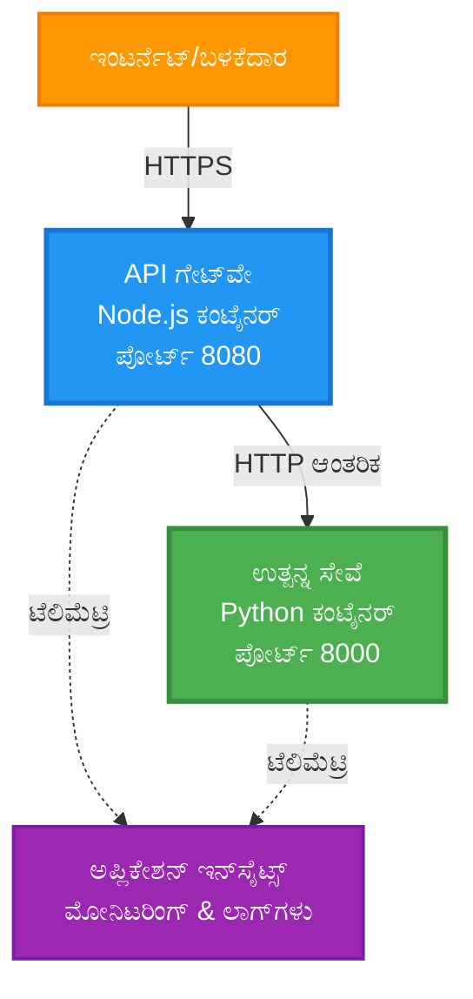
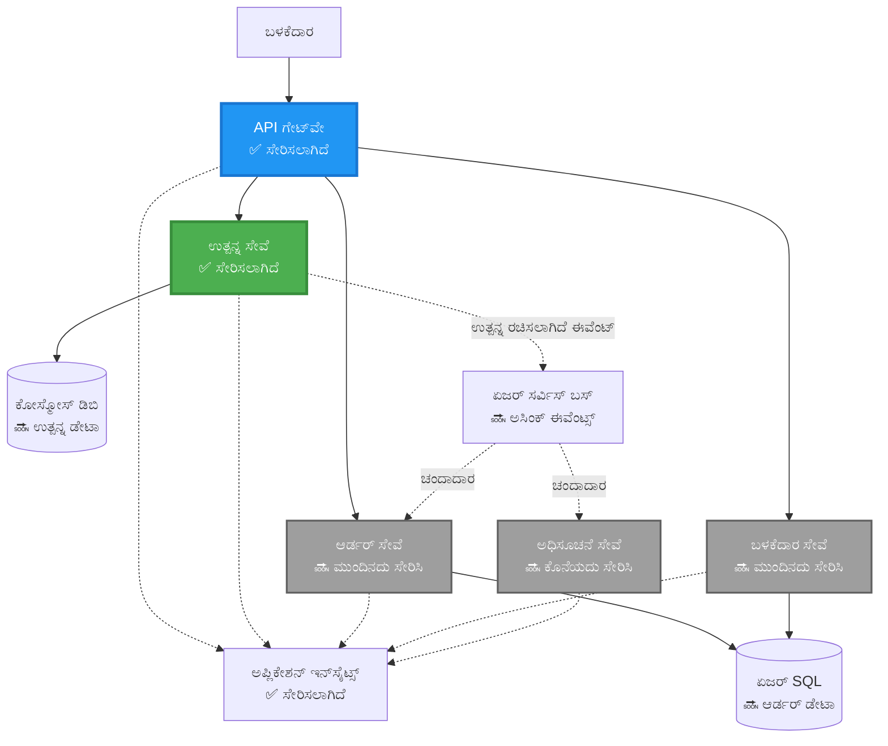
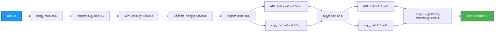
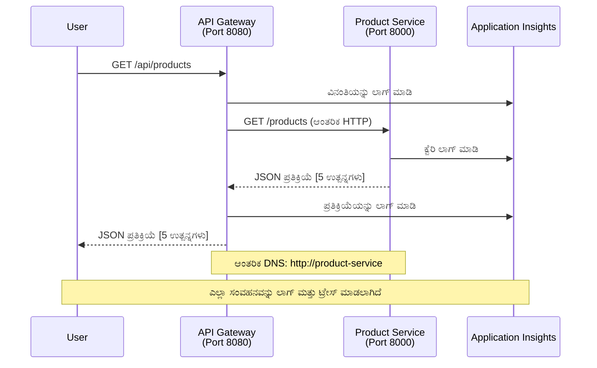

<!--
CO_OP_TRANSLATOR_METADATA:
{
  "original_hash": "eb3a4803a1e80a7f2e64f6bf63738c0f",
  "translation_date": "2025-11-24T22:08:58+00:00",
  "source_file": "examples/microservices/README.md",
  "language_code": "kn"
}
-->
# ಮೈಕ್ರೋಸರ್ವಿಸಸ್ ಆರ್ಕಿಟೆಕ್ಚರ್ - ಕಂಟೈನರ್ ಆಪ್ ಉದಾಹರಣೆ

⏱️ **ಅಂದಾಜು ಸಮಯ**: 25-35 ನಿಮಿಷಗಳು | 💰 **ಅಂದಾಜು ವೆಚ್ಚ**: ~$50-100/ತಿಂಗಳು | ⭐ **ಸಂಕೀರ್ಣತೆ**: ಪ್ರಗತಿಶೀಲ

**📚 ಕಲಿಕೆಯ ಪಥ:**
- ← ಹಿಂದಿನದು: [ಸರಳ Flask API](../../../../examples/container-app/simple-flask-api) - ಏಕಕಂಟೈನರ್ ಮೂಲಭೂತಗಳು
- 🎯 **ನೀವು ಇಲ್ಲಿ ಇದ್ದೀರಿ**: ಮೈಕ್ರೋಸರ್ವಿಸಸ್ ಆರ್ಕಿಟೆಕ್ಚರ್ (2-ಸರ್ವಿಸ್ ಆಧಾರ)
- → ಮುಂದಿನದು: [AI ಇಂಟಿಗ್ರೇಶನ್](../../../../docs/ai-foundry) - ನಿಮ್ಮ ಸೇವೆಗಳಿಗೆ ಬುದ್ಧಿಮತ್ತೆ ಸೇರಿಸಿ
- 🏠 [ಕೋರ್ಸ್ ಹೋಮ್](../../README.md)

---

**ಸರಳ ಆದರೆ ಕಾರ್ಯನಿರ್ವಹಣೆಯಾದ** ಮೈಕ್ರೋಸರ್ವಿಸಸ್ ಆರ್ಕಿಟೆಕ್ಚರ್ ಅನ್ನು AZD CLI ಬಳಸಿ Azure Container Apps ಗೆ ನಿಯೋಜಿಸಲಾಗಿದೆ. ಈ ಉದಾಹರಣೆ ಸೇವೆ-ಮಧ್ಯೆ ಸಂವಹನ, ಕಂಟೈನರ್ ಸಂಯೋಜನೆ, ಮತ್ತು ನಿಗಾವಹಿಸುವಿಕೆಯನ್ನು 2-ಸರ್ವಿಸ್ ವ್ಯವಸ್ಥೆಯೊಂದಿಗೆ ತೋರಿಸುತ್ತದೆ.

> **📚 ಕಲಿಕೆಯ ವಿಧಾನ**: ಈ ಉದಾಹರಣೆ ಕನಿಷ್ಠ 2-ಸರ್ವಿಸ್ ಆರ್ಕಿಟೆಕ್ಚರ್ (API ಗೇಟ್‌ವೇ + ಬ್ಯಾಕ್‌ಎಂಡ್ ಸರ್ವಿಸ್) ನಿಂದ ಪ್ರಾರಂಭವಾಗುತ್ತದೆ, ಇದನ್ನು ನೀವು ನಿಯೋಜಿಸಬಹುದು ಮತ್ತು ಕಲಿಯಬಹುದು. ಈ ಆಧಾರವನ್ನು ಆಳವಾಗಿ ಅರ್ಥಮಾಡಿಕೊಂಡ ನಂತರ, ಪೂರ್ಣ ಮೈಕ್ರೋಸರ್ವಿಸಸ್ ಪರಿಸರಕ್ಕೆ ವಿಸ್ತರಿಸಲು ಮಾರ್ಗದರ್ಶನವನ್ನು ನಾವು ಒದಗಿಸುತ್ತೇವೆ.

## ನೀವು ಏನು ಕಲಿಯುತ್ತೀರಿ

ಈ ಉದಾಹರಣೆಯನ್ನು ಪೂರ್ಣಗೊಳಿಸುವ ಮೂಲಕ, ನೀವು:
- ಹಲವಾರು ಕಂಟೈನರ್‌ಗಳನ್ನು Azure Container Apps ಗೆ ನಿಯೋಜಿಸುತ್ತೀರಿ
- ಆಂತರಿಕ ನೆಟ್‌ವರ್ಕಿಂಗ್ ಮೂಲಕ ಸೇವೆ-ಮಧ್ಯೆ ಸಂವಹನವನ್ನು ಅನುಷ್ಠಾನಗೊಳಿಸುತ್ತೀರಿ
- ಪರಿಸರ ಆಧಾರಿತ ಸ್ಕೇಲಿಂಗ್ ಮತ್ತು ಆರೋಗ್ಯ ತಪಾಸಣೆಗಳನ್ನು ಸಂರಚಿಸುತ್ತೀರಿ
- Application Insights ನೊಂದಿಗೆ ವಿತರಿತ ಅಪ್ಲಿಕೇಶನ್‌ಗಳನ್ನು ನಿಗಾವಹಿಸುತ್ತೀರಿ
- ಮೈಕ್ರೋಸರ್ವಿಸಸ್ ನಿಯೋಜನೆ ಮಾದರಿಗಳು ಮತ್ತು ಉತ್ತಮ ಅಭ್ಯಾಸಗಳನ್ನು ಅರ್ಥಮಾಡಿಕೊಳ್ಳುತ್ತೀರಿ
- ಸರಳದಿಂದ ಸಂಕೀರ್ಣ ಆರ್ಕಿಟೆಕ್ಚರ್‌ಗಳಿಗೆ ಪ್ರಗತಿಶೀಲ ವಿಸ್ತರಣೆಯನ್ನು ಕಲಿಯುತ್ತೀರಿ

## ಆರ್ಕಿಟೆಕ್ಚರ್

### ಹಂತ 1: ನಾವು ಏನು ನಿರ್ಮಿಸುತ್ತಿದ್ದೇವೆ (ಈ ಉದಾಹರಣೆಯಲ್ಲಿ ಸೇರಿಸಲಾಗಿದೆ)


**ಘಟಕ ವಿವರಗಳು:**

| ಘಟಕ | ಉದ್ದೇಶ | ಪ್ರವೇಶ | ಸಂಪತ್ತುಗಳು |
|-----------|---------|--------|-----------|
| **API ಗೇಟ್‌ವೇ** | ಹೊರಗಿನ ವಿನಂತಿಗಳನ್ನು ಬ್ಯಾಕ್‌ಎಂಡ್ ಸೇವೆಗಳಿಗೆ ಮಾರ್ಗೀಕರಿಸುತ್ತದೆ | ಸಾರ್ವಜನಿಕ (HTTPS) | 1 vCPU, 2GB RAM, 2-20 ಪ್ರತಿಗಳು |
| **ಪ್ರೊಡಕ್ಟ್ ಸರ್ವಿಸ್** | ಇನ್-ಮೆಮೊರಿ ಡೇಟಾದೊಂದಿಗೆ ಉತ್ಪನ್ನ ಕ್ಯಾಟಲಾಗ್ ನಿರ್ವಹಿಸುತ್ತದೆ | ಆಂತರಿಕ ಮಾತ್ರ | 0.5 vCPU, 1GB RAM, 1-10 ಪ್ರತಿಗಳು |
| **ಅಪ್ಲಿಕೇಶನ್ ಇನ್ಸೈಟ್ಸ್** | ಕೇಂದ್ರಿತ ಲಾಗಿಂಗ್ ಮತ್ತು ವಿತರಿತ ಟ್ರೇಸಿಂಗ್ | Azure ಪೋರ್ಟಲ್ | 1-2 GB/ತಿಂಗಳು ಡೇಟಾ ಇನ್‌ಜೆಕ್ಷನ್ |

**ಏಕೆ ಸರಳವಾಗಿ ಪ್ರಾರಂಭಿಸಬೇಕು?**
- ✅ ಶೀಘ್ರವಾಗಿ ನಿಯೋಜಿಸಿ ಮತ್ತು ಅರ್ಥಮಾಡಿಕೊಳ್ಳಿ (25-35 ನಿಮಿಷಗಳು)
- ✅ ಸಂಕೀರ್ಣತೆ ಇಲ್ಲದೆ ಮೂಲಭೂತ ಮೈಕ್ರೋಸರ್ವಿಸಸ್ ಮಾದರಿಗಳನ್ನು ಕಲಿಯಿರಿ
- ✅ ಕಾರ್ಯನಿರ್ವಹಣೆಯ ಕೋಡ್ ಅನ್ನು ನೀವು ತಿದ್ದುಪಡಿ ಮಾಡಬಹುದು ಮತ್ತು ಪ್ರಯೋಗಿಸಬಹುದು
- ✅ ಕಲಿಯಲು ಕಡಿಮೆ ವೆಚ್ಚ (~$50-100/ತಿಂಗಳು vs $300-1400/ತಿಂಗಳು)
- ✅ ಡೇಟಾಬೇಸ್‌ಗಳು ಮತ್ತು ಮೆಸೇಜ್ ಕ್ಯೂಗಳನ್ನು ಸೇರಿಸುವ ಮೊದಲು ಆತ್ಮವಿಶ್ವಾಸವನ್ನು ನಿರ್ಮಿಸಿ

**ಉಪಮೆ**: ಇದನ್ನು ಡ್ರೈವಿಂಗ್ ಕಲಿಯುವಂತೆ ಪರಿಗಣಿಸಿ. ನೀವು ಖಾಲಿ ಪಾರ್ಕಿಂಗ್ ಲಾಟ್‌ನಿಂದ ಪ್ರಾರಂಭಿಸುತ್ತೀರಿ (2 ಸೇವೆಗಳು), ಮೂಲಭೂತಗಳನ್ನು ಆಳವಾಗಿ ಕಲಿಯುತ್ತೀರಿ, ನಂತರ ನಗರ ಸಂಚಾರಕ್ಕೆ (5+ ಸೇವೆಗಳು ಡೇಟಾಬೇಸ್‌ಗಳೊಂದಿಗೆ) ಪ್ರಗತಿ ಮಾಡುತ್ತೀರಿ.

### ಹಂತ 2: ಭವಿಷ್ಯದ ವಿಸ್ತರಣೆ (ಉಲ್ಲೇಖ ಆರ್ಕಿಟೆಕ್ಚರ್)

ನೀವು 2-ಸರ್ವಿಸ್ ಆರ್ಕಿಟೆಕ್ಚರ್ ಅನ್ನು ಆಳವಾಗಿ ಕಲಿತ ನಂತರ, ನೀವು ವಿಸ್ತರಿಸಬಹುದು:


"ವಿಸ್ತರಣೆ ಮಾರ್ಗದರ್ಶಿ" ವಿಭಾಗವನ್ನು ಕೊನೆಯಲ್ಲಿ ಹಂತ-ಹಂತದ ಸೂಚನೆಗಳಿಗಾಗಿ ನೋಡಿ.

## ಒಳಗೊಂಡ ವೈಶಿಷ್ಟ್ಯಗಳು

✅ **ಸೇವಾ ಪತ್ತೆ**: ಕಂಟೈನರ್‌ಗಳ ನಡುವೆ ಸ್ವಯಂಚಾಲಿತ DNS ಆಧಾರಿತ ಪತ್ತೆ  
✅ **ಲೋಡ್ ಬ್ಯಾಲೆನ್ಸಿಂಗ್**: ಪ್ರತಿಗಳಾದ್ಯಂತ ಲೋಡ್ ಬ್ಯಾಲೆನ್ಸಿಂಗ್  
✅ **ಆಟೋ-ಸ್ಕೇಲಿಂಗ್**: HTTP ವಿನಂತಿಗಳ ಆಧಾರದ ಮೇಲೆ ಪ್ರತಿ ಸೇವೆಗೆ ಸ್ವತಂತ್ರ ಸ್ಕೇಲಿಂಗ್  
✅ **ಆರೋಗ್ಯ ನಿಗಾವಹಿಸುವಿಕೆ**: ಎರಡೂ ಸೇವೆಗಳಿಗೆ ಲೈವ್ನೆಸ್ ಮತ್ತು ರೆಡಿನೆಸ್ ಪ್ರೋಬ್‌ಗಳು  
✅ **ವಿತರಿತ ಲಾಗಿಂಗ್**: Application Insights ನೊಂದಿಗೆ ಕೇಂದ್ರಿತ ಲಾಗಿಂಗ್  
✅ **ಆಂತರಿಕ ನೆಟ್‌ವರ್ಕಿಂಗ್**: ಸುರಕ್ಷಿತ ಸೇವೆ-ಮಧ್ಯೆ ಸಂವಹನ  
✅ **ಕಂಟೈನರ್ ಸಂಯೋಜನೆ**: ಸ್ವಯಂಚಾಲಿತ ನಿಯೋಜನೆ ಮತ್ತು ಸ್ಕೇಲಿಂಗ್  
✅ **ಜೀರೋ-ಡೌನ್‌ಟೈಮ್ ಅಪ್ಡೇಟ್ಸ್**: ರಿವಿಷನ್ ನಿರ್ವಹಣೆಯೊಂದಿಗೆ ರೋಲಿಂಗ್ ಅಪ್ಡೇಟ್ಸ್  

## ಪೂರ್ವಾಪೇಕ್ಷಿತಗಳು

### ಅಗತ್ಯವಿರುವ ಸಾಧನಗಳು

ಪ್ರಾರಂಭಿಸುವ ಮೊದಲು, ಈ ಸಾಧನಗಳನ್ನು ನೀವು ಸ್ಥಾಪಿಸಿರುವುದನ್ನು ದೃಢೀಕರಿಸಿ:

1. **[Azure Developer CLI (azd)](https://learn.microsoft.com/azure/developer/azure-developer-cli/install-azd)** (ಆವೃತ್ತಿ 1.0.0 ಅಥವಾ ಹೆಚ್ಚಿನದು)
   ```bash
   azd version
   # ನಿರೀಕ್ಷಿತ ಔಟ್‌ಪುಟ್: azd ಆವೃತ್ತಿ 1.0.0 ಅಥವಾ ಹೆಚ್ಚು
   ```

2. **[Azure CLI](https://learn.microsoft.com/cli/azure/install-azure-cli)** (ಆವೃತ್ತಿ 2.50.0 ಅಥವಾ ಹೆಚ್ಚಿನದು)
   ```bash
   az --version
   # ನಿರೀಕ್ಷಿತ ಔಟ್‌ಪುಟ್: azure-cli 2.50.0 ಅಥವಾ ಹೆಚ್ಚು
   ```

3. **[Docker](https://www.docker.com/get-started)** (ಸ್ಥಳೀಯ ಅಭಿವೃದ್ಧಿ/ಪರೀಕ್ಷೆಗಾಗಿ - ಐಚ್ಛಿಕ)
   ```bash
   docker --version
   # ನಿರೀಕ್ಷಿತ ಔಟ್‌ಪುಟ್: ಡಾಕರ್ ಆವೃತ್ತಿ 20.10 ಅಥವಾ ಹೆಚ್ಚು
   ```

### ನಿಮ್ಮ ಸೆಟಪ್ ಪರಿಶೀಲಿಸಿ

ನೀವು ಸಿದ್ಧರಾಗಿರುವುದನ್ನು ದೃಢೀಕರಿಸಲು ಈ ಕಮಾಂಡ್‌ಗಳನ್ನು ಚಲಾಯಿಸಿ:

```bash
# ಆಜೂರ್ ಡೆವಲಪರ್ CLI ಪರಿಶೀಲಿಸಿ
azd version
# ✅ ನಿರೀಕ್ಷಿತ: azd ಆವೃತ್ತಿ 1.0.0 ಅಥವಾ ಹೆಚ್ಚು

# ಆಜೂರ್ CLI ಪರಿಶೀಲಿಸಿ
az --version
# ✅ ನಿರೀಕ್ಷಿತ: azure-cli 2.50.0 ಅಥವಾ ಹೆಚ್ಚು

# ಡಾಕರ್ ಪರಿಶೀಲಿಸಿ (ಐಚ್ಛಿಕ)
docker --version
# ✅ ನಿರೀಕ್ಷಿತ: ಡಾಕರ್ ಆವೃತ್ತಿ 20.10 ಅಥವಾ ಹೆಚ್ಚು
```

**ಯಶಸ್ಸಿನ ಮಾನದಂಡ**: ಎಲ್ಲಾ ಕಮಾಂಡ್‌ಗಳು ಕನಿಷ್ಠ ಅಥವಾ ಹೆಚ್ಚಿನ ಆವೃತ್ತಿ ಸಂಖ್ಯೆಯನ್ನು ಹಿಂತಿರುಗಿಸುತ್ತವೆ.

### Azure ಅಗತ್ಯತೆಗಳು

- ಸಕ್ರಿಯ **Azure ಚಂದಾದಾರಿಕೆ** ([ಉಚಿತ ಖಾತೆಯನ್ನು ರಚಿಸಿ](https://azure.microsoft.com/free/))
- ನಿಮ್ಮ ಚಂದಾದಾರಿಕೆಯಲ್ಲಿ ಸಂಪತ್ತುಗಳನ್ನು ರಚಿಸಲು ಅನುಮತಿಗಳು
- ಚಂದಾದಾರಿಕೆ ಅಥವಾ ಸಂಪತ್ತು ಗುಂಪಿನಲ್ಲಿ **ಕಾಂಟ್ರಿಬ್ಯೂಟರ್** ಪಾತ್ರ

### ಜ್ಞಾನ ಪೂರ್ವಾಪೇಕ್ಷಿತಗಳು

ಇದು **ಪ್ರಗತಿಶೀಲ ಮಟ್ಟದ** ಉದಾಹರಣೆ. ನೀವು ಈ ವಿಷಯಗಳನ್ನು ತಿಳಿದಿರಬೇಕು:
- [ಸರಳ Flask API ಉದಾಹರಣೆ](../../../../examples/container-app/simple-flask-api) ಅನ್ನು ಪೂರ್ಣಗೊಳಿಸಲಾಗಿದೆ
- ಮೈಕ್ರೋಸರ್ವಿಸಸ್ ಆರ್ಕಿಟೆಕ್ಚರ್‌ನ ಮೂಲಭೂತ ಅರ್ಥ
- REST APIಗಳು ಮತ್ತು HTTP ಬಗ್ಗೆ ಪರಿಚಯ
- ಕಂಟೈನರ್ ಪರಿಕಲ್ಪನೆಗಳ ಅರ್ಥ

**ಕಂಟೈನರ್ ಆಪ್‌ಗಳಿಗೆ ಹೊಸದು?** ಮೊದಲಿಗೆ [ಸರಳ Flask API ಉದಾಹರಣೆ](../../../../examples/container-app/simple-flask-api) ಯಿಂದ ಪ್ರಾರಂಭಿಸಿ ಮೂಲಭೂತಗಳನ್ನು ಕಲಿಯಿರಿ.

## ತ್ವರಿತ ಪ್ರಾರಂಭ (ಹಂತ-ಹಂತದ)

### ಹಂತ 1: ಕ್ಲೋನ್ ಮಾಡಿ ಮತ್ತು ನಾವಿಗೇಟ್ ಮಾಡಿ

```bash
git clone https://github.com/microsoft/AZD-for-beginners.git
cd AZD-for-beginners/examples/microservices
```

**✓ ಯಶಸ್ಸು ಪರಿಶೀಲನೆ**: ನೀವು `azure.yaml` ಅನ್ನು ನೋಡುತ್ತೀರಿ:
```bash
ls
# ನಿರೀಕ್ಷಿಸಲಾಗಿದೆ: README.md, azure.yaml, infra/, src/
```

### ಹಂತ 2: Azure ನೊಂದಿಗೆ ಪ್ರಾಮಾಣೀಕರಿಸಿ

```bash
azd auth login
```

ಇದು ನಿಮ್ಮ ಬ್ರೌಸರ್ ಅನ್ನು Azure ಪ್ರಾಮಾಣೀಕರಣಕ್ಕಾಗಿ ತೆರೆಯುತ್ತದೆ. ನಿಮ್ಮ Azure ಕ್ರೆಡೆನ್ಷಿಯಲ್‌ಗಳೊಂದಿಗೆ ಸೈನ್ ಇನ್ ಮಾಡಿ.

**✓ ಯಶಸ್ಸು ಪರಿಶೀಲನೆ**: ನೀವು ನೋಡುತ್ತೀರಿ:
```
Logged in to Azure.
```

### ಹಂತ 3: ಪರಿಸರವನ್ನು ಪ್ರಾರಂಭಿಸಿ

```bash
azd init
```

**ನೀವು ನೋಡುವ ಪ್ರಾಂಪ್ಟ್‌ಗಳು**:
- **ಪರಿಸರ ಹೆಸರು**: ಒಂದು ಚಿಕ್ಕ ಹೆಸರು ನಮೂದಿಸಿ (ಉದಾ., `microservices-dev`)
- **Azure ಚಂದಾದಾರಿಕೆ**: ನಿಮ್ಮ ಚಂದಾದಾರಿಕೆಯನ್ನು ಆಯ್ಕೆಮಾಡಿ
- **Azure ಸ್ಥಳ**: ಒಂದು ಪ್ರದೇಶವನ್ನು ಆಯ್ಕೆಮಾಡಿ (ಉದಾ., `eastus`, `westeurope`)

**✓ ಯಶಸ್ಸು ಪರಿಶೀಲನೆ**: ನೀವು ನೋಡುತ್ತೀರಿ:
```
SUCCESS: New project initialized!
```

### ಹಂತ 4: ಮೂಲಸೌಕರ್ಯ ಮತ್ತು ಸೇವೆಗಳನ್ನು ನಿಯೋಜಿಸಿ

```bash
azd up
```

**ಏನಾಗುತ್ತದೆ** (8-12 ನಿಮಿಷಗಳು ತೆಗೆದುಕೊಳ್ಳುತ್ತದೆ):


**✓ ಯಶಸ್ಸು ಪರಿಶೀಲನೆ**: ನೀವು ನೋಡುತ್ತೀರಿ:
```
SUCCESS: Your application was deployed to Azure in X minutes Y seconds.
Endpoint: https://api-gateway-<unique-id>.azurecontainerapps.io
```

**⏱️ ಸಮಯ**: 8-12 ನಿಮಿಷಗಳು

### ಹಂತ 5: ನಿಯೋಜನೆ ಪರೀಕ್ಷಿಸಿ

```bash
# ಗೇಟ್‌ವೇ ಎಂಡ್‌ಪಾಯಿಂಟ್ ಪಡೆಯಿರಿ
GATEWAY_URL=$(azd env get-values | grep API_GATEWAY_URL | cut -d '=' -f2 | tr -d '"')

# API ಗೇಟ್‌ವೇ ಆರೋಗ್ಯವನ್ನು ಪರೀಕ್ಷಿಸಿ
curl $GATEWAY_URL/health
```

**✅ ನಿರೀಕ್ಷಿತ ಔಟ್‌ಪುಟ್**:
```json
{
  "status": "healthy",
  "service": "api-gateway",
  "timestamp": "2025-11-19T10:30:00Z"
}
```

**ಗೇಟ್‌ವೇ ಮೂಲಕ ಉತ್ಪನ್ನ ಸೇವೆಯನ್ನು ಪರೀಕ್ಷಿಸಿ**:
```bash
# ಉತ್ಪನ್ನಗಳನ್ನು ಪಟ್ಟಿ ಮಾಡಿ
curl $GATEWAY_URL/api/products
```

**✅ ನಿರೀಕ್ಷಿತ ಔಟ್‌ಪುಟ್**:
```json
[
  {"id":1,"name":"Laptop","price":999.99,"stock":50},
  {"id":2,"name":"Mouse","price":29.99,"stock":200},
  {"id":3,"name":"Keyboard","price":79.99,"stock":150}
]
```

**✓ ಯಶಸ್ಸು ಪರಿಶೀಲನೆ**: ಎರಡೂ ಎಂಡ್‌ಪಾಯಿಂಟ್‌ಗಳು ದೋಷವಿಲ್ಲದೆ JSON ಡೇಟಾವನ್ನು ಹಿಂತಿರುಗಿಸುತ್ತವೆ.

---

**🎉 ಅಭಿನಂದನೆಗಳು!** ನೀವು ಮೈಕ್ರೋಸರ್ವಿಸಸ್ ಆರ್ಕಿಟೆಕ್ಚರ್ ಅನ್ನು Azure ಗೆ ನಿಯೋಜಿಸಿದ್ದೀರಿ!

## ಪ್ರಾಜೆಕ್ಟ್ ರಚನೆ

ಎಲ್ಲಾ ಅನುಷ್ಠಾನ ಫೈಲ್‌ಗಳನ್ನು ಒಳಗೊಂಡಿದೆ—ಇದು ಸಂಪೂರ್ಣ, ಕಾರ್ಯನಿರ್ವಹಣೆಯ ಉದಾಹರಣೆ:

```
microservices/
│
├── README.md                         # This file
├── azure.yaml                        # AZD configuration
├── .gitignore                        # Git ignore patterns
│
├── infra/                           # Infrastructure as Code (Bicep)
│   ├── main.bicep                   # Main orchestration
│   ├── abbreviations.json           # Naming conventions
│   ├── core/                        # Shared infrastructure
│   │   ├── container-apps-environment.bicep  # Container environment + registry
│   │   └── monitor.bicep            # Application Insights + Log Analytics
│   └── app/                         # Service definitions
│       ├── api-gateway.bicep        # API Gateway container app
│       └── product-service.bicep    # Product Service container app
│
└── src/                             # Application source code
    ├── api-gateway/                 # Node.js API Gateway
    │   ├── app.js                   # Express server with routing
    │   ├── package.json             # Node dependencies
    │   └── Dockerfile               # Container definition
    └── product-service/             # Python Product Service
        ├── main.py                  # Flask API with product data
        ├── requirements.txt         # Python dependencies
        └── Dockerfile               # Container definition
```

**ಪ್ರತಿ ಘಟಕ ಏನು ಮಾಡುತ್ತದೆ:**

**ಮೂಲಸೌಕರ್ಯ (infra/)**:
- `main.bicep`: ಎಲ್ಲಾ Azure ಸಂಪತ್ತುಗಳು ಮತ್ತು ಅವುಗಳ ಅವಲಂಬನೆಗಳನ್ನು ಸಂಯೋಜಿಸುತ್ತದೆ
- `core/container-apps-environment.bicep`: ಕಂಟೈನರ್ ಆಪ್ ಪರಿಸರ ಮತ್ತು Azure Container Registry ಅನ್ನು ರಚಿಸುತ್ತದೆ
- `core/monitor.bicep`: ವಿತರಿತ ಲಾಗಿಂಗ್‌ಗಾಗಿ Application Insights ಅನ್ನು ಸ್ಥಾಪಿಸುತ್ತದೆ
- `app/*.bicep`: ಸ್ಕೇಲಿಂಗ್ ಮತ್ತು ಆರೋಗ್ಯ ತಪಾಸಣೆಗಳೊಂದಿಗೆ ವೈಯಕ್ತಿಕ ಕಂಟೈನರ್ ಆಪ್ ವ್ಯಾಖ್ಯಾನಗಳು

**API ಗೇಟ್‌ವೇ (src/api-gateway/)**:
- ಬ್ಯಾಕ್‌ಎಂಡ್ ಸೇವೆಗಳಿಗೆ ವಿನಂತಿಗಳನ್ನು ಮಾರ್ಗೀಕರಿಸುವ ಸಾರ್ವಜನಿಕ-ಮುಖದ ಸೇವೆ
- ಲಾಗಿಂಗ್, ದೋಷ ನಿರ್ವಹಣೆ, ಮತ್ತು ವಿನಂತಿ ಫಾರ್ವರ್ಡಿಂಗ್ ಅನ್ನು ಅನುಷ್ಠಾನಗೊಳಿಸುತ್ತದೆ
- ಸೇವೆ-ಮಧ್ಯೆ HTTP ಸಂವಹನವನ್ನು ತೋರಿಸುತ್ತದೆ

**ಪ್ರೊಡಕ್ಟ್ ಸರ್ವಿಸ್ (src/product-service/)**:
- ಉತ್ಪನ್ನ ಕ್ಯಾಟಲಾಗ್ (ಸರಳತೆಗಾಗಿ ಇನ್-ಮೆಮೊರಿ) ಹೊಂದಿರುವ ಆಂತರಿಕ ಸೇವೆ
- REST API ಆರೋಗ್ಯ ತಪಾಸಣೆಗಳೊಂದಿಗೆ
- ಬ್ಯಾಕ್‌ಎಂಡ್ ಮೈಕ್ರೋಸರ್ವಿಸ್ ಮಾದರಿಯ ಉದಾಹರಣೆ

## ಸೇವೆಗಳ ಅವಲೋಕನ

### API ಗೇಟ್‌ವೇ (Node.js/Express)

**ಪೋರ್ಟ್**: 8080  
**ಪ್ರವೇಶ**: ಸಾರ್ವಜನಿಕ (ಬಾಹ್ಯ ಇನ್‌ಗ್ರೆಸ್)  
**ಉದ್ದೇಶ**: ಬಾಹ್ಯ ವಿನಂತಿಗಳನ್ನು ಸೂಕ್ತ ಬ್ಯಾಕ್‌ಎಂಡ್ ಸೇವೆಗಳಿಗೆ ಮಾರ್ಗೀಕರಿಸುತ್ತದೆ  

**ಎಂಡ್‌ಪಾಯಿಂಟ್‌ಗಳು**:
- `GET /` - ಸೇವಾ ಮಾಹಿತಿ
- `GET /health` - ಆರೋಗ್ಯ ತಪಾಸಣೆ ಎಂಡ್‌ಪಾಯಿಂಟ್
- `GET /api/products` - ಉತ್ಪನ್ನ ಸೇವೆಗೆ ಫಾರ್ವರ್ಡ್ (ಎಲ್ಲಾ ಪಟ್ಟಿ)
- `GET /api/products/:id` - ಉತ್ಪನ್ನ ಸೇವೆಗೆ ಫಾರ್ವರ್ಡ್ (ID ಮೂಲಕ ಪಡೆಯಿರಿ)

**ಮುಖ್ಯ ವೈಶಿಷ್ಟ್ಯಗಳು**:
- axios ನೊಂದಿಗೆ ವಿನಂತಿ ಮಾರ್ಗೀಕರಣ
- ಕೇಂದ್ರಿತ ಲಾಗಿಂಗ್
- ದೋಷ ನಿರ್ವಹಣೆ ಮತ್ತು ಟೈಮ್‌ಔಟ್ ನಿರ್ವಹಣೆ
- ಪರಿಸರ ವ್ಯತ್ಯಯಗಳ ಮೂಲಕ ಸೇವಾ ಪತ್ತೆ
- Application Insights ಇಂಟಿಗ್ರೇಶನ್

**ಕೋಡ್ ಹೈಲೈಟ್** (`src/api-gateway/app.js`):
```javascript
// ಆಂತರಿಕ ಸೇವಾ ಸಂವಹನ
app.get('/api/products', async (req, res) => {
  const response = await axios.get(`${PRODUCT_SERVICE_URL}/products`, {
    timeout: 5000
  });
  res.json(response.data);
});
```

### ಪ್ರೊಡಕ್ಟ್ ಸರ್ವಿಸ್ (Python/Flask)

**ಪೋರ್ಟ್**: 8000  
**ಪ್ರವೇಶ**: ಆಂತರಿಕ ಮಾತ್ರ (ಬಾಹ್ಯ ಇನ್‌ಗ್ರೆಸ್ ಇಲ್ಲ)  
**ಉದ್ದೇಶ**: ಇನ್-ಮೆಮೊರಿ ಡೇಟಾದೊಂದಿಗೆ ಉತ್ಪನ್ನ ಕ್ಯಾಟಲಾಗ್ ನಿರ್ವಹಿಸುತ್ತದೆ  

**ಎಂಡ್‌ಪಾಯಿಂಟ್‌ಗಳು**:
- `GET /` - ಸೇವಾ ಮಾಹಿತಿ
- `GET /health` - ಆರೋಗ್ಯ ತಪಾಸಣೆ ಎಂಡ್‌ಪಾಯಿಂಟ್
- `GET /products` - ಎಲ್ಲಾ ಉತ್ಪನ್ನಗಳನ್ನು ಪಟ್ಟಿ ಮಾಡಿ
- `GET /products/<id>` - ID ಮೂಲಕ ಉತ್ಪನ್ನ ಪಡೆಯಿರಿ

**ಮುಖ್ಯ ವೈಶಿಷ್ಟ್ಯಗಳು**:
- Flask ನೊಂದಿಗೆ RESTful API
- ಇನ್-ಮೆಮೊರಿ ಉತ್ಪನ್ನ ಸ್ಟೋರ್ (ಸರಳ, ಡೇಟಾಬೇಸ್ ಅಗತ್ಯವಿಲ್ಲ)
- ಪ್ರೋಬ್‌ಗಳೊಂದಿಗೆ ಆರೋಗ್ಯ ನಿಗಾವಹಿಸುವಿಕೆ
- ರಚನಾತ್ಮಕ ಲಾಗಿಂಗ್
- Application Insights ಇಂಟಿಗ್ರೇಶನ್

**ಡೇಟಾ ಮಾದರಿ**:
```python
{
  "id": 1,
  "name": "Laptop",
  "description": "High-performance laptop",
  "price": 999.99,
  "stock": 50
}
```

**ಏಕೆ ಆಂತರಿಕ ಮಾತ್ರ?**
ಉತ್ಪನ್ನ ಸೇವೆಯನ್ನು ಸಾರ್ವಜನಿಕವಾಗಿ ಬಹಿರಂಗಪಡಿಸಲಾಗಿಲ್ಲ. ಎಲ್ಲಾ ವಿನಂತಿಗಳು API ಗೇಟ್‌ವೇ ಮೂಲಕ ಹೋಗಬೇಕು, ಇದು:
- ಭದ್ರತೆ: ನಿಯಂತ್ರಿತ ಪ್ರವೇಶ ಬಿಂದು
- ಲಚೀಲತೆ: ಕ್ಲೈಂಟ್‌ಗಳನ್ನು ಪ್ರಭಾವಿತಗೊಳಿಸದೆ ಬ್ಯಾಕ್‌ಎಂಡ್ ಅನ್ನು ಬದಲಾಯಿಸಬಹುದು
- ನಿಗಾವಹಿಸುವಿಕೆ: ಕೇಂದ್ರಿತ ವಿನಂತಿ ಲಾಗಿಂಗ್

## ಸೇವಾ ಸಂವಹನವನ್ನು ಅರ್ಥಮಾಡಿಕೊಳ್ಳುವುದು

### ಸೇವೆಗಳು ಪರಸ್ಪರ ಹೇಗೆ ಮಾತನಾಡುತ್ತವೆ


ಈ ಉದಾಹರಣೆಯಲ್ಲಿ, API ಗೇಟ್‌ವೇ **ಆಂತರಿಕ HTTP ಕರೆಗಳನ್ನು** ಬಳಸಿಕೊಂಡು ಪ್ರೊಡಕ್ಟ್ ಸರ್ವಿಸ್‌ನೊಂದಿಗೆ ಸಂವಹನ ಮಾಡುತ್ತದೆ:

```javascript
// API ಗೇಟ್‌ವೇ (src/api-gateway/app.js)
const PRODUCT_SERVICE_URL = process.env.PRODUCT_SERVICE_URL;

// ಆಂತರಿಕ HTTP ವಿನಂತಿಯನ್ನು ಮಾಡಿ
const response = await axios.get(`${PRODUCT_SERVICE_URL}/products`);
```

**ಮುಖ್ಯ ಅಂಶಗಳು**:

1. **DNS ಆಧಾರಿತ ಪತ್ತೆ**: ಕಂಟೈನರ್ ಆಪ್‌ಗಳು ಸ್ವಯಂಚಾಲಿತವಾಗಿ ಆಂತರಿಕ ಸೇವೆಗಳಿಗೆ DNS ಒದಗಿಸುತ್ತವೆ
   - ಪ್ರೊಡಕ್ಟ್ ಸರ್ವಿಸ್ FQDN: `product-service.internal.<environment>.azurecontainerapps.io`
   - ಸರಳೀಕೃತ: `http://product-service` (ಕಂಟೈನರ್ ಆಪ್‌ಗಳು ಇದನ್ನು ಪರಿಹರಿಸುತ್ತವೆ)

2. **ಸಾರ್ವಜನಿಕ ಬಹಿರಂಗಪಡಿಸುವಿಕೆ ಇಲ್ಲ**: ಪ್ರೊಡಕ್ಟ್ ಸರ್ವಿಸ್‌ಗೆ Bicep ನಲ್ಲಿ `external: false` ಇದೆ
   - ಕಂಟೈನರ್ ಆಪ್ ಪರಿಸರದೊಳಗೆ ಮಾತ್ರ ಪ್ರವೇಶಿಸಬಹುದು
   - ಇಂಟರ್ನೆಟ್‌ನಿಂದ ತಲುಪಲು ಸಾಧ್ಯವಿಲ್ಲ

3. **ಪರಿಸರ ವ್ಯತ್ಯಯಗಳು**: ಸೇವಾ URL‌ಗಳನ್ನು ನಿಯೋಜನೆ ಸಮಯದಲ್ಲಿ ಇಂಜೆಕ್ಟ್ ಮಾಡಲಾಗುತ್ತದೆ
   - Bicep ಆಂತರಿಕ FQDN ಅನ್ನು ಗೇಟ್‌ವೇಗೆ ಪಾಸ್ ಮಾಡುತ್ತದೆ
   - ಅಪ್ಲಿಕೇಶನ್ ಕೋಡ್‌ನಲ್ಲಿ ಹಾರ್ಡ್‌ಕೋಡ್ ಮಾಡಿದ URL‌ಗಳಿಲ್ಲ

**ಉಪಮೆ**: ಇದನ್ನು ಕಚೇರಿ ಕೊಠಡಿಗಳಂತೆ ಪರಿಗಣಿಸಿ. API ಗೇಟ್‌ವೇ ಸ್ವೀಕೃತಿ ಡೆಸ್ಕ್ (ಸಾರ್ವಜನಿಕ-ಮುಖದ), ಮತ್ತು ಪ್ರೊಡಕ್ಟ್ ಸರ್ವಿಸ್ ಕಚೇರಿ ಕೊಠಡಿ (ಆಂತರಿಕ ಮಾತ್ರ). ಯಾವುದೇ ಕಚೇರಿಯನ್ನು ತಲುಪಲು ಭೇಟಿ ದಾರರು ಸ್ವೀಕೃತಿ ಮೂಲಕ ಹೋಗಬೇಕು.

## ನಿಯೋಜನೆ ಆಯ್ಕೆಗಳು

### ಸಂಪೂರ್ಣ ನಿಯೋಜನೆ (ಶಿಫಾರಸು)

```bash
# ಮೂಲಸೌಕರ್ಯ ಮತ್ತು ಎರಡೂ ಸೇವೆಗಳನ್ನು ನಿಯೋಜಿಸಿ
azd up
```

ಇದು ನಿಯೋಜಿಸುತ್ತದೆ:
1. ಕಂಟೈನರ್ ಆಪ್ ಪರಿಸರ
2. Application Insights
3. ಕಂಟೈನರ್ ರಿಜಿಸ್ಟ್ರಿ
4. API ಗೇಟ್‌ವೇ ಕಂಟೈನರ್
5. ಪ್ರೊಡಕ್ಟ್ ಸರ್ವಿಸ್ ಕಂಟೈನರ್

**ಸಮಯ**: 8-12 ನಿಮಿಷಗಳು

### ವೈಯಕ್ತಿಕ ಸೇವೆಯನ್ನು ನಿಯೋಜಿಸಿ

```bash
# ಪ್ರಾರಂಭಿಕ azd up ನಂತರ ಒಂದೇ ಸೇವೆಯನ್ನು ನಿಯೋಜಿಸಿ
azd deploy api-gateway

# ಅಥವಾ ಉತ್ಪನ್ನ ಸೇವೆಯನ್ನು ನಿಯೋಜಿಸಿ
azd deploy product-service
```

**ಬಳಕೆ ಪ್ರಕರಣ**: ನೀವು ಒಂದು ಸೇವೆಯಲ್ಲಿ ಕೋಡ್ ಅನ್ನು ನವೀಕರಿಸಿದ್ದೀರಿ ಮತ್ತು ಆ ಸೇವೆಯನ್ನು ಮಾತ್ರ ಪುನಃ ನಿಯೋಜಿಸಲು ಬಯಸುತ್ತೀರಿ.

### ಸಂರಚನೆ ನವೀಕರಿಸಿ

```bash
# ಮಾಪನ ಪರಾಮಿತಿಗಳನ್ನು ಬದಲಾಯಿಸಿ
azd env set GATEWAY_MAX_REPLICAS 30

# ಹೊಸ ಸಂರಚನೆಯೊಂದಿಗೆ ಪುನಃ ನಿಯೋಜಿಸಿ
azd up
```

## ಸಂರಚನೆ

### ಸ್ಕೇಲಿಂಗ್ ಸಂರಚನೆ

ಎರಡೂ ಸೇವೆಗಳು ತಮ್ಮ Bicep ಫೈಲ್‌ಗಳಲ್ಲಿ HTTP ಆಧಾರಿತ ಆಟೋ-ಸ್ಕೇಲಿಂಗ್‌ನೊಂದಿಗೆ ಸಂರಚಿಸಲ್ಪಟ್ಟಿವೆ:

**API ಗೇಟ್‌ವೇ**:
- ಕನಿಷ್ಠ ಪ್ರತಿಗಳು: 2 (ಲಭ್ಯತೆಯಿಗಾಗಿ ಯಾವಾಗಲೂ ಕನಿಷ್ಠ 2)
- ಗರಿಷ್ಠ ಪ್ರತಿಗಳು: 20
- ಸ್ಕೇಲ್ ಟ್ರಿಗರ್: ಪ್ರತಿಯೊಂದು ಪ್ರತಿಗೆ 50 ಸಮಕಾಲೀನ ವಿನಂತಿಗಳು

**ಪ್ರೊ
3. ಎರಡೂ ಸೇವೆಗಳನ್ನು ಪುನಃ ನಿಯೋಜಿಸಿ:

```bash
azd deploy product-service
azd deploy api-gateway
```

4. ಹೊಸ ಎಂಡ್‌ಪಾಯಿಂಟ್ ಅನ್ನು ಪರೀಕ್ಷಿಸಿ:

```bash
GATEWAY_URL=$(azd env get-values | grep API_GATEWAY_URL | cut -d '=' -f2 | tr -d '"')

# ಹೊಸ ಉತ್ಪನ್ನವನ್ನು ರಚಿಸಿ
curl -X POST $GATEWAY_URL/api/products \
  -H "Content-Type: application/json" \
  -d '{"name":"USB Cable","price":9.99,"stock":500}'
```

**✅ ನಿರೀಕ್ಷಿತ ಔಟ್‌ಪುಟ್:**
```json
{"id":6,"name":"USB Cable","description":"","price":9.99,"stock":500}
```

5. ಇದು ಪಟ್ಟಿ‌ನಲ್ಲಿ ಕಾಣಿಸುತ್ತಿದೆಯೇ ಎಂದು ಪರಿಶೀಲಿಸಿ:

```bash
curl $GATEWAY_URL/api/products
# ಈಗ 6 ಉತ್ಪನ್ನಗಳನ್ನು ತೋರಿಸಬೇಕು, ಹೊಸ USB ಕೇಬಲ್ ಸೇರಿಸಿ
```

**ಯಶಸ್ಸಿನ ಮಾನದಂಡಗಳು**:
- ✅ POST ವಿನಂತಿ HTTP 201 ಅನ್ನು ಹಿಂತಿರುಗಿಸುತ್ತದೆ
- ✅ ಹೊಸ ಉತ್ಪನ್ನವು GET /api/products ಪಟ್ಟಿ‌ನಲ್ಲಿ ಕಾಣಿಸುತ್ತದೆ
- ✅ ಉತ್ಪನ್ನಕ್ಕೆ ಸ್ವಯಂ-ವೃದ್ಧಿಸಿದ ID ಇದೆ

**ಸಮಯ**: 10-15 ನಿಮಿಷಗಳು

---

### ವ್ಯಾಯಾಮ 2: ಸ್ವಯಂ-ಸ್ಕೇಲಿಂಗ್ ನಿಯಮಗಳನ್ನು ತಿದ್ದುಪಡಿ ಮಾಡಿ ⭐⭐ (ಮಧ್ಯಮ)

**ಗುರಿ**: ಉತ್ಪನ್ನ ಸೇವೆಯನ್ನು ಹೆಚ್ಚು ಆಕ್ರಮಣಕಾರಿಯಾಗಿ ಸ್ಕೇಲ್ ಮಾಡಲು ಬದಲಾಯಿಸಿ

**ಆರಂಭಿಕ ಬಿಂದು**: `infra/app/product-service.bicep`

**ಹಂತಗಳು**:

1. `infra/app/product-service.bicep` ಅನ್ನು ತೆರೆಯಿರಿ ಮತ್ತು `scale` ಬ್ಲಾಕ್ ಅನ್ನು ಹುಡುಕಿ (ಸುಮಾರು 95ನೇ ಸಾಲಿನಲ್ಲಿ)

2. ಈ ಕೆಳಗಿನದರಿಂದ ಬದಲಾಯಿಸಿ:
```bicep
scale: {
  minReplicas: 1
  maxReplicas: 10
  rules: [
    {
      name: 'http-scale-rule'
      http: {
        metadata: {
          concurrentRequests: '100'  // OLD
        }
      }
    }
  ]
}
```

ಈಗೆ:
```bicep
scale: {
  minReplicas: 2  // Always have 2 running
  maxReplicas: 20  // Allow more scaling
  rules: [
    {
      name: 'http-scale-rule'
      http: {
        metadata: {
          concurrentRequests: '20'  // Scale at lower threshold
        }
      }
    }
  ]
}
```

3. ಮೂಲಸೌಕರ್ಯವನ್ನು ಪುನಃ ನಿಯೋಜಿಸಿ:

```bash
azd up
```

4. ಹೊಸ ಸ್ಕೇಲಿಂಗ್ ಸಂರಚನೆಯನ್ನು ಪರಿಶೀಲಿಸಿ:

```bash
az containerapp show \
  --name $(azd env get-values | grep PRODUCT_SERVICE | head -1 | cut -d '/' -f5) \
  --resource-group $(azd env get-values | grep AZURE_RESOURCE_GROUP | cut -d '=' -f2 | tr -d '"') \
  --query "properties.template.scale" -o json
```

**✅ ನಿರೀಕ್ಷಿತ ಔಟ್‌ಪುಟ್:**
```json
{
  "minReplicas": 2,
  "maxReplicas": 20,
  "rules": [...]
}
```

5. ಲೋಡ್‌ನೊಂದಿಗೆ ಸ್ವಯಂ-ಸ್ಕೇಲಿಂಗ್ ಅನ್ನು ಪರೀಕ್ಷಿಸಿ:

```bash
# ಸಮಕಾಲಿಕ ವಿನಂತಿಗಳನ್ನು ರಚಿಸಿ
for i in {1..500}; do curl $GATEWAY_URL/api/products & done

# ಮಾಪನ ಸಂಭವವನ್ನು ವೀಕ್ಷಿಸಿ
azd logs product-service --follow
# ಹುಡುಕಿ: ಕಂಟೈನರ್ ಅಪ್ಲಿಕೇಶನ್ ಮಾಪನ ಘಟನೆಗಳು
```

**ಯಶಸ್ಸಿನ ಮಾನದಂಡಗಳು**:
- ✅ ಉತ್ಪನ್ನ ಸೇವೆ ಕನಿಷ್ಠ 2 ಪ್ರತಿಗಳನ್ನು ನಿರಂತರವಾಗಿ ಚಲಿಸುತ್ತದೆ
- ✅ ಲೋಡ್‌ನಡಿಯಲ್ಲಿ, 2 ಪ್ರತಿಗಳಿಗಿಂತ ಹೆಚ್ಚು ಸ್ಕೇಲ್ ಆಗುತ್ತದೆ
- ✅ ಆಜೂರ್ ಪೋರ್ಟಲ್ ಹೊಸ ಸ್ಕೇಲಿಂಗ್ ನಿಯಮಗಳನ್ನು ತೋರಿಸುತ್ತದೆ

**ಸಮಯ**: 15-20 ನಿಮಿಷಗಳು

---

### ವ್ಯಾಯಾಮ 3: ಕಸ್ಟಮ್ ಮಾನಿಟರಿಂಗ್ ಕ್ವೆರಿ ಸೇರಿಸಿ ⭐⭐ (ಮಧ್ಯಮ)

**ಗುರಿ**: ಉತ್ಪನ್ನ API ಕಾರ್ಯಕ್ಷಮತೆಯನ್ನು ಟ್ರ್ಯಾಕ್ ಮಾಡಲು ಕಸ್ಟಮ್ ಅಪ್ಲಿಕೇಶನ್ ಇನ್‌ಸೈಟ್ಸ್ ಕ್ವೆರಿ ರಚಿಸಿ

**ಹಂತಗಳು**:

1. ಆಜೂರ್ ಪೋರ್ಟಲ್‌ನಲ್ಲಿ ಅಪ್ಲಿಕೇಶನ್ ಇನ್‌ಸೈಟ್ಸ್‌ಗೆ ಹೋಗಿ:
   - ಆಜೂರ್ ಪೋರ್ಟಲ್‌ಗೆ ಹೋಗಿ
   - ನಿಮ್ಮ ರಿಸೋರ್ಸ್ ಗ್ರೂಪ್ (rg-microservices-*) ಅನ್ನು ಹುಡುಕಿ
   - ಅಪ್ಲಿಕೇಶನ್ ಇನ್‌ಸೈಟ್ಸ್ ರಿಸೋರ್ಸ್ ಕ್ಲಿಕ್ ಮಾಡಿ

2. ಎಡ ಮೆನುದಲ್ಲಿ "Logs" ಕ್ಲಿಕ್ ಮಾಡಿ

3. ಈ ಕ್ವೆರಿ ರಚಿಸಿ:

```kusto
requests
| where timestamp > ago(1h)
| where name contains "products"
| summarize 
    RequestCount = count(),
    AvgDuration = avg(duration),
    P95Duration = percentile(duration, 95),
    SuccessRate = 100.0 * countif(success == true) / count()
  by bin(timestamp, 5m)
| render timechart
```

4. ಕ್ವೆರಿ ಕಾರ್ಯಗತಗೊಳಿಸಲು "Run" ಕ್ಲಿಕ್ ಮಾಡಿ

5. ಕ್ವೆರಿಯನ್ನು ಉಳಿಸಿ:
   - "Save" ಕ್ಲಿಕ್ ಮಾಡಿ
   - ಹೆಸರು: "Product API Performance"
   - ವರ್ಗ: "Performance"

6. ಪರೀಕ್ಷಾ ಟ್ರಾಫಿಕ್ ರಚಿಸಿ:

```bash
for i in {1..100}; do curl $GATEWAY_URL/api/products; sleep 1; done
```

7. ಡೇಟಾವನ್ನು ನೋಡಲು ಕ್ವೆರಿಯನ್ನು ರಿಫ್ರೆಶ್ ಮಾಡಿ

**✅ ನಿರೀಕ್ಷಿತ ಔಟ್‌ಪುಟ್:**
- ಸಮಯದೊಂದಿಗೆ ವಿನಂತಿ ಎಣಿಕೆಗಳನ್ನು ತೋರಿಸುವ ಚಾರ್ಟ್
- ಸರಾಸರಿ ಅವಧಿ < 500ms
- ಯಶಸ್ಸಿನ ದರ = 100%
- 5 ನಿಮಿಷಗಳ ಸಮಯ ಬಿನ್‌ಗಳು

**ಯಶಸ್ಸಿನ ಮಾನದಂಡಗಳು**:
- ✅ ಕ್ವೆರಿ 100+ ವಿನಂತಿಗಳನ್ನು ತೋರಿಸುತ್ತದೆ
- ✅ ಯಶಸ್ಸಿನ ದರ 100% ಆಗಿದೆ
- ✅ ಸರಾಸರಿ ಅವಧಿ < 500ms
- ✅ ಚಾರ್ಟ್ 5-ನಿಮಿಷದ ಸಮಯ ಬಿನ್‌ಗಳನ್ನು ತೋರಿಸುತ್ತದೆ

**ಕಲಿಕೆಯ ಫಲಿತಾಂಶ**: ಕಸ್ಟಮ್ ಕ್ವೆರಿಗಳೊಂದಿಗೆ ಸೇವಾ ಕಾರ್ಯಕ್ಷಮತೆಯನ್ನು ಮಾನಿಟರ್ ಮಾಡುವುದನ್ನು ಅರ್ಥಮಾಡಿಕೊಳ್ಳಿ

**ಸಮಯ**: 10-15 ನಿಮಿಷಗಳು

---

### ವ್ಯಾಯಾಮ 4: ರಿಟ್ರೈ ಲಾಜಿಕ್ ಅನ್ನು ಅನುಷ್ಠಾನಗೊಳಿಸಿ ⭐⭐⭐ (ಅಡ್ವಾನ್ಸ್ಡ್)

**ಗುರಿ**: ಉತ್ಪನ್ನ ಸೇವೆ ತಾತ್ಕಾಲಿಕವಾಗಿ ಲಭ್ಯವಿಲ್ಲದಾಗ API ಗೇಟ್‌ವೇಗೆ ರಿಟ್ರೈ ಲಾಜಿಕ್ ಸೇರಿಸಿ

**ಆರಂಭಿಕ ಬಿಂದು**: `src/api-gateway/app.js`

**ಹಂತಗಳು**:

1. ರಿಟ್ರೈ ಲೈಬ್ರರಿ ಇನ್‌ಸ್ಟಾಲ್ ಮಾಡಿ:

```bash
cd src/api-gateway
npm install axios-retry --save
cd ../..
```

2. `src/api-gateway/app.js` ಅನ್ನು ಅಪ್ಡೇಟ್ ಮಾಡಿ (axios ಆಮದು ನಂತರ ಸೇರಿಸಿ):

```javascript
const axiosRetry = require('axios-retry');

// ಪುನಃ ಪ್ರಯತ್ನ ಲಾಜಿಕ್ ಅನ್ನು ಸಂರಚಿಸಿ
axiosRetry(axios, {
  retries: 3,
  retryDelay: (retryCount) => {
    return retryCount * 1000; // 1ಸೆ, 2ಸೆ, 3ಸೆ
  },
  retryCondition: (error) => {
    // ನೆಟ್‌ವರ್ಕ್ ದೋಷಗಳು ಅಥವಾ 5xx ಪ್ರತಿಸ್ಪಂದನೆಗಳ ಮೇಲೆ ಪುನಃ ಪ್ರಯತ್ನಿಸಿ
    return axiosRetry.isNetworkOrIdempotentRequestError(error) ||
           (error.response && error.response.status >= 500);
  }
});

console.log('Retry logic configured: 3 retries with exponential backoff');
```

3. API ಗೇಟ್‌ವೇ ಅನ್ನು ಪುನಃ ನಿಯೋಜಿಸಿ:

```bash
azd deploy api-gateway
```

4. ಸೇವಾ ವೈಫಲ್ಯವನ್ನು ಅನುಕರಿಸಿ ರಿಟ್ರೈ ವರ್ತನೆಯನ್ನು ಪರೀಕ್ಷಿಸಿ:

```bash
# ಉತ್ಪನ್ನ ಸೇವೆಯನ್ನು 0 ಗೆ ಮಾಪನ ಮಾಡಿ (ವಿಫಲತೆಯನ್ನು ಅನುಕರಿಸಿ)
az containerapp update \
  --name $(azd env get-values | grep PRODUCT_SERVICE | head -1 | cut -d '/' -f5) \
  --resource-group $(azd env get-values | grep AZURE_RESOURCE_GROUP | cut -d '=' -f2 | tr -d '"') \
  --min-replicas 0 \
  --max-replicas 0

# ಉತ್ಪನ್ನಗಳನ್ನು ಪ್ರವೇಶಿಸಲು ಪ್ರಯತ್ನಿಸಿ (3 ಬಾರಿ ಪುನಃ ಪ್ರಯತ್ನಿಸುತ್ತದೆ)
time curl -v $GATEWAY_URL/api/products
# ಗಮನಿಸಿ: ಪ್ರತಿಕ್ರಿಯೆಗೆ ~6 ಸೆಕೆಂಡುಗಳು ತೆಗೆದುಕೊಳ್ಳುತ್ತದೆ (1s + 2s + 3s ಪುನಃ ಪ್ರಯತ್ನಗಳು)

# ಉತ್ಪನ್ನ ಸೇವೆಯನ್ನು ಪುನಃಸ್ಥಾಪಿಸಿ
az containerapp update \
  --name $(azd env get-values | grep PRODUCT_SERVICE | head -1 | cut -d '/' -f5) \
  --resource-group $(azd env get-values | grep AZURE_RESOURCE_GROUP | cut -d '=' -f2 | tr -d '"') \
  --min-replicas 1 \
  --max-replicas 10
```

5. ರಿಟ್ರೈ ಲಾಗ್‌ಗಳನ್ನು ವೀಕ್ಷಿಸಿ:

```bash
azd logs api-gateway --tail 50
# ಪುನಃ ಪ್ರಯತ್ನದ ಸಂದೇಶಗಳನ್ನು ಹುಡುಕಿ
```

**✅ ನಿರೀಕ್ಷಿತ ವರ್ತನೆ:**
- ವಿನಂತಿಗಳು ವಿಫಲವಾಗುವ ಮೊದಲು 3 ಬಾರಿ ರಿಟ್ರೈ ಮಾಡುತ್ತವೆ
- ಪ್ರತಿ ರಿಟ್ರೈ ಹೆಚ್ಚು ಸಮಯ ಕಾಯುತ್ತದೆ (1s, 2s, 3s)
- ಸೇವೆ ಪುನರಾರಂಭವಾದ ನಂತರ ಯಶಸ್ವಿ ವಿನಂತಿಗಳು
- ಲಾಗ್‌ಗಳು ರಿಟ್ರೈ ಪ್ರಯತ್ನಗಳನ್ನು ತೋರಿಸುತ್ತವೆ

**ಯಶಸ್ಸಿನ ಮಾನದಂಡಗಳು**:
- ✅ ವಿನಂತಿಗಳು 3 ಬಾರಿ ರಿಟ್ರೈ ಮಾಡುತ್ತವೆ
- ✅ ಪ್ರತಿ ರಿಟ್ರೈ ಹೆಚ್ಚು ಸಮಯ ಕಾಯುತ್ತದೆ (ಎಕ್ಸ್‌ಪೊನೆನ್ಷಿಯಲ್ ಬ್ಯಾಕ್‌ಆಫ್)
- ✅ ಸೇವೆ ಪುನರಾರಂಭವಾದ ನಂತರ ಯಶಸ್ವಿ ವಿನಂತಿಗಳು
- ✅ ಲಾಗ್‌ಗಳು ರಿಟ್ರೈ ಪ್ರಯತ್ನಗಳನ್ನು ತೋರಿಸುತ್ತವೆ

**ಕಲಿಕೆಯ ಫಲಿತಾಂಶ**: ಮೈಕ್ರೋಸರ್ವಿಸ್‌ಗಳಲ್ಲಿ ರೆಸಿಲಿಯನ್ಸ್ ಪ್ಯಾಟರ್ನ್‌ಗಳನ್ನು ಅರ್ಥಮಾಡಿಕೊಳ್ಳಿ (ಸರ್ಕ್ಯೂಟ್ ಬ್ರೇಕರ್‌ಗಳು, ರಿಟ್ರೈಗಳು, ಟೈಮೌಟ್‌ಗಳು)

**ಸಮಯ**: 20-25 ನಿಮಿಷಗಳು

---

## ಜ್ಞಾನ ತಪಾಸಣೆ

ಈ ಉದಾಹರಣೆಯನ್ನು ಪೂರ್ಣಗೊಳಿಸಿದ ನಂತರ, ನಿಮ್ಮ ಅರ್ಥವನ್ನು ಪರಿಶೀಲಿಸಿ:

### 1. ಸೇವಾ ಸಂವಹನ ✓

ನಿಮ್ಮ ಜ್ಞಾನವನ್ನು ಪರೀಕ್ಷಿಸಿ:
- [ ] API ಗೇಟ್‌ವೇ ಉತ್ಪನ್ನ ಸೇವೆಯನ್ನು ಹೇಗೆ ಕಂಡುಹಿಡಿಯುತ್ತದೆ ಎಂದು ನೀವು ವಿವರಿಸಬಹುದೇ? (DNS ಆಧಾರಿತ ಸೇವಾ ಡಿಸ್ಕವರಿ)
- [ ] ಉತ್ಪನ್ನ ಸೇವೆ ಡೌನ್ ಆಗಿದ್ದರೆ ಏನಾಗುತ್ತದೆ? (ಗೇಟ್‌ವೇ 503 ದೋಷವನ್ನು ಹಿಂತಿರುಗಿಸುತ್ತದೆ)
- [ ] ನೀವು ಮೂರನೇ ಸೇವೆಯನ್ನು ಹೇಗೆ ಸೇರಿಸುತ್ತೀರಿ? (ಹೊಸ Bicep ಫೈಲ್ ರಚಿಸಿ, main.bicep ಗೆ ಸೇರಿಸಿ, src ಫೋಲ್ಡರ್ ರಚಿಸಿ)

**ಪ್ರಾಯೋಗಿಕ ಪರಿಶೀಲನೆ**:
```bash
# ಸೇವೆಯ ವೈಫಲ್ಯವನ್ನು ಅನುಕರಿಸಿ
az containerapp update --name <product-service-name> --min-replicas 0 --max-replicas 0
curl $GATEWAY_URL/api/products
# ✅ ನಿರೀಕ್ಷಿತ: 503 ಸೇವೆ ಲಭ್ಯವಿಲ್ಲ

# ಸೇವೆಯನ್ನು ಪುನಃಸ್ಥಾಪಿಸಿ
az containerapp update --name <product-service-name> --min-replicas 1 --max-replicas 10
```

### 2. ಮಾನಿಟರಿಂಗ್ ಮತ್ತು ಅವಲೋಕನ ✓

ನಿಮ್ಮ ಜ್ಞಾನವನ್ನು ಪರೀಕ್ಷಿಸಿ:
- [ ] ವಿತರಿತ ಲಾಗ್‌ಗಳನ್ನು ನೀವು ಎಲ್ಲ ನೋಡಬಹುದು? (ಆಜೂರ್ ಪೋರ್ಟಲ್‌ನಲ್ಲಿ ಅಪ್ಲಿಕೇಶನ್ ಇನ್‌ಸೈಟ್ಸ್)
- [ ] ನಿಧಾನವಾದ ವಿನಂತಿಗಳನ್ನು ನೀವು ಹೇಗೆ ಟ್ರ್ಯಾಕ್ ಮಾಡುತ್ತೀರಿ? (Kusto ಕ್ವೆರಿ: `requests | where duration > 1000`)
- [ ] ದೋಷವನ್ನು ಯಾವ ಸೇವೆ ಉಂಟುಮಾಡಿತು ಎಂದು ನೀವು ಗುರುತಿಸಬಹುದೇ? (ಲಾಗ್‌ಗಳಲ್ಲಿ `cloud_RoleName` ಕ್ಷೇತ್ರವನ್ನು ಪರಿಶೀಲಿಸಿ)

**ಪ್ರಾಯೋಗಿಕ ಪರಿಶೀಲನೆ**:
```bash
# ನಿಧಾನವಾದ ವಿನಂತಿ ಅನುಕರಣೆ ರಚಿಸಿ
curl "$GATEWAY_URL/api/products?delay=2000"

# ನಿಧಾನವಾದ ವಿನಂತಿಗಳಿಗೆ ಅಪ್ಲಿಕೇಶನ್ ಇನ್ಸೈಟ್ಸ್ ಅನ್ನು ಪ್ರಶ್ನಿಸಿ
# ಆಜೂರ್ ಪೋರ್ಟಲ್ → ಅಪ್ಲಿಕೇಶನ್ ಇನ್ಸೈಟ್ಸ್ → ಲಾಗ್ಗಳಿಗೆ ನಾವಿಗೇಟ್ ಮಾಡಿ
# ರನ್ ಮಾಡಿ: requests | where duration > 1000 | project timestamp, name, duration, cloud_RoleName
```

### 3. ಸ್ಕೇಲಿಂಗ್ ಮತ್ತು ಕಾರ್ಯಕ್ಷಮತೆ ✓

ನಿಮ್ಮ ಜ್ಞಾನವನ್ನು ಪರೀಕ್ಷಿಸಿ:
- [ ] ಏನು ಸ್ವಯಂ-ಸ್ಕೇಲಿಂಗ್ ಅನ್ನು ಪ್ರೇರೇಪಿಸುತ್ತದೆ? (HTTP ಸಮಕಾಲೀನ ವಿನಂತಿ ನಿಯಮಗಳು: ಗೇಟ್‌ವೇಗೆ 50, ಉತ್ಪನ್ನಕ್ಕೆ 100)
- [ ] ಈಗ ಎಷ್ಟು ಪ್ರತಿಗಳು ಚಲಿಸುತ್ತಿವೆ? (`az containerapp revision list` ಬಳಸಿ ಪರಿಶೀಲಿಸಿ)
- [ ] ಉತ್ಪನ್ನ ಸೇವೆಯನ್ನು 5 ಪ್ರತಿಗಳಿಗೆ ನೀವು ಹೇಗೆ ಸ್ಕೇಲ್ ಮಾಡುತ್ತೀರಿ? (Bicep ನಲ್ಲಿ minReplicas ಅನ್ನು ಅಪ್ಡೇಟ್ ಮಾಡಿ)

**ಪ್ರಾಯೋಗಿಕ ಪರಿಶೀಲನೆ**:
```bash
# ಸ್ವಯಂಚಾಲಿತ ಪ್ರಮಾಣವನ್ನು ಪರೀಕ್ಷಿಸಲು ಲೋಡ್ ಉತ್ಪಾದಿಸಿ
for i in {1..1000}; do curl $GATEWAY_URL/api/products & done

# ಪ್ರತಿಗಳು ಹೆಚ್ಚುತ್ತಿರುವುದನ್ನು ವೀಕ್ಷಿಸಿ
azd logs api-gateway --follow
# ✅ ನಿರೀಕ್ಷಿತ: ಲಾಗ್‌ಗಳಲ್ಲಿ ಪ್ರಮಾಣದ ಘಟನೆಗಳನ್ನು ನೋಡಿ
```

**ಯಶಸ್ಸಿನ ಮಾನದಂಡಗಳು**: ನೀವು ಎಲ್ಲಾ ಪ್ರಶ್ನೆಗಳಿಗೆ ಉತ್ತರಿಸಬಹುದು ಮತ್ತು ಪ್ರಾಯೋಗಿಕ ಕಮಾಂಡ್‌ಗಳೊಂದಿಗೆ ಪರಿಶೀಲಿಸಬಹುದು.

---

## ವೆಚ್ಚ ವಿಶ್ಲೇಷಣೆ

### ಅಂದಾಜಿತ ಮಾಸಿಕ ವೆಚ್ಚಗಳು (ಈ 2-ಸೇವಾ ಉದಾಹರಣೆಗೆ)

| ಸಂಪತ್ತು | ಸಂರಚನೆ | ಅಂದಾಜಿತ ವೆಚ್ಚ |
|----------|--------------|----------------|
| API ಗೇಟ್‌ವೇ | 2-20 ಪ್ರತಿಗಳು, 1 vCPU, 2GB RAM | $30-150 |
| ಉತ್ಪನ್ನ ಸೇವೆ | 1-10 ಪ್ರತಿಗಳು, 0.5 vCPU, 1GB RAM | $15-75 |
| ಕಂಟೈನರ್ ರಿಜಿಸ್ಟ್ರಿ | ಬೇಸಿಕ್ ಟಿಯರ್ | $5 |
| ಅಪ್ಲಿಕೇಶನ್ ಇನ್‌ಸೈಟ್ಸ್ | 1-2 GB/ತಿಂಗಳು | $5-10 |
| ಲಾಗ್ ಅನಾಲಿಟಿಕ್ಸ್ | 1 GB/ತಿಂಗಳು | $3 |
| **ಒಟ್ಟು** | | **$58-243/ತಿಂಗಳು** |

### ಬಳಕೆಯ ಪ್ರಕಾರ ವೆಚ್ಚ ವಿಭಜನೆ

**ಹಲ್ಕು ಟ್ರಾಫಿಕ್** (ಪರೀಕ್ಷೆ/ಕಲಿಕೆ): ~$60/ತಿಂಗಳು
- API ಗೇಟ್‌ವೇ: 2 ಪ್ರತಿಗಳು × 24/7 = $30
- ಉತ್ಪನ್ನ ಸೇವೆ: 1 ಪ್ರತಿಗಳು × 24/7 = $15
- ಮಾನಿಟರಿಂಗ್ + ರಿಜಿಸ್ಟ್ರಿ = $13

**ಮಧ್ಯಮ ಟ್ರಾಫಿಕ್** (ಸಣ್ಣ ಉತ್ಪಾದನೆ): ~$120/ತಿಂಗಳು
- API ಗೇಟ್‌ವೇ: 5 ಸರಾಸರಿ ಪ್ರತಿಗಳು = $75
- ಉತ್ಪನ್ನ ಸೇವೆ: 3 ಸರಾಸರಿ ಪ್ರತಿಗಳು = $45
- ಮಾನಿಟರಿಂಗ್ + ರಿಜಿಸ್ಟ್ರಿ = $13

**ಹೆಚ್ಚು ಟ್ರಾಫಿಕ್** (ಬಿಜಿ ಅವಧಿಗಳು): ~$240/ತಿಂಗಳು
- API ಗೇಟ್‌ವೇ: 15 ಸರಾಸರಿ ಪ್ರತಿಗಳು = $225
- ಉತ್ಪನ್ನ ಸೇವೆ: 8 ಸರಾಸರಿ ಪ್ರತಿಗಳು = $120
- ಮಾನಿಟರಿಂಗ್ + ರಿಜಿಸ್ಟ್ರಿ = $13

### ವೆಚ್ಚ ಆಪ್ಟಿಮೈಸೇಶನ್ ಸಲಹೆಗಳು

1. **ಡೆವಲಪ್ಮೆಂಟ್‌ಗಾಗಿ ಶೂನ್ಯಕ್ಕೆ ಸ್ಕೇಲ್ ಮಾಡಿ**:
   ```bicep
   scale: {
     minReplicas: 0  // Save $30-40/month when not in use
     maxReplicas: 10
   }
   ```

2. **Cosmos DB ಗೆ ಕನ್‌ಸಂಪ್ಷನ್ ಪ್ಲಾನ್ ಬಳಸಿ** (ನೀವು ಇದನ್ನು ಸೇರಿಸಿದಾಗ):
   - ನೀವು ಬಳಸಿದಷ್ಟು ಮಾತ್ರ ಪಾವತಿಸಿ
   - ಕನಿಷ್ಠ ಶುಲ್ಕವಿಲ್ಲ

3. **ಅಪ್ಲಿಕೇಶನ್ ಇನ್‌ಸೈಟ್ಸ್ ಸ್ಯಾಂಪ್ಲಿಂಗ್ ಸೆಟ್ ಮಾಡಿ**:
   ```javascript
   appInsights.defaultClient.config.samplingPercentage = 50; // ವಿನಂತಿಗಳ 50% ಮಾದರಿ
   ```

4. **ಅಗತ್ಯವಿಲ್ಲದಾಗ ಕ್ಲೀನ್ ಅಪ್ ಮಾಡಿ**:
   ```bash
   azd down --force --purge
   ```

### ಉಚಿತ ಟಿಯರ್ ಆಯ್ಕೆಗಳು

ಕಲಿಕೆ/ಪರೀಕ್ಷೆಗಾಗಿ, ಪರಿಗಣಿಸಿ:
- ✅ ಆಜೂರ್ ಉಚಿತ ಕ್ರೆಡಿಟ್‌ಗಳನ್ನು ಬಳಸಿ ($200 ಹೊಸ ಖಾತೆಗಳಿಗೆ ಮೊದಲ 30 ದಿನಗಳ ಕಾಲ)
- ✅ ಕನಿಷ್ಠ ಪ್ರತಿಗಳಿಗೆ ಉಳಿಯಿರಿ (ಸುಮಾರು 50% ವೆಚ್ಚವನ್ನು ಉಳಿಸುತ್ತದೆ)
- ✅ ಪರೀಕ್ಷೆಯ ನಂತರ ಅಳಿಸಿ (ಯಾವುದೇ ಮುಂದುವರಿದ ಶುಲ್ಕವಿಲ್ಲ)
- ✅ ಕಲಿಕೆ ಸೆಷನ್‌ಗಳ ನಡುವೆ ಶೂನ್ಯಕ್ಕೆ ಸ್ಕೇಲ್ ಮಾಡಿ

**ಉದಾಹರಣೆ**: ಈ ಉದಾಹರಣೆಯನ್ನು 2 ಗಂಟೆ/ದಿನ × 30 ದಿನಗಳ ಕಾಲ ಚಲಿಸುವುದು = ~$5/ತಿಂಗಳು ಬದಲಿಗೆ $60/ತಿಂಗಳು

---

## ತೊಂದರೆ ಪರಿಹಾರ ತ್ವರಿತ ಉಲ್ಲೇಖ

### ಸಮಸ್ಯೆ: `azd up` "Subscription not found" ದೋಷವನ್ನು ತೋರಿಸುತ್ತದೆ

**ಪರಿಹಾರ**:
```bash
# ಸ್ಪಷ್ಟ ಚಂದಾದಾರಿಕೆಯಿಂದ ಮತ್ತೆ ಲಾಗಿನ್ ಮಾಡಿ
az account set --subscription <your-subscription-id>
azd env set AZURE_SUBSCRIPTION_ID <your-subscription-id>
azd up
```

### ಸಮಸ್ಯೆ: API ಗೇಟ್‌ವೇ 503 "Product service unavailable" ಅನ್ನು ಹಿಂತಿರುಗಿಸುತ್ತದೆ

**ನಿರ್ಣಯ**:
```bash
# ಉತ್ಪನ್ನ ಸೇವಾ ಲಾಗ್‌ಗಳನ್ನು ಪರಿಶೀಲಿಸಿ
azd logs product-service --tail 50

# ಉತ್ಪನ್ನ ಸೇವಾ ಆರೋಗ್ಯವನ್ನು ಪರಿಶೀಲಿಸಿ
az containerapp show \
  --name $(azd env get-values | grep PRODUCT_SERVICE | head -1 | cut -d '/' -f5) \
  --resource-group $(azd env get-values | grep AZURE_RESOURCE_GROUP | cut -d '=' -f2 | tr -d '"') \
  --query "properties.runningStatus"
```

**ಸಾಮಾನ್ಯ ಕಾರಣಗಳು**:
1. ಉತ್ಪನ್ನ ಸೇವೆ ಪ್ರಾರಂಭವಾಗಿಲ್ಲ (Python ದೋಷಗಳಿಗಾಗಿ ಲಾಗ್‌ಗಳನ್ನು ಪರಿಶೀಲಿಸಿ)
2. ಆರೋಗ್ಯ ತಪಾಸಣೆ ವಿಫಲವಾಗಿದೆ (`/health` ಎಂಡ್‌ಪಾಯಿಂಟ್ ಕಾರ್ಯನಿರ್ವಹಿಸುತ್ತಿದೆಯೇ ಎಂದು ಪರಿಶೀಲಿಸಿ)
3. ಕಂಟೈನರ್ ಇಮೇಜ್ ನಿರ್ಮಾಣ ವಿಫಲವಾಗಿದೆ (ಇಮೇಜ್‌ಗಾಗಿ ರಿಜಿಸ್ಟ್ರಿಯನ್ನು ಪರಿಶೀಲಿಸಿ)

### ಸಮಸ್ಯೆ: ಸ್ವಯಂ-ಸ್ಕೇಲಿಂಗ್ ಕಾರ್ಯನಿರ್ವಹಿಸುತ್ತಿಲ್ಲ

**ನಿರ್ಣಯ**:
```bash
# ಪ್ರಸ್ತುತ ಪ್ರತಿನಿಧಿ ಸಂಖ್ಯೆಯನ್ನು ಪರಿಶೀಲಿಸಿ
az containerapp revision list \
  --name $(azd env get-values | grep API_GATEWAY | head -1 | cut -d '/' -f5) \
  --resource-group $(azd env get-values | grep AZURE_RESOURCE_GROUP | cut -d '=' -f2 | tr -d '"') \
  --query "[].properties.replicas"

# ಪರೀಕ್ಷಿಸಲು ಲೋಡ್ ಉತ್ಪಾದಿಸಿ
for i in {1..1000}; do curl $GATEWAY_URL/api/products & done

# ಮಾಪನ ಘಟನೆಗಳನ್ನು ವೀಕ್ಷಿಸಿ
azd logs api-gateway --follow | grep -i scale
```

**ಸಾಮಾನ್ಯ ಕಾರಣಗಳು**:
1. ಲೋಡ್ ಸ್ವಯಂ-ಸ್ಕೇಲ್ ನಿಯಮವನ್ನು ಪ್ರೇರೇಪಿಸಲು ಸಾಕಷ್ಟು ಉನ್ನತ ಮಟ್ಟದಲ್ಲಿಲ್ಲ (50 ಸಮಕಾಲೀನ ವಿನಂತಿಗಳಿಗಿಂತ ಹೆಚ್ಚು ಅಗತ್ಯವಿದೆ)
2. ಗರಿಷ್ಠ ಪ್ರತಿಗಳು ಈಗಾಗಲೇ ತಲುಪಿವೆ (Bicep ಸಂರಚನೆಯನ್ನು ಪರಿಶೀಲಿಸಿ)
3. Bicep ನಲ್ಲಿ ಸ್ಕೇಲ್ ನಿಯಮ ತಪ್ಪಾಗಿ ಸಂರಚಿಸಲಾಗಿದೆ (concurrentRequests ಮೌಲ್ಯವನ್ನು ಪರಿಶೀಲಿಸಿ)

### ಸಮಸ್ಯೆ: ಅಪ್ಲಿಕೇಶನ್ ಇನ್‌ಸೈಟ್ಸ್ ಲಾಗ್‌ಗಳನ್ನು ತೋರಿಸುತ್ತಿಲ್ಲ

**ನಿರ್ಣಯ**:
```bash
# ಸಂಪರ್ಕ ಸ್ಟ್ರಿಂಗ್ ಹೊಂದಿಸಲಾಗಿದೆ ಎಂದು ಪರಿಶೀಲಿಸಿ
azd env get-values | grep APPLICATIONINSIGHTS

# ಸೇವೆಗಳು ಟೆಲಿಮೆಟ್ರಿ ಕಳುಹಿಸುತ್ತಿದೆಯೇ ಎಂದು ಪರಿಶೀಲಿಸಿ
az monitor app-insights component show \
  --app $(azd env get-values | grep APPLICATIONINSIGHTS_NAME | cut -d '=' -f2 | tr -d '"') \
  --resource-group $(azd env get-values | grep AZURE_RESOURCE_GROUP | cut -d '=' -f2 | tr -d '"') \
  --query "properties.InstrumentationKey"
```

**ಸಾಮಾನ್ಯ ಕಾರಣಗಳು**:
1. ಕಂಟೈನರ್‌ಗೆ ಸಂಪರ್ಕ ಸ್ಟ್ರಿಂಗ್ ಪಾಸ್ ಆಗಿಲ್ಲ (ಪರಿಸರ ಚರಗಳನ್ನು ಪರಿಶೀಲಿಸಿ)
2. ಅಪ್ಲಿಕೇಶನ್ ಇನ್‌ಸೈಟ್ಸ್ SDK ಸಂರಚಿಸಲಾಗಿಲ್ಲ (ಕೋಡ್‌ನಲ್ಲಿ ಆಮದುಗಳನ್ನು ಪರಿಶೀಲಿಸಿ)
3. ಟೆಲಿಮೆಟ್ರಿಯನ್ನು ತಡೆಗಟ್ಟುವ ಫೈರ್‌ವಾಲ್ (ಅಪರೂಪ, ನೆಟ್‌ವರ್ಕ್ ನಿಯಮಗಳನ್ನು ಪರಿಶೀಲಿಸಿ)

### ಸಮಸ್ಯೆ: ಡಾಕರ್ ನಿರ್ಮಾಣ ಸ್ಥಳೀಯವಾಗಿ ವಿಫಲವಾಗಿದೆ

**ನಿರ್ಣಯ**:
```bash
# API ಗೇಟ್‌ವೇ ನಿರ್ಮಾಣವನ್ನು ಪರೀಕ್ಷಿಸಿ
cd src/api-gateway
docker build -t test-gateway .

# ಉತ್ಪನ್ನ ಸೇವೆ ನಿರ್ಮಾಣವನ್ನು ಪರೀಕ್ಷಿಸಿ
cd ../product-service
docker build -t test-product .
```

**ಸಾಮಾನ್ಯ ಕಾರಣಗಳು**:
1. package.json/requirements.txt ನಲ್ಲಿ ಕಣ್ಮರೆಯಾದ ಅವಲಂಬನೆಗಳು
2. ಡಾಕರ್‌ಫೈಲ್ ಸಿಂಟ್ಯಾಕ್ಸ್ ದೋಷಗಳು
3. ಅವಲಂಬನೆಗಳನ್ನು ಡೌನ್‌ಲೋಡ್ ಮಾಡುವಾಗ ನೆಟ್‌ವರ್ಕ್ ಸಮಸ್ಯೆಗಳು

**ಇನ್ನೂ ಸಿಲುಕಿದ್ದೀರಾ?** [ಸಾಮಾನ್ಯ ಸಮಸ್ಯೆಗಳ ಮಾರ್ಗದರ್ಶಿ](../../docs/troubleshooting/common-issues.md) ಅಥವಾ [ಆಜೂರ್ ಕಂಟೈನರ್ ಆ್ಯಪ್ಸ್ ತೊಂದರೆ ಪರಿಹಾರ](https://learn.microsoft.com/azure/container-apps/troubleshooting) ನೋಡಿ

---

## ಕ್ಲೀನ್ ಅಪ್

ಮುಂದುವರಿದ ಶುಲ್ಕಗಳನ್ನು ತಪ್ಪಿಸಲು, ಎಲ್ಲಾ ಸಂಪತ್ತನ್ನು ಅಳಿಸಿ:

```bash
azd down --force --purge
```

**ದೃಢೀಕರಣ ಪ್ರಾಂಪ್ಟ್**:
```
? Total resources to delete: 6, are you sure you want to continue? (y/N)
```

ದೃಢೀಕರಿಸಲು `y` ಟೈಪ್ ಮಾಡಿ.

**ಏನು ಅಳಿಸಲಾಗುತ್ತದೆ**:
- ಕಂಟೈನರ್ ಆ್ಯಪ್ಸ್ ಪರಿಸರ
- ಎರಡೂ ಕಂಟೈನರ್ ಆ್ಯಪ್ಸ್ (ಗೇಟ್‌ವೇ ಮತ್ತು ಉತ್ಪನ್ನ ಸೇವೆ)
- ಕಂಟೈನರ್ ರಿಜಿಸ್ಟ್ರಿ
- ಅಪ್ಲಿಕೇಶನ್ ಇನ್‌ಸೈಟ್ಸ್
- ಲಾಗ್ ಅನಾಲಿಟಿಕ್ಸ್ ವರ್ಕ್‌ಸ್ಪೇಸ್
- ರಿಸೋರ್ಸ್ ಗ್ರೂಪ್

**✓ ಕ್ಲೀನ್ ಅಪ್ ಪರಿಶೀಲಿಸಿ**:
```bash
az group list --query "[?starts_with(name,'rg-microservices')]" --output table
```

ಖಾಲಿ ಹಿಂತಿರುಗಬೇಕು.

---

## ವಿಸ್ತರಣೆ ಮಾರ್ಗದರ್ಶಿ: 2 ರಿಂದ 5+ ಸೇವೆಗಳಿಗೆ

ನೀವು ಈ 2-ಸೇವಾ ಆರ್ಕಿಟೆಕ್ಚರ್‌ನಲ್ಲಿ ಪರಿಣತಿ ಹೊಂದಿದ ನಂತರ, ವಿಸ್ತರಿಸಲು ಹೀಗೆ ಮಾಡಿ:

### ಹಂತ 1: ಡೇಟಾಬೇಸ್ ಸ್ಥಿರತೆಯನ್ನು ಸೇರಿಸಿ (ಮುಂದಿನ ಹಂತ)

**ಉತ್ಪನ್ನ ಸೇವೆಗೆ Cosmos DB ಸೇರಿಸಿ**:

1. `infra/core/cosmos.bicep` ರಚಿಸಿ:
   ```bicep
   resource cosmosAccount 'Microsoft.DocumentDB/databaseAccounts@2023-04-15' = {
     name: name
     location: location
     kind: 'GlobalDocumentDB'
     properties: {
       databaseAccountOfferType: 'Standard'
       consistencyPolicy: { defaultConsistencyLevel: 'Session' }
       locations: [{ locationName: location, failoverPriority: 0 }]
     }
   }
   ```

2. ಉತ್ಪನ್ನ ಸೇವೆಯನ್ನು ಇನ್-ಮೆಮೊರಿ ಡೇಟಾದ ಬದಲು ಆಜೂರ್ Cosmos DB Python SDK ಬಳಸಲು ಅಪ್ಡೇಟ್ ಮಾಡಿ

3. ಅಂದಾಜಿತ ಹೆಚ್ಚುವರಿ ವೆಚ್ಚ: ~$25/ತಿಂಗಳು (ಸರ್ವರ್‌ಲೆಸ್)

### ಹಂತ 2: ಮೂರನೇ ಸೇವೆಯನ್ನು ಸೇರಿಸಿ (ಆರ್ಡರ್ ಮ್ಯಾನೇಜ್‌ಮೆಂಟ್)

**ಆರ್ಡರ್ ಸೇವೆ ರಚಿಸಿ**:

1. ಹೊಸ ಫೋಲ್ಡರ್: `src/order-service/` (Python/Node.js/C#)
2. ಹೊಸ Bicep: `infra/app/order-service.bicep`
3. API ಗೇಟ್‌ವೇ ಅನ್ನು `/api/orders` ಗೆ ಮಾರ್ಗೀಕರಿಸಲು ಅಪ್ಡೇಟ್ ಮಾಡಿ
4. ಆರ್ಡರ್ ಸ್ಥಿರತೆಗೆ ಆಜೂರ್ SQL ಡೇಟಾಬೇಸ್ ಸೇರಿಸಿ

**ಆರ್ಕಿಟೆಕ್ಚರ್ ಹೀಗೆ ಆಗುತ್ತದೆ**:
```
API Gateway → Product Service (Cosmos DB)
           → Order Service (Azure SQL)
```

### ಹಂತ 3: ಅಸಿಂಕ್ರೋನಸ್ ಸಂವಹನವನ್ನು ಸೇರಿಸಿ (ಸರ್ವಿಸ್ ಬಸ್)

**ಈವೆಂಟ್-ಚಾಲಿತ ಆರ್ಕಿಟೆಕ್ಚರ್ ಅನ್ನು ಅನುಷ್ಠಾನಗೊಳಿಸಿ**:

1. ಆಜೂರ್ ಸರ್ವಿಸ್ ಬಸ್ ಸೇರಿಸಿ: `infra/core/servicebus.bicep`
2. ಉತ್ಪನ್ನ ಸೇವೆ "ProductCreated" ಈವೆಂಟ್‌ಗಳನ್ನು ಪ್ರಕಟಿಸುತ್ತದೆ
3. ಆರ್ಡರ್ ಸೇವೆ ಉತ್ಪನ್ನ ಈವೆಂಟ್‌ಗಳಿಗೆ ಚಂದಾದಾರರಾಗುತ್ತದೆ
4. ಈವೆಂಟ್‌ಗಳನ್ನು ಪ್ರಕ್ರಿಯೆಗೊಳಿಸಲು ನೋಟಿಫಿಕೇಶನ್ ಸೇವೆಯನ್ನು ಸೇರಿಸಿ

**ಪ್ಯಾಟರ್ನ್**: ವಿನಂತಿ/ಪ್ರತಿಕ್ರಿಯ
| **ಉತ್ತಮವಾಗಿದೆ** | MVPs, ಪ್ರೋಟೋಟೈಪ್ಸ್ | ಉತ್ಪಾದನಾ ಅಪ್ಲಿಕೇಶನ್‌ಗಳು | ಮಲ್ಟಿ-ಕ್ಲೌಡ್, ಪ್ರಗತಿಶೀಲ ನೆಟ್‌ವರ್ಕಿಂಗ್ |

**ಶಿಫಾರಸು**: ಕಂಟೈನರ್ ಆ್ಯಪ್ಸ್‌ನಿಂದ ಪ್ರಾರಂಭಿಸಿ (ಈ ಉದಾಹರಣೆ), Kubernetes-ನ ವಿಶೇಷ ವೈಶಿಷ್ಟ್ಯಗಳ ಅಗತ್ಯವಿದ್ದರೆ ಮಾತ್ರ AKS ಗೆ ಹೋಗಿ.

---

## ಸಾಮಾನ್ಯವಾಗಿ ಕೇಳಲಾಗುವ ಪ್ರಶ್ನೆಗಳು

**ಪ್ರ: ಏಕೆ 5+ ಸೇವೆಗಳ ಬದಲು ಕೇವಲ 2 ಸೇವೆಗಳು?**  
ಉ: ಶೈಕ್ಷಣಿಕ ಪ್ರಗತಿ. ಸರಳ ಉದಾಹರಣೆಯೊಂದಿಗೆ ಮೂಲಭೂತಗಳನ್ನು (ಸೇವಾ ಸಂವಹನ, ಮಾನಿಟರಿಂಗ್, ಸ್ಕೇಲಿಂಗ್) ಆಳವಾಗಿ ತಿಳಿಯಿರಿ, ನಂತರ ಸಂಕೀರ್ಣತೆಯನ್ನು ಸೇರಿಸಿ. ನೀವು ಇಲ್ಲಿ ಕಲಿಯುವ ಮಾದರಿಗಳು 100-ಸೇವಾ ಆರ್ಕಿಟೆಕ್ಚರ್‌ಗಳಿಗೆ ಅನ್ವಯಿಸುತ್ತವೆ.

**ಪ್ರ: ನಾನು ಇನ್ನಷ್ಟು ಸೇವೆಗಳನ್ನು ಸೇರಿಸಬಹುದೇ?**  
ಉ: ಖಂಡಿತವಾಗಿಯೂ! ಮೇಲಿನ ವಿಸ್ತರಣೆ ಮಾರ್ಗದರ್ಶಿಯನ್ನು ಅನುಸರಿಸಿ. ಪ್ರತಿ ಹೊಸ ಸೇವೆ ಒಂದೇ ಮಾದರಿಯನ್ನು ಅನುಸರಿಸುತ್ತದೆ: src ಫೋಲ್ಡರ್ ರಚಿಸಿ, Bicep ಫೈಲ್ ರಚಿಸಿ, azure.yaml ಅನ್ನು ಅಪ್ಡೇಟ್ ಮಾಡಿ, ಡಿಪ್ಲಾಯ್ ಮಾಡಿ.

**ಪ್ರ: ಇದು ಉತ್ಪಾದನಾ-ಸಿದ್ಧವೇ?**  
ಉ: ಇದು ಉತ್ತಮ ಆಧಾರವಾಗಿದೆ. ಉತ್ಪಾದನೆಗಾಗಿ, ಸೇರಿಸಿ: ನಿರ್ವಹಿತ ಐಡೆಂಟಿಟಿ, Key Vault, ಸ್ಥಿರ ಡೇಟಾಬೇಸ್‌ಗಳು, CI/CD ಪೈಪ್ಲೈನ್, ಮಾನಿಟರಿಂಗ್ ಅಲರ್ಟ್‌ಗಳು, ಮತ್ತು ಬ್ಯಾಕಪ್ ತಂತ್ರ.

**ಪ್ರ: Dapr ಅಥವಾ ಇತರ ಸೇವಾ ಮೆಶ್ ಅನ್ನು ಬಳಸಬಾರದೇ?**  
ಉ: ಕಲಿಯಲು ಸರಳವಾಗಿರಲಿ. ಸ್ಥಳೀಯ ಕಂಟೈನರ್ ಆ್ಯಪ್ಸ್ ನೆಟ್‌ವರ್ಕಿಂಗ್ ಅನ್ನು ನೀವು ಅರ್ಥಮಾಡಿಕೊಂಡ ನಂತರ, ಪ್ರಗತಿಶೀಲ ಪರಿಸ್ಥಿತಿಗಳಿಗಾಗಿ (ಸ್ಟೇಟ್ ಮ್ಯಾನೇಜ್ಮೆಂಟ್, pub/sub, ಬೈಂಡಿಂಗ್ಸ್) Dapr ಅನ್ನು ಲೇಯರ್ ಮಾಡಬಹುದು.

**ಪ್ರ: ನಾನು ಸ್ಥಳೀಯವಾಗಿ ಡಿಬಗ್ ಹೇಗೆ ಮಾಡಬಹುದು?**  
ಉ: ಡಾಕರ್‌ನೊಂದಿಗೆ ಸ್ಥಳೀಯವಾಗಿ ಸೇವೆಗಳನ್ನು ಚಲಾಯಿಸಿ:  
```bash
cd src/api-gateway
docker build -t local-gateway .
docker run -p 8080:8080 -e PRODUCT_SERVICE_URL=http://localhost:8000 local-gateway
```
  
**ಪ್ರ: ನಾನು ವಿಭಿನ್ನ ಪ್ರೋಗ್ರಾಮಿಂಗ್ ಭಾಷೆಗಳನ್ನು ಬಳಸಬಹುದೇ?**  
ಉ: ಹೌದು! ಈ ಉದಾಹರಣೆ Node.js (gateway) + Python (product service) ಅನ್ನು ತೋರಿಸುತ್ತದೆ. ನೀವು ಕಂಟೈನರ್‌ಗಳಲ್ಲಿ ಚಲಿಸುವ ಯಾವುದೇ ಭಾಷೆಗಳನ್ನು ಮಿಶ್ರಿತವಾಗಿ ಬಳಸಬಹುದು: C#, Go, Java, Ruby, PHP, ಇತ್ಯಾದಿ.

**ಪ್ರ: ನನ್ನ ಬಳಿ Azure ಕ್ರೆಡಿಟ್‌ಗಳು ಇಲ್ಲದಿದ್ದರೆ?**  
ಉ: Azure ಉಚಿತ ಟಿಯರ್ ಅನ್ನು ಬಳಸಿರಿ (ಹೊಸ ಖಾತೆಗಳಿಗೆ ಮೊದಲ 30 ದಿನಗಳು $200 ಕ್ರೆಡಿಟ್‌ಗಳನ್ನು ಪಡೆಯುತ್ತವೆ) ಅಥವಾ ತಾತ್ಕಾಲಿಕ ಪರೀಕ್ಷಾ ಅವಧಿಗಳಿಗಾಗಿ ಡಿಪ್ಲಾಯ್ ಮಾಡಿ ಮತ್ತು ತಕ್ಷಣವೇ ಅಳಿಸಿ. ಈ ಉದಾಹರಣೆ ~2$/ದಿನ ವೆಚ್ಚವಾಗುತ್ತದೆ.

**ಪ್ರ: ಇದು Azure Kubernetes Service (AKS) ಗೆ ಹೇಗೆ ವಿಭಿನ್ನವಾಗಿದೆ?**  
ಉ: ಕಂಟೈನರ್ ಆ್ಯಪ್ಸ್ ಸರಳವಾಗಿದೆ (Kubernetes ಜ್ಞಾನ ಅಗತ್ಯವಿಲ್ಲ) ಆದರೆ ಕಡಿಮೆ ಲಚೀಲವಾಗಿದೆ. AKS ನಿಮಗೆ ಸಂಪೂರ್ಣ Kubernetes ನಿಯಂತ್ರಣವನ್ನು ನೀಡುತ್ತದೆ ಆದರೆ ಹೆಚ್ಚು ಪರಿಣತಿಯನ್ನು ಅಗತ್ಯವಿದೆ. ಕಂಟೈನರ್ ಆ್ಯಪ್ಸ್‌ನಿಂದ ಪ್ರಾರಂಭಿಸಿ, ಅಗತ್ಯವಿದ್ದರೆ AKS ಗೆ ಪ್ರಗತಿ ಮಾಡಿ.

**ಪ್ರ: ನಾನು ಇದನ್ನು ಅಸ್ತಿತ್ವದಲ್ಲಿರುವ Azure ಸೇವೆಗಳೊಂದಿಗೆ ಬಳಸಬಹುದೇ?**  
ಉ: ಹೌದು! ನೀವು ಅಸ್ತಿತ್ವದಲ್ಲಿರುವ ಡೇಟಾಬೇಸ್‌ಗಳು, ಸ್ಟೋರೇಜ್ ಖಾತೆಗಳು, Service Bus ಇತ್ಯಾದಿಗಳನ್ನು ಸಂಪರ್ಕಿಸಬಹುದು. ಹೊಸ ಸಂಪತ್ತುಗಳನ್ನು ರಚಿಸುವ ಬದಲು ಅಸ್ತಿತ್ವದಲ್ಲಿರುವ ಸಂಪತ್ತುಗಳನ್ನು ಉಲ್ಲೇಖಿಸಲು Bicep ಫೈಲ್‌ಗಳನ್ನು ಅಪ್ಡೇಟ್ ಮಾಡಿ.

---

> **🎓 ಕಲಿಕೆಯ ಪಥದ ಸಾರಾಂಶ**: ನೀವು ಸ್ವಯಂಚಾಲಿತ ಸ್ಕೇಲಿಂಗ್, ಆಂತರಿಕ ನೆಟ್‌ವರ್ಕಿಂಗ್, ಕೇಂದ್ರೀಕೃತ ಮಾನಿಟರಿಂಗ್, ಮತ್ತು ಉತ್ಪಾದನಾ-ಸಿದ್ಧ ಮಾದರಿಗಳೊಂದಿಗೆ ಬಹು-ಸೇವಾ ಆರ್ಕಿಟೆಕ್ಚರ್ ಅನ್ನು ಡಿಪ್ಲಾಯ್ ಮಾಡಲು ಕಲಿಸಿದ್ದೀರಿ. ಈ ಆಧಾರವು ಸಂಕೀರ್ಣ ವಿತರಿತ ವ್ಯವಸ್ಥೆಗಳು ಮತ್ತು ಎಂಟರ್‌ಪ್ರೈಸ್ ಮೈಕ್ರೋಸರ್ವಿಸ್ ಆರ್ಕಿಟೆಕ್ಚರ್‌ಗಳಿಗೆ ನಿಮಗೆ ತಯಾರಿಸುತ್ತದೆ.

**📚 ಕೋರ್ಸ್ ನ್ಯಾವಿಗೇಶನ್:**
- ← ಹಿಂದಿನ: [Simple Flask API](../../../../examples/container-app/simple-flask-api)
- → ಮುಂದಿನ: [Database Integration Example](../../../../database-app)
- 🏠 [ಕೋರ್ಸ್ ಹೋಮ್](../../README.md)
- 📖 [Container Apps Best Practices](../../docs/deployment/deployment-guide.md)

---

**✨ ಅಭಿನಂದನೆಗಳು!** ನೀವು ಮೈಕ್ರೋಸರ್ವಿಸ್‌ಗಳ ಉದಾಹರಣೆಯನ್ನು ಪೂರ್ಣಗೊಳಿಸಿದ್ದೀರಿ. ನೀವು ವಿತರಿತ ಅಪ್ಲಿಕೇಶನ್‌ಗಳನ್ನು Azure Container Apps ನಲ್ಲಿ ನಿರ್ಮಿಸಲು, ಡಿಪ್ಲಾಯ್ ಮಾಡಲು, ಮತ್ತು ಮಾನಿಟರ್ ಮಾಡಲು ಹೇಗೆ ಎಂಬುದನ್ನು ಈಗ ಅರ್ಥಮಾಡಿಕೊಂಡಿದ್ದೀರಿ. AI ಸಾಮರ್ಥ್ಯಗಳನ್ನು ಸೇರಿಸಲು ಸಿದ್ಧವೇ? [AI Integration Guide](../../../../docs/ai-foundry) ಅನ್ನು ಪರಿಶೀಲಿಸಿ!

---

<!-- CO-OP TRANSLATOR DISCLAIMER START -->
**ಅಸಮಾಕ್ಷಿಕೆ**:  
ಈ ದಸ್ತಾವೇಜನ್ನು AI ಅನುವಾದ ಸೇವೆ [Co-op Translator](https://github.com/Azure/co-op-translator) ಬಳಸಿ ಅನುವಾದಿಸಲಾಗಿದೆ. ನಾವು ನಿಖರತೆಯಿಗಾಗಿ ಪ್ರಯತ್ನಿಸುತ್ತಿದ್ದರೂ, ದಯವಿಟ್ಟು ಗಮನಿಸಿ, ಸ್ವಯಂಚಾಲಿತ ಅನುವಾದಗಳಲ್ಲಿ ದೋಷಗಳು ಅಥವಾ ಅಸಮಾಕ್ಷಿತೆಗಳು ಇರಬಹುದು. ಮೂಲ ಭಾಷೆಯಲ್ಲಿರುವ ಮೂಲ ದಸ್ತಾವೇಜು ಪ್ರಾಮಾಣಿಕ ಮೂಲವೆಂದು ಪರಿಗಣಿಸಬೇಕು. ಮಹತ್ವದ ಮಾಹಿತಿಗಾಗಿ, ವೃತ್ತಿಪರ ಮಾನವ ಅನುವಾದವನ್ನು ಶಿಫಾರಸು ಮಾಡಲಾಗುತ್ತದೆ. ಈ ಅನುವಾದವನ್ನು ಬಳಸುವ ಮೂಲಕ ಉಂಟಾಗುವ ಯಾವುದೇ ತಪ್ಪು ಅರ್ಥಗಳ ಅಥವಾ ತಪ್ಪು ವ್ಯಾಖ್ಯಾನಗಳ ಬಗ್ಗೆ ನಾವು ಹೊಣೆಗಾರರಲ್ಲ.
<!-- CO-OP TRANSLATOR DISCLAIMER END -->