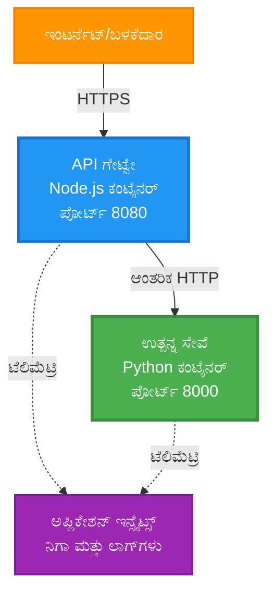
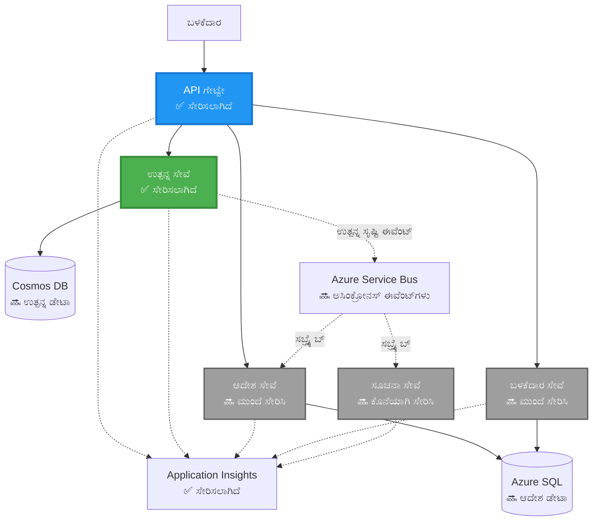
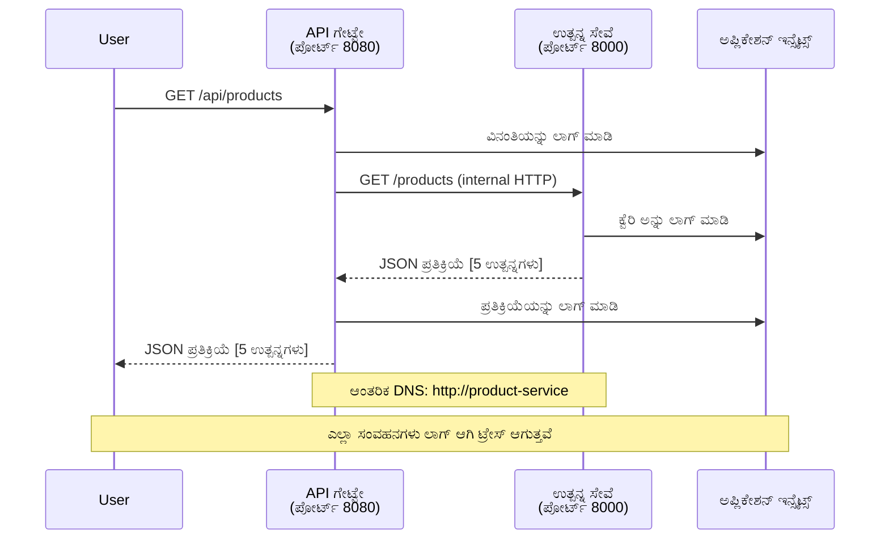

# ಮೈಕ್ರೋಸರ್ವಿಸಸ್ ವಾಸ್ತುಶಿಲ್ಪ - Container App ಉದಾಹರಣೆ

⏱️ **ಅಂದಾಜು ಸಮಯ**: 25-35 ನಿಮಿಷಗಳು | 💰 **ಅಂದಾಜು ವೆಚ್ಚ**: ~$50-100/ತಿಂಗಳು | ⭐ **ಸಂಕೀರ್ಣತೆ**: ಅಡ್ವಾನ್ಸ್‌ಡ್

**📚 ಕಲಿಕೆ ಹಾದಿ:**
- ← ಹಿಂದಿನ: [Simple Flask API](../../../../examples/container-app/simple-flask-api) - ಏಕ ಕಂಟೇನರ್ ಮೂಲಭೂತಗಳು
- 🎯 **ನೀವು ಇಲ್ಲಿ**: ಮೈಕ್ರೋಸರ್ವಿಸಸ್ ವಾಸ್ತುಶಿಲ್ಪ (2-ಸೇವತಾ ಆಧಾರ)
- → ಮುಂದಿನ: [AI Integration](../../../../docs/ai-foundry) - ನಿಮ್ಮ ಸೇವೆಗಳಿಗೆ ಬುದ್ಧಿಮತ್ತೆ ಸೇರಿಸಿ
- 🏠 [ಕೋರ್ಸ್ ಹೋಮ್](../../README.md)

---

ಒಂದು **ಸರಳಗೊಳಿಸಿದ ಆದರೆ ಕಾರ್ಯನಿರ್ವಹಣಾ ಯೋಗ್ಯ** ಮೈಕ್ರೋಸರ್ವಿಸಸ್ ವಾಸ್ತುಶಿಲ್ಪವನ್ನು AZD CLI ಬಳಸಿಕೊಂಡು Azure Container Apps ಗೆ ನಿಯೋಜಿಸಲಾಗಿದೆ. ಈ ಉದಾಹರಣೆ ಸರ್ವಿಸ್-ಟು-ಸರ್ವಿಸ್ ಸಂವಹನ, ಕಂಟೈನರ್ ಸಮನ್ವಯ ಮತ್ತು ನಿಗಾ ವ್ಯವಹಾರವನ್ನು 2-ಸೇವಾ ಪ್ರಾಯೋಗಿಕ ಸೆಟ್‌ಅಪ್‌ನೊಂದಿಗೆ ತೋರಿಸುತ್ತದೆ.

> **📚 ಕಲಿಕೆಯ ವಿಧಾನ**: ಈ ಉದಾಹರಣೆ ಕನಿಷ್ಠ 2-ಸೇವಾ ವಾಸ್ತುಶಿಲ್ಪದಿಂದ (API ಗೇಟ್ವೇ + ಬ್ಯಾಕ್‌ಎಂಡ್ ಸರ್ವಿಸ್) ಪ್ರಾರಂಭವಾಗುತ್ತದೆ, ಇದು ನೀವು ನಿಜವಾಗಿಯೂ ನಿಯೋಜಿಸಿ ಕಲಿಯಬಹುದಾದ ರೀತಿಯಾಗಿದೆ. ಈ ಆಧಾರವನ್ನು ಕಸ್ಟ್ ಮಾಡಿದ ನಂತರ, ನಾವು ಸಂಪೂರ್ಣ ಮೈಕ್ರೋಸರ್ವಿಸ್ ಪರಿಸರೆವರೆಗೆ ವಿಸ್ತರಿಸಲು ಮಾರ್ಗದರ್ಶನವನ್ನು ಒದಗಿಸುತ್ತೇವೆ.

## ನೀವು ಏನು ಕಲಿಯುತ್ತೀರಿ

ಈ ಉದಾಹರಣೆಯನ್ನು ಪೂರ್ಣಗೊಳಿಸುವ ಮೂಲಕ, ನೀವು:
- ಹಲವರು ಕಂಟೈನರ್‌ಗಳನ್ನು Azure Container Apps ಗೆ ನಿಯೋಜಿಸುವಿಕೆ
- ಆಂತರಿಕ ನೆಟ್‌ವರ್ಕಿಂಗ್ ಮೂಲಕ ಸರ್ವಿಸ್-ಟು-ಸರ್ವಿಸ್ ಸಂವಹನ ಅನುಷ್ಠಾನಗೊಳಿಸುವಿಕೆ
- ಪರಿಸರ-ಆಧಾರಿತ ಸ್ಕೇಲಿಂಗ್ ಮತ್ತು ಆರೋಗ್ಯ ತಪಾಸಣೆಯನ್ನು ಸಂರಚಿಸುವಿಕೆ
- Application Insights ಬಳಸಿ ವಿತರಿತ ಸಂಪರ್ಕಗಳನ್ನು ವೀಕ್ಷಿಸುವಿಕೆ
- ಮೈಕ್ರೋಸರ್ವಿಸಸ್ ನಿಯೋಜನೆ ವಿನ್ಯಾಸಗಳು ಮತ್ತು ಉತ್ತಮ ಅಭ್ಯಾಸಗಳನ್ನು ಅರ್ಥಮಾಡಿಕೊಳ್ಳುವಿಕೆ
- ಸರಳದಿಂದ ಜಟಿಲ ವಾಸ್ತುಶಿಲ್ಪಗಳಿಗೆ ಕ್ರಮೇಣ ವಿಸ್ತರಣೆಗೆ ಕಲಿಕೆ

## ವಾಸ್ತುಶಿಲ್ಪ

### ಹಂತ 1: ನಾವು ಏನು ನಿರ್ಮಿಸುತ್ತಿದ್ದೇವೆ (ಈ ಉದಾಹರಣೆಯಲ್ಲಿ ಸೇರಿದೆ)


```mermaid
graph TB
    Internet[ಇಂಟರ್ನೆಟ್/ಬಳಕೆದಾರ]
    Gateway[API ಗೇಟ್ವೇ<br/>Node.js ಕಂಟೈನರ್<br/>ಪೋರ್ಟ್ 8080]
    Product[ಉತ್ಪನ್ನ ಸೇವೆ<br/>Python ಕಂಟೈನರ್<br/>ಪೋರ್ಟ್ 8000]
    AppInsights[ಅಪ್ಲಿಕೇಶನ್ ಇನ್ಸೈಟ್ಸ್<br/>ನಿಗಾ ಮತ್ತು ಲಾಗ್‌ಗಳು]
    
    Internet -->|HTTPS| Gateway
    Gateway -->|ಆಂತರಿಕ HTTP| Product
    Gateway -.->|ಟೆಲಿಮೆಟ್ರಿ| AppInsights
    Product -.->|ಟೆಲಿಮೆಟ್ರಿ| AppInsights
    
    style Gateway fill:#2196F3,stroke:#1976D2,stroke-width:3px,color:#fff
    style Product fill:#4CAF50,stroke:#388E3C,stroke-width:3px,color:#fff
    style Internet fill:#FF9800,stroke:#F57C00,stroke-width:2px,color:#fff
    style AppInsights fill:#9C27B0,stroke:#7B1FA2,stroke-width:2px,color:#fff
```
**ಘಟಕದ ವಿವರಗಳು:**

| ಘಟಕ | ಉದ್ದೇಶ | ಪ್ರವೇಶ | ಸಂಪನ್ಮೂಲಗಳು |
|-----------|---------|--------|-----------|
| **API Gateway** | ಹೊರಗಿನ ವಿನಂತಿಗಳನ್ನು ಬ್ಯಾಕ್‌ಎಂಡ್ ಸೇವೆಗಳಿಗೆ ಮಾರ್ಗದರ್ಶನ ಮಾಡುತ್ತದೆ | ಸಾರ್ವಜನಿಕ (HTTPS) | 1 vCPU, 2GB RAM, 2-20 ಪ್ರತಿಗಳನ್ನು |
| **Product Service** | ಇನ್‌ಮೆಮೊರಿ ಡೇಟಾ ಬಳಸಿ ಉತ್ಪನ್ನ ಕ್ಯಾಟಲಾಗ್ ಅನ್ನು ನಿರ್ವಹಿಸುತ್ತದೆ | ಕೇವಲ ಆಂತರಿಕ | 0.5 vCPU, 1GB RAM, 1-10 ಪ್ರತಿಗಳನ್ನು |
| **Application Insights** | ಕೇಂದ್ರಿತ ಲಾಗಿಂಗ್ ಮತ್ತು ವಿತರಿತ ಟ್ರೇಸಿಂಗ್ | Azure ಪೋರ್ಟಲ್ | 1-2 GB/ತಿಂಗಳು ಡೇಟಾ ಇಂಜೆಕ್ಷನ್ |

**ಏಕೆ ಸರಳದಿಂದ ಆರಂಭಿಸಬೇಕು?**
- ✅ ವೇಗವಾಗಿ ನಿಯೋಜಿಸಿ ಮತ್ತು ಅರ್ಥಮಾಡಿಕೊಳ್ಳಲು (25-35 ನಿಮಿಷ)
- ✅ ಜಟಿಲತೆ ಇಲ್ಲದೆ ಮುಖ್ಯ ಮೈಕ್ರೋಸರ್ವಿಸ್ ಮಾದರಿಗಳನ್ನು ಕಲಿಯಿರಿ
- ✅ ಕಾರ್ಯನಿರ್ವಹಿಸುವ ಕೋಡ್, ಅದನ್ನು ನೀವು ತಿದ್ದುಪಡಿ ಮಾಡಿ ಪ್ರಯೋಗಿಸಬಹುದು
- ✅ ಕಲಿಕೆಗೆ ಕಡಿಮೆ ವೆಚ್ಚ (~$50-100/ತಿಂಗಳು vs $300-1400/ತಿಂಗಳು)
- ✅ ಡೇಟಾಬೇಸ್‌ಗಳು ಮತ್ತು ಮೆಸೇಜ್ ಕ್ಯೂಗಳನ್ನು ಸೇರಿಸುವ ಮೊದಲು ಆತ್ಮವಿಶ್ವಾಸವನ್ನು ನಿರ್ಮಿಸಿಕೊಳ್ಳಿ

**ಉಪಮೆ**: ಇದನ್ನು ಚಾಲನೆ ಕಲಿಯುವುದಾಗಿ ಯೋಚಿಸಿ. ನೀವು ಖಾಲಿ ಪಾರ್ಕಿಂಗ್ ಲಾಟ್ನಲ್ಲಿ (2 ಸೇವೆಗಳು) ಪ್ರಾರಂಭಿಸಿ, ಮೂಲಗಳನ್ನು ನಿಭಾಯಿಸಿ, ನಂತರ ನಗರ ಟ್ರಾಫಿಕ್ (5+ ಸೇವೆಗಳು ಡೇಟಾಬೇಸ್‌ಗಳೊಂದಿಗೆ) ಕಡೆಗೆ ಮುಂದಾಗುತ್ತೀರಿ.

### ಹಂತ 2: ಭವಿಷ್ಯ ವಿಸ್ತರಣೆ (ಸಂದರ್ಭ ವಾಸ್ತುಶಿಲ್ಪ)

ಒಮ್ಮೆ ನೀವು 2-ಸೇವಾ ವಾಸ್ತುಶಿಲ್ಪವನ್ನು ನಿಭಾಯಿಸಿದ ಮೇಲೆ, ನೀವು ವಿಸ್ತರಿಸಬಹುದು:


```mermaid
graph TB
    User[ಬಳಕೆದಾರ]
    Gateway[API ಗೇಟ್ವೇ<br/>✅ ಸೇರಿಸಲಾಗಿದೆ]
    Product[ಉತ್ಪನ್ನ ಸೇವೆ<br/>✅ ಸೇರಿಸಲಾಗಿದೆ]
    Order[ಆದೇಶ ಸೇವೆ<br/>🔜 ಮುಂದೆ ಸೇರಿಸಿ]
    UserSvc[ಬಳಕೆದಾರ ಸೇವೆ<br/>🔜 ಮುಂದೆ ಸೇರಿಸಿ]
    Notify[ಸೂಚನಾ ಸೇವೆ<br/>🔜 ಕೊನೆಯಾಗಿ ಸೇರಿಸಿ]
    
    CosmosDB[(Cosmos DB<br/>🔜 ಉತ್ಪನ್ನ ಡೇಟಾ)]
    AzureSQL[(Azure SQL<br/>🔜 ಆದೇಶ ಡೇಟಾ)]
    ServiceBus[Azure Service Bus<br/>🔜 ಅಸಿಂಕ್ರೋನಸ್ ಈವೆಂಟ್‌ಗಳು]
    AppInsights[Application Insights<br/>✅ ಸೇರಿಸಲಾಗಿದೆ]
    
    User --> Gateway
    Gateway --> Product
    Gateway --> Order
    Gateway --> UserSvc
    
    Product --> CosmosDB
    Order --> AzureSQL
    UserSvc --> AzureSQL
    
    Product -.->|ಉತ್ಪನ್ನ ಸೃಷ್ಟಿ ಈವೆಂಟ್| ServiceBus
    ServiceBus -.->|ಸಬ್ಸ್ಕ್ರೈಬ್| Notify
    ServiceBus -.->|ಸಬ್ಸ್ಕ್ರೈಬ್| Order
    
    Gateway -.-> AppInsights
    Product -.-> AppInsights
    Order -.-> AppInsights
    UserSvc -.-> AppInsights
    Notify -.-> AppInsights
    
    style Product fill:#4CAF50,stroke:#388E3C,stroke-width:3px,color:#fff
    style Gateway fill:#2196F3,stroke:#1976D2,stroke-width:3px,color:#fff
    style Order fill:#9E9E9E,stroke:#616161,stroke-width:2px,color:#fff
    style UserSvc fill:#9E9E9E,stroke:#616161,stroke-width:2px,color:#fff
    style Notify fill:#9E9E9E,stroke:#616161,stroke-width:2px,color:#fff
```
ಹಂತವಾಗಿ ಸೂಚನೆಗಳಿಗಾಗಿ ಕೊನೆಯಲ್ಲಿ ಇರುವ "Expansion Guide" ವಿಭಾಗವನ್ನು ನೋಡಿ.

## ಸೇರಿರುವ ವೈಶಿಷ್ಟ್ಯಗಳು

✅ **ಸೇವೆ ಹುಡುಕಾಟ**: ಕಂಟೈನರ್‌ಗಳ ನಡುವಿನ DNS-ಆಧಾರಿತ ಸ್ವಯಂಚಾಲಿತ ಹುಡುಕಾಟ  
✅ **ಲೋಡ್ ಬ್ಯಾಲೆನ್ಸಿಂಗ್**: ಪ್ರತಿಗಳ ನಡುವೆ ಅಂತರ್ನಿಹಿತ ಲೋಡ್ ಬ್ಯಾಲೆನ್ಸಿಂಗ್  
✅ **ಆಟೋ-ಸ್ಕೇಲಿಂಗ್**: HTTP ವಿನಂತಿಗಳ ಆಧಾರದ ಮೇಲೆ ಪ್ರತಿ ಸೇವೆಯ ಸ್ವತಂತ್ರ ಸ್ಕೇಲಿಂಗ್  
✅ **ಆರೋಗ್ಯ ಮಾನಿಟರಿಂಗ್**: ಎರಡೂ ಸೇವೆಗಳಿಗೆ ಲಿವ್‌ನೆಸ್ ಮತ್ತು ರೆಡಿನೆಸ್ ಪ್ರೋಬ್‌ಗಳು  
✅ **ವಿತರಿತ ಲಾಗಿಂಗ್**: Application Insights ಮೂಲಕ ಕೇಂದ್ರಿತ ಲಾಗಿಂಗ್  
✅ **ಆಂತರಿಕ ನೆಟ್ವರ್ಕಿಂಗ್**: ಸುರಕ್ಷಿತ ಸೇವೆ-ಟು-ಸೇವಿಸ್ ಸಂವಹನ  
✅ **ಕಂಟೈನರ್ ಒರ್ಕೆಸ್ಟ್ರೇಷನ್**: ಸ್ವಯಂಚಾಲಿತ ನಿಯೋಜನೆ ಮತ್ತು ಸ್ಕೇಲಿಂಗ್  
✅ **ಝಿರೋ-ಡೌನ್‌ಟೈಮ್ ಅಪ್ಡೇಟ್ಸ್**: ರಿವಿಷನ್ ನಿರ್ವಹಣೆಯೊಂದಿಗೆ ರೋಲಿಂಗ್ ಅಪ್ಡೇಟ್ಸ್

## ಪೂರ್ವಾಪೇಕ್ಷೆಗಳು

### ಅಗತ್ಯ ಸಾಧನಗಳು

ಆರಂಭಿಸುವ ಮೊದಲು, ನೀವು ಈ ಸಾಧನಗಳನ್ನು ಇನ್‌ಸ್ಟಾಲ್ ಮಾಡಿಕೊಂಡಿದ್ದೀರಾ ಎಂದು ಪರಿಶೀಲಿಸಿ:

1. **[Azure Developer CLI (azd)](https://learn.microsoft.com/azure/developer/azure-developer-cli/install-azd)** (ಆವೃತ್ತಿ 1.0.0 ಅಥವಾ ಅದಕ್ಕಿಂತ ಮೇಲು)
   ```bash
   azd version
   # ನಿರೀಕ್ಷಿತ ಔಟ್ಪುಟ್: azd ಆವೃತ್ತಿ 1.0.0 ಅಥವಾ ಹೆಚ್ಚು
   ```

2. **[Azure CLI](https://learn.microsoft.com/cli/azure/install-azure-cli)** (ಆವೃತ್ತಿ 2.50.0 ಅಥವಾ ಅದಕ್ಕಿಂತ ಮೇಲು)
   ```bash
   az --version
   # ನಿರೀಕ್ಷಿತ ಫಲಿತಾಂಶ: azure-cli 2.50.0 ಅಥವಾ ಹೆಚ್ಚಿನ ಆವೃತ್ತಿ
   ```

3. **[Docker](https://www.docker.com/get-started)** (ಹೊರಬದ್ಧ ಅಭಿವೃದ್ಧಿ/ಪರೀಕ್ಷಣೆಗೆ - ಐಚ್ಛಿಕ)
   ```bash
   docker --version
   # ನಿರೀಕ್ಷಿತ ಫಲಿತಾಂಶ: Docker ಆವೃತ್ತಿ 20.10 ಅಥವಾ ಅದಕ್ಕಿಂತ ಹೆಚ್ಚು
   ```

### ನಿಮ್ಮ ಸಜ್ಜಾತೆಯನ್ನು ಪರಿಶೀಲಿಸಿ

ಕಡೆಯಲ್ಲಿ ಈ ಕಮಾಂಡ್‌ಗಳನ್ನು ಚಲಾಯಿಸಿ ನೀವು ಸಿದ್ಧರಿದ್ದೀರಾ ಎಂದು ದೃಢಿಸಿಕೊಳ್ಳಿ:

```bash
# Azure Developer CLI ಪರಿಶೀಲಿಸಿ
azd version
# ✅ ನಿರೀಕ್ಷೆ: azd ಆವೃತ್ತಿ 1.0.0 ಅಥವಾ ಹೆಚ್ಚಿನದು

# Azure CLI ಪರಿಶೀಲಿಸಿ
az --version
# ✅ ನಿರೀಕ್ಷೆ: azure-cli ಆವೃತ್ತಿ 2.50.0 ಅಥವಾ ಹೆಚ್ಚಿನದು

# Docker ಪರಿಶೀಲಿಸಿ (ಐಚ್ಛಿಕ)
docker --version
# ✅ ನಿರೀಕ್ಷೆ: Docker ಆವೃತ್ತಿ 20.10 ಅಥವಾ ಹೆಚ್ಚಿನದು
```

**ಸಫಲತೆ ಮಾನದಂಡ**: ಎಲ್ಲಾ ಕಮಾಂಡ್‌ಗಳು ಕನಿಷ್ಠ ಆವೃತ್ತಿಗಳಿಗಿಂತ ಹೊಂದಿಕೊಳ್ಳುವ ಅಥವಾ ಹೆಚ್ಚು ಇರುವ ವರ್ಶನ್ ಸಂಖ್ಯೆಯನ್ನು ತಿರಸ್ಕರಿಸದೆ ಮರುಹೇಳಬೇಕು.

### Azure ಅಗತ್ಯಗಳು

- ಸಕ್ರಿಯ **Azure ಸಬ್ಸ್ಕ್ರಿಪ್ಶನ್** ([create a free account](https://azure.microsoft.com/free/))
- ನಿಮ್ಮ ಸಬ್ಸ್ಕ್ರಿಪ್ಶನ್‌ನಲ್ಲಿ ಸಂಪನ್ಮೂಲಗಳನ್ನು ಸೃಷ್ಟಿಸಲು ಅನುಮತಿಗಳು
- ಸಬ್ಸ್ಕ್ರಿಪ್ಶನ್ ಅಥವಾ ರಿಸೋರ್ಸ್ ಗ್ರೂಪ್ ಮೇಲೆ **Contributor** ಪಾತ್ರ

### ಜ್ಞಾನ ಪೂರ್ವಾಪೇಕ್ಷೆಗಳು

ಇದು **ಅಡ್ವಾನ್ಸ್-ಲೆವೆಲ್** ಉದಾಹರಣೆ. ನಿಮಗೆ ಇವುಗಳಿರುವುದು ಅಗತ್ಯ:

- [Simple Flask API example](../../../../examples/container-app/simple-flask-api) ಪೂರ್ಣಗೊಳಿಸಿದ್ದಿರಬೇಕು
- ಮೈಕ್ರೋಸರ್ವಿಸಸ್ ವಾಸ್ತುಶಿಲ್ಪದ ಮೂಲಭೂತ ಅರ್ಥ
- REST APIಗಳು ಮತ್ತು HTTP ನ ಪರಿಚಯ
- ಕಂಟೈನರ್ ಧಾರಣೆಯ ಅರಿವು

**Container Apps ಗೆ ಹೊಸವರೆ?** ಮೂಲಭೂತಗಳನ್ನು ಕಲಿಯಲು ಮೊದಲು [Simple Flask API example](../../../../examples/container-app/simple-flask-api) ಅನ್ನು ಆರಂಭಿಸಿ.

## ತ್ವರಿತ ಪ್ರಾರಂಭ (ಹಂತ ಹಂತವಾಗಿ)

### ಹಂತ 1: ಕ್ಲೋನ್ ಮಾಡಿ ಮತ್ತು ನ್ಯಾವಿಗೇಟ್ ಮಾಡಿ

```bash
git clone https://github.com/microsoft/AZD-for-beginners.git
cd AZD-for-beginners/examples/microservices
```

**✓ ಸಫಲತಾ ತಪಾಸಣೆ**: ನೀವು `azure.yaml` ಅನ್ನು ಕಾಣುತ್ತಿರುವುದನ್ನು ಪರಿಶೀಲಿಸಿ:
```bash
ls
# ನಿರೀಕ್ಷಿತ: README.md, azure.yaml, infra/, src/
```

### ಹಂತ 2: Azure ನಲ್ಲಿ ಪ್ರಮಾಣೀಕರಣ ಮಾಡಿ

```bash
azd auth login
```

ಇದು ನಿಮ್ಮ ಬ್ರೌಸರ್ ಅನ್ನು Azure ಪ್ರಮಾಣೀಕರಣಕ್ಕಾಗಿ ತೆರೆಯುತ್ತದೆ. ನಿಮ್ಮ Azure ಪ್ರಮಾಣಪತ್ರಗಳನ್ನು ಬಳಸಿ ಸೈನ್ ಇನ್ ಮಾಡಿ.

**✓ ಸಫಲತಾ ತಪಾಸಣೆ**: ನೀವು ಈ ರೀತಿ ಕಾಣಬೇಕು:
```
Logged in to Azure.
```

### ಹಂತ 3: ಪರಿಸರವನ್ನು ಪ್ರಾರಂಭಿಸಿ

```bash
azd init
```

**ನೀವು ಕಾಣುವ ಪ್ರಾಂಪ್ಟ್‍ಗಳು**:
- **Environment name**: ಒಂದು ಸಂಕ್ಷಿಪ್ತ ಹೆಸರು ನಮೂದಿಸಿ (ಉದಾ., `microservices-dev`)
- **Azure subscription**: ನಿಮ್ಮ ಸಬ್ಸ್ಕ್ರಿಪ್ಶನ್ ಅನ್ನು ಆರಿಸಿ
- **Azure location**: ಒಂದು ರೀಜಿಯನ್ ಆಯ್ಕೆ ಮಾಡಿ (ಉದಾ., `eastus`, `westeurope`)

**✓ ಸಫಲತಾ ತಪಾಸಣೆ**: ನೀವು ಈ ರೀತಿ ಕಾಣಬೇಕು:
```
SUCCESS: New project initialized!
```

### ಹಂತ 4: ಮೂಲಸೌಕರ್ಯ ಮತ್ತು ಸೇವೆಗಳನ್ನು ನಿಯೋಜಿಸಿ

```bash
azd up
```

**ನಾಗುವ ಘಟನಾವಳಿ** (8-12 ನಿಮಿಷ ತೆಗೆದುಕೊಳ್ಳಬಹುದು):


```mermaid
graph LR
    A[azd ಅಪ್] --> B[ಸಂಪನ್ಮೂಲ ಗುಂಪು ರಚಿಸಿ]
    B --> C[ಕಂಟೇನರ್ ರಿಜಿಸ್ಟ್ರಿಯನ್ನು ನಿಯೋಜಿಸಿ]
    C --> D[ಲಾಗ್ ಅನಾಲಿಟಿಕ್ಸ್ ಅನ್ನು ನಿಯೋಜಿಸಿ]
    D --> E[ಅಪ್ ಇನ್ಸೈಟ್ಸ್ ಅನ್ನು ನಿಯೋಜಿಸಿ]
    E --> F[ಕಂಟೇನರ್ ಪರಿಸರವನ್ನು ರಚಿಸಿ]
    F --> G[API ಗೇಟ್ವೇ ಇಮೇಜ್ ನಿರ್ಮಿಸಿ]
    F --> H[ಉತ್ಪನ್ನ ಸೇವೆ ಇಮೇಜ್ ನಿರ್ಮಿಸಿ]
    G --> I[ರಿಜಿಸ್ಟ್ರಿಗೆ ಪುಷ್ ಮಾಡಿ]
    H --> I
    I --> J[API ಗೇಟ್ವೇ ಅನ್ನು ನಿಯೋಜಿಸಿ]
    I --> K[ಉತ್ಪನ್ನ ಸೇವೆಯನ್ನು ನಿಯೋಜಿಸಿ]
    J --> L[Ingress ಮತ್ತು ಆರೋಗ್ಯ ಪರಿಶೀಲನೆಗಳನ್ನು ಸಂರಚಿಸಿ]
    K --> L
    L --> M[ನಿಯೋಜನೆ ಪೂರ್ಣವಾಗಿದೆ ✓]
    
    style A fill:#2196F3,stroke:#1976D2,stroke-width:3px,color:#fff
    style M fill:#4CAF50,stroke:#388E3C,stroke-width:3px,color:#fff
```
**✓ ಸಫಲತಾ ತಪಾಸಣೆ**: ನೀವು ಈ ರೀತಿ ಕಾಣಬೇಕು:
```
SUCCESS: Your application was deployed to Azure in X minutes Y seconds.
Endpoint: https://api-gateway-<unique-id>.azurecontainerapps.io
```

**⏱️ ಸಮಯ**: 8-12 ನಿಮಿಷಗಳು

### ಹಂತ 5: ನಿಯೋಜನೆಯನ್ನು ಪರೀಕ್ಷಿಸಿ

```bash
# ಗೇಟ್ವೇ ಎಂಡ್ಪಾಯಿಂಟ್ ಅನ್ನು ಪಡೆಯಿರಿ
GATEWAY_URL=$(azd env get-values | grep API_GATEWAY_URL | cut -d '=' -f2 | tr -d '"')

# API ಗೇಟ್ವೆಯ ಆರೋಗ್ಯವನ್ನು ಪರೀಕ್ಷಿಸಿ
curl $GATEWAY_URL/health
```

**✅ ನಿರೀಕ್ಷಿತ ಔಟ್‌ಪುಟ್:**
```json
{
  "status": "healthy",
  "service": "api-gateway",
  "timestamp": "2025-11-19T10:30:00Z"
}
```

**ಗೇಟ್ವೇ ಮೂಲಕ ಉತ್ಪನ್ನ ಸೇವೆಯನ್ನು ಪರೀಕ್ಷಿಸಿ**:
```bash
# ಉತ್ಪನ್ನಗಳನ್ನು ಪಟ್ಟಿ ಮಾಡಿ
curl $GATEWAY_URL/api/products
```

**✅ ನಿರೀಕ್ಷಿತ ಔಟ್‌ಪುಟ್:**
```json
[
  {"id":1,"name":"Laptop","price":999.99,"stock":50},
  {"id":2,"name":"Mouse","price":29.99,"stock":200},
  {"id":3,"name":"Keyboard","price":79.99,"stock":150}
]
```

**✓ ಸಫಲತಾ ತಪಾಸಣೆ**: ಎರಡೂ ಎಂಡ್‌ಪಾಯಿಂಟ್‌ಗಳು ದೋಷವಿಲ್ಲದೇ JSON ಡೇಟಾವನ್ನು ಮರುಹಂಚಬೇಕು.

---

**🎉 ಅಭಿನಂದನೆಗಳು!** ನೀವು Azure ಗೆ ಮೈಕ್ರೋಸರ್ವಿಸಸ್ ವಾಸ್ತುಶಿಲ್ಪವನ್ನು ನಿಯೋಜಿಸಿದ್ದೀರಿ!

## ಪ್ರಾಜೆಕ್ಟ್ ರಚನೆ

ಎಲ್ಲಾ ಅನುಷ್ಠಾನ ಫೈಲ್‌ಗಳು ಸೇರಿಸಲಾಗಿದೆ—ಇದು ಪೂರ್ಣ, ಕಾರ್ಯನಿರ್ವಹಿಸುವ ಉದಾಹರಣೆ:

```
microservices/
│
├── README.md                         # This file
├── azure.yaml                        # AZD configuration
├── .gitignore                        # Git ignore patterns
│
├── infra/                           # Infrastructure as Code (Bicep)
│   ├── main.bicep                   # Main orchestration
│   ├── abbreviations.json           # Naming conventions
│   ├── core/                        # Shared infrastructure
│   │   ├── container-apps-environment.bicep  # Container environment + registry
│   │   └── monitor.bicep            # Application Insights + Log Analytics
│   └── app/                         # Service definitions
│       ├── api-gateway.bicep        # API Gateway container app
│       └── product-service.bicep    # Product Service container app
│
└── src/                             # Application source code
    ├── api-gateway/                 # Node.js API Gateway
    │   ├── app.js                   # Express server with routing
    │   ├── package.json             # Node dependencies
    │   └── Dockerfile               # Container definition
    └── product-service/             # Python Product Service
        ├── main.py                  # Flask API with product data
        ├── requirements.txt         # Python dependencies
        └── Dockerfile               # Container definition
```

**ಪ್ರತಿ ಘಟಕ ಏನು ಮಾಡುತ್ತದೆ:** 

**Infrastructure (infra/)**:
- `main.bicep`: ಎಲ್ಲಾ Azure ಸಂಪನ್ಮೂಲಗಳನ್ನು ಮತ್ತು ಅವುಗಳ ಅವಲಂಬನೆಗಳನ್ನು ಸಂಯೋಜಿಸುತ್ತದೆ
- `core/container-apps-environment.bicep`: Container Apps ಪರಿಸರ ಮತ್ತು Azure Container Registry ಅನ್ನು ರಚಿಸುತ್ತದೆ
- `core/monitor.bicep`: ವಿತರಿತ ಲಾಗಿಂಗ್ಿಗಾಗಿ Application Insights ಅನ್ನು ಸ್ಥಾಪಿಸುತ್ತದೆ
- `app/*.bicep`: ಪ್ರತಿ ಕಂಟೈನರ್ ಅಪ್ ವ್ಯಾಖ್ಯಾನ್‌ಗಳು ಸ್ಕೇಲಿಂಗ್ ಮತ್ತು ಆರೋಗ್ಯ ತಪಾಸಣೆಯೊಂದಿಗೆ

**API Gateway (src/api-gateway/)**:
- ಹೊರತಾಗಿರುವ ಸೇವೆ, ಇದು ಬ್ಯಾಕ್‌ಎಂಡ್ ಸೇವೆಗಳಿಗೆ ವಿನಂತಿಗಳನ್ನು ಮಾರ್ಗದರ್ಶಿಸುತ್ತದೆ
- ಲಾಗಿಂಗ್, ದೋಷ ನಿರ್ವಹಣೆ ಮತ್ತು ವಿನಂತಿ ಮುಂದೆ ಸಾಗಿಸುವಿಕೆ ಅನ್ನು ಅನುಷ್ಠಾನಗೊಳಿಸುತ್ತದೆ
- ಸೇವೆ-ಟು-ಸೇವಿಸ್ HTTP ಸಂವಹನದ ಉದಾಹರಣೆಯನ್ನು ತೋರಿಸುತ್ತದೆ

**Product Service (src/product-service/)**:
- ಆಂತರಿಕ ಸೇವೆ, ಉತ್ಪನ್ನ ಕ್ಯಾತಲಾಗ್ (ಸರಳತೆಗೆ in-memory)
- REST API ಮತ್ತು ಆರೋಗ್ಯ ತಪಾಸಣೆಗಳೊಂದಿಗೆ
- ಬ್ಯಾಕ್‌ಎಂಡ್ ಮೈಕ್ರೋಸರ್ವಿಸ್ ಮಾದರಿಯ ಉದಾಹರಣೆ

## ಸೇವೆಗಳ ಅವಲೋಕನ

### API Gateway (Node.js/Express)

**Port**: 8080  
**Access**: Public (external ingress)  
**Purpose**: ಒಳಗ್ಗಿರುವ ವಿನಂತಿಗಳನ್ನು ಸೂಕ್ತ ಬ್ಯಾಕ್‌ಎಂಡ್ ಸೇವೆಗಳಿಗೆ ಮಾರ್ಗದರ್ಶಿಸುತ್ತದೆ  

**Endpoints**:
- `GET /` - ಸೇವೆಯ ಮಾಹಿತಿ
- `GET /health` - ಆರೋಗ್ಯ ತಪಾಸಣೆ ಎಂಡ್‌ಪಾಯಿಂಟ್
- `GET /api/products` - Product Service ಗೆ ಮುಂದೆ ಸಾಗಿಸಲಾಗುತ್ತದೆ (ಎಲ್ಲಾ ಪಟ್ಟಿ)
- `GET /api/products/:id` - Product Service ಗೆ ಮುಂದೆ ಸಾಗಿಸಲಾಗುತ್ತದೆ (ಐಡಿ ಮೂಲಕ ಪಡೆದುಕೊ)

**ಮುಖ್ಯ ವೈಶಿಷ್ಟ್ಯಗಳು**:
- axios ಬಳಸಿ ವಿನಂತಿ ಮಾರ್ಗದರ್ಶನ
- ಕೇಂದ್ರಿತ ಲಾಗಿಂಗ್
- ದೋಷ ನಿರ್ವಹಣೆ ಮತ್ತು ಟೈಮೌಟ್ ನಿರ್ವಹಣೆ
- ಪರಿಸರ ಚರಗಳ ಮೂಲಕ ಸೇವೆ ಕಂಡುಹಿಡಿಯುವಿಕೆ
- Application Insights ಸಂಯೋಜನೆ

**Code Highlight** (`src/api-gateway/app.js`):
```javascript
// ಆಂತರಿಕ ಸೇವಾ ಸಂವಹನ
app.get('/api/products', async (req, res) => {
  const response = await axios.get(`${PRODUCT_SERVICE_URL}/products`, {
    timeout: 5000
  });
  res.json(response.data);
});
```

### Product Service (Python/Flask)

**Port**: 8000  
**Access**: ಕೇವಲ ಆಂತರಿಕ (ಹೊರುಬದ್ಧ ಇನ್‌ಗ್ರೆಸ್ ಇಲ್ಲ)  
**Purpose**: ಇನ್‌ಮೆಮೊರಿ ಡೇಟಾ ಬಳಸಿ ಉತ್ಪನ್ನ ಕ್ಯಾಟಲಾಗ್ ಅನ್ನು ನಿರ್ವಹಿಸುತ್ತದೆ  

**Endpoints**:
- `GET /` - ಸೇವೆಯ ಮಾಹಿತಿ
- `GET /health` - ಆರೋಗ್ಯ ತಪಾಸಣೆ ಎಂಡ್‌ಪಾಯಿಂಟ್
- `GET /products` - ಎಲ್ಲಾ ಉತ್ಪನ್ನಗಳನ್ನು ಪಟ್ಟಿ ಮಾಡಿ
- `GET /products/<id>` - ಐಡಿ ಮೂಲಕ ಉತ್ಪನ್ನವನ್ನು ಪಡೆಯಿರಿ

**ಮುಖ್ಯ ವೈಶಿಷ್ಟ್ಯಗಳು**:
- Flask ನೊಂದಿಗೆ RESTful API
- ಇನ್‌ಮೆಮೊರಿ ಉತ್ಪನ್ನ ಸ್ಟೋರ್ (ಸರಳ, ಡೇಟಾಬೇಸ್ ಅಗತ್ಯವಿಲ್ಲ)
- ಪ್ರೋಬ್‌ಗಳೊಂದಿಗೆ ಆರೋಗ್ಯ ಮಾನಿಟರಿಂಗ್
- ಗঠনಬದ್ಧ ಲಾಗಿಂಗ್
- Application Insights ಸಂಯೋಜನೆ

**ಡೇಟಾ ಮಾದರಿ**:
```python
{
  "id": 1,
  "name": "Laptop",
  "description": "High-performance laptop",
  "price": 999.99,
  "stock": 50
}
```

**ಏಕೆ ಕೇವಲ ಆಂತರಿಕ?**
Product Service ಸಾರ್ವಜನಿಕವಾಗಿ ಅನಾವರಣಗೊಳ್ಳುವುದಿಲ್ಲ. ಎಲ್ಲಾ ವಿನಂತಿಗಳು API Gateway ಮೂಲಕ ಹೋಗಲೇಬೇಕು, ಇದು ಒದಗಿಸುತ್ತದೆ:
- ಭದ್ರತೆ: ನಿಯಂತ್ರಿತ ಪ್ರವೇಶ ಬಿಂದುವು
- ಬದಲಾವಣೆ ಸುಗಮತೆ: ಕ್ಲೈಂಟ್‌ಗಳಿಗೆ ಪರಿಣಾಮ ಬೀರುವದೆ ಬೇಕ್‌ಎಂಡ್ ಬದಲಾಯಿಸಬಹುದು
- ನಿಗಾ: ಕೇಂದ್ರಿತ ವಿನಂತಿ ಲಾಗಿಂಗ್

## ಸೇವೆ ಸಂವಹನವನ್ನು ಅರ್ಥಮಾಡಿಕೊಳ್ಳುವುದು

### ಸೇವೆಗಳು ಪರಸ್ಪರ ಹೇಗೆ ಮಾತಾಡುತ್ತವೆ


```mermaid
sequenceDiagram
    participant User
    participant Gateway as API ಗೇಟ್ವೇ<br/>(ಪೋರ್ಟ್ 8080)
    participant Product as ಉತ್ಪನ್ನ ಸೇವೆ<br/>(ಪೋರ್ಟ್ 8000)
    participant AI as ಅಪ್ಲಿಕೇಶನ್ ಇನ್ಸೈಟ್ಸ್
    
    User->>Gateway: GET /api/products
    Gateway->>AI: ವಿನಂತಿಯನ್ನು ಲಾಗ್ ಮಾಡಿ
    Gateway->>Product: GET /products (internal HTTP)
    Product->>AI: ಕ್ವೆರಿ ಅನ್ನು ಲಾಗ್ ಮಾಡಿ
    Product-->>Gateway: JSON ಪ್ರತಿಕ್ರಿಯೆ [5 ಉತ್ಪನ್ನಗಳು]
    Gateway->>AI: ಪ್ರತಿಕ್ರಿಯೆಯನ್ನು ಲಾಗ್ ಮಾಡಿ
    Gateway-->>User: JSON ಪ್ರತಿಕ್ರಿಯೆ [5 ಉತ್ಪನ್ನಗಳು]
    
    Note over Gateway,Product: ಆಂತರಿಕ DNS: http://product-service
    Note over User,AI: ಎಲ್ಲಾ ಸಂವಹನಗಳು ಲಾಗ್ ಆಗಿ ಟ್ರೇಸ್ ಆಗುತ್ತವೆ
```
ಈ ಉದಾಹರಣೆಯಲ್ಲಿ, API Gateway Product Service ಜೊತೆಗೆ **ಆಂತರಿಕ HTTP ಕರೆಗೆ** ಬಳಸಿ ಸಂವಹನ ಮಾಡುತ್ತದೆ:

```javascript
// API ಗೇಟ್ವೇ (src/api-gateway/app.js)
const PRODUCT_SERVICE_URL = process.env.PRODUCT_SERVICE_URL;

// ಆಂತರಿಕ HTTP ವಿನಂತಿ ಮಾಡಿ
const response = await axios.get(`${PRODUCT_SERVICE_URL}/products`);
```

**ಪ್ರಮುಖ ಅಂಶಗಳು**:

1. **DNS-ಆಧಾರಿತ ಹುಡುಕಾಟ**: Container Apps ಸ್ವಯಂಚಾಲಿತವಾಗಿ ಆಂತರಿಕ ಸೇವೆಗಳಿಗೆ DNS ಒದಗಿಸುತ್ತದೆ
   - Product Service FQDN: `product-service.internal.<environment>.azurecontainerapps.io`
   - ಸರಳೀಕೃತವಾಗಿ: `http://product-service` (Container Apps ಇದನ್ನು ಪರಿಹರಿಸುತ್ತದೆ)

2. **ಸಾರ್ವಜನಿಕ ಅನಾವರಣವಿಲ್ಲ**: Bicep ನಲ್ಲಿ Product Service ನಲ್ಲಿ `external: false` ಇದೆ
   - ಕೇವಲ Container Apps ಪರಿಸರದ ಒಳಗೆ ಮಾತ್ರ ಪ್ರವೇಶಸಾಧ್ಯ
   - ಇಂಟರ್‍ನೆಟ್‌ನಿಂದ ತಲುಪಲು ಸಾಧ್ಯವಿಲ್ಲ

3. **ಪರಿಸರ ಚರಗಳು**: ಸೇವೆ URLs ಅನ್ನು ನಿಯೋಜನೆಯ ಸಮಯದಲ್ಲಿ ಇಂಜೆಕ್ಟ್ ಮಾಡಲಾಗುತ್ತದೆ
   - Bicep ಗೇಟ್‌ವೆಯ ಕಡೆಗೆ ಆಂತರಿಕ FQDN ಅನ್ನು ಪಾಸ್ ಮಾಡುತ್ತದೆ
   - ಅಪ್ಲಿಕೇಶನ್ ಕೋಡ್‌ನಲ್ಲಿ ಹಾರ್ಡ್‌ಕೊಡ್ URL ಗಳಿಲ್ಲ

**ಉಪಮೆ**: ಇದನ್ನು ಕಚೇರಿ ಕೊಠಡಿಗಳೊಳಗಿನಂತೆ ಯೋಚಿಸಿ. API Gateway ಸ್ವಾಗತ ಡೆಸ್ಕ್ (ಸಾರ್ವಜನಿಕ-ಮುಖ್ಯ), ಮತ್ತು Product Service ಒಂದು ಕಚೇರಿ ಕೊಠಡಿ (ಆಂತರಿಕ ಮಾತ್ರ). ಭೇಟಿದಾರರು ಸ್ವಾಗತದ ಮೂಲಕಲೇ ಕಚೇರಿಗೆ ಹೋದಬೇಕಾಗುತ್ತದೆ.

## ನಿಯೋಜನೆ ಆಯ್ಕೆಗಳು

### ಸಂಪೂರ್ಣ ನಿಯೋಜನೆ (ಶಿಫಾರಸು ಮಾಡಲಾಗಿದೆ)

```bash
# ಇನ್ಫ್ರಾಸ್ಟ್ರಕ್ಚರ್ ಮತ್ತು ಉಭಯ ಸೇವೆಗಳನ್ನು ನಿಯೋಜಿಸಿ
azd up
```

ಇದು ನಿಯೋಜಿಸುತ್ತದೆ:
1. Container Apps ಪರಿಸರ
2. Application Insights
3. Container Registry
4. API Gateway ಕಂಟೈನರ್
5. Product Service ಕಂಟೈನರ್

**ಸಮಯ**: 8-12 ನಿಮಿಷಗಳು

### ವೈಯಕ್ತಿಕ ಸೇವೆ ನಿಯೋಜನೆ

```bash
# ಮಾತ್ರ ಒಂದು ಸೇವೆಯನ್ನು ನಿಯೋಜಿಸಿ (ಆರಂಭಿಕ azd up ನಂತರ)
azd deploy api-gateway

# ಅಥವಾ ಉತ್ಪನ್ನ ಸೇವೆಯನ್ನು ನಿಯೋಜಿಸಿ
azd deploy product-service
```

**ಪ್ರಯೋಜನ**: ಒಂದು ಸೇವೆಯಲ್ಲಿನ ಕೋಡ್ ಅನ್ನು ನವೀಕರಿಸಿ, ಅದನ್ನು ಮಾತ್ರ ಮರುನಿಯೋಜಿಸಬೇಕಾದಾಗ.

### ಸಂರಚನೆ ನವೀಕರಿಸಿ

```bash
# ಸ್ಕೇಲಿಂಗ್ ಪ್ಯಾರಾಮೀಟರ್‌ಗಳನ್ನು ಬದಲಾಯಿಸಿ
azd env set GATEWAY_MAX_REPLICAS 30

# ಹೊಸ ಸಂರಚನೆಯೊಂದಿಗೆ ಮರು ನಿಯೋಜಿಸಿ
azd up
```

## ಸಂರಚನೆ

### ಸ್ಕೇಲಿಂಗ್ ಸಂರಚನೆ

ಎರಡೂ ಸೇವೆಗಳು ಅವರ Bicep ಫೈಲ್‌ಗಳಲ್ಲಿ HTTP-ಆಧಾರಿತ ಆಟೋಸ್ಕೇಲಿಂಗ್ ಜೊತೆಗೆ ಸಂರಚಿತವಾಗಿವೆ:

**API Gateway**:
- ಕನಿಷ್ಠ ಪ್ರತಿಗಳು: 2 (ಲಭ್ಯತೆಗೆ ಎಂದಿಗೂ ಕನಿಷ್ಠ 2)
- ಗರಿಷ್ಠ ಪ್ರತಿಗಳು: 20
- ಸ್ಕೇಲ್ ಟ್ರಿಗರ್: ಪ್ರತಿ ಪ್ರತಿಗೆ 50 ಸಮಕಾಲೀನ ವಿನಂತಿಗಳು

**Product Service**:
- ಕನಿಷ್ಠ ಪ್ರತಿಗಳು: 1 (ಅಗತ್ಯವಿದ್ದರೆ ಶೂನ್ಯಕ್ಕೆ ಸ್ಕೇಲ್ ಆಗಬಹುದು)
- ಗರಿಷ್ಠ ಪ್ರತಿಗಳು: 10
- ಸ್ಕೇಲ್ ಟ್ರಿಗರ್: ಪ್ರತಿ ಪ್ರತಿಗೆ 100 ಸಮಕಾಲೀನ ವಿನಂತಿಗಳು

**ಸ್ಕೇಲಿಂಗ್ ಅನ್ನು ಕಸ್ಟಮೈಸ್ ಮಾಡಿ** (in `infra/app/*.bicep`):
```bicep
scale: {
  minReplicas: 1
  maxReplicas: 10
  rules: [
    {
      name: 'http-scale-rule'
      http: {
        metadata: {
          concurrentRequests: '100'  // Adjust this
        }
      }
    }
  ]
}
```

### ಸಂಪನ್ಮೂಲ ಹಂಚಿಕೆ

**API Gateway**:
- CPU: 1.0 vCPU
- ಮೆಮೊರಿ: 2 GiB
- ಕಾರಣ: ಎಲ್ಲಾ ಹೊರಗಿನ ಟ್ರಾಫಿಕ್ ಅನ್ನು ಹ್ಯಾಂಡಲ್ ಮಾಡುತ್ತದೆ

**Product Service**:
- CPU: 0.5 vCPU
- ಮೆಮೊರಿ: 1 GiB
- ಕಾರಣ: ಲೈಟ್‌ವೈಟ್ ಇನ್-ಮೆಮರಿ ಆಪರೇಷನ್‌ಗಳು

### ಆರೋಗ್ಯ ತಪಾಸಣೆಗಳು

ಎರಡೂ ಸೇವೆಗಳಲ್ಲಿ ಲಿವ್‌ನೆಸ್ ಮತ್ತು ರೆಡಿನೆಸ್ ಪ್ರೋಬ್‌ಗಳು ಸೇರಿವೆ:

```bicep
probes: [
  {
    type: 'Liveness'
    httpGet: {
      path: '/health'
      port: 8080
    }
    initialDelaySeconds: 10
    periodSeconds: 30
  }
  {
    type: 'Readiness'
    httpGet: {
      path: '/health'
      port: 8080
    }
    initialDelaySeconds: 5
    periodSeconds: 10
  }
]
```

**ಇದರಿಂದ ಏನಾಗುತ್ತದೆ**:
- **Liveness**: ಆರೋಗ್ಯ ತಪಾಸಣೆ ವಿಫಲವಾದರೆ, Container Apps ಕಂಟೈನರ್ ಅನ್ನು ಮರುಪ್ರಾರಂಭಿಸುತ್ತದೆ
- **Readiness**: ಸಿದ್ಧವಿಲ್ಲದಿದ್ದರೆ, Container Apps ಆ ಪ್ರತಿಗೆ ಟ್ರಾಫಿಕ್ ಮಾರ್ಗದರ್ಶನ ನಿಲ್ಲಿಸುತ್ತದೆ

## ನಿಗಾ ಮತ್ತು ದೃಶ್ಯೀಕರಣ

### ಸೇವೆ ಲಾಗ್‌ಗಳು ವೀಕ್ಷಿಸಿ

```bash
# azd monitor ಬಳಸಿ ಲಾಗ್‌ಗಳನ್ನು ವೀಕ್ಷಿಸಿ
azd monitor --logs

# ಅಥವಾ ನಿರ್ದಿಷ್ಟ Container Apps‌ಗಾಗಿ Azure CLI ಅನ್ನು ಬಳಸಿ:
# API ಗೇಟ್ವೇದಿಂದ ಲಾಗ್‌ಗಳನ್ನು ಸ್ಟ್ರೀಮ್ ಮಾಡಿ
az containerapp logs show --name api-gateway --resource-group $RG_NAME --follow

# ಇತ್ತೀಚಿನ ಉತ್ಪನ್ನ ಸೇವೆಯ ಲಾಗ್‌ಗಳನ್ನು ವೀಕ್ಷಿಸಿ
az containerapp logs show --name product-service --resource-group $RG_NAME --tail 100
```

**ನಿರೀಕ್ಷಿತ ಔಟ್‌ಪುಟ್**:
```
[api-gateway] API Gateway listening on port 8080
[api-gateway] Product Service URL: http://product-service
[api-gateway] GET /api/products 200 - 45ms
[product-service] Retrieved 5 products
```

### Application Insights ಕ್ವೆರಿಗಳು

Azure Portal ನಲ್ಲಿ Application Insights ಅನ್ನು ಪ್ರವೇಶಿಸಿ, ನಂತರ ಈ ಕ್ವೆರಿಗಳನ್ನು ಚಲಾಯಿಸಿ:

**ನೀಟವಾದ ವಿನಂತಿಗಳನ್ನು ಕಂಡುಹಿಡಿಯಿರಿ**:
```kusto
requests
| where timestamp > ago(1h)
| where duration > 1000  // Requests taking >1 second
| summarize count() by name, cloud_RoleName
| order by count_ desc
```

**ಸೇವಾ-ಟು-ಸೇವಿಸ್ ಕರೆಗಳನ್ನು ಟ್ರ್ಯಾಕ್ ಮಾಡಿ**:
```kusto
dependencies
| where timestamp > ago(1h)
| where type == "Http"
| project timestamp, name, target, duration, success
| order by timestamp desc
```

**ಸೇವೆಯ ಪ್ರಕಾರ ದೋಷ ದರ**:
```kusto
exceptions
| where timestamp > ago(24h)
| summarize errorCount = count() by cloud_RoleName, type
| order by errorCount desc
```

**ಕಾಲಾವಧಿಯಲ್ಲಿ ವಿನಂತಿ ಪ್ರಮಾಣ**:
```kusto
requests
| where timestamp > ago(1h)
| summarize requestCount = count() by bin(timestamp, 5m), cloud_RoleName
| render timechart
```

### ಮಾನಿಟರಿಂಗ್ ಡ್ಯಾಶ್‌ಬೋರ್ಡ್ ಪ್ರವೇಶಿಸಿ

```bash
# Application Insights ವಿವರಗಳನ್ನು ಪಡೆಯಿ
azd env get-values | grep APPLICATIONINSIGHTS

# Azure ಪೋರ್ಟಲ್‌ನ ಮೇಲ್ವಿಕ್ಷಣೆ ತೆರೆಯಿರಿ
az monitor app-insights component show \
  --app $(azd env get-values | grep APPLICATIONINSIGHTS_CONNECTION_STRING | cut -d '=' -f2) \
  --resource-group $(azd env get-values | grep AZURE_RESOURCE_GROUP | cut -d '=' -f2) \
  --query "appId" -o tsv
```

### ಲೈವ್ ಮೆಟ್ರಿಕ್ಸ್

1. Azure Portal ನಲ್ಲಿ Application Insights ಗೆ ನವಿಗೇಟ್ ಮಾಡಿ
2. "Live Metrics" ಮೇಲೆ ಕ್ಲಿಕ್ ಮಾಡಿ
3. ರಿಯಲ್-ಟೈಮ್ ವಿನಂತಿಗಳು, ವೈಫಲ್ಯಗಳು ಮತ್ತು ಪ್ರದರ್ಶಕತೆ ನೋಡಿ
4. ಪರೀಕ್ಷೆ ನಡೆಸಲು ಈ ಕಮಾಂಡ್ ಅನ್ನು ಚಾಲನೆ ಮಾಡಿ: `curl $(azd env get-values | grep API_GATEWAY_URL | cut -d '=' -f2 | tr -d '"')/api/products`

## ಪ್ರಾಯೋಗಿಕ ವ್ಯಾಯಾಮಗಳು

### ವ್ಯಾಯಾಮ 1: ಹೊಸ ಉತ್ಪನ್ನ ಎಂಡ್‌ಪಾಯಿಂಟ್ ಸೇರಿಸಿ ⭐ (ಸರಳ)

**ಗೋಲ್**: ಹೊಸ ಉತ್ಪನ್ನಗಳನ್ನು ರಚಿಸಲು POST ಎಂಡ್‌ಪಾಯಿಂಟ್ ಸೇರಿಸಿ

**ಪ್ರಾರಂಭಿಕ ಬಿಂದೂ**: `src/product-service/main.py`

**ಹಂತಗಳು**:

1. `main.py` ನಲ್ಲಿ `get_product` ಫಂಕ್ಷನ್ ನಂತರ ಈ ಎಂಡ್‌ಪಾಯಿಂಟ್ ಅನ್ನು ಸೇರಿಸಿ:

```python
@app.route('/products', methods=['POST'])
def create_product():
    """Create a new product"""
    data = request.get_json()
    
    # ಆವಶ್ಯಕ ಕ್ಷೇತ್ರಗಳನ್ನು ಮಾನ್ಯಗೊಳಿಸಿ
    if not data or 'name' not in data or 'price' not in data:
        return jsonify({'error': 'Missing required fields: name, price'}), 400
    
    new_id = max(p['id'] for p in products) + 1
    new_product = {
        'id': new_id,
        'name': data['name'],
        'description': data.get('description', ''),
        'price': float(data['price']),
        'stock': int(data.get('stock', 0))
    }
    products.append(new_product)
    logger.info(f"Created product {new_id}")
    return jsonify(new_product), 201
```

2. API Gateway ಗೆ POST ರೂಟ್ ಸೇರಿಸಿ (`src/api-gateway/app.js`):

```javascript
// GET /api/products ಮಾರ್ಗದ ನಂತರ ಇದನ್ನು ಸೇರಿಸಿ
app.post('/api/products', async (req, res) => {
  try {
    console.log(`Forwarding POST request to ${PRODUCT_SERVICE_URL}/products`);
    const response = await axios.post(`${PRODUCT_SERVICE_URL}/products`, req.body, {
      timeout: 5000
    });
    res.status(201).json(response.data);
  } catch (error) {
    console.error('Error calling product service:', error.message);
    res.status(503).json({
      error: 'Product service unavailable',
      message: error.message
    });
  }
});
```

3. ಎರಡೂ ಸೇವೆಗಳನ್ನು ಮರುನಿಯೋಜಿಸಿ:

```bash
azd deploy product-service
azd deploy api-gateway
```

4. ಹೊಸ ಎಂಡ್‌ಪಾಯಿಂಟ್ ಅನ್ನು ಪರೀಕ್ಷಿಸಿ:

```bash
GATEWAY_URL=$(azd env get-values | grep API_GATEWAY_URL | cut -d '=' -f2 | tr -d '"')

# ಹೊಸ ಉತ್ಪನ್ನವನ್ನು ರಚಿಸಿ
curl -X POST $GATEWAY_URL/api/products \
  -H "Content-Type: application/json" \
  -d '{"name":"USB Cable","price":9.99,"stock":500}'
```

**✅ ನಿರೀಕ್ಷಿತ ಔಟ್‌ಪುಟ್:**
```json
{"id":6,"name":"USB Cable","description":"","price":9.99,"stock":500}
```

5. ಅದು ಪಟ್ಟಿಯಲ್ಲಿ ಕಾಣುತ್ತದೆಯೇ ಎಂದು ಪರಿಶೀಲಿಸಿ:

```bash
curl $GATEWAY_URL/api/products
# ಹೊಸ USB ಕೇಬಲ್ ಸೇರಿದಂತೆ ಈಗ 6 ಉತ್ಪನ್ನಗಳನ್ನು ತೋರಿಸಬೇಕು
```

**ಯಶಸ್ವಿ ಮಾನದಂಡಗಳು**:
- ✅ POST ವಿನಂತಿ HTTP 201 ಅನ್ನು ನೀಡುತ್ತದೆ
- ✅ ಹೊಸ ಉತ್ಪನ್ನವು GET /api/products ಪಟ್ಟಿಯಲ್ಲಿ ತೋರಿಸುತ್ತದೆ
- ✅ ಉತ್ಪನ್ನಕ್ಕೆ ಸ್ವಯಂ-ಇನ್ಕ್ರೀಮೆಂಟ್ ಆಗುವ ID ಇದೆ

**ಸಮಯ**: 10-15 ನಿಮಿಷಗಳು

---

### ಅಭ್ಯಾಸ 2: ಸ್ವಯಂ-ಸ್ಕೇಲಿಂಗ್ ನಿಯಮಗಳನ್ನು ಬದಲಿಸಿ ⭐⭐ (ಮಧ್ಯಮ)

**ಗುರಿ**: ಉತ್ಪನ್ನ ಸೇವೆಯನ್ನು ಹೆಚ್ಚು ತೀವ್ರವಾಗಿ ಸ್ಕೇಲ್ ಆಗುವಂತೆ ಮಾಡಿ

**ಆರಂಭಿಕ ಹಂತ**: `infra/app/product-service.bicep`

**ಹಂತಗಳು**:

1. `infra/app/product-service.bicep` ಅನ್ನು ತೆರೆಯಿರಿ ಮತ್ತು `scale` ಬ್ಲಾಕ್ ಅನ್ನು (ಸುತ್ತು ಸಾಲು 95) ಕಂಡುಹಿಡಿಯಿರಿ

2. ಇದರಿಂದ ಬದಲಾಯಿಸಿ:
```bicep
scale: {
  minReplicas: 1
  maxReplicas: 10
  rules: [
    {
      name: 'http-scale-rule'
      http: {
        metadata: {
          concurrentRequests: '100'  // OLD
        }
      }
    }
  ]
}
```

ಇದಕ್ಕೆ:
```bicep
scale: {
  minReplicas: 2  // Always have 2 running
  maxReplicas: 20  // Allow more scaling
  rules: [
    {
      name: 'http-scale-rule'
      http: {
        metadata: {
          concurrentRequests: '20'  // Scale at lower threshold
        }
      }
    }
  ]
}
```

3. ಮೂಲವ್ಯವಸ್ಥೆಯನ್ನು ಮರು-ನಿಯೋಜಿಸಿ:

```bash
azd up
```

4. ಹೊಸ ಸ್ಕೇಲಿಂಗ್ ಸಂರಚನೆಯನ್ನು ಪರಿಶೀಲಿಸಿ:

```bash
az containerapp show \
  --name $(azd env get-values | grep PRODUCT_SERVICE | head -1 | cut -d '/' -f5) \
  --resource-group $(azd env get-values | grep AZURE_RESOURCE_GROUP | cut -d '=' -f2 | tr -d '"') \
  --query "properties.template.scale" -o json
```

**✅ ನಿರೀಕ್ಷಿತ ಔಟ್‌ಪುಟ್:**
```json
{
  "minReplicas": 2,
  "maxReplicas": 20,
  "rules": [...]
}
```

5. ಲೋಡ್‌ನೊಂದಿಗೆ ಸ್ವಯಂ-ಸ್ಕೇಲಿಂಗ್ ಅನ್ನು ಪರೀಕ್ಷಿಸಿ:

```bash
# ಸಮಕಾಲಿಕ ವಿನಂತಿಗಳನ್ನು ರಚಿಸಿ
for i in {1..500}; do curl $GATEWAY_URL/api/products & done

# Azure CLI ಬಳಸಿ ಸ್ಕೇಲಿಂಗ್ ನಡೆಯುವುದನ್ನು ವೀಕ್ಷಿಸಿ
az containerapp logs show --name product-service --resource-group $RG_NAME --follow
# ಹುಡುಕಿ ನೋಡಿ: Container Apps ಗಳ ಸ್ಕೇಲಿಂಗ್ ಘಟನೆ들을
```

**ಯಶಸ್ಸಿನ ಮಾನದಂಡಗಳು**:
- ✅ Product Service ಯಾವಾಗಲೂ ಕನಿಷ್ಠ 2 ಪ್ರತಿಲಿಪಿಗಳಲ್ಲಿ ಚಲಿಸುತ್ತಿದೆ
- ✅ ಲೋಡ್ ಇರುವಾಗ, 2 ಕ್ಕಿಂತ ಹೆಚ್ಚು ಪ್ರತಿಲಿಪಿಗಳಿಗೆ ಸ್ಕೇಲ್ ಆಗುತ್ತದೆ
- ✅ Azure Portal ಹೊಸ ಸ್ಕೇಲಿಂಗ್ ನಿಯಮಗಳನ್ನು ತೋರಿಸುತ್ತದೆ

**ಸಮಯ**: 15-20 ನಿಮಿಷಗಳು

---

### ಅಭ್ಯಾಸ 3: ಕಸ್ಟಮ್ ಮಾನಿಟರಿಂಗ್ ಕ್ವೆರಿ ಸೇರ್ಪಡೆ ⭐⭐ (ಮಧ್ಯಮ)

**ಗುರಿ**: ಉತ್ಪನ್ನ API ಕಾರ್ಯಕ್ಷಮತೆಯನ್ನು ಟ್ರ್ಯಾಕ್ ಮಾಡಲು ಕಸ್ಟಮ್ Application Insights ಕ್ವೆರಿಯನ್ನು ರಚಿಸಿ

**ಹಂತಗಳು**:

1. Azure Portal ನಲ್ಲಿ Application Insights ಗೆ ಹೋಗಿ:
   - Azure Portal ಗೆ ಹೋಗಿ
   - ನಿಮ್ಮ resource group (rg-microservices-*) ಅನ್ನು ಹುಡುಕಿ
   - Application Insights ಸಂಪನ್ಮೂಲವನ್ನು ಕ್ಲಿಕ್ ಮಾಡಿ

2. ಎಡ ಮೆನುವಿನಲ್ಲಿ "Logs" ಮೇಲೆ ಕ್ಲಿಕ್ ಮಾಡಿ

3. ಈ ಕ್ವೆರಿಯನ್ನು ರಚಿಸಿ:

```kusto
requests
| where timestamp > ago(1h)
| where name contains "products"
| summarize 
    RequestCount = count(),
    AvgDuration = avg(duration),
    P95Duration = percentile(duration, 95),
    SuccessRate = 100.0 * countif(success == true) / count()
  by bin(timestamp, 5m)
| render timechart
```

4. ಕ್ವೆರಿಯನ್ನು 실행 ಮಾಡಲು "Run" ಕ್ಲಿಕ್ ಮಾಡಿ

5. ಕ್ವೆರಿಯನ್ನು ಉಳಿಸಿ:
   - "Save" ಕ್ಲಿಕ್ ಮಾಡಿ
   - Name: "Product API Performance"
   - Category: "Performance"

6. ಟೆಸ್ಟ್ ಟ್ರಾಫಿಕ್ ರಚಿಸಿ:

```bash
for i in {1..100}; do curl $GATEWAY_URL/api/products; sleep 1; done
```

7. ಡೇಟಾ ನೋಡುವುದಕ್ಕಾಗಿ ಕ್ವೆರಿಯನ್ನು ರಿಫ್ರೆಶ್ ಮಾಡಿ

**✅ ನಿರೀಕ್ಷಿತ ಔಟ್‌ಪುಟ್:**
- ಕಾಲಾನುಕ್ರಮದಲ್ಲಿ ವಿನಂತಿಗಳ ಎಣಿಕೆಯನ್ನು ತೋರಿಸುವ ಚಾರ್ಟ್
- ಸರಾಸರಿ ಅವಧಿ < 500ms
- ಯಶಸ್ಸಿನ ಪ್ರಮಾಣ = 100%
- 5 ನಿಮಿಷಗಳ ಸಮಯ ಬಿನ್‌ಗಳು

**ಯಶಸ್ಸಿನ ಮಾನದಂಡಗಳು**:
- ✅ ಕ್ವೇರಿ 100+ ವಿನಂತಿಗಳನ್ನು ತೋರಿಸುತ್ತದೆ
- ✅ ಯಶಸ್ಸಿನ ಪ್ರಮಾಣ 100% ಆಗಿದೆ
- ✅ ಸರಾಸರಿ ಅವಧಿ < 500ms
- ✅ ಚಾರ್ಟ್ 5-ನಿಮಿಷಗಳ ಸಮಯ ಬಿನ್‌ಗಳನ್ನು ಪ್ರದರ್ಶನ ಮಾಡುತ್ತದೆ

**ಶಿಕ್ಷಣ ಫಲಿತಾಂಶ**: ಕಸ್ಟಮ್ ಕ್ವೆರಿಗಳೊಂದಿಗೆ ಸೇವೆಯ ಕಾರ್ಯಕ್ಷಮತೆಯನ್ನು ಹೇಗೆ ಮಾನಿಟರ್ ಮಾಡಬೇಕೆಂದು ಅರ್ಥಮಾಡಿಕೊಳ್ಳಿ

**ಸಮಯ**: 10-15 ನಿಮಿಷಗಳು

---

### ಅಭ್ಯಾಸ 4: ರಿಟ್ರೈ ಲಾಜಿಕ್ ಜಾರಿಗೆ ತರಿರಿ ⭐⭐⭐ (ಉನ್ನತ)

**ಗುರಿ**: Product Service ತಾತ್ಕಾಲಿಕವಾಗಿ ಲಭ್ಯವಿಲ್ಲದಾಗ API Gateway ಗೆ ರಿಟ್ರೈ ಲಾಜಿಕ್ ಸೇರಿಸಿ

**ಆರಂಭಿಕ ಹಂತ**: `src/api-gateway/app.js`

**ಹಂತಗಳು**:

1. ರಿಟ್ರೈ ಲೈಬ್ರರಿಯನ್ನು ಇನ್‌ಸ್ಟಾಲ್ ಮಾಡಿ:

```bash
cd src/api-gateway
npm install axios-retry --save
cd ../..
```

2. `src/api-gateway/app.js` ಅನ್ನು ಅಪ್ಡೇಟ್ ಮಾಡಿ (axios import ನಂತರ ಸೇರಿಸಿ):

```javascript
const axiosRetry = require('axios-retry');

// ಮರುಪ್ರಯತ್ನ ತಂತ್ರವನ್ನು ಸಂರಚಿಸಿ
axiosRetry(axios, {
  retries: 3,
  retryDelay: (retryCount) => {
    return retryCount * 1000; // 1 ಸೆಕೆಂಡ್, 2 ಸೆಕೆಂಡುಗಳು, 3 ಸೆಕೆಂಡುಗಳು
  },
  retryCondition: (error) => {
    // ನೆಟ್ವರ್ಕ್ ದೋಷಗಳು ಅಥವಾ 5xx ಪ್ರತಿಕ್ರಿಯೆಗಳಿದ್ದರೆ ಮರುಪ್ರಯತ್ನಿಸಿ
    return axiosRetry.isNetworkOrIdempotentRequestError(error) ||
           (error.response && error.response.status >= 500);
  }
});

console.log('Retry logic configured: 3 retries with exponential backoff');
```

3. API Gateway ಅನ್ನು ಮರುನಿಯೋಜಿಸಿ:

```bash
azd deploy api-gateway
```

4. ಸೇವಾ ವೈಫಲ್ಯವನ್ನು ಅನುಕರಿಸಿ ಮತ್ತು ರಿಟ್ರೈ ವರ್ತನೆ ಪರೀಕ್ಷಿಸಿ:

```bash
# ಉತ್ಪನ್ನ ಸೇವೆಯನ್ನು 0ಕ್ಕೆ ಸ್ಕೇಲ್ ಮಾಡಿ (ವಿಫಲತೆಯನ್ನು ಅನುಕರಿಸಿ)
az containerapp update \
  --name $(azd env get-values | grep PRODUCT_SERVICE | head -1 | cut -d '/' -f5) \
  --resource-group $(azd env get-values | grep AZURE_RESOURCE_GROUP | cut -d '=' -f2 | tr -d '"') \
  --min-replicas 0 \
  --max-replicas 0

# ಉತ್ಪನ್ನಗಳನ್ನು ಪ್ರವೇಶಿಸಲು ಪ್ರಯತ್ನಿಸಿ (3 ಬಾರಿ ಮರುಪ್ರಯತ್ನ ಮಾಡಲಾಗುತ್ತದೆ)
time curl -v $GATEWAY_URL/api/products
# ಗಮನಿಸಿ: ಪ್ರತಿಕ್ರಿಯೆಗೆ Approximately 6 ಸೆಕೆಂಡುಗಳು ತೆಗೆದುಕೊಳ್ಳುತ್ತವೆ (1s + 2s + 3s ಮರುಪ್ರಯತ್ನಗಳು)

# ಉತ್ಪನ್ನ ಸೇವೆಯನ್ನು ಪುನಃಸ್ಥಾಪಿಸಿ
az containerapp update \
  --name $(azd env get-values | grep PRODUCT_SERVICE | head -1 | cut -d '/' -f5) \
  --resource-group $(azd env get-values | grep AZURE_RESOURCE_GROUP | cut -d '=' -f2 | tr -d '"') \
  --min-replicas 1 \
  --max-replicas 10
```

5. ರಿಟ್ರೈ ಲಾಗ್‌ಗಳನ್ನು ವೀಕ್ಷಿಸಿ:

```bash
az containerapp logs show --name api-gateway --resource-group $RG_NAME --tail 50
# ಹುಡುಕಿ ನೋಡಿ: ಮರುಪ್ರಯತ್ನದ ಸಂದೇಶಗಳು
```

**✅ ನಿರೀಕ್ಷಿತ ವರ್ತನೆ:**
- ವಿನಂತಿಗಳು ವಿಫಲರಾಗುವ ಮೊದಲು 3 ಬಾರಿ ಮತ್ತೆ ಪ್ರಯತ್ನಿಸುತ್ತವೆ
- ಪ್ರತಿ ರಿಟ್ರೈ ಹೆಚ್ಚು ಕಾಲ ಕಾಯುತ್ತದೆ (1s, 2s, 3s)
- ಸೇವೆ ಪುನಶ್ಚೇತಿಸಿದ ನಂತರ ವಿನಂತಿಗಳು ಯಶಸ್ವಿಯಾಗುತ್ತವೆ
- ಲಾಗ್‌ಗಳು ರಿಟ್ರೈ ಪ್ರಯತ್ನಗಳನ್ನು ತೋರಿಸುತ್ತವೆ

**ಯಶಸ್ಸಿನ ಮಾನದಂಡಗಳು**:
- ✅ ವಿನಂತಿಗಳು ವಿಫಲವಾಗುವ ಮೊದಲು 3 ಬಾರಿ ರಿಟ್ರೈ ಆಗುತ್ತವೆ
- ✅ ಪ್ರತಿ ರಿಟ್ರೈ ಹೆಚ್ಚು ಸಮಯ ಕಾಯುತ್ತದೆ (ಎಕ್ಸ್‌ಪೋನೆನ್ಷಿಯಲ್ ಬ್ಯಾಕ್‌ಆಫ್)
- ✅ ಸೇವೆ ಮರುಪ್ರಾರಂಭದ ನಂತರ ವಿನಂತಿಗಳು ಯಶಸ್ವಿಯಾಗಿವೆ
- ✅ ಲಾಗ್‌ಗಳಲ್ಲಿ ರಿಟ್ರೈ ಪ್ರಯತ್ನಗಳು ಕಾಣಿಸುತ್ತವೆ

**ಶಿಕ್ಷಣ ಫಲಿತಾಂಶ**: ಮೈಕ್ರೋಸರ್ವೈಸಸ್‌ನಲ್ಲಿ ರೆಸಿಲಿಯನ್ಸ್ ಮಾದರಿಗಳನ್ನು (circuit breakers, retries, timeouts) ಅರ್ಥಮಾಡಿಕೊಳ್ಳಿ

**ಸಮಯ**: 20-25 ನಿಮಿಷಗಳು

---

## ಜ್ಞಾನ ಪರಿಶೀಲನೆ

ಈ ಉದಾಹರಣೆಯನ್ನು ಪೂರ್ಣಗೊಳಿಸಿದ ನಂತರ, ನಿಮ್ಮ ಅರ್ಥಮಾಡಿಕೆಯನ್ನು ಪರಿಶೀಲಿಸಿ:

### 1. ಸೇವಾ ಸಂವಹನ ✓

ನಿಮ್ಮ ಜ್ಞಾನವನ್ನು ಪರೀಕ್ಷಿಸಿ:
- [ ] API Gateway ಹೇಗೆ Product Service ಅನ್ನು ಕಂಡುಹಿಡಿಯುತ್ತದೆ ಎಂದು ನೀವು ವಿವರಿಸಬಹುದೇ? (DNS-based service discovery)
- [ ] Product Service ಡೌನ್ ಆಗಿದ್ದರೆ ಏನಾಗುತ್ತದೆ? (Gateway returns 503 error)
- [ ] ಮೂರನೆಯ ಸೇವೆಯನ್ನು ನೀವು ಹೇಗೆ ಸೇರಿಸುತ್ತೀರಿ? (Create new Bicep file, add to main.bicep, create src folder)

**ಪ್ರಾಯೋಗಿಕ ಪರಿಶೀಲನೆ:**
```bash
# ಸೇವೆಯ ವಿಫಲತೆಯನ್ನು ಅನುಕರಿಸಿ
az containerapp update --name <product-service-name> --min-replicas 0 --max-replicas 0
curl $GATEWAY_URL/api/products
# ✅ ನಿರೀಕ್ಷಿಸಲಾಗಿದೆ: 503 ಸೇವೆ ಲಭ್ಯವಿಲ್ಲ

# ಸೇವೆಯನ್ನು ಮರುಸ್ಥಾಪಿಸಿ
az containerapp update --name <product-service-name> --min-replicas 1 --max-replicas 10
```

### 2. ಮಾನಿಟರಿಂಗ್ ಮತ್ತು ಅವಲೋಕನ ✓

ನಿಮ್ಮ ಜ್ಞಾನವನ್ನು ಪರೀಕ್ಷಿಸಿ:
- [ ] ವಿತರಿತ ಲಾಗ್ಗಳನ್ನು ನೀವು ಎಲ್ಲಿಗೆ ನೋಡಬಹುದು? (Application Insights in Azure Portal)
- [ ] ನಿಧಾನವಾದ ವಿನಂತಿಗಳನ್ನು ನೀವು ಹೇಗೆ ಅನುಸರಿಸುತ್ತೀರಿ? (Kusto query: `requests | where duration > 1000`)
- [ ] ಯಾವ ಸೇವೆ ದೋಷಕ್ಕೆ ಕಾರಣವಾಯಿತು ಎಂಬುದನ್ನು ನೀವು ಗುರುತಿಸಬಹುದೇ? (Check `cloud_RoleName` field in logs)

**ಪ್ರಾಯೋಗಿಕ ಪರಿಶೀಲನೆ:**
```bash
# ನಿಧಾನ ವಿನಂತಿಯ ಅನುಕರಣ ರಚಿಸಿ
curl "$GATEWAY_URL/api/products?delay=2000"

# ನಿಧಾನ ವಿನಂತಿಗಳಿಗಾಗಿ Application Insights ಅನ್ನು ಪ್ರಶ್ನೆ ಮಾಡಿ
# Azure Portal → Application Insights → Logs ಗೆ ತೆರಳಿ
# ಚಲಾಯಿಸಿ: requests | where duration > 1000 | project timestamp, name, duration, cloud_RoleName
```

### 3. ಸ್ಕೇಲಿಂಗ್ ಮತ್ತು ಕಾರ್ಯಕ್ಷಮತೆ ✓

ನಿಮ್ಮ ಜ್ಞಾನವನ್ನು ಪರೀಕ್ಷಿಸಿ:
- [ ] ಸ್ವಯಂ-ಸ್ಕೇಲಿಂಗ್ ಅನ್ನು ಏನು ಪ್ರೇರೇಪಿಸುತ್ತದೆ? (HTTP concurrent request rules: 50 for gateway, 100 for product)
- [ ] ಈಗ ಎಷ್ಟು ಪ್ರತಿಲಿಪಿಗಳು ಚಲಿಸುತ್ತಿವೆ? (Check with `az containerapp revision list`)
- [ ] Product Service ಅನ್ನು 5 ಪ್ರತಿಲಿಪಿಗಳಾಗಲು ನೀವು ಹೇಗೆ ಸ್ಕೇಲ್ ಮಾಡುತ್ತೀರಾ? (Update minReplicas in Bicep)

**ಪ್ರಾಯೋಗಿಕ ಪರಿಶೀಲನೆ:**
```bash
# ಆಟೋಸ್ಕೇಲಿಂಗ್ ಪರೀಕ್ಷೆಗಾಗಿ ಲೋಡ್ ರಚಿಸಿ
for i in {1..1000}; do curl $GATEWAY_URL/api/products & done

# Azure CLI ಬಳಸಿ ರೆಪ್ಲಿಕಾಗಳು ಹೆಚ್ಚುವதை ಗಮನಿಸಿ
az containerapp logs show --name api-gateway --resource-group $RG_NAME --follow
# ✅ ನಿರೀಕ್ಷಿತ: ಲಾಗ್‌ಗಳಲ್ಲಿ ಸ್ಕೇಲಿಂಗ್ ಘಟನೆಗಳನ್ನು ನೋಡಿ
```

**ಯಶಸ್ಸಿನ ಮಾನದಂಡಗಳು**: ನೀವು ಎಲ್ಲಾ ಪ್ರಶ್ನೆಗಳಿಗೆ ಉತ್ತರಿಸಬೇಕು ಮತ್ತು ಪ್ರಾಯೋಗಿಕ ಕಮಾಂಡ್‌ಗಳೊಂದಿಗೆ ಪರಿಶೀಲಿಸಬಹುದು.

---

## ವೆಚ್ಚ ವಿಶ್ಲೇಷಣೆ

### ಅಂದಾಜು ಮಾಸಿಕ ವೆಚ್ಚಗಳು (ಈ 2-ಸೇವೆಯ ಉದಾಹರಣೆಗೆ)

| Resource | Configuration | Estimated Cost |
|----------|--------------|----------------|
| API Gateway | 2-20 ಪ್ರತಿಲಿಪಿಗಳು, 1 vCPU, 2GB RAM | $30-150 |
| Product Service | 1-10 ಪ್ರತಿಲಿಪಿಗಳು, 0.5 vCPU, 1GB RAM | $15-75 |
| Container Registry | Basic tier | $5 |
| Application Insights | 1-2 GB/month | $5-10 |
| Log Analytics | 1 GB/month | $3 |
| **Total** | | **$58-243/month** |

### ಬಳಕೆಯ ಪ್ರಕಾರ ವೆಚ್ಚದ ವಿಭಾಗ

**ಸ್ವಲ್ಪ ಟ್ರಾಫಿಕ್** (ಪರೀಕ್ಷೆ/ಅಧ್ಯಯನ): ~$60/month
- API Gateway: 2 ಪ್ರತಿಲಿಪಿಗಳು × 24/7 = $30
- Product Service: 1 ಪ್ರತಿಲಿಪಿ × 24/7 = $15
- Monitoring + Registry = $13

**ಮಧ್ಯಮ ಟ್ರಾಫಿಕ್** (ಸಣ್ಣ ಪ್ರೊಡಕ್ಷನ್): ~$120/month
- API Gateway: 5 avg ಪ್ರತಿಲಿಪಿಗಳು = $75
- Product Service: 3 avg ಪ್ರತಿಲಿಪಿಗಳು = $45
- Monitoring + Registry = $13

**ಹೈ ಟ್ರಾಫಿಕ್** (ಬಿಸಿಯಾದ ಸಮಯಗಳು): ~$240/month
- API Gateway: 15 avg ಪ್ರತಿಲಿಪಿಗಳು = $225
- Product Service: 8 avg ಪ್ರತಿಲಿಪಿಗಳು = $120
- Monitoring + Registry = $13

### ವೆಚ್ಚ ಇಳಿಕೆಗೆ ಸಲಹೆಗಳು

1. **ವಿಕಾಸಕ್ಕಾಗಿ ಶೂನ್ಯಕ್ಕೆ ಸ್ಕೇಲ್ ಮಾಡಿ**:
   ```bicep
   scale: {
     minReplicas: 0  // Save $30-40/month when not in use
     maxReplicas: 10
   }
   ```

2. **Cosmos DB ಗಾಗಿ Consumption Plan ಬಳಸಿ** (ನೀವು ಅದನ್ನು ಸೇರಿಸಿದಾಗ):
   - ನೀವು ಬಳಸಿದದಕ್ಕೆ ಮಾತ್ರ ಪಾವತಿಸಿ
   - ಯಾವುದೇ ಕನಿಷ್ಠ ಶುಲ್ಕ ಇಲ್ಲ

3. **Application Insights ಸ್ಯಾಂಪ್ಲಿಂಗ್ ಅನ್ನು ಸೆಟ್ ಮಾಡಿ**:
   ```javascript
   appInsights.defaultClient.config.samplingPercentage = 50; // ವಿನಂತಿಗಳ 50% ಅನ್ನು ಮಾದರಿಯಾಗಿ ತೆಗೆದುಕೊಳ್ಳಿ
   ```

4. **ಅವಶ್ಯಕವಿಲ್ಲದಿದ್ದೇ ಅಳಿಸಿ**:
   ```bash
   azd down --force --purge
   ```

### ಉಚಿತ ಟಿಯರ್ ಆಯ್ಕೆಗಳು

ಅಧ್ಯಯನ/ಪರೀಕ್ಷೆಗಾಗಿ, ಪರಿಗಣಿಸಿ:
- ✅ ಹೊಸ ಖಾತೆಗಳಿಗೆ ಆರಂಭಿಕ 30 ದಿನಗಳಿಗೆ $200 Azure ಉಚಿತ ಕ್ರೆಡಿಟ್ ಬಳಸಿ
- ✅ ಕನಿಷ್ಟ ಪ್ರತಿಲಿಪಿಗಳನ್ನು ಇಡಿ (ವೆಚ್ಚದಲ್ಲಿ ~50% ಉಳಿತಾಯ)
- ✅ ಪರೀಕ್ಷೆ ನಂತರ ಅಳಿಸಿ (ಒngoing ಶುಲ್ಕ ಇಲ್ಲ)
- ✅ ಅಧ್ಯಯನ ಅವಧಿಗಳ ನಡುವಿನಲ್ಲಿ ಶೂನ್ಯಕ್ಕೆ ಸ್ಕೇಲ್ ಮಾಡಿ

**ಉದಾಹರಣೆ**: ಈ ಉದಾಹರಣೆಯನ್ನು 2 ಗಂಟೆ/ದಿನ × 30 ದಿನ = ~ $5/ಮಾಸ ಬದಲು $60/ಮಾಸ

---

## ಟ್ರಬಲ್‌ಶೂಟಿಂಗ್ ತ್ವರಿತ ಸೂಚನೆ

### ಸಮಸ್ಯೆ: `azd up` "Subscription not found" ಎಂಬ ದೋಷದೊಂದಿಗೆ ವಿಫಲವಾಗುತ್ತದೆ

**ಉಪಾಯ**:
```bash
# ನಿರ್ದಿಷ್ಟ ಚಂದೆಯೊಂದಿಗೆ ಮತ್ತೆ ಲಾಗಿನ್ ಮಾಡಿ
az account set --subscription <your-subscription-id>
azd env set AZURE_SUBSCRIPTION_ID <your-subscription-id>
azd up
```

### ಸಮಸ್ಯೆ: API Gateway 503 "Product service unavailable" ಅನ್ನು ಹಿಂತಿರುಗಿಸುತ್ತದೆ

**ನಿರ್ಣಯ**:
```bash
# Azure CLI ಬಳಸಿ ಉತ್ಪನ್ನ ಸೇವೆಯ ಲಾಗ್‌ಗಳು ಪರಿಶೀಲಿಸಿ
az containerapp logs show --name product-service --resource-group $RG_NAME --tail 50

# ಉತ್ಪನ್ನ ಸೇವೆಯ ಆರೋಗ್ಯ ಪರಿಶೀಲಿಸಿ
az containerapp show \
  --name $(azd env get-values | grep PRODUCT_SERVICE | head -1 | cut -d '/' -f5) \
  --resource-group $(azd env get-values | grep AZURE_RESOURCE_GROUP | cut -d '=' -f2 | tr -d '"') \
  --query "properties.runningStatus"
```

**ಹೆಚ್ಚಾಗಿ ಕಂಡುಬರುವ ಕಾರಣಗಳು**:
1. Product service ಪ್ರಾರಂಭವಾಗಲಿಲ್ಲ (Python ದೋಷಗಳಿಗಾಗಿ ಲಾಗ್ ಪರಿಶೀಲಿಸಿ)
2. Health check ವಿಫಲವಾಗುತ್ತಿದೆ (`/health` ಎಂಡ್‌ಪಾಯಿಂಟ್ ಕಾರ್ಯನಿರ್ವಹಿಸುತ್ತಿದೆಯೇ ಎಂದು ಪರಿಶೀಲಿಸಿ)
3. Container image build ವಿಫಲವಾಯಿತು (ಚಿತ್ರಕ್ಕಾಗಿ registry ಪರಿಶೀಲಿಸಿ)

### ಸಮಸ್ಯೆ: Autoscaling ಕಾರ್ಯನಿರತವಾಗುತ್ತಿಲ್ಲ

**ನಿರ್ಣಯ**:
```bash
# ಸದ್ಯದ ರೆಪ್ಲಿಕಾ ಎಣಿಕೆಯನ್ನು ಪರಿಶೀಲಿಸಿ
az containerapp revision list \
  --name $(azd env get-values | grep API_GATEWAY | head -1 | cut -d '/' -f5) \
  --resource-group $(azd env get-values | grep AZURE_RESOURCE_GROUP | cut -d '=' -f2 | tr -d '"') \
  --query "[].properties.replicas"

# ಪರೀಕ್ಷೆಗಾಗಿ ಲೋಡ್ ರಚಿಸಿ
for i in {1..1000}; do curl $GATEWAY_URL/api/products & done

# Azure CLI ಬಳಸಿ ಸ್ಕೇಲಿಂಗ್ ಘಟನೆಗಳನ್ನು ವೀಕ್ಷಿಸಿ
az containerapp logs show --name api-gateway --resource-group $RG_NAME --follow | grep -i scale
```

**ಹೆಚ್ಚಾಗಿ ಕಂಡುಬರುವ ಕಾರಣಗಳು**:
1. ಸ್ಕೇಲ್ ನಿಯಮವನ್ನು ಪ್ರೇರೇಪಿಸಲು ಲೋಡ್ ಸಾಕಷ್ಟು ಹೆಚ್ಚಿಲ್ಲ (ಅಗತ್ಯ >50 concurrent requests)
2. ಗರಿಷ್ಠ ಪ್ರತಿಲಿಪಿಗಳು ಈಗಾಗಲೇ ತಲುಪಿದೆ (Bicep ಸಂರಚನೆಯನ್ನು ಪರಿಶೀಲಿಸಿ)
3. Bicep ನಲ್ಲಿ scale rule ತಪ್ಪಾಗಿ ಕಾನ್ಫಿಗರ್ ಆಗಿದೆ (concurrentRequests ಮೌಲ್ಯ ಪರಿಶೀಲಿಸಿ)

### ಸಮಸ್ಯೆ: Application Insights ಲಾಗ್‌ಗಳನ್ನು ತೋರಿಸುವುದಿಲ್ಲ

**ನಿರ್ಣಯ**:
```bash
# ಸಂಪರ್ಕ ಸ್ಟ್ರಿಂಗ್ ಸೆಟ್ ಆಗಿರುವುದನ್ನು ಪರಿಶೀಲಿಸಿ
azd env get-values | grep APPLICATIONINSIGHTS

# ಸೇವೆಗಳು ಟೆಲಿಮೆಟ್ರಿ ಕಳುಹಿಸುತ್ತಿರುವುದನ್ನು ಪರಿಶೀಲಿಸಿ
az monitor app-insights component show \
  --app $(azd env get-values | grep APPLICATIONINSIGHTS_NAME | cut -d '=' -f2 | tr -d '"') \
  --resource-group $(azd env get-values | grep AZURE_RESOURCE_GROUP | cut -d '=' -f2 | tr -d '"') \
  --query "properties.InstrumentationKey"
```

**ಹೆಚ್ಚಾಗಿ ಕಂಡುಬರುವ原因ಗಳು**:
1. ಕನೆಕ್ಷನ್ ಸ್ಟ್ರಿಂಗ್ container ಗೆ geçirilmedi (environment variables ಪರಿಶೀಲಿಸಿ)
2. Application Insights SDK ಕಾನ್ಫಿಗರ್ ಆಗಿಲ್ಲ (ಕೋಡ್‌ನಲ್ಲಿ imports ಪರಿಶೀಲಿಸಿ)
3. ಫೈರ್‌ವಾಲ್ ಟೆಲಿಮೆಟ್ರಿಯನ್ನು ಅಡ್ಡಪಡಿಸುತ್ತಿದೆ (ಅದು ದುರ್ಬಲ, network ನಿಯಮಗಳನ್ನು ಪರಿಶೀಲಿಸಿ)

### ಸಮಸ್ಯೆ: Docker build ಸ್ಥಳೀಯವಾಗಿ ವಿಫಲವಾಗುತ್ತದೆ

**ನಿರ್ಣಯ**:
```bash
# API ಗೇಟ್ವೇ ನಿರ್ಮಾಣದ ಪರೀಕ್ಷೆ
cd src/api-gateway
docker build -t test-gateway .

# ಉತ್ಪನ್ನ ಸೇವೆಯ ನಿರ್ಮಾಣದ ಪರೀಕ್ಷೆ
cd ../product-service
docker build -t test-product .
```

**ಹೆಚ್ಚಾಗಿ ಕಂಡುಬರುವ原因ಗಳು**:
1. package.json/requirements.txt ನಲ್ಲಿ ಅವಶ್ಯಕತೆಗಳು ಕಾಣಸಿಗುತ್ತಿಲ್ಲ
2. Dockerfile ವ್ಯಾಕರಣ ದೋಷಗಳು
3. ಅವಲಂಬನೆಗಳನ್ನು ಡೌನ್‌ಲೋಡ್ ಮಾಡುವಾಗ ನೇಟ್ವರ್ಕ್ ಸಮಸ್ಯೆಗಳು

**ಇನ್ನು ಕೂಡ ಸಮಸ್ಯೆಯೇ?** ನೋಡಿ [ಸಾಮಾನ್ಯ ಸಮಸ್ಯೆಗಳ ಮಾರ್ಗದರ್ಶಿ](../../docs/chapter-07-troubleshooting/common-issues.md) ಅಥವಾ [Azure Container Apps Troubleshooting](https://learn.microsoft.com/azure/container-apps/troubleshooting)

---

## ಶುದ್ಧೀಕರಣ

ನಿರಂತರ ಶುಲ್ಕಗಳನ್ನು ತಪ್ಪಿಸಲು, ಎಲ್ಲಾ ಸಂಪನ್ಮೂಲಗಳನ್ನು ಅಳಿಸಿ:

```bash
azd down --force --purge
```

**ದೃಢೀಕರಣ ಪ್ರಾಂಪ್ಟ್**:
```
? Total resources to delete: 6, are you sure you want to continue? (y/N)
```

ದೃಢೀಕರಣಕ್ಕಾಗಿ `y` ಟೈಪ್ ಮಾಡಿ.

**ಏನು ಅಳಿಸಲಾಗುತ್ತದೆ**:
- Container Apps Environment
- ಉಭಯ Container Apps (gateway & product service)
- Container Registry
- Application Insights
- Log Analytics Workspace
- Resource Group

**✓ ಶುದ್ಧೀಕರಣ ಪರಿಶೀಲಿಸಿ**:
```bash
az group list --query "[?starts_with(name,'rg-microservices')]" --output table
```

ಖಾಲಿ ಆಗಿರಬೇಕು.

---

## ವಿಸ್ತರಣೆ ಮಾರ್ಗದರ್ಶಿ: 2 ರಿಂದ 5+ ಸೇವೆಗಳಿಗೆ

ನೀವು ಈ 2-ಸೇವೆಗಳ معماري ಅನ್ನು ಅರ್ಥಮಾಡಿಕೊಂಡ ನಂತರ, ವಿಸ್ತಾರ ಮಾಡುವ ವಿಧಾನ ಇಲ್ಲಿದೆ:

### ಹಂತ 1: ಡೇಟಾಬೇಸ್ ಸ್ಥಿರತೆ ಸೇರಿಸುವುದು (ಮುಂದಿನ ಹಂತ)

**Product Service ಗೆ Cosmos DB ಸೇರಿಸಿ**:

1. `infra/core/cosmos.bicep` ರಚಿಸಿ:
   ```bicep
   resource cosmosAccount 'Microsoft.DocumentDB/databaseAccounts@2023-04-15' = {
     name: name
     location: location
     kind: 'GlobalDocumentDB'
     properties: {
       databaseAccountOfferType: 'Standard'
       consistencyPolicy: { defaultConsistencyLevel: 'Session' }
       locations: [{ locationName: location, failoverPriority: 0 }]
     }
   }
   ```

2. in-memory ಡೇಟಾ ಬದಲಿಗೆ Azure Cosmos DB Python SDK ಬಳಸಿ product service ಅನ್ನು ಅಪ್ಡೇಟ್ ಮಾಡಿ

3. ಅಂದಾಜು ಹೆಚ್ಚುವರಿ ವೆಚ್ಚ: ~ $25/ಮಾಸ (serverless)

### ಹಂತ 2: ಮೂರನೇ ಸೇವೆಯನ್ನು ಸೇರಿಸಿ (Order Management)

**Order Service ರಚಿಸಿ**:

1. ಹೊಸ ಫೋಲ್ಡರ್: `src/order-service/` (Python/Node.js/C#)
2. ಹೊಸ Bicep: `infra/app/order-service.bicep`
3. API Gateway ಅನ್ನು `/api/orders` ಗೆ ರೌಟ್ ಮಾಡಲು ಅಪ್ಡೇಟ್ ಮಾಡಿ
4. ಆರ್ಡರ್ ಸ್ಥಾಯಿತ್ವಕ್ಕಾಗಿ Azure SQL Database ಸೇರಿಸಿ

**ವಾಸ್ತುಶಿಲ್ಪ ಹೀಗಾಗುತ್ತದೆ**:
```
API Gateway → Product Service (Cosmos DB)
           → Order Service (Azure SQL)
```

### ಹಂತ 3: ಅಸಿಂಕ್ರೋನಸ್ ಸಂವಹನ ಸೇರಿಸಿ (Service Bus)

**ಈವೆಂಟ್-ಚಾಲಿತ ವಾಸ್ತುಶಿಲ್ಪ ಅನುಷ್ಠಾನಗೊಳಿಸಿ**:

1. Azure Service Bus ಸೇರಿಸಿ: `infra/core/servicebus.bicep`
2. Product Service "ProductCreated" ಈವೆಂಟ್‌ಗಳನ್ನು ಪ್ರಕಟಿಸುತ್ತದೆ
3. Order Service ಉತ್ಪನ್ನ ಈವೆಂಟ್‌ಗಳನ್ನು ಸಬ್ಸ್‌ಕ್ರೈಬ್ ಮಾಡುತ್ತದೆ
4. ಈವೆಂಟ್‌ಗಳನ್ನು ಪ್ರಕ್ರಿಯೆಗೊಳಿಸಲು Notification Service ಸೇರಿಸಿ

**ಪ್ಯಾಟರ್ನ್**: Request/Response (HTTP) + Event-Driven (Service Bus)

### ಹಂತ 4: ಬಳಕೆದಾರ ಪ್ರಾಮಾಣೀಕರಣ ಸೇರಿಸಿ

**User Service ಜಾರಿಗೆ ತರು**:

1. ರಚಿಸಿ `src/user-service/` (Go/Node.js)
2. Azure AD B2C ಅಥವಾ ಕಸ್ಟಮ್ JWT ಪ್ರಾಮಾಣೀಕರಣ ಸೇರಿಸಿ
3. API Gateway ರೌಟಿಂಗ್‌ಗೂ ಮುನ್ನ ಟೋಕನ್‌ಗಳನ್ನು ಪರಿಶೀಲಿಸುತ್ತದೆ
4. ಸೇವೆಗಳು ಬಳಕೆದಾರ ಅನುಮತಿಗಳನ್ನು ಪರಿಶೀಲಿಸುತ್ತವೆ

### ಹಂತ 5: ಉತ್ಪಾದನಾ ಸಿದ್ಧತೆ

**ಈ ಘಟಕಗಳನ್ನು ಸೇರಿಸಿ**:
- ✅ Azure Front Door (ಗ್ಲೋಬಲ್ ಲೋಡ್ ಬ್ಯಾಲನ್ಸಿಂಗ್)
- ✅ Azure Key Vault (ರಹಸ್ಯ ನಿರ್ವಹಣೆ)
- ✅ Azure Monitor Workbooks (ಕಸ್ಟಮ್ ಡ್ಯಾಶ್‌ಬೋರ್ಡ್ಗಳು)
- ✅ CI/CD ಪೈಪ್‌ಲೈನ್ (GitHub Actions)
- ✅ ಬ್ಲೂ-ಗ್ರೀನ್ ನಿಯೋಜನೆಗಳು
- ✅ ಎಲ್ಲಾ ಸೇವೆಗಳಿಗೆ Managed Identity

**ಪೂರ್ಣ ಉತ್ಪಾದನಾ ವಾಸ್ತುಶಿಲ್ಪ ವೆಚ್ಚ**: ~ $300-1,400/ಮಾಸ

---

## ಇನ್ನಷ್ಟು ತಿಳಿಯಿರಿ

### ಸಂಬಂಧಿಸಿದ ದಸ್ತಾವೇಜುಗಳು
- [Azure Container Apps ಡಾಕ್ಯುಮೆಂಟೇಶನ್](https://learn.microsoft.com/azure/container-apps/)
- [ಮೈಕ್ರೋಸರ್ವೈಸಸ್ ವಾಸ್ತುಶಿಲ್ಪ ಮಾರ್ಗದರ್ಶಿ](https://learn.microsoft.com/azure/architecture/guide/architecture-styles/microservices)
- [ವಿತರಿತ ಟ್ರೇಸಿಂಗ್ ಗೆ Application Insights](https://learn.microsoft.com/azure/azure-monitor/app/distributed-tracing)
- [Azure Developer CLI ಡಾಕ್ಯುಮೆಂಟೇಶನ್](https://learn.microsoft.com/azure/developer/azure-developer-cli/)

### ಈ ಕೋರ್ಸ್ನ ಮುಂದಿನ ಹಂತಗಳು
- ← ಹಿಂದಿನದು: [Simple Flask API](../../../../examples/container-app/simple-flask-api) - ಆರಂಭಿಕ ಏಕ-কಂಟೈನರ್ ಉದಾಹರಣೆ
- → ಮುಂದಿನದು: [AI Integration Guide](../../../../docs/ai-foundry) - AI ಸಾಮರ್ಥ್ಯಗಳನ್ನು ಸೇರಿಸಿ
- 🏠 [ಕೋರ್ಸ್ ಹೋಮ್](../../README.md)

### ಹೋಲಿಕೆ: ಯಾವಾಗ ಯಾವದನ್ನು ಬಳಸಬೇಕು

| ವೈಶಿಷ್ಟ್ಯ | ಸಿಂಗಲ್ ಕಂಟೈನರ್ | ಮೈಕ್ರೋಸರ್ವೈಸಸ್ (ಈದು) | Kubernetes (AKS) |
|---------|-----------------|---------------------|------------------|
| **ಬಳಕೆ ಪ್ರಕರಣ** | ಸರಳ ಅಪ್ಲಿಕೇಶನ್‌ಗಳು | ಸಂಕೀರ್ಣ ಅಪ್ಲಿಕೇಶನ್‌ಗಳು | ಎಂಟರ್‌ಪ್ರೈಸ್ ಅಪ್ಲಿಕೇಶನ್‌ಗಳು |
| **ಸ್ಕೇಲಬಿಲಿಟಿ** | ಏಕ ಸೇವೆ | ಸೇವಾ ಪ್ರತಿ ಸ್ಕೇಲಿಂಗ್ | ಹೆಚ್ಚು ಲವಚಿಕತೆ |
| **ಸಂಕೀರ್ಣತೆ** | ಕಡಿಮೆ | ಮಧ್ಯಮ | ಹೆಚ್ಚು |
| **ತಂಡದ ಗಾತ್ರ** | 1-3 developers | 3-10 developers | 10+ developers |
| **ವೆಚ್ಚ** | ~ $15-50/ಮಾಸ | ~ $60-250/ಮಾಸ | ~ $150-500/ಮಾಸ |
| **ನಿಯೋಜನೆ ಸಮಯ** | 5-10 ನಿಮಿಷಗಳು | 8-12 ನಿಮಿಷಗಳು | 15-30 ನಿಮಿಷಗಳು |
| **ಯಾರಿಗೆ ಉತ್ತಮ** | MVPಗಳು, ಪ್ರೋಟೋಟೈಪ್ಗಳು | ಉತ್ಪಾದನಾ ಅಪ್ಲಿಕೇಶನ್‌ಗಳು | ಬಹು-ಕ್ಲೌಡ್, ಸುಧಾರಿತ ನೆಟ್‌ವರ್ಕಿಂಗ್ |

**ಶಿಫಾರಸು**: ಮೊದಲಿಗೆ Container Apps (ಈ ಉದಾಹರಣೆ)ರಿಂದ ಪ್ರಾರಂಭಿಸಿ, Kubernetes-ನಿರ್ದಿಷ್ಟ ವೈಶಿಷ್ಟ್ಯಗಳು ಬೇಕಾದರೆ ಮಾತ್ರ AKS ಗೆ ಹೋಗಿ.

---

## ಹೆಚ್ಚಾಗಿ ಕೇಳಲಾಗುವ ಪ್ರಶ್ನೆಗಳು

**ಪ್ರಶ್ನೆ: 5+ ಬದಲು ಮಾತ್ರ 2 ಸೇವೆಗಳಷ್ಟೇ ಯಾಕೆ?**  
ಉತ್ತರ: ಶಿಕ್ಷಣಾತ್ಮಕ ಕ್ರಮ. ಸಂಕೀರ್ಣತೆಯನ್ನು ಸೇರಿಸುವ ಮೊದಲು ಸರಳ ಉದಾಹರಣೆಯೊಂದರ ಮೂಲಕ ಮೂಲಭೂತಗಳನ್ನು (ಸೇವಾ ಸಂವಹನ, ಮಾನಿಟರಿಂಗ್, ಸ್ಕೇಲಿಂಗ್) ಪರಿಣತಿಯಾಗಿ ಕಲಿಯಿರಿ. ನೀವು täällä ಕಲಿಯುವ ಮಾದರಿಗಳು 100-ಸೇವೆ ವಾಸ್ತುಶಿಲ್ಪಗಳಿಗೆ ಅನ್ವಯಿಸುತ್ತವೆ.

**ಪ್ರಶ್ನೆ: ನಾನು ಸ್ವತಃ ಹೆಚ್ಚು ಸೇವೆಗಳನ್ನು ಸೇರಿಸಬಹುದುವೇ?**  
ಉತ್ತರ: ಖಂಡಿತವಾಗಿ! ಮೇಲಿನ ವಿಸ್ತರಣೆ ಮಾರ್ಗದರ್ಶಿಯನ್ನು ಅನುಸರಿಸಿ. ಪ್ರತಿ ಹೊಸ ಸೇವೆ ಅದೇ ಮಾದರಿಯನ್ನು ಅನುಸರಿಸುತ್ತದೆ: src ಫೋಲ್ಡರ್ ರಚಿಸಿ, Bicep ಫೈಲ್ ರಚಿಸಿ, azure.yaml ನವೀಕರಿಸಿ, ನಿಯೋಜಿಸಿ.

**ಪ್ರಶ್ನೆ: ಇದು ಉತ್ಪಾದನೆಗೆ ತಯಾರೇ?**  
ಉತ್ತರ: ಇದು ದೃಢವಾದ ಮೂಲ. ಉತ್ಪಾದನೆಗಾಗಿ ಸೇರಿಸಬೇಕಾದವುಗಳು: managed identity, Key Vault, ಸ್ಥಿರ ಡೇಟಾಬೇಸ್‌ಗಳು, CI/CD ಪೈಪ್‌ಲೈನ್, ಮಾನಿಟರಿಂಗ್ ಎಚ್ಚರಿಕೆಗಳು ಮತ್ತು ಬ್ಯಾಕಪ್ ತಂತ್ರ.

**ಪ್ರಶ್ನೆ: Dapr ಅಥವಾ ಬೇರೆ ಸರ್ವಿಸ್ ಮೆಶ್ ಬಳಸದಕ್ಕೆ ಕಾರಣ ಏನು?**  
ಉತ್ತರ: ಕಲಿಕೆಗೆ ಸುಲಭವಾಗಿರಲು. ನೇಟಿವ್ Container Apps ನೆಟ್‌ವರ್ಕಿಂಗ್ ಅನ್ನು ಅರ್ಥ ಮಾಡಿಕೊಂಡ ಬಳಿಕ, ಸುಧಾರಿತ ಸಂದರ್ಭಗಳಿಗಾಗಿ (state management, pub/sub, bindings) Dapr ಅನ್ನು ಮೇಲ್ಸೇರಿಸಬಹುದು.

**ಪ್ರಶ್ನೆ: ನಾನು ಸ್ಥಳೀಯವಾಗಿ ಹೇಗೆ ಡೀಬಗ್ ಮಾಡಬಹುದು?**  
ಉತ್ತರ: Docker ಅನ್ನು ಬಳಸಿಕೊಂಡು ಸ್ಥಳೀಯವಾಗಿ ಸೇವೆಗಳನ್ನು ಚಾಲನೆ ಮಾಡಿ: ```bash
cd src/api-gateway
docker build -t local-gateway .
docker run -p 8080:8080 -e PRODUCT_SERVICE_URL=http://localhost:8000 local-gateway
```


**ಪ್ರಶ್ನೆ: ನಾನು ವಿಭಿನ್ನ ಪ್ರೋಗ್ರಾಮಿಂಗ್ ಭಾಷೆಗಳನ್ನು ಬಳಸಬಲ್ಲವನೇ?**  
ಉತ್ತರ: ಹೌದು! ಈ ಉದಾಹರಣೆ Node.js (gateway) + Python (product service) ಅನ್ನು ತೋರಿಸುತ್ತದೆ. ನೀವು ಕಂಟೈನರ್‌ಗಳಲ್ಲಿ ಚಾಲನೆಯಲ್ಲಿ ಇರುವ ಯಾವುದೇ ಭಾಷೆಗಳನ್ನು ಮಿಕ್ಸ್ ಮಾಡಬಹುದು: C#, Go, Java, Ruby, PHP ಇತ್ಯಾದಿ.

**ಪ್ರಶ್ನೆ: ನನಗೆ Azure ಕ್ರೆಡಿಟ್‌ಗಳು ಇರದಿದ್ದರೆ ಏನು?**  
ಉತ್ತರ: Azure ಉಚಿತ ಟಿಯರ್ ಬಳಸಿರಿ (ಹೊಸ ಖಾತೆಗಳಿಗೆ ಮೊದಲ 30 ದಿನಗಳಲ್ಲಿ $200 ಕ್ರೆಡಿಟ್ಗಳನ್ನು ನೀಡುತ್ತಾರೆ) ಅಥವಾ ತಾತ್ಕಾಲಿಕವಾಗಿ ಪರೀಕ್ಷೆಗಾಗಿ ನಿಯೋಜಿಸಿ ಮತ್ತು ತಕ್ಷಣ ಅಳಿಸಿ. ಈ ಉದಾಹರಣೆ ಸುಮಾರು ~$2/ದಿನ ವೆಚ್ಚವಾಗುತ್ತದೆ.

**ಪ್ರಶ್ನೆ: ಇದು Azure Kubernetes Service (AKS) ನಿಂದ ಹೇಗೆ ವಿಭಿನ್ನ?**  
ಉತ್ತರ: Container Apps ಸರಳವಾಗಿದೆ (Kubernetes ಜ್ಞಾನ ಅಗತ್ಯವಿಲ್ಲ) ಆದರೆ ಕಡಿಮೆ ಬದಲಾಗುವ ಸಾಮರ್ಥ್ಯವನ್ನು ನೀಡುತ್ತದೆ. AKS ನಿಮಗೆ ಪೂರ್ಣ Kubernetes ನಿಯಂತ್ರಣವನ್ನು ಕೊಡುತ್ತದೆ ಆದರೆ ಹೆಚ್ಚಿನ ಪರಿಣತಿ ಅಗತ್ಯವಿರುತ್ತದೆ. Container Apps ನಿಂದ ಪ್ರಾರಂಭಿಸಿ, ಅಗತ್ಯವಿದ್ದರೆ AKS ಗೆ ಮುನ್ನಡೆಯಿರಿ.

**ಪ್ರಶ್ನೆ: ಇದನ್ನು ಈಗಿನ Azure ಸೇವೆಗಳೊಂದಿಗೆ ಬಳಸಬಹುದುವೇ?**  
ಉತ್ತರ: ಹೌದು! ನೀವು ಇರುವ ಡೇಟಾಬೇಸ್‌ಗಳು, ಸ್ಟೋರೇಜ್ ಖಾತೆಗಳು, Service Bus ಇತ್ಯಾದಿಗಳೊಂದಿಗೆ ಸಂಪರ್ಕಿಸಬಹುದು. ಹೊಸದಾಗಿ ಸಂಪನ್ಮೂಲಗಳನ್ನು ರಚಿಸುವ ಬದಲು ಇವುಗಳ ನಿರೂಪಣೆಯನ್ನು ಉಲ್ಲೇಖಿಸಲು Bicep ಫೈಲ್ಗಳನ್ನು ಅಪ್‌డೇಟ್ ಮಾಡಿ.

---

> **🎓 ಕಲಿಕೆ ಪಥ ಸಾರಾಂಶ**: ನೀವು ಸ್ವಯಂಚಾಲಿತ ಸ್ಕೇಲಿಂಗ್, ಆಂತರಿಕ ನೆಟ್ವರ್ಕಿಂಗ್, ಕೇಂದ್ರಿತ ಮಾನಿಟರಿಂಗ್ ಮತ್ತು ಉತ್ಪಾದನೆಗೆ ತಯಾರಾದ ಮಾದರಿಗಳೊಂದಿಗೆ ಬಹು-ಸೇವಾ ವಾಸ್ತುಶಿಲ್ಪವನ್ನು ನಿಯೋಜಿಸುವುದನ್ನು ಕಲಿತಿರುತ್ತೀರಿ. ಈ ನೆಲೆ ನಿಮ್ಮನ್ನು ಸಂಕೀರ್ಣ ವಿತರಿತ ವ್ಯವಸ್ಥೆಗಳು ಮತ್ತು ಎಂಟರ್ಪ್ರೈಸ್ ಮೈಕ್ರೋಸರ್ವಿಸ್ ವಾಸ್ತುಶಿಲ್ಪಗಳಿಗೆ ತಯಾರಿಸುತ್ತದೆ.

**📚 ಕೋರ್ಸ್ ನ್ಯಾವಿಗೇಶನ್:**
- ← ಹಿಂದಿನ: [Simple Flask API](../../../../examples/container-app/simple-flask-api)
- → ಮುಂದಿನ: [ಡೇಟಾಬೇಸ್ ಏಕೀಕರಣ ಉದಾಹರಣೆ](../../../../database-app)
- 🏠 [ಕೋರ್ಸ್ ಹೋಮ್](../../README.md)
- 📖 [Container Apps ಉತ್ತಮ ಅಭ್ಯಾಸಗಳು](../../docs/chapter-04-infrastructure/deployment-guide.md)

---

**✨ ಅಭಿನಂದನೆಗಳು!** ನೀವು ಮೈಕ್ರೋಸರ್ವಿಸ್ ಉದಾಹರಣೆಯನ್ನು ಪೂರ್ಣಗೊಳಿಸಿದ್ದೀರಿ. ಈಗ ನೀವು Azure Container Apps ನಲ್ಲಿ ವಿತರಿತ ಅನ್ವಯಗಳನ್ನು ಹೇಗೆ ನಿರ್ಮಿಸಿ, ನಿಯೋಜಿಸಿ ಮತ್ತು ಮಾನಿಟರ್ ಮಾಡುವುದು ಎಂಬುದನ್ನು ಅರ್ಥಮಾಡಿಕೊಂಡಿದ್ದೀರಿ. AI ಸಾಮರ್ಥ್ಯಗಳನ್ನು ಸೇರಿಸಲು ಸಿದ್ಧರೇ? [AI ಏಕೀಕರಣ ಮಾರ್ಗದರ್ಶಿ](../../../../docs/ai-foundry) ನೋಡಿ!

---

<!-- CO-OP TRANSLATOR DISCLAIMER START -->
ನಿರಾಕರಣೆ:
ಈ ದಸ್ತಾವೇಜು AI ಅನುವಾದ ಸೇವೆ Co-op Translator (https://github.com/Azure/co-op-translator) ಬಳಸಿಕೊಂಡು ಅನುವದಿಸಲಾಗಿದೆ. ನಾವು ಸಾಮರಸ್ಯಕ್ಕೆ ಪ್ರಯತ್ನಿಸಿದರೂ, ಸ್ವಯಂಚಾಲಿತ ಅನುವಾದಗಳಲ್ಲಿ ದೋಷಗಳು ಅಥವಾ ಅಸತ್ಯತೆಗಳು ಇರಬಹುದು ಎಂಬುದನ್ನು ದಯವಿಟ್ಟು ಗಮನದಲ್ಲಿರಿರಿ. ಮೂಲ ಭಾಷೆಯಲ್ಲಿರುವ ದಸ್ತಾವೇಜನ್ನು ಅಧಿಕೃತ ಮೂಲವೆಂದು ಪರಿಗಣಿಸಬೇಕು. ಸೂಕ್ಷ್ಮ ಅಥವಾ ಅತ್ಯುತ್ತಮ ಮಾಹಿತಿಗಾಗಿ ವೃತ್ತಿಪರ ಮಾನವ ಅನುವಾದವನ್ನು ಶಿಫಾರಸು ಮಾಡಲಾಗುತ್ತದೆ. ಈ ಅನುವಾದದ ಬಳಕೆಯಿಂದ ಉಂಟಾಗುವ ಯಾವುದೇ ತಪ್ಪು ಗ್ರಹಿಕೆಗಳು ಅಥವಾ ತಪ್ಪಾಗಿ ವ್ಯಾಖ್ಯಾನಗಳಿಂದ ನಾವು ಹೊಣೆಗಾರರಾಗುವುದಿಲ್ಲ.
<!-- CO-OP TRANSLATOR DISCLAIMER END -->