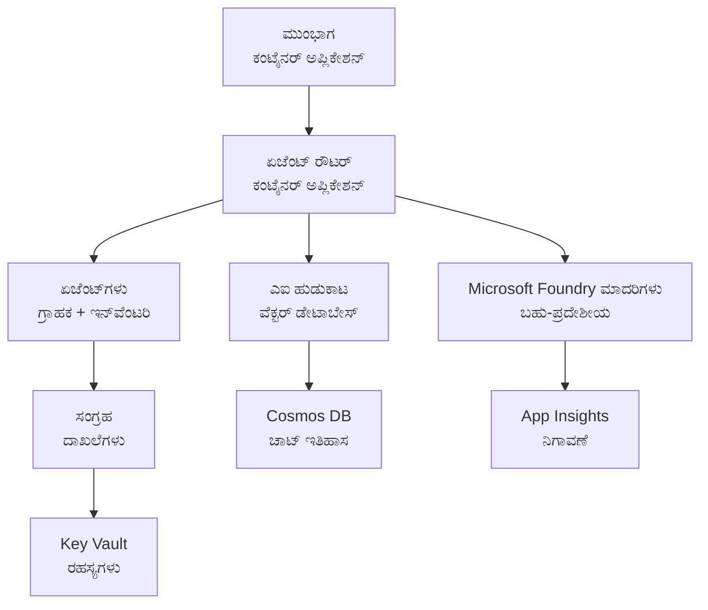

# ರಿಟೇಲ್ ಮಲ್ಟಿ-ಏಜೆಂಟ್ ಪರಿಹಾರ - ಇನ್‌ಫ್ರಾಸ್ಟ್ರಕ್ಚರ್ ಟೆಂಪ್ಲೇಟು

**ಅಧ್ಯಾಯ 5: ಉತ್ಪಾದನಾ ನಿಯೋಜನೆ ಪ್ಯಾಕೇಜ್**
- **📚 ಕೋರ್ಸ್ ಹೋಮ್**: [ಆರಂಭಿಕರಿಗೆ AZD](../../README.md)
- **📖 ಸಂಬಂಧಿಸಿದ ಅಧ್ಯಾಯ**: [ಅಧ್ಯಾಯ 5: ಮಲ್ಟಿ-ಏಜೆಂಟ್ AI ಪರಿಹಾರಗಳು](../../README.md#-chapter-5-multi-agent-ai-solutions-advanced)
- **📝 ದೃಶ್ಯ ಸನ್ನಿವೇಶ ಮಾರ್ಗದರ್ಶಿ**: [ಸಂಪೂರ್ಣ ವಾಸ್ತುಶಿಲ್ಪ](../retail-scenario.md)
- **🎯 ತ್ವರಿತ ನಿಯೋಜನೆ**: [ಒಂದು ಕ್ಲಿಕ್‌ನಲ್ಲಿ ನಿಯೋಜನೆ](#-quick-deployment)

> **⚠️ ಕೇವಲ ಇನ್‌ಫ್ರಾಸ್ಟ್ರಕ್ಚರ್ ಟೆಂಪ್ಲೇಟು**  
> ಈ ARM ಟೆಂಪ್ಲೇಟು ಮಲ್ಟಿ-ಏಜೆಂಟ್ ವ್ಯವಸ್ಥೆಯಿಗಾಗಿ **Azure ಸಂಪನ್ಮೂಲಗಳನ್ನು** ನಿಯೋಜಿಸುತ್ತದೆ.  
>  
> **ಏನು ನಿಯೋಜಿಸಲಾಗುತ್ತದೆ (15-25 ನಿಮಿಷಗಳು):**
> - ✅ Microsoft Foundry ಮಾದರಿಗಳು (gpt-4.1, gpt-4.1-mini, 3 ಪ್ರದೇಶಗಳಲ್ಲಿ ಎಂಬೆಡ್ಡಿಂಗ್ಸ್)
> - ✅ AI Search ಸೇವೆ (ಖಾಲಿ, ಸೂಚ್ಯಂಕ ರಚನೆಗೆ ಸಿದ್ದ)
> - ✅ ಕಂಟೈನರ್ ಅಪ್ಸ್ (placeholder ಚಿತ್ರಗಳು, ನಿಮ್ಮ ಕೋಡ್‌ಗೆ ಸಿದ್ದ)
> - ✅ ಸ್ಟೋರೆಜ್, Cosmos DB, Key Vault, Application Insights
>  
> **ಏನು ಒಳಗೊಂಡಿಲ್ಲ (ವಿಕಸನ ಅಗತ್ಯವಿದೆ):**
> - ❌ ಏಜೆಂಟ್ ಅನುಷ್ಠಾನ ಕೋಡ್ (Customer Agent, Inventory Agent)
> - ❌ ರೌಟಿಂಗ್ ಲಾಜಿಕ್ಸ್ ಮತ್ತು API ಎಂಡ್ಪಾಯಿಂಟ್‌ಗಳು
> - ❌ ಫ್ರಂಟೆಂಡ್ ಚಾಟ್ UI
> - ❌ ಸರ್ಚ್ ಸೂಚ್ಯಂಕ ಸ್ಕೀಮಾ ಮತ್ತು ಡೇಟಾ ಪೈಪ್ಲೈನ್ಗಳು
> - ❌ **ಅಂದಾಜು ಅಭಿವೃದ್ಧಿ ಪ್ರಯತ್ನ: 80-120 ಗಂಟೆಗಳು**
>  
> **ಈ ಟೆಂಪ್ಲೇಟನ್ನು ಬಳಸಿ ಅಂದರೆ:**
> - ✅ ನೀವು ಮಲ್ಟಿ-ಏಜೆಂಟ್ ಪ್ರಾಜೆಕ್ಟ್‌ಗೆ Azure ಮೂಲಸೌಕರ್ಯವನ್ನು ಪ್ರೊವನಿಷನ್ ಮಾಡಬೇಕಿದೆ
> - ✅ ನೀವು ಏಜೆಂಟ್ ಅನುಷ್ಠಾನವನ್ನು ಬೇರೆಡೆ ಅಭಿವೃದ್ಧಿ ಮಾಡಲೀಕ್ಷಿಸುತ್ತೀರಿ
> - ✅ ನಿಮಗೆ ಉತ್ಪಾದನಾ-ಸಿದ್ಧ ಮೂಲಸೌಕರ್ಯದ ಬ್ಯಾಸ್ಲೈನ್ ಬೇಕಿದೆ
>  
> **ಬಳಸಬೇಡಿ ಅಂದರೆ:**
> - ❌ ನೀವು ತಕ್ಷಣ ಕಾರ್ಯನಿರ್ವಹಣಾ ಮಲ್ಟಿ-ಏಜೆಂಟ್ ಡೆಮೋ ನಿರೀಕ್ಷಿಸುತ್ತೀರಿ
> - ❌ ನೀವು ಸಂಪೂರ್ಣ ಅಪ್ಲಿಕೇಶನ್ ಕೋಡ್ ಉದಾಹರಣೆಗಳನ್ನು ಹುಡುಕುತ್ತಿರುವಿರಾ

## ಅವಲೋಕನ

ಈ ಡೈರೆಕ್ಟರಿ ಮಲ್ಟಿ-ಏಜೆಂಟ್ ಗ್ರಾಹಕ ಬೆಂಬಲ ವ್ಯವಸ್ಥೆಯ ನಿವ್ವಳ ಇನ್‌ಫ್ರಾಸ್ಟ್ರಕ್ಚರ್‌ನಿಗಾಗಿ ಒಂದು ಸಂಪೂರ್ಣ Azure Resource Manager (ARM) ಟೆಂಪ್ಲೇಟನ್ನು ಒಳಗೊಂಡಿದೆ. ಟೆಂಪ್ಲೇಟು ಎಲ್ಲಾ ಅಗತ್ಯ Azure ಸೇವೆಗಳು ಸರಿಯಾಗಿ ಸಂರಚಿತವಾಗೀತು ಮತ್ತು ಪರಸ್ಪರ ಸಂಪರ್ಕ ಹೊಂದಿರುವಂತೆ ಪ್ರೊವೈಸ್ ಮಾಡುತ್ತದೆ, ನಿಮ್ಮ ಅಪ್ಲಿಕೇಶನ್ ಅಭಿವೃದ್ಧಿಗಾಗಿ ಸಿದ್ಧವಾಗಿದೆ.

**ನಿಯೋಜನೆಯ ನಂತರ, ನಿಮಗೆ ಇರುತ್ತದೆ:** ಉತ್ಪಾದನಾ-ಸಿದ್ಧ Azure ಮೂಲಸೌಕರ್ಯ  
**ಸಿಸ್ಟಂ ಅನ್ನು ಪೂರ್ಣಗೊಳಿಸಲು ಅಗತ್ಯವಿದೆ:** ಏಜೆಂಟ್ ಕೋಡ್, ಫ್ರಂಟೆಂಡ್ UI, ಮತ್ತು ಡೇಟಾ ಸಂರಚನೆ (ತಾಜಾ ಮಾಹಿತಿ కోసం ನೋಡಿ [ವಾಸ್ತುಶಿಲ್ಪ ಮಾರ್ಗದರ್ಶಿ](../retail-scenario.md))

## 🎯 ಏನು ನಿಯೋಜಿಸಲಾಗುತ್ತದೆ

### ಕೋರ್ ಇನ್‌ಫ್ರಾಸ್ಟ್ರಕ್ಚರ್ (ನಿಯೋಜನೆಯ ನಂತರ ಸ್ಥಿತಿ)

✅ **Microsoft Foundry ಮಾದರಿಗಳು** (API ಕರೆಗಳಿಗೆ ಸಿದ್ಧ)
  - ಪ್ರಾಥಮಿಕ ಪ್ರದೇಶ: gpt-4.1 ನಿಯೋಜನೆ (20K TPM ಸಾಮರ್ಥ್ಯ)
  - ದ್ವಿತೀಯ ಪ್ರದೇಶ: gpt-4.1-mini ನಿಯೋಜನೆ (10K TPM ಸಾಮರ್ಥ್ಯ)
  - ತೃತೀಯ ಪ್ರದೇಶ: ಪಠ್ಯ ಎಂಬೆಡ್ಡಿಂಗ್ ಮಾದರಿ (30K TPM ಸಾಮರ್ಥ್ಯ)
  - ಮೌಲ್ಯಮಾಪನ ಪ್ರದೇಶ: gpt-4.1 ಗ್ರೇಡರ್ ಮಾದರಿ (15K TPM ಸಾಮರ್ಥ್ಯ)
  - **ಸ್ಥಿತಿ:** ಸಂಪೂರ್ಣ ಕಾರ್ಯನಿರ್ವಹಣಾ - ತಕ್ಷಣ API ಕರೆಗಳನ್ನು ಮಾಡಬಹುದು

✅ **Azure AI Search** (ಖಾಲಿ - ಸಂರಚನೆಗೆ ಸಿದ್ಧ)
  - ವೆಕ್ಟರ್ ಶೋಧ ಸಾಮರ್ಥ್ಯ ಸಕ್ರಿಯವಾಗಿದೆ
  - ಸ್ಟ್ಯಾಂಡರ್ಡ್ ಟಿಯರ್‌ ಒಂದೇ Partiion, ಒಂದೇ ರೆಪ್ಲಿಕಾ
  - **ಸ್ಥಿತಿ:** ಸೇವೆ ಚಾಲನೆಯಲ್ಲಿ ಇದೆ, ಆದರೆ ಸೂಚ್ಯಂಕ ರಚನೆ ಅಗತ್ಯವಿದೆ
  - **ಕೈಗೈತೆ:** ನಿಮ್ಮ ಸ್ಕೀಮಾ ಸಹಿತ ಶೋಧ ಸೂಚ್ಯಂಕವನ್ನು ರಚಿಸಿ

✅ **Azure Storage Account** (ಖಾಲಿ - ಅಪ್ಲೋಡ್‌ಗೆ ಸಿದ್ಧ)
  - ಬ್ಲಾಬ್ ಕಂಟೈನರ್‌ಗಳು: `documents`, `uploads`
  - ಸುರಕ್ಷಿತ ಕಾನ್ಫಿಗರೇಶನ್ (HTTPS-ಮಾತ್ರ, ಸಾರ್ವಜನಿಕ ಪ್ರವೇಶವಿಲ್ಲ)
  - **ಸ್ಥಿತಿ:** ಫೈಲ್‌ಗಳನ್ನು ಸ್ವೀಕರಿಸಲು ಸಿದ್ದವಾಗಿದೆ
  - **ಕೈಗೈತೆ:** ನಿಮ್ಮ ಉತ್ಪನ್ನ ಡೇಟಾ ಮತ್ತು ದಸ್ತಾವೇಜುಗಳನ್ನು ಅಪ್ಲೋಡ್ ಮಾಡಿ

⚠️ **Container Apps ಪರಿಸರ** (placeholder ಚಿತ್ರಗಳು ನಿಯೋಜಿಸಲಾಗಿದೆ)
  - ಏಜೆಂಟ್ ರೌಟರ್ ಅಪ್ (nginx ಡೀಫಾಲ್ಟ್ ಚಿತ್ರ)
  - ಫ್ರಂಟೆಂಡ್ ಅಪ್ (nginx ಡೀಫಾಲ್ಟ್ ಚಿತ್ರ)
  - ಆಟೋ-ಸ್ಕೇಲಿಂಗ್ ಕಾನ್ಫಿಗರ್ ಆಗಿದೆ (0-10 ಇನ್ಸ್‌ಟಾನ್ಸ್)
  - **ಸ್ಥಿತಿ:** placeholder ಕಂಟೈನರ್‌ಗಳು ಚಾಲನೆಯಲ್ಲಿ ಇವೆ
  - **ಕೈಗೈತೆ:** ನಿಮ್ಮ ಏಜೆಂಟ್ ಅಪ್ಲಿಕೇಶನ್‌ಗಳನ್ನು ನಿರ್ಮಿಸಿ ಮತ್ತು ನಿಯೋಜಿಸಿ

✅ **Azure Cosmos DB** (ಖಾಲಿ - ಡೇಟಾಗೆ ಸಿದ್ದ)
  - ಡೇಟಾಬೇಸ್ ಮತ್ತು ಕಂಟೈನರ್ ಪೂರ್ವ-ಕಾನ್ಫಿಗರ್ ಆಗಿವೆ
  - ಕಡಿಮೆ ವಿಳಂಬ ಕಾರ್ಯಾಚರಣೆಗೆ tốiಮೂಲ optimizations
  - TTL ಸಕ್ರಿಯವಾಗಿದೆ ಸ್ವಯಂಚಾಲಿತ ಕ್ಲೀನಪ್‌ಗಾಗಿ
  - **ಸ್ಥಿತಿ:** ಚಾಟ್ ಹಿಸ್ಟರಿ ಸಂಗ್ರಹಿಸಲು ಸಿದ್ದ

✅ **Azure Key Vault** (ಐಚ್ಛಿಕ - ರಹಸ್ಯಗಳಿಗಾಗಿ ಸಿದ್ದ)
  - ಸಾಫ್ಟ್ ಡಿಲೀಟ್ ಸಕ್ರಿಯವಾಗಿದೆ
  - ನಿರ್ವಹಿತ ಐಡೆಂಟಿಟಿಗಳಿಗಾಗಿ RBAC ಕಾನ್ಫಿಗರ್ ಮಾಡಲಾಗಿದೆ
  - **ಸ್ಥಿತಿ:** API ಕೀಯ್‌ಗಳು ಮತ್ತು ಕನೆಕ್ಷನ್ ಸ್ಟ್ರಿಂಗ್‌ಗಳನ್ನು ಸಂಗ್ರಹಿಸಲು ಸಿದ್ಧ

✅ **Application Insights** (ಐಚ್ಛಿಕ - ಮಾನಿಟರಿಂಗ್ ಸಕ್ರಿಯ)
  - Log Analytics ವರ್ಕ್‌ಸ್ಪೇಸ್‌ಗೆ ಸಂಪರ್ಕ ಹೊಂದಿದೆ
  - ಕಸ್ಟಮ್ ಮೆಟ್ರಿಕ್ಸ್ ಮತ್ತು அலರ್ಟ್‌ಗಳು ಕಾನ್ಫಿಗರ್ ಆಗಿವೆ
  - **ಸ್ಥಿತಿ:** ನಿಮ್ಮ ಅಪ್ಲಿಕೇಶನ್‌ಗಳಿಂದ ಟೆಲಿಮೆಟ್ರಿ ಸ್ವೀಕರಿಸಲು ಸಿದ್ದ

✅ **Document Intelligence** (API ಕರೆಗಳಿಗೆ ಸಿದ್ಧ)
  - ಉತ್ಪಾದನಾ ಕಾರ್ಯಭಾರಗಳಿಗೆ S0 ಟಿಯರ್
  - **ಸ್ಥಿತಿ:** ಅಪ್ಲೋಡ್ ಮಾಡಿದ ದಸ್ತಾವೇಜುಗಳನ್ನು ಪ್ರಕ್ರಿಯೆಗೆ ಸಿದ್ಧ

✅ **Bing Search API** (API ಕರೆಗಳಿಗೆ ಸಿದ್ಧ)
  - ರಿಯಲ್-ಟೈಮ್ ಶೋಧಗಳಿಗೆ S1 ಟಿಯರ್
  - **ಸ್ಥಿತಿ:** ವೆಬ್ ಶೋಧ ಪ್ರಶ್ನೆಗಳಿಗೆ ಸಿದ್ಧ

### ನಿಯೋಜನೆ ಮೋಡ್‌ಗಳು

| ಮೋಡ್ | OpenAI ಸಾಮರ್ಥ್ಯ | ಕಂಟೈನರ್ ಇನ್ಸ್ಟಾನ್ಸುಗಳು | ಹುಡುಕಾಟ ಟಿಯರ್ | ಸ್ಟೋರೆಜ್ ರೆಡಂಡನ್ಸಿ | ಉಚಿತವಾಗಿ ಸೂಕ್ತವಾಗಿದೆ |
|------|-----------------|---------------------|-------------|-------------------|----------|
| **ಕನಿಷ್ಠ** | 10K-20K TPM | 0-2 ರೆಪ್ಲಿಕೆಗಳು | Basic | LRS (Local) | Dev/test, ಕಲಿಕೆ, ತತ್ವದೃಷ್ಟಾಂತ |
| **ಮಾನಕ** | 30K-60K TPM | 2-5 ರೆಪ್ಲಿಕೆಗಳು | Standard | ZRS (Zone) | ಉತ್ಪಾದನೆ, ಮಧ್ಯಮ ಟ್ರಾಫಿಕ್ (<10K ಬಳಕೆದಾರರು) |
| **ಪ್ರೀಮಿಯಂ** | 80K-150K TPM | 5-10 ರೆಪ್ಲಿಕೆಗಳು, ಜೋನ್-ರೆಡಂಡೆಂಟ್ | Premium | GRS (Geo) | ಎಂಟರ್‌ಪ್ರೈಸ್, ಹೆಚ್ಚು ಟ್ರಾಫಿಕ್ (>10K ಬಳಕೆದಾರರು), 99.99% SLA |

**ವೆಚ್ಚದ ಪ್ರಭಾವ:**
- **ಕನಿಷ್ಠ → ಮಾನಕ:** ~4x ವೆಚ್ಚ ಹೆಚ್ಚಳ ($100-370/mo → $420-1,450/mo)
- **ಮಾನಕ → ಪ್ರೀಮಿಯಂ:** ~3x ವೆಚ್ಚ ಹೆಚ್ಚಳ ($420-1,450/mo → $1,150-3,500/mo)
- **ಆಧಾರಿಸಿ ಆಯ್ಕೆಮಾಡಿ:** ನಿರೀಕ್ಷಿತ ಲೋಡ್, SLA ಅಗತ್ಯಗಳು, ಬಜೆಟ್ ನಿರ್ಬಂಧಗಳು

**ಸಾಮರ್ಥ್ಯ ಯೋಜನೆ:**
- **TPM (Tokens Per Minute):** ಎಲ್ಲಾ ಮಾದರಿ ನಿಯೋಜನೆಗಳ ಒಟ್ಟು
- **ಕಂಟೈನರ್ ಇನ್ಸ್ಟಾನ್ಸ್‌ಗಳು:** ಆಟೋ-ಸ್ಕೇಲಿಂಗ್ ವ್ಯಾಪ್ತಿ (ನ್ಯೂನದಲ್ಲಿಂದ ಗರಿಷ್ಠ ರೆಪ್ಲಿಕೆಗಳು)
- **ಶೋಧ ಟಿಯರ್:** ಪ್ರಶ್ನಾ ಕಾರ್ಯಕ್ಷಮತೆ ಮತ್ತು ಸೂಚ್ಯಂಕ ಗಾತ್ರದ ಮಿತಿಗಳಿಗೆ ಪ್ರಭಾವಿಸುತ್ತದೆ

## 📋 ಪೂರ್ವಶರತ್ತುಗಳು

### ಅಗತ್ಯ ಸಾಧನಗಳು
1. **Azure CLI** (ಆವೃತ್ತಿ 2.50.0 ಅಥವಾ ಮೇಲ್ಪಟ್ಟ)
   ```bash
   az --version  # ಆವೃತ್ತಿಯನ್ನು ಪರಿಶೀಲಿಸಿ
   az login      # ಪ್ರಮಾಣೀಕರಿಸಿ
   ```

2. **ಸಕ್ರಿಯ Azure ಸಬ್ಸ್ಕ್ರಿಪ್ಶನ್** (Owner ಅಥವಾ Contributor ಪ್ರವೇಸಿದೆ)
   ```bash
   az account show  # ಚಂದಾದಾರಿಕೆಯನ್ನು ಪರಿಶೀಲಿಸಿ
   ```

### ಅಗತ್ಯ Azure ಕೋಟಾ

ನಿಯೋಜನೆಯ ಮೊದಲು, ಗುರಿ ಪ್ರದೇಶಗಳಲ್ಲಿ ಸಾಕಷ್ಟು ಕೋಟಾಗಳು உள்ளದನ್ನು ಪರಿಶೀಲಿಸಿ:

```bash
# ನಿಮ್ಮ ಪ್ರದೇಶದಲ್ಲಿ Microsoft Foundry ಮಾದರಿಗಳ ಲಭ್ಯತೆಯನ್ನು ಪರಿಶೀಲಿಸಿ
az cognitiveservices account list-skus \
  --kind OpenAI \
  --location eastus2

# OpenAI ಕ್ವೋಟಾವನ್ನು ಪರಿಶೀಲಿಸಿ (gpt-4.1 ಉದಾಹರಣೆಗೆ)
az cognitiveservices usage list \
  --location eastus2 \
  --query "[?name.value=='OpenAI.Standard.gpt-4.1']"

# Container Apps ಕ್ವೋಟಾವನ್ನು ಪರಿಶೀಲಿಸಿ
az provider show \
  --namespace Microsoft.App \
  --query "resourceTypes[?resourceType=='managedEnvironments'].locations"
```

**ಕನಿಷ್ಟ ಅಗತ್ಯ ಕೋಟಾ:**
- **Microsoft Foundry Models:** 3-4 ಮಾದರಿ ನಿಯೋಜನೆಗಳು ವಿವಿಧ ಪ್ರದೇಶಗಳಲ್ಲಿ
  - gpt-4.1: 20K TPM (Tokens Per Minute)
  - gpt-4.1-mini: 10K TPM
  - text-embedding-ada-002: 30K TPM
  - **ಗಮನಿಸಿ:** gpt-4.1 ಕೆಲವು ಪ್ರದೇಶಗಳಲ್ಲಿ ವೇಟ್‌ಲಿಸ್ಟ್‌ನಲ್ಲಿ ಇರಬಹುದು - ಪರಿಶೀಲಿಸಿ [ಮಾದರಿ ಲಭ್ಯತೆ](https://learn.microsoft.com/azure/ai-services/openai/concepts/models)
- **Container Apps:** ನಿರ್ವಹಿತ ಪರಿಸರ + 2-10 ಕಂಟೈನರ್ ಇನ್ಸ್ಟಾನ್ಸ್
- **AI Search:** ಸ್ಟ್ಯಾಂಡರ್ಡ್ ಟಿಯರ್ (ವೆಕ್ಟರ್ ಶೋಧಕ್ಕೆ Basic ಸಾಕಾಗುವುದಿಲ್ಲ)
- **Cosmos DB:** ಸ್ಟ್ಯಾಂಡರ್ಡ್ ಪ್ರೊವಿಶನ್ಡ್ throughput

**ಕೋಟಾ ಅಪರ്യാപ್ತವಾದರೆ:**
1. Azure ಪೋರ್ಟಲ್‌ಗೆ ಹೋಗಿ → Quotas → Request increase
2. ಅಥವಾ Azure CLI ಬಳಸಿ:
   ```bash
   az support tickets create \
     --ticket-name "OpenAI-Quota-Increase" \
     --severity "minimal" \
     --description "Request quota increase for Microsoft Foundry Models gpt-4.1 in eastus2"
   ```
3. ಲಭ್ಯತೆಯೊಂದಿಗೆ ಬದಲಿ ಪ್ರದೇಶಗಳನ್ನು ಪರಿಗಣಿಸಿ

## 🚀 ತ್ವರಿತ ನಿಯೋಜನೆ

### ಆಯ್ಕೆ 1: Azure CLI ಬಳಸಿ

```bash
# ಟೆಂಪ್ಲೇಟ್ ಕಡತಗಳನ್ನು ಕ್ಲೋನ್ ಅಥವಾ ಡೌನ್‌ಲೋಡ್ ಮಾಡಿ
git clone <repository-url>
cd examples/retail-multiagent-arm-template

# ಡಿಪ್ಲಾಯ್‌ಮೆಂಟ್ ಸ್ಕ್ರಿಪ್ಟ್ ಅನ್ನು ಕಾರ್ಯಗತಗೊಳಿಸಿ
chmod +x deploy.sh

# ಡೀಫಾಲ್ಟ್ ಸೆಟ್ಟಿಂಗ್ಸ್ ಬಳಸಿ ನಿಯೋಜಿಸಿ
./deploy.sh -g myResourceGroup

# ಉತ್ಪಾದನಾ ಉದ್ದೇಶಕ್ಕಾಗಿ ಪ್ರೀಮಿಯಂ ವೈಶಿಷ್ಟ್ಯಗಳೊಂದಿಗೆ ನಿಯೋಜಿಸಿ
./deploy.sh -g myProdRG -e prod -m premium -l eastus2
```

### ಆಯ್ಕೆ 2: Azure ಪೋರ್ಟಲ್ ಬಳಸಿ

[](https://portal.azure.com/#create/Microsoft.Template/uri/https%3A%2F%2Fraw.githubusercontent.com%2Fmicrosoft%2Fazd-for-beginners%2Fmain%2Fexamples%2Fretail-multiagent-arm-template%2Fazuredeploy.json)

### ಆಯ್ಕೆ 3: ನೇರವಾಗಿ Azure CLI ಬಳಸು

```bash
# ಸಂಪನ್ಮೂಲ ಗುಂಪನ್ನು ರಚಿಸಿ
az group create --name myResourceGroup --location eastus2

# ಟೆಂಪ್ಲೇಟನ್ನು ನಿಯೋಜಿಸಿ
az deployment group create \
  --resource-group myResourceGroup \
  --template-file azuredeploy.json \
  --parameters azuredeploy.parameters.json
```

## ⏱️ ನಿಯೋಜನೆ ಸಮಯರೇಖೆ

### ನೀವು 무엇을 ನಿರೀಕ್ಷಿಸಬಹುದು

| ಹಂತ | ಅವಧಿ | ಏನು ನಡೆಯುತ್ತದೆ |
|-------|----------|--------------||
| **ಟೆಂಪ್ಲೇಟ್ ಪರಿಶೀಲನೆ** | 30-60 seconds | Azure ಟೆಂಪ್ಲೇಟು ಸಿಂಟ್ಯಾಕ್ಸ್ ಮತ್ತು ಪ್ಯಾರಾಮೀಟರ್‌ಗಳನ್ನು ಪರಿಶೀಲಿಸುತ್ತದೆ |
| **ರಿಸೋರ್ಸ್ ಗ್ರೂಪ್ ಸೆಟ್‌ಅಪ್** | 10-20 seconds | ರಿಸೋರ್ಸ್ ಗ್ರೂಪ್ ರಚನೆ (ಆವಶ್ಯಕರೆಂದರೆ) |
| **OpenAI ಪ್ರೊವಿಷನಿಂಗ್** | 5-8 minutes | 3-4 OpenAI ಖಾತೆಗಳನ್ನು ರಚಿಸಿ ಮತ್ತು ಮಾದರಿಗಳನ್ನು ನಿಯೋಜಿಸುತ್ತದೆ |
| **ಕಂಟೈನರ್ ಅಪ್ಸ್** | 3-5 minutes | ಪರಿಸರ ರಚಿಸಿ ಮತ್ತು placeholder ಕಂಟೈನರ್‌ಗಳನ್ನು ನಿಯೋಜಿಸುತ್ತದೆ |
| **ಶೋಧ & ಸ್ಟೋರೆಜ್** | 2-4 minutes | AI Search ಸೇವೆ ಮತ್ತು ಸ್ಟೋರೆಜ್ ಖಾತೆಗಳನ್ನು ಪ್ರೊವಿಷನ್ ಮಾಡುತ್ತದೆ |
| **Cosmos DB** | 2-3 minutes | ಡೇಟಾಬೇಸ್ ರಚಿಸಿ ಮತ್ತು ಕಂಟೈನರ್‌ಗಳನ್ನು ಕಾನ್ಫಿಗರ್ ಮಾಡುತ್ತದೆ |
| **ಮಾನದಂಡನ ವ್ಯವಸ್ಥೆ** | 2-3 minutes | Application Insights ಮತ್ತು Log Analytics ಅನ್ನು ಸೆಟ್ ಅಪ್ ಮಾಡುತ್ತದೆ |
| **RBAC ಕಾನ್ಫಿಗರೇಶನ್** | 1-2 minutes | ನಿರ್ವಹಿತ ಐಡೆಂಟಿಟಿಗಳು ಮತ್ತು ಅನುಮತಿಗಳನ್ನು ಕಾನ್ಫಿಗರ್ ಮಾಡುತ್ತದೆ |
| **ಒಟ್ಟು ನಿಯೋಜನೆ** | **15-25 minutes** | ಸಂಪೂರ್ಣ ಮೂಲಸೌಕರ್ಯ ಸಿದ್ಧವಾಗಿದೆ |

**ನಿಯೋಜನೆಯ ನಂತರ:**
- ✅ **ಮೂಲಸೌಕರ್ಯ ಸಿದ್ಧ:** ಎಲ್ಲಾ Azure ಸೇವೆಗಳು ಪ್ರೊವಿಷನ್ ಆಗಿ ಚಲ್ಲಿಸುತ್ತಿವೆ
- ⏱️ **ಅಪ್ಲಿಕೇಶನ್ ಅಭಿವೃದ್ಧಿ:** 80-120 ಗಂಟೆಗಳು (ನಿಮ್ಮ ಜವಾಬ್ದಾರಿ)
- ⏱️ **ಸೂಚ್ಯಂಕ ಸಂರಚನೆ:** 15-30 ನಿಮಿಷಗಳು (ನಿಮ್ಮ ಸ್ಕೀಮಾ ಅಗತ್ಯ)
- ⏱️ **ಡೇಟಾ ಅಪ್ಲೋಡ್:** ಡೇಟಾಸೆಟ್ ಗಾತ್ರದ ಮೇಲೆ ಅವಲಂಬಿಸುತ್ತದೆ
- ⏱️ **ಟೆಸ್ಟಿಂಗ್ & ಮಾನ್ಯತೆ:** 2-4 ಗಂಟೆಗಳು

---

## ✅ ನಿಯೋಜನೆ ಯಶಸ್ಸು ಪರಿಶೀಲಿಸಿ

### ಹಂತ 1: ರಿಸೋರ್ಸ್ ಪ್ರೊವಿಷನಿಂಗ್ ಪರಿಶೀಲಿಸಿ (2 ನಿಮಿಷ)

```bash
# ಎಲ್ಲಾ ಸಂಪನ್ಮೂಲಗಳು ಯಶಸ್ವಿಯಾಗಿ ನಿಯೋಜಿಸಲ್ಪಟ್ಟಿರುವುದನ್ನು ಪರಿಶೀಲಿಸಿ
az resource list \
  --resource-group myResourceGroup \
  --query "[?provisioningState!='Succeeded'].{Name:name, Status:provisioningState, Type:type}" \
  --output table
```

**ನಿರೀಕ್ಷಿಸಲಾಗಿದೆ:** ಖಾಲಿ ಟೇಬಲ್ (ಎಲ್ಲಾ ರಿಸೋರ್ಸ್‌ಗಳು "Succeeded" ಸ್ಥಿತಿಯನ್ನು ತೋರಿಸುತ್ತವೆ)

### ಹಂತ 2: Microsoft Foundry ಮಾದರಿ ನಿಯೋಜನೆಗಳನ್ನು ಪರಿಶೀಲಿಸಿ (3 ನಿಮಿಷ)

```bash
# ಎಲ್ಲಾ OpenAI ಖಾತೆಗಳನ್ನು ಪಟ್ಟಿ ಮಾಡಿ
az cognitiveservices account list \
  --resource-group myResourceGroup \
  --query "[?kind=='OpenAI'].{Name:name, Location:location, Status:properties.provisioningState}" \
  --output table

# ಪ್ರಾಥಮಿಕ ಪ್ರಾಂತ್ಯಕ್ಕಾಗಿ ಮಾದರಿ ನಿಯೋಜನೆಗಳನ್ನು ಪರಿಶೀಲಿಸಿ
OPENAI_NAME=$(az cognitiveservices account list \
  --resource-group myResourceGroup \
  --query "[?kind=='OpenAI'] | [0].name" -o tsv)

az cognitiveservices account deployment list \
  --name $OPENAI_NAME \
  --resource-group myResourceGroup \
  --output table
```

**ನಿರೀಕ್ಷಿಸಲಾಗಿದೆ:** 
- 3-4 OpenAI ಖಾತೆಗಳು (ಪ್ರಾಥಮಿಕ, ದ್ವಿತೀಯ, ತೃತೀಯ, ಮೌಲ್ಯಮಾಪನ ಪ್ರದೇಶಗಳು)
- ಪ್ರತಿ ಖಾತೆಗೆ 1-2 ಮಾದರಿ ನಿಯೋಜನೆಗಳು (gpt-4.1, gpt-4.1-mini, text-embedding-ada-002)

### ಹಂತ 3: ಇನ್‌ಫ್ರಾಸ್ಟ್ರಕ್ಚರ್ ಎಂಡ್‌ಪಾಯಿಂಟ್‌ಗಳು ಪರೀಕ್ಷಿಸಿ (5 ನಿಮಿಷ)

```bash
# ಕಂಟೇನರ್ ಅಪ್ಲಿಕೇಶನ್ URLಗಳನ್ನು ಪಡೆಯಿರಿ
az containerapp list \
  --resource-group myResourceGroup \
  --query "[].{Name:name, URL:properties.configuration.ingress.fqdn, Status:properties.runningStatus}" \
  --output table

# ರೌಟರ್ ಎಂಡ್‌ಪಾಯಿಂಟ್ ಅನ್ನು ಪರೀಕ್ಷಿಸಿ (ಸ್ಥಾನಾಪೂರಕ ಚಿತ್ರ ಪ್ರತಿಕ್ರಿಯೆ ನೀಡುತ್ತದೆ)
ROUTER_URL=$(az containerapp show \
  --name retail-router \
  --resource-group myResourceGroup \
  --query "properties.configuration.ingress.fqdn" -o tsv)

echo "Testing: https://$ROUTER_URL"
curl -I https://$ROUTER_URL || echo "Container running (placeholder image - expected)"
```

**ನಿರೀಕ್ಷಿಸಲಾಗಿದೆ:** 
- Container Apps "Running" ಸ್ಥಿತಿಯನ್ನು ತೋರಿಸುತ್ತವೆ
- Placeholder nginx HTTP 200 ಅಥವಾ 404 ಕ್ಕೆ ಪ್ರತಿಕ್ರಿಯಿಸುತ್ತದೆ (ಇನ್ನೂ ಅಪ್ಲಿಕೇಶನ್ ಕೋಡ್ ಇಲ್ಲ)

### ಹಂತ 4: Microsoft Foundry ಮಾದರಿಗಳ API ಪ್ರವೇಶ ಪರಿಶೀಲಿಸಿ (3 ನಿಮಿಷ)

```bash
# OpenAI ಎಂಡ್‌ಪಾಯಿಂಟ್ ಮತ್ತು ಕೀ ಪಡೆಯಿರಿ
OPENAI_ENDPOINT=$(az cognitiveservices account show \
  --name $OPENAI_NAME \
  --resource-group myResourceGroup \
  --query "properties.endpoint" -o tsv)

OPENAI_KEY=$(az cognitiveservices account keys list \
  --name $OPENAI_NAME \
  --resource-group myResourceGroup \
  --query "key1" -o tsv)

# gpt-4.1 ನಿಯೋಜನೆಯನ್ನು ಪರೀಕ್ಷಿಸಿ
curl "${OPENAI_ENDPOINT}openai/deployments/gpt-4.1/chat/completions?api-version=2024-08-01-preview" \
  -H "Content-Type: application/json" \
  -H "api-key: $OPENAI_KEY" \
  -d '{
    "messages": [{"role": "user", "content": "Say hello"}],
    "max_tokens": 10
  }'
```

**ನಿರೀಕ್ಷಿಸಲಾಗಿದೆ:** JSON ಪ್ರತಿಕ್ರಿಯೆ ಚಾಟ್ ಪೂರ್ಣತೆಯನ್ನು ಹೊಂದಿರಬೇಕು (OpenAI ಕಾರ್ಯನಿರ್ವಹಿಸುತ್ತಿದೆ ಎಂದು ದೃಢಪಡಿಸುತ್ತದೆ)

### ಏನು ಕೆಲಸ ಮಾಡುತ್ತಿದೆ ಮತ್ತು ಏನು ಕೆಲಸ ಮಾಡುತ್ತಿಲ್ಲ

**✅ ನಿಯೋಜನೆಯ ನಂತರ ಕಾರ್ಯನಿರ್ವಹಿಸುತ್ತಿದ್ದು:**
- Microsoft Foundry ಮಾದರಿಗಳು ನಿಯೋಜಿಸಲ್ಪಟ್ಟಿದ್ದು API ಕರೆಗಳನ್ನು ಸ್ವೀಕರಿಸುತ್ತಿವೆ
- AI Search ಸೇವೆ ಚಾಲನೆಯಲ್ಲಿ ಇದೆ (ಖಾಲಿ, ಇನ್ನೂ ಸೂಚ್ಯಂಕಗಳು ಇಲ್ಲ)
- Container Apps ಚಾಲನೆಯಲ್ಲಿ ಇವೆ (placeholder nginx ಚಿತ್ರಗಳು)
- ಸ್ಟೋರೆಜ್ ಖಾತೆಗಳಿಗೆ ಪ್ರವೇಶವಿದೆ ಮತ್ತು ಅಪ್ಲೋಡ್‌ಗೆ ಸಿದ್ಧವಾಗಿವೆ
- Cosmos DB ಡೇಟಾ ಕಾರ್ಯಾಚರಣೆಗಳಿಗೆ ಸಿದ್ಧವಾಗಿದೆ
- Application Insights ಮೂಲಸೌಕರ್ಯ ಟೆಲಿಮೆಟ್ರಿ ಸಂಗ್ರಹಿಸುತ್ತಿದೆ
- Key Vault ರಹಸ್ಯಗಳನ್ನು ಸಂಗ್ರಹಿಸಲು ಸಿದ್ಧವಾಗಿದೆ

**❌ ಇನ್ನೂ ಕಾರ್ಯನಿರ್ವಹಿಸುತ್ತಿಲ್ಲ (ವಿಕಸನ ಅಗತ್ಯ):**
- ಏಜೆಂಟ್ ಎಂಡ್ಪಾಯಿಂಟ್‌ಗಳು (ಅಪ್ಲಿಕೇಶನ್ ಕೋಡ್ ಅಳವಡಿಸಲಿಲ್ಲ)
- ಚಾಟ್ ಕಾರ್ಯಕ್ಷಮತೆ (ಫ್ರಂಟೆಂಡ್ + ಬ್ಯಾಕ್‌ಎಂಡ್ ಅನ್ವಯಿಕೆ ಅಗತ್ಯ)
- ಶೋಧ ಪ್ರಶ್ನೆಗಳು (ಇನ್ನೂ ಶೋಧ ಸೂಚ್ಯಂಕ ರಚಿಸಿಲ್ಲ)
- ಡಾಕ್ಯುಮೆಂಟ್ ಪ್ರೊಸೆಸಿಂಗ್ ಪೈಪ್‌ಲೈನ್ (ಡೇಟಾ ಅಪ್ಲೋಡ್ ಆಗಿಲ್ಲ)
- ಕಸ್ಟಮ್ ಟೆಲಿಮೆಟ್ರಿ (ಅಪ್ಲಿಕೇಶನ್ ಇನ್ಸ್ಟ್ರುಮೆಂಟೇಶನ್ ಅಗತ್ಯ)

**ಮುಂದಿನ ಹಂತಗಳು:** ನಿಮ್ಮ ಅಪ್ಲಿಕೇಶನ್ ಅನ್ನು ಅಭಿವೃದ್ಧಿ ಮಾಡಿ ಮತ್ತು ನಿಯೋಜಿಸಲು [ಪೋಸ್ಟ್-ನಿಯೋಜನೆ ಸಂರಚನೆ](#-post-deployment-next-steps) ಅನ್ನು ನೋಡಿ

---

## ⚙️ ಕಾನ್ಫಿಗರೇಶನ್ ಆಯ್ಕೆಗಳು

### ಟೆಂಪ್ಲೇಟ್ ಪ್ಯಾರಾಮೀಟರ್‌ಗಳು

| ಪ್ಯಾರಾಮೀಟರ್ | ಟೈಪ್ | ಡೀಫಾಲ್ಟ್ | ವಿವರಣೆ |
|-----------|------|---------|-------------|
| `projectName` | string | "retail" | ಎಲ್ಲಾ ರಿಸ್‌ೋರ್ಸ್ name‌ಗಳಿಗೂ ಪ್ರಿಫಿಕ್ಸ್ |
| `location` | string | Resource group location | ಪ್ರಾಥಮಿಕ ನಿಯೋಜನೆ ಪ್ರದೇಶ |
| `secondaryLocation` | string | "westus2" | ಮಲ್ಟಿ-ರೀಜಿಯನ್ ನಿಯೋಜನೆಗೆ ದ್ವಿತೀಯ ಪ್ರದೇಶ |
| `tertiaryLocation` | string | "francecentral" | ಎಂಬೆಡ್ಡಿಂಗ್ಸ್ ಮಾದರಿಗಾಗಿ ಪ್ರದೇಶ |
| `environmentName` | string | "dev" | ಪರಿಸರ ಸೂಚನೆ (dev/staging/prod) |
| `deploymentMode` | string | "standard" | ನಿಯೋಜನೆ ಸಂರಚನೆ (minimal/standard/premium) |
| `enableMultiRegion` | bool | true | ಮಲ್ಟಿ-ರೀಜಿಯನ್ ನಿಯೋಜನೆಯನ್ನು ಸಕ್ರಿಯಗೊಳಿಸಿ |
| `enableMonitoring` | bool | true | Application Insights ಮತ್ತು ಲಾಗಿಂಗ್ ಅನ್ನು ಸಕ್ರಿಯಗೊಳಿಸಿ |
| `enableSecurity` | bool | true | Key Vault ಮತ್ತು ಸುಧಾರಿತ ಭದ್ರತೆಯನ್ನು ಸಕ್ರಿಯಗೊಳಿಸಿ |

### ಪ್ಯಾರಾಮೀಟರ್‌ಗಳನ್ನು ಕಸ್ಟಮೈಸ್ ಮಾಡುವುದು

ಎಡಿಟ್ `azuredeploy.parameters.json`:

```json
{
  "$schema": "https://schema.management.azure.com/schemas/2019-04-01/deploymentParameters.json#",
  "contentVersion": "1.0.0.0",
  "parameters": {
    "projectName": {
      "value": "mycompany"
    },
    "environmentName": {
      "value": "prod"
    },
    "deploymentMode": {
      "value": "premium"
    },
    "location": {
      "value": "eastus2"
    }
  }
}
```

## 🏗️ ವಾಸ್ತುಶಿಲ್ಪ ಅವಲೋಕನ


## 📖 ನಿಯೋಜನೆ ಸ್ಕ್ರಿಪ್ಟ್ ಬಳಕೆ

`deploy.sh` ಸ್ಕ್ರಿಪ್ಟ್ ಪರಸ್ಪರ ಕ್ರಿಯಾಶೀಲ ನಿಯೋಜನೆ ಅನುಭವವನ್ನು ಒದಗಿಸುತ್ತದೆ:

```bash
# ಸಹಾಯ ತೋರಿಸಿ
./deploy.sh --help

# ಮೂಲಭೂತ ನಿಯೋಜನೆ
./deploy.sh -g myResourceGroup

# ಕಸ್ಟಮ್ ಸೆಟ್ಟಿಂಗ್‌ಗಳೊಂದಿಗೆ ಸುಧಾರಿತ ನಿಯೋಜನೆ
./deploy.sh \
  -g myProductionRG \
  -p companyname \
  -e prod \
  -m premium \
  -l eastus2

# ಬಹು-ಪ್ರಾಂತ್ಯವಿಲ್ಲದ ಅಭಿವೃದ್ಧಿ ನಿಯೋಜನೆ
./deploy.sh \
  -g myDevRG \
  -e dev \
  -m minimal \
  --no-multi-region \
  --no-security
```

### ಸ್ಕ್ರಿಪ್ಟ್ ವೈಶಿಷ್ಟ್ಯಗಳು

- ✅ **ಪೂರ್ವಶರತ್ತು ಪರಿಶೀಲನೆ** (Azure CLI, ಲಾಗಿನ್ ಸ್ಥಿತಿ, ಟೆಂಪ್ಲೇಟ್ ಫೈಲ್‌ಗಳು)
- ✅ **ರಿಸೋರ್ಸ್ ಗ್ರೂಪ್ ನಿರ್ವಹಣೆ** (ಇದು ಇಲ್ಲದಿದ್ದರೆ ರಚಿಸುತ್ತದೆ)
- ✅ ನಿಯೋಜನೆಯ ಮೊದಲು **ಟೆಂಪ್ಲೇಟ್ ಪರಿಶೀಲನೆ**
- ✅ ಬಣ್ಣದ ಔಟ್ಪುಟ್‌ನೊಂದಿಗೆ **ಪ್ರಗತಿ ಮಾನಿಟರಿಂಗ್**
- ✅ **ನಿಯೋಜನೆ ಔಟ್ಪುಟ್‌ಗಳು** ಪ್ರದರ್ಶನ
- ✅ **ನಿಯೋಜನೆಯ ನಂತರ ಮಾರ್ಗದರ್ಶನ**

## 📊 ನಿಯೋಜನೆ ಮಾನಿಟರಿಂಗ್

### ನಿಯೋಜನೆ ಸ್ಥಿತಿಯನ್ನು ಪರಿಶೀಲಿಸಿ

```bash
# ಡಿಪ್ಲಾಯ್‌ಮೆಂಟ್‌ಗಳನ್ನು ಪಟ್ಟಿ ಮಾಡಿ
az deployment group list --resource-group myResourceGroup --output table

# ಡಿಪ್ಲಾಯ್‌ಮೆಂಟ್ ವಿವರಗಳನ್ನು ಪಡೆಯಿ
az deployment group show \
  --resource-group myResourceGroup \
  --name retail-deployment-YYYYMMDD-HHMMSS

# ಡಿಪ್ಲಾಯ್‌ಮೆಂಟ್ ಪ್ರಗತಿಯನ್ನು ವೀಕ್ಷಿಸಿ
az deployment group create \
  --resource-group myResourceGroup \
  --template-file azuredeploy.json \
  --parameters azuredeploy.parameters.json \
  --verbose
```

### ನಿಯೋಜನೆ ಔಟ್ಪುಟ್‌ಗಳು

ಯಶಸ್ವಿ ನಿಯೋಜನೆಯ ನಂತರ, ಕೆಳಗಿನ ಔಟ್‌ಪುಟ್‌ಗಳು ಲಭ್ಯ:

- **Frontend URL**: ವೆಬ್ ಇಂಟರ್ಫೇಸ್‌ಗೆ ಸಾರ್ವಜನಿಕ ಎನ್‌ಡ್ಪಾಯಿಂಟ್
- **Router URL**: ಏಜೆಂಟ್ ರೌಟರ್‌ಗಾಗಿ API ಎಂಡ್‌ಪಾಯಿಂಟ್
- **OpenAI Endpoints**: ಪ್ರಾಥಮಿಕ ಮತ್ತು ದ್ವಿತೀಯ OpenAI ಸೇವೆ ಎಂಡ್‌ಪಾಯಿಂಟ್‌ಗಳು
- **Search Service**: Azure AI Search ಸೇವೆ ಎಂಡ್‌ಪಾಯಿಂಟ್
- **Storage Account**: ದಸ್ತಾವೇಜುಗಳಿಗಾಗಿ ಸ್ಟೋರೆಜ್ ಖಾತೆಯ ಹೆಸರು
- **Key Vault**: Key Vault ನ ಹೆಸರು (ಸಕ್ರಿಯಗಾದರೆ)
- **Application Insights**: ಮಾನಿಟರಿಂಗ್ ಸೇವೆಯ ಹೆಸರು (ಸಕ್ರಿಯಗಾದರೆ)

## 🔧 ಪೋಸ್ಟ್-ನಿಯೋಜನೆ: ಮುಂದಿನ ಹಂತಗಳು
> **📝 ಪ್ರಮುಖ:** ಸೌಕರ್ಯವನ್ನು ನಿಯೋಜಿಸಲಾಗಿದೆ, ಆದರೆ ನೀವು ಅಪ್ಲಿಕೇಶನ್ ಕೋಡ್ ಅನ್ನು ಅಭಿವೃದ್ಧಿಪಡಿಸಿ ನಿಯೋಜಿಸಬೇಕು.

### Phase 1: Develop Agent Applications (Your Responsibility)

The ARM template creates **ಖಾಲಿ Container Apps** with placeholder nginx images. You must:

**ಅಗತ್ಯ ಅಭಿವೃದ್ಧಿ:**
1. **ಏಜೆಂಟ್ ಅನುಷ್ಠಾನ** (30-40 hours)
   - ಗ್ರಾಹಕ ಸೇವಾ ಏಜೆಂಟ್ gpt-4.1 ಸಂಯೋಜನೆಯೊಂದಿಗೆ
   - ಇನ್ವೆಂಟರಿ ಏಜೆಂಟ್ gpt-4.1-mini ಸಂಯೋಜನೆಯೊಂದಿಗೆ
   - ಏಜೆಂಟ್ ರೌಟಿಂಗ್ ಲಾಜಿಕ್

2. **ಫ್ರಂಟ್‌ಎಂಡ್ ಅಭಿವೃದ್ಧಿ** (20-30 hours)
   - ಚಾಟ್ ಇಂಟರ್ಫೇಸ್ UI (React/Vue/Angular)
   - ಫೈಲ್ ಅಪ್ಲೋಡ್ ಕಾರ್ಯಕ್ಷಮತೆ
   - ಪ್ರತಿಕ್ರಿಯೆಯ ಪ್ರದರ್ಶನ ಮತ್ತು ಸ್ವರೂಪೀಕರಣ

3. **ಬ್ಯಾಕ್‌ಎಂಡ್ ಸೇವೆಗಳು** (12-16 hours)
   - FastAPI ಅಥವಾ Express ರೌಟರ್
   - ಪ್ರಾಮಾಣೀಕರಣ ಮಿಡ್ಲ್ವೇರ್
   - ಟೆಲಿಮೆಟ್ರಿ ಸಂಯೋಜನೆ

ವಿವರವಾದ ಅನುಷ್ಠಾನ ಮಾದರಿಗಳು ಮತ್ತು ಕೋಡ್ ಉದಾಹರಣೆಗಳಿಗಾಗಿ ನೋಡಿ: [Architecture Guide](../retail-scenario.md)

### Phase 2: Configure AI Search Index (15-30 minutes)

ನಿಮ್ಮ ಡೇಟಾ ಮಾದರಿಯನ್ನು ಹೊಂದುವಂತೆ ಒಂದು ಶೋಧ ಸೂಚ್ಯಂಕವನ್ನು ರಚಿಸಿ:

```bash
# ಸರ್ಚ್ ಸೇವೆಯ ವಿವರಗಳನ್ನು ಪಡೆಯಿರಿ
SEARCH_NAME=$(az search service list \
  --resource-group myResourceGroup \
  --query "[0].name" -o tsv)

SEARCH_KEY=$(az search admin-key show \
  --service-name $SEARCH_NAME \
  --resource-group myResourceGroup \
  --query "primaryKey" -o tsv)

# ನಿಮ್ಮ ಸ್ಕೀಮಾ ಬಳಸಿ ಇಂಡೆಕ್ಸ್ ರಚಿಸಿ (ಉದಾಹರಣೆ)
curl -X POST "https://${SEARCH_NAME}.search.windows.net/indexes?api-version=2023-11-01" \
  -H "Content-Type: application/json" \
  -H "api-key: ${SEARCH_KEY}" \
  -d '{
    "name": "products",
    "fields": [
      {"name": "id", "type": "Edm.String", "key": true},
      {"name": "title", "type": "Edm.String", "searchable": true},
      {"name": "content", "type": "Edm.String", "searchable": true},
      {"name": "category", "type": "Edm.String", "filterable": true},
      {"name": "content_vector", "type": "Collection(Edm.Single)", 
       "searchable": true, "dimensions": 1536, "vectorSearchProfile": "default"}
    ],
    "vectorSearch": {
      "algorithms": [{"name": "default", "kind": "hnsw"}],
      "profiles": [{"name": "default", "algorithm": "default"}]
    }
  }'
```

**ಸಂಪನ್ಮೂಲಗಳು:**
- [AI ಶೋಧ ಸೂಚ್ಯಂಕ ಸ್ಕೀಮಾ ವಿನ್ಯಾಸ](https://learn.microsoft.com/azure/search/search-what-is-an-index)
- [ವೆಕ್ಟರ್ ಶೋಧ ಸಂರಚನೆ](https://learn.microsoft.com/azure/search/vector-search-how-to-create-index)

### Phase 3: Upload Your Data (Time varies)

ನಿಮ್ಮ ಬಳಿ ಉತ್ಪನ್ನ ಡೇಟಾ ಮತ್ತು ದಾಖಲೆಗಳು ಇದ್ದಾಗ:

```bash
# ಸ್ಟೋರೇಜ್ ಖಾತೆ ವಿವರಗಳನ್ನು ಪಡೆಯಿರಿ
STORAGE_NAME=$(az storage account list \
  --resource-group myResourceGroup \
  --query "[0].name" -o tsv)

STORAGE_KEY=$(az storage account keys list \
  --account-name $STORAGE_NAME \
  --resource-group myResourceGroup \
  --query "[0].value" -o tsv)

# ನಿಮ್ಮ ದಾಖಲೆಗಳನ್ನು ಅಪ್ಲೋಡ್ ಮಾಡಿ
az storage blob upload-batch \
  --destination documents \
  --source /path/to/your/product/docs \
  --account-name $STORAGE_NAME \
  --account-key $STORAGE_KEY

# ಉದಾಹರಣೆ: ಒಂದೇ ಫೈಲ್ ಅಪ್ಲೋಡ್ ಮಾಡಿ
az storage blob upload \
  --container-name documents \
  --name "product-manual.pdf" \
  --file /path/to/product-manual.pdf \
  --account-name $STORAGE_NAME \
  --account-key $STORAGE_KEY
```

### Phase 4: Build and Deploy Your Applications (8-12 hours)

Once you've developed your agent code:

```bash
# 1. Azure Container Registry ರಚಿಸಿ (ಆವಶ್ಯಕವಾಗಿದ್ದರೆ)
az acr create \
  --name myregistry \
  --resource-group myResourceGroup \
  --sku Basic

# 2. ಏಜೆಂಟ್ ರೌಟರ್ ಇಮೇಜ್ ನಿರ್ಮಿಸಿ ಮತ್ತು ಪುಷ್ ಮಾಡಿ
docker build -t myregistry.azurecr.io/agent-router:v1 /path/to/your/router/code
az acr login --name myregistry
docker push myregistry.azurecr.io/agent-router:v1

# 3. ಫ್ರಂಟ್‌ಎಂಡ್ ಇಮೇಜ್ ನಿರ್ಮಿಸಿ ಮತ್ತು ಪುಷ್ ಮಾಡಿ
docker build -t myregistry.azurecr.io/frontend:v1 /path/to/your/frontend/code
docker push myregistry.azurecr.io/frontend:v1

# 4. ನಿಮ್ಮ ಇಮೇಜ್‌ಗಳೊಂದಿಗೆ Container Apps ಅನ್ನು ನವೀಕರಿಸಿ
az containerapp update \
  --name retail-router \
  --resource-group myResourceGroup \
  --image myregistry.azurecr.io/agent-router:v1

az containerapp update \
  --name retail-frontend \
  --resource-group myResourceGroup \
  --image myregistry.azurecr.io/frontend:v1

# 5. ಪರಿಸರ ಚರಗಳನ್ನು ಸಂರಚಿಸಿ
az containerapp update \
  --name retail-router \
  --resource-group myResourceGroup \
  --set-env-vars \
    OPENAI_ENDPOINT=secretref:openai-endpoint \
    OPENAI_KEY=secretref:openai-key \
    SEARCH_ENDPOINT=secretref:search-endpoint \
    SEARCH_KEY=secretref:search-key
```

### Phase 5: Test Your Application (2-4 hours)

```bash
# ನಿಮ್ಮ ಅಪ್ಲಿಕೇಶನ್ URL ಅನ್ನು ಪಡೆಯಿರಿ
ROUTER_URL=$(az containerapp show \
  --name retail-router \
  --resource-group myResourceGroup \
  --query "properties.configuration.ingress.fqdn" -o tsv)

# ಏಜೆಂಟ್ ಎಂಡ್‌ಪಾಯಿಂಟ್ ಅನ್ನು ಪರೀಕ್ಷಿಸಿ (ನಿಮ್ಮ ಕೋಡ್ ನಿಯೋಜಿಸಿದ ನಂತರ)
curl -X POST "https://${ROUTER_URL}/chat" \
  -H "Content-Type: application/json" \
  -d '{
    "message": "Hello, I need help with my order",
    "agent": "customer"
  }'

# ಅಪ್ಲಿಕೇಶನ್ ಲಾಗ್‌ಗಳನ್ನು ಪರಿಶೀಲಿಸಿ
az containerapp logs show \
  --name retail-router \
  --resource-group myResourceGroup \
  --follow
```

### Implementation Resources

**ಆರ್ಕಿಟೆಕ್ಚರ್ ಮತ್ತು ವಿನ್ಯಾಸ:**
- 📖 [Complete Architecture Guide](../retail-scenario.md) - ವಿವರವಾದ ಅನುಷ್ಠಾನ ಮಾದರಿಗಳು
- 📖 [Multi-Agent Design Patterns](https://learn.microsoft.com/azure/architecture/ai-ml/guide/multi-agent-systems)

**ಕೋಡ್ ಉದಾಹರಣೆಗಳು:**
- 🔗 [Microsoft Foundry Models Chat Sample](https://github.com/Azure-Samples/azure-search-openai-demo) - RAG ಮಾದರಿ
- 🔗 [Semantic Kernel](https://github.com/microsoft/semantic-kernel) - ಏಜೆಂಟ್ ಫ್ರೇಮ್ವರ್ಕ್ (C#)
- 🔗 [LangChain Azure](https://github.com/langchain-ai/langchain) - ಏಜೆಂಟ್ ಆರ್ಕೆಸ್ಟ್ರೇಷನ್ (Python)
- 🔗 [AutoGen](https://github.com/microsoft/autogen) - ಬಹು-ಏಜೆಂಟ್ ಸಂಭಾಷಣೆಗಳು

**ಅಂದಾಜು ಒಟ್ಟು ಪ್ರಯತ್ನ:**
- ಸೌಕರ್ಯ ನಿಯೋಜನೆ: 15-25 ನಿಮಿಷಗಳು (✅ Complete)
- ಅಪ್ಲಿಕೇಶನ್ ಅಭಿವೃದ್ಧಿ: 80-120 ಗಂಟೆಗಳು (🔨 Your work)
- ಪರೀಕ್ಷೆ ಮತ್ತು ಪರಿಷ್ಕರಣೆ: 15-25 ಗಂಟೆಗಳು (🔨 Your work)

## 🛠️ ಸಮಸ್ಯೆ ಪರಿಹಾರ

### ಸಾಮಾನ್ಯ ಸಮಸ್ಯೆಗಳು

#### 1. Microsoft Foundry Models Quota Exceeded

```bash
# ಪ್ರಸ್ತುತ ಕ್ವೋಟಾ ಬಳಕೆಯನ್ನು ಪರಿಶೀಲಿಸಿ
az cognitiveservices usage list --location eastus2

# ಕ್ವೋಟಾ ಹೆಚ್ಚಳವನ್ನು ವಿನಂತಿಸಿ
az support tickets create \
  --ticket-name "OpenAI-Quota-Increase" \
  --severity "minimal" \
  --description "Request quota increase for Microsoft Foundry Models in region X"
```

#### 2. Container Apps Deployment Failed

```bash
# ಕಂಟೈನರ್ ಅಪ್ಲಿಕೇಶನ್ ಲಾಗ್‌ಗಳನ್ನು ಪರಿಶೀಲಿಸಿ
az containerapp logs show \
  --name retail-router \
  --resource-group myResourceGroup \
  --follow

# ಕಂಟೈನರ್ ಅಪ್ಲಿಕೇಶನ್ ಅನ್ನು ಮರುಪ್ರಾರಂಭಿಸಿ
az containerapp revision restart \
  --name retail-router \
  --resource-group myResourceGroup
```

#### 3. Search Service Initialization

```bash
# ಶೋಧನಾ ಸೇವೆಯ ಸ್ಥಿತಿಯನ್ನು ಪರಿಶೀಲಿಸಿ
az search service show \
  --name <search-service-name> \
  --resource-group myResourceGroup

# ಶೋಧನಾ ಸೇವೆಯ ಸಂಪರ್ಕವನ್ನು ಪರೀಕ್ಷಿಸಿ
curl -X GET "https://<search-service-name>.search.windows.net/indexes?api-version=2023-11-01" \
  -H "api-key: <search-admin-key>"
```

### Deployment Validation

```bash
# ಎಲ್ಲಾ ಸಂಪನ್ಮೂಲಗಳು ರಚಿಸಲಾಗಿದೆ ಎಂದು ಮಾನ್ಯೀಕರಿಸಿ
az resource list \
  --resource-group myResourceGroup \
  --output table

# ಸಂಪನ್ಮೂಲಗಳ ಆರೋಗ್ಯವನ್ನು ಪರಿಶೀಲಿಸಿ
az resource list \
  --resource-group myResourceGroup \
  --query "[?provisioningState!='Succeeded'].{Name:name, Status:provisioningState, Type:type}" \
  --output table
```

## 🔐 ಭದ್ರತಾ ಪರಿಗಣನೆಗಳು

### ಕೀ ನಿರ್ವಹಣೆ
- ಎಲ್ಲಾ ರಹಸ್ಯಗಳು Azure Key Vault ನಲ್ಲಿ ಸಂಗ್ರಹಿಸಲಾಗುತ್ತವೆ (ಸಕ್ರಿಯಗೊಳಿಸಿದಾಗ)
- Container apps ದೃಢೀಕರಣಕ್ಕಾಗಿ managed identity ಅನ್ನು ಬಳಸುತ್ತವೆ
- ಸ್ಟೋರೇಜ್ ಖಾತೆಗಳು ಸುರಕ್ಷಿತ ಡೀಫಾಲ್ಟ್‌ಗಳನ್ನು ಹೊಂದಿವೆ (HTTPS ಮಾತ್ರ, ಸಾರ್ವಜನಿಕ ಬ್ಲಾಬ್ ಪ್ರವೇಶವಿಲ್ಲ)

### ನೆಟ್‌‌ವರ್ಕ್ ಭದ್ರತೆ
- ಸಾಧ್ಯವಾದರೆ Container apps ಒಳಾಂಗಿಕ ನೆಟ್‌ವರ್ಕಿಂಗ್ ಅನ್ನು ಬಳಸುತ್ತವೆ
- Search service ಅನ್ನು private endpoints ಆಯ್ಕೆಯೊಂದಿಗೆ ಸಂರಚಿಸಲಾಗಿದೆ
- Cosmos DB ಕನಿಷ್ಟ ಅಗತ್ಯ ಅನುಮತಿಗಳೊಂದಿಗೆ ಸಂರಚಿತವಾಗಿದೆ

### RBAC ಸಂರಚನೆ
```bash
# ನಿರ್ವಹಿತ ಐಡೆಂಟಿಟಿಗೆ ಅಗತ್ಯವಾದ ಪಾತ್ರಗಳನ್ನು ನಿಯೋಜಿಸಿ
az role assignment create \
  --assignee <container-app-managed-identity> \
  --role "Cognitive Services OpenAI User" \
  --scope <openai-resource-id>
```

## 💰 ವೆಚ್ಚದ ಆಪ್ಟಿಮೈಜೆಶನ್

### ವೆಚ್ಚದ ಅಂದಾಜುಗಳು (ಮಾಸಿಕ, USD)

| ಮೋಡ್ | OpenAI | Container Apps | Search | ಸ್ಟೋರೇಜ್ | ಒಟ್ಟು ಅಂದಾಜು |
|------|--------|----------------|--------|---------|------------|
| ಕನಿಷ್ಠ | $50-200 | $20-50 | $25-100 | $5-20 | $100-370 |
| ಸ್ಟ್ಯಾಂಡಾರ್ಡ್ | $200-800 | $100-300 | $100-300 | $20-50 | $420-1450 |
| ಪ್ರೀಮಿಯಂ | $500-2000 | $300-800 | $300-600 | $50-100 | $1150-3500 |

### ವೆಚ್ಚ ಮೇಲ್ವಿಚಾರಣೆ

```bash
# ಬಜೆಟ್ ಎಚ್ಚರಿಕೆಗಳನ್ನು ಸಜ್ಜುಗೊಳಿಸಿ
az consumption budget create \
  --account-name <subscription-id> \
  --budget-name "retail-budget" \
  --amount 500 \
  --time-grain Monthly \
  --start-date 2024-01-01 \
  --end-date 2024-12-31
```

## 🔄 ಅಪ್ಡೇಟುಗಳು ಮತ್ತು ನಿರ್ವಹಣೆ

### ಟೆಂಪ್ಲೇಟ್ ಅಪ್ಡೇಟ್ಗಳು
- ARM ಟೆಂಪ್ಲೇಟ್ ಫೈಲ್‌ಗಳನ್ನು ವರ್ಝನ್ ಕಂಟ್ರೋಲ್‌ನಲ್ಲಿ ಇಡಿ
- ಬದಲಾವಣೆಗಳನ್ನು ಮೊದಲು ಅಭಿವೃದ್ಧಿ ಪರಿಸರದಲ್ಲಿ ಪರೀಕ್ಷಿಸಿ
- ಅಪ್ಡೇಟ್ಗಳಿಗಾಗಿ incremental deployment ಮೋಡ್ ಅನ್ನು ಬಳಸಿ

### ಸಂಪನ್ಮೂಲ ಅಪ್ಡೇಟ್ಗಳು
```bash
# ಹೊಸ ಪ್ಯಾರಾಮೀಟರ್‌ಗಳೊಂದಿಗೆ ನವೀಕರಿಸಿ
az deployment group create \
  --resource-group myResourceGroup \
  --template-file azuredeploy.json \
  --parameters azuredeploy.parameters.json \
  --mode Incremental
```

### ಬ್ಯಾಕಪ್ ಮತ್ತು ಮರುಪ್ರಾಪ್ತಿ
- Cosmos DB ಸ್ವಯಂಚಾಲಿತ ಬ್ಯಾಕಪ್ ಸಕ್ರಿಯವಾಗಿದೆ
- Key Vault soft delete ಸಕ್ರಿಯವಾಗಿದೆ
- ರೋಲ್‌ಬ್ಯಾಕ್‌ಗೆ Container app ಪುನರಾವೃತ್ತಿಗಳನ್ನು ನಿರ್ವಹಿಸಲಾಗುತ್ತದೆ

## 📞 ಬೆಂಬಲ

- **ಟೆಂಪ್ಲೇಟ್ ಸಮಸ್ಯೆಗಳು**: [GitHub Issues](https://github.com/microsoft/azd-for-beginners/issues)
- **Azure ಬೆಂಬಲ**: [Azure Support Portal](https://portal.azure.com/#blade/Microsoft_Azure_Support/HelpAndSupportBlade)
- **ಸಮುದಾಯ**: [Azure AI Discord](https://discord.gg/microsoft-azure)

---

**⚡ ನಿಮ್ಮ ಬಹು-ಏಜೆಂಟ್ ಪರಿಹಾರವನ್ನು ನಿಯೋಜಿಸಲು ಸಿದ್ಧರಿದ್ದೀರಾ?**

ಆರಂಭಿಸಿ: `./deploy.sh -g myResourceGroup`

---

<!-- CO-OP TRANSLATOR DISCLAIMER START -->
**ಜವಾಬ್ದಾರಿ ನಿರಾಕರಣೆ**:
ಈ ದಸ್ತಾವೇಜನ್ನು AI ಭಾಷಾಂತರ ಸೇವೆ [Co-op Translator](https://github.com/Azure/co-op-translator) ಬಳಸಿ ಅನುವಾದಿಸಲಾಗಿದೆ. ನಾವು ನಿಖರತೆಗಾಗಿ ಪ್ರಯತ್ನಿಸಿದರೂ, ಸ್ವಯಂಚಾಲಿತ ಅನುವಾದಗಳಲ್ಲಿ ದೋಷಗಳು ಅಥವಾ ಅಸತ್ಯತೆಗಳು ಇರಬಹುದೆಂದು ದಯವಿಟ್ಟು ಗಮನಿಸಿ. ಮೂಲ ದಸ್ತಾವೇಜನ್ನು ಅದರ ಮೂಲ ಭಾಷೆಯಲ್ಲಿನ ಪ್ರಾಮಾಣಿಕ ಮೂಲವೆಂದು ಪರಿಗಣಿಸಬೇಕು. ಮಹತ್ವದ ಮಾಹಿತಿಗಾಗಿ ವೃತ್ತಿಪರ ಮಾನವ ಭಾಷಾಂತರವನ್ನು ಶಿಫಾರಸು ಮಾಡಲಾಗುತ್ತದೆ. ಈ ಅನುವಾದದ ಬಳಕೆಯಿಂದ ಉಂಟಾಗುವ ಯಾವುದೇ ತಪ್ಪು ಗ್ರಹಿಕೆಗಳು ಅಥವಾ ತಪ್ಪು ವ್ಯಾಖ್ಯಾನಗಳಿಗೆ ನಾವು ಹೊಣೆಗಾರರಾಗುವುದಿಲ್ಲ.
<!-- CO-OP TRANSLATOR DISCLAIMER END -->