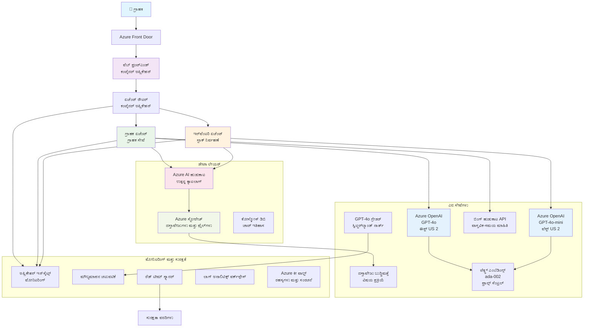

<!--
CO_OP_TRANSLATOR_METADATA:
{
  "original_hash": "77db71c83f2e7fbc9f50320bd1cc7116",
  "translation_date": "2025-11-24T21:21:16+00:00",
  "source_file": "examples/retail-scenario.md",
  "language_code": "kn"
}
-->
# ಬಹು-ಏಜೆಂಟ್ ಗ್ರಾಹಕ ಬೆಂಬಲ ಪರಿಹಾರ - ಚಿಲ್ಲರೆ ವ್ಯಾಪಾರಿಯ ದೃಶ್ಯ

**ಅಧ್ಯಾಯ 5: ಬಹು-ಏಜೆಂಟ್ AI ಪರಿಹಾರಗಳು**
- **📚 ಕೋರ್ಸ್ ಹೋಮ್**: [AZD ಪ್ರಾರಂಭಿಕರಿಗಾಗಿ](../README.md)
- **📖 ಪ್ರಸ್ತುತ ಅಧ್ಯಾಯ**: [ಅಧ್ಯಾಯ 5: ಬಹು-ಏಜೆಂಟ್ AI ಪರಿಹಾರಗಳು](../README.md#-chapter-5-multi-agent-ai-solutions-advanced)
- **⬅️ ಪೂರ್ವಾಪೇಕ್ಷಿತಗಳು**: [ಅಧ್ಯಾಯ 2: AI-ಪ್ರಥಮ ಅಭಿವೃದ್ಧಿ](../docs/ai-foundry/azure-ai-foundry-integration.md)
- **➡️ ಮುಂದಿನ ಅಧ್ಯಾಯ**: [ಅಧ್ಯಾಯ 6: ಪೂರ್ವ-ಪ್ರತಿಷ್ಠಾಪನೆ ಮಾನ್ಯತೆ](../docs/pre-deployment/capacity-planning.md)
- **🚀 ARM ಟೆಂಪ್ಲೇಟುಗಳು**: [ಡಿಪ್ಲಾಯ್‌ಮೆಂಟ್ ಪ್ಯಾಕೇಜ್](retail-multiagent-arm-template/README.md)

> **⚠️ ಆರ್ಕಿಟೆಕ್ಚರ್ ಮಾರ್ಗದರ್ಶಿ - ಕಾರ್ಯನಿರ್ವಹಿಸದ ಅನುಷ್ಠಾನ**  
> ಈ ಡಾಕ್ಯುಮೆಂಟ್ ಬಹು-ಏಜೆಂಟ್ ವ್ಯವಸ್ಥೆಯನ್ನು ನಿರ್ಮಿಸಲು **ವಿಸ್ತೃತ ಆರ್ಕಿಟೆಕ್ಚರ್ ಬ್ಲೂಪ್ರಿಂಟ್** ಅನ್ನು ಒದಗಿಸುತ್ತದೆ.  
> **ಇಲ್ಲಿರುವುದು:** ಮೂಲಸೌಕರ್ಯ ಡಿಪ್ಲಾಯ್‌ಮೆಂಟ್‌ಗಾಗಿ ARM ಟೆಂಪ್ಲೇಟು (Azure OpenAI, AI Search, Container Apps, ಇತ್ಯಾದಿ)  
> **ನೀವು ನಿರ್ಮಿಸಬೇಕಾದದ್ದು:** ಏಜೆಂಟ್ ಕೋಡ್, ರೌಟಿಂಗ್ ಲಾಜಿಕ್, ಫ್ರಂಟ್‌ಎಂಡ್ UI, ಡೇಟಾ ಪೈಪ್‌ಲೈನ್‌ಗಳು (ಅಂದಾಜು 80-120 ಗಂಟೆಗಳು)  
>  
> **ಇದನ್ನು ಬಳಸಿರಿ:**
> - ✅ ನಿಮ್ಮದೇ ಆದ ಬಹು-ಏಜೆಂಟ್ ಯೋಜನೆಗೆ ಆರ್ಕಿಟೆಕ್ಚರ್ ಉಲ್ಲೇಖವಾಗಿ
> - ✅ ಬಹು-ಏಜೆಂಟ್ ವಿನ್ಯಾಸ ಮಾದರಿಗಳಿಗಾಗಿ ಕಲಿಕೆ ಮಾರ್ಗದರ್ಶಿಯಾಗಿ
> - ✅ Azure ಸಂಪತ್ತನ್ನು ಡಿಪ್ಲಾಯ್ ಮಾಡಲು ಮೂಲಸೌಕರ್ಯ ಟೆಂಪ್ಲೇಟಾಗಿ
> - ❌ ಸಿದ್ಧ-ಚಲಾಯಿಸಬಹುದಾದ ಅಪ್ಲಿಕೇಶನ್ ಅಲ್ಲ (ಗಣನೀಯ ಅಭಿವೃದ್ಧಿ ಅಗತ್ಯವಿದೆ)

## ಅವಲೋಕನ

**ಕಲಿಕೆಯ ಉದ್ದೇಶ:** ಇನ್‌ವೆಂಟರಿ ನಿರ್ವಹಣೆ, ಡಾಕ್ಯುಮೆಂಟ್ ಪ್ರೊಸೆಸಿಂಗ್, ಮತ್ತು ಬುದ್ಧಿವಂತ ಗ್ರಾಹಕ ಸಂವಹನಗಳನ್ನು ಒಳಗೊಂಡು, ಚಿಲ್ಲರೆ ವ್ಯಾಪಾರಿಗಾಗಿ ಉತ್ಪಾದನಾ-ಸಿದ್ಧ ಬಹು-ಏಜೆಂಟ್ ಗ್ರಾಹಕ ಬೆಂಬಲ ಚಾಟ್‌ಬಾಟ್ ನಿರ್ಮಿಸಲು ಆರ್ಕಿಟೆಕ್ಚರ್, ವಿನ್ಯಾಸ ನಿರ್ಧಾರಗಳು, ಮತ್ತು ಅನುಷ್ಠಾನ ವಿಧಾನವನ್ನು ಅರ್ಥಮಾಡಿಕೊಳ್ಳಿ.

**ಪೂರೈಸಲು ಬೇಕಾದ ಸಮಯ:** ಓದು + ಅರ್ಥಮಾಡಿಕೊಳ್ಳುವುದು (2-3 ಗಂಟೆಗಳು) | ಸಂಪೂರ್ಣ ಅನುಷ್ಠಾನ ನಿರ್ಮಾಣ (80-120 ಗಂಟೆಗಳು)

**ನೀವು ಕಲಿಯುವದು:**
- ಬಹು-ಏಜೆಂಟ್ ಆರ್ಕಿಟೆಕ್ಚರ್ ಮಾದರಿಗಳು ಮತ್ತು ವಿನ್ಯಾಸ ತತ್ವಗಳು
- ಬಹು-ಪ್ರದೇಶ Azure OpenAI ಡಿಪ್ಲಾಯ್‌ಮೆಂಟ್ ತಂತ್ರಗಳು
- RAG (Retrieval-Augmented Generation) ಸಹಿತ AI Search ಏಕೀಕರಣ
- ಏಜೆಂಟ್ ಮೌಲ್ಯಮಾಪನ ಮತ್ತು ಭದ್ರತಾ ಪರೀಕ್ಷಾ ಚಟುವಟಿಕೆಗಳು
- ಉತ್ಪಾದನಾ ಡಿಪ್ಲಾಯ್‌ಮೆಂಟ್ ಪರಿಗಣನೆಗಳು ಮತ್ತು ವೆಚ್ಚ ಆಪ್ಟಿಮೈಸೇಶನ್

## ಆರ್ಕಿಟೆಕ್ಚರ್ ಗುರಿಗಳು

**ಶೈಕ್ಷಣಿಕ ಕೇಂದ್ರೀಕರಣ:** ಈ ಆರ್ಕಿಟೆಕ್ಚರ್ ಬಹು-ಏಜೆಂಟ್ ವ್ಯವಸ್ಥೆಗಳಿಗೆ ಉದ್ಯಮ ಮಾದರಿಗಳನ್ನು ತೋರಿಸುತ್ತದೆ.

### ವ್ಯವಸ್ಥೆಯ ಅಗತ್ಯತೆಗಳು (ನಿಮ್ಮ ಅನುಷ್ಠಾನಕ್ಕಾಗಿ)

ಉತ್ಪಾದನಾ ಗ್ರಾಹಕ ಬೆಂಬಲ ಪರಿಹಾರಕ್ಕೆ ಅಗತ್ಯವಿದೆ:
- **ವಿವಿಧ ಗ್ರಾಹಕ ಅಗತ್ಯಗಳಿಗೆ ವಿಶೇಷ ಏಜೆಂಟ್‌ಗಳು** (ಗ್ರಾಹಕ ಸೇವೆ + ಇನ್‌ವೆಂಟರಿ ನಿರ್ವಹಣೆ)
- **ಬಹು-ಮಾದರಿ ಡಿಪ್ಲಾಯ್‌ಮೆಂಟ್** ಸರಿಯಾದ ಸಾಮರ್ಥ್ಯ ಯೋಜನೆಯೊಂದಿಗೆ (GPT-4o, GPT-4o-mini, ವಿವಿಧ ಪ್ರದೇಶಗಳಲ್ಲಿ ಎಂಬೆಡಿಂಗ್‌ಗಳು)
- **ಡೈನಾಮಿಕ್ ಡೇಟಾ ಏಕೀಕರಣ** AI Search ಮತ್ತು ಫೈಲ್ ಅಪ್ಲೋಡ್‌ಗಳೊಂದಿಗೆ (ವೆಕ್ಟರ್ ಶೋಧ + ಡಾಕ್ಯುಮೆಂಟ್ ಪ್ರೊಸೆಸಿಂಗ್)
- **ವಿಸ್ತೃತ ನಿಗಾವಹಿಸುವಿಕೆ** ಮತ್ತು ಮೌಲ್ಯಮಾಪನ ಸಾಮರ್ಥ್ಯಗಳು (Application Insights + ಕಸ್ಟಮ್ ಮೆಟ್ರಿಕ್‌ಗಳು)
- **ಉತ್ಪಾದನಾ-ಗ್ರೇಡ್ ಭದ್ರತೆ** ರೆಡ್ ಟೀಮಿಂಗ್ ಮಾನ್ಯತೆ (ಅಪಾಯ ಸ್ಕ್ಯಾನಿಂಗ್ + ಏಜೆಂಟ್ ಮೌಲ್ಯಮಾಪನ)

### ಈ ಮಾರ್ಗದರ್ಶಿ ಒದಗಿಸುತ್ತದೆ

✅ **ಆರ್ಕಿಟೆಕ್ಚರ್ ಮಾದರಿಗಳು** - ಮಾಪನೀಯ ಬಹು-ಏಜೆಂಟ್ ವ್ಯವಸ್ಥೆಗಳಿಗೆ ಸಾಬೀತಾದ ವಿನ್ಯಾಸ  
✅ **ಮೂಲಸೌಕರ್ಯ ಟೆಂಪ್ಲೇಟುಗಳು** - ಎಲ್ಲಾ Azure ಸೇವೆಗಳನ್ನು ಡಿಪ್ಲಾಯ್ ಮಾಡುವ ARM ಟೆಂಪ್ಲೇಟುಗಳು  
✅ **ಕೋಡ್ ಉದಾಹರಣೆಗಳು** - ಪ್ರಮುಖ ಘಟಕಗಳಿಗಾಗಿ ಉಲ್ಲೇಖ ಅನುಷ್ಠಾನಗಳು  
✅ **ಕಾನ್ಫಿಗರೇಶನ್ ಮಾರ್ಗದರ್ಶನ** - ಹಂತ-ಹಂತದ ಸೆಟಪ್ ಸೂಚನೆಗಳು  
✅ **ಉತ್ತಮ ಅಭ್ಯಾಸಗಳು** - ಭದ್ರತೆ, ನಿಗಾವಹಿಸುವಿಕೆ, ವೆಚ್ಚ ಆಪ್ಟಿಮೈಸೇಶನ್ ತಂತ್ರಗಳು  

❌ **ಒಳಗೊಂಡಿಲ್ಲ** - ಸಂಪೂರ್ಣ ಕಾರ್ಯನಿರ್ವಹಿಸುವ ಅಪ್ಲಿಕೇಶನ್ (ಅಭಿವೃದ್ಧಿ ಶ್ರಮ ಅಗತ್ಯವಿದೆ)

## 🗺️ ಅನುಷ್ಠಾನ ರಸ್ತೆನಕ್ಷೆ

### ಹಂತ 1: ಆರ್ಕಿಟೆಕ್ಚರ್ ಅಧ್ಯಯನ (2-3 ಗಂಟೆಗಳು) - ಇಲ್ಲಿ ಪ್ರಾರಂಭಿಸಿ

**ಗುರಿ:** ವ್ಯವಸ್ಥೆಯ ವಿನ್ಯಾಸ ಮತ್ತು ಘಟಕಗಳ ಪರಸ್ಪರ ಕ್ರಿಯೆಯನ್ನು ಅರ್ಥಮಾಡಿಕೊಳ್ಳಿ

- [ ] ಈ ಸಂಪೂರ್ಣ ಡಾಕ್ಯುಮೆಂಟ್ ಓದಿ
- [ ] ಆರ್ಕಿಟೆಕ್ಚರ್ ಡಯಾಗ್ರಾಂ ಮತ್ತು ಘಟಕ ಸಂಬಂಧಗಳನ್ನು ಪರಿಶೀಲಿಸಿ
- [ ] ಬಹು-ಏಜೆಂಟ್ ಮಾದರಿಗಳು ಮತ್ತು ವಿನ್ಯಾಸ ನಿರ್ಧಾರಗಳನ್ನು ಅರ್ಥಮಾಡಿಕೊಳ್ಳಿ
- [ ] ಏಜೆಂಟ್ ಉಪಕರಣಗಳು ಮತ್ತು ರೌಟಿಂಗ್‌ಗಾಗಿ ಕೋಡ್ ಉದಾಹರಣೆಗಳನ್ನು ಅಧ್ಯಯನ ಮಾಡಿ
- [ ] ವೆಚ್ಚ ಅಂದಾಜುಗಳು ಮತ್ತು ಸಾಮರ್ಥ್ಯ ಯೋಜನೆ ಮಾರ್ಗದರ್ಶನವನ್ನು ಪರಿಶೀಲಿಸಿ

**ಫಲಿತಾಂಶ:** ನೀವು ನಿರ್ಮಿಸಬೇಕಾದದ್ದರ ಸ್ಪಷ್ಟ ಅರ್ಥ

### ಹಂತ 2: ಮೂಲಸೌಕರ್ಯ ಡಿಪ್ಲಾಯ್ ಮಾಡಿ (30-45 ನಿಮಿಷಗಳು)

**ಗುರಿ:** ARM ಟೆಂಪ್ಲೇಟು ಬಳಸಿ Azure ಸಂಪತ್ತನ್ನು ಒದಗಿಸಿ

```bash
cd retail-multiagent-arm-template
./deploy.sh -g myResourceGroup -m standard
```

**ಏನು ಡಿಪ್ಲಾಯ್ ಆಗುತ್ತದೆ:**
- ✅ Azure OpenAI (3 ಪ್ರದೇಶಗಳು: GPT-4o, GPT-4o-mini, ಎಂಬೆಡಿಂಗ್‌ಗಳು)
- ✅ AI Search ಸೇವೆ (ಖಾಲಿ, ಸೂಚಿ ಕಾನ್ಫಿಗರೇಶನ್ ಅಗತ್ಯವಿದೆ)
- ✅ ಕಂಟೈನರ್ ಅಪ್ಲಿಕೇಶನ್ ಪರಿಸರ (ಪ್ಲೇಸ್‌ಹೋಲ್ಡರ್ ಇಮೇಜ್‌ಗಳು)
- ✅ ಸ್ಟೋರೇಜ್ ಅಕೌಂಟ್‌ಗಳು, Cosmos DB, Key Vault
- ✅ Application Insights ನಿಗಾವಹಿಸುವಿಕೆ

**ಇಲ್ಲದಿರುವುದು:**
- ❌ ಏಜೆಂಟ್ ಅನುಷ್ಠಾನ ಕೋಡ್
- ❌ ರೌಟಿಂಗ್ ಲಾಜಿಕ್
- ❌ ಫ್ರಂಟ್‌ಎಂಡ್ UI
- ❌ ಶೋಧ ಸೂಚಿ ಸ್ಕೀಮಾ
- ❌ ಡೇಟಾ ಪೈಪ್‌ಲೈನ್‌ಗಳು

### ಹಂತ 3: ಅಪ್ಲಿಕೇಶನ್ ನಿರ್ಮಿಸಿ (80-120 ಗಂಟೆಗಳು)

**ಗುರಿ:** ಈ ಆರ್ಕಿಟೆಕ್ಚರ್ ಆಧಾರದ ಮೇಲೆ ಬಹು-ಏಜೆಂಟ್ ವ್ಯವಸ್ಥೆಯನ್ನು ಅನುಷ್ಠಾನಗೊಳಿಸಿ

1. **ಏಜೆಂಟ್ ಅನುಷ್ಠಾನ** (30-40 ಗಂಟೆಗಳು)
   - ಬೇಸಿಕ್ ಏಜೆಂಟ್ ಕ್ಲಾಸ್ ಮತ್ತು ಇಂಟರ್‌ಫೇಸ್‌ಗಳು
   - GPT-4o ಬಳಸಿ ಗ್ರಾಹಕ ಸೇವಾ ಏಜೆಂಟ್
   - GPT-4o-mini ಬಳಸಿ ಇನ್‌ವೆಂಟರಿ ಏಜೆಂಟ್
   - ಉಪಕರಣ ಏಕೀಕರಣಗಳು (AI Search, Bing, ಫೈಲ್ ಪ್ರೊಸೆಸಿಂಗ್)

2. **ರೌಟಿಂಗ್ ಸೇವೆ** (12-16 ಗಂಟೆಗಳು)
   - ವಿನಂತಿ ವರ್ಗೀಕರಣ ಲಾಜಿಕ್
   - ಏಜೆಂಟ್ ಆಯ್ಕೆ ಮತ್ತು ಸಂಯೋಜನೆ
   - FastAPI/Express ಬ್ಯಾಕ್‌ಎಂಡ್

3. **ಫ್ರಂಟ್‌ಎಂಡ್ ಅಭಿವೃದ್ಧಿ** (20-30 ಗಂಟೆಗಳು)
   - ಚಾಟ್ ಇಂಟರ್‌ಫೇಸ್ UI
   - ಫೈಲ್ ಅಪ್ಲೋಡ್ ಕಾರ್ಯಕ್ಷಮತೆ
   - ಪ್ರತಿಕ್ರಿಯೆ ರೆಂಡರಿಂಗ್

4. **ಡೇಟಾ ಪೈಪ್‌ಲೈನ್** (8-12 ಗಂಟೆಗಳು)
   - AI Search ಸೂಚಿ ರಚನೆ
   - ಡಾಕ್ಯುಮೆಂಟ್ ಪ್ರೊಸೆಸಿಂಗ್ Document Intelligence ಬಳಸಿ
   - ಎಂಬೆಡಿಂಗ್ ತಯಾರಿಕೆ ಮತ್ತು ಸೂಚಿ

5. **ನಿಗಾವಹಿಸುವಿಕೆ ಮತ್ತು ಮೌಲ್ಯಮಾಪನ** (10-15 ಗಂಟೆಗಳು)
   - ಕಸ್ಟಮ್ ಟೆಲಿಮೆಟ್ರಿ ಅನುಷ್ಠಾನ
   - ಏಜೆಂಟ್ ಮೌಲ್ಯಮಾಪನ ಚಟುವಟಿಕೆ
   - ರೆಡ್ ಟೀಮ್ ಭದ್ರತಾ ಸ್ಕ್ಯಾನರ್

### ಹಂತ 4: ಡಿಪ್ಲಾಯ್ ಮತ್ತು ಪರೀಕ್ಷೆ (8-12 ಗಂಟೆಗಳು)

- ಎಲ್ಲಾ ಸೇವೆಗಳಿಗೆ ಡಾಕರ್ ಇಮೇಜ್‌ಗಳನ್ನು ನಿರ್ಮಿಸಿ
- Azure Container Registryಗೆ ಪುಶ್ ಮಾಡಿ
- ನಿಜವಾದ ಇಮೇಜ್‌ಗಳೊಂದಿಗೆ ಕಂಟೈನರ್ ಅಪ್ಲಿಕೇಶನ್‌ಗಳನ್ನು ಅಪ್‌ಡೇಟ್ ಮಾಡಿ
- ಪರಿಸರ ವ್ಯತ್ಯಾಸಗಳು ಮತ್ತು ರಹಸ್ಯಗಳನ್ನು ಕಾನ್ಫಿಗರ್ ಮಾಡಿ
- ಮೌಲ್ಯಮಾಪನ ಪರೀಕ್ಷಾ ಸೂಟ್ ಚಲಾಯಿಸಿ
- ಭದ್ರತಾ ಸ್ಕ್ಯಾನಿಂಗ್ ನಡೆಸಿ

**ಒಟ್ಟು ಅಂದಾಜು ಶ್ರಮ:** ಅನುಭವ ಹೊಂದಿದ ಡೆವಲಪರ್‌ಗಳಿಗೆ 80-120 ಗಂಟೆಗಳು

## ಪರಿಹಾರ ಆರ್ಕಿಟೆಕ್ಚರ್

### ಆರ್ಕಿಟೆಕ್ಚರ್ ಡಯಾಗ್ರಾಂ


### ಘಟಕ ಅವಲೋಕನ

| ಘಟಕ | ಉದ್ದೇಶ | ತಂತ್ರಜ್ಞಾನ | ಪ್ರದೇಶ |
|-----------|---------|------------|---------|
| **ವೆಬ್ ಫ್ರಂಟ್‌ಎಂಡ್** | ಗ್ರಾಹಕ ಸಂವಹನಗಳಿಗಾಗಿ ಬಳಕೆದಾರ ಇಂಟರ್‌ಫೇಸ್ | ಕಂಟೈನರ್ ಅಪ್ಲಿಕೇಶನ್ | ಪ್ರಾಥಮಿಕ ಪ್ರದೇಶ |
| **ಏಜೆಂಟ್ ರೌಟರ್** | ವಿನಂತಿಗಳನ್ನು ಸೂಕ್ತ ಏಜೆಂಟ್‌ಗೆ ರೌಟ್ ಮಾಡುತ್ತದೆ | ಕಂಟೈನರ್ ಅಪ್ಲಿಕೇಶನ್ | ಪ್ರಾಥಮಿಕ ಪ್ರದೇಶ |
| **ಗ್ರಾಹಕ ಏಜೆಂಟ್** | ಗ್ರಾಹಕ ಸೇವಾ ಪ್ರಶ್ನೆಗಳನ್ನು ನಿರ್ವಹಿಸುತ್ತದೆ | ಕಂಟೈನರ್ ಅಪ್ಲಿಕೇಶನ್ + GPT-4o | ಪ್ರಾಥಮಿಕ ಪ್ರದೇಶ |
| **ಇನ್‌ವೆಂಟರಿ ಏಜೆಂಟ್** | ಸ್ಟಾಕ್ ಮತ್ತು ಪೂರ್ಣಗೊಳಿಸುವಿಕೆಯನ್ನು ನಿರ್ವಹಿಸುತ್ತದೆ | ಕಂಟೈನರ್ ಅಪ್ಲಿಕೇಶನ್ + GPT-4o-mini | ಪ್ರಾಥಮಿಕ ಪ್ರದೇಶ |
| **Azure OpenAI** | ಏಜೆಂಟ್‌ಗಳಿಗೆ LLM ನಿರ್ಧಾರ | Cognitive Services | ಬಹು-ಪ್ರದೇಶ |
| **AI Search** | ವೆಕ್ಟರ್ ಶೋಧ ಮತ್ತು RAG | AI Search Service | ಪ್ರಾಥಮಿಕ ಪ್ರದೇಶ |
| **ಸ್ಟೋರೇಜ್ ಅಕೌಂಟ್** | ಫೈಲ್ ಅಪ್ಲೋಡ್‌ಗಳು ಮತ್ತು ಡಾಕ್ಯುಮೆಂಟ್‌ಗಳು | Blob Storage | ಪ್ರಾಥಮಿಕ ಪ್ರದೇಶ |
| **Application Insights** | ನಿಗಾವಹಿಸುವಿಕೆ ಮತ್ತು ಟೆಲಿಮೆಟ್ರಿ | Monitor | ಪ್ರಾಥಮಿಕ ಪ್ರದೇಶ |
| **ಗ್ರೇಡರ್ ಮಾದರಿ** | ಏಜೆಂಟ್ ಮೌಲ್ಯಮಾಪನ ವ್ಯವಸ್ಥೆ | Azure OpenAI | ದ್ವಿತೀಯ ಪ್ರದೇಶ |

## 📁 ಯೋಜನೆ ರಚನೆ

> **📍 ಸ್ಥಿತಿ ಚಿಹ್ನೆ:**  
> ✅ = ರೆಪೊಸಿಟರಿಯಲ್ಲಿ ಇದೆ  
> 📝 = ಉಲ್ಲೇಖ ಅನುಷ್ಠಾನ (ಈ ಡಾಕ್ಯುಮೆಂಟ್‌ನ ಕೋಡ್ ಉದಾಹರಣೆ)  
> 🔨 = ನೀವು ಇದನ್ನು ರಚಿಸಬೇಕಾಗಿದೆ

```
retail-multiagent-solution/              🔨 Your project directory
├── .azure/                              🔨 Azure environment configs
│   ├── config.json                      🔨 Global config
│   └── env/
│       ├── .env.development             🔨 Dev environment
│       ├── .env.staging                 🔨 Staging environment
│       └── .env.production              🔨 Production environment
│
├── azure.yaml                          🔨 AZD main configuration
├── azure.parameters.json               🔨 Deployment parameters
├── README.md                           🔨 Solution documentation
│
├── infra/                              🔨 Infrastructure as Code (you create)
│   ├── main.bicep                      🔨 Main Bicep template (optional, ARM exists)
│   ├── main.parameters.json            🔨 Parameters file
│   ├── modules/                        📝 Bicep modules (reference examples below)
│   │   ├── ai-services.bicep           📝 Azure OpenAI deployments
│   │   ├── search.bicep                📝 AI Search configuration
│   │   ├── storage.bicep               📝 Storage accounts
│   │   ├── container-apps.bicep        📝 Container Apps environment
│   │   ├── monitoring.bicep            📝 Application Insights
│   │   ├── security.bicep              📝 Key Vault and RBAC
│   │   └── networking.bicep            📝 Virtual networks and DNS
│   ├── arm-template/                   ✅ ARM template version (EXISTS)
│   │   ├── azuredeploy.json            ✅ ARM main template (retail-multiagent-arm-template/)
│   │   └── azuredeploy.parameters.json ✅ ARM parameters
│   └── scripts/                        ✅/🔨 Deployment scripts
│       ├── deploy.sh                   ✅ Main deployment script (EXISTS)
│       ├── setup-data.sh               🔨 Data setup script (you create)
│       └── configure-rbac.sh           🔨 RBAC configuration (you create)
│
├── src/                                🔨 Application source code (YOU BUILD THIS)
│   ├── agents/                         📝 Agent implementations (examples below)
│   │   ├── base/                       🔨 Base agent classes
│   │   │   ├── agent.py                🔨 Abstract agent class
│   │   │   └── tools.py                🔨 Tool interfaces
│   │   ├── customer/                   🔨 Customer service agent
│   │   │   ├── agent.py                📝 Customer agent implementation (see below)
│   │   │   ├── prompts.py              🔨 System prompts
│   │   │   └── tools/                  🔨 Agent-specific tools
│   │   │       ├── search_tool.py      📝 AI Search integration (example below)
│   │   │       ├── bing_tool.py        📝 Bing Search integration (example below)
│   │   │       └── file_tool.py        🔨 File processing tool
│   │   └── inventory/                  🔨 Inventory management agent
│   │       ├── agent.py                🔨 Inventory agent implementation
│   │       ├── prompts.py              🔨 System prompts
│   │       └── tools/                  🔨 Agent-specific tools
│   │           ├── inventory_search.py 🔨 Inventory search tool
│   │           └── database_tool.py    🔨 Database query tool
│   │
│   ├── router/                         🔨 Agent routing service (you build)
│   │   ├── main.py                     🔨 FastAPI router application
│   │   ├── routing_logic.py            🔨 Request routing logic
│   │   └── middleware.py               🔨 Authentication & logging
│   │
│   ├── frontend/                       🔨 Web user interface (you build)
│   │   ├── Dockerfile                  🔨 Container configuration
│   │   ├── package.json                🔨 Node.js dependencies
│   │   ├── src/                        🔨 React/Vue source code
│   │   │   ├── components/             🔨 UI components
│   │   │   ├── pages/                  🔨 Application pages
│   │   │   ├── services/               🔨 API services
│   │   │   └── styles/                 🔨 CSS and themes
│   │   └── public/                     🔨 Static assets
│   │
│   ├── shared/                         🔨 Shared utilities (you build)
│   │   ├── config.py                   🔨 Configuration management
│   │   ├── telemetry.py                📝 Telemetry utilities (example below)
│   │   ├── security.py                 🔨 Security utilities
│   │   └── models.py                   🔨 Data models
│   │
│   └── evaluation/                     🔨 Evaluation and testing (you build)
│       ├── evaluator.py                📝 Agent evaluator (example below)
│       ├── red_team_scanner.py         📝 Security scanner (example below)
│       ├── test_cases.json             📝 Evaluation test cases (example below)
│       └── reports/                    🔨 Generated reports
│
├── data/                               🔨 Data and configuration (you create)
│   ├── search-schema.json              📝 AI Search index schema (example below)
│   ├── initial-docs/                   🔨 Initial document corpus
│   │   ├── product-manuals/            🔨 Product documentation (your data)
│   │   ├── policies/                   🔨 Company policies (your data)
│   │   └── faqs/                       🔨 Frequently asked questions (your data)
│   ├── fine-tuning/                    🔨 Fine-tuning datasets (optional)
│   │   ├── training.jsonl              🔨 Training data
│   │   └── validation.jsonl            🔨 Validation data
│   └── evaluation/                     🔨 Evaluation datasets
│       ├── test-conversations.json     📝 Test conversation data (example below)
│       └── ground-truth.json           🔨 Expected responses
│
├── scripts/                            # Utility scripts
│   ├── setup/                          # Setup scripts
│   │   ├── bootstrap.sh                # Initial environment setup
│   │   ├── install-dependencies.sh     # Install required tools
│   │   └── configure-env.sh            # Environment configuration
│   ├── data-management/                # Data management scripts
│   │   ├── upload-documents.py         # Document upload utility
│   │   ├── create-search-index.py      # Search index creation
│   │   └── sync-data.py                # Data synchronization
│   ├── deployment/                     # Deployment automation
│   │   ├── deploy-agents.sh            # Agent deployment
│   │   ├── update-frontend.sh          # Frontend updates
│   │   └── rollback.sh                 # Rollback procedures
│   └── monitoring/                     # Monitoring scripts
│       ├── health-check.py             # Health monitoring
│       ├── performance-test.py         # Performance testing
│       └── security-scan.py            # Security scanning
│
├── tests/                              # Test suites
│   ├── unit/                           # Unit tests
│   │   ├── test_agents.py              # Agent unit tests
│   │   ├── test_router.py              # Router unit tests
│   │   └── test_tools.py               # Tool unit tests
│   ├── integration/                    # Integration tests
│   │   ├── test_end_to_end.py          # E2E test scenarios
│   │   └── test_api.py                 # API integration tests
│   └── load/                           # Load testing
│       ├── load_test_config.yaml       # Load test configuration
│       └── scenarios/                  # Load test scenarios
│
├── docs/                               # Documentation
│   ├── architecture.md                 # Architecture documentation
│   ├── deployment-guide.md             # Deployment instructions
│   ├── agent-configuration.md          # Agent setup guide
│   ├── troubleshooting.md              # Troubleshooting guide
│   └── api/                            # API documentation
│       ├── agent-api.md                # Agent API reference
│       └── router-api.md               # Router API reference
│
├── hooks/                              # AZD lifecycle hooks
│   ├── preprovision.sh                 # Pre-provisioning tasks
│   ├── postprovision.sh                # Post-provisioning setup
│   ├── prepackage.sh                   # Pre-packaging tasks
│   └── postdeploy.sh                   # Post-deployment validation
│
└── .github/                            # GitHub workflows
    └── workflows/
        ├── ci-cd.yml                   # CI/CD pipeline
        ├── security-scan.yml           # Security scanning
        └── performance-test.yml        # Performance testing
```

---

## 🚀 ತ್ವರಿತ ಪ್ರಾರಂಭ: ನೀವು ಈಗ ಮಾಡಬಹುದಾದದ್ದು

### ಆಯ್ಕೆ 1: ಮೂಲಸೌಕರ್ಯ ಮಾತ್ರ ಡಿಪ್ಲಾಯ್ ಮಾಡಿ (30 ನಿಮಿಷಗಳು)

**ನೀವು ಪಡೆಯುವದು:** ಎಲ್ಲಾ Azure ಸೇವೆಗಳು ಅಭಿವೃದ್ಧಿಗೆ ಸಿದ್ಧವಾಗಿದೆ

```bash
# ರೆಪೊಸಿಟರಿ ಕ್ಲೋನ್ ಮಾಡಿ
git clone https://github.com/microsoft/AZD-for-beginners.git
cd AZD-for-beginners/examples/retail-multiagent-arm-template

# ಮೂಲಸೌಕರ್ಯವನ್ನು ನಿಯೋಜಿಸಿ
./deploy.sh -g myResourceGroup -m standard

# ನಿಯೋಜನೆಯನ್ನು ಪರಿಶೀಲಿಸಿ
az resource list --resource-group myResourceGroup --output table
```

**ಅಪೇಕ್ಷಿತ ಫಲಿತಾಂಶ:**
- ✅ Azure OpenAI ಸೇವೆಗಳು ಡಿಪ್ಲಾಯ್ ಆಗಿವೆ (3 ಪ್ರದೇಶಗಳು)
- ✅ AI Search ಸೇವೆ ರಚಿಸಲಾಗಿದೆ (ಖಾಲಿ)
- ✅ ಕಂಟೈನರ್ ಅಪ್ಲಿಕೇಶನ್ ಪರಿಸರ ಸಿದ್ಧವಾಗಿದೆ
- ✅ ಸ್ಟೋರೇಜ್, Cosmos DB, Key Vault ಕಾನ್ಫಿಗರ್ ಆಗಿವೆ
- ❌ ಇನ್ನೂ ಕಾರ್ಯನಿರ್ವಹಿಸುವ ಏಜೆಂಟ್‌ಗಳು ಇಲ್ಲ (ಮೂಲಸೌಕರ್ಯ ಮಾತ್ರ)

### ಆಯ್ಕೆ 2: ಆರ್ಕಿಟೆಕ್ಚರ್ ಅಧ್ಯಯನ (2-3 ಗಂಟೆಗಳು)

**ನೀವು ಪಡೆಯುವದು:** ಬಹು-ಏಜೆಂಟ್ ಮಾದರಿಗಳ ಆಳವಾದ ಅರ್ಥ

1. ಈ ಸಂಪೂರ್ಣ ಡಾಕ್ಯುಮೆಂಟ್ ಓದಿ
2. ಪ್ರತಿ ಘಟಕದ ಕೋಡ್ ಉದಾಹರಣೆಗಳನ್ನು ಪರಿಶೀಲಿಸಿ
3. ವಿನ್ಯಾಸ ನಿರ್ಧಾರಗಳು ಮತ್ತು ವ್ಯಾಪ್ತಿಗಳನ್ನು ಅರ್ಥಮಾಡಿಕೊಳ್ಳಿ
4. ವೆಚ್ಚ ಆಪ್ಟಿಮೈಸೇಶನ್ ತಂತ್ರಗಳನ್ನು ಅಧ್ಯಯನ ಮಾಡಿ
5. ನಿಮ್ಮ ಅನುಷ್ಠಾನ ವಿಧಾನವನ್ನು ಯೋಜಿಸಿ

**ಅಪೇಕ್ಷಿತ ಫಲಿತಾಂಶ:**
- ✅ ವ್ಯವಸ್ಥೆಯ ಆರ್ಕಿಟೆಕ್ಚರ್‌ನ ಸ್ಪಷ್ಟ ಮಾನಸಿಕ ಮಾದರಿ
- ✅ ಅಗತ್ಯವಿರುವ ಘಟಕಗಳ ಅರ್ಥ
- ✅ ವಾಸ್ತವಿಕ ಶ್ರಮ ಅಂದಾಜುಗಳು
- ✅ ಅನುಷ್ಠಾನ ಯೋಜನೆ

### ಆಯ್ಕೆ 3: ಸಂಪೂರ್ಣ ವ್ಯವಸ್ಥೆಯನ್ನು ನಿರ್ಮಿಸಿ (80-120 ಗಂಟೆಗಳು)

**ನೀವು ಪಡೆಯುವದು:** ಉತ್ಪಾದನಾ-ಸಿದ್ಧ ಬಹು-ಏಜೆಂಟ್ ಪರಿಹಾರ

1. **ಹಂತ 1:** ಮೂಲಸೌಕರ್ಯ ಡಿಪ್ಲಾಯ್ ಮಾಡಿ (ಮೇಲಿನಂತೆ)
2. **ಹಂತ 2:** ಕೆಳಗಿನ ಕೋಡ್ ಉದಾಹರಣೆಗಳನ್ನು ಬಳಸಿಕೊಂಡು ಏಜೆಂಟ್‌ಗಳನ್ನು ಅನುಷ್ಠಾನಗೊಳಿಸಿ (30-40 ಗಂಟೆಗಳು)
3. **ಹಂತ 3:** ರೌಟಿಂಗ್ ಸೇವೆಯನ್ನು ನಿರ್ಮಿಸಿ (12-16 ಗಂಟೆಗಳು)
4. **ಹಂತ 4:** ಫ್ರಂಟ್‌ಎಂಡ್ UI ರಚಿಸಿ (20-30 ಗಂಟೆಗಳು)
5. **ಹಂತ 5:** ಡೇಟಾ ಪೈಪ್‌ಲೈನ್‌ಗಳನ್ನು ಕಾನ್ಫಿಗರ್ ಮಾಡಿ (8-12 ಗಂಟೆಗಳು)
6. **ಹಂತ 6:** ನಿಗಾವಹಿಸುವಿಕೆ ಮತ್ತು ಮೌಲ್ಯಮಾಪನವನ್ನು ಸೇರಿಸಿ (10-15 ಗಂಟೆಗಳು)

**ಅಪೇಕ್ಷಿತ ಫಲಿತಾಂಶ:**
- ✅ ಸಂಪೂರ್ಣ ಕಾರ್ಯನಿರ್ವಹಿಸುವ ಬಹು-ಏಜೆಂಟ್ ವ್ಯವಸ್ಥೆ
- ✅ ಉತ್ಪಾದನಾ-ಗ್ರೇಡ್ ನಿಗಾವಹಿಸುವಿಕೆ
- ✅ ಭದ್ರತಾ ಮಾನ್ಯತೆ
- ✅ ವೆಚ್ಚ-ಆಪ್ಟಿಮೈಸ್ಡ್ ಡಿಪ್ಲಾಯ್‌ಮೆಂಟ್

---

## 📚 ಆರ್ಕಿಟೆಕ್ಚರ್ ಉಲ್ಲೇಖ & ಅನುಷ್ಠಾನ ಮಾರ್ಗದರ್ಶಿ

ಮುಂದಿನ ವಿಭಾಗಗಳು ನಿಮ್ಮ ಅನುಷ್ಠಾನಕ್ಕೆ ಮಾರ್ಗದರ್ಶನ ನೀಡಲು ವಿವರವಾದ ಆರ್ಕಿಟೆಕ್ಚರ್ ಮಾದರಿಗಳು, ಕಾನ್ಫಿಗರೇಶನ್ ಉದಾಹರಣೆಗಳು, ಮತ್ತು ಉಲ್ಲೇಖ ಕೋಡ್ ಅನ್ನು ಒದಗಿಸುತ್ತವೆ.

## ಪ್ರಾರಂಭಿಕ ಕಾನ್ಫಿಗರೇಶನ್ ಅಗತ್ಯತೆಗಳು

### 1. ಬಹು ಏಜೆಂಟ್‌ಗಳು ಮತ್ತು ಕಾನ್ಫಿಗರೇಶನ್

**ಗುರಿ**: 2 ವಿಶೇಷ ಏಜೆಂಟ್‌ಗಳನ್ನು ಡಿಪ್ಲಾಯ್ ಮಾಡಿ - "ಗ್ರಾಹಕ ಏಜೆಂಟ್" (ಗ್ರಾಹಕ ಸೇವೆ) ಮತ್ತು "ಇನ್‌ವೆಂಟರಿ" (ಸ್ಟಾಕ್ ನಿರ್ವಹಣೆ)

> **📝 ಟಿಪ್ಪಣಿ:** ಕೆಳಗಿನ azure.yaml ಮತ್ತು Bicep ಕಾನ್ಫಿಗರೇಶನ್‌ಗಳು **ಉಲ್ಲೇಖ ಉದಾಹರಣೆಗಳು** ಆಗಿದ್ದು, ಬಹು-ಏಜೆಂಟ್ ಡಿಪ್ಲಾಯ್‌ಮೆಂಟ್‌ಗಳನ್ನು ರಚಿಸಲು ಹೇಗೆ ರಚಿಸಬೇಕೆಂದು ತೋರಿಸುತ್ತವೆ. ನೀವು ಈ ಫೈಲ್‌ಗಳನ್ನು ಮತ್ತು ಸಂಬಂಧಿತ ಏಜೆಂಟ್ ಅನುಷ್ಠಾನಗಳನ್ನು ರಚಿಸಬೇಕಾಗುತ್ತದೆ.

#### ಕಾನ್ಫಿಗರೇಶನ್ ಹಂತಗಳು:

```yaml
# azure.yaml - Agent Configuration
services:
  agents:
    project: ./infra
    host: containerapp
    config:
      AGENTS_CONFIG: |
        {
          "customer": {
            "name": "Customer",
            "role": "Customer Service Representative",
            "description": "Handles general customer inquiries, returns, and support",
            "model": "gpt-4o",
            "temperature": 0.7,
            "max_tokens": 500,
            "tools": ["search", "file_retrieval", "bing_search"]
          },
          "inventory": {
            "name": "Inventory",
            "role": "Inventory Management Specialist", 
            "description": "Manages stock levels, product availability, and fulfillment",
            "model": "gpt-4o-mini",
            "temperature": 0.3,
            "max_tokens": 300,
            "tools": ["search", "database_query"]
          }
        }
```

#### Bicep ಟೆಂಪ್ಲೇಟು ನವೀಕರಣಗಳು:

```bicep
// infra/agents.bicep
param agentsConfig object = {
  customer: {
    name: 'Customer'
    model: 'gpt-4o'
    capacity: 20
  }
  inventory: {
    name: 'Inventory'
    model: 'gpt-4o-mini'
    capacity: 10
  }
}

resource agentDeployments 'Microsoft.App/containerApps@2024-03-01' = [for agent in items(agentsConfig): {
  name: 'agent-${agent.key}'
  properties: {
    template: {
      containers: [{
        name: 'agent-container'
        image: 'your-registry.azurecr.io/agent:latest'
        env: [
          {
            name: 'AGENT_NAME'
            value: agent.value.name
          }
          {
            name: 'AGENT_MODEL'
            value: agent.value.model
          }
        ]
      }]
    }
  }
}]
```

### 2. ಬಹು-ಮಾದರಿಗಳು ಮತ್ತು ಸಾಮರ್ಥ್ಯ ಯೋಜನೆ

**ಗುರಿ**: ಸರಿಯಾದ ಕೋಟಾ ನಿರ್ವಹಣೆಯೊಂದಿಗೆ ಚಾಟ್ ಮಾದರಿ (ಗ್ರಾಹಕ), ಎಂಬೆಡಿಂಗ್ ಮಾದರಿ (ಶೋಧ), ಮತ್ತು ಗ್ರೇಡರ್ ಮಾದರಿ (ತರ್ಕ) ಡಿಪ್ಲಾಯ್ ಮಾಡಿ

#### ಬಹು-ಪ್ರದೇಶ ತಂತ್ರ:

```bicep
// infra/models.bicep
param modelDeployments array = [
  {
    name: 'gpt-4o'
    region: 'eastus2'
    capacity: 20
    usage: 'chat'
    priority: 'high'
  }
  {
    name: 'text-embedding-ada-002'
    region: 'westus2'
    capacity: 30
    usage: 'search'
    priority: 'medium'
  }
  {
    name: 'gpt-4o'
    region: 'francecentral'
    capacity: 15
    usage: 'grading'
    priority: 'low'
  }
]

// Capacity validation script
resource capacityCheck 'Microsoft.Resources/deploymentScripts@2023-08-01' = {
  name: 'capacity-validation'
  kind: 'AzureCLI'
  properties: {
    scriptContent: '''
      #!/bin/bash
      for model in "gpt-4o" "text-embedding-ada-002"; do
        available=$(az cognitiveservices usage list --location ${location} --query "[?name.value=='$model'].{current:currentValue,limit:limit}" -o tsv)
        echo "Model: $model, Available capacity: $available"
      done
    '''
  }
}
```

#### ಪ್ರದೇಶ ಬ್ಯಾಕಪ್ ಕಾನ್ಫಿಗರೇಶನ್:

```yaml
# .azure/env/.env.production
AZURE_OPENAI_REGIONS='["eastus2", "westus2", "francecentral"]'
AZURE_OPENAI_FALLBACK_ENABLED=true
MODEL_CAPACITY_REQUIREMENTS='{"gpt-4o": 35, "text-embedding-ada-002": 30}'
```

### 3. AI Search ಡೇಟಾ ಸೂಚಿ ಕಾನ್ಫಿಗರೇಶನ್

**ಗುರಿ**: ಡೇಟಾ ನವೀಕರಣಗಳು ಮತ್ತು ಸ್ವಯಂಚಾಲಿತ ಸೂಚಿಗಾಗಿ AI Search ಅನ್ನು ಕಾನ್ಫಿಗರ್ ಮಾಡಿ

#### ಪೂರ್ವ-ಪ್ರೊವಿಷನಿಂಗ್ ಹೂಕ್:

```bash
#!/bin/bash
# hooks/preprovision.sh

echo "Setting up AI Search configuration..."

# ನಿರ್ದಿಷ್ಟ SKU ಹೊಂದಿರುವ ಹುಡುಕಾಟ ಸೇವೆಯನ್ನು ರಚಿಸಿ
az search service create \
  --name "$AZURE_SEARCH_SERVICE_NAME" \
  --resource-group "$AZURE_RESOURCE_GROUP" \
  --sku standard \
  --partition-count 1 \
  --replica-count 1
```

#### ಪ್ರೊವಿಷನಿಂಗ್ ನಂತರ ಡೇಟಾ ಸೆಟಪ್:

```bash
#!/bin/bash
# hooks/postprovision.sh

echo "Configuring AI Search indexes and uploading initial data..."

# ಹುಡುಕಾಟ ಸೇವಾ ಕೀ ಪಡೆಯಿರಿ
SEARCH_KEY=$(az search admin-key show --service-name "$AZURE_SEARCH_SERVICE_NAME" --resource-group "$AZURE_RESOURCE_GROUP" --query primaryKey -o tsv)

# ಸೂಚ್ಯಂಕ ಸ್ಕೀಮಾ ರಚಿಸಿ
curl -X POST "https://$AZURE_SEARCH_SERVICE_NAME.search.windows.net/indexes?api-version=2023-11-01" \
  -H "Content-Type: application/json" \
  -H "api-key: $SEARCH_KEY" \
  -d @"./infra/search-schema.json"

# ಪ್ರಾರಂಭಿಕ ದಾಖಲೆಗಳನ್ನು ಅಪ್ಲೋಡ್ ಮಾಡಿ
python ./scripts/upload_search_data.py \
  --search-service "$AZURE_SEARCH_SERVICE_NAME" \
  --search-key "$SEARCH_KEY" \
  --data-path "./data/initial-docs"
```

#### ಶೋಧ ಸೂಚಿ ಸ್ಕೀಮಾ:

```json
{
  "name": "retail-product-index",
  "fields": [
    {"name": "id", "type": "Edm.String", "key": true},
    {"name": "title", "type": "Edm.String", "searchable": true},
    {"name": "content", "type": "Edm.String", "searchable": true},
    {"name": "category", "type": "Edm.String", "filterable": true},
    {"name": "price", "type": "Edm.Double", "filterable": true},
    {"name": "in_stock", "type": "Edm.Boolean", "filterable": true},
    {"name": "content_vector", "type": "Collection(Edm.Single)", "searchable": true, "vectorSearchDimensions": 1536}
  ],
  "vectorSearch": {
    "algorithms": [
      {
        "name": "default-algorithm",
        "kind": "hnsw"
      }
    ]
  }
}
```

### 4. AI Searchಗೆ ಏಜೆಂಟ್ ಉಪಕರಣ ಕಾನ್ಫಿಗರೇಶನ್

**ಗುರಿ**: AI Search ಅನ್ನು ನೆಲ
## ✅ ಡಿಪ್ಲಾಯ್ ಮಾಡಲು ಸಿದ್ಧವಾದ ARM ಟೆಂಪ್ಲೇಟ್

> **✨ ಇದು ನಿಜವಾಗಿಯೂ ಅಸ್ತಿತ್ವದಲ್ಲಿದೆ ಮತ್ತು ಕೆಲಸ ಮಾಡುತ್ತದೆ!**  
> ಮೇಲಿನ ಕಲ್ಪನಾತ್ಮಕ ಕೋಡ್ ಉದಾಹರಣೆಗಳಿಗಿಂತ ಭಿನ್ನವಾಗಿ, ARM ಟೆಂಪ್ಲೇಟ್ ಈ ರೆಪೊಸಿಟರಿಯಲ್ಲಿ **ನಿಜವಾದ, ಕಾರ್ಯನಿರ್ವಹಿಸುವ ಮೂಲಸೌಕರ್ಯ ಡಿಪ್ಲಾಯ್‌ಮೆಂಟ್** ಆಗಿದೆ.

### ಈ ಟೆಂಪ್ಲೇಟ್ ಏನು ಮಾಡುತ್ತದೆ

[`retail-multiagent-arm-template/`](../../../examples/retail-multiagent-arm-template) ನಲ್ಲಿ ಇರುವ ARM ಟೆಂಪ್ಲೇಟ್ ಬಹು-ಏಜೆಂಟ್ ವ್ಯವಸ್ಥೆಗೆ ಅಗತ್ಯವಿರುವ **ಎಲ್ಲಾ Azure ಮೂಲಸೌಕರ್ಯವನ್ನು** ಒದಗಿಸುತ್ತದೆ. ಇದು **ಡಿಪ್ಲಾಯ್ ಮಾಡಲು ಸಿದ್ಧವಾದ ಏಕೈಕ ಘಟಕ** - ಉಳಿದವುಗಳೆಲ್ಲಾ ಅಭಿವೃದ್ಧಿಯನ್ನು ಅಗತ್ಯವಿದೆ.

### ARM ಟೆಂಪ್ಲೇಟ್‌ನಲ್ಲಿ ಏನು ಸೇರಿಸಲಾಗಿದೆ

[`retail-multiagent-arm-template/`](../../../examples/retail-multiagent-arm-template) ನಲ್ಲಿ ಇರುವ ARM ಟೆಂಪ್ಲೇಟ್ ಒಳಗೊಂಡಿದೆ:

#### **ಪೂರ್ಣ ಮೂಲಸೌಕರ್ಯ**
- ✅ **ಬಹು-ಪ್ರದೇಶ Azure OpenAI** ಡಿಪ್ಲಾಯ್‌ಮೆಂಟ್‌ಗಳು (GPT-4o, GPT-4o-mini, embeddings, grader)
- ✅ **Azure AI Search** ವೆಕ್ಟರ್ ಹುಡುಕಾಟ ಸಾಮರ್ಥ್ಯಗಳೊಂದಿಗೆ
- ✅ **Azure Storage** ಡಾಕ್ಯುಮೆಂಟ್ ಮತ್ತು ಅಪ್ಲೋಡ್ ಕಂಟೈನರ್‌ಗಳೊಂದಿಗೆ
- ✅ **Container Apps Environment** ಸ್ವಯಂ-ಸ್ಕೇಲಿಂಗ್‌ನೊಂದಿಗೆ
- ✅ **Agent Router & Frontend** ಕಂಟೈನರ್ ಅಪ್ಲಿಕೇಶನ್‌ಗಳು
- ✅ **Cosmos DB** ಚಾಟ್ ಇತಿಹಾಸ ಶಾಶ್ವತತೆಯಿಗಾಗಿ
- ✅ **Application Insights** ಸಮಗ್ರ ನಿಗಾವಹಿಸುವಿಕೆಯಿಗಾಗಿ
- ✅ **Key Vault** ರಹಸ್ಯ ನಿರ್ವಹಣೆಯ ಸುರಕ್ಷತೆಯಿಗಾಗಿ
- ✅ **Document Intelligence** ಫೈಲ್ ಪ್ರೊಸೆಸಿಂಗ್‌ಗಾಗಿ
- ✅ **Bing Search API** ರಿಯಲ್-ಟೈಮ್ ಮಾಹಿತಿಗಾಗಿ

#### **ಡಿಪ್ಲಾಯ್‌ಮೆಂಟ್ ಮೋಡ್‌ಗಳು**
| ಮೋಡ್ | ಬಳಕೆ | ಸಂಪತ್ತುಗಳು | ಅಂದಾಜು ವೆಚ್ಚ/ತಿಂಗಳು |
|------|----------|-----------|---------------------|
| **Minimal** | ಅಭಿವೃದ್ಧಿ, ಪರೀಕ್ಷೆ | ಮೂಲ SKUs, ಏಕ ಪ್ರದೇಶ | $100-370 |
| **Standard** | ಉತ್ಪಾದನೆ, ಮಧ್ಯಮ ಪ್ರಮಾಣ | ಸ್ಟ್ಯಾಂಡರ್ಡ್ SKUs, ಬಹು-ಪ್ರದೇಶ | $420-1,450 |
| **Premium** | ಎಂಟರ್‌ಪ್ರೈಸ್, ಹೆಚ್ಚಿನ ಪ್ರಮಾಣ | ಪ್ರೀಮಿಯಂ SKUs, HA ಸೆಟಪ್ | $1,150-3,500 |

### 🎯 ವೇಗದ ಡಿಪ್ಲಾಯ್‌ಮೆಂಟ್ ಆಯ್ಕೆಗಳು

#### ಆಯ್ಕೆ 1: ಒನ್-ಕ್ಲಿಕ್ Azure ಡಿಪ್ಲಾಯ್‌ಮೆಂಟ್

[](https://portal.azure.com/#create/Microsoft.Template/uri/https%3A%2F%2Fraw.githubusercontent.com%2Fmicrosoft%2Fazd-for-beginners%2Fmain%2Fexamples%2Fretail-multiagent-arm-template%2Fazuredeploy.json)

#### ಆಯ್ಕೆ 2: Azure CLI ಡಿಪ್ಲಾಯ್‌ಮೆಂಟ್

```bash
# ರೆಪೊಸಿಟರಿ ಕ್ಲೋನ್ ಮಾಡಿ
git clone https://github.com/microsoft/azd-for-beginners.git
cd azd-for-beginners/examples/retail-multiagent-arm-template

# ಡಿಪ್ಲಾಯ್‌ಮೆಂಟ್ ಸ್ಕ್ರಿಪ್ಟ್ ಕಾರ್ಯನಿರ್ವಹಣೀಯವಾಗಿಸಿ
chmod +x deploy.sh

# ಡಿಫಾಲ್ಟ್ ಸೆಟ್ಟಿಂಗ್‌ಗಳೊಂದಿಗೆ ಡಿಪ್ಲಾಯ್ ಮಾಡಿ (ಸ್ಟಾಂಡರ್ಡ್ ಮೋಡ್)
./deploy.sh -g myResourceGroup

# ಪ್ರೀಮಿಯಂ ವೈಶಿಷ್ಟ್ಯಗಳೊಂದಿಗೆ ಉತ್ಪಾದನೆಗಾಗಿ ಡಿಪ್ಲಾಯ್ ಮಾಡಿ
./deploy.sh -g myProdRG -e prod -m premium -l eastus2

# ಅಭಿವೃದ್ಧಿಗಾಗಿ ಕನಿಷ್ಠ ಆವೃತ್ತಿಯನ್ನು ಡಿಪ್ಲಾಯ್ ಮಾಡಿ
./deploy.sh -g myDevRG -e dev -m minimal --no-multi-region
```

#### ಆಯ್ಕೆ 3: ನೇರ ARM ಟೆಂಪ್ಲೇಟ್ ಡಿಪ್ಲಾಯ್‌ಮೆಂಟ್

```bash
# ಸಂಪತ್ತಿನ ಗುಂಪು ರಚಿಸಿ
az group create --name myResourceGroup --location eastus2

# ಟೆಂಪ್ಲೇಟನ್ನು ನೇರವಾಗಿ ನಿಯೋಜಿಸಿ
az deployment group create \
  --resource-group myResourceGroup \
  --template-file azuredeploy.json \
  --parameters azuredeploy.parameters.json \
  --parameters projectName=retail environmentName=prod
```

### ಟೆಂಪ್ಲೇಟ್ ಔಟ್‌ಪುಟ್‌ಗಳು

ಯಶಸ್ವೀ ಡಿಪ್ಲಾಯ್‌ಮೆಂಟ್ ನಂತರ, ನೀವು ಪಡೆಯುವಿರಿ:

```json
{
  "frontendUrl": "https://retail-frontend-abc123.azurecontainerapps.io",
  "routerUrl": "https://retail-router-abc123.azurecontainerapps.io",
  "openAiEndpointPrimary": "https://retail-openai-primary-abc123.openai.azure.com/",
  "searchServiceEndpoint": "https://retail-search-abc123.search.windows.net",
  "storageAccountName": "retailstorage123abc",
  "keyVaultName": "retail-kv-abc123",
  "applicationInsightsName": "retail-ai-abc123"
}
```

### 🔧 ಡಿಪ್ಲಾಯ್‌ಮೆಂಟ್ ನಂತರದ ಸಂರಚನೆ

ARM ಟೆಂಪ್ಲೇಟ್ ಮೂಲಸೌಕರ್ಯ ಒದಗಿಸುವಿಕೆಯನ್ನು ನಿರ್ವಹಿಸುತ್ತದೆ. ಡಿಪ್ಲಾಯ್‌ಮೆಂಟ್ ನಂತರ:

1. **ಹುಡುಕಾಟ ಸೂಚ್ಯಂಕವನ್ನು ಸಂರಚಿಸಿ**:
   ```bash
   # ಒದಗಿಸಿದ ಹುಡುಕಾಟ ಸ್ಕೀಮವನ್ನು ಬಳಸಿ
   curl -X POST "${SEARCH_ENDPOINT}/indexes?api-version=2023-11-01" \
     -H "Content-Type: application/json" \
     -H "api-key: ${SEARCH_KEY}" \
     -d @../data/search-schema.json
   ```

2. **ಪ್ರಾರಂಭಿಕ ಡಾಕ್ಯುಮೆಂಟ್‌ಗಳನ್ನು ಅಪ್ಲೋಡ್ ಮಾಡಿ**:
   ```bash
   # ಉತ್ಪನ್ನ ಕೈಪಿಡಿಗಳು ಮತ್ತು ಜ್ಞಾನ ಆಧಾರವನ್ನು ಅಪ್ಲೋಡ್ ಮಾಡಿ
   az storage blob upload-batch \
     --destination documents \
     --source ../data/initial-docs \
     --account-name ${STORAGE_ACCOUNT}
   ```

3. **ಏಜೆಂಟ್ ಕೋಡ್ ಡಿಪ್ಲಾಯ್ ಮಾಡಿ**:
   ```bash
   # ನಿಜವಾದ ಏಜೆಂಟ್ ಅಪ್ಲಿಕೇಶನ್‌ಗಳನ್ನು ನಿರ್ಮಿಸಿ ಮತ್ತು ನಿಯೋಜಿಸಿ
   docker build -t myregistry.azurecr.io/agent-router:latest ./src/router
   az containerapp update \
     --name retail-router \
     --resource-group myResourceGroup \
     --image myregistry.azurecr.io/agent-router:latest
   ```

### 🎛️ ಕಸ್ಟಮೈಸೇಶನ್ ಆಯ್ಕೆಗಳು

ನಿಮ್ಮ ಡಿಪ್ಲಾಯ್‌ಮೆಂಟ್ ಅನ್ನು ಕಸ್ಟಮೈಸ್ ಮಾಡಲು `azuredeploy.parameters.json` ಅನ್ನು ಸಂಪಾದಿಸಿ:

```json
{
  "projectName": {"value": "mycompany"},
  "environmentName": {"value": "prod"},
  "deploymentMode": {"value": "premium"},
  "location": {"value": "eastus2"},
  "enableMultiRegion": {"value": true},
  "enableMonitoring": {"value": true},
  "enableSecurity": {"value": true}
}
```

### 📊 ಡಿಪ್ಲಾಯ್‌ಮೆಂಟ್ ವೈಶಿಷ್ಟ್ಯಗಳು

- ✅ **ಪೂರ್ವಾಪೇಕ್ಷಿತ ಮಾನ್ಯತೆ** (Azure CLI, ಕೋಟಾ, ಅನುಮತಿಗಳು)
- ✅ **ಬಹು-ಪ್ರದೇಶದ ಹೆಚ್ಚಿನ ಲಭ್ಯತೆ** ಸ್ವಯಂಚಾಲಿತ ವೈಫಲ್ಯದಿಂದ ಪುನಃಸ್ಥಾಪನೆಯೊಂದಿಗೆ
- ✅ **ಸಮಗ್ರ ನಿಗಾವಹಿಸುವಿಕೆ** Application Insights ಮತ್ತು Log Analytics ಮೂಲಕ
- ✅ **ಸುರಕ್ಷತಾ ಉತ್ತಮ ಅಭ್ಯಾಸಗಳು** Key Vault ಮತ್ತು RBAC ಮೂಲಕ
- ✅ **ವೆಚ್ಚದ ಆಪ್ಟಿಮೈಸೇಶನ್** ಕಾನ್ಫಿಗರ್ ಮಾಡಬಹುದಾದ ಡಿಪ್ಲಾಯ್‌ಮೆಂಟ್ ಮೋಡ್‌ಗಳೊಂದಿಗೆ
- ✅ **ಸ್ವಯಂ-ಸ್ಕೇಲಿಂಗ್** ಬೇಡಿಕೆಯ ಮಾದರಿಗಳ ಆಧಾರದ ಮೇಲೆ
- ✅ **ಶೂನ್ಯ-ಡೌನ್‌ಟೈಮ್ ಅಪ್ಡೇಟುಗಳು** Container Apps ಆವೃತ್ತಿಗಳೊಂದಿಗೆ

### 🔍 ನಿಗಾವಹಿಸುವಿಕೆ ಮತ್ತು ನಿರ್ವಹಣೆ

ಡಿಪ್ಲಾಯ್ ಮಾಡಿದ ನಂತರ, ನಿಮ್ಮ ಪರಿಹಾರವನ್ನು ಈ ಮೂಲಕ ನಿಗಾವಹಿಸಿ:

- **Application Insights**: ಕಾರ್ಯಕ್ಷಮತೆ ಮೆಟ್ರಿಕ್‌ಗಳು, ಅವಲಂಬನೆ ಟ್ರ್ಯಾಕಿಂಗ್, ಮತ್ತು ಕಸ್ಟಮ್ ಟೆಲಿಮೆಟ್ರಿ
- **Log Analytics**: ಎಲ್ಲಾ ಘಟಕಗಳಿಂದ ಕೇಂದ್ರೀಕೃತ ಲಾಗಿಂಗ್
- **Azure Monitor**: ಸಂಪತ್ತುಗಳ ಆರೋಗ್ಯ ಮತ್ತು ಲಭ್ಯತೆ ನಿಗಾವಹಿಸುವಿಕೆ
- **Cost Management**: ರಿಯಲ್-ಟೈಮ್ ವೆಚ್ಚ ಟ್ರ್ಯಾಕಿಂಗ್ ಮತ್ತು ಬಜೆಟ್ ಎಚ್ಚರಿಕೆಗಳು

---

## 📚 ಸಂಪೂರ್ಣ ಅನುಷ್ಠಾನ ಮಾರ್ಗದರ್ಶಿ

ಈ ಸನ್ನಿವೇಶದ ಡಾಕ್ಯುಮೆಂಟ್ ARM ಟೆಂಪ್ಲೇಟ್‌ನೊಂದಿಗೆ ಉತ್ಪಾದನೆಗೆ ಸಿದ್ಧವಾದ ಬಹು-ಏಜೆಂಟ್ ಗ್ರಾಹಕ ಬೆಂಬಲ ಪರಿಹಾರವನ್ನು ಡಿಪ್ಲಾಯ್ ಮಾಡಲು ಅಗತ್ಯವಿರುವ ಎಲ್ಲವನ್ನೂ ಒದಗಿಸುತ್ತದೆ. ಅನುಷ್ಠಾನವು ಒಳಗೊಂಡಿದೆ:

✅ **ಆರ್ಕಿಟೆಕ್ಚರ್ ವಿನ್ಯಾಸ** - ಘಟಕ ಸಂಬಂಧಗಳೊಂದಿಗೆ ಸಮಗ್ರ ವ್ಯವಸ್ಥೆಯ ವಿನ್ಯಾಸ  
✅ **ಮೂಲಸೌಕರ್ಯ ಒದಗಿಸುವಿಕೆ** - ಒನ್-ಕ್ಲಿಕ್ ಡಿಪ್ಲಾಯ್‌ಮೆಂಟ್‌ಗಾಗಿ ಸಂಪೂರ್ಣ ARM ಟೆಂಪ್ಲೇಟ್  
✅ **ಏಜೆಂಟ್ ಸಂರಚನೆ** - ಗ್ರಾಹಕ ಮತ್ತು ಇನ್‌ವೆಂಟರಿ ಏಜೆಂಟ್‌ಗಳ ವಿವರವಾದ ಸೆಟಪ್  
✅ **ಬಹು-ಮಾದರಿ ಡಿಪ್ಲಾಯ್‌ಮೆಂಟ್** - ಪ್ರದೇಶಗಳಾದ್ಯಂತ ತಂತ್ರಜ್ಞಾನದ ಮಾದರಿ ಸ್ಥಳಾವಕಾಶ  
✅ **ಹುಡುಕಾಟ ಸಂಯೋಜನೆ** - ವೆಕ್ಟರ್ ಸಾಮರ್ಥ್ಯಗಳು ಮತ್ತು ಡೇಟಾ ಸೂಚ್ಯಂಕಗಳೊಂದಿಗೆ AI ಹುಡುಕಾಟ  
✅ **ಸುರಕ್ಷತಾ ಅನುಷ್ಠಾನ** - ರೆಡ್ ಟೀಮಿಂಗ್, ದುರ್ಬಲತೆಯ ಸ್ಕ್ಯಾನಿಂಗ್, ಮತ್ತು ಸುರಕ್ಷಿತ ಅಭ್ಯಾಸಗಳು  
✅ **ನಿಗಾವಹಿಸುವಿಕೆ ಮತ್ತು ಮೌಲ್ಯಮಾಪನ** - ಸಮಗ್ರ ಟೆಲಿಮೆಟ್ರಿ ಮತ್ತು ಏಜೆಂಟ್ ಮೌಲ್ಯಮಾಪನ ಚಟುವಟಿಕೆ  
✅ **ಉತ್ಪಾದನಾ ಸಿದ್ಧತೆ** - HA ಮತ್ತು ವಿಪತ್ತು ಪುನಃಸ್ಥಾಪನೆಯೊಂದಿಗೆ ಎಂಟರ್‌ಪ್ರೈಸ್-ಗ್ರೇಡ್ ಡಿಪ್ಲಾಯ್‌ಮೆಂಟ್  
✅ **ವೆಚ್ಚದ ಆಪ್ಟಿಮೈಸೇಶನ್** - ಬುದ್ಧಿವಂತ ಮಾರ್ಗ ಮತ್ತು ಬಳಕೆಯ ಆಧಾರದ ಮೇಲೆ ಸ್ಕೇಲಿಂಗ್  
✅ **ಟ್ರಬಲ್‌ಶೂಟಿಂಗ್ ಮಾರ್ಗದರ್ಶಿ** - ಸಾಮಾನ್ಯ ಸಮಸ್ಯೆಗಳು ಮತ್ತು ಪರಿಹಾರ ತಂತ್ರಗಳು

---

## 📊 ಸಾರಾಂಶ: ನೀವು ಕಲಿತದ್ದೇನು

### ಆರ್ಕಿಟೆಕ್ಚರ್ ಮಾದರಿಗಳು

✅ **ಬಹು-ಏಜೆಂಟ್ ವ್ಯವಸ್ಥೆಯ ವಿನ್ಯಾಸ** - ವಿಶೇಷ ಏಜೆಂಟ್‌ಗಳು (ಗ್ರಾಹಕ + ಇನ್‌ವೆಂಟರಿ) ಸಮರ್ಪಿತ ಮಾದರಿಗಳೊಂದಿಗೆ  
✅ **ಬಹು-ಪ್ರದೇಶ ಡಿಪ್ಲಾಯ್‌ಮೆಂಟ್** - ವೆಚ್ಚದ ಆಪ್ಟಿಮೈಸೇಶನ್ ಮತ್ತು redundancyಗಾಗಿ ತಂತ್ರಜ್ಞಾನದ ಮಾದರಿ ಸ್ಥಳಾವಕಾಶ  
✅ **RAG ಆರ್ಕಿಟೆಕ್ಚರ್** - AI ಹುಡುಕಾಟವನ್ನು ವೆಕ್ಟರ್ embeddings ಮೂಲಕ ನೆಲಸಿದ ಪ್ರತಿಕ್ರಿಯೆಗಳಿಗೆ ಸಂಯೋಜನೆ  
✅ **ಏಜೆಂಟ್ ಮೌಲ್ಯಮಾಪನ** - ಗುಣಮಟ್ಟದ ಮೌಲ್ಯಮಾಪನಕ್ಕಾಗಿ ಸಮರ್ಪಿತ grader ಮಾದರಿ  
✅ **ಸುರಕ್ಷತಾ ಚಟುವಟಿಕೆ** - ರೆಡ್ ಟೀಮಿಂಗ್ ಮತ್ತು ದುರ್ಬಲತೆಯ ಸ್ಕ್ಯಾನಿಂಗ್ ಮಾದರಿಗಳು  
✅ **ವೆಚ್ಚದ ಆಪ್ಟಿಮೈಸೇಶನ್** - ಮಾದರಿ ಮಾರ್ಗ ಮತ್ತು ಸಾಮರ್ಥ್ಯ ಯೋಜನೆ ತಂತ್ರಗಳು  
✅ **ಉತ್ಪಾದನಾ ನಿಗಾವಹಿಸುವಿಕೆ** - Application Insights ಕಸ್ಟಮ್ ಟೆಲಿಮೆಟ್ರಿಯೊಂದಿಗೆ  

### ಈ ಡಾಕ್ಯುಮೆಂಟ್ ಏನು ಒದಗಿಸುತ್ತದೆ

| ಘಟಕ | ಸ್ಥಿತಿ | ಇದನ್ನು ಎಲ್ಲಿ ಹುಡುಕಬಹುದು |
|-----------|--------|------------------|
| **ಮೂಲಸೌಕರ್ಯ ಟೆಂಪ್ಲೇಟ್** | ✅ ಡಿಪ್ಲಾಯ್ ಮಾಡಲು ಸಿದ್ಧ | [`retail-multiagent-arm-template/`](../../../examples/retail-multiagent-arm-template) |
| **ಆರ್ಕಿಟೆಕ್ಚರ್ ಡಯಾಗ್ರಾಮ್‌ಗಳು** | ✅ ಪೂರ್ಣ | ಮೇಲಿನ Mermaid ಡಯಾಗ್ರಾಮ್ |
| **ಕೋಡ್ ಉದಾಹರಣೆಗಳು** | ✅ ಉಲ್ಲೇಖ ಅನುಷ್ಠಾನಗಳು | ಈ ಡಾಕ್ಯುಮೆಂಟ್‌ನಲ್ಲಿ |
| **ಸಂರಚನಾ ಮಾದರಿಗಳು** | ✅ ವಿವರವಾದ ಮಾರ್ಗದರ್ಶನ | ಮೇಲಿನ ವಿಭಾಗಗಳು 1-10 |
| **ಏಜೆಂಟ್ ಅನುಷ್ಠಾನಗಳು** | 🔨 ನೀವು ಇದನ್ನು ನಿರ್ಮಿಸುತ್ತೀರಿ | ~40 ಗಂಟೆಗಳ ಅಭಿವೃದ್ಧಿ |
| **Frontend UI** | 🔨 ನೀವು ಇದನ್ನು ನಿರ್ಮಿಸುತ್ತೀರಿ | ~25 ಗಂಟೆಗಳ ಅಭಿವೃದ್ಧಿ |
| **ಡೇಟಾ ಪೈಪ್‌ಲೈನ್‌ಗಳು** | 🔨 ನೀವು ಇದನ್ನು ನಿರ್ಮಿಸುತ್ತೀರಿ | ~10 ಗಂಟೆಗಳ ಅಭಿವೃದ್ಧಿ |

### ವಾಸ್ತವ ಸ್ಥಿತಿ: ಏನು ಅಸ್ತಿತ್ವದಲ್ಲಿದೆ

**ರೆಪೊಸಿಟರಿಯಲ್ಲಿ (ಈಗ ಸಿದ್ಧ):**
- ✅ ARM ಟೆಂಪ್ಲೇಟ್ 15+ Azure ಸೇವೆಗಳನ್ನು ಡಿಪ್ಲಾಯ್ ಮಾಡುತ್ತದೆ (azuredeploy.json)
- ✅ ಡಿಪ್ಲಾಯ್‌ಮೆಂಟ್ ಸ್ಕ್ರಿಪ್ಟ್ ಮಾನ್ಯತೆಗಳೊಂದಿಗೆ (deploy.sh)
- ✅ ಪ್ಯಾರಾಮೀಟರ್‌ಗಳ ಸಂರಚನೆ (azuredeploy.parameters.json)

**ಡಾಕ್ಯುಮೆಂಟ್‌ನಲ್ಲಿ ಉಲ್ಲೇಖಿಸಲಾಗಿದೆ (ನೀವು ರಚಿಸುತ್ತೀರಿ):**
- 🔨 ಏಜೆಂಟ್ ಅನುಷ್ಠಾನ ಕೋಡ್ (~30-40 ಗಂಟೆಗಳು)
- 🔨 ಮಾರ್ಗಸೂಚಿ ಸೇವೆ (~12-16 ಗಂಟೆಗಳು)
- 🔨 ಫ್ರಂಟ್‌ಎಂಡ್ ಅಪ್ಲಿಕೇಶನ್ (~20-30 ಗಂಟೆಗಳು)
- 🔨 ಡೇಟಾ ಸೆಟಪ್ ಸ್ಕ್ರಿಪ್ಟ್‌ಗಳು (~8-12 ಗಂಟೆಗಳು)
- 🔨 ನಿಗಾವಹಿಸುವಿಕೆ ಚಟುವಟಿಕೆ (~10-15 ಗಂಟೆಗಳು)

### ನಿಮ್ಮ ಮುಂದಿನ ಹಂತಗಳು

#### ನೀವು ಮೂಲಸೌಕರ್ಯವನ್ನು ಡಿಪ್ಲಾಯ್ ಮಾಡಲು ಬಯಸಿದರೆ (30 ನಿಮಿಷ)
```bash
cd retail-multiagent-arm-template
./deploy.sh -g myResourceGroup
```

#### ನೀವು ಸಂಪೂರ್ಣ ವ್ಯವಸ್ಥೆಯನ್ನು ನಿರ್ಮಿಸಲು ಬಯಸಿದರೆ (80-120 ಗಂಟೆಗಳು)
1. ✅ ಈ ಆರ್ಕಿಟೆಕ್ಚರ್ ಡಾಕ್ಯುಮೆಂಟ್ ಅನ್ನು ಓದಿ ಮತ್ತು ಅರ್ಥಮಾಡಿಕೊಳ್ಳಿ (2-3 ಗಂಟೆಗಳು)
2. ✅ ARM ಟೆಂಪ್ಲೇಟ್ ಬಳಸಿ ಮೂಲಸೌಕರ್ಯವನ್ನು ಡಿಪ್ಲಾಯ್ ಮಾಡಿ (30 ನಿಮಿಷ)
3. 🔨 ಉಲ್ಲೇಖ ಕೋಡ್ ಮಾದರಿಗಳನ್ನು ಬಳಸಿಕೊಂಡು ಏಜೆಂಟ್‌ಗಳನ್ನು ಅನುಷ್ಠಾನಗೊಳಿಸಿ (~40 ಗಂಟೆಗಳು)
4. 🔨 FastAPI/Express ಬಳಸಿ ಮಾರ್ಗಸೂಚಿ ಸೇವೆಯನ್ನು ನಿರ್ಮಿಸಿ (~15 ಗಂಟೆಗಳು)
5. 🔨 React/Vue ಬಳಸಿ ಫ್ರಂಟ್‌ಎಂಡ್ UI ರಚಿಸಿ (~25 ಗಂಟೆಗಳು)
6. 🔨 ಡೇಟಾ ಪೈಪ್‌ಲೈನ್ ಮತ್ತು ಹುಡುಕಾಟ ಸೂಚ್ಯಂಕವನ್ನು ಸಂರಚಿಸಿ (~10 ಗಂಟೆಗಳು)
7. 🔨 ನಿಗಾವಹಿಸುವಿಕೆ ಮತ್ತು ಮೌಲ್ಯಮಾಪನವನ್ನು ಸೇರಿಸಿ (~15 ಗಂಟೆಗಳು)
8. ✅ ಪರೀಕ್ಷಿಸಿ, ಸುರಕ್ಷಿತಗೊಳಿಸಿ, ಮತ್ತು ಆಪ್ಟಿಮೈಸೆ ಮಾಡಿ (~10 ಗಂಟೆಗಳು)

#### ನೀವು ಬಹು-ಏಜೆಂಟ್ ಮಾದರಿಗಳನ್ನು ಕಲಿಯಲು ಬಯಸಿದರೆ (ಅಧ್ಯಯನ)
- 📖 ಆರ್ಕಿಟೆಕ್ಚರ್ ಡಯಾಗ್ರಾಮ್ ಮತ್ತು ಘಟಕ ಸಂಬಂಧಗಳನ್ನು ಪರಿಶೀಲಿಸಿ
- 📖 SearchTool, BingTool, AgentEvaluator ಕೋಡ್ ಉದಾಹರಣೆಗಳನ್ನು ಅಧ್ಯಯನ ಮಾಡಿ
- 📖 ಬಹು-ಪ್ರದೇಶ ಡಿಪ್ಲಾಯ್‌ಮೆಂಟ್ ತಂತ್ರವನ್ನು ಅರ್ಥಮಾಡಿಕೊಳ್ಳಿ
- 📖 ಮೌಲ್ಯಮಾಪನ ಮತ್ತು ಸುರಕ್ಷತಾ ಚಟುವಟಿಕೆಗಳನ್ನು ಕಲಿಯಿರಿ
- 📖 ನಿಮ್ಮದೇ ಆದ ಯೋಜನೆಗಳಿಗೆ ಮಾದರಿಗಳನ್ನು ಅನ್ವಯಿಸಿ

### ಮುಖ್ಯ ಪಾಠಗಳು

1. **ಮೂಲಸೌಕರ್ಯ vs. ಅಪ್ಲಿಕೇಶನ್** - ARM ಟೆಂಪ್ಲೇಟ್ ಮೂಲಸೌಕರ್ಯವನ್ನು ಒದಗಿಸುತ್ತದೆ; ಏಜೆಂಟ್‌ಗಳಿಗೆ ಅಭಿವೃದ್ಧಿ ಅಗತ್ಯವಿದೆ
2. **ಬಹು-ಪ್ರದೇಶ ತಂತ್ರಜ್ಞಾನ** - ತಂತ್ರಜ್ಞಾನದ ಮಾದರಿ ಸ್ಥಳಾವಕಾಶ ವೆಚ್ಚವನ್ನು ಕಡಿಮೆ ಮಾಡುತ್ತದೆ ಮತ್ತು ವಿಶ್ವಾಸಾರ್ಹತೆಯನ್ನು ಹೆಚ್ಚಿಸುತ್ತದೆ
3. **ಮೌಲ್ಯಮಾಪನ ಚಟುವಟಿಕೆ** - ಸಮರ್ಪಿತ grader ಮಾದರಿ ನಿರಂತರ ಗುಣಮಟ್ಟದ ಮೌಲ್ಯಮಾಪನವನ್ನು ಸಕ್ರಿಯಗೊಳಿಸುತ್ತದೆ
4. **ಮೊದಲು ಸುರಕ್ಷತೆ** - ರೆಡ್ ಟೀಮಿಂಗ್ ಮತ್ತು ದುರ್ಬಲತೆಯ ಸ್ಕ್ಯಾನಿಂಗ್ ಉತ್ಪಾದನೆಗೆ ಅಗತ್ಯವಿದೆ
5. **ವೆಚ್ಚದ ಆಪ್ಟಿಮೈಸೇಶನ್** - GPT-4o ಮತ್ತು GPT-4o-mini ನಡುವೆ ಬುದ್ಧಿವಂತ ಮಾರ್ಗ 60-80% ಉಳಿಸುತ್ತದೆ

### ಅಂದಾಜು ವೆಚ್ಚಗಳು

| ಡಿಪ್ಲಾಯ್‌ಮೆಂಟ್ ಮೋಡ್ | ಮೂಲಸೌಕರ್ಯ/ತಿಂಗಳು | ಅಭಿವೃದ್ಧಿ (ಒಮ್ಮೆ) | ಮೊದಲ ತಿಂಗಳ ಒಟ್ಟು |
|-----------------|---------------------|------------------------|-------------------|
| **Minimal** | $100-370 | $15K-25K (80-120 ಗಂಟೆಗಳು) | $15.1K-25.4K |
| **Standard** | $420-1,450 | $15K-25K (ಅದೇ ಪ್ರಯತ್ನ) | $15.4K-26.5K |
| **Premium** | $1,150-3,500 | $15K-25K (ಅದೇ ಪ್ರಯತ್ನ) | $16.2K-28.5K |

**ಗಮನಿಸಿ:** ಹೊಸ ಅನುಷ್ಠಾನಗಳಿಗೆ ಮೂಲಸೌಕರ್ಯ ಒಟ್ಟು ವೆಚ್ಚದ <5% ಮಾತ್ರ. ಅಭಿವೃದ್ಧಿ ಪ್ರಯತ್ನವೇ ಪ್ರಮುಖ ಹೂಡಿಕೆ.

### ಸಂಬಂಧಿತ ಸಂಪತ್ತುಗಳು

- 📚 [ARM ಟೆಂಪ್ಲೇಟ್ ಡಿಪ್ಲಾಯ್‌ಮೆಂಟ್ ಮಾರ್ಗದರ್ಶಿ](retail-multiagent-arm-template/README.md) - ಮೂಲಸೌಕರ್ಯ ಸೆಟಪ್
- 📚 [Azure OpenAI ಉತ್ತಮ ಅಭ್ಯಾಸಗಳು](https://learn.microsoft.com/azure/ai-services/openai/) - ಮಾದರಿ ಡಿಪ್ಲಾಯ್‌ಮೆಂಟ್
- 📚 [AI Search ಡಾಕ್ಯುಮೆಂಟೇಶನ್](https://learn.microsoft.com/azure/search/) - ವೆಕ್ಟರ್ ಹುಡುಕಾಟ ಸಂರಚನೆ
- 📚 [Container Apps ಮಾದರಿಗಳು](https://learn.microsoft.com/azure/container-apps/) - ಮೈಕ್ರೋಸರ್ವಿಸ್‌ಗಳ ಡಿಪ್ಲಾಯ್‌ಮೆಂಟ್
- 📚 [Application Insights](https://learn.microsoft.com/azure/azure-monitor/app/app-insights-overview) - ನಿಗಾವಹಿಸುವಿಕೆ ಸೆಟಪ್

### ಪ್ರಶ್ನೆಗಳು ಅಥವಾ ಸಮಸ್ಯೆಗಳು?

- 🐛 [ಸಮಸ್ಯೆಗಳನ್ನು ವರದಿ ಮಾಡಿ](https://github.com/microsoft/AZD-for-beginners/issues) - ಟೆಂಪ್ಲೇಟ್ ದೋಷಗಳು ಅಥವಾ ಡಾಕ್ಯುಮೆಂಟ್ ದೋಷಗಳು
- 💬 [GitHub ಚರ್ಚೆಗಳು](https://github.com/microsoft/AZD-for-beginners/discussions) - ಆರ್ಕಿಟೆಕ್ಚರ್ ಪ್ರಶ್ನೆಗಳು
- 📖 [FAQ](../../resources/faq.md) - ಸಾಮಾನ್ಯ ಪ್ರಶ್ನೆಗಳಿಗೆ ಉತ್ತರ
- 🔧 [ಟ್ರಬಲ್‌ಶೂಟಿಂಗ್ ಮಾರ್ಗದರ್ಶಿ](../../docs/troubleshooting/common-issues.md) - ಡಿಪ್ಲಾಯ್‌ಮೆಂಟ್ ಸಮಸ್ಯೆಗಳು

---

**ಈ ಸಮಗ್ರ ಸನ್ನಿವೇಶವು Azure Developer CLI ಬಳಸಿ ಸುಧಾರಿತ ಗ್ರಾಹಕ ಬೆಂಬಲ ಪರಿಹಾರಗಳನ್ನು ನಿರ್ಮಿಸಲುSophisticated multi-agent AI systems**

---

<!-- CO-OP TRANSLATOR DISCLAIMER START -->
**ಅಸಮಾಕ್ಷ್ಯತೆ**:  
ಈ ದಸ್ತಾವೇಜು AI ಅನುವಾದ ಸೇವೆ [Co-op Translator](https://github.com/Azure/co-op-translator) ಬಳಸಿ ಅನುವಾದಿಸಲಾಗಿದೆ. ನಾವು ನಿಖರತೆಯಿಗಾಗಿ ಪ್ರಯತ್ನಿಸುತ್ತಿದ್ದರೂ, ದಯವಿಟ್ಟು ಗಮನಿಸಿ, ಸ್ವಯಂಚಾಲಿತ ಅನುವಾದಗಳಲ್ಲಿ ದೋಷಗಳು ಅಥವಾ ಅಸಮಾಕ್ಷ್ಯತೆಗಳು ಇರಬಹುದು. ಮೂಲ ಭಾಷೆಯಲ್ಲಿರುವ ಮೂಲ ದಸ್ತಾವೇಜು ಪ್ರಾಮಾಣಿಕ ಮೂಲವೆಂದು ಪರಿಗಣಿಸಬೇಕು. ಮಹತ್ವದ ಮಾಹಿತಿಗಾಗಿ, ವೃತ್ತಿಪರ ಮಾನವ ಅನುವಾದವನ್ನು ಶಿಫಾರಸು ಮಾಡಲಾಗುತ್ತದೆ. ಈ ಅನುವಾದವನ್ನು ಬಳಸುವ ಮೂಲಕ ಉಂಟಾಗುವ ಯಾವುದೇ ತಪ್ಪು ಅರ್ಥಗಳ ಅಥವಾ ತಪ್ಪು ವ್ಯಾಖ್ಯಾನಗಳ ಬಗ್ಗೆ ನಾವು ಹೊಣೆಗಾರರಲ್ಲ.
<!-- CO-OP TRANSLATOR DISCLAIMER END -->