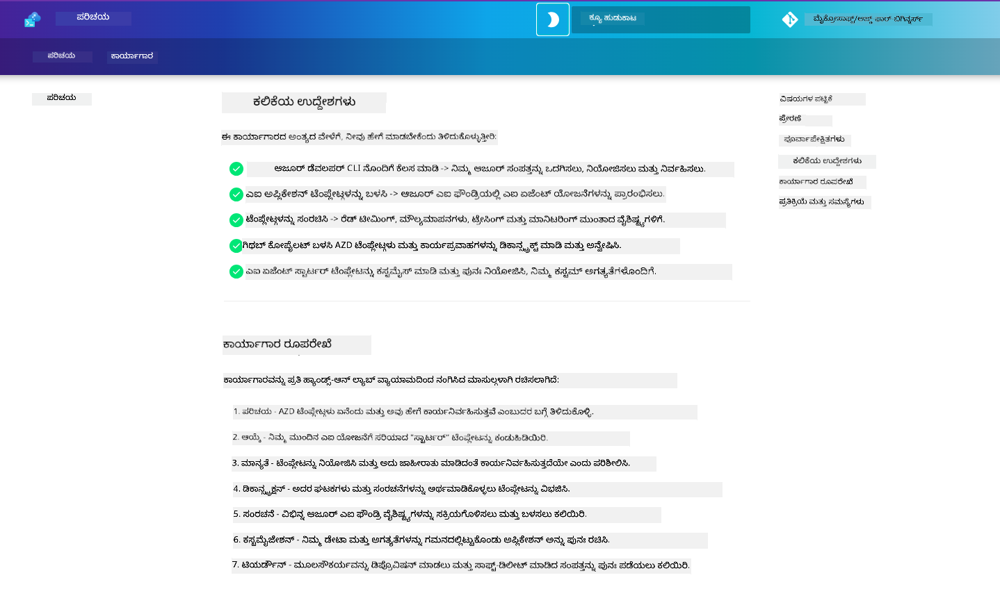

<!--
CO_OP_TRANSLATOR_METADATA:
{
  "original_hash": "390da1a5d0feb705fa0eb9940f6f3b27",
  "translation_date": "2025-11-24T22:20:16+00:00",
  "source_file": "workshop/README.md",
  "language_code": "kn"
}
-->
<div align="center">
  <div style="background: linear-gradient(135deg, #ff6b35, #f7931e); border-radius: 10px; padding: 20px; margin: 20px 0; box-shadow: 0 4px 15px rgba(255, 107, 53, 0.3); border: 2px solid #e55a2b;">
    <h2 style="color: white; margin: 0; font-size: 24px; text-shadow: 1px 1px 2px rgba(0,0,0,0.3);">
      🚧 ಕಾರ್ಯಾಗಾರ ನಿರ್ಮಾಣ ಹಂತದಲ್ಲಿದೆ 🚧
    </h2>
    <p style="color: white; margin: 10px 0 0 0; font-size: 16px; text-shadow: 1px 1px 2px rgba(0,0,0,0.3);">
      <strong>ಈ ಕಾರ್ಯಾಗಾರವು ಸಕ್ರಿಯ ಅಭಿವೃದ್ಧಿಯಲ್ಲಿದೆ.</strong><br>
      ವಿಷಯವು ಅಪೂರ್ಣವಾಗಿರಬಹುದು ಅಥವಾ ಬದಲಾವಣೆಗೊಳಗಾಗಬಹುದು. ಶೀಘ್ರದಲ್ಲೇ ನವೀಕರಣಗಳಿಗಾಗಿ ಪರಿಶೀಲಿಸಿ!
    </p>
    <div style="margin-top: 15px;">
      <span style="background: rgba(255,255,255,0.2); padding: 5px 10px; border-radius: 15px; color: white; font-size: 14px;">
        📅 ಕೊನೆಯ ನವೀಕರಣ: ಅಕ್ಟೋಬರ್ 2025
      </span>
    </div>
  </div>
</div>

# AI ಡೆವಲಪರ್‌ಗಳಿಗಾಗಿ AZD ಕಾರ್ಯಾಗಾರ

Azure Developer CLI (AZD) ಅನ್ನು ಕಲಿಯಲು ಮತ್ತು AI ಅಪ್ಲಿಕೇಶನ್‌ಗಳನ್ನು ಡಿಪ್ಲಾಯ್ ಮಾಡಲು ಕೇಂದ್ರೀಕೃತವಾದ ಪ್ರಾಯೋಗಿಕ ಕಾರ್ಯಾಗಾರಕ್ಕೆ ಸ್ವಾಗತ. ಈ ಕಾರ್ಯಾಗಾರವು AZD ಟೆಂಪ್ಲೇಟುಗಳನ್ನು 3 ಹಂತಗಳಲ್ಲಿ ಅರ್ಥಮಾಡಿಕೊಳ್ಳಲು ಸಹಾಯ ಮಾಡುತ್ತದೆ:

1. **ಅನ್ವೇಷಣೆ** - ನಿಮ್ಮಿಗೆ ಸೂಕ್ತವಾದ ಟೆಂಪ್ಲೇಟು ಹುಡುಕುವುದು.
1. **ಡಿಪ್ಲಾಯ್‌ಮೆಂಟ್** - ಡಿಪ್ಲಾಯ್ ಮಾಡಿ ಮತ್ತು ಅದು ಕಾರ್ಯನಿರ್ವಹಿಸುತ್ತಿದೆಯೇ ಎಂದು ಪರಿಶೀಲಿಸಿ.
1. **ಕಸ್ಟಮೈಜೇಶನ್** - ಅದನ್ನು ನಿಮ್ಮ ಅಗತ್ಯಗಳಿಗೆ ತಕ್ಕಂತೆ ಬದಲಾಯಿಸಿ ಮತ್ತು ಪುನರಾವರ್ತಿಸಿ!

ಈ ಕಾರ್ಯಾಗಾರದ ಅವಧಿಯಲ್ಲಿ, ಡೆವಲಪರ್ ಟೂಲ್ಸ್ ಮತ್ತು ವರ್ಕ್‌ಫ್ಲೋಗಳ ಮೂಲಭೂತ ಪರಿಚಯವನ್ನು ಪಡೆಯುತ್ತೀರಿ, ಇದು ನಿಮ್ಮ ಸಂಪೂರ್ಣ ಅಭಿವೃದ್ಧಿ ಪ್ರಯಾಣವನ್ನು ಸುಗಮಗೊಳಿಸಲು ಸಹಾಯ ಮಾಡುತ್ತದೆ.

<br/>

## ಬ್ರೌಸರ್ ಆಧಾರಿತ ಮಾರ್ಗದರ್ಶಿ

ಕಾರ್ಯಾಗಾರದ ಪಾಠಗಳು Markdown ನಲ್ಲಿ ಲಭ್ಯವಿವೆ. ನೀವು ಅವುಗಳನ್ನು GitHub ನಲ್ಲಿ ನೇರವಾಗಿ ನಾವಿಗೇಟ್ ಮಾಡಬಹುದು - ಅಥವಾ ಕೆಳಗಿನ ಸ್ಕ್ರೀನ್‌ಶಾಟ್‌ನಲ್ಲಿ ತೋರಿಸಿದಂತೆ ಬ್ರೌಸರ್ ಆಧಾರಿತ ಪೂರ್ವದೃಶ್ಯವನ್ನು ಪ್ರಾರಂಭಿಸಬಹುದು.



ಈ ಆಯ್ಕೆಯನ್ನು ಬಳಸಲು - ರೆಪೊಸಿಟರಿಯನ್ನು ನಿಮ್ಮ ಪ್ರೊಫೈಲ್‌ಗೆ ಫೋರ್ಕ್ ಮಾಡಿ ಮತ್ತು GitHub Codespaces ಅನ್ನು ಪ್ರಾರಂಭಿಸಿ. VS Code ಟರ್ಮಿನಲ್ ಸಕ್ರಿಯವಾದ ನಂತರ, ಈ ಕಮಾಂಡ್ ಅನ್ನು ಟೈಪ್ ಮಾಡಿ:

```bash title="" linenums="0"
mkdocs serve > /dev/null 2>&1 &
```

ಕೆಲವು ಸೆಕೆಂಡುಗಳಲ್ಲಿ, ನೀವು ಪಾಪ್-ಅಪ್ ಡೈಲಾಗ್ ಅನ್ನು ನೋಡುತ್ತೀರಿ. `ಬ್ರೌಸರ್‌ನಲ್ಲಿ ತೆರೆಯಿರಿ` ಆಯ್ಕೆಯನ್ನು ಆಯ್ಕೆಮಾಡಿ. ವೆಬ್ ಆಧಾರಿತ ಮಾರ್ಗದರ್ಶಿ ಈಗ ಹೊಸ ಬ್ರೌಸರ್ ಟ್ಯಾಬ್‌ನಲ್ಲಿ ತೆರೆಯುತ್ತದೆ. ಈ ಪೂರ್ವದೃಶ್ಯದ ಕೆಲವು ಪ್ರಯೋಜನಗಳು:

1. **ಅಂತರ್ಗತ ಶೋಧ** - ಕೀವರ್ಡ್‌ಗಳು ಅಥವಾ ಪಾಠಗಳನ್ನು ಶೀಘ್ರವಾಗಿ ಹುಡುಕಿರಿ.
1. **ಕಾಪಿ ಐಕಾನ್** - ಕೋಡ್‌ಬ್ಲಾಕ್‌ಗಳ ಮೇಲೆ ಹೋವರ್ ಮಾಡಿ ಈ ಆಯ್ಕೆಯನ್ನು ನೋಡಿ.
1. **ಥೀಮ್ ಟಾಗಲ್** - ಡಾರ್ಕ್ ಮತ್ತು ಲೈಟ್ ಥೀಮ್‌ಗಳ ನಡುವೆ ಬದಲಾಯಿಸಿ.
1. **ಸಹಾಯ ಪಡೆಯಿರಿ** - ಫುಟರ್‌ನಲ್ಲಿ Discord ಐಕಾನ್ ಕ್ಲಿಕ್ ಮಾಡಿ ಸೇರಿಕೊಳ್ಳಿ!

<br/>

## ಕಾರ್ಯಾಗಾರದ ಅವಲೋಕನ

**ಅವಧಿ:** 3-4 ಗಂಟೆಗಳು  
**ಮಟ್ಟ:** ಪ್ರಾರಂಭಿಕದಿಂದ ಮಧ್ಯಮ  
**ಪೂರ್ವಶರತ್ತುಗಳು:** Azure, AI ಪರಿಕಲ್ಪನೆಗಳು, VS Code ಮತ್ತು ಕಮಾಂಡ್-ಲೈನ್ ಟೂಲ್ಸ್ ಬಗ್ಗೆ ಪರಿಚಯ.

ಇದು ಪ್ರಾಯೋಗಿಕ ಕಾರ್ಯಾಗಾರವಾಗಿದ್ದು, ನೀವು ಮಾಡುತ್ತಾ ಕಲಿಯುತ್ತೀರಿ. ವ್ಯಾಯಾಮಗಳನ್ನು ಪೂರ್ಣಗೊಳಿಸಿದ ನಂತರ, ನಿಮ್ಮ ಕಲಿಕೆಯ ಪ್ರಯಾಣವನ್ನು ಸುರಕ್ಷತೆ ಮತ್ತು ಉತ್ಪಾದಕತೆಯ ಉತ್ತಮ ಅಭ್ಯಾಸಗಳತ್ತ ಮುಂದುವರಿಸಲು AZD For Beginners ಪಠ್ಯಕ್ರಮವನ್ನು ಪರಿಶೀಲಿಸಲು ಶಿಫಾರಸು ಮಾಡುತ್ತೇವೆ.

| ಸಮಯ| ಮಾಡ್ಯೂಲ್  | ಉದ್ದೇಶ |
|:---|:---|:---|
| 15 ನಿಮಿಷ | [ಪರಿಚಯ](docs/instructions/0-Introduction.md) | ಗುರಿಗಳನ್ನು ಅರ್ಥಮಾಡಿಕೊಳ್ಳಿ |
| 30 ನಿಮಿಷ | [AI ಟೆಂಪ್ಲೇಟು ಆಯ್ಕೆಮಾಡಿ](docs/instructions/1-Select-AI-Template.md) | ಆಯ್ಕೆಗಳು ಅನ್ವೇಷಿಸಿ ಮತ್ತು ಪ್ರಾರಂಭವನ್ನು ಆಯ್ಕೆಮಾಡಿ | 
| 30 ನಿಮಿಷ | [AI ಟೆಂಪ್ಲೇಟು ಪರಿಶೀಲಿಸಿ](docs/instructions/2-Validate-AI-Template.md) | ಡಿಪ್ಲಾಯ್ ಮಾಡಿ ಮತ್ತು ಡೀಫಾಲ್ಟ್ ಪರಿಹಾರವನ್ನು ಪರಿಶೀಲಿಸಿ |
| 30 ನಿಮಿಷ | [AI ಟೆಂಪ್ಲೇಟು ಡಿಕನ್ಸ್ಟ್ರಕ್ಟ್ ಮಾಡಿ](docs/instructions/3-Deconstruct-AI-Template.md) | ರಚನೆ ಮತ್ತು ಸಂರಚನೆಯನ್ನು ಅನ್ವೇಷಿಸಿ |
| 30 ನಿಮಿಷ | [AI ಟೆಂಪ್ಲೇಟು ಕಾನ್ಫಿಗರ್ ಮಾಡಿ](docs/instructions/4-Configure-AI-Template.md) | ಲಭ್ಯವಿರುವ ವೈಶಿಷ್ಟ್ಯಗಳನ್ನು ಸಕ್ರಿಯಗೊಳಿಸಿ ಮತ್ತು ಪ್ರಯತ್ನಿಸಿ |
| 30 ನಿಮಿಷ | [AI ಟೆಂಪ್ಲೇಟು ಕಸ್ಟಮೈಸ್ ಮಾಡಿ](docs/instructions/5-Customize-AI-Template.md) | ಟೆಂಪ್ಲೇಟು ನಿಮ್ಮ ಅಗತ್ಯಗಳಿಗೆ ಹೊಂದಿಸಿಕೊಳ್ಳಿ |
| 30 ನಿಮಿಷ | [ಅಧಿಕಾರವನ್ನು ತೆರವುಗೊಳಿಸಿ](docs/instructions/6-Teardown-Infrastructure.md) | ಸಂಪತ್ತುಗಳನ್ನು ಸ್ವಚ್ಛಗೊಳಿಸಿ ಮತ್ತು ಬಿಡುಗಡೆ ಮಾಡಿ |
| 15 ನಿಮಿಷ | [ಸಾರಾಂಶ ಮತ್ತು ಮುಂದಿನ ಹಂತಗಳು](docs/instructions/7-Wrap-up.md) | ಕಲಿಕೆಯ ಸಂಪತ್ತುಗಳು, ಕಾರ್ಯಾಗಾರ ಸವಾಲು |

<br/>

## ನೀವು ಏನು ಕಲಿಯುತ್ತೀರಿ

AZD ಟೆಂಪ್ಲೇಟುಗಳನ್ನು ಕಲಿಯುವ ಸ್ಯಾಂಡ್‌ಬಾಕ್ಸ್ ಎಂದು ಪರಿಗಣಿಸಿ, ಇದು Azure AI Foundry ನಲ್ಲಿ ಸಂಪೂರ್ಣ ಅಭಿವೃದ್ಧಿಗಾಗಿ ವಿವಿಧ ಸಾಮರ್ಥ್ಯಗಳು ಮತ್ತು ಟೂಲ್ಸ್ ಅನ್ನು ಅನ್ವೇಷಿಸಲು ಸಹಾಯ ಮಾಡುತ್ತದೆ. ಈ ಕಾರ್ಯಾಗಾರವನ್ನು ಪೂರ್ಣಗೊಳಿಸಿದ ನಂತರ, ಈ ಪರಿಧಿಯಲ್ಲಿ ವಿವಿಧ ಟೂಲ್ಸ್ ಮತ್ತು ಪರಿಕಲ್ಪನೆಗಳ ಬಗ್ಗೆ ನಿಮಗೆ ಸಹಜವಾದ ಅರ್ಥವಿರುತ್ತದೆ.

| ಪರಿಕಲ್ಪನೆ  | ಉದ್ದೇಶ |
|:---|:---|
| **Azure Developer CLI** | ಟೂಲ್ ಕಮಾಂಡ್‌ಗಳು ಮತ್ತು ವರ್ಕ್‌ಫ್ಲೋಗಳನ್ನು ಅರ್ಥಮಾಡಿಕೊಳ್ಳಿ|
| **AZD ಟೆಂಪ್ಲೇಟುಗಳು**| ಪ್ರಾಜೆಕ್ಟ್ ರಚನೆ ಮತ್ತು ಸಂರಚನೆಯನ್ನು ಅರ್ಥಮಾಡಿಕೊಳ್ಳಿ|
| **Azure AI ಏಜೆಂಟ್**| Azure AI Foundry ಪ್ರಾಜೆಕ್ಟ್ ಅನ್ನು ಪ್ರೊವಿಷನ್ ಮತ್ತು ಡಿಪ್ಲಾಯ್ ಮಾಡಿ  |
| **Azure AI ಶೋಧ**| ಏಜೆಂಟ್‌ಗಳೊಂದಿಗೆ ಕಂಟೆಕ್ಸ್‌ಟ್ ಎಂಜಿನಿಯರಿಂಗ್ ಅನ್ನು ಸಕ್ರಿಯಗೊಳಿಸಿ |
| **ಅವಲೋಕನ**| ಟ್ರೇಸಿಂಗ್, ಮಾನಿಟರಿಂಗ್ ಮತ್ತು ಮೌಲ್ಯಮಾಪನಗಳನ್ನು ಅನ್ವೇಷಿಸಿ |
| **ರೆಡ್ ಟೀಮಿಂಗ್**| ವಿರೋಧಾತ್ಮಕ ಪರೀಕ್ಷೆ ಮತ್ತು ಪರಿಹಾರಗಳನ್ನು ಅನ್ವೇಷಿಸಿ |

<br/>

## ಕಾರ್ಯಾಗಾರದ ರಚನೆ

ಈ ಕಾರ್ಯಾಗಾರವು ಟೆಂಪ್ಲೇಟು ಅನ್ವೇಷಣೆ, ಡಿಪ್ಲಾಯ್‌ಮೆಂಟ್, ಡಿಕನ್ಸ್ಟ್ರಕ್ಷನ್ ಮತ್ತು ಕಸ್ಟಮೈಜೇಶನ್ ಮೂಲಕ ನಿಮ್ಮನ್ನು ಪ್ರಯಾಣಕ್ಕೆ ಕರೆದೊಯ್ಯಲು ರಚಿಸಲಾಗಿದೆ - ಅಧಿಕೃತ [AI ಏಜೆಂಟ್‌ಗಳೊಂದಿಗೆ ಪ್ರಾರಂಭಿಸಿ](https://github.com/Azure-Samples/get-started-with-ai-agents) ಸ್ಟಾರ್ಟರ್ ಟೆಂಪ್ಲೇಟು ಆಧಾರವಾಗಿ ಬಳಸಲಾಗುತ್ತದೆ.

### [ಮಾಡ್ಯೂಲ್ 1: AI ಟೆಂಪ್ಲೇಟು ಆಯ್ಕೆಮಾಡಿ](docs/instructions/1-Select-AI-Template.md) (30 ನಿಮಿಷ)

- AI ಟೆಂಪ್ಲೇಟುಗಳು ಏನು?
- ನಾನು AI ಟೆಂಪ್ಲೇಟುಗಳನ್ನು ಎಲ್ಲಿ ಹುಡುಕಬಹುದು?
- ನಾನು AI ಏಜೆಂಟ್‌ಗಳನ್ನು ನಿರ್ಮಿಸಲು ಹೇಗೆ ಪ್ರಾರಂಭಿಸಬಹುದು?
- **ಲ್ಯಾಬ್**: GitHub Codespaces ಮೂಲಕ ಕ್ವಿಕ್‌ಸ್ಟಾರ್ಟ್

### [ಮಾಡ್ಯೂಲ್ 2: AI ಟೆಂಪ್ಲೇಟು ಪರಿಶೀಲಿಸಿ](docs/instructions/2-Validate-AI-Template.md) (30 ನಿಮಿಷ)

- AI ಟೆಂಪ್ಲೇಟು ಆರ್ಕಿಟೆಕ್ಚರ್ ಏನು?
- AZD ಅಭಿವೃದ್ಧಿ ವರ್ಕ್‌ಫ್ಲೋ ಏನು?
- AZD ಅಭಿವೃದ್ಧಿಗೆ ನಾನು ಹೇಗೆ ಸಹಾಯ ಪಡೆಯಬಹುದು?
- **ಲ್ಯಾಬ್**: AI ಏಜೆಂಟ್‌ಗಳ ಟೆಂಪ್ಲೇಟು ಡಿಪ್ಲಾಯ್ ಮಾಡಿ ಮತ್ತು ಪರಿಶೀಲಿಸಿ

### [ಮಾಡ್ಯೂಲ್ 3: AI ಟೆಂಪ್ಲೇಟು ಡಿಕನ್ಸ್ಟ್ರಕ್ಟ್ ಮಾಡಿ](docs/instructions/3-Deconstruct-AI-Template.md) (30 ನಿಮಿಷ)

- ನಿಮ್ಮ `.azure/` ಪರಿಸರವನ್ನು ಅನ್ವೇಷಿಸಿ 
- ನಿಮ್ಮ `infra/` ಸಂಪತ್ತು ಸೆಟಪ್ ಅನ್ನು ಅನ್ವೇಷಿಸಿ 
- ನಿಮ್ಮ AZD ಸಂರಚನೆಯನ್ನು `azure.yaml`ಗಳಲ್ಲಿ ಅನ್ವೇಷಿಸಿ
- **ಲ್ಯಾಬ್**: ಪರಿಸರ ವ್ಯತ್ಯಾಸಗಳನ್ನು ಬದಲಾಯಿಸಿ ಮತ್ತು ಪುನಃ ಡಿಪ್ಲಾಯ್ ಮಾಡಿ

### [ಮಾಡ್ಯೂಲ್ 4: AI ಟೆಂಪ್ಲೇಟು ಕಾನ್ಫಿಗರ್ ಮಾಡಿ](docs/instructions/4-Configure-AI-Template.md) (30 ನಿಮಿಷ)
- ಅನ್ವೇಷಿಸಿ: Retrieval Augmented Generation
- ಅನ್ವೇಷಿಸಿ: ಏಜೆಂಟ್ ಮೌಲ್ಯಮಾಪನ ಮತ್ತು ರೆಡ್ ಟೀಮಿಂಗ್
- ಅನ್ವೇಷಿಸಿ: ಟ್ರೇಸಿಂಗ್ ಮತ್ತು ಮಾನಿಟರಿಂಗ್
- **ಲ್ಯಾಬ್**: AI ಏಜೆಂಟ್ + ಅವಲೋಕನವನ್ನು ಅನ್ವೇಷಿಸಿ 

### [ಮಾಡ್ಯೂಲ್ 5: AI ಟೆಂಪ್ಲೇಟು ಕಸ್ಟಮೈಸ್ ಮಾಡಿ](docs/instructions/5-Customize-AI-Template.md) (30 ನಿಮಿಷ)
- ವ್ಯಾಖ್ಯಾನಿಸಿ: ಸನ್ನಿವೇಶ ಅಗತ್ಯಗಳೊಂದಿಗೆ PRD
- ಕಾನ್ಫಿಗರ್ ಮಾಡಿ: AZD ಗೆ ಪರಿಸರ ವ್ಯತ್ಯಾಸಗಳು
- ಅನುಷ್ಠಾನಗೊಳಿಸಿ: ಹೆಚ್ಚುವರಿ ಕಾರ್ಯಗಳಿಗಾಗಿ ಲೈಫ್ಸೈಕಲ್ ಹೂಕ್ಸ್
- **ಲ್ಯಾಬ್**: ನನ್ನ ಸನ್ನಿವೇಶಕ್ಕೆ ಟೆಂಪ್ಲೇಟು ಕಸ್ಟಮೈಸ್ ಮಾಡಿ

### [ಮಾಡ್ಯೂಲ್ 6: ಅಧಿಕಾರವನ್ನು ತೆರವುಗೊಳಿಸಿ](docs/instructions/6-Teardown-Infrastructure.md) (30 ನಿಮಿಷ)
- ಪುನಾವಲೋಕನ: AZD ಟೆಂಪ್ಲೇಟುಗಳು ಏನು?
- ಪುನಾವಲೋಕನ: Azure Developer CLI ಅನ್ನು ಏಕೆ ಬಳಸಬೇಕು?
- ಮುಂದಿನ ಹಂತಗಳು: ವಿಭಿನ್ನ ಟೆಂಪ್ಲೇಟು ಪ್ರಯತ್ನಿಸಿ!
- **ಲ್ಯಾಬ್**: ಮೂಲಸೌಕರ್ಯವನ್ನು ಡಿಪ್ರೊವಿಷನ್ ಮಾಡಿ ಮತ್ತು ಸ್ವಚ್ಛಗೊಳಿಸಿ

<br/>

## ಕಾರ್ಯಾಗಾರ ಸವಾಲು

ನೀವು ಹೆಚ್ಚು ಮಾಡಲು ನಿಮ್ಮನ್ನು ಸವಾಲು ಹಾಕಲು ಬಯಸುತ್ತೀರಾ? ಇಲ್ಲಿ ಕೆಲವು ಪ್ರಾಜೆಕ್ಟ್ ಸಲಹೆಗಳಿವೆ - ಅಥವಾ ನಿಮ್ಮ ಆಲೋಚನೆಗಳನ್ನು ನಮ್ಮೊಂದಿಗೆ ಹಂಚಿಕೊಳ್ಳಿ!!

| ಪ್ರಾಜೆಕ್ಟ್ | ವಿವರಣೆ |
|:---|:---|
|1. **ಕಾಂಪ್ಲೆಕ್ಸ್ AI ಟೆಂಪ್ಲೇಟು ಡಿಕನ್ಸ್ಟ್ರಕ್ಟ್ ಮಾಡಿ** | ನಾವು ವಿವರಿಸಿದ ವರ್ಕ್‌ಫ್ಲೋ ಮತ್ತು ಟೂಲ್ಸ್ ಅನ್ನು ಬಳಸಿ ಮತ್ತು ವಿಭಿನ್ನ AI ಪರಿಹಾರ ಟೆಂಪ್ಲೇಟು ಅನ್ನು ಡಿಪ್ಲಾಯ್, ಪರಿಶೀಲಿಸಿ ಮತ್ತು ಕಸ್ಟಮೈಸ್ ಮಾಡಲು ಪ್ರಯತ್ನಿಸಿ. _ನೀವು ಏನು ಕಲಿತಿರಿ?_|
|2. **ನಿಮ್ಮ ಸನ್ನಿವೇಶದೊಂದಿಗೆ ಕಸ್ಟಮೈಸ್ ಮಾಡಿ**  | ವಿಭಿನ್ನ ಸನ್ನಿವೇಶಕ್ಕಾಗಿ PRD (ಉತ್ಪನ್ನ ಅಗತ್ಯಗಳ ಡಾಕ್ಯುಮೆಂಟ್) ಬರೆಯಲು ಪ್ರಯತ್ನಿಸಿ. ನಂತರ GitHub Copilot ಅನ್ನು ನಿಮ್ಮ ಟೆಂಪ್ಲೇಟು ರೆಪೊದಲ್ಲಿ ಏಜೆಂಟ್ ಮಾದರಿಯಲ್ಲಿ ಬಳಸಿರಿ - ಮತ್ತು ಅದು ನಿಮಗೆ ಕಸ್ಟಮೈಜೇಶನ್ ವರ್ಕ್‌ಫ್ಲೋವನ್ನು ರಚಿಸಲು ಕೇಳಿ. _ನೀವು ಏನು ಕಲಿತಿರಿ? ಈ ಸಲಹೆಗಳನ್ನು ನೀವು ಹೇಗೆ ಸುಧಾರಿಸಬಹುದು?_|
| | |

## ಪ್ರತಿಕ್ರಿಯೆ ಇದೆಯೆ?

1. ಈ ರೆಪೊದಲ್ಲಿ ಒಂದು ಇಶ್ಯೂ ಪೋಸ್ಟ್ ಮಾಡಿ - `Workshop` ಟ್ಯಾಗ್ ಮಾಡಿ.
1. Azure AI Foundry Discord ಗೆ ಸೇರಿ - ನಿಮ್ಮ ಸಹಪಾಠಿಗಳೊಂದಿಗೆ ಸಂಪರ್ಕ ಸಾಧಿಸಿ!


| | | 
|:---|:---|
| **📚 ಕೋರ್ಸ್ ಹೋಮ್**| [AZD For Beginners](../README.md)|
| **📖 ಡಾಕ್ಯುಮೆಂಟೇಶನ್** | [AI ಟೆಂಪ್ಲೇಟುಗಳೊಂದಿಗೆ ಪ್ರಾರಂಭಿಸಿ](https://learn.microsoft.com/en-us/azure/ai-foundry/how-to/develop/ai-template-get-started)|
| **🛠️AI ಟೆಂಪ್ಲೇಟುಗಳು** | [Azure AI Foundry Templates](https://ai.azure.com/templates) |
|**🚀 ಮುಂದಿನ ಹಂತಗಳು** | [ಸವಾಲು ಸ್ವೀಕರಿಸಿ](../../../workshop) |
| | |

<br/>

---

**ಹಿಂದಿನದು:** [AI ತೊಂದರೆ ಪರಿಹಾರ ಮಾರ್ಗದರ್ಶಿ](../docs/troubleshooting/ai-troubleshooting.md) | **ಮುಂದಿನದು:** [ಲ್ಯಾಬ್ 1: AZD ಮೂಲಭೂತಗಳು](../../../workshop/lab-1-azd-basics)

**AZD ಬಳಸಿ AI ಅಪ್ಲಿಕೇಶನ್‌ಗಳನ್ನು ನಿರ್ಮಿಸಲು ಸಿದ್ಧರಿದ್ದೀರಾ?**

[ಲ್ಯಾಬ್ 1 ಪ್ರಾರಂಭಿಸಿ: AZD Foundations →](./lab-1-azd-basics/README.md)

---

<!-- CO-OP TRANSLATOR DISCLAIMER START -->
**ಅಸಮಾಕ್ಷಿಕೆ**:  
ಈ ದಸ್ತಾವೇಜು [Co-op Translator](https://github.com/Azure/co-op-translator) ಎಂಬ AI ಅನುವಾದ ಸೇವೆಯನ್ನು ಬಳಸಿಕೊಂಡು ಅನುವಾದಿಸಲಾಗಿದೆ. ನಾವು ನಿಖರತೆಯನ್ನು ಸಾಧಿಸಲು ಪ್ರಯತ್ನಿಸುತ್ತಿದ್ದರೂ, ದಯವಿಟ್ಟು ಗಮನಿಸಿ, ಸ್ವಯಂಚಾಲಿತ ಅನುವಾದಗಳಲ್ಲಿ ತಪ್ಪುಗಳು ಅಥವಾ ಅಸಮಾಕ್ಷಿತತೆಗಳು ಇರಬಹುದು. ಮೂಲ ಭಾಷೆಯಲ್ಲಿರುವ ಮೂಲ ದಸ್ತಾವೇಜು ಪ್ರಾಮಾಣಿಕ ಮೂಲವೆಂದು ಪರಿಗಣಿಸಬೇಕು. ಮಹತ್ವದ ಮಾಹಿತಿಗಾಗಿ, ವೃತ್ತಿಪರ ಮಾನವ ಅನುವಾದವನ್ನು ಶಿಫಾರಸು ಮಾಡಲಾಗುತ್ತದೆ. ಈ ಅನುವಾದವನ್ನು ಬಳಸುವ ಮೂಲಕ ಉಂಟಾಗುವ ಯಾವುದೇ ತಪ್ಪು ಅರ್ಥಗಳ ಅಥವಾ ತಪ್ಪು ವ್ಯಾಖ್ಯಾನಗಳ ಬಗ್ಗೆ ನಾವು ಹೊಣೆಗಾರರಲ್ಲ.
<!-- CO-OP TRANSLATOR DISCLAIMER END -->