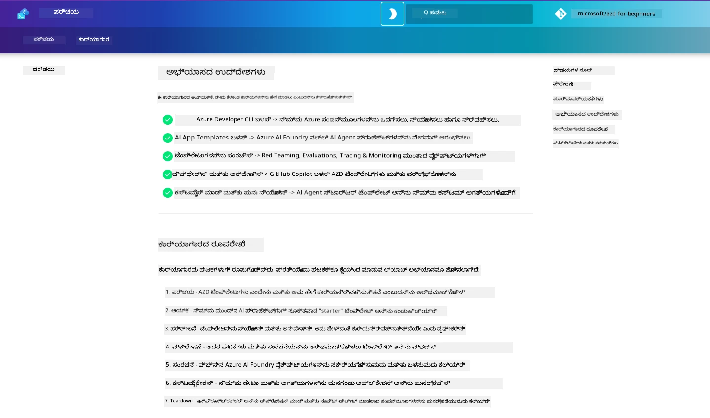

<div align="center">
  <div style="background: linear-gradient(135deg, #0078d4, #106ebe); border-radius: 10px; padding: 20px; margin: 20px 0; box-shadow: 0 4px 15px rgba(0, 120, 212, 0.3); border: 2px solid #005a9e;">
    <h2 style="color: white; margin: 0; font-size: 24px; text-shadow: 1px 1px 2px rgba(0,0,0,0.3);">
      🎯 AI ಅಭಿವೃದ್ಧಿಪಡಿಸುವವರಿಗಾಗಿ AZD ಕಾರ್ಯಾಗાર
    </h2>
    <p style="color: white; margin: 10px 0 0 0; font-size: 16px; text-shadow: 1px 1px 2px rgba(0,0,0,0.3);">
      <strong>Azure Developer CLI ಬಳಸಿ AI ಅಪ್ಲಿಕೇಶನ್ಗಳನ್ನು ನಿರ್ಮಿಸುವ ಪ್ರಾಯೋಗಿಕ ಕಾರ್ಯಾಗಾರ.</strong><br>
      AZD ಟೆಂಪ್ಲೇಟುಗಳು ಮತ್ತು AI ನಿಯೋಜನೆ ಕಾರ್ಯಪ್ರವಾಹಗಳಲ್ಲಿ ಪರಿಣತಿ ಪಡೆಯಲು 7 ಮೋಡ್ಯೂಲ್‌ಗಳನ್ನು ಪೂರ್ಣಗೊಳಿಸಿ.
    </p>
    <div style="margin-top: 15px;">
      <span style="background: rgba(255,255,255,0.2); padding: 5px 10px; border-radius: 15px; color: white; font-size: 14px;">
        📅 ಇತ್ತೀಚಿನ ನವೀಕರಣ: ಫೆಬ್ರವರಿ 2026
      </span>
    </div>
  </div>
</div>

# AI ಅಭಿವೃದ್ಧಿಪಡಿಸುವವರಿಗಾಗಿ AZD ಕಾರ್ಯಾಗಾರ

Azure Developer CLI (AZD) ಅನ್ನು AI ಅಪ್ಲಿಕೇಶನ್ ನಿಯೋಜನೆಗೆ ಕೇಂದ್ರೀಕರಿಸಿ ಕಲಿಯಲು ಈ ಪ್ರಾಯೋಗಿಕ ಕಾರ್ಯಾಗಾರಕ್ಕೆ ಸ್ವಾಗತ. ಈ ಕಾರ್ಯಾಗಾರವು ನಿಮಗೆ AZD ಟೆಂಪ್ಲೇಟುಗಳನ್ನು ಅನುಷ್ಠಾನಾತ್ಮಕವಾಗಿ ಅರ್ಥಮಾಡಿಕೊಳ್ಳಲು 3 ಹಂತಗಳಲ್ಲಿ ಸಹಾಯ ಮಾಡುತ್ತದೆ:

1. **ಆನ್ವೇಷಣೆ** - ನಿಮ್ಮಿಗೆ ಸೂಕ್ತವಾದ ಟೆಂಪ್ಲೇಟನ್ನು ಹುಡುಕಿ.
1. **ನಿಯೋಜನೆ** - ಅದನ್ನು ನಿಯೋಜಿಸಿ ಮತ್ತು ಅದು ಕಾರ್ಯನಿರ್ವಹಿಸುತ್ತದೆಯೋ ಪರಿಶೀಲಿಸಿ
1. **ಕಸ್ಟಮೈಸೇಶನ್** - ಅದನ್ನು ಪರಿಷ್ಕರಿಸಿ ಮತ್ತು ನಿಮ್ಮದಾಗಿ ಮಾಡಲು ಪುನರಾವರ್ತಿಸಿ!

ಈ ಕಾರ್ಯಾಗಾರದ ಅವಧಿಯಲ್ಲಿ, ನಿಮಗೆ ಕೋರ್ ಡೆವಲಪರ್ ಸಾಧನಗಳು ಮತ್ತು ಕಾರ್ಯಪ್ರವಾಹಗಳನ್ನು ಪರಿಚಯಿಸಲಾಗುತ್ತದೆ, ಇದು ನಿಮ್ಮ ಎಂಡು-ಟ್-ಎಂಡ್ ಡೆವಲಪ್‌ಮೆಂಟ್ ಪ್ರಯಾಣವನ್ನು ಸೌಲಭ್ಯಗೊಳಿಸಲು ಸಹಾಯ ಮಾಡುತ್ತದೆ.

<br/>

## ಬ್ರೌಸರ್ ಆಧಾರಿತ ಮಾರ್ಗದರ್ಶಿ

ಕಾರ್ಯಾಗಾರದ ಪಾಠಗಳು Markdown ನಲ್ಲಿ ಇವೆ. ನೀವು ಅವುಗಳನ್ನು ನೇರವಾಗಿ GitHub ನಲ್ಲಿ ನ್ಯಾವಿಗೇಟ್ ಮಾಡಬಹುದು - ಅಥವಾ ಕೆಳಗಿನ ಸ್ಕ್ರೀನ್‌ಶಾಟ್‌ನಲ್ಲಿ ತೋರಿಸಿದಂತೆ ಬ್ರೌಸರ್ ಆಧಾರಿತ ಪೂರ್ವದೃಶ್ಯವನ್ನು ಚಾಲನೆ ಮಾಡಿ.



ಈ ಆಯ್ಕೆಯನ್ನು ಬಳಸಲು - ರೆپೊಸಿಟರಿ ಅನ್ನು ನಿಮ್ಮ ಪ್ರೊಫೈಲಿಗೆ fork ಮಾಡಿ, ಮತ್ತು GitHub Codespaces ಪ್ರಾರಂಭಿಸಿ. VS Code ಟೆರ್ಮಿನಲ್ ಸಕ್ರಿಯವಾದ ನಂತರ, ಈ ಕಮಾಂಡ್ ಅನ್ನು ಟೈಪ್ ಮಾಡಿ:

```bash title="" linenums="0"
mkdocs serve > /dev/null 2>&1 &
```

ಕೆಲವು ಸೆಕೆಂಡುಗಳಲ್ಲಿ, ನಿಮಗೆ ಒಂದು ಪಾಪ್-ಅಪ್ ಡೈಲಾಗ್ ಕಾಣಿಸಿಕೊಳ್ಳುತ್ತದೆ. `ಬ್ರೌಸರ್‌ನಲ್ಲಿ ತೆರೆಯಿರಿ` ಆಯ್ಕೆ ಅನ್ನು ಆರಿಸಿ. ವೆಬ್ ಆಧಾರಿತ ಮಾರ್ಗದರ್ಶಿ ಈಗ ಹೊಸ ಬ್ರೌಸರ್ ಟ್ಯಾಬ್‌ನಲ್ಲಿ ತೆರೆಯುತ್ತದೆ. ಈ ಪೂರ್ವದೃಶ್ಯದ ಕೆಲವು ಲಾಭಗಳು:

1. **ಒಳನಿರ್ಮಿತ ಹುಡುಕಾಟ** - ಕೀವರ್ಡ್‌ಗಳು ಅಥವಾ ಪಾಠಗಳನ್ನು ಶೀಘ್ರವಾಗಿ ಹುಡುಕಿ.
1. **ಕಾಪಿ ಐಕಾನ್** - ಕೋಡ್‌ಬ್ಲಾಕ್ಗಳ ಮೇಲೆ ಹೋವರ್ ಮಾಡಿದರೆ ಈ ಆಯ್ಕೆಯನ್ನು ಕಾಣಬಹುದು
1. **ಥೀಮ್ ಟೋಗಲ್** - ಕತ್ತಲೆ ಮತ್ತು ಬೆಳಕಿನ ಥೀಮ್‌ಗಳ ನಡುವೆ ಬದಲಾಯಿಸಿ
1. **ಸಹಾಯ ಪಡೆದುಕೊಳ್ಳಿ** - ಸೇರಲು ಫೂಟರ್‌ನಲ್ಲಿ ಇರುವ Discord ಐಕಾನ್ ಕ್ಲಿಕ್ ಮಾಡಿ!

<br/>

## ಕಾರ್ಯಾಗಾರದ ಅವಲೋಕನ

**ಅವಧಿ:** 3-4 ಗಂಟೆಗಳು  
**ಮಟ್ಟ:** ಪ್ರಾರಂಭಿಕದಿಂದ ಮಧ್ಯಮ  
**ಮುಂದಿನ ಬೇಕುಗಳು:** Azure, AI ಸಂಪ್ರದಾಯಗಳು, VS Code ಮತ್ತು ಕಮಾಂಡ್-ಲೈನ್ ಸಾಧನಗಳ ಪರಿಚಯ.

ಇದು ನೀವು ಕಲಿಯಲು ಪ್ರಾಯೋಗಿಕವಾಗಿ ಕೈಗೆ ಇಡುವ ಕಾರ್ಯಾಗಾರ. ವ್ಯಾಯಾಮಗಳನ್ನು ಪೂರ್ಣಗೊಳಿಸಿದ ಮೇಲೆ, ನಾವು ನಿಮ್ಮಲೋ AZD For Beginners ಪಠ್ಯಕ್ರಮವನ್ನು ಪರಿಶೀಲಿಸಲು ಶಿಫಾರುಸು ಮಾಡುತ್ತೇವೆ, ಇದು ಭದ್ರತೆ ಮತ್ತು ಉತ್ಪಾದಕತೆ ಉತ್ತಮ ಅಭ್ಯಾಸಗಳತ್ತ ನಿಮ್ಮ ಕಲಿಕಾ ಪ್ರಯಾಣವನ್ನು ಮುಂದುವರಿಸುತ್ತದೆ.

| Time| Module  | Objective |
|:---|:---|:---|
| 15 mins | [Introduction](docs/instructions/0-Introduction.md) | ಪ್ರಸ್ತಾವನೆ, ಗುರಿಗಳನ್ನು ಅರ್ಥಮಾಡಿಕೊಳ್ಳಿ |
| 30 mins | [Select AI Template](docs/instructions/1-Select-AI-Template.md) | ಆಯ್ಕೆಗಳನ್ನು ಅನ್ವೇಷಿಸಿ ಮತ್ತು ಪ್ರಾರಂಭಿಕವನ್ನು ಆಯ್ಕೆಮಾಡಿ | 
| 30 mins | [Validate AI Template](docs/instructions/2-Validate-AI-Template.md) | ಡೀಫಾಲ್ಟ್ ಪರಿಹಾರವನ್ನು Azure ಗೆ ನಿಯೋಜಿಸಿ |
| 30 mins | [Deconstruct AI Template](docs/instructions/3-Deconstruct-AI-Template.md) | ರಚನೆ ಮತ್ತು ಸಂರಚನೆಯನ್ನು ಅನ್ವೇಷಿಸಿ |
| 30 mins | [Configure AI Template](docs/instructions/4-Configure-AI-Template.md) | ಸಕ್ರಿಯಗೊಳಿಸಿ ಮತ್ತು ಲಭ್ಯವಿರುವ ವೈಶಿಷ್ಟ್ಯಗಳನ್ನು ಪ್ರಯತ್ನಿಸಿ |
| 30 mins | [Customize AI Template](docs/instructions/5-Customize-AI-Template.md) | ಟೆಂಪ್ಲೇಟನ್ನು ನಿಮ್ಮ ಅಗತ್ಯಕ್ಕೆ ಹೊಂದಿಸಿ |
| 30 mins | [Teardown Infrastructure](docs/instructions/6-Teardown-Infrastructure.md) | ಸಂಪನ್ಮೂಲಗಳನ್ನು ಸ್ವಚ್ಛಗೊಳಿಸಿ ಮತ್ತು ಬಿಡುಗಡೆ ಮಾಡಿ |
| 15 mins | [Wrap-Up & Next Steps](docs/instructions/7-Wrap-up.md) | ಕಲಿಕಾ ಸಂಪನ್ಮೂಲಗಳು, ಕಾರ್ಯಾಗಾರ ಸವಾಲು |

<br/>

## ನೀವು ಏನು ಕಲಿತಿರುತ್ತೀರಿ

AZD ಟೆಂಪ್ಲೇಟನ್ನು Microsoft Foundry ಮೇಲೆ ಎಂಡು-ಟು-ಎಂಡ್ ಡೆವಲಪ್‌ಮೆಂಟ್‌ಗೆ ವಿವಿಧ ಸಾಮರ್ಥ್ಯಗಳು ಮತ್ತು ಸಾಧನಗಳನ್ನು ಅನ್ವೇಷಿಸಲು ಕಲಿಕಾ ಸ್ಯಾಂಡ್‌ಬಾಕ್ಸ್ ಎಂದು ಪರಿಗಣಿಸಿ. ಈ ಕಾರ್ಯಾಗಾರದ ಕೊನೆಯಲ್ಲಿ, ಈ ಸನ್ನಿವೇಶದಲ್ಲಿ ವಿವಿಧ ಸಾಧನಗಳು ಮತ್ತು ಸಂಪ್ರದಾಯಗಳ ಕುರಿತು ನಿಮಗೆ ಚೆನ್ನಾಗಿ ಆಂತರಿಕಬದ್ಧ ಅರಿವು ಮೂಡಿರಬೇಕು.

| Concept  | Objective |
|:---|:---|
| **Azure Developer CLI** | ಟೂಲ್ ಕಮಾಂಡ್‌ಗಳು ಮತ್ತು ಕಾರ್ಯಪ್ರವಾಹಗಳ ಅರಿವು ಪಡೆಯಿರಿ|
| **AZD Templates**| ಪ್ರಾಜೆಕ್ಟ್ ರಚನೆ ಮತ್ತು ಕಾನ್ಫಿಗರೇಶನ್ ಅನ್ನು ಅರ್ಥಮಾಡಿಕೊಳ್ಳಿ|
| **Azure AI Agent**| Microsoft Foundry ಪ್ರಾಜೆಕ್ಟ್ ಅನ್ನು ಪ್ರೊವಿಷನ್ ಮಾಡಿ ಮತ್ತು ನಿಯೋಜಿಸಿ  |
| **Azure AI Search**| ಏಜೆಂಟ್‌ಗಳೊಂದಿಗೆ ಸಂದರ್ಭ ಎಂಜಿನಿಯರಿಂಗ್ ಸಕ್ರಿಯಗೊಳಿಸಿ |
| **Observability**| ಟ್ರೇಸಿಂಗ್, ಮಾನಿಟರಿಂಗ್ ಮತ್ತು ಮೌಲ್ಯಮಾಪನಗಳನ್ನು ಅನ್ವೇಷಿಸಿ |
| **Red Teaming**| ವಿರೋಧಾತ್ಮಕ ಪರೀಕ್ಷೆ ಮತ್ತು ತಡೆಗಟ್ಟುವ ಕ್ರಮಗಳನ್ನು ಅನ್ವೇಷಿಸಿ |

<br/>

## ಕಾರ್ಯಾಗಾರದ ರಚನೆ

ಕಾರ್ಯಾಗಾರವು ನಿಮಗೆ ಟೆಂಪ್ಲೇಟ್ ಅನ್ವೇಷಣೆ, ನಿಯೋಜನೆ, ವಿಭಜನೆ ಮತ್ತು ಕಸ್ಟಮೈಸೇಶನ್ ಎಂಬ ಯಾತ್ರೆಯಲ್ಲಿ 안내 ನೀಡಲು ರಚಿಸಲಾಗಿದೆ - ಅಧಿಕೃತ [AI ಏಜೆಂಟ್‌ಗಳೊಂದಿಗೆ ಪ್ರಾರಂಭಿಸಲು](https://github.com/Azure-Samples/get-started-with-ai-agents) ಸ್ಟಾರ್ಟರ್ ಟೆಂಪ್ಲೇಟನ್ನು ಆಧಾರವಾಗಿ ಬಳಸುತ್ತಿದೆ.

### [ಮೊಡ್ಯೂಲ್ 1: AI ಟೆಂಪ್ಲೇಟ್ ಆಯ್ಕೆ](docs/instructions/1-Select-AI-Template.md) (30 ನಿಮಿಷಗಳು)

- AI ಟೆಂಪ್ಲೇಟುಗಳೇನು?
- AI ಟೆಂಪ್ಲೇಟುಗಳನ್ನು ಎಲ್ಲಿಂದ ಹುಡುಕಬಹುದು?
- AI ಏಜೆಂಟ್‌ಗಳನ್ನು ನಿರ್ಮಿಸಲು ಹೇಗೆ ಪ್ರಾರಂಭಿಸಬಹುದು?
- **ಲ್ಯಾಬ್**: GitHub Codespaces ನೊಂದಿಗೆ ತ್ವರಿತ ಪ್ರಾರಂಭ

### [ಮೊಡ್ಯೂಲ್ 2: AI ಟೆಂಪ್ಲೇಟ್ ಪರಿಶೀಲನೆ](docs/instructions/2-Validate-AI-Template.md) (30 ನಿಮಿಷಗಳು)

- AI ಟೆಂಪ್ಲೇಟ್ ವಾಸ್ತುಶಿಲ್ಪವೇನು?
- AZD ಅಭಿವೃದ್ಧಿ ಕಾರ್ಯಪ್ರವಾಹವೇನು?
- AZD ಅಭಿವೃದ್ಧಿಯಲ್ಲಿ ಸಹಾಯವನ್ನು ಹೇಗೆ ಪಡೆಯಬಹುದು?
- **ಲ್ಯಾಬ್**: AI ಏಜೆಂಟ್‌ಗಳ ಟೆಂಪ್ಲೇಟನ್ನು ನಿಯೋಜಿಸಿ ಮತ್ತು ಪರಿಶೀಲಿಸಿ

### [ಮೊಡ್ಯೂಲ್ 3: AI ಟೆಂಪ್ಲೇಟ್ ವಿಭಜನೆ](docs/instructions/3-Deconstruct-AI-Template.md) (30 ನಿಮಿಷಗಳು)

- ನಿಮ್ಮ ಪರಿಸರವನ್ನು `.azure/` ಒಳಗೆ ಅನ್ವೇಷಿಸಿ 
- ನಿಮ್ಮ ಸಂಪನ್ಮೂಲ ರಚನೆಯನ್ನು `infra/` ನಲ್ಲಿ ಅನ್ವೇಷಿಸಿ 
- ನಿಮ್ಮ AZD ಕಾನ್ಫಿಗರೇಶನ್ ಅನ್ನು `azure.yaml`s ನಲ್ಲಿ ಪರಿಶೀಲಿಸಿ
- **ಲ್ಯಾಬ್**: ಪರಿಸರ ಚರಗಳನ್ನು ತಿದ್ದುಪಡಿಸಿ ಮತ್ತು ಪುನಃ ನಿಯೋಜಿಸಿ

### [ಮೊड್ಯೂಲ್ 4: AI ಟೆಂಪ್ಲೇಟ್ ಕಾನ್ಫಿಗರ್](docs/instructions/4-Configure-AI-Template.md) (30 ನಿಮಿಷಗಳು)
- ಅನ್ವೇಷಿಸಿ: Retrieval Augmented Generation
- ಅನ್ವೇಷಿಸಿ: Agent Evaluation & Red Teaming
- ಅನ್ವೇಷಿಸಿ: ಟ್ರೇಸಿಂಗ್ & ಮಾನಿಟರಿಂಗ್
- **ಲ್ಯಾಬ್**: AI ಏಜೆಂಟ್ + Observability ಅನ್ನು ಅನ್ವೇಷಿಸಿ 

### [ಮೊಡ್ಯೂಲ್ 5: AI ಟೆಂಪ್ಲೇಟ್ ಕಸ್ಟಮೈಸ್](docs/instructions/5-Customize-AI-Template.md) (30 ನಿಮಿಷಗಳು)
- ವ್ಯಾಖ್ಯಾನಿಸಿ: PRD ಜೊತೆಗೆ ದೃಶ್ಯಾವಳಿ ಅಗತ್ಯಗಳು
- ಕಾನ್ಫಿಗರ್ ಮಾಡಿ: AZD ಗಾಗಿ ಪರಿಸರ ಚರಗಳು
- ಜಾರಿಗೆ ತಂದಿರಿ: ಸೇರಿಸಲಾದ ಕಾರ್ಯಗಳಿಗೆ lifecycle hooks ಅನ್ನು ಜಾರಿಗೆ ತರండి
- **ಲ್ಯಾಬ್**: ನನ್ನ ದೃಶ್ಯಾವಳಿಗಾಗಿ ಟೆಂಪ್ಲೇಟನ್ನು ಕಸ್ಟಮೈಸ್ ಮಾಡಿ

### [ಮೊಡ್ಯೂಲ್ 6: ಮೂಲಸೌಕರ್ಯ ತುಂಡನೆ](docs/instructions/6-Teardown-Infrastructure.md) (30 ನಿಮಿಷಗಳು)
- ಪುನರವಲೋಕನ: AZD ಟೆಂಪ್ಲೇಟುಗಳೇನು?
- ಪುನರವಲೋಕನ: ಏಕೆ Azure Developer CLI ಬಳಸಿ?
- ಮುಂದಿನ ಹಂತಗಳು: ಬೇರೆ ಟೆಂಪ್ಲೇಟು ಪ್ರಯತ್ನಿಸಿ!
- **ಲ್ಯಾಬ್**: ಮೂಲಸೌಕರ್ಯವನ್ನು ಡೀಪ್ರೊವಿಷನ್ ಮಾಡಿ ಮತ್ತು ಸ್ವಚ್ಛಗೊಳಿಸಿ

<br/>

## ಕಾರ್ಯಾಗಾರ ಸವಾಲು

ಹೆಚ್ಚು ಮಾಡಲು ನಿಮ್ಮನ್ನು ಸವಾಲು ನೀಡಬೇಕೆಂದು ಬಯಸುತ್ತೀರಾ? ಇಲ್ಲಿ ಕೆಲವು ಯೋಜನೆ ಸಲಹೆಗಳು ಇವೆ - ಅಥವಾ ನಿಮ್ಮ ಐಡಿಯಾಗಳನ್ನು ನಮಗೆ ಹಂಚಿ!!

| ಯೋಜನೆ | ವಿವರಣೆ |
|:---|:---|
|1. **ಒಂದು ಸಂಕೀರ್ಣ AI ಟೆಂಪ್ಲೇಟನ್ನು ವಿಭಜಿಸಿ** | ನಾವು ವಿವರಿಸಿದ ಕಾರ್ಯಪ್ರವಾಹ ಮತ್ತು ಸಾಧನಗಳನ್ನು ಬಳಸಿಕೊಂಡು, ನೀವು ಬೇರೆ AI ಪರಿಹಾರ ಟೆಂಪ್ಲೇಟನ್ನು ನಿಯೋಜಿಸಿ, ಪರಿಶೀಲಿಸಿ, ಮತ್ತು ಕಸ್ಟಮೈಸ್ ಮಾಡಬಹುದೇ ಎಂದು ಪ್ರಯತ್ನಿಸಿ. _ನೀವು ಏನು ಕಲಿತಿರಿ?_|
|2. **ನಿಮ್ಮ ದೃಶ್ಯಾವಳಿಯೊಂದಿಗೆ ಕಸ್ಟಮೈಸ್ ಮಾಡಿ**  | වෙනೊಂದು ದೃಶ್ಯಾವಳಿಗಾಗಿ PRD (ಉತ್ಪನ್ನ ಅವಶ್ಯಕತೆಗಳ ಡಾಕ್ಯುಮೆಂಟ್) ಬರೆಯಲು ಪ್ರಯತ್ನಿಸಿ. ನಂತರ Agent Model ನಲ್ಲಿ ನಿಮ್ಮ ಟೆಂಪ್ಲೇಟ್ ರೆಪೊದಲ್ಲಿ GitHub Copilot ಬಳಸಿರಿ - ಮತ್ತು ಅದು ನಿಮ್ಮಿಗಾಗಿ ಒಂದು ಕಸ್ಟಮೈಜೆಶನ್ ಕಾರ್ಯಪ್ರವಾಹವನ್ನು ರಚಿಸಲು ಕೇಳಿ. _ನೀವು ಏನು ಕಲಿತಿರಿ? ನೀವು ಈ ಸೂಚನೆಗಳನ್ನು ಹೇಗೆ ಸುಧಾರಿಸಬಹುದು?_|
| | |

## ಪ್ರತಿಕ್ರಿಯೆ ಇದೆಯೇ?

1. ಈ ರೆಪೋದಲ್ಲಿ ಒಂದು issue ಪೋಸ್ಟ್ ಮಾಡಿ - ಅನುಕೂಲಕ್ಕಾಗಿ ಅದಕ್ಕೆ `Workshop` ಎಂದು ಟ್ಯಾಗ್ ಮಾಡಿ.
1. Microsoft Foundry Discord ಗೆ ಸೇರಿ - ನಿಮ್ಮ ಸಮುದಾಯದೊಂದಿಗೆ ಸಂಪರ್ಕ στεಪ್ನಿ!

| | | 
|:---|:---|
| **📚 ಕೋರ್ಸ್ ಹೋಮ್**| [AZD For Beginners](../README.md)|
| **📖 ಡಾಕ್ಯುಮೆಂಟೇಶನ್** | [AI ಟೆಂಪ್ಲೇಟುಗಳೊಂದಿಗೆ ಪ್ರಾರಂಭಿಸಿ](https://learn.microsoft.com/en-us/azure/ai-foundry/how-to/develop/ai-template-get-started)|
| **🛠️ AI ಟೆಂಪ್ಲೇಟುಗಳು** | [Microsoft Foundry Templates](https://ai.azure.com/templates) |
|**🚀 ಮುಂದಿನ ಹಂತಗಳು** | [Begin Workshop](../../../workshop) |
| | |

<br/>

---

**Navigation:** [Main Course](../README.md) | [Introduction](docs/instructions/0-Introduction.md) | [Module 1: Select Template](docs/instructions/1-Select-AI-Template.md)

**AZD ಬಳಸಿ AI ಅಪ್ಲಿಕೇಶನ್ಗಳನ್ನು ನಿರ್ಮಿಸಲು ಪ್ರಾರಂಭಿಸಲು ಸಿದ್ಧರಾ?**

[ಕಾರ್ಯಾಗಾರ ಆರಂಭಿಸಿ: ಪರಿಚಯ →](docs/instructions/0-Introduction.md)

---

<!-- CO-OP TRANSLATOR DISCLAIMER START -->
ಅಸ್ವೀಕರಣ:
ಈ ದಾಖಲೆ AI ಅನುವಾದ ಸೇವೆ [Co-op Translator](https://github.com/Azure/co-op-translator) ಬಳಸಿ ಅನುವಾದಿಸಲಾಗಿದೆ. ನಾವು ನಿಖರತೆಯನ್ನು ಕಾಯ್ದುಕೊಳ್ಳಲು ಪ್ರಯತ್ನಿಸುತ್ತೇವೆ, ಆದರೆ ದಯವಿಟ್ಟು ಗಮನಿಸಿ ಸ್ವಯಂಚಾಲಿತ ಅನುವಾದಗಳಲ್ಲಿ ತಪ್ಪುಗಳು ಅಥವಾ ಅಸತ್ಯತೆಗಳಿರಬಹುದಾಗಿದೆ. ಮೂಲ ದಾಖಲೆ ಅದിന്റെ ಮೂಲ ಭಾಷೆಯಲ್ಲಿ ಇರುವ ಪ್ರತಿಯನ್ನು ಅಧಿಕೃತ ಮೂಲವೆಂದು ಪರಿಗಣಿಸಬೇಕು. ಗಂಭೀರ ಮಾಹಿತಿಗಾಗಿ ವೃತ್ತಿಪರ ಮಾನವ ಅನುವಾದವನ್ನು ಶಿಫಾರಸು ಮಾಡಲಾಗುತ್ತದೆ. ಈ ಅನುವಾದದ ಬಳಕೆಯಿಂದ ಉಂಟಾಗುವ ಯಾವುದೇ ಅರ್ಥದ ವ್ಯತ್ಯಾಸಗಳು ಅಥವಾ ತಪ್ಪು ವಿವಾಖ್ಯಾನಗಳಿಗಾಗಿ ನಾವು ಜವಾಬ್ದಾರರಲ್ಲ.
<!-- CO-OP TRANSLATOR DISCLAIMER END -->